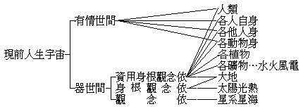
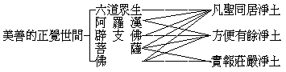
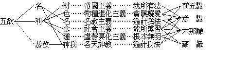
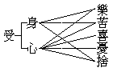
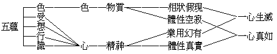
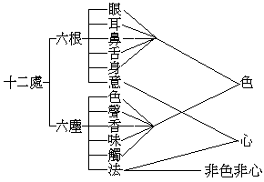
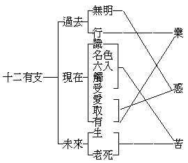
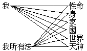

# 佛乘宗要論 [1]
（1920 年 6 月，在廣州講經會講）

## 目錄

- 緒論
    - 第一章　佛法的系統觀
        - 第一節　厭離世間的．超出世間的
            - 一　世間之名義
            - 二　世間之範圍
                - 甲　普遍的世界眾生觀
                - 乙　切近的人生宇宙觀
            - 三　出世與厭世
        - 第二節　隨順世間的．救護世間的
        - 第三節　由超出世間而救護世間的
        - 第四節　擇滅惡世以創造美善的世間
        - 第五節　吾之佛法的全系統觀
            - 一　實證一切法一心真如、達到形而上學目的
            - 二　成就圓滿的人格及圓滿的法界
            - 三　隨順無限的世界眾生、應化無盡利樂無盡
    - 第二章　佛法的自利利他觀
        - 第一節　唯佛法有真正的自利
        - 第二節　純以利他成就自利的佛法
        - 第三節　為利他故先求自利的佛法
        - 第四節　不分先後自他等利的佛法
        - 第五節　唯佛法能真正的利他
    - 第三章　佛法應化現代人心之需要
        - 第一節　佛法契理適機之原則
        - 第二節　佛法隨眾生現行的原則
        - 第三節　佛教須應時設化的需要
        - 第四節　中國民族於佛法的需要
            - 一　意盛志銳者於佛法的需要
            - 二　積迷習謬者於佛法的需要
            - 三　五族和平於佛法的需要
        - 第五節　現在人心於佛法的需要
            - 一　甯息世界的大亂源於佛法的需要
            - 二　釀造世界新文化於佛法的需要
            - 三　滿足人心安慰人心於佛法的需要
    - 第四章　佛法可說不可說
        - 第一節　佛法的法
        - 第二節　法性離言不可說
        - 第三節　為令解行成果故巧施言說
        - 第四節　轉法輪
        - 第五節　佛乘的乘
- 純正的佛法
    - 第一章　純正佛法的分類
    - 第二章　小乘
        - 第一節　小乘的宗要
        - 第二節　了生死為因
            - 一　生為苦本
            - 二　遍觀世間皆無常苦空無我不淨
                - 甲五　蘊六大十二處十八界
                - 乙三　界五趣九地
                - 丙　器世間
                - 丁　福業非福業不動業
                - 戊三　世流轉生死相續
            - 三　確知世間虛偽決志擇滅
        - 第三節　離貪愛為根本
            - 一　觀苦本之所由起
            - 二　十二有支
            - 三　我及我所有法與五利使
            - 四　俱生我愛與五鈍使
            - 五　五欲
            - 六　戒定慧三無漏學
        - 第四節　滅盡為究竟
            - 一　滅盡妙離
            - 二　辟支佛及四沙門果
            - 三　有餘依涅槃
            - 四　無餘依涅槃
        - 第五節　宗本之四諦
            - 一　四諦
            - 二　三十七菩提分
        - 第六節　小乘的內容及定義
            - 一　小乘即聲聞獨覺
            - 二　對大乘故名小乘
        - 第七節　小乘與出世出家及人天善法
            - 一　小乘祇為出世法
            - 二　小乘有出家的必要
            - 三　出家在家各有所宜
            - 四　小乘兼有人天善法
    - 第三章　大乘
        - 第一節　大乘的宗要
        - 第二節　菩提心為因
        - 第三節　大慈悲為根本
        - 第四節　方便為究竟
        - 第五節　大乘的涅槃菩提法身
        - 第六節　大乘教理行果的經論及宗派
        - 第七節　大乘的教門派
            - 一　三論宗
            - 二　唯識宗
            - 三　華嚴宗
            - 四　天台宗
        - 第八節　大乘的理門派
        - 第九節　大乘的行門派
            - 一　律宗
            - 二　蓮宗融通念佛宗時宗
        - 第十節　大乘的果門派
            - 一　真言宗
            - 二　淨土真宗
            - 三　日蓮宗
        - 第十一節　大乘的內容與定義
        - 第十二節　大乘不拘在家出家
    - 第四章　小乘與大乘之關係
        - 第一節　人天乘與小乘皆大乘方便
        - 第二節　小乘是入大乘的正方便
        - 第三節　小乘有不能通入大乘者
        - 第四節　出家本宜以小乘為大乘方便
        - 第五節　後代不宜用小乘
        - 第六節　宏法者當善巧說法之秘要
- 應用的佛法
    - 第一章　世間各教各學的批判
        - 第一節　略敘已經批判者
            - 一　純正哲學
            - 二　應用哲學
            - 三　天神教
            - 四　進化論
        - 第二節　略出今應批判者
        - 第三節　近代科學與小乘學
        - 第四節　現代哲學與大乘學
            - 一　杜威派的實用證驗哲學
            - 二　歐根的精神生活哲學
            - 三　柏格森派的直覺哲學與羅素爾派的析觀哲學
        - 第五節　現代的宗教迷謬
            - 一　鬼靈的迷謬
            - 二　數命的迷謬
            - 三　空定的迷謬
            - 四　神仙的迷謬
    - 第二章　佛乘與人世的關係
        - 第一節　佛乘與法界一切眾生
        - 第二節　在人間現證於佛乘之利益
        - 第三節　佛乘與人天善法
            - 一　人乘善法
            - 二　天乘善法
        - 第四節　人間聖賢須修證天乘善法
        - 第五節　世間善法須有出世善法為本
        - 第六節　聖者之應化不可思議
    - 第三章　佛教與中華民國的關係
        - 第一節　佛教本超脫於國族的封蔽
        - 第二節　佛教適應於國族的治化
        - 第三節　救中華民國須有藉乎佛教
        - 第四節　吾國問題即人世問題
        - 第五節　宏揚佛教須有藉乎中國
        - 第六節　佛教問題即人文問題
    - 第四章　佛教流傳於人世的現在將來
        - 第一節　佛教住持僧之整理
        - 第二節　佛教正信會之建立
        - 第三節　設施佛教的教育
        - 第四節　施行佛教的大悲救世事業
        - 第五節　佛教協會
        - 第六節　將來的佛教徒眾
- 結論
    - 第一章　歸宿
        - 第一節　信者於佛乘的歸宿
        - 第二節　歸宿佛
        - 第三節　歸宿佛法
        - 第四節　歸宿佛法僧
    - 第二章　迴趣
        - 第一節　覺者於法界的迴趣
        - 第二節　迴趣一心真如
        - 第三節　迴趣無上正覺
        - 第四節　迴趣法界有情


## 緒論

佛乘宗要論者，隨順時機以略明佛法之宗本及其綱要之論也，故一名現代佛法概論。以佛法言，本來無有三世之隔別，則現代之名亦不立，說之不如其已：然以世人思潮每依時代而變遷，近世科學發達時哲動操之以推測佛法，或更加以片面之判斷，是故今之為說，亦就世人之思潮而立其言耳。隨順真如說之，則所謂雖說無有能說可說也。緒論乃概序此論之大義，都為四章。

### 　　第一章　佛法的系統觀

系統觀者，吾人對於佛法應究其源委，明其旨趣，辨其體用，而得其全系統之觀念，不使佛法二字模糊於心也。說分五節。

#### 　　　　第一節　厭離世間的．超出世間的

佛法係「厭世的」與「出世的」二語，均為世人普通評判之辭。如西儒赫胥黎氏之天演論，大抵指佛法為厭世的；又若時人胡適之中國哲學史大綱，大抵指佛法為出世的。使有人焉執此二語以問曰：「佛法係厭世的歟否歟」？「佛法係出世的歟否歟」？是問也殊難置答，以有未決之前提在。蓋厭世的應言「厭離世間的」，出世的應言「超出世間的」，語意始能充分。然所謂「世間」者，應先有解釋之必要。

##### 　　　　　　一　世間之名義

請先言世間：世者，是遷流無常義，是虛偽無實義，可對付制伏義，可破除斷滅義。墮在此世法之中者謂之世間。何謂無常、無實、可伏、可斷？曰：一切世間物事因時因處變遷流轉，是無常義；一切物事剖析極微求其單純實體而不可得，是無實義；無常故可制，無實故可滅。然則所謂世間一切法者，唯心所現之假相耳。假相有二，一者連續相：如人以一星之火週轉成環，連續不息，見者不見此一星之火而見此環，則亦曰環耳環耳，此連續之義也。二者和合相：如人任以某一「個體物」而分析之，雖至與空為鄰而卒不能得其組合此個體者之本質。往昔物質學者以分子為物質之單位（即本質），以為得之，乃未幾而知所謂分子者實非不可分析，遂有原子之發見：則分子之分子也。又進而知此原子者亦非其小無內之實質，乃以想像而假定原子之上尚有實體，無以名之名之為電子。夫電子者、已為無臭無聲之名物，然在物質學者猶未敢斷之曰：「電子者、確為其小無內不可分析之實體，亦即宇宙萬有所因以生起之本也」。唯物之學於是窮矣。凡所有名物皆和合而有之相，此和合之說也。世間物事皆不出此二義，知此、則無常無實可伏可斷之義審矣。然而佛法中自有真常（非遷流無常）、真實（非虛偽無實）、自在（不可對付制伏）、自性（不可破除壞滅）者在。

##### 　　　　　　二　世間之範圍

世界無邊故有情（眾生）無邊，有情無盡故世界無盡，無始終、無內外。由本空故平等平等，隨心現故如幻如幻，實無範圍可言。何謂本空？曰：世間一切物事，就物質方面求之終不得其究竟故。何謂隨心現？曰：星火成環實無環體，而有環形者隨心現故。問曰：星火成環應是火現，如云本空應無所現？答之曰：此雖借火為喻，不知火已非實，若人心無差別火亦妄有，何有於環！如謂本空應無所現，則更以夢境徵之：人在夢中知有夢中之世而不知有覺時之世，然覺時之所謂宇宙萬有者夢中亦應有盡有，即覺時所不能見不能有者夢中且無所不有，當其夢也，種種境界無一非實，其夢愈深其執愈甚而其實境亦愈顯；夫此實境者、隨心現於夢時者也，世間者（宇宙萬有）、隨心現於覺時之實境也。要而言之連續相耳和合相耳。將有大覺而後知此其大夢也，眾生不知執以為實，不亦惑乎。夫世間之義如此，而眾生之心如彼，今之為說將持此如幻如幻之境歷歷而道之歟？是使聞者執著轉深也，故曰實無範圍可言。然既為之說矣，烏得無說？說之之道，亦惟就眾生心應所知量以示之。別為二種如下：

###### 　　　　　　　　甲　普遍的世界眾生觀

世界無邊，眾生無盡。今且就釋迦牟尼佛化土之娑婆世界（娑婆譯曰堪能忍苦。娑婆世界為釋迦牟尼佛應化之世界，故稱釋迦牟尼佛化土。吾人所居之地球，即此中一極小部分），略示其一斑：


```
　　　　　　　　　　　　　　　　　　　　　┌地獄趣
　　　　　　　　　　　　　　　┌五趣雜居地┤鬼神
　　　　　　　　　　　　　　　│離生喜樂地│畜生　┌星宿、神仙、天王等天
　　　　　　　　　　　　　　　│定生喜樂地│人　　│三十三天、玉皇上帝
　　　　　　　　┌有情世間……┤離喜妙樂地└天──┤時分天
　　　　　　　　│　　　　　　│捨念清淨地　　　　│知足天
　　　　　　　　│　　　　　　│空無邊處地　　　　│化樂天
　　　　娑婆世界┤　　　　　　│識無邊處地　　　　└他化自在天
　　　　　　　　│　　　　　　│無所有處地
　　　　　　　　│　　　　　　└非非想處地
　　　　　　　　│　　　　　　┌小千世界
　　　　　　　　└器世間………┤中千世界
　　　　　　　　　　　　　　　└大千世界
```


所謂有情世間者，無始不覺惑業之所由生也，生滅因緣之根依也。茲僅就九地五趣示其名相，其詳見經藏中。器世間者，有情之所依住以生活者也：一太陽系為一個小世界，積一千個小世界為一個小千世界，覆以定生喜樂地；積一千個小千世界為一個中千世界，覆以離喜妙樂地；積一千個中千世界為一個大千世界，覆以捨念清淨地。小世界每一大劫經一次成住壞空，壞由火災，火壞七次，繼由水災壞至於離生喜樂地；水壞七次繼由風災壞至離喜妙樂地；獨捨念清淨地乃不復壞。積此三千大千世界而為娑婆世界。返視吾人所居之地球其猶太倉之一粟乎？世界之成住壞空猶人之生長老死，世界自成以至於空謂之一劫，吾人自生以至於死謂之一生，以一生而較一劫，為時不太促乎！

###### 　　　　　　　　乙　切近的人生宇宙觀

以人生為本位以觀察一切，故稱切近的人生宇宙觀。




本表人類以下四項屬有情世間，各植物以下五項屬器世間。器世間所屬各物事，有為人生資用所依者，有為身根所依者，有為觀念所依者，或一或三分別表列：茲就本表逆推而前以為解釋，以便利故耳。

如星系星海，與人本無甚大之關係，僅為觀察測驗之所及，故屬於觀念依而不及資用身根二者。太陽光熱為身根觀念之所依。至大地及各礦物之水火風電以上，則為資用身根觀念所俱依。此中有情世間各項亦通於資用依，驟觀之似難索解，蓋疑本表既以人生為本位，則資用所依者必在人生之外也；不知人類互助之義即為人生資用之所依，君臣父子夫婦昆弟朋友，小而家庭，大而社會國家種族，莫不皆然：人類特其總稱耳。故人類亦為各人之器世間。

各人之自身為各人資用所依，理亦易明。即如科學家言人身一如機器，四支百體各有相當之作用：所謂呼吸器、消化器、排洩器，如是等等，無非機械之義，即資用依。則知各人自身者各人之器世間也，我之自身者我之器世間也。莊子曰：指馬之百體不得謂之馬；然則指身之百體亦不得謂之我，我果安在哉！至各他人身為人資用所依者，如以人之才力智為用是。若動物身，則或資其力或竟食其肉而寢其皮也。故以上四類雖屬有情世間，而皆可為人生資用所依。至其為身根觀念所依尤吾人日常所習見，不事辭費。故此四類者亦通於器世間也。

##### 　　　　　　三　出世與厭世

綜上所言，世間之意義及其範圍當可明了。茲請進而討論「厭離世間」與「超出世間」。夫所謂厭離世間者，其厭而離之者將謂厭此有情世間歟？抑器世間歟？憤世嫉俗離群索處，深山大澤適其所適，此世人之所謂厭世主義，其所厭而離者當為上述之有情世間，佛法無是也。以佛法言：則有情世間中無量無邊眾生，依佛慈悲，誓願救之度之利之樂之，雖在惡趣不辭應身而為化導，何得厭而離之！如謂所厭離者，係此夢幻擾濁障礙束縛之器世間耶？則學佛者初步之修證，可有是義，即謂佛法係「厭世的」亦無不可。

其次超出世間者，其所超而出者器世間歟？抑有情世間歟？吾聞之猿伸鶴屈煉丹升汞以求白日飛昇者，即世所謂出世也，是其意將欲超出此與人共處之地球而上居天國，或求比於列星；則所出者當為器世間，佛法中亦無是也。蓋器世間如幻不實已如上述，假使眾生惑業斷盡，則山河大地當下皆空，更何超出之可言！故佛法中所言出世者：謂斷煩惱、離妄業、去障礙、了生死，以超出此迷妄之有情世間，而為化度眾生之基礎。故以有情世間而論，則亦未嘗不可謂佛法係「出世的」者也。

#### 　　　　第二節　隨順世間的．救護世間的

此二語亦係世人評判佛法之言，已不似第一節所云之膚淺簡陋矣。隨順救護云者：表佛法與人相近，且慈悲願護，未嘗遠離世間。蓋已窺及大乘之道用。特其所見尚屬一偏，而未見佛法之完全系統，故進而至於第三節所云。

#### 　　　　第三節　由超出世間而救護世間的

此節所云見理較深，為說亦漸圓滿。蓋超出世間乃不自墮於世法之中而後可以言救護世間，理有固然：譬如有人與人同溺於海，是人雖有救人之心，則必先求足踏實地或置身舟中而後可，由超世而救世亦猶此義。雖然，超出世間者小乘自了之目的，救護世間者大乘究竟之方便也，不可不辨。

#### 　　　　第四節　擇滅惡世以創造美善的世間

惡劣的世間即器世間與有情世間，美（清淨）善（安樂）的世間表解於下：




凡聖同居淨土者，在此即指娑婆世界，本為九地有情之所居，而聖亦應身化導於其間，故稱同居。然凡之與聖，境界不同受用不同。九地有情，亦隨心所現隨業所受而各各不同。譬如人見水為水而有種種障礙，魚則無之。魚居水中一如人居空氣中。其餘翼而飛、足而走、身而緣、幽而潛，莫不皆由隨業受報，其理易明。方便有餘淨土，為阿羅漢及辟支佛二乘之所居，而有菩薩與佛應化於其間使之回小向大。阿羅漢即聲聞，辟支佛即緣覺，此淨土非六凡所能到。實報莊嚴淨土，此由菩薩福慧雙修莊嚴而成，而佛則應化其間使登等覺。故此淨土，更非二乘所能到矣。

本表所列，凡聖同居淨土可稱世間，此外、本是出過三界之清淨法界，非可與世間相提並論。今欲隨順世人言說故稱之曰正覺世間。至證佛果則為常寂光淨土，即身即土無復情器之礙，更不可與世間並作一談。故不列。

惡劣美善之義如此，擇滅創造將如何？曰：欲解此問題，須先知情器世間之結成由於眾生之業力，而眾生之業力則由於心之所起。是故擇滅創造云者，亦曰選擇滅除此眾生心現之業力結合而成之惡劣世間，而創造美善的正覺世間耳。然此惡劣世間與美善世間，非實有二個世間可以擇滅可以創造，又非棄置此惡劣世間而另創造一美善世間。當知世間美惡之分皆由心之染淨而別。且自真性觀之，本來平等、本來清淨、無有差別、具足美善毫無惡劣之可言。然以無始無明住地之力，迷惑熏習昏昧搖動而現種種色色之情與器；然本來雖迷而美善性之真如自在圓融周遍，未嘗或失。故今之擇滅，即擇滅無始無明住地而顯其真如心耳，今之創造，即將其本來具有之美善性顯發而充實之耳。唯此一心實無有二，故曰世間美惡之分，由心之染淨而別。維摩經謂若心清淨則世界清淨，楞嚴經謂當平心地則世界地一切皆平；擇滅創造之義，亦如是而已矣。

#### 　　　　第五節　吾之佛法的全系統觀

以上四節攝古近人對於佛法之論斷略盡，雖有深淺之殊要皆所見未圓。請進觀乎佛法的全系統。

##### 　　　　　　一　實證一切法一心真如、達到形而上學目的

一切法、即宇宙萬有，一心真如、即心之本體。宇宙萬有，為吾人差別心生滅心之所現。雖唯心現情境如夢，脫能實證皆是虛妄，正唯有圓明寂照之一心真如耳。何以故？以其無有差別無有生滅故；具足光明具足智慧故；本來平等本來圓滿故；故佛法要在實證。非如世之哲學宗教，或虛懸一的無由自達，或自為束縛愈執愈甚。所謂太極，所謂上帝，所謂天，所謂道，莫不皆然。即近世之所謂形而上學，其意亦無非欲發明宇宙萬有之本體而求得一根本解決之道，然亦徒托空言無由實證。不知唯佛法之實證一心真如乃為達到形而上學目的之不二法門也。此大乘佛法之初步。

##### 　　　　　　二　成就圓滿的人格及圓滿的法界

成就圓滿的人格者，質言之即是成佛。佛即梵語佛陀，此云覺者。覺不限於人類，一切眾生皆可成佛，故云覺者而不云覺人。法界、即常寂光淨土，圓滿法界則常樂真淨而無情器之隔，即是妙覺佛果。乃依一心真如為本因地而達到於究竟地者也。此則大乘佛法之第二步。

##### 　　　　　　三　隨順無限的世界眾生、應化無盡利樂無盡

上二項言圓滿之自利，此言佛法利他之妙用：佛法界真淨妙明無障無礙，而其應身化導於世間皆所以利樂一切眾生。隨順云者，六道眾生業力不同，二乘菩薩覺分各異，依佛慈悲願力皆能隨順之，使離一切苦得究竟樂；然而世界無邊眾生無邊，故佛之應化無盡利樂亦無盡也。此大乘佛法之第三步。圓滿自利利他，乃為佛法之完全系統。

### 　　第二章　佛法的自利利他觀

就上章第五節所言，成就圓滿的人格而知佛法之自利，應化無邊的世界眾生而知佛法之利他。但佛法所稱之利非如世間「對待的」「比較的」之利，蓋謂利他即真正利他，自利即真正自利。利者，謂由一種方法行為能得到一種「離去苦惱成就安樂」之效果的代名詞也。世間一切法不能究竟離苦得究竟樂，唯佛法能究竟離苦得究竟樂，故唯佛法能真正自利利他。餘法離苦而非究竟，則是比較的離苦，得樂而非究竟，是對待的得樂，皆非真正之利也。試就世間餘一切法觀之：




就本表觀之，知世間可稱為利者已括盡無餘，其要不出名利恭敬，而皆佛法之所應棄者，以其為依識而起之妄法也。試舉其顯明者言之，如財固可以為利，而財之大者莫如帝國主義據全球而統治之，究其實則財無論大小皆屬於前六識之我所有法，有時而盡，非究竟也。其餘均可比例而觀。茲釋佛法於世間法之擇滅修治成就：


```
　　　　┌──────┬─────────────────┐
　　　　│世法佛法之依│　佛　　　　　　　　　　　　　法　│
　　　　├──────┼─────────────────┤
　　　　│前　 五　 識│…………成所作事智　　　　　　　　│
　　　　│意　　　　識│……………妙觀察智─┐　　　　　　│
　　　　│末　 那　 識│……………平等性智─┼─一真如法界│
　　　　│藏　　　　識│……………大圓鏡智─┘　　　　　　│
　　　　└──────┴─────────────────┘
```


觀前表知世法依識而起，觀本表知佛法轉識成智而契證一真如法界。八識既轉，則依識而起之妄法（世間一切）自歸擇滅，妄法既滅乃為究竟離苦，證一真如法界而成就四智乃為究竟得樂：


```
　　　　　　┌解脫安甯樂
　　　　佛法┤覺智正遍樂
　　　　　　└法身圓滿樂
```


觀此，可知佛法離苦得樂皆在究竟。故所謂利，乃為真正之利。依於斯義，而有本章五節所說。

#### 　　　　第一節　唯佛法有真正的自利

世俗所謂自利，不過曰利我之身、利我之家、利我之國等，要皆不出我及我所有法。迷此不悟，故曉夜孜孜經危難冒萬死而不辭，以成其所謂利，然而根本錯謬，則以不知自之何在。試就物質精神面面求之不可得自，前際後際中際剎那求之亦不可得自，由是遠觀宇宙近察身心皆不可得自，自且無有則早夜膠擾以求利，試問所利者誰歟？若是而可稱自利，則雖稱之為不利可也。故唯佛法為有真自，此自乃離一切相即一切法，不生不滅，真實自在之自性。必發明乎此，乃能離世間一切苦而得佛法究竟之樂，是為真正的自利。亦「唯佛法有真正的自利」。

#### 　　　　第二節　純以利他成就自利的佛法

發菩薩心者，必以大慈悲心護念眾生，大方便力普救眾生，使之離苦得樂；必至成就無量無邊功德，而後乃證無上大菩提果。楞嚴經云：「自未得度先度人者，菩薩發心」。此以利他成就自利，故稱「純以利他成就自利的佛法」。如維摩詰經即此法門也。

#### 　　　　第三節　為利他故先求自利的佛法

普救一切眾生，願力雖大但念實施不易，唯佛法乃能具此實施之大能。為求此實施之能力故，先求自得解脫之利，故稱「為利他故先求自利的佛法」。如往生淨土諸經即此法門也。

#### 　　　　第四節　不分先後自他等利的佛法

如上所言「利他即所以自利！自利亦所以利他」；是知佛法並無後先，自他等利者也。大乘佛法大抵皆如是。

#### 　　　　第五節　唯佛法能真正的利他

他者對我之稱。我身之外，世間一切眾生皆可以「他」字概括之。然我之與他等是有情，等是世間上之分子，等是迷妄不覺，等是苦海沉淪，等是虛偽，等是無常；而世間一切名利恭敬又等是虛幻；以之自利已無效果，以之利他，等是無效果。唯佛法有真正的自利，推此自利者以利他，故亦唯佛法能真正的利他也。

### 　　第三章　佛法應化現代人心之需要

如第一章第五節所言「佛法隨順無限的世界眾生，應化無盡，利樂無盡」！吾人心中當有一種感想，即佛法之於當今之世及今人之需要者又為何如是也。本章所言即明斯義，分五節說之。

#### 　　　　第一節　佛法契理適機之原則

常理即真實之理：平等無二，本來常住，無有變異真實不虛。此非空言，特吾人迷其本性乃茫無所知。唯佛成大覺明，具大智慧，靈明洞澈，覺照圓滿，故能契合無間。且能應此常理發明而顯示之，使迷妄眾生共知共悟同登正覺。至世間法則遷流無常；因乎時分而生種種差別，眾生之心亦因之而有種種之殊異：若不隨順世間巧施言說，以應其時而投其機，則宜於此者或失於彼，合於過去而不合於現在，故佛法有適化時機之必要！夫契應常理者佛法之正體，適化時機者佛法之妙用，綜斯二義以為原則，佛法之體用斯備。若應常理而不適化時機，則失佛法之妙用；適化時機而不契應常理，則失佛法之正體。皆非所以明佛法也。

#### 　　　　第二節　佛法隨眾生現行的原則

佛者、遍法界為身，無有身相，不可思議。其發現於世間者，乃佛應身。應身隨眾生之身相而顯現。眾生之身相無量無邊，而佛之應身乃亦無量無邊，皆隨其類而應現。至佛法則平等無二，本無可說，亦無名相。換言之，即佛法之名稱亦不可得。世之有佛法流行者，亦隨乎眾生差別之心而立也。由前之說無佛可見，由後之說無法可說，佛之與法皆隨世間眾生發現流行。世間眾生染有深淺，覺有先後，種種差別，各各不同，而佛法因之亦有種種差別各各不同以應之。約言佛法為八萬四千法門。雖云繁多，而利樂眾生則一。是為佛法隨世界眾生現行的原則。

#### 　　　　第三節　佛教須應時設化的需要

依上所言，知佛教有應時設化之必要。應時設化者，佛法普度眾生之功用也，不能應時設化則失佛法之功用。不甯唯是，若不能應時設化，以發起世人之信心而昌明教義，則世人對於佛法將不得其了解。際此末法之世，眾生之心，大多昏亂，縱其毀謗，恣其戲弄，嗜欲橫流，失於正念，永沉苦海流轉生死，或墮惡趣；非特佛法因而衰落，或將有絕滅於世之憂也。

#### 　　　　第四節　中國民族於佛法的需要

佛法之應化於世，必有時分，必有方所。本節所論，以中國民族為方所，以現在為時分，而明其於佛法之需要。抑民族者有情世間也，中國者中國民族之器世間也。蓋民與土和合而成國，土為民有，自當以民為主；今言中國民族，亦當以民族為重。中國者以明民族之範圍耳。所謂需要，亦非考察往古推測將來，乃就現在狀況為說：

##### 　　　　　　一　意盛志銳者於佛法的需要

意盛志銳之人乃中國優秀分子，有才器、有作為，而國之興衰繫焉。其要在乎一國之中，必有高尚之道德，精深之學術，以範其行，以安其心，使不至突藩而馳，自就軌範，為國所賴。我國自來重道德，講性理，人皆謹於禮法，安乎分位；洎乎西學東漸，群言繁興，互相反對，互相抵斥，（此為西學之特點，其弊在於諸學分立而無最大之系統以為歸依，是以各樹一幟互不相下。）入主出奴，齗齗逞辯，充耳囂然，莫衷一是。吾國才智之士尤而效之，本其思想自由、言論自由，遂將從前藩籬一蹴而去。至於今日，道德破壞，性理淪胥，奔突放逸莫能得一新軌範以為歸依，充其思想之紛飛將不可收拾。唯有佛法廣大圓融，深奧莫窮，具清淨無上之道德，有一真不二之妙理；闢妄見真，摧邪顯正，所以浹洽人心，軌範士論，捨佛法其誰與歸！此其一。

##### 　　　　　　二　積迷習謬者於佛法的需要

吾國昔以神道設教，原所以悚駭愚頑而補刑政之不足。然而迷信漸深積習不返，奸狡之徒利而用之以為蠱惑之具，作亂之資，小則歛貲，大則欲遂其帝王思想（如黃巾白蓮等教及最近之義和團等）；擾亂社會，危害國家，莫此為甚！誠欲除其迷謬，破其邪執，使奸宄之徒失所憑借，要非佛法不為功。此其二。

##### 　　　　　　三　五族和平於佛法的需要

吾國既合漢滿蒙回藏五族，隸於同一統治權之下，而建立此統一之中華民國，就政法言之，固已立統一之形式；然而五族人民同居一國，必需求統一之精神，即統一之思想是也。思想繫乎宗教與道德。孔子之教本兼政治與道德，為吾漢族所崇奉固已數千年於茲，但在其餘各族尚未普及。謨罕默德之教僅為回族之所信仰，即今耶穌天主諸教不過少數人所奉行，均不足以容涵一切而有統一五族人民思想之能力。至若佛教，則向為滿蒙藏之所崇奉；漢族則自漢唐以來久經盛行，宋明諸儒所談性理之學尤多隱宗於佛教，近世則士夫學子知談禪理，婦人孺稚解念彌陀。以五族言，已居其四。而況佛法自來不立封域，耶教回教自可列之佛教之人天乘中。故欲謀思想統一而使五族人民有統一之精神者，尤以佛法乃能具此偉大之能力。此其三。

#### 　　　　第五節　現在人心於佛法的需要

上就中國一偶而言。本節廣其範圍，就全球人心現時狀況觀察，其於佛法之需要當有下列諸點：

##### 　　　　　　一　甯息世界的大亂源於佛法的需要

現在世界之趨勢，西歐為重，東亞較輕。即就世亂觀之，亦西歐盛於東亞。然東亞之亂，殆又影響於西歐。此無他，物質之學愈昌而逐物之心愈盛，五欲日熾如倒狂瀾，竭全球生產之力不足以供耗費。貧富之階級相差愈遠，而大多數生計問題之待解決愈急，不平之氣乃充塞宇宙。而況本其野蠻角逐之習，易為文明競爭之語，物競天擇，優勝劣敗，定為天演公例，奉為玉律金科，是以戾氣橫流莫知所屆。嗟乎！世人自作之孽，今已罹此最慘最酷之眾同分業報。然習非成是，尚無自拔之方，殆所謂無明妄動而不自覺歟！今者世人厭亂同具此心，誠欲息此亂源當探其本，亂之所起，端在人心：茍能不為形役，業力自減，我佛廣垂言教為後世眾生作將來眼，首在超越情器，實證一心真如正覺人心，此為無上妙法。吾人不幸生此五濁之世，心多散亂，正宜昌明佛法以為世界人道之正義；正義有在，即人心得有所歸宿。大亂之源，庶有豸乎！

##### 　　　　　　二　釀造世界新文化於佛法的需要

在昔世界文化為三大系：其一曰印度文化，其二曰中國文化，其三曰希臘文化。然印度文化與中國文化，於我國宋明時代已有融洽之點，遂成為東亞文化（東亞諸國如日本等之文化均由中國而輸入故），吾國三教同化由宋明來已然也。希臘文化，則演成今日之歐西文化。故以現在世界文化而言，可稱為東亞與西歐二者。然於二者之間，其可以圓攝長宙軌範寰球者誰歟？試觀歐西文化：所重者競爭，教之與教、學之與學、畛域妄分、門戶各立，甲說初出、乙必起而反對之，丙事調停、丁又從而打銷之（此歐西哲學家所自言者），是非蜂起、莫知所衷；以故人與人爭，國與國戰，而釀成今世界之大亂。以言文化，僅物質上呈一時之美觀，究其實、則歐洲一隅尚不足以自相維繫，其於世界可知矣。返觀東亞文化：教有宗本，學有傳統，人我之相不立，水火之見不生，佛言平等、儒尚禮讓、道取清靜；雖所見有通局淺深、而均欲會歸其極，故能水乳交融，翕然成化。其力足以建立世界唯一之統一大國，維持數千年於不墜，遠近鄰邦無不同化（以上均就文化言非就統治權言），廣博宏大莫可與倫，誠足以表率人群，模範世界而無遺憾。或疑歐化東漸，弱點已形，如上所言似近誇誕，不知此由大道未彰國運暫替，譬如士子未第每見凌於鄉曲惡少，何足介也。然所言東亞文化其中有不可不知者，雖三教有其通貫之處，而老莊道義語焉未詳，孔子注重世法不言性與天道，第一義諦含而未吐，皆未足以饜世人求「達到最高真理之目的」之心。唯佛法微妙無上，義深文博，學術兼備，實體緣起莫不究極，是則釀造世界新文化，有倡明佛學之必要也審矣。

##### 　　　　　　三　滿足人心安慰人心於佛法的需要

佛法之究竟妙用，在應化世界，利樂眾生；且能隨順無量無邊之世界眾生而施其無量無邊之法門，使其究竟離苦、得究竟樂。今世之人心，泛濫滂渤無所底止，沉溺苦海度脫無期，誠欲於此生死煩惱中，使一一差別不同之人心得以滿足，得以安慰，固必需乎我佛無上法門也。

### 　　第四章　佛法可說不可說

文佛應世，說法度生四十九年。臨滅度時拈花微笑，以示數十年來未說一字，我輩凡夫更有何說？此佛法之不可說。三藏十二部煌煌言教，以為末世一切眾生作將來眼，然文多義奧，淺識難窺，不假言說無由了解，此又佛法之可說。於此問題，以本章諸節說明之。

#### 　　　　第一節　佛法的法

法者，一、任持自性——謂保任執持一一法自體性相而不亡失；二、軌範物解——謂軌定範圍一切眾生的心理而起解行。佛法的法具此二義，則可說不可說問題可依此以解釋之。

#### 　　　　第二節　法性離言不可說

法性、即法之第一義。法之相性，惟佛究竟明證，唯佛究竟了知，悉皆真故。又一切言說假名無實；假故不能顯真，故法性離言不可說。

#### 　　　　第三節　為令解行成果故巧施言說

如上節言法性離言不可說，則知可說者必非法性。故雖比量以示之，因喻以明之，無非善巧施設之方便，以為言說：只可就眾生之心理，軌定範圍，而令其解理起行成果耳。此即法之第二義。巧施言說故未嘗不可說。

#### 　　　　第四節　轉法輪

我佛說法，謂之轉法輪。輪者，一、如碾米的輪，能摧破研除於糠秕，喻佛法能破除五住煩惱（三界見惑，欲界思惑，色界思惑，無色界思惑，及無明為五住煩惱）。二、如舟車的輪，能通行往達於境域，喻佛法能行達四德涅槃（常樂我淨四德）。三、如日輪、月輪、地輪、水輪、風輪的輪，以八方上下周圓充實為義：喻佛法之性德圓滿，法身常住。轉者，謂使眾生有所改轉：或始迷而今悟，或始染而今淨，或始苦而今樂，總之，使轉凡成聖。法輪者：或依第一解，使眾生借以破五住煩惱；或依第二解，使眾生乘之以達四德涅槃；或依第三解，以表佛法之性德圓滿。

#### 　　　　第五節　佛乘的乘

乘者，車乘之乘，就佛菩薩依以運載之法以為喻也；乘舟之乘，就佛菩薩能運載於法以為喻也。佛乘之乘，通此二喻，皆以「運載」為義。一、從「無明位」運載至「大覺位」，理教乘也；二、從「有漏雜染位」運載至「無漏清淨位」，行教乘也；三、從「生死苦位」運載至「究竟樂位」，果教乘也。

佛乘者，佛法應化眾生所發、為解理起行成果之妙用也。隨順眾生根性樂念不同，應用無量，不墮諸數。約其大齊以言，或說三乘五乘，（五乘者，謂人乘、天乘、聲聞乘、緣覺乘、菩薩如來乘。三乘者，則於五乘之中簡除人天二乘。大乘起信論別說言之極詳，可以參考）。皆佛法之妙用，故統之曰佛乘也。

## 純正的佛法

佛法本不可說，更不可分類為說，茲則因言遣言，權假方便，但使說者易達，聞者易明，非可執為定論。且分為純正的佛法、應用的佛法以說明之。純正的佛法者，從佛法一方辨其悟理修行之事，而未及其與人間之關係，都分為四章。

### 　　第一章　純正佛法的分類

聞解之教理不同，修證之行果有異，而佛法有大乘小乘之別。小乘者，功在自了，純為超出世間的，其說略見序論。大乘則功在度世，故為超出世間而又適應世間的。茲先說小乘，分七節說明。

### 　　第二章　小乘

#### 　　　　第一節　小乘的宗要

小乘為超出世間的，必先將一切世間之法打破。欲求打破，必先了知。已了知而打破，然後可得解脫，其主要之點在是。

#### 　　　　第二節　了生死為因

了有二義，曰了知、了脫，此則由了知而求了脫也。如平盜然，必先了知盜之所在，及其人數多寡，內容如何，如是種種明晰無餘，然後盜可得而平。了生死亦復如是。本節所言，即觀察一切世法而得真確之了知也。

##### 　　　　　　一　生為苦本


```
　　　　　　┌貪 瞋 等 煩 惱本┐
　　　　生為┤殺盜淫妄等惡業本├────故生為苦本
　　　　　　└病 老 死 等 苦本┘
```


生之最初相為得命，故亦稱生命。乃推其源，則由過去世無明業力妄動而來。既生而有身，則所以保衛維持之者無所不至，直接之需求則求衣食住，間接之需求則金錢等動產及不動產業。從流而下貪欲叢起，則權利威勢隨之，又再擴張，則欲據此大地為己有。一有不得轉成瞋恚，得而患失尤見愚癡。由此貪得無厭不能自己，殺盜淫妄任意造作。及至業力已成又種未來之因，而成異熟之果；以致生生相續無有已時，業繫苦相永無斷絕。無非以生為本，而病老死等尤其著者。故小乘之第一步，即當了知此「生」實為眾苦之本也。

##### 　　　　　　二　遍觀世間皆無常苦空無我不淨


```
　　　　　　┌一切法無我………………………統一切位法
　　　　　　│一切心行無常……………………心法心所有法
　　　　遍觀┤自他一切身不淨…………………色法
　　　　　　└身心一切受是苦…………………心所有法
```


此中空與無常二義已見上章。又除空義外即四念住，而次序稍移。茲先釋不淨，即觀身不淨。淨、是美好之義，吾人習有此身，固已愛而不知其惡。然以小乘正念觀之，自始至終無可美者。身之最始厥為住胎，父精母血和合而成，殆無淨美可言。及至出世糞穢時遺，涕尿交流，亦無潔淨。繼而長大，體態端好，容光煥發，似可美矣；然而詳審諦視，外則汗液垢膩沐浴不去，坐令巨萬微虫晝夜齧膚，內則五辛雜投葷濁備蓄，自內而外，無可淨美。其似可美者，僅此泡影色塵，自誑眼識，而況惱人暮景轉瞬即至，則並此似美之泡影，不能久持。血氣內衰，精神暗損，髮蒼齒落，肌瘦膚黃，百病叢生，而有四大將散之兆矣。及至壽煖識盡，顏色先變，肌膚次之，膿血雜流，筋骨灰散，茍云有餘，絕非淨美。是知吾人色身，從始有至於滅盡，皆為不淨。推自及他無不皆然。而世之寶愛色身，不惜自起煩惱造作惡業者，誠無謂矣。

苦、即觀受是苦。受、即感受義，兼通於身心。依俗諦言，身有樂受、苦受、捨受，心有樂受、苦受、喜受、憂受、捨受。捨者、不苦不樂不憂不喜也。如下：




夫受為五十一心所法之一。眾生之受，實唯是苦無有喜樂。蓋因無明妄動而生，念念變遷，時時流動，無非趣向無常而行，完全是苦。雖依俗言有樂受、喜受，然均係對待之辭，能令苦與憂暫時休息，則名之曰樂曰喜，不知一轉念間，其苦更甚。譬之人有疥癩，以手搔之暫止痛癢謂之為樂，一停手間加以紅腫，其苦益甚。

無我、即觀法無我。我具四義：曰、獨一個體，曰、真實非假，曰、常恆不變，曰、自有主宰。四義具足，謂之有我，茍缺其一，我義不成。試舉人言，有個體，又似有主宰矣，而真常之義萬難成就。蓋人由精神物質和合而成，剎那剎那遷變流轉，又視業力久暫，即便壞滅。由是推自及他，從人至物，有情無情，乃至木石瓦礫，小而勺土，大而地球，顯而萬用，微而萬法（世間出世間一切生滅不生滅法），一一求之，皆無我義，是故無常苦空無我不淨諸義，遍於世間一切所有。茲再分目言之：

###### 　　　　　　　　甲五　蘊六大十二處十八界




本表於色法物質下，則註明相狀乃假現，而體性本空寂，於心法下，則註明業用乃幻有，而體性本真實。物質上假現之相狀，與精神幻有之業用，則屬一心生滅；物質上空寂之體性，與精神上真實之體性，則屬一心真如。了證此義，本屬大乘事，而非小乘智之所及，因論及此故並列之。

又色心二法並舉，則世間一切法皆破矣。下表均同。

蘊乃藏義、積義、聚義，言非一法故。亦謂之陰，陰乃障蔽義，能陰覆真如法性故。其名則色蘊、受蘊、想蘊、行蘊、識蘊。此中色蘊屬色法，即物質；餘四蘊屬於心法，即精神。心法分四而色法僅一者，蓋對迷執於精神深、迷執於物質淺之人，而破其我見故。譬如有人執著有我，其初必在色法指其身體為我，如是則可問之曰：爾執身體是我，將謂四肢、百骸、五官、九竅、六腑、五臟、皮膚、血液、筋絡、神經，如此等等一一是我耶？抑謂其一是我其餘非我耶？一一是我則我非一，其一是我其餘非我則身不存在？如是此人必瞠目結舌不能對。而後喻之曰：身體者，眾法和合之假相耳（上就空間觀察下就時間觀察）。且人自生而有身、而嬰兒、而孩提、而幼稚、而壯大、而衰老、乃至於死，此身乃年變月化日遷時異而剎那不同，念念不息，夫過去者已往，將來者未至，現在者不住，如此種種將執何者為我耶？其不能對一也。喻之曰：此連續之假相耳。

又如此人已知物質方面無我存在，乃轉執精神為我。其執精神之心且較物質為深，則可以心法一一破之。受即感受，為心所法之淺顯者，最易執著。假如此人作是語曰：身體非我，此感受之知覺當是我矣？喻之曰：受有樂苦喜憂捨，為樂受喜受是我耶則苦與憂受非我，苦受憂受是我耶則喜與樂受非我，捨受是我耶則苦樂憂喜諸受俱非我；如云俱是我則成多我，是皆不可能。不知受乃心境相對之作用，現在過未剎那不住，離此作用受無自體，不可執為我也。假如是人又進而執想為我：想謂思想，所以取名相、辨道理、明是非，如是之心，非我而誰？喻之曰：想者，外受名色，內含義理，而為心之影相，其所緣在六塵境界，不可執以為我。如依色塵而辨青黃赤白，依聲塵而辨高低大小，依香塵而辨清濁濃淡，依味塵而辨酸鹹苦辣，依觸塵而辨冷煖滑澀，如是不可執一是我，更不可執一一俱是我。假如此人又進而執行為我：行者，謂有意志而發於行為，是主宰在我，當可稱為我矣？喻之曰：行有善惡無記等類，如云有我，不應或善、或惡、或為無記。離此種種，不名為行。且人之行為類多無記，良由不覺衝動即見諸行，善惡未暇自辨。故行有行動遷流義，忽此忽彼義，蓋假和合連續之假相而立名，實則無自體性。又如此人已知受想行不可執著為我，乃轉而求此受想行所由起之精神自身謂之為我，則識是也。此識當指第六意識而言，已達近世心理學最深之域。所謂有意識無意識一語，即云有無主宰。換言之、即我是也。不知意識內依末那為依，外依前五識為用，其所分明了知，全在五塵落謝影子，既無體性何可執為我耶？是故物質精神皆為無我，我之意義，不過對待稱謂之假名。如我對人曰我，人亦自稱曰我，猶東與西相對立名，非有一定之處所而可謂之為東與西也。


```
　　　　　　┌─地────┐
　　　　　　├─水────┤
　　　　六大┼─火────┼─色
　　　　　　├─風────┤
　　　　　　├─空────┘
　　　　　　└─識──────心
```


上之五蘊、色法一而心法四，此言六大、色法五而心法一。蓋對迷於物質深、迷於精神淺之人以顯一切法無我之義，當機說法之妙用也。大者、周遍義。世界一切法皆不出乎此，故云六大。地者堅質、水者流質、火者熱力、風者動力，火與風又謂之氣質，空者、無處不遍，除地水火風體質之外皆為空，空為眼識所見，又為人生感覺之觸法；五者本無體相，皆為吾人心中分別之境界、思量之境界，而分別思量此境界之具，則謂之識。識何以名大？因地大、水大、火大、風大、空大，故識亦大。凡有地水火風空之處，識亦隨之，故謂之大。世間一切法除礦物等只有五大而無識外，一切有情皆具六大。故六大能包括世間一切法而無遺。仔細考察，則知世間一切法只有六大而無我，而六大之中亦復無我。




處即處所，即十二種體相所依止之處。如表分色法十一、心法二者，蓋六塵中之法兼通於色心故。十二種名茲不細解，但所謂根者具有二義：一、曰所依託，二、曰能生長；譬如眼根、為眼識之所依，又能生長眼識也。塵者亦有二義：一、變礙搖動，如微塵之塵；二、汙濁心性，如塵垢之塵。世間一切法依十二處觀察之，只有十二處而無我，十二處中亦無我。


```
　　　　　　　　　　　　　　┌─五根─────┐
　　　　　　　　┌─六根──┤　　　　　　　　│
　　　　　　　　│　　　　　└─意根───┐　│
　　　　　　　　│　　　　　┌─五塵─┐　│　├色
　　　　十八界─┼─六塵──┤　　　　├─┼─┘
　　　　　　　　│　　　　　└─法塵─┘　│
　　　　　　　　└─六識─────────┴──心
```


界謂界別，云十八界亦舉世間一切法皆盡之。分心法八、色法十一、以法塵兼通於心色故，茲不細論。蓋所以對治精神物質兩迷俱深者，觀察結果亦無有我。以上所言五蘊、六大、十二處、十八界，皆所以觀世間一切法無我：由無我而推知其皆為無常、苦、空、不淨，既得了知當得了脫。本來無有，尚何貪愛之足云。

###### 　　　　　　　　乙三　界五趣九地


```
　　　　　　　　　　　　　　　　　　　　　　　　　　┌地獄
　　　　　　　　　　　　　　　　　　　　　┌琰魔王界┤
　　　　　　　　　　　　　　　　　　　　　│　　　　└餓鬼
　　　　　　　　　　　　　　　　　　　　　│　　　　┌畜生
　　　　　　　　　　　　┌地居………小三界┤金輪王界┤
　　　　　　┌有形有欲界┤　　┌時分　　　│　　　　└人類
　　　　　　│　　　　　└空居┤知足　　　│　　　　┌神仙
　　　　　　│　　　　　　　　│化樂　　　└釋天帝界┤
　　　　　　│　　　　　　　　└他化　　　　　　　　└天類
　　　　　　│　　　　　┌離生喜樂位……初禪天
　　　　三界┤有形無欲界┤定生喜樂位……二禪天
　　　　　　│　　　　　│離喜妙樂位……三禪天
　　　　　　│　　　　　└捨念清淨位……四禪天
　　　　　　│　　　　　┌空無邊處天
　　　　　　└無形無欲界┤識無邊處天
　　　　　　　　　　　　│無所有處天
　　　　　　　　　　　　└非非想處天
```


三界本名欲界、色界、無色界，以其意不甚明顯，今特新定三名：曰有形有欲界、有形無欲界、無形無欲界，此三界為世間一切正報之大類。有形有欲界者、五趣雜居地也，有形質、有物欲、故曰有形有欲，人類亦在其中。有形無欲界者、其形清淨微妙、其心則無有物欲，常在禪定之中，故亦謂之禪天，離生喜樂位、定生喜樂位、離喜妙樂位、捨念清淨位、四者居之。由此界更進一步，則有無形無欲界、形質皆空，心靜恆一，生之者有空無邊處天、識無邊處天、無所有處天、非非想處天。

五趣即地獄、餓鬼、畜生、人、天、五類。地獄餓鬼屬琰魔王界，凡受惡報之眾生墮於地獄餓鬼之中者，琰魔王管轄之。琰魔王（即閻羅王）者責罰王也。畜生人類屬金輪王界，所謂人間世也。神仙天類屬釋天帝界，所謂天界也。此琰魔王界、金輪王界、釋天帝界，三者又曰小三界，皆未出乎地輪之外故曰地居，即六道眾生之所居。地居之外又有空居，已不在此大地，一曰時分、二曰知足、三曰化樂、四曰他化。時分者、太陽之光亦不能到，其時分則以自身光明天華開合別之；知足者、即兜率天，五欲淡薄，稍有所得已覺滿足，而其味最妙最好，故曰知足；化樂者、其所受用皆隨心應念變化而有；他化者、其受用皆由共同業變化而有。地居空居雖分別而言，實則只一五趣雜居地耳。

九地者、地即地位義、等級義。有形有欲界居其一位，無欲有形界中四位，無欲無形界中四位，凡九位。自五趣雜居地至非非想處天之九種地位，遞進遞高，特未至出世間地位耳，故曰九地。僅存其名、茲不具論。

###### 　　　　　　　　丙　器世間

器世間者，一切有情之依報也。第一章已詳細說明茲不重贅。依正二報皆是苦報：五蘊六大十二處十八界者，所以集起此果報之法體也；三界五趣九地之有情世間，及大千之器世間者，所集成之果報體也。云何皆苦？則以五蘊六大十二處十八界，觀察結果皆無我故，皆虛偽不實故，皆無主宰故。

###### 　　　　　　　　丁　福業非福業不動業

福業應得福報，如受天人神仙正報之類；非福業應得惡報，如墮惡趣而受地獄餓鬼畜生等正報之類；不動業則得禪定果報，如受二地乃至九地諸正報之類。要皆隨業受報，故有依正三界等果報。果報無常，有時而盡，故為有漏因果，皆因未出輪迴，未得究竟離苦故也。

###### 　　　　　　　　戊三　世流轉生死相續

過去、現在、未來、謂之三世。眾生依於過去之業故受現在之果報，依於現在之業故（或兼過去之一分）受未來之果報，如是流轉生死不斷。中間或善或惡福非福等，均由自作自受。要皆輪迴於三界五趣九地之間，以取分段生死，循環相續無有已時。眾生迷謬不能自覺，我佛垂慈特為道破，吾人聞此，可不警然起行以求解脫而趨登佛地乎。

##### 　　　　　　三　確知世間虛偽決志擇滅

世間之義盡於上節所言，當可確實了知矣。使世間而有一毫可貪者、貪之可也，使世間而有一毫可愛者、愛之可也；乃究其極，無非無常苦空無我不淨，則擇滅之志有何而不決耶。

#### 　　　　第三節　離貪愛為根本

上節以了生死為因、從悟理言，本節以離貪愛為本、從修行言。夫人自有生以至於死，凡可以直接間接於生者，未得則貪、既得則愛、固無日不昏迷沉淪於貪愛之中，而不能自拔。其或貪而不得則瞋隨之，愛而勿失其癡轉盛，是貪愛誠煩惱之源、生死之門也。小乘之法既在斷除煩惱生死，或以離貪愛為根本之用功處也。試分別言之：

##### 　　　　　　一　觀苦本之所由起

如上節言生為苦本，誠以三界五趣九地三千大千娑婆世間一切諸苦，皆因妄業而生。一切妄業，皆因不明本空無我之妄心而起，妄心衝動故有三世流轉，生死相續輪迴不息。欲明斯義，請就下列各項釋之。

##### 　　　　　　二　十二有支

本表十二有支之「有」，即指三界五趣九地器世間一切所有。支即支分，謂一切所有生死流轉皆因此十二支分循環不息，故曰十二有支。亦即生死流轉之因緣，故亦名十二因緣。茲就三世以解釋之：




眾生於過去世迷理迷事無明所作善惡業行，一一蘊藏於第八阿賴耶識而不自知，是即過去時代之迷惑。過去、前世死時昏迷不覺，唯是「無明」冥然存在，死後忽然衝動（此如忽然動念即習慣之業力也）名之為「行」；行者動義，蓋即過去世之業染，發而為行，則將受生矣。現在入胎初僅有「識」，此即第八阿賴耶識，蓋因過去世無明衝動之行轉引而生，是為現在世有生之始（世俗謂靈魂轉生投胎也）。有「識」乃有「名色」，名色者、胎藏也，名屬於精神，色屬於物質，是精神與物質凝結成胎身。復有「六入」，即六根全矣。「觸」則出胎時與外界感觸也。有觸矣則有身心諸「受」，苦、樂、憂、喜、捨等是也。自識至受五者皆為現在世之苦報。至此身心已備又起「愛」著，因愛著而生執「取」，曰愛曰取，即為現在世之迷惑。何以故？愛取皆以我為準，以有我故順我逆我之情心生，而身口意三業隨之。由是又加以根本不覺之精神為田，而以善惡諸業為種子，播種於田稻即隨生，名之曰「有」。故「有」者，現在世之業染也。如是復以愛取為無明（同是惑迷故），以有為行（同是業染故），而取未來之生死；未來之苦報，亦與現在同。蓋未來之生，亦由識而名色而六入而觸而受，其義不異。

於此所當知者：則現在之生，因於過去之無明（即愛取）與行（即有），未來之生，必因於現在之愛取（即無明）與有（即行），故欲了脫生死必先斷除愛取，愛取既斷則有不生，惑迷業染俱無，則是已絕未來生死之因而得涅槃矣。故斷愛取為了生死之下手處，即本節言離貪愛為根本之意。非然者，十二因緣循環不斷，生死相續無有已時，言念及此不禁悚然！

##### 　　　　　　三　我及我所有法與五利使




本表所列一一可謂之「我」，亦一一可謂之為「我所有」。不過範圍大小，與夫或在精神或在物質之不同，蓋皆隨心分別，原無一定，以為如是則如是耳。故知我及我所有法，皆為妄執。此中所言天神乃外道所執，或亦執之為神我。意謂一切皆屬虛偽，惟修證神我始為真實。

五利使、亦名五種邪見邪執，即身、邊、邪、見、戒五者。使即使用、如工具然。利者、言由後起，如刀口之利從磨治而生。喻此五種邪見本非與生俱來，多由習慣思想語言文字及社會上種種教訓而有。分釋於下：

身、謂身見：吾人無論對人對物均見其有「個體」存在，故謂之身見。譬如茶杯，吾人先見有此「一個」茶杯，而後云此杯顏色甚美、花紋甚精、磁料甚細，如是一一皆視為此茶杯之附屬物；不知此杯本為一一物和合而成，若離此一一物無有杯體存在。又如一人，吾人必先有此「一個」人之見，而後論此人之相貌魁梧、耳目聰明、支體強健，精神充足，思想高尚，如是不論精神上物質上一一之物皆視為此人所有；不知此人實即一一物和合而成，若離此一一物此人已不存在。此種邪見，謂之身見。邊謂邊見：乃因身見而起，依上所云身見之妄，則必推究此「個體」之死後是斷滅乎？抑有不斷滅者在乎？對此問題，其一、則唯物論者謂人死斷滅，略謂精神乃附於身體諸物質之動作，無異於由物質上所起之能力，人死即是物質之能力不起，而物質亦化，故云斷滅，此為斷見。其二、則精神論者謂人另有精神之個體存在，如世俗相傳之靈魂不因身體之死而遂滅，且常存在，此種謂之常見。此二說執常執斷，更有執非常非斷、亦常亦斷，如此種種皆是落於一邊，故謂之邊見。近世哲學，亦皆依此身見邊見而立也。邪即邪見：上云身邊亦均為邪見，然以撥無一切因果罪福之邪見特著，故另列之，亦即不正見也。見、即見取：執己所見之理不知其非，而興無謂之鬥諍是。戒、即戒取：依謬見所持之戒禁以自束縛，而為無益之勞苦，如印度持牛戒者學牛行，持狗戒者效狗走，以為可以得道之類。

##### 　　　　　　四　俱生我愛與五鈍使

貪、瞋、癡、慢、疑，五者為五鈍使。鈍對利言。利如刀口、鈍如刀身，利則易除，鈍則難斷。此五者，除疑、大抵皆與生俱來，故云俱生我愛，亦云俱生我執。上五利使為主之十使，亦稱分別我執。分別我執者，因分解義理而起之謬；使能除謬而明正理則其執斷，故為易除。俱生我執亦即俱生身見，則自有生即有之，至阿羅漢始能斷盡，故為難斷。貪即貪欲，瞋即瞋恚，癡即愚癡，慢即驕慢，疑則不正信。

##### 　　　　　　五　五欲

財、色、名、食、睡，五者為人類之五欲。人能出家則五欲已斷其三，只有食睡二者，故具緣較在家為勝也。雖然，在家之人苟能不貪非利，不犯邪淫，不好虛譽，不求甘旨，不為過量之睡眠，則亦不妨菩提路也。

色、聲、香、味、觸，五者為欲界眾生所共之五欲，皆為愛貪之所由起。本節言離貪愛為根本，首當離五欲。誠能不為五欲之所沾染，則得超過欲界或得須陀洹果矣。

##### 　　　　　　六　戒定慧三無漏學

上言所離之貪愛，此言離貪愛之方法在三無漏學。三無漏學亦曰三增上學，雖通於大小乘以至究竟，但在小乘尤為顯要，惟視所修之深淺耳。戒所以離五欲；因戒生定，則可以伏諸我執令其不起；因定生慧，慧者真智也，則可以斷一切邪執矣。如濁水然，定有澄清之功，而慧有去滓之力也。

#### 　　　　第四節　滅盡為究竟

究竟者，作事至於圓滿完成之謂。小乘之究竟在於滅盡，即本節第一項之滅、盡妙、離。小乘於此，所作已辦，乃證取涅槃果矣。

##### 　　　　　　一　滅盡妙離

滅、謂滅一切煩惱，盡、謂盡生死有漏之業，離、謂解脫三界九地諸苦，妙、謂妙應真常，即證無生法性妙智而與真常契合相應也。此舉小乘究竟之事。

##### 　　　　　　二　辟支佛及四沙門果

此言小乘之果位。辟支佛譯獨覺，謂其不必從佛聞法，能依自力而得覺悟也。亦稱緣覺，則因其觀十二因緣得覺故名。沙門、乃出家之通稱，其事則勤修戒定慧，息滅貪瞋癡，故實為佛出家弟子之通稱，而小乘中之聲聞眾也。聲聞、以其聞佛之聲音得覺而立名。合聲聞獨覺二者，謂之二乘。獨覺係僅有者，故言小乘重在聲聞。其果有四，謂之四沙門果：初、須陀洹，即預流果；謂其豁破邪迷、明見道真、超出生死預於聖流也。二、斯陀含，即一來果；業報未盡仍須一來人間。三、阿那含，即不還果；住色界天不還人間。四、阿羅漢，即無生果；乃小乘最高果位，到究竟涅槃即得圓滿寂滅也。

##### 　　　　　　三　有餘依涅槃

雖得涅槃仍有餘報為依（如身體仍在是），謂之有餘依涅槃。涅槃者，寂滅也。雖曰有餘依，但已具戒定慧三無漏學，而解脫一切生死煩惱；且有解脫之真正知見，即無生智盡智，決無更起生死故云涅槃。

##### 　　　　　　四　無餘依涅槃

遺棄身心而入滅度，一無所依，惟有真常妙性，謂之無餘依涅槃。如阿羅漢於滅度時入滅受想定，從之起十八種變化，最後以慧火自化其身而入滅度是。滅受想定謂受想已滅常在定中。此與無想定不同，無想定僅伏前六識之想念令其不起，不出人天三有中；而滅受想定則非出世聖者不能得也。

#### 　　　　第五節　宗本之四諦

宗本者、根據也，主要也。小乘之主要根據在四諦，故稱宗本之四諦。

##### 　　　　　　一　四諦

四諦者：「苦」謂世間一切果報之苦，如生、老、病、死、求不得、怨憎會、愛別離、五取蘊等。苦從何生？曰集，集、即和合生起義，謂苦非一法所生，乃由煩惱妄業因緣和合而有，故稱曰「苦集」。集為因而苦為果也。知苦之為煩惱妄業集合而有，則知欲了生死須斷煩惱染業，煩惱業滅生死亦滅，故稱之曰「苦集滅」。然而滅之必有能滅之方法，故進而求「苦集滅之道」。於後二諦，又以道為因而滅為果也。諦者，即「真理」義。

##### 　　　　　　二　三十七菩提分

此三十七菩提分即上所言之苦集滅之道，亦即小乘之三十七功德。四念住、已見本章第二節，四正勤、本文自明，言正勤者揀於不正之精勤（如戒取之類）。如意足者，力能進行之謂。五根五力者，根謂根幹，力謂能力，五者名相相同。蓋具此五種淨善之根幹而後發為能力，有根幹故不為一切法所轉，有能力故能轉一切法。覺支、即覺之支位。聖行、謂從真理以起行，揀於不正之行而言。

#### 　　　　第六節　小乘的內容及定義

本章所言之小乘，係純對佛乘以言小，聞者不可因名小而小之。茲故舉其內容及定義：

##### 　　　　　　一　小乘即聲聞獨覺

本論所云小乘之內容為聲聞乘與獨覺乘二者，又稱為二乘。其果位已超出三界不落人天，非世間所傳之上生天堂、與白日飛昇等諸有漏因果所能擬其萬一！不可輕視。

##### 　　　　　　二　對大乘故名小乘

此明小乘之定義乃對大乘佛法而立此小乘之名，非就世間法而言也。若就世間法言，則小乘已大不可及；何以故？以世間一切善因福業皆有漏故，皆無常而有盡故。

#### 　　　　第七節　小乘與出世出家及人天善法

本節就出世出家及人天乘諸點，以觀察小乘之法而明其體用。分四項說：

##### 　　　　　　一　小乘祇為出世法

小乘純為超出世間的佛法。對於世間因果甚為明了，如本章各節所言觀察世間一切所有法，六道輪迴、三世流轉、生死因緣、乃至我執邪見情欲等，無不一一透徹明晰無餘。惟其目的純在出世，故觀察結果均為解脫之方便。譬如了知生死煩惱一切之法皆不出乎因果，則必從果尋因明其所自，然後將因解脫使不發生，此為小乘之不二法門，故祇為出世法。

##### 　　　　　　二　小乘有出家的必要

欲明小乘與出家之關係，須先明小乘果位。小乘分聲聞獨覺二乘而所重仍在聲聞，以四沙門果為果位。就四果言之：其初二三猶在半途，至四果阿羅漢始為極果。但至三果則已斷貪欲，故知非不出家者所易成辦[2]。夫出家之義謂捨離眷屬與財產，二者均我所有法；出家之廣義則謂捨離一切我所有法。在家者我所有法未捨，其所證不出初二三果，若出家者依法修習即可以證最高果位，故謂小乘有出家之必要也。且小乘之特質有二，其一、則限於天人類：此謂天人類以外如諸惡趣無小乘法，故比丘比丘尼極重戒律，戒律強半屬於人事；又如心不決定、六根不全、及有精神病者不能出家皆是。其二、則一生成辦：此謂今生即得證果。故比丘比丘尼須年在二十以上，父母許可或已故、而無障礙者，始得依法受持戒律、修習禪定、由聞思修而生真慧，得聖解脫。即此世今生便得證果是也。

##### 　　　　　　三　出家在家各有所宜

出家所宜者：因出家之人，一方面、則勤修戒定慧，息滅貪瞋癡以自利；一方面，則住持佛法，攝化眾生而利他。如教中言：「佛子住持，善超諸有，嚴淨律儀，弘範三界！」住持佛法，攝化眾生，故須有出家分子，佛法乃得不隨世變國變而轉。蓋出家者，唯依我佛遺制嚴守清規，無論世變如何，所有律儀不能更改。是故僧眾之相、在於離俗持戒（威儀具足），僧眾之德、在於修行弘法，此皆出家者對於佛法所有事也。在家人之所宜者：一曰、持戒行善，二曰、布施護法。了知因果業報，嚴持五戒修行十善為己福業，免墮惡趣或生天類以為自利；又行布施，以為利他。布施有三，曰財施、法施、無畏施——以己之財資人之生，或捐助一切慈善公益皆為財施；宗依佛法，以語言文字教化他人皆為法施；救人之危，拯人於難，或以種種方便使人離於疾病痛苦（如紅十字會醫院等），皆無畏施。此皆在家信奉佛法者所有事也。

##### 　　　　　　四　小乘兼有人天善法

依上所言，在家者之所宜多在人天善法。蓋因小乘佛法本有階梯：其一、因人生無常，而輪迴六道不能預定，再世而後未必能保其身，故須廣種善因，對治惡果。是以修行人天善法斷除惡業，惡業既無自無惡報，超出三惡之上常在人天，其權實操在己。其二、人天善法雖種善根，縱成天仙未離欲界，故須修習禪定為增上緣，則可離欲而生色無色界。其三、人天三有未了生死，福業雖高有時而盡，定力雖固有時而銷，必證無生（阿羅漢果）始超三界。以上三者，一則以善度惡，二則以禪度欲，三則以無生而度三界生滅；能行其一可保善根，一二兼行常居天界，三者圓滿了脫死生。而小乘之體用備。故小乘兼有人天善法也。

### 　　第三章　大乘

上章說小乘。本章說大乘佛法，分十二節於下。

#### 　　　　第一節　大乘的宗要

大乘佛法，為超脫世間而又適應世間的。則其宗要：在先有超脫世間的大覺悟，而後以護念眾生的大慈悲、施其適應世間的大方便。其說如下。

#### 　　　　第二節　菩提心為因

菩提即覺義，因即種子，言可依之以得果故。此所云覺，非世間覺，如理想等；蓋謂靈明洞徹寂照圓滿之妙真如性，即首楞嚴經所謂獲本妙心，唯識宗所謂真唯識性。是故非心外得，即心當體，所謂不生不滅之本覺真心。悟此真心，則自己與萬有鎔融一性，四相俱無，我法皆空。心經云，「依般若波羅密多故、得阿耨多羅三藐三菩提」。蓋依大智慧，而得澈底根本究竟之大覺悟也。

#### 　　　　第三節　大慈悲為根本

眾生迷妄，非大慈悲無以度之。慈使得樂，悲使離苦，菩薩普修十度萬行皆為枝幹花葉，唯大慈悲心乃為根本。大慈悲者，乃由上節所言發明之真覺，見物我同體自他平等而興。非如世間由於我愛，所謂家國社會，大至人類，皆依我愛之關係而生。依我則有質礙有形對，故有時與我不相容者，則不愛隨之以起，非大慈悲也。如耶教侈言博愛，而與回教不相容，故戰爭數百年殺人數千萬。依其教義固無不愛之言，然而戰爭殺人斷難名愛，非其言行相違，實其所言之愛以我為依故耳。佛法慈悲：要在人我之相澈底已無，故自他之對待不起，依平等智發同體悲，自利利他無二無別！乃為佛法大慈悲義。

#### 　　　　第四節　方便為究竟

方便二字，解有多義：其一、方謂方法，便謂便利，即以方法而求便利義。其二、謂善巧，善乃善能之善（如善於語言善於文字等），巧即適當。其三、謂權巧，權即經權之權，故必德有餘而後可行權巧。又方可訓為方位、方所，即空間一一處。但言空間，則時間之關係必相連而著，換言之即世界。便訓便宜、便利。故方便可繹為隨順世界利導眾生之便宜法門。其最簡義則可以一妙字釋之，所謂不可思議也。大乘佛法，必先之以菩提心，繼之以大慈悲，而後始成方便。故知方便者，佛果位上之妙用，神通、三昧、辯才、智慧等等胥在乎是；倘無大慈悲心以為根本，則方便或非利樂眾生之用矣。須知方便之義：全在利樂眾生（非自利）！故可稱為大乘之究竟。由是可知大小乘究竟之義有不同之點：小乘之究竟惟在取得無餘涅槃，所謂滅盡是；大乘之究竟則在隨順世間（方）利樂眾生（便），盡於未來方便無盡。

#### 　　　　第五節　大乘的涅槃菩提法身

大乘的涅槃有四：一者、本性淨涅槃，二者、無住處涅槃，三者、無餘依涅槃，四者、有餘依涅槃。前二不與小乘共，後二雖共而不同。一、本性淨者，謂一切法不生，即本不生滅之心真如體。二、無住處者，譬如小乘既了生死則住於不生不死，一若靜水保持其常靜；大乘不然，無所凝住，謂依大慈悲行大方便，現八相利益眾生——所謂從兜率天退、入胎、住胎、出胎、出家、成道、轉法輪、入於涅槃是也。三、無餘依者，謂五住究盡，二死永空，不起應化，不現他受用身，本不生滅，本無一切相，故云無餘。四、有餘依者，非同小乘有餘身體依於夙業，此謂菩薩報身、盡亦無盡，不盡亦盡，大乘起信論所謂「身有無量色，色有無量相，相有無量好，常能住持，不失不毀」者是也。

菩提者，覺也。菩薩因地修行，由始覺之名字覺、相似覺、分證覺、以至究竟覺、乃至唯一平等真覺，實即本覺非由外得。成唯識論所謂轉識成智：以在凡有迷有染則謂之識，在聖唯淨唯善則謂之智，實則無二無別本來平等。即此真覺，覺行圓滿，則為無上正等正覺。

法身者，法、謂智慧慈悲方便等。身、謂依持。為智慧慈悲方便等之所依持者，名為法身。即此一真如心具足無量稱性功德之淨法，一名如來法身功德之藏，一名一真法界，皆依一心耳。

#### 　　　　第六節　大乘教理行果的經論及宗派

大乘之宗派甚多，可以教、理、行、果、四門歸納之。別之為教門之宗派，理門之宗派，行門之宗派，果門之宗派。

教之狹義，即謂言教。所重者在於經論之言文，名身句身文身等。而教之廣義，則包括律儀制度行為等為言。今取狹義，謂能詮表乎義理，依此而能轉迷成悟、轉惡成善、轉染成淨、轉苦成樂、轉凡成聖、轉眾生成佛故。理者、教之所詮，隨諸文言分別，若千若萬乃至無量；但即其真際，則一道清淨，一理平等，離言說故。行、乃依理起行，自此達彼如行路然。理惟平等，行有漸次，一步二步一里二里乃至萬里，凡夫成佛亦復如是。其位次：則有十信、十住、十行、十迴向、以至登地，已成果矣，果未圓滿故仍進行，一地二地乃至十地而登等覺、妙覺、覺行圓滿獲成就故。果者、謂理虛玄，果則充實：理以起行，行以成果，果則事事圓融而理亦全顯，唯真實故。以上四者，教、即經法，理、即真菩提心平等不二，行、即大慈悲而起十度萬行，果、即萬德圓滿，一味無礙，依大慈悲而起方便善巧妙用也。

四門宗派各有經論為所宗本。各經論中於此四門平均周圓無所偏倚為人所習知，而最流通者，以大佛頂首楞嚴經及大乘起信論為最能提綱挈要而有完全系統。茲就印度、中華、日本所倡立之各大乘宗派，分釋於下。

#### 　　　　第七節　大乘的教門派

教門派皆依言教為宗，以經論為主要法門，藉以闡發學說，究明義理。又以所顯之義各有主要故，而有各宗如下：

##### 　　　　　　一　三論宗

三論宗亦稱大乘空宗，一名般若宗，一名四論宗，一名法性宗。言三論者，以其主要之論為中論、十二門論（均龍樹菩薩造）、及百論（龍樹弟子提婆造）故；後加大智度論名四論宗。又以所依教義大都依於般若，如大般若經、金剛經、般若波羅密多心經等，故又名般若宗。其所顯為大分空義，故亦名大乘空宗。如法性宗所明一切法一相無相。金剛經所言「凡所有相，皆是虛妄」；又「若見諸相非相即見如來」。三論法門以破為顯，即破一切法而顯一切法之性，且並佛法中一切法亦破之。大佛頂首楞嚴經前三卷，破妄心、妄見、妄法、而顯妙性無相，亦同此旨。

##### 　　　　　　二　唯識宗

此宗依於言教、以顯三性三無性一切法真如之理。其立說則曰三界唯心，萬法唯識，故名唯識宗。其主要者為成唯識論，此論係唐三藏法師玄奘糅譯所成，宗本之經論甚多，故其義廣而理博。亦稱法相宗，以諸法之法相通明，則一相無相之法性見：所謂恆沙煩惱與夫無量功德總在心源，但轉識成智即為妙行。故此宗雖重言教而意在明理起行；一切世出世間之法，剖析無餘。

##### 　　　　　　三　華嚴宗

華嚴宗、以大方廣佛華嚴經為主要，即依此經為宗本而立教義，故名華嚴宗。至唐法藏法師發揮光大而此宗大盛，當代君主贈法師以賢首之名，故又名賢首宗。實則此宗開自杜順，乃為第一祖師，二祖為智儼，三祖始為賢首。於論則有天親菩薩所造之十地論，唐李棗柏大士所造之華嚴合論，其義雖有出入，而所宗均在華嚴經。至四祖清涼國師著有華嚴經玄談、疏鈔二書，五祖圭峰禪師著有圓覺疏鈔，皆此宗所奉持。其最精之教義，即「因該果海，果徹因源」二語。其所重則在依果顯行，從行證果，自十信乃至等覺妙覺共分五十二位次，乃為佛果成就。此其大略也。

##### 　　　　　　四　天台宗

上來三項、三論宗依言教破相以顯性（破法相顯平等無相真如法性），唯識宗明理以起行，華嚴宗從行以證果；至本項天台宗則明佛果上應化之妙用。天台、山名，六朝時智顗大師住持此山，此宗遂發揚光大，倡立成就，故依其所居名為天台宗。然智顗實此宗第三祖，當代君主贈號智者（大智度論有一切智者之語故），故亦稱智者大師。天台依法華經為主要教典。其所發明者，謂佛應現世間，其初則為實施權，終則開權顯實。為實施權者；實是真埋，唯佛自證，不帶名言，而眾生迷謬不得不施以權巧，故說人天善法二乘因果使歸於正。開權顯實者：則由聞法之人善根成就，或植福業或證小果，均非究竟．故又開示前之權巧方便因機故說，非可執著以為究竟；使其迴小向大而真理以顯，真理既顯則權巧方便均成妙用矣。綜上四宗，而大乘教門派之教理行果以備。

#### 　　　　第八節　大乘的理門派

理門派唯在直顯真理，不假經論一切言教，但以參悟一心真如體性為本，所謂以心為宗，以無法門為法門，即禪宗是也。在印度此派居最少數，中國自唐宋後盛行一時，派別甚多，今則唯存臨濟、曹洞二宗，餘如法眼、雲門、溈仰各宗，均已寥落。日本禪宗，更有由中國明末傳去之黃檗宗（黃檗有二，此係明代之黃檗），奉持者亦頗有人。

臨濟宗、惟主參悟，參悟後亦不論行法，惟在行人自得。曹洞則參悟後仍重行持修證。稱臨濟者、因此宗為唐時臨濟義玄禪師（黃槃弟子）所倡，故以地名宗。曹洞均山名，曹山、係洞山弟子，此宗即曹洞師徒所倡，不名洞曹而名曹洞者，習慣然耳。

我國宋明時此理門派最盛，幾以禪宗代表佛法，禪宗以外似無餘派。推其普遍昌盛之理：則以唐末武宗皇帝滅佛，各派均被摧殘，雖末期年唐武宗死各派復興，而當時天下大亂經典遺失，僧眾散避，恢復不易。獨有禪宗，既不必依於經教，而山中林下二三同道即可互相參究，簡而易行，此其一。禪宗不講經論深微奧妙之義理，但求悟得本來真心，即悟得亦無詳實之說明，間有一二簡單表示亦不離通俗之言行，此則最合中國人向來之心理，是以宋明理學強半帶有禪義，此其二。有此二因，故能普遍全國極一時之盛，即各派漸次復興有賴於禪宗之力亦不少，可知中國禪宗於佛法流傳之功非淺鮮也。

#### 　　　　第九節　大乘的行門派

行門派重在行持，即專以修行為法門，而不注重明教悟理。其主要之宗派有二，一曰律宗，二曰蓮宗。

##### 　　　　　　一　律宗

律為三藏之一，由釋迦佛制定，為皈依者行為之標準。而律宗專以修持行儀為先，非特嚴守所受戒律，且一切行動務求合乎威儀。戒律通於大小乘，但大乘律包括一切，故可以攝小。律之要義約有四分：一、作，二、止，三、持，四、犯。作謂造作，如本未受戒今則依法受戒，前惡依法懺悔，犯則依法又懺，故云作。止謂止息，不應作者（如十惡等）止之，止之精義在不作，持律嚴謹則無明妄想均止而不作，故云止。持有二義，一者、持捨，二者、持取。惡則捨而勿有、曰持捨，善則取而勿失、曰持取，故皆曰持。犯謂行為之不合，要在明犯不犯，故云犯。凡此四義，通於大乘小乘一切律儀而為行為之規範。

五乘律，即人乘、天乘、聲聞乘、獨覺乘、菩薩乘之戒律。人乘律為五戒，殺、盜、邪淫、妄語、飲酒。天乘律則戒殺、盜、淫（此身三業，若在家者受十戒可改淫為邪淫），惡口、兩舌、妄言、綺語（此口四業，較人乘妄語為詳），貪、瞋、癡（此意三業，人乘之戒飲酒亦同此意、以能令人神智昏迷故）。聲聞乘律，均出家修行者所受戒，沙彌與沙彌尼同。唯比丘二百五十戒，比丘尼三百餘戒則不同。獨覺乘律同於聲聞。菩薩乘律，則通行梵網律之五十八戒（分十重四十八輕）。又如纓絡經菩薩本業品，優婆塞戒經，及瑜伽師地論菩薩學處等。

一乘律，非謂離五乘而另有一乘，謂即以梵網律四十八輕戒十重戒，為一大乘菩薩律。何則？人乘律所以適乎人之道德，較為高超者則為天乘律，兼出世法者則為二乘律，至大乘菩薩律則可以歸納之連貫一致，融合不二，故云一乘。其立義分三：一、消極的，謂嚴持一切律儀以離過絕非，二、積極的，謂收集一切善法以為道德行為，上二自利的；三、利他的，不論自利與否，總以眾生有利則極端行之，所謂以大慈悲為根本，惟在利他也。大乘律有此三義。依此三義，則一以貫之耳。

##### 　　　　　　二　蓮宗融通念佛宗時宗

蓮宗即淨土宗。言淨土者，因西方有極樂世界極為莊嚴清淨，一切往生者無不由蓮花化生，故稱為淨土。中國盛行，晉時已有之，慧遠禪師倡結蓮社，一時稱盛，故又稱為蓮宗。此宗主要之經有三，曰、無量壽經，阿彌陀經，觀無量壽佛經。大概三經不說精微學理，只說距此娑婆世界甚遠之外有極樂世界，其中有佛曰阿彌陀佛，發弘誓願度盡無量無數無邊眾生，若有信念彼佛者即得往生。其要重在行持，不必教理，除正念專持外，應遍行一切世出世間之善法以為輔助。念佛法門約有三種：一者、念佛功德，心念彼佛有無量功德，三明六通禪定智慧；二者、觀相念佛，觀佛身相及左右菩薩相好，觀佛世界莊嚴安樂；三者、持名念佛，即依無量壽經稱佛名號。此其要者。

日本此宗之盛，一如中國之禪宗，其派別之多亦如之。如鎮西分為八派，西山亦分多派（未詳），要皆中國所傳承而未改，故應並歸蓮宗。其另立宗派則有融通念佛宗、時宗、淨土真宗三者。但淨土真宗已非復行門派（見下果門派），茲先釋上二者：

融通念佛宗、此宗為日本良忍上人所倡，謂彼於念佛時阿彌陀佛現身語之曰：「一人念一切人念，一切人念一人念」。此意蓋謂自己念佛，並非自己一人，乃世間一切人均念佛，所謂自他不二也。既倡此義，則極力主張，廣為傳佈，故立融通念佛宗。但自他不二之義中國亦有之，特未提出專主，如人臨死時請人念佛以為之助，即融通之意耳。時宗者、謂平常時與臨終時之念佛，其立義謂臨終時能念佛則得往生，而平常時之念佛但為預備。依於此義而生二要：一、要平常時念佛與臨終時同，此意蓋平常念佛時想臨終情況則心懇切乃可為將來之預備，否則臨終時必不能念；二、要臨終時念佛與平常時同，此意蓋謂臨終時念佛不可心慌意亂，必同於平常之從容自然始為有效而得往生。上述諸念佛法門，所重均在修行也。

#### 　　　　第十節　大乘的果門派

果門派、謂依佛果福智圓滿之身土，加持自己現住之身土而作教化眾生之法門。故此法嚴密充實，離於言說理解也。略有三宗：

##### 　　　　　　一　真言宗

此即密宗，以持咒為法門。謂一切顯教，皆係菩薩他受用身應化世間，隨順眾生根機巧施言說，錄成文字，實非真法。獨此宗大日等經及諸咒語乃為佛果上之真法，其中名句文身教義行修而成功德一一俱真，故名真言。又諸咒所說乃佛自證自覺之真法，非天人二乘菩薩之所知，以不知故謂之為密，實則非密，若能持誦觀想至成佛即能自知。咒文之最流通者為大悲咒，餘不詳載。咒之所以不能解者，即佛果上自證之功德法性，但以梵音表之耳。持咒之要在三業相應，如身手之形式必與口誦一一符合（如大悲咒等各有法印）；而且心觀梵字（如唵字㘕字等）謂之觀想。印、言、字、與身、口、意、三者一致，則能受佛加持，即身成佛，而宣演真理矣。

##### 　　　　　　二　淨土真宗

此宗亦日本人所倡，雖以淨土三經祖釋為根本教義，但與上列之淨土各宗注重念佛觀佛者不同。此宗所憑唯有「信」之一字，其所信者亦為阿彌陀佛，而其解釋則謂非靠自力，純依他力，即此信願亦承佛力所與。故其教義全與其他淨土宗異，蓋亦純以佛果上之功德為依，與密宗相類，故列入果門派。此宗倡自日僧親鸞，賜號見真。

##### 　　　　　　三　日蓮宗

日蓮宗者，倡自日人日蓮，故以其人名宗。其源實出於天台別派，昔智者大師將法華經第五卷前後分為二門，前為跡門，後為本門。本門所言，略謂釋佛應化人間數十年，而其成佛已在無量數時代以前，即阿難尊者、舍利弗、大目犍連等亦不足為釋佛弟子，蓋另有從地湧出之菩薩上行、大行等始為釋佛弟子。日蓮取以立宗，不依其他理教，唯以專念大乘妙法蓮華經（但取久已成佛之本門）一語為法門，實即依佛果地一切善功德也。

#### 　　　　第十一節　大乘的內容與定義

茲釋大乘佛法之內容有二義：一者、尊上殊勝，以非無善根者凡夫人天二乘所能了知，唯菩薩為能了知故；二者、博大普遍，以無論五乘世出世間一切善法均皆包容，如百川匯海故。其定義、則大乘起信論所謂：依一心真如示摩訶衍體，依一心生滅而顯有體大相大用大；一切諸佛本所乘故，一切菩薩皆乘此法到如來地故。

#### 　　　　第十二節　大乘不拘在家出家

大乘佛法是否必需出家修行，向多異論。實則在家出家均所不拘，唯在發心與行為耳。行為合於律儀，又能發大慈悲心，即為大乘佛法。非如小乘，不出家者不能證四果也。試又舉戒律言之，小乘、則在家者只能受優婆塞優婆夷等戒，出家者、則有沙彌沙彌尼比丘比丘尼等戒，逈然不同；大乘則無論在家出家均受梵網菩薩戒，是故彌勒等固因出家而得果，而維摩詰等亦得以在家而成聖，此其例也。

### 　　第四章　小乘與大乘之關係

前二章分說大小乘佛法，其義已可明了。然大乘可以容納小乘，而小乘可為大乘之方便，互有關係。茲就本章說之。

#### 　　　　第一節　人天乘與小乘皆大乘方便

大乘自初發心以至登地，必經若干階位。如十信位之皈依三寶，修行十善，即人天乘法，亦即大乘之初階，故人天乘為大乘之方便。自十信進七住為不退住，其所修習則與二乘相通，故聲聞獨覺乘亦即大乘之方便。如由十住進至十行、十迴向、十地，則非人天二乘所能及矣。

#### 　　　　第二節　小乘是入大乘的正方便

上言小乘之宗要有三，而大乘之宗要亦三，兩相對照，則知小乘之宗要為入大乘之方便門，要以能悟為轉移耳。試列於下：


```
　　　　　　　　┌了生死──既空生死進破無明即證───菩提心┐
　　　　小乘宗要┤離貪愛──不依我見更離法愛則起───大慈悲├大乘宗要
　　　　　　　　└滅　盡──報業惑障既盡而得神通自在即─方便┘
```


#### 　　　　第三節　小乘有不能通入大乘者

文佛應世，初說惟小乘法，原以人為無明所障，迷卻如來藏妙真如性，故先說生滅法，令其解脫。就其智之所及，力之所能，由此修行本生即證四沙門正果，故其所說未為究竟。而小乘之人既聞佛法，以觀察五蘊六大十二處十八界之結果而了知無我，破其我執，顧我執雖破法執隨起，執為有法、又為法迷，以有法執故不能通入大乘。非法之不通，執則不通，若去此執即大乘矣。

#### 　　　　第四節　出家本宜以小乘為大乘方便

小乘修行本以出家為宜，亦以出家為易，緣殊勝故。故出家者，本宜先修小乘之法，及已成辦，然後迴小向大以入大乘，是為順序。何則？小乘修行初則持戒，戒清淨故則可以六根不放逸，一心得清淨，因戒而生定，加以多聞佛法，即由定而生慧。具足三學，修證四果，然後按程而進，三心同發，則向之了生死、離貪愛、與滅盡轉而為菩提、慈悲、方便之大乘心矣。故以小乘為入大乘之方便，為出家者所宜也。

#### 　　　　第五節　後代不宜用小乘

前節所云，修行順序以由小乘入大乘為宜。然吾國自唐宋以來，古德前賢鮮以小乘法教人，而人亦鮮修習之者則何以故？曰：如來在世色心業勝，圓音所感聞者生解；故可觀機說法，先依小乘使得證果，然後示以究竟破其執心，使迴小向大登菩薩地。如是偉力唯佛能具，允非後人之所及。後人觀機、破執，兩病未能，若令修習小乘，一有執著即不能當機啟悟，故甯棄小乘法而不用。唐宋以來古德教人，但使直發大心直證大果，如禪宗之明心見性直下承當，要在一悟永悟。故後代之不宜用小乘有由來也。

#### 　　　　第六節　宏法者當善巧說法之秘要

說法之要，在能使人轉迷成悟而生正解，始為利人。依是義故，凡有利於人者皆可方便說之。故所謂利，以當機言，不可執為何者有利，何者無利。譬如有人於此，其智境只能信受人天善法，即可以人天法開示之，使其善根得以成熟；如必執人天法為有漏之因果，而強以大乘法語之，則其人或生畏怖，或生毀謗，匪惟無益而又害之。如佛之說涅槃經，始以常、樂、我、淨、四德開示諸二乘弟子，忽有外道來即轉為之說無常、苦空、不淨、無我、之言。此則以外道未離貪愛，必不能與說清淨微妙之佛果四德，故先以生滅法語之使空其心而得受解之實利。於此則可知如來說法之秘要。是故宏法利人者，亦當有善巧方便始為得之。

## 應用的佛法

純正的佛法單說佛法之自身，而未及其與人世之關係如何。此則就佛法應化世間隨順人心，變遷流轉種種不同而明其功用，故謂之應用的佛法。說分四章。

### 　　第一章　世間各教各學的批判

教謂宗教，學謂學派。茲說應用的佛法則必與世間各宗教學派有關，故本章先從佛法以觀察世間各教各學，而略為批判。

#### 　　　　第一節　略敘已經批判者

前於道學論衡中已經批判者，茲略明如下：

##### 　　　　　　一　純正哲學

純正哲學即所謂形而上學，欲於宇宙現相之本體而認識之說明之之哲學也。此種哲學在歐西流傳者，有一元論、二元論、唯物論、唯心論等（參閱道學論衡中之哲學正觀）。

##### 　　　　　　二　應用哲學

專就人事應用上立說，故稱之為應用哲學（參閱道學論衡中之教育新見）。

##### 　　　　　　三　天神教

天神教即一神教，如耶、如回、如天主、如婆羅門皆是（參閱道學論衡中之破神執論）。

##### 　　　　　　四　進化論

由科學結果而建立之哲學，且趨向於進化者，故稱之為進化論（參閱道學論衡中之訂天演宗）。

#### 　　　　第二節　略出今應批判者

上節所列均已批判者，本節則略出今應批判而未批判者。然而古今中西宗教學派極其汛廣，一一列舉亦所未能，僅擇其可代表一般者數種，從佛學上觀察而論列之耳。茲請先明近代科學與小乘佛法之關係。

#### 　　　　第三節　近代科學與小乘學

十九二十世紀，乃世人最豔稱之科學時代。科學雖發源於歐洲，然而返觀三四百年以前歐洲學術思想幾為耶教所壟斷。厥後新教倡立反對舊教，於此時期宗教上失其壟斷之力，而學術思想一變，科學始相應崛起。其一派、則考察希臘古學而昌明之，是為文學哲學之本；其又一派、就現在自然萬有以觀察之，而為科學之源。二者致力之處各有不同，而精神上則均與耶教相反對。如科學最重因果律，耶教則謂一切萬有皆神所造，是種迷執固與科學絕不相容也。

科學之要點有三，一、重因果：謂萬有現相不離因果，有多因而成一果者，有因變化而成別果之類，依是說明萬有而得「絕無無因之果」之斷定，因果律既成而耶教之神執破矣。二、重經驗：謂考察萬有之現相非憑理想，必有根識上之直感，又須經過實驗始成為科學之法則，故新舊約諸書絕非所信。三、重分析：萬有現相，必就各方觀察之以求其實在，如一物體可存五十年者，初則分年觀察此物逐年之存在當為何相，如是由年分月、由月分日分時、乃至最短之分秒忽釐而察其變，此為時間之分析；又此物之體析為若干部若干分而察其組合為何如（如物質之原質、生理之細胞），此為空間之分析。科學依斯三者，其結論則頗知萬有皆為連續（時間觀察）和合（空間觀察）之二假相，科學之概略如此。

小乘佛法亦與科學大致相同。蓋小乘始則建立正因果以破一切神教，說明世人有共業別業為因，故有依報正報為果，因果之義既彰而婆羅門大梵天等神教均破。繼則觀察宇宙萬有，近反身心、遠窮世界，大而虛空、細而微塵，無不攝於五陰六入十二處十八界，結果皆屬於假相，所謂和合之假（眾法積聚）、連續之假（剎那生滅）、對待之假（人對非人等）。是故小乘佛法與科學，其觀察同，其結論同，所不同者各有趣向耳。何以故？小乘發心在得解脫，以觀察結果而知萬有之變遷無常、虛假無實故，則求證不生滅之法性而取涅槃。科學發心在利人事之用，亦以觀察結果而知萬有之變遷無常、虛假無實故，則欲以人智操其權力，變化此生滅之假相而為利用。由是言之，小乘之所棄即科學之所取（生滅假相），小乘之所取亦即科學之所棄（不生滅法性），趣向不同，故取捨以異耳。

#### 　　　　第四節　現代哲學與大乘學

在昔哲學二字範圍廣大，舉凡政治、宗教、論理，心理等各學概包羅之，近代哲學立義嚴謹，範圍較狹。以純正之哲學言，其目的惟求解決「形而上學」，即說明宇宙萬有之本體之學也。略說有二，一者、求證明本體，二者、求講明本體之方法。前者所證為本體論，後者能證為認識論。所注重者，均在推究萬法唯一不二之原始本體究竟存在。此學小乘不甚注意。蓋小乘觀察萬法而知生滅無常之理，即一切空之以求解脫。至萬有之法從何而生，則非小乘所欲極論者，故此學當觀之大乘。大乘之有教理行果前已詳言，教、即學術，理、即學術所明之真理，之二者已足以超過現代哲學之所能，至行與果更非哲學所能企及矣。如序論所云實證一切法一心真如，即是真認識真證明宇宙萬有之元體，現代哲學均所未能。其能事僅將古來哲學一切否認之，而建立試驗中之認識方法。其所以否認古來哲學者，以古來哲學無非虛立假名以為求達之目的，而皆不能實證，如一元、二元、多元、唯物、唯心等論皆是。夫哲學為諸學之根本，非可但憑理想而無實際，故今之學者均以古哲學為假說而否認之。然而現代哲學雖知力求實證，猶病未能，其所倡立尚為試驗中之方法。茲舉最著者略言其梗概，異日當再著為專書詳加論列耳。

##### 　　　　　　一　杜威派的實用證驗哲學

實用證驗哲學為美國學者所盛倡，而在中國方面知杜威者眾，權以杜威派名之。此派哲學不求說明萬有本體，惟從人類生活有關者以求解決，換言之即專究人生實用之學也。其立說蓋謂宇宙萬有之本體縱能證明，亦與人類生活無關，而人類之所急者端在生活上之實用而已，此派之致力即在乎是。故今之學者否認之為哲學。況所謂有用無用，非有絕對唯一之標準，即可稱有用者亦必隨時隨地而有變化，斷無恆常之功。如人飢食渴飲，當飢渴時飲食為有用，不飢不渴之時飲食亦可稱無用。然則此派所謂有實用即真理所在，無實用即非真理所在，依於是說而欲否認一切，不知其本身之先無以立也。

##### 　　　　　　二　歐根的精神生活哲學

此為德國哲學。其所重仍在行為生活，非如純正哲學專究宇宙萬有之本體者。但此派於純正哲學之目的亦略有說，其說謂一切生滅變化之中即有不生滅變化者在，謂之精神生命，為世界人生之本元。

##### 　　　　　　三　柏格森派的直覺哲學與羅素爾派的析觀哲學

柏格森派為法國哲學，以心理為根基，故稱直覺。羅素爾派為英國哲學，以數理為根基，故稱析觀。二派皆破康德、斯賓塞不可知界之語，推進而立其說。斯賓塞之言，略謂事理有可知者有不可知者，宇宙萬有之本體是不可知也，不可知者置而不論。而二氏則謂不可知者，非必絕對的不可知，亦以未得能知之方法故不知耳。如是柏格森立心理上之直覺為方法，羅素爾立數理上之析觀以為方法，要皆在試驗中而未得證實。

以上三者，大概可以代表現代哲學。已懸形而上學之目的而未能證，且將古來假名無實之哲學否認之。然於佛法則絕對不能否認，以大乘三界唯識萬法性空之理本在現證，非托空言。世之求達形而上學之目的者，盍一研究之。

#### 　　　　第五節　現代的宗教迷謬

宗教二字、佛法的解釋，則離言說、離思想、離分別之一心真如謂之宗，以言說顯示之真理謂之教。而世俗所謂宗教者異是，其義、或謂一種宗派之教化，或謂為一切人所宗仰之教化，如歐之耶教即謂本教為世人所宗仰之教，故唯本教可稱宗教，其他皆非宗教。且宗教有強制信仰之義，又有超出萬有之上另有一物（如上帝等）為一切人不可不宗仰之義，世俗之宗教意義大概如此。雖各宗教亦有偏見真理一隅之處，然依宗教而生之迷謬則不可不明辨之。

##### 　　　　　　一　鬼靈的迷謬

世人言鬼，或稱靈魂、或稱魂魄、或稱鬼神，名雖不同其意則均指人或大小動物死後而不斷滅者是。今請以一鬼字概之。世人於鬼不得正解，即生迷執，而謬說以興。如世人之意，以為人死則為鬼，亦即靈魂脫離軀殼而自立。其生前善者此鬼復得轉生為人，或上天堂昭事上帝，其生前惡者則入地獄受諸苦楚，或轉生為畜類；而畜類死後亦然。此種迷謬無異以鬼為本位，而以世間一切生物皆由「鬼」轉生而來。譬若演劇以優伶為本位，劇場上之種種色色皆優伶之喬裝，喬裝一卸必反其優伶之本來形相（此種謬想以中國人為最，其餘各國亦有之）。充是意之所至，雖謂世界壞時人畜生物均皆死絕，不過皆變之成鬼，可笑孰甚。世之明達之士或倡無鬼之論以反對之。未徵其實故不足以破惑，茲依佛法言：佛法不言靈魂，若隨世間之語以為解說則補特伽羅一語彷彿似之。補特伽羅者、一切有情之業識，死後隨業牽引、流轉生死而不斷滅者，即是此識。但此識絕不如鬼之可以離人物而有獨自存在之身體。故其解釋決與鬼異。至所謂鬼、乃為五趣之一，與天人畜生地獄同居此娑婆世界，有身體、有動作、有生死、有行事、略與人同。然與人共處而吾人不之見者，業報不同故耳。人之不見天神，亦復如是。故鬼可稱轉生為鬼，而不可謂為已死之人，亦不可謂為已死之畜類。故人或有轉生為鬼者，亦如轉生為天神為畜生之類，非必死即為鬼。蓋由業識流轉生死不出五趣耳。若明業識流轉生死之理，則鬼義可明，而鬼本位之迷謬破矣。

##### 　　　　　　二　數命的迷謬

數命、如云天數天命，有一定不變義，有不可改易義，而世之占星拆字算命看相等術，因之以興。一若人之一生，富貴窮通、壽夭生死、以至一舉一動一飲一啄莫非前定，而不可以逃遁。又以可卜可算可推測故，則欲於此不可遁逃之中勉求趨避，由是而生意外之想、徼幸之心，儼認業果之外別有操縱數命之勢力存在。此種迷謬信仰深入世間多數人心（中國最甚各國亦有）。則一切人事可廢，而勤儉慈善均屬無益，唯冀萬一之徼幸，而正因果可以不信。蓋一方認數命已定，一方又欲趨避，推厥原因，或由借神權以惑眾者之所造作，或由不明業果之所誤會。若依佛法所明，人以夙生之業為因而受決定之果報，即誤以業果為數命有限定而操縱者；不知佛說諸法一切唯心，人生夙業亦由心造，既由心造改亦由心。是以人若不覺固必為業果之所縛繫，既能覺知則可以從心改善而銷除惡業，權在自心，非如數命主之於天，正因果之義即在於是。世有信數命者，但使於正因果一究明之則迷謬自破，世道人心實有裨益也。

##### 　　　　　　三　空定的迷謬

宇宙萬有由意識發現（近世催眠術亦可證明此理），因意識之明了分別、故覺其有，無意識時一切皆空。依唯識理於五處無有意識，一、睡極熟時，二、暈絕時，三、無想定，四、無想報，五、滅受想定。空定即為上述之無想定。以世間言、空定之程度甚高，但因世人往往因此而生空執，故不可不辨明之。空定是暫斷意識令其不起，於此定中覺宇宙萬有竟一無所有，即一切皆空。定中真得如是，出定之時，念宇宙萬有之本體我已實證，原是虛空（如道家所謂虛無道體）。如此執著便為迷謬。須知空定能伏第六意識暫令不起，本心未明昧為空晦，著此虛無非為究竟，因意根中之無明煩惱全在故。學者如得此定，當了虛假，不可住著，庶免於過。如執此虛無為本體，於意識忽動萬有重現處取作妙竅，則墮落外道矣。

##### 　　　　　　四　神仙的迷謬

中國人最好神仙，自古已然（外國人亦有，但不如中國人之甚），茲特依據契經略為說明，庶使世人不為無益之勤苦。蓋神通變化謂之神，生命長久謂之仙，如大佛頂首楞嚴經所言之仙趣是。故神仙亦眾生之一，天之下而人之上耳。仙趣因修色陰堅固妄想而得，謂色受想行識五者皆以妄想為本，如人修色陰堅固妄想以為因中之業，則其成功可得仙果。其生命雖較人類業報為長久，較諸欲界之天已屬不及，復況色無色天，況復超出三界之果。故神仙亦隨業受報未得解脫，仍有生死，雖壽至萬歲業盡則在輪迴中。如人以此為究竟即屬迷謬，不可不知。

### 　　第二章　佛乘與人世的關係

上章既於世間各教各學略加批判，茲請觀察佛法流行於世其利益關係為如何，然後知佛乘之可大可貴，非如世間其餘宗教學術僅為有關於人世之行為生活，而猶不免於猥雜疵謬者比也。

#### 　　　　第一節　佛乘與法界一切眾生

須知佛乘之義在使法界一切眾生離苦得樂，本不限於人類。如言宗教為多人宗仰之義，則其範圍僅限於人。若從法界眾生觀之，唯佛法為能普遍隨類應化妙用無窮，為法界眾生之所歸依，故知佛乘為法界真正宗教。佛乘之義，既普遍十法界，僅就人間世以觀察之，所見亦小矣，雖然，在人言人復何傷。

#### 　　　　第二節　在人間現證於佛乘之利益

茲就人間世說可以現證於佛乘之利益者，非謂神奇變化可以致利。蓋神通變化，妖魔鬼怪亦善能之，不必上求於佛法。今所說之利益，謂人依此正法心身修行，上智利根之人則可銷疑惑、去怖畏、而得心地清明意志強固；不為世界一切理論事變之所迷亂、動搖、牽引、煩擾，有真快樂。且可以自所修者，依於慈悲、發為方便，以利他人，如此則在世與出世無異矣。其次、雖非上智亦可尊信佛法，所謂因信生解、因解起行、依正理之因果修行人天十善，亦得心地安樂，仰不愧、俯不怍，而為人中賢聖。夫人世功名聖賢為最，而修行十善在佛乘本非甚高，而現前所得之利益已如是，則佛法與人世之關係豈淺鮮哉。蓋其利益之高尚者，為各教各學之所不能有，其淺易者、乃能統各教各學之所長也。

#### 　　　　第三節　佛乘與人天善法

茲所說者係佛乘與人世關係。何故須說天乘善法？須知人是業果，隨業受報本乎一心，可以為人亦可以生天類，且可以成菩薩乃至成佛。況古今聖賢雖同是人類，而其行為必不止於人乘善法。如孔子之七十而從心所欲不踰矩，孟子之四十不動心，其誠於中者如此，故其本因地已超乎人類之上。即今西歐哲學亦有「超人」之語。可知同是人類之中而有常人、善人、君子、聖賢之不同。故今兼說天乘善法，實非遠離人類故作高談，且人天乘善法僅佛乘之初階耳。

##### 　　　　　　一　人乘善法

人乘善法首在修行十戒，繼則修行十施，十戒須能生忍，十施須能正勤。十戒者、人有十惡業須當戒之，故云十戒。一、殺，二、盜，三、邪淫，為身之三惡業，四、惡口，五、兩舌，六、妄言，七、綺語，為口之四惡業，八、貪，九、瞋，十、癡，為意之三惡業，戒之使無，謂之十戒。戒之之道，在能生忍，生忍者、於生活上能忍耐也。蓋人不隨生活習慣起貪造惡，而能安順於理，即為安分守己，縱使分內有苦以能忍故十惡不作，而戒行以備，此為一己之根本。根本既立，繼行十施以利人。十施者、即由十戒增進一步，譬如戒殺僅謂不殺，施則不但不殺而且救他之生。又如不但不盜而且以財與人，不但不邪淫而且化人以禮，以下類推。惟修行十施須知正勤，正勤者、謂合於正理之勤勞，不為無益之辛苦耳。

##### 　　　　　　二　天乘善法

天乘善法首在修行十定。十定通於三界，謂欲界二、色界四、無色界四。如下：


```
　　　　　　┌一、薄欲定─┐
　　　　　　│二、未到定─┴…………………上二、欲界定
　　　　　　│三、離生喜樂定…………初禪┐
　　　　　　│四、定生喜樂定…………二禪┼上四、色界定
　　　　十定┤五、離喜妙樂定…………三禪┤
　　　　　　│六、捨念清淨定…………四禪┘
　　　　　　│七、空無邊處定………………┐
　　　　　　│八、識無邊處定………………┼上四、無色界定
　　　　　　│九、無所有處定………………┤
　　　　　　└十、非非想處定………………┘
```


修行十定須法忍以為助行，謂不為色聲香味觸等五塵之所煩擾牽引，心無動故。如是而有十捨，捨、謂捨離，不自滿足故，譬如捨五欲（人類粗五欲即財色名食睡）而得薄欲定，捨動擾而進未到定，捨欲界所有而進初禪，復捨初禪而進二禪。如是迅捨迅進而無有住，其要則在精進。精進者、精純專一，有進無退也。

#### 　　　　第四節　人間聖賢須修證天乘善法

如上節言，人天善法當可明了。吾人既為人類，必以人乘善法為本所有事，先修行之。能戒則不害，能施則利人，戒施並修、善根自立。又進而修行天乘善法，為作聖之基。定捨兼行，善根深厚，則可常在人天不墮惡趣。所謂人希賢、賢希聖、聖希天，可見向上之心人所同具，唯在修行之何如。是故說法非以悅耳，在使聞者如實修行，而得法利耳。

#### 　　　　第五節　世間善法須有出世善法為本

以上所說人天乘善法，均為世間的善法，以其未明一心真如本不生滅而有我執故。就世間言說名之曰善，究屬有漏之福業。若明出世法者，則此世間善法可為修行之初階，不明出世法，則此世間善法僅在人天之中受諸福果。故有出世法為本，而後人天善法之為用乃大也。

#### 　　　　第六節　聖者之應化不可思議

如上節言，佛法流行於世應化眾生，須有出家之人修行出世之法以為根本，而後世間法乃可淨善，譬如源清則流潔也。依於此義，故學佛者首須皈依佛法僧寶。然聖賢之在人類中，或為菩薩化身、或為如來應世、實未易知；但形式雖同為俗人，而能以世出世間諸善法化導人者，即為行佛菩薩之道矣，聖者之應化於世，其不可思議如此。

### 　　第三章　佛教與中華民國的關係

如上章諸節所言，佛乘與人世的關係既深且切，聞斯說者必於其本國關係聯想及之。今吾與諸善士諸信女皆中國人，當必聯想於吾人之依報國土而作是言，佛教於中華民國宜乎不宜乎？其關係又何如乎？故本章即對此疑問而解說。

#### 　　　　第一節　佛教本超脫於國族的封蔽

於此有須先明者：即佛教之流行於世本非以國家為範圍，亦無有民族之界域，蓋超脫於國家民族之封蔽，一切平等，非依國家民族習慣義理上而立教義故也。如釋迦牟尼佛之捨國出家，即首先示人不以國家民族為範圍。昔時民族之階級（如婆羅門族、剎帝利族、毗舍族為征服者，首陀族為被征服者），一律破除，在佛法上均皆平等，蓋即此意。

#### 　　　　第二節　佛教適應於國族的治化

上節所言超脫之義，非謂與國家民族斷絕關係。誠以我佛立教廣大無礙，既不以一國家一民族為範圍，即能適應於任何國家任何民族而顯其功用。國家民族各各不同，亦不妨礙其普遍圓融之樂利。譬如日光照耀遍滿天下，就其光照而言不限方所，不論何人何地皆可取為益我之資。佛教之以正法流傳於世，亦復如是。依於斯義，而佛教與中華民國之關係可以見矣。

#### 　　　　第三節　救中華民國須有藉乎佛教

今日中國際此內憂外患離亂紛擾之時，國內賢豪之士日夜憂思往來奔走，無非為救護國群，然而亂靡有定也。茲言救護須有藉乎佛教者，豈謂佛教具何強大權力而可定亂弭兵乎，亦唯推查亂源基於人心之無所歸宿（參看序論）。東奔西突未得南針，是以導正人心即為根本之救護。而導正人心之道，須有藉乎佛之法門也。

#### 　　　　第四節　吾國問題即人世問題

況乎吾國治亂，非僅關於吾國自身，而為全世界之所繫。試觀最近之歐洲大戰，實因土耳其問題醞釀而生，吾國際此世亂初平之時，倘無善法以自解決，不難復釀全球第二次之大亂。此非危言聳聽，察微知著，理有固然，是故致吾國於安寧，即為全世界造幸福，是又不得不賴乎救世大悲者所垂之教化矣。

#### 　　　　第五節　宏揚佛教須有藉乎中國

如上所言知中國須有藉乎佛教。茲就佛教觀察，其能昌明宏揚於當今之世亦須有藉乎中國，二者相需如魚如水。請試言之：佛學發源於印度，今則反形衰落，以印度婆羅門古教復興，奉之者十居六七，回居十二，耶居十一，奉佛者百僅二三，末法之世已應如來預言。而錫蘭僅有小乘，大乘佛種之不斷，今則端在中國與日本。日本佛教雖盛，而於佛乘理行殆不如中國體會精深，創立各宗無大殊勝。近且專以國家為本，兼重歐化，佛教實居第三位，僅能為其國家所利用，宏揚之責當不屬之。至若中國大乘八大宗派盛行已久，教理行果燦然美備，誠欲昌明佛教普利世人，舍中國外實無第二者能當斯任，願國人勉旃！

#### 　　　　第六節　佛教問題即人文問題

現今之中國，已為世界文化之中心（序論第三章第五節）。然而舊有之儒學道法以與歐化不能相融洽故，已呈破壞之相，不足以收拾人心。以言西歐，耶教早已失其信仰，科學則經歐戰以後世人早知其不足恃，其餘宗教學派亦無可憑。微細觀察，可以代表東亞之文化者、唯有佛教，可以融攝西歐之文化者、亦唯有佛教，世之高明之士多見及之。故佛教問題，實為全世界人文之所繫，應時行化，不容緩矣。

### 　　第四章　佛教流傳於人世的現在將來

甯息世界之亂源，釀造世界之文化，滿足世界之人心，均有須乎佛教。則佛教之流傳自不容緩，今請於事實上進而討論其方法。分六節說之。

#### 　　　　第一節　佛教住持僧之整理

人能弘道，非道弘人，佛法古今常住待人弘其道用於世耳。流傳佛教非惟僧眾之責，而在家者亦為重要。請先就僧眾而言：住持僧之義，謂能保住任持佛法，不使隨世亂國變而有遺失更改。如沙彌、沙彌尼、比丘、比丘尼等，均住持僧。故僧非指一人，蓋出家眾和合之稱，謂之僧徒、謂之僧眾、即有教徒團體之意。其責任既以住持佛法為先，則此住持佛法團體不可以不亟圖整理。現在吾國僧徒雖有數十萬之眾，而形式散漫綱紀凌亂，實可謂之無組織；負此住持佛法之責，已屬勉強，遑敢望其能弘揚乎。此僧徒之整理不可緩，已於覺社叢書、海潮音、整理僧伽制度論詳言之，並及其方法。茲不復贅。

#### 　　　　第二節　佛教正信會之建立

弘揚佛教不限於出家之人，而在家之信修正法者責任轉重。何則？僧徒既已出家所先在於修己，宜於靜而不宜於動，住持儀範是其專責，流布世間但隨分行之。若在家者、既起正信即當以行菩薩道為先，所謂自未得度能度人者菩薩發心，故在家者首重在弘法利人之事。現在信修正法之人已非少數，要組織佛教正信會，使有統系，然後由本國推行於他國乃至全世界，斯弘法之事業乃大。

#### 　　　　第三節　設施佛教的教育

昔吾國天台、淨土、禪宗各叢林，實為僧眾教育之所。迄今遺制猶有存者，亟宜取而改善之，使具學校精神。若在家者，則各種學校均應設施，或與僧徒共校。有此教育，則無論在家出家，真能明理修行而得解脫，此為根本的佈教。

#### 　　　　第四節　施行佛教的大悲救世事業

現在信修正法之人，無論在家出家大都以無事為樂。此其誤點，一、在以為坐禪念佛即為修行之能事已畢，二、在不能明本心、不知報佛恩、以繼救世大悲之志。不知六度萬行，利世為多，坐而不行實與菩薩發心之旨相違悖。而且吾人得少法利當有報恩之心，若能發大慈悲、行菩薩行，於己即為修行之功，於佛即為報恩之事。是故佈教博濟等，均為大悲救世之事業，允宜次第施行。

#### 　　　　第五節　佛教協會

如上所言在家出家各有組織之團體，則更須聯合一致立為協會，始為全備。且教無國界種界，尤宜從近及遠，自東徂西，將來推行全球則佛法乃大利樂於人間世。是故僧徒之數不必加多，而正信會員則多多益善，雖全國全世界人共同組織可也。

#### 　　　　第六節　將來的佛教徒眾

佛教之利樂既已普被全世界，則將來之世界，即為由染濁而轉為淨善。彼時之人亦當皆為三業清淨之善人，似乎在家出家已無分別，於斯之時出家之僧徒其仍有乎？抑無須有乎？對此問題，須知小乘證果即生成辦，非在家者之所能，必須出家勤修三無漏學，始登無學。由此言之，雖此五濁惡世轉成美善之時，仍有佛教出家徒眾也。

本章所言雖云規模宏大，要皆切近之事實。佛法非尚空談，重在實行：所望善男子信女人同發大心，利人利己！先立佛教正信會以為基礎，便從修習，會眾漸增、則可逐漸推行所應行事，自有達此圓滿目的之一日，願共勉之。

## 結論

綜前所說，對於佛法大義及與人世攸關諸點，略已說竟。雖云提要，堪信不失正解，聞者善體會之。茲請說其歸結：

### 　　第一章　歸宿

歸宿者，得所依止義。人心於佛法得所歸宿，如人欲至其地，今已達到。

#### 　　　　第一節　信者於佛乘的歸宿

信者之義，謂人於佛法已生正解，依於正解而生正信明了決定，謂之信者。人於佛法決定正信，即為歸宿佛乘矣。

#### 　　　　第二節　歸宿佛

佛即梵語佛陀，此云覺者。吾人雖具本心佛性，非佛垂教無由自知，今知因佛，佛即為我師導。故此信心當以佛為歸宿。歸宿佛有二義：一、我今以決定正信之心歸宿佛故，則一切天神鬼靈等均非我之所信仰，即非我所歸宿；二、我今以決定正信之心歸宿佛故，則願他人及一切天龍鬼神及諸眾生，皆歸信佛。

佛即覺者，即自覺而能覺他，亦即覺行圓滿者。至本覺，則佛與眾生同具本有之覺性。由始覺而名字覺、而相似覺、而分證覺、乃覺行之差別，至究竟覺，為覺行圓滿。若離差別之相即為唯一平等真覺，在凡不減在聖不增故。是義既明，則歸宿佛者，亦以啟發自心之佛性也。

#### 　　　　第三節　歸宿佛法

若但言法，則世出世間一心十法界之法、都無簡別。今之歸宿，則佛乘之教理行果是。歸宿佛法，則煩惱生死差別虛妄諸法非所歸宿，已解脫故。

#### 　　　　第四節　歸宿佛法僧

佛法僧、簡於散漫凌亂糅雜邪僻之眾。今之歸宿者必佛法僧，謂如實修行於佛法者是。以上所說歸宿三寶，茲再表列於下：


```
　　　　　　　　┌佛………兩足尊──佛乃福足慧足、為兩足尊
　　　　一、三寶┤法………離欲尊──法離逼迫苦惱、為離欲尊
　　　　　　　　└僧………眾中尊──僧是清涼安樂、為眾中尊
　　　　　　　　　　┌靈明覺照……佛
　　　　二、自性三寶┤寂常圓淨……法　　　觀自性三寶、而知非向外求
　　　　　　　　　　└融妙和樂……僧
　　　　　　　　　　┌妙覺及四十一位大士……佛　　　觀別相三寶而明人
　　　　三、別相三寶┤真如及一切方便法門……法　　　法因果、性相體用
　　　　　　　　　　└五十五位及二乘果………僧
　　　　　　　　　　┌佛像舍利……佛　　　觀住持三寶而知佛法能
　　　　四、住持三寶┤經律論藏……法　　　傳持不失、為世間利賴
　　　　　　　　　　└出家徒眾……僧
```


### 　　第二章　迴趣

上章所云、歸宿三寶於義略明。所謂心不孤起仗勝緣生，誠能恭敬尊重如實修行，則善根增長得真受用。本章繼歸宿而言迴趣，如人既到所到地則可行所行事矣。

#### 　　　　第一節　覺者於法界的迴趣

依於決定信心而起正確知見，謂之覺者。信、如種子，覺、即萌芽，繼長增高以至覺行圓滿，無非迴棄邪惡，趣向淨善。所謂法界，謂事與理十法界，佛與眾生為事法界，一真平等為理法界。覺者、迴事趣理，迴因趣果，迴自趣他，故云迴趣。

#### 　　　　第二節　迴趣一心真如

迴轉世出世間差別變化之事相，而趣向平等不二之理體，證此平等不二之法性，即為一心真如。譬如草木、歸根大地，是為迴事趣理。

#### 　　　　第三節　迴趣無上正覺

覺者、於因中修行十度萬行、不住於相，不取人天二乘果報，必至覺行圓滿而證於妙覺果海。亦即迴轉眾生煩惱生死之業報，而趣向菩提涅槃之佛果。是為迴因趣果——無上正覺，即阿耨多羅三藐三菩提也。

#### 　　　　第四節　迴趣法界有情

覺者、上求自利圓滿，同時即心念有情，依大慈悲、施妙方便，普及法界、利樂眾生，是為迴自趣他。然而一性平等，亦無人我之相，體用雙張，福慧兩足，總是依於一心；修行萬行，不忘利濟，三心同具，則周遍圓融，莫非常樂真淨矣。

（法智胡任支．心觀胡賡支合記）

## 註釋

- [1]：本論初版，廣東佛學社印行。二十二年，佛學書局再版，重加治正。三十四年，三加治正，由漢藏教理院刊行。今依漢院本，偶有一二簡潤處，不復備出。
- [2]：漢院本作「故知證果同出家者所能成辦」疑誤，今取意改。


