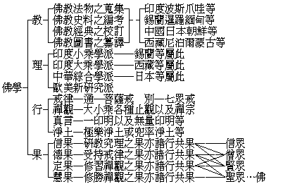

# 甚麼是佛學
（1929 年 9 月，在漢口佛教會講）

**0.3 万字**

## 目錄

- 前言
- 一　佛學的本質
    - 甲　覺者所知人生宇宙的實事真理
    - 乙　覺者開示我們從人至佛的方法——戒定慧
- 二　佛學的適應
    - 甲　佛學與宗教及科學
    - 乙　佛學與政治及社會
        - １共和政治的人生觀
        - ２大同社會的宇宙觀
- 三　怎樣研究佛學


太虛離鄂已經四載了，此次來漢，承諸位開此盛大的歡迎會，復蒙王會長李廳長等備極稱譽，實有無限的欣慰！近十年來國內佛教之發達，似乎處處與太虛有密切的關係，實則此為諸山大德及各位居士共同努力所致；太虛無所專長，亦無所增益，所以受此稱譽，實有無限的慚愧。

首創國民黨的孫中山先生，昔在廣西軍中講演智仁勇三德時，嘗言「佛教是救世之仁」；又於民族主義中，亦謂佛學「可以補科學之偏」。孫先生所說的佛教為救世之仁，即是佛所說的大慈大悲，亦即是佛學上的道德。孫先生所說的佛學能救科學之偏，因其見到科學偏重於物質，而佛學則精神與物質並重。又科學是理智的，而佛學之心理論理等亦全是理智的，故可以包容科學。依此孫先生的二語，雖可略知佛學之輪廓，但欲知其內容，應研究「什麼是佛學」。

## 一　佛學的本質

### 　　甲　覺者所知人生宇宙的實事真理

梵語佛陀，此云覺者，覺了人生宇宙萬有諸法的實事（相用）真理（性體），故名為覺者。佛非創造及主宰天地人物的神，乃是能於一切事理的因緣果報，種種變化，徹上徹下無不通體透徹者。所以佛學即是覺了人生宇宙實事真理之學，是轉迷啟悟的、破除無明長夜黑暗的。常人誤以佛學為迷信，而不知自己正是迷妄者，墮入深坑而不自覺；顛倒如此，安能不造諸惡業感招苦果呢！

何謂實事真理？譬如桌上之花瓶，在科學上說是原子組成的。佛學說他是地水火風（堅濕煖動）四大和合而成，但是因緣和合假的相用，沒有實在的個體（空）；假相又是時時刻刻遷流不息的變動。遠而世界萬有諸法，近而五蘊身心，皆是因緣和合相續剎那變遷，如世界有成住壞空四大時期，人生一期相續，有少壯老死。世間雖有千差萬別，而互相通變，其空性也是同一的。總之，五蘊非有、四大本空，人無慧目，不能覺了；妄從假相上分別而有人我彼此，復從我執上起我貪、我愛、我癡、我慢乃至種種顛倒，釀成世界大亂，迄無甯日。倘人們果能從佛學上不妄認幻軀為我，了達人生宇宙真理，萬有諸法皆互緣相通而空性無二，相資相成，和樂的世界即不難實現。

### 　　乙　覺者開示我們從人至佛的方法——戒定慧

佛是覺悟全宇宙真理之人，即將此所覺的說出來，指示我們從人至佛的修養功夫，能到成佛地位。成佛不限於人類，佛說「一切眾生皆具如來智慧德相」，不過我們是人類，故從人道說起。人的理性與佛及一切眾生悉皆平等，惟相用各別。各人違理行事，背覺合塵，隨其假相堅固執著，佛能革除此等不良的惡習，乃從眾生而證菩提。吾們不去如此認識，執定小小的個體為我，其餘廣大的非我，由是顛倒，處處障礙，不得自由解脫，亦不能與佛平等，受諸法樂。佛因之起同體大悲、無緣大慈，說增上戒學，革除其不淨的三業，而成不思議的三輪；說增上定學，斷除其有漏染心，而成為無漏淨善；說增上慧學，泯除顛見邪解，而成為無上正遍覺知。我們既有如是的「解脫」「自由」「平等」之本能，若能依戒定慧之原理原則去做功夫，自可達到覺者的地位。

## 二　佛學的適應

### 　　甲　佛學與宗教及科學

佛學的本質固為美滿，而流行在世界上，必須適應於社會文化，方算真俗不二圓融無礙的大教。現在世界文化，大致不出宗教與科學二種：宗教為富於情意的，其力量在團結人心；科學為富於理智的，其功用在能分析諸法。有此宗教及科學，方成今日的文化社會。倘無宗教的團結集合，則人類分散；無科學底條分縷析，則自然界和社會界成了渾沌。於此兩者之間有哲學，與宗教相近的有文學，與科學相近的有工藝；文學與工藝發達進步則有美術。如上所說，無論由宗教方面或科學方面，產生文學、哲學、工藝、美術、皆是文化的內容。此等文化與佛學的相互關係，舉示如下。


```
　　　　　　┌宗教─┬────文學─┐
　　　　佛學┤　　　├─哲學　　　　├美術
　　　　　　└科學─┴────工藝─┘
```


佛學在文化上，占最高底地位，它究竟是哲學呢、宗教呢、科學呢？甲說是哲學，乙說是科學，丙說是宗教，議論紛紜，是皆不懂佛學而下武斷的言論；為向來未決之懸案。就哲學之出發點說，或為宗教之演進，憑空想像的解釋人生宇宙；或為科學的發達，根據「心理」「生理」或「物理」學來說明人生宇宙：哲學雖與佛學同一說明人生宇宙，而實與佛學不同。佛學之出發點，由於修養所成圓覺的智慧，觀人生宇宙萬有真理瞭如指掌，為了悟他而有所說明；所以佛學雖可稱哲學而又不同哲學。且佛學不過以解說為初步的工作，他的目的在實行所成的事實，如度一切眾生皆成佛道，變娑婆穢土而為極樂是。

如三民主義能團結全國人心，領導國民革命，是有宗教之作用的；佛學的功用，在開人天眼目共趨覺路，亦自然有偉大的宗教團結力。但雖是宗教，卻沒有其他宗教所崇拜的神，或神話迷信，故又可說不是宗教。

科學重在實際經驗，不落玄想，佛學亦是腳踏實地漸次修證，不尚空談。佛學所說者，胥為從實際經驗中得來，他所說的宇宙人生、因緣業果種種變化，要皆淨智所見；故佛學非科學而亦是科學。

佛學的本身是文化的總彙，予在西洋時，見一般研究東方文化的學者，大都以佛學為總線索，因他在宗教上、哲學上和美術上，均有偉大的成績。

### 　　乙　佛學與政治及社會

#### 　　　　１共和政治的人生觀

中國的政體由專制而變成共和了。佛學在清季衰敗得很，因這種學說，不合於專制政體，所以一入民國，研究者日見其多。佛學的人生觀，合乎現代思潮，他說一切眾生皆有成佛的可能，凡是發菩提心修菩薩行的人皆可成佛。猶如共和政體的人生觀一樣，凡是國民有相當的學問道德，具有為國為民的意志，都可作行政領袖一般。佛教此種平等的精神，處處都可以表現的。

#### 　　　　２大同社會的宇宙觀

天下為公，世界大同，為古今中外人民不約而同的公共趨向，亦即三民主義之目的。全世界大同社會之組成，由於各人為單位積集而成的，故一人之行動若優若劣，均能影響全世界，正為佛學上所謂「一即一切一切即一，隨拈一法皆為法界」的宇宙觀。

## 三　怎樣研究佛學

佛學底內容，約之不外教理行果。「教」是言教，為釋迦牟尼佛的遺教。文教散布流傳於各國，或多或少，及其種類各有不同。故關於佛像、缽、塔等法物之蒐集，佛教史料的編考，各種文體經典的校訂，圖書翻譯會通的編纂，均為重要。

教原出於佛，而「理」、則是研究佛教的學者，各就所見理之大小偏圓不同，而有了各種的派別：若印度小乘的二十部，及其大乘之性、相、密三宗，以及錫蘭、西藏等處現在流行之大小乘；並中華融通顯密大小之綜合學派（包括日本），和西洋與近代日本之新研究派。此新研究派中，亦有教派，因他們或從學南洋等處，或就學日本，或留學西藏，所以雖同一以科學為方法，而秉承有異，遂各成派別。

於理了解之後，即要去「實行」。「行」有戒律、禪觀、真言、淨土四門，如法修行，胥能得到最後的效果。戒律，有通別不同，通則七眾同受，別則七眾各別，不相混亂。如下表所明：


```
　　　　　　　　　　　　┌比丘──────────二百五十戒
　　　　　　　　　　　　│比丘尼─────────三百四十八戒
　　　　　　　　　　　　│式叉摩那────────六戒
　　　　　　┌別、七眾戒┤沙彌──┬───────十戒
　　　　　　│　　　　　│沙彌尼─┘
　　　　　　│　　　　　│優婆塞─┬───────五戒或八戒
　　　　佛律┤　　　　　└優婆夷─┘
　　　　　　│　　　　　┌攝律儀戒───┬────自利
　　　　　　└通、菩薩戒┤攝善法戒───┤
　　　　　　　　　　　　└攝眾生戒───┴────利人
```


禪觀，包括大小乘各種止觀以及禪宗。真言，即是密宗一切陀羅尼門。淨土、十方世界都有淨佛國土，隨願往生。此方眾生與彌陀有特殊因緣，大抵發願往生極樂淨土：或生此土兜率內院親近彌勒菩薩。

有了解行，必有結果，故次言「果」。或有從研究教理所得的果，謂之信果。但這不是迷信，因他經過研教、究理、修行所得到的信心，是謂智信，智信才是真正佛教的信徒。在家的謂之信眾，出家的謂之僧眾，亦通於未證真理的十住、十行、十迴向三賢位的菩薩。或有從嚴淨毗尼執持禁戒所得的結果，謂之德果。這是以五篇、三聚淨諸業障的戒德，自利利他是為僧寶。然此德果，通於三賢十聖的共果。或有從修習禪觀得到伏惑超人的結果，謂之定果，即三乘共修之奢摩他、毗缽舍那，乃至佛果上的楞嚴大定、海印三昧，胥為所攝。或有入三乘聖位，修習無漏定智所得的結果，謂之慧果，即是般若無漏聖慧，此聖慧展轉上進，能斷盡無始來一切障種習氣，成究竟之果德。到此地位始謂之佛，謂之真正覺者。

統上教理行果，攝表如左：




觀右表所列，可知學佛，教理行果為應有之程序，非可躐等。今世學人，大多昧教理而妄談行證，不為邪魔所誘，即同生盲摸象，反使真理愈晦，招世人譏謗為迷信，幸各努力，剪除斯弊！

（法舫記）（見海刊十卷十期）

