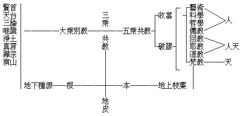

# 佛法之分宗判教

**0.2 万字**

梵土戒賢、智光二家，及華土賢首、天台諸家，以一時門庭施設之方便，於唯一大乘教所詮之自證境行果、化他境行果上，判教高下，致後人死守其語互爭優劣，予固不偏取之。而近人聞古者一音教之風而悅之，膠執「教一乘三」，亦有未可。蓋同一大乘教，特其所詮於境行果有偏重，或自證化他有偏重，雖偏重即為其殊勝之處，而統計其全，則平等平等也。至大乘與餘乘則不然、其所詮各有自乘之境行果，其能詮亦各有自乘之教。乘既三，教非一；教若一，乘豈三？設云教屬乎佛故一，乘屬乎機故三；殊不知佛不應機何有乎教？機不感佛何有乎乘？故應機三則乘三教亦三；感佛一則教一乘亦一。若無機佛之感應，何論教乘之一三哉？故予意教之判當依乘之別，乘之別、不別於後世，在佛應機而教興時已別之；故諸聖教處處有乘別之明文也。

然乘之開合亦不一其說：有時總說為一，乘無別而教亦無判；有時分為大小二乘；有時分菩薩獨覺聲聞之三乘；有時加人天為四乘；有時分所加人天為五乘。復有於三乘加佛乘為四乘者，此則迷一大乘之因果以為二，出於後人謬計，為聖教明文所無也。但今綜佛法之大全以類別之，可別為三：一、化俗教，謂人及天等五乘之共教。二、出世教，謂聲聞乘等三乘之共教。三、正覺教，謂大乘（菩薩乘佛乘）不共教。初一不離後二，而後二非初一能盡，若離後二，則成凡外之法而非佛法；前二不離後一，而後一非前二能盡，若離後一，則僅凡小之法而非佛法。故此三乘教法，皆不離佛自住之大乘也。茲表如下：


```
　　　　┌………………………………………………………………┬─菩薩
　　　　│　　　　　　　　　　　　│……………………………├─獨覺
　　　　│　　　　　　　　　　　　│……………………………├─聲聞
　　　　│　　　　　　　　　　　　│　　　　　　　　　　　├─天乘
　　　　│　　　　　　　　　　　　│　　　　　　　　　　　├─人乘
　　　　大︵　　　　　　　　　　　三︵　　　　　　　　　　五︵
　　　　乘正明諸法唯心義　　　　　乘出明五蘊無我義　　　　乘化明因緣生果義
　　　　別覺　　　　　　　　　　　共世　　　　　　　　　　共俗
　　　　教教無上菩提為鵠　　　　　教教無餘涅槃為鵠　　　　教教生長善因為鵠
　　　　　︶　　　　　　　　　　　　︶　　　　　　　　　　　︶
```


近人（見支那內學院各書）引金剛般若，佛令一切眾生皆入無餘涅槃之意，證明其「乘三教一」，由僅知三乘共教之故耳。然三乘共教誠亦佛法之通相，據此以言教一乘三，亦無不可；但更應知大乘別教、五乘共教，乃能至極而普應耳。茲更表如下：




如一樹然，由地上枝葉而望之，祗望至地皮之本柢而止，故可以三乘共教為通相；然三乘共教之所依，則又當在大乘別教。要之佛法以三乘共教為本幹，大乘別教則其根源也，五乘共教是其枝葉也，故應有此三教之判。

然唯識等大乘八家，則均以實相法界——即諸法唯心為根本，及妙覺佛果——即無上菩提為究竟。以此根本義故，究竟義故，同一大乘平等平等。而就其集理起行之特點以明其教理所趨重所崇尚之宗主，則昔於佛法總抉擇談中，嘗大別為三宗，為表如下：


```
　　　　空慧宗───三論───二空觀慧───得此清淨
　　　　　　　　┌─唯識─┐
　　　　唯識宗─┤　　　　├─諸法唯識───染淨所依
　　　　　　　　└─戒律─┘
　　　　　　　　┌─禪那─┐
　　　　　　　　│　　　　├─全體真如───自性清淨
　　　　　　　　├─天台─┘
　　　　真如宗─┼─賢首───離垢真如───離垢清淨
　　　　　　　　├─真如─┐
　　　　　　　　│　　　　├─等流真如───生境清淨
　　　　　　　　└─淨土─┘
```


此中律宗專指終南山道宣律師之律宗，道宣律師宗歸唯識，及明藏識中種子為戒體，皆有明文，故屬於唯識宗。真如宗中禪及天台等之五家，細分之猶別有宗尚，今就真如之廣義言，諸清淨法總名真如，故總曰真如宗。竟無居士謂當由唯識以進言唯智，唯智即是此言之真如宗——予昔作三唯論，即謂唯性（今曰空慧）、唯識、唯智（今曰真如）。宗是教理之主，指全部教理所崇尚趨重之一點而言；所以要有此一點者，便集中全部之教理而總握之以起行也。凡教皆為詮理，凡理皆為起行，若非反博歸約，有以握厥總要，則泛覽教理而行莫由起！若知為便令起行之教理集中點謂之宗，則近人橫分法相、唯識為二宗，詡詡以獨能發前人所未發自矜者，可知其尚泛濫教理而無所歸，故不知法相教理所宗即為唯識也！蓋平列偏明諸緣所生法若集論及瑜伽等等，由立言教以明義理，乃能宗之宗相；而攝大乘、成唯識等，由集教理以起觀行，正所宗之宗旨。故以宗言，法相宗乎唯識，不應將能宗所宗之一法相唯識宗強析為二，而正名定義但應曰唯識宗也。復就唯識以言，能唯是識（識言詮心心所），所唯（謂簡我法及持相性）即謂緣生法相及二空所顯真如性，若但明一識謂之曰唯識，而離諸法相性於唯識外別謂之法相宗，則尚何唯識可成乎！故不應離唯識宗別立法相宗。然空慧與真如得名宗者，統諸法而集中於識，既可名唯識宗，統諸法集中於二空觀慧，亦可名空慧宗；統諸法集中於真如，亦可名真如宗。以此三宗概觀諸大乘教理起行之方便，則得其綱領矣。

三乘共教及五乘共教之分宗，不復一一。機感佛而興教，故依乘以判教。理集要以起行，故依教以分宗。判教分宗，如是如是！

（見海刊五卷五期）

