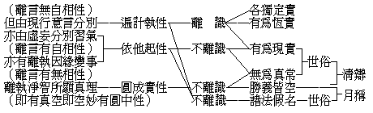

# 諸法有無自性問題
（1941 年 6 月，在漢藏教理院講）

**6 千字**

## 目錄

- 一　略示
- 二　小乘的有無自性說
- 三　空宗的有無自性說
- 四　唯識宗的有無自性說
- 五　中國佛學的圓中自性說

## 一　略示

對這有無自性問題的研究，首先要探討這「自性」能詮名下的所詮的意義是什麼？我們可以發現到經論中的「自性」，有著許多不同的解釋，所以現在先統攝其要義，繪列一表，再來逐條說明。

## 二　小乘的有無自性說

佛法中有一概加以破斥的自性，這就是表中的「各獨定實」性——諸法各自獨立固定不變的之實在性。如數論師說的神我，勝論師實句義中的我等九法，都是一一有情具有的各自獨立不變性的實體。又如各種神教，說在宇宙萬有發生之前，有一獨立固定的神來創造一切，其所創造的萬物，雖是無常變滅，然消滅後仍然有永遠不變固定獨立的神之實體。主張有這各獨定實自性的，不問他指的是創造神、是實體、是神我，都同樣的違反了宇宙人生是因緣生滅的最高法則。聖教與現實，都證明了萬有的生起和存在，都必須具足多種的條件（因緣），隨條件的和合而生存，亦須條件的離散而毀滅，宇宙間絕對找不到一件單獨存在固定不變的事物。這是宇宙人生的最高法則，也是佛法中最基本最重要的理論，上至三乘聖法，下及人天業果之所共同依據的。可是外道所計執的各獨定實自性，決不是因緣和合生滅相續的。它與佛法的緣起真理，正站在不相容的對立地位，所以佛法中不問大乘小乘各宗各派，都一致的破斥這各獨定實的自性為邪執；同時、最低限度也要破斥這種自性，才能夠建樹緣起真理的法幢。因為佛法普遍否認這種自性，所以都說空「無自性」。

其次說到「有為恆實」的自性，這如一切有部所講的「一切法」，原包括有為無為二類，無為法留待下面再說，且先講明有為法。有部說有為法是三世永恆實有的；但既落於三世的遷流變易，雖說「恆實」，還是有因緣生滅的。就在這因緣所生的有為法中，分析出最基本單純的法，如俱舍的七十二法，認為是三世恆實的法；而現見現知的宇宙萬有，無不是由這種種基本單純的原素組合而成。這基本的原素，在現在固然是實有的；過去雖已過去，但還是實有的；未來雖尚未來，也同樣是實有的。有為法既是三世恆實，當然有自性。但由這基本有為法組合成功的有情身器等，則是假合無自性的。又如犢子部所計我法實有的思想，也可攝屬於這「有為恆實」內。他們說的五法藏（過去法藏、現在法藏、未來法藏、無為法藏、不可說藏）除了不可說我之外，其他的教義和有部相同。而這不可說藏的我，非即五蘊、非離五蘊，也還不能離開眾法的關係而單獨存在，所以與他部派所說的假我仍然差不多，不過名字不同罷了。他既說有過去現在未來的三法藏，當然也是主張有為法有「恆實」自性的。這有部——或犢子部所說的基本單純的有為法，雖是恆續實存的，但還是因緣和合生滅的有為法，與外道所計執的各獨定實自性，逈然不同。

另有主張「有為現實」的小乘部派說：在有為法中，過去的已經過去了，未來的還沒有來臨，都是無自體而依現在法假立的；唯有擺在眼前的現在法才實有體性。經量部師就是這種思想的代表者（大乘宗派中也有作這樣主張的）。還有現通假實論者，或說五蘊是假，處界實有；或蘊處假立，唯界是實等。其實、這不過是認為實性的部份有彼此通局的不同，而其過未無體，唯現在可以有體的大前提，則無不同。所以、過去未來的法是假立而無自性的，現在世的有為法才是實有的自性。

其次說到「無為真常」的自性。無為是一切有為法的普遍真理，所以是常住不變的；小乘各部派分三種或九種。因是真而不妄、常而不變的理性，所以就在這真常的意義上說有自性。奘傳小乘六宗裏俗妄真實宗的說出世部等，謂一切有為世俗法都是虛妄無性，無為勝義才是真實常住的，就屬這種。無為法雖係常遍真實，但祗是遍通一切有為法的理性，或遣除一切有為有漏所證的常住涅槃；與各獨定實的自性絕不相同。部派佛教中，經量部等雖說現前可以見聞覺知到的有為法才是實有；無為法既非見聞覺知之所能得，實際上是沒有的，所以祇是言說上的假施設；但在觀行實踐上，由擇滅雜染所證得的涅槃，是任何部派也不否認其真常性的。所以這「無為真常」的自性，可說是各部派所共同承認的。

在小乘六宗裏有叫諸法但名宗的，他們說：一切諸法，但有假名，都無實體。上面說的各部派中，有的主張有為無為俱實；有的主張無為是實，有為是假；又有的主張有為是實，無為是假；在他們的互相諍辯中，這諸法但名宗起而總合雙方所說的假義，進一步的說：一切諸法不問有為無為，都是假名，沒有實在的。凡聖教所說的，世間所見的，表面上雖似有其事其物，然究其實質，則都虛妄而毫無所有；甚至涅槃菩提等，也無非是假立的名字而已，所以都無自性。這種思想的提倡者，是說假部。

從有為恆實到諸法假名，是小乘部派佛教中對於有無自性問題的不同說法。在這裏、各派的意見雖大有出入，但對於否認「各獨定實自性」，還是一致的主張。

## 三　空宗的有無自性說

現在再來探討大乘空宗對這有無自性問題的解說。

初期空宗的龍樹、提婆、在所造的中、百論裏，大致是以最徹底的諸法緣起為出發，以明畢竟皆空無自性。所以中觀論開首即說：『不生亦不滅，不斷亦不常，不一亦不異，不來亦不出，佛說緣起法，善滅諸戲論』。這便是說明世間出世間一切法，徹底都是緣起的空無自性，所以同時也都是空無自性的緣起。

龍樹、提婆的根本宗義，大概如此。但是後期的中觀論師，展轉傳承，對於原論的解釋，意見不無出入。其中最著名的，是流傳中國和西藏的清辨派，及單傳於西藏的月稱派。在勝義諦上看，不問有為無為，畢竟都是空無自性的；這一「勝義皆空」義，是二派共同的，沒有異義。但二派在世俗諦上的見解，則有很大的諍辯。清辨認世俗可是實有的，其主張和「有為現實」「無為真常」相近。月稱則謂：在世俗諦上說，諸法也都只是假名而已，沒有實事，故與「諸法但名」相近。月稱的說法，與中論『因緣所生法，我說即是空，亦名為假名』的文句，均相吻合。

這兩派的思想，在言詮上看，勝義諦上雖同說皆空，而世俗諦上則清辨謂實有自性，月稱說假無自性，很不相同。然若仔細考究其含義，月稱雖說世俗諸法皆是假名無自性，然在假名中並不否認世出世間的業果染淨諸法，不但不否認，而且以有空義故，才能成立四諦三寶等諸緣起法。緣起的三寶、四諦諸法，固然都是假名空無自性的，但說為假名並不是撥無染淨善惡因果差別的成立。在這意義上說，清辨所說之有，也就是因緣生起的緣起有。這緣起有，一面是無自性故空；一面是因緣生故有。由是考究，世俗諦上月稱所說的假名，與清辨說的實有，不過名詞上的差別而已。考其含義，月稱的假名，既不曾撥無染淨因果，不但與清辨所說的俗有一樣，甚或進一步可與小乘一切有部所說的「有」相接近。所以現在西藏黃教的所宗固為月稱空義，但他們所用以說明世出世間的假名諸法，反而是引用俱舍論。所以、名句的應用雖有巧拙不同而意趣並非甚遠。總之、空宗的要義，諸法皆緣起無自性。在二諦上說，勝義都是空無自性，世俗則或說但是假名，或說可有自性。

## 四　唯識宗的有無自性說

在廣泛的唯識學中，派別相當複雜，意見也很不一致。這裏且以中國向來所傳的無著、世親、護法、玄奘的唯識義為依據。以唯識宗的立場來觀察諸法，首先要說明的是遍計執、依他起、圓成實三性，三性的範圍，也有廣狹不同。遍計執的構成，有能遍計、所遍計與遍計所執相；現在不是說的能遍計心與所遍計法，而是指的遍計所執之妄相。這狹義的遍計所執性最明顯的意義，是但由現行的意識名言分別，計無為有，計有為無，周遍地顛倒執著，所以叫做遍計所執性，依他起性的正義，就是緣起法，所以古來也有譯作「緣起性」的；依他眾緣和合生起的諸法，叫「依他起性」。圓成實性，狹義說：即於一切法所顯的本來普遍常住的圓滿成就真實性，所謂諸法勝義的真如是。這是唯識宗正確的三性義。這三性中，依他起的範圍最廣；假使作另一種的說法，無始虛妄分別習氣也攝在遍計性中，則擴大了遍計，連雜染依他也包括在內了。又把一切離顛倒的清淨緣起法（淨分依他）也攝於圓成實性中，那麼、依他起性的範圍便很狹小，或竟沒有了。雖有這第二種的說法，但唯識宗三性的標準義，還是以眾緣生起為依他起性。

遍計執性，但由現行意言分別所起（現行意言分別之法，不一定都是遍計執性，但遍計執性，必定都是現行意言分別所起的），如非有計執為有，世間現量不可得，出世淨智現量亦不可得，只是意言增益有的。這裏面有許多頗難辨別，如現前的桌子，在現見現覺中，只是黑色方形和堅觸，並無桌子，桌子乃由意言增益起的名相；可是人們的習慣，都以為親自見到覺到的，所以實有桌子。這種意言增益起的，雖很難了知，但還有一些很明顯的，如龜毛兔角等，完全是名言增益而起。在名字上龜毛不是兔角，兔角不是龜毛，雖有差別，但離開名言之外，則世間見覺、出世淨智，都不能證有，很容易的辨明它只是意言分別上所有的。由這明顯的龜毛兔角之唯名言有，也就可以例知上來所說的桌子房子等，也唯是名言分別有的了。遍計執性無不是名言假立的，離名言之外沒有自相，所以說他無自性。

依他起性，有一分是由無始虛妄習氣現起的雜染法。這染分依他，不但由現行意言分別現起，同時也要由無始虛妄習氣的內因才生起。三界中的一切有為法，無不是由無始以來虛妄分別之熏習於內識中，現在成熟才現起的。它與唯是獨頭意識上意言分別現起的不同；如有些有情，意識不發達，沒有名言所起的分別，但還是有它的根身器界的識境。又如二禪以上的諸天，六識尋伺完全不起，當然沒有意言分別，可是由不動業所感身器，還有他的定中境界。遍計所執，則完全是依托名言的，離了意言毫無所有；這染分依他，則亦託過去的分別習氣為生起之因。例如龜毛兔角與翳華夢境，雖同是虛幻，但龜毛兔角只在意言分別上有，離言無別自相；翳華則依眼病而幻現，眼病未癒，翳華不會消滅；夢境因睡眠心生起，睡眠心未息，夢境也不能沒有。染分依他也是這樣，無始來虛妄分別習氣沒有斷除，是無法使他不現起的。離現行意言之外，還是有世間現量的自相，所以說他有自性。

依他起中，亦有離執因緣變事的清淨分。由出離煩惱所知二障和我法二執的無漏因緣所變起的清淨依他起法，如報化身土、四智菩提等是。這些既是因緣所起，所以也是依他起法；離開名言，還是有淨智現量的自相，所以說他有自性。

圓成實性，是離執淨智所顯的真理，不是名言所假立的；雖在悟他方便上也可以有名字的安立，但它「無有相狀差別」。這無相狀差別的真實性，是由「無分別智」證明的，所以說「離言有無相性」。由此應知，唯識宗說依圓有性，遍計無性，是依離言有體無體說的，如定執離言無體，則必撥無染淨因果，落於損減執無疑。

唯識的「識」，以標準的唯識宗義看，是屬依他起性眾緣所生的；若離開依他起性談識，則將超越唯識宗的思想範圍，走入他宗的思想體系。識、有能了別轉變一切法的雄力，是依他起法中最殊勝最主要的法；所以唯識宗看一切法，或可離言而有，但決不可離識而有。凡執離識而有的，都是遍計所執，不問你有的是真如，是涅槃，是勝義諦，只要執為離識之外的，都落於遍計執。所以從外道所計的各獨定實性，乃至大小乘說離識以外的有為無為法，都是遍計。甚至說離識之外有實空、實心，也還是遍計。諸法但名宗所說的「名」，大致都承認是不離識的，所以沒有離識的遍計執成分。

在西洋哲學裏，有唯實論和唯名論。有的主張諸法的共相——觀念或概念——普遍恆常，所以是真實的。他們以為事實上的桌子等，時間過久就要壞滅，空間則唯局一處，所以反是虛假；但桌子的名義——共相——倒是遍一切處一切時而真實的。所以叫做唯實論。反對唯實論的說：共相不可見聞，唯名無實，所以叫做唯名論。唯實論不免執名為實的遍計增益執；唯名論多少已走近不離識的途徑。

在不離識中看一切法，有為現實，離言有自相性，是依他起。無為真常與勝義皆空，離言有無相性，是圓成實。

諸法假名，謂一切法都是現行意識上的名言分別，所以攝屬遍計執性。然廣義的如月稱說世間根量，沒有離了無始來虛妄分別習氣的，所以都是假名，則此假名不但是現行意言分別，也包括了無始虛妄分別習氣。最少可以通染分依他，甚至可以成立諸法「唯名論」，或「唯遍計執論」了。

總之、唯識宗是以可離言不可離識來說明諸法或有自性或無自性的。空宗是以可離識不可離緣來說明諸法都無自性的。然「識」也是緣起法，以緣起義說「識」也空無自性，是毫無問題的；但不可離緣的法，是否都不可離識，或不可離假名，則不無問題。所以、各宗普遍所無的是各獨定實自性，其餘則有為、無為、勝義、世俗，有種種說法的不同。

## 五　中國佛學的圓中自性說

最後說到「即有真空即空妙有」的圓中性。中國佛典上常用「自性」一名，如六祖說：『明本自心，見本自性』；『何期自性本來清淨？何期自性能生萬法？何期自性本不動搖？何期自性本不生滅』？昔作曹溪禪的新擊節，曾特拈「自性」而加以發揮。永嘉禪師說：『本來自性天真佛』。天台家在四弘誓願後加四句說：『自性眾生誓願度……自性佛道誓願成』。這些，舉不勝舉，極力講自性，極力稱揚自性，是中國佛學的特點。但到底這自性是什麼意義？和空宗等所斥為無的自性是不是相同呢？

當然是不同的！應曉得：離執淨智所顯勝義，因是離執，所以是空；淨智所顯勝義，則又是有。究竟真空就是妙有，遍常妙有就是真空。即有之空才是真空，則離有之空是頑空；即空之有才是妙有，則離空之有是妄有。凡是「有」者，皆性空緣起之有，微妙清淨明徹之有；若一法不空，即不成妙有。凡是「空」者，皆緣起性空之空，真常圓滿成就之空；若一法不有，即不成真空。這非妄有、非頑空、即真空，即妙有之如實義，無以名之，假名曰「圓中性」。舉例說：如一株芭蕉，託於根種、水土、日光、空氣的眾緣而宛然生長；根種水土等因緣法也同樣的需要依託眾緣，從這展轉依託的眾緣上，求其邊際不可得。就宛然的蕉相，層層剝完，求其中堅不可得。就根種之展轉託於根種，向前推其開始時不可得。芭蕉復生芭蕉，向後推其終盡處不可得。所以是無邊無中無始無終的。然後後當起，就從此開始；前前已盡，就至此為終。窮極眾緣，即此是邊際。現成宛然，即此是其中堅。所以即始即終即邊即中的。無邊無中無始無終。故畢竟皆空。即始即終即邊即中，故統一切有。一芭蕉如此，一人、一芥、一色、一香、一微塵、一恆星、一毛孔、一念心，亦莫不如此。這圓中性，要到正智如如恒時相應的佛果正覺境界才能畢現。它是一切法的本來面目，其實普遍恒常本自如是，無庸上帝天神等之造作，所以叫做「自性」的。

這個自性本來就是沒有一點兒離開一切法而單獨存在的，所以就任何一法要想求得其獨存的自性，終是畢竟空無的。而畢竟空無獨存自性的任何一法，又莫不周遍一切法，一即一切，一切即一。一切法為一法的現起之緣，一法即屬一切法，離一切法無此法，故一一都是空，空到徹底空。而由眾緣現起的這一法，遍入一切法，為一切法生起之緣，故具足一切有，有到徹底有。一攝一切，一切攝一，一一法即是法界全體，故又法法具足而統一切法性。所以天台家常說：「一色一香，無非中道，隨拈一法，皆是法界」。因為每一法都是統一切法的，所以隨便拈起一法。小至一色一香，無非都是全法界。或問古禪德「如何是佛」？答：「磚頭瓦塊」。又說：「撲落非他物，縱橫不是塵，山河及大地，全露法王身」。法法都是統一切法性，則法法莫不周圓，所以「拈一莖草」可以「作丈六金身」，「拈丈六金身」也可以「作一莖草」，甚至「青州牛吃草，益州馬腹脹，天下覓醫人，灸豬左膊上」。這統一切法性，有如海水，雖然後浪推前浪，波濤層出不窮，然皆不離海水的一味性；海水雖一味，仍不妨萬波起落。天台家說：「真諦泯一切法，俗諦立一切法，中諦統一切法」，統一切法的中諦，就是這意義。賢首家說的事事無礙法界，也就是這意義。

這統一切法性，原是佛果智境的事事無礙法界全體性。但法法統一切法，則不妨在佛而佛，在人而人。所以通俗點說，不妨叫它做宇宙性；切近點說，也就是人生性；再切近說，就是當人自心性。所謂現前介爾一念心起，無不具足百界千如三千性相。雖不可得，而遍一切法；雖充塞法界，而無所有。所以達磨說：「直指人心，見性成佛」。六祖說：「明自本心，見自本性」。當前的這一念心，就是即有真空即空妙有的圓中法界性，也就是本來的天真佛；成佛不必外求，當人即是。

在佛的智境上說，凡夫確皆本來是佛，在修證的事實上也確實見性即是成佛；但因現行意識的顛倒分別，和無始虛妄習氣的重重障執，明見現前一念自心的本性，卻不是容易的。所以必須要破除重重的執障，掃盡無始的妄習；那末、必須修習種種方便解行，上來所說的小乘大乘各種有無自性的理觀，又都是不可偏廢了。所以有人問禪德：「如何是佛」？答曰：「即汝是佛」！進問：「如何保任」？答以「一翳在目，空華亂墜」。虛妄雖本明淨，但要除盡目中的翳病，必須假借種種方便。所以佛說的一切法門，若能適應當機，無不是治病的妙藥。雖然遍一切法皆是圓中性，又不妨層層破斥，重重融攝。

從這圓中性去探究，我們可以發現到台、賢、禪、淨佛教的兩個特點：一、在理趣上，從即有真空即空妙有的圓中性，闡明一一法莫不是統一切法的「法界全體性」，本來圓滿，無欠無餘。雖台、賢、禪、淨各宗教義有多少的不同，而這一點卻是大家共同主張的。二、在行門上，從統一切法的現前一念心成為「攝歸自心性」，所以在用功修行時，都從現前一念心為著手處。禪宗的直指人心；天台的一念心上觀百界千如三千性相；華嚴的應觀法界性一切唯心造；淨土的執持名號一心不亂等，都是從現前的一念心上去徹觀一切，修證一切。不過後來因為他們專集中在統一切法性的圓解，與攝歸自心性的妙行，缺於研修其他一切方便，遂由疏略而漸落孤陋。

要明究竟的真理，可以說「從當人一念心徹見統一切法法界性」便得；在猶未成就一切福德資糧，沒有修集一切解行方便以前，是做不到的。所以我們須一方面舉揚中國佛法的特勝點，一方面為對治現行意言分別，無始虛妄習氣，要修習種種教理行門的方便，方可以本末融貫，妙契圓中。

因討論諸法有無自性問題，發現中國佛學的高唱「自性」，乃說為圓中的統一切法性，和攝歸自心性的兩特點，特別的拈提出來。

（演培、妙欽、文慧合記）（見海刊二十二卷十期）

