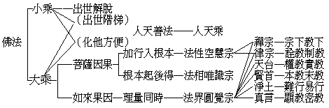

# 佛法大系
（1925 年冬，在武昌佛學院講）

## 目錄

- 前言
- 一　人天乘
- 二　小乘法
- 三　大乘法

古今諸德判釋如來一代時教，或一或二，或五或十，種種數目不一而足；今總括之分為大小二乘與人天乘。而此人天乘法，全係大小乘之出世階梯，或大小乘之化他方便；故佛法之根本唯大小乘。其大小乘法修證法門之次序，與對於各宗之關係，極其縝密，試皆表列於左：

## 一　人天乘

其中所言人天乘者，以諸有情若乘五戒之法可到人的地位；若行十善禪定之法可到天的地位。然此人天乘法非是有佛方有，即印度、中國、泰西各國皆有之。如佛法未來中國之際，儒教教人由士希賢，由賢希聖，由聖希天；道家老莊之徒使人得仙入天；西洋的基督教說生天；印度之婆羅門教說由人道而生梵天等。此可見人天之善法，為世間共同之教。但世間以此人天之教為其極歸，而佛教則以此為出世之階梯，化他之方便。蓋立此人天教法有二種意：一則保持人天之道，由人天道而至小乘或至大乘；一則立此人天之教，示其迷謬之處，使其知非究竟而求出世究竟了義。若不爾者，則眾生非但驚悸大乘不肯信受，抑且永沒在苦。所以世尊說法，立人天教以培其出世之資糧，斥其迷謬之局執，而漸引入於大小乘出世者也。可見此人天乘法非佛教所獨有，亦非佛教之特質。

## 二　小乘法

小乘法已是佛教出世的法，而一般人一聞小乘即意謂必甚狹劣，殊不知若生色無色界已為常人之思想所達不到，而況超出世間者哉！不過此小乘之教理行果，比之大乘則不為深廣；故小乘的根機為狹劣遲鈍，而大乘的根機為利疾超勝也。小乘知我空而五蘊皆有，大乘知我空而五蘊亦空；以有法執為障故，遂名其為小乘也。吾人已知乘人乘之法可到人的地位，乘天乘法可到天的地位；進而更覺為人常受種種之逼迫，經種種之苦惱，一事方成兩鬢同絲，老病相催，悠然死去！生為仁聖，死則枯骨；生為盜賊，死亦枯骨；則人生之價值何存？縱信神識不滅，仁聖死得昇天，受種種之娛樂，但其五衰相現，流轉何定！如是以不滅之精神，疲奔於業報之途；今生之所經營，已得而復失！來世之所經營，亦已得而復失！由是生生死死，死死生生，得而復失，失而復得，盡未來際靡所底止；甯不勤苦無益？於是遂生一不滿足之觀念而求出世之方法。如世之求進化者，以萬物皆有進化，則進化復進化，必將有超出人天以上之法可求得之，於是求所以脫離人天之業牽及苦惱之一種進化，即是出世間之小乘法。此小乘法，即佛法中解脫人生苦痛之一種法門也。

## 三　大乘法

大乘分為因果二位，在因位為菩薩乘；在果位為佛乘，又名如來乘。依此因果位，即作二層：一者行因趣果的大乘，二者彰果化因的大乘。行因趣果的大乘，即菩薩乘；彰果化因的大乘，即如來乘。彰果化因的如來乘，是由所證佛果之境界而開示眾生，使眾生依此法門以悟入佛之知見，達到佛之究竟地位。由因至果的菩薩乘，就是眾生從無始以來之佛性，與過現之一切正聞熏習，發心修行，經四十一因位，而至圓滿果海也。

然此由因至果，菩薩乘法，就主要點有二位別：一者由加行入根本；一者由根本起後得。此二類中，初者屬法性空慧宗攝，後者屬法相唯識宗攝。屬法性空慧宗之教典，即般若經與龍樹提婆之四論等；以此經論所詮教義，皆顯離分別之法性。修此宗者，若能依此教義如法修持，起法空觀，經暖頂忍與世第一之四加行，而證無相法性之真如；此無相法性之真如，即是根本智（又名無分別智）之所證。蓋以證此真如，則一切虛妄之境悉皆消滅無餘，而一切清淨佛法，莫不由之生長成滿矣。屬於法相唯識宗者，凡為思量分別想像所能及之一切諸法，皆為法相；而此法相依分別起，離分別外實無一法可得，亦無一相可見，故曰唯識。然能了此天地人物以至佛身淨土種種諸法，皆唯識所現，非得根本智後所起之後得智，不能如實了知。何者？蓋未得無分別智，則法執未亡，不能了為唯識之幻相故也。根本智即如理智，由如理智而起如量智，依如量智則無邊無量之諸法品類差別悉皆究竟達其體量矣。如其未得如理智前，雖第六意識亦能依教理以觀諸法唯識如幻，然末那之我執常存，仍滯迷執。況此間眾生於一法上互有相違；譬如大海，隨六道見各有不同，若非得法空以後之菩薩，安能知其不同之根柢而皆會歸唯識之旨哉？又經有云：『由攝藏諸法，一切種子識，故名阿賴耶，勝者我開示』。阿賴耶識為建立唯識之根本，非明此識則不能究竟明了唯識；故欲究竟明唯識者，唯已空法執之菩薩為能耳。然而凡愚雖不能知，亦可憑依經論與各人之知識經驗，集起唯識觀念，以修習殊勝唯識觀行，而達到究竟明了唯識之目的。能如是者，是名行因趣果之菩薩乘也。

彰果化因之如來乘者：此如來果因與菩薩因果頗有攸分，何以故？如來既圓滿根本後得二智而成正遍知海，理量同時，性相不二，無一剎那心不遍知諸法，故如來十種通號內有正遍知之一名也。菩薩不然，必須一剎那證性，一剎那證相，前後剎那乃能觀性相不二；而如來則能無一剎那不證此性相不二之圓融法界。如賢首之六相十玄，天台之一念三千性相等，即明此理量同時性相不二之法界，而須以佛果圓覺為宗也。此云法界，以總包性相一切諸法為義。唯有大圓鏡智能如實親證此境，故曰法界圓覺宗也。

至於佛教各宗對此法界圓覺宗與諸法性相二宗之關係，則如天台所宗之法華，以佛知見為宗；賢首所宗華嚴，以佛法界為宗；淨土以彌陀智境為宗；真言以大日中臺為宗；律宗以實踐制惡行善為宗；禪宗以不立文字見性成佛為宗。在天台宗言，以法華為實，其餘為權，縱華嚴亦兼別故。在賢首宗言，以華嚴為本教，其餘為末教；雖法華屬一乘法亦乃會三歸一，不如華嚴惟照諸大山王。在淨土宗言，唯往生法為易行道，橫出三界，一生補處；其餘法門鑽仰維艱，非如淨土之至簡至易，故抹殺餘法為難行道。在真言宗言，天地人物，六道眾生，皆大日如來法身，其一一法悉為總持，修其法者，即身等同毘盧；其餘各宗落於詮解，非究竟法，唯真言宗獨得如來祕密奧妙之藏，而抹殺餘法為淺顯教。在禪宗言，眾生本心即遮那如來，但須回光返照即能見性成佛，無須假諸言教，尋枝摘葉，枉費精神；故自稱宗下，餘為教下。在律宗言，佛教其餘一切法門悉皆以教詮理而已，未能親行實踐；唯有遵循佛制，庶幾大道不遠。此之各宗，種種斥他非而炫己是，類皆獨顯其勝以為策行方便耳。其實、各宗皆為佛法，皆可得根本而起後得，入於理量同時性相不二之圓覺；無奈後人不解，為各宗起競之由，吾人若能貫通考察，則禪宗直證圓覺，兼用空慧；律宗教遵唯識，亦兼天台；而天台、賢首、淨土、真言，宗在法界圓覺，各標其勝。而此性相與法界三宗，又統屬佛教之大乘法。凡大乘法皆以諸法實相為根本，以無上菩提為究竟，夫何軒輊之有？故明佛法之全體及大乘之平等者，於宗下教下顯教密教等抑他揚自之偏言，概無取焉。

（妙空記）（見海刊七卷六期）

