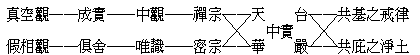

# 佛法一味論之十宗片面觀

佛法一味，所謂「內證離言、應機巧說妙法味」。而一味之佛法，從一種方式以言之，可別為教理與觀行之二門。由教理門以言之皆教理也，由觀行門以言之皆觀行也。今且就觀行門略論之。

觀行門可大別為真空觀行門與假相觀行門。行門之所契達者，皆為空假不二，假空俱非之中實法界。而中國所傳十宗可系列為兩行如下：

成實、俱舍二門，可達中實法界一分之擇滅涅槃；中觀門、唯識門以下，俱可達中實法界全分之無上轉依。然建立「中實法界觀門」者，則為天台華嚴二宗；故天台以真空觀融攝假相觀而成空假雙遮雙照之中道，而華嚴以假相觀融攝真空觀而成假空俱存俱泯之法界。然真空門妙極於禪宗，而假相門妙極於密宗，故行證之妙門，獨於此二為崇。蓋天台、華嚴著重於玄妙的描寫，致行證反成無力也。至律宗之戒律為觀行定慧共依之基礎，且為建立流通各觀行法門於人世之必循儀範，瞭然可知，不待更釋。唯淨土宗之往生十方淨土，在現行之意義上，若達行證之極，雖成實，俱舍亦證涅槃而無待往生淨土，然為一生未能極證而防退墮計，則皆有托庇於某一佛聖的清淨國土之需要。不唯禪宗有「有禪有淨土」的修法，而密宗亦有密嚴、香拔拉等。成實俱舍雖未明求生他方佛淨土，而亦有期生得聞佛法的有佛法國中之意。今各宗間之通行之淨土門，以西方極樂與兜率內院為最廣。上生兜率內院以親近彌勒，則雖不談他方佛土之聲聞眾，亦可依歸；故諸淨土門又以兜率淨土攝機為普遍焉。

前二系列中禪密二宗，為空相二門最高極詣之對峙雙峰，其直趨行證之力最強，故其自尊而抑他亦特甚。禪宗則自稱「宗下」、而以「教下」概稱其餘，密宗則自稱「深密」、而以「淺顯」概稱其餘。要皆禪宗或密宗獨盛之後，禪宗語錄與密宗咒軌有自成一藏勢，乃於一味佛法中發生如此絕然對峙之分別耳。然此非囿於禪宗、囿於密宗者所能知，而在深入禪或密之熱誠者，又萬非冷靜之理智能致其感悟；故此雖為博達教義教史者所明見，卒無以解習禪習密者之囿焉。

（見海刊十五卷四期）

