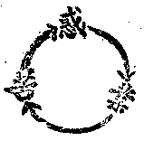

# 佛法悟入漸次
（1923 年 7 月，在廬山世界佛教聯合會講）

## 目錄

- 前言
- 一　明業果不斷故有情續生
- 二　明唯有根塵故人我本空
- 三　明諸法本空故唯識所變
- 四　明本非空有故入佛知見

佛教以圓寂以大覺為究竟目的。藏海雖淵，但求由之而能開悟；法門固多，但求由之而能證入。拈花一笑，直契實相；擊竹聞聲，悟徹無生；非必有所謂漸次之階也。然資糧備習，三劫五位，由生而佛，進程不應躐等；五類種性，有學無學，轉迷而覺，悟入遂有漸次。約其漸次，可有四級：一、明業果不斷故有情續生，二、明唯有根塵故人我本空，三、明諸法本空故唯識所變，四、明本非空有故入佛知見。

## 一　明業果不斷故有情續生

有情依其身語意三者所發動之善惡染淨等行為，皆謂之業。有如是業，即有如是感招後異熟報之力，所感之後報能酬前業，是謂之果。異生二執俱生，於異熟果不達依他無我之理，遂起四顛倒而造善惡等種種之業。業持於識，為識增上；業為識造，識為業牽；此善惡之業，依有情之識，異時變異，遂得異類之總報。報體即識，報名曰果；復依此果而造諸業，更感後果。由斯前前後後業果不斷，亙古歷今，各隨所造之業得其所應得之果，異生遂長夜沈淪於生死海底，相續於六道趣中矣。或曰：理既如斯，其相若何？曰：若示概相，可依十二因緣以明之。十二因緣者，謂無明、行、識、名色、六入、觸、受、愛、取、有、生、老死。此十二因緣亦名十二緣起，以業果之相由十二種之因緣而起故；亦名十二有支，以此緣起有十二支故。此中所謂無明者，即不明之謂也。其所不明者有二種：一者真實義，謂諸法生滅無常，緣生無我，性空無為之義；二者異熟果，謂諸所作業異時必變異異類而成熟為果，曰異熟果。異時是所難究，變異則相不識，性空故理趣玄深，無我非妄心所緣；異生無正比量智以通此理，無真現量智以達此事，故曰無明也。以無明為增上緣，貪瞋等種遂爾現行，身語業於斯而起行為動作，是之謂行。以無明行為增上緣，命終之時惑業感牽識心，識心被牽遂復趣生，是之謂行緣識。當其趣生得命之時，此識即與父母愛情之精血合為一團，此一團中之物質即色，其精神——受、想、行、識即名，合此二者謂之名色。由名色展轉之力，有情遂能吸入色聲香味觸法六塵，此能吸入者是之謂六根。當此六根既已成熟，遂由母腹中出而與外界接觸，是之謂觸。當此觸時，即有逼近之苦樂與捨等之感受，是之謂受。於現所受不明其為虛妄，遂依之於境而生愛憎，是之謂受為緣生愛。以愛迷為緣故，於現前境認定而欲保取之或欲摧滅之，是之謂取。以取迷為緣故，造作諸業，以業有引來世之力，是之謂有，蓋謂此報雖未捨，而來世應有之業因已有也。依此有故復得後報，是之謂有為緣生。報得曰生，果壞曰死。斯之謂無明緣行乃至生緣老死；即業果不斷有情續生之概相也。

別作者既別受，共感者必共得。別異之報果乃別異之惑業所致，共同之果報即共同之惑業所感。根與身為別異之正報，器世界即共同之依報；國家乃共別之業招集，世界即共共之業所陶成。生老病死，一期復一期別異之業果相續；成住壞空，一劫復一劫共同之業果不斷。諸有不達此義者，遂依其現見之果法上起諸斷見或起常見，或計其為無因而然，或計其為有因而然。計無因者，謂去來今宇宙一切參差之現象森羅環列，人生一切變化之休咎富貴貧賤，皆何由而然耶？曰：皆自然而然，非有因而然也；即莊子所謂「然乎然、不然乎不然」之計也。計有因者有二支：一計宇宙人生為神造的，一計宇宙人生為物集的。計為物集，中土則說為陰陽二氣、五行生剋；印度則說為地水火風，極微造色；西土則說為原子電子，物質物力；然彼所說皆謂物集則相顯，物散則相沒，人生宇宙所言一切之果相，莫不由物理之因果律所致也。計為神造，東土則計為天，西土則計為上帝；然彼等皆謂宇宙之所以有此森羅萬象，人生之所以有諸存亡休咎者，必有一獨尊萬能全知之天神主之宰之造之作之也；豈無而能然耶！何以故？以現見能活動之人之畜，不能如此故耳！不然者，則人畜等何以每不能遂其所樂欲而常為環境之苦所支配乎？故必有上帝也。合此二支與自然一派，又可約為二種邪見：一者斷見，二者常見。計常見者即神迷派，彼謂上帝既為吾人之主宰，萬能而全知，是以信之敬之念之禱之，當必賴之永生天堂，享快樂於無窮；若不信而忽之侮之慢之背之，自求永墮地獄，終為撤但，常流於化外而莫之救藥。噫！此教此見，一梗於胸中，其最善者或幸能生天享一期之福報，但報盡則仍不免於六道輪迴，三途之痛苦；次之者則什九不免鬼道幽冥之苦矣。計斷見者，即自然迷派與物集迷派；蓋謂自然如是，本無因果，好醜固定，佛豈可致？遂順其貪瞋慢之流而不復求其解脫之方。又謂人由物集，物散人亡，人生無常，應即時行樂；苟得以滿吾貪瞋慢之狂壑者，雖五逆十惡亦何憚而不犯！雖殺盡天下人，亦何所顧忌而不為！苟不得遂吾之所欲為，悶悶一生，則無如自殺速死之為快耳！吁嗟乎！此見一印入腦中，其不長淪惡趣註冊地獄者鮮矣！噫！不明十二因緣之概相，別共業感之正理，則不落於常，即流於斷；既落斷常而欲保持人類之地位尚烏可得耶！故吾人若真欲做一個人，昧此則無軌道之可循也。故此業果不斷有情續生之理，吾嘗謂之為「做人的要義」；推而廣之，做天乃至做佛，亦莫不基此為出發之點，奉此為根本之理。故在佛法應謂之曰五乘之共通教義，為學佛之最低限度也。

上來所說，非如世俗糢糊影響之談因果。若能以之普及於今世之人類，則雖不倡世界和平而世界必趨於和平矣。且儒家雖不深明佛法，亦常謂佛教之談因果，有裨於世道人心，足以補儒之闕也。

（記者謹案：中國庸儒，每耳食佛家有因果之論，輒謂佛教之談因果，其於世道人心亦不無小補；實屬乖謬已極，可知彼輩於佛經佛論必未曾寓目，於因果之理，必完全不能彷彿其粗義也。夫釋氏所云因果之理，乃如實而言，豈彼橫記妄說為如是如是哉！釋氏之意，亦非借此論以駭懼世人，使勿殺人放火也；亦非待釋氏道出因果之論，而後世間方有因果報應也；惟因事相本來實現為如此如此，故釋氏說為如此如此。蓋以於事實上雖因果昭昭不爽，然異生身為異熟之報所礙而不能見其底蘊；心為種種戲論所障而不能明其正情；故釋氏集合異生分上所有之種種事情，於其共同點上指出其因果之公理，次復告之以人生輪迴之事情，使之由此理上比知必有六道輪迴之事實。世人不曉，而謂因果之教，唯是釋氏所施設，唯是佛教徒所迷信，豈人生真有所謂因果輪迴來生來世哉！縱聞有二三現見之果報等事，亦不過適逢其會耳！總之，輪迴非現前可見證，來生亦渺不可親覺，吾不信焉，吾不信焉。吁嗟乎！中國人之未出國門者，不見有美國，不信有美國，而美國豈即因其不信而即消沒乎？彼輩不信有業報，而業報豈即因其不信而遂無乎？知與不知，信與不信，而因果之理，業報之事，本來如是如是；吾甚為昧者危焉！）

## 二　明唯有根塵故人我本空

凡夫鮮具宿命之慧，菩薩尚有隔陰之迷，且貪瞋內擾，濁境外眩，吾人若不亟求所以出世之道，則福果一盡，人生之再報，將難乎為繼矣！是以既曉業果之五乘通義，繼則應達我空三乘聖教。此三乘出世之學，最初所明者，即人我本空之理，五蘊幻聚之相。蓋以生死因於惑業，惑業原於執我，而庸人所執之我，則皆由不達五蘊假相而妄計之以為我之故也。或計色蘊是我，或計受蘊是我，或計想蘊是我，或計行蘊是我，或計識蘊是我，或計五蘊和合是我；要皆是誤繩為蛇，顧影覓首也。若就其所計而推研之，彼將彷徨而莫知措其手足矣！蓋以即如彼所計之五蘊而言之，其中亦唯見有色受蘊等，而未見有我也。或難曰：若但是五蘊而無我者，則誰是作者，誰是受者？若無作亦無受，則豈不違於業果不斷有情續生之義耶？曰：應知「諸蘊從緣生，和合相續故，假現為我相，但唯有根塵」。所謂塵者，即色聲香味觸法六塵；根者，即眼耳鼻舌身意六根也。蓋由根塵構接，見相假現，五蘊和續，惑業滋起，起業受果，仍在五蘊。蘊謂積聚，和合有相；此假合相，唯依根塵內外六處，覓我不得；為明斯義，是故說言唯是根塵，人我本空也。若無我執即無惑業，若無惑業則無所報，無三界報是曰出世。若明我空即無無明，無明滅則行滅乃至老死亦滅；滅染還淨，縛乃解脫，此即出世之根本，三乘之共通教義也。諸有欲超出世間。離脫苦海，於唯有根塵人我本空之義，盍細味之！

## 三　明諸法本空故唯識所變

依上所明，雖可出世，若深究之，義猶未詳，言猶未至也。夫一切諸法不越五蘊，而色蘊等根塵諸緣亦從緣生亦無自性，體空而性寂，故曰諸法本空也。難者曰：諸法若空，即無有諸法，何以世間共見有種種差別之相，而聖教亦說有五位百法耶？曰：體雖空寂幻相非無也。然非無之相，不出能變能了之心識，故一切皆所變，唯識能變、唯識能了，故曰唯識。以體空而相有故，故曰諸法本空，唯識所變也。但此法空識變之義，非二乘定性者所能領受所可悟入者，故此義亦曰大乘不共教義也。

## 四　明本非空有故入佛知見

有執即生執除即佛，除執即是佛法。眾生妄情所執之妄相雖非有，而諸佛妙智所證之實相則非無；證與未證，諸法之真際本來如是，以是義故說之為本非空有。法華經云：『佛為一大事因緣出現於世，為令世間一切眾生開示悟入佛之知見』。所謂悟入佛之知見者，即是親證此非有之空非無之真也。然啟發此親證實相之智，非由先明諸法本非空有之理，不得而入，故曰明本非空有故開佛知見也。應知上三所明，皆為除執之方便談，非和盤托出直示目標之論。然諸佛所以說五乘通理、三乘共教、法空識變之大義者，皆為眾生根鈍福薄，不得已而降低其教程，以之為階漸耳，非直探其本懷之談也。故吾明佛法之悟入，而以此居於最後也。

上來所言，不過略示梗概，粗談綱要，使學者有軌道可依，階梯可循，不致東討西摸耳；若真欲切實研究以求悟入者，則應詳之於各宗之經論。

（陳維東記）（見海刊四卷十期）

