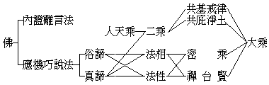

# 世苑圖書館館員之修學方針 1
（1934 年 9 月，在世界佛學苑圖書館講）

**3 千字**

## 目錄

- 一　修學的宗旨
- 二　全部佛法之鳥瞰
- 三　研究的方針
    - 甲五三　共法系
    - 乙　小大律藏系
    - 丙　法相唯識系
    - 丁　般若中論系
    - 戊　中國台賢禪淨系
    - 己　印華日藏密法系
- 四　結論

## 一　修學的宗旨

這裏在歷史上叫作佛學院，現在所辦的是世界佛學院圖書館，這是專門研究佛學的圖書館，與普通不同。圖書館內的工作，分考校與編譯二部2。但要考校、編譯，非有人才不可，所以本館設立考校與編譯二研究室。因研究的人才不易多得，因此更設立研究員預習班，以養成研究員為鵠的。在此修學的預習員，要認清目的，才有良好的結果。

## 二　全部佛法之鳥瞰

佛法、是佛所證所說的法。普通都把佛分為三身，即是法身、報身、應身，或自性身、受用身、變化身。甚而偏據佛說，把佛法分割為這是大日如來的法，那是阿彌陀佛的法。今年日本開汎太平洋佛教青年會，議定以釋迦牟尼佛為佛教共同的教主，換言之、即以釋迦牟尼佛為本師。因為十方三世諸佛皆據釋迦口中說出，與釋迦佛平等平等而無差別。所謂法身、報身、化身，乃依據事實上之佛而作分別說的，因此、我們都依釋迦佛的所證所說的法、名為佛法。

平常所謂佛法的法，有二種意思：一、證法，二、教法。證法是內證離言法，或者名為一真法界，瑜伽論名為離言自性。法華經云：「諸法實相，唯佛與佛乃能究竟」。此唯佛與佛才能究竟證到之法，聲聞獨覺偏證一分，初地以上菩薩具證一分而未究竟，所以說：「唯佛與佛乃能究竟」。其實、此諸法性相是遍於一切眾生世界的、不過唯佛陀的大智慧乃能澈底照見證知，所以推重佛陀，稱為佛法。

教法、就是應機巧說法。「諸法實相、唯佛與佛乃能究竟」，這是說佛的離言內證。而佛之說法在能應機，即是或適應地上以至等覺菩薩，或為適應地前菩薩、二乘、人、天等不同的根機，因此說大、說小、說空、說有。這都是因應眾生需要而施設的，謂之契機。而佛陀所說之教法，又無不與其內自所證之離言法界相契合，謂之契理。

二諦，即是世諦、第一義諦，也有叫做俗諦、真諦，或世俗諦、勝義諦。名雖不同，意義是一樣的。佛陀所說的法都不出乎二諦，二諦是大小乘佛法所共同的。所謂二諦法者：以佛之說法，注重點均在說明內證離言法性，這是第一義諦；而所說又皆是適應天人八部、聲聞、獨覺、菩薩的根機，其說明若惡若善若有漏若無漏的因果事理，及如何證果、如何解行的道理，就是世俗諦。

若以內證離言說，無能教之佛及所教之眾生；既無能證之智，焉有所證之相？一乘尚且不立，何況三乘？所謂「平等性中，無生佛之二體；真如界內，絕自他之假名」。這就是一真法界，乃是三乘共所依以解脫之無言說道，平等平等無有差別。

依此二諦，而說得窮盡的是大乘法，沒有窮盡是二乘法。二乘法即是四諦法，這裏有虛線實線三條，虛線是表示沒有窮盡的，實線是表示窮盡的。至於人天乘不過是二乘四諦法中之一部份，所以以虛線來表明世諦法，亦沒有說窮盡。而二乘的法在第一義諦上，亦祇說到一分。如三法印：一、諸行無常，二、諸法無我，三、涅槃寂靜；這三法印所明的就是離言法性，不過是沒有窮盡罷了。其實二乘說四諦也沒有窮盡，皆可包括在窮盡第一義諦世諦的大乘裏。

再次來明法相、法性乃至禪、淨、台、賢、密、律，這些都是大乘法。大乘將世諦第一義諦說得都很詳細。法華經云：「佛自住大乘」，由此可知大乘法是佛所親證的，佛完全說盡了。因此這裏用實線來表示，同時人天乘二乘亦可攝入大乘，不過猶不徹底而已。

在印度大乘佛法分為二大系：一、法相，二、法性。大乘法相亦說法性，不過偏重在法相罷了。其說明法性就在法相中顯，是從安立施設法相上而說到不可安立之一真法界的，這就是從法相以明法性的所在。至於大乘法性，重在第一義諦的說明，而對於法相不大重視，為說明法性而帶明法相，粗略不詳密。所以在法性上以虛線表示對於世諦說未窮盡；同時在法相上亦畫有同樣的虛線，表示對於第一義諦略而不廣。

復次，從流傳的宗派上看來，要是從法相法性上來判別，偏重于法相的有華嚴、密宗等，偏重於法性的則有天台、禪宗等。若是從修觀上說，密宗是偏于法相的假想，而其說明的理論上，亦重法性的空理；禪宗是不立文字見性明心，專明第一義諦的——內證離言，是要實行修證的；但是平常所謂宗通、說通，在世上建立也離不了法相，所以禪宗亦兼法相。

至于賢首、天台都有所依的經，如賢首是依據華嚴經而成立的，天台是依法華經而建立的。其實台、賢起初都是從修觀行而得到的：如杜順和尚修觀著華嚴法界觀，經過二三代以經論印證，迄至賢首國師才成立教義。又如北齊慧文大師讀中論、智度論，悟一心三觀之旨，以經論為印證，傳至三祖智者大師才發為教義。華嚴經本是法相六經裏面的一部經，故賢首宗注重在法相，不過是融攝法性以明。天台宗依於大智度論、中論，近於法性而亦融法相。至於密宗、禪宗從法相、法性之修證而成立，更顯然可見。

此外還有律宗和淨土二宗，這裏所謂淨土，不是專指念彌陀而說，淨土有十方諸佛的淨土，有諸大菩薩的淨土，念彌陀不過淨土中法門之一而已。淨土是為已發心修行的人，在一生未能證聖果，因為未證聖果轉身就容易退墮，或不免墮三惡道流轉生死，這樣失去了一生的功行，豈不是很可惜的嗎？因此從諸佛菩薩所示居的淨土，使眾生持念一佛或一菩薩的名號，仗彼諸佛菩薩的大悲願力，使其往生彼土，令其得不退轉，免墮六道輪迴，這是淨土緣起的真意義。

大乘中所信行的淨土，如西方極樂淨土，兜率內院淨土，不過在二乘裏沒有明顯的表出。所以圖上只用虛線。庇是託庇的意思，共庇是表明大小乘共同所庇，即是依靠諸佛菩薩的淨土接引。如大富貴人家的別墅或賓舍，可收留教養投靠的人。

律宗，不是專指傳戒、受戒而言，律有比丘、比丘尼、式叉摩那尼、沙彌、沙彌尼、優婆塞、優婆夷之七眾律，更有大乘菩薩律與密宗律等；人天、聲聞、獨覺、菩薩所共同遵守的，所以圖上說戒律是大小所共基的，就是這個意思。

## 三　研究的方針

這樣將佛法作最概括最扼要最簡單的說明，使各宗各系各安其位，互通互融，相資相助，不相衝突，調和發展，並重研究。因為大乘各宗原是平等平等，每宗都有它的殊勝的地方，不宜執立門戶，分河飲水。講到這裏，又要講到本館研究員預習班了。預習員就是未來的研究員，而研究員的工作，上面已經說過分考校編譯二部。考校編譯的工作，第一個條件要對於整個佛學，或某宗某系的經論文字，要有澈底的明了的認識，對於中心的思想都要抓得住，這樣才行。不然，經論上的文字都不懂，理論尤其莫明其妙，還配得上做考校編譯的工作嗎？所以預習研究員在這期間就要練習這種——考校編譯——工作，要預備作一系一系的專門研究，才能精深專一，才能做到登峰造極，升堂入室。若是不專門研究一系，祇是作廣泛的瀏覽，這畢竟於我們沒有多大的裨益。因此我定了六系，作為你們研究的標的：

### 　　甲五三　共法系

五即是五乘：一、人乘，二、天乘，三、聲聞乘，四、獨覺乘，五、菩薩乘。三就是三乘：一、聲聞，二、獨覺，三、菩薩。合攏起來說就是五乘三乘所共的佛法。但是三乘共法亦即小乘，五乘共法亦即人天乘，均包括在聲聞裏了。平常講小乘意存毀呰，其實錯了，小乘亦為大乘階梯。而此系以俱舍為中心，旁及阿含諸經，婆沙、六足、發智、正理等論。這系現在研究員有一二人已在研究。

### 　　乙　小大律藏系

律藏中，如四分律、五分律、十誦律、僧祇律、根本說一切有部律等，都是小乘律；而大乘律則散見經論，即梵網菩薩戒和瑜伽菩薩戒等。雖中國歷來所行的是南山宗四分律，但今此研究律藏不僅是專研南山四分律而已，應當研究大小乘所有的不同戒律。這系現在研究員亦有一人在研究。

### 　　丙　法相唯識系

法相唯識是印度原有的，依彌勒菩薩所說的瑜伽師地論為本，以成唯識論為綜合。所依之典籍有六經（一華嚴經，二解深密經，三如來出現功德經，四大乘阿毗達磨經，五楞伽阿跋多羅寶經，六大乘密嚴經）十一論（一瑜伽師地論——本論，二百法論，三五蘊論，四顯揚聖教論，五攝大乘論，六阿毗達磨雜集論，七辨中邊論，八二十唯識論，九成唯識論，十大乘莊嚴經論，十一分別瑜伽論——這十部是支論），尚有其餘附屬的經論。現在館中尚沒有專門研究的人，將來預習班要有一二人來專門研究才好。

### 　　丁　般若中論系

般若中論系就是法性，在中國亦名三論宗，以中論、百論、十二門為依據，以大般若經為本。或名四論宗，三論外加一大智度論。因為以大般若、中論為中心的思想，所以名為般若中論系。此宗創自龍樹菩薩，龍樹菩薩是印度建立大乘佛法的始祖，而此宗中論與整個的佛學有大而且切的關係，所以研究佛法，般若中論系是不可不研究的。從前本館有二人研究般若中論系，現在還沒有人。

### 　　戊　中國台賢禪淨系

天台、賢首、禪宗、淨土，這四宗是中國創立的，可算是中國的佛學，所以名它為中國台賢禪淨系。天台宗是北齊慧文大師讀中論，悟一心三觀之旨；傳南嶽慧思大師，依之悟法華三昧證六根清淨位；三祖智者大師從以修習，得法華三昧之前方便，乃傳其觀法，依法華廣宣教義。因為居浙江台州天台山，故名天台宗。賢首宗是中國杜順和尚，居終南山，依六十華嚴修法界觀行，製華嚴法界觀，此宗教義至賢首國師始宏傳，所以名為賢首宗。禪宗雖是印度南天竺菩提達摩泛海到中國來傳教，但是成立為一宗也是在中國建立的，亦可算是中國的佛法。禪宗大盛於唐、宋，與我國思想界的關係尤為密切。淨土宗是以希求往生阿彌陀佛之極樂淨土為宗旨，所依之典籍有三經（一無量壽經，二觀無量壽佛經，三佛說阿彌陀經），一論（即菩提流支所譯之往生淨土論）。此宗之創始者是廬山慧遠大師，所以亦是中國獨有的。這四宗可作為一系的研究。

### 　　己　印華日藏密法系

密宗即是真言宗，因為依秘密真言為宗旨，故名密宗。此宗所依據的是大毘盧遮那成佛經、金剛頂經、蘇悉地經等及諸部儀軌。在印度有先期後期，先期是當中國唐朝，後期是當中國五代及宋朝。所以由中國所傳流日本的是先期密法，五代宋初所譯之經典，雖亦以密典為多，而未有弘揚，故後期密法所傳以西藏的為完備。這六系中比較起來，以此系為較難研究，目下未易做到。

## 四　結論

現在我們所要研究的，而環境上能夠研究的，就是前面五系，所以我很希望你們安心在這裏修學，一年後各人作分系研究的工作。研究的結果——即考校佛典、編譯佛典，便是本館的事業。今天將本館的宗旨和你們修學的目的，及全部佛學的大綱和研究的系統，作簡單的很概括的說明。詳細指教，則有在館中領導的各主任法師居士在。

（智藏記）（見海刊十五卷九期）

## 註釋

- **1**：原題「對世界佛學苑圖書館員訓話」，今改題。
- **2**：此節頗有刪略，所論考校與編譯，可參看佛教的教史教法和今後的建設。
