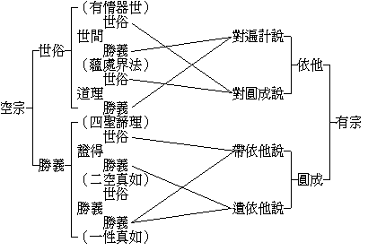

# 漢藏教理融會談
（1937 年 9 月，在漢藏教理院講）

## 目錄

- 一　發端
- 二　空有問題
    - 甲二　諦上觀察空有宗
        - １嘉祥四重天台七重賢首五重等
        - ２瑜伽唯識的四重二諦
    - 乙　論法上觀察空有宗
        - １有宗用科學邏輯立論
        - ２空宗龍樹等用辯證法破顯
        - ３空宗清辨派近於形式邏輯
    - 丙　空有宗比觀
    - 丁　漢藏應互學
- 三　顯密問題
    - 甲　不取東台密判教取藏所分顯密
    - 乙　性相為顯台賢禪淨等即等於密
    - 丙一　切佛法之顯密觀
        - １顯中顯
        - ２顯中密
        - ３密中顯
        - ４密中密
    - 丁　重重顯密之勝劣觀
    - 戊　台賢禪淨及各派密續之互學
- 四　結論

## 一　發端

現在研究佛學，和從前不同了。現在研究的範圍更擴大，若說研究，就有巴利文系佛學，如錫蘭、緬甸等；漢文系佛學，如中國、日本、朝鮮等；藏文系佛學，如西藏、蒙古、尼泊爾等。由這三系，流入西洋，更有西洋人的研究法。所以現在世界上關於研究佛學，有許多問題，如古學今學問題。古學，如三系中各自保守傳統的研究法；今學，如從科學研究法而研究佛學，尤其日本盛行這新的研究法，所以反應到中國及全世界，就成為佛學的今學：於是現在即產生今學古學的問題了。

其次是大乘小乘問題：如我們中國等地向來所流行的就是大乘，所以說錫蘭、緬甸等所流行的為小乘。但是、他們並不承認佛教有大小乘，所以說他們是小乘，他決不承認，在他們，自認為這是原來的佛法，或是根本的佛法；大乘反而是由流行變化成的，或說非佛法，或說非根本佛法，或認為大乘佛法是從他們的根本佛法上推廣出來的，沒有超根本佛法以上的佛法。如前年錫蘭的納囉達在滬時，說他在日本曾對日本人說，佛教不應分什麼大乘小乘，都應一概視為佛法，很得日本人的贊許。彼亦以此意徵問於我，我說：認為都是佛法，這是很好的，不過對於各地各種的佛法皆應遍學，不然、則反成自蔽於古籍。又如現在有到錫蘭等地留學去的，如稍有心得，便覺得唯彼所學才是真佛法，中國向來所傳的並非佛法。類似此等問題甚多，皆非現在所說得盡，暫且不談。今天專從漢藏教理關係重大的略談。

## 二　空有問題

### 　　甲二　諦上觀察空有宗

現在當說漢藏佛法中的空有問題：空有即空宗、有宗（並無其他深意），也就是平常所稱的法性、法相。有宗講三性，但三性不是共通常談的，所以就空有共同常談的二諦來說。

二諦在中國古代的譯名很多，有說是真諦、俗諦的；有說是世諦、第一義諦的；到了唐譯，才確定名稱，叫做世俗諦、勝義諦，為空有二宗所沿用。然此等不同的譯名，余意可以不必解說，現在但從二諦的意義以觀察空有二宗的差別。

#### 　　　　１嘉祥四重天台七重賢首五重等

在中國古代，古德們對於二諦就淺深次第而解說，很有些出入，如嘉祥說四重二諦，天台說七重二諦，賢首依據五教說五重二諦等。此皆古德們約經論的意義，及內心所悟的道理而解釋，在印度譯來的經論上並沒有此種的解釋，所以他們也無一定的根據。現在我們只要知道古德們有此五重七重等的解釋就夠了，不必再說。

#### 　　　　２瑜伽唯識的四重二諦

有宗所說的四重二諦，見於瑜伽師地論和成唯識論，這是有聖教根據的，所以詳為解釋以觀察空有宗的差別。

四重二諦，就是世俗勝義各有四重。世俗的四重是：世間世俗，道理世俗，證得世俗，勝義世俗。勝義的四重，就是世間勝義，道理勝義，證得勝義，勝義勝義。上二類四重複合起來，於法共有五種：就是在世間世俗有一種，即第一有情器世。第二五蘊等蘊界處法，就世間可名勝義，而從道理上說則仍為世俗。第三是四聖諦理：此四聖諦明世出世的染淨因果，也就是所謂捨染成淨捨凡成聖的因果，這在道理上是勝義，但在聖智的證得上則為世俗。第四是二空真如：二空謂人我空、法我空，亦云生空、法空，就是由此二空觀智所證的真如，因為帶能證慧的不同，所以說為我空真如、法空真如。此二空真如在智的證得上可為勝義，如證生空真如，就所證眾生空性，是無差別相的，所以大乘般若對聲聞人明法性無差別，每從其證空無相辨之；證生空性時，無四諦差別相可得，然尚帶有差別名言安立，所謂生空真如、法空真如、及十地十真如等，故在能所雙忘心言俱絕究竟勝義上，仍為世俗。再進一步，就是第五勝義勝義了；這勝義勝義，泯一切名言安立思想觀察，唯如實真性。於這四重二諦之五種法上而觀察空有宗的差別及其關係，如左表所示：

大概空宗說有情器界、五蘊十二處等法，及四諦中苦集道之部份，皆是因緣生法；既是因緣生法，就為世俗諦，於此因緣生法上建立世俗假相假名，故說有諸法。而這些假法其性本空，此空性為勝義，也就是滅諦。又就四聖諦對待相上說，也都是名言安立的假相，無苦集滅道，所以唯有證空性真如、或無智亦無得、畢竟離分別言說的一味真如，乃是勝義諦。因此、故說世出世的一切法，都是因緣假名，其性本空。

在有宗所說的，就複雜了。他說：這眾生世間及器世間，是依蘊等和續而起，但是世俗；而蘊處界法及染淨因果等，雖亦是依他起因緣生法，皆不離識。就識變上，破除遍計所執實我實法，對所破的遍計執方面說，此等依他起因緣生法亦可是勝義法。然若對圓成實而說，還是世俗而非真實，所以蘊處界及四聖諦等，對圓成實都是世俗的。即就證得勝義的二空真如，也尚帶有言說假立依他起相。比如四聖諦所說的苦集滅道，仍是依他起上的共相理，而並非離一切相的無相真理，故亦是世俗。因二空真如，是就能證二空的觀慧門上，說為人空、說為法空，而所證的空性，沒有人法的區別。如就人空觀，以能破除人我執，說為人空等，這猶對有為諸行說無常義，故說帶依他相，不過無漏空智已是淨依他了。至就究竟無差別性來說，這證真如的差別智境也不可安立，空平等性離一切分別，遣盡一切依他起相，才是勝義勝義諦。

以上二說，雖可見空有二宗的不同，但於此二宗可就各人意樂的不同，或趣入有宗，或趣入空宗；如於有宗所說的重重二諦差別上，覺著從世間世俗到證得世俗皆無非是世俗假法，雖然彎彎曲曲的說世間勝義等，其結果仍不過說明緣生性空，不出空宗的二諦理，此空宗義豈不簡明確實？何用彎彎曲曲於勝義上生許多障礙，反使其不直截明顯！故不如空宗因緣生法自性皆空來得爽快。如弘一法師前在廈門曾對我說：他所以不喜歡研究法相唯識，因為研究的結果仍不過明人法二空。故中國昔時唯識學並不怎樣興盛，一般人都喜歡趨入天台、賢首、禪宗等。但是近代科學哲學昌明了，有宗義和科學哲學重重義相，有能攝受現代思想的機用，所以復成興盛的趨勢。如現在的世間常識所認的宇宙萬有、地球星球等等，就是世間世俗法。至於說到世間勝義道理世俗的蘊處等，在小乘中講明的如一切有部諸論及俱舍論等；而這些所說的，多近科學，如純理的自然科學等。

純理科學的解析宇宙萬有，不出一、物理，二、生理，三、心理的三種現象。例如專從物理研究的對象上，就可以無整個的人物等而唯是質力，故從科哲學觀宇宙萬有只為質力等的結合體，也猶小乘觀唯有蘊等法而沒有實我的意思。物理學對象即等於六塵，生理學對象即等於六根，心理學對象即等於六識。所以科學所見的萬有和常識上見的不同，科學所見的較為確實，而常識所見的不過就和續相的人物上的觀察；因此科學知識的境義較常識的境義為勝進，得名勝義。

又小乘猶有執蘊處界等是實有者，科學知識上也認為物理等是實有，但在唯識則說蘊等法，都是唯識所變的。識就是五蘊中的識蘊或受、想、行、識，十二處中的意處，十八界中的意界及六識界。這同於現代的科學哲學之休謨經驗論、羅素新實在論等，他們說宇宙萬有所存在的原料唯是感覺經驗；這都歸之於感覺的說法，和唯識所明的前六識之現量性境同。其物理、生理、心理都從這感覺分析出來，這感覺就是根本的實在，這種科學哲學很可相通到唯識論，更可名為世間勝義。

於蘊、處、界等法而明一切皆唯識，可接近科學的哲學而引科學者入佛法，因為科學的哲學所認為實在的，唯識亦然。但這所認為實在的，並不同於常識，常識的人物等必由概念以立種種名而起分別，感覺則不待概念而直接了知。如現前感覺冷熱等，不必有名相而有感覺自相，這和唯識所講的性境相似；就是於塵識等，不須起名言種類分別，在感覺即有自相，也就是正明其為唯識現。故唯識論能將世間世俗所不同於世間勝義之界限詳細分明，很合乎現代的常識與科哲學理智的區別。

又從四聖諦的道理勝義以明，就是安立世出世間的染淨因果之理，所謂苦、集、滅、道。苦集就是世間的染果染因，滅道就是出世的淨果淨因。這在世間通名上說，就是宗教；即明此世出世染淨因果，皆唯識所現，就成宗教哲學。這裏的宗教哲學，是指佛法，依佛法所開導的斷染因果、證淨因果為趣向之目標。然不明唯識義則不能成立宗教哲學，因為對於世出世、染淨因果不能詳確精徹的說明，於現在有科學知識的人，便不能予以確實的認識而起其宗教信仰。故唯識所現，更是說明道理中的勝義，也就是唯識學的特長。至於就圓成實說後二重，以猶帶有依他起的世俗法，故在證得是勝義；在勝義勝義尚是世俗，若遣盡了世俗相就是勝義，也和空宗無何差別。這是就二諦上略說空有的不同點。

空有宗二諦上的差別，在有宗世間勝義和道理勝義上，空宗不承認其為勝義而與之辯論。至於證得勝義以下，便沒有什麼差別了。然有宗說的世間勝義等，不過是對待世間世俗等而說，並不許為究竟勝義。明此，則二宗可無諍了。

### 　　乙　論法上觀察空有宗

#### 　　　　１有宗用科學邏輯立論

有宗立論的方法，多用因明。因明和西洋論理學比觀，是包括演繹法、歸納法的，屬於歸納的一種，就是所謂科學邏輯。邏輯、譯為論理，是合理不矛盾的意義。這科學論理，為西洋近代文明特色。若從所立的一種假設去種種觀察而得同一的結論，成為公理定律，就叫歸納論理。此在因明上也有這種意義，例如瓶等所作故無常，證聲也是無常，這等字即指從瓶盆等多種觀察得到同一的結論。

有宗從無著世親等造論以後，多用科學論理的方式。如於佛經上意義不發生問題的，就依之說下去；若有問題了，則引多種經及多種理來成立，如立第八識，引五教十理以證成。又如建立世間勝義之蘊處界與道理勝義之四聖諦等，都是用科學方法立論。其特長，就在精詳的建立法相及因果之理。

從此等科學的立論法上，也自然有唯識的趨向。如被現代科學研究所逼生的哲學認識論，就其認識的限度，以立對於宇宙萬有認識的範圍，這很近乎唯識的道理。又如最新物理學講到最後之物質波，以現於認識上而名之為認識波，彌近唯識所變義。

#### 　　　　２空宗龍樹等用辯證法破顯

龍樹、提婆、佛護、月稱等的傳承，他們都用似乎近代西洋的辯證法——亦譯對演法——來破執顯理。因為龍樹等的論旨不適於用因明，重心唯在直明諸法空性實相，故用辯證法。這辯證法，是觀萬有皆不安定而變動無常，一切存在皆是含有矛盾性的暫時統一，而無絕對性的統一；祇是矛盾的統一，故不能永久安定。由矛盾故發生變化，由變化又起新的統一，新統一仍是矛盾的和合，不安定的，有變化的。

從龍樹等所說的看，亦說萬有皆因緣有，都無有決定的自性。這因緣和合有，就是矛盾性的暫時和合，剎那生滅變化，不成決定不變的絕待自性；故於空宗，假使要究其決定的自性，他的回答，就是一個空字。不但蘊界處是如此，就是苦集滅道也如此。然非無矛盾和合的暫時存在，不過是因緣有的存在罷了。由因緣有故無獨立的自性，不能安定的存在，究之、就是畢竟空。這就是由因緣法上顯其空性，亦即在空性上說明因緣如幻的道理，比西洋的辯證法更為徹底，更不須用因明。因為是自無所立所說，皆就他之立說而破，如聖天說：『破如所破』，就是說能破的理亦同所破的執而空無所存。故此空宗最徹底的辯證法，較西洋的辯證法更進一步了。

#### 　　　　３空宗清辨派近於形式邏輯

中國以前羅什到嘉祥的三論宗也用辯證法，不過就後來傳入的清辨的學說觀之，似陷於形式邏輯。西藏所傳，則有佛護月稱派和清辨派，區別頗嚴。或說其不同點在於因緣世俗立自性和不立自性。依我看來，這立不立自性，不過名詞上的區別；以清辨等的自性也是就緣生法假名的，並不同世間所執的實我實法——實我法的自性，唯識和清辨都是早已破除了。如小乘破凡夫我執，大乘破小乘法執等，所以不但清辨不執，即有宗也是不執的。故清辨所說的自性也是不過世俗名言上相待而說，如待彼說此說此非彼等，並不違背因緣假名的道理；則用不用自性之名，自是沒有多大差別了。其最大差別，還是在立論的方法。按西洋的論理學，有演繹法與歸納法。演繹法的形式邏輯，只求形式對而其實無益。例由大前題中抽出小前題而作斷案，其斷案是於大前題中已決定的，如曰：「有為是空，緣生故，如幻」；緣生與喻均是有為，因喻已為前陳所包，所以這種立論但有形式而不生功用。所以，空宗自無所立，唯就他人的立說而破，他若無所說，自亦無所破。若如清辨自有所立，是則不能不就色心等各立自體為立論的基本，反蔽畢竟空義。所以空宗兩派，是立論法上隨應破與自立量的不同，而帶起立不立自性的差別。

### 　　丙　空有宗比觀

空有二宗，都是大乘。就空宗說，地前菩薩位上，以徹觀空性而證究竟勝義為勝，有單刀直入之功。有宗以顯理策行為勝：如有宗顯示蘊處界各各因緣，及無始時來凡染因果與如何對治修證而轉成聖淨等，非常詳明；由此等理論使一般能了解的有智慧者，不能不信受而發起捨凡成聖捨染成淨的心。因此、有宗以令人修習淨行，對治染因，策修廣行見勝。更就地上觀二宗，空宗說根本智境，有宗說後得智境。如唯識說『勝者我開示』及『我於凡愚不開演』等，皆明是後得智境。是則二俱智境，平等平等；若至佛果，則一切智智更無二宗的差別。

### 　　丁　漢藏應互學

漢藏雖都有性相二宗，但是兩地都有所缺，如漢文佛教缺少關於空宗的，有佛護、月稱、阿底峽、宗喀巴等發揮空宗的理論，這些都應當學。關於有宗的，中國於安慧的唯識不完備，亦需補充。至在西藏方面，也應學漢文佛教的護法、戒賢、玄奘、窺基等的唯識義，及羅什以來三論宗義和安慧中論釋等。這樣、纔可和合成空有圓融的大乘。本來、空有二宗論傳到中國，大抵皆提倡相助相成，而不是相破相毀的。如有宗雖明世間的道理的勝義等，無不以通達二空真如的真唯識性為究竟，故與空宗並不相違。但法相所說，在空宗的因緣假有上、對於凡夫外道小乘所執的人法上，以重重破除而顯重重的染淨因果差別，如辨二無心定差別及二世緣起義等，此皆非俱舍等小乘法相之可及，豈應以偏見而捨瑜伽、唯識等勝義而不用？這是從漢藏教理上略談到的一點。

## 三　顯密問題

### 　　甲　不取東台密判教取藏所分顯密

再講顯密問題。顯密所以成為問題者，是由於密咒興盛，而批判其餘一切教法為淺顯，成為顯密對立，所以發生了問題。本來、密教傳到中國也是很早的，大概在六朝時候吧，便有了雜密的經典輸入。但是、真正的建立密教，還是在唐朝開元年間，當時有名的人物，如善無畏、金剛智、不空三藏等，都是專門宏揚密教的上師。並且在這時，也傳去了日本。中國的佛法，因為經過了唐武宗的毀滅密教也就一蹶不振，繼之而起的是不立文字的禪宗。一直到了元明清的時候，因為蒙藏的關係，帝王很多信仰密宗，在北方五台山等處也有很多密宗寺院；但多是喇嘛，和中國僧眾及民間信仰，沒有什麼關係。所以，可說漢土民間信仰祗屬禪宗等；其燄口和其他的密咒，雖普遍於民間，為社會的風俗信仰，然非寺中修習的正課，如禪門日誦中的密咒，不過是附屬的一種助行罷了。在民國六七年前，還沒有所謂顯密問題。近年來，因為密教的勃興，一方面有由日本而輸入中國的東密、台密，一方面由蒙藏關係的密切，而傳來黃、紅、白各派的藏密。漢地佛教有了密教而佔有重要地位，形成顯密對立的狀態，因而又產生所謂顯密問題了。

現在判顯密教法的，有西藏和日本兩方面。依日本所傳的，又有東密台密兩派：東密是弘法——空海大師所傳，以東大寺及現在的高野山為基本道場；台密是兼天台宗的傳教大師所傳，以延歷山為主要道場。這是東密、台密得名的由來，且亦是密教在日本放一異彩的中心點。不過日本的空海首把顯密二教剖開，如中國密宗的經咒儀軌中，歷來皆無判教之說，自從弘法大師著了十住心論及顯密二教論以後，就有了密宗判教之說。十住心論，他還是根據賢首的五教，如十住心論中有畜生心、人心、天心的三種世間心，及聲聞心、獨覺心的二種就是賢首的小教，其第六、七、八、九心，就是賢首始、終、頓、圓的四教，此外再加密教為第十心。所以教理的分配，不過在賢首五教上更加密教。但其建立顯密二教分判法，不啻把整個的佛教解剖開了，不免有所偏蔽，所以為現在講顯密問題所不取。

台密本來的判教法，是依天台的四教，而說圓教為密教；後來因受了東密的影響，便說法華等為理密，密宗為事理俱密。依我看來，日本東台密的判教法，是依於台、賢而失其當。因此由其判教之結果，演成各宗派而無整個佛法的流弊。現在不取日本所判的顯密，而取西藏所分之顯經密續。

西藏於佛說，除律以外總分為顯經密續二種，從說人天聲聞等小乘法及說空有觀行等大乘法為顯經，其餘由師弟傳承的咒印儀軌等為密續。其相傳續承的密法，換言之，亦即實際的修習法，所以密宗道次第上亦未另有判教之說。單就所傳的實際修習法而說為作、行、瑜伽、無上四層，故今取之。

### 　　乙　性相為顯台賢禪淨等即等於密

此義在上次佛理要略中也曾說過，所謂大乘法有三：一切法自性空義，一切法唯識現義，一切法大總持義。這裏的相，就是唯識，性就是空宗，此二皆重在以教顯理，即將一切法的究竟性和行果的差別相，用教把他顯示出來，是教的本義。

整個的佛教，傳到了中國，就產生天台、賢首、禪、淨等宗。禪雖是印度傳來的，但成為宗派者，是在中國。然淨土宗在中國，猶不過念佛發願往生罷了，其說理是附屬於台、賢、禪等，並沒曾另有判教等的方式。但傳到日本就不同了，日本別立淨土的教理系統及判教等的方式，發達至淨土真宗，且建立教解證信的四個次第，而不言於行。他的教是彌陀教，於此起解，由解而證，由證方為真信，真信就等於已生極樂。其念佛不過感念佛恩罷了，和中國要由念佛等行而求往生不同，故彼稱純他力宗，不藉修行。其現在的世間行化，也是已生彌陀極樂而來度人而已，這是淨土教發達最極至的表現，故淨土真宗即等無上密宗。又如天台圓教一念中具足理事兩重三千性相，深明法法即是大陀羅尼義，與賢首之事事無礙法界相同。禪宗在表面上其問答多不可解，而在此問答上就直示法身全體大用。如從前杭州鳥巢禪師有一個侍者，侍師多年，以師平常一點佛法也不講，乃告假欲去。師問其故，他說要向他方求佛法。師即手拈衣上布毛一吹曰：「若佛法，這裏也有」，侍者頓悟。這豈非信手拈來無非佛法之義？也就是一事一物無非大陀羅尼法，所以台、賢、禪、淨的行法，即同密宗。天台等雖判一大藏教，然宗要上即一心三觀，賢首也唯是華嚴法界觀，所以就其宗要說，與密宗無別。

### 　　丙一　切佛法之顯密觀

前面二段是就部份的佛法觀察，這裏是就整個的佛法而觀察顯密，略分四類如下

#### 　　　　１顯中顯

以前講的五乘共法、三乘共法、和大乘法相、法性等，都屬於顯中顯。雖大乘法相對於法性亦說尚有隱密未顯了處，而對於下列三重還是顯中顯的。

#### 　　　　２顯中密

在所依的經典如華嚴法華等，是屬於顯經的；可是台、賢、禪、淨的宗要所在，都是明一切法皆大總持而修觀行的。此觀之天台所說，任何一色一香皆即法界，一切法皆不能趣過任何一色一香，就可以知道了。

#### 　　　　３密中顯

即唐宋以來漢文教典所傳的密咒經軌，和日本依於漢文經咒儀軌所傳的金剛界、胎藏界等，以及藏蒙紅白黃各派所傳的密法。此等雖是祕傳的密法，而經咒儀軌等明修行次第，皆有定軌法則，其修習觀想等法，也是極其次第差別明顯的，因此可立為密中之顯。

#### 　　　　４密中密

禪宗在門庭施設上，可說為密中密。禪宗的特重點，專在乎證而不在乎教，所謂心心相印，相印就是證到了，不相印就是不曾證得，故稱教外別傳，所以成密中之密。在各宗究竟極證上，都為實證而無言教安立的，至於說即身成佛、即心是佛等，已是多事了。因為在密之極密是毫無生佛相可安立的。

### 　　丁　重重顯密之勝劣觀

現在講的勝劣，就是依於前面的顯中顯、顯中密、密中顯、密中密而判別。前面四重中的顯中顯，除了五乘共法三乘共法以外（因為五乘三乘共法，只攝大乘一分，故不另），其餘如顯中顯的大乘法性法相及顯中密的台賢禪淨等，既可互為平等觀，又可互為勝劣觀。因為就顯中顯的大乘性相而說，可算是顯之最淺顯的，而顯中密的台賢禪淨在顯法中，以明一切皆大總持之不可思議義，就比較深了一層。至於密中顯所依的教法已深祕玄密，更能從實習上重重顯明出來，比較又進步了。到了密中密，就是甚深最甚深，最高無比的了。同時，也是一程序中所指的最殊勝法。

但以上四重，是由顯淺而深密說的，若是把這四重行列倒轉來，則其勝劣也可互易其位。如密中密，可說為佛法最淺劣的，因為密中密所主的，即在法界法性，無論有佛出世、無佛出世，其性法爾常在，如禪宗說「古鏡未磨，照天照地」。因此、故說一切眾生即是佛，無佛外之眾生，也無眾生外之佛，即生即佛，無生無佛，都是密之極密的意義。而一切都是黑暗的，一切都是無別的，禪宗說「墨汁烏紗半夜文」，即是此義。所以、密至極密，既無一點佛法，也無能證的行所證的果，甚至連佛出世也是多事，所以雲門說：「老僧當時看見，一棒打殺與狗吃，貴圖天下太平」。因為有佛出世，於是有佛有眾生，便要分別得不安了。若不出世，豈不都是佛？豈不毫無分別？從此義上，故密中之密即是黑中之黑，是最未顯的佛法。從此進一步是密中顯，這猶如黑暗中有一微光、晚上的星燈一樣。因為密續若無性相教理等的說明，單仗傳承的密咒和儀軌等的指示而觀想修行，好像在暗中靠一點燈光行路一般。再進一步就是顯中密，此對於十法界聖凡因果等已能種種分別，把他顯示出來，並顯出假中之空及空中之假等中道義，這猶如月光一樣，遍照世界。但此月光，還非至極的明徹，故須待顯中顯的大乘法性法相，對於因緣性空及性空因緣的究竟道理，不但以多種經說明，且以多種論不憚煩地重重詮顯，像這太陽光一般的周澈明顯，乃可說是最究竟的佛法了。而且、這大乘法性法相，將世出世的重重緣起差別顯露出來，皆成為究竟正遍知的所知境，而照了一切法更無餘障。所謂正遍覺者的正覺中，一切法皆是大圓鏡智智影；大善巧的教法中，於一切法平等理和差別事莫不如理如量顯了，所以把前面的密中密倒轉來，顯中顯又是最殊勝了。然此不過舉例說說罷了，實則此中還可作別種看法，如從天台賢首等宗義上，也莫不各各顯其宗義為最勝，在此所顯義上，也別別以分判餘法之勝劣。總之、凡以何法為宗的，就以何法為最勝；此不但於教法是如此，就是各傳其密法也是如此。如日本、西藏、漢地皆各有所傳所宗的密法，而各就其所傳的密法表示為最勝。故在此顯密重重次第上看來，就可見一切大乘法是平等的，而在平等中又各有勝義勝用的不同。

### 　　戊　台賢禪淨及各派密續之互學

此從顯密問題上觀察，覺漢藏佛法應互修學，尤其在漢藏教理院對於漢藏佛法應互相研究。如西藏各派所傳的各部密續，中國缺的很多，我們應去修學。若中國台賢禪淨的修學有成就的，對於西藏也可作轉播，使藏人亦對台賢禪淨有所研習。如此、乃能澈佛法之底，盡佛法之量。

## 四　結論

台賢禪淨可說是唐宋以來的佛法，到晚唐後，大乘法尤其只流行台賢禪淨。在這千年的時候，大凡中國佛教徒所修學的，教、就是台賢，行、就是禪淨，唯此可以代表中國整個佛教。但是、近來中國佛教的命運，也如中華民國的命運一樣，日趨衰弱！中國佛教的破產，也如中華民族的文化一樣，支離破碎，空疏荒蕪！像這樣潰爛的中國佛教，似乎無有可代表中國從東漢到唐以來、中經幾百年所結晶的中國佛教的特質了。由此在最近，或把佛教從日本傳到中國來，或從西藏傳到漢地來，或從錫蘭傳到中國來；也如中華民族的趨勢一樣，由幾千年進步來的文化已不能自存自立，反退化到唯以模仿外來文化為事。今中國佛教亦似乎破敗到這樣的不可收拾地步。然從東漢中經幾百年到唐代結晶下來的中國佛法，竟如此完全空疏而無意義無價值的嗎？其實不是如此的；可看此中所明的一切法大陀羅尼義，在四重顯密中都顯出台賢禪淨所說的特長。此大陀羅尼義，應總攝五乘、三乘共法及大乘性相而成為大總持法。既由總攝一切佛法為基礎而成綜合的中國台賢禪淨法門，豈四教儀、五教儀等就可以代表了嗎？這是要普容遍攝五乘、三乘、大乘的佛法，方成為真正的台賢禪淨中國佛法。就是要把台賢禪淨的中國佛法，從根救起來，要由這普容遍攝的途徑，方克濟事。雖禪宗的單提向上直指頓悟的宗旨，而此如畫龍點睛，先畫得有龍乃需要點睛以活現一條龍；若先無一切教法的龍，便也失禪宗點睛的用了。又如念佛固然也能夠總持一切佛法，然若不能普容遍攝一切佛法，而反事排斥，單執一句阿彌陀佛，亦不過執持空名罷了。所以，今應普容遍攝錫蘭等三乘共法律儀及大乘性相與西藏密法，乃可將中國佛法發達興旺，一天一天的充實復活。而在復活的過程中，發揮台、賢、禪、淨、總合的特長，將律、密、性、相，澈底容攝成整個的佛法，於是中國的佛教因之重新建立，而亦可成為現代的世界佛教了。

（碧松記）（見海刊十八卷十二期）

