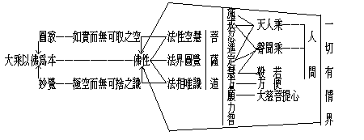
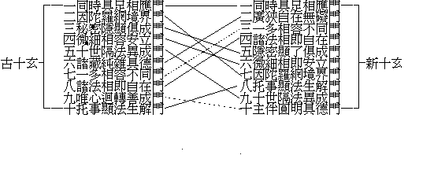
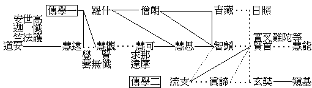

# 中國佛學
（1943 年秋，在漢藏教理院講）

## 目錄

- 第一章　佛學大綱
- 第二章　中國佛學特質在禪
    - 第一節　略敘因緣
        - 一　梵僧的化風
        - 二　華士之時尚
    - 第二節　依教修心禪
        - 一　安般禪
        - 二　五門禪
        - 三　念佛禪
        - 四　實相禪
    - 第三節　悟心成佛禪
        - 一　超教之頓悟
        - 二　達摩與慧可
        - 三　僧燦至弘忍
        - 四　慧能之師資
    - 第四節　超佛祖師禪
        - 一　行思與懷讓
        - 二　希遷與道一
        - 三　百丈與道藥
        - 四　雲龍與黃溈
    - 第五節　越祖分燈禪
        - 一　溈仰之邃密
        - 二　臨濟之陡徹
        - 三　洞曹之回互
        - 四　雲門與法眼
    - 第六節　宋元明清禪
        - 一　公案之拈頌
        - 二　話頭之疑參
        - 三　禪淨之合修
        - 四　宗教之和會
        - 五　空默之觀照
        - 六　語錄之纂研
        - 七　坐跑之兼運
        - 八　僧俗之常套
        - 九　仙道之旁附
        - 十　儒理之推演
- 第三章　禪觀行演為台賢教
    - 第一節　緒言
        - 一　賢首學與天台學名義之審定
        - 二　台賢為中國特創之佛學
        - 三　台賢皆以禪為源
    - 第二節　實相禪布為天台教
        - 一　天台學之根據
        - 二　天台學之先河
        - 三　天台學之成立
            - 甲　慧文慧思之創發
            - 乙　智者之完成
                - １建立八教
                - ２五時
                - ３一念三千
                - ４六即
        - 四　天台學之演變
            - 甲　荊溪與法相華嚴及禪之對抗
            - 乙　宋代山內山外與華嚴及禪之辨
            - 丙　蕅益援禪法相入天台
        - 五　天台學之述要
            - 甲一　心三觀
            - 乙十　法界
            - 丙六　即
            - 丁　性具
        - 六　天台學與禪律淨密之關係
            - 甲　天台學與禪宗的關係
            - 乙　天台學與律宗之關係
            - 丙　天台學與淨土宗之關係
            - 丁　天台學與密宗之關係
    - 第三節　如來禪演出賢首教
        - 一　賢首學之根據
        - 二　賢首學之先河
        - 三　賢首學之成立
            - 甲　杜順之法界三觀及十玄
            - 乙　智儼之六相五教
            - 丙　賢首之三時十宗
                - １十宗
                - ２三時
                - ３十儀
        - 四　賢首學之演變
            - 甲　慧苑之刊定
            - 乙　清涼之恢宏
            - 丙　圭峰之歛削
            - 丁　宋以來之衰落
            - 戊　明清來與天台之對抗
        - 五　賢首學之述要
            - 甲五　重法界
            - 乙六　相
            - 丙十　玄
            - 丁　性起
        - 六　賢首學與禪律淨密之關係
    - 第四節　賢首學與天台學之比較
        - 一　五教與化法四教
        - 二　十儀與化儀四教
        - 三　三時與五時
        - 四　同別圓與兼純圓
    - 第五節　結論
- 第四章　禪台賢流歸淨土行
    - 第一節　依教律修禪之淨
        - 一　無量佛剎
        - 二　彌勒內院
        - 三　彌陀淨土
    - 第二節　尊教律別禪之淨
    - 第三節　透禪融教律之淨
        - 一　禪宗之淨
        - 二　臺教之淨
        - 三　賢教之淨
    - 第四節　奪禪超教律之淨
        - 一　汎源
        - 二　切因
        - 三　碩果
        - 四　轉流
- 第五章　中國佛學之重建
    - 第一節　略指所依
    - 第二節　教史概觀
        - 一　主流
        - 二　旁流
        - 三　表攝
    - 第三節　博究融匯
        - 一　安般禪五門禪之探攝
        - 二　實相禪天臺教之探攝
        - 三　如來禪賢首教之探攝
        - 四　念佛禪淨土行之探攝
    - 第四節　綜攝重建


## 第一章　佛學大綱




本學期講中國佛學。前天講的議印度佛教，可以作為敘言；今天這個圖表，可以作為中國佛學的大綱。現在先將這圖表作一個簡括的認識：上面「大乘以佛為本」，即所謂佛法，也就是佛法界。最下面的水平線上為「一切有情界」，也就是眾生法或眾生法界。此眾生界有二線通到當中的「佛性」；佛性一線通到佛。這佛性可以看成是眾生與佛相通的心法，即平常所謂「心佛眾生」。由此，我們可以看出佛、心、眾生的不同，同時又可以看出眾生、心、佛的相通。

佛性以下和眾生界以上，是佛所說的教法。這些教法，一方面是佛所證的法，一方面是就眾生的機宜和接受的可能性所施的教法。圖中的佛性，即是眾生可能接受佛陀教化的可能性。這個可能性，非常緊要。如果眾生沒有可能性，即不能接受佛陀的教化。所以佛陀的教化，雖以一切有情為對象，但也要觀察眾生的機宜和接受的可能性，才能說出適應眾生所急切需要的教法來。圖中的教法，即是佛陀觀察眾生的機宜而施設的。

以上將圖表作了一個概略的說明，下面再詳細地分開來講。

大乘以佛為本：大乘法即佛自證法，亦即依佛本願力以教化眾生的法。所以只要說到大乘法，就應本佛能證所證之心境為本質。法華經上說：「三世諸佛皆以一大事因緣故出現於世，所謂為令一切眾生開示悟入佛之知見故」。又說：「諸法實相，唯佛與佛乃能究竟」。所謂佛之知見和諸法實相，就是佛的自證法界，亦即大乘法的本。

此處所講的佛，即佛法界或佛陀的自證法界，也可說是三種身土——法性身、法性土，受用身、受用土，應化身、應化土。二身、十身，減少增多都可以。如果再分類來講，可以分為無上涅槃與無上菩提；但綜合起來說，只消一個佛字。

涅槃是梵語，意譯為「圓寂」。在中國，一般人把圓寂二字亂用於人的死亡，這是一個絕大的錯誤。圓寂的本義，是功德圓滿、過患寂滅的意思；此已不但是三乘的涅槃寂滅，而是無上圓滿的大寂滅。菩提譯為覺，無上菩提即無上「妙覺」。此總無上菩提無上涅槃的轉依果，即名為佛。佛、是從二轉依的總相來講。若分開來說，即如上面所說的菩提與涅槃。關於這方面講得較詳細的，如佛地經上的五法：第一清淨法界，即此中所講的無上涅槃；無上菩提，即是四智——大圓鏡智、平等性智、妙觀察智、成所作智。就是說，妙覺或無上菩提，是此四智的總體；此即所謂佛，也就是大乘法的根本。這在密宗的教義裹，講五方佛或五智法身，亦即此五法，不過將清淨法界的名字改為法界體性智而已。此五法也可以配三身來講：清淨法界為四智之真實性，即法性身。所成四智真實功德，就是自受用身；依四智中之平等性智與妙觀察智，成他受用身；合自受用與他受用曰報身。依妙觀察智和成所作智成應化身。五法與三身相攝如此，但總括而言之曰佛。

依大乘根本佛法來教化眾生時，就要所化的眾生是否有與佛法相通的共同性？有此共同性，又是否可以領受佛法教化，乃至有否成羅漢與成佛的可能？這種共同性，即是可以教化成佛之可能性，亦即佛性。眾生與佛雖有相通的共同性，但在相通的共同性之上，仍各有不同的相用和德能；所以眾生與佛，又是截然不同的。

就佛與眾生的共同性說，即顯示：佛原也是由眾生而成的，他不過是已成佛的眾生；猶未成佛的眾生，未來也可以成。有此共同性，不但可以接受佛法，而且還有一種成佛的可能性，若只有共同性而無可能性，眾生仍不能轉變成佛。譬如說茶壺中有空，房屋中也有空，空與空是共同性，但因茶壺與房屋德相和業用各各不同，所以雖有共同的空性，而牠那德相和業用仍不能轉變。然而眾生不同，它不但有與佛的共同性，且有轉變成佛的可能性。

關於共同性可作幾點說明：第一、如說眾生是因緣生法，佛亦是因緣生法。在這同一因緣生法的意義上，佛與眾生是共同的。第二、佛與眾生既同是因緣生法，因緣生法是空無自性的，這空無自性的意義，也是佛與眾生的共同性。再就我們的言說分別上講，佛與眾生，都是假名安立，此假名安立亦是佛與眾生的共同性。由於這共同性的緣故，佛將自所證法，說給眾生聽，也可以說是眾生法；故眾生可以領受。

但佛與眾生究竟有否不同的地方呢？有。如佛是清淨的，眾生是雜染的；佛是明覺的，眾生是昏迷的；佛是安樂的，眾生是苦惱的；佛是自在無礙的，眾生是纏縛障礙的。佛與眾生有此種種的不同，但亦有無異的共同性。如壺中的空不異房中的空，雖不異但仍有不同。所以眾生轉變成佛的可能性，並非離共同性之外而有的，他在變化無窮的活動中，如如不動的佛性恆時存在。

從圖中的佛性為中心，牠兩邊有兩條線通空與識，如上面以佛為中心，旁邊有圓寂和妙覺。原來空識是不二的，不過為說明起見，故分別說之。

通無上涅槃是「如實而無可取」之空，這是說明佛與眾生的共同性。此性即諸法的空性，通於有情無情。所以如實而無可取之空性，是諸法圓滿究竟的如實性，它遍一切時、一切處、一切品、是無少法可取的。因為可取之法都由於見聞覺知自識分別，或思想言語等上對待假立的，不是恆常不變普遍圓滿的真實性。由言識所起的可取之法，還可以用言識來否定他。所以都無可取，只可說是空。

另一面是「極空而無可捨之識」。一張因緣生法的桌子，可以看得見、拿得著，而因緣生法的心識，卻拿不著、看不見。因其眾緣所生剎那即滅，又拿不著、看不見，所以說他是極空。雖然極空、但卻捨不掉。如唯物論者說，宇宙現象的本源是物質的原子，未生動物以前，僅有物質而無心識。但認識未有動物以前的原子，還不是識？所以唯物論立在認識上面還不是捨不了識。又如說一切法皆空，「空」還不是在「空的這個念頭」上起說？法國哲學家笛卡兒說：我們要以懷疑的態度觀察宇宙萬有，但他那個「疑」總是離不了。以疑否定宇宙萬有，而疑的本身竟成了一個最後的實在。實在的疑，當然也可疑，但疑仍在，此疑就是思，也即心識。所以無論你如何否定一切物，而能否定的心識作用，終是不能否定的。此心識的明了覺知性，極其活動靈變，剎那生滅而相續遷流。所以極空而無可捨之識，有其轉變可能性，就是說眾生都有很大的轉變可能性，由眾生可以轉變成佛。

眾生既有成佛的可能性，即有「佛性」。此佛性可分為三種：一、眾生與佛的共同性，即理佛性。二、隱密佛性，是就因緣生法上建立的。因緣生法，都是分別假立的名相，同時又有靈活轉變的心識。意思說，眾生雖然雜染，而清淨的佛性，卻隱密地藏在其中。此隱密的佛性，或名如來藏。三、事佛性，即在事用上有種種的功能，可能令眾生轉化而成佛。這是著重在可能性上講，可能性即如唯識論講的第八阿賴耶識中含藏有解脫生死趣向涅槃的佛性種子，這種子的功能，就是事佛性。此佛性是心佛眾生三法中的心法。

平常講「一切有情界」，包括三界五趣的依正二報，若廣言之，亦可包括三乘聖者而為九法界。如二乘人雖證得無學果位，但在未入無餘涅槃前，他那先業所感的報體，仍屬人天。至於菩薩，他的功德雖已超過二乘，然報體仍在三界中，所以菩薩最後成佛還是在色究竟天。故言一切有情界，可包括三乘而成九法界。九法界中之佛性，菩薩已部分證得、部分開顯，而二乘亦偏證少分。人天雖未證得，但對佛性善法比較接近。因此，整個佛法有聲聞、緣覺、人、天與菩薩之五乘教法，化導眾生。不過這化導眾生所施設的教法，從大乘法的教理上講，可以分為三宗，這三宗是從教理行果的理上分立：一、為「法界圓覺」宗。這直從佛法界及約眾生可能成佛之佛性而言。二、為「法性空慧」宗，這是約如實而無可取之空而言。三、依種子功能的開發與未開發而立的「法相唯識」宗，這是約極空而無可捨之識而言。佛法通過佛性、適應機宜而成此三宗之教理。有佛性之眾生，一受教理之薰陶，就可發生信解行證的心行，而成為「菩薩道」。所以在三宗下受化者即為菩薩，菩薩修習所應做之種種行，即為菩薩道。此菩薩道共有十種波羅蜜，就是：「施」、「戒」、「忍」、「進」、「定」、「慧」、「方」、「願」、「力」、「智」。此十波羅蜜中，有通二乘及人天乘的：二乘依菩薩道之戒、定、慧，稱之為「聲聞道」。此聲聞道只是菩薩道中的戒、定、慧的一分。聲聞道中之慧，可通法性空慧中的慧，由此慧而達我空之道理，但也只是部分的。「人天乘」依於菩薩道中的施、戒、定三法，由施可以濟貧拔苦，由戒可以止惡行善，由定可以靜心開慧。然此三種又可分為人乘重施戒，天乘重戒定。但無論如何，都只是菩薩道中之一部分。

圖表中的一切有情界上有「人間」，人在一切有情界中、特別靈動與聰明。他種種的活動力，都超過其他一切有情而顯出特別的殊勝，因此佛陀現身於人間說法。在一切有情界中，修得完人的地位，依人乘法先做一個完全的人，再利用人的上進心而修天乘法生天。世間一切宗教或哲學，都有完成人格而生天的主張。聲聞乘法的產生，是因佛悲憫一班出家修苦行求解脫的人，或眾生中迫於生死流轉等苦的而說。先由在家的人，再出家求證四沙門果，此沙門果為出家之果。要證此果，故有比丘戒的受持，而比丘戒要人類方可以受。因此，聲聞法雖超過人天乘，但也要從人乘做起。

菩薩於十波羅蜜中最關要的是慧，如他要通達大乘法，從初發心乃至達到成佛，全靠他那智慧的力量。其次是方便，方便是菩薩利他的大行，如行四無量心（慈、悲、喜、捨）與四攝（布施，愛語，利行，同事）法是。菩薩若無此等方便行，即不成其為菩薩。還有一種是願，願是發願普度眾生和成無上佛道，總合而為大悲菩提心。故願字下有一線相通，表示上求下化的意思。菩薩度生，以一切眾生為對象，而眾生又都可能受菩薩之化導而發大悲菩提心，成為菩薩。所以大乘法說菩薩是普遍一切眾生界的。以上講明菩薩於十波羅蜜中，特別注重智慧、方便、與願心三種。

菩薩，如平常說「般若為母，方便為父」，那末此願心可以說是業識種子。如菩薩胎要依三緣和合而有，由有此胎，方可以繼續長成菩薩身。菩薩要有大悲菩提心為業識種，依方便及慧為父母而成胎，否則即不成其為菩薩。所以菩薩是以佛為本、以眾生為根的。又般若之母性，還可以生出二乘果。必須和合方便之父性，才可以完成大乘行而得佛果。故就和合成菩薩胎言，第一為大悲菩提心，次為方便，再次為智慧。

（光宗記）

## 第二章　中國佛學特質在禪

### 　　第一節　略敘因緣

中國佛學，並非與發源之印度及弘揚於世界各國的截然孤立，不過從中國佛教歷史研究，就有中國佛學的特殊面目與系統，把中國佛學的特殊面目與系統講出來，故成為中國佛學。今先講中國佛學的特質在禪：什麼叫特質？無論什麼東西，都由許多因緣和合乃成，而所成的東西，一個有一個的特質，一類有一類的特質，因為他各有各別不同的特殊質素。現在講到中國佛學，當然有同於一般佛法的；然所以有中國佛學可講，即在中國佛學史上有其特殊質素，乃和合一切佛法功用、而成為有特殊面目與系統的中國佛學。其特殊質素為何？則「禪」是也。

禪乃中國通用之名，是禪那的簡稱，或云定或云禪定，印度多叫做瑜伽。這裏所說的禪，不一定指禪宗，禪宗也當然在內；今講之禪是指戒定慧之「定」的，所以比禪宗之禪的意義來得寬廣。禪那即靜慮之意，就是在靜定中觀察思慮，所以禪那雖可名定，而定中有觀有慧方為禪那之特義，故禪那亦云禪觀。

現在講中國佛學之特質在禪，佛學二字當然包括各種佛法，而各種佛法的義類甚寬，今不過就中國佛學的特質說，故云在禪。比方南洋佛法之特質在律儀，西藏則在於密咒。而日本佛教的特點則在於聞慧及通俗應用，研究各種經論的學問大，於身心實際修證的功夫則小。不但明治維新以來如此，即元以前的真宗便為通俗應用的佛教；尤其日蓮宗有所謂「立正安國論」，專以樹立正教安定國家為要旨。從以上各地特質比較起來，反顯出中國佛教特質在禪。中國佛學所以重禪，當然也有其因緣，今於中國佛學的特質所以在禪的因緣，且分兩條來說：

#### 　　　　一　梵僧的化風

梵僧乃佛教初來中國時傳教者之通稱。其實不一定皆是印度的，南洋與西域各地之來此者亦混稱梵僧。梵僧教化的風度，也可分做幾點說：（一）端肅之儀態：在當時到內地的梵僧，大概道德高深，學問淵博，他們行住坐臥四威儀，態度端嚴，使人肅然起敬。（二）淵默之風度：他們因深有修養，其幽深寂默的風度，使人見之覺得深不可測。（三）神妙之顯揚：他們智慧既高，種種方技、神咒、術數也極精妙，且其修禪持咒所成之神通妙用也常有流露，這種以神異顯揚的力量，功尤顯著。（四）祕奧之探索：佛法初來之摩騰、竺法蘭，及漢、魏、晉初之安世高、支婁迦讖、佛圖澄等，所至有神德感通；這在高僧傳中處處都有記載可知。不但初來之梵僧如此，即其後以譯經傳學著名之鳩摩羅什、菩提流支等，亦仍著神咒靈感之功。如羅什臨終前，口吐三番神咒以延壽命，菩提流支以神咒涌井泉等。故這些梵僧皆能使人崇敬，起「仰之彌高鑽之彌堅」的觀感；使一般趨向修學的人，皆視佛法為深奧神祕，肯死心刻苦探索。當這些梵僧來華時，中國文化已經發達很高，他們從端嚴寂默之中顯其無窮之神功妙智，使瞻仰者起一種高深莫測而極欲探索之心。這在達摩來華後，亦即以此成為禪宗的風化，學人皆從禪中去參究，探索其祕奧，遂即成為中國佛學之特質在禪。但是僅就這一方面，還不能成為中國佛學之特質在禪，還可能成為一種神祕信仰之佛教；故還須從另一方面去說。

#### 　　　　二　華士之時尚

華士即中華讀書之士——士君子、士大夫。當時文化已高，一般士夫之思想，皆尚簡括綜合的玄理要旨。在言談上也推尚雋樸的語句，或詩歌之類，要言不繁，能實在表示出精義。至於一般士君子品行，也唯清高靜逸是崇，如竹林七賢等，皆從事於高隱靜修。在資產生活上，重於自食其力之儉樸淡泊。在當時可作士人代表的，如諸葛亮、陶淵明二人，最為全國人所敬仰。諸葛亮與淵明皆躬耕田園，品格高逸而生活恬儉；所成詩文皆簡要精妙；他們讀書都只觀大略，不求甚解，不尚言論辯析。有人說淵明得主也可成為諸葛；諸葛不遇劉備亦可成為淵明。此為中國一般士夫之崇尚。所以佛法由梵僧傳入，在通俗的農、工、商方面，即成為報應靈感之信仰。在士人方面，以士人思想之玄要，言語之雋樸，品行之恬逸，生活之力儉，遂形成如四十二章經、八大人覺經等簡要的佛學，適合當時文化，機教相扣。同時樂於山洞崖窟，過其簡單生活，禪靜修養；遇有訪求參問者，為示簡要而切於實際之要旨。如此適於士人習俗之風尚，遂養成中國佛學在禪之特質。

從梵僧來化，及能領受佛學之中國士夫思想等的因緣和合，而成為當時習尚禪定的佛學，並奠定了二千年來中國佛學的基礎。在當時傳習上，也曾有過重於律儀，如法明的弟子法度，曾以小乘律行化，雖有少數人學，但終不能通行。復傳習過種種分析辯論，如毗曇、成實、中論、唯識、因明等，而士君子亦覺得不能握其簡要，故不甚昌盛。所以說中國佛學之特質在禪，半由中國元有之士人習尚所致。因為若抽去此士夫思想關係，僅由敬崇梵僧則變成神咒感應之信仰，或成為樂著分析辯論之學術。比如西藏原沒有文化，故成為神咒佛教。南洋氣候生活接近印度，故易重律儀。而中國則在其玄簡士習中，成為精澈之禪風，這就是中國佛學之特質在禪的原因。但是，雖說在禪，而又不局於後來所謂之禪宗，其範圍較寬，故今先說禪宗以前之禪。

### 　　第二節　依教修心禪

修心即修定，亦可名修禪修觀，增上心學即增上定學故。依教二字，即顯非後來「教外別傳不立文字」之禪宗，因禪宗與教是相對立的。禪宗以前的禪，是依教修觀的禪。依教就是依教理，如天台教觀，即可說為依教修禪，即依教解理攝心修定之謂。禪宗與教對立，密宗亦與顯教對立，在密宗未曾獨立以前，有所謂雜密。因為很早就譯來有孔雀明王經等，並附各大乘經末諸咒等，都未與顯教對立，而謹依附經而行，故名雜密。——西藏分密為四：事密，行密，瑜伽密，無上瑜伽密。其事密亦名作密，即中國所謂雜密，就是念什麼咒有什麼作法作用之意。——禪宗前依教修心之禪，以禪宗立場看，等於密宗之雜密。故依教修心之禪，尚非「教外別傳」之禪宗。此依教修心禪，分四段以明：

#### 　　　　一　安般禪

安般禪乃就一分特點而立。安世高譯有安般守意、陰持入經，專明禪定，成為漢、魏、晉初修習禪定之禪法。此經明數息修禪，亦攝其餘種種禪法，但最要的在調息（陰即五陰之陰，由守意而攝心）。安氏傳入此經後，自修亦教人修。安氏既由修禪定起諸神通，智慧亦大，使人對之仰慕信崇，此經遂為當時修禪之根本法。三國時的康僧會，曾為註解而修習安般禪；東晉時為一般士大夫所推重之支遁——支道林，亦遊心禪苑，註安般守意；道安也從竺法濟、支曇受陰持入禪，註解般若、道行、密跡、安般諸經。不過在道安之時，彌勒上生經也已傳入，乃率弟子法遇誓生兜率，是為由禪而回向淨土者。道安的友好，有服氣修仙之隱士王嘉，所以後人或謂佛教之禪出於仙道家；實則道安那時之調息禪，雖跡近仙修，原為佛教傳來所有。還有比道安早的帛僧光，在石城山習定，每經七日起定；後經七日未起，弟子啟視乃知入定而化。又如竺曇猷在石城山石室入禪。僧顯亦「數日入禪毫無飢色」，且兼於定中見阿彌陀佛，命終念佛生西。這種禪風，皆受安般守意、陰持入經而啟發，所以叫做安般禪。

#### 　　　　二　五門禪

佛陀密譯五門禪法要略，近於五停心。五停心乃對治多貪的不淨觀，多瞋的慈悲觀，多癡的因緣觀，散亂的數息觀，多慢的五陰、十二入、十八界分析無我觀。然此第五門，在當時已改為大乘的念佛觀。禪法要略於五門均有講到，但對念佛一門特詳，觀頂上或臍間出一佛二佛乃至五方五佛。此觀佛三昧，已為後求密法之基礎。另外與此五門禪法相近的，有僧護著的坐禪三昧經，為羅什譯，羅什又自集有禪法要略；覺賢三藏亦譯達摩多羅禪經（覺賢與羅什同時）。還有一位譯彌勒上生經的居士安陽侯沮渠京聲，又譯有佛大先的禪秘要治病法。此類佛典，大致相近，所以歸納在一起；但亦有小異，以五門重在念佛禪，而羅什之佛法要略則重於實相禪。五門禪法序說：「三業之興，禪智為要：禪無智無以深其寂，智無禪無以寂其照」。此為當時修禪之要旨，即後來實相禪與宗門禪所謂「即寂而照，即照而寂」，亦仍不出此幾句要言。當時有玄高從佛陀禪師學——佛陀或云即佛陀扇多，或云即佛陀跋陀羅——，禪功甚高，為佛陀禪師所印證，歎為希有，深得時主之敬信，其所現之神用頗多。覺賢雖從事翻譯，以弘禪法為主。魏孝文帝崇敬佛陀扇多，造少林寺授徒修禪，還有曇摩耶舍亦在江陵大弘禪業。僧稠從佛陀弟子道房習禪，其禪境為少林寺佛陀祖師讚為蔥嶺以東修禪第一。當時的國王，曾要求僧稠禪師顯神通，稠答以佛法不許。王苦求之，乃以袈裟置地，王令多人取之不動，稠命一侍者毫不費力地持去。其後梁武帝奉佛舍道，道士陸修靜率眾去北齊，要求國王許與僧徒比驗，究看若真若假，設佛教無能即請奉道。爰集所有僧道，而道士有符咒功能者，盡將所有和尚之袈裟飯缽騰上空中，僧咸驚慌。時眾中有僧稠禪師之弟子曇顯，出其師用之袈裟，令道士咒之無能動者，如是道士之術失靈，王仍信佛，可見僧稠禪力之偉大。當僧稠時帝王欲專從禪法，盡廢經律，僧稠以禪律相通諫之乃免，彌見當時禪法有驚人發展。此為禪宗以前之禪的第二階段。

（弘悲記）

#### 　　　　三　念佛禪

此說念佛禪，為後來專門持名之念佛法門所從出，但其不同的，當時修念佛禪的人大都是注重禪定而念佛，所以他們的念佛也就成了修習禪定的法門了。

本來五門禪內已經有了念佛三昧，然此念佛禪乃是進一步專重念佛的行法。此念佛禪之開始，並不在五門之後；依中國佛教的歷史看，在後漢末與安世高同時有支婁迦讖者，翻譯般舟三昧經，以不坐不臥之長行而念佛，故又名長行念佛三昧。支婁迦讖譯的首楞嚴三昧經，也是念佛三昧所攝。關於阿彌陀佛之經典，有現在我們常念的阿彌陀經，為羅什譯，但此前已有譯過；又有觀彌勒上生經，這兩種經都是主張念佛生淨土的。道安以前已有僧顯禪師在禪定中親見彌陀，往生淨土。道安法師初修安那般那禪，後來又持彌勒名，誓生兜率。所以念佛禪在慧遠前已萌其端。

念佛禪雖在道安前已萌芽，而專主提倡的則是廬山慧遠法師。小彌陀經裡有持名念佛法門，慧遠法師即依此法門而創廬山之蓮社。慧遠法師雖專重結社念佛，而他的念佛仍是修禪，故他並不同於後來與禪分家的念佛者。總之，他的念佛乃即禪之念佛。故當慧遠法師臨終時說：『我在定中三見淨土與聖眾』。既云在定中見淨土與聖眾，那末他所修的念佛法門，不用說是「即禪」的了。慧遠法師既結社念佛，於是時哲多往依止，故有「廬山十八賢」之集合。當時諸賢如慧永、慧持、耶舍等，皆是修禪定而兼修淨土的。淨土法門既得時賢之弘傳，遂因之確定於世，所以說念佛禪正式倡修的是慧遠法師，這是有史實根據的。

次後如曇鸞法師，因講大集經而致病，乃欲修得長生再弘大集。他本為北魏人，因為要求長生術，所以來至南朝梁地。當時南朝人以為他是奸細，便報於梁武帝，帝因請其說法，便問南來之意。鸞謂南方有為鍊氣修仙所宗之陶隱君，欲從之而修長生。武帝乃聽往訪。鸞法師既見陶隱君，便得了長生術，他就又回到北方。在洛陽遇菩提流支，問印度佛教法中有無長生術。菩提流支菲薄中國仙術而授觀無量壽佛經，並謂依此修必得真正長壽。鸞法師因受菩提流支之啟示，遂焚仙術，回河西專修無量壽佛法，廣弘傳之。

是時之淨土三經、一論，所謂小本阿彌陀經，無量壽經，觀無量壽佛經，與世親的淨土論，已是完備。曇鸞法師就是專門弘講三經一論的，所以淨土宗的根本教義，即確立於曇鸞法師。

再後有道綽禪師，這大概到了隋朝了。道綽禪師原是修習禪定的，後來因為看見曇鸞法師的遺著，遂決意專修淨土。此等諸師都是修禪定的，不過道綽禪師也專重持名念佛，所以以「每天七萬佛」為日課，並教人以豆記數念佛名。

由以上這幾位禪師，就可以代表中國的念佛禪。後來到了唐朝，又有善導法師弘揚為最盛。日本的淨土宗，就是傳承曇鸞、道綽、善導的教系。善導以下，等到講淨土宗的時候再講。

#### 　　　　四　實相禪

實相禪也不一定後於五門禪與念佛禪，不過就其盛行時言之，則後於念佛禪罷了。實相禪與實相三昧，名稱出於羅什的禪法要略。羅什以前，早有依般若法華修空觀即實相觀的。羅什翻譯的中論、智論、法華、維摩等，皆詳談實相，因之便為實相禪所本。不過羅什乃弘傳經論者，只是重於教理的研究，並沒有專門倡修禪定；故在羅什的禪略，不過傳述觀法而已。後來用為實地修行的，則為慧文、慧思、智者等，從慧文諸師相承下來，才正式地成立中道實相禪。

慧文禪師，高僧傳裏沒有他的傳記。在慧思禪師傳中，附帶地談到說：「北齊有禪師慧文，學徒數百，眾法清肅，道術高尚，慧思乃往依止」。高僧傳裏關於慧文的事情僅僅附帶的談了這麼幾句；而在天台宗的諸祖傳記上，關於慧文的記載較詳細。

慧文禪師是依中論、智論而修的，從中論的「因緣所生法，我說即是空，亦名為假名，亦名中道義」的理境上修觀，這就是即緣生法而見三諦的道理。而他的最重要的心要，則是智論的「三智一心中得」。三智是：遍了法性的一切智，自行化他的道種智，了法無二的一切種智。一切智是空觀所成的，道種智是假觀所成的，一切種智是非空非假即空即假的中道觀所成的。而智論的三智一心，即是以一心的三觀而觀一境的三諦所成。一境三諦即是諸法實相，一心三觀即是實相禪，所以慧文禪師才是修實相禪者。

慧思禪師初依慧文修學，發八觸而得初禪。後放身倚壁未至壁頃，便忽然悟入法華三昧，深達實相，遂弘法於南朝。於是便成「南北禪宗罕不承緒」的高德，由此也就可以想見當時慧思禪師盛弘禪法的概況了。

當慧思禪師盛弘禪法時，有智者法師從之修學。思師於禪觀之餘，亦常講經論，得智者後令代為眾講。智者講金經（大品）至「一心具萬行」而起疑問，思即教修法華三昧。後智者讀法華至藥王品的「是真精進，是名真法供養」處，遂親見靈山一會儼然未散，與思禪師同在靈山聽法。以此求印證於慧思，思乃謂汝已得法華三昧前方便，縱使文字思議之徒百千萬，亦不足以窮汝玄辯矣。後來，智者禪師因陳帝之請，傳禪講經於南京的瓦官寺，「九旬談妙」的公案，就在這個時候留下來的。到隋朝，他又因晉王煬帝之請而傳授菩薩戒。他雖因世主的請求入京弘講，但他不久就回到山中，他最後就終於天台山。寂然如入禪定，端坐如生。

由上面看來，實相禪法是由慧思、智者始盛弘，而智者禪師又是一切禪法之集大成者。如他所著的小止觀，略述修禪前方便；六妙門是講安那般那禪的，智者禪師說安那般那禪是不定禪，因為小大偏圓都可以修，並不定是那一類人的；禪波羅蜜次第法門，則含攝更廣，從安般禪以至念佛實相禪，皆包括在裏面：摩訶止觀與思師的大乘止觀，則是專門講實相禪的。所以智者禪師，實為一切禪法之集大成者。

以上所說，為依教修心之四種禪。此四種禪不但當時流行，即後來有了宗門禪，也還是流行於世。如作高僧傳之唐道宣律師的習禪篇後，就曾講到「如斯習定，非智不禪，……則衡嶺台崖扇其風矣」。可見雖有宗門禪之對立，但一般修禪者，仍以慧思、智者等依教禪為尚。

大概在北魏、南齊時，禪法獨盛於北方，即如慧文禪師亦北齊人，慧思就學慧文於北方後始至南朝弘禪，北方盛行的大都為五門禪中的禪。稍後，菩提達摩亦到，如僧傳云：「菩提達摩闡道河洛」。據現在禪宗的傳說，達摩乃梁武帝時來中國的；但僧傳則說宋時已到北方，與僧稠禪師所倡導的禪並行。如云：「高齊河北，獨盛僧稠；周氏關中，尊登僧實」。又云：「稠懷念處，清範可崇；摩法虛宗，玄旨幽賾」。就是說菩提達摩的禪，不依教理，故玄旨幽奧難見。由此看來，當時在北方盛行的禪有二：一、為僧稠禪，一、為達摩禪。至梁時慧思禪師等，始行禪法於南方。依「非智不禪」之意。道宣律師是推崇慧思與智者的。不但此也，且對達摩有很嚴厲的批評，因為他是持律的，對達摩禪的生活方式根本就不贊成。如他說：「運斤揮刃，無避種生；炊爨飲噉，甯慚宿觸」！他又對達摩禪的內容作這樣批評：「瞥聞一句，即謂司南，昌言五住久傾，十地將滿，法性早見，十智已明。……相命禪宗，未閑禪字，如斯般輩，其量甚多」。意即謂達摩禪徒，動言五住煩惱已盡，十地已滿而成佛了，其實連禪字都沒有認識。這是批評達摩禪不重律儀，不依教義，自以為頓悟成佛。由此可見唐初在慧能未出世以前所推崇的，仍然是依教禪，因為這是依戒定慧修的。道宣律師的批評，也確為後來禪宗盛行而戒行慧學都衰落的預兆！

（性覺、光宗記）

### 　　第三節　悟心成佛禪

悟心成佛禪，是不立文字教外別傳的禪。他主張直指人心見性成佛，故亦可名見性成佛禪，或即心是佛禪。

禪的歷史發展過程，可以密宗來作比例。我曾講先有雜密、胎藏界等，至善無畏、一行等始成為獨立的密宗而與顯教對立。禪的發展，起初也是依經教而修的，至達摩東來，才成為獨立的禪宗。才為後世分宗下、教下之所本而成為達摩的宗門禪。

自悟心成佛禪以下，皆為宗門禪，詳見景德傳燈錄、禪林僧寶傳、傳法正宗記、宗統編年、指月錄等書。這一種菩提達摩禪，他另有一個傳承的系統：從過去七佛起，傳至釋迦牟尼佛靈山拈花、迦葉微笑為傳佛心印初祖，迦葉傳阿難為二祖，乃至二十八祖達摩為東來初祖，至慧能為六祖。佛佛祖祖之所傳，各各有一首傳法偈。然而這種傳承，不能免掉後人的疑難：如問從七佛至二十七祖的傳法偈，有何根據？釋迦靈山拈花、迦葉微笑，根據的什麼經？古來禪師亦只好答係出達摩口傳。還有付法藏因緣傳謂傳至二十四祖師子尊者為止，則二十五祖至達摩之傳承，又有什麼根據？雖明教嵩傳法正宗記及論，嘗謂二十五祖婆羅多羅，二十六祖弗若密多，二十七祖達摩多羅，西域犍那三藏曾說及；而梁僧祐出三藏記所載薩婆多部所傳，亦有此三祖。然而疑仍莫決，只可斷為達摩口傳如此。因為這樣重口傳不依教典，故稱為達摩宗門禪。

#### 　　　　一　超教之頓悟

頓悟禪之獨立宗門，雖以達摩為主因，但亦由當時很多增上緣助成的。這就是說中國當時已富有超教頓悟的風氣。據高僧傳所載，遠在什公與佛陀跋陀羅，就有問答，但禪宗則傳說係佛陀跋陀羅與道生的問答。如跋陀問道生怎樣講涅槃？道生答以不生不滅。跋陀說：『此方常人之見解』！道生問：『以禪師之見解何為涅槃』？跋陀手舉如意，又擲於地。道生不悟，跋陀乃拂袖而去。道生學徒追上問云：『我師講涅槃不對嗎』？跋陀說：『汝師所說只是佛果上的，若因中涅槃，則「一微空故眾微空，眾微空故一微空，一微空中無眾微，眾微空中無一微」』。

其次、慧遠法師亦說到「至極以不變為性，成佛以體悟為宗」，此即說明體悟至極不變的法性即為成佛。僧肇的涅槃無名論說：「不可以形名得，不可以有心知」，亦明究竟旨歸，超絕言教。道生法師曾有頓悟成佛說，影響當時的思想界很大。

保誌初修禪觀，後多神異。梁武帝很尊重他，宮中出入無禁。武帝一天問他：『我雖信佛法，煩惱如何斷治』？保誌答『十二』。又問如何靜心修習？答曰『安樂禁』。後代禪宗，謂所答與靈山拈花乃至達摩禪下的棒喝一脈相通。其所作大乘讚、十二時頌，十四科頌，共三十六頌。如「終日拈花擇火，不知身是道場」，及「大道常在目前」等，皆顯示悟心成佛禪意。史稱誌公為觀音應化，曾現十二面觀音像為僧繇所不能畫。傳說中的觀音應化者，唐時尚有泗洲僧伽，禪宗亦錄及其問答。

與保誌同時的，還有一位傅翕，即平常所說的傅大士是。據傳燈錄所載，他住在現在的浙江義烏地方，自謂已得首楞嚴三昧，七佛相隨，釋迦在前，維摩在後。梁武帝曾請他進京講金剛經，他上座將撫尺一揮就下了座，圍繞在座前座後的聽眾，簡直莫明其妙。誌公謂帝：此大士講經竟！從他這種說法的舉動看來，他雖不屬達摩的傳統，但與後來的宗門禪是作風一致的。如他有頌云：「夜夜抱佛眠，朝朝還共起，欲識佛去處，只這語聲是」！如此之類的頌文，還多得很，如云：「空手把鋤頭，步行騎水牛，人從橋上過，橋流水不流」！這在普通的常識都是講不通的，但他內面含有無限的深意在！他是宣示自證境界，非虛妄分別之言語思維可了知。

又作心王銘云：「觀心空王，玄妙難測！……水中鹽味，色裏膠青，決定是有，不見其形。六門出入，隨物應情，自在無礙，所作皆成。了本識心，識心即佛。……除此心王，更無別佛」！這銘文更顯然為悟心成佛禪。相傳他是彌勒應化。還有在中國應化的彌勒，即李唐後奉化布袋和尚。他也有很多的詩和偈，有一偈云：「只個心心心是佛，十方世界最靈物，縱橫妙用可憐生，一切不如心真實」。此頌也與傅大士心王銘一貫。

前面講實相禪的時候，曾經講到南岳慧思禪師，思師亦與保誌同時。當他隱居山中的時候，誌公向他傳語：『何不下山教化眾生』？慧思答曰：『三世諸佛被我一口吞盡，更有甚眾生可教化』？這些話也類宗門禪語。

更有華嚴的始祖法順（即杜順），禪錄上說：「法順作法界觀，文簡意盡，天下宗之」。又說他嘗作法身頌云：「青州牛吃草，益州馬腹脹，天下覓醫人，灸豬左膊上」。傳說杜順是文殊化身。說為文殊化身的，還有與拾得同隱居天台山的寒山。他的詩很出名，其格調語淺而意深，故他在詩壇上，是白樂天的先河。寒山外還有後來作華嚴合論的李長者，從諸法性空明華嚴，傳說與杜順、寒山，同是文殊化身。

以上這些，都是達摩宗門禪興起前的增上緣。或依經論教義提出簡單扼要的玄旨，或別出不依經律論義乃至非言語文字所能及的風格，故總名此為「超教之頓悟」。

#### 　　　　二　達摩與慧可

達摩、在高僧傳與傳燈錄裏，記載不同。高僧傳謂達摩是劉宋時來中國的。比譯四卷楞伽的求那跋陀羅稍後。至北魏，在嵩山專以禪法誨人，因此惹起盛弘經律者的毀謗。惟有道育、慧可二少年沙門，銳志高遠，精進求學，侍奉四五年，達摩感其精誠，乃示以理入與行入二門。理入門，即明無自他凡聖之別的真性，凝住壁觀，堅住不移，不隨他教，與道冥符，寂然無為，是名理入。行入門有四種：一、報怨行，修道遇有苦厄的時候，當念此是業報，是我宿世所作業因，現在應當安心忍受，不生憎厭。二、隨緣行，遇有順境，無所貪著，緣盡歸無，何喜之有？因此得失隨緣，心無增減。三、無所求行，就是對於世間的一切都無所求，因為三界都是苦的。四、稱法行，即稱法性之理而行。此四種入行，萬行同攝，亦與理入無碍。此依高僧傳說，並傳慧可四卷楞伽以印心云。

但傳燈錄則說他是梁武帝普通年間（二年或七年八年）來中國的，初到廣州，剌史表聞武帝，武帝乃迎接他至金陵。武帝問他道：『朕即位以來，造寺寫經、度僧不可勝紀，有何功德』？達摩答曰：『並無功德』。帝曰：『何以無功德』？答曰：『此但是人天小果有漏之因，如影隨形，雖有非實』。帝又問：『如何是真功德』？答曰：『淨智妙圓，體自空寂，如是功德，不以世求』。帝進問：『如何是聖諦第一義』？答曰：『廓然無聖』。帝曰：『對語者誰』？答曰：『不識』。帝問既高，而達摩答不能相契，以機緣不投，達摩乃潛渡北上。誌公對武帝說：『達摩是觀音菩薩化身』。帝擬遣人追回，誌公曰：『闔國人追去亦不能回矣』！

達摩北上至嵩山少林寺，便面壁而坐，終日默然。時有神光，係一中年博聞善講之士，聞達摩之名，特地跑到少林寺去親近他。他到了少林，見達摩朝夕端坐，面向牆壁，默然無語。神光自己心裡便這樣想：古人求法，敲骨取髓，剌血濟飢，布髮掩泥，投崖飼虎，今我何人？如是他就在一個大雪夜裡，端正地立在達摩的旁邊，積雪過膝。這時達摩很憐憫他道：『汝久立雪中，當求何事』？神光悲痛而泣曰：『願和尚慈悲，開甘露門，廣度群品』！達摩曰：『諸佛無上妙道，曠劫精進，難行能行難忍能忍，以小德小智輕心慢心，欲冀真乘』？神光聽了，乃潛持利刀斷臂於達摩之前，達摩知是法器，為易名曰「慧可」。可問曰：『諸佛法印可得聞乎』？答曰：『諸佛法印，匪從人得』。可曰：『我心未甯，乞師與安』！達摩說：『將心來！與汝安』。慧可覓心不得，乃曰：『覓心了不可得』！達摩說：『與汝安心竟』！所以神光易名慧可，是從他頓悟的智慧而印可的。

後來達摩欲回印度，便召集門人說：『時候到了，你們怎麼不各言所得』？時有門人道副說：『如我所見，不執文字，不離文字，而為道用』。達摩說：『你只得我的皮』。一尼名總持的說：『我今所解，如慶喜（阿難）見阿閦佛國，一見更不再見』。達摩說：『你得我的肉』。道育說：『四大本空，五蘊非有，而我見處，無一法可得』。達摩說：『你得我的骨』。最後慧可禮拜達摩，依位而立。達摩說：『你得了我的髓』。因此便將衣法及四卷楞伽傳與慧可。有偈曰：「吾本來茲土，傳法度迷情，一花開五葉，結果自然成」。並云：『內傳法印以契證心，外付袈裟以定宗旨。……二百年後，衣止不傳』。自此以後，在中國有了不立文字的宗門禪。

達摩示寂之後，葬在熊耳山。過了三年，魏宋雲奉使西域，歸途中遇達摩於蔥嶺，見達摩手提一隻鞋。宋雲問他到那裏去，他說回西天（印度）去。宋雲回到魏國，將此事呈稟皇帝，帝即令把達摩的墳掘看，一掘開只見遺留下來的一隻鞋子，大家都覺驚奇！這隻履西歸，又永留了一重公案。

由上面看來，高僧傳與傳燈錄記載達摩的事不同，這或者是因為達摩年壽很高，在中國很久，高僧傳只記錄了達摩初來中國的前一段，或是一般人所熟知的事；傳燈錄記載後一段，或是口傳慧可的事。

達摩初創了禪宗，慧可為第二祖。據高僧傳說，慧可侍奉達摩有六年之久，承受衣法後，於天平二年到北齊鄴都大宏禪法，因此一般咬文嚼字的法師們，便嫉妒他，障礙他、排斥他，甚至派剌客殺害他！據說他的臂骨被折斷。這或許也是那些偏執文字之徒幹的。傳燈錄說，他後來在筦城縣匡救寺門前談無上道，很多人圍著他聽。時有辯和法師講涅槃於寺中，以其徒轉從慧可參禪，大興毀謗。那一縣的知縣翟仲侃，聽了辯和的讒言，竟以非法加諸慧可，慧可就遇難了。這時，他已有了一百零七歲的高齡。

高僧傳裏說有一位向居士，幽遁林野，淡泊自修，曾寄可一書以示意：「除煩惱而求涅槃者，喻去形而覓影；離眾生而求佛，喻默聲而尋響」。可也答之以偈云：「說此真法皆如實，與真幽理竟不殊，本迷摩尼謂瓦礫，豁然自覺是真珠」！又有化公、廖公、和禪師、那禪師、慧滿等，皆曾直接或間接受可之薪傳，但無真正嗣法的弟子，故說「末緒無嗣」。

可是據傳燈錄的說法，那就不同了。傅燈錄說：可得法後，到北齊天平二年，有一居士（或即高僧傳裏所說的向居士）年踰四十，一日來見可云：『弟子身纏風恙，請和尚懺罪』！可乃運用達摩的作風答覆他：『將罪來！與汝懺』。這位居士靜默了半天說：『覓罪不可得』！可便說：『與汝懺罪竟！宜依佛法僧住』。居士說：『今見和尚已知是僧，未審何名佛法』？可謂：『是心是佛，是心是法，法佛無二，僧寶亦然』。當時這位無名居士聽了慧可這幾句話，深有所領悟的說道：『今日始知罪性不在內，不在外，不在中間；如其心然，佛法無二也』。這實在也就是達到了悟心成佛之旨。所以慧可聽了，也就很高興地許其出家，而且還這樣地誇獎：『是吾寶也，宜名僧燦』！過了二年，可便傳法與僧燦，傳法偈云：「本來緣有地，因地種華生，本來無有種，華亦不曾生」。要按平常的理解講起來，這也不出緣起性空的道理。然而這不是一種理解，而是一種契悟！可傳法後，囑僧燦隱居深山，謂不久將有法難，自身並須遇害以酬宿債。

由於可之被害，可以知道慧可顯然是不依經教而力宏別傳禪法的人。正因為他所宏的是不依經教的禪，所以多處惹起講經持律者的嫉視與障難。後來宗與教的對峙，也可以說就是受了他的影響！

#### 　　　　三　僧燦至弘忍

僧燦、前面已經說過，他是以居士身而得法於二祖而出家的。高僧傳裏，沒有僧燦的傳，也沒有說道信從燦受法，僅於法沖的傳上，附帶地說到『可禪師後燦禪師』。但傳燈錄則謂燦師得法於二祖後，隱居於皖公山。至隋開皇十二年，有沙彌道信（年十四歲）來向他求解脫法門，他問沙彌：『誰縛汝』？沙彌謂：『無人縛』。於是他就提醒似地說：『何更求解脫乎』？道信聽了這話，便於言下大悟。隨侍三祖，服了九年的勞役，方傳衣法。傳法偈云：「華種雖因地，從地種華生，若無人下種，華地盡無生」。僧燦既把衣法傳給道信，於是他就到羅浮山去隱居。後來仍回到皖公山而終，即今三祖山是。

僧燦留下宗門的重要文獻，有信心銘，信心銘裏開頭說：「至道無難，唯嫌揀擇，但莫憎愛，洞然明白！毫釐有差，天地懸隔，欲得現前，莫有順逆！……六塵不惡，還同正覺」。最後是：「信心不二，不二信心，言語道斷，非去來今」。這也就充分表白了悟心的禪意。

從僧燦到弘忍，中間還有四祖道信。道信曾經六十年脅不著席，可以想見他的精進了。他住破頭山。山裏有一種松老人，要從他出家，他說你現在老了，出家無用了，必欲出家，可俟再世。

多年後，有一天到黃梅縣去，路上遇見一小兒，他問小兒何姓，小兒說：『性即有，不是常性』。他又問何姓，小兒說：『是佛性』！又問：『你沒姓嗎』？小兒說『性空故』！於是他就知道這小孩即是向者要從他出家的那個老人轉世。原來那位老人因受了他的激發，死時在一條河邊上，向一位洗衣服的處女「借宿」。這位女子並不知道他的用意，答云：『要問父母』。老人說：你答應一聲便可。處女就糊裏糊塗地答應了，於是老人就投胎於這位處女了，處女既懷了孕，就被他的父母所發覺，認為是辱敗門庭，就把她趕出家門。後來這個女子沿途乞化，生了小孩，這就是道信現在所遇到的這個小孩了。因為他沒父親，所以他也就說不出他姓什麼。道信既知道了這個小兒來歷，於是就問他的母親讓他出家。他的母親因感於行乞的不便，所以就很慷慨地許他出家了。

道信既然得了小兒，於是待長成時，就把衣法傳給他了，傳法偈云：「華種有生性，因地華生生，大緣與性合，當生生不生」。

唐貞觀年間，太宗因仰慕道信祖師的德風，所以再三地召他入京。他皆以病辭，終不一赴。第四次，太宗乃告訴使者說：『如果不起，即取首來』！使者到山把這意思告訴了他，那知他毫不怯懼地引頸就刃。他這樣一來，倒把使者嚇退了。太宗聽了這種高風，不但是讓他山居，而且更加欽慕了。

高宗永徽年間，道信就終於破頭山。他雖久已入塔，但多年後塔門自開，儀相儼然如生。四祖、五祖皆留供肉身。五祖的肉身，我在民國十二年嘗一瞻禮；十五年冬才被共產黨燒毀。四祖的聽說尚在。

四祖旁出有牛頭山法融禪師，法融禪師高僧傳裏很詳，但並未談到與道信的關係。傳燈錄裏則說，四祖一天到牛頭山，訪融禪師，當四祖到牛頭山時，看見法融禪師的周圍有許多虎狼在那裏，便故意舉手作恐怖狀。法融禪師見了便說：『你還有這個在』？等一會兒法融禪師進屋裏去了，四祖就在法融禪師的石座上寫一佛字。法融禪師出來，剛要往座上坐，乃發現座上有個「佛」字，於是突然縮身恐怖（這是真的恐怖），四祖便說：『你也還有這個在嗎』？因此一言，法融禪師頓把平日修學的放下，進受四祖法要，承了心傳，別開牛頭山一支，一直傳了六世，分傳的有八十餘人。

四祖的嫡嗣是弘忍，弘忍就是五祖，也就是那個無姓小孩。後來在黃梅東山即五祖山，成立了東山禪風，座下常數百人。因為那時多嚮慕他是達摩的正統，所以求法者多到他那裏去修學。

弘忍常勸人誦金剛經；廣東新州賣柴養母的盧慧能，因聽人誦金剛經到「應無所住而生其心」句，忽有領悟，遂安頓其母，至黃梅參五祖。五祖問他從什麼地方來？來此何事？他說：『從嶺南來，唯求作佛』。五祖說：『嶺南人無佛性』。他說：『人即有南北，佛性豈然』！五祖便知道他是個利根人，便叫他槽廠去做舂米工作。過了八個月，五祖叫門下的人，各作一首表現心得的偈子，得旨者便傳衣法。當時大家都推重首座神秀，秀乃作了一偈，書之於壁云：「身是菩提樹，心如明鏡台，時時勤拂拭，勿使惹塵埃」。五祖見了這個偈子，知道是神秀作的，便讚歎道：『後代依此修行，亦得勝果』；並令門下人都誦念此偈。盧行者在碓坊裏，聽見大家每夜念著這麼一個偈子，便不自禁地問他的同學們說：『你們念的是什麼』？同學們便說：『你不知道嗎？祖師為要傳法，所以教大家各述一偈，我們念的就是秀上座作的；祖師說這首偈甚好，所以叫我們大家都誦念』。行者說：『請你再念一遍給我聽聽』！這位同學就念給他聽。他聽了之後說：『美則美矣，了則未了』！這位同學便責備他：『庸流何知？勿說狂言』！行者不與爭論，也和作一偈。到了晚上，他便請一個識字的，書於神秀偈旁：「菩提本無樹，心鏡亦非臺，本來無一物，何處惹塵埃」？五祖見了這一偈，乃以袖拂去云：『亦未見性』！可是他跟著就到碓坊裏，密示盧行者，於夜裏三更天到丈室裏去受法。行者知道了五祖的密意，所以就在這天夜裏去見五祖。五祖再為說金剛經，說到「應無所住而生其心」句，慧能徹悟自性本不生滅，本無動搖，本來清淨能生萬法。五祖乃付衣並法偈云：「有情來下種，因地果還生，無情復無種，無性亦無生」。傳法已，五祖誡六祖，從此以後，「衣」止不傳。

六祖因金剛經開悟，五祖亦為講金剛經。達摩原是以楞伽印心的，第以楞伽名相繁細，易使學人流於分別，且二祖亦嘗謂：『此法（楞伽）四世之後，變為名相』，所以五祖就提倡金剛經。有人推論以那時達摩笈多譯出無著金剛經論，六祖於南粵受其傳，才改用金剛，這是沒有根據的。

傳燈錄的諸祖的傳承，大致如上。此外還有近從燉煌石室發現的楞伽師資記，此書中國未傳，被日本僧得去了。民十五年，此日本僧曾以此書請我作序，但至今尚未刊布來中國。這部楞伽師資記裏所記的傳承，共有七祖，就是楞伽師求那跋陀羅為初祖，達摩為二祖，慧可為三祖，僧燦為四祖，道信為五祖，弘忍為六祖，神秀為七祖。由神秀為七祖上看，可以知道這部楞伽師資記，是神秀的門人所傳的。該記的內容，都是四卷楞伽的心要。有人臆揣道信、弘忍已受了留支的影響，改宗魏譯十卷楞伽了，也全無根據。在諸祖的傳承上，弘忍後以神秀為正統；弘忍下有十人，第十人才是慧能，雖有慧能而並不重要。由此可見神秀一偈，是述的楞伽有宗，而慧能一偈則是般若空宗，故五祖云都未見性；待室中再為說金剛，慧能乃大悟自性而傳衣法。

此外還有賢首教義的頓教，其內容也就是禪宗；因為在賢首時禪宗已盛行，所以別開頓教以安置之。但慧能後禪宗的開展，又非賢首的頓教所能範圍，故附言於此弘忍、慧能間。

（光宗、性覺記）

#### 　　　　四　慧能之師資

五祖弘忍後，神秀弘禪於北方，甚為高宗、中宗及武后所崇奉。慧能則弘於廣東曹溪，故對神秀北宗而稱南宗。後來所謂宗門，實到慧能南宗始巍然卓立。因六祖前僅有少數人相傳，自初祖至四祖，始分牛頭一支；至五祖遂分南頓、北漸二宗。六祖南宗下，始波瀾壯闊。

慧能六祖，在前講五祖時，已曾提到。當五祖欲付衣法，叫慧能夜半入丈室，為說金剛經，至「應無所住而生其心」句，六祖遂大徹大悟說：『何期自性本來清淨！何期自性本不生滅！何期自性本自具足！何期自性本不動搖！何期自性能生萬法』！五祖知其徹悟，乃付衣法。並當夜送至九江，舟中慧能又有『迷時師度，悟時自度』之對答。五祖回，逾三日，始告大眾：『衣法已南矣』。眾知，乃渡江向嶺南追去。時僧中有個叫做惠明的，乃將軍出身，身強足捷，超越眾人前，先追到了六祖。六祖置衣缽於石上，匿身林莽中。惠用盡平生之力，提衣不動，乃大聲喚：『行者！行者！我為法來，不為衣來』。慧能出見，惠明作禮道：『求行者為我說法』。慧能說：『不思善，不思惡，正與麼時，那個是明上座本來面目』？惠明於言下大悟。又問：『上來密語密言外，還別有密言否』？慧能說：『吾言非密，密在汝邊』。惠明於是即禮六祖為師，後來改名叫道明，以避師諱。惠明還至中途，告大眾說：我追上前去，一點影子都沒有，並且道路極其難走，眾遂同還。

六祖到了廣東，五祖門下還有許多人去找尋，故許多年來東藏西隱，常與臘者一起。臘人叫他守網，輒放其生物，且自以野菜於臘人鍋邊煑食。後來到廣州法性寺，適印宗法師在那裏講涅槃經，當時因風吹幡動，有一僧說是幡在動，一個說是風在動，諍論不決。六祖聽見了，對他們說：『不是風動，不是幡動，是仁者心動』。僧眾聽了，都十二分地驚異！印宗法師也曉知了，請他上坐，乃問道：『行者定非常人，久聞黃梅衣法南來，莫是行者否』？慧能也不隱避而答應了。於是印宗為請當地的高僧大德，給六祖剃髮授戒。並問：『黃梅付囑如何指授』？慧能說：『指授即無，唯論見性，不論禪定解脫』。這就是說，唯以見性成佛為最要而已。

六祖自後於曹溪開堂說法，開頭就教人唸南無摩訶般若波羅蜜多，直提即心是佛、悟心成佛的宗旨。唐中宗仰其道風，遣內供奉薛簡迎祖進京，六祖不肯。遂請法要，問曰：『京城禪德皆云「欲得會道，必須坐禪」，師意如何』？祖曰：『道在心悟，豈在坐耶？仁者欲明心要，但一切善惡都莫思量，自然得入清淨心體，湛然常寂，妙用恆沙』！一日告眾曰：『達摩禪宗，自此周遍沙界』。當於眾中說付法偈云：『心地含諸種，普雨悉皆萌，頓悟華情已，菩提果自成』。此明頓悟自心即成菩提的宗旨。衣止不傳，留供曹溪。時得法者有三十三人。這些人，在法寶壇經裏都有問答。其中最特出的，有青原行思、南嶽懷讓二位，而以青原禪師為首座。因為這是後一期禪風的開始人，留待下說。

此外有一位法海禪師，相傳六祖壇經就是他記錄下來的。法海初見六祖，問如何是即心即佛，祖曰：『前念不生即心，後念不滅即佛；成一切相即心，離一切相即佛』。法海於言下大悟，壇經載有八句偈頌。

還有一個最奇特的是永嘉玄覺，先精修天台三止三觀，後來與玄策禪師，同從溫州到曹溪見六祖，振錫而立。六祖云：『沙門者，具三千威儀、八萬細行，大德自何方而來，生大我慢』？永嘉禪師說：『生死事大，無常迅速』。祖曰：『何不體取無生了無速乎』？答：『體即無生，了本無速』。於是六祖即為印可說：『如是！如是』！蓋永嘉禪師乃先悟入心地者，不過要心心相印，求六祖為之印證而已。六祖印可後，永嘉這纔具威儀禮拜。少頃，即告辭欲去，祖曰：『返太速乎』？答：『本無去來，豈有速耶』？祖曰：『誰知本無去來』？答：『仁者自生分別』。祖曰：『汝甚得無生之意』！答：『無生豈有意耶』？祖曰：『無意誰當分別』？答：『分別亦非意』。祖歎曰：『善哉！善哉！且留一宿』。故後人稱永嘉為「一宿覺」。永嘉見六祖後，說有證道歌。起首云：「君不見！絕學無為閒道人，不除妄想不求真，無明實性即佛性，幻化空身即法身！法身覺了無一物，本源自性天真佛」。乃至云：「大象不遊於兔徑，大悟不拘於小節，莫將管見窺蒼蒼，未了吾今為君決」。蓋南宗門下之禪悟既高，不免為人驚奇疑謗，故結示決斷。

神會見六祖的時候，還是個沙彌。初見祖時，祖與之問答，因其口頭滑利，曾被六祖痛打過一頓。六祖示寂前，一日於處中說：『吾有一物，無頭無尾，無名無字，無背無面，諸人還識否』？神會在眾中出曰：『是諸佛之本源，眾生之佛性』。祖曰：『向汝道無名無字，汝偏喚作本源、佛性，汝向後有把節蓋頭，也只成個知解宗徒』！祖滅後，神會於北方大弘六祖頓宗，著顯宗論，傳法數十人。所傳五台無名下、出第三代澄觀國師，即華嚴第四代祖。至第五代道圓禪師下、又出圭峰宗密，即華嚴五祖。這些，都可歸入悟心成佛禪之傳統。

前期道宣律師之評，是推重天台止觀。此期依圭峰之評，則推重達摩所傳之禪法了。如說：「帶異計、欣上厭下外道禪」，此如中國修仙者等。「信因果、欣上厭下凡夫禪」，這是已能正信因果，欣上厭下以修的，故為凡夫禪。此二種為世間禪。「悟我空偏真之理、二乘禪，悟法空所顯真理、大乘禪」，這是說：單悟我空所顯偏真之理即二乘禪，雙悟我空法空而修的即為大乘禪。此二種為出世間禪。他於是又說：「若頓悟自心本來清淨元無煩惱，無漏智性本自具足，此心即佛畢竟無異，依此而修者，是最上乘禪，亦名如來清淨禪」。此即明頓悟自心、即心即佛的宗旨。又說：「達摩門下展轉相傳者，此禪也——最上一乘禪——。達摩未到，古來諸家皆四禪八定，天台依三諦修三止三觀，義雖圓玅然亦前諸禪相。惟達摩所傳，頓同佛體，逈異諸門，故宗者難得其旨。得即疾證菩提，失則速入塗炭，錯謬者多，疑謗亦眾」。此圭峰所論，可為這期禪法的確評。

### 　　第四節　超佛祖師禪

第二期假立名曰「超佛祖師禪」。本來各期之禪，原是血脈貫通而不能割裂的，不過就某某一特點，假立名稱以為區別之符號而已。這期之禪，為什麼叫做超佛的祖師禪呢？如丹霞曾說：『佛之一字，吾不喜聞』。趙州亦云：『念佛一聲，要漱口三日』。又如南泉常說：「馬祖道即心即佛，我這裏不是心、不是佛、不是物」。這皆是以超佛而言。當時凡提問者，都是問祖師西來大意，可見已將佛推過一邊，惟以祖師意為中心。又可見六祖之下，宗風大暢，祖師所傳的禪已為當時一般參學的所崇仰，祖師西來意尤為學者首應明白的目標，故即成為超佛而以祖師為中心的禪法。此與密宗之發展過程相比，則為以金剛界為中心之密法，亦即西藏所分四級中之第三級瑜伽密。金剛智與不空傳金剛界密法於中國，已不同胎藏界以佛為中心；金剛界有時以東方不動佛為中心，且於佛菩薩改名什麼金剛等，理都變成智，唯以金剛為中心，佛乘成為金剛乘了。而宗門此期，亦以祖師禪法為中心，如來禪成為祖師禪了。此是印度密法之發展，可比之於中國禪法之發展的。

#### 　　　　一　行思與懷讓

吉州青原行思，初見六祖問曰：『當何所務，即不落階級』？祖曰：『汝曾作什麼來』？答：『聖諦亦不為』。祖曰：『落何階級』？答：『聖諦也不為，何階級之有』？六祖深器之，命為首座。後回江西青原山，隱居靜居寺。六祖將要示滅，沙彌希遷問曰：『和尚百年後，希遷未審當依附何人』？祖曰：『尋思去』。沙彌以為叫他自己去尋思靜想，及祖滅，果常於靜處獨坐思惟，寂若忘生。第一座問曰：『汝師已逝，空坐奚為』？希遷說：『我稟遺誡，故尋思爾』。第一座曰：『汝有師兄行思和尚，今住吉州，汝因緣在彼，師言甚直，汝自迷耳』。遷承第一座指點，乃往吉州親近行思。行思見希遷問曰：『子何方而來』？答：『曹溪來』。問：『在曹溪將得什末來』？答：『未到曹溪亦不失』。思曰：『恁麼，用去曹溪作什麼』？答曰：『若不到曹溪，爭知不失』！遷遂在行思座下，事奉十五年。一日，希遷問道：『和尚昔在曹溪，六祖識師否』？思曰：『汝今識吾否』？希遷說：『識又爭能識得』！思為印可曰：『眾角雖多，一麟足矣』！又一日，行思拿把拂子，示付法意。問希遷曰：『曹溪還有這個麼』？答：『非但曹溪，西天亦無』。思曰：『汝莫曾到西天』？答：『若到即有』。此種一問一答，皆是在不觸犯不可說的而托顯不可說的，已為後來之曹洞兆端。又一日，思命希遷送封信到南嶽懷讓禪師那裏去，說：『汝達書了速回，吾有個鈯斧子與汝住山』。希遷到了南嶽，並不拿書出來呈遞，只是說：『不慕諸聖，不重己靈時如何』？懷讓禪師答道：『子問太高生，何不向下問』？遷曰：『甯可永劫受沉淪，不從諸聖求解脫』。懷讓也就沒有再問。希遷信也未交，便回見行思，行思問：『子去未久，送書達否』？答：『信亦不通，書亦不達』。思曰：『作麼生』？希遷具如前答，並問：『走時和尚許個鈯斧子，便要領取』！行思禪師乃垂下一隻腳來，希遷遂作禮辭往南嶽。南嶽懷讓禪師是金州人，年十五，往荊州玉泉寺依弘景律師出家。受具後，偕同學坦然同往嵩山慧安和尚處；承安和尚指示，乃詣曹溪。六祖問曰：『甚麼處來』？答：『嵩山來』。祖曰：『什麼物？恁麼來』？答：『說是一物即不中』。祖曰：『還可修證否』？答：『修證即不無，染污即不得』。祖曰：『只此不染污，諸佛之所護念，汝既如是，吾亦如是！西天般若多羅讖，汝足下出一馬駒，蹋煞天下人，應在汝心，不須速說』。懷讓契悟了，侍奉左右十五載，始居南嶽般若寺闡揚禪宗。開元中，有一個沙門叫做道一，來此寺常常一個人獨自坐禪，不看經也不向人求法。懷讓知道他不是平凡人，因往問曰：『大德坐禪圖什麼』？答：『圖作佛』。他不願聽法，懷讓也不多說。於是拿一個磚頭，在他坐前石上去磨。起先道一並不理睬，仍自獨坐，懷讓也老是去磨。久之，道一這纔問：『磨磚作麼』？師曰：『磨作鏡』。道一說：『磨磚豈得成鏡』？懷讓說：『磨磚既不成鏡，坐禪豈能成佛』？道一於是知道光是身坐不行，必須用心。因問法要，讓禪師曰：『心地含諸種，遇澤悉皆萌，三昧華無相，何壞復何成』。道一蒙開悟心地，於言下頓悟，事師十餘年，乃離南嶽。

南岳弟子六人，皆為印可曰：『一人得吾眉，善威儀。一人得吾眼，善顧盼。一人得吾耳，善聽理。一人得吾鼻，善知氣。一人得吾舌，善談說。一人得吾心，善古今』。得心的即是道一。

馬祖道一，離開南嶽去江西開堂說法，南嶽讓遣僧待上堂時問作麼生，道一曰：『自從胡亂後，三十年不曾缺鹽醬』。這就是說：一悟悟澈底，妙用無窮，一切現成。

思、讓同時的有洪州惟政禪師，首使南禪北傳。他開元時到西安，禪講諸德知道他是慧能會下來的，乃請說法。當時很有許多禪師、法師向他問難，然而這位惟政禪師，確是禪辯無礙，問答無窮。從此，南禪即為北方崇仰了。又神會禪師亦於天寶年末，到北方著論，顯南宗頓旨。先是北方以神秀為六祖，及神會去了之後，始定慧能為六祖，並尊神會為七祖。這是可見於燉煌石室新發見的神會和尚傳。還有慧安下元珪禪師，禪悟既高，慧辯尤勝。傳燈錄載嵩嶽神求受五戒，為嶽神所說法語，非常超卓。慧忠禪師亦出六祖會下，他是越州諸暨人。於南陽白崖山隱居四十年，不曾下山；肅宗仰其道風，於上元二年敕中使孫朝進請入京都，住千福寺禮為國師。禪慧深妙，辯才無窮。代宗時復請住光宅精藍，說法十有六載。時西天大耳三藏來京，自言曾得他心通，帝命國師試驗。國師初二兩度以涉境心問，三藏皆能知答。第三次如前問即不能答，國師斥去之。一日有僧來，說南方即心即佛，色身如房子一樣，活時遍全身，打頭頭痛，打腳腳痛。色身必滅，死時身滅而心不滅，如人出房子，此心即佛。國師說：『此與西天外道所說的神我何異』？經過重重辯駁，國師令此僧仔細反觀蘊、入、處、界，一一推窮，有纖毫可得否？僧說『反觀之下，了無可得』。問：『汝壞身心相耶』？曰：『身心性離，有何可壞』！曰：『身心之外，另有物否』？僧曰：『身心無外，甯有物耶』！曰：『汝壞世間相耶』？僧曰：『世間相即無相，何用更壞』！慧忠國師乃為印可曰：『如是可離過矣』。問答間使之計窮疑盡，豁然契悟，勝過造一部論。

（弘悲記）

#### 　　　　二　希遷與道一

希遷即石頭遷，是青原行思禪師傳承之下的；道一即是馬祖，是南岳懷讓禪師傳承之下的。

希遷禪師是廣東高要人，他從小就在六祖會下做沙彌；從行思禪師得法的因緣，已於前講過。後來在南岳山一個形狀如台的大石頭上結庵而住，故都叫他石頭禪師。一日、有人問他：『曹溪意旨誰人得』？他答道：『會佛法人得』！又問：『師還得否』？他說：『不得』。問：『為什麼不得』？他說：『我不會佛法』！又有人問：『如何是西來意』？他說：『問取露柱』！問者說：『學人不會』。他說：『我更不會』。又有人問：『如何是禪』？他說：『碌磚』。又問：『如何是道』？他說：『木頭』。這些、都是他的不可捉摸的「禪語」。

古來相傳，石頭遷著有一篇參同契，以「竺土大仙心，東西密相付」開端，結以「謹白參玄人，光陰莫虛度」。共有幾十句，為曹洞宗的重要文獻。不過這篇文章，在當時並未傳布，後來才有人說是石頭遷作的，所以也有人說此文係曹洞宗後人所作，不是希遷作的。

希遷一日普示大眾道：『汝等當知！自己心靈體離斷常，性非垢淨，湛然圓滿，凡聖齊同，應用無方，離心意識。三界六道唯自心現，水月鏡像豈有生滅？汝能知之，無所不備』。這是遷師說法的大旨。嗣法門人十多個，已不如青原的孤寂了。

道一禪師是四川什邡人，因為他俗家姓馬，所以都稱他做馬祖。他從南岳得法後，也曾回到什邡羅漢寺，但他後來常住江西所開龔公山。一日示大眾說：『汝等諸人，各信自心是佛，此心即是佛心。達摩來傳，令汝等開悟』。又說偈云：『心地隨時說，菩提亦只甯，事理俱無礙，當生即不生』。這也可以說就是馬祖的付法偈。有人問他：『和尚為什末說即心即佛』？他說：『為止小兒啼』！又問：『啼止時如何』？他說：『非心非佛』：又問：『除此二種人來，如何指示』？他說：『向伊道不是物』。又問：『忽遇其中人來時如何』？他說：『且教伊體會大道』。又有人問：『如何是西來意』？他拿棒便打，且說：『我若不打汝，後來天下人將笑我在』！

馬祖在江西大弘禪宗。所以六祖預言說：『讓下將出一馬：踏殺天下人』。當時得法於馬祖的：有一百三十九人：而百丈懷海最為上首。

一日、有一僧向馬祖道：『離四句絕百非，請師直指西來意』！馬祖說：『我今日頭痛，可問西堂智藏去』。僧去問智藏，智藏說：『今日沒有閒工夫，汝去問海師兄』。僧問懷海，海說：『我到這裏卻不會』。馬祖聞之便說：『藏頭白。海頭黑』。

馬祖會下門人既多，希遷門下亦不少，所以「禪法之盛，始於遷、一」。

與希遷、道一同時的耽源真應禪師，是南陽慧忠國師的侍者，一天慧忠國師連叫真應三次，真應也連應三次，忠國師乃謂：『將謂我辜負汝，卻是汝辜負我』。忠國師逝世後，真為國師設齋，有人問：『國師還來否』？真答道：『未具他心』。問者謂：『既如是，何用設齋』？真道：『不斷世諦』。

復有徑山道欽禪師，亦是代宗國師，有一天欽國師在宮中坐，代宗入來，欽起立迎之，代宗謂：『師何起立』？欽道：『陛下何得於四威儀中見老僧』！一日、馬祖借書於道欽，書中祗畫一圓相，欽乃在圓相加一點。忠國師聞之，便說：『欽師猶被馬師惑』。

又有天台雲居智禪師，慧辯銳利，一日示眾說：『清淨性中，無有凡聖，亦無了不了人；人隨名生解，即墮生死』。

#### 　　　　三　百丈與道藥

百丈名懷海，一日他問馬祖：『忽然有人來問佛法時如何』？馬祖取拂子舉示。又問『只這個還別有』？馬祖復將拂子放回原處。反問百丈道：『汝將後如何為人』？丈亦取拂子舉之。馬祖道：『只這個還別有』？丈亦將拂子放回原處。馬祖遂大喝一聲，當使百丈耳聾三日，後來百丈在大雄山，將此事告訴給黃檗、溈山，檗聞之吐舌。丈問檗道：『汝巳後莫承嗣馬祖去』！檗云：『不然，若嗣馬祖，以後喪我兒孫』！這就是表示親從百丈得見馬祖大機大用，故應嗣百丈而不嗣馬祖。

一日溈山侍丈座右，丈要溈山『併卻咽喉唇吻道一句』，溈山說：『請和尚道』！丈謂：『不辭與汝道，久後喪我兒孫』！這是百丈下開出臨濟，溈仰二家的根源。

百丈開示大眾云：『靈光獨耀，逈脫根塵，體露空常，不拘名字，心性無染，本自圓成，但離妄緣，即如如佛』。此義不但平實簡樸，亦且圓透中肯。他每逢說法下座，大眾已出，輒呼眾，當眾回首時，他卻問：『是什末』？後來遂傳此為「百丈下堂句」。

丈以前皆依律寺，寺中別設禪院。至馬祖乃開荒山，另建叢林，然尚無一定規矩。百丈始立清規，有人問以何不用菩薩戒規？丈謂：『吾所宗不局大小乘，非異大小乘。當博約折中，設於制範』。百丈所立的清規，確實簡要，寺主稱長老。住處叫方丈，示同淨名的「丈室」，方圓一丈大的房子，裏面只設一張床，坐臥依之。又不立佛殿，以表「當代為尊」。特重法堂之設，長老說法，兩序雁行立聽。自馬祖建叢林，百丈立清規以後，禪眾有如法依處，禪宗遂卓焉興立。

道、指道悟禪師。道悟是婺州東陽人，初謁徑山國一禪師，受心法，服務五年。在大歷年間抵鍾陵謁道一，重印可前解，悟又住了兩年。後來去參石頭遷祖，間曰：『離卻定慧，以何法示人』？石頭答曰：『我這裏無奴婢，離個什麼』？悟曰：『如何明得』。石曰：『汝還撮得虛空麼』？悟曰：『恁麼！則不從今日去也』。石曰：『未審汝早晚從那邊來』？悟曰：『不是那邊人』。石曰：『我早知汝來處』。悟曰：『師何得以贓誣於人』？石曰：『汝身見在』。悟曰：『雖如是，畢竟如何示於後人』？石曰：『誰是後人』？道悟於此語下頓悟，遂將前二哲處有所得心，俱盡。

後來道悟往荊州天皇寺，將要示寂的時候，一天晚上，寺中一位典座來問疾：召云『會麼』？典座說：『不會』。師即將座上的一個枕頭，擲在地上，便示寂了。

關於道悟的記載，在禪宗的歷史上，宋明間有很多諍辯。因為當時有兩個道悟，一住天皇寺，一住天王寺。所以臨濟宗的人說，這個道悟不是石頭遷之下的，仍出於馬祖下。但傳燈錄既載是石頭下的，今便仍之。若說石頭所傳法，不應出道悟下德山一般的人，此亦不然，法本無名無相，因人設化豈有所拘，石頭下不也曾出過丹霞一流的人麼？

藥、是石頭下澧州藥山惟儼禪師。一天他靜坐著，石頭見之問曰：『作麼』？答曰：『一切不為』？曰：『閑坐耶』？答曰：『閑坐即為』。曰：『汝道不為，且不為箇什麼』？答曰：『千聖亦不識』。石頭乃以偈讚曰：『從來共住不知名，任運相將只麼行。自古上賢猶不識，造次凡流豈敢明』？

有一次，院主請他上堂說法，大眾集於法堂，他沒說什麼就回方丈去了，並且把門也關閉起來。院主進問『為什麼卻歸方丈』？師曰：『經有經師，律有律師，論有論師，又爭怪得老僧』！

又有一次，一僧問道：『己事未明，乞和尚指示』！他說：『吾今為汝道一句亦不難，汝能於言下見得，還可，若更入思量，卻成吾罪過。不如且各合口，免相累及』。僧又問：『達摩未到時，此土還有祖意否』？曰：『有』。問曰：『既有祖師意，又來作什麼』？曰：『只為有，所以來』。藥山與僧的問答，大概如此。

當時的太守李翱，慕藥山名，特入山相訪；藥山在松樹下，手執經卷，睬也不睬他。李翱性褊急，乃忿然曰：『見面不如聞名』，拂袖欲行。藥山曰：『何得貴耳賤目』？李翱見藥山和他說話，內心覺得慚愧，便問師曰：『如何是道』？師以手向上一指，向下一指，問曰：『會麼』？翱曰：『不會』。師曰：『雲在天，水在瓶』。翱欣愜作禮，即呈偈曰：『練得身形似鶴形，千株松下兩函經，我來問道無餘說，雲在青天水在瓶』。李翱又問：『如何是戒定慧』？師曰：『我這裏無此閑家具』。翱不測其玄旨。師曰：『太守欲得保任此事，直須向高高山頂坐，深深海底行……』。李翱受了藥山開示，作復性書，兆宋儒理學之端。

百丈、道悟、藥山同時的，還有南泉普願禪師斬貓等出格奇事。有一晚，同在月下徘徊，馬祖問道：『正恁麼時如何』？西堂藏答正好供養，百丈答正好修正，南泉聞之拂袖而去。馬祖當即云：『教歸藏，禪歸海，唯普願獨超象外』。後來師說法南泉，徒眾有從諗等數百人。一天東西兩堂爭貓，師捉著了，便持刀向眾說：『道得即救取貓兒，道不得即斬卻也』。眾僧無對，他把那貓兒斬了。後來趙州自外面回來。師即將前語告之，趙州乃將鞋子脫下，頂在頭上走出去，師便道：當時你若在，貓就可以救得了。

還有歸宗常禪師，在山坡剗草，有一法師來參訪。他剗出一條蛇來，便一剗將蛇剗斷，法師帶著輕視口吻道：『久嚮歸宗，到來只見個粗行沙門』。師云：『是你粗？是我粗』？法師曰：『如何是粗』？師將鋤豎起。法師又問：『如何是細』？師作斬蛇勢。這粗與細，是有無分別的意思。

行思門下的丹霞天然禪師，本是個去求選官的士子，有人向他道：『選官何如選佛』！他問到那里去選佛，那人告以江西馬大師處。他就跑去見馬祖，以手掀幞頭示意。祖曰：『汝機緣在石頭』。遂見石頭。石頭一見，即命他作工去。有一天，石頭告眾，到堂前除草，而他卻端一盆水，將頭洗淨，拿一把剃頭刀，跪到石頭面前，石頭見其會意，乃為之剃頭出家。剃頭後，去見江西馬祖，不進客堂，直到僧堂，騎在聖僧像上，眾白馬祖，馬祖見曰：『我子天然』。他即跳下拜祖，因此他就以天然為名。有一次晚上，在一個廟子裏，將佛像搬來，燒火烤手，寺主罵他，他道：『我燒取舍利』。寺主說：『木像何有舍利』？他說：『既沒舍利，何妨再拿幾個來燒』。

像這樣奇人奇事很多，還有個石鞏，他原是一個獵人，不大歡喜和尚。有一次，逐群鹿經過馬祖的門前，馬祖迎之，他問道：『和尚見鹿過否』？祖曰：『汝是何人』？答曰：『獵者』。祖曰：『汝解射否』？曰：『解射』。祖曰：『汝一箭射幾個』？曰：『一箭射一個』。祖曰：『汝不解射』。曰：『和尚解射否』？祖曰：『解射』。曰：『和尚一箭射幾個』？祖曰：『一箭射一群』。曰：『彼此是命，何用射他一群』？祖曰：『既知如是，何不自射』？石鞏聽了，即領悟出家。後來他見人來參問，便作張弓勢，所以又留下「石鞏張弓」的公案。

還有鄧隱峰禪師飛錫的故事：有一次、路遇兩軍交戰，勝負不分，他乃擲錫飛過空中，那些打仗的軍隊，見一個和尚從空中飛過，都覺得奇怪，便雙方仗也不打了去看他，戰爭也就因此而息了。他顯了神通之後，怕人家說他惑眾，便去五台山入滅。問眾僧道：『人除了坐死臥死之外，有立著死的嗎』？眾答曰：『有』。又問：『有倒立著死的嗎』？眾曰：『不曾見過』。於是他就倒立起死了，並且衣服還是順腳的。僧眾要為他遷化，可是推拿不動。他有一妹是個比丘尼，聞之來向他說：『兄在生作怪，死了還是作怪』！說了他一推就倒了。

這些奇禪以外，與百丈同時更有於善辯論者，如慧海禪師。他參馬祖，祖曰：『從何處來』？曰：『越州來』。祖曰：『來作什麼』？曰：『求佛法』。祖曰：『自家寶藏不顧，拋家散走作什麼？我這裏一物也無，求什麼佛法』！曰：『那箇是慧海自家寶藏』？祖曰：『即今問我者是；一切具足，使用自在，何假外求』？師於言下識自本心，作禮而去。回到越州，曾著頓悟入道要門論一卷，融經論的妙義，闡明禪宗的要旨。馬祖見過了便上堂說：『越州有大珠，圓明光透』。大眾都知是指的慧海，所以慧海後來就得大珠的稱號。

唐朝闢佛的韓愈，貶在潮州，遇大顛和尚問答，心為折服，一日、愈問大顛曰：『軍州事繁，佛法省要處乞師一語』！大顛良久不作聲，問愈云：『會麼』？愈云：『不會』。大顛的侍者，將禪床敲了三下，顛曰：『作什麼』？侍者曰：『先以定動，次以智拔』。於是愈曰：『師門風高峻，幸於侍者邊得個入處』。

又有盤山寶積禪師示眾曰：『夫心月孤圓，光吞萬物，光非照境，境亦非存，光境俱亡，復是何物？禪德！譬如擲劍揮空，無及不及，斯乃空輪無跡，劍刃無虧。若能如是心心無知，全心即佛，全佛即人，人佛無異，始為道矣』。即人即佛，盤山是首創。

有一位最著名的居士龐蘊，字道玄，也出在那時。他先參石頭，便問：『不與萬法為侶者是什麼人』？石頭以手掩其口，遂有省。石頭一日問他：『近來日用事作麼生』？他以偈答道：『日用事無別，惟吾自偶諧，頭頭非取捨，處處勿張乖。朱紫誰為號，丘山絕點埃，神通並妙用，運水及搬柴』。後參訪馬祖仍問：『不與萬物為侶者是什麼人』？祖曰：『待汝一口吞盡西江水，再為你道』。他於言下，大悟不可說中的無礙。就從此機辯縱橫，在馬祖那里住了兩年。他一家人都甘貧樂道，有偈曰：『有男不婚，有女不嫁，大家團欒頭，共說無生話』。一次、在家中忽然歎說：『難！難！難！十石油麻樹上攤』。龐婆說：『易！易！易！百草頭上西來意』。他的女兒靈照便應聲說：『也不易，也不難，飢來吃飯困來眠』。可見他一家人共說無生話的實況。他將要入滅時，對他的女兒說：『日午我將走』。遂命出外看日遲早，女報曰：『已經近中午了，但有日蝕』。他出外看，並未日蝕，回到房裏，卻見他的女兒坐在自己的位上先去了。便笑道：『我女鋒捷矣』。過了七天，有州牧于公來問病，他便枕在于公的肘上而逝。龐婆見老頭兒、女兒都走了，乃跑到田裡去告訴兒子，兒子聽說父親、妹子都走了，他也就站著倚鋤而化。龐婆便道：『你們都這樣，我偏不然』！後來遂不知所終。以上都是禪宗盛於遷、一後的公案。

（性覺、光宗記）

#### 　　　　四　雲龍與黃溈

雲是雲岩、即曇晟禪師。他是建昌人，俗姓王，少年出家於石門，初參百丈禪師，未悟。在百丈那裏住了將近二十年。後來轉參藥山，言下契會。一日藥問道：『聞汝解弄獅子，是否』？曰：『是』。曰：『弄得幾出』？曰：『弄得六出』。藥山曰：『我亦弄得』。師曰：『和尚弄得幾出』？藥山曰：『一出』。師曰：『一即六，六即一』。藥山肯之，師拜謝。後在雲岩山住，洞山良价等都去親近他。一日示眾曰：『有一箇人，隨你問他什麼，沒有講不出的』。洞山問：『他家裏有多少典籍』？師曰：『無一字』。洞曰：『那末、那裏來的這許多知識』？師曰：『他日夜不曾眠』。此明日夜惺惺常覺也。洞山問：『我欲問一事可否』？師曰：『道得，卻不道』。此為雲岩上承藥山下傳洞山的廻互問答。

與雲岩同參藥山的，還有一位道吾禪師。吾一日問藥山曰：『大悲千手眼，那個是正眼』？師曰：『如無燈時，摸得枕子』！吾曰：『我會也！我會也』！師曰：『怎麼生會』？吾曰：『遍身是眼』。雲岩為易一字曰：『通身是眼』。此種一字的改正，後來也成為曹洞宗的宗風。雲岩著有寶鏡三昧，洞山付法與曹山時，始尊重密傳，此寶鏡三昧遂為曹洞宗重要文獻之一。全文有一百多句，其最初云：「如是之法，佛祖密付，汝今得之，宜善保護！銀盌盛雪，明月藏鷺，類之弗齊，混則知處」。後結云：「潛行密用，如愚若魯，但能相續，名主中主」。

龍、即龍潭崇信禪師。他是荊州人，從天皇寺道悟禪師出家。好多年，道悟未向他說法。一日、他問道悟：『我親近和尚甚久，未蒙和尚指示心要』。悟曰：『吾常指示心要，云何說未』？師曰：『何謂指示心要』？悟曰：『汝端茶來我即為接，盛飯來我即為食，汝禮拜我則頷首，何一不是指示心要』？師低頭沉思良久。道悟曰：『悟則直悟，擬思即差』。龍潭在此開示下，頓得悟解。並進問道悟：『如何保任』？悟曰：『任性逍遙，隨緣放曠，但盡凡心，別無聖解』。龍得法於道悟後，住澧陽龍潭山。一日說法，僧中有問：『輪王髻中珠誰人得』？師曰：『不賞玩者得』。又問：『安在何處』？師曰：『汝有處，道來』！此見龍潭會下問答的一班。後有德山（雲門法眼由德山下開出）來參訪曰：『久嚮龍潭，到來潭卻又不見，龍亦不現』。龍潭曰：『子親到龍潭』。雲岩與龍潭，都是出於青原下的。今再敘百丈下的黃檗與溈山。

黃檗、前在百丈下已提過，他是福建人，出家就在福建黃檗山，出外參學的時候，在天台山路遇一僧，相談甚洽，同行至一巨澗，洪水暴漲，不能過渡，那僧便捐笠植杖涉水而渡，像走在地面上一樣。並且回頭喚黃檗道：『渡來！渡來』！黃檗呵曰：『這自了漢』！那僧讚道：『真是大乘法器，我所不及』！言畢，忽然不見了。那涉水的僧人，就是顯神通的羅漢。

檗後遊江西參百丈，在百丈會下為眾中之首。一日，師自外歸來，百丈問：『何處歸來』？答曰：『大雄山下採菌子來』。百丈曰：『見大蟲（老虎）麼』？師便作虎叫，百丈作手執斧頭砍虎勢，師即撲上去打了百丈一掌，百丈大聲笑了。第二天，遂上堂示眾曰：『大雄山下有一大蟲，汝等也須仔細提防，老僧今天親遭一口』。

後掛搭某寺，宰相裴休來寺中，見供有古德的遺像，問寺中的眾僧：『遺像在此，古德在何處』？寺僧無一人答得，推出黃檗來。裴仍舉前話問，檗呼曰：『裴休』！裴應諾，檗曰：『即這是』。裴欣然領悟，曾作一偈禮檗為師，請往洪州大安寺說法。一日上堂，大眾雲集，師即以棒將大眾驅散，並罵道：『盡是些來趕熱鬧的喫酒糟漢』。有一次他又說：『大唐國內無禪師』。眾中一僧出來問道：『在諸方尊宿，聚眾開化，為什麼道無禪師』？師曰：『不道無禪，只道無師』。有時有人問他：『如何是西來意』？他動棒就打。黃檗還有一事可特提的，就是唐武宗後復興佛教的唐宣宗，在做王子的時候，因為兵荒馬亂，曾避難於寺中做過小沙彌，有一天，黃槃在殿上禮拜，小沙彌記著黃檗常日所說，問曰：『不著佛求，不著法求，不著僧求，要禮拜作麼』？黃檗突打他一掌說：『不著佛求，不著法求，不著僧求，常作如是禮』。沙彌曰：『是則是，只是太粗氣』！檗又打他一掌說：『這是什麼地方，說粗說細』！後來宣宗做了皇帝，裴相為師請封號，帝因曾挨過黃檗的打，還記得這是個粗行沙門。但又知道他確有證悟，所以還是封他為「斷際禪師」。黃檗又曾參過南泉，南泉作牧牛歌請和，示欲付法意，檗知其意，乃曰：『我已有師承』。即表示他已奉百丈為師。

溈山即靈祐禪師，他參學於百丈，一日、百丈謂師曰：『汝撥爐中，有火否』？他撥一下，云『無火』。百丈走下座來，親自去撥，撥到很深處，撥出了一點火，便示祐道：『此不是火』？祐即大悟禮謝，並陳其所悟。百丈曰：『此乃暫時歧路耳，經云：「欲見佛性，當觀時節因緣」。時節既至，如迷忽悟，如忘忽憶，方省己物不從他得。故祖師云：「悟了同未悟，無心亦無法」。只是無虛妄凡聖等心，本來心法，元自備足。汝今既爾，善自護持』！因此靈祐得了百丈的深機深用。

百丈會下有一位司馬頭陀，他懂天文、地理、相命、陰陽。一日自外歸，謂百丈曰：『溈山是個千五百人的道場』。百丈曰：『老僧可往乎』？頭陀曰：『溈山是肉山，和尚是骨人，老和尚居之，徒不盈千』。百丈乃令觀眾中第一座華林可去否？頭陀曰：『此人亦不相宜』。又令觀典座靈祐，頭陀曰：『此人可去』。華林對百丈說：『我忝居第一座，尚不能去住，祐公何能去耶』？百丈說：『若能於眾中下得一轉語出格，當去住持』。乃指座前地上淨瓶曰：『不得喚作淨瓶，汝喚作什麼』？華林云：『不可喚作木𣔻也』。百丈未肯，乃轉問靈祐，祐什麼也不說，便上前一腳踢倒淨瓶。百丈笑曰：『第一座輸卻山子也』，遂遣靈祐住溈山。然溈山是塊荒山野地，人煙稀少，祐一個人在那裏住了多年，才稍得地方人信仰，助為開闢道場。曾領悟於黃檗的裴休，也去參訪他，與他問答，深契玄奧，因此禪風大振，來參學問道者漸漸地多起來。於是墾荒開田，住下的僧眾，果然多到一千五百。眾中有人問：『頓悟之人更有修否』？師云：『若真悟得本，他自知時，修與不修，是兩頭語……』。他又開示徒眾曰：『若也單刀趣入，則凡聖情盡，體露真常，理事不二，即如如佛』！此為其說法之要旨。仰山嘗問道：『如何是西來意』？師曰：『大好燈籠』。仰山曰：『莫只這個便是麼』？師曰：『這箇是什麼』？仰山曰：『大好燈籠』。師曰：『果然不識』。有一次師對仰山道：『寂子速道！莫入陰界』！仰山曰：『慧寂信亦不立』。師曰：『子信了不立，不信不立』？仰山道：『只是慧寂，更信阿誰』！此種溈仰的問答，便為溈仰宗風。師將入滅時謂眾曰：『老僧百年後，向山下作一頭水牯牛，左脅書五字云：「溈山僧某甲」。此時喚作溈山僧，又是水牯牛，喚作水牯牛，又是溈山僧，到底喚作什麼即得』？遂留下「溈山水牯牛」的公案。

與溈山等同輩的，還有趙州從諗禪師。一天、有學人來親近他，他問道：『來過未』？新到的學人說：『沒有來過』。他便說：『吃茶去』。接著又有人上來，他同樣地問道：『來過未』？來者說：『已來過』。他也說：『吃茶去』。院主聽了乃議論道：『和尚為什麼未來過的教吃茶去，見了已來過的也是教吃茶去』？於是趙州便呼云：『院主』！院主答應了，也同樣地說：『吃茶去』！這就是所謂「趙州茶」的公案。

與雲岩同參的道吾及船子禪師，皆是藥山傳承之下的。一日船子謂吾、岩二師云：『兄等應各據一方，建立藥山宗旨。予率性疏野，唯好山水，無所能也，他後知我所止之處，若遇靈利座主，指一個來，或堪授生平所得，以報先師之恩』。遂至秀州，泛一小舟隨緣度日，以待當機者的來訪。

後來，道吾聽夾山說法，道吾在座下聽了不覺發笑。夾山下座後，虛心請問，道吾乃指往華亭縣船子處去參問。夾山便往華亭參訪船子，船子才見，便問：『座主住甚麼寺』？夾山答道：『寺即不住，住即不似』！船子謂：『不似，似個什麼』？夾山道：『目前無相似』。船子謂：『何處學得來』？夾山道：『非耳目之所到』。船子謂：『一句含頭語，萬劫繫驢橛』。接著又問道：『垂絲千尺，意在深潭，離鉤三寸，子何不道』？夾山剛要開口，船子一篙便把他打落水中。夾山剛扒上船，船子又說：『道！道！』夾山還沒有開口哩，又被一篙打下水了。夾山在這個時候，豁然大悟，遂點頭三下。船子曰：『釣盡江波，金鱗始獲』。並云：『竿頭繫線從君弄，不犯清波意自殊』。且囑道：『汝今已得，他後莫住城隍聚落，但向深山裏钁頭邊，覓取一個半個，接續無令斷絕』。夾山便辭去，一面走，一面回頭，船子知其尚疑別有，乃喚道：「闍黎」！待夾山回首，船子豎起橈子說：『汝將謂別有』！遂覆船入水而逝，以絕夾山餘疑。

這期叫做超佛祖師禪，可引溈山之下的智閑公案，作一個點明。智閑是一個博學多聞的人，一天溈山向他道：『我不問汝平生學解及經卷冊子上記得者，如何是汝父母未生前本來面目？試道一句來』！智閑茫然莫答，後在經書上找，說了一些，溈山皆不許。智閑乃請溈山為說，溈山說：『吾說得是吾之見解，於汝眼目又何益乎』？智閑乃回寮，歎道：『畫餅不可充飢』！便盡焚所有的經錄，並說：『此生不學佛法也，且作個長行粥飯僧，免役心神』。乃泣辭溈山而去。過南陽慧忠國師的道場香嚴寺，見已荒廢，乃獨居參究。一日因鋤地芟草時，擲瓦片擊竹作聲，廓然省悟。遂歸菴沐浴焚香，遙禮溈山道：『和尚大悲，恩踰父母！當時若為我說卻，何有今日事耶』！且寄溈山一偈云：「一擊忘所知，更不假修治，動容揚古路，不墮悄然機」。溈山見了，告仰山說：『智閑徹悟了』。仰山說：『尚待試過』。後來仰山見了智閑，便問道：『師弟近日見處如何』？香嚴當答一偈道：『去年貧，未是貧，今年貧，始是貧，去年無立錐之地，今年錐也無』。仰山乃謂：『師弟雖會如來禪：祖師禪尚未夢見在』。香嚴在這譏諷之下，遂又答一偈道：『我有一機，瞬目似伊，若還不識，問取沙彌』。仰山聽了這一偈，方首肯道：『且喜師弟會得祖師禪』。如來禪與祖師禪的出處，就在這裏。仰山初許香嚴會得如來禪，而不許其會祖師禪，便是以祖師禪猶有超過如來禪處，所以這一期叫做「超佛祖師禪」。

如來禪與祖師禪相差之點，究在何處？大家可以考究一下。不過要略為點明，也不甚難，所謂「去年貧未是貧，今年貧始是貧」，這是道出修證的階級；而所謂「若還不識，問取沙彌」，這指明了本來現成，當下即是。所以如來禪是落功勳漸次的，祖師禪是頓悟本然的。仰山抑揚之意，也就此可知，不過這不是口頭上講的，是要自己契悟的。

### 　　第五節　越祖分燈禪

自下講「越祖分燈禪」。宗下常常講「超佛越祖」，「超佛」不已，就要「越祖」。「分燈」是五宗分傳禪燈，在達摩時就已經說過「一花開五葉」，所以五家分燈，是達摩早已預記過了的。

禪宗發達到這個時期，完全是以當代為尊，且智齊於師，減師半德；智過於師，方堪承當。對於問祖師意的，便說何不問自己意，使學參的人，個個超天超地無所覆蓋。所以便有呵佛罵祖的德山，佛祖俱不禮的臨濟、一齊出現。

這一期的禪宗，可例於密宗在印度發展到了無上瑜伽的階段，已離開慈和怡悅的佛菩薩而變成了醜怪猙獰的金剛藥叉，猶之分燈禪已超佛越祖而各自稱尊了。不過同在發展的階段，而發展的方向上則二者逈殊：蓋禪宗獨立不倚，而密宗廣列本尊也。西藏由印度盛行傳入無上瑜伽，在朗達摩滅法之後，後之密乘流變，終不出無上瑜伽之五大金剛；而中國五宗分燈，亦均起於唐武宗滅法之後，其後之禪宗演變，也不出五宗範圍。現在再次第講說：

#### 　　　　一　溈仰之邃密

百丈傳承之下的大機大用，黃檗、臨濟得之，而深機深用則溈仰得之。溈山、仰山，父唱子和，深邃奧密之宗風，至是大著，故謂「溈仰之邃密」。設非仰山之深邃，則溈山雖奧密亦無由彰。溈山前面已經講過，現在就講仰山了。

仰山初以沙彌參耽源，已悟禪宗大旨。一日、耽源將忠國師所傳之九十六圓相給仰山，仰山一覽便燒卻。過幾天，耽源謂仰山曰：『九十六圓相，乃是忠國師從上祖傳下來的，你須善為保存』。仰山謂：『我已焚之』！耽問何故焚之？仰說：『用得便可，不可拘執！若必要者，可重繪之』。遂重繪以呈耽。次日耽源上堂驗仰山，仰作相托呈了，叉手而立，耽乃兩手相交作拳式示之。仰山便進前三步學作女人式禮拜，耽遂肯之。後來仰山離耽源師而往溈山，溈山問云：『汝是有主沙彌！無主沙彌』？仰答：『有主』。溈山又問：『在什麼處』？仰乃從西過東立，溈山器之。

一日、仰山問：『如何是真佛住處』？溈山答道：『以思無思之玅智，返思靈燄之無窮，思盡還源，性相常住，事理不二，真佛如如』。仰於言下大悟。自此執侍十五年之久，遂成溈仰宗。

一日、仰山從田中回來，溈山問：『何處去來』？仰答：『田中來』。溈山問：『田中多少人』？仰插鍬而立。溈山乃謂：『今日南山，大有人刈茆在』。仰便拔鍬而去。溈仰師資關於這一類的機鋒，舉不勝舉。

一日、黃檗差臨濟送信給溈山，當時仰山在溈山做知客，接信已謂臨濟道：『這是黃檗的還是你的』？臨濟舉掌便打，卻被仰山約住云：『知是這般事便得』。臨濟所到處，都要遭他毒打，而遇著仰山卻動手不得。由此可見仰山禪法之高了。

過後，溈山問仰山道：『百丈從馬大師處得到大機大用，有何人得之』？仰山道：『黃檗得大機，臨濟得大用』，溈肯之。

後離開溈山住江西仰山說法，一日龐居士來訪，謂：『久聞仰山，到來為何卻覆』？仰山豎起拂子道：『是仰？是覆』？居士乃打露柱道：『要露柱證明』！仰遂擲卻拂子說：『到諸方如何舉揚』！

劉侍御嘗問了心之旨，仰山乃示之以偈云：『若要了心，無心可了，無了之心，是名真了』！

一日、有羅漢來訪，仰示之以圓相，羅漢作禮騰空而去。後來又有一羅漢來，一度問答後說：『吾來東土禮文殊，遇底卻是小釋迦』。宗下遂稱仰山曰小釋迦。

仰山將入滅，示偈云：「一二三四子，平目復仰祖，兩口無一舌，此是吾宗旨」

當時一僧問云：『法身還解說法否』？仰謂：『我說不得，別有一人說得』。僧問：『在什麼處』？仰乃將床上枕頭擲下而滅。

傳承仰山的光涌禪師，一日回仰山，仰問：『來作什麼』？曰：『禮拜和尚』。師問：『還見老僧否』？湧說：『見』！仰曰：『老僧何似驢』？湧謂：『和尚亦不似佛』。仰問：『似什麼』？湧謂：『有所似，與驢何別』？仰山乃歎曰：『吾以此驗人二十年，無了徹者，汝所答者凡聖情盡，善護持之』。

又有文喜禪師者，朝五台，路逢一老翁，喜問翁曰：『此間佛法如何住持』？答曰：『龍蛇混雜，凡聖交參』。問：『多少眾』？曰：『前三三後三三』。第二天起來，房子不見了，而見文殊騎師子住在空中。喜後參仰山得悟，在仰山做飯頭。一天他從飯鍋蒸氣上又見文殊現身，便舉飯笊來打說：『文殊自文殊，文喜自文喜，今日惑亂我不得了』。文殊說偈云：『苦瓜連根苦，甜瓜徹蒂甜，修行三大劫，卻被者僧嫌』。

溈山、仰山時，聞法得悟者雖多，但其宗只五傳而止；溈山祐傳仰山寂，寂傳南塔湧，湧傳資福寶，寶傳資福邃。資福邃云：『隔江見資福剎竿，便回去腳跟，也好與三十棒，豈況過江來』？門庭孤峻如此。

宋時，臨濟龍南與拗潭月及行偉禪師同夏積翠，一日談小釋迦——仰山傳，至韋尚書問仰山寂：「公尋常如何接人」？寂曰：「僧到必問來為何事？曰、來親近；便問見老僧否？曰、見！又曰：老僧何似驢？僧未有能答者」。韋曰：「若言見爭奈驢，若言不見今禮覲誰？所以難答」。寂曰：「無人似尚書能辨析者」。拗潭月與行偉俱稱善，南獨曰：『溈仰宗枝不到今者，病在此耳』。

（性覺、光宗記）

#### 　　　　二　臨濟之陡徹

現講臨濟之陡徹，陡徹就是陡然徹悟的意思。臨濟義玄禪師，是山東曹州人，少年出家，在黃檗那裡從住很久。黃檗會下有一首座，知他是法器，要他向和尚問如何是佛法的大意，臨濟從之，三問三被打。因此，他不願在黃檗那裏住了，於是黃檗就指示他去參大愚禪師。臨濟見大愚，告以三問三被打的經過，並問：『不知過在什麼處』？愚道：『黃檗老婆心切，為汝徹困，猶覓過在』！臨濟聽了，忽然大悟道：『元來黃檗佛法無多子』！這句話，深明宗門的要旨。所以大愚聽了，便下座揪住問道：『適來又道不會，如今卻道原來黃檗佛法無多子，你見個什麼道理？速道！速道』！臨濟一句也不說，便向大愚脅下三拳。大愚推之曰：『汝師黃檗，非干我事』。於是臨濟遂回黃檗。黃檗問曰：『大愚有何言說』？臨濟便將經過的情形告訴了黃檗，黃檗聽了便說：『大愚老漢，待見痛與一頓』！臨濟曰；『即今便與』，說了便給黃檗一耳光！黃檗驚曰：『這瘋顛漢卻來捋虎鬚』！臨濟便喝。黃檗乃喚侍者，帶他去參堂。所以後來溈仰說：『黃檗得大機，臨濟得大用』。

有一次臨濟在栽松樹，黃檗道：『深山裏栽許多樹作麼』？臨濟曰：『一與後人作古記，二與山門作標榜』。說了，便將鋤頭在地上築三下。黃檗曰：『雖然如是，子已吃吾棒了也』。臨濟又築三下，口裏還噓了一噓，黃檗曰：『吾道到汝，大興於世』！

有一次、黃檗在廚房裡，問飯頭『作什麼』？飯頭答道：『揀僧眾飯米』。黃檗曰：『一頓吃多少』？飯頭曰：『二石五』。臨濟在旁插言曰：『莫太多麼』？黃檗曰：『來日更吃一頓』！臨濟曰：『說什麼來日！即今便吃』，隨即打黃檗一掌。臨濟後來離開黃檗時，黃檗問他往那裡去？他說：『不是河南，即河北去』。黃檗便打，臨濟按住棒就是一掌，檗大聲喚侍者道：『將百丈先師的禪板几案拿來』！濟令侍者『把火來』！意思就是說用火把它燒掉。檗連忙曰：『不然！子但將去，以後坐斷天下人舌頭在』！

他到鳳林寺參鳳林禪師，曾為一頌曰：『大道絕同，任向西東，石火莫及，電光罔通』。他後來到鎮州建立臨濟寺。一日示眾曰：『有時奪人不奪境，有時奪境不奪人，有時人境兩俱奪，有時人境全不奪』。眾中有克符上座問曰：『如何是奪人不奪境』？師曰：『煦日發生舖地錦，嬰兒垂髮白如絲』。符曰：『如何是奪境不奪人』？師曰：『王令已行天下遍，將軍塞外絕塵煙』。符曰：『如何是人境兩俱奪』？師曰：『并汾絕信，獨處一方』。符曰：『如何是人境俱不奪』？師曰：『王登寶殿，野老謳歌』。此四句就是說先空心未空境，次空境未空心，再次心境俱空，最後由俱空而到心境宛然。

臨濟宗最要的是三句、三玄、三要。有僧問師曰：『如何是真佛、真法、真道（道即僧，古時稱僧人為道人）乞師開示』？師曰：『佛者、心清淨是，法者、心光明是，道者、處處無礙淨光是。三即一，皆是空名而無實有。如真正行道人，念念心不間斷，自達摩大師從西土來，祇是覓個不受惑的人，後遇二祖，一言便了，始信從前錯用功夫。山僧今日見處，與祖師無別！若第一句中薦得，堪與祖佛為師；若第二句中薦得，堪與人天為師；若第三句中薦得，自救不了』！僧問：『如何是第一句』？師曰：『三要印開朱點窄，未容擬議主賓分』。關於第一句，有人解為涅槃三德，但宗下以涅槃三德是佛果上的，尚非宗門下的祖師意。又問曰：『如何是第二句』？師曰：『妙解豈容無著問，漚和爭負截流機』。僧曰：『如何是第三句』？師曰：『但看棚頭弄傀儡，抽牽全藉裏頭人』。師說畢，乃曰：『大凡演唱宗乘，一句中須具三玄門，一玄門須具三要，有權有實，有照有用，汝等諸人作麼生會』？

上文說的第二句，即般若方便雙融的圓滿教理，以此教理自悟悟他，故曰可以為人天師。第三句是指不能了達第一句和第二句，僅依別人傳授之少許法門而修，自己毫無主宰抉擇，故謂其如傀儡。

臨濟還有四種喝：所謂「有時一喝如金剛王寶劍，有時一喝如踞地師子，有時一喝如探竿影草，有時一喝不作一喝用」。臨濟應機常用喝，故又稱為「臨濟喝」。因為這樣，於是他的弟子們也就學喝起來了。師一日謂眾曰：『汝等總學我喝，我今問汝：有一人從東堂出，一人從西堂出，兩人齊喝一聲，這裏分得賓主麼？汝且作麼生分？若分不得，以後不得學老僧喝』！

一日上堂，東西兩堂的首座相見，便同時一喝。有僧問師曰：『還有賓主麼』？師曰：『賓主歷然』！後召眾曰：『要會臨濟賓主句，問取堂中二首座』。因此，又說賓看主、主看賓，主看主、賓看賓四句。僧問克符曰：『如何是賓中賓』？曰：『倚門傍戶猶如醉，出言吐氣不慚惺』。問：『如何是賓中主』？曰：『口念彌陀雙拄杖，目中瞳人不出頭』。問：『如何是主中賓』？曰：『高提祖印當機用，利物應知語帶悲』。問：『如何是主中主』曰：『橫按鏌鎁全正令，太平寰宇斬頑癡』。

又有四照用句示眾：『我有時先照後用，有時先用後照，有時照用同時，有時照用不同時』。他說：『先照後用，有人在；先用後照，有法在；照用同時，驅耕夫之牛，奪飢人之食，敲骨取髓，痛下針椎；照用不同時，有問有答，立賓立主，合水和泥，應機接物。若是過量人，向未舉以前捺起便行，猶較些子』。

臨濟說法，雖有上面種種的差別，但正宗只在第一句的薦得，亦即所謂『黃檗佛法無多子』；也合乎溈山所謂『單刀直入，則凡聖情盡，體露真常』。故臨濟又有一次上堂示眾曰：『赤肉團上，有一無位真人、常向汝等面門出入，未證據者看看』！當時有僧出問道：『如何是無位真人』？臨濟走下禪床拖住他說：『道！道』！那僧擬議，臨濟推開說道：『無位真人是甚麼乾屎橛』！說畢，便回方丈去了。

他又常說到無依道人。如說：『欲得生死去住自由，即今識取說法聽法歷歷明明的無依道人，無形無相，無根無本，無住無處，活潑潑地。動與不動，是二種境，還是無依道人用動用不動』？

臨濟將入滅時，對眾說偈曰：『沿流不止問如何，真照無邊說似他，離相離名人不會，吹毛用了急須磨』。又曰：『吾滅後，不得滅卻吾正法眼藏』。弟子中有名三聖者出曰：『怎敢滅卻和尚正法眼藏』！師曰：『以後有人問你，向他道什麼』？聖便唱，師曰：『誰知吾正法眼藏：向這瞎驢滅卻』！說畢，便端坐而逝了。

臨濟下，有三聖然禪師、興化獎師等。三聖後參德山，將欲展具作禮，德山謂『莫展炊巾！這裏無殘羹剩飯』！聖謂『有也無著處』。山便拉棒打，聖接棒推之禪床上，山大笑，聖乃哭云：『蒼天！蒼天』！山便休去。然後世傳臨濟宗的子孫，都是出在興化下。

興化初參臨濟，雖得悟而時年尚幼，後從三聖、大覺二兄處悟徹。一日上堂云：『若是作家戰將，便請單刀直入，更莫如何若何』。旻德出禮拜已，便喝，興亦喝，旻又喝，興亦又喝，旻乃作禮歸眾。興謂『若是別人來，二十棒一棒也不饒，且饒旻德能一喝不作一喝用』。

興化獎所傳的南院顒禪師，一日上堂云：『赤肉團上，壁立千仞』！有僧問這話是否和尚說的？顒答是。僧掀師禪床，顒謂這瞎驢亂做！僧擬議，顒打之趕出。

南院下是風穴沼禪師，一日顒問：『南方人對於一棒作何商量』？沼答云：『作奇特商量』。沼反問顒：『和尚作何商量』？顒拉棒云：『棒下無生忍，臨機不見師』。沼遂大悟。

風穴沼下有首山念，念下為汾陽昭，門下皆寥寥。昭下有石霜圓，圓下有黃龍南與楊岐會，至是遂興盛而有所謂黃龍派、楊岐派；合稱五宗七派。然黃龍下不數傳而息，故仍只臨濟宗。

楊岐下有白雲端，端下有五祖演，演下有圓悟勤，勤下有大慧杲、虎丘隆。臨濟至大慧杲，乃又大盛。然杲下反而不數傳而息；後世皆出虎丘隆下。

黃龍再傳下弘覺範曰：『臨濟七傳而得石霜圓，圓之子：一、為積翠南（即黃龍南），一、為楊岐會。南之設施，如坐四達之衢，聚珍怪百物而鬻之，遺珠墮珥隨所探焉。會乃如玉人之治璠璵，碔砆廢矣，故其子孫皆光明照人，克世其家，碧落碑無贗本也』。所以楊岐下子孫傳承無虧，並非偶然。

#### 　　　　三　洞曹之回互

六祖下青原五傳而至洞山良价禪師，洞山是會稽人，姓俞氏。初參南泉，繼參溈山，皆問『如何是無情說法』。最後參雲巖禪師，依然問：『無情說法，甚麼人得聞』？巖謂：『無情得聞。』又問：『和尚聞否』？答謂：『我若聞，汝即不得聞吾說法』。又問：『何故不聞』？巖豎拂問云：『聞否』？价答『未聞』。巖曰：『我說汝尚不聞；何況無情說』！又問：『無情說法，有何典據』？答之云：『汝豈不見彌陀經中水鳥樹林皆演法音』？价遂有省。乃說偈云：『也大奇！也大奇！無情說法不思議！若將耳聽終難會，眼處聞聲始得知』！久之辭去，岩問『何處去』？答云：『未卜所止』。曰：『早晚回』？曰：『待和尚有住處即來』。曰：『一去難得相見』！曰：『難得不相見』。又問岩：『百年後忽有人問：「貌得師真否」？如何抵對』？岩答云：『向伊道「只這箇是」』。价良久無對。岩乃云：『价闍黎承當個事，大須詳細』！价走後，心有餘疑，途中過水睹影，乃大悟。遂說偈云：『切忌從他覓，迢迢與我疏，我今獨自往，處處得逢渠。渠今正是我，我今不是渠，應須恁麼會，方契得如如』。

後住洞山，為雲岩諱日營齋，有僧問云：『師於雲岩處得何指示』？洞山答云：『在彼不蒙指示』。曰：『何用設齋』？曰：『爭敢違他』？曰：『初見南泉，何嗣雲岩』？曰：『不重先師道德佛法，只重不為我說破』！曰：『還肯他否』？曰：『半肯半不肯』！曰：『何不全肯』？曰：『全肯即孤負先師』！

洞山唱五位君臣，又得曹山和之，遂成曹洞宗風。五位君臣頌云：「正中遍，三更初夜月明前，莫怪相逢不相識，隱隱猶懷舊日嫌。偏中正，失曉老婆逢古鏡，分明睹面別無真，休更迷頭仍認影。正中來，無中有路隔塵埃，但能不觸當今諱，也勝前朝斷舌才。兼中至，兩刃交鋒不須避，好手猶如火裏蓮，宛然自有沖天志。兼中到，不落有無誰敢和，人人盡欲出常流，折合還歸炭裏坐」。此五位君臣，皆出宗門悟證。若略為說明，則君即體，臣為用，正中來是體之直指，兼中至是體用雙行，兼中到是體用俱寂。

洞山又立向、奉、功、共功、功功五種法門。人問『如何是向』？答云：『吃飯時作麼生』？『如何是奉』？曰：『背時作麼生』？『如何是功』？曰：『放下钁頭時作麼生』？『如何是共功』？曰：『不得色』。『如何是功功』？曰：『不共』。

洞山又常常教人行鳥道。人問：『如何是鳥道』？答云：『不逢一人』。曰：『如何行』？曰：『直須足下無私』。曰：『莫便是本來面目』？曰：『汝何顛倒』！曰：『學人甚麼顛倒』？曰：『認奴作郎』！曰：『然則如何是本來面目』。曰：『不行鳥道』。

曹山辭行，傳宗鏡三昧，又謂：『末法人多乾慧，辨其真偽，有二滲漏：一、見滲漏，謂機不離位，墮在毒海。二、情滲漏，謂滯在向背，見處偏枯；三、語滲漏，謂究妙失宗，機昧始終』。

後來洞山病了，僧問：『還有不病者否』？曰：『有』！曰：『不病者還看和尚否』？曰：『老僧看他有分』。曰：『如何看他』？曰：『看時即不見有病』。洞山反問僧云：『離此殼漏子，何處與吾見』？僧無對。乃示偈云：『學者恆沙無一悟，遇者尋他舌頭路，欲得亡形滅蹤跡，努力殷勤空裏步』！說此偈已即寂；因眾哀戀，又留七日而後逝。

曹山本寂禪師初參洞山，洞山問他叫什麼名字，答云：『本寂』。『那個呢』？曰：『不名本寂』！洞山許之。久之辭去，洞山問何處去？：『曰不變異處去』。曰：『不變異豈有去』？曰：『去亦不變異』。

後住洞山說法，講五位君臣，謂君是正，臣是偏，臣向君是偏中正，君向臣是正中偏，君臣道合是兼帶。人問：『如何是君』？曰：『妙德等寰宇，高明朗太虛』。『如何是臣』？曰：『靈機弘聖道，真智利群生』。『如何是臣向君』？曰：『不墮諸異趣，凝情望聖容』。『如何是君向臣』？曰：『妙容雖不動，光燭本無偏』。『如何是君臣道合』？曰：『混然無內外，含融上下平』。又謂『君臣只以偏正言之，不欲犯中，故臣稱君不敢斥言，此吾法宗要』。此外還有五相頌、別杜順法身頌、三種墮、五位王子等，皆是曹洞語要。

有一次陸亘問曹山：『王有眷屬否』？答云：『四臣不昧』。曰：『王居何位』？曰：『玉殿苔生後』。僧問：『如何是玉殿苔生』？答云：『不居正位』。曰：『八方來朝時如何』？曰：『不受禮』。曰：『何用來朝』？曰：『違則斬！』曰：『違是臣分上，君意如何？』曰：『樞密不得旨』。曰：『如此則功歸臣相』！曰：『還知君意麼』？曰：『外方不敢論』。曰：『如是！如是！』。又有僧問：『子歸就父，為甚父不顧』？答云：『理合如是』。曰：『父子之恩何在』？曰：『始成父子之恩』。曰：『如何是父子之恩』？曰：『刀斧斫不開』。

一日問僧云：『如何是法身應物的應』？僧答云：『如驢覷井』。曹山曰：『道則惑煞道，只道得八成』！曰：『師意如何』？曰：『如井覷驢』！又作四禁頌云：『莫行心處路，不挂本來衣，何須正恁麼，切忌未生時』。宗門於此等話語：至是已落常套，故禁誡之，使勿墮於口頭禪。

論理本應名洞曹宗，而說者皆曰曹洞宗者，大概由於曹山、洞山問答、遂成一家宗風；又因曹山下無傳，傳宗者是洞山下的道膺。

曹洞下繼之者為洞山下雲居膺，膺傳同安丕，丕傳全峰志，志下粱山觀，觀下太陽玄，皆甚孤寂。玄老恐失傳，乃將霞洞法統託浮山遠，遠代為傳之投子青，青傳芙蓉楷，楷傳丹霞淳，淳傳真歇了與弘智覺，至是洞宗大盛。後曹洞宗時盛時衰，時有消長。

#### 　　　　四　雲門與法眼

雲門、法眼起較遲，從臨濟洞山同時的德山而出。德乃四川簡州人、姓周氏。初是義學法師，善金剛經，若有金剛疏鈔，時人稱為周金剛。當時宗門盛唱湘贛，師家皆以直指人心見性成佛為提唱，德山目為魔子，遂擔其金剛疏鈔往滅之。到湖南後，途遇一賣點心的老太婆，德山欲買點心，婆問所擔何物？答以金剛疏鈔。婆曰：『我有一問：金剛經云「過去心不可得，現在心不可得，未來心不可得」，未審師欲點那箇心』？山無對，遂辭去。初至龍潭，問答見前。有一晚上，德從龍潭方丈出，天大黑，龍潭將燭與之。山剛要去接，龍潭突然吹滅，山遂大悟禮拜。龍潭問何所見？山曰：『從今更不疑天下老和尚舌頭。』次日，龍潭上堂曰：『個中有一棒打不回頭，他時向孤峰頂上立吾道在』。山遂出金剛疏鈔焚之曰：『窮諸玄辯，若一毫置於太空；竭世樞機，似一滴投於巨海』。即辭去參溈山，不見而行。溈山曰：『此子向後呵佛罵祖去在』。後來他住德山說法，一日上堂云：『今夜不答問話，問話者三十棒』。一僧出拜，山便打，僧曰：『某甲未問話，因甚麼打』？山問僧何處人？曰：『新羅人』。曰：『未跨船時，便好與三十棒』。

一日臨濟來，德山裝出倦狀，云：『困了』。濟曰：『說夢話作什麼』？德便打，濟掀倒禪床，德乃休。雪峰問：『從上宗乘，學人有分否』？山便打一棒曰：『道甚麼』？曰：『不會』。曰：『我宗無語句，實無一法與人』。峰遂有省。

一日上堂云：『我這裏佛也無，法也無，達摩是個老臊胡，十地菩薩是擔糞漢，等妙二覺是破戒凡夫，菩提涅槃是繫驢楔，十二分教是點鬼簿，拭瘡紙，佛是老胡矢橛』。這可說是極盡訶佛罵祖的能事了。

又示眾云：『有言時騎虎頭收虎尾，第一句下明宗旨；無言時覿露機鋒，如同電拂』。

德山門下有雪峰，而尤其特出者為岩頭。雪峰岩頭在德山那裡當飯頭和典座。德山一日見午時將過（德山雖呵佛罵祖，但他很守法持戒）而尚未聽到梆響，便持著缽來到齋堂門前，岩頭見之呵曰：『鐘未鳴，鼓未打，這老漢未明末後句在，持缽來作什麼』？德山聞之，便低頭歸方丈，命侍者請岩至方丈問道：『汝不肯老僧那』？岩密啟其意。第二天德山上堂說法，果與尋常不同，岩出撫掌大笑曰：『且喜得堂頭老漢會末後句』。後因值唐武宗滅佛，岩頭在渡頭作舟子，結果在兵荒馬亂中被殺了。

雪峰先參洞山未悟，洞指示往參德山得悟，但悟未澈底。後與岩頭赴洞山參方，中途阻雪，岩頭只是睡，而雪峰常坐禪。一日、以手指胸喚岩頭曰：『我這裏未穩，不敢自慢』。頭曰：『若確實如此，將你所悟一一道來！是的我與你證明，不是的我與你鏟卻』。師乃述其所見，岩頭曰：『汝未聽說從門入者不是家珍嗎』？師曰：『如何才是』？頭曰：『要一一從自己胸襟流出，蓋天蓋地出』。雪峰言下大悟，便作禮連聲道：『師兄！今日始是鰲山成道』。雪峰本是福建泉州人，後回到福州開一道場，常住一千多人，禪風大振。溈山以後沒有第二個。

雪峰門下為上首者，有玄沙師備宗一禪師。玄沙參雪峰問曰：『如今大用去，師作麼生』？雪峰以三木球拋出，玄沙作斫牌勢，雪峰許曰：『汝親在靈山，方得如此』。沙曰：『也是自家事』。

有一次，雪峰說：『飯籮邊餓死人，臨河邊渴死漢。』玄沙說：『飯籮裏坐餓死，水浸裏渴死』。雲門曰：『通身是飯，通身是水』。此可見雪峰下，尤以雲門為傑出。

雲門嘉興人，俗姓張，幼年出家，學教學戒，均甚精進。先參百丈下的睦州道明禪師，道明見其來便把門關閉了。雲門敲了三天，道明才開門，雲門見門開了，便闖進去，道明便將他擒住，命其『速道！速道』！他驚疑間，道明喝：『秦時󸝪礫錐』！便把他推出，又關上了門。但雲門的腳被關住，當他感到疼痛，忽有所悟，道明乃指往參雪峰。他一與雪峰見面，雪峰便問：『你因甚麼得到此步田地』？師乃低頭禮拜，住那裏侍奉雪峰。後又遍參歸宗、天童、鵝湖等諸大善知識，過曹溪禮六祖塔。便道至靈樹禪師處，被請為首座，後來又接任方丈。一日有僧問：『如何是清淨法身』？師曰：『花藥欄』。問曰：『就恁麼去時如何』？曰：『金毛獅子』。問：『如何是一代時教』？曰：『對一說』。問：『不是目前機，亦非目前事，如何』？曰：『倒一說』。問：『如何是塵塵三』？曰：『缽裏飯，桶裏水』。問：『如何是雲門一句』？曰：『臘月二十五』。問：『如何是法身』？曰：『六不收』。問：『如何是超佛越祖之談』？曰：『胡餅』。『如何是佛』？曰：『乾矢橛』。問：『如何是佛出身處』？曰：『東山水上行』。問：『不起一念還有過也無』？曰：『須彌山』。問：『又如何是透法身句』？曰『北斗裏藏身』。這些問答，當時一些學者，都摸不著頭腦。一日上堂說：『函蓋乾坤，目機銖兩，不涉世緣，作麼生承當』？時座下無人對答，乃自曰：『一鏃破三關』。他常顧視學人曰：『鑒』！待人家將要對答時，他又嘆曰：『咦』！因此傳為雲門的「顧鑒咦」。後有人將顧字刪掉，稱之曰「鑒咦」。頌曰：『相見不揚眉，君東我亦西，紅霞穿落月，白日繞須彌』。他於乾和七年示寂，過了十七年開塔，顏貌如生。鬚髮猶長，時廣主迎往廣州供養過。宋蘇澥序雲門語錄云：「擒縱舒卷，縱橫變化。放開江海，魚龍得游泳之方；把斷乾坤，鬼神無行走之路。草木亦當稽首，土石為放光明。本分鉗錘，金聲玉振；崢嶸世界，瓦解冰消」。雲門之宗，大概如此。

雲門偃以下得法殊眾，以香林遠為首。遠以下智門祚，雪竇顯，天衣懷，法雲本，遞代相傳，雲門禪風大盛。但幾代以後，就漸漸地衰滅了。

雪峰下得法者五十六人。玄沙和雪峰本同師剃度，因楞嚴經開悟，乃佐雪峰化導，幾有仰山在溈山、岩頭在德山處之概。因此又成為雪峰之法子；再傳而出法眼。一日，雪峰問玄沙道：『阿那個是備頭陀』？沙曰：『終不敢誑於人』。曰：『何不遍參去』？答曰：『達摩不來東土，二祖不往西天』。雪峰肯之。一日，雪峰曰：『要明此事，如明鏡當臺，胡來胡現，漢來漢現』。玄沙曰：『忽遇明鏡破時如何』？曰：『胡漢俱隱』。沙曰：『老漢腳跟未點地』！後住福州玄沙山，於亡僧曰：『亡僧面前，正是觸目菩提，萬里神光頂後相，若人覯得不妨出脫陰界，脫汝髑髏前意想』。有偈曰：『萬里神光頂後相，沒頂光時何處望？事已成，意亦休，此個元來觸處周。智者撩著便提起，莫待須臾失卻頭』！他又病學者失宗，乃示綱要三句：一曰『言通大道不墮平懷』，二曰『轉位投機殺活自在』，三曰『全用不用全生不生』。

在他的門下，有羅漢桂琛禪師為首。一日玄沙上堂道：『聾盲啞人來如何接』？桂曰：『學人現有眼、耳、鼻，和尚如何接』？沙曰：『慚愧』！便回方丈。

桂琛一日上堂曰：『宗門玄妙，為當只恁麼也？為當別有奇特？若有，且舉個什麼？若無，去不可將三個字便當卻宗乘』！時有僧曰：『如何是羅漢一句』？師曰：『我若向汝道，便成兩句也』。曰：『不會的人來，師還接否』？師曰：『誰是不會者』？曰：『適來道了矣』，師曰：『莫自屈』。曰：『八字不成，以字不是時如何』？師曰：『汝實不會』。曰：『學人實不會』。師曰：『看取下頭注腳』。

清涼文益即法眼禪師，幼年出家，遍參善知識。後遇桂琛，琛問：『何往』？曰：『行腳去』。問：『行腳事作麼生』？曰：『不知』。琛曰：『不知最親切』！因問答相契，乃住下並得法，為後唐李主所崇，住南京說法。一日，子方自長慶來，師問：『作麼生是萬象之中獨露身』？子方舉拂子，問曰：『怎麼會，又爭得』。曰：『師意如何』？師曰：『喚什麼作萬象』。曰：『古人不撥萬象』。師曰：『萬象之中獨露身，說什麼撥不撥』。子方豁然開悟。後遷住清涼山，一日上堂說：『出家人但隨時及節，寒即寒，熱即熱，欲知佛性義，當觀時節因緣』。又有僧慧超問：『如何是佛』？師曰：『汝即慧超』。

一日，師問講百法明門論的法師云：『百法是體用雙陳，明門是能所兼舉，講主是能，法座是所，作麼生說兼舉』？

在法眼的法語中，有理極忘情頌：「理極忘情謂，如何有喻齊？到頭霜夜月，任運落前溪。果熟嫌猿重，山上似路迷，舉頭殘照在，元是住溪西」。又有三界唯心頌謂：「三界唯心，萬法唯識，唯識唯心，耳聲目色。色不到耳，聲何觸眼，眼色耳聲，萬法成辦。萬法非緣，豈觀如幻？大地山河，誰堅誰變」？又有華嚴六相頌謂：「華嚴六相義，同中還有異，異若異於同，全非諸佛意。諸佛意總別，何曾有同異？男子身中入定時，女子身中不留意。不留意，絕名字，萬象明明無理事」。

師於金陵三坐道場，諸方咸遵風化。示寂之時，李唐國主親加禮問，謚大法眼，遂名法眼宗。法嗣六十三人，韶國師為上首。

韶國師浙江處州人，姓陳氏，出家遍參五十餘知識，皆不契。後參法眼於淨慧寺，聞有僧問法眼：『如何是曹溪一滴水』？法眼云：『是曹溪一滴水』。遂大悟。後住天台說頌曰：『通玄峰頂，不是人間；心外無法，滿目青山』。法眼聞之曰：『即此一頌，可起吾宗』。

韶國師常以「聞聞、聞不聞、不聞聞、不聞不聞」四句，料簡學人。

韶國師下出永明壽禪師，壽師初住雪竇，後遷至永明。有僧問：『如何是永明妙旨』？師曰：『更添香著』。僧曰：『謝師指示』。師曰：『且喜沒交涉』。並示偈云：『欲識永明旨，門前一湖水，日照光明生，風來波浪起』。又作宗鏡錄，舉一心為宗，照萬法如鏡，且謂：『夫禪宗者真唯識量，纔入信心，便登祖位』。

越祖分燈之五宗，大概皆起於唐武滅法之後。唯溈山在唐武滅法前，已為全國最盛之千五百眾道場。不過那時之禪宗，大抵皆行於荒山僻地，而又不重律儀經法，故魏武、周武滅法時，朝中起來抗爭的高僧很多，而唐武滅法時，僅有一知玄法師抗爭。當溈山聞到滅法令下，居眾便星散，即溈山本人亦以巾裹頭而逃，惟恐不速。至宣宗復教時，溈山仍服俗衣，因裴休力勸，始復法衣。溈山以外的諸宗，則皆起於唐武之後。時唐室已微，藩鎮各霸一方，至五代更是四分五裂。在這種環境之下，所以復興之禪宗，也成了各據一方，各自稱尊的局勢。溈山發展至此，已達極點。這種情形，與西藏朗達摩滅法後興起之無上瑜伽密很相近。蓋無上瑜伽以後之密宗，無論如何流變，皆不出於無上瑜伽。此正如越祖分燈後之禪宗，隨其如何演化，皆不出於五家也。故宋明教評云：『正宗至大鑒，傳既廣而學者遂各務其師之說，天下如是異焉。競自為家，故有溈仰云者，有曹洞云者，有臨濟云者，有雲門云者，有法眼云者，若此不可悉數，而雲門、法眼、臨濟三家之徒於今猶盛，溈仰已息，而曹洞者僅存，綿綿然若大旱之引孤泉。然其盛衰者，豈法有強弱也！蓋後世相承，得人與不得人耳！書不云乎：「苟非其人，道不虛行」』。至於五家宗風，宋時有人問五祖山法演禪師云：『如何是臨濟下事』？演答曰：『五逆聞雷（顯其驚絕）』。問：『如何是雲門下事』？曰：『紅旗閃爍（顯其微露）』。『如何是溈仰下事』？曰：『斷碑橫古路（顯其深奧）』。『如何是曹洞下事』？曰：『馳書不到家（顯其回互）』。『如何是法眼下事』？曰『巡人犯夜（顯其隱微）』。據此答辭，可略窺五家宗風之異。

（光宗、性覺記）

### 　　第六節　宋元明清禪

今講「宋元明清禪」。宋、元、明、清、是四個朝代。前講之「越祖分燈禪」，溈仰宗在唐武宗滅法前興起，傳至四五代即滅於唐末，所以說宋前溈仰已熄。宋前之其餘四宗中，臨濟、曹洞尚興盛，而宋初最興的是雲門、法眼、尤以法眼為最。但法眼之興、為時亦促、只三四傳也就不傳了；所以北宋百餘年，雲門為盛。宋初雲門宗，如大覺璉國師、雪竇山明覺國師等皆是。不過到北宋末葉，雲門亦即由衰而滅了。既法眼滅於宋初，雲門滅於北宋、故從北宋之末至南宋以及元、明、清綿延不絕的，不外臨濟與曹洞兩宗。在二宗相傳流衍之下，南宋初天童宏智覺盛弘曹洞，元、明有萬松秀禪師繼之。宋末元初，有個最著名的宰相，叫做耶律楚材，依中國姓蘇名劉楚材。他對中國民族所施的恩惠很大，因當時元帝欲盡滅漢人，使中國成為游牧草地，全賴劉楚材之力方得幸免，不然中國人已無噍類矣。劉楚材是個深契禪旨的真正佛教徒，出於萬松門下。他一面用中國之儒術化民，一面自己深入佛法之修證，故成為中國歷史上最有名的宰相。他在未做大官以前，即參萬松秀禪師：屏絕俗務，不問寒暑，天天參禪，甚至廢寢忘餐，為佛門弟子，自號湛然居士。他自敘其參學萬松秀之際：「機鋒罔測，變化無窮！巍巍然若萬仞峰，莫可攀仰；滔滔然若萬頃波，莫能涯際。瞻之在前，忽焉在後，回視平昔所學，皆塊礫耳」！故在元初，曹洞頗盛。當明朝末葉曹洞之復興，也有江西壽昌寺無明慧經崛起，其門下出人甚多，如博山無異、永覺元賢皆有力。永覺賢，即開始以福卅鼓山為曹洞派的。江西、福建、廣東及普陀後寺等，迄今都是曹洞宗。

臨濟宗盛於南北宋間。前面講過大慧杲與虎丘隆。大慧杲雖盛行一時，而其後都出於虎丘隆相傳之下。至元初，有高峰妙、中峰本，明初有壁峰金等為臨濟鉅子，尤以中峰為傑出。元末明初，壁峰金初在五台，後為明太祖請入南京，大弘臨濟。明中葉衰落。至明末萬歷年間，龍池幻有禪師門下，出天童悟、磬山修，此二人都是龍池所披剃，大興臨濟於明清之際。故清初禪法所興，大都為天童、磬山以下之人。天童之門人，如四川之破山明，湖南之想山海，差不多一人即興了一省的佛法禪林。又如清初之玉琳國師。今金山、高旻、天甯、天目、皆出於磬山門下。此為宋、元、明、清臨濟相傳之概況。茲分十小段講之。

#### 　　　　一　公案之拈頌

公案之拈唱，乃五宗分燈後繼起者提倡宗乘之一種法門。有所謂拈古、頌古、出古等風尚。禪宗著述部中之頌古百則，頌古聯珠，圓悟、萬松頌古評唱等，今存續藏者很多。頌古直注序上說：「禪宗頌古有四家焉，天童、雪竇、投子、丹霞是已，而竇嗣響於汾陽」。天童覺，投子青，丹霞淳皆出於曹洞；雪竇顯出於雲門，汾陽昭出於臨濟，這幾位都是拈古、頌古的。不過頌古必先拈古，拈古之後方有頌古。拈古最早的，當推雲門禪師，他最初即出拈「釋迦初降生，一手指天，一手指地，周行七步，目顧四方云：天上天下唯吾獨尊」。接著說：「老僧當時若見，一棒打煞與狗子吃，貴圖天下太平」。此即先拈出一段古事，言外參異，不但一棒打死，而且還要與狗子吃，其語句是何等刻毒！無怪乎能震動當時參學者的人心不安。後瑯琊覺乃著語云：「雲門可謂將此深心奉塵剎，是則名為報佛恩」！古德對此著語者甚多。頌之者，如洞山聰、佛印元等，不下數十家，則拈古可云倡自雲門矣。

汾陽昭頌臨濟三玄、三要等，開頌古之風。如頌二祖侍初祖得悟云：「九年面壁待當機，立雪齊腰未展眉，恭敬願安心地決，覓心無得始無疑」。此拈二祖初祖之古事，再加以頌唱，遂成為頌古。然頌古尤以雪竇顯、天童覺為最，因其頌文最為特出。從而評唱者，則推昭覺圓悟勤與萬松秀，茲引二則，以見一斑。

圓悟所評唱者為雪竇之拈頌，萬松秀所評唱者為天童之拈頌。雪竇拈梁武帝問達摩：「如何是聖諦第一義」？達摩云：「廓然無聖」！帝曰：「對朕者誰」？摩曰：「不識」。帝不契，摩遂渡江至魏。誌公云：「陛下還識此人否！乃是觀音大士來傳佛心印」。帝遣使去請，誌公曰：「闔國人去，他亦不回」。頌曰「聖諦廓然，何當辨物？對朕者誰，還云不識。因茲暗渡江，豈免去荊棘！闔國人追不再來，千古萬古空相憶！休相憶，清風兩地有何極」？顧左右云：「這裏還有禪師麼？喚來與老僧洗腳」。末後一句，就是顯超佛越祖之禪的。圓悟本此加以評唱云：『雪竇一似善舞太阿劍的，向虛空盤薄，自然不犯鋒鋩。若是無這般手段，纔拈著便傷鋒犯手。開頭道「聖諦廓然，何當辨物」，不妨奇特，畢竟作麼生辨的！直饒鐵眼銅睛，也摩索不到。所以雲門道：「如擊石火，如閃電光」，等你作計較，鷂子過新羅矣』。他所評很長，現在不能盡舉，其最後云：『他不怕人執在這裏，再加方便，高聲云：「這裏還有祖師麼」？自云「有雪竇到這裏，不妨為人赤心片片」；又有云「喚來與老僧洗腳」，太煞減人威光，當時也好與本分手腳』。圓悟此種評唱既多，其座下弟子皆能仿學而應付如流，大慧杲呵為一種禪病。然圓悟評唱以令契悟為則，故不可習為口頭滑利。

天童曾拈世尊一日陞座，文殊白椎云：「諦觀法王法，法王法如是」。世尊便下座。頌曰：「一段真風見也麼？綿綿化母理機梭，織成古錦合春象，無奈東君洩漏何」。萬松秀評云：『天童「一段真風見也麼」，為復世尊陞座處是一段真風？天童舉頌處是一段真風？萬松秀請益處是一段真風？怎麼卻成三段也，如何是一段真風？況諸人各有分也』。這是評其第一句的，文長得很。其最後云：『文殊也與折倒，卻道「無奈東君洩漏何」。文殊白椎世尊便下座，乃至迦葉白槌便現百千萬個文殊，一等是怎麼時節，為甚收放不同？你道那個是東君泄漏處？殷勤為解丁香結，放出枝頭自在春』。此為萬松秀評天童之拈頌者，如上「拈頌評」，亦成宋以後宗門下之提示與參究之一種法門。

#### 　　　　二　話頭之疑參

從參話頭言：禪宗徹頭徹尾就是一個大話頭，如梁武帝語達摩曰：「對朕者誰」，這一「誰」字，便是「參誰」之祖。當時直逼得達摩答云「不識」，潛去少林面壁九年。而達摩對慧可曰：「將心來與汝安」；慧能對惠明曰：「不思善，不思惡，正與麼時，那個是明上座本來面目」；黃檗曰：「大唐國裏無禪師，不是無禪，只是無師」；這豈不都是一個大話頭。不過成為後來參話頭的模範的，還要推溈山下的香嚴罷了。溈山告香嚴閑：「將汝學得記得者的一概不談，如何是父母未生前的本來面目」？逼得智閑去香嚴寺，一個人苦參數年，始由大疑深疑而獲得大悟深悟。此即是參話頭的第一個模範，那時不過還沒有普遍提倡，而學者亦未專門以參話頭為參禪。至大慧杲，始力提倡參話頭，所參「狗子有佛性否？趙州曰無」；及「手拈竹篦，喚竹篦則觸，不喚竹篦則背，如何始得」的話頭，遂成為後來專參話頭之參法。此後臨濟下的高峰妙、中峰本等，已從參話頭得悟，亦專教人參話頭。如中峰參高峰時，高峰問：「汝日間作得主麼？」答：「作得主」。又問：「夢中作得主麼」？答：「作得主」。又問：「睡到無夢無想時，主在何處」！中峰不能答，乃力參數年，始得開悟。故大慧、中峰之後，參話頭即大流行了。而在元、明間，大抵參「萬法歸一一歸何處」。明季天琦瑞禪師，提倡參「誰」字，故有曰：「但向二六時中一一處回光返照，看是阿誰？不得執定祇在一處，須是一切處。起大疑情，將高就下，將錯就錯，一絲一毛，毋令放過。行時便看行的是誰，住時便看住的是誰，坐時便看坐的是誰，臥時便看臥的是誰；乃至你道不會，只看不會的是誰，現今疑慮，看這疑慮的是誰：如是看來看去，看到豁然爆地一聲，方知非假他求」。天琦禪師倡參「誰」字話頭，當時普遍地蔚成風尚。

明末清初蓮池之後，淨土宗的念佛之風大盛。行住坐臥皆不離一句阿彌陀佛，故入清則又以參「念佛是誰」為最普遍了。如至各處寺院裏，皆可見到貼著「念佛是誰」的條子。有人以為參話頭是臨濟禪，而曹洞禪則惟默照，實則非然。前說過禪宗始終是參話頭，不能以力倡者多是臨濟宗人，便謂曹洞宗不參話頭！曹洞宗之大徹大悟者，亦未始非由參話頭而成。比如明時振興曹洞宗之無明經禪師，亦從力參「大好山」話頭三年乃悟淨。

#### 　　　　三　禪淨之合修

禪淨合修，遠在安般禪已有淵源，不過達摩、慧可來後，久成隔絕，至於永明延壽始大為提倡之。因為達摩傳「自心是佛」，煩惱妄想若息當下即如如佛、不立文字之頓悟禪旨。如曹溪說法，皆不認有西方淨土。此外，不但禪淨隔絕，而禪教之分亦莫不然。但至永明壽禪師，提倡禪淨合修，他不但是禪宗的大祖師，亦博精三藏，尤以禪淨合修極力注重。他以數萬聲佛為每日常課，住杭州南屏山頂，山下聞其念佛之聲，好似天樂鳴空。這種修行風靡一時，學人皆遵順以行。當時高麗派二十僧來從永明學，分傳為高麗頓宗。然法眼宗自永明之後，在中國一傳即絕而成淨土。他作有萬善同歸集，回向極樂；並留傳「有禪有淨土，猶如帶角虎」之淨土四料揀偈。永明禪師後，繼起禪淨雙修者甚多。楚石琦禪師有西齋淨土詩，他是臨濟宗下的大宗師。中峰本禪師有淨土懺儀，他對「禪講律淨密」皆有調和；中峰所倡，為明清後之一般所尚。彼重禪淨雙修之淨土懺，辭甚淵美。還有天如則禪師作有淨土或問，亦明悟禪修淨。命終時有人問他末後一著？答：『西方去』。又問：『難道東方沒有佛』？他擲枕而寂。又明末憨山德清禪師，亦多念佛開示，並在廬山專修淨業，亦係由禪而淨者。專倡淨土之蓮池，也是由禪而淨。在當時居士中，如袁中郎，乃至清時之羅有高、汪大紳，以及楊仁山居士等，皆承其風，今不具說。而成就最高得大受用者，當推紅螺山徹悟禪師。他的語錄對禪淨一貫，卓特獨到；不過紅螺山後來成為天台教念佛法門。如最近的印光法師，即繼紅螺而起。

#### 　　　　四　宗教之和會

宗謂宗門，教即教下，非近由西洋翻來之「宗教」一名辭也。以起初通教而修禪、本是一致的，不過達摩後慧可等始為分開了。然慧可傳楞伽，弘忍、慧能亦皆誦金剛經以印頓悟，故仍不離教。不過，楞伽所分之宗通說通，實即為宗門教下之分的濫觴。如楞伽云：『大慧！宗通者，謂緣自得勝進相，遠離言說文字妄想，趣無漏界，自覺地自相，遠離一切虛妄覺想，降伏一切外道眾魔，自覺趣光明輝發，是名宗通相。云何說通相？謂說九部種種教法，離異不異有無等相，以巧方便隨順眾生如應而說，令得度脫，是名說通相』。又云：『大慧！彼諸癡人作如是言：義如言說，義說無異，所以者何？謂義無身故言說外更無餘義，惟止言說。大慧！如來不說隨文字相，法離文字，故佛菩薩不說一字不答一字；但為欲饒益眾生亦非不說教法，如為愚夫以指物，愚夫執指不得實義』。此即說明宗通說通之義。在楞伽之意，即以自覺智證為宗；為他說法為教。根據這點，即為後來分宗與教之焦點；如以佛法言，實不分所謂宗之與教。達摩來以專傳親證心法名宗門，惟以親證為準則，以心印心，不立文字，始成教外別傳之頓宗。若不專傳證法，雖曰無宗門可也。

宗與教之分，既以楞伽為根據，而達摩宗門禪之特點，即在專提宗通，否則即不能成其為宗門禪了。前已說過，慧可高唱教外別傳，宗與教乃對峙，然曹溪、慧忠、大珠等之所說，未嘗不融會經論妙義。而分後再來和會者，當推圭峰，但其禪源論只可通於六祖以前，六祖後超佛越祖便非所及。故分宗之極再和會教義者，則從法眼開始。法眼頌六相，既近華嚴；德韶禪師住天台山國清寺，傳是智者大師的後身，而天台教義之能重興，尤賴德韶之力。至於永明延壽，更是把宗下教下大為和會。他之宗鏡錄，會台、賢、慈恩三家經論教法，宗歸一心，遂成禪宗以來未有之鉅著。他又精通唯識義，如云：「夫禪宗者，真唯識量，但入信心，便登祖位」。故能融貫禪教者尤以永明為最。

北宋之明教嵩、洪覺範、大慧杲等，皆能引經教之精義而發揮禪旨；又如真淨文亦作法界三觀頌等。此諸德均或引教屬宗，或伸宗融教，極盡教禪配合之妙。迨明之紫柏、憨山，皆精研教義，加以註釋，所發揮更多了。明季居士中，如曾鳳儀、錢謙益等，亦以禪發揮教義，曾作有多部宗通，如楞伽宗通即是其一。清雍正帝根據他的自敘，亦由禪悟入，最崇拜永明延壽禪師之偉業，師永明集涅槃經等成經海一滴，亦曾致力於教禪和會。以上乃宋、元、明、清來宗教和會之概況。實際上也只是或引教通宗，或以宗融教——引教通宗則近於慧忠等，以宗融教則近於永明等——；雖已難能可貴，然未能基教律而建宗乘，卻是最可惜的！永明時教義衰微，雖能以禪恢教，而雍正紹其風，但均未能如西藏之宗喀巴派，在菩提道次顯教上更安密宗，修學五部教律，於三士道次第為基，上士道之上穩建密宗。中國古時雖能會教明禪，然未能從教律之次第上，而穩建禪宗，致末流頹敗，一代不如一代也。宗喀巴以教律而建密宗，密宗猶如一箇花盆，而教律則如一箇花架，以其花架堅牢，故花盆高顯。我以為若非宗喀巴之教義戒律上重建西藏密宗，則其密宗當反不如今日中國之禪林也。所以從這種關係上看來，中國當時雖有能融會禪教者，但惜無有次第之建立。攷之古德，亦不無能基教律以建禪宗者，如永明壽便是已能嚴戒律精教義而建禪宗者。然其所以未能如是者，以礙於時節因緣耳。因永明之世，雲門宗等方盛興；且時主各據一方而易分道揚鑣，故永明未能為禪宗奠下萬世叵搖之基石。

又如明末之靈峰蕅益，雖亦能為此，不過他似乎還看不起當時一般禪者，故不置身禪門而栖心台教。自居如是，所以當時之禪者對之亦不傾誠，自更不能以教建宗。然此種教上之宗之建立，仍必教與宗分，不過以教義戒律為基址而高置禪宗於上也。再就帝王方面，這也皆有可能者，第一是明太祖，他對宗教頗通達而又很想振興佛教，他分佛剎為「禪講律淨教」五門，禪居於首，教即是密，亦不無層次。惜古時無大徹大用之有力高僧，故卒未能有系統的組織建立。第二是清世宗，雍正通宗亦明教，曾發願十年治國，十年興教。就其行事言，均極確當。惜他十年後正開始宏宗演教，逾年即死。且其時亦無高僧，遂亦無補於衰腐。比之藏地，這可云是中國佛教之不幸！

（弘悲記）

#### 　　　　五　空默之觀照

「空默之觀照」，亦是宋元來的禪宗一派。大抵似牛頭融未見四祖前之類，在禪宗下大抵認為不澈底。所以北宋真淨文禪師闢此禪法云：『宗下事參須實參，悟須實悟，若纖毫不盡，總落魔界。豈不見古人道：「平地上死人無數，過得荊棘林是好手」！如今多是得個身心寂滅，前後際斷，一念萬年去，休去歇去，似古廟香爐去，冷湫湫地去，便為究竟。殊不知卻被勝妙境界障蔽自己正知見不得現前，神通光明不得發舒。或執一切平常心是道，以為極則，天是天、地是地、山是山、水是水、僧是僧、俗是俗，大盡三十日，小盡二十九，依草附木，不知不覺一向迷將去』。此其所闢，固占曹洞宗一分，實指同出黃龍下之東林總淨派。南宋初，大慧杲師對於這種禪法，更是嫉惡如仇！故云：『士大夫多是掉舉，而今諸方有一般默照邪禪，見士大夫為塵勞所障，方寸不寧帖，便教他寒灰枯木去，一條白練去，冷湫湫地去。將這個休歇人，你道還休歇得麼？殊不知這猢猻子不死，如何休歇得來！來為先鋒去為殿後底不死，如何休歇得！此風往福建路極盛，妙喜紹興初入閩住菴時，便力掩之，謂之斷佛慧命，千佛出世不通懺悔……』！又答曾天游云：『今時有一種剃頭外道，自眼不明，只管教人死獦狚地休去歇去。若如此休歇，到千佛出世，也休歇不得！轉使心頭迷悶耳！又教人隨緣管帶，忘情默照，照來照去，帶來帶去，轉加迷悶無有了期！又教人歇到木石相似，不是冥然無知？又教人隨緣照顧，莫教人惡覺現前，又教人曠放自在，莫管生心動念，皆瞎眼宗師錯指示人』！

在文、杲二師痛加呵責情形上看來，可知禪宗確有不少修這種「空默觀照」的不澈底的禪法者。或謂此係臨濟宗指責曹洞宗者，則不盡然，以曹洞宗固多窮究力參而澈悟者。而臨濟宗之從參話頭入者，亦仍多參到風吹不入、雨打不濕成一片處，認為大休歇地，從此休歇地；或專以提提話頭杜絕妄想為事者。而乾嘉後，則並此空默觀照有些相應的，亦不可多得矣。

#### 　　　　六　語錄之纂研

禪宗既不依經論，所以參學者全靠於師家語句之開示與行動之指點。宗師門徒集錄其師之言行，是即謂之語錄；故語錄非僅錄其師之語，亦且紀其師之行也。六祖之前，集錄的很少，自六祖之所謂法寶壇經出世後，遂大開集錄語錄之風。所以六祖以下，各家多有語錄。將六祖以下之語錄集之一處，當不下數千卷，幾可另立一禪藏！較之密宗咒軌之禁咒藏，當不或少。

除各家個別之語錄外，還有統貫性之語錄。此統貫性之語錄，最早者當為寶林傳，此書宋初雖有，惜久已不傳。然其中可以採錄者，大部已採入於景德傳燈錄，所以除寶林傳外，要算景德傳燈錄最早。景德傳燈錄係宋神宗年間所集出。後四十餘年，有明教嵩的傳法正宗記。次後，北宋百年間，有弘覺範之智證傳；清初之三峰派，曾專提此書以堅宗風。景德傳燈錄記至永明即止，故至南宋又有續傳燈錄，然續傳燈錄亦僅記到南宋之大慧杲即止。之後，又有五燈會元等，則一直記到明清間者。此外還有古尊宿語錄，與大慧杲的正法眼藏。前者記諸古德之語句，後者則隨意而談，不依次序。另還有宗門統要與續宗門統要。而語錄之編纂與研究，則始備於瞿幻寄的指月錄，然指月錄亦僅至大慧杲即止。清時有聶樂讀之續指月錄，乃記至康熙十八年間。此外還有祥符陰的宗統編年記，編至康熙三十年間。不過此書注重宗派傳承之年代，於諸古德與旁歧之言行，每多不錄。所以語錄纂研之較完備者，還要算是指月錄及續指月錄。到雍正時，雖尚有御選語錄，然僅選錄數十人而已，故亦不如指月錄之為統貫性。

語錄纂研之要，在於鑽研古錐之語句。到鑽研不通處，即疑而參之，則即成參話頭。故纂研語錄之要，在通不過處而力究之！

纂研語錄之總要，無過於三關句。此三關句，古德所垂示的殆非一種。且如黃龍南之三句：黃龍見人即伸手問云：『我手何如佛手』？假如你答了他這一問，他又伸出腳問云：『我腳何如驢腳』？接著又問：『阿那個是上座生緣』？又如兜率悅之三句云：「撥草瞻風，祗圖見性，即今上人性在甚麼處」？這是第一句。第二句云：「識得自性方脫生死，眼光落地時怎麼生脫」？第三句云：「曉得生死便知去處，四大分離，向甚麼處去」？三關句固不止此，不過這兩種乃是宗門所特重而常提者。但是真明白的要算是雍正所說的，雍正在御選語錄序裏說：「學人初登解脫之門，乍釋業繫之苦，覺山河大地十方虛空並皆銷隕，不為從上古錐舌頭之所瞞！……澈底清淨，不挂一絲，名前後際斷者」；這是破本參的頭一關。再進一步，即為「破本參後，乃知山者山，河者河，大地者大地，十方虛空者……地水火風者……乃至無明者……煩惱者……色聲香味觸法者……盡是本分，皆是菩提」。這是破本參後即見「無一物非法身，無一物非自己」，至此即是破重關的「大死大活」者。第三是「透重關後，家舍即在途中，途中不離家舍。明頭也合，暗頭也合，寂即是照，照即是寂。行斯住斯，體斯用斯，空斯有斯，古斯今斯。無生故長生，無滅故不滅。……踏末後牢關」。又云：「雖云透三關，而實無透者，不過如來如是，我亦如是。從茲修無修，證無證，妙覺普明，圓照法界」。在一般的修證經歷上，可以說有此三關，如上上根利智，則一悟悟澈，亦無三關之階次。不過後來宗門禪普遍提倡，則參禪者不必皆上上機，故三關遂為旨要。

此三關義，據楞嚴經看，佛與阿難之問答，先云心在何處，又問心是什麼，此心在何處與心是什麼，即是話頭的參究。三卷末阿難大悟，遂「返觀自身如湛巨海漂一浮漚」；並讚佛云：「銷我億劫顛倒想，不歷僧祇獲法身」！這就是破本參的境界。到富樓那與佛問答時，阿難又因「多聞習氣」而起疑問，佛遂因而示圓通門。本來大力者無須此第二段，第未能乘悟圓徹者，故不得不修圓通而對治「微細惑」。此即所謂「那邊悟得，這邊修證」，因之便有所謂「頓悟漸修」之說。選觀音從耳根獲圓通二種殊勝，這就達破重關的境界。其後由五十五位之真菩提路而到「圓滿菩提，歸無所得」，即是破了末後牢關。不過禪宗尤重在破本參，因為不破本參，則根本談不上後二關。然破本參而不知有重關須破，則易落於天然外道；破重關而不知透末後牢關，亦易安於小乘涅槃。所以必須透過三關，始可真實達到佛祖的境地。從語錄之纂集而研究者，不可不知此三關之義。今之所講，亦略同語錄之纂研也。

#### 　　　　七　坐跑之兼運

修禪之法，有所謂常行三昧，常坐三昧，半行半坐三昧。而般舟三昧，就是常行三昧，古人修此法者很多。南岳慧思禪師，尤推重修此法門，嘗謂「如有十人修般舟三昧，吾即願護持而不入滅」！常坐三昧。則通常坐禪都是。半坐半行三昧，可說是現在禪林的一種禪法，現在一般的禪堂（古名僧堂），大抵皆是半坐半行的。這種行法，倡始於何時不明。不過我在日本曾參觀過曹洞宗的永平寺，這個寺的建築法，是仿照於宋時天童寺的，完全是古僧堂制。在他的僧堂裏，不設床鋪，祇有一個大板座；這個板座，白天做坐位，晚上做床鋪。他們是面向壁坐的，這是遵照達摩面壁之遺制。臥時則頭向外腳向裏。堂中亦無跑的設備，坐疲倦了，即拿著錫杖出外經行。這大概是宋時的制度，中國早不行了。現在中國這種坐跑兼運的制度，最早不過在明末清初間。明時有練魔場，魔就是昏睡，練魔場就是對治昏睡的場所。清初又有禪門鍛鍊說，此為取大慧杲之法而以坐行調身心者。後來合併練魔場為禪堂而鍛鍊，遂有半坐半跑之行法。這種半跑半坐之成為定制的，據宗下傳說，係始於雍正。雍正最佩服玉琳國師，所以他以帝王之威、取消漢月藏之三峰派而承續玉琳之宗派。他當時求玉琳之嫡嗣，眾推舉高旻寺天慧澈禪師以應。及澈見雍正，雍正問云：『你是國師嫡嗣，還識國師宗旨否』？澈答云：『我有癩痢頭在（蓋澈是個癩痢頭）』！雍正乃以劍擬之云：『割卻你癩痢頭時又如何』？在這種威逼之下，澈驚不能答。雍正謂：『君無戲言，我宮中有禪堂，限你七天，如答不出此語，必割卻癩痢頭』！澈乃進禪堂去參究，而雍正又派人天天在禪堂門外報時，謂『已過一日，還有六日在』！乃至『已過六日，還有一日在』！在這種警戒之下，澈乃不遑寧坐而急跑，到了第七天，因跑急撞在柱上，遂豁然大悟！求見雍正，雍正謂之曰：『且喜你已識國師宗旨』！由這段公案，高旻遂定禪堂內半坐半跑之制度。而此種法制，亦確能調適身心，且有助於參究。由此看來，故知宋、元、明、清禪到了清代，遂有坐跑兼運的禪法。

#### 　　　　八　僧俗之常套

所謂僧俗之常套，就是明清以來中國禪宗叢林裏一般的情形。關於這，清康熙年間祥符陰的宗統編年中有幾句話，可以說明大概的情形。他說：「自宋高宗丁已紹興七年，至明神宗甲寅萬歷四十一年，凡四百七十八年，其間正宗法脈，時隆時汙，大道機宜，若顯若晦……高峰、中峰之冷嚴而蹈晦，萬松、雪庭之圓敏以精特，皆所以深培厚蓄而啟隆振之緒于未艾」！此明南宋至明之禪統，又云：「啟禎（天啟崇禎也）間禪風以天童、三峰兩祖而大振，為先後左右者，雲棲、紫柏、憨山三大士而外，有真寂印，鵝湖心，儀峰象，無念有諸公，為之防閑提擎，所以數十年來，令行吳越，幾復追唐宋之盛」。又云：「萬歷四十三年至康熙間七十五年，其間天童、磬山廓龍池、禹門之緒，而臨濟之道以興；雲門、博山振清涼、壽昌之業，而洞上之宗聿起；三峰力闡綱宗。善繼述者，有靈岩之廣大精微，宏覺丕承帝眷，相唱和者，有福嚴、古南之卓立瀟洒，雲棲之淨業普攝三根，寶華之戒範廣弘三聚。皋亭、天谿、曲水、蓮居之間，台教之輪傳持絢爛；秣陵、金閻、普德、中峰之際，相宗之席講貫繽紛」。此種敘述，可謂略得概要。然當帝眷之雍正時，對宏覺加以種種的批駁，而專崇玉琳國師，尤力斥三峰為魔，宗統編年亦未曾敘到。如曹洞雖及澹歸，而與澹歸同出天然門下之十今，皆明末遺老出家，粵中建大剎多處；四川之破山門下如昭覺、大雪等，亦未提敘。這或者是當時川、粵的交通阻隔原故。然清代天台宗所從出之靈峰蕅益亦未說到，不無缺點。

現在中國佛教僧寺的一般情形，要遠推於明太祖的五種寺制。他把僧寺分做五大類，即：禪寺、講寺、律寺、淨寺、教寺。這裏所謂教寺，就是密宗的寺院。這種分法，其實在元時已有雛形，不過明太祖把它顯明化罷了。然而到了明末清初，講律淨教四種寺廟，漸漸地少起來，均混合於禪寺，故後來禪寺裏，講經、開戒、念佛堂都兼有。而教寺因為墮落俗化，民間不信，應赴經懺及做水陸道場等，也混入了禪寺。考其所以混合的原因，是因為明末時，各僧寺宗法制度嚴格施行，是曹洞宗寺即永成為曹洞宗寺，臨濟宗寺即永成為臨濟宗寺。在那時還是以禪法為主，代代傳承；然至清中葉後，則反以寺廟產業為主，故其開戒、傳法的目的，反而成為續承寺產的接代人了。由於這種宗法制度的組織，演成現在寺僧常套。禪寺混合成「內則禪、講、律、淨，外則經、懺、齋、焰」。據我所知，在清朝末年，金山、高旻是不做經懺的，然至民國以來，也做水陸放燄口了。我十三年在天童講的楞伽義記，淨心老和尚序之說：「禪講律淨以究真，經懺齋焰以應俗，天童實具備之」。此即說明清季以來僧寺之一班的常套。一方面參禪、講經、傳戒、念佛，另一方面念經、拜懺、設齋、放焰，應世俗一般人的要求。徒子法孫相承，而禪林反成一個空壳，正是只存告朔的餼羊而已。

中國佛學特質在禪，至此講完。但還有旁附於禪宗而出現的兩種，亦順便一談。

#### 　　　　九　仙道之旁附

此種仙道，是旁附空默之觀照而流出的。他們作仙佛合宗等，亦講明心見性，回光觀照。大抵謂性即光，能清淨其心，如明鏡不著微塵，性光自現。反照者，要在動中時時照顧，日常之間，事來應付過，物來識破他，在塵出塵，不動一毫人我相。回光即回攝性光，以目為機，在天為日，在人為目。天之陽光，日所射入；人之神光，以目洩漏，漏盡則陽竭而死。要將一身精華造化之真氣，仍賴二目逆視而攝回。人之聰明智慧，皆此性光之流轉，此光最是活潑難定，須用諦觀、守中、調息、聽息等法靜之定之，光自透入。不過百日，慧光充盈，神光普照，久之通天澈地，無所不到，所謂收之則藏於密，放之則彌六合也。見得長生之性，始可修長生之命。所以他們說煉心為成仙一半工夫。他們又說：佛經詳性功而略命功，道書詳命功而略性功，修性功可以得漏盡通，修命功可以得天眼、天耳等五通。這種旁附於禪的仙道，影響很大。故雍正亦極重張紫陽，把他的悟真外篇選入於御選語錄中。

還有柳華陽唱性命雙修，他說：單修性功，難免投胎奪舍；單修命功，不過卻病延年。他引古語云：「修性不修命，萬劫陰靈難入聖；修命不修性，猶有家財無主柄」。他並以在北京與一禪師入定出神至揚州觀花，禪師只能觀見，他能取花一枝而回的故事為證。

然仔細考之，秦漢以來，仙家以內丹練氣，外丹採藥，無所謂性功。而性命雙修之始祖，乃係呂純陽受黃龍禪師感化後而來者。他取禪宗為修性以作修長生之基礎，亦猶儒者取禪悟以為求功名之資本耳。西藏經教所傳大圓勝滿法，其所用之名字雖有不同，然其主張有似性命雙修者；所謂即身成佛，亦略同即身成仙也。

傳燈錄記載呂純陽受黃龍的點化；一日、黃龍山晦機禪師上堂，呂純陽出眾問道：『一粒粟中藏世界，半升鐺內煑山川時如何』？黃龍斥曰：『你這守尸鬼』！呂曰：『只奈堂有長生不死藥乎』？龍曰：『饒經八萬劫，終是落空亡』。呂飛劍斫之不入，乃拜求指歸，龍反問他：『如何是一粒粟中藏世界』？呂於言下大悟，說偈曰：『撇卻瓢囊撇瓢琴，而今不煉汞中金，自從一見黃龍後，始悟從前錯用心』。由此可見呂翁固已棄仙入禪矣。故雍正謂張紫陽取性功為悟真之外篇，其以此為外，乃以真亦不立為外；而以命功所成之仙，猶在三界之內也。故紫陽曰：「世人根性遲鈍，執其有身，惡死悅生，卒難了悟。黃老悲其貪著，乃以修生之術，順其所欲，漸資導之」。由這幾句話看來，則張紫陽亦以仙非究竟，禪宗乃為究竟。仙佛合宗等書，以此為呂張性命雙修之道，不惟失禪宗，亦棄呂張之意矣。

#### 　　　　十　儒理之推演

儒理之推演，乃從語錄纂研得少分理解而還從儒家倫理道德而起。歷來士大夫與禪宗發生關係者甚多：如韓愈、白樂天、歐陽修、蘇子瞻、富弼、王安石、黃山谷、陸游、宋濂、張居正、龔定菴等文學家或政治家，這裡且不談；如陸象山、楊慈湖、王陽明、王龍溪等心學派，不立異於佛門者，亦非此所論；至其本為禪師如劉秉忠、姚廣孝、及入居士傳者如張商英、張九成、耶律楚材、袁中郎、錢牧齋、彭紹升等，固不須說；再如帝王方面，如唐宣宗、明洪武曾為沙彌，唐僖宗之太子及明建文皆由帝王而終為禪師，及作家皇帝梁武帝、清雍正等，這裏亦一概不說。現在所要演講的，是依禪錄纂研悟理而另張儒理，卻又反據儒理而排斥佛教的一些人。

唐李翱之復性書說：「人之所以為聖者性也，人之所以惑其性者情也」。他本禪學主張止情而復性，方可成功聖人。但他回到儒家倫理及華夏文化與重農業經濟，遂謂儒家之倫理為中道，佛家必離父母出家修行則非中道，故佛教祗宜印度而非中國所宜，並以重農而反對不耕而食。他從這一、倫理道德，二、中夏文化，三、農業經濟之三點得來的結論，即成為依佛張儒而又反攻佛教的宋儒學派的遠源了。

周濂溪也是一個受禪法而又為後來立異的理學派所本的人。但他本人卻無何斥佛之表現。中峰門下之胡長孺居士的大同論曰：「孟子沒一千四百年而周子出」，周子就是指周濂溪。「周子之傳，出於北固山鶴林寺壽涯禪師」，則周濂溪固出於禪統。程子、朱子皆得之周子，朱子復得張敬夫講究此道，方覺瞭然。元來此事，禪學十分相似，學不知禪，禪不知學，互相排擊，都不曾搔著癢處，真可笑也。還有與周子同時的劉興朝簽判，也由參東林總、慧林英、智海泉諸禪師得悟，而著「明道諭儒篇」曰：「明道在乎見性，余之所悟者，見性而已。……佛曰大覺，儒曰先覺，所覺此耳。……然孔子之道傳子思，子思傳之孟子，孟子既沒，不得其傳，而所以傳於世者特文學耳！故余之學，必求自得而後已」。又曰：「是道也，有其人則傳，無其人則絕。余既得之矣，誰其傳之乎？終余之身而有其人耶？無其人耶？所不得而知也」！興朝所說，徒遺空文，無人傳其道。若如周濂溪有程、朱一類的人崇奉之，豈非又一傳孟子以來之道統。

天童文禮禪師邃於易，諸儒大闡道學，師與之遊。朱晦菴參師時，問「毋不敬」，師以手示知。楊慈湖問「不欺之力」，師說偈曰：「此力分明在不欺，不欺能有幾人知？欲明象兔全提句，看取升階正笏時」。又野錄載朱熹少年赴試時，書籠中惟帶大慧杲之語錄全部，亦見其曾專心禪學。蓋理學始自程朱，而程明道亦近心學；據其理學與佛禪立異者，係程伊川及其門下，而朱晦菴則集其大成者也。

近人馬一浮、馮友蘭亦究禪宗語錄以張理學。二人皆纂研語錄，而馮氏之新理學尤常引禪宗語錄資講說。茲略敘馮氏說：『在哲學中，以負的方法講形上，最合乎空靈的標準者：是唐宋的禪宗。禪宗自以所講的是超佛越祖之談，其所用超越兩字甚有意思。他們以佛學各宗為「教」，而自以為「教外別傳」，他們是從高一層觀點以看各宗對於實際有所肯定的理論。教外亦曰教上，即是超越的意思。禪宗要義有四點：一、第一義不可說，二、究竟無得，三、佛法無多子，四、擔水砍柴無非妙道。此四點中，「佛法無多子」是禪宗所單提，餘三點佛家、道家雖略及，但禪宗特重之』。馮氏於第一義不可說及究竟無得，引臨濟、雲門、圓悟、南泉、雲岩、洞山、百丈、大慧、法眼、曹山、首山、慧忠、龐蘊、藥山、馬祖、佛眼、法演、舒州、黃龍等古尊宿語，說得口漉漉地，但於『佛法無多子』，則未說出所以。於擔水砍柴皆妙道的龐居士偈，及曹山之三種墮即明超聖之意，而說為超聖入凡亦可；但新原人中，以此斥佛學要出家、學戒、入山、坐禪等為不如儒家之敦人倫盡人事，則仍執宋儒偏見。不知運水搬柴無不是，出家入山亦何不是？講學從政無不是，受戒坐禪亦何不是？蓋依事解理，雖解得如是，而先入習見如故，仍觸事泥滯。大慧杲示劉敦濟云：「此事如青天白日皎然清淨，不變不動，無減無增。若當人日用逢緣處，頭頭上明，物物上顯，取之不得，捨之長存。蕩蕩無得，了了空虛，如水上葫蘆，拘牽他不得，惹伴他不得。古來有道之士，得之自生死海中頭出頭沒，全體受用，無欠無餘，不睹生死塵勞之狀。……昔李文利都尉在富貴叢中參得禪，大澈大悟；楊文公參得禪，身居翰苑；張無盡參得禪，作江西轉運使：只遮三大老，便是個不壞世間相而證實相的樣子也。又何嘗要去妻孥，罷官職，咬菜根，苦形劣志，避囂求寂，然後入枯禪鬼窟裏作忘想，方得悟道」？從此一則話看來，誰謂禪家一定要教人舍世住山？只是理學者未免要戀著家俗，妄生是非而已！故依佛張儒而反斥佛者，實在不免偏見之過。

從古今纂研語錄而講理學的，實未能參禪入門也。三峰禪師云：「十河九洛，眾教總持，須從無文字處求之」。乃著四書、五經參同。一日憮然曰：「宗乘中事，自問理會也理會得，說亦說得，只一事未在，敵他生死不得」。此云理會也理會得，說也說得，不過有一事，就是煩惱生死不能解脫。後放下一切，力參數年乃大悟。故宋儒及今新理學者，雖能在禪錄鑽點道理出來，至多不過如三峰的未悟以前；且如已悟之三峰，亦不過才破本參而已。鑽研語錄，在力參透悟，說理、則去鑽研語錄之意亦遠矣。

（光宗、性覺、弘悲記）

## 第三章　禪觀行演為台賢教 [1]

### 　　第一節　緒言

今講賢首學與天台學，分為五節。先講敘論又為三。

#### 　　　　一　賢首學與天台學名義之審定

賢首學與天台學之名義，須先為審定。賢首二字，為華嚴宗第三代法藏大師受於皇帝之賜號，但賢首學乃代表華嚴宗學以言，以華嚴宗由此師成立，所以即用此師的賜號為宗名，曰賢首宗。故現所講者，並不是賢首大師一人的學說，而是講明賢首宗之學也。天台為山名，此山為天台宗第三代智顗大師居住，因名天台大師；此宗至大師始成立，因此就名為天台宗了。由此現今所講亦非專講智者一人的學說，而是天台宗一宗之學也。雖不是專講賢首和智者二師之學說，而今亦即以此二人為代表來說明這兩宗的學說的大概，因這兩宗的學說，確是由這兩位大師所發揮綜合而成立的，故以這兩位大師為代表來說明這兩宗的學說，也就是說明華嚴宗學與天台宗學。

#### 　　　　二　台賢為中國特創之佛學

這兩宗的學說皆是中國創興的佛學。因這兩宗的學說，雖然也依據著印度傳來的經論，而這兩宗學說的特點，並不是由於印度傳來的佛教思想系統而成立的，乃是在中國所傳的印度佛學上為一孤起獨唱的學說。譬如天台學的創始者為慧文禪師，慧文禪師之思想，雖說是出於般若、智度、中觀，而並不是承傳智度、中觀之學者，乃由其自修禪觀功力之所得，而印證於智度、中觀耳！其師承源流則不能明其底細也。賢首宗之開創為杜順大師，其思想學說，雖有其所依的經論，而亦是以自證得華嚴三昧創建華嚴宗，而並無傳承之學統。因此，這兩宗在中國佛教史上，是最重要的兩個宗派；也可以說是大乘佛教思想史上的兩個特異的奇峰。中國佛教雖尚有淨土宗、禪宗等的特殊發展，然而淨土宗有三經一論和印度菩提流支的傳授，至今弘揚不斷，這是依印度傳承的經論宏揚的。禪宗也有印度的傳統，例如達摩東來，並傳楞伽經印心等。況且禪宗又有西方二十八祖、東土六祖之說，東土的初祖，就是印度末祖，禪宗發展到現在，也還是一代一代的承著印度的祖系。而這兩宗的思想學說可不是這樣的，他們的思想完全是由於自修禪觀內證三昧以後，各引大乘經論為印證以開發出來的。由此故說這兩宗學說是中國佛學。

#### 　　　　三　台賢皆以禪為源

這兩宗學說，在宋明來雖與慈恩宗皆稱為教下三家，然地論、攝論、三論、慈恩、成實、俱舍等各宗，皆是傳承印度的學說將其發揚光大而已，獨這兩宗的學說，雖亦依經論為印證，而不是承傳其學系者，乃是由自修禪定得成就後發展出來的。譬如慧文禪師並沒有著作行世，只留幾句簡單的禪語，杜順亦祗有法界觀與幾首禪偈；故這兩宗的學說，是以修禪為源泉的，所以中國佛法之骨髓，在於禪。這兩宗之學，既由先得禪定而後印以經論才建立為宗，故其初祖多分是一向修行禪定的禪師，到了第二代祖師才向教理方面漸為解釋，至第三代遂集其大成，而宗學由此確定。後世不察其禪源而僅講其教相，因稱教下。假若這兩宗的第二代第三代的傳承者不向教理方面發展，則其學必歸為禪宗矣。

### 　　第二節　實相禪布為天台教

#### 　　　　一　天台學之根據

天台宗根據的經論，以法華經為最要，故有稱天台宗為法華宗者。然此宗實不完全依據法華。何以故？譬如天台初祖慧文禪師，他最初引為證明的是大智度論與中觀論，而鮮有稱其以法華為宗者。到了慧思大師，禪定之餘，雖常誦法華，修安樂行三昧，但他最注意的還是大品般若。至天台智者大師，始全重法華經，誦藥王品，親見靈山，得法華三昧，故彼一生重在法華經；同時他於涅槃經亦甚重之。故天台宗根據之經，是法華涅槃和大品般若。根據的論，為大智度論，例如慧文禪師說明一心三觀，他是根據智論所說的三智一心中得（即一切智、道種智、一切種智，此三種智於一心中同時具得）。次為中論，此宗所修空假中一心三觀，由觀一境真俗中三諦而發，中論云：「因緣所生法」，就是一境：「我說即是空」，就是真諦發空觀；又云「亦說為假名」，就是俗諦發假觀；又云「亦名中道義」，就是中諦發中觀。因此天台宗一心三觀，亦是依據中論的因緣所生法一偈而開演的。有為法無論心色假實都是因緣所生，凡是緣生就是空，空即是假，假空不二就是中道。而天台之立四教，亦依中論，此偈初句因緣所生法，對治凡外，建立小乘，即是藏教；次句觀緣生即是空，利通大乘，鈍不離小，是通教義；三句觀因緣所生即空而亦即為假，乃為別教；因緣所生法即空即假即中道，為圓教義。隨拈一因緣生法，即空即假即中道故。以上是天台宗所根據的幾種重要的經論，其次尚有維摩、金光明經等，成實與舊譯俱舍論等，茲不繁演。

#### 　　　　二　天台學之先河

智者大師依法華開立宗教，但在智者之先，就有光宅法師等大弘法華，光宅所說，在智者大師著述中嘗引辨之。其次慧觀、慧嚴諸法師涅槃宗的立論，以法華為同歸教，而以涅槃為常住教，加於法華之上；後來由智者大師運用其博大天才融合法華涅槃為一時，涅槃宗遂歸入天台。其次、天台一境三諦既然是依據中論，故三論宗或四論宗諸師之所說義，亦皆為智者大師收歸其或通或別或圓之教。復次、成實論亦為天台所取，此論在梁朝宏傳最盛，所以當時有成實宗之建立，且有判為大乘者，僧朗法師弘三論以破之，始判為小乘；智者大師的通教教義，多取成實論意。復有地論宗、攝論宗諸師之教義，智者大師雖不多依據，但在摩訶止觀所講菴摩羅識等、亦嘗汲取於二論。復次、俱舍有新舊兩譯，智者大師的藏教教義，則多取材於舊俱舍論。由這多方面的先河，遂集成了天台宗的廣大學海。

#### 　　　　三　天台學之成立

##### 　　　　　　甲　慧文慧思之創發

天台學胚胎於慧文禪師，長養於慧思禪師，至智者大師集其大成，而判釋佛陀一代時教。慧文禪師本來是修禪定的，故向稱為禪師。但在慧文禪師以前，平常修禪定的人，或依坐禪要法經等修習禪觀，未有一心三觀之禪；天台之一心三觀，為慧文禪師所悟而印證於智度論等者。其次、一境三諦之說，至慧思和智者根據法華諸法實相的十如是義，廣為發揮，妙理重重，尤稱絕唱！這種的悟境，多出於禪觀而得的自證境界。

天台宗到了慧思禪師，基礎更建立的好了。慧思禪師嘗誦法華經，修安樂行三昧。他的著述，傳說有好幾種，但是現在存著的，只有「安樂行義」、「諸法無諍三昧法門」、「發願文」、「大乘止觀」四種。前三種是思禪師敘述禪定用功方法等，重在實行；大乘止觀之關於教理者，多接近起信論的思想。由此有人說大乘止觀不是慧思禪師所著的，理由是：大乘止觀中所引用的起信論文句，在後於慧思的弟子智者大師的著作中尚不見引用，而已先為慧思引用，實屬可疑！但是依我的研究，這大乘止觀還是慧思禪師作的，理由是：傳譯起信論的真諦法師，來華在梁朝武帝末年，這時思師猶在。適逢世亂，真諦法師亦不能安處，遂遍遊南方各地，曾到過衡州，起信論即在衡州時譯。衡州即南嶽山之所在地，所以當時慧思禪師可以見到起信論，因此可以依起信論作大乘止觀。而智者大師其時已到江浙去了，和衡州相距很遠，交通困難，況梁陳間又是個亂世，起信論未遍流通，因此他未必能見到起信論，他沒見到起信論，他的著作中，也不能引用起信論了。從此可以推定大乘止觀是慧思禪師的著作，並不是後人的假託。

慧思禪師居住湖南的南嶽山，世人嘗叫他南嶽大師，他對於天台宗是第二代祖師，他雖受持法華安樂行三昧，然而他也專重習禪，且在他的發願文中，尤極推重般若。安樂行三昧是依法華經的，他說修法華三昧而得六根淨，當具足四種之妙安樂行。他又解法華經的譬喻，依般若三論等發明天台的一乘義，謂之一華成眾果，一時而具足。談到慧思禪師的禪定，雖說是修法華安樂三昧，而他是以禪為根本的，因此他於法華祇是修法華禪。修法華三昧行有二種：一種是有相行，即受持法華經而求得禪定；一種是無相行，就是說日常四威儀要常住在定中的意思。以上是說明慧思禪師的解行大概，但是他對於慧文禪師的一心三觀、一境三諦之思想，並未十分發揚，到了智者大師才發揚光大。

##### 　　　　　　乙　智者之完成

說到智者大師，他是天台宗第三代的祖師，天台宗學到了智者大師才成立。他的歷史，如史傳中說。茲將他的思想學說和建立天台學的幾個重要意義一說。智者大師建立教觀的思想，在中國佛教史上是最偉大的了，他以八教五時等來判釋釋尊的一代教法。

###### 　　　　　　　　１建立八教

以八教來判決全佛法藏。八教分做二種：一種是化法四教：一藏教、二通教、三別教、四圓教。這四種教、是實質的分判，也可以說是事實的分判。從受教的眾生方面觀察根機而分別施藥，這樣就可以將釋尊無量教法分判得有條不紊了。其次、化儀四教是說明佛陀應機說法的各種方法儀式：一頓教、對上根利智直說成佛之法者，如華嚴經等；二漸教、是對普通的三乘人說從小入大法門者，這有初中後的分別：漸初者、如阿含，中者、如方等諸經，上者、如般若經等；三秘密教、秘有二種：一種是同在一法會中、聞法彼此各不相知秘密，二是陀羅尼秘密，現在的密宗還是天台二種秘密中之一種；四不定教、說法不定，或聞法得益不定，就是除上三種說法儀式之外，餘式為不定教。

化儀四教的建立，是智者大師學說中一種最殊勝義。在他以前，雖有頓漸和半滿的說法，但是沒有法與儀的分類，到了智者大師始建立。化儀四教、化法四教的意義和組織很繁廣，在這短時間中不能有詳明的敘說，不過大約可以用大小乘來分配一下，以見其大概。如表：


```
　　　　　　　　　　　　┌─鈍根──藏教
　　　　　　　┌─小乘─┤
　　　　　　　│　　　　└─利根──通教
　　　　佛教─┤
　　　　　　　│　　　　┌─鈍根──別教
　　　　　　　└─大乘─┤
　　　　　　　　　　　　└─利根──圓教
```


照上表觀之，雖然前二是小乘，後二是大乘，但是可以互相相通的，一研究智者大師的五時八教圖表，就可明白了。

###### 　　　　　　　　２五時

第二智者大師建立天台教義，有五時的分判。五時者：一華嚴時，二鹿苑時，三方等時，四般若時，五涅槃時。這五時，是說明釋尊說法的時代前後所說的各別不同；但釋尊的說法，本沒有限定，所以天台於此別五時以外，又有通五時之說。別五時就是說法聽法別有齊限，通五時就是可通前後的。

###### 　　　　　　　　３一念三千

第三為智者大師建立天台教觀中最特勝之點，所謂一念三千。五時分判，是根據涅槃五味、法華窮子喻等。此一念三千，為一心三觀所觀真俗中三諦所託之法。一念三千簡單的說明，就是一剎那心念中具足三千諸法，包羅一切有情法和非有情法。天台教中分宇宙萬法為三類：一曰有情，即正報；二曰非情，即依報；三曰五蘊，即情與非情所共依之法。這三類法，各具有十種差別，所謂地獄、餓鬼、畜生、修羅、人、天、聲聞、緣覺、菩薩、佛、的十法界。又皆可互通攝，就是說地獄界具有佛等九界，乃至佛界也具有地獄等九界，這樣十界互具，就成了百界。在這百界之中，每界又各具有性、相、體、力、作、因、緣、果、報、本末究竟的十如是，謂之百界千如。依、正、五蘊三類，各具百界千如，就成了三千了。這三千諸法，一一法皆是真俗中三諦，三諦圓融互攝，照之即成一心三觀。一心三觀中，具足三千諸法，謂之一念三千。一念心中具足曰理具，事實顯現曰事造，理具事造兩重三千諸法互攝互融，乃為天台智者大師依法華諸法實相義，充實慧文一心三觀之微妙觀境。

###### 　　　　　　　　４六即

第四是天台智者大師建立的六即義。言六即者：一、理即，就是三千諸法在一心中具有，則一切眾生即同諸佛，無二無別，當體即佛，因此說一切眾生本皆是佛。二、名字即，名字謂教理，依教理而開圓解，解齊諸佛，曰名字即佛。三、觀行即，謂依前理解、觀行相印也。四、相似即，六根清淨相似於佛也。五、分證即，於佛法身次第分證。六、究竟即，謂於佛果圓滿證得。這六即義依圓教立，而藏通別教亦得各論淺深，就是說：藏教人有藏教的六即，乃至圓教人也有圓教的六即，凡聖階位，又有互齊各殊之義，茲不繁述。此外還有惑、業、苦之三道，見思、塵沙、無明之三惑，般若、解脫、法身之三德，一切智、道種智、一切種智之三智，法、報、化之三身四土，以及三佛性、三菩提、三解脫等，這些和三觀三諦相應而說的三法門，亦為此宗教義之特點。

#### 　　　　四　天台學之演變

天台學之成立，歸功智者大師，但是智者大師的學說，統統是由章安尊者記錄而成。他的著述，向稱三大部為根本教典，就是法華玄義、法華文句、摩訶止觀。此外還有五小部及禪波羅蜜、六妙門等。但天台學成立後，當時因時地交通的關係，只能在天台山的一方面弘傳，其他的地方，並不十分發達。可是到了後代就漸漸弘傳到各方，因此天台之學就有很多的演變了。

##### 　　　　　　甲　荊溪與法相華嚴及禪之對抗

天台學自智者大師去世後百餘年的時候，有荊溪大師承傳斯學。在這個時期中間，中國佛學界曾經過慈恩之法相唯識的弘揚，當法相學盛興的時候，天台宗頗受掩抑，所以到了荊溪大師的時候，對於法相學有很多的評論，尤其是對於窺基大師的法華玄贊，抗論最甚，曾提出五百問來質難。

復次、他對於賢首學的華嚴教義亦有辨論，傳清涼曾依荊溪先學天台學，後方弘華嚴，其教義多有取仿天台者，故後來天台學者多抗辨之。

復次、他對於當時流行的禪宗風尚，本著智者大師的一心三觀禪及各種止觀，而予以嚴格的批判；因此他對於禪宗，也有多種的辨論。所以荊溪在天台宗上佔著復興的地位，而他的學說，都是從批評以上三宗顯揚自宗而成立的。

##### 　　　　　　乙　宋代山內山外與華嚴及禪之辨

天台學到了宋朝，有四明法智尊者大弘天台學，但是即由之而天台學分山內（即名山家）和山外的兩派。山內派自稱為天台的正統，即四明一派；山外為慈光等一派。至於這兩派的內爭，時期頗久，加入論戰的人數也很多，所討論的問題更不一致。大約的說，山內派的人特別舉揚天台之獨殊學說，如性具義、佛果具惡義，以妄心為觀境義，而絕對不茍同附合華嚴禪宗等說，且據其特殊義以評破之；至於山外派人的學說，則頗與華嚴、禪宗等義相融，而不許以妄心為所觀境義等。

##### 　　　　　　丙　蕅益援禪法相入天台

蕅益是明末盛弘天台的大師，他對於禪宗、法相宗、律宗、淨土宗各方面都有著述，他雖是宗在天台，其實他的學說並不限於唐宋來天台傳統的思想。他的修行，初於禪律，後歸於淨土。他當時因為天台學者和禪宗、華嚴宗、法相宗的學者，各持異見不相和合，頗不以為然，他的意思是佛教各宗各派的學說，雖稍有不同，但是本源和目的皆是一樣，不應自相攻毀，應當一致的發展，這在他的各種著述中常見到的。他又將佛教分為禪教律的三大系，綜合此三始為完全的佛教。因此他對於禪宗、法相宗學說援之入於天台，例如法相宗的二世緣起義，天台家向未引用，蕅益則引用之。

#### 　　　　五　天台學之述要

天台學之大略已如上述，現在把天台宗的幾個重要點再略為敘述：天台所判的五時八教等，現在覺得不十分重要，而考察天台學對於佛法最重要的幾個貢獻，是一心三觀、十法界、六即、性具。

##### 　　　　　　甲一　心三觀

一心三觀前面已經略為說過。略而言之，是由一境三諦起一心三觀，以一心三觀之智、證一境三諦之理，可謂得佛法之大總持及一切禪觀法門之綱要者。如此一心三觀，為佛法中最普遍義，亦即佛教的根本，就是天台宗第一宗要。

##### 　　　　　　乙十　法界

十法界在天台教義之前沒有具體的組織，到了天台宗成立以後才組織成立，而且十法界每界互具九界而成百法界，重重涉入猶如帝網。後來華嚴宗的十玄和密宗的曼陀羅等，皆援引天台十法界互具互融之義相助發揮，這是天台學之第二宗要。

##### 　　　　　　丙六　即

六即義前已說過。簡單的說，六即義可以使人明白一切眾生即身是佛，於無上菩提不生退屈心；然性德雖是如此，如不起修德則仍為眾生，因此有即而常六的四教階位之判，使修學者不生增上慢。密宗的即身成佛，只得到六而常即的一面，不逮天台六即之圓滿，這是天台學的第三宗要。

##### 　　　　　　丁　性具

性具義是觀察十法界的有情，不但具一切善而且具一切惡；如到佛果仍可現地獄、餓鬼、畜生之惡相而施教化，這不但就體性說是如此，就是依行相上去說亦是如此。如果佛現金剛藥叉明王等忿怒貪癡像，於諸暴惡造罪有情行諸惡事，這是惡事善用；在平常世間眾生之惡相，是業感的幻化相，而到了佛果亦可幻現這種惡相的行事來度化眾生。天台宗特別發揮這性具的道理，所以有人稱天台宗為性具宗的，這是天台學的第四宗要。

#### 　　　　六　天台學與禪律淨密之關係

##### 　　　　　　甲　天台學與禪宗的關係

天台學和禪宗關係頗深，創始的慧文、慧思二師都是修禪的禪師。到了智者成立教義的時期，禪宗尚未十分興起，而當時一般佛弟子所修的禪定，要算天台之一心三觀的禪為最高的禪定了。後來禪宗盛行，到了荊溪大師抗禪宗而宏一心三觀之禪，其弟子粱肅有刪定止觀等。宋朝四明大師還是依著天台禪觀而和當時的禪宗對抗，不相上下。元明以來，實習天台禪觀者甚少，就是學天台的人，也多半流為淨土宗，而不能與禪宗抗衡了。

##### 　　　　　　乙　天台學與律宗之關係

天台與律宗關係亦殊深厚，天台大師得法華三昧，以諸法實相普遍建立禪觀教律攝受一切徒眾，於律當然重視；故智者於四分律有疏，並疏梵網經等。到宋朝靈芝律師，依天台教義闡揚律宗，立圓頓戒體。在先戒體之解釋，多依法相，自此以後則宗天台。

##### 　　　　　　丙　天台學與淨土宗之關係

智者大師之弘淨土，曾著十疑論等。命終有說生兜率淨土者，而多數則說生極樂淨土。其次、天台宗弘淨土最力者為蕅益大師，教宗天台而行歸淨土，以至現在天台宗學者，皆循行之。

##### 　　　　　　丁　天台學與密宗之關係

天台學成立時，密宗尚未興起。唐以來而弘傳密宗者，如一行之大日疏，多依天台教義；而天台大師對於古來所傳雜密經咒，皆融攝無遺；故其修持的行法，多與密教相倚。今所盛行之大悲懺儀軌、水陸等儀軌、皆出於天台學者。因此日本之傳教大師，既傳天台宗，復學密宗而建立台密；故日本密教分兩派，一為台密，一為東密。其學天台者，兼傳密法。

### 　　第三節　如來禪演出賢首教

#### 　　　　一　賢首學之根據

先說賢首學所依據的經論。本來賢首宗所引用的經論很多，但是作為真正的根本依據者，即為華嚴經，因此賢首宗大多數稱為華嚴宗。又賢首宗的初祖杜順和尚和二祖智儼和尚都依華嚴修觀判教，賢首、清涼亦專講華嚴，就是到了圭峰，雖然以略攝廣來偏弘圓覺經，而是以圓覺經為華嚴經一部分的。由此故說賢首宗的宗本所依祇是華嚴經。至於賢首雖亦疏法界無差別論、十二門論，而判教則多依大乘起信論。總說一句，賢首宗的根據，經為華嚴經，論則起信論。

#### 　　　　二　賢首學之先河

賢首學的先河大約可以說有兩系：一是地論宗的慧光系，二是攝論宗的真諦系。地論就是華嚴十地經論，十地論的翻譯，在北魏時有三師，一勒為那摩提，二為菩提流支，三為佛陀扇多。自十地論譯出以後，研究華嚴者極盛。這三人譯本，稍有異同，而參與譯事者慧光法師，將異譯會通為一而弘揚之，遂建立為地論宗。相傳為華嚴第二祖的至相寺智儼法師，就是出於慧光系之下，由此可以知道慧光地論宗與賢首宗之關係了。至於杜順和尚的所承雖不可考，而杜順之修禪誦華嚴亦與慧光相近。後來到了賢首大師的時候，華嚴盛宏，以十地經論本屬華嚴經之一品，無須別立，因此地論慧光系遂歸入華嚴了。

其次、說到攝論真諦系，攝論最初譯者是真諦法師，所譯攝論雖與唐玄奘所譯文義有異，然亦為傳世親之學者。真諦攝論，說第八識通於染淨曰無沒識，這種說法卻和起信論說阿黎耶識有覺不覺的意義相當。起信論也是真諦所譯，又為賢首所依宗，其義與舊攝論又頗多相似，因此說攝論真諦系亦是賢首學的先河之一。不過、後來玄奘重譯攝論，真諦攝論遂歸入法相宗而不弘了。

其次、若天台之學說，於賢首學影響尤大。但天台學迄今與賢首學並存，因此留待天台學與賢首學比較中再說。

#### 　　　　三　賢首學之成立

賢首宗學的根本建立和天台不同，天台學雖發端於慧文繼傳以慧思，但是教觀具體組織的成立，全在智者大師；而賢首學的根本建立，則在杜順和尚和二祖智儼和尚，賢首不過繼承其說，重為結合補充而已。

##### 　　　　　　甲　杜順之法界三觀及十玄

杜順和尚的傳承不得而知，傳華嚴者向稱為初祖。他有二種著述：一為五教止觀，二為法界觀門。在法界觀門建立三觀：（一）真空絕相觀，（二）理事無礙觀，（三）周遍含融觀。這三觀和天台的空假中三觀相等，真空絕相觀就是空觀，理事無礙觀就是假觀，周遍含融觀就是中觀，但內容不同。杜順三觀每一觀門中有十門，其含融觀中的十門，即有名的十玄門：一、同時具足相應門，二、因陀羅網境界門，三、秘密隱顯俱成門，四、微細相容安立門，五、十世隔法異成門，六、諸藏純雜具德門，七、一多相容不同門，八、諸藏相即自在門，九、唯心迴轉善成門，十、託事顯法生解門；此十玄為賢首宗較天台宗一心三觀更充實更殊勝之義。其次、五教止觀也就是五種觀門：一、我無法有門，二、生即無生門，三、事理圓融門，四、語觀雙絕門，五、華嚴三昧門；這五種觀門即為賢首宗五教的根據。但有人說此五種觀門，不出杜順而出於智儼，今未考定。

##### 　　　　　　乙　智儼之六相五教

智儼為賢首學之第二祖，他有華嚴搜玄記、孔目章等。所說明者，除闡揚杜順十玄無盡之理外，其最顯著者為五教之建立，所以此宗的五教可歸為智儼的建立。次為六相的弘闡：一同、二異、三總、四別、五成、六壞。相傳此六相觀係一梵僧教智儼修習的。這六相說，具見在地論中，而廣為說明和注重，則始於智儼大師。

##### 　　　　　　丙　賢首之三時十宗

賢首大師雖說是集華嚴學之大成者，但他多分是承傳前兩師之學說；如三觀、十玄、五教、六相等，在賢首之所說中，僅曾略為變更組織。而此外賢首之所立者，為十宗與三時十儀。

###### 　　　　　　　　１十宗

十宗者：一我法俱有宗，二法有我無宗，三法無去來宗，四現通假實宗，五俗妄真實宗，六諸法但名宗，七一切皆空宗，八真實不空宗，九相想俱絕宗，十圓明具德宗。這十宗的建立，其實賢首是根據於法相唯識宗所傳而建立的。此十宗的前七宗，完全同於玄奘窺基之所傳，至第八宗則賢首另開為八九十三宗了。因此、十宗說為賢首所立。但是這十宗後來又約為六宗，即將前六合為一宗，名隨相法執宗；第二為唯識法相宗，此全為對法相唯識而立者；第三真空無相宗，即是一切法空宗；第四藏心緣起宗，即真德不空宗；第五真性寂滅宗，即相想俱絕宗；第六法界圓融宗，即圓明具德宗。茲將法相唯識的八宗和賢首十宗、六宗，表攝如次：


```
　　　　　（八宗）　　　　　　　（十宗）　　　　　　　（六宗）
　　　　一我法俱有宗─────一我法俱有宗──┬──一隨相法執宗
　　　　二法有我無宗─────二法有我無宗┬─┘┌─二唯識法相宗
　　　　三法無去來宗─────三法無去來宗┤┌─┴─三真空無相宗
　　　　四現通假實宗─────四現通假實宗┤│┌──四藏心緣起宗
　　　　五俗妄真實宗─────五俗妄真實宗┤││┌─五真性寂滅宗
　　　　六諸法但名宗─────六諸法但名宗┘│││┌六法界圓融宗
　　　　七勝義俱空宗─────七一切皆空宗─┘│││
　　　　八應理圓實宗─┬───八真德不空宗──┘││
　　　　　　　　　　　├───九相想俱絕宗───┘│
　　　　　　　　　　　└───十圓明具德宗────┘
```


###### 　　　　　　　　２三時

三時也是賢首創立的：一先照時，二轉照時，三還照時。先照時謂佛先說華嚴度大乘根，如日出先照高山；轉照為度三乘人說三乘法，令漸次證入佛之菩提；三還照時，謂說法華等會三歸一，如日沒時仍照高山。這三時義，同金光明經中之所說。又三論宗之吉藏法師立三種法輪，亦同此三時義。而開轉照時為三時，即同天台的五時；不過分兩種三時以說，其組織較為善巧，內容仍是相同的。茲將吉藏三時、賢首三時和天台五時表列如次：


```
　　　　　吉藏三時　　　　賢首三時　　　　　天台五時
　　　　一根本法輪────先照時──────華嚴時
　　　　　　　　　　　　　　　　　　　　┌─鹿苑時
　　　　二枝末法輪────轉照時────┼─方等時
　　　　　　　　　　　　　　　　　　　　└─般若時
　　　　三攝末歸本法輪──還照時────法華涅槃時
```


此賢首三時等於天台之別五時，仿通五時而有一念一化等十時建立，此十時亦為賢首所立十法門中勝義之一。

###### 　　　　　　　　３十儀

在天台有化儀四教，賢首擴充之以立十儀，較天台的四儀更為圓滿。言十儀者：一本末差別門，二依本起末門，三攝末歸本門，四本末無礙門，五隨機不定門，六顯密同時門，七一時頓演門，八寂寞無言門，九該通三際門，十重重無盡門。此十儀和四儀的比較，至後再說。其他若十身、十對、十門懸談等，茲亦從略。

#### 　　　　四　賢首學之演變

##### 　　　　　　甲　慧苑之刊定

慧苑為賢首的高足弟子之一，賢首的弟子本來很多，但是後來很少真正能傳承賢首的學說者。慧苑不但不傳承其學，且批駁之。慧苑對於賢首之五教不滿意，作刊定記以辨之，以為五教是依天台四教立的，五教之中除了頓教，就全同四教；然而頓不應立為教，何以故呢？以頓為所詮之理，不應指為能詮的教法。因此他另立了四教：一迷真異執教，二真一分半教，三真一分滿教，四真具分滿教。因其叛逆師說，後來賢首宗人把他擯出宗外，其實慧苑之義未可厚非。

##### 　　　　　　乙　清涼之恢宏

賢首學之弟子中，既然沒有親承弘傳者，且為慧苑刊定說所亂，遂不昌明。後至第四祖清涼國師，始全盤接受，整個宏揚，且於義理不足者補充之，作華嚴疏鈔及懸談。前三祖弘揚的華嚴為六十卷譯本，至清涼乃依八十華嚴，其鈔統攝一切經論，提綱教海，綱目全張，故欲得賢首學的大全者，須研究清涼的懸談疏鈔，故余有稱華嚴宗為清涼宗之議。清涼國師所處的時代很好，三論、唯識、天台、淨土、律宗、禪宗、密宗、均極其發達，清涼國師於唯識、三論、天台、禪宗等義，多有能融攝於華嚴中者，故為於賢首學能發揚光大之一大師。

##### 　　　　　　丙　圭峰之歛削

圭峰為賢首宗第五祖，雖承傳清涼之學，但其自身是出於禪宗，所以他趨重於禪，曾著有禪源都詮序。其次、則捨華嚴而力宏圓覺，既以禪宗為宗要，同時又宏圓覺，均有歛削圓教而就頓教之勢也。

##### 　　　　　　丁　宋以來之衰落

賢首學在唐時經過會昌之難，甚為衰落。雖宋朝有長水、源淨諸師之宏揚，但其勢仍微，僅對於起信論等稍有纘述，抱殘守缺而已。

##### 　　　　　　戊　明清來與天台之對抗

明朝天台宗有幽溪、蕅益等宏演，對於賢首五教每譏其不如天台四教之有斷證位次等；因此明清間之賢首學者續法大師等，仿天台四教儀有賢首五教儀及五教開蒙等之組織，遂為明清來所傳之賢首學。

#### 　　　　五　賢首學之述要

已說賢首學的成立和演變，則可知其宗學的大略，今復將其學之要點略為述之。

##### 　　　　　　甲五　重法界

五重法界者：一事法界，二理法界，三理事無礙法界，四事事無礙法界，五一真法界。這五重法界說，為賢首宗開立之說。約言之，前四是相對的、有差別的、可安立的，第五一真法界則是絕對的、無差別的、不可施設、不可安立、不可言說的。又可以說全是相，則前四法的相，完全是別依於一真法界的相而起的，即是性起，雖四一不同，而一即是四、四即是一，一不外四、四亦不離於一。然此五重法界說，頗近唯識宗的四重真俗諦說。智者應詳。

##### 　　　　　　乙六　相

六相也是華嚴賢首學的要義。一同相，就是同類；二異相，就是異類；三總相，即一法之全體，如一屋相為總相；四別相，如戶窗等是屋的別相；五成相、總合則成；六壞相，別具則壞。這六種相，無論何法均可依之以觀察。

##### 　　　　　　丙十　玄

十玄為杜順所立，已如前說。不過賢首後來對於十玄稍有變動，因此講十玄的有新舊兩說。茲列表如次：




對於每一法一事皆可作十玄觀，此十玄義不能廣釋。如一多相容不同門，謂一能攝多、多復攝一，雖復互攝，而仍各具本位不礙不壞。舉此一門，餘可例釋。十法門中，若賢首宗之說十身，亦為殊特。十身有兩種，一種就佛身明十身，二就有情世間器世間正覺世間融合而為十身。就總義、一切法皆為佛法身，他宗皆有此義；若分別說國土身、虛空身等，則為此宗勝義也。

##### 　　　　　　丁　性起

天台宗有性具義，華嚴宗對之說性起義。性起就是十玄緣起，亦名法界無盡緣起。如清涼懸談序云：「大哉真界，萬法資始」；萬法資始於真界，即性起義。賢首學者謂天台性具只具而已，此宗說性起，則不但性具而且即性起為事實，故又勝於天台。

#### 　　　　六　賢首學與禪律淨密之關係

賢首學和禪、律、淨、密的關係，與天台和禪、律、淨、密關係不同。在淨、律、密三宗之中，雖多引用華嚴賢首學為他的依證，而賢首宗本身則對於淨、律、密未生多大之關係，唯對禪宗則很有關係；如智儼判頓教就是專為攝入禪宗，後來清涼亦習禪宗，至圭峰則本出於禪宗，故後之賢首學者亦近禪宗。

### 　　第四節　賢首學與天台學之比較

前面已將天台學和賢首學的大概略為說明，現在將這二種學派作一比較，共有四段。

#### 　　　　一　五教與化法四教

賢首五教為小、始、終、頓、圓，天台化法四教為藏、通、別、圓。天台四教成立在前，賢首五教成立在後，說五教是仿四教立的，在慧苑法師已有批判。說小、始、終、頓、圓五教，除了頓教，小、始、終、圓就是天台的藏、通、別、圓，不過改個名目又加上個頓教罷了。但是慧苑說頓教是所詮之理，不應立為能詮的教法，因此說五教即是四教，五教和四教的比較，無甚殊勝。且在天台宗雖不立頓教，而四教各說有離言諦，此離言諦就是頓教理而在四教之外，反顯天台學者的善巧。然清涼對慧苑之說，曾為賢首辨護，謂頓教者，一言頓詮勝義，此一言、就是頓教。這說雖極有理，而此隻言單語總攝一切要義的言句，是散在各種經論之中，仍不能指定那一部經論是頓教，故其頓教義仍不能成立。然考賢首之立頓教，全為攝入當時之禪宗，故只有禪宗的語錄可以判為頓教。復次、須注意者，天台化儀四教的頓教和這五教的頓教，字雖同而意極不同；天台頓教屬設化的形式，賢首頓教為能詮教體。


```
　　　　　　　　　┌小──藏┐
　　　　　　　　　│始──通┤天台
　　　　賢首五教─┤終──別┼四教─┐
　　　　　　　　　│頓───┼───┴離言諦
　　　　　　　　　└圓──圓┘
```


#### 　　　　二　十儀與化儀四教

賢首的十儀，雖然說是仿天台四儀建立的，但是十儀比較四儀確是完善得多，其建立的意旨，深遠奧妙，大有勝進，茲表攝之。


```
　　　　　　　┌一本末差別門
　　　　　　　│二依本起末門─┐　　┌─頓─┐
　　　　　　　│三攝末歸本門　│　　│　　　│
　　　　　　　│四本末無礙門　└──┼─漸　│
　　　　十儀─┤五隨機不定門─┐　　│　　　├四儀
　　　　　　　│六顯密同時門─┼──┼─秘密│
　　　　　　　│七一時頓演門─┼──┘　　　│
　　　　　　　│八寂寞無言門　└────不定┘
　　　　　　　│九該通三際門
　　　　　　　└十重重無盡門
十儀中的第二門，就是天台的漸教，第五門即天台的不定教，第六即秘密教，第七門
即頓教。其餘各門，則超出天台的四儀了。
```


#### 　　　　三　三時與五時

賢首三時和天台五時的組織雖不同，而內容是同的。賢首的第二時就攝了天台的第二、第三、第四三時。其次、天台有通五時，賢首依之立十時。一一念時，二一化時，三三際時，四同劫時，五異劫時，六念攝時，七重劫時，八異界時，九相攝時，十收末時。這十時所觀之境，更為廣大深玄，實勝於天台通五時之義。茲表如次：


```
　　　　　　　　　┌一、華嚴時──────────先照時─┐
　　　　　　　　　│　　　　　　　　　　　提胃─┐　　　　│
　　　　　　　　　│二、阿含時───初時轉　　　│　　　　│
　　　　　　　　　│　　　　　　　　　　　阿含　│　　　　│
　　　　　　　　　│　　　　　　　　　　　方廣　│　　　　│
　　　　天台五時─┤三、方等時───中轉時　　　├轉照時　├賢首三時
　　　　　　　　　│　　　　　　　　　　　深密　│　　　　│
　　　　　　　　　│　　　　　　　　　　　般若　│　　　　│
　　　　　　　　　│四、般若時───後轉時　　　│　　　　│
　　　　　　　　　│　　　　　　　　　　　妙智─┘　　　　│
　　　　　　　　　└五、法華涅槃時────────還照時─┘
```


#### 　　　　四　同別圓與兼純圓

賢首判華嚴為別教的圓一乘，而稱法華為同教的圓一乘，以法華雖為一乘圓教，而其中實攝有各種方便，而華嚴則為根本的純粹的圓教一乘也。可以說華嚴為特別整個的圓教一乘，因此論天台所宗的法華為同教一乘，不及華嚴的別教一乘。但是、在天台說華嚴雖本是圓教一乘，而兼有別教之法。圓教是實，別教為權。華嚴既兼別教故帶有權法，而不及法華為純圓至實之教。

然兩宗之爭點，於吉藏法師之根本法輪和攝末歸本法輪稍可釋之。假若直從佛智的自證境界而說，佛的自證境界到最圓滿者，實為華嚴；若從佛的大悲方便以言，佛的教化之圓滿當屬法華。又天台法華之圓，可以說是側重於覺他方便之法；賢首華嚴之圓，可以說是側重於自覺究竟之境。若總佛陀的全體大用以觀，必須總攝二宗之圓義，方是智悲雙足的佛法。

### 　　第五節　結論

天台智者大師在中國佛學史上為最博大圓融之一人。因此智者大師在當時，實集隋以前中國佛學的大成，其智力非其他祖師所可及；然而有可惜者，在當時雖亦有攝論、地論等譯書，因其傳宏不廣，智者未多引用。其他若淨土、禪宗、法相、真言等，或因印度未傳，或因弘傳未廣，因此其學未能廣攝！又大師於三藏多弘於經而少弘論，亦一缺憾！

賢首時代，一切教法漸備；至清涼益為完備，兼其才智卓倫，大可綜貫佛法而建立一完備之中國佛學系統。可惜者，以其專弘一經，雖判釋全藏佛教，而仍側重於專弘揚己宗，排斥他宗！至對於佛教中世出世善法及小大性相顯密等，未能組成一各如其分齊的安立！

復次，二宗歷代祖師，皆各重自宗主觀，而尚缺平視等量之客觀的精神和態度。換言之，即對於釋尊教法未能平等的觀察和組織。因此、以今觀之，反不及西藏宗喀巴菩提道次第之組織圓滿。對於全部佛教既未能有圓滿完善之組織，故結果祗成為一家之學，一宗之義，而與他宗不能容攝也！

又天台於四教各論斷證位次，其實聖教論中只有小乘與大乘各別之教理行果；於藏教之上另立通教之位次，於別教之上另立圓教位次，及說四教之菩薩位次與佛果等，皆無確實根據！而賢首五教更仿四教為各別之斷證位次等，皆只可自成其說，而不能以佛法之根本聖教為衡量者！故吾人今後應從全藏佛教，更為根本的研究。

（法舫記）

## 第四章　禪台賢流歸淨土行 [2]

中國佛學，一向稱為台賢禪淨，或禪淨台賢；意謂台賢為教義，禪淨是行門，故作如此分列。現在根據中國佛學分占的時代先後，次序為禪台賢淨。因為此處講的禪，不單是後來禪宗的禪，而是佛教傳入中國最初即注重修禪的禪。由中國佛學所重在禪，依此重禪之特質而演變為台賢的教義，後來又匯歸淨土行，故成為禪台賢淨的次第。蓋中國佛學重心，從開始到今，一直在禪，而天台教觀盛於陳、隋，賢首教觀盛於唐初，宋、元後禪台賢俱衰，餘流匯歸淨土而轉盛。茲溯念佛禪為淨土行之濫觴，分四段來講。

### 　　第一節　依教律修禪之淨

念佛就是修禪，故有所謂念佛禪。不過依教修禪，起初是安般禪和五門禪，而念佛禪的興起，要稍微遲一點。依教修心禪中的念佛禪，是淨土宗的根源，這是無可疑的，這就是現在講的依教律修禪之淨。此又分三節闡述之。

#### 　　　　一　無量佛剎

漢時支婁迦讖譯出般舟三昧經，般舟即「一切佛現立在前」之義。此一切佛，也就是阿彌陀佛，因為阿彌陀佛譯為無量，無量與一切是相通而不相違的。故說一切佛立在前，即阿彌陀佛立在前。在五門禪裏說：多貪眾生修不淨觀；多瞋眾生修慈悲觀；多癡眾生修緣起觀；多散亂眾生修數息觀；最後多慢眾生修無我觀，也有說為多障眾生修念佛觀的。平常說三寶，說六念，也都是佛列在前。眾生生死流轉，煩惱業障深重，而佛則已功德清淨圓滿；故以此清淨圓滿功德，可以對治眾生的惑業重障。我們如依佛陀的功德莊嚴為加持，即易生起歸向清淨佛剎之心。即密宗亦由念佛觀發生，因為密咒等於佛名，都是果上的功德。以佛果的依正功德為歸向，即演成淨土宗；攝佛果依正功德為自己，即轉為密宗。

般舟三昧經所說的念佛，是念一切佛無量佛，念佛的相好、功德、法性。由此念佛的功德成就，即可感得一切諸佛皆現在前。以佛果依正功德為觀，不但是般舟三昧經說到，如觀佛相好功德海等，其他經論亦多有其義。如法華經中說：『臨命終時，千佛授手，十方淨土隨願往生』。這就是說，只要念經中的諸佛功德，即可感得諸佛前來接引。此所謂十方諸佛，就是無量佛剎的佛。這無量佛剎，修念佛觀的眾生，都可以隨願往生。

#### 　　　　二　彌勒內院

在中國佛教史上，遠在慧遠以前就有修彌勒淨土的。彌勒淨土，就是兜率內院。雖十方諸佛的淨土皆可往生，而彌勒內院最為切近，因為它就在娑婆——本土，而且在欲界——本界。故從彌勒上生經翻譯出來以後，道安法師即專修此法而求生兜率內院。印度來華傳教的高僧，亦有修此法門者。唐時的玄奘與窺基，以彌勒淨土為行持及依歸。後來主張彌陀淨土的大德們，多說彌勒淨土不易修且不易生，或說不及彌陀淨土殊勝，如智者的十疑論、道綽的安樂集、迦才的淨土論等，都如此說。加以開示彌勒淨土的經論比較少，修者亦不多，所以奘、基以後，彌勒淨土即不大盛行了。而彌陀淨土，則恰巧相反。不過，他們的辯論，都是從生兜率天而論，不是對於彌勒內院說的。若從內院說，如彌勒上生經說生兜率內院者，皆是發大乘心而不退轉的；且說有三品修，如有犯戒而懺悔者，臨命終時彌勒亦來接引。華嚴普賢行願導歸極樂，法華普賢勸發亦指歸內院。故彌勒淨土法門的不流行，不在勝劣或難易，而是唐以後的修者少、宏揚者少的原故。

#### 　　　　三　彌陀淨土

般舟三昧經中說的一切佛，也就是無量（阿彌陀）佛。無量壽經，於漢魏就已有翻譯。故在慧遠法師以前的僧顯禪師，已由修習禪定，見阿彌陀佛而得往生極樂。但真正念阿彌陀佛求生淨土的宗風，創於廬山慧遠的蓮社。慧遠法師的德業，本不限於淨土，如翻譯經律，宏揚教義，修持戒定，及守護僧制等。但約創蓮社於廬山來說，中國淨土宗的初祖，卻非他莫屬！當時的蓮社中人，六時行道，一意西歸，如劉遺民著有淨土發願文，王喬壽曾作念佛三昧詩。遠公序云：「念佛三昧者何？思專想寂之謂也。思專則志一不分，想寂則氣虛神朗。……又諸三昧其名甚眾，功高易進，念佛為先！何者？窮玄極寂，尊號如來；體神合寂，應不以方」。他極力讚嘆念佛三昧。但此種念佛三昧，不同後來與禪別行的專稱名號的念佛，也是觀佛相好、功德、依正莊嚴的。如遠公定中三見淨土，即是由念佛而得的三昧境界。故遠公以前，雖有五門禪中的念佛禪，但專以念佛為修禪的，則創始於廬山蓮社。

「依教律修禪之淨」，即遠公所謂「功高易進，念佛為先」者是。蓋當時以念佛觀為諸禪觀中之最高者，所以念佛即是修習最上禪觀。修持者都精依教義，嚴遵戒律，如慧遠法師至死不飲蜜漿等，與後來脫離教義戒律之達摩禪不同，所以說為「依教律」。又既以念佛為最高之禪觀，故不同於後人以修禪為難行道，別重持名念佛的淨土為易行，所以說是「修禪之淨」。

這種即是修禪的念佛法門，由廬山蓮社便風行於南方，後由曇鸞法師又弘傳於西北。但曇鸞已開別禪的兆端，故修禪的淨，正以遠公為代表。慧遠法師以後，至唐初之善導，尤力事宏揚，朝野從化。於是這種法門，不惟普遍於全中國——中國人幾至以「阿彌陀佛」四個字代表整個佛法——，而且播及於高麗、日本、安南等地。由這樣看來，就可知道華文佛教區和其它文字的佛教區大大不同。如藏文教區裏佛陀的代表，是「唵嘛呢叭咪吽」而不是阿彌陀佛；巴利文區的錫蘭緬甸等，不但沒有修行淨土法門的，連阿彌陀佛的名字也不知道。所以這種淨土法門，可以說完全是由中國倡行的，是華文佛教區的特殊標幟。故講中國佛學，不能不講到淨土行；而淨土行之弘傳者，尤不能不說到慧遠法師。

### 　　第二節　尊教律別禪之淨

從不立文字不拘律儀專以無相無名悟心為要的達摩禪風行以後，禪者不尊重教義與律儀，而修淨土（此下皆約彌陀淨土言）者則皆流為尊教律而別異於禪的淨土行了。此時的淨土行，已與慧遠法師者異。慧遠法師等認念佛為最高禪觀，故此念佛即修禪；而此期所修淨土，則別異於禪，不但力斥禪宗之禪，即其餘依教律所修諸禪觀，亦皆簡別為仗自力的難行道，而獨以淨土法門為依他力的易行道。總之，此尊教律別禪之淨之「別禪」，不僅反對達摩禪，而又示別於其餘的諸禪定。

關於這一類淨土法門流下來的著作，以曇鸞法師的「略論安樂淨土義」為最早。論明西方淨土非三界攝，淨土二十七種莊嚴，九品往生，解釋「胎生」疑義及十念往生等，皆係依三經一論而立義者。

其次有道綽法師的「安樂集」。綽師比天台智者稍遲，後曇師數十年。原是講經的，後因慕曇師之風，轉歸淨土。他特別注重持名念佛，教人用豆記數以念佛名。他在安樂集中分十二門，第三門即根據龍樹菩薩的十住毘婆沙論而辨難行道和易行道，確立淨土教義的宗本。西方淨土離娑婆世界十萬億土，且又是極樂淨土，娑婆人欲生西方，豈非很難？道綽在安樂集中，很巧妙的解釋，袪除這樣的疑惑，他以為娑婆世界是穢土中的最後，而極樂世界是淨土中的最初，後初相接，所以往生不難。我在北京講普賢行願品時依華嚴所說娑婆一劫為極樂一日夜義，說極樂為淨土之初。等到閱道綽法師的安樂集，始知不期而一分相合。綽師在安樂集裏，又引大阿彌陀經偈，多有非今無量壽佛經所有，似另有別本。又第十二門中，引十念往生經甚詳，而這些經文都是現在所不傳的。智者的觀經疏，淨影慧遠的無量壽經疏，亦出於此時。

唐時，與懷輝同為善導門人的懷感法師，著「釋淨土羣疑論」，共有七卷。立說廣而細密，且常涉及相宗教義。與懷師同時的迦才法師，著有「淨土論」，亦多依相宗立義。這幾種書，對於淨土教義，講的都很深細。懷感法師宗本道綽、善導，如說西方淨土非三界攝等。迦才法師卻隨自意發揮，如謂西方淨土亦容是三界所攝。這因為若就佛果講，雖是無漏非三界攝，而就所攝眾生講，則可是欲界攝。——二師同用相宗義，主張亦略有差異。

上來就教義的順次講，故先說到懷感、迦才；若就時間上講，善導為早（日本以曇鸞、道綽、善導、懷感、少康為支那五祖），是唐高宗時人。故中國以善導為二祖，繼有三祖承遠，四祖法照，五祖少康，皆以感應神異著於世。

善導為淨土宗之光大者，為中國最推崇之祖師；即在日本，亦以其為淨土宗之主要人物。據僧傳所記，善師見綽師的淨土九品道場，喜云：「修餘行業，迂僻難成，唯此法門，速超生死」！遂勤篤精修，晝夜禮誦。後至京師（即西安），激發四眾，恆長跪朗誦佛名，非力竭不休。不念佛時，即為人宣揚淨土法義。他教人專持佛名，不須作觀。他以為「眾生障重，境細心粗，識颺神飛，觀難成就。是以大聖直勸專稱名號，正由稱名易故，相續即生。若能念念相續畢命為期者，十即十生，百即百生」！後來專持名號之念佛法門，即奠基於此。他又教人臨命終時相助念佛往生法，叮嚀懇切。故善導法師實為中國淨土宗風範之確立者。所著「念佛鏡」，為宋楊傑及明蓮池等所推重，以於淨土教義，確有精要的發揮！

善導法師的著作，除念佛鏡外，還有「觀無量壽佛經四帖疏」、「觀念阿彌陀佛相好功德法門」等，說到觀想念佛的修法。可知他亦兼觀想，不過提倡時偏重持名罷了。

從曇鸞法師以後，即有淨土三經一論疏，道綽、善導等承之，便為淨土宗的根本教典。而日本淨土宗真宗等大學，莫不尊為淨土宗學。尤其是善導法師的四帖疏等著述之於淨土，猶智者著述之於天台。

與善導同時，還有窺基法師，著有「西方要決」與「彌陀通讚」。西方要決與「彌勒上生經疏」義，每有不同，故有人懷疑此書不是窺基作的。

其時，高麗的元曉法師，到中國來，雖專弘賢首宗，而於淨土法門亦曾著「遊心安樂道」以讚揚之。

日本所傳淨土宗的中國祖師，曇鸞為初祖，道綽為二祖，善導為三祖，懷感為四祖，少康為五祖。少康為五祖，與中國淨土宗同，但前面的幾祖，卻與中國的所傳不同。

少康法師是善導法師後一百餘年的人。在洛陽白馬寺見有經函放光，檢視之即善導的「淨土發願文」，因之就往西安禮善導法師的祖堂，感得善導法師現身空中勸導，遂專修淨土。並遵示至浙江新定。初以錢誘小兒念佛；後以念佛一聲即現一佛之靈異，受化導者甚眾。臨終時，口中念佛出光——見光者為真弟子，必得往生。後人多謂其為善導法師的再來。少康本係直接遙承善導者，但在中國後代的推尊上，卻於善導二祖之下，繼以承遠三祖，法照四祖。

承遠法師，由宋石芝宗曉法師的「樂邦文類」，敘列為淨土宗第三祖。承遠與善導，本無如何淵源，而列之為第三祖者，蓋以其苦行念佛，精誠感通，從化者極眾之故。教義方面，無可稽考，但知其為南岳祝聖寺的開山。

法照法師本為修禪定者，因在定中見到西方佛座前有一襤褸僧人，詢知為南岳承遠法師，因至南岳禮以為師，轉修淨土。後代宗皇帝奉法照為國師，遂推遵承遠，封南岳為般舟道場，故後人禮祖師時稱為三祖般舟承遠法師。

比善導稍後，有一位慈愍法師。宋高僧傳謂：「釋慧日，唐高宗永隆二年生。出家後，見義淨回國而有感，遂至印度。開元十年返長安，為玄宗說法，賜號慈愍。善導、少康，異時同化」。可知慈愍實為唐時淨宗之重要人物，第以著作遺失，故後人對之不甚明了。日僧小野玄妙在所著「慈愍三藏之淨土教」中云：「然我慈愍三藏，為偉大之淨土祖師，而後世一部分淨土教徒，舉曇鸞、道綽、善導、懷感、少康五人，稱為支那淨土五祖而不列慈愍三藏之名，蓋以同一淨土宗，而慈愍三藏之淨土教，與善導一流之淨土教不相容耳」。此舉日本淨土五祖，不以慧遠法師為初祖，又無承遠、法照；而中國則併曇鸞、道綽、懷感皆未列入。蓋中國淨土祖師，是依宋朝宗曉法師所推定的。宗曉以慧遠為初祖，以善導、法照、少康、省常、宗賾繼為五祖。淨土指歸集則以善導、承遠、法照、少康、永明、省常、宗賾為七繼祖。然明朝蕅益等，亦有議其未周者。要之、淨土宗之被列為祖師者，大抵依其弘化之功為標準，非前祖後祖之有何傳承關係。元朝大佑法師依宗曉所傳，以宗賾為八祖；則易宗賾而以蓮池為八祖者，殆又出之明清之際。茲因小野之論，乃附述淨宗諸祖之所傳有異如是。

慈愍法師留學印度時，曾感觀音菩薩現身說法云：「汝欲傳法自利利他，莫過西方極樂世界彌陀佛國。乃勸令念佛誦經發願往生，到彼國已，見佛及我得大利益。汝自當知淨土法門勝過諸行」。因之即決定專修淨土，回國後，唯以淨土法門自行化他。不過，慈愍法師並非但持名號者，雖認念佛為諸三昧之最易修者，亦兼綜教律禪行。故於偏執金剛經「若以色見我、以音聲求我，是人行邪道，不能見如來」；「凡所有相皆是虛妄」等義者，曾有詳晰之評論。且持論多依唯識教義，故謂無相是依理言，事上則有因果；果位上無相，因位中有相；聖證無相，凡心有相：金剛經之說，乃遣遍計執耳。此可見慈師之深明唯識義，故見解與善導法師稍有不同。在他的「慈悲集」裏，大斥離教律之禪，而讚揚依教律之禪，並謂依教律之禪與淨土一致。故慈師為禪教一致、禪淨合行、淨律雙修者。淨土固為仗他力之易行，但念佛並非廢除餘行。故慈愍在「慈悲集」中，曾謂：「聖教所說，正禪定智，制心一處，念念相續，離於惛掉，平等持心。若睡眠覆障，即須策勤念佛、誦經、禮佛、行道。講經說法教化眾生，萬行無廢。所修行業，回向往生西方淨土。若能如是修習禪定者，是佛禪定，與聖教合，是眾生眼目，諸佛印可。一切佛法等無差別。皆乘一如，成最正覺」。此所說義，與善導所倡專持名號異，頗同後來之永明。但此仍是尊教律別禪之淨，而未是永明透禪之淨，蓋尚在力斥宗門禪也。

法照法師比慈愍稍遲，亦以靈異化眾為淨宗祖師。未專修淨土前，已於教義禪定有根柢；後又嘗苦修般舟行。至五台山感得文殊、普賢為現身說法：「汝今念佛，今正是時！諸修行門，無過念佛！供養三寶，福慧雙修，此之二門，最為徑要！……故知念佛諸法之王！……此世界西有極樂世界阿彌陀佛，汝當繼念令無間斷，命終決定往生」。此感通中，教以福慧雙修，念佛求生淨土，頗近慈愍所行。且慈愍於印度，法照於五台，同感得觀音與文殊、普賢說法，後人亦聯稱為三聖開示之淨土法語云。

還要講到的，就是在此一時期中，如道綽、善導、懷感、慈愍等祖師，對於離教律而別傳的宗門禪，莫不痛加駁斥。在唐初又盛行三階教。此教主要之理論，謂佛所說的一切法門，皆已不能適於此時之根機，唯有學法華經中所說的常不輕菩薩的苦行，方能成佛。此種理論，善導、懷感二師均闢之，懷感駁斥尤詳。唐時的僧寺中，往往分設有三階院、禪院，可想見其流行之盛。但不久息滅，宋時已鮮有知者。宋明後盛傳之「念佛寶王三昧論」，係唐飛錫法師所作。上卷說念未來佛，中卷說念現在佛，下卷說念過去佛。上卷的理論全與三階教同，中卷所說則為淨土，足見此論係調和淨土與三階教而作。但宋明以後的人，不知三階教，故亦尊為淨土宗的要典，把它收入淨土十要中。

還有兩位居士，也應該說及：第一是與韓愈同時文起八代之衰的柳子厚，他著「東海若」一文，久為淨土宗奉為重要文獻。其次為白樂天，他是晚唐的大詩人。老年專修淨土，有一首關於念佛的詩：「余年七十一，不復事吟哦，看經費眼力，作福畏奔波。何以度心眼？一句阿彌陀。行也阿彌陀，坐也阿彌陀，縱饒忙似箭，不廢阿彌陀。日暮而途遠，吾生已蹉跎，旦夕清淨心，但念阿彌陀。達人應笑我，多卻阿彌陀；達又作麼生！不達又如何！普勸法界眾，同念阿彌陀」！由這首詩，可見他對於淨土法門是如何誠信而篤行了。白居易曾參禪有悟，本可入於透禪融教律之淨，但因他是在透禪之淨的時代還未開始之間的人物，故仍歸此期末尾。

### 　　第三節　透禪融教律之淨

透禪與前別禪，有何分別？第一、在五代以後，依教律修禪者很少，僅有宗門禪獨盛。第二、此時的淨土行，必須是透過宗門禪而融攝教律的淨土行。不透宗門禪，已不能修任何行，因此與前期斥禪修淨者不同。它不但透禪，而且還要融攝一切教律。故真正能成為中國佛教主潮的淨土禪，即在此一期。因為第一期即是修禪，第二期別禪修淨，那兩個時代的中國佛法主潮是禪、台、賢各宗，唯此第三期方可稱為代表中國佛法的淨土宗時代。此期修淨土行的祖師，均為透宗門禪而又能融通教律者。

關於透禪不透禪之別，這裏引一段文即可知道。蓮池竹窗二筆云：「道鏡、善導二師念佛鏡，以念佛對種種法門，皆斷云百千萬億不及，可謂篤信明辯！獨對禪宗，亦謂觀心觀無生者千萬不能及，學人疑焉。予以為此正四料簡所謂有禪無淨土者，但執觀心不信有極樂淨土，但執無生不信有淨土往生，則未達即心即土，不知生即無生，偏空之見，非圓頓之禪也。反不如理性雖未大明，而念佛已成三昧者，何足怪乎！若觀心而妙證自心，觀無生而得無生忍，此已與念佛人上品上生者同科，又誰軒輊之有也」？善導為未透禪而修淨土，蓮池之為透禪而修淨土，其意昭然可見。蓋蓮池說明禪之最高境界，即與念佛上品上生同，已攝禪同淨，更不煩排禪矣。此期茲分三段明之：

#### 　　　　一　禪宗之淨

淨土宗遠奉慧遠法師為初祖，而透禪修淨期亦必尊永明壽禪師為開始者。因他力行念佛，其淨土著述有「神栖安養賦」及「萬善同歸集」、「六重問答」等。為淨宗奉作準繩者，有四料簡偈，如云：「有禪無淨土，十人九蹉跎，陰境忽現前，瞥爾隨他墮。無禪有淨土，萬修萬人去，但得見彌陀，何愁不開悟？有禪有淨土，猶如戴角虎，現世為人師，將來作佛祖。無禪無淨土，鐵床並銅柱，萬劫與千生，沒個人依怙」。此四偈亦有疑為後人偽託者，但無論是否出於永明之手，是這個時期之作品，則不成問題。在永明壽以前，中國佛教的禪宗，以演進到五家宗派的興起為頂點；法眼為五家中最後創立之宗派，而永明壽為法眼第三傳，亦即法眼宗最後一人。因為從它透禪融教律而攝歸於修淨土行，其門徒都歸宗淨土，致法眼宗失傳。其傳於高麗者，今尚流傳為一心念佛的頓門。

次有長蘆慈覺宗賾禪師，它曾一度被尊為淨土宗第八祖，有關於淨土的著作頗多。其蓮花勝會序云：「以念為念、以生為生者，常見之所失也；以無念為無念，以無生為無生者，邪見之所惑也；念而無念、生而無生者，第一義諦也。是以實際理地，不受一塵，則上無諸佛之可念，下無淨土之可生；佛事門中，不捨一法，則總攝諸根蓋有念佛三昧、還原要術、示開往生一門。所以終日念佛而不乖於無念，熾然往生而不乖於無生，故能生佛各住自位而感應道交，東西不相往來而神遷淨剎」。由此可見其為一透禪融攝教律之淨土行者。

真歇清了禪師，是普陀後寺的禪門開祖，為曹洞宗的大老，亦曾以兼提淨土著名。其淨土宗要云：「彌陀不離眾生心，是二無別，極樂遍在一切處，舉一全收。……聖人善巧，示人專念阿彌陀佛。……見一佛即見十方佛及九界眾生，微塵剎海，一印圓了……」。其要義如此，可見其為透禪而融貫賢首教者。

中峰明本禪師，為宋末元初臨濟宗鉅匠。融通禪教律密淨，晚年專修淨土。現在流行的淨土懺，即是他的遺著。他對於淨土法門，不但自己篤行實踐，尤能廣以此法化他。三時淨土繫念文，傳亦係彼所作。還有許多關於淨土的詩偈，其懷淨土詩云：「藕池無日不花開，四色光明映寶台，金臂遙伸垂念切，眾生何故不思來」？又云：「清月黃昏禮懺摩，低頭泣告老彌陀：輪迴六趣知多少，誓願今番出網羅」。即此可窺一斑。

天如惟則禪師，係明初禪哲，其被選入淨土十要之天如或問中有答云：「良由淨土教門至廣大，修法至簡易，故聞者不能不疑。廣大謂一切根機收攝都盡，上至等覺位中一生補處亦生淨土，下至愚夫愚婦五逆十惡無知之徒，臨終但能念佛悔過，歸心淨土者，悉獲往生也。簡易謂初無艱難勞苦之行，又無違誤差別之緣，但持阿彌陀佛四字名號，由此得離娑婆往生極樂，得不退轉，直至成佛」。此雖只寥寥數語，然對淨土法門之要義，幾概括無遺矣。

楚石梵琦禪師，亦是明初臨濟宗匠。自幼每日清晨修十法念佛，求生淨土；主持天甯時，築室西偏，專修淨業，默觀極樂依正莊嚴。作有西齋淨土詩，為後世所傳頌，被選入淨土十要。臨終時，對他的師兄噩曰：『我去矣』！噩曰：『子去何之』？曰：『西方』。曰：『西方有佛，東方無佛耶』！師振聲一喝而寂。

憨山德清禪師，德業著述甚廣，其夢遊集中開示淨土行法亦多。有念佛切要云：「念佛求生淨土一門，元是要了生死大事，若不知生死根株，畢竟向何處念！若念佛的心斷不得生死根株，如何了得生死？古云：業不重不生娑婆，愛不斷不生淨土。是知愛乃生死根株，以眾生受生死皆愛之過耳」。這是開示斷愛出生死的念佛法門。他晚年游雲棲，深讚蓮池，轉趨匡廬專修淨土。

還有被奉為淨土十一祖或十二祖的徹悟禪師，清乾、嘉間人。初參禪，兼達台賢教理，主持廣通禪寺，禪風大振。後因病而歸修淨土行，禪者多依之修淨土。他的徹悟語錄中有攝教義之百偈，每偈都冠以「一句彌陀」四字。茲錄一二，明其概要，如云：「一句彌陀，我佛心要，豎徹五時，橫該八教。一句彌陀，白牛駕勁，其疾如風，行步平正。一句彌陀，第一義諦，尚超百非，豈落四句！一句彌陀，是無上禪，一生事辦，百劫功圓」。可謂極其以透禪融攝教律而修淨土行之能事，足為禪宗之淨之殿軍。

以上是這一期中禪宗之淨的幾個代表人物，以下敘述到幾部書：一、蓮宗寶鑑，是宋東林優曇禪師作。他志承遠公，專弘淨土。蓮宗寶鑑，分正因、正教、正宗、正派、正信、正行、正願、正訣八卷，為淨土宗重要典籍。二、淨土簡要錄，明初道衍或即姚廣孝集，不愧簡要二字。三、寶王三昧念佛直指，明妙叶集，被選入淨土十要。四、歸元直指集，分二卷，宗本禪師集；本號一元子，內收重要文獻甚多，亦為淨宗要典。五、淨宗要語，係鼓山永覺元賢禪師，就念佛淨行及戒殺慈行而作，文分二卷。他承永明壽昌禪師之傳，為明季曹洞宗之禪匠。六、淨土旨訣，清初道霑和尚，乃承永覺而作。七、角虎集，取永明猶如戴角虎義，錄各宗禪師淨土語要。八、淨土紺珠，為光緒初年虛舟濟能所集；其有可取者，為用法數增一編纂，如由一心增至四十八願，有如增壹阿含之編纂法。

這裡還得講到的，是有很多居士：如宋文潞公彥博，悟禪修淨，專念阿彌陀佛。嘗發願曰：「願我常精進，勤修一切善！願我了心宗，廣度諸含識」！在京師與淨嚴等集十萬人舉行盛大之念佛會。如如居士贈詩云：「知公膽氣大如天，願結西方十萬緣，不為一生作活計，大家齊上度人船」。此可想見其盛況。復有給事中馮楫，號濟川，亦徹禪修淨，作有倣陶淵明的「西方安養兮胡不歸」之歸去來辭。

宋無為子提刑楊傑次公，得悟宗於天衣懷禪師，晚年修淨土，命終坐化。有偈云：「生無可戀，死無可捨，太虛空中，之乎者也」。或有問公『何往』？曰：『西方』。曰：『若生西方，則又錯也』。曰：『將錯就錯，西方極樂』。時有王古居士，作淨土指歸決疑集，公為序之。王古又為圓澄禪師序淨土寶珠集，此二書均已失傳。

宋進士王虛中，號龍舒，為淨土宗著名的居士。所作的龍舒淨土文，流傳最廣，自行化他，不曾稍怠，為後代居士宏揚淨土宗各種著述之源泉。這是大家所熟知的，無須多講。

明季袁宏道亦通禪修淨，是當時有名的居士。他們三弟兄傳為三蘇後身，均善文章，在當時另成一公安派。晚年修淨土，俱生極樂。中郎所著淨土合論，其透禪融教律之意，上徹永明，已選入淨土十要。雖教義似宗華嚴，然實本禪悟。其中以明西方淨土為攝十方眾生不可思議土為最勝。然在他以前，懷感亦曾發此義。

還有淨土全書，清俞行敏著，本龍舒淨土文義而廣之。徑中徑又徑，是清道咸間蘇撫浙人張師誠著，亦龍舒淨土文之類。故均附此。

#### 　　　　二　臺教之淨

談到臺教之淨，應該仰追到高祖智者大師所著的淨土十疑論和觀經疏，因為這是臺教修淨的最大根據。然而這還是鄰於修禪別禪之淨之間者，而透禪以後的臺教之淨，應該首推被尊為蓮宗七祖的昭慶省常大師，因為他是先修天臺止觀而後來纔專修淨土的。大概在宋淳化中，他在杭州昭慶寺仿廬山蓮社而創立淨行社，當時加入他的淨行社的，有比丘千餘人，公卿士大夫百二十人。這些公卿士大夫，都是一時的顯貴，如為首的王文正公旦，是做過宰相的。另有一位文章很出名的蘇易簡翰林，為作淨行社序云：「當布髮以承其足，剜身以請其法」，可想見省常大師是怎樣的受人傾信了。他領眾念佛，精勤不懈，數十年如一日。到六十二歲時，厲聲謂佛來了，隨之而化。建塔於烏窼禪之側，被封為圓淨法師。

次講到四明知禮大師，平常都稱為四明尊者法智大師。他是北宋中興天臺教觀的人。他也宏揚淨土，曾根據智者大師觀經疏而著妙宗鈔，亦為淨土宗要典。現時流行的大悲懺法，出於大師，係師率眾所常修者。又嘗念佛剋期棄壽生西。當時的大文學家楊億，函請留世，並問答淨土要義。後數十年，有自稱私淑弟子的待制陳瓘，號瑩中，入臺教室，著三千有門頌，亦讚揚淨土。他在延慶寺淨土院記中云：「明州延慶寺住持比丘，每有講席，以天臺觀行為宗。自法智大師知禮，行學俱高，聽徒心嚮，繼其後者，又皆得人。……普融無礙，然後空假俱中；分別未忘，不免權實互諍」。亦能扼臺淨之要旨。四明下天臺分為南屏、廣福、神照三家。至於修淨土的，要算神照下所出的宗曉法師為最著。

和法智同時同師的，有杭州下天竺的慈雲懺主遵式法師。著有淨土、金光明、觀音等諸懺儀，所以稱為慈雲懺主。他常精勤念佛，發願往生，被他化導的人非常多，可說是臺淨傳入民間的一個有力者。他的著作，有往生淨土決疑行願二門，及淨土懺法，都被選入淨土十要裏。又著有晨朝十念法，提倡十念法門尤力。

再講到靈芝圓照律師，他是宋代重興律宗的祖師，不過他的律宗與南山道宣律師稍異，而是宗天臺教義，又以淨土為歸的。所以律宗從此便與臺淨相倚了，故為臺淨之巨擘。而民國以來的弘一法師，可為其嗣音。照師初持慧布『方土雖淨，非吾所願，若使十二劫蓮花中受樂，何若三途極苦處救眾生也』之見，後遭重病，在病中覽天臺十疑論，始轉崇淨土。又由善導專雜二修的分辨，乃專持名號，常懺悔初時反對淨土的過非，發願宏揚淨土，普度眾生。

以上都是宋朝的。至明朝萬歷年間的幽溪傳燈法師，又為明代重興天臺教觀的人。著述甚富，尤力宏淨土，要旨見於他所著的生無生論——蕅益也收入淨土十要裏。論立十門：一、一真法界，二、身土緣起，三、心土相印，四、生佛不二，五、法界為念，六、境觀相吞，七、三觀法爾，八、感應任運，九、彼此恆一，十、現未互在。洵能攝天臺圓境觀於一句彌陀中者！有淨土法語，亦甚剴切！可謂臺淨之極則。

靈峰蕅益大師，名智旭，他和蓮池、紫柏、憨山，稱明末四大師。他理解閎深，學問豐富，行願專在念佛往生。起初、他所學不拘於一宗，後來卻承天臺的嫡傳，同時亦為淨土宗的第九祖。關於他宏揚淨土的著作，以彌陀要解為最，稱為絕唱。曾選彌陀經要解以至袁中郎淨土合論為淨土十要，後由弟子成時堅密法師評點敘述精刻行世，誠為淨土宗最精粹之寶典。

虞山普仁寺行策截流法師，是清初順、康間人。其初亦曾習天臺教觀，後來專修淨土，精勤修持，不遺餘力，因而信從者甚眾。留有淨土警語與七期規式各一卷，雖文字不豐而簡潔精警。其謂禪淨二門，宜各專務，不必兼修。七期規式，為清代以來打念佛七的濫觴。近由印光法師推為淨土十祖，不無卓見。

杭州梵天寺省庵思齊法師，他為清雍、乾間人，在天臺宗的傳承上，他是靈峰下第四代。由彭二林居士集其語錄並序之，文義亦甚精約。尤其傳誦於佛教緇素者，為所作「勸發菩提心文」。其第九「為求生淨土故」有云：「在此土修行，其進道也難，彼土往生，其成佛也易。……下菩提種，耕以念佛之犁，道果自然增長。乘大願船，入於淨土之海，西方決定往生」。闡發淨土宗旨，最為扼要。並在甯波阿育王寺倡設涅槃供佛舍利會，用勝美的供品，多有陳列金銀珠寶為供的，直到現在，這種供佛會仍續行未衰。後亦被尊為淨土宗祖師。

關於臺淨的書籍，首應提到淨土十疑論註，此是智者大師宏揚淨土的要論。宋初，有澄彧法師所撰的十疑論註，修續高僧傳的贊甯僧正為之作序，現存續藏中。

還有樂邦文類，共五卷，是南宋間四明石芝宗曉法師撰。首卷、採集經論要義；二卷、集序跋文讚等；三卷、集記傳，關於淨土宗初祖以及五繼祖傳亦在其中，四卷、集雜著；五卷、集賦銘偈頌詩詞。更續以遺稿兩卷，摭拾前五卷所遺漏的。洵為南宋以前，除各大經論疏註外之淨土文獻集成。卷二中：錄存南宋初崑山子元法師之十門告誡中的圓融四土選佛圖。子元號萬事休，專修淨業。高宗乾道二年，召至德壽殿演說淨土法門，賜「勸修淨業白蓮導師慈照宗主」之號。

淨土指歸二卷，義分十門，乃元、明間蘇州北禪寺大佑法師集。大佑亦臺教而修淨者。其指歸集之第一原教門、蓮社立祖條，曾載宗曉立慧遠至宗賾為淨宗八祖，餘所錄亦俱扼要。永明四料簡偈，亦載其第三法相門內。且與歸元直指，同有破斥性命雙修等類之仙道邪說，可見其時先天道等已有萌芽也。

西方直指，乃淥田一念居士編，自序有云：「袁中郎撰西方合論為參禪未悟者告，余著此書則為未聞西方者告」。直敘念佛行法，及經論祖師指歸、證驗持戒等，平實簡明。

還有道光間的悟開法師，居靈岩山下寶藏寺，以淨土法門自行化他，撰淨土知津，一名念佛百問，頗便初機。蓮宗正傳，以遠公至徹悟為十一祖，亦其所著。

#### 　　　　三　賢教之淨

賢首宗唐季衰歇，宋時雖復興不盛。古傳有圓澄法師著華嚴念佛三昧無盡燈，宋范成大居士嘗為之序行，其書已佚。故由賢教修淨土，須至雲棲蓮池袾宏，始卓然為一代大師。明季研講賢首教義者漸多，如雪浪等，五教儀亦在蓮池前後編集出來，故蓮池彌陀疏鈔，即專奉華嚴疏鈔為家法。蓮池重律，後寶華律宗亦近賢淨。師固曾參禪悟入，然未據禪席，但開雲棲專修念佛。雲棲法彙百餘卷，皆教宗賢首行專淨土而融通禪律及各家教義之至文。不惟明季來淨土宗風之暢盛得力於師，亦為淨土宗上下千古最圓純的一人。念佛七禮祖，至今亦多僅禮至八祖雲棲者，對師從無間然。淨土發願文及註，四十八願問答，淨土疑辨，尤為切要。

彭際清名紹升，就是二林居士，堪稱以華嚴教義宏揚淨土之繼起者。以僧眾之研賢首者，多近禪宗，不弘淨土，故清代僧林雖每講彌陀疏鈔，而絕鮮賢教兼修淨土之宗師為繼。然居士中則大不乏人，尤以二林居士稱古近之最。居士宗教均徹，著述宏富，而無不綸貫以宗本華嚴倡行淨土之意。著居士傳、善女人傳、一乘決疑論等，而重訂西方念佛警策、往生傳，尤為淨土要典。其他二林居士詩文集非一。同行有汪大紳、羅有高等，不逮公之專勤。公乾隆時進士，文章亦著於時。嘗函袁隨園論佛法，護教宏法甚殷。省菴語錄亦其所編。淨土宗為中國佛法主潮，亦至蓮池、省菴、二林達其極。

楊文會仁山石埭居士，刻行日本傳歸佛典，並擬復興印度佛教，設祇洹精舍，吾亦預學其間。居士功名早著同、光間，而設金陵刻經處專弘佛法，則在光、宣間。今之支那內學院等，即從此流出，故為中國近代佛學重昌關繫最鉅之一人。嘗自言「教宗賢首，行在彌陀」，篤修淨土數十年無間斷。一時居士之受其化者，遐至英、法、印、日。所著等不等觀中，與幻人法師辨法華義，與日僧辨真宗義，均甚精徹。彭二林至楊石埭間，有魏默深、王耕心等。同時者，有編淨土報恩論之桐鄉沈善登，亦曾通書問。還有袁兆鸞蓮修起信錄，頗蕪雜，但悟本法師傳尚佳。

賢淨典籍，則淨土資糧全集，為親承蓮池之莊廣還復空居士所集，文豐而寡要。淨土晨鐘十卷，清順治間周克復居士集，亦遙承雲棲之化者，可為淨土宗巨著，文義較資糧集為周正。西歸直指，即印光法師印行甚廣之安士全書中之一種。安士姓周名夢顏，清康熙間人，著欲海回狂以止淫，萬善先資以戒殺，而此書則直以西方淨土為歸，文義簡易，不愧直指。另有啟信雜說一卷，亦使人於淨土斷疑啟信者。淨土切要，道、咸間真益願居士著，於淨土宗固為切要；而內有勸從根本處修一條。著重君仁、臣忠、父慈、子孝等人倫道德，後為印光法師所本。修西輯要，光緒時杭州復菴法師輯，亦承雲棲之化者。

上將透禪融教律的禪宗之淨、台教之淨、賢教之淨，均已略明其概要。然此三系亦非可劃然分界，以均透禪而兼明台賢教律，特就其較偏顯者略疏別耳。此期禪淨，得六、永明，十二、徹悟兩祖；臺淨，得七、圓照，九、蕅益，十、普仁，十一、省菴四祖；賢淨，得八、蓮池一祖。

### 　　第四節　奪禪超教律之淨

宗門禪乃超教律的。別禪、透禪之淨，對教律均尊之融之而與宗門禪抗。至此期，乘禪之衰，轉由淨土宗承襲其超教律且倚透禪之勢而奪禪，而成為僅存孤零的念彌陀名號之勢。幻人（印光法師曾與爭辯）法師以「昔玄奘攜所取經，過河落水，晒河岸石上，被一龜食盡，今只存阿彌陀佛四字」譏之。然履霜堅冰至，非一朝一夕之故，乃溯源竟委，略為分敘。

#### 　　　　一　汎源

善導承道綽，高唱一切佛法皆自力難行，唯淨土他力易行。並於釋眾疑惑門，對三階、對彌勒、對坐禪、對講經、對持戒、對六度，並云念佛勝百千萬億；又排雜修，以持名記數為專修，已開厥端。後永明亦重記數持名，四偈料揀之無禪有淨與有禪無淨相別天淵。徑中徑又徑載宋丞相鄭清之曰：「人皆謂修淨土不及禪教律，吾則謂修禪教律法門莫及修淨土。……以禪教律假設方便，使從門而入，俱得超悟；唯無量壽佛獨出一門，曰修淨土。如單方治病，簡要直截，一念之專，不問緇白皆可奉行。但知為化愚俗淺近之說，其實則成佛至捷之徑。……不由禪教律而得戒定慧者，其唯淨土之一門乎？……不施棒喝而悟圓頓機，不閱大藏而得正法眼，不持四威儀而得大自在。……當是時也，孰為戒定慧？孰為禪教律？我心佛心一無差別，此修淨土極致也」。他若優曇、妙叶、天如、蓮池、蕅益、行策、徹悟等，亦時有此類提倡。徹悟之「淨土一門，最初不待悟門，末後不待發慧，不須懺業！一句彌陀不雜異緣，十念成功，頓超多劫，於此不修，真同木石！捨此別修，非狂即癡」！語更激切。然以上諸德，不過教學者決疑定信，非必令盡廢其餘也。

#### 　　　　二　切因

蕅益學人成時堅密法師，於十要序，出持名三大要：「一者、六字洪名，念念之間欣厭具足，如出獄囚奔託王家，步步之間欣厭具足。是故萬緣之唾不食，眾苦之愁莫回。高置身於蓮華，便訂盟於芬利。蛆蠅糞壤，可煞驚慚！二者、參禪不可無淨土，為防退墮，甯不寒心！淨土不可入禪機，意見稍乘，二門俱破。若夫餘宗，在昔之時不必改行，但加善巧回向；在今之世，祗可助行，必須淨業專修。冷煖自知，何容強諍！三者、一句彌陀，非大徹不能全提，而最愚亦無欠少，倘有些子分別，便成大法魔殃。只貴一心受持，甯羨依稀解悟」！依此自行化他，一、廢萬行，二、廢參禪，三、廢學解矣。

清同、光間玉峰古崑法師（建杭州彌陀佛寺，刻彌陀經於石。光緒十年，由汶溪西方寺淨果禮請為師終老。余於光緒三十三年始於西方寺閱藏），專奉堅密三要。與其學者妙能、照瑩等，集淨土隨學、淨土必來、蓮宗必讀、淨土神珠、淨業痛策等書。力主信深願切，專重記數持名；謂不記數持名，即非信深願切。石刻彌陀經、書字之沈善登居士，亦持其說。

沈善登學問通博，集報恩論二卷，答問雜說各二十五則，護教宏淨殊精闢。主儒佛二教，謂道非教；已涉西學，並致書楊文會居士，研求日文、英文、梵文佛典。其集中附有修改之「玉峰一法治四病說」，亦名「念佛四大要訣」。謂念佛有貪靜境、參是誰、離妄想、求一心四病，治以一法曰出聲記數。每日定數，開口散念，終身不改，即是信深願切。謂靜境是四禪八定，偈曰：「稱名為動，坐禪為靜，捨動取靜，墮坑落穽」。參誰是騎驢覓驢，偈曰：「念佛為直，參誰是曲，捨直取曲，瞎人天目」。妄想不須斷，只須散念有恆，偈曰：「帶惑超橫，斷妄出豎，捨橫取豎，彌陀叫苦」。一心不亂，只是出聲散念佛名無間無休，偈曰：「散念為易，一心為難，捨易取難，過頭狂談」。依此則一、不可修定，二、不可參禪，三、不可伏斷妄想，四、不可攝散歸一；於深信切願下，但長時記數持名，並特重晨朝十念而已。

#### 　　　　三　碩果

綜上源因而充盈成熟為碩果，則成蓮宗十三代靈巖印光祖師之淨土（依悟開法師所訂者應為十二祖，以印師在九祖後加行策為十祖，命終後其學人依次遞推，遂居十三）。印師在民初五六年間，吾固時挹清話。功潛清季，化著民初。他本習儒書，且嘗闢佛，後皈佛出家，博通教義，兼達宗門，誠為一大通家也。本身雖是一大通家，而卻教人不學通家。但他對人說話，亦應變而不錮，非玉峰堪及。就其對一般人之倡導，以告李天桂「力敦倫常，精修淨業」之八字，已盡範圍。其淨土決疑論云：「藥無貴賤，愈病者良，法無優劣，契機者妙。在昔之時，人根殊勝，知識如林，隨修一法，皆可證道；即今之世，人根陋劣，知識希少，若捨淨土，則莫由解脫」。又致大興善寺體安書云：「教理行果，乃佛法之綱宗；憶佛念佛，實得道之捷徑。在昔之時，隨修一法而四法皆備；即今之世，若捨淨土則果證全無。良以去聖時遙，人根陋劣，匪仗佛力，決難解脫。夫所謂淨土法門者，以其普攝上中下根，高超律教禪宗：實諸佛澈底之悲心，示眾生本來之體性。匯三乘五性，同歸淨域；導上聖下凡，共證真常。九界眾生離此法，上不能圓成佛道；十方諸佛捨此法，下不能普利群生。所以往聖前賢，人人趣向；千經萬論，處處指歸。自華嚴導歸以後，盡十方世界海諸大菩薩，無不求生淨土；由祇園演說以來，凡西天東土一切著述，末後俱歸向蓮邦」。又每示人以：「父慈子孝，兄友弟恭，夫倡婦隨，各盡己分，主敬存誠，克己復禮，明因識果，期免輪迴。諸惡莫作，眾善奉行，信願念佛，求生西方」。要之，則「敦倫善世，念佛往生」而已。

核其關隘，在「今世人根陋劣」一言，不然，何以以一大通家而專切如是耶？昔三階教亦嘗以末法根劣，致廢所餘一切禪教律。然非不知「法若當機，皆可成佛」，則他人不能斥其無知矣。然限以今世當機，則除淨土，餘皆可廢。而於世善，復崇儒術，則佛之律儀戒善亦不須弘，而佛法僅存真信切願念彌陀佛矣。又恆力阻男女出家，雖有鑒僧弊，消極止濫，主由崇儒家倫常為善；但須信願念佛，帶業往生，更不須增上戒定慧也。故充其類而一轉，大可成為在家淨土行之日本真宗。

#### 　　　　四　轉流

承印師之化，而確信彌陀淨土，切願命終往生，定課每日念佛（或僅十念）之士女，雖惑業熾然，在臨終有往生徵驗者，聞已有多人。然願為無行之空願，行僅稱名之散念，獲徵驗者又多屬在家士女，則依印師所言能起確信，實全恃信任彌陀他力而致此；則日本本願寺所謂「祗信他力」之真宗，躍然欲出。真宗教義以解行證信為次，信立則心身已全倚任彌陀、安住極樂，更不須願行矣。故彼宗純在乎信，願則屬於彌陀本願，正為信任之他力，非在人邊，往生不在命終而在信決心安之剎那。此剎那信心常續，即為已生淨土。行則乃已生淨土而再應化於人間之所行，只隨人群所宜以學以教而已。在中國儒化中可習行儒學，在今科學哲學藝術化中，亦可習行科哲文藝學術，故日本僧徒皆在家化。其大學於宗學教學之外，又能博綜科哲文藝之學術者也。

日本之淨土宗，傳自中國之善導系。其後分流出之時宗、融通念佛宗，也不越中國臺賢之淨。而一至於從淨土宗演出之真宗，則逈然大異。故楊仁山居士力斥之，然演變至奪禪超教律之淨，世善遵儒行，而出世僅存信願念佛，其空願散念，只賴純信，殊有進為「純信彌陀他力」之真宗可能。然尚期命終往生，而無真宗「信成已生，還化利他」之行，則所短遠矣！

（光宗、性覺、弘悲、向上合記）

## 第五章　中國佛學之重建

### 　　第一節　略指所依

中國佛學之重建，是中國佛學的一個結論。其中第一須依我講過的第三期佛法判攝，與中國佛學大綱為基本。

### 　　第二節　教史概觀

中國佛教史概觀，是廿年前曾經在武昌佛學院講過的。中國佛教自東漢從印度傳進後，一直到東晉道安法師這一階段，是為中國的初期佛教。

#### 　　　　一　主流

這一期中的佛教、正是源泉渾渾尚未有宗派的成立、至道安法師便奠定了中國佛教的主流基石。把以前的佛學都綜合起來，作了一部綜理眾經目錄，能在諸經中提出佛法要旨來。而他最大的特點有四：1.本佛，可以說是佛本論。就是在他的直承於佛，推本於佛，而非後來分了派別的佛教。佛是總括行果、智境、依正、主伴的，如道安主張以釋為姓，亦是一個表徵。2.重經，因他是本佛的，所以其次便重佛所說的經以包括律論，決不以論為主。3.博約，就是他能夠由博覽而約要，一面固須博覽群經，但又要從博覽中抉出諸法的要旨。4.重行，即依所約要旨而本之去實踐修行。由是而即教即禪之主流形成，直承此主流而增長的則為慧遠等；直為根柢滋養者，則為安世高、曇無讖，實叉難陀譯經等。故天臺、賢首、宗門下及晚期淨土行諸祖，雖疊受旁流的影響，仍還由保持著這主流而演變下來。

#### 　　　　二　旁流

其次、另外有兩個輔助的思潮，一為承傳龍樹提婆學系的羅什等；一為承傳無著世親學系的流支、真諦、玄奘等。這二思潮疊曾影響主流起變化，並吸收而又消化在主流裏。如天臺把三論判為通教，並認為不圓滿；但他不能成為主流，不過愈使主流擴大而充實罷了。它有著與道安相反的四個特點：1.本理的，它不像道安的直本於佛，而所本的是空或唯識的理（以整個佛果言，理為境之一分）。2.重論的，因為是本理的，所以他們並不直據佛說的經，只以發揮此理的各祖師所著的論典為重。3.授受的，因為重論，因此它們的思想也便拘入幾部論的範圍內，傳授而承受，不能博取佛一切經而發揮偉大的創作。4.重學的，他們平常都孜孜鑽研講說，而不能往經中摘取要旨去修行證果。

#### 　　　　三　表攝

這兩支旁流使主流影響而變化。在中國佛教史概觀上，它即是助成主流以成臺賢禪淨之發展的，而主流亦兼攝律與密以佐其行，略表明其大概。如下：




### 　　第三節　博究融匯

禪台賢淨應探究漢文及融攝巴利文藏文日文之教法：中國佛學的所以要重建，因為末流的禪淨已非常貧乏，台賢也不充實，故必探究漢文的一切佛典，並融匯巴利文藏文及日文的佛學來充實，這有四段：

#### 　　　　一　安般禪五門禪之探攝

初傳安世高等禪數之學，數就是毗曇法數，它即是一切阿毗曇論，而毗曇所本即五阿含、四部律等。如是異部諸論乃至後傳的俱舍、成實等，俱應研究，並融匯錫、緬所傳的巴利三藏，充實而趣於實踐修行。

#### 　　　　二　實相禪天臺教之探攝

實相禪及由演出的天臺教義，應探本於法華、般若、涅槃等諸經及龍樹等論，並貫通小大顯密經論律咒。

#### 　　　　三　如來禪賢首教之探攝

如來禪及由演出的賢首教義，應探本於華嚴經論，及馬鳴、堅慧諸論，精研楞伽、深密諸經，無著、世親諸論，並貫通小大顯密經論律咒。

#### 　　　　四　念佛禪淨土行之探攝

念佛禪及由演成別禪透禪之淨土教行，應探本於念佛觀，及淨密各經論咒軌，研究融匯日本淨土真宗及西藏密宗。

這裏提到這許許多多方面，以必如此方使主流之禪台賢淨不致空虛貧乏，中國佛學乃格外充實擴大，而可為重建的深厚的基礎。

### 　　第四節　綜攝重建

普融前義開建人乘趣大乘行果之佛學：這就是把前面的重重意義，普遍綜合融通貫持起來，如我第三期判攝佛法所明的。這不但是中國佛學，也是通於世界的一切佛法。所以由普遍融攝前義，來開建依人乘趣大乘行果的，乃可重建中國佛學，並成為適應現在世界的佛學。因為在這個時代裏，如果是脫離現實人生，或否定他或與他毫無關係而來闡揚佛法，無論在中國在世界都是說不通而且不可能的；必須要講明佛法乃是發達人生的學理，乃可通行。以前我曾說過『仰止唯佛陀，完成在人格』的話，而一般人或又誤會成佛只不過是完成一般人的人格罷了，因而把佛法低陷到庸俗的人類生活中。其實我說的，乃是說：「從現實人生中去不斷的改善進步，向上發達，以至於達到圓滿無上的人格」。蓋人格的圓滿，是要到佛纔圓滿。所以在世界上先造成君子賢聖一般人的人格，固未嘗不是人格，惟佛陀的人格，卻非以此為滿足；必須從完成普通人格中更發大菩提心，實行六度四攝普利有情的菩薩行，不斷的發展向上，以至於成佛乃為圓滿的人格。所以，直接脫離或否定現實人生固不可以，而絕對地去和世界一般人混在一塊兒，失去發達人生向上的菩薩行，致陷佛學於世俗的人生範圍內，尢為未善。必須不僅有平常做人的標準德行（人乘），而能依此更趣向大乘的菩薩行，以完成宇宙人格最高峰的佛果。

中國佛學能在新世界中成為世界性的佛學，非但要主持教理的人能夠闡明佛教發達人生之真理，依之以趣大乘行果；並須在人間實行六度四攝菩薩道，以盡力推行佛教利益人生的事業。如果不能這樣，世人必仍目為空談而不能見之於事實者，便足為佛教衰落之因素。六度四攝的實行，可詳於瑜伽菩薩戒，故我亦嘗說過「行在瑜伽戒本」的話，這尤其是主持佛教者所必須遵依奉行的。

這就是中國要重建的佛學：一、普遍融攝前說諸義為資源而為中國亦即世界佛教的重新創建，二、不是依任何一古代宗義或一異地教派而來改建，而是探本於佛的行果、境智、依正、主伴而重重無盡的一切佛法。其要點乃在（甲）闡明佛教發達人生的理論，（乙）推行佛教利益人生的事業。如是，即為依人乘趣大乘行果的現代佛學。

（光宗、性覺、弘悲、向上合記）[3]

## 註釋

- [1]：本章原題「賢首學與天臺學比較研究」，係二十一年秋在世苑圖書館講，法舫筆記，載於海刊十三卷十一期。此處應講從禪出教之臺賢學，以曾講此文，乃略而不講。承大師意，編入以完成書。
- [2]：本章曾改題「中國淨土宗之演變」，載文史雜誌第四卷第九期。
- [3]：本論連續登載海刊二十五卷二十六卷。
