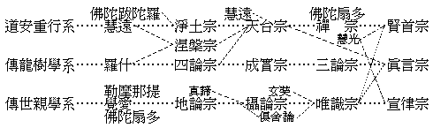

# 會昌以前中華佛教之三大系

## 目錄

- 前言
- 一　道安重行系
- 二　傳龍樹學系
- 三　傳世親學系


中華所有佛教歷史，僅詳事實，關於教理變遷之原因與程序，猶少系統之研究。如高僧傳、傳燈錄等，皆一個人一宗派之傳記耳。至於學派盛衰之跡，尚難明也。余今提出此問題、亦為研究佛教史者，聊備方案而已。若詳細考察，則非短時間所能奏功也。

我國佛法當以隋唐為全盛，六朝以往具體而微，五代以降缺殘難堪。故會昌前後，為佛教盛衰一大樞紐。向別為淨土、天台、賢首、涅槃、成實、三論、地論、攝論、俱舍、唯識、禪、律、真言之十三宗，雖涅槃歸附天台，地論屬隸賢首，攝論併入唯識，然就其學派系統觀之，亦各互有時間之關係焉。茲特據會昌以前之宗派分三系而略述之：

## 一　道安重行系

晉道安法師者，佛圖澄禪師之高弟也。澄師以神通化世，其深行密證可知。先有安世高從事律禪，故道安之所傳譯，亦注意於律部及諸禪經。苦當時世亂已極，人思超俗，況老莊之學風靡一時，亦與般若空相適應，慧遠承之；持律嚴肅，致力觀行，當時認為修最上禪之念佛三昧，漢地淨土法門遂濫觴於茲。而最先來漢土傳禪之佛陀跋陀羅亦附此焉。北齊慧文禪師創一心三觀，為天台宗之祖，亦以修禪為主。慧思禪師、智者大師，從修觀行而得法華三昧等，皆由禪定而開發教義者。此宗所依經論，乃法華、涅槃諸經，及智度、中百等論，是天台與四論、涅槃尤有影響關係矣。禪宗開創亦極茫昧，五祖以前授受尚鮮知者，神秀、慧能而後宗風始盛。少林佛陀扇多，為中國最古之傳大乘禪者，菩提達摩殆係佛陀扇多之訛歟？道房、慧光繼之，遂演成禪宗。但慧光受戒律於道覆，乃轉為傳四分律之光統律師，復宏十地論及華嚴，開杜順華嚴宗之先河。賢首國師則又收唯識之義以宏恢之，故後世以賢首名華嚴宗也。

## 二　傳龍樹學系

羅什乃遠承龍樹之學說，傳入中國之第一人。以一身而兼譯師及講師，俾大乘般若之教理遂得弘大發展。且姚秦以前教義未判，羅什而後宗學始分。如初宗四論，繼傳成實，後宏三論。大小乘宗漸以盛行，而三論則由興皇傳至嘉祥乃大成焉。

## 三　傳世親學系

傳世親學說於中國者，其主要人物有三：一、覺愛三藏，即菩提流支，彼先譯世親之十地論而創立地論一宗。光統、惠順諸師相繼宣講，在隋唐初其傳猶盛。迨華嚴宗興，此宗遂屬之矣。與覺愛同時之佛陀扇多及勒摩那提三藏，其翻譯雖亦傾重於世親系，然不及覺愛之宏富。故菩提流支當與羅什相對，而為傳譯世親學說之第一人也。二、為陳真諦三藏，廣譯法相經論，如攝論、俱舍諸宗，皆興起於斯時焉。三、唐初玄奘法師，譯傳最富且精，依所糅成唯識論而唯識宗確然成立。其餘俱舍、宣律諸宗，亦藉以盛行光大矣。然道宣律師者，誠融小乘律於大乘律之開祖也。觀其判唯識為大乘甚深圓教，而表示其推崇唯識態度，可知其談教與唯識宗同也。

復有涅槃與真言二宗，涅槃為中國所新創，印度無源可尋。道生惠觀諸師盛講斯經於南方，惠靜、曇斌等人亦宏此宗於北地，而介於慧遠、羅什二系之間，遂為構成天台宗之一要素。密教、在中國十三宗中最為晚出。由顯教進轉為密教，亦由教理而進於行果也。蓋顯密二教相為表裏，顯教是依佛之聲教以彰學理者，密教是依佛之果德以軌觀行者。故密教之秘密多用顯教而詮表，如胎藏界之教理依般若，金剛界之教理依唯識，是顯教之二宗，與密教之二界，其相應一貫之跡尤顯然可見矣。且一行阿闍黎之大日經疏，其說明與天台之釋法同。蓋一行本天台學者，其趨勢自應如是。故一行禪師之受密教，其立足處則為天台之教義；不空三藏之受密教，其立足處則在華嚴之理論。今日本之東密、台密二派，即一行及不空之所傳也。

由前三系，可以概括諸宗。但慧遠一系，是依自己修證而宏揚佛法，乃以中國人依佛經律修證之所得為主，根底下潛伏有中國思想之特質，非專傳印度之學說者。唯羅什一派，則為傳龍樹之空宗：覺愛一系，則為傳世親之有宗。或以佛陀跋陀羅禪師對羅什另列為一系，不甚恰當。以跋陀羅傳禪中國，雖不無影響於重行之道安慧遠系，其譯僧祇律與華嚴經等，其主要則在他人也。

如上記述，殊多脫略，謹列表以明其概要：




此三系中，尤以道安、慧遠一系為有特色。蓋流衍蕃變，而有中國思想潛注其底間也。試再為一表以見其概——


```
　　　　依 般 若　　　　　承 上 集
　　　　禪律行證　　　　　中修淨土
　　　　道安………慧遠………注重修行即為淨土宗─┐
　　　　　　　　┌───────────────┘
　　　　　　　　│　　法華涅槃
　　　　　　　　└吸收　　　　演教即為天台宗………專崇悟證即為禪宗─┐
　　　　　　　　　　　及龍樹系　　　　　　　┌───────────┘
　　　　　　　　　　　　　　　　　　　　　　│
　　　　　　　　　　　　　　　　　　　　　　│　　華嚴楞伽
　　　　　　　　　　　　　　　　　　　　　　└吸收　　　　演教即為賢首宗
　　　　　　　　　　　　　　　　　　　　　　　　　及世親學
```


此中國晚唐以來之佛教，所由行證不出禪、淨，教理不出賢、台歟！

（觀空記）（見海刊六卷五期）

