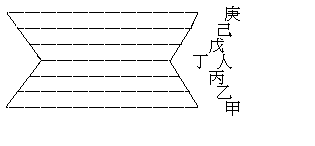
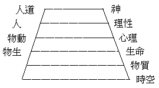

# 人生佛教與層創進化論
（1944 年秋，在漢藏教理院講）

## 目錄

- 一　人生佛教之層系
    - 甲　無始終無邊中之宇宙事變
    - 乙　事變中之有情眾生業果相續
    - 丙　有情業果相續流轉中之人生
    - 丁　有情流轉中繼善成性之人生
    - 戊　人生向上勝進中之超人
    - 己　人生向上進化至不退轉地菩薩
    - 庚　無始終無邊中之宇宙完美人生——佛
- 二　人生佛教層系與層刱進化論之比觀

## 一　人生佛教之層系

第一圖的七個橫線，是表示人生佛教的七個層系。這種次第含有高度和廣度的意義；高度者，是以其理性的高低淺深而言，亦可說為深度。廣度即以其範圍而言，亦即是示其量的大小。今逐層分說於下：

### 　　甲　無始終無邊中之宇宙事變

說宇宙事變，即是說宇宙萬有的一切法，時間空間即事變分位，宇宙即包括一切法，並是有變化有生滅的事事物物。一切有生滅變化的法，即是無常諸行，諸行是指一切有為法，因其有生住異滅的變化，故說是「行」，無常是說一切有為法的時刻在變化，在時間上找不到牠的起始和終止，在空間裏尋不著牠的中間和邊際。若更進而放寬說，亦是無我的一切法，並將無為法包括在其中了。故無始終無邊中的宇宙事變，括盡了有為無為一切法。換些名辭，也可說為緣起性空法，唯識性相法，華嚴的五重法界，法華的三千性相，其範圍至為廣闊，故初層的線也最長。

### 　　乙　事變中之有情眾生業果相續

在無常諸行和無我諸法的盡一切法宇宙事變中，特提出有情世間來說，這層是以有情眾生為中心，以有機的生命為重點，在有情上建立一切，其層度比初層稍微狹小。這兩層若以天台學家所說的「百界千如的三千性相」來說，第一層的宇宙事變，可總包括三千性相。三千性相即是國土一千，眾生一千，五蘊等法一千，總名叫作三千性相。性相等百界千如即是諸法實相，這種境界唯佛與佛乃能究竟。第二層注重有情世間，特說眾生一千性相也。但有情亦不能離開依報國土的器世間和有情所依的五蘊等，不過此階段特以有情作中心罷了。細究這有情的生命相續，是由造業感果轉展不已，故有情的生死流轉相續不息也。由前世造業感今生之果報，此生造業又招來生受果，故有情流轉三界出沒四生，皆是三世業果相繼。在教理上特顯示者，為十二有支緣起，說有情的生死流轉因果。由此廣推及一切法的緣起亦不出此十二有支。有情的各個報身，是由各人的自業所感，依報的器界國土，亦是諸多有情的共業所招，有成住壞空的生滅相續。五蘊等一切法，是自共業果相續，又即五蘊等的積聚；試分析有情的本身，皆是五蘊法等的組合體。此層因以有情為中心，故線稍短，以示量之較狹。

### 　　丙　有情業果相續流轉中之人生

在有情業果相續中，特提出人生來說；在有情界裏人類算是最靈的了，由有情各自造業感受別報的身根，由共同造業感受總報的世界國土。而人類刱造力特強，此層特注重人生。在有情流轉中來看人生，下層有三惡趣，上有天趣，中間是人的地位，好像一切為人生設施的，而人生的力量不可思議，成凡成聖皆是人所自作。故佛陀現身人間，說法度生，由人成佛。能夠聽聞佛法受持學修者，亦是人類，此層以人為中心去看一切眾生之業果相續流轉生死，特別講明人生因果，故比上一層更為狹小。

### 　　丁　有情流轉中繼善成性之人生

在易經裏有兩句嘉言是：「繼之者善，成之者性」；是說明人生以繼善成性為最善最美的標準，這種學說在紛紜繁變的人界中，推為至當的格言，在講世間法的學說裏也算是最完滿的哲學了。這兩句話以佛法來說，可證明有情之業果相續中，人生是善業所感，造人的業因，受人的果報，人生的業因即由各人所行之五戒十善等業行，此業行是善的，故感人生之善的果。故中國的儒家說人性是善的，將此善性繼續而擴大，成賢成聖皆由此也。孟子說：「人異於禽獸者幾希」？二者的距離、相差不遠、看能否繼善於此「幾希」中擴充之。以完成人性建立完滿的人格，故繼之者善而成之者性也。於人生中最重要者是善，須假繼善之功，成完滿善性的人生，即是依繼善成性之行為，作五戒十善之行，以此善的人生因果律，成人性完全之善性。此層成立人生果報，繼續修善，完全以人為中心，其他一切環境，全以人的用功致力而達其美善。這種道理是儒家的特長，而佛教向來將此忽略了。尤其是中國佛法，因儒家已有詳細的發揮，以為佛法不須重視。今講人生佛教特將此點提出來，依人的果報修人的業行，使相續不失人身，作進修的基礎，故其寬度較上下度為最狹，此為人生的樞紐，成凡作佛以此為轉捩點，而人生佛教之重心亦在此。故此層最為重要。

### 　　戊　人生向上勝進中之超人

這裏的超人包括天界天神，但不用天神的名目者，以此層比「天」界天「神」的範圍寬廣，只要超出人類以上的都是。此可包括三界諸天和三乘初發心的修行者，若二乘人還沒有得到極果的時候，仍不出於人類和欲色界天，而大乘菩薩行也在人天中成就，故此超人的包括很寬；由人修行增進至超人的勝行，或是三界裏的天神，或是出世的二乘賢聖，大乘的菩薩行，皆從人成。這是人中的向上前進者，故此層量度又稍放寬。

### 　　己　人生向上進化至不退轉地菩薩

由勝進中的超人，修大乘行達到不退轉的地位，是為二乘聖者的極果，以菩薩聖位亦可包括二乘聖者；大乘聖者所修菩薩行，教化一切眾生，為利生故，遍入三界五趣，除佛的法界外，其餘的九法界的眾生皆是菩薩行化領域；居於九法界之最上位，與第十之佛法界相近了。

### 　　庚　無始終無邊中之宇宙完美人生——佛

這層與初層一樣寬，但與初層不同，這是佛陀證到的無上正等正覺的最高境界，一切法的範圍有多大而佛的智境亦有多大，窮盡一切法的邊際，就是佛的智慧法身邊際。此層最寬廣，中間人之一層，因屬人生佛教所特提出討論之點，是為適應今世界人類之需要，作為人的立足點，但非是人生究竟的目的，而究竟的目的是在成佛。這是佛教特有的趨向，與儒家不同；儒於這七層中，前三系和後三系都顧不及，即所謂「六合之外，存而不論」。是僅顧到人事，人間之外的事，存而不論也。故中間這一層最狹，特示明儒家的道理僅說到人間，其沒有佛法的廣度，尤其沒有佛法的高度深度。故居人間而人所依止的一切法，一切眾生，不能深切明徹。其超人之三界天人，三乘之聖者，菩薩境界，及究竟之佛境界，皆未之聞也。故佛教與儒教不同，而向來儒家每謂佛法厭世忽略人生，今則特提倡此人生佛教，注重人生的因果業報，繼善成性達佛之極果。一面又指明儒家的道理不及佛法的宏廣高深也。

## 二　人生佛教層系與層刱進化論之比觀

層刱進化論，是英人穆耿亞歷山逗所發明的，是英國新近的一派哲學，其理論是綜合現代科學的成果及各派哲學和宗教哲學的所長而成的，為很有層次系統的新哲學。有人說我的人生佛教的層系與亞氏的層刱進化論的層系相仿，其實不然，他的次第是塔模式的上小下大，我的這個次第是上下大而中間小，不惟是形式的不同，尤其是內容更判若雲泥。他的最底一層的基礎，是以無限或有限的時間和空間建立的，似乎更與人生佛教的第一層的「無始終無邊中」宇宙的意思相同，但我說的是包括一切「宇宙事變」的現實法，他只是一個空洞的時空的虛架子。他的第二層是物質，亦只是時空中的單純物質，這與佛法所說的色法相同，色法即是有質礙有變化的物質，在空洞的時空裏。有物質的存在，是更加一重意義了。他的第三層是比較時空物質再增進一步，成為有機的生命物，生物與物質的不同，是有生命連綿的狀態，生殖死限等生機的特性了。其第四層為有心理活動的動物，前之生物包括一切動植物，此則唯指有生命有心理現象的東西。其第五層是理性，為在一切動物中特具理智性能的人，是動物中最靈明優秀的人了。人是有最高希望慾的，不以人為滿足，故有進一層的超人的神的境界，以神為最高的一層，也是最狹小的一層。他的最底的那一層的時間和空間，是空洞的不是實事的，其物質的和生命的均不在其內，我的初層則將宇宙萬有生滅變化的一切法，都包括淨盡了。而且他的最高層的超人是很狹的，只說到天界，遠不及我的第五層系中的向上勝進中的超人（包括三界及三乘聖者）廣大，這是我與他的不同點。他雖然是在西洋算進步的哲學，但比之人生佛教，則瞠乎其後，還差得很遠呢！若能將這人生佛教的道理，宣揚於西洋以至全世界，則可綜合又超越一切科學哲學，而駸駸乎為世界文化，世界宗教的歸墟矣。

（世光記）（見海刊二十六第二期）

（附註）「人生佛教之層系」；後轉載於軍事與政治八卷九期，改題今名。

