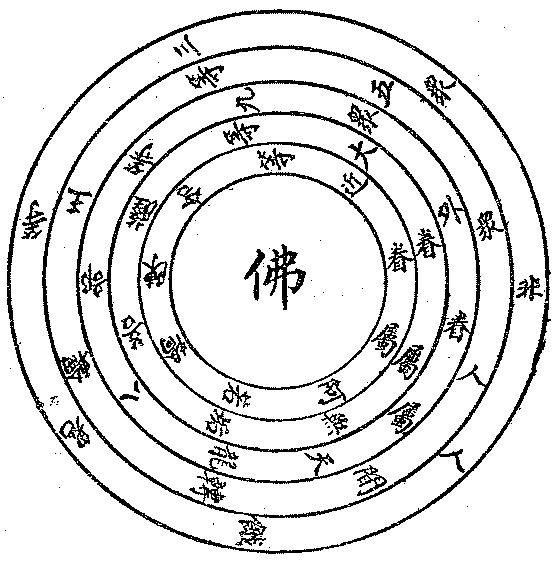
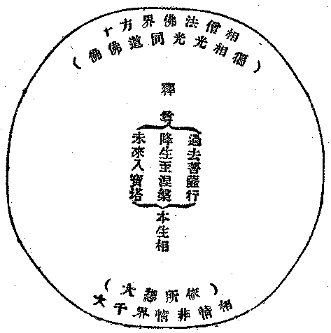
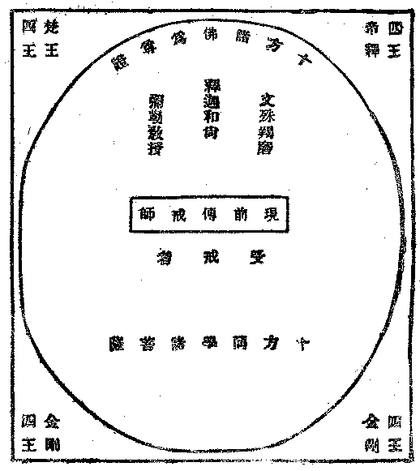

# 大乘本生心地觀經講記
（1932 年 12 月，在閩南佛學院講）

## 目錄

- 懸論
    - 一　題旨明晰
        - 甲　經
        - 乙　大乘
        - 丙　本生
        - 丁　心地觀
    - 二　譯史確實
    - 三　法義豐富
        - 甲　法備五乘
        - 乙　義周十宗
    - 四　時機合宜
    - 五　略彰分齊
- 釋經
    - 甲一　教起因緣分
        - 乙一　證信序
            - 丙一五　重證信
                - 丁一　略敘聞時主處
                - 丁二　廣列同聞諸眾
                    - 戊一　聖眾
                        - 己一　近眷屬
                        - 己二　大眷屬
                    - 戊二　凡眾
                        - 己一　天龍八部
                            - 庚一　天眾
                                - 辛一　欲界天眾
                                - 辛二　色界天眾
                            - 庚二　龍眾
                            - 庚三　藥叉眾
                            - 庚四　乾闥婆眾
                            - 庚五　阿修羅眾
                            - 庚六　迦樓那眾
                            - 庚七　緊那羅眾
                            - 庚八　摩睺羅伽眾
                        - 己二　人非人等眾
                            - 庚一　人眾
                                - 辛一　轉輪王眾
                                - 辛二　人王眾
                                - 辛三　王夫人眾
                                - 辛四　僧俗人民眾
                                - 辛五　外道眾
                            - 庚二　非人眾
                                - 辛一　鬼眾
                                - 辛二　畜生眾
                                - 辛三　地獄眾
            - 丙二　結成法會
        - 乙二　發起序
            - 丙一　如來示相
                - 丁一　處眾入定
                - 丁二　諸天興供
                - 丁三　現通益物
                - 丁四　放光明相
                    - 戊一　胸間放光
                    - 戊二　光中現相
                        - 己一　大千世界
                        - 己二　本生行相
                            - 庚一　總
                            - 庚二　別
                                - 辛一　過去
                                - 辛二　現在
                                - 辛三　未來
                            - 庚三　結
                        - 己三十　方佛會
                    - 戊三　光瑞利益
            - 丙二　會眾仰法
            - 丙三　師吼讚請
                - 丁一　長行
                    - 戊一　敘師吼德
                    - 戊二　告海會眾
                    - 戊三　悅眾會意
                - 丁二　偈頌
                    - 戊一　讚佛
                    - 戊二　重頌
                    - 戊三　請法
    - 甲二　聖教正說分
        - 乙一　稱性頓宣
        - 乙二　應機漸說
            - 丙一五　乘共法
                - 丁一　欲界人天乘之五乘共法
                    - 戊一　答妙德等問
                        - 己一　妙德念問
                        - 己二　如來慰答
                            - 庚一　慰許
                            - 庚二　答解
                                - 辛一　標釋四恩
                                    - 壬一　總標
                                    - 壬二　別釋
                                        - 癸一　父母恩
                                        - 癸二　眾生恩
                                        - 癸三　國王恩
                                        - 癸四三　寶恩
                                            - 子一標釋三寶
                                                - 丑一總標
                                                - 丑二別釋
                                                    - 寅一佛寶
                                                        - 卯一正說
                                                        - 卯二問答
                                                    - 寅二法寶
                                                    - 寅三僧寶
                                            - 子二問答寶義
                                - 辛二　示報恩行
                        - 己三　說法利益
                    - 戊二　答智光等問
                        - 己一　智光趨問
                            - 庚一　趨敬
                            - 庚二　問求
                        - 己二　如來慰答
                            - 庚一　宣慰
                            - 庚二　頌答
                                - 辛一　頌佛二德
                                    - 壬一　自證實德
                                    - 壬二　化他權德
                                - 辛二　重頌四恩
                                    - 壬一　總標
                                    - 壬二　別釋
                                        - 癸一　父母恩
                                            - 子一重頌
                                            - 子二增頌
                                        - 癸二　眾生恩
                                            - 子一重頌
                                            - 子二增頌
                                        - 癸三　國王恩
                                            - 子一重頌
                                            - 子二增頌
                                                - 丑一廣明戒德
                                                    - 寅一舉因明果
                                                    - 寅二辨別戒品
                                                    - 寅三標因示果
                                                    - 寅四教修懺法
                                                        - 卯一勸應懺罪
                                                        - 卯二示懺罪法
                                                        - 卯三結修懺益
                                                    - 寅五示受戒儀
                                                    - 寅六喻明戒德
                                                - 丑二勸應受持
                                        - 癸四三　寶恩
                                            - 子一增頌總相
                                            - 子一重頌三寶
                                                - 丑一佛寶
                                                - 丑二法寶
                                                - 丑三僧寶
                                                    - 寅一重頌總標
                                                    - 寅二增頌二聖
                                                    - 寅三重頌聖凡
                                - 辛三　總結四恩
                        - 己三　問答報恩
                        - 己四　聞法獲益
                - 丁二　色無色天乘之三乘共法
                    - 戊一　出家戒之超欲界法——十信
                        - 己一　厭捨出家
                            - 庚一　智光陳疑請決
                                - 辛一　敘今所願
                                - 辛二　述昔所聞
                                - 辛三　正陳疑意
                            - 庚二　如來因問廣說
                                - 辛一　因問總非
                                - 辛二　廣說九喻
                                    - 壬一　大海不知滿足喻
                                    - 壬二　石火能燒草木喻
                                    - 壬三　深山戀寶喪身喻
                                    - 壬四　飲雜毒露得吐喻
                                    - 壬五　妄想猛風不起喻
                                    - 壬六　煩惱眾苦生處喻
                                    - 壬七　愚子違教敗家喻
                                    - 壬八　童女夢子生死喻
                                    - 壬九　牝馬口海出險喻
                            - 庚三　當機出家獲益


## 懸論

### 　　一　題旨明晰

就本經之題目即可以說明本經宗旨之所在。依大乘本生心地觀經一題看來，本經宗旨似唯在攝化大乘之機，而實際上本經通攝五乘及三乘共法，惟以其中一分之大乘不共法為尤要耳。

#### 　　　　甲　經

通指一切經典，凡為佛陀所宣說或為佛陀所曾印證者皆名曰經。梵音「修多羅」、或「修妬路」、「素怛纜」，有線的意義，取能貫穿文義攝化生機之意；與華言經字意義相符，故譯為經。或可稱為契經，即是上契真理下契群機。

#### 　　　　乙　大乘

通指一切大乘經典而言，如妙法蓮華經亦題曰大乘，及其餘題以方等．或大方廣等皆是。大乘是對小乘而言：乘有運載之義，若能觀大乘境修大乘行，即能運載凡夫至於無上菩提涅槃之大果，自運既圓，運他亦無有窮盡，故名大乘。換言之、大乘之義，乃在解釋一切凡夫染縛而入無上佛果。大乘法不外境、行、果三義：若能於一切諸法性相如實了達，即是大乘所觀的境；依境而起行，即是修學六度、十度一切無量無邊法門，凡有利於有情的，大乘菩薩皆應修學；經過十信、十住、十行、十回向、十地、三阿僧祇劫而得到究竟之佛果，即是由行而得果。依此境、行、果法能如實施行，即為大乘妙法。大乘法不獨限於經藏，亦有大乘之論藏及律藏，此經是大乘經藏中之一部。既超出人、天、二乘之上，而又通攝五乘諸法。

#### 　　　　丙　本生

是十二分教之一，如云：「長行、重頌、并授記，孤起、無問而自說，因緣、譬喻、及本事，本生、方廣、未曾有」。本生乃指釋迦牟尼佛三世本生之因果；而十二分中之本事，則是明諸弟子事者。此經序品中說：「釋迦菩薩於往昔時作光明王，最初發於阿耨多羅三藐三菩提心，乃至菩提樹下得成佛道，娑羅林中入於涅槃，於其中間三僧企耶、百萬劫中所有一切慈悲喜捨八萬四千波羅密……」，根據這些文義，可以明白本生是指釋迦牟尼佛本生之事的。從過去三祇修行，及現在八相成佛乃至未來設立塔廟，其間經過無數量劫發菩提心，從凡夫地至究竟成佛度生；這是顯然把釋尊本生的內容特色都表現出來了。

#### 　　　　丁　心地觀

當知一切諸法皆從心地而生，皆從心地而起。在攝境歸心、攝用歸體、攝事歸理、攝相歸性的看法上，無論那項事，他的出發點都歸於心。「一切唯心造」，三界之中無一法而不以心為主的。本經的觀心品裏說：「三界之中以心為主，能觀心者究竟解脫，不能觀者永處纏縛。譬如萬物皆從地生，如是心法生世出世善惡五趣、有學無學、獨覺、菩薩及於如來，以是因緣三界唯心」。成佛果是此心，迷於生死苦海也是此心。總之、三界上下法，唯此一心作。此心普遍於一切諸法之中，能有變生轉現的功能，所以以地喻心，而心名為地。

然在此中以地喻心者，可有兩種意義：1.能生：此心能生一切世出世間善惡因果，乃至菩薩一切無漏諸法，如大地之一切草木叢林，皆依大地而生長。2.所依：如江河漢海一切之水，五嶽千巒一切之山，及動物、植物與人類所應用之器具種種，一切皆以大地為所依而住；心亦如是，能為一切法之所依止。有此能生、所依二義，所以喻心以地，曰心地。

依此、可以明白觀察心地是怎樣的緊要了。假若觀心而了知即心自性之諸法實相者，則了知心心所法，無內無外亦無中間，於諸法中求不可得，故心性本空，不生不滅，無來無去，無有上下差別之相，平等平等。以善觀不善觀之不同，於是有佛與異生的差別。以諸差別之事由心而起，依心而住，若能善觀心者，則能通達諸法之相，亦能究竟解脫。如經云：「能觀心者究竟解脫，不能觀者永處纏縛」。若能如此如實觀察，名之曰心地觀。所以若人善觀此心，了知心之本性，即能如實了知一切諸法實性，所謂不生不滅，不垢不淨，本來寂靜，自性涅槃。若人善觀於心，亦即能了達世出世間一切因果邪正；能了達世出世間一切因果邪正，即能了知諸法法相，若了知諸法法相，即能依如實了解而修集福智，乃至即能證得究竟之涅槃，依此義故說心地觀。此心地觀即是本經之宗旨，亦即是觀大乘之境，修大乘之行，乃至證大乘之果。也就是釋迦牟尼佛本生諸事之說明。

### 　　二　譯史確實

古來諸師所宏揚之一切經典，近人從歷史上嚴格的考察起來，往往有不明確的地方，使人疑惑。例如楞嚴經、起信論等，皆以譯史不明致生疑竇，於宏揚流通及人的信仰上亦發生相當的不良影響。本經向來少有講釋，現在乃從大藏經中特別提出來講。若翻譯之史實不明確，也不免有不足信今而傳後的遺憾，故當一考其譯史。經上題「唐罽賓三藏般若等譯」。等者、等有其他的人，可見其不是一個人譯的，唐憲宗的序文說：「大乘本生心地觀經者，釋迦如來於耆闍崛山與文殊師利、彌勒等諸大菩薩之所說也。其梵夾，我烈祖高宗之代，師子國之所獻也」。這可以知本經來歷之確實，梵本此經不是憲宗時纔有，高宗時就已有了。所謂師子國者，即現在之錫蘭島。人每以錫蘭屬於印度，然非事實，不過印度佛教流傳於錫蘭島最早，一直到現在還沒有衰敗。自來認錫蘭島為純粹小乘佛教，也不盡然，過去於大乘之法，也有相當的傳布，如本經即彼國所獻；義淨三藏、不空三藏等也曾住於錫蘭，可見錫蘭也有大乘佛法。而且、從海路來華之佛法，皆經此島，故此可決定是信史。又云：「寶之歷年，祕於中禁，朕嗣守丕業，虔奉昌圖，聽政之暇，澡心於此，以為攝念之旨。……乃出其梵本，於醴泉寺詔京師義學大德罽賓三藏般若等八人翻譯其旨，命諫議大夫孟簡等四人潤色其文，列為八卷，勒成一部」。這樣的描寫此經的翻譯史實，是值得注意的。

此經翻譯者，是罽賓三藏般若等，則般若其人的歷史也不可不加考察。貞元新定釋教目錄卷十七云：「法師梵名般剌若——唐言智慧，北天竺境迦畢式國人也——言罽賓者訛略，姓喬答摩氏——言瞿曇者訛略不正。穎悟天假，七歲發心，違侍二親歸依三寶。……屆於上國矣」。這段文裏，敘說般若法師出家的因緣，在天竺求法十八年，後來由錫蘭到廣州，這是建中三年的事情。到了貞元二年，法師舅氏之子神策正將羅好心者，將法師首先所譯的「大乘理趣六波羅密多經」表聞於帝，於是乃下制曰：「中書門下牒、王希遷牒、奉敕：釋教深微，道俗虔敬，皆因梵本法被中華，宜令王希遷與所司精選有道行僧，就西明寺重更翻譯，訖聞奏。牒至，准敕故牒，貞元四年四月十九日牒。及牒祠部准敕亦然。傳牒京城諸寺，大德罽賓三藏沙門般若宣釋梵本，翰林待詔光林寺沙門利言譯梵語，西明寺沙門圓照筆受，道液、良秀、圓照潤文，應真、超悟、道岸、󰤫空並同證義。……敕王希遷、王孟涉、馬有麟等送梵本經至西明寺翻譯」。此經翻譯的年代，根據貞元新定釋教錄，是貞元六年歲次庚午譯的。

此經從釋尊在靈山對諸菩薩說法，結集之後流通到錫蘭島。在高宗時代再流通來中國，後來因憲宗弘護佛法之熱忱及般若等翻譯之努力，然後才譯為華文。這樣，此經翻譯的歷史，是十分確實的了。

### 　　三　法義豐富

此經的譯史，已經大體說清楚了，這裏更要解述本經構成的要素，分兩段來講：

#### 　　　　甲　法備五乘

此中所謂五乘，指人、天、聲聞、緣覺、菩薩乘；或人天、聲聞、緣覺、菩薩、佛乘，以人天同以五戒十善運出四趣故。還有一樣說法：欲界人天乘、色無色天乘、聲聞、緣覺、佛乘。色無色天乘、亦名梵乘，梵者淨也，謂色界諸天以根本禪運出欲界故。此經在題旨上標定是大乘，但他的內容是隨順諸乘的機宜而施教的；所以經中法義極其宏富，也可以說是應諸乘而說的教法。

怎樣看出此經的法義有五乘呢？這可從此經的構成，分三方面來說：

1.五乘共法分二：一、欲界人天乘之五乘共法，即此經中的報恩品。二、色無色天乘之五乘共法，又分二：一、出家戒之超欲界法——十信，即厭捨品和無垢性品。二、離欲界定之超上界法——十住，即阿蘭那品和離世間品。

2.三乘共法分二：一、大乘共行二乘法——十行，即厭身品。二、二乘迴趣大乘法——十迴向，即波羅密多品和功德莊嚴品。

3.大乘不共法分三：一、上根證大乘境——加行入初地，即觀心品，觀空前心相證心空性——性、相、禪、密。二、中根起大乘行——十地入等覺，即發心品，觀空後心相發心妙定——相、禪、密。三、下根引大乘果——等覺入佛，即成佛品，觀三種祕密即身成佛——禪、密。這樣的看起來，自覺此經法義的宏富了！雖然有欲界人天乘、色無色天乘的差別，但從報恩品、厭捨品乃至成佛品，亦可以明白為聲聞、緣覺、菩薩乘的階梯。雖有諸乘法義的差別，實際上皆可以貫攝於大乘法內；在應機方面，又可有泛應曲當作用，這才算是完備滿足的佛法。

#### 　　　　乙　義周十宗

所謂十宗，就中國佛教史來觀察，才有這樣地區別。本來、佛教古今來歷史的不斷發展，概括著世出世法的義理，假若以十宗去束縛他，未免有點不自由。現在根據此經義理來分配與十宗相應的法門，首先從五乘共法、三乘共法方面觀察，厭身品中觀諸法無我，諸法皆空，所以明俱舍、成實宗義。厭捨品、無垢性品與律宗相應。又報恩品、無垢性品以及功德莊嚴品，皆有回向兜率淨土的文義，又兼及十方淨土，則西方淨土亦可在此中說明矣。觀心品先觀心的如幻相，次觀心的空寂性，則法相、法性之義由此表詮。又觀心品、發心品、成佛品皆明一切法究竟真實心性，唯證相應，即是禪宗。又在觀心品、發心品、成佛品都有陀羅尼，都是法身佛表現，即有真言宗及華嚴、法華。義周十宗的道理，略述如此，要能整個領會斯旨，不但依經文探尋推測就可了事，要在事實上去親證，才能圓滿的解決。

### 　　四　時機合宜

救濟眾生的佛法，於社會人民都有直接或間接的關係，因之要明白佛法是應隨時機而設教的。既然一切時處都可以與社會人民發生關係，這即是佛法應該普及的時期了，也即是佛法將要普遍於整個社會的好現象。今講此經，即是適應這個時代的需要，研究佛學的人對這傾向應該重視。

中國古代和近來所宏揚流通的諸經論，大抵以講楞嚴、法華、彌陀為主要。這是因為叢林裏參禪則講楞嚴相應，學天台教相則講法華為宜，而通俗勸修淨土則講彌陀，這確實帶著過去時代的特色。如今則不同了，無論在寺院或是一般善男信女所組織的講經會，都有社會各種人士來參加，因此、所講的經論，要具有法備五乘、義周十宗的條件。因為聽眾根機不能一致，假若沒有法備五乘、義周十宗的條件，怎能收獲最完善的效果呢？所以、今講此經，不但為普通聽眾講，同時亦為研究教理的人所需要，故應該對此經作精密的研究。此經可為初學佛法的佛法概論，可為研究全藏教理之基礎。

### 　　五　略彰分齊

略彰分齊、便是把關於此經全部的綱領提出來，使一般人看了極易明白。今把此經的大綱，圖表於下：


```
　　　　　　　　　　　　　　　　　　　　　　　　┌丙一、五重證信
　　　　　　　　　　　　　　　　　┌乙一、證信序┤
　　　　　　　　┌甲一、教起因緣分┤　　　　　　└丙二、結成法會
　　　　　　　　│　　　　　　　　└乙二、發起序──以上序品
　　　　┌──┐│　　　　　　　　┌乙一、稱性頓宜──報恩品告彌勒段
　　　　│經綱├┤甲二、聖教正說分┤　　　　　　　┌丙一、五乘共法
　　　　└──┘│　　　　　　　　└乙二、應機漸說┤丙二、三乘共法
　　　　　　　　│　　　　　　　　　　　　　　　　└丙三、大乘不共法
　　　　　　　　└甲三、依教奉行分──囑累品

　　　　　　　　　　┌丁一、欲界人天乘之五乘共法──報恩品
　　　　┌────┐│　　　　　　　　　　　　　　　　　　　　　　　　　　　　　┌己一、厭捨品
　　　　│五乘共法├┤　　　　　　　　　　　　　┌戊一、出家戒之超欲界法（十信）┤
　　　　└────┘│　　　　　　　　　　　　　│　　　　　　　　　　　　　　　└己二、無垢品
　　　　　　　　　　└丁二、色無色天乘之三乘共法┤　　　　　　　　　　　　　　　┌己一、阿蘭若品
　　　　　　　　　　　　　　　　　　　　　　　　└戊二、離欲定之超上界法（十住）┤
　　　　　　　　　　　　　　　　　　　　　　　　　　　　　　　　　　　　　　　　└己二、離世間品
　　　　┌────┐┌丁一、大乘共行妙乘法（十行）──厭身品
　　　　│三乘共法├┤　　　　　　　　　　　　　　　┌戊一、波羅密多品
　　　　└────┘└丁二、二乘迴趣大乘法（十迴向）┤
　　　　　　　　　　　　　　　　　　　　　　　　　　└戊二、功德莊嚴品

　　　　┌─────┐┌丁一、上根證大乘境─加行入初地─觀空前心相證心空性（性相禪密）─觀心品
　　　　│大乘不共法├┤丁二、中根起大來行─十地入等覺─觀空後心相發心妙定（相 禪 密）─發心品
　　　　└─────┘└丁三、下根引大乘果─等 覺 入佛─觀三種秘密即身成佛（禪　　密）─成佛品
```


## 釋經

### 　　甲一　教起因緣分

#### 　　　　乙一　證信序

##### 　　　　　　丙一五　重證信

###### 　　　　　　　　丁一　略敘聞時主處

> **序品第一**

> **如是我聞：一時，佛住王舍城耆闍崛山中。**

如是者，中國佛教諸大師略有八種釋義：一、約信順釋，言如是者信順之辭。二、約法性釋，即法性為如，唯如為是。三、約真俗釋，真不違俗名之為如，俗順於真稱之為是。四、約弟子釋，阿難所說如於佛語、故名為如，為欲簡去相似之如、故稱為是。五、唯約佛釋，阿難道佛所說之法，如佛所說不異，故名為如；如諸佛說是正非邪，故復言是。六、約佛及佛弟子釋，言如是者，感應之瑞也，以言教出於感應，故言如是。七、言如是者，如斯之言是佛所說，故言如是，八、言如是者，指將傳所聞之一部而言，謂如是一部經我親從佛聞也。諸家解說不可具述，今取如是一部經為如是。我聞者，依圓測法師說：謂傳法菩薩及阿難等五蘊身上假立為我，耳根發識聽聞所說，故言我聞。所以佛地論云：『我謂諸蘊世俗假者，聞謂耳根發識聽受，廢別就總，故說我聞』。真諦三藏說：親聞名曰如是我聞。欲避增減異分諸過失，謂如是之法我親從佛聞，非他展轉傳來的，所以名曰如是我聞。

一時者，據菩提留支所說有其多種：有一念時、一日時、百年時、一切時等。今言一時者，非此等時，正是如來說此經時。雖言一時，而不云某年月日，因人間天上的時間各有不同，如忉利天一晝夜，人間要歷百年；又如中國陰曆陽曆併用，從陰曆看來今天是十一月廿六日，從陽曆看來今天是十二月廿三日，所以佛經上敘述佛說法的時候，都是渾然的說一時，而不肯定是在某年月日的。

王舍城，是地名，梵名曷羅闍姞利呬城，在中印度摩伽陀國。智度論說：「是摩伽陀國王有子，一頭兩面四臂，時人呼為不祥，王即裂其身首棄之曠野。……以大力勢治閻浮提，閻浮提人因名此山為王舍城。……見此五山周匝如城，即作宮殿於中止住，以是故名王舍城」，西域記裏關於王舍城的名稱亦有討論，恐繁不述。

耆闍崛山，譯鷲台山、鷲頭山，山頂似鷲頭故。古譯靈鷲山，亦簡稱曰靈山，乃釋尊說法最著名的場所。

以上聞、時、（佛、說法）主、處，共為四重證信。

###### 　　　　　　　　丁二　廣列同聞諸眾

###### 　　　　　　　　　　戊一　聖眾

###### 　　　　　　　　　　　　己一　近眷屬

> **與大比丘眾三萬二千人，皆是阿羅漢，心善解脫，慧善解脫，所作已辦，離諸重擔，逮得己利，盡諸有結，得大自在，住清淨戒，善巧方便，智慧莊嚴，證八解脫，到於彼岸。其名曰：具壽阿若憍陳如，阿史彼室多，摩訶摩那，波帝利迦，摩訶迦葉，憍梵波提，羅波多，優樓頻螺迦葉，那提迦葉，伽耶迦葉，舍利弗，大目犍連，摩訶迦旃延，摩訶迦毗那，真提那，富樓那彌多羅尼子，阿尼樓馱，微妙臂，須菩提，薄拘羅，孫陀羅難陀，羅睺羅，如是具壽阿羅漢；有學阿難陀等，各與若干百千眷屬俱，各禮佛足，退坐一面。**

以下乃證信序中第五引同聞眾。同聞諸眾，有聖眾凡眾之分，聖眾中之近眷屬眾，即聲聞眾；大眷屬眾，即菩薩眾。然此二眾中先列聲聞眾而後列菩薩眾者，即因聲聞眾時常聞佛說法，時常親近於佛，為佛說法時之常隨眾；且又依佛律儀而行而修，故此名為近佛眷屬，乃先敘說。菩薩眾則不然，因諸菩薩時時遍遊十方國土，親近諸佛，時時本其大悲願力普度一切眾生，以及具大智慧，威力法財功德莊嚴，故不必常隨佛後，因之立此名為大眷屬。至於其餘凡眾，天龍八部，是佛說法時之外護眷屬，而人非人等乃聽佛說法之大眾耳。此諸同聞大眾，今在本經之首表列出來，並敘其名德者，因欲舉出佛當時說法之情形，使未來之人對此經典倍生信心，了此經實從佛淨法界中所流出也。

此所列同聞大眾，其文非常繁多，範圍亦非常廣闊，所以，只把這經文讀誦一遍，俾各人依此所舉出之諸眾，和法會殊勝之情形，各各攝心觀想，於是靈山法會即顯現在各人心中。所以把此同聞諸眾，畫作心地觀會之曼怛囉，中間是佛，繞以近眷屬之聲聞及大眷屬之菩薩，其次乃為天龍八部之外眷屬，以至人非人等。若能作此曼怛囉之觀想，則法會諸眾一一明現目前矣。本寺最近曾做水陸道場，內壇中所陳列的諸佛菩薩聲聞等像，亦即為一種之曼怛囉也。

心地觀會曼怛囉：




舉類曰大比丘眾，標數曰三萬二千人，明位曰皆是阿羅漢。阿羅漢者，此云應，應受人間天上之供養故，應不再受三界之生死故。心善解脫下，是讚阿羅漢之德，經中文意甚詳，今不細述。總之、此心善解脫者，即諸聲聞眾從其因地起修，至阿羅漢地所成之果德也。具壽阿若憍陳如下，列聲聞眾之名。具壽者，即是長老之義，如彌陀經中之「長老舍利弗」，亦是此具壽義，因齒德俱長，故名具壽或長老也。阿若憍陳如者，阿若此云解、是名，憍陳如此云火器、是姓。阿史彼室多，此云馬勝。摩訶摩那，即摩訶男。波帝利迦，佛之堂弟，皆佛成道已最初得度者也。羅波多即離婆多，此云星宿。摩訶迦毗那即劫賓那，此云房宿。真提那即金毗羅，此云威如王。微妙臂梵云婆修𬑟，此云善臂。餘皆常途所知，不復一一細述。有學阿難陀等者，有學對無學而言，無學是諸漏已盡，所作已辦，不受後有者，而此須陀洹等，尤須修習方堪究竟，故名有學。此有學中，因阿難陀多聞第一，故舉之為上首，以代表一切有學聲聞眾也。各與若干下，總結聲聞眾之有學無學三萬二千人，各與其眷屬俱來佛所，面禮佛足，退坐一面也。

###### 　　　　　　　　　　　　己二　大眷屬

> **復有菩薩摩訶薩八萬四千人俱，皆是一生補處大法王子，有大威德如大龍王，百福圓滿身光照曜，猶如千日破諸昏闇，智慧澄徹逾於大海，了達諸佛秘密境界，然大法炬引導眾生，於生死海作大船師，憐愍眾生猶如赤子，於一切時恆施安樂，名稱普聞十方世界，自在遊戲微妙神通，已能善達諸總持門，具四無礙辯才自在，已得圓滿大願自在，妙善成就事業自在，已能善入三昧自在，具足圓滿福德自在，常為眾生不請之友，經無量劫勤修六度，歷事諸佛，不住涅槃，斷諸煩惱，講說妙法，無量世界化利群生，制諸外道，摧伏邪心，離斷常因令生正見，而無往來動搖之相，非嚴而嚴十方佛土，不說而說妙理寂然，住無所住度人天眾，無所不受廣大法樂，披精進甲、執智慧劍，破魔軍眾而擊法鼓，身恆遍坐一切道場，吹大法螺覺悟群品，一切有情悉蒙利益，聞名見身無空過者，具三達智，悟三世法，善知眾生諸根利鈍，應病與藥，無復疑惑，布大法雲，澍甘露雨，轉不退轉智印法輪，閉生死獄，開涅槃門，發弘誓願，盡未來際度脫群生，此諸菩薩不久當得阿耨多羅三藐三菩提。其名曰：無垢菩薩，彌勒菩薩，獅子吼菩薩，妙吉祥菩薩，維摩詰菩薩，觀自在菩薩，得大勢菩薩，金剛藏王菩薩，地藏王菩薩，虛空藏王菩薩，陀羅尼自在王菩薩，三昧自在王菩薩，妙高山王菩薩，大海深王菩薩，妙辯嚴王菩薩，歡喜高王菩薩，大神變王菩薩，法自在王菩薩，清淨雨王菩薩，藥王菩薩，藥上菩薩，療煩惱病菩薩，寶山菩薩，寶財菩薩，寶上菩薩，寶德菩薩，寶藏菩薩，寶積菩薩，寶手菩薩，寶印手菩薩，寶光菩薩，寶施菩薩，寶幢菩薩，大寶幢菩薩，寶雨菩薩，寶達菩薩，寶杖菩薩，寶髻菩薩，寶吉祥菩薩，寶自在菩薩，旃檀香菩薩，大寶炬菩薩，大寶嚴菩薩，日光菩薩，月光菩薩，星光菩薩，火光菩薩，電光菩薩，能念慧菩薩，破魔菩薩，勝魔菩薩，常精進菩薩，不休息菩薩，不斷大願菩薩，大名稱菩薩，無礙辯才菩薩，無礙轉法輪菩薩：如是無垢菩薩摩訶薩等各與若干百千眷屬俱。**

此列菩薩眾，即是大眷屬眾也。此段敘述次第，和前文聲聞眾無異，亦是先讚德而後列名也。八萬四千者，是標其總數，因印度之習慣，凡言數目多者，皆言八萬四千，如中國常言萬物等，故此數目，乃舉其在會菩薩眾之多，非決定為八萬四千也。菩薩者，具足稱為菩提薩埵。菩提此云覺，薩埵此云有情，即是上求正遍覺知之佛果而下化一切有情也。此中讚德之詞，義皆可知。披精進甲至而擊法鼓，謂菩薩度諸眾生，無生不度，菩薩修學法門，亦是無法不學，所謂難忍能忍，難行能行，不畏疲勞也。不久當得阿耨多羅三藐三菩提者，在此法會諸菩薩眾，皆是已證十地，位居補處，如彌勒、觀音等，所以不久即得無上正等覺也。且此不久當得，亦即以此補處菩薩代表十地，以及地前一切信、住、行、向之諸菩薩眾也。無垢菩薩下，即列菩薩之名。無垢菩薩者，即華嚴經中之普賢菩薩，可為一切菩薩之總稱。彌勒此云慈氏，是菩薩之姓，阿逸多此云無能勝，即娑婆世界次補佛位之菩薩也。獅子吼是從喻列名，喻此菩薩說法音聲與福德智慧，如獅子大吼百獸生驚也。妙吉祥即文殊師利。維摩詰即淨名居士。觀自在即觀世音。得大勢即大勢至菩薩。其次諸菩薩眾，皆各依其德以列名也。如是無垢菩薩等者，即是菩薩眾中以無垢菩薩而為上首，以無垢菩薩代表一切也。

以上所舉菩薩，皆是已證補處之位，行、願、悲、智、功德無量，所以吾人若能誠心敬誦一遍，則大獲福德智慧也。

###### 　　　　　　　　　　戊二　凡眾

###### 　　　　　　　　　　　　己一　天龍八部

###### 　　　　　　　　　　　　　　庚一　天眾

###### 　　　　　　　　　　　　　　　　辛一　欲界天眾

> **復有億萬六欲天子，其名曰：善住天子，威德天子，普光天子，清淨慧天子，吉祥天子，大吉祥天子，自在天子，大自在天子，日光天子，月光天子，如是等天子。釋提桓因而為上首。悉皆愛樂大乘妙法，願隨奉事三世如來，入不思議秘密境界，莊嚴諸佛眾會道場；各與若干百千眷屬俱。**

上列聖眾，皆先讚德相而後列名，至此即先列名而後讚德。釋提桓因而為上首者，釋提桓因此云能天主，居須彌山頂，為三十三天之主，所以標此為上首也。悉皆愛樂下，即讚諸天之德，並標明求法之誠心，以及諸天眾赴法會時之盛況也。

###### 　　　　　　　　　　　　　　　　辛二　色界天眾

> **復有恆河沙色界天子，其名曰：大光普照天子，無垢莊嚴天子，神通遊戲天子，三昧自在天子，陀羅尼自在天子，大那羅延天子，圓滿上願天子，無礙辯才天子，吉祥福慧天子，常發大願天子，如是等天子光明大梵天王而為上首。悉皆具足三昧神通，樂說辯才；歷事諸佛，三世如來菩提樹下坐金剛座破魔軍已證菩提時，遍至眾會，皆於最初勸請如來轉妙法輪，開甘露門，度人天眾；善悟諸佛祕密意趣，於大菩提不復退轉；各與若干百千眷屬俱。**

此亦先列其名。色界天有十八梵天。梵者，即寂靜清淨義，離下界之散亂淫欲故。此中光明大梵天王即初禪大梵天，故為上首也。悉皆具足下，讚色界天眾之德。然此色界天眾皆不離於靜慮，所以具足神通。此梵天諸眾；每於十方諸佛成道之時，皆請諸佛轉正法輪，度脫眾生。所以此梵天眾，悉皆具足三昧神通，辯才無礙，而能深入菩提密藏，破魔軍也。

###### 　　　　　　　　　　　　　　庚二　龍眾

> **復有四萬八千諸大龍王：摩那斯龍王，德叉迦龍王，難陀龍王，跋難陀龍王，阿耨達池龍王，大金面龍王，如意寶珠龍王，雨妙珍寶龍王，常澍甘雨龍王，有大威德龍王，彊力自在龍王，如是等龍王娑竭羅龍王而為上首。悉皆愛樂大乘妙法，發弘誓願恭敬護持；各與若干百千眷屬俱。**

阿耨達，此云無熱惱，即永清涼義也。娑竭羅，即此鹹海之龍王，故代表一切龍眾也。悉皆樂說下，讚歎龍眾請法之誠心，亦是讚歎龍眾之功德也。因龍眾有大勢力故，於佛法之恭敬護持，較他部眾尤為熱烈故。所以，法華會上有文殊菩薩入龍宮為龍眾說法；佛滅七百年間，印度外小正盛，大法湮沒，有龍樹菩薩遍覓大乘經典終不可得，後得大龍菩薩導入海中，遍覽龍藏，而華嚴經等始流傳於世，此即龍眾護持佛法之力也。

###### 　　　　　　　　　　　　　　庚三　藥叉眾

> **復有五萬八千諸藥叉神：大師子王藥叉神，轉輪光照藥叉神，妙那羅延藥叉神，甚可怖畏藥叉神，蓮華光色藥叉神；諸根美妙藥叉神，外護正法藥叉神，供養三寶藥叉神，雨眾珍寶藥叉神，摩尼缽羅藥叉神；如是等諸藥叉神僧慎爾邪藥叉神而為上首。悉皆具足難思智光、難思智炬、難思智行、難思智聚，而為眾生制伏惡鬼使得安樂，能延福智，守護大乘令不斷絕；各與若干百千眷屬俱。**

藥叉、亦名夜叉，此云捷疾，亦云勇健，能於虛空飛行自在故。此藥叉神即金剛神等，護法之眾也。而此眾中，以僧慎爾邪藥叉神而為上首。悉皆具足下，讚藥叉神之德力，具足不可思議智光智炬，破一切惡鬼而使眾生得其安樂，增長福慧等，以守護大乘而為義務也。此藥叉眾中亦有百千藥叉眾眷屬俱也。

###### 　　　　　　　　　　　　　　庚四　乾闥婆眾

> **復有八萬九千乾闥婆王：頂上寶冠乾闥婆王，普放光明乾闥婆王，金剛寶幢乾闥婆王，妙音清淨乾闥婆王，遍至眾會乾闥婆王，普現諸方乾闥婆王，愛樂大乘乾闥婆王，轉不退輪乾闥婆王，如是等乾闥婆王諸根清淨乾闥婆王而為上首。皆於大乘深生愛敬，利樂眾生，恆無懈倦；各與若干百千眷屬俱。**

乾闥婆、此云尋香，謂常尋香氣以資其身，或其身即出於香，故又名為尋香尋。此眾以諸根清淨而為上首。皆於大乘下，即敘其功德也。

###### 　　　　　　　　　　　　　　庚五　阿修羅眾

> **復有千億阿修羅王：羅睺羅阿修羅王，毗摩質多羅阿修羅王，出現威德阿修羅王，大堅固力阿修羅王，美妙音聲阿修羅王，光明遍照阿修羅王，鬥戰恆勝阿修羅王，善巧幻化阿修羅王，如是等阿修羅王廣大妙辯阿修羅王而為上首。善能修習，離諸我慢，受持大乘，尊重三寶；各與若干百千眷屬俱。**

阿修羅，此云非天，以其無天德而好鬥爭故。此眾中以廣大妙辯而為上首。善能修習下，以阿修羅本是我慢最大，而此眾等以善心力故，息一切我慢、修一切善法，受持大乘、尊重三寶，故為外眷屬而俱來佛所。

###### 　　　　　　　　　　　　　　庚六　迦樓那眾

> **復有五億迦樓羅王：寶髻迦樓羅王，金剛淨光迦樓羅王，速疾如風迦樓羅王，虛空淨慧迦樓羅王，妙身廣大迦樓羅王，心不退轉迦樓羅王，廣目清淨迦樓羅王，大腹飽滿迦樓羅王，有大威德迦樓羅王，智慧光明迦樓羅王，如是等迦樓羅王寶光迦樓羅王而為上首。悉皆成就不起法忍，善獲饒益一切眾生；各與若干百千眷屬俱。**

迦樓那，此云妙翅鳥，翅有五色光彩，具足一切神通故。悉皆成就以下，讚其德也。法忍者，對於諸法實相深能忍可了知，饒益一切有情也。

###### 　　　　　　　　　　　　　　庚七　緊那羅眾

> **復有九億緊那羅王：動地緊那羅王，妙寶華幢緊那羅王，寶樹光明緊那羅王，善法光明緊那羅王，最勝莊嚴緊那羅王，火法光明緊那羅王。受持妙法緊那羅王，妙寶嚴飾緊那羅王，成就妙觀緊那羅王，如是等緊那羅王悅意樂聲緊那羅王而為上首。皆悉具於清淨妙慧，身心快樂，自在遊戲；各與若干百千眷屬俱。**

緊那羅，此云疑人，因頭目手足皆與人同，而頭上又多生兩角，成為是人非人之形狀，故名疑人也。皆悉具於下，讚其德也。

###### 　　　　　　　　　　　　　　庚八　摩睺羅伽眾

> **復有九萬八千摩睺羅伽王：妙髻摩睺羅伽王，具大威德摩睺羅伽王，莊嚴寶髻摩睺羅伽王，淨眼微妙摩睺羅伽王，光明寶幢摩睺羅伽王，師子胸臆摩睺羅伽王，如山不動摩睺羅伽王，可愛光明摩睺羅伽王，如是等摩睺羅伽王遊戲神通摩睺羅伽王而為上首。已能修習善巧方便，令諸眾生永離愛纏；各與若干百千眷屬俱。**

摩睺羅伽，此云腹行，即蛇神等類也。已能修習下，即讚其對於一切眾生使離諸煩惱之纏縛，而得法自在也。

以上九眾，乃是釋迦世尊法會之外護者，即使一切魔外等不能破壞佛法，而使佛法常住世間，故名為外眷屬。

###### 　　　　　　　　　　　　己二　人非人等眾

###### 　　　　　　　　　　　　　　庚一　人眾

###### 　　　　　　　　　　　　　　　　辛一　轉輪王眾

> **復有他方萬億國土轉輪聖王：金輪轉輪聖王，銀輪轉輪聖王，銅輪轉輪聖王，鐵輪轉輪聖王，及與七寶千子眷屬；莊嚴無量象馬車乘，無數寶幢，懸大寶旛，華鬘、寶蓋、繒綵、白拂，種種珍奇妙寶瓔珞，塗香、末香、和合萬種微妙殊香，各執無價眾寶香罏，燒大寶香供養世尊，以妙言詞稱讚如來甚深智海。而白佛言：『世尊！我今不求三界有漏人天果報，唯求出世阿耨多羅三藐三菩提！所以者何？三界之中，人天福樂雖處尊位，先世福盡還生惡趣，受無量苦，誰有智者樂世間樂』！作是語已，一心合掌，各與若干百千眷屬俱。**

以下經文又一變，即是從列名讚德外，而復添諸恭敬供養，或白佛言等句。他方國土者，此轉輪王眾非指此南閻浮提，即十方法界一切國土中一切轉輪王眾皆來赴此法會，故名他方國土也。轉輪王者，即有大威德，有福力之人主。此王有四種：即金、銀、銅．鐵四輪王；鐵輪王其威德福力只能王一天下，銅輪王王兩天下，銀輪王王三天下，金輪王其威德福力最為殊勝，故王四天下也。莊嚴無量下，即敘述諸轉輪王各持無量眾寶香具，種種象馬車乘幢旛寶蓋，來供養佛。所以從莊嚴無量至供養世尊，皆是敘明眾寶莊嚴具也。以妙言詞稱讚以下，即是說明各轉輪王請佛說法，和恭敬供養世尊之理由，以及了知世法無常，三界是苦，而求無上大菩提也。作是語已，一心合掌，默然求佛說法也。

###### 　　　　　　　　　　　　　　　　辛二　人王眾

> **復有十六諸大國王，迦毗羅國淨飯大王，摩伽陀國頻婆娑羅王，波羅柰國迦斯大王，有于陀國于闡大王，娑羅國主迦毗那王，如是等十六大王及諸小王，舍衛國主波斯匿王名曰月光而為上首。悉皆具足福智神通，有大威德，如轉輪王。一切怨敵自然降伏，人民熾盛，國土豐樂，無量佛所種諸善根，常為諸佛之所護念。莊嚴劫中千佛出現，如是諸王常為施主；賢劫之中千佛出現，如是諸王亦為施主；於當來世星宿劫中千佛出現，當為施主；乃至未來一切諸佛出現世間，如是諸王以本願力，常行檀施饒益有情，隨宜善入諸方便門。雖作國王不貪世樂，厭離生死，修解脫因，勤求佛道愛樂大乘，化利群生不著諸相，紹三寶種使不斷絕。為聽法故，供養如來，廣修珍膳，嚴持香華，來至佛所，各與一萬二萬乃至千萬諸眷屬俱。**

悉皆具足下，即讚諸王之德，因此諸王雖為人中之王，但亦具福德、智慧、神通，饒益無量諸有情類。於當來世中星宿劫千佛出世時亦為施主，布施一切有情。所以此王雖居王位而不貪世樂，厭離生死、常修一切解脫法因，供養如來，紹隆三寶也。

###### 　　　　　　　　　　　　　　　　辛三　王夫人眾

> **復有十六大國王夫人：韋提希夫人，妙勝鬘夫人，甚可愛樂夫人，三界無比夫人，福報光明夫人，如意寶光夫人，末利夫人，妙德夫人，如是等夫人殊勝妙顏夫人而為上首。已能善入無量正定，為度眾生示現女身，以三解脫修習其心，有大智慧，福德圓滿，無緣大慈，無礙大悲，憐愍眾生猶如赤子，以本願力得值世尊，為欲聽法來詣佛所，瞻仰尊顏，目不暫捨。以無量種人中上供奉獻世尊，及以無數妙寶瓔珞供養如來，各與若干百千眷屬俱。**

復有十六下，列王夫人之名。已能善入下，讚王夫人之德。此王夫人等，實從大慈悲心示現女身，度脫一切有情，憐愍眾生猶如赤子也；所以此王夫人已具三解脫門，已能善入無量正定，而今以本願力來詣佛所，供養如來，聽聞正法也。

###### 　　　　　　　　　　　　　　　　辛四　僧俗人民眾

> **復有百千無央數人：比丘、比丘尼、優婆塞、優婆夷、諸婆羅門、剎帝利、薜舍，戌達羅，及諸國界長者、居士一切人民。是諸大眾發清淨信，起殷重心，宿種善根，生值佛法，為求出世，起難遭想來詣佛所，一心合掌，各與若干百千眷屬俱。**

僧俗者，以上所明僧眾乃是聖眾中之聖僧，而今所說之僧眾，乃指人世上之未證道果未得菩提分法者而言，故與上別。婆羅門、剎帝利以下，即是人民眾也。婆羅門者，印度人民階級分為四種，此即第一之教士階級。剎帝利，為帝王階級。薜舍，為平民商工農人階級。戌達羅，為印度最下之僕役階級。此四階級之高下，在印度非常嚴格，但在釋迦世尊之說法會上，即無階級之高下，皆來赴此法會，以顯世尊博愛平等之大悲心也。是諸大眾下，即讚歎諸僧俗人民發心供養，求法之心切也。

###### 　　　　　　　　　　　　　　　　辛五　外道眾

> **復有無數諸外道眾：苦行外道，多聞外道，世智外道，樂遠離外道，路伽耶陀外道，路伽耶治迦你外道而為上首。成就五通，飛行自在，發希有心，為聽法故來詣佛所，各與若干百千眷屬俱。**

復有無數下，此即舉名也。外道者，道即道理，外於吾人所修所行真正之道理，各執一不正之道，故名外道也。成就五通下，讚外道之德。因此諸外道，行雖外於道理，但已具足五種神通——無漏盡通，而發希有之想，來供養佛聽求正法也。

###### 　　　　　　　　　　　　　　庚二　非人眾

###### 　　　　　　　　　　　　　　　　辛一　鬼眾

> **復有無量無數非人餓鬼，謂：無財鬼，食人吐鬼，惱眾生鬼，食洟唾鬼，食不飽鬼，毗舍闍鬼，臭極臭鬼，食糞穢鬼，食人胎鬼，食生子鬼，食不淨鬼，生吉祥鬼，如是諸鬼毗盧陀伽大鬼神王而為上首。捨離毒心，歸佛法僧，悉皆衛護如來正法。為聽法故來詣佛所，五體投地，渴仰世尊，各與若干百千眷屬俱。**

以下非人眾中，即是三惡道眾。其他一切經論皆不別出，本經立之，即顯本經被機之普遍也。毗舍闍鬼，即是啖精氣鬼。捨離毒心下，即讚鬼德。因眾毒心極其猛利，逼一切眾生受苦，使一切眾生不安，乃為鬼之特長；而今此等鬼眾、捨離毒心，歸佛法僧，護持三寶，所以發希有想來詣佛所，一心渴仰聽佛說法也。

###### 　　　　　　　　　　　　　　　　辛二　畜生眾

> **復有無量無數禽獸諸王：命命鳥王，鸚鵡鳥王，及師子王，象王，鹿王，如是一切諸禽獸王金色師子王而為上首。悉皆歸命如來大師，為欲聽法來詣佛所，各隨願力供養世尊。而白佛言：『惟願如來哀受我等微少供養！永離三塗惡業種子，得受人天福樂果報，開闡大乘甘露法門，速斷愚癡，當得解脫』！時諸鳥王作是語已，一心合掌，瞻仰如來，各與若干百千眷屬俱。**

畜生乘，即是禽獸眾。命命鳥、即是一身兩頭之鳥。悉皆歸命下，是敘畜生眾請佛說法，供養如來，求人天善果，闡大乘法門，速斷愚癡出三惡道，當得解脫等等之情形也。

###### 　　　　　　　　　　　　　　　　辛三　地獄眾

> **復有百千琰魔羅王，與無央數諸大羅剎，種種形類，及諸惡王，幽冥官屬，校計罪福獄吏刑司，承佛威力，捨離惡心，與琰魔羅王同來聽法。而白佛言：『一切眾生，以愚癡故貪五欲樂，造五逆罪，入諸地獄，輪轉無窮，自業所因受大苦惱，如世蠶繭自為縈纏！惟願如來雨大法雨滅地獄火，施清涼風，開解脫門，閉三惡趣』！時琰魔羅王作是語已，種種珍寶供養如來，一心恭敬繞百千匝，與若干百千眷屬俱，各禮佛足退坐一面。**

地獄眾，即是琰摩羅眾，琰摩羅，此云責罰。較計罪福下，敘地獄眾為度生之熱心和求法之懇切，以及說明一切眾生造業受苦，皆自纏自縛也。各禮佛足下，即敘述赴法會之情形。

##### 　　　　　　丙二　結成法會

> **爾時、世尊坐寶蓮華師子座上，其師子座色紺琉璃，種種珍奇間錯嚴飾，玻璃寶珠以為其莖，紫磨黃金作蓮華葉，其蓮華臺以摩尼寶而為華鬚，八萬四千閻浮檀金大寶蓮華而為眷屬；為諸大眾前後圍繞，供養恭敬，尊重讚歎。**

以下，即結法會之情形也。爾時者，即當諸眾圍繞之時。坐蓮華師子座下，標明世尊為法會之主，為人天之所恭敬供養，以及諸聲聞菩薩等眷屬之圍繞，於是共成洋洋溢溢莊嚴殊勝之法會也。

證信序文，至此已竟。但今約而言之，即是若欲觀想此法會之殊勝，可先讀經文一遍，而後隨文入觀：化作曼怛囉之形像，在此曼怛囉中——圖表見前，先以佛為中心，其次諸聲聞等內外眷屬圍繞，此即第一步之觀想。若再進步言之，即可離去經文，各各皆以自身是佛而為中心，至其他大眾互相圍繞也。例如在此法會之中，若人人皆作此觀想，即成自身是佛，而他人圍繞；或則他人是佛自己和大眾圍繞也。然此圍繞於佛，則攝自歸他；若自身是佛，則攝他歸自，所以在會大眾若能作如是觀想，即同在靈山一會親見諸聖眾無異也。

上面所講的證信序，即證明於佛住處，由很多的人組織的法會，大眾所同聞同見的，而可確信此經是佛所說的，所以應流通於世。以下是發起序，為此經發起之特別的因緣。

#### 　　　　乙二　發起序

##### 　　　　　　丙一　如來示相

###### 　　　　　　　　丁一　處眾入定

> **時薄伽梵於師子座結跏趺坐，威儀殊特，猶如四寶蘇迷盧山處於大海，自然迴出；如百千日照曜虛空，放無量光破諸昏暗；亦如俱胝圓滿月輪獨處眾星，放清涼光，明朗世界。入有頂天極善三昧，名心瓔珞寶莊嚴王，住此定已，身心不動。**

薄伽梵者，是佛德號之一；梵語、因含多義故，沒有相當的名詞可以代替它的意義。古時佛教的經典翻來中國，有很多梵語仍保存其原音的，唐玄奘大師曾說有五種不翻的規範：一、祕密不翻，如陀羅尼；二、含多義不翻，如此中之薄伽梵，因具有六義的緣故：三、此土向來沒有的名詞，如閻浮提；四、順於古例不翻，如阿耨、菩提，并不是不可翻，因摩騰以來就常存有梵音；五、為生善不翻，如般若，有人聞般若二字則生信念，在中國雖可譯為智慧，而人對之或生輕淺意。由此、薄伽梵不翻的理由，也就明白了。其六義中之第六義為尊貴，故或譯作世尊。

師子座、乃從譬喻得名，凡是佛說法的法座或是佛所坐過的，總名師子座。因師子乃獸中之王，一吼能使百獸驚恐，大地振動；而如來為眾生說法之師，其聲如大師子吼，能感動法界一切有情，覺醒轉來與佛同化，故以之為喻。佛在座上結跏趺坐，威儀特殊，格外表現一種莊嚴。跏趺而坐，即是盤腿而坐，有單跏趺、雙跏趺的差別。蘇迷盧山即妙高山，是四寶所成的。此山處在大海之中，超乎萬物之上，佛亦如是；這是說明佛在大眾中現象的一個比例。又如百千之日光，這光從真如性海的佛心所放出來的，所以能破除一切黑暗。俱胝者，即億數。此有頂天，不指非想非非想天，而指色界頂之色究竟天。三昧、即三摩地，即定。因為定有種種功德相，所以有種種不同的名稱。此名心瓔珞寶莊嚴王者，佛心與眾生心平等平等，然佛心無量無邊功德莊嚴之相，悉皆圓滿而得自在，故名瓔珞寶莊嚴王也。身心不動，是一種入定的狀態。

###### 　　　　　　　　丁二　諸天興供

> **時無色界一切天子，雨無量種微妙華香，於虛空中如雲而下。**

從文意看起來，此段可分無色界、色界、欲界、三類。先看無色界天是怎樣的來興供？這些天子，以種種微妙花香來供養，雖然他們沒有根身器界，沒有業果的色法，但可依定力所現出的色法為供養。在我們平常的肉眼看不見，唯佛菩薩等才可以明見其景況。

色界諸天十八梵王，雨眾雜色無數天華，百千萬種梵天妙香，遍滿虛空如雲而下。

此色界諸天者，共有十八天，初禪有三天：梵輔天、梵眾天、大梵天。二禪三天：少光天、無量光天、光音天。三禪三天：少淨天、無量淨天、遍淨天。四禪有九天：無雲天、福生天、廣果天、無想天、無煩天、無熱天、善見天、善現天、色究竟天。照這樣看來，初二三禪各有三天，第四禪有九天，所以共有十八天。每天有一王，所以此經謂有十八梵王，以種種華香遍滿虛空來供養佛。

六欲諸天及天子眾，以天福力雨種種華：優缽羅華，波頭摩華，拘物頭華，芬陀利華，瞻蔔迦華，阿提目多華，波利尸迦華，蘇摩那華，曼陀羅華，摩訶曼陀羅華，曼殊沙華，摩訶曼殊沙華，於虛空中繽紛亂墜而供養佛，及眾法寶。又雨天上無價寶香，其香如雲作百寶色，以天神力香氣遍滿此諸世界，供養大會。

此六欲諸天及諸天子，并不必以製造出來的種種東西來供養佛，只要以自己的福力就可以化現香花等而供養佛。所謂優缽羅華，波頭摩華，拘物頭華，芬陀利華，這四種是青、赤、黃、白的蓮花。瞻蔔迦華，名金色華。阿提目多華，名苣蕂花，此花可取香油。波利尸迦花，名雨時華，或夏生花，以在雨時夏時方生故。蘇摩那花，此花之色、一天有黃白黑三種顏色變化，花甚香，樹高三四尺，四垂似蓋。四分律疏云：「蘇蔓那花，末利花相似，廣州亦有」。曼陀羅華，此云適意，見者無不心悅，又云悅意花。摩訶曼陀羅華，摩訶者大也，即大適意花。曼殊沙華譯為赤團花。摩訶曼殊沙華，譯為大赤團花。六欲諸天子不但有如是種種花來供養佛及法寶，而且還有無價的寶香來供養。

###### 　　　　　　　　丁三　現通益物

> **爾時、世尊從三昧起，即於本座復入師子奮迅三昧，現大神通，令此千三千大千世界六種震動。謂：動，極動，遍極動；涌，極涌，遍極涌；振，極振，遍極振；擊，極擊，遍極擊；吼，極吼，遍極吼，爆，極爆，遍極爆。又此世界，東涌西沒，西涌東沒，南涌北沒，北涌南沒，中涌邊沒，邊涌中沒。其地嚴淨，悉皆柔軟，滋長卉木，利益群生。令三千界無有地獄、餓鬼、畜生，及餘無暇惡趣眾生皆得離苦；捨此身已，生於人道及六欲天，皆識宿命，歡喜踴躍，同詣佛所，以殷重心，頂禮佛足，持諸珍寶無數瓔珞，悟三輪空以報佛恩。**

這裏的情形與前面大不相同了。上面是住於寂靜，此則由定而起，依坐本座而復入師子奮迅三昧而現大神通，即是由靜而動。由此一動，使三千大千世界有六種震動，所謂：動、極動、遍極動，涌、極涌、遍極涌，振、極振，遍極振，擊、極擊、遍極擊，吼、極吼、遍極吼，爆、極爆、遍極爆，三六有十八種。不但一處動，普遍皆在動。此震動之相是微妙不可思議的，非人間可能明瞭。不過因此眾生能聞法，離苦得樂，而且親身供養。觀所供養物皆是空的，唯識所現的。因現神通之故，能使大地眾生皆有利益，皆得歡喜。

###### 　　　　　　　　丁四　放光明相

###### 　　　　　　　　　　戊一　胸間放光

> **爾時、如來於胸臆間及諸毛孔放大光明，名諸菩薩遊戲神通，使不退轉阿耨多羅三藐三菩提，其光明色如閻浮檀金。**

所謂放光現相，正明心地觀相。「胸臆」，即表心地，金色光即象徵心之自體的真實性。因為一切法以心為主，雖法有別而心不二，其究竟真實性即所謂唯識實性。諸菩薩遊戲神通而得不退轉無上正等正覺，也即因此光而成。勝金之色百煉而不變壞，真心亦歷萬法而不變，故金色光即是無分別根本智光；而此無分別根本智光，也即是心地觀的妙觀察智光。諸法根本即真實性相，亦即以此真實性相為根本心地觀。

###### 　　　　　　　　　　戊二　光中現相

###### 　　　　　　　　　　　　己一　大千世界

> **此金色光普照三千大千世界及餘他界，乃至百億妙高山王，一切雪山、香山、黑山、金山、寶山、及彌樓山、大彌樓山、目真鄰陀山、摩訶目真鄰陀山、小鐵圍山、大鐵圍山，江河大海、流泉浴池，及以百億四大洲界日月星辰，天宮、龍宮、諸尊神宮，并諸國邑，王宮聚落，琰魔羅界所有一切八寒、八熱諸地獄中罪業眾生受苦之相，乃至十方畜生、餓鬼受苦之相，一切世間五趣眾生受苦樂相，如是皆現於此金色大光明中。**

上來於金色光已大體說明了。從如來胸臆中所放出來的光，以金色顯示不生不滅的真實性，而又能普照三千大千世界所有的一切山、河、江、海、日、月、星、辰、天宮、龍宮，以及一切地獄、畜生、餓鬼、五趣眾生受的苦樂之相，而此一一諸相無不皆現此金色光明中。在一大千世界之中有百億妙高山王，以虛空中的世界很多，決不能以吾人眼所看見的判斷為有無。如天文學上說，火星上也可能有人。

###### 　　　　　　　　　　　　己二　本生行相

###### 　　　　　　　　　　　　　　庚一　總

> **又此光中影現菩薩修行佛道種種相貌：釋迦菩薩於往昔時作光明王，最初發於阿耨多羅三藐三菩提心，乃至菩提樹下得成佛道，娑羅林中入於涅槃，於其中間三僧企耶百萬劫中所有一切慈悲喜捨，八萬四千波羅密。**

此本生行相即是敘說佛的過去、現在、未來一一之事，皆顯現於金色光中，此正本經名本生之所在。這是總說其大概。

###### 　　　　　　　　　　　　　　庚二　別

###### 　　　　　　　　　　　　　　　　辛一　過去

> **乃於過去作金輪王，王四天下，盡大海際，人民熾盛，國土豐樂，正法化世經無量劫，一切珍寶充滿國界，時彼輪王觀諸世間皆悉無常，厭五欲樂，捨輪王位出家學道；或於大國為王愛子，棄捨身命投於餓虎；或作尸毗王割身救鴿；或救孕鹿，捨鹿王身；或於雪山為求半偈而捨全身。**

這是敘說佛過去作金輪王最初發心的事，因為觀見眾生受種種苦惱，凡有利益眾生之事無不心從。所以捨離一切王位財產盡布施於他人，甚至棄捨身命投於餓虎，乃至割自身的肉去救鴿，或救孕鹿，這無非是要求一句半偈的法義而得到自他的無上安樂，過去是如此，遍一切時一切處無不如此。

###### 　　　　　　　　　　　　　　　　辛二　現在

> **或現受生於淨飯王家，捨後宮六萬婇女及捨種種上妙妓樂，踰城出家；六年苦行日食麻麥，降諸外道；菩提樹下破魔軍已，得阿耨多羅三藐三菩提。有如是等百千恆沙難思行願，一切相貌悉皆頓現於此金色大光明中。**

此中敘說佛在當時降生成佛之相。他雖為王子而不愛所享受的富貴，捨離種種快樂去雪山修苦行，有六年之久。本來修學佛道，不應以苦為可得道，要不苦不樂之中道合理之行。因印度當時都以苦行為修道，故佛亦示現如此。但後來終捨苦行，在菩提樹下得無上菩提果。所謂菩提樹者，非以樹為菩提，因佛在此樹下得菩提道果，故名曰菩提樹。

###### 　　　　　　　　　　　　　　　　辛三　未來

> **又此光中影現如來不可思議八大寶塔：拘娑羅國淨飯王宮，生處寶塔；摩伽陀國伽耶城邊，菩提樹下成佛寶塔；波羅奈國鹿野園中，初轉法輪度人寶塔；舍衛國中給孤獨園，與諸外道六月論議，得一切智聲名寶塔；安達羅國曲女城邊，昇忉利天為母說法，共梵天王及天帝釋十二萬眾，從三十三天現三道寶階下閻浮時神異寶塔；摩竭陀國王舍城邊耆闍崛山，說大般若、法華一乘心地經等大乘寶塔；毗舍離國菴羅衛林，維摩長者不可思議現疾寶塔；拘尸那國跋提河邊娑羅林中，圓寂寶塔。如是八塔，大聖化儀，人天有情所歸依處，供養恭敬，為成佛因。**

如來本生的行相，不但過去現在可以顯現在金色光中，而未來的諸行相亦皆在此金色光中顯現出來了。此中是示現佛滅度後所建立的八大紀念寶塔，作為人天有情所歸依處，使個個來恭敬供養，正所謂為引凡入聖的標準。

###### 　　　　　　　　　　　　　　庚三　結

> **如是音聲及諸影像，而於三世難思議事，悉皆影現大光明中。**

如來本生行相所有的過去、現在、未來一切不可思議事，皆於此金色光中一一表現出來了。照這樣看來，可以明白此金色光相為一攝一切一切攝一的典型。不但釋尊三世不可思議的諸事皆由此金色光表現出來，而且十方法界諸佛菩薩的法會相乃至三千大千世界情與無情的受苦樂相，無不一一表現出來。故此不但可作為研究法義之理論上的說明，而且很可作為攝境歸心的觀想。應先觀內無身心、外無器界種種的差別，一切皆空了，而遍虛空界現起金色光相；光中先現大千世界情非情相，於一切眾生上生起大悲心，以大悲心為依止而起菩提心，菩提心所起方便即釋迦本生相。若個個眾生都從大悲菩提現起本生相，即個個眾生皆從菩薩行乃至成佛，於是光光相遍，一切攝一一攝一切，即是十方界佛法僧相。能作這樣的觀想，那觀想便即是心地觀。若有修習此觀者，則可通達本生心地觀的意義。佛即我，我即佛，佛與眾生平等無差別。

###### 　　　　　　　　　　　　己三十　方佛會

> **又十方界三世諸佛，及大菩薩道場眾會，神通變化希有之事，及諸如來所說妙法，皆如響應，於此金色大光明中無不見聞。**

此金色光，不但於如來三世不可思議諸事都一一表現出來，而且十方三世諸佛以及諸大菩薩的法會道場和神通變化希有之事，在此金色光相之中亦無不見聞。如一室有千光，相攝相入然。在這裏作有一個「金色光相曼怛囉」，表列於下：




###### 　　　　　　　　　　戊三　光瑞利益

> **一切眾生遇此光明，見彼瑞相，皆發無等等阿耨多羅三藐三菩提心。**

凡在法會的大眾，於此金色光中皆見如來三世一切相好莊嚴的瑞相，於是都發起與無等真如相等的無上正等正覺之心，這是金色光相所生起的利益。

##### 　　　　　　丙二　會眾仰法

> **時諸大眾睹佛神力不可思議，歎未曾有。各相謂言：『如來今日入於三昧，放大光明照十方界，得見如來往昔所有難思議事，調伏惡世邪見眾生，令生信解趣向菩提。希有如來！能為一切世間之父，無量劫中難可得見，我等累劫修諸行願，得遇三界人天大師。惟願慈尊哀愍世間，從定而起，說甚深法，示教利喜』。一切眾生作是語已，瞻仰尊顏，默然而住。**

會眾仰法者，是由於如來放光現相顯出不可思議之神通功德，及佛往昔無數大劫之菩提勝因，並現在出家、苦行、降魔、入涅槃與為未來建立寶塔等無量諸事。眾生見此種種諸相，咸皆想慕佛有如是難思議之法力，調伏一切惡見眾生，令其轉生正見趨向佛果菩提，實是一切世間之父，能拔眾生之苦而與以安樂。我等累劫修因，始得遇導師。皆起難遭之想而渴仰瞻望於如來，以冀其轉大法輪利益眾生。

##### 　　　　　　丙三　師吼讚請

###### 　　　　　　　　丁一　長行

###### 　　　　　　　　　　戊一　敘師吼德

> **爾時、會中有一菩薩名師子吼，三僧企耶修行福智，於賢劫中次補佛處，受灌頂位作大法王。**

爾時者，即大眾瞻仰如來默然之時。獅子吼者，獅子乃獸中之王，其發吼聲百獸驚恐，此喻菩薩之說法言音，能摧伏外道天魔令其驚恐，故得名。此菩薩於無數劫來，已具足福德智慧菩提資糧，故云三僧企耶修行福智。於賢劫中至作大法王者，賢劫即是現在劫，此劫中有千佛出世。謂此菩薩已功圓因滿，即於此劫中次補佛位而證無上正遍覺知之佛果菩提也。

###### 　　　　　　　　　　戊二　告海會眾

> **四向觀視海會大眾，發大音聲，而作是言：『我於往昔無量劫中已發阿耨多羅三藐三菩提心，歷事恆沙一切諸佛，曾於第一眾會道場見不思議神通變化，未嘗睹此金色光明影現一切菩薩行願，及現如來種種相貌，令見三世難思議事。惟願仁者一心合掌，瞻仰尊顏，從定而起，授甘露藥除熱惱病，令證法身常樂我淨。是諸如來有二種法，於三昧中不復久住：一者大慈，二者大悲。依大慈故與眾生樂，依大悲故拔眾生苦，以是二法於無數劫熏修其心而成正覺。世間眾生多諸苦惱，以是因緣，如來不久從三昧起，當為演說心地觀門大乘妙法』。告諸大眾：『無求一切人天福樂，速求出世阿耨多羅三藐三菩提。所以者何？今日世尊從胸臆中放金色光，所照之處皆如金色，佛所顯示意趣甚深，一切世間聲聞、緣覺盡思度量所不能知。汝等凡夫不觀自心，是故漂流生死海中！諸佛菩薩能觀心故，度生死海到於彼岸。三世如來法皆如是，放此光明，非無因緣』。**

獅子吼菩薩因環觀會眾之渴仰如來，便向會眾說明佛陀放金色光之意。因此，金色光相於佛陀在世時亦甚為希特，故大會諸眾對此光相皆不知其意。獅子吼已於往昔劫中歷事諸佛，發菩提心，並於往昔第一眾會道場中得見此不思議之金色光相，彼時光相中亦現如來種種相貌難思議事。惟願仁者至常樂我淨者，此明獅子吼菩薩囑諸會眾至誠瞻仰世尊，世尊於不久即當起定，授以甘露之藥，令證常樂我淨之法身。甘露藥，即是不死之藥，能除眾生之煩惱病。常樂我淨，即是佛果涅槃之四德。如來入於三昧亦是為度眾生，而其不久住於三昧則有二種因緣：一者大慈，二者大悲。悲愍眾生故。即能拔眾生之苦惱；慈愍眾生故，即能與眾生樂。佛之所以成正覺者因此二法。然眾生尚在生死煩惱之中，佛因要度眾生，故不能長久入於三昧，所以獅子吼菩薩能知如來不久即當從三昧起，演說心地觀門大乘妙法。令諸眾生直求阿耨多羅三藐三菩提，不令求人天有為福樂。由於此次佛陀所放之金色光相，與昔日說人天乘法所放之光異，故此次所顯示之光相意趣甚深。又此光相即前次所明之曼怛囉，不特一切世間所不能知，即出世之聲聞、緣覺、盡其尋伺度量亦不能知。汝等凡夫至到於彼岸者，凡夫不觀自心，不明瞭真心即是菩提，故常漂沒生死大海。諸菩薩如來因能觀察自心，能明了自心之全體大用，能了知直心即是菩提，所以能至於彼岸，亦能度眾生同到彼岸。三世如來至非無因緣者，十方三世一切諸佛所說之法，悉皆如是，所謂「佛佛道同」。凡世間一切諸法，不是孤立而起，必皆有其因緣；今佛放此光明，亦非無緣者也。

###### 　　　　　　　　　　戊三　悅眾會意

> **是諸眾會聞大士言，心懷踊躍，得未曾有。**

法會大眾得聞獅子吼菩薩言，知此日如來放此金色光相乃有大因緣者，故會眾皆歡喜而踊躍也。

###### 　　　　　　　　丁二　偈頌

###### 　　　　　　　　　　戊一　讚佛

> **爾時、師子吼菩薩摩訶薩欲重宣此義，而說偈言：『敬禮天人大覺尊，恆沙福智皆圓滿，金光百福莊嚴相，發起眾生愛樂心，超過三界獨居尊，功德最勝無倫匹。普用神通自在力，隨所造業現其前，我以天眼觀世間，一切無有如佛者！希有金容如滿月，希有過於優曇華！無邊福智利群生，大光普照如千日，愚癡眾生長夜苦，蒙光所照悉皆除。我觀如來昔所行，親近供養無數佛，經歷僧祇無量劫，無眾生故趣菩提。常於生死苦海中，作大船師濟群品，演說甘露真淨法，令入無為解脫門。三僧祇劫度眾生，勤修八萬波羅密。因圓果滿成正覺，住壽凝然無去來。一一相好周法界，十方諸佛相皆然。甚深境界難思議，一切人天莫能測。諸佛體用無差別，如千燈照互增明，智慧如空無有邊，應物現形如水月。無邊法界常寂然，如如不動等虛空。如來清淨妙法身，自然具足恆沙德，周遍法界無窮盡，不生不滅無去來。法王常住妙法宮，法身光明靡不照。如來法性無罣礙，隨緣普應利群生，眾生各見在其前，為我宣說甘露法。隨心能滅諸煩惱，人天眾苦悉皆除。破有法王甚奇特，光明照曜如金山，為度眾生出世間，能然法炬破昏暗。眾生沒在生死海，輪迴五趣無出期，善逝恆為妙法船，能截愛流超彼岸。大智方便不可量，恆與眾生無盡樂；能為世間大慈父，憐愍一切諸有情。如來出世甚難值，無數億劫時一現，譬如優曇妙瑞華，一切人天所希有，於無量劫時一現，睹佛出世亦同然。是諸眾生無福慧，恆處沉淪生死海，億劫不見諸如來，隨諸惡業恆受苦。我等無數百千劫，修四無量三解脫，今見大聖牟尼尊，猶如盲龜值浮木！願於來世恆沙劫，念念不捨天人師，如影隨形不暫離，晝夜勤修於種智！惟願世尊哀愍我，常令得見大慈尊，三業無倦常奉持，願共眾生成正覺！**

此讚佛中共二十一頌。從敬禮天人大覺尊，至功德最勝無倫匹之一頌半，是總明讚佛之功德。次、普用神通自在力，至一切無有如佛者之一頌，是讚佛之神通。次、希有金容如滿月，希有過於優曇華之半頌，是讚佛之相好。次、無邊福智利群生，至蒙光所照悉皆除之一頌，是讚佛之福德智慧如千日之普照，眾生蒙其福智之光，而愚癡昏暗悉除。次、我觀如來昔所行，至勤修八萬波羅密之兩頌半，是讚佛於往昔劫中行菩薩道，供養諸佛，度脫眾生，常宣清淨妙法勤修波羅密等。次、因圓果滿成正覺，至十方諸佛相皆然之一頌，是讚佛之果德。次、甚深境界難思議，至如如不動等虛空之二頌，是讚佛之體用。所謂諸佛所行之境界甚深微妙，非但一切人天所不能知，即聲聞緣覺菩薩亦不能知。而諸佛之體用悉皆等齊，無有差別，如一室千燈，其光互照互攝，而其智慧亦如法身之體性，遍滿虛空無有邊際。應機利物如月之普印於千江，雖如來之大用普應群機，然其無邊法界之法身體性，亦仍寂然不動，等同虛空，即所謂用而常寂如如不動也。次、如來清淨妙法身，至法身光明靡不照之一頌半，是讚佛之功德，明如來之一切功德無有窮盡，其法體上之光明，如日之舒光普被萬物，如來之法身光明亦復如是。然日猶有昇沉不照之時，而如來之功德寶光，於恆恆時長長時無不普照。次、如來法性無罣礙，至為我宣說甘露法之一頌，是讚佛由法身體性無罣礙故，應機現物，說法利生，亦隨緣感，靡有不至。是故眾生各得領受如來之甘露法味，亦各見佛而現其前，如維摩經中所謂：「佛以一音演說法，眾生隨類各得解」是也。次、隨心能滅諸煩惱，至能截愛流超彼岸之二頌半，讚佛之大悲拔苦，能除眾生昏暗。因眾生輪轉五趣生死無有出期，如來以微妙法船，令眾生超登彼岸，截斷生死之愛流。次、大智方便不可量，至憐愍一切諸有情之一頌，是讚佛之大慈與樂，善能觀察眾生而與以無量之樂者，如世間之慈父愛念其子然。次、如來出世甚難值，至猶如盲龜值浮木之三頌半，是讚佛之出興於世，甚難值遇，如優缽羅華於無量時偶爾現之，而佛之出興於世，亦復如是。然不特眾生長汩沒生死受諸苦果，不能值遇如來，即今我等於無量劫前勤修慈、悲、喜，捨之四無量心與空、無願、無相之種種解脫法門，而得見如來，亦如盲龜值遇浮木。盲龜是瞎眼之龜，因無眼故不能見物，以無眼之龜於洋洋大海之中能值遇浮木，豈非甚難之事耶？今眾生之汩沒生死大海能得遇如來，亦復如是。次、願於來世恆沙劫，至願共眾生成正覺之二頌，是讚佛有如上之種種功德，能潤育群生，故我等今日於佛陀之前，發弘誓願，願生生世世常得見佛，與佛恆不捨離而修學佛道，以期與眾生共成正覺，如普賢大士之常隨佛學是也。

###### 　　　　　　　　　　戊二　重頌

> **『今者三界大導師，座上跏趺入三昧，獨處凝然空寂舍，身心不動如須彌，世間一切梵天魔，莫能警覺如來定。此界他方凡聖眾，悉知調御住於禪，廣設無邊微妙供，奉獻能仁最勝德。六欲諸天來供養，天華亂墜遍虛空，十善報應無價香，變化香雲百寶色，遍覆人天無量眾，雨雜妙寶獻如來；香氣氛氳三寶前，百千妓樂臨空界，不鼓自鳴成妙曲，供養人中兩足尊。十八梵眾雨天華，及雨雜寶千萬種，梵摩尼珠妙瓔珞，眾寶嚴飾天妙衣，大寶華幢懸勝旛，持以供養牟尼尊。無色界天雨寶華，其華廣大如車輪，雨微細香滿世界，供養三昧難思議。龍王、修羅、人非人，奉獻所感珍妙寶，各以供養天中人，樂聞最勝菩提道。時薄伽梵大醫王，善治世界煩惱苦；師子頻伸三昧力，六種震動遍三千，以此覺悟諸有緣，於此無緣了不覺。隨彼人天應可度，見佛種種諸神通，瞻仰月面牟尼尊，以淨三業皆雲集。如來能以無緣慈，饒益眾生成勝德。胸臆放此大光明，名諸菩薩不退轉。如無盡時七日現，熾然照曜放千光，世間所有諸光明，不及一佛毛孔光；無量無礙大神光。遍照十方諸佛剎，如來福智皆圓滿，所放神光亦無比，其光赫弈如金色，遍照十方諸國土。大聖金光影中現，悉見世間諸色像，三千大千諸世界，所有一切諸山王，四寶所成妙高山，雪山、香山、七金山，目真鄰陀、彌樓山，大鐵圍山、小山等，大海、江、河及浴池，無數百億四大洲，日、月、星、辰眾寶宮，天宮、龍宮、諸神宮，國邑、王宮、諸聚落，如是光中悉顯現。又現如來往昔因，積功累德求佛道：如來昔在尸毗國，曾居尊位作人王，國界珍寶皆充盈，常以正法化於世，慈悲喜捨恆無倦，能捨難捨趣菩提。割身救鴿嘗無悔，深心悲愍救眾生。時佛往昔在凡夫，入於雪山求佛道，攝心勇猛勤精進，為求半偈捨全身；以求正法因緣故，十二劫超生死苦。昔為摩納仙人時，布髮供養然燈佛，以是精進因緣故，八劫超於生死海。昔為薩埵王子時，捨所愛身投餓虎，自利利他因緣故，十一劫超生死因。流水長者大醫王，平等救護眾生故，濟魚各得生天上，天雨瓔珞來報恩。七日翹足讚如來，以精進故超九劫。昔為六牙白象王，其牙殊妙無能比，捨身命故投獵者，求佛無上大菩提。或作圓滿福智王，施眼精進求佛道。又作金色大鹿王，捨身精進求佛道。為迦尸國慈力王，全身施與五夜叉。又作大國莊嚴王，以妻子施無吝惜。或為最上身菩薩，頭目髓腦施眾生，如是菩薩行慈悲，皆願求證菩提道。佛昔曾作轉輪王，四洲珍寶皆充滿，具足千子諸眷屬，十善化人百千劫，國土安隱如天宮，受五欲樂無窮盡。時彼輪王覺自身，及以世間不牢固，無想諸天八萬歲，福盡還歸諸惡道；猶如夢幻與泡影，亦如朝露及電光。了達三界如火宅，八苦充滿難可出，未得解脫超彼岸，誰有智者樂輪迴？唯有出世如來身，不生不滅常安樂。如是難行菩薩行，一切悉現金光內。又此光中現八塔，皆是眾生良福田：淨飯王宮生處塔，菩提樹下成佛塔，鹿野園中法輪塔，給孤獨園名稱塔，日女城邊寶堦塔。耆闍崛山般若塔，菴羅衛林維摩塔，娑羅林中圓寂塔。如是世尊八寶塔，諸天龍神常供養，金剛密跡、四天王，晝夜護持恆不離。若造八塔而供養，現身福壽自延長，增長智慧眾所尊，世出世願皆圓滿。若人禮拜及心念，如是八塔不思議，二人獲福等無差，速證無上菩提道。如是三世利益事，於此光中無不見。十方佛土諸菩薩，神通遊戲眾靈仙，萬億國土轉輪王，尋此光明普雲集，各以神力來供養，雨如意寶奉慈尊。諸天妓樂百千種，不鼓自然出妙音，天華亂墜滿虛空，眾香普熏於大會，寶幢無數諸瓔珞，持以供養人中尊。**

此重頌之中，共有四十三頌半，乃重頌前發起序與略頌證信序之二科文。蓋重頌者，略有二義：一者、因前之長行係結經所序，會眾未聞，故今獅子吼菩薩即事頌出。二者、因頌簡略而易受持，故有重頌之必需。此科之文義，前已廣明，今可再略明其大概。初、今者三界大導師，至莫能警覺如來定之一頌半，是明佛之處眾入定，結跏趺坐，身心如須彌之安隱，非世間一切魔梵所能警覺，即是頌前「發起序」中「如來現相」中入定名「心瓔珞寶莊嚴王三昧」之文。次、此界他方凡聖眾，至樂聞最勝菩提道之七頌，即是頌前如來示相中諸天興供之一段。此中初頌是總明此界他方一切凡聖之興供養，次二頌半是頌六欲諸天之興供養，次一頌半是頌色界天之興供養，次二頌是頌無色界天之興供養。然此諸眾來此廣興供養者，要皆樂聞最勝菩薩道而來者也。次、時薄伽梵大醫王，至饒益眾生成勝德之三頌，是頌前世尊從「心瓔珞寶莊嚴王三昧」起，而復入於「師子奮迅三昧」現大神通，令此大千世界六種震動之文，即現通益物者是也。次、胸臆放此大光明，至遍照十方諸國土之三頌，即是頌前「放光現相」中「胸間放光」之一段，此頌較前長行意義稍廣。次、大聖金光顯現中，至如是光中悉顯現之三頌半，即是前「光中現相」而顯現大千世界之一段。次、又現如來往昔因，至一切悉現金光內之十六頌半，即是頌前「本生行相」，過去劫中，行菩薩道修六度萬行種種法門之相。此中所謂無想諸天八萬歲者，「無想」有二：一、是色界天中之無想天，二、是無色界天中之非非想處天；此中應是無色界中之非非想天也。八萬歲，應即八萬大劫。次、又此光中現八塔，至於此光中無不見之六頌，即是頌前「本生行相」中如來放光現建立八塔供養之一段。但前長行中如來所放光明中現有如來現世八相成佛之文，今此頌中略而未頌。次、十方佛土諸菩薩，至持以供養人中尊之三頌，即是略頌前證信序中，「同聞諸眾」睹佛光明應皆雲集，而興供養等事。

###### 　　　　　　　　　　戊三　請法

> **『微妙伽陀讚如來，善哉能入於三昧，現不思議大神力，調伏難化諸有情。惟願世尊從定起，為諸眾生轉法輪，永斷一切諸煩惱，令住無住大涅槃！如我等類心清淨，從萬億國來聽法，以三昧力常諦觀，於我微供哀納受！能施所施及施物，於三世中無所得，我等安住最勝心，供養一切十方佛』。**

請法者，即是請佛轉法輪。因前初段頌中，既已稱讚如來之一切功德，又於次段頌中復為宣示如來光中所現之相，故最後應請佛轉法輪而度苦惱眾生。此中有四頌，大意說：今我獅子吼以微妙伽陀偈頌讚歎如來，既讚歎已，還要望世尊速從定起，而與眾生轉大法輪，令其斷諸煩惱，住於無住之大涅槃。亦如我獅子吼等心性之清淨，無諸染污之法。我等今從萬億佛國土而來，聽受如來之教法，並望世尊以三昧力而諦省觀察哀納攝受我等之希微供養。我等雖供養於佛，而不著於能所施之人及施物，於三世之中悉皆無所得，所謂三輪體空是也。然不特供養此土如來，即十方如來我等亦恆安住最勝之心而修供養。

此中所謂轉法輪者，不同於世間外道邪教所說。佛教所說之轉法輪，即明佛陀於無量劫中積功累德，得無上覺，依其所證如如之理，方便施設而轉導一切眾生，令其斷除煩惱得大菩提，而再轉導未來，如是展轉化導無有窮盡，故名轉法輪也。又此中所謂無住大涅槃者，涅槃此云圓寂，即是圓滿寂靜義。此有四種：一、「自性涅槃」，即是離去分別之真如實性，此一涅槃，在佛陀與菩薩二乘乃至一切眾生，悉皆具有，但眾生雖具有此涅槃，然未證得，故不能得受用；二乘菩薩雖有未圓；唯佛究竟清淨。二、「有餘依涅槃」，即是斷除煩惱障盡，證得生空真如，二乘所依之五根身苦依尚未除滅，如來之非苦依根身永不斷滅，故名有餘依涅槃。三、「無餘依涅槃」，即二乘滅去所依之根身，而無有餘根身所依，如來亦一切苦依皆盡也。此二唯三乘極果有之。四、「無住處涅槃」，此涅槃是斷除煩惱所知二障，證得生空法空之二空真如，不同於前二乘共得之二種涅槃，唯除去煩惱障之一部，及唯證得生空真如。今佛陀與菩薩不特斷除煩惱障，且亦斷除所知障，不特證到生空真如，且亦證得法空真如；二乘雖斷除俱生我執，而俱生法執未除，故於法空之智未能明晰，所以於生死而生畏懼，於涅槃而生欣幸。不知「生死即涅槃，煩惱即菩提」之中道妙理，故其入涅槃之心至切，修因時期短促而所得之果位亦低下。佛陀與菩薩則不然，因斷除法執故，能於生死涅槃明確認識其一如而不二，不以生死為可厭，不以涅槃為可欣，即所謂生死涅槃無二無別。唯其如是，故雖處生死而不染於生死，雖大用繁興不住涅槃，而其體寂亦猶住於涅槃，此即名為「無住處涅槃」——不住生死、涅槃故。要之、因菩薩與佛陀為欲利樂有情故，其大慈悲心亦盡未來際無有窮盡者也。此涅槃雖佛與菩薩皆具，然菩薩其德未圓，不名圓寂，唯佛陀三覺圓滿，萬德具足，始堪稱為無住大涅槃。上來，第一教起因緣分訖。

### 　　甲二　聖教正說分

#### 　　　　乙一　稱性頓宣

> **報恩品第二**

本經全部分成品類共有十三：第一序品，即「教起因緣分」；第十三囑累品，即「依教奉行分」；餘從報恩品以訖成佛品，共有十一，即聖教正說分。今明此「聖教正說分」，有「稱性頓宣」與「應機漸說」之二。「稱性頓宣」者，即報恩品首。「爾時世尊」乃至「得成阿耨多羅三藐三菩提」之一節。「性」者，即一切諸法如如之真實性，此一切諸法如如之真實性，乃佛陀如實證得，亦即本經所謂「心地觀」者是也。唯此稱性如實之法，始為一乘真實究竟之理。故佛陀於菩提樹下，最初三七日中轉大法輪，即為菩薩頓宣一乘圓妙之法。但凡小根性不能領受，於是次轉四諦法輪，以及隨眾生根性而宣說種種妙法。今此經首便稱性頓宣佛陀自證之如實妙理，亦同華嚴之僅可為地上大士而說；在未證二空之二乘尚不能領受，況於天龍等在凡之眾生乎？故佛於爾時從三昧起，即唯告彌勒等大菩薩，稱其所證之如如實性而頓宣說之。頓宣，是直說佛果上自證自住之大乘妙法。然此妙法，若嚴格言之，唯佛與佛乃能究竟，故言頓宣，是不藉位次而說者也。但此心地觀之真實妙法，雖唯佛與佛乃能究竟，而佛與佛實無藉言說；言說所為之極旨，端在彌勒等十地滿心位登等覺之大士，於不久期間即得成阿耨多羅三藐三菩提補於佛位，故正應為之頓宣也。若此會諸大菩薩，可從始至終直宣其真如實性之心地觀法，但此會中有妙德等之初機眾生，未堪受此一乘究竟佛果之妙法，故次有「應機漸說」——始於欲界及上二界人天等之「五乘共法」，從此品以訖離世間品皆是；繼有應聲聞、緣覺等之機說「三乘共法」，從厭身品以訖功德莊嚴品皆是；後乃再歸到應菩薩等之機而宣說之「大乘不共法」，從觀心品以訖成佛品是。此「聖教正說分」之所以有「稱性頓宣」與「應機漸說」之二科文也。

「報恩品第二」者，恩、即德惠之義，凡於己身能有所增益之道德、學問及資用等，皆名之為恩。彼既有恩惠於我，吾人應思木本水源，不能忘其根本，故應知恩而報答之。品，即品類，即是一經文義有各種之性質；今將其相類之一分而合聚為一品，故名報恩品。此品次於前之序品，故名第二。恩有四種，即父母、眾生、國王、三寶是也。此四種對於吾人皆有恩惠，故應報之。然此品初有佛從定起告彌勒菩薩一節，為「稱性頓宣」之文，雖寄在本品之前而其義固大有不同。然亦因有此一節，始引起下文妙德長者等所謂：菩薩行果迂遲，違於父母之供奉，尚不及修二乘菩提，於三生百劫中即能離苦得樂，其報父母之恩亦易。故此文雖不為報恩品之親因緣，而其為增上緣則無疑矣。又「稱性頓宣」之文少，故不別立一品而攝此報恩品中，猶法華頓宣諸法實相十如是之寄於方便品也。

> **爾時、世尊從三昧安詳而起，告彌勒菩薩摩訶薩言：『善哉！善哉！汝等大士諸善男子，為欲親近世間之父，為欲聽聞出世之法，為欲思惟如如之理，為欲修習如如之智，來詣佛所供養恭敬。我今演說心地妙法，引導眾生令入佛智。如是妙法，諸佛如來過無量劫時乃說之。如來世尊出興於世，甚難值遇如優曇華！假使如來出現於世，說此妙法亦復為難，所以者何？一切眾生遠離大乘菩薩行願，趣向聲聞、緣覺菩提，厭離生死永入涅槃，不樂大乘常樂妙果。然諸如來轉於法輪，遠離四失說相應法：一、無非處，二、無非時，三、無非器，四、無非法。應病與藥，令得復除，即是如來不共之德。聲聞、緣覺未得自在諸菩薩眾不共之境，以是因緣，難見難聞菩提正道心地法門。若有善男子、善女人，聞是妙法一經於耳，須臾之頃攝念觀心，熏成無上大菩提種，不久當坐菩提樹王金剛寶座，得成阿耨多羅三藐三菩提。』**

爾時者，即如來在三昧中受獅子吼等讚畢之時。安詳而起者，前如來在三昧中，雖受人天等之供養及獅子吼之讚歎而不動其三昧，是因說法時未至；今說法正是其時，故如來即從三昧安詳而起，以彰顯如來之清淨業用，而稱性宣說諸法實相，故特以告彌勒菩薩。「彌勒」，此言慈氏；名阿逸多，阿逸多此言無能勝。如來之所以特告彌勒者，因此菩薩於不久期中即當作佛；且又是在此世界繼續釋迦如來之佛位者。雖尚有其他諸大菩薩，然釋迦佛法之付囑即在彌勒；此品末有若人流布此品，命終即得往生彌勒內宮，及三會龍華而得解脫等，即是此意。善哉善哉者，是稱讚至極之詞。善男子者，凡一切眾生於三寶中能種諸善根者，皆名之為善男子，世間之父，即正指如來，因如來能與世間眾生以出世樂故。出世之法，即不可思議之妙法。一切世間諸法皆不離尋思測度，此尋思測度，不過妄心之分別與言論之假立，虛妄計度故可破壞；而出世之不思議法，離於虛妄計度及言說之假名，乃佛陀自身所證真實、常住、不思議、不變壞、如如之理性，亦即本經中之「根本心地」。宇宙間一切諸法，情與無情，皆攝於此「根本心地」之中，為此「根本心地」之所現。析言之，即以根本心地能觀之智慧，而證得根本心地所觀之理體者也。如如之理者，即根本心地所觀之理體；如如之智者，即根本心地能觀之智慧。今再合明之：若欲思惟如如之理，必先聽聞出世之法；既聞出世之法已，尤須勤加功用以修習如如之智；如如之智既成，則如如之理隨顯。如是，則如智即理，如理即智，二而不二，不二而二。要之，即無分別之一真法界也。復次、為欲聽聞出世之法：故親近世間之父，來詣佛所恭敬供養；為欲思惟如如之理，故親近世間之父，來詣佛所恭敬供養；為欲修習如如之智，故親近世間之父，來詣佛所恭敬供養；為欲成就聞所成慧、思所成慧、修所成慧，故親近世間之父，來詣佛所恭敬供養。

心地妙法，即根本心地中所有微妙難思之法，法華所謂，「我法妙難思」，亦此意也。今此心地妙法，無論其為能照（如佛所放之金色光明），無論其為所照（如虛空等），皆是能所雙亡、緣觀俱寂之無分別智境，非一切邪妄分別所能知。因此邪妄分別，建立於分別之上，而根本心地之妙法乃無分別智之所行。唯其如是，故能與事理相符契，不同於龜毛兔角之相用全無。然此心地妙法，固甚深微妙難可思議，但欲令眾生得知此法，又不能不方便善說，引導眾生令其從聞而思，從思而修以入於佛智；亦即法華所謂：『如來為令一切眾生開示悟入佛之知見，故出現於世』者也。如是妙法至時乃說之者，即是說：如此微妙難思，非三界心心所所能知之心地妙法，諸佛如來於無量劫中，始偶然說之，因眾生之機不堪受此大法故。

如來世尊至如優曇華者，是說：佛之出興於世，如優缽曇華之甚難值遇；汝等切不可失此勝妙之時期也。常樂妙果者，是佛果所證「常、樂、我、淨」之四德，今但言常樂者，是略文也。前說如來出興於世，亦所謂最難者也，今更進一層告之：佛之出現於世固屬甚難，既出現已而欲求其說此大乘心地觀之妙法，尤復難於佛之出世。因一切眾生皆不樂大乘妙法，故遠離於菩薩之行願，趨向於聲聞菩提、緣覺菩提之法位。故於厭離生死之心，如欲速脫牢籠；而於欣樂涅槃之心，則如獲得真寶：故於三生百劫之內，便速即入涅槃。於大乘之常樂妙果，雖美善而總覺其難行，故但修四諦、十二緣起等法以為究竟。因此類眾生根性眾廣，故佛應機而說此法之時期亦多。此所以謂如來雖難逢出現於世，而說此妙法尤難於如來出世也。

然諸如來至說相應法者，相應即「契合」義，契合眾生之心性故。如來說法，不惟契理而亦契合眾生之根性，故言契經。若一味稱性而說者，則過失隨生，豈得云遠離四失耶？遠離四失者：一、無非處：若以理言，即是真即云真，假即云假，乃至有無、是非，無不各適於理；若以事言，即是佛在大眾之中，凡有所言說，皆適應所處之環境也。二、無非時：若以勝義諦言，即如來所說之法皆初中後善，應言有為說無相之教，有教及非有非空之中道教亦然；若依世俗諦言，即佛於鹿野苑及祇園、靈鷲山等所說之法，無不適宜於當時。三、無非器：器者，即是根器，指受法之眾生。若以勝義諦言，即一切眾生皆有成佛之法器，所謂「一切眾生皆有佛性」，故佛所說之法皆適宜於眾生之心，無有不令其成佛者。若以世俗諦言，即是未種善根者令種，已種善根者令其增長，已增長者令其成熟；或隨其五姓所宜而說。四、無非法：若以勝義諦言，即一切皆真如，皆畢竟空、無願、無相、不生不滅、不一不異等；若以世俗諦言，即如來所說之四諦、緣起、根、力、覺、道、四無量、六度等法，皆最清淨法界之等流，亦無不令一切眾生——若聲聞、若緣覺、若菩薩、莫不各隨其所應而還歸最清淨法界。

應病與藥至心地法門者，即說如來善能療治眾生之病；雖眾生之病種類不齊，而如來皆能隨其病症而療治之，故眾生之病無不隨其藥而遣除，此即如來不與聲聞、緣覺、菩薩等所共之德。何則？因聲聞、緣覺等所發之心甚屬狹小，故其所知之法亦甚狹小，而所得之果亦不大；菩薩所發之心雖與佛同，將來所得之果亦與佛等，但尚在解行修習時期，於福德智慧功德尚未圓滿，尚居於未得自在位。此自在義，於大乘莊嚴經論有其四種：一、分別自在，菩薩在第八地捨離一切功用，於一切法遠離分別，故於一切法無用分別亦得自在而知。二、剎土自在，菩薩於第八地，其心清淨自在，故剎土亦清淨自在。三、智自在，菩薩於第九地得四無礙解，故其說法之智，亦得稱理自在而說。四、業自在，菩薩於第十地無有煩惱惑業，斷盡煩惱、所知二障，故於業得自在。又如智度論說：八地以上菩薩，即得十八不共法、於法自在。若嚴格論之，即唯等覺後之佛陀，始能圓滿自在，故云如來之德為不共之德，不與聲聞緣覺等所共也。然此中所言未得自在菩薩，正指八地以前之菩薩；就寬義言，指地前之菩薩亦不妨。由此，於佛前所說之如如理、如如智，為一切天人之所難見難聞。無上大菩提種者，即是說：若有眾生能於佛所說之心地妙法，依如是法而作如是觀，便能熏成無上大菩提種子。菩提樹王者，佛於此樹下，得阿耨多羅三藐三菩提，故得此名。王者，因佛於此樹下作大法王，故樹亦依佛稱王，如昔日君主所居之宮室，亦依國王而名王宮也。金剛寶座者，佛入金剛喻定而坐此座成等正覺，故得此名。此座即在菩提樹下，下極金輪之際，上與地平，為賢劫千佛坐此座而成菩提之處也。

#### 　　　　乙二　應機漸說

##### 　　　　　　丙一五　乘共法

###### 　　　　　　　　丁一　欲界人天乘之五乘共法

###### 　　　　　　　　　　戊一　答妙德等問

###### 　　　　　　　　　　　　己一　妙德念問

> **爾時王舍大城有五百長者，其名曰：妙德長者，勇猛長者，善法長者，念佛長者，妙智長者，菩提長者，妙辯長者，法眼長者，光明長者，滿願長者。如是等大富長者，成就正見，供養如來及諸聖眾，是諸長者聞是世尊讚歎大乘心地法門而作是念：『我見如來放金色光，影現菩薩難行苦行，我不愛樂行苦行心，誰能永劫住於生死而為眾生受諸苦惱？』作是念已，即從座起，偏袒右肩，右膝著地，合掌恭敬，異口同音前白佛言：『世尊！我等不樂大乘諸菩薩行，亦不喜聞苦行音聲。所以者何？一切菩薩所修行願，皆悉不是知恩報恩，何以故？遠離父母，趣於出家，以自妻子施於所欲，頭目髓腦隨其願求悉皆布施，受諸逼惱，三僧祇劫具修諸度八萬四千波羅密行，越生死流方至菩提大安樂處；不如趣向二乘道果，三生百劫修集資糧，斷生死因證涅槃果，速至安樂，方名報恩』。**

此敘當佛在靈山說法告彌勒菩薩之時，法會大眾之中有五百多位長者，共同在座聞法，而且都是大富長者，對於人民社會都成就以財布施，所以亦來法會供養如來及諸聖眾。他們於三寶已有正信、正解的正見，但還是人天小乘之機，未能頓入心地無上菩提法門。因此、他們發起的報恩之念，聽了如來讚歎大乘心地法門——如來放光現相，金色光相中所說大乘苦行，因救濟眾生而代眾生受諸苦惱，都不願聞，亦不喜行。他們以為棄捨父母恩而不報，反而去代眾生受苦，這是在人倫上講不過去的。此種意見，在中國的儒家，亦謂從親而至疏，先親親而後仁民愛物，否則便以為不合乎倫理。諸長者的用意亦如此，以為父母之恩不報，反而去行菩薩行——代眾生受諸苦惱，這不是知恩報恩的所為。近人亦往往以此批評佛法不是人倫的，恰與此中意義相符。且進而以為就從了脫生死的出世法來說，假若遠離父母棄別妻子，乃至捨頭目髓腦，還要經過三大劫修八萬四千法門，才能超越生死苦海得大菩提，也不如趨向二乘道果之為好。因為辟支佛百劫，聲聞三生或六十劫，就可以得道果，而大乘菩薩必須經過三無數劫；這樣、豈不是得二乘果容易嗎？斷生死亦容易，祇要從五停心修習乃至涅槃，即可到安樂處，以此而度父母方名報恩。此報恩心，即是欲界人天乘法，亦通出世，故為五乘共法。這總是捨大向小，并且是以極小的人乘為立論根據。

###### 　　　　　　　　　　　　己二　如來慰答

###### 　　　　　　　　　　　　　　庚一　慰許

> **爾時、佛告五百長者：『善哉！善哉！汝等聞於讚歎大乘心生退轉，發起妙義，利益安樂未來世中不知恩德一切眾生。諦聽！諦聽！善思念之！我今為汝分別演說世出世間有恩之處。**

世尊對於長者們報恩的議論，極其讚歎，并且安慰以善哉善哉。以其雖因聽佛說大乘苦行而心生懼退，然亦能發此妙義而使世人知恩報恩；故佛再三勸他善思念之，特為他們分別演說世出世間有恩的所在。

###### 　　　　　　　　　　　　　　庚二　答解

###### 　　　　　　　　　　　　　　　　辛一　標釋四恩

###### 　　　　　　　　　　　　　　　　　　壬一　總標

> **『善男子！汝等所言未可正理，何以故？世間之恩有其四種：一、父母恩，二、眾生恩，三、國王恩，四、三寶恩。如是四恩，一切眾生平等荷負。**

你所說知恩報恩的道理，是片面的，不使普遍完全的。就報父母恩而論，亦未完全明白。須知世間之恩有四種，所謂父母恩、眾生恩、國王恩、三寶恩。此四恩皆是平等荷負一切眾生的，個個眾生皆要報此四恩。

###### 　　　　　　　　　　　　　　　　　　壬二　別釋

###### 　　　　　　　　　　　　　　　　　　　　癸一　父母恩

> **『善男子！父母恩者，父有慈恩，母有悲恩。母悲恩者，若我住世於一劫中說不能盡，我今為汝宣說少分：假使有人為福德故，恭敬供養一百淨行大婆羅門，一百五通諸大神仙，一百善友，安置七寶上妙堂內，以百千種上妙珍膳，垂諸瓔珞眾寶衣服，栴檀沉香立諸房舍，百寶莊嚴床臥敷具，療治眾病百種湯藥，一心供養滿百千劫；不如一念，住孝順心，以微少物色養悲母，隨所供侍，比前功德百千萬分不可校量。**

> **『世間悲母念子無比，恩及未形，始自受胎，經於十月，行住坐臥受諸苦惱，非口所宣。雖得欲樂、飲食、衣服而不生愛，憂念之心恆無休息。但自思惟：將欲生產漸受諸苦，晝夜愁惱。若產難時，如百千刃競來屠割，遂致無常；若無苦惱，諸親眷屬喜樂無盡，猶如貧女得如意珠。其子發聲如聞音樂，以母胸臆而為寢處，左右膝上常為遊履。於胸臆中出甘露泉，長養之恩彌於普天，憐愍之德廣大無比。世間所高莫過山岳，悲母之恩逾於須彌。世間之重大地為先，悲母之恩亦過於彼。**

> **『若有男女背恩不順，令其父母生怨念心，母發惡言，子即隨墮，或在地獄、餓鬼、畜生。世間之疾莫過猛風，怨念之微復速於彼，一切如來、金剛天等及五通仙不能救護。若善男子、善女人，依悲母教承順無違，諸天護念，福樂無盡。如是男女，即名尊貴天人種類，或是菩薩為度眾生，現為男女饒益父母，若善男子、善女人，為報母恩，經於一劫，每日三時割自身肉以養父母，而未能報一日之恩。所以者何？一切男女處於胎中，口吮乳根，飲噉母血；及出胎已，幼稚之前所飲母乳百八十斛，母得上味皆與其子，珍妙衣服亦復如是，愚癡鄙陋情愛無二。昔有女人遠遊他國，抱所生子渡殑伽河，其水暴漲力不能前，愛念不捨母子俱沒。以是慈心善根力故，即得上生色究竟天作大梵王。**

> **『以是因緣，母有十德：一名大地，於母胎中為所依故；二名能生，經歷眾苦而能生故；三名能正，恆以母手理五根故；四名養育，隨四時宜能長養故；五名智者，能以方便生智慧故；六名莊嚴，以妙瓔珞而嚴飾故；七名安隱，以母懷抱為止息故；八名教授，善巧方便導引子故；九名教誡，以善言辭離眾惡故；十名與業，能以家業付囑子故。善男子！於諸世間，何者最富？何者最貧？悲母在堂名之為富；悲母不在名之為貧；悲母在時名為日中，悲母死時名為日沒；悲母在時名為月明，悲母亡時名為闇夜。是故汝等勤加修習孝養父母，若人供佛福等無異，應當如是報父母恩。**

所謂父母恩，父有慈恩，母有悲恩，慈能與樂，悲能拔苦。與樂，是把你教養成人，給你種種家業、財物、學問、道德，使你自覺、自立、自治，這都是父恩之處，而母恩在拔苦方面尤大，如在幼小時期，有病及種種飢渴、寒熱諸苦惱事，而母一一能去其苦惱。其實父母都有慈悲之恩，不過在特勝的方面有父慈、母悲的不同罷了。在母親方面，慈悲的意義格外深切，往往在畜生之類只知有母，而人類在理性上才知道有父的恩在。社會上往往有忤逆不孝之子，不但不報父母慈悲之恩，而且不知父母慈悲之恩的所在，甚至有去殺害父母之生命者，這簡直比畜生還不如！假若能知母恩，即是菩提種子。因為要報母恩，對母即有親愛孝順之心，能把利己之心轉移到知報母恩心上去，則不會有極端利己的行動。因為知報母恩，即能稍去自私心而去孝養父母，即是人間道德的根本。由此推而廣之，菩薩心也就是如此，不惜犧牲個人的幸福，而去代眾生勞苦，使眾生得幸福。所以，大乘菩薩行是以眾生為父母，由大悲心而生起救眾生苦惱之事業。

西藏佛教所傳，修菩提心從修大悲心起，這有兩種辦法：一、將利己精神轉移到為法為人而利他，則大悲心自然生起；對公共利益，比個人還來得重要。二、知母恩而報恩，凡稍有知覺的人，乃至高等動物，皆可感覺到母恩，由母恩而推觀一切眾生皆曾為我之母，皆必要使之安樂，則非發大菩提心不可。所以若修大悲心，菩提心便會自然而生；否則，我愛障害，雖有知識亦不會應用到善的方面去，且反增長我慢等煩惱。若能修大悲心，自然能做出利人事業來，「無我」，不會僅是好聽的名詞。若能至誠勤修大悲心，我執的心也自然會消滅了，也沒有惡取空的病了，這才是發大菩提心的出發點。

今且再為種種比較，令知母恩之深重：假若有人以種種物品供養恭敬一切有學問、有道德諸超人者，不如一念住孝順心，以微少物品供養母親，到比前面供養諸超人等的功德要多百千萬分。這是顯現供養功德的大小。講到真正報母恩，縱使你每天割身上肉來孝養父母，亦還不能報父母一日之恩，因為初在母胎中，始經十月受諸苦惱，既出母胎之後哺乳長養成人；故這種恩德，報之難盡。中國向有的割股療親，亦是此類了。

世間人子，往往在生日歡樂，勝過平常。實不應以生日為歡樂，當知生我之日，即生母極苦之日，能作如是想，必可不作忤逆。若有拂逆母意處，使母生不安之念，那就很容易墮落；雖有金剛、天人亦不能救護。人生最有幸福的事，即是父母在堂，所以人生的幸福不幸福，以父母存留為標準。

父母之恩很多，報之難盡，與其向外去供養諸上善人，不如在家供養父母。古云：家中有二尊佛，即父母之謂。以供佛供母，在福上沒有差別；唯要求出世的法，則非供佛不能。

###### 　　　　　　　　　　　　　　　　　　　　癸二　眾生恩

> **『善男子！眾生恩者，即無始來一切眾生。輪轉五道，經百千劫，於多生中互為父母。以互為父母故，一切男子即是慈父，一切女人即是悲母。昔生生中有大悲故，猶如現在父母之恩等無差別。如是昔恩猶未能報，或因妄業生諸違順，以執著故反為其怨。何以故？無明覆障宿住智明，不了前生曾為父母，所可報恩互為饒益，無饒益者名為不孝。以是因緣，諸眾生類於一切時亦有大恩，實為難報；如是之事，名眾生恩。**

吾人從無始以來，流轉三界、五趣生死海中，輪迴不息。因之，各個眾生皆有恩於我，皆曾作過我的父母；眾生皆即父母，故眾生之恩即同父母之恩。因為曾為父母，所以一切男子是我父，一切女人是我母，與現在父母一樣。往昔之恩未報，此生應該要報！

在世間往往有同類相殺，異類相殺，好像以我為刀俎以彼為魚肉，欲食則取食之，沒有悲憐之念。若知都有難報之恩，即非起大悲心不可。此眾生恩，即為社會恩：此中雖但由父母恩推廣來說，然社會恩應包括親戚鄰里、師長、朋友、同事、同業、同學、同一國民、同一民族、同一人種、同為人類、同為有情等，這都是有極密切關係的。在有情方面說，牛代耕、馬代步、犬司夜、雞司晨，總之，凡是能互助增益的因緣，都要順其所需而為之資助，這才是報恩。由此，人類都要互相饒益，對於社會民族都要去施與利益。這種報眾生恩的心理，是人人皆要具足的。

###### 　　　　　　　　　　　　　　　　　　　　癸三　國王恩

> **『國王恩者，福德最勝。雖生人間得自在故，三十三天諸天子等恆與其力，常護持故；於其國界山河大地，盡大海際屬於國王，一人福德勝過一切眾生福故。是大聖王以正法化，能使眾生悉皆安樂。譬如世間一切堂殿，柱為根本；人民豐樂王為根本，依王有故。亦如梵王能生萬物，聖王能生治國之法，利眾生故。如日天子能照世間，聖王亦能觀察天下，人安樂故。王失正治，人無所依；若以正化，八大恐怖不入其國，所謂他國侵逼，自界叛逆，惡鬼疾病，國土饑饉，非時風雨，過時風雨，日月薄蝕，星宿變怪。人王正化，利益人民，如是八難不能侵故。譬如長者唯有一子，愛念無比，憐愍饒益，常與安樂，晝夜不捨；國大聖王亦復如是，等視群生如同一子，擁護之心晝夜無捨。如是人王令修十善，名福德王；若不令修名非福主。所以者何？若王國內一人修善，其所作福皆為七分，造善之人得其五分，於彼國王常獲二分，善因王修同福利故。造十惡業亦復如是，同其事故。一切國內田地園林所生之物，皆為七分，亦復如是。若有人王成就正見，如法化世，名為天主，以天善法化世間故。諸天善神及護世王，常來加護守王宮故，雖處人間修行天業，賞罰之心無偏黨故，一切聖王法皆如是。**

> **『如是聖主名正法王，以是因緣成就十德：一名能照，以智慧眼照世間故；二名莊嚴，以大福智莊嚴國故；三名與樂，以大安樂與人民故；四名伏怨，一切怨敵自然伏故；五名離怖，能卻八難離恐怖故；六名住賢，集諸賢人評國事故；七名法本，萬姓安住依國王故；八名持世，以天王法持世間故；九名業主，善惡諸業屬國王故；十名人主，一切人民王為主故。一切國王，以先世福成就如是十種勝德。**

> **『大梵天王及忉利天，常助人王受勝妙樂；諸羅剎王及諸神等，雖不現身，潛來衛護王及眷屬。王見人民造諸不善，不能制止，諸天神等悉皆遠離；若見修善，歡喜讚歎盡皆唱言：我之聖王！龍天喜悅，澍甘露雨，五穀成熟，人民豐樂。若不親近諸惡人等，普利世間咸從正化，如意寶珠必現王國，於王鄰國咸來歸服，人與非人無不稱歎。若有惡人於王國內而生逆心，於須臾頃如是之人福自衰滅，命終當墮地獄之中，經歷畜生備受諸苦；所以者何？由於不知聖王恩故，起諸惡逆得如是報。若有人民能行善心，敬輔仁王，尊重如佛，是人現世安隱豐樂，有所願求無不稱心。所以者何？一切國王於過去時，曾受如來清淨禁戒，常為人王安隱快樂。以是因緣，違順果報皆如響應。聖王恩德，廣大如是！』**

國王，是國民的主導者，能保護國土，能建立完美的國家，使人民安居樂業。因此，他能得人民的信仰，得人民擁護，這才是明主、聖君，非桀紂之輩可比。在民國，雖沒有國王，主權在國民全體而統治權寄於政府，則可稱為國民恩及國政恩。假若政府執政者，處理政治諸事得其當，則國內安定而外患自然不生；故各人之幸福，皆托賴於國，應當知恩報恩。

領導國民建立民主共和國家的元首，如美國華盛頓，國民稱他為國父；孫中山今亦稱為中華民國的國父。因為，他能建國安民，保護國土；在政治上能組織政府，施行政治法律，一切人民的權利都有保障。所以國民對於他有盛大的紀念，都懷其恩而思報答。假若人人都知要報國恩，即是國民愛國心的表現。

昔君主國的國王有大福德，在國界之內的山河大地，盡屬國王所有，而且一切以國王為根本，依國王而生。所以國王個人的福德，勝過一切國民，如梵王能生萬物。梵王，是小千世界之中的主宰者，他有六十劫的壽命。在小世界中，以梵王為最先生起，次生萬物；乃至小世界滅亡之時，先萬物滅亡，最後才是梵王滅亡。總之，梵王在小世界之中，先生而後滅。國王在國民中與國的關係亦然，國王能有公正的政治，在國內無論什麼恐怖都沒有。不但他國不能來侵害，國內也沒有叛逆之徒，也沒有飢饉之年，乃至星宿變怪現象等八種災難都沒有。所以，為國王者固應以人民的苦樂為苦樂，而同時為國民者所有的利益，亦應以七分之二歸為國有。假若為國王者沒有福德，國家有不幸的事情發生，其罪亦在於王，所謂「萬邦有罪，罪在一人」。若國王有福德，則鄰國和睦，國內之叛逆惡人亦即命終而墮地獄，不能為害。

今世界各國，因沒有福德之人執政的緣故，人民亦惡化了，損人利己的惡劣事情，差不多成為普遍的現象。所以國不國，民不民，互相爭鬥，互相慘殺，鬧得滿天風雨，遍地荊棘，不知道在精神上物質上犧牲了多少的代價！倘若真正的愛國，必須要以道德為前提。若應用道德於國際，我想國與國會互相愛護尊重，沒有互相慘殺的現象，國際戰爭也就無形之中消滅了，這就是治國之所在。既治國以道德前提，道德應以佛所說的法義為最高標準，所以我們要進而信仰了解、恭敬供養於佛的法義。

上面的三恩，都是就世間法而言的，所以人人都應當知恩報恩。談到報恩，便要以大悲為根本，非發菩提心而修菩薩行不可，所以下面即繼此而說三寶的不可思議恩德。

###### 　　　　　　　　　　　　　　　　　　　　癸四三　寶恩

###### 　　　　　　　　　　　　　　　　　　　　　　子一標釋三寶

###### 　　　　　　　　　　　　　　　　　　　　　　　　丑一總標

> **『善男子！三寶恩者，名不思議，利樂眾生無有休息。是諸佛身真善無漏，無數大劫修因所證，三有業果永盡無餘，功德寶山巍巍無比，一切有情所不能知。福德甚深猶如大海，智慧無礙等於虛空，神通變化充滿世間，光明遍照十方三世。一切眾生，煩惱業障都不覺知，沈淪苦海生死無窮；三寶出世作大船師，能截愛流超昇彼岸，諸有智者悉皆瞻仰。**

三寶功德，在各經論中俱有詳細之說明，但諸經論所明之三寶功德，各有隱顯和淺深之不同。本經中所講之三寶功德，直就三寶於一切有情所有之恩德而顯，所以今後諸人，若欲了知三寶對於有情所有之深恩，以及發心恭敬供養等，皆可依經而解釋也。

不思議，即是對前父母、眾生、國王、之三恩而言。因前三恩，其恩雖重，但仍屬世間有漏之法，是可思議，是可分別、測度、而此三寶之恩，超一切凡夫之所計量，非言語分別之能了解，所以三寶之恩為不可思、不可議、不可說、超出世間之法。而又遍在世間，利樂有情無有休息，故名三寶為不思議恩也。然此思議與不思議：亦即對待與非對待，有分別與無分別，有言說相與無言說。因對待者即世間之法，非對待者即出世間法；換言之，對待即是思議，非對待等即是不思議。所以此思議與不思議，亦攝盡一切世出世間之法也。是諸佛身真善無漏者，諸佛法身，從三無數劫修因所顯，一切有漏、業感、煩惱、結纏、之果皆永斷盡；所以唯識頌云：『此即無漏界，不思議善常』。以顯因圓果滿，得菩提之法樂也。諸佛因地所行，乃修一切六度，四無量種種法門，在此三大無數劫中難行能行，難忍能忍，乃至頭目手足無不布施；修盡一切波羅密門，斷盡一切三有業果，所以如來證至果地，則功德寶山巍巍無量，而非一切有情凡夫、聲聞、獨覺、菩薩之所能知。所謂福德智慧甚深無礙，猶如大海，等於虛空，而神通變化光明遍照，充滿世間，遍十方界，窮三世際，無有窮盡。但此三寶功德，一切眾生從無始來，即為煩惱之所蒙蔽，都不覺知；於自性之三寶功德亦不能了，所以沈淪苦海永無出期。世尊智觀洞照，為大悲心願傾動，憐愍有情，於是在此三界苦海之中作大船師，隨機設應三類分身，永息眾生生死苦海之輪。因此，一切眾生因佛悲智力故，即各隨機宜而得見如來之大化小化，隨類化三佛身也。故知三寶功德不可思議，不可言宣！一切眾生，因障所覆，不知報答；而在諸有智者，誰不瞻仰恭敬也！

###### 　　　　　　　　　　　　　　　　　　　　　　　　丑二別釋

###### 　　　　　　　　　　　　　　　　　　　　　　　　　　寅一佛寶

###### 　　　　　　　　　　　　　　　　　　　　　　　　　　　　卯一正說

> **『善男子等！唯一佛寶，具三種身：一、自性身，二、受用身，三、變化身。第一佛身，有大斷德，二空所顯，一切諸佛悉皆平等。第二佛身，有大智德，真常無漏，一切諸佛悉皆同意。第三佛身，有大恩德，定通變現，一切諸佛悉皆同事。**

以下即正釋三寶，分為三段。唯一佛寶具足三身者，佛身開合，諸經論中各有不同：或唯為一，即法界身；或分為二，即自性身和自受用身為真身，餘為應身；乃至華嚴經中則說為十。今此經中以中庸義分為三身，即自性、受用、變化之三身也。其實所謂一身、十身乃至無量，亦即依此三身而開合耳。所以此經說為三身，最為正確而適當。

第一佛身以下，即以三德而顯三身。第一自性佛身，即是斷德所顯。自性者，即諸法之自性。此諸法實相之體，離絕言語、分別、計度，一切尋伺名相之所不能到，故此自性之身，在聖不增，在凡不減，無有生滅染淨去來之相。但非三無數劫因圓果滿，不能證之，所以聖凡自性雖同而在佛始名為自性之身。在凡不得名自性為身者，即因凡夫為二障所覆，結使所纏，於此諸法實相不能親證，不能如實了知，不得自在，故不名為自性身也。因此，自性之身即是斷二障、滅十纏，永盡一切有漏種法成大斷德。二空者，即是生空和法空之能顯智；所顯者，即是依能顯智所顯如如之真理。換言之，即觀此如如之理，必起二空之智；依此二空之智，即遣二執、除二障而顯得離言之法性也。所以二空智為能顯，而諸法自性真理為所顯；但必須智如不二，能所俱寂，始證得根本無分別自性身也。此自性之身，體遍法界，生佛平等，所以一切諸佛亦皆平等，共證此為清淨法界身也。

第二佛身以下，即受用身。此受用身智德所成，所謂四智菩提也。常者，即不受熏變，佛果所成無漏善法相續無間，故名為常也。熏變義者，即菩薩至最後金剛定時，仍有微細無明可斷，異熟生滅可空，大圓無垢可發，故有熏變；至佛果後，即一切圓滿，故名真常無漏也，然此真常無漏，常起應化妙用，度脫眾生，故此真常無漏之受用身，亦即有為無漏也。諸法法性之自性身，則無為無漏也。一切諸佛悉皆同意者，此明諸佛自受用身之用。各各恆審思量無我性故，各各遍滿法界，各各互不障礙，平等無二故。義如一室千燈，光光遍滿，光光互照，而此燈光各不障礙，亦不雜亂，所謂不一不異、不即不離。其亦一亦異、亦即亦離者，乃諸佛因地之所修、所行，所發誓願各各不同，故至果位自受用身，有此不思議事也。

第三佛身下，即是變化身恩德，所有隨機設化，利益有情故。定通變現者，此化身之用，完全利他，真所謂與樂、拔苦。此身起時，從妙觀察、成所作之二智，即現大化千釋迦身，小化丈六金身，八相成佛，以及隨類化身。然此變化之身，從實而言，亦即自受用身之所顯現。故三身體性，不即不離，無去來相；所謂佛佛道同，一即一切，一切即一，遍滿法界也。

> **『善男子！其自性身無始無終，離一切相絕諸戲論，周圓無際凝然常住。』**

> **『其受用身有二種相：一、自受用，二、他受用。自受用身，三僧祇劫所修萬行，利益安樂諸眾生已，十地滿心，運身直往色究竟天出過三界淨妙國土，坐無數量大寶蓮華，而不可說海會菩薩前後圍繞，以無垢繪繫於頂上，供養恭敬尊重讚歎，如是名為後報利益。爾時、菩薩入金剛定，斷除一切微細所知諸煩惱障，證得阿耨多羅三藐三菩提，如是妙果名現利益。是真報身有始無終，壽欲劫數無有限量，初成正覺，窮未來際，諸根相好遍周法界。四智圓滿，是真報身受用法樂：一、大圓鏡智，轉異熟識得此智慧，如大圓鏡現諸色像；如是如來鏡智之中，能現眾生諸善惡業，以是因緣，此智名為大圓鏡智。依大悲故恆緣眾生，依大智故常如法性，雙觀真俗無有間斷，常能執持無漏根身，一切功德為所依止。二、平等性智，轉我見識得此智慧，是以能證自他平等無二我性，如是名為平等性智。三、妙觀察智，轉分別識得此智慧，能觀諸法自相、共相，於眾會前說諸妙法，能令眾生得不退轉，以是名為妙觀察智。四、成所作智，轉五種識得此智慧，能現一切種種化身，令諸眾生成熟善業，以是因緣名為成所作智。如是四智而為上首，具足八萬四千智門；如是一切諸功德法，名為如來自受用身。**

> **『諸善男子！二者、如來他受用身，具足八萬四千相好，居真淨土說一乘法，令諸菩薩受用大乘微妙法樂。一切如來為化十地諸菩薩眾，現於十種他受用身：第一佛身，坐百葉蓮華，為初地菩薩說百法明門；菩薩悟已，起大神通變化，滿於百佛世界利益安樂無數眾生。第二佛身，坐千葉蓮華，為二地菩薩說千法明門；菩薩悟已，起大神通變化，滿於千佛世界利益安樂無量眾生。第三佛身，坐萬葉蓮華，為三地菩薩說萬法明門；菩薩悟已，起大神通變化，滿於萬佛國土利益安樂無數眾生；如是如來漸漸增長，乃至十地他受用身，坐不可說妙寶蓮華，為十地菩薩說不可說諸法明門；菩薩悟已，起大神通變化，滿於不可說佛微妙國土利益安樂不可宣說不可宣說無量無邊種類眾生。如是十身，皆坐七寶菩提樹王，證得阿耨多羅三藐三菩提。**

> **『諸善男子！一一華葉各各為一三千世界，各有百億妙高山王及四大洲日月星辰，三界諸天無不具足。一一葉上諸贍部洲，有金剛座菩提樹王，其百千萬至不可說大小化佛，各於樹下破魔軍已，一時證得阿耨多羅三藐三菩提。如是大小諸化佛身，各各具足三十二相、八十種好，為諸資糧及四善根諸菩薩等、二乘、凡夫，隨宜為說三乘妙法；為諸菩薩說應六波羅密，令得阿耨多羅三藐三菩提究竟佛慧；為求辟支佛者說應十二因緣法；為求聲聞者說應四諦法，度生老病死究竟涅槃；為餘眾生說人天乘，令得人天安樂妙果。諸如是等大小化佛，皆悉名為佛變化身。善男子！如是二種應化身佛雖現滅度，而此佛身相續常住。**

> **『諸善男子！如一佛寶有如是等無量無邊不可思議利樂眾生廣大恩德，以是因緣名為如來、應、正遍知、明行圓滿、善逝、世間解、無上士、調御丈夫、天人師、佛、世尊。善男子！一佛寶中具足六種微妙功德：一者、無上大功德田，二者、無上有大恩德，三者、無足二足及以多足眾生中尊，四者、極難值遇如優曇華，五者、獨一出現三千大千世界，六者、世出世間功德滿一切義。依具如是等六種功德，常能利樂一切眾生，是名佛寶不思議恩』。**

以下重明三身，即是廣釋三身也。自性身法體遍滿，本無生滅，故無始終之相；性體離言，唯證相應，故絕一切戲論之相。周圓無際凝然常住，正顯法性身之遍一切法常如其性也。

次明二受用身。一者、自受用身，即諸佛因地善無漏業所感別報之總果。此別報總果，諸佛所證各別，因因地修行差別故。諸佛成佛果圓之時，即證此真自受用身。如世人所言之即身成佛，現通示相，皆相似成佛；唯成此自受用身，始為真成佛也。但此佛之真受用身，尚非一切聖人之所了及最後菩薩之可比擬，何況其他？十地滿心，即等覺菩薩。但諸經論中開合不同：開即十地外別立等覺，合即十地滿心位即等覺也。運身直往色究竟天者，諸佛成正覺時，皆往色究竟天，坐大蓮華，圓滿大覺也。出過三界淨妙國土，即於此色究竟天之上，現起超過三界淨土，乃成勝果佛也。坐無量數大寶蓮花下，即最後身菩薩三劫修因所得最後之利益也。以無垢繒繫於頂上者，即顯菩薩位中最高之頂，斷一分微細無明，轉成大圓鏡智，獲得庵摩羅無垢識也。爾時菩薩下，明菩薩成佛之現果。金剛定，喻堅利之義，即以此最堅利之定而破微細無明，破無明已即得大覺妙果，故名為現利益。是真報身有始無終，即成佛已則一切妙德無遺、無欠、無增、無減，展轉相續乃至盡未來際亦復如是，故名無終。然此真妙善果，唯佛獨有，故名真報身受用法樂也。四智以下，明此身即轉識所成四智。大圓鏡智，從喻為名，因鏡能普照萬物現諸色相，而此智相應之第八淨識，能持一切無漏根身，為一切功德之所依止，故名鏡智。又如明鏡能顯一切色物差別之相，如來第八鏡智之中，能顯眾生諸善惡業及諸菩薩信、住、行、向自他妙果，故名第八為鏡智也。又地上菩薩，觀諸法性，不能極了，即八地以上乃至等覺猶有蒙蔽，而唯諸佛獨自圓明，故又名大圓鏡智也。異熟識有三義，今空異類而熟無覆無記性故。平等性智，即轉第七識所成之智。因有漏之第七識，分別執著第八為我，常與四惑相應，故又名此識為我見識。轉此我見，斷煩惱障，得我空理，即證諸法自他平等無二我性，成平等性智也。妙觀察智，即轉第六分別心識所成之智也。分別識者，此識分別功能最為強勝，如他識只具自性分別，而此第六則自性、隨念、計度分別悉皆具足，故名分別識也。此識轉成淨智之時，即能觀察諸法自共等相，及於眾會前說諸妙法，普利群機也。自相，即五蘊法各別之自體；共相，即五蘊法共一苦無常等。成所作智，即前五識轉成。此五識轉成淨智之時，能現一切種種大化、小化、隨類化之無量化身，成熟一切有情。如是四智，為一切種種智之上首與根本，實則有無量智也。

第二、他受用身。他受用者，如來證自受用身已，從第七識之平等性智變起不可思議之大身，為地上菩薩說一乘法門，令諸菩薩受用法樂，故名他受用身也。八萬四千相好，即地上菩薩所見如來他受用身所具之德相。一切如來下，明如來說法隨機而顯，因十地菩薩各具智慧德相和斷煩惱之淺深不同，故對此菩薩即顯十種身也。如初地菩薩見第一佛身，坐百葉蓮花，聞百法明門；而二地菩薩即見千葉蓮花，說千法明門；如是展轉增勝乃至十地菩薩，即見不思議蓮花，說不思議法門：此即十身之差別也。又此十地菩薩，因聞法淺深之不同，故度生放光亦異：如初地悟百法明門，即於百葉蓮花現百葉世界，百一四天下，百一化佛，而百一化佛各遍滿百葉世界，利益安樂無量眾生。如是二地、三地乃至十地，展轉漸盛，則成不思議蓮花，不思議化佛，而各遍滿不可說之世界，利益安樂無量無數之有情也。又初地佛身百佛世界者，如大彌陀經所明極樂依正。第二地之千佛者，如梵網經中之盧舍那佛身。乃至第十地之不思議身，即如華嚴經中彌勒樓閣不思議之境界也。如是十身下，即總說十地佛身，皆坐七寶菩提樹王而各成正覺也。

第三、變化身佛。變化身佛亦有三類：如一一華葉各為一「三千世界」等，即變化中之大身，為地前菩薩也。又如現八相成道、丈六金身等，即為二乘及人天說法之小化身也。其他，如在八部與三惡道中，則更有隨類隨形所變化之隨類化身也。如是化佛，亦各於菩提樹下，各成正覺，各度眾生。如是大小諸化佛身下，即敘因機說法之差別方便：如遇聲聞說四諦法，遇菩薩說六度法，遇緣覺說緣起法，為諸資糧及四善根諸菩薩等說大乘法，要皆諸佛說法、及所變身隨機度生之方便也。然在大乘法中皆貫通為一，如說地上一乘之法，在地前諸菩薩等未來即同地上菩薩。所以，中國古師判教，分為藏、通、別、圓，或小、始、終、頓、圓，分別各表菩薩斷證位次：如依一大乘說，則甚為不合，有違佛說之意。蓋就三乘根機而說，故有大小乘之不同；而在菩薩，只僅淺深之不同而已。如是二種下，總明二身，皆從自受用身之所顯現；自受用身遍常相續。

次明如來恩德不可思議，故具足十號以及無量德也。十號者，即如來、應（阿羅漢譯應）、正遍知等。此十號中若開無上士調御丈夫為二，即以世尊為十號之總名；如合無上士調御丈夫為一，則世尊亦為十號之一。

###### 　　　　　　　　　　　　　　　　　　　　　　　　　　　　卯二問答

> **爾時、五百長者白佛言：『世尊！如佛所說：一佛寶中無量化佛，充滿世界利樂眾生；以何因緣世間眾生多不見佛、受諸苦惱』？佛告五百長者：『譬如日光天子放百千光照明世界，而有盲者不見光明，汝善男子於意云何？日光天子而有過不』？時長者言：『不也，世尊』！佛言：『善男子！諸佛如來常演正法利樂有情，是諸眾生常造惡業，都不覺知，無慚愧心，於佛法僧不樂親近，如是眾生罪根深重，經無量劫不得見聞三寶名字；如彼盲者不睹日光。若有眾生恭敬如來，愛樂大乘，尊重三寶，當知是人業障銷除，福智增長，成就善根，速得見佛，永離生死，當證菩提。**

此即問答斷疑也。五百長者聞佛說佛寶恩德如是之大，而他受用及變化身佛又如是之多，但世間眾生仍不聞不見，故發疑問也。佛告五百長者：眾生不見佛聞法，譬如盲者不見日月光等，實非佛咎。所以世尊又言：如來常住於世演說正法，但諸眾生為結使所纏，常造惡業，都無慚愧而不覺知，於佛法僧亦不欽敬，所以是諸眾生，不見佛也。若有眾生下，明眾生若信三寶，供養恭敬，樂聞大乘，現前即能消除罪障增長福慧，未來世中當證菩提也。

###### 　　　　　　　　　　　　　　　　　　　　　　　　　　寅二法寶

> **『諸善男子！如一佛寶有無量佛，如來所說法寶亦然，一法寶中有無量義。善男子！於法寶中有其四種：一者、教法，二者、理法，三者、行法，四者、果法。一切無漏能破無明煩惱業障聲名句文，名為教法。有、無諸法，名為理法。戒、定、慧行，名為行法。無為妙果，名為果法。如是四種名為法寶，引導眾生出生死海到於彼岸。善男子！諸佛所師，即是法寶，所以者何？三世諸佛依法修行，斷一切障得成菩提，盡未來際利益眾生。以是因緣，三世如來常能供養諸波羅密微妙法寶，何況三界一切眾生未得解脫而不能敬微妙法寶！**

> **『善男子！我昔曾為求法人王，入大火坑而求正法，永斷生死得大菩提。是故法寶能破一切生死牢獄，猶如金剛能壞萬物；法寶能照癡闇眾生，如日天子能照世界；法寶能救貧乏眾生，如摩尼珠雨眾寶故；法寶能與眾生喜樂，猶如天鼓樂諸天故；法寶能為諸天寶階，聽聞正法得生天故；法寶能為堅牢大船，渡生死海到彼岸故；法寶猶如轉輪聖王，能除三毒煩惱賊故；法寶能為珍妙衣服，覆蓋無慚諸眾生故；法寶猶如金剛甲冑，能破四魔證菩提故；法寶猶如智慧利劍，割斷生死離繫縛故；法寶正是三乘寶車，運載眾生出火宅故；法寶猶如一切明燈，能照三塗黑闇處故；法寶猶如弓箭矛矟，能鎮國界摧怨敵故；法寶猶如險路導師，善誘眾生達寶所故。善男子！三世如來所說妙法，有如是等難思議事，是名法寶不思議恩。**

法寶，從佛金口所宣，無漏清淨法界所流出。一佛寶有無量佛，故一法寶亦即有無量法，而一一法中亦有無量義也。所以金剛經說：『經典所在，即為有佛』。若人尊敬供養，即獲福無量也。聲名句文，是說法之四種教體，聲即聲音，是名句文所依之實體，名句文是聲上之分位假法；即以佛之音聲宣說一切教法，而以名句文為能顯門也。然此聲名句文，為佛說法之能詮法體，非常人之聲名等也。因佛無漏之聲名句文所顯之教法，能破眾生之煩惱，能導眾生入無漏界，故為法寶之教法也。有無諸法，明能詮聲名句文中所詮之法義，依此教法所顯有無之理，即理法也。有即有為、無為之依他、圓成法，無即遍計所執，如龜毛兔角等。戒定慧，即三無漏學也，即依教思理、依理起修、依修證果之過程，亦即攝心為戒，由戒生定，由定發慧之三增上行。無為妙果，即由前三增上行而達到最後之目的，即為果法。由此教理行果之四法，能度脫無量有情出生死海，拔濟無量眾生到於彼岸，包括諸佛心地法門盡，故此法寶之恩亦不可思議也。善男子下，明法寶所以為寶之理由，和勸人尊敬恭敬三世佛說之教法。三世諸佛依法修行得成菩提，即以法為師，常能恭敬諸法寶故。善男子我昔曾為下，即佛舉往昔因行以身作則也。如金剛下，借喻以顯法寶之威力。如金剛能壞萬物，法寶能破愚癡。寶階，是諸天生天之梯，法寶能導眾生出生死海。轉輪聖王有大威德，能使眾生安樂；法寶有大法力，能滅眾生之苦。

###### 　　　　　　　　　　　　　　　　　　　　　　　　　　寅三僧寶

> **『善男子！世出世間有三種僧：一、菩薩僧，二、聲聞僧，三、凡夫僧。文殊師利及彌勒等是菩薩僧；如舍利弗、目犍連等是聲聞僧；若有成就別解脫戒真善凡夫，乃至具足一切正見，能廣為他演說開示眾聖道法利樂眾生，名凡夫僧，雖未能得無漏戒定及慧解脫，而供養者獲無量福。如是三種名真福田僧。復有一類名福田僧，於佛舍利及佛形像并諸法僧聖所制戒，深生敬信，自無邪見，令他亦然；能宣正法，讚歎一乘，深信因果，常發善願，隨其過犯悔除業障；當知是人信三寶力，勝諸外道百千萬倍，亦勝四種轉輪聖王，何況餘類一切眾生？如鬱金華雖然萎悴，猶勝一切諸雜類華；正見比丘亦復知是，勝餘眾生百千萬倍，雖毀禁戒不壞正見，以是因緣名福田僧。若善男子、善女人等，供養如是福田僧者，所得福德無有窮盡，供養前三真實僧寶，所獲功德正等無異。如是四類聖凡僧寶，利樂有情恆無暫捨，是名僧寶不思議恩』。**

此中所謂世出世間者，即是世間、出世間。世者遷流變壞義，間即中間，謂一切有情於未得聖道之時，皆墮此生滅變壞之中，故名世間。有情如是，其所依之根身器界亦然。出世間者，即與世間相反，因一類有情得聞佛陀之教法，了知世間幻化無常，而修習四諦、六波羅密種種法門，便出離生滅變壞之範圍。或有因本人之機緣成熱，不藉佛陀之教法，而自身亦能修十二緣起之法，以超出世間而不囿於三界生死幻化之中者。其所受之身土，亦隨之不墮生滅變壞，而得名出世間也。三種僧者，一、菩薩僧，二、聲聞僧，三、凡夫僧。僧，即眾義，即是和合之眾。和合有六義：即戒和同修，見和同解，利和同均，身和同住，口和無諍，意和同悅。換言之，所謂僧者，與世俗之團體相同；要四人以上方得名為僧，否則但名苾芻或沙彌也。此中菩薩僧與聲聞僧，皆指證聖道者，名為出世之僧；若未證得聖道者，則便為世間之凡夫僧，以其未出三界生死故也。此凡夫僧，有內凡、外凡之分，不同於平常之凡夫，因其於信心位、資糧位、加行位亦有相當之修習，所以與平常之凡夫不同。

菩薩有在家、出家二種，今此經中所指之菩薩僧，以文殊師利、彌勒菩薩而為上首；此二菩薩是依律儀之出家菩薩僧，不同於在家菩薩之形相無定，不能表顯僧相，故佛陀說法時多以之為菩薩之上首，此經亦復如是。此二大士是出家菩薩僧中之長隨於佛者；又是本土之菩薩。若觀音、勢至等則為他方佛土中之菩薩，其來此世界赴法會否，不能決定。此文殊師利與彌勒菩薩，是誕生於印度者，其應生之處皆有史跡可考。文殊師利般涅槃經云：「佛告跋陀波羅菩薩：『文殊師利有大慈心，生舍衛國多羅聚落梵德婆羅門家，來我所出家學道，住首楞嚴三昧，以此三昧力出現於十方。佛滅後經四百五十歲，於其本生處入滅』」。又彌勒上生經云：「佛告優波離：『彌勒先於波羅捺國劫波利村波婆利大婆羅門家生，劫後十二年二月十五日，還本生處結跏趺坐如入滅定，身紫金色光明艷赫，如百千日，上至兜率陀天』」。故在釋迦如來所制菩薩律儀之中，皆以文殊師利為羯磨阿闍黎，以彌勒菩薩為教授阿闍黎。有此種種關係，故今但舉文殊、彌勒二大士以代表一切菩薩僧。文殊師利，此言妙吉祥，即前所列菩薩眾之妙吉祥菩薩也。舍利弗、目犍連，是如來聲聞弟子中之上首。聲聞，是聽聞佛陀之音聲而得悟道者。舍利，此言「鶖」；弗、是「弗多」之略，此言為子。此是從母得名，舍利即是母名，是舍利之子故。他經有言舍利子者，即舍利弗也。此人於佛聲聞弟子中，為智慧殊勝之一人。目犍連、此言「採菽氏」，上古有仙人深山靜居，常採取菉豆而食，便以之為姓。目犍連之母，即彼仙人之族裔，亦是從母得名也。此人為佛聲聞弟子中神通最殊勝之一人。此二人者，本是外道之首領，對諸外典皆精通嫻熟；後因遇馬勝比丘，始得隨佛出家，旋證無學聖果。二人於佛陀法會中，每為聲聞僧中之上首，故今亦以此二人代表一切聲聞僧也。此二人因不忍見佛之入涅槃，故先佛而入滅，遂由迦葉、阿難傳佛法藏。

凡夫僧，第一要成就解脫戒。戒者，止惡修善義，即是律儀。律儀有三種，此即三種中之一。言別解脫戒者，因此戒條種類有七眾之不同，對於別別所犯，制定別別戒條令別別遵守之，而得別別解脫者也。此凡夫僧雖未證聖道，若能於別解脫律儀如法受持，並能具足正知正見，深入於佛陀聖言量之教法，而廣為眾生開演聖道之法，令其得利益安樂，所謂「利生為事業，宏法是家務」，如是方堪稱為真善之凡夫僧。此中所言聖道法者，若以三乘共修之法而言，即是八聖道法或三十七菩提分法；若再推廣其範圍，則凡佛說之法，皆可名之為聖道法。由是觀之，凡夫僧亦須具足成就自利利他之條件，設僅具別解脫戒而不能通達佛法，以化導眾生流傳社會，則唯攝得止惡之自利而不能作生善之利他事業，尚不能完成真善之凡夫僧資格也。於此可知具足成就凡夫僧之資格，亦非易事！雖未能得無漏至獲福無量者，即是說：此凡夫僧雖未能得戒、定、慧及解脫、解脫知見之五分無漏法身，如有能廣興供養，亦獲福無量，等於供養出世之菩薩、聲聞無有差別。如是三種名真福田僧者，田以生長為義，如世間之田，播植種子於其中，到成熟之時便能獲得多數之果物；今福田亦然，若有能供養如是三種僧者，則於將來所獲之福，亦如播種於田，能收獲無量之福果。然世間一類有情，不辨真偽之教法及教師，往往誤奉於邪教、邪師，不但不能感福，且反罹過咎。今此三種僧則不然，是真能生福之田，故名福田僧。

復有一類名福田僧者：此中所謂舍利，不是人名，即如來滅後，諸大弟子焚燒其身時，有堅固、圓正、光潔之骨子，其形如珠，色彩不定，後分散而起塔供養；今我國鄞縣育王寺所供之舍利，亦即佛舍利也。佛形像，指佛滅雕刻金銀木石之佛像，與泥塑紙畫等佛像。轉輪聖王者，在人壽無量歲滅至八萬歲、或六萬歲、四萬歲、二萬歲時出世，具足三十二相；由大福力，感得輪寶，於即位時降伏四方，故名轉輪聖王。是轉輪王有四種：金輪王統轄四洲，銀輪王統轄三洲，乃至銅、鐵輪王統轄二洲、一洲。鬱金華，是珍貴之華，其華金色故名。此文是說：復有一類等而下之凡夫僧，亦得名為福田僧。他雖未能堅持律儀，然對於如來或舍利，及佛滅度後所供奉之各種形像和經典，與佛當時所制之戒條，或過去現在之僧伽，皆能深生恭敬信仰；自不生邪見誹謗，亦令他人不生誹謗而生恭敬信仰，且能宣說佛陀之正法，讚歎大乘甚深微妙之理，深信善惡因果，所以常常發願，願於現在未來懺滅其過犯與業障，如是之人，雖對於戒律未能深生防護，但其能廣作利他之事業及深信三寶之力，亦勝於外道百千萬倍；因外道雖能勤苦修行，既未能認識真理，則其所修者亦勞而無功也。不特勝過外道百千萬倍，且亦勝過四種轉輪聖王。以此深信三寶之僧伽，雖於現在世中尚未完成僧格，然能悔除業障種諸淨因，令其無漏種子增長，煩惱漸漸消滅，且亦能廣傳佛法，導人超出世間；彼轉輪王於人中雖有大威德福力，然未出三界，若不求出世之法，仍然輪轉五趣無有出期也。轉輪王猶不及，何況其餘一切眾生？蓋人類無有超出轉輪王之上者；再推之於人而下者之眾生，更不言可知矣。今且以喻明之：如鬱金華是香中之最上者，雖萎悴而猶能勝其他一切不正香，或香甚微之華；正見比丘雖以無始來之積習難除，於律儀有所毀犯，然對於三寶之敬信及不壞於正見之功德，便能作自他出世因。因此，能勝一切眾生亦得名福田僧也。若善男女等能供養此第二種凡夫僧，其所獲得之功德，仍與供養前三種僧寶所得之功德無有差別。

如是四類聖凡僧寶至是名僧寶不思議恩，此是總結；四種僧寶於眾生常施以清淨善法，而利樂有情恆無捨離，故僧寶對於眾生之恩亦不可思議也。此上四種僧寶，前二是聖僧，後二是凡夫僧；前二種是出世間僧寶，後二種是未出世之僧寶。

###### 　　　　　　　　　　　　　　　　　　　　　　子二問答寶義

> **爾時、五百長者白佛言：『世尊！我等今日聞佛法音，得悟三寶利益世間，然今不知以何義故說佛法僧，得名為寶？願佛解說、顯示眾會及未來世敬信三寶一切有情，永斷疑網，得不壞信，令入三寶不思議海』。爾時、佛告諸長者言：『善哉！善哉！汝善男子能問如來甚深妙法，於未來世利益安樂一切眾生！譬如世間第一珍寶，具足十義，莊嚴國界饒益有情；佛法僧寶亦復如是。一者、堅牢，如摩尼寶無人能破；佛法僧寶亦復如是，外道天魔不能破故。二者、無垢，世間勝寶清淨光潔不雜塵穢；佛法僧寶亦復如是，悉能遠離煩惱塵垢。三者、與樂，如天德瓶能與安樂；佛法僧寶亦復如是，能與眾生世出世樂。四者、難遇，如吉祥寶希有難得；佛法僧寶亦復如是，業障有情億劫難遇。五者、能破，如如意寶能破貧窮；佛法僧寶亦復如是，能破世間諸貧苦故。六者、威德，如轉輪王所有輪寶，能伏諸怨；佛法僧寶亦復如是，具六神通降伏四魔。七者、滿願，如摩尼珠隨心所求能雨眾寶；佛法僧寶亦復如是，能滿眾生所修善願。八者、莊嚴，如世珍寶莊嚴王宮；佛法僧寶亦復如是，莊嚴法王菩提寶宮。九者、最妙，如天妙寶最為微妙；佛法僧寶亦復如是，超諸世間最勝妙寶。十者不變，譬如真金入火不變；佛法僧寶，亦復如是，世間八風，不能傾動。佛法僧寶具足無量神通變化，利樂有情暫無休息，以是義故諸佛法僧說名為寶。善男子！我為汝等，略說四種世出世間有恩之處，汝等當知，修菩薩行，應報如是四種之恩』！**

在佛說畢三寶恩之時，妙德等五百長者，因明寶義故重問如來。我等現在雖聞音教，得以明瞭佛法僧利益世間之恩惠，但還不知以何意義而說佛法僧為寶？惟願如來為我等解釋其義，令在會諸眾得知，並於今後此法寶流行時，亦能使未來世敬信三寶之有情不壞正信，斷除煩惱所知之障，以入於三寶不思議海。此不思議海，唯信能入，無信則不能入，蓋信為無上菩提之根本也。故修淨土法門者，以信為三種資糧之一；乃至一切法門，無不以信為基礎也。前說四恩，由於妙德等長者之問而生起，今此長者等既明四恩之義，又進問三寶得名為寶之意義，一方面為除自疑，一方面是使現在及未來眾生皆得利益，故佛稱讚其「能問如來甚深妙法，於未來世利益安樂一切眾生」。世間第一珍寶，具足十義，佛法僧寶亦復如是具足十義。莊嚴饒益，即是寶之業用。國界、即國土，有情、即是人民。佛法僧之所以喻為寶者，寶是世間極珍貴之物，有情得之便能利益安樂；佛法僧之利益世間安樂有情亦然，能使其離苦得樂，故佛法僧得名為寶。然世間之寶，虛偽之寶，終非究竟，或有因之而受累者；唯佛法僧方堪稱為真實之寶，能令眾生畢竟安樂故。此下別說十種寶義：一者堅牢：摩尼，此言「如意」，此寶之體性最為堅硬，無有人能破壞；佛法僧寶亦復如是，雖有邪見邪分別之外道，及具有大威德之邪勢力，而常破壞正見正行之天魔，亦不能破壞真實之三寶，外道、天魔尚不能破，則凡夫更不能破矣。二者無垢：前義顯示堅牢，此第二義表顯無垢。凡殊勝希有之寶，其體性皆清淨光潔而不為塵垢污穢之所雜染；今佛法僧寶亦復如是，不但佛寶、法寶清淨光潔遠塵離垢，即未證聖果未出世間之凡夫僧，能嚴持別解脫戒，則亦能遠離煩惱染污法之垢穢——因持戒便能生定，由定而能生慧，則便能證得出世清淨善法。在佛陀說法之本懷，固一音演說，眾生雖以根器不同，受法之程度亦千差萬別，然究竟皆導歸清淨無漏法界。世間之聖帝賢王，其治世雖有若何之善美（如我國書詩記其盛事等），亦難免淫殺等之染污；唯佛法僧寶能絕無染污，所以名之為寶。三者與樂：天德瓶，是由天福德所感之瓶，能滿足世間眾生之所需求，因此瓶如摩尼珠，於欲求財者即能生出財寶，乃至衣服、飲食、屋舍、於世間眾生之所需求無不滿足；佛法僧寶亦復如是，欲求聲聞菩提者，便能與以聲聞菩提，乃至緣覺菩提、佛果菩提，亦皆隨其所應而得之。四者難遇：吉祥寶，是希有難得之寶，佛法僧寶亦是最難遭遇之寶。如業障最重之有情，不特不能親遇佛法僧寶，即連佛法僧寶之名亦難得聞，如地獄內之眾生即是。世人對於佛陀之教法，往往不生敬信，不特不生敬信，或反生相違之見，此種人雖得見佛聞法，然由業障深厚，等於未見佛聞法也。五者能破：如意寶，即前之摩尼珠，其性質亦與天德瓶相似，能破除眾生之貧窮，求衣食得衣食，舉凡世間諸事皆可滿足眾生之願望。佛法僧寶亦如是，凡眾生有正當之願望，能隨心而得，如欲求智、求道乃至求福求健康，佛法僧寶皆能一一與之。六者威德：輪寶即前所說轉輪王由福力所感得之輪寶，形如車輪，故名輪寶。轉輪王征討四方之時，其輪寶必自前導而威伏四方；四種轉輪王所有之輪皆然。佛法僧寶亦復如是，由於具有天眼天耳乃至漏盡等六種之神通，便能降伏煩惱、五蘊等四魔。七者滿願：此與前第三、第五義略同，即說摩尼珠能滿足眾生之願望，而佛法僧寶亦能滿足眾生之善願，所謂「咸令果遂，決定無疑，能使速獲三乘早登佛地」。八者莊嚴：世間珍寶能使國土莊嚴，置之於王宮則能使王宮尊貴；佛法僧寶亦復如是，能莊嚴法王之菩提寶宮，使一切眾生皆於菩提寶宮之法王座上成等正覺。九者最妙：天妙寶雖微妙，但不過是世間之寶而已，佛法僧寶為超世間之妙寶，是出世間之最勝功德，非世寶能喻。十者不變：世間真金入火煆煉之時，其色仍不變壞；佛法僧寶亦復如是，不為世間八風之所傾動。八風者，即利、衰、毀、譽、稱、譏、苦、樂之八法。其所以名為風者，因世上一切有情，常被苦、樂、憎、愛等擾動其心，如風之動物，故名之為八風。利是得可意之事，衰是遇著不可意之事，毀是背地排斥，譽是為世譽讚，稱是當前讚美，譏是當前誹謗，苦是逼迫損惱於心，樂是身心順適：此八法為世人常有之事，且世人無不以之而轉移其心志；惟佛法僧則不為此之所動搖。自佛法僧寶至說名為寶，此是總結佛法僧由於具足無量神通種種變化，常於世間饒益有情，所以得名為寶。

善男子以下，總結前來所明應報答之四恩。在世間常人，若皆能知報恩，則舉世皆能作損己利他之事業，其道德亦因而顯現。但報恩之性質有寬狹不同，若其所知恩小，則其所報之恩亦小；今特為舉出報恩之大小以擴眾生之心量，使知恩德遍於世出世間也。世間一類眾生，僅知父母之恩，故唯在父母之前承事供養，或求功名光大門庭，使父母常生歡樂；此雖是報答恩德，而其範圍甚狹。若發菩提心，依於佛法而報恩德，則便能知自他一切有情，從無始以來流轉五趣生死，皆曾互為父母、妻子、眷屬、親朋、而有恩惠於我者，但因煩惱深厚，未能證得宿命通，不知往昔之事；設證宿命通之聖者，於往昔之事便能了了分明。若再進而推之於社會國家，從古至今，皆是有恩惠於我者，前之三種恩德，尚是世間之恩，還有三寶恩乃不思議之大恩，非平常小知小見所能見知。故佛法無論所談何事，皆可談到廣大無極，如此所談報恩之事也。如來於此總結四種世出世間恩中，開示妙德長者等不應限於唯知報答現身父母之恩，且亦須報後三種之恩惠。既須報後三種恩惠，則非凡夫及小乘之所能報，唯有發菩提心，修習六度萬行以至成等正覺，始能究竟報答一切恩惠：故佛囑其修菩薩行而報答四恩也。

###### 　　　　　　　　　　　　　　　　辛二　示報恩行

> **爾時、五百長者白佛言：『世尊！如是四恩甚為難報，當修何行而報是恩』？佛告諸長者言：『善男子！為求菩提，有其三種十波羅密：一者、十種布施波羅密多，二者、十種親近波羅密多，三者、十種真實波羅密多。若有善男子善女人，發阿耨多羅三藐三菩提心，能以七寶滿於三千大千世界布施無量貧窮眾生，如是布施，但名布施波羅密多，不名真實波羅密多。若有善男子善女人發大悲心，為求無上正等菩提，以自妻子施與他人心無吝惜，身肉手足頭目髓腦乃至身命施來求者，如是布施但名親近波羅密多，未名真實波羅密多。若善男子善女人發起無上大菩提心，住無所得，勸諸眾生同發此心，以真實法一四句偈施一眾生，使向無上正等菩提，是名真實波羅密多。前二布施未名報恩，若善男子善女人能修如是第三真實波羅密多，乃名真實能報四恩。所以者何？前二布施有所得心，第三施者無所得心，以真法施一切有情，令發無上大菩提心，是人當得證菩提時，廣度眾生無有窮盡，紹三寶種使不斷絕，以是因緣名為報恩』。**

此報恩品法門，在上總科中是攝於五乘共法，若眾生能知報答父母之恩，雖未即報後三種恩，亦能種人天乘之福業。但佛之本意在出世之大乘法，使眾生得出世之涅槃；其人天乘法雖未屬於出世清淨之行，然亦是出世之基礎。凡佛說法，從大乘而生，終亦能達到大乘之究竟地也。妙德等五百長者請問如來，此四種恩既非世間小知小行所能報答，則應當修何行而始能報答此甚為難報之四恩耶？如來答妙德等，欲報如是四種恩德，非發菩提心而修菩薩行不可。如眾生無始即有恩於我，非成佛時以無邊大慈悲、大智慧方便等力量而救拔濟度，則不足以廣報眾恩。然欲成佛，須修三種十波羅密。三種十波羅密者，第一、即是但名字布施等十種波羅密，第二、即是布施等十種親近波羅密，第三、即是布施等十種真實波羅密。波羅密，此言「到彼岸」，即是從此生死之岸而到彼涅槃之岸。此到彼岸之方法，有其十種，即是十種到彼岸。以有情之程度不同，故有三種十到彼岸。第一、十種波羅密多者，即是布施、持戒、忍辱、精進、靜慮、慧、方便、願、力、智之十種；後兩種十波羅密亦然，不過淺深不同耳。在程度最低者，即是但名布施等十種是，布施住布施相，即是名字波羅密。第二、十種親近波羅密多者，即是布施親近波羅密多乃至智親近波羅密多。第三、十種真實波羅密多者，與二種義同，即是真實布施到彼岸乃至真實智到彼岸。由程度淺深之不同，不特應修布施等十種波羅密多，且須要修到十真實。如初發心菩薩，於初發心時即要修此第一十種波羅密多，即是外凡位十信菩薩，此則名為名字波羅密，以隨分決定而未能行故。若到資糧位，加行位，則為十種親近波羅密多，因他有勝解力而真能修行故。再由解行入於初地，通達諸法體性空寂，即是通達真如實性。其所行之法，即是十種真實波羅密多。

一、但名布施波羅密多，即明一種眾生發菩提心，又能以遍大千世界之七寶而施諸貧窮眾生，即是外財布施；但可名為十波羅密多，不得名為親近波羅密與真實波羅密。二、親近波羅密多，即明內身布施者，一類有情因發無上大菩提心，能以妻子與自身手足乃至生命皆能施之於求者，而無悔吝之心，較之第一種行菩薩布施者，固然強勝，然亦但可名為親近波羅密多，尚不得名為真實波羅密多。三、真實波羅密多，此是明以法布施，並勸眾生同發此心，以期共證菩提，則非前二種所能同日而語也！如前二種以身物而施，於眾生之利樂不過暫時，而第三種是住於無所得，是施眾生以法，令發大心成等正覺，皆是真實究竟之法，故名真實波羅密多。此中布施義，略與金剛經布施波羅密之語意相同。彼經之要義，在於觸無所得，亦以受持一四句偈或為人演說勝於前之二種布施。如彼經初有二重以外財施校，若人滿三千大千世界七寶以用布施，其福德雖多，不如有人於經中受持乃至四句偈等為他人說，其福勝彼；後又以二重以內身施較，若有善男子善女人以恆河沙等身命布施，若復有人於此經中乃至受持四句偈等為他人說，其福甚多。平常人讀之，往往覺其文重複。若細讀之，則便可明了初以外財校，次以內身校，有漸漸勝進義。今此經明十信發心，漸入資糧、加行，及入初地通達真如實性觸無所得。唯識頌謂：『現前立少物，謂是唯識性，以有所得故，非實住唯識』。此即明未入真見道心，猶有所得，則不名為住唯識性，以有所得故。證到初地之菩薩，於自他都無所得，方得名為真住唯識。在平常有能所變緣之相，則不名無所得，要在入真見道證入無分別智，以無所得故。亦可名無所住，平常心有對相則便心有所住，可名之為住某境心；若到能所雙亡，便名無所得心，始稱為真實法。地上菩薩說法利生，皆說此真實法，亦使眾生皆入於真實之法性，亦即使眾生修此三種波羅密多。

然波羅密雖有三種，若要究竟報恩，須修第三真實波羅密多。由於前二種波羅密多心有所得，則有限量，不能真實報恩；心無所得而修波羅密多，是則名為真實報恩。佛之說明報恩，亦是使眾生皆得到安樂。若僅能使自身之父母安樂，一切眾生猶不能普受其利益，故修第三種波羅密多，方是真實能報恩之法。能以真實之法施之於眾生，並令其發無上心而成佛果，如是展轉度眾生無有窮盡，而紹隆三寶亦不少其人也。此真實波羅密多，雖要在初地始能實現，而初發心菩薩亦須理解其義，以作為理想之目的；否則，連名字波羅密、親近波羅密亦將不能修習，遑論達到真實也耶！

###### 　　　　　　　　　　　　己三　說法利益

> **爾時、五百長者，從佛聞是昔所未聞報恩之法，心懷踴躍得未曾有，發心求趣無上菩提，得忍辱三昧，入不思議智，永不退轉。爾時、會中八萬四千眾生發菩提心，得堅固信及此三昧。海會大眾悉得金剛忍辱三昧，悟無生忍及柔順忍，或證初地得不起忍。無量眾生發菩提心，住不退位。爾時、佛告五百長者：『未來世中一切眾生，若有得聞此心地觀報四恩品，受持、讀習、解說、書寫、廣令流布，如是人等福智增長，諸天衛護，現身無疾，壽命延長；若命終時，即得往生彌勒內宮，睹白毫相超越生死，龍華三會當得解脫，十方淨土隨意往生，見佛聞法入正定聚，速成阿耨多羅三藐三菩提如來智慧』。**

佛說第一會報恩品畢時，在會諸眾，大得利益。妙德等於昔日未曾得聞有所謂四恩者，今忽得聞佛所說報答四恩之法，於心之歡樂暢快昔未曾有，便發菩提心以立大乘之志向，並得忍辱三昧。三昧即是禪定，忍是忍可，即依如來所說之法義，能忍可於心而得安樂。並於此三昧之境，契解無分別不思議之智而永不退轉。不退轉，即十信中第六之信不退，或是十住中第一住發心不退。會中有八萬四千眾生，亦發菩提心，得堅固信，第十信中信不退；亦得前五百長者等所得之忍辱三昧。海會大眾至得不起忍者，此明將登地之菩薩及地上菩薩所獲之益。然此中所說之忍，諸經各有不同，今可總言之：等覺菩薩得金剛忍，八地菩薩得無生忍，地前菩薩得柔順忍，初地菩薩得不起忍。又不退，在初發心菩薩得十信中第六心信不退，進之則十住中初住發心不退，第七行不退，初地菩薩得證不退，八地菩薩得念不退。次明未來世眾生流通此經之利益。彌勒內宮，即兜率內院，現為彌勒補處菩薩所居，故云彌勒內宮。內宮，簡外院，因兜率有內院、外院之分，外院為諸天所居，非極清淨。三會龍華當得解脫，即是於未來彌勒如來世界中，彌勒菩薩於龍華菩提樹下三番說法，度眾生而得解脫。正定聚之聚，即是類義，正定聚，是三聚中之一，此大小乘皆通，小乘在五停心以上，大乘在初住以上。其邪定聚，即是畢竟不證入者；其不定聚，即在二者之間。此三聚，略同法相唯識所謂之五姓：如彼之聲聞種姓、菩薩種姓，則可攝此正定聚中；彼中不定種姓，亦同此不定聚；彼中無姓，是此中邪定聚。如表：


```
　　　　　　　┌菩　薩───正　定┐
　　　　　　　│緣　覺───正　定│
　　　　五　姓┤聲　聞───正　定├三　聚
　　　　　　　│不　定───不　定│
　　　　　　　└無　姓───邪　定┘
```


###### 　　　　　　　　　　戊二　答智光等問

###### 　　　　　　　　　　　　己一　智光趨問

###### 　　　　　　　　　　　　　　庚一　趨敬

> **爾時、王舍大城東北八十由旬，有一小國名增長福，於彼國中有一長者，名曰智光，其年衰邁，唯有一子，其子惡性不順父母，所有教誨皆不能從。遙聞釋迦牟尼如來在王舍城耆闍崛山，為濁惡世無量眾生，宣說大乘報恩之法。父母及子並諸眷屬，為聽法故齋持供具來詣佛所，供養恭敬。**

王舍城，是地名，在中印度摩伽陀國。關於他的名稱來源，在上面曾有講過。由旬，又作「俞旬」、「揄旬」、「由延」或「踰闍那」、「踰繕那」，與中國「驛站」名相符，為計里程的數目。中四十里，小二十里，大八十里。八十由旬，約計有兩千里。當佛在王舍城說法之際，在城之東北約去二千餘里有個小國，此國中有長者名曰智光，年已衰邁了。有一子，性情惡劣非常，不但不孝敬父母，而且父母之言概不遵從，處處都是拂逆父母之意。因此，在離王舍城二千餘里之外，傳聞釋迦牟尼佛今正為五濁惡世的眾生，宣講大乘報恩之法。釋迦、「能」的意義，是其族姓；牟尼此云「寂」，即寂默寂靜，形容佛之德相的。這有兩種解說不同：一、就事而言，太子始入劫毗羅城時，使諸釋子寂靜無言；後出家修禪行而寂默無言。前者，是父王附以牟尼之名；後者，是當時的人民尊以牟尼之名。仁王經合疏云：「牟尼者，此云寂默，三業俱寂默也」。理趣釋下云：「牟尼者，寂靜義，身口意寂靜故稱牟尼」。二、就理而言，佛與三乘聖人所證之法名寂默，因之稱佛為牟尼。成唯識論卷十云：「大覺世尊成就無上寂默法，故名大牟尼」。俱舍論十六云：「無學身語業名身語牟尼，意牟尼即無學意。……何故牟尼唯在無學？以阿羅漢是實牟尼，諸煩惱言永寂靜故」。廣如毗奈耶雜事二十，佛本行集經二十，大日經疏一、十二、十三，宗輪論述記，唯識述記十末等解。

智光長者既遙聞佛在王舍城說法，而且說的是大乘報恩之法。他以為他的不受父母教誨的逆子，因為沒有聽聞報恩法的緣故，所以不知恩亦不報恩；為要使之聽聞教法，於是夫婦二人及子并諸眷屬，生大歡喜之心，齋持供具，從二千里之外來詣佛所，供養恭敬，冀佛可以教化他的惡子，使他能知恩而報恩。依此經文看起來，前二卷可作第一會，從此起可作第二會。第一會是佛在金色光相中為妙德長者說報四恩法，而聞法之人便展轉流通開去，所以有智光長者為逆子不孝順之故而遠來請佛說法，於是有此第二會產生的緣因。這是很值得注意的！

###### 　　　　　　　　　　　　　　庚二　問求

> **而白佛言：『我有一子其性弊惡，不受父母所有教誨，今聞佛說報四種恩，為聽法故來諧佛所，惟願世尊為我等類及諸眷屬，宣說四恩甚深妙義，令彼惡子生孝順心，此世當生令得安樂』。**

智光長者既到了佛前，便問佛：世尊！我有個兒子，他的性情非常惡劣，不受為父母的教誨。如今在遠處聽聞佛說報四恩法，所以特來佛前，懇求世尊為我們宣說四恩法義，可以教訓我的惡子，使他孝順有恩德人，今生及後世，可增福報，皆得安樂。這是智光長者站在父親的立場，因為惡子無法教誨的緣故而來佛前求法；與前面妙德長者從為人子者必定要怎樣才報父母之恩而請佛說法，這是兩者不同之動機。

###### 　　　　　　　　　　　　己二　如來慰答

###### 　　　　　　　　　　　　　　庚一　宣慰

> **爾時、佛告智光：『善哉！善哉！汝為法故來至我所，供養恭敬樂聞是法，汝等諦聽，善思念之！若有善男子、善女人發菩提心，為聞法要，舉足下足隨其遠近所踐之地，微塵數量，以是因緣，感得金輪轉輪聖王，聖王報盡作欲天王，欲天報盡作梵天王，見佛聞法速證妙果。汝大長者及餘眾等，為於法故來至我所，如是經過八十由旬大地微塵，一一塵數能感人天輪王果報，既聞法已當來證得阿耨多羅三藐三菩提。我雖先說甚深四恩微妙義趣，今復為汝重宣此義而說偈言：**

智光長者僕僕遠來，他不像平常人那樣的喜悅，因為他有逆子，不孝順父母，憂愁之苦深刻於心。於是佛便這樣安慰他道：善哉！善哉！使他歡喜。這在智光，當然從來不曾感受到的愉快吧！而且佛對他說：倘若有人發菩提心，為求無上妙法，舉足動步，皆能感得金輪聖王，乃至能證出世之妙果。不但能感化惡子，而且得大菩提、此四恩之法義，我雖然在前已經說過，如今不妨更為一說。在智光的本心，不過因惡子忤逆不孝而來求佛說法教化，別無他意，更沒有想求出世果的願望。在佛呢，並許聞法之後，能證得出世的菩提妙果，這的確是智光等意外的收獲！

###### 　　　　　　　　　　　　　　庚二　頌答

###### 　　　　　　　　　　　　　　　　辛一　頌佛二德

###### 　　　　　　　　　　　　　　　　　　壬一　自證實德

> **『最勝法王大聖主，一切人天非等倫，具諸相好以嚴身，智海如空無有量。自他利行皆圓滿，名稱普聞諸國土。永斷煩惱餘習氣，善持密行護諸根，百四十種不共德，廣大福海悉圓滿，三昧、神通皆具足，八自在宮常遊樂。**

智光長者既來求佛說報四恩法，而報四恩法在前已經說過，然又不得不為重說，所以祇有以頌文為說。此中的頌文，有重頌、增頌的差別：已經散文中有過的，在這里略示段落，即是重頌；前散文中沒有過的，即是增頌。因智光才到靈山法會，所以佛特為他說此重頌。比方今在南普陀講大乘本生心地觀經已有八天，其有今天才加入法會者，雖沒有聽過前幾天所說，還可以聽到重頌，這也是難得的因緣。有一般人有愛廣義而不愛略義的教法，有愛略義而不愛廣義的教法，所以長行與頌文有廣略的差別，這樣看來，這正是對機說法的特色。

「自證實德」者，明如來為法王大聖主至尊且貴的人，非是一切天人等可以比倫的。誰也知道他是三覺圓滿者，他的密行非是菩薩所能推測，有百四十種不共之德行，所謂三十二相、八十種好、十力、四無所畏及十八不共諸法等等；以及三昧神通皆具足。這些，皆是如來自己所親證實有的德相，所以非菩薩及二乘聖者所能尋思、推測得到的。

###### 　　　　　　　　　　　　　　　　　　壬二　化他權德

> **『十方人天及外道，無有能難調御師；金口能宣無礙辯，雖無能問而自說。如大海潮時不失，亦如天鼓稱天心，如是自在唯佛有，非五通僊、魔、梵等。難思劫海修行願，證獲如是大神通。我入三昧大寂室，觀察諸根及藥病，自出禪定而讚歎，三世佛法心地門。時諸長者退大心，樂住二乘自利行，我開大智方便教，引入三空解脫門。如來意趣莫能量，唯佛能知真祕密；利根聲聞及獨覺，勤求不退諸菩薩，十二劫數共度量，無有能知其少分。假使十方凡聖智，受與一人為智者，如是智者如竹林，不能測量其少分。**

如來善能教化他人，誰也不是他的對手，因為他是法無礙辯、義無礙辯、辭無礙辯、樂說無礙辯者。縱然沒有人能去請問，自己也可以說法利生。他的高尚志氣，猶如不退的海潮那樣的雄壯！像這樣親證得來的大神通，唯佛獨有。他有時深入三昧禪定，觀察諸眾生的病脈，對症施醫，可使死者復活。固然，大乘法門難行，有時難免有人生退悔之心，自願做個消極的二乘聖者。但佛的智海流出來的教法，能引使悟入三空法門，三空者，即生空、法空、空空。因此、如來的祕密奧妙之處是不可捉摸的，佛說法利他的威德，是聲聞菩薩所不可思議的。

###### 　　　　　　　　　　　　　　　　辛二　重頌四恩

###### 　　　　　　　　　　　　　　　　　　壬一　總標

> **『世間凡夫無慧眼，迷於恩處失妙果，五濁惡世諸眾生，不悟深恩恆背德，我為開示於四恩，令入正見菩提道。**

這世間，最可憐的是沒有慧眼的凡夫，總是一味地虛偽、頑劣，不知恩、不報恩，對前輩有德的長者時常背逆。如來觀察人間眾生道德上的大缺陷，很是悲痛，特為我輩眾生開示四恩，使之得入正見的法門，這是特別給人們底福音！

###### 　　　　　　　　　　　　　　　　　　壬二　別釋

###### 　　　　　　　　　　　　　　　　　　　　癸一　父母恩

###### 　　　　　　　　　　　　　　　　　　　　　　子一重頌

> **『慈父悲母長養恩，一切男女皆安樂，慈父恩高如山王，悲母恩深如大海；若我住世於一劫，說悲母恩不能盡，我今略說於少分，猶如蚊虻飲大海。假使有人為福德，供養淨行婆羅門，五通神僊自在者，大智師長及善友，安置七珍為堂殿，及以牛頭栴檀房，療治萬病諸湯藥，盛滿金銀器物中，如是供養日三時，乃至數盈於百劫，不如一念申少分，供養悲母大恩田，福德無邊不可量，算分喻分皆無比。**

> **『世間悲母孕其子，十月懷胎長受苦，於五欲樂情不著，隨時飲食亦同然，晝夜常懷悲愍心，行住坐臥受諸苦。若正誕其胎藏子，如攢鋒刃解肢節，迷感東西不能辨，遍身疼痛無所堪，或因此難而命終，六親眷屬咸悲惱，如是眾苦皆由子，憂悲痛切非口宣。若是平復身安樂，如貧獲寶喜難量，顧視容顏無厭足，憐念之心不暫捨。母子恩情常若是，出入不離胸臆前，母乳猶如甘露泉，長養及時曾無竭；慈念之恩實難比，鞠育之德亦難量。世間大地稱為重，悲母恩重過於彼，世間須彌稱為高，悲母恩高過於彼；世間速疾唯猛風，舉心一念過於彼。**

> **『若有眾生行不孝，令母暫時起恨心，怨念之辭少分生，子乃隨言遭苦難，一切佛與金剛天，神僊祕法無能救。若有男女依母教，承順顏色不相違，一切災難盡消除，諸天擁護常安樂。若能承順於悲母，如是男女悉非凡，大悲菩薩化人間，示現報恩諸方便。若有男子及女人，為報母恩行孝養，割肉剌血常供給，如是數盈於一劫，種種勤修於孝道，猶未能報暫時恩。十月處於胎藏中，常銜乳根飲胎血；自為嬰孩及童子，所飲母乳百斛餘；飲食、湯藥、妙衣服，子先母後為常則，子若愚癡人所惡，母亦恩憐不棄遺。昔有女人抱其子，渡於恆河水瀑流，以沈水故力難前，與子俱沒無能捨；為是慈念善根力，命終上生於梵天，長受梵天三昧樂，得遇如來受佛記。』**

> **『一名大地、二能生，三能正者、四養育，五與智者、六莊嚴，七名安隱、八教授，九教誡者、十與業，餘恩不過於母恩。何法世間最富有？何法世間最貧無？母在堂時為最富，母不在時為最貧。母在之時為日中，悲母亡時為日沒；母在之時皆圓滿，悲母亡時悉空虛。**

這段頌文的意義，上面長行裏已經講過；不過在這里再略說，所以謂之重頌。父母的恩，即是慈悲之恩。慈能與樂，悲能拔苦；慈恩是父最勝，此恩高如大山王，悲恩是母最勝，此恩深如大海。倘佛常住在世間講說父母之慈悲恩，尤其是母的悲恩，還講不完。若為求福德而以種種的貴重品物供養諸有德者，不如以微分少物供養悲母，其福德的無邊不可限量，非可計算比喻得到。為人子者，當知悲母十月懷胎之苦，乃至為嬰兒時所飲母乳，使母受盡種種苦痛，這種種苦痛一一聯想起來，倘若你對父母曾有過不孝順的地方，應該要至誠洗心懺悔，要知恩報恩。世間無論什麼恩，決沒有超越父母恩以上。若世人能報父母之恩，這在人間的確曾受到他人讚美的。

###### 　　　　　　　　　　　　　　　　　　　　　　子二增頌

> **『世間一切善男子，恩重父母如丘山，應當孝敬恆在心，知恩報恩是聖道。不惜身命奉甘旨，未曾一念虧色養；如其父母奄喪時，將欲報恩誠不及。佛昔修行為慈母，感得相好金色身，名聞廣大遍十方，一切人天咸稽首；人與非人皆恭敬，自緣往昔報慈恩。我昇三十三天宮，三月為母說真法，令母聽聞歸正道，悟無生忍常不退；如是皆為報悲恩，雖報恩深猶未足。神通第一目犍連，已斷三界諸煩惱，以神通力觀慈母，見在受苦餓鬼中，目連自往報母恩，救免慈親所受苦，上生他化諸天眾，共為遊樂處天宮。當知父母恩最深，諸佛聖賢咸報德。若人至心供養佛，復有精勤修孝養，如是二人福無異，三世受報亦無窮。世人為子造諸罪，墮在三塗長受苦，男女非聖無神通，不見輪迴難可報，哀哉世人無聖力，不能拔濟於慈母！以是因緣汝當知，勤修福利妙功德：以其男女追勝福，有大金光照地獄，光中演說深妙音，開悟父母令發意，憶昔所生常造罪，一念悔心悉除滅。口稱南無三世佛，得脫無暇苦難身，往生人天長受樂，見佛聞法當成佛；或生十方淨土中，七寶蓮華為父母，華開見佛悟無生，不退菩薩為同學；獲六神通自在力，得入菩提微妙宮：皆是菩薩為男女，乘大願力化人間。是名真報父母恩，汝等眾生共修學。**

當知父母之恩重若丘山，應當知恩報恩，這是為人子者應盡的天職。假若你的良心還沒有死的話，如果父母在生不孝養，死了的時候受良心所責而要報恩，真所謂「悔之晚矣」了！

佛在過去曾為報慈母的恩而修行，所以今感得金色滿身的相好莊嚴，為人天所尊敬，也是往昔報父母恩的緣故。既成佛後，復往三十三天為母說法，雖不過三個月的時間，但能使母悟無生忍，不退菩提。像這樣的報恩，佛尚感覺到沒有滿足，在我們又感覺到怎樣呢？神通第一的目連，以神通力而觀察母在餓鬼裏受諸苦痛，自己不能救母，求仗佛的威力為救度。倘若目連的母親沒有生得目連，又怎能出離餓鬼之苦呢？所以要能報恩，必須以智慧來觀察真理，否則不能究竟拔濟於慈母呵。因之、以大悲菩提心為根本而勤修諸功德，供養恭敬如來，口稱南無佛，這才能脫離無暇的苦難。無暇者，謂修道業無閒暇也，有八無暇，即是八難：一、地獄；二、餓鬼；三、畜生；四、鬱單越（即北拘盧洲），以樂而無苦佛不出現；五、長壽天，色界無色界長受安穩之處；六、聾盲瘖啞；七、世智辯聰；八、佛前佛後。若能口稱南無三世佛，可免離三途八難諸苦，往生人天，長受安樂，見聞佛法，早生十方淨土。這些法門，若真正要報父母的恩，決定要精勤共同修學。

###### 　　　　　　　　　　　　　　　　　　　　癸二　眾生恩

###### 　　　　　　　　　　　　　　　　　　　　　　子一重頌

> **『有情輪迴生六道，猶如車輪無始終，或為父母為男女，世世生生互有恩，如見父母等無差，不證聖智無由識。一切男子皆是父，一切女人皆是母，如此未報前世恩，卻生異念成怨嫉？常須報恩互饒益，不應打罵致怨嫌。**

如人到了某個時代或某個地方，就變換了式樣與顏色，便認不清楚本來的面目。或人間，或天上，今生在這里，來世在那里，輪迴於六道之間，出沒於生死之海，生生世世，展轉無窮。在這六道之中的眾生，曾作過我的父母或兒女，可憐我們沒有慧眼，不能辨別誰是父誰是母。所以，一切男子是我父，一切女人是我母，他們對于我都有恩德，我都要一一報恩，報恩於已往的一切。

###### 　　　　　　　　　　　　　　　　　　　　　　子二增頌

> **『若欲增修福智門，畫夜六時當發願：願我生生無量劫，得宿住智大神通，能知過去百千生，更相憶識為父母。循環六趣、四生中，令我一念常至彼，為說妙法離苦因，使得人天長受樂。勸發堅固菩提願，修行菩薩六度門，永斷二種生死因，疾證涅槃無上道。**

假若你想報恩，必須首先勸修福德與智慧。然福德智慧成之不易，應當發菩提大願，才可得大神通為六道父母說法。若自他能發菩提大願而修六度萬行法門，這才能永斷分段生死和變易生死的因，速證無上妙道。

###### 　　　　　　　　　　　　　　　　　　　　癸三　國王恩

###### 　　　　　　　　　　　　　　　　　　　　　　子一重頌

> **『十方一切諸國王，正法化人為聖主，國王福德為最勝，所作自在名為天。三十三天及餘天，恆將福力助王化，諸天擁護如一子，以是得稱天子名。世間以王為根本，一切人民為所依，猶如世間諸舍宅，柱為根本而成立。王以正法化人民，如大梵王生萬物。王行非法無政理，如琰魔王滅世間。王所容受姦邪人，象蹋華池等無異。如日天子照世間，國王化世亦如是；日光夜分雖不照，能使有情得安樂。王以非法化於世，一切人民無所依。世間所有諸恐怖，依王福力不能生，人民所成安隱樂，當知是王福所及。世間所有勝妙華，依王福力而開敷；世間所有妙園林，依王福力皆滋茂；世間所有諸藥草，依王福力差諸疾；世間百穀及苗稼，依王福力皆成實；世間人民受豐樂，依王福力常自然。譬如長者有一子，智慧端嚴世無比，父母恩愛如眼目，晝夜常生護念心；國大聖王亦如是，愛念眾生如一子，養育耆年拯孤獨，賞罰之心常不二。如是仁王為聖主，群生敬仰等如來，仁王化治國無災，萬姓恭勤常安隱。國王無法化於世，疾疫流行災有情，如是一切人非人，罪福昭然無所覆。善惡法中分七分，造者獲五王得二；園林田宅悉皆然，所稅等分亦如是。轉輪聖王出現時，分作六分王得一，時諸人民得五分，善惡業報亦皆然。若有人王修正見，如法化世名天主，以依天法化世間，毗沙門王常擁護，及餘三天羅剎眾，皆得守護聖王宮。**

> **『聖王出世理國時，饒益眾生成十德：一名能照於國界，二名莊嚴於國土，三名能與諸安樂，四名能伏諸怨敵，五名能遮諸恐怖，六名修集諸聖賢，七名諸法為根本，八名護持於世間，九名能作造化功，十名國界人民主。**

> **『若王成就十勝德，梵王、帝釋及諸天，夜叉、羅剎、鬼神王，隱身常來護國界；龍王歡喜降甘雨，五穀成熟萬姓安；國中處處生珍寶，人馬彊力無怨敵，如意寶珠現王前，境外諸王自賓伏。若生不善於王國，一念起心成眾惡，是人命終墮地獄，受苦永劫無出期。若有勤神助國王，諸天護念增榮祿。**

國王，是一國的國民代表者，國家的平安與否，都歸於國王，所以國王要有福德。然福德從持戒而來，而持戒即為倫理道德之根本建立。換言之，持戒即為倫理道德的實行，假若沒有道德，則不能使人民信仰。但是、國王既為國民代表者，當然對內對外都負有保護人民的重責，所以國家以王為根本，一切人民都以王為依止，王既有恩於民，人民當知恩報恩。不過在這民主時代講起來，國王恩者即國政恩，在國家政治設施得宜，我們完全在國政的保護之下過生活，所以我們要愛國以報國恩。這些，在上面長行已經講得很詳細了。

###### 　　　　　　　　　　　　　　　　　　　　　　子二增頌

###### 　　　　　　　　　　　　　　　　　　　　　　　　丑一廣明戒德

###### 　　　　　　　　　　　　　　　　　　　　　　　　　　寅一舉因明果

> **『智光長者汝應知！一切人王業所感，諸法無不因緣成，若無因緣無諸法。說無生天及惡趣，如是之人不了因，無因無果大邪見，不知罪福生妄計。王今所受諸福樂，往昔曾持三淨戒，戒德熏修所招感，人天妙果獲王身。**

智光！要知道這世間一切的人王，皆是許多福業所感得來的。從佛教宇宙觀為出發點來說，假若沒有一切諸法為增上緣而成功具體的一物，是不可能的。不過「因」是特殊各別的，而「緣」又要很多：如草木的種因是各別的，假若沒有陽光、水、土、種種為他的增上緣，決定是不能生長。人若不了知因緣的意義，則成為無因無果的大邪見者。所以，王之所以為王，乃是他的往昔因中受持淨戒，因戒德熏習種種的業因成熟了，招感福德之果，才有這王位的幸運到來。

###### 　　　　　　　　　　　　　　　　　　　　　　　　　　寅二辨別戒品

> **『若人發起菩提心，願力資成無上果，堅持上品清淨戒，起居自在為法王，神通變化滿十方，隨緣普濟諸群品。中品受持菩薩戒，福德自在轉輪王，隨心所作盡皆成，無量人天悉遵奉。下上品持大鬼王，一切非人咸率伏，受持戒品雖缺犯，由戒勝故得為王。下中品持禽獸王，一切飛走皆歸伏，於清淨戒有缺犯，由戒勝故得為王。下下品持琰魔王，處地獄中常自在，雖毀禁戒生惡道，由戒勝故得為王。**

王的福果是往昔的福因得來的，而福又要由持戒而來。戒有上中下三品之別：上品戒，由發菩提心和大悲願力而成為上上品戒，這是佛才有的。至於上中品戒是地上菩薩，上下品戒是地前菩薩。上中下三品戒，每品之中皆可分為上中下三品。在上面所講的三品，為上品的三品。受持中品三品及下品三品菩薩戒的人，他的福德還是能招感王位。下品的雖然關於清淨戒難免有所缺之處，但他因戒勝的緣故，亦能得王位。不過、中三品能在天上、人間為王，而下三品僅為鬼、畜、地獄的王

###### 　　　　　　　　　　　　　　　　　　　　　　　　　　寅三標因示果

> **『以是義故諸眾生，應受菩薩清淨戒，善能護持無缺犯，隨所生處作人王。若有不受如來戒，尚不能得野干身，何況能感人天中，最勝快樂居王位？是故王者非無因，戒業精勤成妙果。國王自是人民主，慈恤如母養嬰兒，如是人王有大恩，撫育之心難可報。以是因緣諸有情，若能修證大菩提，於諸眾生起大悲，應受如來三聚戒。**

要有持菩薩戒的因，可得人王等的福德之果；因此、一切眾生應該要受菩薩清淨戒。倘善能護持，隨時隨地皆有走上王的幸運道路；否則，不但為王不可能，做畜生還不夠！當知為王者不是天然得來的，也不是命定的，是由各人努力勤修戒業而收獲的妙果。所以，一切眾生要發菩提心、大悲願，受持如來的清淨戒，來世生在人天，才得到自由與心神的愉快。

###### 　　　　　　　　　　　　　　　　　　　　　　　　　　寅四教修懺法

###### 　　　　　　　　　　　　　　　　　　　　　　　　　　　　卯一勸應懺罪

> **『若欲如法受戒者，應當懺罪令消滅。起罪之因有十緣，身三、口四及意三。生死無始罪無窮，煩惱大海深無底，業障峻極如須彌，造業由因二種起，所謂現行及種子。藏識持緣一切種，如影隨形不離身，一切時中障聖道，近障人天妙樂果，遠障無上菩提果；在家能招煩惱因，出家亦破清淨戒。若能如法懺悔者，所有煩惱悉皆除。猶如劫火壞世間，燒盡須彌并巨海。懺悔能燒煩惱薪，懺悔能往生天路，懺悔能得四禪樂，懺悔雨寶摩尼珠，懺悔能延金剛壽，懺悔能入常樂宮，懺悔能出三界獄，懺悔能開菩提華，懺悔見佛大圓鏡，懺悔能至於寶所。**

要受持清淨戒，必須先要懺罪，使罪消滅。起罪之事有十種：即身三——殺、盜、淫，口四——妄語、兩舌、惡口、綺語，意三——貪、瞋、癡。然造業招果，依於二法，即現行和種子。展轉熏習於藏識之中，而藏識能持緣一切種，藏識即第八識，有能藏、所藏、執藏。「一切種」，是第八識的因相，此識能執持一切諸法種子令不失故。由一切種能生起一切諸法現行的果，故種子為因，現行為果。此因果均攝藏於第八識，無始來造有不良的業，到了相當的時期就要發生作用，這就是業障。無論什麼時候，影也似的不離開你的身畔而始終跟著你，這便糟了！什麼人天妙樂果，無上菩提果，遠的或近的，都被阻隔而不能相近了。所以、要悔除往昔因中的業障，才能受持佛戒，才能到寶所。不懺悔則罪不能滅，一懺悔則業障即滅，如鍋蓋揭開熱氣即洩出了。

###### 　　　　　　　　　　　　　　　　　　　　　　　　　　　　卯二示懺罪法

> **『若能如法懺悔者，當依二種觀門修：一者、觀事滅罪門，二者、觀理滅罪門。觀事滅罪有其三，上中下根為三品：若有上根求淨戒，發大精進心無退，悲淚泣血並精懇，哀感遍身皆血現。繫念十方三寶所，并餘六道諸眾生，長跪合掌心不辭，發露洗心求懺悔：「惟願十方三世佛，以大慈悲哀愍我！我處輪迴無所依，生死長夜常不覺；我在凡夫具諸縛，狂心顛倒遍攀緣；我處三界火宅中，妄染六塵無救護；我生貧窮下賤家，不得自在常受苦；我生邪見父母家，造罪依於惡眷屬：惟願諸佛大慈尊，哀愍護念如一子！一懺不復造諸罪，三世如來當證明」。如是勇猛懺悔者，名為上品求淨戒。若淚交橫不覺知，遍身流汗哀求佛：「發露無始生死業，願大悲水洗塵勞，滌除罪障淨六根，施我菩薩三聚戒。我願堅持不退轉，精修度脫苦眾生，自未得度先度他，盡未來際常無斷」。如是精勤勇猛者，不惜身命求菩提。若有下根求淨戒，發是無上菩提心，涕淚悲泣身毛豎，於所造罪深慚愧，對於十方三寶所，及以六道眾生前，至誠發露無始來，所有惱亂諸眾生，起於無礙大悲心，不惜身命悔三業，已作之罪皆發露，未作之惡更不造。如是三品懺諸罪，皆名第一清淨戒，以慚愧水洗塵勞，身心俱為清淨品。**

> **『諸善男子汝當知！已說淨觀諸懺悔，於其事理無差別，但以根緣應不同。若於修習觀正理，遠離一切諸散亂，著新淨衣跏趺坐，攝心正念離諸緣：常觀諸佛妙法身，體性如空不可得。一切諸罪性皆如，顛倒因緣妄心起，如是罪相本來空，三世之中無所得。非內、非外、非中間，性相如如俱不動，真如妙理絕名言，唯有聖智能通達。非有、非無、非有無，非不有無離名相，周遍法界無生滅，諸佛本來同一體。惟願諸佛垂加護，能滅一切顛倒心！願我早悟真性源，速證如來無上道！若有清信善男子，日夜能觀妙理空，一切罪障自消除，是名最上持淨戒。若人觀知實相空，能滅一切諸重罪，猶如大風吹猛火，能燒無量諸草木。諸善男子真實觀，名為諸佛秘要門。若欲為他廣分別，無智人中勿宣說，一切凡愚眾生類，聞必生疑心不信。若有智者生信解，念念觀察悟真如，十方諸佛皆現前，菩提妙果自然證。**

滿心充塞了罪業的時候，要能夠如法如儀的懺悔滅罪，當依二種觀法：（１）觀事滅罪，（２）觀理滅罪。觀事滅罪有三，即上中下根求三品戒。假若是個上根利智求淨戒的人，該是號啕痛哭跪在十方三寶前求哀懺悔，惟願十方諸佛，以大慈悲心哀愍於我。因為處在這六道輪迴之中，吃不少的苦，這世界是火宅，是傷身亡命之所，是魔窟，沒有一時一刻不是造業的時候。造惡業，得惡果，這是不可避免的事。「因果律」，大家都承認是有的，到了懺悔的時候，更不要躊躇。應勇猛懺悔，哀請十方諸佛證明加被，這才是不平凡的上品求戒者。中品與下品求淨戒的，也不容易，若以為這世間還有什麼可戀而不悲痛洗心懺悔自身的諸罪，決不能出輪迴苦，證入菩提妙果。總之，不能發菩提心、大悲心，沒有慚愧心，決定沒有得清淨戒的希望。事懺有上中下三品的差別，以勇猛精進程度的高低為標準。還有理懺之法，雖有觀事觀理兩門，但事理之能懺悔滅罪無有差別，不過以其根緣不同罷了。若能觀察正理，不但能遠離一切的散亂而得到定力，而且身與心內外清淨。觀心正念：觀諸佛自性身、體性如空了不可得，觀罪生性亦不可得，從第一義觀一切諸法皆空，即是諸法真實性，正所謂『如如不動，不取於法』。既觀罪性不可得，罪相亦不可得，離四句、絕百非，無一法不即真如。但諸法有生滅，真如無生滅。想悟入這真如性的本源，所以要觀正理而修習於定；定由戒而生所以要持戒；持戒要先能懺滅一切罪業，所以應該作如是觀理的懺法。這是諸佛秘密的法門，應廣事流通宣說，但不可為諸愚痴者講說此真實觀。

###### 　　　　　　　　　　　　　　　　　　　　　　　　　　　　卯三結修懺益

> **『善男子等我滅後，未來世中淨信者，於二觀門常懺悔，當受菩薩三聚戒。**

若我滅後，未來的眾生有正信正見者，若已能修事理之懺悔，當可受持此菩薩淨戒。

###### 　　　　　　　　　　　　　　　　　　　　　　　　　　寅五示受戒儀

> **『若欲受持上品戒，應請戒師佛菩薩，請我釋迦牟尼佛，當為菩薩戒和尚；龍種淨智尊王佛，當為淨戒阿闍黎；未來導師彌勒佛，當為清淨教授師：現在十方兩足尊，當為清淨證戒師；十方一切諸菩薩，當為修學戒伴侶，釋、梵、四王、金剛天，常為學戒外護眾；奉請如是佛菩薩，及以現前傳戒師。普為報於四恩故，發起清淨菩提心，應受菩薩三聚戒：饒益一切有情戒，修攝一切善法戒，修攝一切律儀戒。如是三聚清淨戒，三世如來所護念。無聞非法諸有情，無量劫中未聞見。唯有過去十方佛，已受淨戒常護持，二障煩惱永斷除，獲證無上菩提果；未來一切諸世尊，守護三聚淨戒寶，斷除三障并習氣，當證正等大菩提；現在十方諸善逝，俱修三聚淨戒因，永斷生死苦輪迴，得證三身菩提果。**

前面曾說過，受持淨戒不是容易的事，尤其是求上品戒。懺罪之時，必須請十方三世諸佛證明加被，這便應知受戒壇場的布置是怎樣的儀式。正中應供奉釋迦牟尼佛為菩薩戒和尚（得戒和尚），在上首應供文殊菩薩為淨戒阿闍黎（羯磨和尚），在下首應供彌勒菩薩為清淨教授師（教授和尚），並請十方諸佛為尊證，十方菩薩為學戒伴侶，四天王、八金剛為外護眾。不但要以上的諸佛菩薩為加被，還要請現前的傳授師親為傳授，這是受戒儀式的設置。今作一「菩薩戒曼怛囉」於此。




於此戒壇內乃可受菩薩三聚戒，所謂饒益一切有情戒，修攝一切善法戒，修攝一切律儀戒。這三戒是三世諸佛所護念的。為什麼饒益有情戒在第一呢？這是菩薩戒特點的所在，所以在次序上與別處不同。這三聚戒，一切有情從來沒有見聞過，唯有過去諸佛因受此戒，斷煩惱、所知二障而證得無上菩提果；未來諸佛因守護此戒，斷除三障——煩惱障、業障、報障——和習氣而證正等大菩提；現在諸善逝，因修此戒，斷生死輪迴苦，而證得三身菩提果。這不是理想，是在事實上確有證明的。

###### 　　　　　　　　　　　　　　　　　　　　　　　　　　寅六喻明戒德

> **『超越生死深大海，菩薩淨戒為船筏；永斷貪瞋癡繫縛，菩薩淨戒為利劍；生死嶮道諸怖畏，菩薩淨戒為舍宅；息除貧賤諸苦因，淨戒能為如意寶；鬼魅所著諸疾病，菩薩淨戒為良藥。**

你要渡過生死的大海，菩薩戒為船筏；你要永斷三毒的束縛，菩薩戒為利劍，你怕走生死的險路，菩薩戒可作為舍宅住；你要避免貧賤的諸苦因，菩薩戒可為如意寶，隨心所欲，要什麼有什麼；你身上有什麼疾病，菩薩戒可為良藥。

###### 　　　　　　　　　　　　　　　　　　　　　　　　丑二勸應受持

> **『人天為王得自在，三聚淨戒作良緣，及餘四趣諸王身，淨戒為緣獲勝果。是故能修自在因，當得為王受尊貴。應先禮敬十方佛，日夜增修清淨戒，諸佛護念當受持，戒等金剛無破壞；三界諸天諸善神，衛護王身及眷屬，一切怨敵皆歸伏，萬姓歡娛感王化，是故受持菩薩戒，感世出世無為果。**

國王之所以得到自由，即是以三聚戒作他的良緣；乃至非人類的王，無不是淨戒作他的良緣而獲得的。我們不為人所尊貴，這只怪自己不曾修持戒因；所以必要轉向勤修戒的道路走，才有光明。若想得出世的妙果，應當敬禮十方諸佛，日夜努力勤修清淨的菩薩戒，諸佛便都來護持。國王也因為受持淨戒，所以諸佛菩薩都來護持，一切怨敵皆不得害他，人民皆受他的感化，這就是修清淨戒所得的良果。

如今一般人，僅僅口頭上叫喊要救國救民；雖然心高志大，因沒有福德，費了不少的歲月，結果只有失敗、墮落，這是多麼可憐！真叫人悲感哩！

###### 　　　　　　　　　　　　　　　　　　　　癸四三　寶恩

###### 　　　　　　　　　　　　　　　　　　　　　　子一增頌總相

> **『三寶常住化於世，恩德廣大不思議，過未及現劫海中，功德利生無休息。佛日千光恆照世，利益群生度有緣，無緣不睹佛慈光，猶如盲者無所見。法寶一味無變易，前佛後佛說皆同，如雨一味普能霑，草木滋榮大小別，眾生隨根各得解，草木稟潤亦差殊。菩薩聲聞化眾生，如大河水流不竭；眾生無信化不被，如處幽冥日難照。如來月光甚清涼，能除眾暗亦如是；猶如覆盆月不照，迷惑眾生亦如是。法寶甘露妙良藥，能治一切煩惱病，有信服藥證菩提，無信隨緣墮惡道。菩薩聲聞常在世，無數方便度眾生，若有眾生信樂心，各入三乘安樂位，如來不出於世間，一切眾生入邪道，永離甘露飲毒藥，長溺苦海無出期。佛日出現三千界，放大光明照長安，眾生如睡不覺知，蒙光得入無為室。如來未說一乘法，十方國土悉空虛，發心修行成正覺；一切佛土皆嚴淨。一乘法寶諸佛母，三世如來從此生，般若、方便無間修，解脫道成登妙覺。若佛菩薩不出現，世間眾生無導師，生死嶮難無由過，如何得至於寶所？以大願力為善友，常說妙法令修行，趣向十地證菩提，善入涅槃安樂處，大悲菩薩化世間，方便引導眾生故，內祕一乘真實行，外現緣覺及聲聞。鈍根小智聞一乘，怖畏發心經多劫，不知身有如來藏，唯欣寂滅厭塵勞。眾生本有菩提種，悉在賴耶藏識中。若遇善友發大心，三種鍊磨修妙行，永斷煩惱、所知障，證得如來常住身。菩提妙果不難成，真善知識實難遇。一切菩薩修勝道，四種法要應當知：親近善友為第一，聽聞正法為第二，如理思量為第三，如法修證為第四。十方一切大聖主，修是四法證菩提，汝諸長者大會眾，及未來世清信士，如是四法菩薩地，要當修習成佛道。**

以下頌三寶恩，此中分為兩段，第一增頌總相。「總相」者，即前長行中總標三寶之文；但前總標科文非常短少，而此頌中文義甚多，故名增頌總相。

三寶常住化於世四句，即和前長行總標中文義無別，是頌過去、未來、現在三世三寶之恩德，最為甚深。佛日千光恆照世四句，頌讚佛之恩德：如千日出世，但度有緣眾生，無緣者即不能見佛，如盲者不見日光之無異也。法寶一味無變易六句，頌明法寶住世佛佛道同，而恩澤普被群生。如春雨然，能增長草木茂盛，但被潤澤者，因各自根種有特殊之不同，故潤有大小之別；法寶潤澤有情亦復如是，因隨眾生根性各得解故。菩薩聲聞化眾生四句，頌僧寶教化有情，如大海之常流，無有間斷時。但眾生若無信心，如處幽冥，不能為日光所照也。如來月光甚清涼四句，又重頌佛之恩德慧光，能除眾生熱惱，但無緣者即不能受其清涼之安樂也。菩薩聲聞常在世四句，頌僧寶常在世，無論何時，眾生若深信之，即能入三乘之安樂位。如來不出於世間八句，明佛不出世；一切眾生如處於幽冥，飲鴆，溺苦海之無異；如來若出世間，光明普照，即一切昏闇眾生，蒙佛光澤而得入無為室也。如來未說一乘法四句，明大乘法之寶貴：世間若沒有大乘法，國土即成空虛；有佛法，則一切土悉嚴淨也。一乘法寶諸佛母四句，頌三世如來皆依薩婆若海，無間修行而成正覺也。若佛菩薩不出現八句，頌眾生依佛為導師；佛若不出世，眾生即失去導師無由得至寶所也。以大願力為善友四句，即諸佛以大悲願力，為眾生善友，常說妙法令得涅槃境也。大悲菩薩化世間四句，頌佛說法度生時，菩薩有大方便，內修菩薩行，外現聲聞身，常時利樂一切有情也。鈍根小智聞一乘六句，此即小機眾生恐怖大法（如妙德長者），而不知自己身中，本有如來藏清淨菩提種子藏在賴耶識中，故欣樂涅槃而厭塵勞也。賴耶識者，即能藏一切法種之識也。若遇善友發大心六句，明一切眾生若能遇善友開導，即能發大心，斷二障，證菩提，因之成妙果非難而遇真善知識實難也。三種練磨者，為對治三種退屈之心：第一、引他既證大菩提而練磨自心，以此對治菩提廣大屈；第二、省己意樂而練磨自心，對治萬法難修屈；第三、引他之粗善，比己之妙因，而練磨自心，以對治轉依難證屈。由此三種練磨心法，於一切善法即得不退，故能修妙行也。一切菩薩修勝道六句，頌菩薩修行有四種法要——善友、正法、修行、證果，即因親善友能聞正法，由聞正法如理修思，由修行故即得妙果也。十方一切大聖主六句，是勸修奉行也。

###### 　　　　　　　　　　　　　　　　　　　　　　子一重頌三寶

###### 　　　　　　　　　　　　　　　　　　　　　　　　丑一佛寶

> **『善男子等應諦聽！如來所說四恩者，佛寶之恩最為上。為度眾生發大心，三僧企耶大劫中，具修百千諸苦行，功德圓滿遍法界，十地究竟證三身。法身體遍諸眾生，萬德凝然性常住，不生不滅、無來去，不一不異、非常斷，法界遍滿如虛空。一切如來共修證，有為、無為諸功德，依止法身常清淨。法身本性如虛空，遠離六塵無所染；法身無形離諸相，能相所相悉皆空。如是諸佛妙法身，戲論言辭相寂滅，遠離一切諸分別，心行處滅體皆如。為欲證得如來身，菩薩善修於萬行，智體無為真法性，色心一切諸佛同。譬如飛鳥至金山，能使鳥身同彼色；一切菩薩如飛鳥，法身佛體類金山。**

> **『自受用身諸相好，一一遍滿十方剎，四智圓明受法樂，前佛後佛體皆同，雖遍法界無障礙，如是妙境不思議，是身常住報佛土，自受法樂無間斷。他受用身諸相好，隨機應現無增減，為化地上諸菩薩，一佛現於十種身，隨所應現各不同，展轉倍增至無極，稱根為說諸法要，令受法樂入一乘。彼獲神通漸增長，所悟法門亦如是，下地菩薩起智慧，不能了達於上地。能化所化隨地增，各隨本緣為所屬，或一菩薩多佛化，或多菩薩一佛化，如是十佛成正覺，各坐七寶菩提樹，前佛入滅後佛成，不同化佛經劫現。**

> **『十佛所坐蓮華臺，周遍各有百千葉，一一葉中一佛土，即是三千大千界。一一界中有百億，日、月、星辰、四大洲，六欲諸天及四禪，空處、識處、非想等。其四洲中南贍部，一一各有金剛座，及以菩提大樹王，爾所變化諸佛身，一時證得菩提道，轉妙法輪於大千，菩薩、緣覺及聲聞，隨所根宜成聖果。如是所說三身佛，最上無比名為寶。**

以下重頌別讚三寶。今頌中先讚佛寶：善男子等應諦聽八句，頌明如來所說之恩，以佛恩最為第一，因佛發心修行，度諸眾生，已經三無數劫，所修種種因行已滿，十地究竟證三身果，故名為最。法身體遍諸眾生十六句，讚如來法身之德，即體非生滅斷常而為一切有為無為功德之所依止；以及法身體性本淨，無有塵染，遠離一切戲論相也。為欲證得如來身八句，頌菩薩為欲得如來法身故修行菩薩萬行，但知法身本體真常空寂，諸佛共證、入地分證，故地上菩薩即為法身大士。譬如飛鳥下，喻顯菩薩稱如來法身修行，體即等於如來之法身；如飛鳥至金山，體即類於金山色也。自受用身諸相好八句，重頌自受用身德。自受用者，即四智菩提，住清淨微妙報佛國土，受無間斷常相續之妙樂。他受用身諸相好二十句，重頌他受用身，文意如長行中說，前佛入滅後佛成者，即如極樂淨土，彌陀入滅觀音即成佛等，非如化佛國土之中，經無量劫或無有佛也。十佛所坐蓮花臺十六句，重頌化身德，即由十佛蓮花各現百千佛身成正覺等也。如是所說三身佛兩句，總頌三身以顯明佛為寶之理由。

###### 　　　　　　　　　　　　　　　　　　　　　　　　丑二法寶

> **『應化二身所說法，教、理、行、果為法寶。諸佛以法為大師，修心所證菩提道。法寶三世無變易，一切諸佛皆歸學，我今頂禮薩婆若，故說法寶為佛師，或入猛火不能燒，應時即得真解脫。法寶能摧生死獄，猶如金剛碎萬物；法寶能作堅牢船，能渡愛河超彼岸；法寶能與眾生樂，譬如天鼓應天心；法寶能濟眾生貧，如摩尼珠雨眾寶；法寶能為三寶階，聞法修因生上界；法寶金輪大聖王，以大法力破四魔；法寶能為大寶車，能運眾生出火宅；法寶能為大導師，能引眾生至寶所；法寶能吹大法螺，覺悟眾生成佛道；法寶能為大法燈，能照生死諸黑闇；法寶能為金剛箭，能鎮國界伏諸怨。三世如來所說法，能利眾生脫苦縛，引入涅槃安樂城，是名法寶恩難報。**

如來自受用身不說法；他受用身所說之教法亦不在世間，因超過世間故，如中本華嚴經等，世間所無；故世間所有之教法，即應化身佛所說教理行果是也。諸佛以法下，即明法寶為三世如來之母及法寶無遷變義。我今頂禮下，即佛自身以薩婆若為師，修學一切薩婆若法而成正覺，尊重一切薩婆若法，一切猛火所不能燒也。法寶能摧生死獄二十六句，以喻重顯法寶之恩深。三世如來下，總明法寶為三世如來所說，利益眾生，導眾生入涅槃城也。

###### 　　　　　　　　　　　　　　　　　　　　　　　　丑三僧寶

###### 　　　　　　　　　　　　　　　　　　　　　　　　　　寅一重頌總標

> **『智光長者汝諦聽！世出世僧有三稱，菩薩、聲聞聖、凡眾，能益眾生為福田。**

此即總標僧寶有三種——菩薩、聲聞、凡僧，而此三種僧寶，能增長眾生福德，能滅除眾生熱惱，故名為世間福田。如田能生長穀物故。

###### 　　　　　　　　　　　　　　　　　　　　　　　　　　寅二增頌二聖

> **『文殊師利大聖尊，三世諸佛以為母，十方如來初發心，皆是文殊教化力。一切世界諸有情，聞名見身及光相，并見隨類諸化現，皆成佛道難思議。彌勒菩薩法王子，從初發心不食肉，以是因緣名慈氏，為欲成熟諸眾生。處於第四兜率天，四十九重如意殿，晝夜恆說不退行，無數方便度人天。八功德水妙華池，諸有緣者悉同生，我今弟子付彌勒，龍華會中得解脫。於末法中善男子，一搏之食施眾生，以是善根見彌勒，當得菩提究竟道。**

以下別頌二聖，即讚彌勒、文殊之德。彌勒、文殊二菩薩，在菩薩會中為如來之上首，如聲聞眾中迦葉、阿難等為上首無異也。文殊師利大聖尊八句，頌文殊之德。文殊師利，即妙吉祥，在菩薩眾中代表諸菩薩之根本智，一切菩薩皆由此根本智而修行證果，故為三世如來之母。世間一切有情，若聞名、見相讚歎供養，以及或見隨類化形，皆獲無量福德，當來世中皆成佛道：故文殊聖僧恩德，實難思議也。彌勒菩薩法王子八句，即別讚彌勒德也。彌勒此云慈氏。言慈氏者，有二種因緣：一者、以居胎時母性轉慈得名；二者、以往昔因中為智光仙人，誓戒肉食，故名慈氏。中國佛教徒不食肉之特殊情況，尤近慈氏遺風；如西藏、錫蘭等，則不斷肉食也。兜率天四十九重之內院，彌勒上生經言之甚詳，今不繁述。彌勒因欲普度人天，故處兜率內院，恆說不退轉心地法門也。八功德水下，頌明彌勒內院亦有八功德池，池中有蓮，凡有緣上生者悉於中化生，如極樂淨土無異也。我今弟子下，是佛以弟子付屬彌勒也。釋尊遺教中之一切弟子，皆當於龍華三會得解脫也。於末法中善男子四句，即末法世中，凡有眾生若能施一搏之食，於龍華三會即得解脫。詳言之，即凡在釋迦文佛正、像、末法之中，持五戒者初會解脫，受三皈者二會解脫，乃至舉手低頭一稱佛名者，第三會中亦皆解脫：以彌勒菩薩承釋迦佛之遺囑，發有如是大願故。

###### 　　　　　　　　　　　　　　　　　　　　　　　　　　寅三重頌聖凡

> **『舍利弗等大聲聞，智慧神通化群生。若能成就解脫戒，真是修行正見人，為他說法傳大乘，如是福田為第一。或有一類凡夫僧，戒品不全生正見，讚詠一乘微妙法，隨犯隨悔障消除，為諸眾生成佛因，如是凡夫亦僧寶。如鬱金華雖萎悴，猶勝一切諸妙華；正見比丘亦如是，四種輪王所不及。如是四類聖凡僧，利樂有情無暫歇，稱為世間良福田，是名僧寶大恩德。**

舍利弗等及聲聞兩句，重頌聖僧，因有神通變化，利樂一切有情故。舍利弗，此云鶖子，是智慧第一也。若能成就別解脫四句，即重頌凡僧，凡僧中有兩種，此乃成就別解脫者，即是具足正見正戒之凡僧。若說大乘法利益有情，即為世間之第一福田也。或有一類凡夫僧十句，即重頌第二類具正見而不具正戒之凡僧，因常毀犯淨戒故；但此凡僧，雖毀犯而能懺悔，又能闡揚大乘微妙之法利益有情，故亦為世間之福田。如鬱金花下，以喻明具正見凡僧威德之殊勝，超過四種輪王，因佛無漏智中之所攝故。如是四種聖凡僧四句，即總明四僧為寶之義；四僧，即聖凡各有二種僧也。

###### 　　　　　　　　　　　　　　　　辛三　總結四恩

> **『如我所說四恩義，是名能造世間田，一切萬物從是生，若離四恩不可得。譬如世間諸色塵，能造四大而得生；有情世間亦復然，由彼四恩得安立』。**

以下總結四恩。如我所說四恩義四句，即明四恩能造世間福田。如一切五穀皆從田所生，以顯一切善法，若離四恩即不能生長也。譬如世間下，如色、香、味、觸諸塵，依四大所生，故四大為能造，色、香、味為所造；若離能造之法，則所造色等，即不能生起。如是四恩與眾生安樂，亦復如是。四大者，就具體說，即地、水、火、風，就特性說，即堅、濕、煖、動也。

###### 　　　　　　　　　　　　己三　問答報恩

> **爾時、智光長者及諸子等，聞佛所說四種大恩，得未曾有，歡喜合掌而白佛言：『善哉！善哉！大慈世尊！為濁惡世不信因果、不孝父母邪見眾生，說真妙法利樂世間，惟願世尊說報恩義！我等既悟甚深四恩，而今未知修何善業，而報是恩』！佛告長者：『善男子等！我為五百長者先已廣說，而今為汝略說少分：若善男子、善女人為得阿耨多羅三藐三菩提，精勤修行十波羅密，若有所得未名報恩；若人須臾能行一善心無所得，乃名報恩。所以者何？一切如來觸無所得，乃成佛道化諸眾生。若有淨信善男子等得聞是經，信解、受持、解說、書寫，以無所得三輪體空，竊為一人說四句法，除邪見心趣向菩提，是即名為報於四恩。何以故？是人當得無上菩提，展轉教化無量眾生令入佛道，三寶種子永不斷絕』。**

智光長者聞佛所說四種大恩，即歡喜踴躍歎未曾有，讚歎世尊說此報恩之法，利樂一切有情。但智光長者等，雖知四恩之義，尚不知以何法修行，修行何業而報四恩，故發問也。佛告長者下，即世尊答智光長者之問義。若有所得……未名報恩：即是欲報廣大四恩，必發大菩提心，勤修十種波羅密法；但修波羅密時，了達三輪體空，觸無所得，方名報恩。若有所得，即不明真報恩也。因如來觸無所得故而成正覺，觸無所得故而度諸眾生。無有眾生之相，所以金剛經說：『滅度一切眾生，而實無有眾生度者』。若有淨心善男子下，即明若人能得聞是經，書寫解說是經，以了達無所得意斷除邪見身心，即名真報四恩。以了達實義，即能趣向大菩提故趣向菩提，即能展轉教化一切眾生，使一切眾生有依所止修行，於三寶功德種子永不斷絕故。

###### 　　　　　　　　　　　　己四　聞法獲益

> **爾時、智光長者聞是偈已，得忍辱三昧，厭離世間得不退轉。時諸子等八千人俱，得此三昧，皆發無等等阿耨多羅三藐三菩提心。四萬八千人，亦證三眛，遠塵離垢，得法眼淨。**

以下，即智光長者等聞佛說四恩法，所獲得之利益也。忍辱三昧，即是得法忍三昧。時諸子等亦得法忍三昧也。遠塵離垢，即了知心性空寂，故客塵煩惱垢無所依處而遠離也。既了達性寂，故能於諸法相，得法眼而明見清淨也。

###### 　　　　　　　　丁二　色無色天乘之三乘共法

###### 　　　　　　　　　　戊一　出家戒之超欲界法——十信

###### 　　　　　　　　　　　　己一　厭捨出家

> **厭捨品第三**

「厭捨」即是出家之法，即厭捨人間俗家，而趨向于佛法之出家法。進一步言，即是捨五欲之法，亦即是厭捨欲界法。如以最廣義之厭捨而論，即是厭三界之法而依于出世間法。依此，以厭捨作出家解，即有如下三義：一、出人間俗家，二、出欲界五欲家，三、出世間三界家。此中所著重者，即在厭捨人間俗家之法，同時亦厭捨欲界五欲之法。此厭捨之所以得名。

在前總科五乘共法中第二色無色天乘之三乘共法，從天乘法以明。如所謂福業、非福業、不動業，福業即是欲界人天法，非福業即是三惡趣法，不動業即是色無色界天之禪定業而成超欲界之上二界法。今此色無色天乘之三乘共法，所包括之經文，有厭捨品、無垢性品、阿蘭若品、離世間品之四，皆是持戒、修定之法。在厭捨、無垢性之二品，正明持戒之法；後二品正明修定之法。此中所說之戒，即出家戒，出家戒要離去五欲而修梵行，梵行即是淨行，亦即色無色界之行。故出家之戒，直接為離欲界而超昇色無色界之行，展轉增上亦即為由色無色界而超出世間之行。修戒如是，修定亦然，如四禪、八定為三乘聖人所共修之法，然亦正是色無色界所修者。但色無色界亦不離梵行之戒法，亦以戒為基礎，要離去欲界之五欲，始成色無色界——四禪八定——之不動業。由此，出家法一方面可超出欲界，一方面又能成就出世之基。

此四品所明之戒定，明色無色界天乘之法，亦即是三乘學無學道共修之法。然所謂三乘共修之法，不但戒定，其最重者則在于修慧。戒定不過三乘法之基礎，若非有「出世三乘之聞思修慧」，則唯名人天乘法，不得名出世之三乘法。蓋人天法以戒定為本，而出世三乘法則以四諦、十二緣起、六波羅密法而為本。但戒定是出世慧之基礎，設無此戒定為基，則出世之思慧、修慧即不能成立。由是而觀，戒定為色無色以及出世三乘之所必需，而為超過人乘之四乘共法。被超即是人乘，未超則仍通五乘。今正就超欲界——色無色界天乘——之三乘共法以明之，此中分二：一、出家戒之超欲界法。此中所明出家之戒，是超欲界之戒法；此超欲之戒法，若真能受持，則可以超出欲界之家。欲界最重之根本，在男女之欲，故欲界即由于男女之欲而釀成；出家之戒，正除去男女之欲，故此厭捨、無垢性二品，正明超欲界之法。二、阿蘭若品與離世間品，正明超欲界後所修禪定以入色無色界，再依戒定修出世慧以超色無色界，乃入于無漏之出世間戒定慧也。

厭捨、無垢性二品，在前總科之旁加有「十信」者，可作另一看法。大科以五乘共法、三乘共法、大乘不共法而為分劃，若如此看，則本品是五乘共法；若依註有「十信」之另一看法，則本經專明大乘法。如前之報恩品，在勸一般凡夫未發心者，引之欣慕發菩提心；而出家戒之超欲界法，即在欣求發心而未能發心之間，學習修養發菩提心的菩薩十信心位：故前報恩品是勸發菩提心，此即是學習菩提心。要之、此厭捨、無垢性之二品，即是正明學習菩提心者：以前報恩品唯勸發菩提心而未能學習，而今明學習菩提心，須專到佛法中去修養，要精進修習隨順清淨無漏慧等法以開發菩提心，故有此菩薩十信之位。此如華嚴經淨行品等，智首菩薩與文殊菩薩互相問答，皆明得成出家菩薩十信之法，亦即明超欲界家而到出三界家之法。由有此旁科與正科之二種看法，故今于此經之大綱，可再明之：一、大乘包括世出世間之五乘所以得名大乘法。由此法能自悟悟他，以大乘自悟，以五乘悟他，雖人天乘法未能出世，然亦為大乘利他之方便，故大乘法應包括五乘之法；故分為五乘共法、三乘共法、大乘不共法。二、五乘法實即是大乘，大乘之極位雖不與他乘共，然亦由凡夫初發心而歷經諸修行位，展轉增上、展轉勝進而後方至其極果。如在初學之時，即明如何報恩，如何利眾生，如何發無上大心，即是初學菩薩從報恩發心；展轉增進以至修學出家戒法，培養十種信心乃入十住而真正發菩提心。此如華嚴經梵行品等所明，在本經即阿蘭若品、離世間品之所明也。故五乘法即是大乘法展轉增進之歷程，雖亦得名五乘共法，而實即大乘菩薩法也。由此而觀，則第一種之大乘法，亦可說是五乘法；第二種之五乘法，亦可說是唯一之大乘法。明此二種看法，則對于全部經文更可了然矣。

###### 　　　　　　　　　　　　　　庚一　智光陳疑請決

###### 　　　　　　　　　　　　　　　　辛一　敘今所願

> **爾時、智光長者承佛威神，即從座起頂禮佛足，恭敬合掌而白佛言：『世尊！我今從佛聞是報恩甚深妙法，心懷踴躍得未曾有，如饑渴人遇甘露食；我今樂欲酬報四恩，投佛法僧出家修道，常勤精進希證菩提！**

爾時，即如來說報四恩將畢之時。智光長者于前報恩法會中，已獲忍辱三昧，今以自心尚有疑惑未決，而一方面欲令會眾獲益決疑，故從座起，合掌至誠恭敬而白于佛。常人得見佛像經法，能合掌低頭，皆植福無量，乃至畢竟得證佛果菩提；今於此廣大法會之中，能一請一問，則其值福豈可以言喻耶！世尊至希證菩提，正明智光長者自述本人于今時法會中之願望。智光長者于前報恩法會中，得聞佛說廣報四恩之法，故言我今從佛聞是報恩甚深妙法。一般人唯知父母始有恩于我，不能推及其他，報恩之範圍甚屬狹小，不得名甚深微妙；唯佛陀所說之報恩法，方堪稱甚深微妙之法，因佛陀所明之報恩，不但報答于父母及眾生、國王，乃至出世三寶更有不可思議之恩于我也。此報恩法為昔之所未聞，故快樂之心，亦勝于昔日，如饑渴人遇甘露食。甘露是不死之藥，此為上界諸天之物；饑渴之人，無論遇到若何飲食，亦可止渴充饑而況甘露耶？此甘露喻報恩法之上上者。智光長者因聞如來說報恩要出家修道始能究竟，故今亦白佛而樂欲出家修道，以求證得佛果菩提廣報四恩也。

###### 　　　　　　　　　　　　　　　　辛二　述昔所聞

> **『佛大慈悲，於此一時在毗舍離城，為無垢稱說甚深法：「汝無垢稱！以清淨心為善業根，以不善心為惡業根。心清淨故世界清淨，心雜穢故世界雜穢；我佛法中以心為主，一切諸法無不由心。汝今在家有大福德，眾寶瓔珞無不充足，男女眷屬安隱快樂，成就正見不謗三寶，以孝養心恭敬尊親，起大慈悲給施孤獨，乃至螻蟻尚不加害。忍辱為衣，慈悲為室，尊敬有德，心無憍慢，憐愍一切猶如赤子。不貪財利，常修善捨，供養三寶心無厭足，為法捨身而無吝惜。如是白衣雖不出家，已具無量無邊功德！汝於來世萬行圓滿，超過三界證大菩提。汝所修心，即真沙門，亦婆羅門，是真比丘，是真出家；如是之人，此則名為在家出家。」**

> **『世尊或有一時，於迦蘭陀竹林精舍，為其惡性六群比丘，說教誡法而告之言：「汝等比丘！諦聽！諦聽！入佛法海，信為根本，渡生死河，戒為船筏。若人出家不護禁戒，貪著世樂毀佛戒寶，或失正見入邪見林，引無量人墮大深坑；如是比丘不名出家，非是沙門，非婆羅門，形似沙門，心常在家，如是沙門無遠離行。遠離之行有其二種：一、身遠離，二、心遠離。身遠離者，若人出家身處空閒，不染欲境，名身遠離。身雖離故，心貪欲境，如是之人不名遠離。若淨信男及淨信女，身居聚落發無上心，以大慈悲饒益一切，如是修行名真遠離」。於是六群惡性比丘，聞是法音得柔順忍。**

智光長者來此會中，唯得聞此報恩之重頌；而佛在毗舍離為無垢稱說法以及迦蘭陀竹林為六群比丘所說之法，則在此法會之前，或由法會中之他人處展轉傳聞而聽得。佛大慈悲，即讚佛能方便善巧而使眾生離苦得樂也。一時，乃毗舍離城說法之時，以說法完畢為限。毗舍離，此言廣博嚴淨，即廣博嚴淨之城，在中印度國。無垢稱，即維摩詰居士，又譯淨名居士。甚深法，即不可思議之勝義諦法。智光長者述昔傳聞佛說之法，與今佛說要出家始能報恩之義相違，故舉出以質之於佛。此段在維摩詰經佛國品，有此意義而文不全同。汝無垢稱至無不由心者，明宇宙一切諸法，皆不離我自心之作為，所謂「三界唯心」者也。不特世間如是，即佛出世聞法，亦以心為根本而由之轉變一切，故清淨心為善業之根本，不善心為惡業之根本，而世界之淨穢皆隨心為之轉移。心雖亦為萬法之一，但較他法之勢力強勝，就其強勝作用而能轉變一切，故得名之為主；一切諸法無不由心也。汝今在家有大福德，總明其福力道德之深厚。其形式是在家，故財寶充足而家屬安樂，即是在家之圓滿。成就正見不謗三寶，明其知見之純正。以孝養心恭敬尊親，明其能孝親敬長。起大慈悲至尚不加害，明其能恩及孤獨，乃至最微小之螻蟻尚愍恤而不加害。忍辱為衣慈悲為室，明其具慈悲心與行忍辱波羅密。衣，如鎧甲，既被忍辱之鎧甲，則不為怨恨之魔軍所喪。尊敬有德心無憍慢，明其心不高舉故能尊敬有德之人。憐愍一切猶如赤子，明其慈愛眾生如自嬰孩。不貪財利常修善捨，明其不特不好財寶物利，且常修布施而捨物於人。供養三寶心無厭足，明其能於三寶前常修供養，而心無厭離滿足。為法捨身而無吝惜，明其為法之精誠而能犧牲生命。凡行菩薩道者，皆能如是。故釋迦如來昔行菩薩道時，為求一四句偈而割截身體。又如法華經中藥王菩薩，為求法故而能用火鍛鍊其身以供養于佛。如是白衣至無邊功德，明其形式雖是白衣而未服沙門之色服，但其所具足之功德亦與大菩薩所具相等。汝於來世至證大菩提，明其於未來世，待所修之六度萬行福德智慧滿足時，即超三界而證佛果。汝所修心至在家出家，是明其形式上雖是白衣之人，而其心之作用則是沙門，亦是婆羅門，是則名為真實之比丘、真實之出家者。換言之，是一在家出家者。沙門，此言勤息，勤修出要，息滅煩惱，此為出家修行之通稱，不限於佛徒。婆羅門，此言淨行，為印度四姓中之最尊貴者，彼計其種族是大梵天之口所生，彼即奉大梵天而修淨行，故得此名。比丘，此言乞士，上乞佛法以修心，下乞飲食以資身故也；尚有殺賊、怖魔等義。

次明佛有時於迦蘭陀竹林精舍，為六群比丘說教誡法。迦蘭陀竹林精舍，在摩竭陀國，佛常於此竹林中說法，令諸比丘精進修學，故名精舍。惡性者，是根性之不善；六群，不是一人之名，其性惡之眾有六類，故名六群比丘。有不正當之行為，重加訶斥，是名教誡；若平常循循善誘而為眾生說法者，則名教授。汝等比丘至名真遠離，正是佛教誡六群比丘之文。此中入佛法海至戒為船筏，明若欲深入佛陀之法藏，則當具足信根，否則連接近都不能，何能知悉！既不能知悉，尚能深入於法藏耶？然深入法藏，不過明解而已，尚不是度生死之河而到彼岸，真實度生死之河而到彼岸者，則必以戒而為船筏；蓋戒為無上菩提本，即三世諸佛亦乘此戒之船筏而得到彼岸者。夫人之出家，正為遠離世間之貪欲。在家常在五欲之中，世世生生輪轉不息，皆由於不覺；既得出家，則應知世間虛妄無可為樂，堅持於淨戒以令其無有失犯。若不能如是而反貪著世俗樂味，以至於毀如來之戒法，則何得名為出家耶？出家者於佛之禁戒有所毀犯，則其知見亦不純正，故言或失正見入邪見林。邪見，為根本煩惱之一，通即十使中之五利使，別即謗因、謗果、謗作用者。林，喻邪見之非一種，如森林之稠密。既自失於正見，則如盲者不見於道路，反以盲引盲墮落深坑。深坑，重則三途，輕則五趣。不護禁戒之出家者，既貪著五欲而又破佛之禁戒，入於邪見之林，不能與眾生之福，反而使之墮落。如是比丘，其形雖光沙門而其心與作用，皆與俗無異，所以不得名出家，不得名沙門，亦不得名婆羅門。出家，淺則出欲界人天之欲樂家，深則出三界之家。如是沙門至名真遠離者，次以二種遠離行而明修學之真偽：第一、身遠離，即明前出家而不防護如來禁戒及入邪見者，此輩身雖出家而處於空曠清靜之地，與塵囂相隔，然其心則非處於空閒，常追逐於世俗貪欲之境，雖身遠離而心未遠離。第二、心遠離，此即學佛之人，身雖處於市廛之聚，但心則是清淨無染且發菩提心而常以大慈悲饒益一切有情者；故形式雖不出家，而其內心與行為則是出家，如淨名居士即是，故此即是真出家、真遠離。於是六群比丘得柔順忍，明智光長者說彼六群比丘於聞法時所獲之益。柔順忍，即是心柔智順而忍可佛之誡法於心也。此即第二，對六群比丘所說之法，與今佛說要出家報恩之說相違。

###### 　　　　　　　　　　　　　　　　辛三　正陳疑意

> **『然今我等雖信佛說，各各懷疑，意未決定，善哉世尊！能斷世間一切疑者！於一切法得自在者！真實語者，無二語者！是知道者，是開道者！惟願如來為我等輩及未來世一切有情，捨於方便，說真實法，永離疑悔令入佛道。今此會中有二菩薩：一者出家，二者在家。是二菩薩，善能利樂一切有情而無休息。如我惟忖：出家菩薩不及在家修菩薩行，所以者何？昔有金輪轉輪王發阿耨多羅三藐三菩提心，厭離世間無常苦空，捨輪王位如棄洟唾，清淨出家入於佛道。是時、後宮夫人婇女八萬四千，見王出家各懷戀慕，心生號慟生大逼惱，起愛別離如地獄苦。金輪聖王初受位時，所感寶女及王千子、大臣眷屬，共傷離別捨位王家，號泣之聲滿四天下。此諸眷屬各作是言：「我王福智無量無邊，如何見棄捨我出家！哀哉！苦哉！世界空虛！從今已去無依無怙」。若有淨信善男子、善女人歸佛法僧發菩提心，捨離父母出家入道，父母憐愍恩念情深，離別悲哀感動天地，如凅轍魚宛轉於地，愛別離苦亦復如是，如彼輪王眷屬之心。出家菩薩饒益眾生，云何嬈害父母妻子，令無量人受大苦惱？以是因緣，出家菩薩無慈無悲不利眾生，是故非如在家菩薩具大慈悲，憐愍眾生利益一切』。**

智光長者於此報恩法會中，聽聞如來所說之法，要人出家發菩提心以期成等正覺，始能究竟報恩。其說既如此，而如來前為無垢稱所說，即不必出家亦可是真出家；及對六群比丘等所說，即雖是出家亦同在家，其說又如彼。如是種種異說，殊令人懷疑不決而不知所從，今我等雖信佛說，但終疑惑不免耳。故望佛說真實法，令現前會眾及未來世眾生斷除疑惑。得自在，即是『我為法王，於法自在』。真實語，即虛偽之反；無二語，即是說一不二。知道，即證知一切諸法如如之體；開道，即開示真實正道。

今此會中以下，智光長者以二種菩薩推測而出本人之意見，斷定出家菩薩不如在家菩薩，且引昔事以證明。轉輪王，為四種輪王之通名，今冠以金輪者即是別於銀、銅、鐵三輪王也。厭離世間無常苦空者，即一切有為之法，皆是無常、苦、空，非究竟之法故應厭離，此即小乘中之三法印——以此三法印證宇宙之一切法，凡有為者，皆是無常、苦、空。彼金輪王捨輪王之尊榮而出家學道，致後宮之夫人、婇女以及王子、大臣等受諸苦痛，所謂「愛別離苦」，令人卒不忍睹！愛別離苦，為世間八苦之一，人之所最親愛者，莫如父母妻子，今轉輪王既捨俗出家而遺其親，以世俗觀之，當然是最慘痛之事；然若如彼轉輪王之已明世間無常等，則又最平常之事也。若有淨信以下，智光長者重以捨離父母出家為不可，因父母之情最為深厚，其離別之悲哀，可以動天地而泣鬼神；既出家原是饒益眾生，則反而嬈害於父母妻子，豈非乾坤倒置！長者綜以前所舉之諸事，證明出家菩薩之慈悲度生，不及在家菩薩利樂憐愍眾生之強勝。

###### 　　　　　　　　　　　　　　庚二　如來因問廣說

###### 　　　　　　　　　　　　　　　　辛一　因問總非

> **爾時、佛告智光長者：『善哉！善哉！汝大慈悲！勸請我說出家在家二種勝劣；汝今所問出家菩薩不如在家，是義不然。所以者何？出家菩薩勝於在家無量無邊不可為比。何以故？出家菩薩，以正慧力微細觀察在家所有種種過失：**

智光長者聽聞佛說報恩之後，即欲出家修菩薩行，期成正覺而報眾恩。但因感覺如來前後說法之矛盾，故特以之質問如來，及以除會眾之疑惑而利及將來。今如來正答其所問之不然，蓋如來雖於毗舍離城為無垢稱說法而讚他是真沙門，但無垢稱是十地菩薩權現之在家菩薩，不能代表人世一切之俗人。世俗之常人，皆為父母妻孥、衣食住等之所營擾，其心之紛亂，豈能與出家者同日而語耶？又如來於迦蘭陀竹林精舍，為六群比丘說法，教誡其非法之行為，由彼形雖出家而心同世俗，故佛斥其尚不及在家之發大心而饒益有情者；然此是訓斥非法之比丘不及在家真實修行者，非真實出家修行比丘不如在家修行者。故佛於此中說：汝今所問出家菩薩不如在家，是義不然。由於出家菩薩其心清淨，由清淨故則能發生智慧之力，彼在家者常為家屬等之累，故其心不能清淨，則出家菩薩之勝於在家不亦顯然耶！出家菩薩由此有智慧之力，觀察在家有種種之過失，故不應言出家菩薩不及在家也。

###### 　　　　　　　　　　　　　　　　辛二　廣說九喻

###### 　　　　　　　　　　　　　　　　　　壬一　大海不知滿足喻

> **『所謂世間一切舍宅，積聚其中不知滿足，猶如大海容受一切大小河水未曾滿足。善男子！香山之南，雪山之北，有阿耨池，四大龍王各居一角：東南龍王白象頭，西南龍王水牛頭，西北龍王師子頭，東北龍王大馬頭。各從四角涌出大河：一、殑伽河，其水所至白象隨出；二、信渡河，其水所至水牛隨出；三、縛芻河、其水所至師子隨出；四、私陀河，其水所至大馬隨出。如是大河，一一河各有五百中河，中河各有無量小河，是大中小一切眾水皆入大海，然此大海未曾滿足。世間眾生所有一切居處舍宅，亦復如是聚諸珍寶，從四方來悉入宅中，未曾滿足。多求積聚造種種罪，無常忽至棄捨故宅，是時宅主隨業受報，經無量劫終無所歸。善男子！所謂宅者即五蘊身，其宅主者是汝本識，誰有智者樂有為宅！唯有菩提安樂寶宮，離老病死憂悲苦惱，若有利根淨信深厚善男子等，欲度父母妻子眷屬令入無為甘露宅者，須歸三寶出家學道』。**

> **爾時、如來重說偈言：『出家菩薩勝在家，算分、喻分莫能比。在家逼迫如牢獄，欲求解脫甚為難；出家閒曠若虛空，自在無為離繫著。諦觀在家多過失，造諸罪業無有邊。營生會求恆不足，猶如大海難可滿。阿耨達池龍王等，四角涌出四大海，大中小河所有水，晝夜流注無暫歇，然彼大海未嘗滿。所貪舍宅亦如是，在家多起諸惡業，未嘗洗懺令滅除，空知愛念危脆身，不覺命隨朝露盡，琰魔使者相催逼，妻子屋宅無所隨，幽冥黑闇長夜中，獨往死門隨業受。諸佛出現起悲愍，欲令眾生厭世間。汝今已獲難得身，當勤精進勿放逸！在家屋宅深可厭，空寂寶舍難思議，永離病苦及憂惱，諸有智者善觀察。當來淨信善男女，欲度父母及眷屬，令入無為甘露城，願求出家修妙道，漸漸修行成正覺，當轉無上大法輪。**

所謂世間至未曾滿足，總明世人之貪心，為家業計，為子孫謀，其心貪戀不足，如大海之容納百川猶不見其滿足。香山，或即我國所謂之崑崙山。雪山，在北印度，近人稱為希馬拉雅山。阿耨池，此言「無熱惱」，此池在香山之南，雪山之北，周有八百餘里，為南贍部洲之最高水源處。四大龍王各居一角，謂此池之四角各有一龍王居守。東南龍王白象頭，即是東南角上龍王鎮守之處，名白象頭；餘三可類推。各從四角涌出大河，即謂從四角涌出之水，成為四大河。殑伽河又云恆河，其水所至之處多產白象；餘三可類推。此四河各發出大小無量水派皆流入大海，而大海猶未滿足；如今之太平洋、大西洋等，從原始至今，猶未滿足。世間眾生亦爾，備經諸樂尚未知足。多求集聚至棄捨故宅，此明由心貪戀不足故仍求積聚，不畏造業；但無常忽來，不特不能將眾寶帶去，即舍宅亦捨離。是時宅主終無所歸，即是說：「萬般將不去，唯有業隨身」。窮經萬劫亦不能再反其故宅。上之所謂宅舍者，即色等五蘊身是也；宅主者，即是各人精神主體之阿賴耶識，隨業受報無有已時。誰有智者至憂悲苦惱，謂世間眾生，因生活之需求而發生種種戰爭，誰有智者而去作有為無常之事業，而甘居於五蘊幻化之宅耶？由此，眾生之希望皆要達到離去人間諸苦，而不至菩提寶宮不止。若有利根，欲令父母妻子等捨去有為之宅而入無為之宅，必須投佛出家學道，始能究竟達到其目的，非智光長者所謂出家不如在家也。

重頌中初半頌，頌長行出家勝於在家等文。次一頌，重申出家勝於在家之理由。次半頌，頌長行出家有慧力能觀察在家過失等文。次半頌，頌長行世間舍宅如大海不滿足等文。次一頌單一句，頌長行阿耨池流出大小諸河入於大海未曾滿足等文。次四頌單一句，頌長行世間眾生之離老死憂悲苦惱等文。次一頌半，頌長行若有利根至出家學道等文。

###### 　　　　　　　　　　　　　　　　　　壬二　石火能燒草木喻

> **『復次、善男子！出家菩薩觀世舍宅，猶如石火深生厭患。何以故？譬如微火能燒一切諸草木等，世間舍宅亦復如是。貪心求覓，馳走四方，若有所得受用不足，於一切時追求無厭，若無所得心生熱惱，日夜追求。是故世間一切舍宅能生無量煩惱之火，為起貪心恆無知足，世間財寶猶如草木，貪欲之心如世舍宅。以是因緣，一切諸佛說於三界名為火宅。善男子！出家菩薩能如是觀，厭離世間名真出家』。**

> **爾時、如來重說偈言：『出家菩薩觀世宅，猶如人間微少火，一切草木漸能燒，世宅當知亦如是。眾生所有眾財寶，更互追求常不足，求不得苦恆在心，老病死火無時滅。以是因緣諸世尊，說於三界為火宅。若欲超過三界苦，應修梵行作沙門，三昧神通得現前，自利利他悉圓滿。**

假如能甚深底觀察這家——世俗家、五欲家、三界家，有種種的禍患而想避免牠，那便非要出家不可。出家的菩薩，才能有這樣微細的觀察力，觀察這家猶如擊石所生的微火，能燒盡山林的草木。在這三界之內，無論有怎樣底能力，終難得完全的自由，所謂『三界無安，猶如火宅』。此中所謂石火，如五欲；草木，如世間情器。

人真像做長期的大夢，勞碌了一生，只為貪求財產奔走四方。如旅客在沙漠中採覓寶物，若有所得，心中還不滿足，還要長期的苦苦追求不捨；若沒有所得呢，不消說，增加許多憂悲苦惱起來了！這都為了家產不滿足之故啊！所以，這世間的家，能生無量之苦，無量之煩惱；貪心又為諸煩惱的首領，因貪世間財寶不知足，所以迷茫在這世間而為世間的囚徒了。如法華經云：『三界之生，貪欲為本』。如果是個真正的菩薩，能作此種的觀察，應當早點離開這世間，這世間實是可厭的穢窟，值不得我們留戀！

講到「出家」，是出五欲之家修梵行而作沙門。出家，這本不是佛教獨有的，如印度婆羅門教、耆那教與西洋的羅馬教和中國道教，都有出家的事實。但他們與佛教的出家，形式上雖沒有什麼不同，然他們最多不過能超出欲界，而佛教徒以無漏涅槃為目的，要出三界家，這是與其他宗教徒出家不同之所在。但這不是容易的事，必須要勤修梵行三昧到無漏慧現前的時候，才能達到自利利他的果位。

###### 　　　　　　　　　　　　　　　　　　壬三　深山戀寶喪身喻

> **『復次、善男子！愛樂出家當觀舍宅，如彼深山石窟之中有大寶藏。譬如長者唯有一子，其家大富財寶無量，奴婢僕從象馬無數。其父於後忽遭重病，名醫良藥不能救療，長者自知將死不久，即命其子而告之言：「凡我所有一切財寶，付囑於汝，勤加守護勿令漏失」！既付囑已即便命終。時長者子不順其命，恣行放逸，既損家業，財物散失，僮僕逃逝而無所依。時彼老母心懷憂惱，逐得重病即便終歿。其子貧窮無所恃怙，逐投山谷，拾薪採果貨鬻自給。彼時遇雪，入石窟中權自憩息，然此窟中是昔國王藏七寶所，無能知者，經數百千年迴絕人跡。時彼貧人業因緣故，偶入窟中見無量金，心大歡喜得未曾有，因而分割若干分金造立舍宅，若干分金為娶妻財，如是奴婢，如是象馬，隨心所欲皆如其意。作是計時，有諸群賊，為趁走鹿到於窟前，見此貧人以金分配，逐捨其鹿殺人取金。愚癡凡夫亦復如是，深著世樂不樂出離。深山石窟如世舍宅，伏藏金寶猶如善根，琰魔使者即是群賊。隨業受報墮三惡道，不聞父母三寶名字，喪失善根，以是因緣應當厭離，發於無上大菩提心，出家修道希成妙覺』。**

> **爾時、如來重說偈言：『愛樂在家諸菩薩，觀於舍宅如寶藏。譬如長者有一子，其家大富饒財寶，奴婢僕從及象馬，一切所須無不豐。於後長者身有病，舉世良醫皆拱手，臨終告命諸親族，付囑家財與其子，教誨令存孝養心，當勤享祀無斷絕。是時其子違父命，廣縱愚癡多放逸，老母懷憂疾病身，又因惡子尋喪逝。眷屬乖離無所託，捨薪貨鬻以為常。往彼山中遇風雪，入於石窟而暫息。窟中往昔藏妙寶，已經久遠無人知，樵人得遇真金藏，心懷踊躍生希有。尋時分配真金寶，隨意所欲悉用之：或以造舍、或妻財，奴婢、象馬并車乘，校計未來無能捨。群賊因鹿到其前，是彼怨家會遇時，逐殺貧人取金去。愚癡眾生亦如是，石窟猶如世間宅，伏藏真金比善根，魔鬼使如劫賊。以是因緣諸佛子，早趣出家修善品。應觀身命類浮泡，勤修戒忍波羅密，當詣七寶菩提樹，金剛座上證如如，常住不滅難思議，轉正法輪化群品。**

善男子！如果有歡喜出家者，應觀察舍宅猶如深山石窟中的財寶，因貪戀財寶的緣故，致傷身失命。這人間財寶的貪欲，猶如豺狼、毒蛇。從前有個長者，唯有一個兒子，他家財產很豐富，奴婢、象馬、車乘不可數計。後來、長者得了一種名醫良藥不能救療的病，自知不久死神到來，將一切財寶付囑於兒子，即便死了。他的兒子太放逸，太不知父親的慈蔭，凡是下流事，真是無所不為。結果、不但財寶完全蕩盡，甚至高堂老母，睹此悽慘情狀，亦因憂悲太過而死了。兒子無所依靠，於是終日在山中把拾薪採果所得來的代價，維持生命。一日，因避風雪而入石窟中憩息。此石窟、乃從前國王貯藏七寶的所在，歷時既久，無人知曉。這兒子看見有這麼多的財寶，心大歡喜。但這卻就是他傷身失命的境遇！因為他將此財寶分作數分，自說自應的作理想中的種種分配或建舍宅，或買妻奴等，正是歡喜不知怎樣才好的時候，恰有很多追鹿的強盜到來，看見他獨自分配金銀財寶，於是捨鹿而殺人，奪取金銀去了。這比方世間的人，因為貪財迷色而沒有善巧方便，所以有傷身失命之虞。這人天五欲之樂，本為善根所招致的福報；但對此福報，當以智慧力去觀察施用，不可為他所迷，否則就要喪命。故人有福報，應恭敬三寶，孝順父母；若對三寶不恭敬、父母不孝順，則善根所致的福報享盡了，不免墮諸畜類，這多麼的危險！因此、這世間五欲之樂，出家菩薩應當要捨離掉，發起菩提心，求究竟妙覺。講到貪欲，本指在家俗人而言，出家人只有三衣一缽，根本沒有貪不貪可說了。但如今的中國僧伽，住叢林的，比較貪心要小一點；住小庵的僧伽，往往貪著金錢和衣服等，與在家的俗人差不多。若對於佛法有正信正見，應該去勤修戒、忍種種波羅密行，速求證得自覺覺他圓滿的佛果。

###### 　　　　　　　　　　　　　　　　　　壬四　飲雜毒露得吐喻

> **『復次、善男子！世間所有一切舍宅，猶如雜毒甘露飲食。譬如長者唯有一子，聰慧利根，達迦樓羅秘密觀門，能辯毒藥善巧方便，父母恩憐愛念無比。時長者子為有事緣，往至󱈎肆未及歸家。爾時、父母與諸親族歡喜晏樂，具設甘膳，時有怨家，密以毒藥致飲食中，無人覺知。是時父母不知食中有雜毒藥，逐令長幼服雜毒食；其子後來，父母歡喜，所留飲食賜與其子。是長者子未須飲食，念迦樓羅秘密觀門，便知食中有雜毒藥。其子雖知父母服毒，而不為說誤服毒藥，所以者何？若覺服毒更加悶亂，毒氣速發必令人死。即設方便，白父母言：我且不食如是飲食，暫往市中卻來當食。何以故？我先買得無價寶珠，留在櫃中而忘封閉。於是父母聞說寶珠，生歡喜心，任子所往。子遂馳走，詣醫王家求阿伽陀解毒妙藥；既得此藥疾走還家，乳酥糖三味合煎和阿伽陀。作是藥已，白父母言：「惟願父母服是甘露，此是雪山阿伽陀藥。所以者何？父母向來誤服毒藥，我所暫出。本為父母及諸人等求得如是不死妙藥」。於是父母及眾人等心大歡喜，得未曾有，即服妙藥吐諸毒氣，便得不死更延壽命。出家菩薩亦復如是，過去父母沉淪生死，現在父母不能出離，未來生死難可斷盡，現在煩惱難可伏除。以是因緣，為度父母及諸眾生，激發同體大慈悲心，求大菩提出家入道。善男子！是名舍宅如雜毒藥入甘美食』。**

> **爾時、如來重說偈言：『世間所有諸舍宅，說名雜毒甘美食。譬如長者有一子，聰明利智復多才，善迦樓羅祕密門，能辨毒藥巧方便。子有事緣往𨞬肆，暫時貨易未還家。父母宴樂會諸親，百味珍羞皆具足。有一惡人持毒藥，密來致之於飲食。其子是時不在家，父母為兒留一分。舉家誤服雜毒藥，子念觀門知有毒，即便奔馳到醫所，求得伽陀不死藥，三味和煎藥已成，逐白諸親速令服。如是所服如甘露，差諸雜毒皆安樂。一切信心善男子，出家修道亦如是，為濟父母及眾生，所服煩惱諸毒藥，狂心顛倒造諸罪，永沉生死憂悲海。割愛辭親入佛道，得近調御大醫王，所修無漏阿伽陀，還生父母三界宅，令服法藥斷三障，當證無上菩提果。盡未來際常不滅，能度眾生作歸依，畢竟處於大涅槃，及佛菩提圓鏡智。**

這是說：出了家即是吐了毒，在世間沒有出家者，則中了毒而還沒有吐出來。甘露食，即是最好的飲食，但有毒雜在其中；世人受五欲之樂，如食甘露，但因此而生種種煩惱，可見得不是究竟之樂。前段明愚癡的在俗人，此中明聰慧的出家人。迦樓羅，鳥名，舊譯金翅鳥，新譯妙翅鳥。他能食消龍魚七寶等，凡是有毒的食物到了妙翅鳥的腹中，有毒化為無毒，此鳥能除毒蛇等之害。迦樓羅觀，謂觀自身如迦樓羅能消諸毒。

有個長者，也只有一個兒子，極其聰慧。他能知「迦樓羅觀」，能辨別毒物、毒藥，父母非常恩憐，愛護如掌中珠。他到街坊去了，父母邀友人宴會，不防備在座上遇著怨家了，在食物中暗裏下了毒藥。誰也不知道，大家都吃下腹去了。長者留少分與子，子回了家，恐怕所留食物靠不住清淨，於是修迦樓羅觀法，便知道食中有毒。但不能即為父母告，知父母受毒，不得不想法安慰救濟，於是假說他在外有許多體面事使父母歡喜。趕快去求阿伽陀藥，又跑回來了。阿伽陀者，此云普去、無價、無病或不死藥丸，如云：『言投此藥，普去眾疾』；『服此藥已，更無有病』。此藥有起死回生之功，此子既得藥回家之後，用乳、酥、粆糖三樣調合阿伽陀藥，才對父母說：他檢查父母誤吃了毒藥，我因為要醫除，所以去覓得雪山妙藥。既服此藥，毒物便吐出來了，也就沒有死。出家菩薩亦復如是，因為出家菩薩以過去現在未來三世眾生，認為皆是他的父母，眾生的憂悲苦惱即是自身的憂悲苦惱，這即是同體大悲。佛與眾生同體不二，不過眾生為個人，而佛菩薩為一切眾生。因眾生貪財色，所以沉淪生死苦海，得五趣之苦；菩薩目的在得究竟安樂，所以發菩提心而出家了。

差者，即病醫好了。三障，即惑、業、報。惑即漏體，惑斷則漏業也沒有；漏業沒有，則業報也沒有。阿羅漢有有餘涅槃，只斷惑障而業報未斷；佛也有有餘涅槃，但與阿羅漢不同，佛位三障永斷，不過以轉得的淨依名有餘依。

###### 　　　　　　　　　　　　　　　　　　壬五　妄想猛風不起喻

> **『復次、善男子！出家菩薩常觀世間一切舍宅，猶如大風不能暫住。何以故？善男子！在家之心。恆起妄想執著外境，不能了真無明昏醉，顛倒觸境亦常不住，惡覺易起善心難生；由妄想緣起諸煩惱，因眾煩惱造善惡業，依善惡業感五趣果，如是如是生死不斷。唯有正見不顛倒心作諸善業，因三善根及以信等，增長無漏法爾種子，能起無漏三昧神通，如是如是證聖相續。若伏妄想修習正觀，一切煩惱永盡無餘』。爾時、智光長者白佛言：『世尊！修習正觀有無量門，修何等觀能伏妄想？』爾時世尊告長者言：『善男子！應當修習無相正觀，無相能伏妄想，唯觀實性不見實相，一切諸法體本空寂，無見無知，是名正觀。若有佛子安住正念如是觀察，長時修習無為，妄想猛風寂然不動，聖智現觀證理圓成。善男子！是名賢聖，是名菩薩，是名如來阿耨多羅三藐三菩提。以是因緣，一切菩薩為伏妄想永不起故，為報四恩，成就四德，出家修學息妄想心，經無量劫成就佛道』。**

> **爾時、如來重說偈言：『出家菩薩觀在家，猶如暴風不暫住。亦如妄執水中月，分別計度以為實，水中本來月影無，淨水為緣見本月。諸法緣生皆是假，凡愚妄計以為我，即此從緣法非真，妄想分別計為有，若能斷除於二執，當證無上大菩提。凡情妄想如黑風，吹生死林念念起，四顛倒鬼常隨逐，令造五種無間因。三不善根現為纏，生死輪迴鎮相續。若人聞經深信解，正見能除顛倒心，菩提種子念念生，大智神通三昧起。若能修習深妙觀，惑業苦果無由起，唯觀實相真性如，能所俱亡離諸見。男女性相本來空，妄執隨緣生二相，如來永斷妄想因，真性本無男女相。菩提妙果證皆同，妄計凡夫生異相，三十二相本非相，了相非相為實相。若人出家修梵行，攝心寂靜處空閒，是為菩薩真淨心，不久當證菩提果。**

這煩惱的人間，因為有舍宅在，猶如狂風無有止息之時。如想永遠的超脫這煩惱的人間，妄想的狂風一切平靜，則非出家不可。在家人的心上，免不了時起種種的妄想——即是五欲之境，或苦、或樂，輾轉推測，無時不在圈子裏轉。但為什麼有這樣固執的五欲之境呢？如果你用銳利的目光去解剖一下，也不難窺見。原來，人在生活線上要過日子啊！肚子餓了，則取食物來充飢；身上寒冷，則取衣服來遮體；風雨襲來，則取磚瓦木料建造房屋；要出門，則取舟車以代步：這些人生生活需要的，無一不是求之於外。在畜類比較簡單，而人類有了此還要彼，格外的積蓄，格外的貪求不厭，不但為自身的幸福計，而且還要為子孫的萬年幸福計。「養兒防老，積穀防飢」，所以要有子孫，要有家產，於是將整個的精神趨向外境，拚命的貪求。所以，在哲學上有唯物論，社會學上有唯物史觀。這種種的議論，為的全部生活都依賴於外境，到了無可奈何的時候，只有向外益加妄想貪求。這妄想，便是遍計所執中的增益妄執；有了妄執，則不能了知真實法相，所以顛倒於觸受之境，這就是邪見；邪見生起，正見潛伏。妄想者，即是執著外境分別計執，無我則計執有我，無常則計執常；也可以作為我法二執看。因有二執則二障生起，這就是煩惱業苦的纏縛。一切法，在佛法上看，都是十二因緣在那里流轉，周而復始，因果循環。但十二因緣由無明發業，弄得人生常在長夜裏徬徨飄泊：遇善、則感報在人天；遇惡、則感報在三途。要清除妄想，唯有正見當前，才使它不能掙扎，無聲息的消滅下去了。世間諸法，如夢如幻，唯心所造，若能明白諸法實相真理，這就是善業的推動驅使者，但斷除諸煩惱所造惡業的形體，而且法爾無漏種子，漸漸增長起來了。由此入真見道通達位，現起無漏三昧神通——出世的真無漏禪定。三善根者，即無貪、無瞋、無痴。無漏法爾種子的增長，乃由資糧、加行福智善根熏習而來，這就是善業感善果的進路。證聖相續，即初地以上地地增進乃至成佛之謂。但這不是容易的事，若不清除妄想，則沒有證聖的希望。所以，這又要借重正觀的工夫，才能永斷一切妄想與煩惱。

智光長者聽了斷煩惱必須要修習正觀的時候，在他心裏有千萬思潮起伏，因為所謂正觀也者，有很多法門，不知究竟什麼觀法而能伏妄想？佛言：要修無相正觀。要觀五欲外境皆空了不可得；要觀離相實性，不見形形色色的一點實相。一切諸法露珠也似的幻滅，根本無體質可言，所以一切法體皆空。既諸法體空，則相亦空；相境空故，心識亦空：能所雙亡，這就是正觀現前。若能實現這正觀的智光，徹悟了無為之法，妄想猛風才可以消滅。聖智圓明，超脫一切，籠蓋一切，掃蕩一切，吞吐一切。聖智即如理智照真諦，離虛妄分別名為聖智。維摩經肇序云：「聖智無知而萬品俱照，法身無象而殊形並應」。往生論註下云：「法性無相故理智無知」。這就是菩薩的境界、佛的境界。眾生之所以不能悟入聖智，也就因生活上不能滿足；生活不得滿足，欲望不得滿足，內心裏就形成了妄想的現象。因為惡習慣、惡見已經熏成了根深蒂固的種子，時時要去找到外境的生活；在貪求不得的時候，就不由的感到深刻的煩悶。吾人現前之所以趨外境者，大概是生活所致的，所以佛在世的時候，出家比丘只有三衣一缽，就可以滿足生活的所需，沒有奢望，沒有煩惱鬱結，也就沒有妄想顛倒邪見生起了。若要使心不趣外境，這要有常虛其心的修養，還要有實其腹的生活，使其無所欲求，若能有以實其腹，使其不患飢寒，則生活之事不致於常感困難。所以佛以三衣一缽為生活，以戒貪求。本來五欲之境，實在令人可怕，物質文明，是人生不幸中的不幸，也即是人生不安的病源。老子云：「五色令人目盲，五音令人耳聾，五味令人口爽，馳騁畋獵令人心發狂，難得之貨令人行妨，是以聖人為腹不為目，故去彼取此」。此是老子社會生活的主張。既知貪求五欲是由妄想而發出來的苦源，所以要出家修無相法門，才是對症施針，可有成佛的希望。

四顛倒者，即於生死之無常、無樂、無我、無淨，而計執常、樂、我、淨，這是凡夫的四倒。還有於涅槃之常、樂、我、淨，計執為無常、無樂、無我、無淨，這是二乘的四倒。五種無間因，即五逆罪，所謂殺父、殺母、殺阿羅漢、出佛身血、破和合僧。深妙觀，即觀實相真性。男女性相本來空，以男女性別也只就相而言，真正大乘佛性中沒有男女相的差別。但從世間法說，極注重男女相的差別，因為世間家俗之法，由男女性建設起來的，倫理道德亦由此而建立的，男女的心行亦為倫理的道德律所支配。否則，在世間法上便成為混亂的社會。

###### 　　　　　　　　　　　　　　　　　　壬六　煩惱眾苦生處喻

> **『復次、善男子！出家菩薩，日夜恆觀世間舍宅，一切皆是煩惱生處。何以故？如有一人造立舍宅，以諸寶物而自莊嚴。造此宅已而作是念：今此舍宅是我所有，不屬他人，唯我舍宅最為吉祥，他人舍宅所不能及。如是執著能生煩惱，由煩惱故我我所執而為根本，八萬四千諸塵勞門更相競起，充滿宅中。所以者何？在家凡夫深著五欲，妻子眷屬奴婢僕使悉皆具足，以是因緣，生、老、病、死、憂、悲、苦、惱、怨憎合會、恩愛別離。貧窮諸衰求不得苦，如是眾苦如影隨形，如響應聲，世世相續，恆不斷絕。如是眾苦非無所因，大小煩惱而為根本。一切財寶追求而得，若無先因不可追求，假使追求亦無所獲。善男子！以是義故，一切煩惱追求為本，若滅追求，無量煩惱悉皆斷盡。然今是身眾苦所依，諸有智者當生厭離！如是去世迦葉如來，為諸禽獸而說偈言：「是身為苦本，餘苦為枝葉，若能斷苦本，眾苦悉皆除。汝等先世業，造罪心不悔，感得不可愛，雜類受苦身。若起殷重心，一念求懺悔，如火焚山澤，眾罪皆銷滅。是身苦不淨，無我及無常，汝等咸應當，深生厭離心」！爾時、無量諸禽獸等聞此偈已，於一念心至誠懺悔，便捨惡道生第四天，奉覲一生補處菩薩，聞不退法究竟涅槃。善男子！以是因緣，今此苦身猶如舍宅，一切煩惱即為宅主。是故淨信善男子等發菩提心出家入道，必得解脫一切眾苦，皆當成就阿耨多羅三藐三菩提』**

> **爾時、如來重說偈言：『出家菩薩恆觀察，舍宅所生諸煩惱。如有一人造舍宅，種種珍寶以嚴飾，自念壯麗無能比，不屬他人唯我有，工巧所修最殊妙，世間舍宅無能及。如是分別生執著，以我我所為根本，八萬四千諸煩惱，充滿舍宅以為災。世間一切諸男女，六親眷屬皆圓滿，以是因緣生眾苦，所謂生老及病死，憂悲苦惱常隨逐，如影隨形不暫離。諸苦所因貪欲生，若斷追求盡諸苦。是身能為諸苦本，勤修厭離趣菩提。三界身心如舍宅，煩惱宅主居其中，汝等應發菩提心，捨離凡夫出三界。**

生處，指在家舍宅，為一切煩惱發生之所，眾苦逼迫聚集之藪。故若欲離此禍患，不為一切煩惱之所拘縛，則先非離此煩惱之地不可。所以，出家菩薩了知家宅為眾苦之本，五蘊色身為諸苦所依，故即捨離五欲、厭棄色身，而獨處空寂修出世行也。凡九喻所明之義，我輩出家僧伽，固應常常觀察此理，復應將此理宣講於欲出家之人，俾生正確之觀察。在家、出家及欲出家之人，若能於此觀察明晰，了知九喻之法，各能得隨機所宜之益也。

復次善男子下，即是出家菩薩觀在家舍宅為一切煩惱發生之地。何以故下，廣明其義。如有財寶之人造屋宅等。而作是念者，如造屋之人在已造或未造之間，即作是計：此屋最妙，最為吉祥，一切他人舍宅所不能及。而復又執此屋是我所有，不屬他人。由執著我故，一切貪求利養之事從此而生。由執著為我所故，世間一切不平等事即從此生起；以及追求不遂互相殘殺，一切鬥爭壓迫等事亦從此而起，故名能生煩惱。由煩惱故，我我所見而為根本八萬四千塵勞之門即更互競起也。我我所執著，我即五蘊之身等，我所即我所有之物，總言之、即六煩惱中第六不正見。我、即薩迦耶之身見，我所、即身外之物。但細言之、有粗細執著之不同：粗者，即常人執五蘊身是我，身外是我所有。細者，則更有哲學和宗教家及以團體、國家等執我之異：如哲學家之唯物論者，以物質之體為實我，其餘受苦樂、想是非以及知識等等，皆是依物質所起之作用，故以精神作用為物質之所有，物質為我而精神為我所也。宗教之唯心論者，即執肉體有一靈魂或精神是我，至於身體物質上之苦樂等是我之所受用，故名此為我所。在此宗教家和哲學家執我以外，還有另一種主張：為國家而犧牲，為團體以及民族或社會等而犧牲，此即執團體國家等為我，而以自身及他物等為此大我所屬有之分子。是為擴大我執和深細我執之異也。以我我所本依五蘊假立分別，如團體依眾緣聚集而立無異，故無定相唯是假名，若實堅執為我，則有諸煩惱生起也。且放觀之，微細分析此所執之我體，皆不過諸細胞或電子等聚集而成之團體假相，決無實在之我體可見；故佛法以我我所但是從假相而安立之假名也，八萬四千塵勞門者，八萬四千乃通稱之多數。但在法數上，分為貪、瞋、痴分及等分之四分，各具二萬一千，共成為八萬四千。如頌云：「十使互具成一百，歷十法界成一千，身口七支為七千，三世共成二萬一；四心各具二萬一，共成八萬四千數」。塵勞者，即煩惱之別名，故八萬四千塵勞門即八萬四千煩惱門也。又塵者垢穢之意，及飄蕩不定之意，勞即勞碌不休疲勞不安之義也。總之、八萬四千煩惱有一起時，即擾動其他之煩惱俱起，如此波動彼波，彼波又動彼波，即波波不息浪浪相續也。所以者何下，說明因貪五欲之樂，心恆不足，故在眷屬分離以及求之不得、怨家相逢等等之時，即有八苦、無量諸苦，和死死生生輪迴相續無間斷也。五欲，有通別不同：通者、即五根所緣之色、聲、香、味、觸五法，此五法為欲界人天諸趣之所共著故；別者，即財、色、名、食、睡之五事，此五事別為人類之所希求故。怨瞋合會者，即是怨家相遇之時兩兩所生之苦。恩愛別離者，如妻子骨肉等之恩愛，臨死別生離時所生之苦。貧窮諸衰者，世間貧富不等，故窮者受飢寒之逼迫，即現衰相之苦。求不得苦，因所求之法不能隨心而生之苦。生老病死者，即生有生苦，老有老苦，病有病苦，死有死苦也。如是眾苦下，就佛法之因果而言，一切貧窮富貴等非無因生，所以世間上於一切之功名富貴能享受安樂者，乃由往昔造善因之所招感。反之，一切眾苦亦復如是，如影隨形，如響聲應。所以若無先因，不可追求；假使追求，亦無所獲。善男子下，即勸出離，茍能息止一切追求之想，即能斷盡無量煩惱。然今是身者，即說身為眾苦所依之處，為一切煩惱過患發源之地，故有智者應厭離此身之煩惱藪也。

過去迦葉如來為禽獸說法，而禽獸能以一念之誠心，即消釋前愆。故即以此證成發心出家，修菩提道能證解脫果也。此迦葉如來，是釋迦以前過去之古佛，非指佛弟子之大迦葉；迦葉是姓，故過去古佛亦可與現在之大迦葉同姓耳。是身為苦本四句，明八苦中有五陰熾盛苦，此五陰身苦為一切苦之所依；一切我我所執皆依此五陰身苦而生起；即未現過去三世輪迴之苦惱，亦由貪著此五陰身等而造諸惡業之所招感。故此五陰身苦為一切苦之根本，一切苦是此身苦之枝葉，苦本若斷枝葉自然無也。汝等先世業八句，明禽獸身之不可愛果，乃由先世所造罪業而不知懺悔，故招此不可愛之報，受茲雜染苦果之身。反之、若於造罪之後，茍發起誠懇殷重之心，即能懺悔除滅一切罪惡。如擊石出火，其火雖微，但焚著草木之時，即能燒盡山澤也。是身苦不淨四句，勸厭離禽獸之身。此禽獸身是苦、是不淨，是無我、是無常，何以故？因諸禽獸於業報之五蘊身上，亦堅執為我為我所故，故深勸觀苦無常等生厭離也。

爾時無量諸禽獸等下，明聞法之益。當時迦葉世尊說此偈已，諸禽獸等此一念誠懇懺悔之心，便捨惡道而得生兜率陀天，面禮補處菩薩，聞法證果不退。第四天，即兜率陀天。迦葉佛時之補處菩薩，名曰善慧，即今之釋迦世尊也。善男子下，即勸信出家。以是因緣者，如迦葉如來所說之言，故此苦身為眾苦之本，造一切煩惱之工具；又此苦身猶如舍宅，一切煩惱即為舍宅之主，故應發心出家，修菩提道而解脫此苦本也。

重頌前義，今不繁釋。出家菩薩恆觀察八句，是明為造舍宅而生執著之因。如是分別執著生六句，明因有我我所執為根本，則一切煩惱悉皆具足也。以是因緣生眾苦六句，明由追求故眾苦隨逐，能斷盡追求，即能斷盡煩惱也。是身能為諸苦本六句，勸出家修行，厭離眾苦之本，了知三界身心猶如舍宅也。

###### 　　　　　　　　　　　　　　　　　　壬七　愚子違教敗家喻

> **『復次、善男子！出家菩薩常觀在家猶如大國。有一長者其家豪富，財寶無量，於多劫中父子因緣相襲不斷，修諸善行，名稱遠聞。是大長者所有財寶皆分為四：一分財寶常求息利以贍家業，一分財寶以充隨日供給所須，一分財寶惠施孤獨以修當福，一分財寶拯濟宗親往來賓旅：如是四分曾無斷絕，父子相承為世家業。後有一子愚癡弊惡，深著五欲恣行放逸，違父母教不依四業。起諸舍宅，七層樓觀倍於常制，眾寶嚴飾，琉璃為地，寶窗交映，龍首魚形，無不具足，微妙音樂晝夜不絕，受五欲樂如忉利天，鬼神憎嫌人天遠離。於是鄰家忽然火起，猛焰熾盛，隨風蔓延，焚燒庫藏及諸樓臺。時長者子見是猛火，起大瞋心，速命妻子、奴婢、眷屬入於重舍，閉樓閣門，以愚癡故一時俱死。在家凡夫亦復如是，世間愚人如長者子，諸佛如來猶如長者，不順佛教造作惡業，墮三惡道受大苦惱。以是因緣，出家菩薩當觀在家，如長者子不順父母，為火所燒，妻子俱死。善男子等！應生厭離人天世樂，修清淨行，當證菩提』。**

> **爾時、如來重說偈言：『出家菩薩觀在家，猶如長者生愚子。其家富有諸財寶，久遠相承無闕乏、先世家業傳子孫，一切資產為四分，常修勝行無過惡，名稱遍滿諸國土。金銀珍寶數無邊，出入息利遍他國，慈悲喜捨心無倦，惠施孤貧常不絕。長者最後生一子，愚癡不孝無智慧；年齒已邁筋力衰，家財內外皆付子。子違父命行放逸，四業不紹墮於家。造立七層珍寶樓，用紺琉璃作窗牖，歌吹管絃曾不歇，常以不善師於心，受五欲樂如天宮，一切龍神皆遠離。鄰家欻然災火起，猛燄隨風難可禁，庫藏珍財及妻子，層樓舍宅悉焚燒，積惡招殃遂滅身，妻子眷屬同殞歿。三世諸佛如長者，一切凡夫是愚子，不修正道起邪心，命終墮在諸惡趣，長劫獨受焚燒苦，如是展轉無盡期。在家佛子汝當知！不貪世樂勤修證，厭世出家修梵行，山林寂靜離諸緣。為報四恩修勝德，當於三界為法王，盡未來際度眾生，作不請友常說法，永截愛流超彼岸，住於清淨涅槃城。**

愚子違教敗家喻者，譬如有一長者生一愚子，違背父教恣行放縱，深著五欲，以至蕩盡家產，亡家失命而不知悟。此明人天有情皆為佛子，但不依佛教而行，故常在生死海中，受盡三惡趣之苦，而敗盡功德法財也。所以在此喻中，應認識人生之價值，與創造新生命，改善人心之工作。如人在成年之後，即是有為之時。人類在初生之際，沒有自主之力和創造之知識經驗，至老年之時，又受衰老苦相之逼迫，亦無有作事自在之能力。故在壯年之際，若不能聞解正法而信崇三寶，改造身心，由黑暗而向光明，由窄狹而至廣大，於此生命海中，不思人生難得、佛法難聞，不能提高生命之人格，反使生命轉墮於黑暗，即所謂一生空過，毫無利益。猶如敗家之愚子，蕩盡法財受苦無窮而不知也。

喻如長者之家，在許多劫中都是修行善法，名稱遠聞，而父子相承因緣相續，曾無斷絕之時。皆分為四者，即大富長者將所有財寶，分為四分：一分財寶以為資本以生利息，使家業充盛無有空乏之虞；又一分財寶以供家常日用之費；又一分財寶以為惠施拔濟貧苦之用，所謂撫養、教育、憐幼、恤貧等事——以此惠施而求當來之福；又一分財寶以為宗親賓朋孝敬恭養等用，即所謂報答有恩，尊重有德、迎賓往來等。以上四分，若常人持家，具有前之二者，即為妥善而可免傾敗之虞；若就三世業果及世界之安寧而言，即必須更具下二義方為完美。因惠施於人，即種未來之善根，生未來善法之利息。因救濟宗親善為往來，即免現時盜劫、橫災之虞。長者恆時具此四法，所以福德不斷，智慧不斷，生產不斷，受用不斷，而能和睦宗親調洽友鄰也。後有一子下，即長者生一愚子，其性弊惡，愚癡不靈，不能依父遺四分之法而恣行放逸，深著五欲，貪求妻子奴婢。起諸樓觀七寶舍宅，一切嚴飾資具無不倍越常情，所謂以人間之身享天上之福，致鬼神共瞋，人天咸怒，所以鄰家起火即燒盡其倉庫財寶。復以愚癡故而起顛倒之見，將一切妻子奴婢等一時俱閉死火中也。在家凡夫下，即合法顯義。人天愚癡凡夫，猶如佛之愚子，不依佛教，造諸業罪，受三塗之苦也。以是因緣下，正顯出家菩薩為厭離在家法故，為證大菩提故，所以發心出家也。

爾時如來下，重頌前義。出家菩薩觀在家十二句，明大富長者善具四分之法以及名稱遠聞也。長者最後生一子下八句，重頌愚子不依父教，不紹四業，而反恣行放逸等也。三世諸佛如長者六句，即顯法也。世人如愚子，佛為長者，不依佛教墮苦海也。在家佛子汝當知八句，是勸厭離世樂而修行善法，以及為報四恩故發心出家，勤修勝德，為三界眾生之法王，度盡有情，作不請友，超脫彼岸住涅槃城也。世樂者，即欲界之樂，厭此欲樂修上界之禪定而出世也。愛流者，即三界貪愛所成生死之流也。

###### 　　　　　　　　　　　　　　　　　　壬八　童女夢子生死喻

> **『復次、善男子！出家菩薩觀於世間一切舍宅，猶如大夢。譬如長者有一童女，年始十五，端正殊妙。爾時父母處三層樓，將其愛女受諸歡樂，於夜分中母女同宿，在一寶床而共安寢。於是童女夢見父母娉與夫家，經歷多年遂生一子，端正殊妙，有聰慧相，日漸恩養能自行步，處在高樓因危墮落，未至於地，見有餓虎接而食之。是時童女倍復驚怖，舉聲號哭，遂便夢覺。爾時、父母問其女言：「以何因緣忽然驚怖」？時女羞恥不肯說之，其母殷勤竊問其故，時女為母密說如上所夢之事。善男子！世間生死有為舍宅，長處輪迴，未得真覺爾所分位，恆處夢中生老病死三界舍宅，如彼童女處於夢中虛妄分別，亦復如是：琰魔鬼使忽然而至，如彼餓虎於虛空中接彼嬰孩而噉食之。一切眾生念念無常老病死苦，亦復如是。誰有智者愛樂此身！以是因緣，觀於生死長夜夢中，發菩提心，厭離世間，當得如來常住妙果』。**

此明世間一切有情，處於生死大夢之中而不覺知；出家菩薩、則能觀察一切有情處於三界宅舍，如處於夢中而不自知者也。譬如長者至端正殊妙，此下正出譬喻。蓋「譬喻」為如來十二分教中之一分，因教理微妙，聽者不易了知，故特以喻顯之，俾聽者豁然。譬如大富長者有一個十五歲之妙齡童女，其形相甚為端正殊妙。端正殊妙，是勝於平常之美好，故父母甚愛惜之。此女子之父母，處於三層樓上，亦使其愛女於樓上娛樂，晚間又使其與母同宿一處。彼時童女眠熟，夢見其父母將他嫁與夫家。在夫家數年之久，便生一聰明端正之孩兒，好為撫養，久之便能自行。但因處在高樓，小孩不知危險便從墮下，尚未及地，又被餓虎接而食之。童女因其子墮下被虎食去，因驚駭號哭而便夢覺。因童女夢中號哭，將父母驚醒，其父母以事甚奇，故問其何緣如是。以未出閣之女子，夢見最羞愧之事，故不肯說之；但其母再隱問之，故不得已將上事密露。上正是以夢喻，下以法合。

如來告智光長者等言：世間是生死無常之舍宅，眾生既不知覺，故眾生亦因之而輪轉五趣無有息期。凡恆處於三界夢中，為生老病死等之所纏縛者，皆未得真覺者之所不免。如彼童女於夢中，夢見自身適人以及生子，乃至子死，並號哭驚怖等虛妄分別，在夢中以為是實，亦如眾生之處於世間夢寐不知；然如彼童女者，所謂夢中復夢者也。此與我國唐時，有盧生於邯鄲逆旅，夢得自身娶妻生子，乃至拜相名滿天下，年八十而卒，及醒時旅主所蒸之黃粱未熟，略與此同。此中所謂長處輪迴者，即說眾生不求出世之法，以致長墮於五趣四生之中，俄焉而天、而人乃至餓鬼、地獄，或胎生、卵生乃至化生，如車之輪展轉不已。「真覺」，有淺深之分位不同，如成唯識論所謂「滿分清淨者」是也。此真覺可以三位明之：一、圓滿真覺，即是自覺覺他覺行圓滿，從金剛心後空去異熟，以至於妙覺位而成萬德具足之佛陀。二、將滿真覺，即從八地以至金剛心之菩薩，因無始來之微細煩惱、所知二障未能盡除，故其第八識尚是異熟識，未能與大圓鏡智相應；但自初地以來，亦證得根本後得智，以及於第八地末那不執為我，亦可得名真覺，不過稍遜於佛而已。三、少分真覺，即是登地菩薩，證得根本無分別智而緣真如法界，明得一切諸法如如理體，及已轉第七識為平等性智，轉得第六識為妙觀察智，故亦得名少分真覺位。因無始來之習氣尚深厚，從證得根本智第二剎那起後得智時，恰如人纔從夢覺而復入夢；但亦不如世間眾生之大夢不覺，而已有不可抑伏之少分覺力，以此少分之覺力便能展轉增進到八地。故真覺在各人修習時間不齊，其地位有如是之三種。爾所，是指未得真覺之時，就是說未得真覺分位之時，皆在三界大夢之中而不覺察。處於夢中虛妄分別者，夢中分別亦有識之作用，即是第六夢中獨頭意識；而在平常之虛妄分別，則有第七末那虛妄分別而執第八見分為我，第六意識虛妄分別而執外根身器界為我我所。琰魔鬼使，即是「無常」，此喻有情於一期生中，由少而壯而老而死，於其中間終難免於無常，好似有鬼使攝去，故言無常鬼使。要之、無常鬼使不期而來，如彼童女夢見餓虎忽然將其子接而食之。而眾生之於世間，剎那剎那將此少壯之年華轉瞬而變為老病死之苦狀，亦如彼琰魔鬼使與餓虎忽然而至。智者即指世間有智之人，即是說：誰有智慧之人而愛樂此五蘊和合之假身？應發菩提心而厭離世間之生死長夢，以求如來常住之妙果。常住妙果，即是「不思議善常安樂」之涅槃妙果。

> **爾時、如來重說偈言：『佛子至求無上道，當觀舍宅如夢中。譬如富貴大長者，有一童女妙端嚴。隨其父母上高樓，觀視遊從甚歡樂。女向樓中作是夢：分明夢見適他人，後於夫家誕一子，其母愛念心憐愍。子上樓臺耽喜樂，因危墬墮於虎口。遂乃失聲從夢覺，方知夢想本非真。無明闇障如長夜，未成正覺如夢中，生死世間常不實，妄想分別亦如是。唯有四智大圓明，破闇稱為真妙覺。無常念念如餓虎，有為虛假難久停。宿鳥平旦各分飛，命盡別離亦如是。往來任業受諸報，父母恩情不相識，哀哉凡夫生死身，輪轉三塗長受苦。若知善惡隨業感，應當懺悔令消滅。一切人天妙樂果，慚愧正見為所因，應發堅固菩提心，被精進甲勤修學。**

此中初半頌，頌善男子至猶如大夢等文。次半頌，頌譬如長者至端正殊妙等文。次一頌，頌爾時父母至娉與夫家等文。次一頌，頌經歷多年至接而食之等文。次半頌，頌是時童女至所夢之事等文。次一頌，頌善男子至虛妄分別亦復如是等文。次半頌，是增文以明真覺爾所分位者。次二頌，頌琰魔鬼使至亦復如是等文，並有增潤長行之文。後一頌半，頌誰有智者至常住妙果等文。頌文所謂四智大圓明者，四智即是大圓境智、平等性智、妙觀察智，成所作智；大圓明即指四智中之大圓鏡智，謂其圓滿明潔如鏡而能照物也。此四智，在初地轉第七識為平等性智，轉第六識為妙觀察智；在金剛後心之妙覺位，轉第八識為大圓鏡智，轉前五識為成所作智也。宿鳥平旦各自飛，命盡別離亦如是者，此喻人類父母妻子聚集一堂之時，正如宿巢之鳥，子母等相聚一巢；但到得平明晨旦之時，不能誰顧於誰而各自分飛，而人類之命盡亦復如是，各自分離不能誰替於誰。一切人天妙樂果，慚愧正見為所因者，即說雖未出三界之有為樂果，亦由於往昔具足慚愧正見而為其因，故今始感得人天之樂果。被甲精進勤修學者，此言出家學佛之人，應如古來之將士，被堅固之鐵甲，與敵戰鬥而無退怯；為出家佛子者，亦應被精進之甲勤修佛學，而戰勝煩惱生死之魔軍者也。

###### 　　　　　　　　　　　　　　　　　　壬九　牝馬口海出險喻

> **『復次、善男子！出家菩薩觀於舍宅，如牝馬口海出於猛焰，吞納四瀆百川眾流無不燒盡。譬如往昔羅陀國中，有一菩薩名妙得彼岸。然是菩薩有慈悲心，常懷饒益，有諸商人入海採寶，將是菩薩同載船舶，皆達寶洲度於嶮難而無所礙，到於彼岸。後時菩薩年漸衰老，已經百歲，起坐扶策力不能前。有一商主詣菩薩所，禮拜供養白菩薩言：「我欲入海求諸珍寶，永離貧窮得大富貴，今請菩薩與我同住」！爾時菩薩告商主言：「我今衰老，筋力微弱，不能入海」。商主復言：「惟願大士不捨慈悲，哀受我請，於我舶中但自安坐，是我所願」。爾時、菩薩受商人請，乘大船舶入於大海，向東南隅詣其寶所。時遇北風，漂墮南海，猛風迅疾晝夜不停，經於七日，見大海水變為金色猶如鎔金。爾時、眾商白菩薩言：「以何因緣水變金色有如是相」？菩薩告言：「汝等當知！我今已入黃金大海，無量無邊紫磨真金充滿大海，金寶交映有如是相。汝等既能超過正路墮此海中，各自勤求設諸方便，還歸北方」。復經數日，見大海水變為白色，猶如珂雪。菩薩告言：「汝等當知！我今已入真珠大海，白玉真珠充滿海中，珠映水色有如是相。汝當盡力設諸方便，還歸北方」。復經數日，大海之水變為青色，如青琉璃。菩薩告言：「我及汝等已入青玻璃海，無量無邊青玻璃寶充滿大海，玻璃之色交映如是」。復經數日，大海之水變為紅色猶如血現。菩薩告言：「我及汝等已入紅玻璃海，無量無邊紅玻璃寶充滿大海，寶色紅赤交映如是」。復經數日，水變黑色猶如墨汁，遙聞猛火爆烈之聲，猶如大火燒乾竹林，熾然烽㶿，甚可怖畏，如是相貌曾未見聞。又見大火起於南方，猶如攢峰高逾百丈，焰勢飛空，或合或散，光流掣電，如是之相未曾見聞，我等身命，實難可保。於是菩薩告眾人言：「汝等今者甚可怖畏，何以故？我等已入牝馬口海皆被燒盡。所以者何？由諸眾生業增上力，自然天火能燒海水；若是天火不燒海水，一日夜中一切陸地變成大海，所有眾生悉皆漂沒。然今我等遇大黑風，漂流如是牝馬口海，我今眾人餘命無幾」。爾時舶船有千餘人，同時發聲悲號啼哭，或自拔髮、或自投身作如是言：「我等今者為求珍寶入於大海，遇此險難，哀哉！苦哉！以何方便得免是難」。時千人等至誠歸命：或稱悲母，或稱慈父，或稱梵天，或稱摩醯首羅天王，或稱大力那羅延天。或有歸命得岸菩薩，敬禮大士而作是言：「惟願菩薩濟我等輩」！爾時菩薩為是眾人離諸恐怖而說偈言：「世間最上大丈夫，雖入死門不生畏，汝若憂悲失智慧，應當一心設方便。若得善巧方便門，離諸八難超彼岸，是故安心勿憂懼，應當懇念大慈尊」。於是菩薩說此偈已，燒眾名香，禮拜供養十方諸佛發是願言：「南無十方諸佛！南無十方諸佛！諸大菩薩摩訶薩眾！四向、四果一切賢聖！有天眼者、有天耳者、知他心者、眾自在者！我為眾生運大悲心，棄捨身命濟諸苦難。然今我身有一善根，受持如來不妄語戒，無量生中未曾缺犯，若我一生有妄語者，今此惡風轉加增盛；如是戒德非虛妄者，願以此善迴施一切，我與眾生當成佛道。若實不虛，願此惡風應時休息，如意便風隨念而至。然諸眾生即是我身，眾生與我等無差別」。是大菩薩發起如是同體大悲無礙願已，經一念頃惡風尋止，便得順風解脫眾難，得至寶所獲諸珍寶。爾時、菩薩告商人言：「如是珍寶，難逢難遇，汝等先世廣行檀施，得值如是眾妙珍寶。昔修施時心有吝惜，以是因緣遇是惡風。汝諸商人所得珍寶，須知限量，無使多取以縱貪心，後招大難。汝等當知！眾寶之中命寶為最，若存其命是無價寶」。時商人等蒙菩薩教，生知足心不敢多取。爾時眾人得免災難，獲大珍寶，遠離貧窮，到於彼岸，諸善男子！出家菩薩亦復如是，親近諸佛善友知識，如彼商人得遇菩薩；永離生死到於彼岸，猶如商主獲大富貴。世間所有有為舍宅，如牝馬口海能燒眾流。出家菩薩亦復如是，審諦觀察在家過失。汝善男子！不染世間諸五欲樂，厭離三界生死苦難，得入清涼安樂大城』。**

此明出家菩薩觀於三界舍宅，如牝馬口海之出猛火，能燒盡四瀆以及百川眾流。前童女夢子生死喻，明不出家則無有依怙，在生死長夜大夢之中不能脫險；此明出家者有所依怙，雖遇到十二萬分之危險，卒能脫離，如此中商人依於菩薩者是也。牝馬口海，此是海名，即牝馬口之海，此海是常出火燄而能燒乾海水者。彷佛從遠東由海道到歐洲所經過之紅海，在紅海中非常燥熱，常有人於彼熱死者，兩岸數千里全是無草木之大沙漠；此海在阿剌伯與非洲之間，經過此海要三天三夜，其熱度常將海水變成蒸氣遍散四方，至數千里外為水降下。此海雖不即為牝馬口海，然亦可以此證明昔日之事。四瀆，在我國即所謂江、淮、河、濟。此四瀆，在昔皆能直流入海，但因山河之變遷，今則濟水下遊為黃河之所奪，而淮水亦僅能流入運河不能直入於海；現能直入於海者，唯有長江與黃河耳。

譬如往昔至到於彼岸下，正以喻顯。即是說：往昔陀羅國有一妙得彼岸菩薩，常以慈悲而饒益眾生，能將眾商人導入寶所而脫離一切險難。妙得彼岸菩薩後因年老起坐尚要扶策，不能再作領導商人入海採寶之事業；但仍有一商人要請菩薩同去採寶以求離去貧窮。菩薩因年衰老之故，辭不能去，但商主堅要請菩薩同去以滿其願望，謂但請菩薩坐於舶中足矣。菩薩因商人求請之誠懇，便滿足其要求，坐船向東南之寶所而去。開船之時，突遇北風，將本來要向東南海隅之船，直漂墮南海，其風迅疾日夜無有停息，經七日之久，便見海水突變為鎔金色。眾商人因見海水變成金色，以事希奇故問於菩薩，菩薩答謂：今者我等已入黃金海，因有紫磨金充滿其中而映成此水色；既汝等越過正道，則應當設法還歸北方，始名為妙。紫磨金，為金之上上者。紫是青赤相合之顏色，磨，表示無垢之意。前因眾商人無有能力，雖菩薩囑其設法轉還北方，以商人無力不能北返，於是又入於白色大海。菩薩示以因此海裏有白玉珍珠充滿其中，故海水亦映成是相。珂雪，是海之貝殼，其色如雪故名。復經數日到青色海，菩薩告以有青玻璃在內所映如是。琉璃又名吠琉璃，此言青色寶。玻璃，又名頗胝迦。此言水晶，即此方之水晶，此寶有碧、紫、紅、白之四色。復經數日，到紅色之海，菩薩告以有紅玻璃在內，故映成如是相。復經數日又到黑水海，遙聞有猛火之聲，如燒乾竹林，而勢燄之烽㶿實在令人驚畏，此是商人有生以來所未見聞之事。又見大火至未曾見聞者，前是聞得猛火爆裂之聲，今已與大火相近，見得火山叢聚一般，高出於百丈之外；其焰勢飛空散合，有如光流電掣之迅速，此種相亦是見所未見，聞所未聞。攢峰，謂此火燄相倚叢聚，如眾山峰。船舶已入牝馬口海，有性命難保之虞，故菩薩告言：今者已入牝馬口海，我等皆要被火燒盡。此海是眾生之業力而為其增上緣，故有自然天火燒此海水，設不燒此海水，則大地皆變為海而漂沒眾生。今我等既入如是火海，於性命甚為危險。此時船上一千餘商人，聞妙得彼岸菩薩之言，皆發聲悲泣，甚至有拔髮投身者。皆作如是言：今我等為求寶而遇此難，不知有甚方法可免？然亦別無他法，唯有仗父母或天、或菩薩之力加被。故於彼時，千餘商人皆至誠歸命，有稱悲母者，有稱慈父者，有稱梵天者，乃至皈命得岸菩薩，以求其濟拔。梵天，即是初禪第三天大梵天主，印度外道多計其是主宰宇宙有大勢力者，故商人於此亦至誠皈命。摩醯首羅，具足應言摩醯伊濕伐羅，摩醯此言大，伊濕伐羅此言自在，即是大自在天王。居色界之頂，因其有大自在之力，故得此名。大力那羅延天，又名毘紐天，此言力士，或言堅固；大約居於欲界天中，此天王有大神力，故言大力。得岸菩薩，即是妙得彼岸菩薩。

爾時、菩薩說偈安慰眾人，令其離諸怖畏。世間最上大丈夫，雖入死門不生畏者：此最上大丈夫，可言是佛菩薩，因佛是世間之尊，此即如來十號之一，十號中之「無上士」、「調御丈夫」，皆與此名同。其次則為大菩薩，因有大悲無畏之心，故雖入死門亦不生畏。如地藏菩薩之本願，地獄未空，誓不成佛；而佛亦嘗說：『我不入地獄，誰入地獄』等言。或此亦可即世俗有義勇之士，如昔時為國為民之忠勇將士，及平常俠義之士，專為人而不顧身者，皆有大丈夫視死如歸等語。汝若憂悲失智慧，應當一心設方便者，即是說：不必驚恐憂懼，若驚恐憂懼，則反失去智慧之能力，但一心設法可也。若得善巧方便門，離諸八難超彼岸者，即是說：如果心不亂，則其心便有主宰之智能，便能設法離八難以超越彼岸。八難者，即是地獄、餓鬼、畜生、北俱盧洲、長壽天、盲聾瘖啞、世智辯聰、佛前佛後；此八種皆難於見佛聞法，或雖見佛聞法而不生敬信，故得此名。依上所說道理，不必憂懼，但安心勤懇而稱念大慈尊。大慈尊，即是如來，如來最為慈愍眾生，而能拔苦與樂者，故名大慈尊。於是，菩薩為救濟眾商人之苦難，乃啟告於十方諸佛、菩薩、聲聞賢聖之前。此中重稱南無十方諸佛者，是懇求之急切。四向、四果者，即是須陀洹向果，斯陀含向果，阿那含向果，阿羅漢向果。須陀洹，此言「預流」，預入聖之流類者。斯陀含，此言「一來」，即是一來於人間天上者。阿那含，此言「不還」，即是斷盡欲惑再不還生欲界者。阿羅漢，此言「殺賊」，或言「不生」，或言「應供」，即是殺盡煩惱之賊，斷盡三界見修二惑更不來生三界之家，應受人間天上之供養也。向者，即趨向於果位，故每一向皆有一果位，向即是果之因，因將圓時而轉向於果者也。所謂預流向、果者，即是斷盡三界見惑，從欲界苦法智忍之第一心，以訖上二界道法智忍之第十五心，即名預流向；道類智十六心滿，即名預流果。又一來向、果者，此位斷去欲界五品修惑，即名一來向；斷去六品時，即名一來果。不還向、果者，此位斷去欲界八品修惑，名不還向；斷盡九品修惑，名不還果。又阿羅漢向、果者，此位更斷除上二界七十一品修惑，名阿羅漢向；若更將最後一品修惑斷除，即名阿羅漢果。四向、四果，皆為聲聞乘所修學者也。我為眾生至濟諸苦難者，正明啟告十方諸佛菩薩賢聖僧者，為眾生故而犧牲自己生命，以濟諸眾生脫離苦難。菩薩於無量生中，能持如來不妄語戒。若所持之不妄戒不實者，則此黑風可愈轉增；若菩薩之戒不妄者，則以此功德回施有情，當來同成佛道。若菩薩之戒德不妄者，願惡風頓息而順風隨生。前雖為眾生而懇求諸佛賢聖，彼時尚有菩薩、眾生之分，今則更進一步說：即我身是眾生身，眾生身即是我身，未來同體無二無別。菩薩發是願已，即滅惡風而為順風，脫險難以到寶所。同體大悲，即所謂「然諸眾生即是我身，眾生與我等無差別」是。眾生心佛，皆同一真如法體也。無礙願，即「願以此善迴施一切」等是。因不著於自他功德，故能自在無礙。或同體大悲與無礙願，可合為一句讀。爾時菩薩至是無價寶者，此是說：汝諸商人雖是值遇如是珍寶，亦由往昔行檀波羅密所感得，但因彼時行施心有所慳吝，故今遇此險難。然今所重要者，即汝等應當知足，不可過於貪取以免再罹不測，而損眾寶中最尊貴之命寶。眾商人遵菩薩教，免難得寶，到於彼岸。

上明往昔事畢，下以法合。諸善男子至獲大富貴者，此明出家有所依怙，故雖有危險而亦得免，能離世間生死而到於彼岸。世間所有至在家過失，此明超出三界之菩薩，觀於三界之舍宅，其過失無量無邊，亦如牝馬口海之能燒眾流。汝善男子至安樂大城者，此是說：若人能離諸欲樂，厭離生死，便能到涅槃大城。

> **爾時、如來重說偈言：『出家菩薩觀舍宅，如牝馬海燒眾流。譬如往昔羅陀國有一菩薩名得岸，具大富智巧方便，無緣慈悲攝有情；得是菩薩乘舶船，商人獲寶超彼岸。然是大士年衰老，不樂利他好禪寂。有一商主請菩薩，欲入大海求真寶，惟願大士受我請，令我富饒無闕乏。於是菩薩運大悲，即便受請乘舶船。時張大帆遇順風，直往東南詣寶所；忽遇暴風吹舶船，漂墮南海迷所往。經過七日大海水，悉皆變作黃金色，紫磨黃金滿海中，寶映光現真金色。復經數日大海水，變為白色如珂雪，真珠珍寶滿海中，所以海水成白色。又經數日大海水，變作紺青如琉璃，青玻璃珠滿大海，所以水作紺青色。又經數日大海水，悉皆變作紅赤色，紅玻璃珠滿海中，故變水色同於彼。復經數日大海水，變為黑水如墨汁，如是天火所焚燒，海水盡皆如墨色。此海名為牝馬口，吞納四海及眾流，一切船舶若經過，有人到此多皆死。天火熾盛如山積，爆裂之聲如雷震，眾人遙見心驚怖，號叫搥胸白大師。於是菩薩起慈悲，不惜身命垂救護，暴風尋止順風起，渡於險難至寶所。各獲珍琦達彼岸，永離貧窮受安樂。出家菩薩亦如是，親近諸佛如商主，永離火宅超真覺，猶如商人歸本處。世間所有諸宅舍，如彼牝馬大口海。出家常厭於在家，不染世間離五欲，樂住空閒心不動，善達甚深真妙理。或處人間聚落中，如蜂採華無所損，四威儀中恆利物，不貪世樂及名聞。口中常出柔軟音，麤鄙惡言斷相續，知恩報恩修善業，自他俱得入真常』。**

此中初半頌，頌長行復次善男子至無不燒盡等文。次一頌半，頌長行譬如往昔至到於彼岸等文。次一頌半，頌長行後時菩薩至是我所願等文。次一頌，頌長行爾時菩薩至詣其寶所等文。次一頌半，頌長行時遇北風至還歸北方等文。次一頌，頌長行第一復經數日至還歸北方等文。次一頌，頌長行第二復經數日至交映如是等文。次一頌，頌長行第三復經數日至交映如是等文。次二頌半，頌長行第四復經數日餘命無幾等文。次半頌，頌長行爾時舶船至濟我等輩等文。次半頌，頌長行爾時菩薩至等無差別等文。次半頌，頌長行是大菩薩至獲諸珍寶等文。次半頌，頌長行爾時菩薩至到於彼岸等文。次一頌半，頌長行諸善男子至在家過失等文。次三頌，頌長行汝善男子至安樂大城等文，並有增頌。

頌中所謂超真覺者，真覺即上童女夢子生死喻中之三種真覺，超乃超過三界火宅而到於真覺，並非再超過真覺也。五欲者，廣言之，即是色、聲、香、味、觸之五塵；狹小者則為財、色、名、食、睡眠。因此二種五法，皆生世間眾生之貪欲，有貪欲故則不能脫離世間之生死。樂住空閒心不動，善達甚深真妙理者，即是說：出家住於空曠之地，其心少染五欲故其心清淨，心清淨故則易達到諸法如如之真實妙理。或處人間聚落中，如蜂採華無所損者，即是說：不處於空閒之處而處於市廛聚落之中，時刻防守五欲侵害，如蜂採華亦無所損。蜂即喻人，華喻人間。換言之，如鵝之處於水中，不為水之沉溺，不特不為水之所沉溺，且亦不染於水，出家菩薩亦應如是。此即喻人如鵝，水如五欲者也。然真能作到此步工夫，非地上大士不處於生死不住於涅槃而濟度眾生者不為功；初心菩薩，果能時刻防備，亦可無所損也。四威儀者，即行住坐臥之四，皆有儀範威德可觀，不如世人之萎靡不振者。能如是作去，則無漏善法亦可從此而生，蓋此為比丘戒中之最重要者。得入真常者，即前長行中之清涼安樂大城。

###### 　　　　　　　　　　　　　　庚三　當機出家獲益

> **爾時、智光及諸長者一萬人俱，異口同音而白佛言：『善哉世尊？希有善逝：如是！如是！世尊所說微妙第一，善巧方便饒益有情。如佛所說我今悉知：世間宅舍猶如牢獄，一切惡法從舍宅生，出家之人實有無量無邊勝利，由是我等深樂出家，現在當來恆受法樂』。爾時、世尊告諸長者：『善哉！善哉！汝等發心樂欲出家！若善男子、善女人發阿耨多羅三藐三菩提心，一日一夜出家修道，二百萬劫不墮惡趣，常生善處受勝妙樂；遇善知識永不退轉，得值諸佛受菩提記，坐金剛座成正覺道。然出家者持戒最難，能持戒者，是真出家』。時諸長者白佛言：『世尊！我等持戒修諸梵行，願我速出生死苦海，願我速入常樂寶宮，願我廣度一切眾生，願我疾證於無生智』！爾時、世尊告彌勒菩薩及文殊師利：『如是長者付囑汝等，勸令出家受持淨戒』。時九千人於彌勒前出家修道，受持佛戒；七千人俱於文殊前出家修道，受佛禁戒。如是人等既得出家，成就法忍，入於如來祕密境界，不復退轉。無量萬人發菩提心至不退轉位。無數人天遠塵離垢，得法眼淨。**

智光長者前以自心推測，以為在家菩薩勝於出家菩薩，今得如來廣以九喻而比較在家出家之優劣，於是智光長者等一萬人俱，皆得明了出家之勝利功德，而厭離世間樂於出家，故皆白佛而求佛度脫出家。爾時，世尊許其出家，並囑其發菩提心，則能成等正覺。佛告智光長者等：汝等出家猶是易事，而其所最難者則在持戒。如前所引六群比丘等，形雖出家而不能防護如來之禁戒，則亦與在家無異；今汝等出家，若能堅持於律儀，始得名為真實出家者也。智光長者等，出家之心真堅，故答佛決定持戒，決定修清淨行，而又發四種大願。常樂寶宮，即無住涅槃，此具有常、樂、我、淨之四德，故言寶宮。無生智，即無分別智，因此智能證諸法不生不滅之實性也。爾時世尊，因智光長者等既堅決要出家，故佛令彌勒、文殊師利二大菩薩與其剃度而授其戒法。時九千人至受佛禁戒者，此正明於兩位大士之前出家修道持佛禁戒之人數。如是人等至不復退轉者，正明在兩位菩薩前出家者所獲之利益。成就法忍者，即是將如來所說之法忍可於心，而不再如前之疑惑。祕密境界者，即是不思議境，此為不可報告於人表顯於人者；此但為本人之所悟入，故不能告示表顯於他人者也。不復退轉者，謂其所修之法不復退失轉墮也。別有無量人發菩提心，並得不退轉。更有無數人天獲益。遠塵離垢得法眼淨者，塵垢即粗煩惱，以得法眼淨而遠離，即於佛法得決定解，淨無疑惑，故粗浮之煩惱垢因以遠離也。

