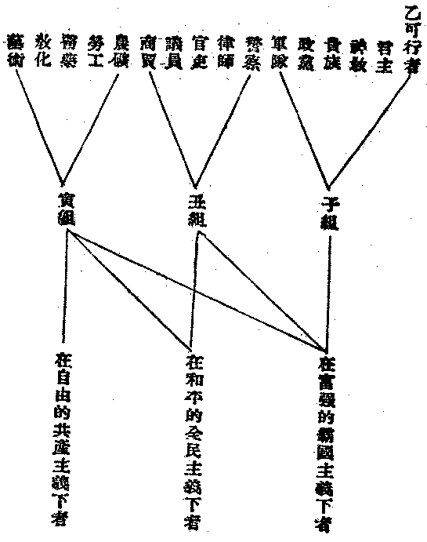

# 行為主義之佛乘

## 目錄

- 一　法華行
- 二　信心行
- 三　維摩行
- 四　上品行


## 一　法華行

法華所注重之因行，即是隨喜、讀誦、解說、兼行六度、正行六度之五種法師功德，與安樂行品所言之安樂行。兼行六度，是尚以解說法華經為主；正行六度，則專在行六度矣。六度中，第一便是布施，財物、身命一切能施，及法施、無畏施、一切實行。隨喜、讀誦、解說，雖專指法華經言，然法華為融攝世出世間一切法，皆為開示悟入佛之知見之妙法，資生事業皆不違實相。故隨喜者，即與人類與一切眾生凡有利益之事，無不歡喜贊助成就之謂也。讀誦者，對於一切有益於人有益於眾生之學說之教義，靡不受持宣傳之謂也。解說者，對於一切有益於人有益於眾生之法，力為增進發明之謂也。故皆是為實際上有益於人間世之善業而已。

## 二　信心行

如大乘起信論之信成就發心，其解說修何等行得信成就：則一、信業果報，二、能起十善，三、厭生死苦，四、欲求無上菩提，五、供養諸佛。其廣說修行以成信心，則分五門。其修施門：若見來求索者，所有財物隨力施與，以自捨慳貪令彼歡喜；若見厄難恐怖危逼，隨己堪任施與無畏；若有眾生來求法者，隨己能解方便為說，不應貪求名利恭敬，惟念自利利他，迴向菩提。故其修精進行，尤須勇猛無間以修一切與人有益之事，耐勞忍苦常不休息。

## 三　維摩行

示居塵勞之內，現有五欲疾病等事，因事說法而為呵斥，種種稱讚破人執著，起人信樂，於種種眾生類中以為上首，廣行六度、四攝而創造淨佛國土。

## 四　上品行

無量壽佛經上品往生之行，皆須孝須父母——本生父母而推至一切世來六道眾生，展轉皆為父母；敬重三寶；讀誦大乘經典；濟度一切眾生。要之，皆須實行大悲救世之菩薩行而已。

凡此皆非甚高不可及之事，莫不是就吾人之已能了知佛理者，使實際上依之歷事造修之行也。此吾人當實踐修習之大乘行，大要不外六度、四攝，其根本則在慈、悲、喜、捨。今佛法漸已普及人間，一般人類亟須了解在人間世普通當修之佛的因行，以免不學佛則溺於塵世之欲，一學佛則沉於枯寂之厭世。佛的因行，以敬信三寶，報酬四恩，——父母恩、師長恩、聖賢恩、眾生恩為本，隨時代方國之不同而有種種差別，略分如下：

甲、戒除者：

第一類當除之十惡：


```
　　　　燒搶────┐
　　　　偷騙────┼─盜─────┐
　　　　賭博────┘　　　　　　　├立當斷除者
　　　　邪淫──────淫　　　　　│
　　　　煙酒──────酒─────┘
　　　　漁─────┐
　　　　獵─────┤
　　　　屠─────┼─殺──────速當改除者
　　　　牧─────┤
　　　　蠶─────┘
```


第二類當除之十惡：


```
　　　　占卜────┐
　　　　星命────┤
　　　　相面────┤
　　　　風水────┤
　　　　巫覡────┼─妄──────漸當破除者
　　　　鬼教────┤
　　　　乩教────┤
　　　　齋教────┤
　　　　仙教────┤
　　　　天教────┘
```





當戒除者應戒除之外，其餘可行者，在相當時代方國之下，皆心隨所應為者而為之，不應放廢而不為也。慈善之事之當勤行，更不待言。若能敬佛法僧，信業果報，努力精進以行乎有益於人群之善事，隨喜真如性，不迷菩提心，則即是修菩薩行，亦即是成佛之因行也。

（見海刊二卷二期）

