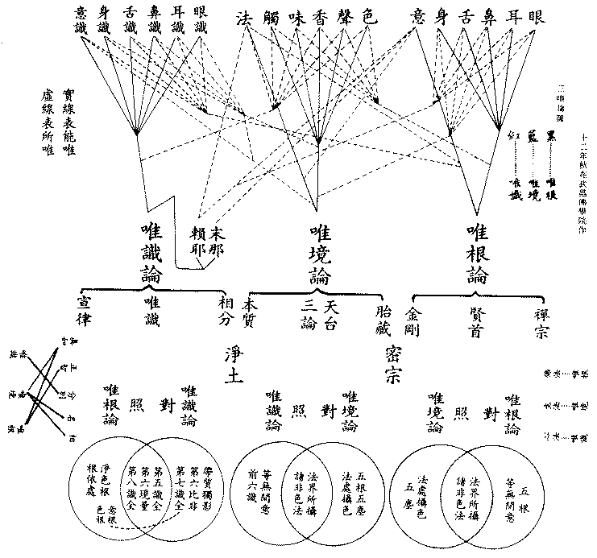

# 三唯論圖釋
（1923 年秋，在武昌佛學院作）

## 目錄

- 一　圖
- 二　引教成立
    - 甲三　唯論得名之依據
    - 乙三　唯論建義之依據
- 三　圖釋
    - 初釋題
    - 次解義

## 一　圖

## 二　引教成立

### 　　甲三　唯論得名之依據

一、唯識論——解深密經：『諸識所緣，唯識所現』。

二、唯境論——成唯識論述記：『然清辨計總撥法空，為違中道強立唯境』。

三、唯根論——大佛頂經卷五：『十方如來異口同音告阿難曰：「汝欲識知俱生無明，使汝輪轉生死結根，唯汝六根更無他物。汝復欲知無上菩提，令汝速證安樂解脫寂靜妙常，亦汝六根更無他物」』。

### 　　乙三　唯論建義之依據

一、『真性有為空，緣生故，如幻；無為無起滅，不實，如空華。言妄顯諸真，妄真同二妄，猶非真非真，云何見所見』？——唯境論。

二、『中間無實性，是故若交蘆，結解同所因，聖凡無二路。汝觀交中性，空、有、二、俱非，迷晦即無明，發明便解脫。解結因次第，六解一亦亡，根選擇圓通，入流成正覺』。——唯根論。又、『如一見根見周法界，聽嗅嘗觸覺觸覺知，妙德瑩然，遍周法界，圓滿十虛，寧有方所』（六大章）！『用目周視，但如鏡中無別分析，汝識於中次第標指』（七大章）。『根塵同源，縛脫無二，「識性虛妄猶如空華」。由塵發識，因根有相，相見無性，同於交蘆。是故汝今知見立知，即無明本，知見無見斯即涅槃無漏真淨』（第五卷）——可資參考。

三、『陀那微細識，習氣成瀑流，真非真恐迷，我常不開演。自心取自心，非幻成幻法，不取無非幻，非幻尚不生，幻法亦何立』？——唯識論。

（見海刊四卷十期）

## 三　圖釋 [1]

釋此論圖，大分為二：一、釋題，二、解義。

### 　　初釋題

「唯」者，獨此無餘義，謂除此以外更無所有。華嚴經言：『一即一切，一切即一』。天台宗言：『隨拈一法，無非法界』；謂隨拈一塵皆全法界，法界全體攝在一塵。如是，則一切法皆可唯矣。然諸法標別，備十八界；約類為言，則可唯者有三：一、就六根界名唯根，二、就六塵界名唯境，三、就六識界名唯識。論如常釋。

### 　　次解義

解義分三：一、依教建立分，二、依圖理解分，三、配攝諸宗分。

初、依教建立者：「識」，即指眾生心。華嚴經云：『應觀法界性，一切唯心造』。又曰：『三界上下法，唯是一心作』。此唯心句，即唯識論之所宗本。在昔天親菩薩造唯識二十頌，自作釋論；又造唯識三十頌，有護法等十大論師作釋，已依楞伽、深密等經廣徵教理，確然成立，故唯識之論無容復贅。至闡揚唯識宗，以護法為最盛。而與護法同時有清辨菩薩，依中觀等論著掌珍論。據窺基成唯識述記，謂其主張唯境。近人作唯性論，亦屬唯境，故唯境之論亦經人說過，不俟繁引。至唯根之論，雖未有論師建立，若尋諸契經亦有確據，如楞嚴經卷五云：『佛告阿難：「汝欲識知俱生無明，使汝輪轉生死結根，惟汝六根，更無他物。汝復欲知無上菩提，令你速證安樂解脫寂靜妙常，亦汝六根，更非他物」』。此言生死與解脫皆唯六根，更無他物，即是唯根之義。又彼經立七大，於地水火風空識之外更說根大，亦是唯根論之特點。此但就楞嚴一經足以證成唯根論者已如此，其他諸大乘經論尚多可引證，恐繁且止。

次、依理圖解分：[2]能唯之眼耳鼻舌身五根，對色聲香味觸五塵，故五塵可攝在五根。又能唯之意根，與法塵對，可攝法塵；意根又可攝六識心法：如是唯根論理善安立矣。能唯之色聲香味觸五塵，可攝眼耳鼻舌身五根。又攝前五識；其能唯之法塵，一分能緣者攝六識，一分所屬及能緣者攝六根：此唯境論亦可理善成立。六塵為六識所緣相，故能唯之六識攝。但唯識論擴張識界談八識，故阿賴耶識為意識所緣通于法界；又意根一分即賴耶，眼等五根為賴耶之相分；末那亦意根所攝。如是，則八識攝六根、六塵盡，故唯識論成立。

三、配攝諸宗分：大乘八宗，唯識宗之屬唯識論固不待言。然南山宣律師談大乘律宗，其判教宗：一曰、性空宗，即指小乘各部；二曰、相空宗，即指三論畢竟空義；三曰、唯識宗，即指非空非有之唯識宗：故南山律宗亦應屬唯識論。至淨土宗則可分二：其談自性彌陀唯心淨土者，如維摩經言『心淨則佛土淨』，但取自識上現起之相分，此純取自力者則應屬唯識論。其他一說，則託西方諸聖他心之相分為本質，以自心緣之現起相分，如鏡為自心，須託鏡外人形之本質方于鏡中現起人影，此自力他力兼取者，所託本質淨土應屬唯境論。天台宗言一心三觀從一境三諦而發，三論宗雖言畢竟空而空即是境，故此二宗皆屬唯境。密宗有金剛、胎藏二界；胎藏界說眾生理性如藏胎中，開顯即為佛境，故當屬唯境論。金剛界說眾生本心與佛金剛智果無異，如楞嚴說『以果地覺為因地心』，故屬唯根論。華嚴說『一切眾生皆有如來智慧德相』，悟真心以起修；禪宗直指人心，見性成佛，在眼曰見乃至在意曰知，悟即佛性，無位真人在六根門放光動地，皆同楞嚴擴張根界，指現量心令直證者，故賢首與禪宗亦皆屬唯根論。

（大圓筆記）（見海刊四卷九期）

## 註釋

- [1]：此圖釋，原題「三唯論圖釋」，先見於四卷九期；十期乃經大師改定圖式重為發表。今合為一，以圖釋次後。
- [2]：原文此處有三唯論圖，以重出故略之。圖以甲乙丙丁等分別，經改定紅藍黑三色及虛實二線，故釋文亦略易數字，以資統一。
