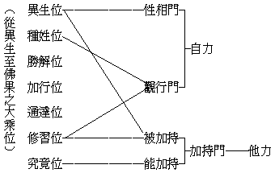

# 大乘位與大乘各宗
（1930 年春，在閩南佛學院講）

## 目錄

- 一　發端
- 二　曩在「起信唯識釋」之發凡
    - 甲　地上菩薩宗自證而造論故馬鳴等從自證境明一切法
    - 乙　地前菩薩依他教而起言故賢首等從佛果境彰一切法
- 三　今廣其意以判各宗
    - 甲　以論立宗者
        - １宗初地所證遍行真如故有龍樹一系之中觀學
        - ２宗三地所發大法光明故有無著一系之唯識學
    - 乙　以經立宗者
        - １宗法雲地含藏一切三摩地門之普賢故有華嚴教
        - ２宗佛智及二乘迴心之劫前菩薩故有法華教
        - ３宗佛智及諸乘初心之易退有情故有淨土教
    - 丙　以傳立宗者
        - １宗法雲地含藏一切陀羅尼門之金剛故有真言宗
        - ２宗佛智及二乘迴心之入劫菩薩故有禪宗
        - ３宗佛智及諸乘之新進有情故有律宗
- 四　各宗多明境或行果之別
    - 甲　性相門
    - 乙　觀行門
    - 丙　加持門
- 五　各宗唯是大乘中之偏勝相

## 一　發端

這個題目所蘊蓄的意義，為我十年來對於印度中國各大乘宗派、作有系統說明方法之一種，我於大乘各宗，完全抱著客觀的態度去觀察各宗派不同之點，同時作融合貫通的研究以發見其遍融互攝的共同律。由此探究之結果，故發生如下之結論：

一、平等門——從此門看去，則凡是大乘的各宗，無論其為性、為相、為禪、為律、為教（賢首、天台）、為淨、為密，如所謂中國之大乘八宗，無一不從同一原則上，引共同依據的教理去說明去發揮。故宗雖有八，同攝入于大乘法海，平等平等，不得分判誰高誰下。

二、特殊門——從此看去，則所謂大乘八宗者，在大乘教理上取其一部分為所宗，各站在其自宗地位上以發揮其偏勝之玄詮，顯其特殊之理境。故雖同是大乘佛教，就地位以判教義，則不無特殊偏勝之線索可尋。

以上，為我對於大乘各宗所觀之焦點。然而從什麼地方可以有這樣的見到？又有什麼方法可以去說明其原委？曩者關於此問題略有論及者有二：一、佛法總抉擇談：用遍計、依他、圓成三性相同相異之點以說明佛法的全體，及各宗派平等與特殊之所以然。二、大乘宗地圖：在八方面上，以對照異生與如來之出發點與歸宿點；雖未顯然引及各宗，而按圖索驥，衡量各宗相同相異之點，亦洞若觀火。

現在所講的，乃是從異生位到佛果位，其中所經歷之一一之階段，雖同是大乘之位——始自初發心終至成正覺——而有初終及中間菩薩歷劫修因位次高下之各別。我依據至教之見解，衡鑑大乘各宗所依據所發揮之教義，乃因其依據大乘位次之高下，故發揮之教義亦有所偏重偏勝；是為依大乘位而說明大乘各宗。但此種見解非創始於今日，從前已有所論及，不過東鱗西爪的散在各著作中，今天特提出此問題，作通盤有系統的說明。

## 二　曩在「起信唯識釋」之發凡

起信論唯識釋，是民國十三年著。著本書的動機，乃因當時支那內學院王恩洋居士作起信論料簡。彼書之內容，不像日本人與梁任公先生依歷史的眼光疑斥起信為偽書者，他是根據法相唯識之教理，料簡起信論之真如：因起信真如有受熏緣起義；而唯識之真如是唯識性、是無為法，既不為他法之生因，亦不為他法之所生。起信真如有受熏義、有緣起義，又有平等普遍為諸法法性義，則近於數論的「自性」、『相雖轉變而性是一』義。王君本此見解，於是斥起信為似教，非真佛教。故我當時亦以唯識之理而釋起信——蓋起信之真如與唯識之真如，其名雖同，其義有廣狹之不同：起信從體顯用，若體若用皆名真如；唯識乃依用顯體，用是識相、體是識性，唯體性是真如，相用非真如——。同時依菩薩位而說起信等論所宗不同，以發其大凡。

### 　　甲　地上菩薩宗自證而造論故馬鳴等從自證境明一切法

在菩薩位講：馬鳴為第八地菩薩，其所造之論皆依自證現量智境為準據。雖亦不離於佛陀所說之契經而取聖言為依止，但其注重所在之點為自證境，一切契經或反為造論之註腳。進言之，地上菩薩雖據自證境而說，同時亦統明佛法全體，故亦不限於專講自位境智；不過依自位親證之智境，說明一切法。

### 　　乙　地前菩薩依他教而起言故賢首等從佛果境彰一切法

華嚴宗之圓教法界觀，所謂「十相六玄」，都是明佛果上所證之智境。在此當有使吾人發生疑問者：即華嚴宗之創始者為賢首，他所處的地位，尚在地前而未登地，其所發揮之境界反在馬鳴以上而專明佛果圓融無礙境界，豈非實令人有不解者？實亦沒有什麼可疑之點；今於言論便利上起見，明地前、地上、佛果所依據以發揮之教義，作三項來說明。

一、未登地的菩薩，未得聖智自證現量之智境，間雖發有相似之現量境，然未足依憑。其所宗本依據者，乃在地上菩薩之聖言量，或佛果上之聖言量；因自己既沒有智境可為標準，則於菩薩或佛之聖言不可稍忽。由此，故雖在地前，倘是依據地上菩薩之聖言量，則其所發揮之教理，為依地上菩薩之境界以說明一切法；倘是依據佛果上之聖言量，則其所發揮之教理，為依佛果上之境界以說明一切法。是故賢首雖未入初地，而其所宗契經乃是華嚴圓覺果海之境界，或地上最高位之普賢菩薩境；馬鳴依自地智境所造之論，自然反賢首之下，此本毫無足疑者。

二、地上菩薩，有自親證智境為宗本以發揮教義，乃至說一切法無不依其現行智境為出發點，雖亦依聖言教或比量，然此不過其傍依，而正面之根據乃在自證。於此乃有其特點，即地上菩薩以未究證無漏與滅盡有漏，以是依其現行之心境，有漏無漏無間引發，故一方面代表四聖之無漏境，一方面代表六凡之有漏境。馬鳴所造起信論，即依據此點以發揮教理，所以不若賢首全依據佛果聖言純無漏境之高深，此亦無足懷疑者。

三、佛果自證究極圓滿，智境離言絕相，佛亦無言論的必要。因佛與佛間，果位相等，其境界、心智都是相齊，故佛與佛之間完全相喻於無言。其所以起言說之原因，還在地上、地前、乃至凡夫的機感。故為凡夫說賢位境，為地前菩薩說地上境，為地上菩薩輾轉說上地境，乃至說自所證之智境。故大乘亦漸亦頓之法華宗，即依據此點而發揮。

如此大乘各宗，雖同是大乘，因地位之不同、程度之高下，隨其自住地位的境界說明一切法，或依何等之聖教申明各宗的宗本，往往全局為之改觀。

## 三　今廣其意以判各宗

### 　　甲　以論立宗者

今就各宗言教直接生起之原因，可廣其意分為三類：以論立宗者，如嘉祥的三論宗——又名四論宗——與慈恩的唯識宗，彼雖不無所依之經，然直接採取立教方面言則唯在論。故就依論立宗言有如下之二大系統：

#### 　　　　１宗初地所證遍行真如故有龍樹一系之中觀學

世傳龍樹為證入初地之菩薩，如楞伽經等在在皆足證明，亦為研究佛教者之所共許也。初地證入一切法空，即通達二無我得一切法空智，亦即遍照一切法真實如此的法性。故龍樹說法，從其所證的法空理上，說一切法皆不可得。其言教所顯者，亦在遮詮方面，以表現其空性真如理也。此為龍樹依自證境造大乘論，故有空宗一系。其最足表現他全體的思想，集貫總持他一切的作品者，唯推中觀論，故亦有稱其為法性中觀學者。其餘如智度論等，皆不出中觀論之範圍。在中國依其著作推演而建立為三論宗或四論宗，乃依龍樹菩薩之論為宗本故，特稱為中觀學。

#### 　　　　２宗三地所發大法光明故有無著一系之唯識學

唯識宗所據六經十一論，也有佛說或菩薩說的。如華嚴經雖亦為此宗之所依，而非正依；如深密等始為此宗之正所依。深密經乃從瑜伽師地論摘出者，此雖彌勒所說，能傳演到世間上還是無著菩薩。彌勒五部論及無著自作的論，即此宗所依的教。天親護法等依之發揮，故唯識根本教理，可說是無著建立的。從前中國傳說無著為初地菩薩，又說無著得大乘光明定。我從前想：無著既依初地境為出發點，即應與龍樹空宗系相同，何以立論相去頗遠耶？這是我以前的難點。現從西藏佛教徒所傳，皆公認無著為第三地菩薩，恰與中國相傳其「得大乘光明定」之言巧符，此較初地說為當。即依三地大乘光明定的智慧，照了佛之一切法藏，即以此定所發出之智為能觀，以地前或地上乃至到佛果的教法為其所觀的法境。此如華嚴、瑜伽等，說三地所證之境界都是這樣。由照了大乘之法，有明了正確之法相，故此唯識學、又名法相學。據此、則前所謂中觀學亦可名法性學。故依初地境有龍樹系，依三地境有無著系也。

### 　　乙　以經立宗者

#### 　　　　１宗法雲地含藏一切三摩地門之普賢故有華嚴教

以經立宗者，即是依佛所說的言教而立其宗也。如來言教之所由起，種種不一，——或對地上、地前、二乘凡夫的關係而施諸教法。依佛說法最高之緣起說，唯依第十地菩薩的根機所感動而有的教法最極殊勝。如法雲地菩薩，如來所有的教法猶如大雲而雨大雨，此地菩薩猶如大海悉能通達而領受之。所以由十地含藏一切三摩地門的普賢三昧境界，就成為華嚴教。即以最圓滿普賢三昧之因海，以顯最究竟不可言說毗盧果海。此即是就普賢的自證境上，顯現所感受到的佛境界的教。所以華嚴第一會即說如來依正因果法門——佛果境界從何來？即推到因上；此因得何果？即推到果上。此依十地菩薩所顯最高的教法，唯十地方能領受，餘地雖亦能少分聞到，不過其起須待十地機緣耳。故云「宗法雲地而有華嚴教」也。

#### 　　　　２宗佛智及二乘迴心之劫前菩薩故有法華教

法華教是佛陀自證的境界，自動的大願意樂所說，所以說『為開示悟入佛之知見故，出現於世』。從能感的機言，是二乘迴小向大需要此大乘教法。在依二乘教法而修到的阿羅漢，依其所證之生空真如言之，或同初地、第八地菩薩；依其應備之福慧資糧及求證法空真如上言之，還不及初住，僅與七信之菩薩齊。未入初住，未達法空，故云「劫前菩薩」，以第一僧祇尚未入或尚未滿故。天台智顗大師，謂入圓教初住即能八相成佛。天台後裔每謂此為天台獨有之說，其實此為起信論及慈恩宗等皆有之大乘共法。法華為二乘授記作佛，都是八相成佛的相，以初住即能實現故。故法華教有兩方面：一、依佛自己的平等意樂，為欲眾生開示悟入佛之知見是佛最高的自證智境，故放光現瑞、等覺如彌勒者尚不知欲說何法。二、是未入劫以前的二乘迴心、種性位的菩薩所急需的法味。亦即是一、為地上菩薩也測不到的最高境界，即如來本門；二、為迴心二乘說成佛法，如為舍利弗以利根故說方便品，即如來跡門。故云「宗佛智及劫前菩薩有法華教」。

#### 　　　　３宗佛智及諸乘初心之易退有情故有淨土教

淨土教皆說佛果之依正莊嚴，是佛之他受用境界。原夫如來之所以要說此教者，是從徹底的大悲心為出發點，對於初心易於退轉的眾生令其依佛智所流出之淨土經教，修習淨土法門，得生諸佛之淨妙國土，即能證得阿惟越致，一生證得無上菩提；故淨土法門最重之點，即在攝諸眾生令不退轉阿耨多羅三藐三菩提。如佛不說此淨土法門令眾有所依歸，即在此五濁惡世之中修菩提，則初發心之眾生有所恐懼而生退轉。故起信論謂為「勝方便」，十住論說為「易行道」，良有以也。此所以一面依佛智，一面依初心怯退人，而有淨土教出現也。

### 　　丙　以傳立宗者

以傳立宗者，禪宗不依文字，絕無經典，赤裸裸的惟證是務。密宗雖有其所依之經典，若未經明師之傳授皆不閱之，即或閱之，其名句文身之安排與尋常逈異，非經師傳亦難明了。至於律宗固有律藏在，然經論即菩薩也有造說之可能，惟關於律制獨創裁於佛，降佛而還皆不得措一詞，後之繼續宏揚者，亦惟師傳是遵。故此三者，皆依傳立宗也。

#### 　　　　１宗法雲地含藏一切陀羅尼門之金剛故有真言宗

真言宗以金剛菩提薩埵為其初袓。世傳龍猛以定力開南天鐵塔，金剛薩埵授之以灌頂，故人間世有密宗教義流行焉。以非自龍樹之自證境上而流出者，故須歸之於金剛薩埵。有云金剛薩埵即普賢，普賢在大乘教法上為最高之模範菩薩，故從三摩地門有華嚴教；從陀羅尼門有密教。以最高之大機，感佛說圓極之教法，故云真言。不名為教者，以不詮顯理故。此真言須代代親授，師資相承，方能流通。

#### 　　　　２宗佛智及二乘迴心之入劫菩薩故有禪宗

禪宗以「佛心為宗」，即以佛智所證之境為境。此宗之所重者，為師資相繼而傳其「以心印心」之法門也。世傳大迦葉為其初祖，他本是迴心之大阿羅漢，夙根極深，不遇佛也可成獨覺；若羅漢發大菩提心，亦得授記作佛。依一般言之，位在第七信；然不一定有，先曾修習大乘法者，雖退失其菩提心，若一念迴心向上即可入初住。或以前已曾備修福智資糧中道而廢者，一迴心即可入初地等位，故云入劫菩薩——然入初劫二劫三劫不等。諸地位中，於勝進道中皆有加行，即如十信滿位，亦起加行故而入初住，證未曾有之悟境而契佛心，故能傳佛心印，由此故有禪宗之產生也。

#### 　　　　３宗佛智及諸乘之新進有情故有律宗

律本佛制，故律亦宗本於佛。依大乘說：一切大乘律皆依三種佛身而說，諸乘初心須納之於正範，有一定「止」「作」的規律，才能不越乎軌道以外的行為。依三聚淨戒說：攝律儀戒即諸惡莫作，所謂止持門是；饒益有情及攝善法戒即眾善奉行，所謂作持門是。真能傳持佛之戒律的，須通達佛智，上體佛的本懷，下察眾生的根器而傳佛戒，才能令彼新進有情得蒙實益。故一面依佛智，一面依初心而有律宗也。

## 四　各宗多明境或行果之別

### 　　甲　性相門

多明境曰「性相門」，詳境而略行果之中觀、唯識屬之。位在第二、第一大劫。性相門者，以說明性相之平等門故。如自凡夫乃至於佛，皆可歸之性相。法性一味平等，法相不無有別，若龍樹之中觀學，無著之唯識學等，皆可歸於此門。此不過因各宗所重之點不同，在多明境者曰性相門，實則法性法相，從始至終平等平等。雖偏說於境而同時於行果亦必言及，並非捨行果而不言也。所以從實際言之，只有多分與少分之差別而已。

若就言教以論，有兩方面：一、如龍樹從自證境上為出發點而為地前說一切法門，此教功用、雖能被地前之機，然就能說教者之本位上言之，則在第二大劫也。二、地前勝解位和加行位之菩薩，正須此教法為其悟入之方，故從所逗之根器上說，位在第一劫。此雖詳境而行果亦該也。然對未入劫之初發心菩薩，於此教法反難領受，故初發心者應以加持門之極果教法，而激發其信心為妙，此教偏於理智，故為未入地前加行位或勝解位上之所必需也。

### 　　乙　觀行門

多明行曰「觀行門」，律宗、禪宗及法華、華嚴兼之。位在諸乘初心及第一、第三大劫。觀行乃福智資糧之所由圓滿也，故觀行門、諸宗皆兼之。律宗之戒法，在大乘則初發心位即須持此為修行趣果之正範，故此唯重在行。禪宗唯趣實證，然每到一種特殊境界，須要加功用行方可證得。法華、華嚴，多明佛果上之殊勝境界，然果不過所趣向之目標，為到此目標故亦廣明行之功用。所以說「萬行因華，莊嚴果德」，正是顯其因行極為殊勝也。在此中明其位置，律在初心；法華及禪與夫二乘迴心等住第一劫；華嚴明普賢行者住第三大劫。

### 　　丙　加持門

多明果曰「加持門」，真言、淨土及華嚴、法華兼之。位在第三大劫及諸乘初心第一大劫。佛果成就無量威德，能加持凡夫乃至修習位之菩薩。如真言宗用三密——身口意——加持；淨土以大悲願力及種種依正莊嚴，發起信仰願慕，皆為加持；若法華、華嚴兼觀行門及加持門。若因其所經歷之位次以明加持，則能加持與所加持：上上能被於下下，唯除異生位皆能加持；下下敬仰於上上，唯除究竟位皆被加持：而位在第三大劫及諸乘初心之第一大劫。能所相望，皆通一三。若細為分別，前除異生未入劫者，後除究竟劫已圓者，唯此一能一所不在劫中耳。

「加持門」全仗他力。若「性相門」、則從異生至佛果平等平等，如八識因果染淨雖有差別，而八識一也；「觀行門」、除異生位未起觀行和佛果位觀行已圓，其中種姓位至修習位皆具觀行，此二者唯仗自力。茲就境、行、果三門通別，特攝一表如

## 五　各宗唯是大乘中之偏勝相

八宗大乘教法，都在大乘法上佔一位置而各有其殊勝之相用，但統合起來皆攝在大乘之中。古來，或謂大乘為一乘，或謂佛乘，或謂最上乘，而欲顯其自宗之超過其餘各大乘宗之殊勝。其實，都是大乘之別名：最上乘者、大乘為最上故；佛乘者，大乘以佛為最高之果故；一乘者，為令眾生皆入佛乘故，故云『唯有一乘法，無二亦無三』也。是即皆為大乘中各有之殊勝相和殊勝義也。

古人有於大乘之全部中，據其認為最殊勝者特別闡發，實則各僅大乘之一部分；其末裔即據此一部分之殊勝相，遂尊崇自己門庭，以為我宗為大乘上特殊之一乘或佛乘或最上乘，而抑他宗為三乘中普通大乘。如西藏真言宗自稱為果乘，餘俱為因乘；不知彼等所執者，僅大乘全體中之一部分耳。各宗唯是大乘中一偏勝之相，皆大乘故無有高下，因乘果乘皆通因果。此是因乘，因之所向為果；彼是果乘，果之所由為因；故因果互通，平等平等！唯證境有殊，所據各別，乃有諸宗派之標幟。其實殊勝不離平等，平等不離殊勝也。

（寶忍記、芝峰校閱）（見海刊十一卷十一期）

