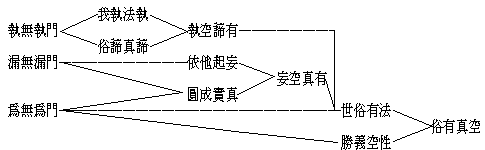
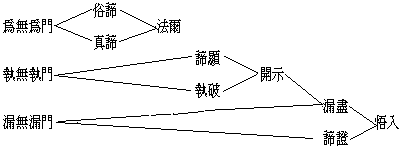
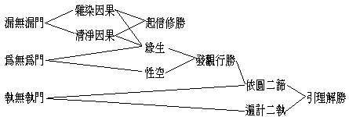

# 大乘法之三種異門表
（在漢藏教理院專修班講）

古人多以嗢陀南頌攝法義，今畫圖列表以攝之，雖方式有變而其義則一，且藉線條方位助顯第次關係，其為用加勝矣。故現所列表，亦猶古之嗢陀南頌，當本之以為解釋。表中所詮法義，乃就大乘法而明三種異門，亦即以三種異門而攝大乘法也。故名大乘法之三種異門表。今列如左：

言三種異門者：一、執無執門，二、漏無漏門，三、為無為門。此三種異門，開之又各具多種異名。如第一之執無執門，或名我無我門，或名自性無自性門等。第二種之漏無漏門，或名染離染門，或名繫離繫門等。第三之為無為門，或名生無生門，或名作無作門等。雖有如是異名，而義是一，故以三門即可攝盡。

第一之執無執門，乃就所執上遣除其執而顯。如云我我所執，此所執者即空，而無執之有為無為則有。以所執之我我所本空無實，但於似我似法有為上虛妄執有故。若離妄執即名無執，而無執所顯即有為無為之世俗勝義二諦法，諦實是有。故云「執空、諦有」，即我法二執是空而真俗二諦是有也。此為大乘法異門之一。依此異門所說大乘經論，如解深密、瑜伽等，雖大乘經論都互相通攝，而就其偏勝以明，故有依此執無執門而說之一類經論也。

第二之漏無漏門：漏即世間染法，亦即應斷之依他妄法；無漏即出世淨法，亦即應證之圓成真法。但此所說之依他妄法及圓成真法，與前執無執門所說有為依他、無為圓成有異。蓋前門遣我法執而存依他為俗諦、與圓成為真諦，此漏無漏門則以依他為虛妄雜染。此依他中攝我法執，亦依此依他起我法二執，故此依他唯是虛妄分別有之有漏法。而圓成真法亦與前門所說真諦不同者，以此中圓成真法亦攝淨依他，已不名依他而名圓成矣，故與前異。此門所說，或於依他妄法而顯有圓成真法，或依圓成真法以遣空依他妄法，故成「妄空、真有」，即依他妄法是空而圓成真法是有也。然依此門所空，亦不同前門所空，前門依他皆不空，此則染依他亦空，較前進一步矣。此在經論，如如來藏、寶性、辨中邊等，皆是此門所明。

第三之為無為門：即明一切世俗有為法，乃種種因緣對待假立而有。若於此世俗有為法而究其勝義則畢竟是空，此畢竟空，即此中所謂勝義無為法。明此門之義者，如金剛經曰：『一切有為法，如夢幻泡影，如露亦如電，應作如是觀』。又『若見諸相非相即見如來』，『如來者即諸法如義』，『不取於相如如不動』等。此等大乘經，皆從此義而說。故從此為無為門而說，前二異門可曰有宗，以「執空諦有」，「妄空真有」，以有為歸故。此則俗諦是有，而真諦畢竟空，故曰「俗有真空」。由是執無執門之諦有，與漏無漏門之真有，均攝入此門之世俗有中，而唯無為法性為勝義真空也。

如是大乘法之三種異門，據此表觀，亦含有次第深淺之意義。即漏無漏門比執無執門為深，為無為門又較漏無漏門為深。然此乃明最勝義性之一種次第看法耳；而大乘法於此三種異門，更可作他種不同之觀察。茲另列一表如左：

依此次第，其有為無為等門之有為即俗諦，無為即真諦，此為諸法法爾道理，不論有佛出世，無佛出世，恆常如是。但一切眾生為無明所蒙，煩惱所蔽，虛妄遍計起我法執，生增減見，以致於法爾道理，不知不覺。因此有佛出世，開示佛之知見，破除眾生迷執，使眾生所有遍計我法等執遣破無餘，此等「執破」，則法爾「諦顯」。然未開示，執著未破，固不能顯法爾道理，而仍為一混然境界。故至執無執門，始揭開眾生之迷謬，顯示法爾之諦理。次至漏無漏門，修習一切無漏方便，將一切有漏雜染對治遣除罄盡，圓滿無漏福智功德，因而證得法爾諦理。

依此表對三種異門，又可作如下之觀法：即單就為無為門之真俗二諦，唯明法爾道理，未指出眾生之迷執及破遣之方便；其法爾理猶在眾生妄執隱蔽之中，未能顯示。次至執無執門，則進一層，即揭開迷執，顯示諦相；但有漏習氣尚存。必至漏無漏門，有漏法盡，證佛知見悟入諦相，方為究竟。如中國之天台等教多作如是觀也。茲更另列一表如左：

依此表復可作一種觀法：如漏無漏門，漏即雜染因果，無漏即清淨因果。總漏無漏一門，但就染淨因果義上而明，故亦唯明依他起法，如唐後法相宗辨天台宗三諦三觀，唯是闡明依他起是。其次為無為門，方明因緣所生法之有為依他，及性空之無為圓成。然在三自性中，尚只明依他與圓成，猶缺遍計所執而未圓滿；故必須執無執門，並明遍計所執及依他、圓成三法，方臻美備。

故如是三異門所明，應知各有偏勝。如執無執門所明者，即於教理最完備而引生理解最勝。為無為門所明，即徹觀勝義理而引發觀行慧為最勝。漏無漏門所明，即對行果起信而發心修行為最勝。故此三門各有殊勝，雖或專習一門而不可執此斥餘也。

（碧松記）（見海刊十九卷五期）

