# 大乘宗地圖釋 [1]
（1931 年 8 月，在北平柏林教理院講）

## 目錄

- 大乘宗地圖
    - 大乘宗地圖㈠
    - 大乘宗地圖㈡——教法
    - 大乘宗地圖㈢——四相對門
    - 大乘宗地圖㈣——宗義
- 第一章　序言
- 第二章　釋題
- 第三章　解圖
    - 第一節　教法
        - 一　歷別說明
        - 二　綜合說明
            - 一　雜染與清淨相對
            - 二　精神物體相對門
            - 三　潛因顯果相對門
            - 四　事相理性相對門
    - 第二節　宗義
        - 一　總說
        - 二　歷別說明
            - 甲　性宗
            - 乙　相宗
            - 丙　律宗
            - 丁　禪宗
            - 戊　天台宗
            - 己　賢首宗
            - 庚　真言宗
            - 辛　淨土宗
        - 三　綜合說明
            - 甲八　對四類門
                - １八對門
                - ２四類門
            - 乙四　單四複門
                - １四單門
                - ２四複門
            - 丙　相奪互成門
            - 丁　平等殊勝門
- 第四章　結論
    - 第一節　教法之差別及其會歸
        - 一　差別
        - 二　會歸
    - 第二節　宗義之成立及其安置
        - 一　成立
        - 二　安置
    - 第三節　今後佛學之安立


## 大乘宗地圖

### 　　大乘宗地圖㈠

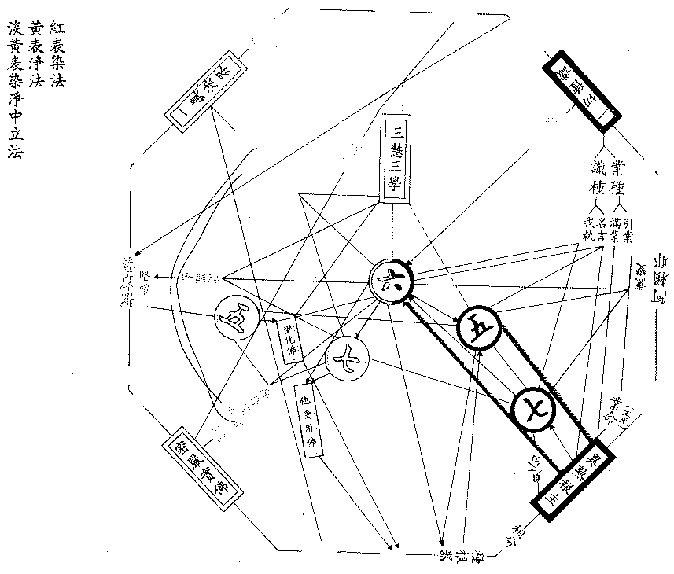


### 　　大乘宗地圖㈡——教法

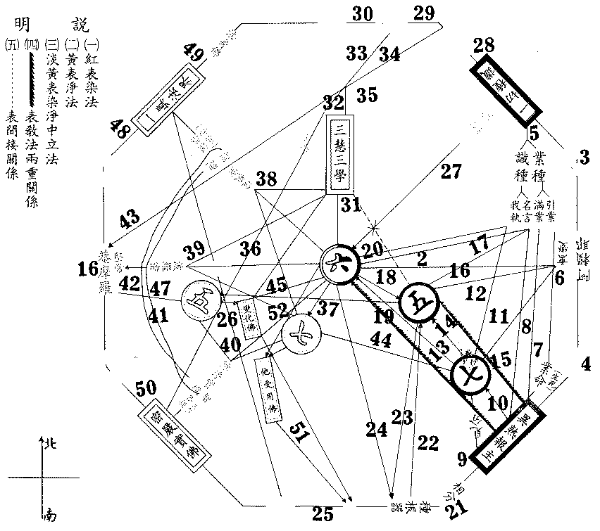


### 　　大乘宗地圖㈢——四相對門

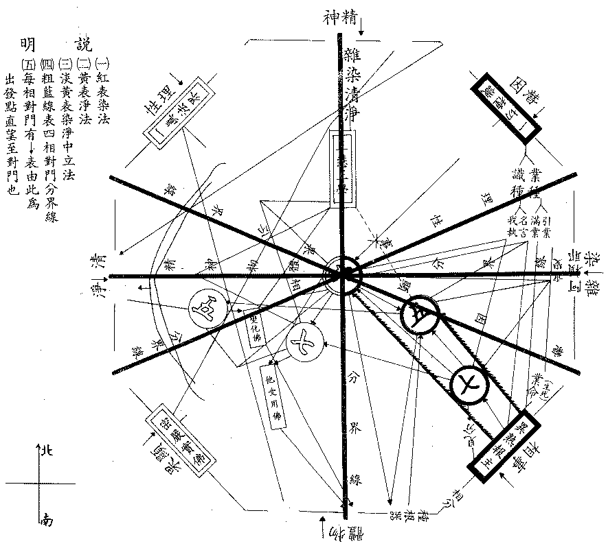


### 　　大乘宗地圖㈣——宗義

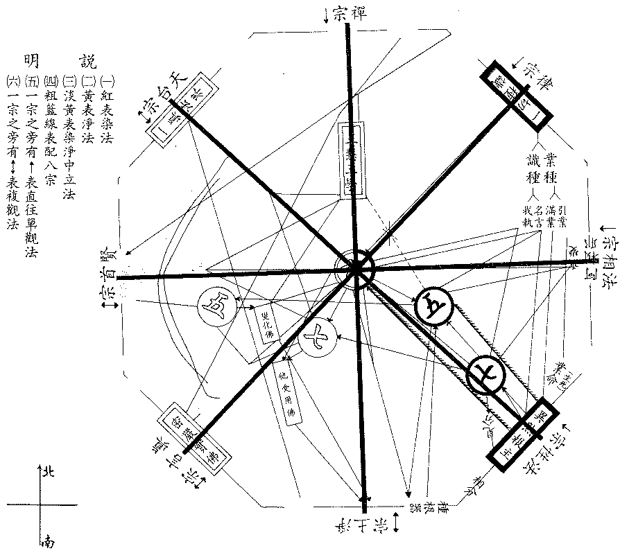


## 第一章　序言

本圖創作於民國十二年，後來雖幾經略改而大致無異。然此圖之作，僅根據於華文佛典，其中雖參酌日本佛教，而日本佛教亦為華文系者，故此圖為華文佛法之一總綱，總持華文所詮表之一切佛法也。

最近所創世界佛學苑，其研究佛法之根據，又較吾昔根據華文者大有擴充，可分為三系：一華文系之佛法，日本、朝鮮等屬之；二巴利文系之佛法，錫蘭、暹羅、緬甸等屬之；三藏文系之佛法，蒙古、尼泊爾、青海、西康等屬之；而梵文殘缺不全，可附藏文以參較之。以上三系文字所流行之佛典，為世界佛學苑研究佛法之資料，三系佛法之流行歐美已成為世界性之佛學者，首為巴利文系，次則藏文、梵文系，再次為華文、日文系也。所以現在世界佛學苑研究佛法之範圍，已擴充為以全世界流行之佛法為對象，除華文系佛法以外，梵、藏文巴利文系之佛法，皆為世界佛學苑所必研究探討者也。

今所講本圖，雖僅根據華文系之佛法教典而作，可總攝中國之一切佛法教理行果而未攝及西藏文巴利文系佛法；然此亦從能詮之文教觀之耳，佛法雖有如是三種文系表現不同，然若從所詮之理行果觀之，則佛法為佛智等流法；本無二故，是一味故，如大海水之遍通也。

復次、中國文系之佛法傳有三乘、五乘之別。三乘者：聲聞、緣覺二乘及菩薩乘也。五乘者：人乘、天乘、聲聞乘、緣覺乘、菩薩乘也。今此所說大乘宗地圖，依文觀之，除大乘佛法外，人天乘善法及二乘出世法似未攝在其中，其實人天乘之善法及二乘法皆攝其中，何以故？人天善法為出世三乘法之化他方便故；亦為自趣三乘佛法之階梯故。又攝二乘法者：一、大乘之化他方便法門須具二乘法故：菩薩以利他為勝，隨眾生根機化導一切，以化他故必兼通二乘法，否則方便不具，化他事業不能圓滿。二、二乘佛法亦為大乘佛法之階梯故：以二乘人除斷三界煩惱，大乘菩薩亦須斷除三界煩惱故；又二乘人破人我執證無我理，大乘菩薩亦破人我執證無我理故。以是義故，人天乘法及二乘法皆已攝入此大乘法中。故本圖雖標題大乘，實亦總攝五乘、三乘世出世間之一切佛法。故知此圖能總攝華文系一切乘之佛法也。

## 第二章　釋題

大乘者，緣廣大境，發廣大心，持廣大法，行廣大行，歷廣大位，證廣大果，故名大乘。此有二義：一、殊勝義，高出餘四乘故名曰大乘；二、普容義，總括於五乘故名曰大乘。依佛之果法言，佛於自證無為無漏有為功德法界，為利他故廣宣一切教法；如是所有一切教法皆佛清淨法界之等流，故佛所說一切法皆是大乘教法。

宗者，宗尚、宗主義。大乘教法雖極普遍廣大，然隨悟入機緣不同，故有各宗之別。以無所不明之大乘教理集中於一觀點而趣行果，於此一觀點中集攝一切大乘佛法，故名曰宗；教理之所宗故。

復次、依教明理，教既廣博普泛，理亦廣博普泛，依此教理起於觀行。為起行趣果故，將所知教理集中於一觀，乃可貫持勝解入三摩地，蓋從散慧心而成定慧心，非有貫通諸法總持一切之一觀點，則不能以一觀而總萬行、行行遍徹，此觀所依，總攝一切教理之極則事曰宗。古云：『語之所尚，義之所尊』名曰宗者，即此意也。若無所宗主，則理散解浮故；以散浮故，不能於每念中總持一切佛法，現觀一切佛法。從念念中能總持一切教理而起相應之現觀，握得一切佛法之中心者方是宗故。

由此言之，宗者乃攝理歸旨所成之宗點，由此起行趣果以貫持其趨向者也。在學者未至反博歸約時則無所宗，若至佛果，由一切智智念念證諸法實相，亦無有宗可言；是故宗者，唯在「從理起行」，「從行趣果」之行位上而建立也。如世間事業未發動之前固無宗旨，至已成就亦無宗旨，唯正作時則必有其宗旨，方能貫徹，此亦如是。

復次、大乘賢聖及諸古德，以己能依理起行、由行趣果故，有其歸納理解於所尊尚之殊勝點以為起行趣果之宗，故有大乘各宗。此各宗雖同依大乘教法無二無別，然以行者性欲別故，或其所持經論、所承師傳、所資眾緣別故，得力不同建宗有異，由此傳承不絕乃有各宗派別。雖此各宗及各宗派各有其所尊尚之點，然以皆對大乘佛法為統攝故，各據其宗點亦各能綜括一切大乘佛法，是故各依所宗以標舉其特點，則各宗各有其殊勝義；若觀各宗所依所攝同為大乘教法，則各宗又皆是平等一味實無差別者也。

地，喻三義：一、所依止義，二、能任持義，三、可遊履義；具此三義，名之曰地，與瑜伽師地論之地義同。今此圖所表明之一切法，及一切法所組成之此圖，為大乘各宗所依故；亦能任持大乘各宗義故；是觀大乘各宗之智可遊履故。如大地之能為一切山河草木所依，復能任持一切山河草木及為人等可遊履也。大乘宗之地，名大乘宗地，依士釋也。

圖，是能詮表「圖所詮法」者。圖所詮法，即大乘宗地法。圖較經論，不惟有名句文，並有色采，線條，位置，及組成之格式，故圖較經論等更能詮表。此圖是能詮表大乘宗地法義之圖，故名曰大乘宗地圖，依主釋也。

## 第三章　解圖

### 　　第一節　教法

#### 　　　　一　歷別說明

解圖有二：一、教法，二、宗義。先解教法，次明宗義。

第一教法者，謂各宗平等所依之大乘教法，或為大乘各宗所共依之教法也（如大乘宗地㈡圖）。此又有二：一、歷別說明，二、綜合說明。

圖中㊄、㊅、㊆，表五六七識，今先明正中之第六意識，如圖：


第六意識之右面紅色表雜染法，左面黃色表清淨法，因第六意識為染淨法之中心，故居正中，色分紅黃，而一切教法亦皆依第六意識為出發點以說明之。

一、就所知境上論——知識，如從聞教閱經以言，耳眼識雖聞聲見色而不分別文名句義及憶持之，故聞持一切法皆在於第六意識也。又意根識所對之法境，通有漏無漏、有為無為，在十八界中為法界，十二處為法處，故其所緣通一切法。前五各各所緣境別，且前五之所緣第六亦緣，而第六所緣則前五不能緣也。故一切大乘教法皆攝在第六識中，而一切教法皆必依此識為根據而說明，離此識則不能說明一切世出世間漏無漏法，因此一切法無不是第六所知所了所認識之境也。

二、就造作業上論——行為，一切有情行為造作之主動力皆在第六意識。頌云：『相應心所五十一，善惡臨時別配之』。又云：『動身發語獨為最，引滿能招業力牽』。由此可知第六意識能作一切善惡諸業。有情一切行為造作莫不由於此識，前五識雖亦隨之造作，力微劣故，六助伴故，意主導故，勝唯意業；故三界五趣之一切雜染業果，皆由第六意識之造作而生起也。復次、轉迷為悟、轉雜染成清淨，亦以第六識為樞紐。初地以前前六修行，以第六為主；初地以上前七修行，亦復如是。由發動之主力獨在於此，是故一切行為皆以第六意識為中心也。如大機械，雖各部機管皆有功用而不可偏缺，然發動力在汽缸。故前五、第七及諸心所等雖皆有力，而須以第六意識為主力。

以上二義，故以第六意識為中心而說明教法。古云：『知之一字，眾妙之門』；『知之一字，眾禍之門』。知雖遍諸識而勝唯第六，為諸法之遍所依，亦諸行之總樞，故從此以說明於一切也。

從六向右邊觀至阿賴耶，向左邊觀至菴摩羅，向上邊觀至心，向下邊觀至土。又有一切種識，一真法界，密嚴實佛，異熟報主，配置四隅。今借方向定其名稱以便說明，右為東方，左為西方，上為北方，下為南方。先從東方釋之：從六向正東之阿賴耶，由六至阿賴耶邊之熏變，如圖：

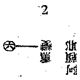


表明第六意識對於阿賴耶有熏變義。熏變義者，有能熏所熏義：以第六意識有能造作義，即是能熏，阿賴耶則受其所熏；由受熏故，阿賴耶中所持種子時起生滅增減等之轉變，名曰熏變；故六對阿賴耶，第一為熏變義。所熏之梵語阿賴耶，此譯為藏，有三藏義：一、能藏義，由阿賴耶受熏持種，望一切種能攝持故，是為能藏；此所藏者為一切種，對所藏一切種，此現行阿賴耶即為能藏。二、所藏義，由阿賴耶望諸異熟雜染現行則成所藏，以阿賴耶雖現恆行，極深細故為一切異熟報法所掩藏，由業種等所感之異熟報現前知見為異熟身器等，即由此等異熟報法覆蔽現行阿賴耶故，阿賴耶為所藏，而業及前六轉識異熟法為能藏。三、執藏義，由阿賴耶望第七識則為執藏，以阿賴耶恆為我愛相應之第七識所守持藏護故，對第七識之我愛執，名我愛執藏。

又阿賴耶譯藏，藏有處義，如喜馬賴耶山，喜馬譯雪，是雪所集處故曰雪處山。阿賴耶為我愛執相應之第七識愛著處，故曰我愛執藏；為一切雜染法所覆藏處，故曰所藏；為能貯藏一切諸種子處，故曰能藏。——以上為六東對阿賴耶熏變之略解。由阿賴耶向東北面有一切種識，如圖：

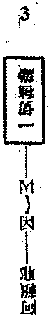


表阿賴耶與一切種識之關係，即顯阿賴耶攝藏之一切種子，故圖中有「一切種識」。然此一切種識，雖通為「無漏種」之依，但阿賴耶中之一切種偏指一切有漏種言。種子之法，雖無顯現相用可以分別，約義言之，正指能別別發生一切現行法之各個功能差別，名曰種子。如穀子有能發生穀芽者曰穀種子；若損壞無發芽功能，雖是穀形已非穀種，此亦如是。一切種識，謂攝藏一切法種子之識，仍指第八識現行也。阿賴耶到一切種識之間有因果二字者——因——因——由阿賴耶望菴摩羅，有一重因位義；由一切種望所生之一切有漏現行，又有一重能生因義：故於阿賴耶之一切種識，乃有兩重因義，名曰因因。又一切種兼含漏無漏種，既為異生因地心中所含之一切法種子，而復為發生一切有為法之因，故曰因因。由此義故，一切種識為阿賴耶因相。由阿賴耶向東南有異熟報主，如圖：

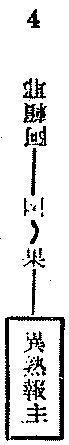


異熟報主，至下當釋。其間置有因果二字者——因——果——，因謂阿賴耶居因位，果指因位之異熟果，是因位識之果，故異熟識為阿賴耶之果相也。次一切種識下，有識種業種，如圖：


```
　　　　　　　　　　　　　　　　　　┌引業
　　　　　　　　　　　　　　　┌業種┤
　　　　　　　　　┌────┐│　　└滿業
　　　　　　　５　│一切種識├┤
　　　　　　　　　└────┘│　　┌名言
　　　　　　　　　　　　　　　└識種┤
　　　　　　　　　　　　　　　　　　└我執
```


諸法之種子，可分為二類：一、識種，二、業種。識種亦曰法種，一切諸法各別有因，因即是種，如心法有心法種，心所有法有心所有法種，色法有色法種，故言識種者，以一切法不離識故名曰識種。總之、一切法自類種子起自類現行者曰等流因果，此等流果之因，即是法種。次、業種者，望所起自類現行亦即是法種，不離識故亦名識種；然有增長他種以成界趣別之功用，謂能攝他種子隨其勢力受諸趣生，故曰業種。如是二種種子，如各個人民，謂一國中各種人民，依其各個自身力用，各作自身生活事業，識種道理亦復如是。如人民中有一部分人專以國家社會公務為職者，此種公務如行政等能影響全國之事業，一一人民亦同受其影響，業種道理亦復如是；又復應知公務員所作公共事業，雖影響國家社會，而不失其個人自體及個人生活，故業種對自現仍為法種。

種子又曰習氣，習氣分為三類。識種有二：一、名言種子即名言習氣，謂一一最單純現行法各別之因曰名言種子，最單純現行法即尋常感覺上覺到之色、香、味、觸等離言自相。二、我執種子即我執習氣，依六七識心心所法建立前名言種子之現行，各別而不相關。由我執種之現行力，使名言種之現行別別組成一一之總聚假相——個體，生此我執之現行者曰我執種。我執，梵云「薩迦耶」執，譯「總聚」執。聚者，聚一一單法所成之個體，以任何個體皆由多數單法聚成故。如電子亦為光熱量數時空等所搆成之一總聚；電子且然，原子以上以至無機、有機諸物，其為多法所成之一總聚，更不待論。故吾人尋常知覺到之一切法，非單純現行法離言自相，乃多法聚成之一一總聚相也，故瑜伽真實義品八分別中名總聚分別。由此總聚分別，執一一實我或一一實法，實我實法皆由於總聚執之我執也。

復次、由單純法聚組成似一、似常、似有自在實體及精神生命者曰「生我」，聚組成似有實體之法曰「法我」。執此生我、法我為實之能執者，即六七識相應薩迦耶見心所，由此心心所聚熏成之種曰我執種。我執種亦能影響於他法，如人民所組成之家庭，此家庭雖非公務員之公共機關，然其作業行為亦能影響家人。以其不明了單純現行法之因緣相，於和合假者見為獨立自在之實體，遂執曰「我」。與我相敵對之非我，屬我者曰「我所」，不屬者曰「他物」，由此我執能障覆一切法真相，使不知一切法皆唯識現。亦由此故，於一一識覺了之別別法相，乃不能如實明了，於我執相應心心所聚上，只見到總聚之獨立個體，因此吾人無始以來恆有自他之隔，不明了諸法真實相，皆我我所執為障也。蓋由一一單純法而組成一聚，例由五蘊組成一人，亦猶木石築成一屋，固以單純法五蘊或木石為先，而後乃得成為總聚之人與屋。然在異生心心所上，由我執為障故，適成一相反之心理，認總聚為自體，而單純法為其屬性，因此而有種種我與非我之執，由此執故而生無量惑業苦。

次、業種者，三習氣中即是有支習氣，乃有能支配他法之特別功能種子，能令趣類區別，謂由業之不同感招不同之諸趣報。換言之，此一一趣之報果，及一一趣中一一有情各別不同之報果，皆業種為增上緣而招感。一一有情或一一法之隔別者，由於我執種；至成一類一類之五趣、九有、二十五有、六十二有等區別，則出業種。剋論業之自體，即心所中之思心所，以思心所能自造作，又能役令其他心心所造作故。此為「業自體」之思心所，指前六識中之思心所；故「業之相應」亦即為前六心心所聚，以前五識依第六識亦有或善或惡之造作故。一、滿業者，較引業力弱。如由引業感得人之總報以後，而資助令其完滿成就者是為滿業。如公務員中由領袖確定計畫——引業總報——以後，再由各部人員依計畫實施工作以成滿之，滿業亦爾。二、引業者，為最強之業。五趣有情捨此趣報取彼趣報，不隨他業所引之報而能獨自引取總報之業，是為引業；喻如政黨領袖能奪取全國政權——喻感總報——而不隨他黨活動，須俟他黨失敗之後，此黨領袖方可起而代之，如此引業所感報盡，彼引業又引感一他趣之報也。

又滿業如將相，引業如帝王等。滿業具三性，隨引業轉故；引業或善或惡，有強果明決性，故不通於無記。

由引業以望異熟報主之業命，如圖：


```
　　　　　　　　　　　　（生死）
　　　　　　　６　引業──業命
```


業命，表一期之報壽，即是命根。言業命者，謂此生所得一期之生命是由引業種子所起現行勢限，規定一生報果有一定之期限，故曰業命。換言之，由引業種子勢力之限度規定者是為業命；亦曰分段生死，於五趣中受一期生死各有分限段落故。如帝制國家有一朝一朝之帝統，此一朝之命運長短，在創業時即規定故；人之生死壽命長短在引業得總報即決定矣。如此一王朝亡，他一王朝又興，有情分段生死，捨報取報業命限定，亦復如是。若能解脫此業命所成之分段生死，如由君主化為民主。雖為民主而仍有其盛衰，猶聖者雖解脫分段生死而仍有變易生死也，至『金剛道後異熟空』，方得解脫一切生死，則猶國界消除而成大同世也。

次、業命與第八異熟識之關係，謂由引業所引而成壽命，此業種攝植第八識識種，此業種挾第八識種同時現行，是為真異熟識，為一期報果之主體，故曰「異熟報主」。約對於業緣增上果關係——是業種引起故，故第八識之果相曰異熟識，如圖：


```
　　　　　　　　　　　　　　　　（生死）
　　　　　　　　　　　　┌引業──業命┐
　　　　　　　７　業種─┤　　　　　　│┌────┐
　　　　　　　　　　　　└滿業────┴┤異熟報主│
　　　　　　　　　　　　　　　　　　　　└────┘
```


異熟之依正二報，皆以第八識為主體，故曰報主。在一期報果中，一一有情之主體者為第八識，故異熟報主指第八異熟識也。滿業隨從引業，以成滿總報中之別報，如前說。

次名言種望異熟報主者，如圖：


```
　　　　　　　　　　　　　┌────┐
　　　　　　　８　名言──┤異熟報主│
　　　　　　　　　　　　　└────┘
```


第八異熟識之生起，亦由自識名言種子，故亦通名言種。以異類之善惡業成異熟之無記果，故云『因是善惡，果是無記』。因善惡者，非指第八識之自種，乃指前六識之業種對彼增長引力關係，故因或善或惡，仍由自識無記種生起，故果是無記。喻如江水現曲直高低之種種型式，然水雖現曲直高低而實際上水非高低曲直，高低曲直乃因地岸等緣以成。有情在三界五趣中受生死流轉報，此受生死之異熟報主，如水之本身本無善惡，或流為人，或流為鬼，或流為天畜等，此流天、流人之異熟識固無記，而所以使此流天流人之業，乃是或善或惡也。蓋業種之善惡為感果之增上緣，而自身識種方是因緣也。

由異熟報主之見分望第七識，如圖：

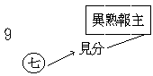


凡一識體、總有三分，不分見相為識之自體分，分之則為見分、相分。第七識之能緣見分，緣第八識見分為我，是第七識心心所聚所緣所守護故，第八乃成我愛執藏。此第七迷第八為我，完全因第七相應之我愛等四惑之關係而成。第八見分本是相續似常，和合似一，第七識見分因執為主宰之我；然第八識之見分，是否為第七識之見分如實緣到而執為我？則應知第七識見分以未見到第八真相，因只見相似故誤執為我，若真實緣到第八之真相者，則明第八見分非常非一而不執為我矣。然第七見分雖未見第八見分之真相，在此第七第八見分相對向關係上，因第七四惑相應，遂於第八見分處變生我相，執為是我，此所執之我相為帶質境，從兩頭生，故云『以心緣心真帶質』也。喻如病目見燈光上五彩輪相，此「輪相」因燈光與病目而現起，非燈光處不現輪相，非病目亦不現輪相。病目如我執相應第七識見分，燈光如第八識見分，所見「輪相」如第七識見分所執之「我」，如是病目及燈光中間生輪相，七識八識中間生我相，道理亦爾。

由異熟報主望第七識者，如圖：

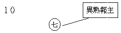


此表第八識為第七識之俱有依，種子依，根本依也。

由第七識望阿賴耶，有一直線通至熏變，如圖：

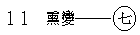


此表第七望第八識，第七為能熏，以有我愛等煩惱相應，恆執為我，故能以第八為所熏，熏習增長我執種子，種子生現行，現行復熏成種，種復生現，如是七望於八有熏變義。

由第七識望一切種識之種子通於我執種，如圖：


表第七識非異熟性，故與業種無關，然亦有名言種，以其我執勝故，常現行故，恆時與我執相應故，名言種子亦受我執勢力影響，就勝立名故但說我執種。由此道理，第六識之我執，亦受此第七識我執影響而起。

以上四線，一由第七至異熟報主，二由異熟報主至第七，三由第七至熏變，四由我執種至第七，皆為第七末那識望第八識之重要關係也。

由第七識望第六識之關係，如圖：


明第七識能與第六識力，作第六親依根，又為其染淨依。謂第七識之我執相不空，第六識雖作空無我觀等終不能捨執相而成無相，是皆由第七識之影響也。第七染汙有漏，能令第六亦成染汙有漏；若第七轉成無漏平等性智時，第七又作第六之增上清淨根，第六識乃成無漏故。

由第七識與前五識之關係，如圖：


明第七識亦為前五識之染淨依也。

復次、由前五識望異熟報主之關係，如圖：

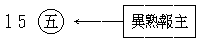


圖中於箭頭線上加有虛點者，顯其有多種關係也。線表異熟識為前五之種子依及根本依，虛點表真異熟與異熟生關係，業種所引第八現行為真異熟，前五識由先業勢力而引起者是異熟生，非真異熟，由在真異熟報上滿業之所生起故，特示真異熟與異熟生之關係，故於線上別加虛點。

由前五識望阿賴耶，有線通于熏變，如圖：

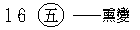


表前五識望第八阿賴耶識有能熏所熏之義，道理如前。

由前五識望一切種識，有線通於名言，如圖：


表其種子依之關係，蓋前五識之生起，各有其名言種也。

由前五識望第六識之關係，如圖：

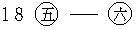


表第六識對前五識之現起，緣強有力故，第六為前五之分別依故，前五識之分別造作隨第六識轉故，所謂五識現行緣境，第六為五俱意識故。

由第六識與異熟報主之關係，與五識相同，如圖：

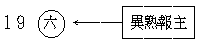


線表第八異熟識與六識為根本依及種子依，虛點表真異熟與異熟生之關係也。

由第六識望一切種識，通我執種及名言種，如圖：

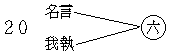


第六識我執相應，故通於我執種，然有間斷非恆時起。次通名言種者，第六識若不與我執相應，各心心所自類現行即由名言種子。第六意識本亦通於業種，今以真異熟與異熟生之關係，間接已明有業種之道理，是故略之。如十二因緣之識緣名色，即為真異熟與異熟生之關係，其實即業種關係也。

以上依第六識為中心出發點之向於東方者，已大略說明矣。次由東方至南方之說明。

由異熟報主向六之南方面有相分，如圖：


```
　　　　　　　　　┌────┐
　　　　　　　21　│異熟報主├──相分──種根器
　　　　　　　　　└────┘
```


相分有三：曰種，曰根，曰器。種即種子，即前說之一切種，一切種為見分所緣，故成相分，非離前一切種而別有體也。根即根身，謂五種淨色根及所依身，為異熟識攝為自體共同安危者也。器謂器世間，即有情所依之世界也。

五根為五識不共依，如圖：

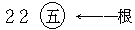


此淨色根，為前五識各別依故，是前五識勝增上緣，此五根雖各別，而總組織即是身根。英人著佛學通論，不知此故，謂佛學五根各別而無總組織。然按瑜伽師地論說：身根起現行有九法，即四塵、四大及身根之自種；但眼等根起現行時，有十種子，九如上說，別加第十身根。由此可知身根一方為身識之別依，一方又為眼、耳等四根現起之總依——即是五根所依之基。腦神經系亦屬身根，為有情五根身之總樞也。此根為第八識之所變起，復為第八所緣相分，非第八識不親緣故；第六緣此，說之為根，乃比知耳。

前五識與器之關係，如圖：

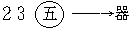


此中器者，亦為異熟識上所變現之相分，即是器界，亦名器世間。為第八識所緣境，持令不壞。第八所變所緣之器世間，前五識亦能各別緣其一少分，為前五識所緣者即成五塵境，名之曰器界塵。前五別緣固不能盡器之全部，即合五識所緣亦不能得器界全部，如器界所攝之時、方、數等非五識所能緣。由此，近世科學依前五根識緣前五境之經驗為基，僅推求器界亦不易全明，其他非五識直接能經驗之根種等，更非科學所能及矣。

次、器與六識之關係，如圖：

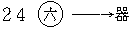


第六識依前五識——五俱意識——可緣前五境。但前五親切而不全，各別以第八所變為本質自變相分而緣。第六全緣而不親切，五識所緣之器界塵，及五識不緣之時、空等法，亦為第六識所緣，故第六識方能全緣器界；但緣五塵境時，須依前五識之助方能緣之。由此得知第六識雖全緣器界，乃是間接而非親切的；前五識雖親切緣境，乃是各別的而非全部的，托第八本質自變相分而緣之。因之吾人對於所應知之器界，現前尚不能完全了知也。

器與土之關係，如圖：


```
　　　　　　　25　器──土──法性
```


所謂土者，謂國土等，即是器界。器唯有漏，而土通漏無漏，亦通性相。性即法性，即法性土；相謂器相，即依報之器世間也。言法性者，法即色等一切法，一切法之真實性故曰法性。

法性與一真法界之關係，如圖：


```
　　　　　　　　　┌────┐
　　　　　　　26　│一真法界├──法性
　　　　　　　　　└────┘
```


此法性即一真法界，但法性與佛性對舉，佛性應從有情以顯，而法性以須極顯一切法普遍故，反應從一切無情法以顯，然法性即是一真法界也。

再自六識向北觀之，第六識斜望一切種識有戒體，如圖：

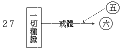


戒體，古師釋多異義。小乘有部等以「無表色」為戒體；成實論以「非色非心法」為戒體；大乘成業論等謂「前六識心心所法，于受戒時現行熏成受戒種子藏一切種識中，未破壞前隱然有防發之功用，是為戒體」。此種種子，是無漏法新熏生之種子，由受戒時種種作法之新熏習初生起故，換言之、即是從佛清淨法界等流之無漏戒法所熏成也。在前六識上受此戒法之熏習，即成新生金剛種子，是清淨無漏等流故，能壞一切不善法故，三世諸佛共所尊故。依大乘不共戒法言，受戒後雖犯重失戒，而無漏戒體亦不壞；若依三乘共通戒法，犯根本戒，此無漏戒體——種子——即失其體用。若不破根本戒，則不但不失，而且日有所增長。然獲此戒體時，曰成就戒或得戒者，得或成就有四：一、種子成就，二、現行成就，三、不退成就，四、圓滿成就：戒體是種子成就也。

戒體成就者，於受戒後能止一切惡行一切善，於內心中此止惡行善之功能成就者，即是種子成就也。依攝大乘論說：此種子是無漏善性，不與阿賴耶識同性，然此無漏種子可寄在阿賴耶中，故此戒體攝在一切種識中。圖中之色為淡黃者，表此戒體雖無漏性，以非現行，且藏於有漏阿賴耶識中，未是離染清淨法也。

無漏戒體與前五識亦有關係，故有虛線通於戒體之實線中。佛之戒法，從其本質上說，雖是如來清淨之等流，然仍是受者有漏之現行前六識所變現，在前六識於受戒後能自然持戒不破，而有止惡行善之功能差別，即此戒體是也。

復次、此戒體與命根相同，亦假立故。尅體論之，即前六識受戒時熏習所成之種子，故其防發功能亦是種子上之功能。此種子功能在二乘法犯根本戒即失，大乘法中犯根本戒雖不失，然其功能勢力為犯戒法所障，不得現起，若如法悔除還淨或如法重受，乃能復起原有之功能。故此種功能勢用能影響於前六識之現行，使自然止惡行善也。

由一切種識望北有本淨種，即本有無漏清淨種子，如圖：


```
　　　　　　　　　┌────┐
　　　　　　　28　│一切種識├──本淨種
　　　　　　　　　└────┘
```


此本來清淨之無漏種子，以是無漏性故，能對治阿賴耶性故，雖寄於阿賴耶識中而非彼攝。然異生無始以來所現行者為阿賴耶識，無漏種子曾未現行，故兩方無有違害之現象。此本淨種雖然具足，而寄存在無覆無記之阿賴耶識中，詳如攝大乘論、成唯識論等說。此本有之清淨無漏種子，在大乘中，初地菩薩方可現行，二乘法中，初果聖者亦始現行。

夫以一現行阿賴耶識為一有情，一有情即有一現行阿賴耶識。此以「一現行阿賴耶識」為「一有情」之有情類中，論說有一類有情無有此無漏淨種，故謂之無種姓有情，不能成佛；有一類有情雖具有淨種而祗是聲聞乘種姓或緣覺乘種性，此二種姓若定性者，亦無佛種，不能成佛；有一類有情具足佛種是菩薩種姓，亦曰大乘種姓，展轉增長無上菩提；有一類有情具三乘淨種，其性不定，曰不定種姓，終可成佛。此五種有情之區別，皆從此本淨種或具或不具而說明其差別也。

無漏淨種之得生起，先由有漏善心心所現行，展轉熏發出世無漏清淨種子，如是淨種漸漸增長，至初地時即能現行，至佛果位現行圓滿。復次、此一切本淨種子依其中智種而發起，故諸本淨種之生起以智種為其勝增上緣。在有漏位為諸法之王者為識，識是諸法之王；在無漏位智種為發起諸淨現行之最有力者，故無漏位以智為一切清淨法之王。依此道理，有漏位中萬法唯識，無漏位中一切諸法可曰唯智，以無漏位一切色心等法之起現行依智現行，又此一切色等諸法為其所屬，故皆唯智，約勝說故。又有漏識與無漏智之相對，即是迷覺之相對。本淨種即是本覺種，諸淨法皆智覺性故，故一切無漏清淨法亦可曰唯覺也。阿賴耶識異生位中無始以來未起此覺，換言之、即無漏無分別智種曾未起現行，一向是迷，一向分別，故一切有漏雜染法亦可曰唯迷也。本覺淨種無始以來法爾本有，以此義故，經云「眾生心性本淨」。

既是本淨，云何而成染耶？客塵所染故。問：若一切無明煩惱染是客塵者，則本淨是主體，無明煩惱等染法如往來之客，附加之塵，然則眾生無始本來清淨，無明煩惱為後來所附加，則應有情本無無明煩惱等一切雜染法，原來是佛；若本是佛，何故後來復成異生？若可由佛退為異生，則吾人修行斷惑以成佛，亦仍然可退為異生，如是成佛有何意義？學佛亦有何價值耶？答：淨種雖是無始本來具足，然染種亦無始本具，且從無始現行上說，則雜染法不唯種子成就，而亦無始現行成就；清淨種子雖本成就，然未現行。故古德云：『菩提有始無終——此就現行言，以種子亦無始故——，無明無始有終』。以智淨種起現行時破無明故，智與無明不並起故，無明是智所對治故。以此義故，眾生從本淨智種一面說有本淨種，故云「眾生本來是佛」；從其亦本具染種且恆現行說，故「眾生本非佛」。無始雜染種現無有間斷，淨種起現行時，能燒雜染種現令皆滅盡，方可成佛；眾生位中淨種為染障故，不能現行，至成佛後永無染障，故不復為異生。問：若淨種子以無始本有故為主體者，其有漏種現皆無始有故，豈不更應為主體耶？如何乃說之為客塵？反之、無漏種亦應為客塵，俱無始故。答：無始淨種雖未現行，然一現行即能斷染法之種現以至滅盡，得成離染清淨。何以故？以有漏種現是可斷可滅可離法故，可為無漏法對治故，故一為主體一為客塵也。

無始以來曾無一念淨覺現前，所以染法遍起悉是雜染，若一剎那淨覺智生，即能斷之滅之離之。彼有漏種現祗能覆障無漏種，而無漏種永永不為染法所斷、所滅，以無漏種不可對治，是不可斷法、不可滅法、不可離法故。由此，主體客塵義不相齊，一為般若火，一為煩惱薪，一為金剛不空，一為畢竟空也。此種子義最為深廣，略說如此，智者應詳！

次由本淨種望佛性，如圖：


```
　　　　　　　29　本淨種──佛性
```


佛性之義，各經論及古今大德解釋逈異，且相矛盾，今略舉三種會通之：有云『情與無情皆有佛性』；有云『凡有心者皆有佛性』；有云『二類有情有佛性，謂二乘之迴小向大者及大乘種性者；定性之聲聞與緣覺及無姓者無有佛性』。如是三說不同，欲其會通，先審名實。言佛性者，佛之體性名曰佛性，或云知覺自性名曰佛性，或云成佛之可能性名曰佛性。

初謂佛果上所成就之一切無漏功德法，總名曰佛。佛果之總聚無漏法，論其體性，即是有漏無漏一切法平等不二之無為體性，故曰佛性。次謂佛者覺義，能知覺之自性，即為有情類本來具有之佛性。三謂由法爾無漏種具有發展成佛之可能性，故曰佛性。第一、從一真法界真如性說名佛性；第二、從心心所能緣慮性說名佛性；第三、從本淨種增長圓滿之成佛可能性說名佛性。以此義故，凡諸名辭，應觀其義以定其名，不可依名而判義也。依上三種訓釋以定其名，次出其義略有三種：一、理性佛性，二、隱覆佛性，三、行性佛性。

一、理性佛性者：理謂一切法無相無分別之平等真如理，如來究竟證窮此理，此理為佛真實體性，故名理性佛性。此真如理即是一切法之體性，約勝以說，此性是佛果所顯故，眾生雖具而不顯故。金剛經云：『須菩提！我於阿耨多羅三藐三菩提乃至無有少法可得，是名阿耨多羅三藐三菩提。復次、須菩提！是法平等，無有高下，是名阿耨多羅三藐三菩提；以無我、無人、無眾生、無壽者，得阿耨多羅三藐三菩提』。復次、云何名佛法？金剛經云：『須菩提！所謂佛法者，即非佛法，是名佛法』。又云：『離一切諸相，則名為佛』。又云：『實無有法佛得阿耨多羅三藐三菩提，……是故如來說一切法皆是佛法』。云何名為如來？經云：『言如來者，即諸法如義』。如是經文，皆顯示理性佛性義也，依此故說有情無情皆有佛性。

二、隱覆佛性者：依涅槃經，一切有情十二因緣生死流轉皆即佛性，以此諸法皆緣所生，本來空故，無實性故，達其本空不迷理事，理事明瞭即不造有漏業，以不造業生死解脫，隱覆之法空即顯現佛性，而隱覆法本性空故，故隱覆法即是佛性。此所言隱覆法空者，生死緣生之法總名曰空；若別分別，或曰無常、無我、涅槃寂靜，達此空故即證佛性，成佛陀法。以此空義遍一切法，佛陀曰覺，即覺此諸法空義故。若不達此空、無常、無我、涅槃等義，即成眾生法。由此義故，能隱覆佛法之一切煩惱等眾生法，皆是佛性，故一切異生、聲聞、緣覺等皆有佛性，以皆具此隱覆法故。維摩詰云：『行於非道通達佛道』。又云：『云何是佛種耶？一切無明有愛等煩惱法皆是佛種』。以煩惱等皆因緣生，若能通達因緣本空義，即證涅槃佛性，是故說言一切有情皆有佛性。

三、行性佛性者：行即諸行，表有為法，諸有為法中之佛性，正指可發展成佛之種子，由種子發起菩提行，漸次趨向菩提妙果，至成佛道圓滿無上。此成佛之可能性，即是佛性。依此義故，有此可能性者乃有佛性，無此可能性者則無佛性，故有情類或有佛性或無佛性。

然此佛種必本有耶？抑亦可熏生耶？解此問題，頗多諍辨，余采本有兼熏生義，於此行性種子說有二義：一、現實如是義，二、展轉增上義。若此種子定是本有決不能熏生者，則有有佛性與無佛性之二種決定，無佛性者終不成佛；若容可熏生者，謂由佛之平等意樂無盡願悲，展轉增上不捨眾生，以此緣力熏生諸無姓者無漏種子，如此則雖本無佛性眾生，亦終可熏生佛性之種子。由此、其一現事實中，雖無佛性種子不可成佛，其二然將來不無熏生佛種之可能亦可成佛。此中其一即現實如是義，謂諸有情法爾或具佛性種子，或無佛性種子；就現前事實論，觀彼無佛種者，確實永無成佛之可能性，故曰不可成佛。其二即展轉增上義，謂一類有情雖現前無有成佛之可能性，而依仗佛菩薩之大智悲願力，亦終久可熏習以生佛種，得以成佛。何故有情本無佛種後可熏生以成佛果？二十論云：『展轉增上力，二識成決定』；謂有情之心力互通，可以展轉互為增上，故諸異生雖無佛性，由佛大悲願力、平等意樂為增上力，可生起其佛種。故法華經雖為一切不定姓者說皆可以成佛，然亦以從佛有度生大願力故，一切有情久之久之皆有成佛可能，故云『佛種從緣起，是故說一乘』。由上二義，補充行性佛性之義，依聖教量及諸正理決定成立或無佛性，皆有佛性，二俱實義而非權教，有情現實確如是故，依佛有情互成輾轉增上力故。

復次、從現實如是義觀之，三世諸法不離現在一剎那故，現在有情一剎那上若無佛性，則過去過去既本無，未來未來亦畢竟無，云何後來佛性得起？是故一切有情定有一分不可成佛，以現有法事實上如是故。應以此義讀法相宗各經論。就增上力觀之，自他交互展轉為緣，從此展轉之關係以言，現在雖無佛性，然以佛菩薩等善友永隨逐故，將來可以熏生，應以此義讀法華等經論。

以上三重之佛性義，古唯識家慧沼法師在能顯中邊慧日論中曾有說明。次現實如是與展轉增上二義，為余補充行性佛性刱立之義。

復次、佛性即如來藏，佛即如來，藏即性義，名義不同，法實是一，以其名異實同，故圖中未另出如來藏名。古釋如來藏有三義：一、空如來藏，二、不空如來藏，三、空不空如來藏。今以三種佛性配釋此三種如來藏，顯其同義。一、行性佛性即不空如來藏，以一切眾生雖流轉生死沉淪五趣，而本具有佛性種子，如窮子身藏寶珠也。二、隱覆佛性即空如來藏，以隱覆法是妄執所起雜染性故，覆藏如來本空無實，了達其空即顯如來，故曰空如來藏。或隱覆法中所含藏之空性即是如來，曰空如來藏。三、理性佛性即是空不空如來藏，真如理性本不空故，此雖不空由空諸障執之所顯，故曰空不空如來藏。列表如次：


```
　　　　　　　┌一行性佛性……不空如來藏　┐
　　　　三佛性┤二隱覆佛性……空如來藏　　├三如來藏
　　　　　　　└三理性佛性……空不空如來藏┘
```


又此三種佛性，亦可配釋三性義，略表如左：


```
　　　　　　　┌一無漏依他起性…………………行性佛性┐
　　　　三　性┤二遍計所執及有漏依他起性……隱覆佛性├三種佛性
　　　　　　　└三圓成實性………………………理性佛性┘
```


由佛性至心，如圖：


```
　　　　　　　30　佛性──心
```


此所云心，詮各種經論所說心識之眾義，謂總括緣慮心、集起心、堅實心三義。緣慮、集起攝有為法，堅實攝無為法，有為無為皆名心故。一切諸法，就真如門曰真如心，就生滅門曰生滅心。如楞伽經中有三識八識之說，言三識者：一、真識，二、現識，三、轉識。真識即是識性，現、轉二識即是識相。識性即一切法之真實性，如云『於一切諸法常如其性故』；現、轉二識即是八識心心所故。此之三識，總包一切有為無為諸法，故云「諸法唯識」；一切諸法攝在識故，從勝立名。此中以一切法總攝在心故名曰心，心是諸法之總聚故，一切諸法之所依故。復次、心與土相對望，從心一面觀之，一切法皆是心；從土一面觀之，一切法皆是土。如永明壽禪師宗鏡錄云：『舉一心為宗，照萬法如鏡』，所宗一心，即此中之心也。

由六識望正北方，有三慧三學，如圖：

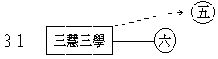


三慧、三學，為離染污而成清淨之中樞，主在六識，亦通於前五識及前六識相應諸善心所。言三慧者：一、聞所成慧，二、思所成慧，三、修所成慧。聞所成慧者，謂由近善知識聞聖教所成之慧解，故曰聞慧，慧由聞成故曰聞所成慧；就三學言，此唯慧增上學所攝。思所成慧者，謂戒增上學相應慧，要觀察一切之所行，如理作意方是思慧，非僅思惟考量名思慧也。修所成慧者，謂定增上學相應慧，修即是定，由定所成慧故曰修所成慧。

三慧三學其色為淡黃者，表示通於有漏無漏；未證三乘聖果所起三慧三學皆有漏攝，若登聖位則無漏攝。第六識至三慧三學為實線者，表第六識轉染成淨之殊勝功能唯在此三慧三學，以為主故，強有力故。雖通五識，然不為主，其力微劣，故以虛線表之。由第六識現起時，前五識為助伴故也。

三慧三學之上角有慧命，如圖：


```
　　　　　　　　　　　　┌────┐
　　　　　　　32　慧命　│三慧三學│
　　　　　　　　　　　　└────┘
```


此表慧命之生起，若此慧命一現行，即捨異生性而得聖者性，自此以往以無漏慧為命，故曰慧命。慧謂聖智，即是親證真如之二空根本智，此智現行謂之生如來家，得證不退，由此成展轉增長永不退失之慧命，而為聖與凡之分界。依大小乘言之，小乘須陀洹果起生空智，證生空真如得不退；大乘入初地時起二空智，證二空真如得不退。若此無漏慧命未現起前，所有智慧皆有漏慧，以第六識雖起二空智觀，而第七識我執恆行未斷，致其二空智觀不能亡相，故是有漏。證須陀洹果時，第六識上分別我執及所起煩惱障全斷，俱生我執及所起障亦斷一分，第七識上恆行我執遂不現行，轉第六識成妙觀察之生空智，無漏慧命乃永相續不復可斷。大乘初地，第六識上分別我法二執及所起之二障全斷，俱生起者亦斷一分；第七識上我執不行，斷障執故，有漏無間剎那無漏現行，轉六七識成妙觀察、平等性智，親證諸法真如實相，生如來家，登歡喜地。此復應知！雖證真如，未至七地，有時無漏無間又起有漏執障現行，但一用功則有漏無間又續起無漏，二空智觀即仍現前；若至八地，無待功用自然無間無漏現行；佛陀大覺始能究竟圓滿。

次由慧命上溯佛性，如圖：


```
　　　　　　　33　佛性──慧命
```


佛性謂行性佛性之佛性種子，此起現行即成慧命，以佛性種子現行時入初地，能斷執障，故行性佛性之現行，即為大乘慧命成立，發心以來所求得者亦即在此。

若從三乘以說，通本淨種，如圖：


```
　　　　　　　34　本淨種──慧命
```


二乘初果證生空法性之生空智現起時，即是慧命生起；此慧命即各由其本具淨種而現起，故有一線通至本淨種也。

慧命望通三慧三學，如圖：


```
　　　　　　　　　　　　　┌────┐
　　　　　　　35　慧命──┤三學三慧│
　　　　　　　　　　　　　└────┘
```


三慧中之修慧，通漏無漏，修所成之無漏慧，即是慧命。此無漏慧須依有漏修所成慧為增上緣、等無間緣，由增上緣助其生故，由等無間緣引導其生故。由此，應知前說佛性及本淨種為起慧命之因，而以有漏三慧三學為緣。又理性佛性隱覆佛性兼為所緣緣。由此四緣，慧命得生，慧命生已勢用不斷，六七二識得轉凡成聖之位。由慧命望密嚴實佛，如圖：


```
　　　　　　　　　　　　　┌────┐
　　　　　　　36　慧命──┤密嚴實佛│
　　　　　　　　　　　　　└────┘
```


前明三佛性即為三如來藏，初顯現位即為大乘慧命，由之修集一切上上勝進功德而至圓滿，所有行佛性種，完全現行究竟成滿，亦即佛性完全顯現，是為密嚴實佛。

由六識望淨第七識，如圖：


慧命現行之初剎那，第六轉成妙觀察智相應淨識，同時由第六淨為增上緣，第七亦轉成平等性智相應之淨識，故有一線通淨第七。如是第七識上已斷一分我執染故，與其俱起心心所法亦成清淨。第七識為執我之主翁，此若不斷，餘識我相亦不能離，此若斷者餘亦離淨，故第七識為前六識染淨依也。若不爾者，雖第六識現起觀智伏我執障，終帶相故，不成無漏。

次由三慧三學及淨六七二識，均有線至遣執空觀空理，如圖：

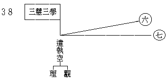


執謂我法二執，以不了空義故起此二執，由二執成二障，生死輪迴，根深蒂固不得拔濟，因胥在斯！欲脫生死證大涅槃，及斷煩惱成大菩提，須先遣空二執。以斯義故，一切聖教詮二空理起二空觀，修二空觀照二空理，以遣盡此二執。然在六七淨識未現行前，修空觀以照空理者，唯在三學三慧之有漏修所成慧——雖通無漏此取有漏位者；若六七識轉成清淨時，由六七二識相應現行之妙觀平等二無漏智修觀證理。然三乘聖人有差別者，二乘初果以去，唯起淨六識相應一分妙觀察智生空觀照生空理，遣我執相；大乘初地以去，觀二空理雙遣我法二執。二乘所得生空智僅為妙觀察智中之一分，平等性智全不現行，以第六未起法空觀智故，對第七識唯有消極的使其我執暫不現行而已，不能助之生起平等性智轉成淨七。大乘菩薩則由清淨六七二識相應之妙觀察智與平等性智俱起現行，同時二智觀二空理遣我法二執，斷煩惱所知二障，由初地至十地重重勝進，至於盡斷二障，大圓鏡智相應現行，即佛果之究竟圓成也。

次三慧三學及清淨六七二識均有線至波羅密行，如圖：

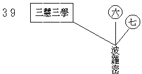


前來遣二我執、修二空觀，是通于二乘之三乘共法——大乘之兼含二乘法，即明於此。此之波羅密行，則為大乘菩薩不共法行。修此波羅密行可包有遣執空觀空理，以波羅密行乃總括一切菩薩之萬行者。遣執空之行，即其中之般若行耳。從初求學發大乘心乃至成佛，均是修習波羅密行。故若分別言之，初地以上為真實修波羅密行；初地以前為相似修，帶執相故；初住以前為名字修，雜煩惱故。若初發心求學大乘所修習名字、相似等波羅密行，即為有漏三慧三學所起，此中三慧三學在大乘即為地前之六度故。換言之、即以三學開成六度，戒開布施持戒忍辱精進四度，定、慧為禪定、般若度，如表：


```
　　　　　　　　　┌布施┐
　　　　　　┌一戒┤持戒│
　　　　　　│　　│忍辱│
　　　　　　│　　└精進│
　　　　三學┤　　　　　├六波羅密
　　　　　　│二定─禪定│
　　　　　　│　　　　　│
　　　　　　└三慧─般若┘
```


故六波羅密在地前，通于十信、三賢、四加行諸菩薩位也。若至地上，六七二識相應二智現行，同修波羅密行，在八地以前其修行有力而為主者，第六相應之妙觀察智也，以八地前為有功用道故，無分別智時加功用行方現前故。八地以上修波羅密，以第七識相應平等性智為主，第六識中無分別智常現前故，不須重加功用道故。

次清淨之六七二識及前五識，均有線至障淨實智實境，如圖：

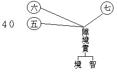


障即煩惱所知二障——此為惑障，惑所發業，業所感報，則成三障。二障遠離清淨，由此離淨所生之智為真實智，其所顯境為真實境，故曰障淨實智實境。此智此境，即瑜伽真實義品煩惱障淨智所行真實——境，與所知障淨智所行真實——境。聲聞乘斷我執煩惱障所生顯智境，亦為真實智境，故離障清淨之實智實境通于二乘。以二乘人修生空觀，斷第六識上分別我執及六七二識俱生我執一分，除煩惱障，生空智——實智——起，親證生空真如——實境。大乘菩薩修二空觀，斷六七二識上我法二執，除煩惱障及所知障，二空般若——實智——現行，親證二空真如——實境。

如是六七淨識，漸次修行，地地增進，別別斷執障，別別成實智，亦別別證真如，展轉乃至異熟識空，大圓鏡智與無垢識相應現前，五根轉故前五識轉成清淨之成所作智，故為轉八識成四智菩提，如表：


```
　　　　　　┌第六　意　識──妙觀察智　┐
　　　　　　│第七末那　識──平等性智　│
　　　　八識┤第八阿賴耶識──大圓鏡智　├四智菩提
　　　　　　└前　五　　識──成所作事智┘
```


由障淨所成之實智菩提，亦攝淨第八相應圓鏡智，以即是密嚴實佛故，不別立淨第八。又圖中所列空觀與實智匯入菩提，菩提即密嚴實佛也。

此中遣執空觀空理，與障淨實智實境之間有二線，如圖：

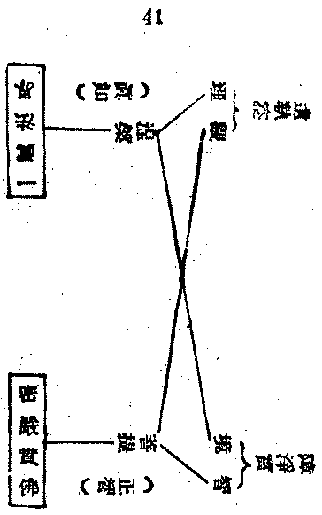


遣執空理與障淨實境合之為涅槃，在五法中亦即真如，以真如為所顯得，涅槃為所斷得故。然四涅槃與二空真如尚是帶事相所明理性，所以者何？依能顯能斷以明故。謂由遣執空觀觀二空理，二空智現如日當空，離一切障，通達真如，如是所成真實智所顯真實境，即是涅槃，亦曰圓成實性，亦曰勝義無性。

次由遣執空觀與障淨實智合之為菩提，以觀與智皆覺義故，由勝進道觀二空理，遣二執障，此能空觀是菩提分，若住自證道離障所得之無分別智及後得智，此如實智是菩提體，以菩提是能斷執障勝功用故，亦為斷執離障所成德故。菩提之因雖即遣執空觀，菩提之果即是障淨實智，在五法中則即正智，此表菩提即是正智，二名一實，非離菩提別有正智也。

又以上涅槃菩提即是二種大轉依果，所謂轉我法二執成涅槃，轉煩惱所知二障成菩提也。

次由波羅密至堅常，如圖：


```
　　　　　　　　　波
　　　　　　　　　羅
　　　　　　　　　密
　　　　　　　　　│
　　　　　　　42　│
　　　　　　　　　↓
　　　　　　　　 堅常
　　　　　　　　菴摩羅
```


堅常義者，與熏變義相對，謂修一切波羅密行至於究竟彼岸圓滿成就，大圓鏡智現前，轉無覆無記性之第八識成淨善性之菴摩羅識，此識唯持一切最上上品清淨種子，故其現行不復受熏，其所持種子亦更無生滅增減之變化，堅密常恆。此第八識淨種無始未曾現行，至成佛時，入金剛喻定無間道，次一剎那入解脫道，此無漏第八種方始現行，此現行時性純善故，始將有漏三性及劣無漏之一切種捨盡無餘，以此為所依之諸法及此所持之諸法種皆無漏性。頌云：『大圓無垢同時發』，及『此即無漏界，不思議善常』，即此義也。修波羅密行，依攝大乘等論有三品：地前曰遠波羅密，地上曰近波羅密，佛果或八地以上曰勝波羅密。由下至中，由中至上，修至究竟圓滿之佛果位成一切清淨功德種，依菴摩羅識所攝持，堅密不受熏習，恆常更無轉變，故與阿賴耶識相對。梵云菴摩羅，此云無垢，已無一切煩惱有漏之垢染故。由此義故，佛果金剛不空，三賢、十聖皆住異熟，唯佛一人居真淨土，盡未來際，所持一切佛果無漏德種堅密莫熏，所依一切佛果清淨現行常恆不變，無盡無盡利樂有情。

由本淨種至菴摩羅，如圖：


```
　　　　　　　43　本淨種──→菴摩羅
```


無漏清淨種子，異生位時寄在阿賴耶識，金剛道後異熟空時，轉成大圓鏡智相應心品，乃名菴摩羅識，能持一切清淨種子。登初地後，彼淨種子展轉生起即能摧滅阿賴耶中染法種子。聲聞乘中若至阿羅漢，即捨與我愛執相應之阿賴耶；大乘菩薩至八地時亦捨此名；至佛果并捨異熟相應識，唯能持種之阿陀那識，通一切位故。佛果唯持一切清淨法種，常無間斷亦不壞滅，而在菩薩地則念念增長以至圓滿。

復次、阿羅漢及五不還天阿那含等，所有報身仍三界攝，大乘金剛道前一切三乘賢聖所有報身，皆是三界異熟報攝，有異熟故未出三界，唯佛一人超出三界。復次、出三界義大小乘別：二乘聖者依妙觀察智以云出三界，灰身滅智入無餘依涅槃，不受分段生死，可云非三界攝，若迴心留身以度生，仍是三界所攝。菩薩由平等性智現前以云出三界，若從根本第八異熟識以觀之，則仍屬異熟報身而未出三界。

依此義故，二乘聖人祇成解脫身而不成法身，以生空智能捨第八我愛執藏而不能使澈底清淨，於第七識亦復如是，祇能使第七識消極不執第八為我而已，不能積極令其轉成平等性智，故二乘菩提祇具妙觀察智之一分，無平等性智及圓鏡、成事智也。

由此四智顯大小乘菩提差別者，如表：

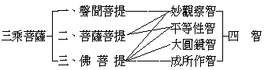


次染汙第七識轉成清淨第七識者，如圖：

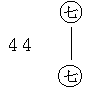


此表第七染污末那識轉為平等性智相應之淨第七，入初地時真見道位破法我執，無漏第七識種子起現行，換言之、即平等性智相應識現前也。

次染污前五識轉成清淨者，如圖：

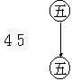


此表染污前五識轉為成所作智相應之清淨前五識，然前五識須至佛位乃成無漏清淨。證初地後，雖因清淨六七二識為增上緣，使五根識為勝妙五根識，尚不能令成無漏清淨，以第八識未轉，此所依根仍是有漏異熟性故。至第八識轉捨異熟成大圓鏡智相應之菴摩羅識，總捨一切異熟雜染色心種子，從清淨無漏色種現起無漏五色根，所發五識乃成為淨五識，即起變化佛身土之成所作智相應心品也。

次菴摩羅兩邊有果者，如圖：

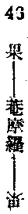


菴摩羅為兩果者，一對因位說，一對無漏現行說。以第八識異生因中為阿賴耶，如來果上為菴摩羅，菴摩羅攝持佛果上一切功德種，攝現行歸種子，一切佛果功德海唯此而已矣。今再分說如次：

次菴摩羅至淨五識者，如圖：

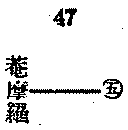


表淨五識依菴摩羅識轉得清淨。

由菴摩羅向西北有果因及一真法界，如圖：

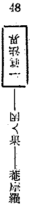


由菴摩羅至一真法界間之果因者，因表一真法界通眾生位，果表一真法界通佛位也。其實、一真法界非因非果，眾生及佛無二無別，然亦須至佛果方能究竟顯得。言顯得者，即轉依中之所顯得。佛位所顯得之一真法界，在眾生因位中本來如此亦不減少，至佛果位亦復如此並不增多。故經論云：『真如法性——即一真法界——若佛出世，若不出世，不增不減』，即此義也。復次、一真法界為迷悟依，謂能證得此一真法界者為覺悟，未證此一真法界者為迷惑。換言之、所以成為大覺之佛者，即是證得此一真法界之故也；未成佛者，以未證得此一真法界之故也。然此亦名法性、法界、真如、實際、不動性、無為性、不虛妄性、不顛倒性等，如大般若經中廣說。般若為一切佛法之父母，法性為一切佛法祖父母，以能證此法性方是般若，為智慧生起所依，亦為一切三乘聖法之所依也。復次、佛果與三乘所依因有異，三乘得聖果所依因，為帶二空相之真如，佛得果所獨依之因，則為一真法界。此中「所依因」，是指所緣緣、增上緣說，非因緣之因也。

復次、一真法界亦曰法性、真如、涅槃、法身佛等，名雖不同而所指之法體無別，然依其立名之不同，其含義之分齊亦差異焉。

言真如與一真法界含義不同者：甲、真如之義猶帶諸法，所謂善法真如，惡法真如，無記法真如等。二空真如為二空智所顯，十真如為十地所證，故此真如一名所指雖同一真法界，而此真如之義，帶緣觀故而顯差別，謂帶二空等能觀能緣智所顯之一真法界也。乙、言一真法界者，則一切心思言語等皆悉離絕，以離絕心言故，不帶能所相故，無二相故，唯一味故，乃名一真法界。由此可知二名區別：真如者，帶能觀、能詮道所顯之一真法界也；一真法界者，廢絕能觀、能詮道所顯之真如也。問：帶能觀詮有何過失？答：若帶能觀詮者，則真如有種種差別，如二乘帶能觀生空智則為生空真如，菩薩帶能觀法空智則為法空真如等。又帶十地現觀則為遍行等十真如。離此種種差別，唯顯一味平等無二無分別真如性，是為一真法界。

復次、涅槃與一真法界含義不同者：甲、涅槃約離障說，謂離障所顯之一真法界。由智離障，智有淺深，故離障亦有淺深之差別；未離障位曰本性住涅槃，離煩惱障曰有餘依涅槃及無餘依涅槃，離所知障得大菩提曰無住處涅槃。以帶離障功用之淺深不同名涅槃故，涅槃有如是四種差別。乙、一真法界直指諸法真性，離障不離障皆無二無別，是為一真法界。

復次、法性與一真法界含義不同者：甲、法性依一切法以言性，示別佛性，且窮遍一切法以顯無不是性，是為法性。以顯法性極遍普義，每舉最劣之法以顯其性，故莊子云：『道在螻蟻』，又云：『道在屎溺』。此言道者，似言法性之性。由此義故，圖中法性二字應為黃色，用淡黃者，顯與一真法界有差別也。乙、法性之與一真法界，平等平等，無二無別；然一真法界就一切法以言名法性，而法性離一切法相，即是一真法界。

次一真法界向北方有法身佛，如圖：

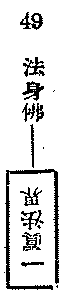


法身佛即法性身佛，亦曰一真法界身佛，謂法身佛離言詮等究竟顯現，即是一真法界。然約立名不同，義即有異，以帶妙覺位能顯道之究竟所顯者，名法身佛；若不帶此能顯道者，則名一真法界。因法性佛約義亦有身土之別，謂法性身及法性土。其義云何？以究竟位之「能顯法性智」為法性身，即以其所顯之法性為土。約相性言，「相」是能顯，名法性身，「性」為所顯，名法性土。依法性究竟顯現而明法性佛身土，故金剛般若云：『若見諸相非相，即見如來』；若直言一真法界，則無身土可論也。

次由菴摩羅向西南，有密嚴實佛；如圖：

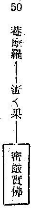


菴摩羅為佛位一切無漏種之總持，故依種子以言，一切佛果之無漏法可皆攝於菴摩羅中，望因位之阿賴耶此為第一重之果義。四智相應心品之清淨無漏現行總聚曰密嚴實佛，故菴摩羅識現行亦攝在其中。言密嚴實佛者，密嚴是經名，亦名厚嚴經，是祕密莊嚴義。日本真言宗有十住心論，判密宗為最高上之第十住心曰祕密莊嚴心。實者，轉八識相應心心所成四智菩提法，此無漏清淨現行聚無顛倒故，不虛妄故，名之為實。密嚴實佛即自受用身佛，圓圓果海，離名絕相，不可以言說，不可以思量。在於等覺位中尚有言說思量測度分別，猶上有佛果可成故；逮得佛果，圓滿圓滿，無邊功德無不現證，唯佛與佛獨能了知，縱使無量菩薩以自證智測度分別亦不可及，所謂初地不知二地事，乃至等覺亦不知佛果事也。如是諸佛自受用身，諸佛無須言說分別，諸佛以下無可言說分別，故實佛位畢竟祕密。瑜伽論明佛果五不思議，亦明此義。為利他所現之他受用身及變化身，皆是隨他現故，不屬實佛，如水中月鏡中花耳。自受用身是實佛，獨具無邊不共真實功德莊嚴，乃如空中真月，鏡外實花。

有云：「平等性智現他受用身，成所作事智現變化身，妙觀察智於彼二身觀機說法，唯大圓鏡智是自受用身」。如理言之，四智菩提皆自受用，所示現者依緣別故，隨智起用亦復不同，故此四智菩提為佛轉依中所生得真實果法，無量劫來修所成就，即此密嚴實佛。果位之果，故曰果果，亦曰一切智智。由此而知密嚴實佛，乃總括一切無漏心心所及色聲香味觸法等之一切清淨法，直接攝盡無漏有為，間接亦攝盡一切無漏無為法，以一切法智所顯故，智所成故，故由密嚴實佛觀一切法，可以成唯智論。一真法界是智性故，亦是智攝，故真言宗立法界體性智。從菩提言，菩提體性即是一真法界——法身；菩提自相則為四智心品——自受用身；菩提之用，即他受用及變化身；是故菩提與密嚴實佛僅名異而已。

復次、應知自受用身與菩提別，蓋自受用佛者，專指佛果自所成之真實功德，祕密莊嚴，唯佛受用曰自受用。言菩提者，以帶相故，從因位所斷障以顯能斷相故，帶三乘差別相；從果位所應機以顯能化相故，帶三身差別相，故菩提者帶相之密嚴實佛也。密嚴實佛者，不帶相之菩提也。

又密嚴實佛亦即是正智。然正智在五法中與真如相對，通於三乘，謂我空正智、法空正智等。正智究竟雖即密嚴實佛，但正智帶因中分位相故，帶果上隨順眾生所現無顛倒之假說智差別相故——謂比量智、方便智等，約義有異；離此分位相及差別相者，則為密嚴實佛。復次、密嚴實佛身土別者，智攝於理，則成法性身土；依智攝理，乃成自受用佛身土。一切色心功德品法無不具足成就，此自受用佛一一功德相等同法界，故自受用佛土亦即法性土也。

由土至他受用佛及變化佛者，如圖：


```
　　　　　　　　　　　　　┌───────────→
　　　　　　　　　　　　　│　　　　　　　　　　　　　土
　　　　　　　　　┌───┤┌────┐　┌───→
　　　　　　　51　│變化佛││他受用佛├─┘
　　　　　　　　　└───┘└────┘
```


一、他受用佛者，亦曰他受用佛身土，身土皆為平等性智相應清淨第七心品所現；至觀機說法者，則妙觀察智之用也。在聞法者，能見他受用佛身土，亦須清淨第七六識相應平等性智、妙觀察智現前方可，故見他受用佛須在初地以上。他受用佛身土，以無漏第六七識之清淨色等諸法為體，為地上佛菩薩自他共所受用，天台教所云「實報莊嚴土」是也。

二、變化佛者，亦曰變化佛身土。變化身有三類：一、勝應身，二、劣應身，三、隨類變化身。此三類變化身為凡聖同居土中全隨眾生示現者，所謂為內凡外凡之菩薩及二乘六凡等所示現之身土也。所現他受用佛身土，猶同受用佛之一分真實功德；此之變化身土，則純隨他化現，故土通於異熟之器世間，天台教所謂「凡聖同居土」是也。劣應身即在人間所現之身土，三千大千世界——當梵網經千華中之一華——有百萬億劣應身佛，釋尊之示生印度者，即此身也。勝應身在大千界中唯有一佛，居色究竟大自在天，為初住以上菩薩及迴小向大之二乘聖者所現，義同天台教之「方便有餘淨土」。台宗謂方便土唯佛為二乘聖所現，其實亦通大小乘也。復次、通於變化佛有三線，如圖：

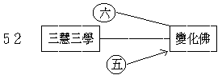


變化身由成所作智相應之前五識而現，復依妙觀察智相應之第六識有觀機說法之功用，故現起變化身，為清淨前五識及第六識。身既如是，其土亦然。能見此變化佛身土者，為地前菩薩及二乘六凡等，其證聖果者，亦由清淨第六識見之，未證果者，由有漏識而見，但須具三慧三學之善根方能見到。再進言之、初住以上菩薩依三慧三學亦能現變化身佛，如天台圓教極主張此說，並以此說為台宗所獨有，其實、此為大乘之共義也。起信等論固有此義，且唯識宗亦許之也。

問：地前菩薩既無清淨第六及前五識，如何能現？答：依三慧三學勝解力所起福智善根，由大悲願力增上故，應眾生機而得顯現。

復次、總論佛身，向言三種：曰法、報、化，如上略明。或言二種：謂真與應。法身義有廣狹：狹義言之，屬無為法，謂法性身即是遍一切法之真實性，佛與眾生平等無二皆悉具足，以無明煩惱故，眾生障而不顯，菩薩顯而不全，獨佛一人究竟覺了，於念念中證真如性以為身故，名曰法身。廣義言之，凡佛果所生成之法，所證顯之法，所思惟之法，所說之法，皆是佛法，總名法身，遍攝諸法無欠無餘。此在大乘名

為法身，簡非二乘解脫身也。茲將法身廣狹二義，列表示之：


```
　　　　　　　　┌所 說 法──教法────三藏
　　　　　　　　│　　　　　　　　　　　　┌自受用身
　　　　（廣義）│所思惟法　　　　　┌報身┤
　　　　法　　身┤　　　　　┌功德法┤　　└他受用身
　　　　　　　　│所生得法─┘　　　└化身─三類
　　　　　　　　│
　　　　　　　　└所顯得法──真如────法性身（狹義）
```


報身亦有二種：一、自受用，二、他受用。變化身有三類已如上說。以上三身，真言加等流身說為四身；華嚴開為十身，其實即三身也。

然言真身與應身者，亦攝此三身，茲列表如次：


```
　　　　　　　　　　　┌法 性 身─────法　身┐
　　　　　　　┌真　身┤　　　　　　　　　　　　│
　　　　二　身┤　　　└自受用身───┬─報　身├三　身
　　　　　　　│　　　┌他受用身───┘　　　　│
　　　　　　　└應　身┤　　　　┌勝應身┐　　　│
　　　　　　　　　　　└變 化 身┤劣應身├化　身┘
　　　　　　　　　　　　　　　　└隨類身┘
```


佛身功德，等覺菩薩極言說邊際雖不能窮盡，然觀今所說，亦可略明大意焉。

#### 　　　　二　綜合說明

下教法中綜合說明，共有四門：一、雜染清淨相對門；二、精神物體相對門；三、潛因顯果相對門；四、理性事相相對門（如大乘宗地圖㈢）。

##### 　　　　　　一　雜染與清淨相對

依第六識為中心以觀之，其東半面為雜染法，所有教法以紅色代表之；其西半面為清淨法，所有教法以黃色代表之。甲、以阿賴耶為雜染門之總持；雜染與染不同，染唯煩惱，雜染則淨善法中雜有染法，亦是雜染，故東半面教法有以淡黃色表者，亦歸雜染門攝，如三慧三學等之中立法，在東半面即雜染攝也。乙、以菴摩羅為清淨門之總持；在西半面皆清淨法，圖中教法除淡黃色中立法外，深黃色皆表清淨法也。然淡黃色所表之中立法雖遍於染，以在此已全離染清淨法中故，亦成清淨法也。次清淨與淨亦不同。言淨法者，謂染位中所藏淨法，即可名淨；言清淨者，則不復雜有一絲之染法而已完全清淨者也。

復次、轉雜染成清淨之中樞為第六識及三慧三學，故此二者位于正中。此雜染故，一切乃永雜染，此清淨故，一切皆漸清淨；從凡入聖，發端建基，捨此莫由。

##### 　　　　　　二　精神物體相對門

北南相峙，其分界之中心仍在第六識。甲、自第六識向上觀之，以正北方之心為本位，而代表北半圖所明者，皆是形而上之精神法；如三慧三學、慧命、遣執空理空觀、一真法界、戒體、一切種識等，皆屬於抽象之精神法也。乙、自第六識向下觀之，以正南方之土為本位，而代表南半圖所明者，皆是形而下之物體法；言物體者，謂已成具體之事物，如異生之依報正報，佛陀之佛身佛土等。云何佛身亦形而下？變化佛身土等皆是識智所現多法合成之一聚故。具假形者名曰物體，不論聖與凡也。

##### 　　　　　　三　潛因顯果相對門

以一切種識與密嚴實佛為兩極端，而以阿賴耶南面之因及菴摩羅北面之果為分界。以第六識為中心而觀之，一面有四因字，一面有四果字，四因字之半面屬潛因門，四果字之半面屬顯果門。甲、以一切種識為潛因之極端者，在一切種識之半面觀之，皆是潛因，未顯現故；如一切種為一切現行之潛因，戒體為表業之潛因，阿賴耶亦為最深細不可知之潛因；本淨種至一真法界，離言說故，皆潛隱故。故以一切種識為主位以觀之，皆是潛因。乙、以密嚴實佛為顯果之極端者，在密嚴實佛之半面觀之，皆為顯果；如異熟報主為三界五趣之果報法，所顯現者為身器等；佛果位中則顯現自他等一切身土，菴摩羅識雖為持一切種，與大圓鏡智相應後即轉成顯現之果法，異阿賴耶之潛隱矣。一切顯現果法之主位為密嚴實佛，故顯果以密嚴實佛為極。

##### 　　　　　　四　事相理性相對門

以一真法界與異熟報主為兩方之代表，由第六意識之中心，以「因因」與「果果」為分界線；屬於一真法界之半面者皆是理性，屬於異熟報主之半面者皆為事相。甲、以一真法界為理性門者，一真法界為一切法之真理實性故；此理性是所詮表所證明之法，非是能詮表能證明之法，法身佛者為所顯得。次至本淨種及一切種識所攝之一切種，非現行法，本不可知，但由現行法上所推之理得知一切種之存在，故一真法界之半面皆為所明理性，依事相法所推知也。菴摩羅識持一切無漏種，依菴摩羅之持種義，則菴摩羅之所持種亦待諸無漏現行法所表現故，亦屬於理性門。理性本無差別，一切種等由事相而證知差別，故諸種子雖云差別而實無別，無礙性故，交相遍故。乙、以異熟報主為事相門者，觀此半面皆為差別之事相；如異生位業報不同，有三界、五趣、二十五有等種種事相差別；一一有情復由異熟所現相分、見分，各有心心所等差別，以第七識故有我、非我等差別，前六識有所依根等差別。至於淨法，亦有聲聞、緣覺、菩薩、三賢、十聖之差別，佛有自、他受用、三類變化身土之差別，乃至密嚴實佛是佛特殊不共九法界之勝果法，而阿賴耶亦有能藏、所藏、我愛執藏等之差別相。

如是四門相對以觀此圖，在大體上可一目了然，得一分判之概念。然在每一相對門中，皆可觀澈圖之全部，斯在智者之善巧研尋耳。

### 　　第二節　宗義

#### 　　　　一　總說

第二、釋宗義者有二：一、歷別說明，二、綜合說明。歷別說明總有八段以釋中華大乘八宗（如大乘宗地圖㈣）。言八宗者：一、性宗，二、相宗，三、律宗，四、禪宗，五、天台宗，六、賢首宗，七、真言宗，八、淨土宗：如是八宗可總括華文所傳之佛法，茲配攝之如第四總圖。

一、性宗，以東南方面之異熟報主為本位，由此異熟報主直向一真法界觀之，為法性空慧宗。二、相宗，以正東方之阿賴耶為本位，由此阿賴耶直向菴摩羅觀之，為法相唯識宗。三、律宗，以東北方之一切種識為本位，由此一切種識直向密嚴實佛觀之，則為律宗。四、禪宗，以正北方之心為本位，由此直向正南之土觀之，則為禪宗。五、天台宗，以西北之一真法界迴合東南方之異熟報主以為本位，從一真法界異熟報主再觀到一真法界，為天台宗。六、賢首宗，以正西之菴摩羅迴合正東之阿賴耶以為本位，從菴摩羅阿賴耶再觀到菴摩羅，為賢首宗。七、真言宗，以西南方之密嚴實佛迴合東北方之一切種識以為本位，從密嚴實佛一切種識再觀至密嚴實佛，為真言宗。八、淨土宗，以正南之土迴合正北之心以為本位，由土與心再觀至土，為淨土宗。以上總標，依次別明於下。

#### 　　　　二　歷別說明

##### 　　　　　　甲　性宗

第一、由異熟報主直向一真法界以說明法性宗，此宗亦曰般若宗、三論宗、或四論宗，以宗般若經及中、百、十二門論——三論，及大智度——四論故。常途以台、賢為性宗，非也。今以龍樹學系之所顯為法性，以能顯法性二空慧故，立名曰法性空慧宗。

云何由異熟報主直向一真法界觀之，即可說明法性宗耶？其中心點仍在第六識，第六識與前五識上三慧三學中之聞慧，聞般若等經論，由聞慧成文字般若，復依文字般若成六識相應之二空勝解，由勝解起觀照般若，照達諸法空相。

講記先依三論宗的教義來講，應從異熟報主到一真法界的方向斜著看去，此亦第六識為中心，以第六識聞大乘空性相應的經論，如心經、般若、中觀、大智度等，第六識由之得「聞所成慧」。依此慧來觀察異熟報上五蘊、十二入、十八界、四諦、十二因緣等，一層一層都觀為自性無所有，初從「文字般若」起「觀照般若」，這就重變現起「思所成慧」了。這樣地念念無間的來觀習來體達，終之能遣除一切執障而達到「實相般若」，這就是「修所成慧」。——其實、三慧本不能這樣來分，不過在殊勝上來講，這樣也不妨。——此宗重要點，在遣除所知障而顯法空理，由第六識聞思修三慧三學勢力，能遣法執而顯空理，在第六未覺第七為染，不免受第七影響，待第六一經覺察，因修觀故，不唯第六識本身的染障伏而不現，即第七識染障受第六殊勝的力量，也使之伏終至於俱遣，故第六識一面修觀為能對治，一面遣執而證空理，是為三論宗空義。[2]

此二般若之能現行，皆藉六識上之三慧——思慧、修慧依於戒定——，由觀照般若起遣執空觀，以聞般若教法明我空法空故，遣我法執而顯真如法性，所起之觀為遣執空觀，所觀之理為遣執空理。然所遣之執為何耶？復云何遣除耶？先遣第六識上分別所起實我實法之執，以此為眾患之門故，二執若除，二空自顯。如是所遣除之我法二執，或由自內之邪思維所起，或因邪師邪教之所引起，綜之、此六識上分別所起之我法二執皆是增益執，此所執相本不可得，強執之為有實，病在六識，故應就六識以遣之。六識色表半紅半黃，半紅表二執相應染識，半黃表二執已除淨識。向染識邊觀二空理遣其二執，由外凡而內凡，同依此修，由外門散慧觀照而內門定慧觀照——二空觀。修所成慧到純熟時，二執可伏不起，以在定心前五識已不現行故，六識中分別所起我法執皆制伏故，前六識上分別所起煩惱所知二障亦暫不現行。

講記所遣的「煩惱障」或「所知障」，在此宗又名「五住煩惱」，此種種煩惱總名之為惑，即為所遣而無不皆空。惑空故則業空，業空故則所招的異熟苦果亦空，惑業苦三空到極點，便體達理智一如的一真法界。此一真法界離名字相，離心緣相，這是大乘空宗的第一義。且以心經『照見五蘊皆空』一語來說，異熟果的根身器界為色法，與八識相應心所法為受、想、行攝，以及不相應法等亦行蘊攝，八識心王為識蘊攝，此皆由第六識依這些名相的文字般若而起觀照般若體達實相般若，則觀到一切法皆空而證真理。四諦、十二因緣、六度、乃至菩提、涅槃等染淨諸法無不皆空，凡一切名言所詮分別所緣無不皆空，唯顯現究竟不可說離言法界真性。

復次、此宗之用在於即破為顯，亦名破顯妙宗；謂依般若二空妙觀，將執障重重深入以破顯，即是重重顯現真如之妙理故，如是漸破漸深，可至於俱生煩惱所知亦為之破滅，以我法執為煩惱所知二障之根依故。二執既破，二障漸除，以如樹無根枝葉必死，無所依止故。分別我法二執雖唯六識，若俱生我法執障即通於七識，謂無始來我法習氣恆現行故，俱生有故。般若勝觀若能損減一切種識之我執種，即漸能伏除俱生二執之現行；至本具之無漏種起現行而成慧命，則分別我法二執可全斷，俱生二執亦斷一分，破第七染顯清淨平等性真如，入菩薩地。

由上觀之，法性宗極簡單，謂以快刀斬亂麻之手段，單刀直入，觀二空理，遣二我執，伏斷二障顯真如性，直截了當，無過於此！然雖已證真如理性，而無始來所起二執二障未能盡斷，故至此位更須重重上進，修二空觀，破二我執，斷惑業苦，深顯真如理性也。法性宗即破以成顯，破而不立，由遣執空理空觀向六識七識以至異熟報主次第破遣，破至究竟，彼苦報障之異熟識乃空。苦報障起，由於有漏業障，有漏業障，由於二執二障；是故二執破之究竟，則二障空，故有漏業苦異熟空，以此空故一真法界究竟顯現。如是破所顯者即為法性，以其目的在直顯一真法界故，亦為所宗，故以立名。然達其目的之勝用，則注重於破壞一門，由破二執而二障、而有漏業、而異熟報主，雜染事相重重破除，即是真如理性重重顯現。乃至有一法過於涅槃者亦不可得，所謂畢竟無有少法可得，以其即破而顯故不立一法，般若金剛等經皆顯此義。

此宗所明具於破顯二門，其特勝點在破執，雖但從異熟向一真法界說明，實與全圖皆有關係。如在破之一方，起思慧則與戒體等有關，破分別俱生二執二障及有漏業苦，則與一切種及八識見相分等有關。又在顯之一方，顯至究竟即法身佛，持能顯之功能為菴摩羅，其能顯功能之現行即是密嚴實佛，其應化所現即為他受用佛身土，變化佛身土，故以此一宗之宗義亦可以觀全圖，亦可以統攝全部佛法也。

講記這雖與法相名詞有差，然可用五蘊融會貫通，但因所從觀點不同另成一宗教義，這是三論宗教義之概要。

##### 　　　　　　乙　相宗

次由阿賴耶直向菴摩羅以說明法相宗，法相宗亦名唯識宗，今合名法相唯識宗。此宗教義重在明諸法相，其能明法相之功用在於唯識，換言之、即依唯識方能明諸法相也，故明法相必宗唯識。

此宗亦由六識聞法相唯識之教法，依所聞之教法而明法相唯識之理，即以此理為所觀境，因觀此境起唯識行，證唯識果。依唯識理以觀唯識境者，先觀唯識相。唯識相者，統攝有為之一切法，即三能變。三能變中第一能變為阿賴耶，故其所觀之境首為阿賴耶識，最後觀至菴摩羅識。由此義故，此宗之經論多先為阿賴耶之建立，經則有楞伽、深密等，論則有瑜伽師地、攝大乘、成唯識等為其最要之典籍，皆先建立阿賴耶識，如成唯識論首明初能變，攝大乘論首明所知依中阿賴耶識。

復次、觀阿賴耶三相：一、就阿賴耶觀之為自相；次觀一切種識能持一切染淨諸法種子，是為因相；次觀阿賴耶識隨業受報為一切果報之主體，故名異熟報主，為此識之果相。論云：『初阿賴耶識，異熟，一切種』；即是觀初能變之三相也。如圖：


```
　　　　┌─┐　　　　　　　　　　　　　　　　　　　　┌─┐
　　　　│一├─────────阿賴耶────────┤異│
　　　　│切│因　　　　　　　　自　相　　　　　　　果│熟│
　　　　│種│　　　　　　　　　　　　　　　　　　　　│報│
　　　　│識│相　　　　　　　　　　　　　　　　　　相│主│
　　　　└─┘　　　　　　　　　　　　　　　　　　　　└─┘
```


講記前在教法講，已明「第六識」功用最大。現在正說唯識宗之宗義，其觀察點多先說阿賴耶，例如成唯識論先明阿賴耶，攝論先明所知依，皆足證明此義。阿賴耶為第八識之自相，亦為其總相，唯識論云：『攝持因果為自相故，自體是總，因果是別』。又云：『離二無總，攝二為體；二是總之義，總是義之體；體與義為依，名之為持，攝二義為體，名之為攝』。此即明阿賴耶為第八識之自相和總相也。阿賴耶義為藏，即能藏、所藏、執藏是，在圖上也能見到，對一切種識即為「能藏」，對異熟報主即為「所藏」。七即末那識，其關係線通乎異熟線中「見分」，即表第七識之見分緣現行果識——第八異熟識——之「見分」為我，是「執藏」義也。此阿賴耶因所向之方面不同，故有三藏，如一人對自父為兒，對自兒為父，對自妻為夫，而體則一也。

從阿賴耶次向西觀第二能變，第二能變即第七識，梵云末那，譯意，意在異生位中恆與我見、我慢、我愛、我癡相應，執第八之見分為我，有情自他之隔別即從此而起，又為前六識作染依故。觀第二能變已，次向西觀第三能變。第三能變即前六識，別別了諸法故，亦曰了別境識。如圖所表：

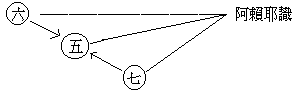


復次、觀第一能變時，與第一能變有關之諸法亦即連帶觀察，如阿賴耶之熏變義，一切種識之業種等，異熟報主之業命與見相等，以及相應心所、不相應分位等諸法。觀第二能變、第三能變時，與此二能變相關之心法、心所有法、色法、不相應行法等，亦遍觀之。如是三能變法周遍觀察，明白了然，即能明了唯識法相，亦能通達法相唯識。

觀唯識相已，次觀唯識性。性由相顯，故由唯識相之所顯即唯識性，相之性故；亦是二空真如。此宗重於說明一切法相，一切法相明了之後，諸法實性自然顯現，故三能變廣辨其相。於諸法相明了之後，即略明一切法之真如性——唯識性，以真性是離言非安立諦，不可施設，故如畫龍點睛一指便成，不必多費葛藤也。

又法相宗所明境行果三，明境重在三性：一、依他起性，眾緣生故，唯識現故。對於眾緣所生唯識現法，若依遍計所執起增益執與損減執，即成一切雜染之法，能障圓成實性。若除所執，則成一切清淨之法，能顯圓成實性。

修如是唯識妙觀，其初成就三慧三學，修習空觀通達空理，遣除分別、俱生我法二執，精進波羅密行，離淨煩惱所知二障，空觀與障淨所成之實智為大菩提，空理與障淨所顯之實境為大涅槃，是為二大轉依。故三能變漸次轉依，首為六識清淨，次為七識清淨，次為第八及前五識清淨。第八清淨成菴摩羅，其所顯為一真法界，為法身佛，其所成為密嚴實佛，為地上菩薩現他受用佛身土，為六凡二乘及地前菩薩現變化身土。故此宗之宗義，從阿賴耶上建立染依他起，遣二執，淨二障，至究竟位轉為菴摩羅識以建立清淨依他起，是為此宗之主點。

講記在異生位中之第八識名阿賴耶，正對佛果位中之第八識名菴摩羅。同為第八識而有二名之不同者，一為進化之第八識，一為未進化之第八識也；雖同是第八識，因其進化與未進化之程度不同，所以一名阿賴耶、一名菴摩羅也。第八在因位中，在進化未到極點之時也只可名為異熟者，賴耶較異熟之名為狹，異熟較賴耶之名為寬，在六道受生受死之異生，若漸依教行，漸漸轉異生身而入於聖生，乃能捨阿賴耶之第八而得菴摩羅之第八也。

問：性宗明諸法空遣一切執，此宗亦明空理空觀遣我法執，有何差別？答：性宗從般若——空慧——直顯諸法畢竟空，遣我法執；相宗從唯識明一切法相依他起故空無自性，遣我法執，是故不同。

##### 　　　　　　丙　律宗

次從一切種識直向密嚴實佛觀之以明律宗，此宗嘗稱為南山宗，律儀雖為各宗所共奉行，以所明之特點不同，故別建立。

講記依律宗以說明此圖，中國律藏各部大扺皆小乘律，唐以前五分、四分、摩訶僧祇律皆盛一時，四分律又有幾派，唯南山道宣律師一派為唐以後律下中心。其所以有普遍永久性的原因，以南山律師以大乘教理明戒體，融和大小乘律，恰合於中國人根性。中國教理行果皆為大乘，倘非以大小乘融會，唯純小乘則必難以通行，所以弘律諸古師皆湮沒不彰唯南山遺風未墜，此其故。

律宗在圖中之要點，即一切種識與六識間之戒體，以六識為中心。謂信佛、信佛所說法、信佛法中修行僧故，在六識上具足此淨信後，善根增上，身心要依持佛法為軌範，然能具體為軌範者，即是戒法，所謂律儀是也。世間政教雖亦有法律規條等軌範人類行為，然此中但說佛法之戒律，乃佛法住世之命脈。此戒法體即佛法身，是佛智所證之清淨法界所流出故，與一切清淨法平等無二，為一切清淨法依止基本，故此戒法即廣義之法身。復次、由佛大悲願力為親近緣，眾生福德增上感佛現種種身說種種法，所現所說攝在戒法，故戒法即為佛清淨法身之等流身。

如是戒律，非僅指所說之戒相條文而已，所現威儀動止皆是佛法，故戒法不但是言教，亦是身教。由異生位而至大覺，歷種種身，經三祇劫，莫不由此戒法為軌範也。梵云毗奈耶，亦曰鼻奈耶、毗尼；此云律，或云戒，或云戒律，義譯調伏——調練三業，制伏諸惡。動身發語二種表業固以此為軌持，即能發身語之意業亦依此為範也。故道宣律師判一切佛法為化——詮理化物——制之二教。制行之教，定能詮理；詮理之教，未必制行。以戒法為制行之教，超詮理化物之教上，起清淨行，致清淨果，是為戒法建立之大義也。

講記此義在圖中即從一切種識中無漏業種為戒體，此為南山宗的出發點。從一切種識斜角相對是密嚴實佛，即為從因至果的直行線。關於「行」上，南山把佛教法配為兩分：一為詮理教——本名化教，即諸經論等；二為制行教——本名制教，即諸部律儀等。佛臨滅敕諸弟子「依法及律為師」；詮理教雖以言文闡其理，尤須以行實證，故教理須藉行乃能實證。律是軌範動作，止作持犯開遮有一定的制行，故闡理教雖廣而歸宿在行，依律起行而成定慧，定慧皆律的定慧，以律為一切教法總綱。

一、戒體之獲得：有情之第六識由信解佛法故進而受戒，凡受戒者，先受三皈為體，次受戒法。一切戒律一切佛法皆以三皈淨信為基礎故，故須先受。受戒重在能持，依教奉行不容違犯，違犯之極即失戒體。戒體之獲得者，吾人於受戒時，依傳戒師等羯磨之儀軌及清淨莊嚴之壇場，受戒者以意識為主，運耳識等聽聞戒法，觀感種種儀式，故受戒時前五識亦同起作用。如圖中由六識直至戒體，即表受戒時第六識上有極深刻之領受感動與印象，前五識亦同起作用。然此前六識心心所活動之力即「思」心所，由此思心所為主動，前六識心心所同趣於受戒之種種行動，於此感受之後——即受戒之後，即成一種潛力，遇有違犯即能制止。語云：『談虎色變』，皈受佛戒時心理上如得深切感動，亦復如是。得於戒體其義云何？謂受戒時，思等心心所法剎那剎那熏習於第八識成為種子，攝於一切種識中，此識所熏所成種子，即為戒體。此戒體種子之勢用，謂於不知不覺之中有防惡發善之功能，此謂之無表法。俱舍論及一切有部謂是色法，上座部——錫蘭——謂通色心法，成實論謂之非色非心法，道宣律師依大乘唯識教剋體而論立為種子。就用以說，此戒體與業命相似，以業種引起之一定限度而立業命，戒體為前六識受戒時感動所熏成種子——戒體，此種子之勢力功用亦有一定限度，所謂「防發功能」。防者防止惡法不作，如不殺、不盜、不邪淫、不妄語等；發者發起，謂作一切善法，依此為出發點，修十善及布施等行。

二、戒體之破失：防發功能即是戒體，若能不破根本戒者，則此功能勢用念念增長。依三乘共教言，若破根本戒者即失戒體；大乘雖不失壞，惟其勢用亦不行矣。此在自意識上亦不易覺，故云無表。雖不覺知而能防發，防發功用同心理學上之本能，俗云「習慣」、「天性」等相似。

三、戒法之作用：由受戒時成就戒體之「防發功能」後，前六識發起以表現其功能作用，所謂身能止殺、盜、淫，語離惡口、兩舌、妄言、綺語，意除貪、瞋、邪見。如是三業遍前六識而以第六為主，具於三業上表現其防發功能，防止一切惡即是止持，發作所應行即是作持。若應作而不作亦是犯戒，如是在舉止行動間守護根門，莫令放逸，持戒清淨身心歡喜，若有違犯心則憂慼，即時發露懺悔除滅，其所違犯還得清淨。

四、離淨三障：此宗既重制行，以深切之信心受持律儀，故由六識有線至於障淨，謂持戒清淨者能消諸障。障有三種：煩惱障，所知障，謂之惑障；由惑造業謂之業障；由業感果謂之報障。持戒之功能轉當前業障，惑由業滋，報是業感，若業一轉則惑無由發。以持戒淨業力感非苦報，不障善業，且於先業所感之報亦能轉增福德。故持戒清淨能至於障淨，障得解脫即成密嚴實佛，以持戒清淨故成為理得心安之境，充滿歡喜。諺云：『為人不作虧心事，半夜敲門心不驚』。從此所養成高上之人格為學佛之基礎，可由人乘直至佛乘。因戒淨而心喜身樂，由喜樂故得定，由定而入三解脫門。此由戒所成定，遠諸魔障，得正定也。

五、明三種戒：未得定前所持戒律，為佛弟子七眾律儀各別解脫，故曰別解脫戒。得定以後，成定共戒，亦云靜慮律儀。持戒所生定，或定心成就所相應戒，欲界有情定共戒成就時，能轉捨欲界身得色界身。由此正戒正定等正解行極熟修習，則能發生聖慧成為實智。實智相應戒為無漏律儀，曰道共戒。實智雖通三乘，然明戒體為種子者唯在大乘，由障淨而實智具生，實境圓顯，即大乘四智菩提也。

六、明大乘戒：中國所傳戒法通大小乘，而大乘戒法有三種：一、依律儀戒——七眾戒，二、攝善法戒，三、饒益有情戒。依律儀戒，即於世間為出世佛法清淨幢相之建立，有此住世是佛正法住世，無此世間即無正法。此攝七眾律儀，七眾之中以出家之苾芻為主，攝持餘眾。攝善法戒，總攝一切善法，如十善、六度等一切善法。饒益有情戒，謂凡所作事皆須利樂於一切有情，此中以四攝法為饒益有情之根本方法。

如是大乘三種淨戒，華文所傳如瓔珞經十無盡戒，瑜伽菩薩地之戒品，梵網經十重四十八輕戒，及密宗之三昧耶戒，皆可尋研。

此諸大乘戒法，本為地上菩薩所說，未入地者雖不即能完全奉行，然應隨分修學；如梵網經乃他受用佛為二地菩薩所說金剛心地寶戒，吾人亦可隨分修學者也。密宗三昧耶戒，為密嚴實佛等流之戒法，其殊勝加持力非所思議也。

講記南山判教不過名目不同，與深密三時教大致是同：一、性空教，二、相空教，三、唯識教，又名應理圓實教。中國通俗所用性字，或「個性」、「自性」「男性」、「女性」、「性格」等，都是有情自體義，各個有情有一「恆常」不變而「統一」的自體叫做性，正是佛法所破執有「常」「一」用的我。中國用性字大抵是常一義，南山依此唯一不變又為有情「性」義來代表我字而名性空教，換言之、即小乘我空教也。相空教是大乘空宗教義，小乘雖知我空而五蘊等法相仍在，用現在名詞來講，可名心理現象、物理現象等。小乘看我為空，但於現象執為實有；現今科學亦有此義，有情個性是無，五官所感觸到的是實在：性好像是看不到而推出來的，相是實在感觸到的故不空。小乘用分析五蘊明體性空，大乘空宗因性空故，一切法相也空；然在現量心識上，相之性是不可得，但相在心上分明顯現甯得為空！故單講相空，猶是偏於一義，進而有唯識教。相為三能變所變的相分，此相有而不實，故唯識一切法空義與假現象義俱顯；唯識空有雙彰，不偏不易，是為中道實相。故南山分詮教制教，而詮又分三，三中又以唯識為最究竟，故其明戒體亦依唯識教種子而立也。此為南山宗義。

##### 　　　　　　丁　禪宗

第四禪宗，由正北方之心直觀正南方之土以說明。由六識為中心，須先具有三慧三學，然後方能證入禪宗。故禪宗之建立，專為上根說法，謂於佛法中修學已有成就者，便為傳佛心印，荷擔佛法之人。成此上根利智之教，決非半字不識者所能當機承受也，故須先有三慧三學根機，然後始能續佛慧命傳佛心印。

禪宗應名為佛心宗，旨在明心見性，見性成佛。圖中之一心字，義同起信論中一心二門之「心」，楞嚴經中一心真妄二本之「心」。一心二門者，如圖所表，由心向西北方觀一真法界之半面，皆為心真如門；由心望東北方觀一切種識之半面，皆為心生滅門。真妄二本亦同，心真如門即為真本，所謂性淨妙體；心生滅門即為妄本，所謂虛妄想相。由此觀「心」，從根柢上直為剖判，將妄本之一方根本推翻而否決之，所謂打破無明殼也。真本之一方根本肯定而印證之，所謂直下承當也。由此根本決定，其枝末之染淨諸法皆迎刃而解也。

於六識上具有三慧三學，能認定佛法之宗要根本，在由心明頓成性見，將一切葛藤用利智斬除，直捷了當，單提一句向上追究，以冀悟到即心即佛，則所謂本來面目者乃親切認清也。

講記依禪宗明此圖，禪宗最簡單而直捷，依止善知識聞法請開示參究話頭，亦皆以六識為主要，其向上目的在「明心見性，見性成佛」。在圖中最注重心，雖云『離心意識是真參』，然須由第六參究為增上緣擊發一切種識中行佛性之種子，故本宗又名佛心宗。把一切教義葛藤都丟開，唯使本淨種——行佛性——發生現行，根本正智現前正是明行佛性，心明而見到一真法界的理佛性。禪宗宗旨就在心明性見，理智不二，此禪宗所以單提向上簡單直捷也。禪宗最重要下手處是起疑情，把一切聖凡都放在這疑團裏面，逼搾到一切不可得時，正是行佛性起現為根本智，而見到理佛性、一真法界、理智不二、坐斷三際的境界。詳講如禪宗語錄等，簡略的即此也可明禪宗宗義。

復次、對於心之一面積極證得，對於土之一面徹底推翻，即為此宗顯靈心而空形物之要旨。所謂本無煩惱生死，元是菩提涅槃，「明心見性」之義，亦在於此。無明心為妄本，若將無明心轉明了，即得見性，性即一真法界，即本來面目，亦曰法身佛。然此言見性者，即是了知一真法界平等普遍真如實性，非謂有物如神我等在身中可以見也。以見性故，一切淨法無不成就，一切雜染法亦無不滅除。

復次、言續佛慧命者，即無明之心轉變成明心，明心現起即是慧命現起。從總持義以言，有為無為皆是心故。明心即見性，見性即成佛，成佛即慧命不斷而燈燈相續，是為禪宗要義。

講記禪宗尤當明者，起初參究時即在第六識肯定「心」的一面，心即是佛性心，把其餘一概否認了；所謂「原是菩提」，「本無煩惱」，或「本來是佛」；將肯定的實現了，否定的自無。禪宗語句不能一一舉例說明，因其名詞與經論不同，可以活用。如壇經『心是地、性是王』，此心可看作「一切種識」，性可看作「無漏智種起的現行般若」，故此心性如此看才對。又如壇經『大圓鏡智「性」清淨，平等性智「心」無病』，與上心性又不同，此「性」可看作完全佛性——即行佛性究竟出染及理佛性究竟顯現，此「心」可看作一切現行心，現行心完全無我法執及一切煩惱——即成平等性智，故此心性又是一種看法。此不過舉一個例而已，可見禪宗語詞非如經論。

圖上之心即佛性心——本有完全無漏種及一切法理性心，以是虛位，故佛性總括「理」「行」。此心又可名「如來藏」，如來藏有空如來藏、不空如來藏二義，禪宗所否定方面即空義，從肯定所顯方面即不空義。至第三空不空義，是中國古德從經義演繹出來的，經無明文規定。空去了的即空如來藏，空去了所顯的即不空如來藏。心雖虛位，總合無漏種一真法界名佛性心，或如來藏心，此為禪宗義。

##### 　　　　　　戊　天台宗

第五天台宗，此宗須從一真法界與異熟報主合為一致而出發，再觀到於一真法界。

講記天台宗，他的出發點是一真法界，從一真法界倒轉到異熟報主，由異熟報主再轉進一真法界。此宗依宗法華經，如云：『諸法實相，唯佛與佛乃能究盡』。又云：『諸法寂滅相，不可以言宣』。故以唯佛與佛究盡及不可言宣者為根本出發點，為所觀境，又名佛智所觀境，或三諦境，或兩重三千境。言語文教所詮顯者，即此不可言宣，或唯佛究竟之一真法界境。故依佛智境而為所觀，言教所顯，皆歸此點，法華開示悟入佛之知見亦即此義。

天台以理具三千事造三千為根本宗義。以此義故，由異熟報主觀為事造十法界，一一法界皆有相、性、體、力、作、因、緣、果、報、本末究竟十如是。此事造十法界諸法，當下即是理性本具，當下即是一真法界，故事造是理具之事造，而理具亦即是事造之理具，事造融於理具，理具顯於事造，由此事造與事造亦圓融無礙，故於一法界上即具其餘九法界，如是成百法界，如是百法界一一又皆具十如是，成千如是。由此互融互具之百界千如法成三千者，異熟報主上之正報既具此百界千如，依報亦具此百界千如，依正二報所依之五蘊法亦具百界千如，乃成三千諸法。事造如此，理具亦然；是為事理兩重三千，為天台宗義之根本。亦即法華方便品所明之諸法實相，在止觀中即為一境三諦之所觀境。

講記從一真法界佛智境到異熟報主者，所謂三千性相百界千如。三千性相：即依報一千，正報一千，五蘊一千，互相融攝。就是觀眾生境即佛境，佛境即眾生境。以佛境而融觀十法界，十法界皆佛境；以眾生境而融觀十法界，十法界皆眾生境。百界千如者，即十界中一一界互具九界即成百界，百界各具十如即成千如。又依正五蘊各具千如，故合云百界千如，是為妙境。理具三千即事相之理性，事造三千即理性之事相，佛法界境事即十法界境事，一真法界原來豎超橫絕，法爾如是故，故得佛境眾生境心境無有差別。眾生境者，異熟為正，相分——器界——為依，此為天台宗義。

由此義故，可言善惡皆為性具，在異熟報主即事造三千性相諸法，此等諸法雖有善惡因果差別，當下即一真法界性，性具互融無有差別，眾生本來是佛故。從異熟報主觀之，異熟報主等於一真法界；復從一真法界觀之，一真法界亦等於異熟報主；異熟報主有善有惡，一真法界亦有善有惡也。天台宗義本依法華經而建立，法華經所謂唯佛與佛乃能究盡之諸法實相，即因緣等十如是之事理三千，依此有一境三諦，由一境三諦則成一心三觀。

以上所言為天台宗圓教要義，固非常識所能證驗，然其初步下手即觀法華之諸法實相境，依此境而作空假中之一心三觀。本具此理，曰理即佛。由聞教法解此理故，則成名字即佛。依此名字所解理，修觀行得相應故，則成觀行即佛。觀境深入，現身成就佛果相似功德，是名相似即佛；所謂六根清淨，即此異熟身而成清淨不思議之功德，為善法加持義。進證真如法身，是名分證即佛，亦唯識之通達修習位也。由名字至相似皆依教法，至分證位乃有超教法之實證。觀至成大圓覺入究竟即佛位，證一真法界是謂法身佛。此言法身佛者，以無身士相為究竟，所謂坐虛空座身如虛空者也。與密宗等所明之法身迴不相同，故其所歸乃在一真法界。從此法身即有報身——受用身、化身——變化身佛。此二佛應化九法界眾生，謂報身應菩薩法界，化身應二乘及六凡法界，乃至應化地獄為地獄佛，故名化身佛。由此證知佛法界亦具十法界，不斷性惡，性具善惡諸法故能具現事造之十法界也。

以上皆據天台圓教以言，於圓教法各別不融則為別教，通藏二教則明圓教之一分義，故彼皆為批判他宗之施設耳。即於此亦可見天台宗義之要點矣。

講記餘宗講『心佛眾生三無差別』，不與天台同。餘宗用心為聖凡溝通之郵，佛有心眾生也有心，佛有眾生心——應化眾生之用，眾生有佛心由之可以成佛。天台謂眾生即法界全體，心也即法界全體，佛也即法界全體，乃至一色一香無不皆是法界全體。此境唯佛能究盡，或不可言說佛智的境界，祇要有佛智現前，則十法界皆是佛法，故天台宗以佛境為境。又以此理，佛智之一心三觀為能觀。明所觀境的出發點也是第六識，六聞法教了知佛境界，依此境界而起能觀，即肯定的了解所觀之三諦境——即真俗中三諦，起一心三觀——空假中三觀——去觀，不須遣我法執，只要此觀成就時即證一真法界，此為天台宗特殊之義。各宗亦以基於出發點不同，各有其特殊義。

現在所講是天台宗化法四教中的圓教；還有藏、通、別三教，是重在藉以評論他教，而台宗宗義所歸唯在圓教。依一心三諦境起一心三觀，依觀證一真法界；圓教佛以虛空為身，亦以虛空為座。天台與三論不同，三論宗自眾生到佛果，天台則由佛果而到眾生——即由聞生佛不二之境而起能觀智而證佛果一真法界。天台與三論的確有關，可說從三論而發展者。但天台宗法華，依佛智境起佛智觀而證佛果，非三論所能及，此即是天台宗精粹所蘊的圓教義。若別教人，不能依佛境起觀，即依六識修次第三觀而觀次第三境：先空觀空境，次假觀假境，後中觀中境，再後證佛一真法界。若通教修體空觀兼能空法執。若不能空法執但空我執者，僅成藏教析空觀耳。故先明台宗自宗圓教宗義，餘三教非台宗正義。在此亦可明台宗特殊的立足點，在圖上也成為斜角相對之形式。

##### 　　　　　　己　賢首宗

第六賢首宗者，亦須先從菴摩羅與阿賴耶複合以為一，此二連成總一切法之心，通攝有漏無漏諸法，總名為第八識故。第八識攝一切法盡：識有本識、轉識，本識即第八識，轉識為前七識，心所有法六位差別，如是等法從八識平列觀之，則有諸識諸法之差別可言，若從最深之第八識觀之，則第八識可總攝諸法歸於識之自證分、見分、相分中也。第七識與第八識之見分有最密切之關係，以第七識現起第七識見相者，依於第八識見分故。前六識與第八識之相分亦有最密切之關係，為其依緣以現各別之六識者，因於第八識之相分；攝大乘論說第七是第八見分，說前六是第七相分，一切諸法皆攝在第八識中也。如是觀之，雖有染淨因果聖凡差別而皆為第八識之差別相，其實皆為一體之第八識耳。由此一體第八識義，即成自他不二、染淨不二、因果不二、聖凡不二、身土不二，生死涅槃、煩惱菩提皆悉不二，如是無量差別諸法，成為一體融通無有差別，是為華嚴「心佛眾生三無差別」之義。天台宗之言心佛眾生無有差別，謂心法、佛法、眾生法皆即事理三千故無差別；賢首宗則從根本之心體以明心佛眾生之無差別，謂心等佛眾生，眾生佛等心故。依此阿賴耶與菴摩羅融合為一之根本心，即為賢首宗宗本之所在。故在眾生心阿賴耶底下即是佛心菴摩羅，佛心菴摩羅上亦即是眾生心阿賴耶，此心自他一體融通，本無差異，故云：「眾生本來是佛」；亦云：『一切眾生皆具如來智慧德相，但由妄想執著而不證得』。謂形表上雖為眾生，而心底下即是佛心，但由妄想執著之所覆障故不現行，其所覆障，前七染識之作用也。由此染淨不二之第八識，明自他生佛等皆無差別，是為賢首宗之一真法界，華嚴所明毗盧遮那十身相海，以眾生國土等皆為佛身。

吾人既知此一切眾生具如來智德，但以妄想執著故不證得，則須破之以求證契。其破之之程序，由菴摩羅阿賴耶不二之一真法界——賢首宗之一真法界，再觀至菴摩羅事事無礙法界，有四重之法界。其遣淨一切事相上妄想執著，從阿賴耶果相觀至密嚴實佛者，明事法界也；從阿賴耶因相觀至一真法界者，明理法界也；以理遍事，即事明理，則成理事無礙法界，此為地上菩薩波羅密行境界；若至究竟成佛，則為事事無礙法界——所謂佛果具五不可思議，即菴摩羅持清淨一切種，為一切清淨現行之依止，所現之一切事皆無礙故，故名事事無礙。此宗之根據點在染淨不二之一真法界，究竟成就則為事事無礙法界；然此所明，非同虛空無相，乃是具德圓明事事互融，如帝珠網光影層層無盡無盡者也。

由此故天台為性具法門，而賢首為性起法門。言性起者，性指染淨不二第八識體，亦即賢首所謂一真法界。此性與法性之性別，法性無為法也，無為無起滅故，不應言性起也；此言由性能起諸法，蓋以佛生不二之持種識為性，故曰性起，亦曰一真法界緣起，故云：『大哉真界，萬法資始』！

講記賢首宗教義，要從菴摩羅到阿賴耶，即成華嚴經義，即以菴摩羅識為出發點。賢首宗的一真法界，不同法相宗等以心言寂滅非安立諦為一真法界。賢首宗講四法界：事法界，理法界，理事無礙法界，事事無礙法界。一真法界為四法界之總和，可以統攝四法界。與此一真法界相當者即菴摩羅識，華嚴懸談有云：『大哉真界，萬法資始』，即萬法皆自菴摩羅起也。天台明性具，賢首明性起，故又名性起宗。此也恰與菴摩羅相當，因菴摩羅是佛果第八識，能持一切清淨法種。依果上一切法，由未起現行的淨法種子去看那菴摩羅識，所有三身、四智體用等現行，皆佛果菴摩羅所藏的淨種所起之現行法，此為性起義。再賢首宗又有因果交徹、生佛融遍的法界緣起義，此第八識從來生佛不二，即佛果菴摩羅與眾生阿賴耶因果自他融而為一，所謂『因該果海，果徹因源』是也。此從不二義上講。佛菴摩羅心即在賴耶心底下，賴耶心底有佛菴摩羅，佛心藏在眾生心，眾生心藏在佛心，『一切眾生皆具如來智慧德相』，即此義也。此乃法界緣起生佛不二義也；佛即以眾生心境為佛身，如華嚴融三世而為佛身，依報、正報、業報等皆為佛身。從佛看來果徹因源，從眾生看來是因該果海，生佛相藏，為賢首宗特點。如華嚴經中如來出現功德品及華藏世界品皆明極果之法，故古德判前為舉果勸樂生信分，即第八與鏡智相應成菴摩羅識，而以淨種起佛法界身土現行，是相即成密嚴實佛，是性即為一真法界。佛果境界明後，說菩薩問明品、淨行品、賢首品等，從佛心而明眾生心，即從菴摩羅而到阿賴耶也。眾生心領佛教之佛境界及菴摩羅所現而成信心——即十信法門，依此信而起三慧行，了異生八識心境，故華嚴宗與唯識宗祗重複異耳。華嚴宗從菴摩羅到阿賴耶，為起信故，特詳果境而略眾生境；唯識宗從阿賴耶到菴摩羅，為明捨故，特詳眾生境而略果境。從十信起三慧三學，後經住、行、向、四加行，修二空般若而破二執；到十地總修或別修十波羅密——別修即初地唯修布施，二地唯修持戒等；總修一地具修十波羅密。最後講普賢境界，即十地菩薩圓滿境界，成就佛果圓圓果海，究竟成就菴摩羅識。菴摩羅為佛心境，阿賴耶為眾生心境，由眾生位信解行證而達佛果功德，由佛果功德而起眾生信解行證，是為賢首宗之特殊點。

四法界者：事法界明一切法相，即依他起。眾生依依他起而起遍計，破除遍計明二空理，即理法界。事法界的現相與理法界的本體平等即差別，差別即平等，是理事無礙法界。在初住或初地，初住勝解或二空智，觀二空理遍一切事，所謂百法不離二無我，二無我理遍百法。把執藏染分離盡完成淨分依他起，即事事無礙法界。淨依他起離遍計，即圓而依，即依而圓，此所以有事事無礙法界。不起現行的「菴摩羅」，即是賢首宗的一真法界。賢首宗總別成五法界；由佛心而到眾生心成眾生境，由事而理而成二空，由理而理事成菩薩境，由理事而事事而成一真法界，成佛果境，此為賢首宗義。在圖正是平面橫對也。

##### 　　　　　　庚　真言宗

第七明真言宗，亦須以密嚴實佛與一切種識複合為一，而為此宗之根據點。

真言宗之大要有二：一、金剛界以果德為本，二、胎藏界從因體以明，此為密宗之根本義。然台密尤重金胎不二之蘇悉地法，考西藏所傳之密法亦有此義，然此三種法義，固完全具在華文經中也。金剛界曼陀羅以五智佛身為主，東方大圓鏡智為阿閦佛，南方平等性智為寶生佛，西方妙觀察智為阿彌陀佛，北方成所作智為釋迦佛，中央法界體性智為毗盧遮那佛。此中央法界體性智即是一真法界。金剛喻智慧，界是差別義，為菩提智之差別義，故亦稱多法界。又金剛界以三十七智為三十七尊，合前五智、智福兩足。胎藏界曼荼羅以中台八葉為主體，表因位之九識，以菴摩羅為第九識表大日如來，第八識阿賴耶為寶幢佛，以第七識為花開敷佛，第六識為阿彌陀佛，前五識合為天鼓雷音佛，其餘諸尊則由心所配釋；此胎藏界表因位之理性平等，稱一法界亦即一真法界也。復次、胎藏表本有之平等，屬眾生界；金剛表新生之智慧，則屬佛界。又胎藏為從果向因之加持法，曰大悲曼荼羅；金剛為從因向果漸次之果證，曰大智曼陀羅也。

講記密宗以密嚴實佛為出發點，一真法界為佛境，菴摩羅為佛心，密嚴實佛為佛身，此佛果為一切清淨法總集，成自受用佛。不但第八與大圓鏡智相應而成，乃轉八識成四智及其四分而成者，其無量無邊如身土等功德，充足圓滿恆時現行，此等現行功德一一無邊，即事事無礙法界義；一佛即一切佛，一切佛即一佛，若自、若他，非一、非異。不即、不離。

自受用佛身和境界自受用土，即四智的總集，自受用土即法性或一真法界。密宗顯五智法身，另加法界體性智，此與佛地經清淨法界同。四智是有為無漏，一真法界是無為無漏，在圖上無為無漏即一真法界，有為無漏即密嚴實佛。四智即密嚴實佛，四智緣起當下即四智的一真法界，故五智法可說總一佛身一佛土，四智之相即是佛。遍於四智緣起者即體性智，或者智所現智所顯智所起故，總名法界體性智。楞伽經有現識、轉識、真識，現識即第八識，轉識即前七識，真識即真實性，為識所依故名。故密宗確成為唯智論，果上不可思議無量無邊清淨功德，皆智所現所顯所起，故智所依的法界體性也原來即是體性智了。五智法身為佛大菩提果，在密宗五智所成身即大日如來，密宗依此智果為出發點，而為一切說明的根本。

無論有漏六凡無漏四聖，都是「大日如來」，即祕密莊嚴的密嚴實佛的全體。一切眾生種識之中有無漏種，此種增集圓滿即成真淨的密嚴實佛，密宗推其所因即在種識中的無漏種，故有胎藏界本有不新生的一切無漏種，漸漸增積圓滿成大日如來，金剛界本此兩義而有六大緣起、四曼荼羅、三密相應。

在唯識論上相性皆名識，在唯智論上性相皆曰智。智者、一切無漏果之總稱，所生之智現行即是四智，其所顯現即是法界體性，能顯者為自受用佛，所顯為法性身，此二身不二為密嚴實佛，在此密嚴實佛位中，性相假實色心王所一切諸法，無量功德皆得顯現。即此無不顯現之諸法皆圓滿成就，融通無礙，故一一法皆是平等。由此，故依六大以明緣起諸法，言六大者，地、水、火、風、空、識也。此六大法在密嚴實佛位中，皆圓滿顯現無有隱蔽，由此為根本緣所起枝末諸佛亦復如是，故一切法皆立於平等地位，無有高下。

在眾生位，六大云何亦能平等？謂在一切種識皆是平等交遍無礙，如地種不礙水等種，乃至識種亦不礙地等種。在佛果位，則事實上六大平等無礙，在因位則一切種識所攝之一切種亦是平等無礙。又眾生位之六大無礙緣起即為大悲胎藏界，至於究竟顯現六大無礙即是密嚴實佛。佛與眾生皆以六大無礙為體，眾生位理性雖如是，而其所重則在明佛果之事相。

講記六大緣起相極粗顯，是世界現象很明顯的事實。所知有五，能知唯識，為世間一般眾生心理上所共同了知之事。密宗推重六大緣起，都是交遍無礙，以密嚴實佛即大日如來為根本所現的明顯相，就是六大。密嚴實佛的六大交遍無礙，亦即眾生的六大交遍無礙，故佛眾生互相交遍，而一一大也交遍，一一大皆具其餘；由六大所起一一事即有情世間、正覺世間、器世間，又皆互遍無礙，故密宗以「大日如來」為出發點說明「六大緣起」。

復次、曼陀羅之所建立以中心本尊而有別，故以佛為中心即成佛曼陀羅，若以菩薩為中心即成菩薩曼陀羅，以天神鬼畜為中心即成天神鬼畜之曼陀羅，乃至以地、水、火、風、花、香等為中心，亦皆得成曼陀羅也。所以者何？皆以六大為體為緣起故，皆平等故，由此乃成無量之曼陀羅。然皆以佛身為根本，唯佛智能顯故，皆是佛等流故，由佛大智定悲之所現故。以上所言為此宗之體相。

復次、修密宗亦以六識為中心，第六率前五識聞此教法，深信領受，奉一本尊。行者結印、持咒、觀想之身語意，與本尊之三業互相交遍；本尊之三業成為行者之三業，行者之三業同於本尊之三業，行者即本尊，本尊即行者，成三密相應。故修六識上之三慧三學，受持三昧耶戒，戒體成就，由本尊加持殊勝力，懺悔罪業破除障垢，由破除障故而顯實智實境。此言破障，是功德斷非過患斷，以破障即是行者與本尊之三業相應故，破障為顯一切功德，功德具足成大菩提，現毗盧遮那身即此之密嚴實佛也。

講記密宗以六大緣起為體，以曼荼羅為相。曼荼羅有四：即大曼荼羅，三昧耶曼荼羅，法曼荼羅，羯摩曼荼羅。曼陀羅是團體組織的壇或道場等，是有普遍形式和特別的標幟，如國家以國旗為標幟，即有他特別的範圍，每種組織的表現即是其用，未曾表現時是六大交遍無礙之體，凡表現為具體的團體的，就是曼荼羅。

三密相應的基本理義，是六大緣起交遍無礙和四曼所表現的體相上之用。自他交加，生佛相持，於此業用義上，成就三昧加持義。如人和天為天人感通，在佛可云生佛交通，如鬼神三乘等都有交加相持之功用。在此三業相應，如身業上所依的環境及何等作法和手結何等印，口業上誦何等真言，意業觀何等字輪，若行者三業與本尊三業交加相持合而為一，是為三業相應。如以觀音為本尊，自己所持真言和壇上形式，以及自己三業的規範與觀音本尊相同一致，成為自他生佛交加相持，故名三業相應，又或名感應。

上來根據金剛胎藏根本義，六大緣起體，四曼荼羅相，成就三密相應用。然密宗修行是由行者的有漏五六七識和變化佛或他受用佛的無漏五六七識交加相持，行者才現起淨用。唯識宗是由染六識等轉成清淨，密宗是自他生佛交加相持，即眾生有漏雜染諸識和佛無漏清淨識，行者於此生佛共同關係上而現起無漏功用。餘宗重在遮過，故須廣破執計，密宗重在表德，故須顯離障清淨實智實境。密宗以大日如來悲智融化一切眾障，使眾生亦成大日如來——即密嚴實佛，這是密宗的特殊義。

##### 　　　　　　辛　淨土宗

第八明淨土宗，以土與心合而成一，為淨土之宗本。

淨土總說明佛土之依正莊嚴，攝正報從依報故但言土耳，其實亦攝土中主伴有情。然有淺深不同，淺者變化佛身土功德莊嚴，進為他受用佛身土功德莊嚴，又進為自受用佛法身佛身土功德莊嚴；普通所明之淨土相，為變化佛身土與他受用佛身土也。

講記淨土宗由土而到於心，依淨土宗教義修行也不限於念阿彌陀佛，即十方諸佛淨土及菩薩淨土也能攝一切有情或下地菩薩；故淨土不限於極樂，猶密宗不限於一本尊也。此為廣義的淨土，有菩薩在內，若極樂世界則為特殊淨土，與東土最有緣，尤其是中國。

土之右為異熟報主之相分器，表凡夫之穢土，左為密嚴實佛之法性土，表聖者之淨土。然修淨土之法不是心外取法，故不同於一般宗教之求生天國等，蓋彼等皆執心外有法也，云何土非心外？經云：『是心是佛，是心作佛』，即顯此義。是心是佛，謂佛身土功德莊嚴攝歸即心自性之法身佛，以心真如即是法身佛故；此法身佛身土通於佛與眾生，在佛位此心之功德身土如是，在眾生位此心之功德身土亦如是，無增無減，法性平等無高下故。

次是心作佛者，心乃法之總相，攝六識等，謂由第六識等明淨土之教法，及明佛與眾生心性不二法身佛土道理，由此決定淨土教之信心，進修三慧三學無量善根，發願往生。然此淨土宗法重在願心，於善根之修習隨其淺深不同，但須切信其法而發深願，誓必往生淨土，則命終時皆歸淨土；乃至十惡重業，但憑願力亦能往生。淨土雖有十方佛土，而中國近世所習者為阿彌陀佛之極樂淨土，此土由阿彌陀佛之誓願所成，故亦云誓願所成土。一切眾生依佛願力及自願力皆得往生，若無堅深信願，雖慧福具足亦不能往生。故帶業眾生可由願往生，未具善根功德亦可發願，不同迴向必已具善根功德也。由此願力往生之特點而得成淨土極方便之法門，由信此法門而發願，由願起行，為此宗之要義。

如是台、賢、密、淨四宗，皆依善法增上力故而獲效果；台、賢重於善法，至真言宗依於念力重在即身成就，而淨土宗則依願力重在臨終得往生之歸宿，由此可知此四宗之同而不同。復以一表明其大概：

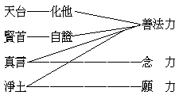


講記無論那一系出發點都為六識，由六識領受淨土宗教義，即觀佛土的依正莊嚴，不過佛土的依正莊嚴，大概是有相的變化佛或他受用佛的依正莊嚴，不是無相不可言說的法性身土。由聞教後，以佛依正莊嚴為所觀境而起向慕之信心。然如何能生淨土？在理論上，十六觀經云：『是心是佛，是心作佛』；即以心為生不生之轉樞也。是心是佛，就是理佛性為依正莊嚴之本，由無漏種漸漸增長而至圓滿，以顯究極之行佛性，即是心作佛義。總之淨士宗由信心而觀依正莊嚴及修三慧行，由慧行得力即可感到變化佛接引而往生淨土，往往有臨終蒙光接引脫離染土者，多是此類。故以是心是佛的原理，由六識起是心作佛的行，由行即可感到化佛而得往生淨土。

#### 　　　　三　綜合說明

綜合說明分四：一、八對四類門；二、四單四複門；三、相奪互成門；四、平等殊勝門。

##### 　　　　　　甲八　對四類門

###### 　　　　　　　　１八對門

此由一切種識律宗起，依次說明。

第一、依律宗之立埸以觀八宗則分為二：一、制教，二、化教。律宗即是制教，設規立制範身行故；餘七宗為化教，語意二輪善宣化故。

第二、依禪宗之立場以觀八宗法有證法教法之別：證法即禪宗，重實證；而以餘七宗為教法，施設種種語言道故。

第三、以天台宗立場以觀八宗有實教權教之一對：實教即天台所宗之法華，宣說諸法實相，唯此一乘無二三故；餘七宗為權教，以雖華嚴亦帶權故。

第四、依賢首宗立場以觀八宗有根本法輪與枝末法輪一對：根本法輪即華嚴教，是一切佛法根本故；所餘教法皆出於此，餘七宗為枝末法輪，從此所流出故。

第五、以密嚴實佛密宗為立場而觀八宗則有密教顯教一對：密宗為深密教，餘七宗為淺顯教。

第六、以淨土宗為立場而觀八宗有易行道難行道之一對：易行道屬於淨土宗，三根普利，最易行故；餘七宗皆為難行道。

第七、以法性宗為立場而觀八宗有無所得法有所得法之一對：無所得法即法性宗，謂一切法皆無所得，乃至有一法過於涅槃者亦不可得，破而不立，顯至究竟亦不可得，故曰無所得法；餘七宗為有所得法，思之可知。

第八、依法相宗為立場而觀八宗則有顯了教隱密教一對：顯了教即是法相宗，眾生法佛法心法等皆了然顯示明確建立故；餘七宗皆為隱密教，所說之義雖已竟了，而能詮之文教多未明顯，是故曰隱密教，唯識經論所謂密意趣語是也。

以上八宗相對，互相觀察，以一宗為主時餘各為伴；如是妙義重重，帝網無盡，斯又在智者之善思惟也。

###### 　　　　　　　　２四類門

一、佛力加持類，二、善法增上類，三、超理直行類，四、勝解成觀類。

八宗之中，淨、密二宗為佛力加持類。淨土宗依彌陀之本願力，確信不疑，發願求生，憑佛接引加持，雖帶業障亦得往生。密宗依本尊之加持得現法之成就，本尊雖不一而皆為大日如來之等流身，故其本尊之加持亦即大日如來之加持。如是二宗起行趣果，不問他法之如何，但依佛力之加持，是故同攝為佛力加持門。

次以賢、台二宗為善法增上類。言善法者，即其本宗所宗之經教也。此二宗之華嚴、法華同稱經王，重於受持讀誦之善法增上力，如台宗之持誦法華，賢宗之持誦華嚴等，古德奉行咸獲良果，在在徵信，有錄可案，佛法之不可思議力於此可見！法華有受持、讀誦、書寫、解說、修行之五品法師功德位，進至六根清淨，全屬善法增上所成。故二宗必先明自他不二，生佛平等，互相交遍，融徹無礙，依佛果無漏善法為增上勝緣成就果德。他宗宗義雖亦具此善法增上緣力，而特顯此義之殊勝斯在台賢。

次以禪、律二宗為超理直行類。蓋律宗不重在理解，祗依其皈佛法僧之真實信心為體，受持淨戒，直起正行以求漏盡；禪宗不落理解，離文字相，絕語言道，直行求證即心是佛；故以是二宗同攝於超理直行類也。

次以相、性二宗為勝解成觀類。相、性二宗皆重理解，由決定印持不可引奪之勝解發起勝觀，修勝行，證勝果。其所成觀：性宗為實相觀，或無所得觀；相宗為唯識觀，或四尋思觀。

以上四類統攝八宗，再列表以明之：


```
　　　　　　┌淨土宗────┐
　　　　　　│　　　　　　　├─佛力加持類
　　　　　　│真言宗────┘
　　　　　　│天台宗────┐
　　　　　　│　　　　　　　├─善法增上類
　　　　八宗┤賢首宗────┘
　　　　　　│禪　宗────┐
　　　　　　│　　　　　　　├─超理直行類
　　　　　　│律　宗────┘
　　　　　　│相　宗────┐
　　　　　　│　　　　　　　├─勝解成觀類
　　　　　　└性　宗────┘
```


##### 　　　　　　乙四　單四複門

單謂單觀，或單往法；複謂複觀，或複往法。

###### 　　　　　　　　１四單門

性、相、律、禪之四宗，皆是單觀單往之法。一、性宗由異熟報主破一切執障事相，顯至一真法界，破而不立，即破即顯。二、相宗認定諸法不離於識，識有三類，曰三能變。三能變中以第一能變為根本，故觀阿賴耶等三能變相，觀到顯唯識性，如是通達三性三無性究竟故，證菴摩羅識果。三、律宗從初受戒發得戒體，由得戒故，能淨障故，直趨密嚴實佛。四、禪宗重在達心，於心作深刻之肯定，確認即心即佛以求明心見性，斬絕葛藤，證法性土。

###### 　　　　　　　　２四複門

台、賢、密、淨之四宗，皆是複往複觀之法。一、天台宗，此宗為複門者，謂先從一真法界觀至異熟執主成複合之法為宗本，復從異熟報主觀至一真法界。換言之、即由佛果善法力加持眾生，引起眾生欣樂信願發大乘心，再從眾生位以至於成佛。二、賢首宗，此宗為複門者，謂先從佛果菴摩羅識觀至眾生阿賴耶識成複合之法為宗本，復從阿賴耶識觀至菴摩識，異生因妄想而不能證得，故須精進勇猛修集福德智慧資糧乃能畢竟成佛。三、真言宗，此宗為複門者，謂由密嚴實佛觀至一切種識成複合之法為宗本，再觀由佛力以加持行者，三密相應直成正覺。四、淨土宗，此宗為複門者，謂由土與心成複合之法為宗本，復由心觀至土，是心是佛，是心作佛，生佛淨土。

以上單門四宗重於因力，亦曰自力修證，謂有情仗自因緣善根種子力，如法相宗所明之種姓等，禪宗謂自性彌陀，唯心淨土等，皆唯自力。複門四宗皆依佛果增上緣力，亦曰他力加持，以眾生法置佛法上，再將眾生法底之佛果法顯現圓成。由此因緣自力及增上緣他力觀察八宗，即可探得其要理也。如表：


```
　　　　　　　┌性　宗┐
　　　　　　　│相　宗│
　　　　四單門┤　　　├因　緣──自力
　　　　　　　│律　宗│
　　　　　　　└禪　宗┘
　　　　　　　┌天台宗┐
　　　　　　　│賢首宗│
　　　　四複門┤　　　├增上緣──他力
　　　　　　　│真言宗│
　　　　　　　└淨土宗┘
```


##### 　　　　　　丙　相奪互成門

相奪門者，每宗各有其立宗之宗點，依此宗點為根據而判攝餘宗，各能將餘宗攝歸自宗置於相當之地位，由此批判一切，統攝一切，是為相奪。故每宗宗義皆可以說明全圖及全部之佛法，每宗皆可自謂除此一宗外別無佛法，此宗為上傳釋尊唯一之正宗，其餘各宗皆祗此中宗之一分而已。嘗觀中華八宗皆有此趨勢，故成相奪門。

次互成者，每一宗有每一宗之特殊方向，由此一方向發揮而成此宗之特殊法門。觀一宗之所以成立，正以有他宗義為其所破所攝而得成立，若無餘宗宗義，則此宗亦無從批判統攝，故每一宗之成立，皆因他宗之成立而得成立，正由判攝他宗從別一方向所發揮義故，其所立宗遂益成豐富之宗義。如清辨之依他畢竟空與護法之依他如幻有，此二者表面觀之似不相成，其實正由如幻有故愈顯畢竟空，亦由畢竟空故愈顯如幻有，因此二義實互成也。二宗既然，八宗亦爾。故各宗雖相奪而實亦互成也。

##### 　　　　　　丁　平等殊勝門

八宗皆平等者，如全圖所列之教法，皆大乘平等所依之教法，亦即為全部之佛法。然則此宗既為大乘完全教法，彼宗亦是大乘完全教法，方向雖有差別，全體平等如一；如國家之政府建立於限定之地方，或南或北，然此政府雖時有南北之不同，而所統所依之國土人民則一。

次言八宗各殊勝者，謂八宗所依之教法雖然平等，而各宗有各宗之殊勝用，故有八宗之別，如國家之政府因其施政或環境等關係，建立於彼或建於此，而各有其特別殊勝之功用也。復次、發心證果皆平等，故八宗平等。八宗皆發大乘心故，亦皆證究竟佛果故，八宗同具此二義故八宗平等。

然各有其特勝之宗，謂研究教理成為所尊所尚之一點，以所研究之教理為根據，集理成宗，立觀趣行，則不能不有反博歸約握厥單微之宗點。若無此集理之宗點則所研究之教義必漫羨無歸，不足以為起觀所依，遂亦無趣行證果之可能。故修學者為趣行故，必須把握一特勝之觀點以為宗也。茲列表於下：

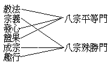


## 第四章　結論

### 　　第一節　教法之差別及其會歸

以上略說教法及宗義竟，今再提綱挈領以總結之。前來所說之種種教法皆根據佛所說之言教，蓋依聖言量而立也。然佛說法隨根機故無量差別，如是差別又如何會歸而統理之耶？茲首先述其差別，然後會歸。

#### 　　　　一　差別

佛之因機說法，論其差別約分為四：一、為僧所說；二、為聖眾所說；三、為人說；四、為非人說。一、為僧所說者，僧即依佛出家之僧伽，為此僧眾所說之教法，就偏勝說，即是律藏。僧為釋尊之常隨眾，其所止所作皆受佛陀之教授教誡，由此建立僧團，專任宏傳佛法之責，故必須有一定之制度始能作久遠之住持，因之有比丘律比丘尼律等出家眾之僧律儀，故曰為僧所說。第二、為聖眾所說者，有在定中說者，如圓覺經等佛與菩薩同在神通大光明藏中而說；或在淨土中為三乘等聖眾所說者，如解深密經等；或為入室聖弟子說，如金剛般若經等。第三、為人說者，人指佛法中之四眾弟子，以及人間所有之上自帝王，下至屠沽等一切人眾；或為大會廣眾普通人說，或為一類一個特殊人說。第四、為非人說者，謂為天等說，或為神鬼等說，如執金剛神及藥叉鬼等，或為龍等所說。

由此所因之機種種差別，不但說法差別，其所現之身亦不同，所謂隨類現身說法是也。故應觀一佛之某種教法應何種機說，又現何等佛身說，依此而明其立場之所在，方不致有隔絕附會之弊，此為教法研究上之先決問題。是故了知教法，不僅宗義不同，佛之根本教法亦不同也；如真言宗經所成佛為大日如來，聞法者為金剛手等。

#### 　　　　二　會歸

佛為普攝眾生類之現身說法，雖有如是差別，而大要之會歸，應知此諸教法皆為釋尊之所證、所思、所說、所印之法也。以一切教法皆佛為本故，此土以釋尊為教主，則此土之一切教法當然為釋尊所親證、所思維、所宣說、所印可之法也。有人謂淨土為阿彌陀教，真言為大日教，謂是報身、法身佛教，餘是應身釋迦佛教；然此不過標其自宗殊勝，分判如此，須知即此彌陀、大日等亦皆是釋尊所證、所思、所說、所印之法，此土若無釋尊現身說法，吾人決不知有彌陀等也。故無量差別教法，應統括會歸之曰釋迦牟尼佛之教法。

### 　　第二節　宗義之成立及其安置

#### 　　　　一　成立

種種教法皆歸為釋尊之教法，次言依此教法成立各宗宗義以及其安置，茲以四義明其成立。

一、疏緣有二：一、所處環境，二、所依教法。所處環境有時代地域民族文化等差異，由此所依教法雖皆為釋尊之教法，而宗義遂有各別之成立。且如唐代以前有天台宗等建立，至唐代有賢首宗等建立，雖同地域民族文化教法，然以時代差別，即文化教法等亦皆有別，故所成宗義亦逈然不同。以地域或民族等致成差別者，亦復如是。

二、親緣有二：一、所承師授，二、所具根性。謂所稟承親教師之教授不同，及其本人所具根性之有異，遂令所處所依雖同，亦所得有別而立宗亦殊。

三、正因有二：一、所得自證，指自心所親證驗之自證法，在此自證法上有偏圓廣狹之差別，各依其自證為所宗故有各宗之建立也。二、所對機宜，機宜指承受其教化之人，有相當之眾生承授此法則可成立此宗，若無此類根機，則雖有此法，亦不能成立。

四、成果有二：一、所施言行，有自證法及所宜機施設種種言行，言即言教，行即行儀，至此其宗乃成。二、所傳徒屬，有所傳之徒屬，此宗方能相傳不斷，若無可傳承者，則雖成立終即滅亡。如禪宗在六祖以前若存若亡，六祖以還乃盛流傳；天台宗入唐已若存若亡，後荊溪四明等重振，始克傳行。

#### 　　　　二　安置

安置者，謂上來觀宗義之成立，有其時代性、地域性、人根性等之不同，由此種種差別因緣所宗教義亦成派別，今於此差別之各宗宗義，應安置於佛教史中以研究之，時地人等既異，不應再拘於宗派之義矣。

然若將宗義僅作歷史之研究，尚與行人有何利益？則應知於行果修證，如楞嚴諸聖之圓通法門，華嚴諸知識之解脫法門，每一法門有其特點，皆可依之修證；各宗亦然，各有其宗特點，宗其特點，入一行而貫通萬行，趣證聖果。故一宗宗義之研究，契其機者可獲趣行證果之益。

復次、教化設施尤需參考，蓋每一宗派依其所對之機宜施設種種言行教化，令當時之有情得大安樂；是故應察所設施之言行，皆因時地等等不同，依釋尊之教法及其自證心境隨宜設施，故吾人應採擇其所言行，奉之為龜鑑也。

### 　　第三節　今後佛學之安立

今之地域交通，民族複雜，人智發達，文化薈萃，統世界人類以互相會通；故今後之佛學，應趨於世界性，作最普遍之研究修證與宣揚。由此今後佛學有二種之安立：一、根本，二、應用。

一、根本上之安立者，重於自利：一曰、教理研究，其根據為三藏聖言，經律為佛所說，論為三乘聖人根據佛說而造亦屬聖言，後人著述則皆當取證聖言為裁斷。故今後研究佛學非復一宗一派之研究，當於經律論中選取若干要中之要作深切之研究，而後博通且融會一切經律論成圓滿精密之勝解。二曰、行果修證，此為今後學佛所最應注重者，以佛法是證法，證法非行莫證，故吾人教理之研究，非以增知識為目的，而以能導進修行趣令證果為目的。若研究教理而不趣重修證者，則研究教理不但無用或反有深害，耗一生之精力最多亦成就一時髦學者而已，其與佛法慧命何干？且如研究法空，若不重於行證，誇言皆空，則成惡取空而落大邪見！研究大小乘法相，若不重於切身修證，專作名相分別，諍論堅固，成惡取法相，不惟終生心力徒為名相消磨，且能因之增長貪求名利恭敬及貢高我慢等無量煩惱！近人多鶩趨法相之研究，孰知法相似難而實易，法性似易而實難，性相一如理量同時之聖境尤不易窺測。對於佛聖甚深密意趣言，不能強信，妄憑穿鑿，肆為抨擊，實犯大戒！猶有學真言者，亦求廣知，不務精修，徒為濟欲工具，遂成惡取密法，豈但無益而害深矣！故研究教理須證之實行，庶免數寶之譏及浮囂之議耳。

二、應用上之安立者，重於利他：一、歷史研究，二、教化設施。若以教法應用於一般人類而施化，則須先為佛教歷史學之研究，如佛傳、佛教史及各宗之佛學史等作切實之研尋；以今日之時事與過去之歷史均有關係，觀察明白而後乃可設施一切教化，應病與藥，善巧無量。所謂教化設施，即將佛之教法化導世界人類欲皆歸於佛化。設立種種之法門，施設種種之學術，或慈或威，或逆或順，或折或攝，或立或破，是須在有志負傳揚佛學於世界之任者，內依佛法，外適時機，為普遍妥當之設化而已。餘義無量，非此所能詳也。

（法舫記）（上海佛學書局印行）

## 註釋

- [1]：本圖創作於民國十二年，修改數次，二十年二月一日，改定於廈門閩南佛學院。
- [2]：本圖，二十年（舊曆）正月，在閩院講之，寶忍筆記，名大乘宗地圖講記。關於八宗者，選注以資參考。
