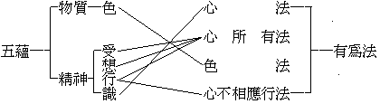

# 般若波羅密多心經講錄
（1921 年冬，在杭州省教育會講）
今說此經，先說經題，次說經文。經題即『般若波羅密多心經』八字，先分說，次貫通說。分為四：一、般若，二、波羅密多，三、心，四、經。

一、般若：梵音，譯曰智慧。今仍用般若者，古人翻經，有五種不翻，此即尊重不翻之例。又因世間所稱智慧，非純善的，佛菩薩之甚深智慧，離過絕非，體性清淨，圓明寂照，不可思議，逈非智慧二字所能賅括，故仍用梵音。今欲明般若之義，以橫豎二說發揮之。橫說為三：一、文字般若，二、觀照般若，三、實相般若。

一、文字般若：凡名相皆謂之文字，而萬法無非名相也。可分為二種：一、顯義理的，凡以名字語言詮表一切事物之意義者屬之。二、顯境界的，凡人心之思想觀念，變現一切境界之相狀者屬之。依此二種文字所發生之智慧，是為文字般若。若依精義說，則從佛菩薩所遺聖教之文字而發生之清淨智慧，乃謂之文字般若，亦稱真教般若。二、觀照般若：顯現義理境界者為文字，而能觀察照了一切文字者，則為觀照，文字所顯之義理境界差別無量，而觀照亦依之差別無量，故所取之境即文字，能取之心即觀照；如實了知所取之文字本空，而能取之心亦不可得，是為觀照般若。若依狹義言，則依聖教所明之理，向現前身心境界，微細體驗觀察，所行與所解相應，乃謂之觀照般若，亦稱真慧般若。三、實相般若：所觀之文字，與能觀之觀照，皆從心體同時變起，體本空寂，境自如如，只因無明覆蔽，不自覺知。能於一切文字境界，微細觀照，豁破無明，如實了知能所本空，脫然無住，而顯現無相實相真常圓明之本體，是為實相般若，亦稱真理般若。

以上三種般若，即依心之三分而立。圖示於下：


```
　　　　相─┐　　（文字）　　　（般若）
　　　　　　├───────心………………自證（實相）
　　　　見─┘　　（觀照）
```


昔者、陳那菩薩說三分唯識：曰相分，見分，自證分。此文字即心之相分，觀照即心之見分，實相即心之自證分。馬鳴菩薩說心真如相示大乘體，心生滅相示大乘自體相用：此實相即為心之本體，文字為心之相，觀照為心之用，皆從心體上現起，起必同時，雖有起滅，體自圓明。譬如大圓鏡，映現萬象，所現之影即文字──相分，能映之光即觀照——見分，自性明澈之鏡體即實相——自證分。以是可悟吾人現前一念心中，本具足三種般若，但能覺照，即得現前。

豎說亦分三：一、加行般若，二、根本般若，三、後得般若。一、加行般若：初聞佛法，但有理解，日用境上，未能實現，須修習觀行，始能相應。觀行功深，欲求觀證實相，當起加行，修四尋思觀：一、觀一一法但是名，不見名言有實義。二、觀一一法但是義，不見實義有名稱。三、觀一一法但是自性，不見法性有差別。四、觀一一法但是差別，不見別有所依之自性。依此四觀，尋求推思於一切法，而如實了知一切法唯心所現，無有自體，是為加行般若。廣說見瑜伽師地論第三十六卷。二、根本般若：加行功極，能所空寂，心境銷亡，證心實相，是為根本般若。三、後得般若：從根本般若自體顯現，覺行圓滿，成就無上正等正覺，是為後得般若。——以上六種，略明般若二字所含大義竟。

二、波羅密多：梵音，波羅者，彼岸義；密多者，到義；譯曰到彼岸，或到究竟。到彼岸有比喻義，如過渡者，乘舟筏由此岸到彼岸，以比吾人乘般若船，渡出生死流，到涅槃彼岸也。究竟、有成就、圓滿、永久之義。世間萬事，如謀衣食、研究學問等，凡不能一得永得，一了永了者，皆不能謂之究竟。俗謂到死便休，是以死為究竟，其實身死心不死，又受輪迴，仍是未了，亦非究竟；不死之心，即成唯識論卷三所謂阿賴耶識流轉五趣四生也。故知世間一切有為無常之法，無有能到究竟者。必須依教修行，親證實相，方得謂之究竟；即經文所謂究竟涅槃及阿耨多羅三藐三菩提是也。

三、心：心之一字，廣解無邊，實叉難陀譯華嚴經十地品云：『三界諸法唯有心故』。二十唯識論說之甚詳，文繁不述。茲淺略言之，分二種說明：一、明了分別之心，二、總持精要之心。

一、明了分別之心：此心之義，略有四種：一、肉團心，此屬身根所攝，乃八識將身根攝為自體，令發覺受，雖似有知覺，實是物質，無明了分別之作用，不可謂心。二、思慮心，心之見分，緣前境發生觀察思念，人以為心；然境現則有，境滅還無，自體不能成立，但是心中所現起之作用，而實非真心。三、集起心，謂集積萬法之觀念，遇緣而現起者也。如吾人以前所聞見之事物，縱遠隔數十年，偶一憶及，如在目前，即此心之作用，屬第八識。雖能含藏萬法影像而不遺失，然起滅無常，究非心之本體。四、真實心，即圓覺妙明真實心體，常住不變，平等周遍，非思慮集起而能現起思慮集起，非一切法而能變現一切法。

二、總持精要之心：此心之比義，如肉團心為人身之主宰，故謂之心。般若經六百卷，此經能總持其精義，故謂之般若波羅密多心。又大藏經文義廣博，此經總攝無遺，故亦可謂為群經之心。

四、經：梵語修多羅，譯為契經，契理契機之聖教也。契理則無顛倒錯謬，契機則能開悟他人。又言法本，謂法之本根；佛菩薩之自證智慧，清淨真實，契合正理，從此流出契合群機之言教，可為一切眾生之軌範。漢文經字，訓常、訓法；常則契理，法則契機。法有軌持之義，以軌解持義，使不失故。

次、連貫說明：經之一字為通題，佛經及其他各教之經典皆用之，在三藏中通於經藏。般若波羅密多心為別題，不通餘經故。而般若波羅密多，又為別中之通，般若部經通用故；心為別中之別，專屬此經故。般若波羅密多，有二義：一、波羅密有六；曰施、曰戒、曰忍、曰精進、曰靜慮、曰般若；此揀別施等五波羅密，惟是般若之到究竟彼岸。二、般若自體，即究竟彼岸。般若波羅密多心，亦有二義：一、般若波羅密多之心，能總持般若波羅密多之廣義故。二、般若波羅密多即心，是心之本體自相故。般若波羅密多心經，亦有二義：一、般若波羅密多心之經，此經文字，能詮般若波羅密多心，表顯實體故。二、般若波羅密多心即經，凡有文言，皆是實相，經之全體即般若，般若之全體即經，總持萬法而當體空寂，無能詮所詮故。

以是可知般若波羅密多心經，即無相實相常住真心之自體。此經所說蘊等諸法，即所以顯示此心，而諸法當體空寂，惟心所現，則全體即是此心，故名般若波羅密多心經——以上說經題竟。以下說經文：

> **觀自在菩薩，行深般若波羅密多時，照見五蘊皆空，度一切苦厄。**

此一段為結集此經者敘述此經之緣起。第一句敘說經人，第二句敘所修法，第三四兩句敘所證果。明此經所說非從他聞，非虛妄理想，乃觀自在菩薩從自證境界所流出之言教也。

玄奘譯觀自在菩薩，舊亦譯為觀世音菩薩。觀、即觀照之觀，非專屬眼之功用，乃通於心之作用之總相，如觀念、觀想、觀察等。自在、謂自體常存在，梁譯大乘起信論說真如自體云：『自在義故』；法藏疏云：『不復循環諸道，生死長縛也』。實叉難陀譯華嚴經十地品說八地菩薩有十種自在，離世間品說菩薩摩訶薩有十種自在，文繁不敘。茲略說二義：一、有自體，二、常存在。世間萬法，不外色心，色屬物質的，心屬精神的；就物質的觀之，凡所有物皆和合生，能和合者亦和合生，輾轉分析至於極微，皆無一定之體相可得，且或分或合成壞無常。就精神的觀之，舉心動念，必藉眾緣，隨緣生滅，剎那轉變，吾人覺有能思量計度之心常時存在者，乃念念相續而成；如以一星之火迅速旋轉，視之如輪，乃因星星相續，目迷妄見，實無輪體。故知萬法皆仗因託緣而生，惟是和合相續之假相，都無常住之自體。如是觀察，萬法皆空，所觀之法既空，能觀之心亦寂，能所不生，真體斯現，圓明寂照，非色非心。萬法無不從此流，亦無不還歸於此，離一切相，即一切法，則法法無非自體，人人具足圓成。現起非生，銷亡非滅，世間相常，是名自在。能所不二，惟一真心，故攝所歸能，自在即觀；攝能歸所，觀即自在。行解與之相應，是名觀自在。

菩薩，即菩提薩埵之略稱。菩提譯覺，薩埵譯有情或眾生——有生命人格的意義，而不限於人類。合說有三義：一、覺悟的眾生，二、能以自覺覺他眾生，三、上求覺道，下度眾生。觀自在菩薩，謂觀自體常在而得覺悟之眾生。上四字表德，下一字表人格也。

行深般若波羅密多時：行、功行，修證義。深對淺說，有澈底義。時、分際義，表修證進趣中之某分際。六種般若皆能為究竟到彼岸之遠因，故皆可謂之般若波羅密多。然文字般若僅當聞位，觀照般若當思修位，咸未能澈證心源，故淺；實相般若當於證位，真心本體澈底現前，對前二說名為深。此句謂修證功深，澈底達到實相般若之時也。

照見五蘊皆空，度一切苦厄：照見，不假尋思，當下明了之義。五蘊，即色、受、想、行、識，廣說見世親大乘五蘊論，玄奘譯五蘊，舊譯亦名五陰，蘊、積聚義，陰、覆蔽義；謂積聚身心，覆蔽真性也。空、但遮五蘊虛妄，非謂實有空相虛空等。度、超過遠離義。苦厄，逼迫為性，略有三種：一、苦苦，處逆境時，惟苦無樂。二、壞苦，處順境時，暫受快樂，然歡娛易盡，好事多磨，慮樂失壞，悲感斯生，故仍是苦。三、行苦，處常境時，不苦不樂，但依正無常，剎那變遷，身心不安，是為行苦。依苦境言，復有八種：一、生苦，報得身體曰生，迫於業力不能自由故苦；且諸苦皆依此身而有，故生又為苦本。二、老苦，三、病苦，四、死苦，五、求不得苦，六、愛別離苦，七、怨憎會苦，八、五陰熾盛苦。不了五陰非實，依此身心起惑造業，復感未來生因，故五陰熾盛，又為生本也。以上種種苦果，推究其原，皆依托於五蘊，今以般若光明，照破五蘊當體皆空，故依五蘊而有之一切苦厄，無不超脫遠離。此二句乃觀自在菩薩依般若波羅密多親證之現量境界，以下即將此境界顯說密說，方便教示，普益群生也。

> **舍利子！色不異空，空不異色；色即是空，空即是色。受、想、行、識，亦復如是。**

舍利子，梵語舍利弗。弗、譯子，母名舍利，子以母名，故曰舍利子。在佛小乘弟子中，智慧第一，今說大乘般若波羅密多，故呼其名而告之。

佛說三性：曰遍計所執性，依他起性，圓成實性；處處經中有之。此一段明依他起性，顯說五蘊體相本空也。欲窮其理，當先明五蘊。




觀上圖，五蘊皆有為法攝；色屬色法，為物質的現象；餘四屬心法，為精神的現象。今就色蘊說明當體即空之理。色蘊以質礙為體；故成唯識論稱為有對，有對者，有礙也。百法明門論曰：色法略有十一種：眼、耳、鼻、舌、身五根，色、聲、香、味、觸五塵，及法處所攝色也。姑就色塵言之，其相狀約有三種，而與表色相反者，另稱無表色。圖如左：


```
　　　　　　　　　　　┌顯色──眼所照了者，如青黃赤白等。（虛空名空一顯色）
　　　　　　　┌有　對┤形色──有形狀者，如長短方圓等。
　　　　色　蘊┤　　　└表色──動作行為之表現者。（兼通有情無情）
　　　　　　　└無表色─────動作行為之不能表現者。
```


以上略說色蘊之體相，究其原質，不外地、水、火、風。地者堅相，分析可使失其堅；水者濕相，分析則變成氣體；火屬熱力，心不覺時熱相即失；風相輕動，依三大顯。如是分析推求，四大相無自體，則依四大為種之色法，自然當下銷亡，即相非相，說名為空。性色真空，故曰色不異空；性空真色，故曰空不異色。真色無色，故曰色即是空；真空不空，故曰空即是色。復次、色是假相，空是假名，雖有名相，都無實義，故曰不異。法無自體，惟心變現，故法相即是心相；空無體相，遮法名空，故空名即是法名；名相所依，惟一真實心體，故曰即是。不異、故離一切相，即是、故即一切法。離一切相即真諦，即一切法即俗諦，雙遮雙照即中道第一義諦。故曰：『因緣所生法，我說即是空，亦名為假名，亦名中道義』。

受以受領為體，想以想相為體，行以遷流造作為體，識以明了覺知為體；四者之中，識為心王，受、想，行為心屬。乃因不了色蘊非實，領受前進，分別思量，更加造作，結成識種，輾轉輪迴。今所對之色蘊既空，則能對之四陰何有。亦復如是者，言受不異空，空不異受；受即是空，空即是受也。餘類推。

> **舍利子！是諸法空相：不生不滅，不垢不淨，不增不減。**

此明圓成實性，正說離相實相自在心體也。諸法，包括世出世間有為無為一切法。本來平等真實，無諸差別，即相非相，故曰空相；空而不空，萬物齊現，故又曰實相；即出生諸法，照了諸法，自體常在之本覺真心也。生滅、垢淨、增減，皆世俗之假相。此自在心體，圓寂常住故不生，不生故不滅。離一切相，不可染污，故迷時不垢，不垢故悟時亦非淨。平等周遍，生佛無異，故在聖不增，在凡不減。

> **是故空中無色，無受想行識。**

自此以下至無智亦無得，明遍計所執性，說五蘊法相及集起之眼等諸法皆無自體，以破我法二執，反顯真心也。

是故空中，承上文謂諸法空相之中，諸相非相，惟一真心，則五蘊等法，全體即真，離諸差別，故曰無。此四字直貫至無得句。

世人不了真心，妄執色身為我，貪求名聞利養，造種種業。然試加觀察，身由四大合成，地、水、火、風，性相各異，何者是我？髮毛爪齒，皮肉筋骨，濃血汗液，糞尿涕唾，三十六物，以何為我？如皆為我，則成多我，若指一為我，餘為誰何？若謂和合之影狀為我，則幼少壯老時時變遷，應以何時之形狀為準？且新陳代謝，消化不停，飲食進口，即與全體和合，則魚肉菜飯皆成為我，甯有是理？種種推尋，求我不得！人將轉計曰：所謂我者，非指肉體，我能受苦受樂，是能受者，方可為我；遂捨色蘊而計受蘊。然受因境有，境之違順無常，受之苦樂不定，苦受為我耶？樂受為我耶？不苦不樂受為我耶？未受之前，與既受之後，又以何者為我耶？推想至此，又轉計曰：我能想相分別於萬法，此能想者，當然是我，於是復捨受蘊而執想蘊。但想依受生，受既無常，想豈真實？於是復轉計曰：想是虛妄，不可謂我，今吾人之行為造作，事實昭然，應是真我，而行蘊之執起，謂人作善作惡，其能作者為我；不知善惡亦因想相分別，相對立名，無有定實，所作既妄，能作豈真？如是推求，了知色、受、想、行皆與我無涉，遂以此明了分別之心，能知四蘊非我者為我，而識蘊之執起。但能知之心，必依所知之境，所知之四蘊既空，能知之識陰何托？故知識蘊亦復非我。此總說五蘊皆空，破我執也。人無我之廣說，見瑜伽師地論卷六，成唯識論卷一，辨中邊真實品，顯揚聖教論成善巧品，成定品，學者當遍閱之。

> **無眼、耳、鼻、舌、身、意，無色、聲、香、味、觸、法。無眼界、乃至無意識界。**

此根、塵、識界，凡聖共有之法也。眼、耳、鼻、舌、身、意名六根，有二種：一曰浮塵根——粗色根，眼、耳、鼻、舌、身外現之形狀是。二曰勝義根——淨色根，依浮塵根而能發生見聞覺知等功用者是。意根者，謂七識，專執八識見分為真我，致成我執。由我執發生意識，而見有萬法，故六識以七識為根。前五根屬色法，意根屬心法，皆依托於五蘊。五蘊既無，故六根亦無。

色、聲、香、味、觸、法名六塵，有動搖、染污二義；謂色聲等生滅變幻，染污六根，障蔽真性，彼微塵動搖不停，染污成空也。眼所見者曰色塵，耳所聞者曰聲塵，鼻所嗅者曰香塵——兼香臭二義，舌所嘗者曰味塵，身所覺者曰觸塵，意所分別者曰法塵；皆對六根現起，六根既無，故六塵亦無。

六根、六塵、六識——眼識、耳識、鼻識、舌識、身識、意識——名十八界。界有二義：一、種類義，十八法在八識中，各有種子，功用勢力不同，各現差別之法故。二、界限義，根塵識三，同時作用，而各有界限，如眼見色時塵為所見，識為能見，根為識所依托而生見，性各不同故；根塵相對，識生其中，成十八界。根塵俱空，識無所托，界云何存？故曰無也。

> **無無明，亦無無明盡；乃至無老死，亦無老死盡。**

此十二因緣，緣覺所修之法也。廣說見實叉難陀譯華嚴經十地品之第六地。因緣亦名有支，謂因果不亡故。亦名緣起，謂世間生死流轉之法，皆此十二支所緣起故。

無明、不明也，不明本理，曰迷理無明——根本；不明現事，曰迷事無明——枝末。因不知實相離相，妄見世界身心以為實有個體，而生心取著，多方造作，則成行業，故曰無明緣行，猶言無明為緣而起行也。此二支為過去因。眾生初死，無知無覺，前業發動，牽引受報，則生識；此識入胎，謂之名色；六根既具，謂之六入；生後觸境曰觸；觸而領納曰受；此五支為現在果。領受前境，仍迷不覺，執有能受所受，分別憎愛，曰愛；貪求所愛，厭棄所憎，曰取；愛憎取捨，造作不停，則有業種，故曰有；此三支為現在因。復招未來之報曰生，有生則有老死；此二支為未來果。以上十二因緣，因果相生，循環流轉，為生死輪迴之本；故曰：無明緣行，行緣識，乃至生緣老死。此為凡夫之流轉法，緣覺乃能知還滅法。還滅法者：若欲解脫老死之苦，須不受生，不生須不有，不有須不取，不取須不愛，不愛須不受，不受須不觸，不觸須六根不為六塵所入，不入須空名色之五蘊，空五蘊須空業識，欲離業識、須空業行，欲空業行、須破無明，欲破無明、須明真心。真心顯現，則理事圓明而無明滅，無明滅則行滅，輾轉乃至老死滅；故曰：無明盡乃至老死盡。但必有生死，然後有解脫，真實心體，本離生滅垢淨，焉有無明等法可為解脫者？故曰：無無明盡乃至亦無老死盡。

> **無苦、集、滅、道。**

此四諦法，聲聞所修之法也。諦、審實義，謂苦等四者，義理真實故。三界、六道，惟苦無樂，此理真實，故曰苦諦。集、聚集義，由惑造業，集起依正二報，為苦之因，實無他因，故曰集諦。欲脫苦果，須斷集因，集斷苦離曰滅；集因苦果，實可斷滅，故曰滅諦。欲滅苦集，須依能滅之道；如實修行，修行功深，實能滅苦，故曰道諦。佛因眾生迷成苦果，乃說四諦法以對治之；悟苦本空，全體即真，病去藥亡，諦於何有？故曰：無苦、集、滅、道。

> **無智亦無得。**

智、謂三乘能證之聖智，得、謂三乘所證之涅槃。本來菩提涅槃，故今無得無證。復次、布施、持戒、忍辱、精進、禪定、智慧，謂之六度，乃菩薩所修之法，此單言智者，舉一例諸也。為求圓滿菩提而修六度萬行，然隨緣成事門，則有能修之智與所得之果，而實際理地，煩惱即菩提，生死即涅槃，本無煩惱，豈有斷煩惱之智？本無生死，豈有脫生死之涅槃？故曰無智亦無得。自無眼耳鼻舌身意至此，破法執也。法無我之廣說，見解深密經一切法相品，無自性相品；辨中邊論辨相品，辨真實品，辨無上乘品；顯揚聖教論成無性品，成唯識論卷一，學者當遍閱之。人法雙亡，真體自顯，如淘沙取金，雖不識金，但去其沙，真金自現，故下文曰：以無所得故，依般若波羅密多。

> **以無所得故；菩提薩埵，依般若波羅密多故，心無罣礙，無罣礙故，無有恐怖，遠離顛倒夢想，究竟涅槃。**

凡夫執有，故有世界身心可得；二乘執空，故有界外涅槃可得。然得與失對，有所得必有所失，如手本萬能，若持杯不放，自謂為得杯，則成持杯手，不能持他物，是所得甚少，而所失反多。今以般若波羅密多，照見諸法皆空，則法無所得。空即諸法，則空無所得，所得既無，能得亦寂，能所無寄，體自靈明，不取一法，不捨一法，故能圓應萬法，無欠無餘，是即般若波羅密多心之自體相用。行解與此相應，任運隨緣而不迷背，謂之依般若波羅密多。

罣、網罩義，礙、阻滯義。一時驚駭曰恐，常存畏懼曰怖。未證實相，妙明真心為無明所覆蔽，如被網罩，觸途成滯，取著萬法，得失紛陳，患得患失，恐怖乃生。依般若波羅密多，則心境一如，於法自在，故無罣礙。不為身所罣礙，故無老病死之恐怖；不為法所罣礙，故無患難得失之恐怖。

顛倒、錯誤、相反義。夢想、猶言夢境，一切境界皆由心想生，故曰夢想也。吾人睡眠，昏迷不覺，漸入夢境，則見萬法亦如醒時，亦能受想造作，憂喜恐怖；遽然驚覺，人境俱空，始知是夢，往往爽然自失。故夢中有二種顛倒：一者以虛為實，二者忘卻本人。吾人現前身心世界，皆因無明昏迷所現幻想，妄執為實，更加造作，轉復昏迷，從迷入迷，相續不覺，忘本真心，與夢中之顛倒，無二無別。依般若波羅密多，則無明惑破，虛妄相空，如人夢醒，求夢中境了不可得，故曰遠離顛倒夢想。

涅槃、梵語波利暱縛𠲸，波利者圓也，暱縛𠲸言寂；舊云涅槃，音訛略也；今或順古，亦云涅槃。譯義繁多，略舉梗概。一、譯滅，離妄義。一、譯寂滅，體性寂靜，已滅妄相義。一、譯不生不滅。以上三譯，皆未盡涅槃之義。唐玄奘法師譯為圓寂，圓滿寂靜義，謂具足無量無邊最極清淨自性功德，無不圓滿曰圓，萬法流動變遷而體常寂靜曰寂。此義較為詳盡，蓋圓明寂照之真心，變現萬法，萬法無體性，而皆是真心之本體，原無生滅昏動，即是究竟涅槃。若小乘涅槃，乃厭棄三界，離生死煩惱，求得安樂處，非圓明無住寂滅常住之涅槃，故非究竟也。

金剛經云：『應無所住而生其心』，此言無所得，即無所住也。無所得則無所不得，任運隨緣，如如不動，即依般若波羅密多，即生其心也。無住生心，故心無罣礙恐怖，而顛倒夢想究竟遠離，到究竟涅槃之彼岸也。又無所得者，成唯識論說修習位云：『無得不思議，是出世間智；捨二粗重故，便證得轉依』。究竟者，成唯識論說究竟位云：『此即無漏界，不思議善常，安樂解脫身，大牟尼名法』。

> **三世諸佛，依般若波羅密多故，得阿耨多羅三藐三菩提。**

三世、謂過去、現在、未來。諸、言其多也。佛、梵語佛陀，譯覺者——不曰覺人而曰覺者者不拘人類故，謂自覺覺他覺行圓滿也。惟佛可稱覺者，因菩薩以下皆帶迷故。得、因修證功滿，由始覺契本覺，始本不二達究竟覺——始覺、本覺、究竟覺，廣說見大乘起信論——名之曰得；實則得其本得，非得不得，與圓滿菩提歸無所得無二致也，阿譯無，耨多羅譯上，三譯正，藐譯等，三譯正，菩提譯覺；阿耨多羅三藐三菩提，謂無上正等正覺也。正覺，揀凡夫外道，雖亦有覺悟，邪妄不正故；正等揀小乘，雖屬正覺，但專求自利不顧眾生，非平等普遍故；無上揀菩薩，菩薩發心，自度度他，雖是正等正覺，然無明習氣未盡，猶有上位可證，非無上故。

自無智亦無得以上，說自證境界，因行深般若波羅密多故，顯真離妄。自以無所得故至此，廣引諸佛菩薩皆因妄離真顯故，依般若波羅密多，成就無上清淨轉依，以明此經為殊勝總持也。

> **故知般若波羅密多，是大神咒，是大明咒，是無上咒，是無等等咒；能除一切苦，真實不虛。**

咒、梵語陀羅尼，譯總持；謂總一切法，持無量義，一文具足一切文，一義具足一切義故。咒是總持之一種，有不可思議力用，因說咒人願力之加持，感應道交故。神、變化不測義，謂有神妙不測之力用，能令受持之者，得大解脫，成就不可思議功德，故曰大神咒。能破根本無明，顯露真心實體，故曰大明咒。能總持無量法門，直趨無上覺，故曰無上咒。無等等者，等於無等之義，無等、謂無可與等；真如法性，平等圓滿，萬法皆依之為本體，故無與之相等者，然諸佛得無上正等正覺時，覺滿真如，智如正等，無欠無餘，故曰無等等咒。

真實不虛有二義：一、能究竟離妄故；諸法如實空，非色非心，無修無證，則無分段變異二種生死——分段生死，不思議變易生死，廣說見成唯識論卷八——故能永除苦本，真實不虛也。二、能究竟顯真故；諸法如實不空，即色即心，而般若波羅密多之自體常在，真實不虛也。又真實不虛四字，簡言之，即真如二字。成唯識論卷九云：『真謂真實，顯非虛妄』；即此第一義也。又云：『如謂如常，表無變易』；即此第二義也——以上顯說竟。以下密說。

> **故說般若波羅密多咒，即說咒曰：揭諦揭諦，波羅揭諦，波羅僧揭諦，菩提薩婆訶。**

咒屬五種不翻中之祕密不翻，不能依文解釋，茲但說明不翻之義。一、前文為顯說般若，乃方便開示，至於親切證到之實相現量，則非文字語言所能盡顯，乃以無意義之音聲表之，故為秘密不可翻。二、平等文字，皆有一定限量之意義，咒則無一定意義，而具足一切意義，強為訓釋，必有得一漏萬之失，故不翻。三、如軍中符號，但有作用而無意義，故不翻。以上三端，略說不翻之故。然必需稍明其義，亦可比量而知；蓋顯密無二，咒義即經義。惟文愈簡而義愈深，故此經為諸法之總持，此咒又為此經之總持也。偈曰：顯說密說，不離不即；是觀自在，智波羅密。

