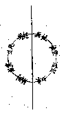
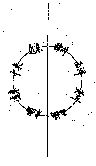

# 法性空慧學概論
（1942 年，下學期在漢藏教理院講）

## 目錄

- 一　略彰名義
    - 甲　法性
        - １法性之名義
        - ２法性之異名
        - ３法性之增義
    - 乙　空慧
        - １空慧之名義
        - ２空慧之異名
        - ３空慧之貶義
    - 丙　法性空慧學
- 二　中論在一切佛法中
    - 甲　在教理中
    - 乙　在行果中
- 三　中論在龍樹諸論中
    - 甲　宗論之部
    - 乙　釋經之部
    - 丙　集經之部
    - 丁　頌讚之部
- 四　中論在印度諸釋中
    - 甲　提婆諸論
    - 乙　中論梵志青目釋
    - 丙　順中論義入般若法門
    - 丁　大乘中觀論釋
    - 戊　般若燈論釋
    - 己　入中論
- 五　中論在中國諸宗中
    - 甲三　論宗
    - 乙　天台宗
    - 丙　華嚴宗
    - 丁　唯識宗
- 六　中論八不緣起偈
    - 甲　列舉論文
    - 乙　釋義特點
    - 丙　文義抉擇
        - １論文抉擇
        - ２釋義抉擇
- 七　中論前二十五品
    - 甲　列品名
    - 乙　釋文義
- 八　中論後二品
- 九　中國佛學之特點
    - 甲　總持
    - 乙　融會
- 十　龍樹中觀與今之判攝
    - 甲　龍樹中觀之圓活無滯
    - 乙　學者應注重修己悟他
    - 丙　今以理之實際及三級三宗判攝
    - 丁　於佛祖應善學其契理契機

## 一　略彰名義

### 　　甲　法性

#### 　　　　１法性之名義

明顯的說，法、即指宇宙萬有一切法；性、意義很多，這裏是指普遍義和永久不變義的：遍一切法永恆不變的理性，便叫做法性。在一切法中，不限何法，都具有這種理性；無論它如何變化，都有這不變的理性存在。但這樣普遍無限永恆不變的法性，到何處尋覓？因為一切見聞思量到的種種法，都是相對有限前後變遷的，要尋求絕對不變的真實性，於一切法中都尋不到。中論云：『於種種法，凡夫分別為有，智者推求則見其空』。因此，以智慧推究尋求的結果，都沒有可說為真實性的；故一切法，都無永久決定性可得，也無永久決定相可得，所以說是「空」。欲於一切法中，得其永久不變決定實在的體性，絕對得不到，雖有心識上分別所得如何若何的諸法，若以智慧徹底考察，都無固定的實體可得，所以遍一切法的永久不變性，就只是畢竟空無所得了；故法性即一切法的空性。一切法既無實在可得，在普通心識上雖分別有此有彼；然徹底考察，都不能究竟成立。故一切法的徹底性，即是空性；這空性，是永久不變普遍一切的，所以稱為法性。有些經論中說到法性、法住、法界，法性也就是三世緣起法中，常常如此，普遍如此的空性，這就是法性的本義。

#### 　　　　２法性之異名

這法性在經論中有很多異名，前面說常常如此、普遍如此的「如」，金剛經所謂『諸法如義』，維摩經所謂『一切法皆如也』；如、就是法性的異名。或於「如」上加一「真」字，即為「真如」，真即是如；只有常遍如此的，才是真實而非虛妄，這也是法性的異名。或說「諸法實性」、「諸法實相」，或如心經所說「諸法空相」，也有說「諸法空性」，還有說「虛空性」，「平等性」，「無分別性」；這些、都是法性的異名，都可以上面所講的法性本義而說明其義。因為平常所見聞思想到的種種法，都有所對待，有所限制，不能成立為普遍無限永久不變性，不能達到平等無分別，故必須達到一切都不可得的法空，才是一切法真實遍常如此的平等性。

#### 　　　　３法性之增義

上來雖說有眾多異名，但其本義仍是遍一切法永恆不變的空性。然有些經論中說到的法性或其異名，則義或有增；如辨法法性論所說的法與法性，以生死涅槃相對，生死名法，涅槃名法性，也就是雜染清淨相對。清淨法名法性，則具有種種清淨功德，故其論廣說轉依的種種功德，名為法性。其意義則與法性本義有增了。

復次、真如即法性。起信論分真如門和生滅門，依生滅門明一切雜染法，依真如門明一切清淨法。故真如不但為一切法平等體，且為一切清淨法的大乘自體、相、用，亦與空性本義有增。又如「諸法實相」，若從本義上講，諸法一切無相，遍一切法之無二無分別相為實相。但有的地方，亦說諸法實相無相無不相；如法華經云：『諸法如是相，如是性，如是體，如是力，如是作、因、緣、果、報、本末究竟等，唯佛與佛，乃能究竟』。則諸法實相，不唯無相，而且具足一切相，無不顯現；亦是法性之增義。法性之增義雖皆不離本義，但今此法性空慧學中所講，則揀除增義，專就本義而說。

### 　　乙　空慧

#### 　　　　１空慧之名義

前面所說的法性，就是一切法的空性。所以空慧，簡言之：也就是通達一切法空的智慧。空慧可有淺深，如依聽聞經教所得者是空聞慧，依之思惟推究而得勝解者是空思慧，依修止觀相應而得證入一切法空的智慧，則是空修慧。此中通達一切法空的智慧，正指證入法空的空慧。這空慧，或分為「生空」、「法空」的二空慧，或於生法二空後加「空空」——以生法之空，本來即空，非勉強使之空，故名空空——為三空慧；或分「所取空」、「能取空」、「能所俱空」；「境空」、「心空」、「心境皆空」；也就是三空。或說十六空，十八空，二十空，都不外是將一切法分之為二為三，或為十六，十八，二十，法雖有多而空則一。這能了解通達一切法畢竟是空的智慧，就是空慧本義，亦即此處所講的空慧。

平常所說的摩訶般若，就是照見一切法徹底是空的智慧。蓋於一切法徹底的究竟的觀察一下，皆無所得。如心經說：『以無所得故』，即入甚深般若波羅密多；此徹底無所得的智慧，就是空慧。窮究一切法到徹底，並無什麼底，以無底故，都無所得。此如平常起心動念，若迴光返照，予以仔細徹底的觀察，便不可得。『萬古碧潭空界月，再三撈摝始應知』——如水中撈月，再三撈摝，畢竟皆空，一無所得。又如遠視陽燄有種種相，近視則無。於一切法上反復研究徹底觀察，皆畢竟無所得。這了知畢竟無所得的，即是空慧；由此空慧，乃能通達一切法空性，故法性須以空慧而通達。

#### 　　　　２空慧之異名

空慧、也有很多異名。如「二無我慧」，即人無我和法無我；明了一切眾生無主宰自體，一切法無自性實體，故一切眾生和一切法之我體皆無，也就是了達人法均空的空慧。又「無分別智」，是能通達諸法無分別性的智慧，也就是空慧。此無分別慧，主要在證入一切法性空，畢竟無所得，才是真正的無分別慧，也就是平常所說的根本無分別智。而加行無分別智，不過是能引發根本智的智慧。後得無分別智，則是證得根本智後所引起來的一種智慧，可說是具足種種善能分別觀察諸法相的智慧；所謂『善能分別諸法相，於第一義而不動』。故真正證入一切法根本性的無分別智慧，才是真正的空慧。又：三解脫門中的「空解脫」，也是空慧；以忍可空故，於空得解脫故，就名空解脫。或名空勝解，由聞說諸法空的教理，思惟抉擇，引生了解法空的空勝解。又：如許多經論中所說的空觀，即是觀一切法空相的觀慧。觀有尋求、伺察之義，即尋求、伺察一切法空的智慧。或說「中觀」，也就是空觀。又如「空見」，見即見解，無論聞慧，勝解慧，觀行慧上法空的見解，都名空見。見又是最明利的照見，證入一切法空時極為明利的智慧也叫空見。此中講到的異名，或者較狹，只是空慧的一分，也有些則是空慧全部。

#### 　　　　３空慧之貶義

向來經論中也有些貶斥不足於空慧的。如惡取空見，即於空見上加了限制；惡取對善取而言，善取是正當的，取之不當不善巧，於空見中成了惡取，即貶斥於空慧了。又如：偏空慧，經論中彈斥二乘偏見於空，未見中道，法華喻為「眇一目」，涅槃則謂「見無常苦空無我不淨，不見常樂我淨，見其空不見不空」。這都是貶空慧偏而不圓的意思。還有不符事理，毫無意義，毫無效果的，世間都斥為空想，想、即觀想，空想，也是就空慧一分而貶斥。先簡別這些空慧的貶義，以明這些都是現在所講空慧所不取的。

### 　　丙　法性空慧學

欲明法性，必宗空慧；宗空慧而明法性的學說，即名法性空慧學。在前面釋空慧中亦已說明法性之必宗空慧了，蓋無論說一切法，研究一切法，證明一切法，要是不達到最究竟最澈底的解決確定，終是不能夠停止的。但若達澈底，一切法都畢竟要歸到空無所得。如現代一般研究科學者，將一切萬物分析研究，其研究結果，說為原子……；但還是不能澈底，久而久之，便覺到原子也還是不究竟可破壞的，遂將以前研究的結論消失。所以若求一切法的普遍永久澈底性，必須達到一切法空。唯了達一切法空的智慧，乃能遍一切法去澈底觀察；若不得此慧，則不能澈底見到遍一切法的永恆不變性；故法性須以空慧為宗。從一切法上觀察都是空的空慧，說明遍一切法之澈底性，故叫法性空慧宗。講明此種學理的經論，名曰法性空慧學。

法性空慧學之範圍，包括很多經論。就一切世出世法，其要點都在說明一切法空，引發了達諸法皆空的空慧，如各部般若經及宗般若經的諸論，即是法性空慧學的經論。但論太廣，取其可以提綱挈領來說明的，如流通最廣的心經，便是很能夠代表的。從五蘊法上觀照到都是空，再於所了達的諸法空相中，眼、耳、鼻、舌、身、意等十二處，十八界，十二緣起，四諦，都無所得，成為般若波羅密多；依以究竟涅槃，證入阿耨多羅三藐三菩提。不過文太古簡，能從種種方式，種種觀察推求以講明諸法都是空的，應以中論為代表。所以就依中論為代表來說明法性空慧學。中論觀法品云：『問曰：若諸法盡畢竟空，無生無滅是名諸法實相者，云何入？答曰：滅我我所著故，得一切法空無我慧者名為入』。這一段文，很可說明能證入法性——諸法實相的，須是真正的空慧——空無我。故通達法性，須以空慧為宗。

## 二　中論在一切佛法中

此言中論，即指法性空慧學，不過以中論為代表而說。此中分二：

### 　　甲　在教理中

一切佛法之教理，可從因緣、四諦、二諦、三性中去概括說明。四諦者，乃世出世間因果，此因果即為因緣法之具體說明。第此因緣法，要是執為固定實在，則成為自然有，或計為無因者，即非是因緣法了。是故若欲澈底明了因緣法，則須深明中論的不生滅等八不義。若能澈底見因緣法，即是成佛。換言之，見因緣法即見佛法身。中論云：『若見因緣法，則為能見佛，見苦、集、滅、道』。所謂見因緣法即見佛之法身，及苦集滅道世出世之因果也。顧因緣法可見淺見深，當有種種差別；要之，不能見到究竟，則不能真見因緣法，能完全圓滿見到因緣法者，厥為佛陀。是故見因緣法即得佛慧；見是清淨因緣法，即見滅道二諦也。必明諸法空理，乃能善見因緣法，所謂『以有空義故，一切法得成』。因為見苦、集、滅、道即是法寶，澈底能見此者，即是佛寶，依此而修行者，即是僧寶。由此，三寶具足，咸以善見因緣法而得之。諸法空慧能善見因緣法，亦為善見苦、集、滅、道，乃至成就三寶功德，此乃從因緣四諦上的說明。

次說世俗諦與第一義諦。中論云：『若人不能知，分別於二諦，則于深佛法，不知真實義』。此偈乃明於甚深佛法道理，要善能了知二諦；於二諦義分別明了，即能了達真實究竟。法性空慧常依二諦說，故於論中作如是釋：第一義因言說，言說是世俗。所以佛說法，依二諦以顯明第一義，必以言語文字名句詮表，故不依世俗不能說第一義；由不能說，即不能了解第一義，不得至解脫涅槃。由此，甚深佛法皆依此二諦；若能分別明了，即能知真實究竟。法性空慧學，即依世間言說，以種種方便而顯第一義者。此善能運用世俗言說而說明第一義之二諦，遍通於一切佛法教理之中。

再就三性而說：宗喀巴之緣起讚釋上，有三性釋，謂：『因緣生是依他起，執有自性是遍計執，離自性執是圓成實』。緣起讚者，讚中論之八不緣起頌，此頌乃龍樹菩薩讚佛善說緣起者也。諸經論教典，多以三性說明佛法，雖中論中說有二諦未說有三性，但其義非不具，故緣起讚以三性解釋，更令明了。所謂依他起者，乃依因緣而得生起；若於依他緣起一一法上執有自性，即遍計執，非因緣起。但世間因緣生法中，執自性之遍計執常在一起，若離自性執即圓成實，亦即涅槃解脫之出世因緣法也。此種三性解釋，於西藏相傳，謂與唯識宗互相敵對；然於中國佛法相傳者觀之，此與賢首家之解三性既甚相近，即與唯識宗亦不衝突。如成唯識論云：『若執唯識真實有者，亦是法執』。雖然一切法皆不離識，然識亦因緣生法；是故執有一點實體者，即遍計執。須知自性亦無自性，所以對待上有處亦可說自性耳。在法性空慧學上說明此三種義，既顯他特殊之宗旨，亦可遍入諸教理中。

余嘗著佛法總抉擇談，謂：『遣蕩一切遍計執盡，即證圓成而了依他』。此義，謂一切教理中，有一部分特別側重破遍計執以說明一切法。謂對一切眾生乃至等覺菩薩，都有最微細所知障法執未窮，故佛說法只要遣蕩破盡遍計執。佛說法以盡遣遍計執，同時也就說明了世出世間因果法，謂沒有決定相的沒有自性的畢竟空。此同於心經所謂『以無所得故』；般若經云：『乃至涅槃亦不可得』。說一切佛法，側重破遍計執性，其餘依他、圓成已不須另說。因為凡是名相所詮，都為世間眾生及菩薩之施設方便，未至圓滿佛智，於種種法上仍有微細所執，故專從遣蕩一切遍計執，即善能觀察一切法諸相皆空，引發離我我所的空無我慧，證圓成實性，而了達性畢竟空之依他緣起義。此明法性空慧宗之要點，特別重在以遣蕩遍計執而說一切法也。

### 　　乙　在行果中

三乘行果，在於了脫生死而證涅槃。生死之如何成為生死流轉，與如何乃能解脫而證涅槃，其要點乃在是否隨逐無明取著，於因緣生法執有一個真實體性。如中論云：『受諸因緣故，輪轉生死中』。此「受」字，於後代譯為「取」，即執取因緣生法各各有實自體，由無明執取而造善不善業，乃隨煩惱業而流轉生死也。解脫即：『不受諸因緣，是名為涅槃』。因不執取因緣法為實，不由無明而造善惡業，乃獲解脫。其不執取因緣法，以見諸法畢竟空故。謂於五陰等一切法不起執著，即於五取蘊不生執取；以於因緣法而不執取，即見一切法空無我性，由是即解脫生死流轉而證涅槃也。善觀法空而不起執著，乃是了生死證涅槃之最扼要處。般若等經論，處處明此義。此偈已善成立三乘觀行及證出世聖果，乃法性空慧學說明行果之宗要所在。

復有諸經論，講到行果上最重要處，在由加行入見道；此為出世之交叉點。蓋入見道前之煖、頂、忍、世第一——四加行位，有一分經論，謂忍位之下忍——忍即定慧忍可，慧與定相應故——印一切境空；再進至中忍，則印能觀心亦空；遞至上忍及世第一，則雙印心境俱空（世第一很短，乃上忍位最後一剎那）。從心境俱空即入於真見道，謂一切分別相都不可得，引生一切法畢竟空無相之智慧。由廣修福慧資糧，種種加行，引發世第一最後剎那心境俱空之空慧，乃得入真見道位。但見道分真見道與相見道；初證入見道位時，於諸法行相都無可得，曰真見道；至相見道，所謂四諦、十六行相乃再生起。然最要緊者，即入真見道，乃證出世聖果。唯二乘中鈍根者，見眾生我空，未見法我空耳；而二乘利根者，亦由見法空而入。若大乘初地，則決定須見一切法畢竟空無所得，才入真見道。此關若未通過，終住在世間心境，未能入大乘聖位之菩薩歡喜地也。餘諸經論，或從境空、心空到俱空次第悟入。但扼要者，即總明一切法空慧，法性空慧宗即注重此總顯一切法畢竟空也。

西藏有此傳說：「非得真正龍樹空見，不能入真見道」。龍樹中觀空理，原即佛說諸經中法性空慧學之宗旨所在。觀因緣生法自性皆空，非但初發心至成佛皆不離此，尤為入真見道之最要觀行。

此義在禪宗有『把斷要津，凡聖不通』之句。宗下之專提向上，世出世間法都不可立，都不可得，所謂『凡聖情盡，體露真常』；亦即教下說一切最勝義畢竟皆空也。龍樹依世俗言說第一義，所以有立有破，皆世俗方便。提婆謂破如可破，故能破言亦無自性。唯心言俱寂，乃悟第一義空入真見道也。第一義空，遍於世出世間法，體性平等，而真見道獨據轉凡成聖之要津，能通過此要津者，即時轉凡成聖。

佛法總抉擇談上亦略講到：『若從策發觀行、伏斷妄執以言之，應以般若宗為最適。如建都要塞，最便剋敵致果也』。法性空慧能摧壞妄執，得勝利果，此可通三乘行果，從初發心乃至究竟，其凡聖交叉點，即如要塞，乃觀一切因緣生法畢竟自性空而得無分別慧也。

復次、無著菩薩之金剛般若論中，曾以金剛杵為喻。菩薩慧之最要者，乃是根本無分別智，亦為由世第一而入真見道之空慧也；即摩訶般若之根本所在。喻金剛杵者，金剛杵有三股、五股、七股、九股之別，故其杵皆兩頭頗大，中間則細唯一股。此義顯示菩薩行果，於世第一入真見道前，須廣修福慧種種觀行，行相寬廣，迄真見道後及至佛位圓滿，其功德行相亦甚寬廣，喻如金剛杵之兩頭然。第中心唯以一股貫穿兩頭，則喻摩訶般若慧是杵之中心單股，此即畢竟空無相慧，是從世第一入真見道之要點，亦即貫穿凡聖兩頭之中心股也。法性空慧學，特明一切出世法之大乘行果，悉皆不離諸法空性，其扼要之顯示，尤在世第一入真見道之畢竟空慧。

## 三　中論在龍樹諸論中

龍樹菩薩即新譯之龍猛菩薩，其生平見鳩摩羅什所譯龍樹菩薩傳，又付法藏因緣傳等。其生卒年代種種傳說不一，如各家印度佛教史乘之記載，茲不詳述。要之、為一般佛教史上所公認佛滅五六百年後，一創興或繼興大乘佛法之主要人物。除法相唯識學外，不論若空、若密、若禪、若淨，無不奉以為高祖，故為藏文系佛教空宗、密宗之肝心，亦為漢文系佛教淨、台、賢各宗所尊仰之泰斗。

華譯龍樹菩薩所著書，今就集收於正續藏者以類別之，大約可分為宗論部，釋經部，集經部，頌讚部四大綱。

### 　　甲　宗論之部

中論最為龍樹菩薩發揮大乘佛法宗要之所在，亦為中國三論與天台所本，及西藏各派所崇重。但其論本五百頌，在華譯無單本，分見三釋論。頌文義旨從同，而字句增減詳略非一。

此論乃中觀論之提要，為中國三論宗所宗三論之一，頌釋皆出龍樹，華譯有而藏譯無，甚簡切可貴。

此四論皆中論支分，前二種亦為藏文所有，而破有論似為二十頌釋論，惟亦題龍樹菩薩造，其『以無心故亦無有法』等句，頗含唯識義。聞藏文所傳六論中，有一七十空性論，為華譯所無。

此論為龍猛立論之方法論，前中論等皆用此立論方法而立之言辯。此為中論師特有之論式，與後清辨等用因明量式者不同。此論西藏亦有。別有方便心論一卷，後魏吉迦夜譯，亦題龍樹菩薩造。然傳因明論者，謂此係世親菩薩造，考內容亦以世親造為當。

此論頌本龍樹造，釋論比丘自在作。此論頌與藏傳寶鬘論隱約相近，而前後不次，廣略不勻，或為另一論，或為釋者傳者所變亂，未可斷定；而說菩薩修十度行及三十相福因等，與前中論等專辨於理異。

此論乃密宗部經偈所作論，為漢文系藏文系密宗均所重視之要典。另有宋法天譯菩提心觀釋，與此相近。密宗復有唐潛真撰之菩提心義，及蓮華戒菩薩造、宋施護譯之廣釋菩提心論。

此二論雖亦題龍樹菩薩造及釋，然察十八空論內容有談菴摩羅識等唯識義者，殊不類龍猛之論。但為真諦所譯，頗堪信。或世親以下論師所作，誤題為龍樹造。而釋摩訶衍論乃係釋起信論者，雖為日本東密所崇取，而內容龐雜，大抵斷為偽書。並且所謂姚秦筏提摩多之譯師，有無其人皆在可疑之列。

### 　　乙　釋經之部

此為大乘論中與瑜伽師地並列二大論之一，中國亦有以三論宗之三論加此一論曰四論宗者，若天台宗極崇重之。依大品般若——大般若經第二會，詳釋諸法而辯其實相，乃為龍樹廣明法相之大論。西藏無此，故雖崇中論空義，而於辨法相則不得不取現觀、俱舍及瑜伽等，漢藏應互補充者，此亦其一。唯此論詳第一品，已三十七卷，第二品以下僅提大意，譯者云直譯將十倍於是。故其論義已多出譯人之所糅變，且依經漫談玄要，似亦難為條段。

毘婆娑論即釋論之義，此論當係釋華嚴十地品者。然未牒經文，頌釋散漫，第十七卷僅釋初地二地，故譯全亦非五六十卷不成。但精要之義不多，所詳在念佛往生淨土及十善業道，為淨土宗判餘道為難行，淨土道為易行之所本，故日本之淨土各宗頗重之。

### 　　丙　集經之部

此為採集經文組成，故不名論而名經。內容大抵為勸世間人行善修福之導俗書，或從寶鬘頌意集經義曼衍以成。

此在藏譯，乃寂天菩薩造頌及釋之菩提行論，華譯題為經集及係龍樹集頌，不知因何致誤如此？且考其內容，般若度頌頗多與唯識師爭辯處，可決為後期中觀師若寂天等造，非龍猛本。

### 　　丁　頌讚之部

此三為一本三譯，以唐譯為簡明，乃一首勸一親友國王信佛行善之長詩，亦近於從寶鬘論五品中離出之一品。

此三為讚法讚佛及發願偈之可唱誦者，讚法界頌或即藏傳之讚般若頌。此讚頌如造論釋之，亦可為論本之頌。

華譯龍猛菩薩所著書略備於是。此四部門中除去其可疑者及重譯者，計宗論十，前七是研究之空性，而第八是立論之方法，第九第十明成滿菩提之資糧或方便。故可云前八為般若，而後二為方便；般若方便和合，而大乘解行備。計釋經二。智度詳法相，而十住弘淨土，設能將智度所辨法相整理而條貫之，未嘗不可成為摩訶般若對法藏也。計集經一，可為菩薩涉俗利世之敷化。計頌讚四，一為政治領袖所當吟味，三為大乘行者或淨土行者應常涵詠。合計之得十七種，以編成一龍猛菩薩叢書，足為總持大乘真俗二諦法門矣。

龍樹諸論顯以究明空性之前七論為宗本，而最要者則唯中論，以十二門論為中論之簡略，而其餘壹輸盧迦等更不過中論之支分，故龍樹學可代表法性空慧學，中論又可代表龍樹學也。

## 四　中論在印度諸釋中

依據羅什三藏所傳，其時印度的中論釋有數十種之多，不但佛教學者，即一般普通的學問家都得要研究。羅什在相傳上有其一貫的世系，它即是第六代，所以中論傳來中國很早，且是正統的嫡傳。中論盛行印度時，注述雖多，現在只就可以查考研究到的來講，分為六條：

### 　　甲　提婆諸論

提婆，有的譯為聖天，提婆譯天，聖天猶云聖者提婆，乃是對它的尊稱。他是龍樹第一傳的大弟子，鳩摩羅什即由提婆相傳而來。中國的三論，龍樹、提婆二者並重，羅什為第六代，即由提婆等起。西藏所傳於龍樹、提婆稱為聖父子，都是一樣的崇重，但提婆所著論中、無中論注釋——也許印度有過。總觀華譯提婆菩薩所著書，除菩薩本生鬘論非其著書外，餘有百論及大乘廣百論釋。百論原是頌文，羅什譯為散文，論中夾註有「修妬路」之句，即為本頌。婆藪開士釋，從僧肇序文看來，婆藪即天親也；有傳非唯識宗之天親，因同名者甚多。廣百論釋，頌即原頌，釋為護法菩薩著。這兩種，根本就是百論頌，因有二釋，分為二本。另有百字論，破外道小乘四宗論，破外道小乘涅槃論，都很短，不過是百論支流。除此之外，有大丈夫論，就是說菩薩如何廣行布施，施捨內外諸財，精進修諸波羅密多。所以，考起來，提婆論之譯傳中國者，根本論只有百論與大丈夫論二種，其餘皆是百論的支義。廣百論窮般若智境，大丈夫論滿菩提心行，則於修慧修福，皆已具足圓滿。故從前五論以修慧，後一論以修福，即堪為悲智雙運之菩薩，成福慧兩足之世尊。就百論說，乃破邪計執而明諸法空性，與中論宗旨一貫，也就是申明中論義。也可說中論為體，百論為用，以中論義破外道一切邪執，所以百論也是以中論為基本。

### 　　乙　中論梵志青目釋

中論即華譯所傳者，本頌為龍樹造，散文梵志青目釋。梵志即婆羅門，可見當時學者多研究中論。羅什說他所釋能得龍樹本意，不過文句稍有缺漏，羅什譯時曾予以添補，聞西藏所傳龍猛自釋之無畏論與此論相近。但梵志青目釋，譯傳中國很早，而中論傳入西藏很遲。大概是西藏，誤傳青目釋為龍樹的自釋。中論青目釋，素為中國講習中論共同引用的通依本，尤為三論宗立宗的根本所依。

### 　　丙　順中論義入般若法門

此論題龍勝菩薩造，無著菩薩釋。翻譯很早，在北朝元魏時菩提流支就譯傳中國了。雖云無著釋，但不是依照頌文別釋，只是取中論義順義發揮而入般若法門的。龍勝在嘉祥大師的考證，就是龍樹，因龍勝與後譯的龍猛意思相近，這是諸釋論中的較早者。順中論義釋得很堅固鋒利，與龍樹論一樣，有什麼妄想分別，都能降伏，使當下冰消瓦解。

### 　　丁　大乘中觀論釋

為印度安慧菩薩造，在中國翻譯較遲，係宋惟淨共法護等譯。安慧比清辨早，乃唯識師中較與中觀論相近者。然亦猶如護法菩薩之釋聖天廣百論，或不為中觀論師所重，故西藏不傳。但足以代表中論的一派思想。

### 　　戊　般若燈論釋

中國所傳，亦即解釋中論五百頌的，由此知中論亦名般若燈論。釋題分別明菩薩造，考分別明，即奘譯清辨，分別即辨，明即清也。此為印度後期與唯識論師互相辨難的中觀論師，也是中論中重要的一派。這論是唐朝波羅頗密多羅譯，共十五卷，因為譯文不甚明晰，中國很少講授和研究。聞在西藏所傳的還要詳盡些。

### 　　己　入中論

西藏所傳，還有佛護論，及月稱的顯句論。而靜命、靜賢諸論師的釋論亦不傳。除佛護，餘師都在清辨之後，都是與唯識論互相辯論的。月稱的入中論，現在法尊比丘已在翻譯。以中論看來，是取中論義，而不是解釋中論頌的；是另造的一部論，解釋菩薩十地，猶之十住毘婆沙。在講六地時，以中論義廣為發揮。在西藏，雖也傳有龍樹本頌和釋論，但講中觀見者，都特重月稱入中論義，故此論也是中觀宗——一大派思想——中很重要的一部論釋，雖沒有詳釋本頌，觀入中論的題義，即知其能入中論之深義了。

以上印度各釋論，在中國還以鳩摩羅什所傳青目釋為根本，正如西藏所傳視為龍樹自釋一樣。論中有一段明造論因緣云：『佛滅度後後五百歲，像法中人根轉鈍，深著諸法，求十二因緣、五陰、十二入、十八界等決定相，不知佛意，但著文字』。這是針對一切有部的所執和小乘部派中互相爭執而說的。『聞大乘法中說畢竟空，不知何因緣故空，即生見疑：若都畢竟空，云何分別有罪福報應等？如是則無世諦、第一義諦，取是空相而起貪著，於畢竟空生種種過』。聞到大乘的空義，不知其所以空，便生執見和疑惑；以為一切都空，云何有善惡報應的世俗諦？既無世俗諦，也就沒有第一義諦，豈不一切都斷滅了嗎？另外還有取著決定的空相，起偏執空見的方廣道人。有這執有著空的偏見，故於畢竟空義不能明了，生起種種的過失，成為常見和斷見。龍樹菩薩為雙破有無二邊見故，造此中論。這是說明龍樹造論的本旨，很重要的一段。因此、研究中論雖不可不及印度諸釋，而研究印度諸釋，尤須明此龍樹造論的本旨，方不為後代諍論所迷亂。

## 五　中論在中國諸宗中

按：玄奘三藏傳智光是戒賢的學徒，也許是戒賢故後別弘三論，或許是另有一個同名的，沒有詳考。戒賢傳深密三時，智光傳般若三時，二家三時教的相比，賢首於所分五教的始教中，說法相為分始教，三論為空始教，都是始教。但對此二種三時也有持平的解釋，謂二種了義，依義理深入上，以空宗所說為優；以教法具備上，則法相所說較善云。

### 　　甲三　論宗

中國的由羅什三藏所傳，始有三論宗和四論宗，在歷史上說，三論宗算是最早。當時、羅什翻譯三論——中論、百論、十二門論——時，即與學者講習，展轉相授，成為後來的三論宗。但當時尚無明顯的三論宗派相傳，這要到梁武帝時的攝山僧朗法師專弘三論，才明顯的建立為宗。直溯淵源，當推羅什三藏及其門下的僧肇、僧叡二師。

僧肇、沒有三論的著述，也不傳其是專講三論者，不過他很能得三論意而自造論發揮，為後來講究三論宗的所推崇。他著的論，內分三篇：一、物不遷論，二、不真空論，三、般若無知論。涅槃無名與寶藏論，考係他人造，故不列入。以上三篇，為其真著，都很能得般若經意，正是以中論意發揮般若的著述。物不遷論的物，即是因緣生法，不遷即不生不滅、不來不去的八不中道義。不真空，不真乃虛假義，謂假名即空。般若是無分別慧，非吾人心思口議之所謂知，普照一切無知不知相可得，故名無知。這些都是依般若中論義正明法性空慧的。還有肇作的百論序，也是三論宗所推崇的主要文獻。

僧叡、著有中論序。其釋中論題曰：『以中為名者，照其實也；以論為稱者，盡其言也』。又『大智釋論之淵博，十二門論觀之精詣，百論治外以閑邪，斯論祛內以流滯』。照之於心為中觀，言之於口為中論，中即中道實相，這是嘉祥大師對於序的解釋；故斯序亦為三論宗所推重。因此序中說有四論，便為後來立四論宗的濫觴，四論即加大智度論為四。但在唐朝均正法師所傳，有於三論外別加成實論為四論宗的；但此是為後來三論宗所破的成實師。因羅什後三論隱沒不彰，有專弘成實論者，謂成實即等於三論，三乘同明空理，三論為略，成實論為廣，合為四論宗，實即成實宗。後來為攝山法師——高麗人——所破，師秉關內宗義，廣為發揮而破成實，判其為小乘，非大乘論，不足與大乘三論妙理相比。在三論中，說以空故能成諸法，凡有所執皆是虛妄，廣用即假即中的空義而破斥。因此、成實論在攝山後，大家都公認為小乘宗了。攝山法師再傳下去，就是嘉祥大師。

嘉祥以寺得名，寺在浙江紹興。師原名吉藏，著有三論疏流傳後世——唐季失傳，清季始由日本取回——，真是盛弘三論的一位大師。他遠秉羅什三藏和僧肇、僧叡，近紹攝山大師，故三論宗的確立，在這時才完備。宗義在破邪顯正，先破外道，次破小乘，三破有所得大乘。對於外道只破其執——凡外之戒善禪定法亦收之，其他諸執皆破而收之。因為大小乘理原即佛說，但不了其意便起執見，若破其執，即是究竟佛法。是故遍破一切執，遍申一切義；一切執無不破，一切義無不申；所以各部派的執見遂被破除而義無不彰。它在教法上只分大小二乘，於大乘中不再分權實漸頓。因大小乘的境、行、果，佛說應機有別，而大乘並無什麼差別。然又說三種法輪——根本法論，華嚴：從本起末，阿含等；攝末歸本，法華涅槃，則頗與天台、賢首家相近。除專弘三論外，更弘法華、維摩。他講中、百論，每部都講數十次以上，實是中國法性空慧學中的一位主要論師。

### 　　乙　天台宗

此宗對百論和十二門論，頗少講到，多用中論和大智度論；但中論已包含百論、十二門論，故與僧叡之四論宗相近。論重大智度，經重法華、涅槃、般若，著述中所引以大智度論文為最多，對中論義也有特別發揮的地方。如立四教、三觀，中論也是其根據，故推崇龍樹菩薩為第一代高祖。本中論的『因緣所生法，我說即是空，亦名假名，亦名中道義』一偈，開為四教：初句為藏教，次句為通教，三句為別教，四句為圓教。但並不是呆定的看法，又可為四教的三觀：如觀因緣生法要由分析故空，是藏教析空觀；當體即空是通教體空觀；空中有無量假名相因果差別名別教；從即空即假所顯「唯佛與佛乃能究竟的中道實相」是圓教。或依此偈明次第三觀，或以因緣所生法即空即假即中一偈，總講為圓教的三觀，故此頌為天台宗的根本要義。其講般若經，注重分為共般若和不共般若；共般若謂三乘同證般若空，如金剛經云：『三乘皆以無為法而有差別』。見淺者即見共般若空義，見深者則見即空即假即中為大乘之不共般若。故判般若經為通別圓教；見淺者即通教，見深者即別圓教。空即因緣，有無量差別，重重無盡不可思議，即是不共中道。故中論亦為天台宗的根本。

### 　　丙　華嚴宗

此宗最根本的法界觀，第一是真空絕相觀，明一切法畢竟不可得，諸法究竟真空，離一切相，亦多依中論發揮其義。又在所立的五教中講空始教時，明一切皆空以破法相，每引中、百論文。有的地方，也說龍樹空義可通終教、頓教、圓教，但後來傳龍樹空義者，只能通空始教。又賢首所傳的十二門論宗致義記，其中有這樣一段：

『大原寺翻經中天竺三藏法師地婆訶羅，唐言日照，說云：近代中天竺那蘭陀寺，同時有二大德論師：一名戒賢，一名智光。並神解超倫，聲高五印，六師稽顙，異部歸依，大乘學人之仰如日月，天竺獨步，軌範成規，遂各守一宗，互為矛盾。一、戒賢論師，遠承彌勒、無著，近踵護法、難陀，依深密等經、瑜伽等論，明法相大乘，廣分名數，用三教開宗，顯自所依為真了義。謂：佛初於鹿園轉四諦小乘法輪，雖說人空，翻諸外道，然於緣生定說實有。第二時中，雖依遍計所執而說諸法自性皆空，翻彼小乘，然於依他、圓成猶未說有。第三時中，就大乘正理，具說三性三無性等，方為盡理。是故於因緣生法，初時唯說有，則墮有邊；次說於空，則墮空邊；既各墮邊，俱非了義。後時俱說所執性空，餘二唯有，契會中道，方為了義。是故依此所說，判般若等經多說空宗是第二教攝，非為了義，此依解深密經判也。

二、智光論師，遠承文殊、龍樹，近稟青目、清辨，依般若等經、中觀等論，顯無相大乘，廣辨真空，亦以三教開宗，顯自所依真為了義。謂佛初鹿園，為諸小根轉於四諦小乘法輪，說心境俱有。次於第二時，為中根說法相大乘，境空心有，即唯識義等；以根猶劣，故未能令入平等真空，故作是說。於第三時，方為上根說此無相大乘，顯心境俱空平等一味，為真了義。又初則為破外道自性等，故說因緣生法決定是有；次則為破小乘實有，說此緣生但是假有，以恐彼怖畏真空，故猶存有而接引之；第三方就究竟大乘，說此緣生即是性空，平等一相，此亦是入法之漸次也。則依此說，判法相大乘有所得等為第二教，非了義也。此三教次第，智光法師般若燈論釋中，引大乘玅智經所說。是故依此教理，般若等經是真了義，餘法相名數是方便說耳。』

### 　　丁　唯識宗

此宗在中國的相傳上，不但沒有違拒龍樹學，且都是承受其義的。在講明勝義時，也都說一切法空無自相。無著、天親、護法諸論師，有中論或百論釋，並依空義而發揮唯識。不過、護法、戒賢與清辨，則有互相諍論的地方。

## 六　中論八不緣起偈

八不緣起偈，是中論五百頌開首的兩偈，是龍樹菩薩用來讚佛的。能說這八不緣起的，必定是最善能滅除一切戲論的，他是誰？就是偉大的佛陀。佛陀是這八不緣起的善說者，所以我——龍樹要至誠恭敬地向他稽首頂禮。在文句上看，這是論前的讚佛偈；但其依之以讚佛的，是所善說的八不緣起法。這法，就是全論的宗旨所在，以下二十七品所說的，無非是分別廣明緣起的八不義，給這八不義以詳細的解說罷了。所以，這八不偈就是全論的大意和總綱，要研究法性空慧學的人，必先好好研究它。現在就分作幾段來講明。

### 　　甲　列舉論文

中論在中國，沒有龍樹本頌的單譯本，只有散見於三種釋論中的。但諸釋論對這八不偈所用的文句，多少有點出入，為要考究明白，先把諸譯異文列舉出來。鳩摩羅什譯的中論青目釋之八不偈云：『不生亦不滅，不常亦不斷，不一亦不異，不來亦不出；能說是因緣，善滅諸戲論。我稽首禮佛，諸說中第一』。安慧中觀論釋本中，將第一句倒裝作：『不滅亦不生』。第三句謂『不一不種種』，他把『異』字叫做『種種』。而第四句，他把『出』字換作『去』字，譯為『不來亦不去』。再考清辨的般若燈論釋，第一句和中觀論釋一樣的倒裝作『不滅亦不起』；同時，他又把『生』字改作『起』字了。第三四兩句，和中觀論釋同作：『不一不種種，不來亦不去』。還有，青目釋中能說是因緣的『因緣』二字，在其他兩種釋本，都是「緣起」。

這些用字的不同，從簡單的字義上說，是沒有出入的，如從沒有而成為有叫「生起」，從一據點範圍中向外進發叫「出去」；這「生」與「起」，「出」與「去」，不但字義相同，而且常是連在一起用的。別「異」就是「種種」，因「種種」不一，彼此別「異」，所以「異」和「種種」的意義，也是沒有差別的。

### 　　乙　釋義特點

各部釋論中對這八不偈義的解說，各有特點；今且摘要一談。

第一、中論青目釋對這八不偈，分作兩重來解說：一、徵理：一切緣起法的因果是一呢？是異呢？因中是先有果呢？是先無果呢？是從自體生呢？是從他生呢？或是從自他共生呢？這樣從種種方面去推求他的生相，結果都不能成立；所以，一切諸法都是「不生」的。依生說滅，有生才有滅，現在生既是無，滅也當然不可得，所以是「不滅」。明白了這不生不滅的道理，那不常不斷，不來不出，不一不異的意義也就可以推知了。可是有一種人雖信受不生不滅的道理，卻別作或常或斷的計執，所以須再明白說「不常不斷」來破斥。如是，因別有執一執異、執來執出者，論中就各對其計度執著，重重破斥。說明緣起的不生不滅，不斷不常，不一不異，不來不出；是總指全部論文，不外就是說此八不緣起義。

二、就事：譬如一粒穀子，它是因緣所生的緣起法；這穀子是什麼時候從無而有——生起的呢？我們向上推，就是推到劫初，也終求不出穀子從無而有——生起的第一顆。就是現代科學家研究生物的起源，還是一樣的得不到結果。現前的穀子當然是從穀種生，但穀種還有能生的穀種，如是展轉推求，其最初一種穀從何而生？是無法解答的。由此科學家只能說是從他世界飛來的；但這只是轉個彎，並不是得到解決，因為他世界的穀子又是從何而生的呢？用化學的方法，從化學原素中去種種化合，要找出生物來，但終究是無所得。於是仍只可說為生物起源不可知，或隨著一般愚人們，也只好說是上帝造的了。我們若不承認這妄計的上帝來創造，只有相信這穀子本是「不生」。同時、穀也是不滅的。假使劫初以來的穀子是滅了，我們還有每日作米飯吃的穀子嗎？以後它還是要繼續流轉下去，所以不但過去現在不滅，未來還是永遠不滅的。若說不滅，這穀子便是常了嗎？穀子抽芽的時候已不是原樣的一粒穀種的時候，由芽還要抽莖、長葉、開花乃再結許多穀子，它不是永遠的一顆穀子，怎麼可說它是常呢？但是那芽還是那穀的芽，莖、葉、花、果都還是穀的莖、葉、花、果，它們都是穀的延續，所以是不斷的。若說不斷就是一，那麼穀芽應該就是穀種，如是抽的枝、長的葉、開的花，都應不可得！但芽是芽乃至花是花，便不是一。若說不一則異，則芽還是穀之芽，莖、葉、花、果亦然；種穀種絕不會得瓜的果，可見還是不異的。穀芽自穀種中現起的，不同樹外的鳥來樹上，所以不來。洞中有蛇，所以說蛇從洞出；把穀子打破，怎樣也找不出芽、莖、花在裏面，所以也不是從穀出的。印度人和中國人一樣的多數吃米，現在就這大家天天接觸到的最現實又最平凡的一粒穀子，遍尋它的生、滅、常、斷、一、異、來、出諸相，都不可得，都沒有決定的生相等可以安立，所以這顆穀子就是八不的穀子。

由這穀子的一件事為例，我們就應該依之以觀察一切的事。從眼前的桌椅、器具、屋舍、林園，乃至大地、虛空，再反觀到自己身根，心念的起滅，當下推求其生、滅、常、斷、一、異、來、出、皆不可得。研究中論的人，須在現前世界身心上注意觀察，久久純熟，自能引發空慧。這樣學習，才能當下得到受用，所以青目拈出這最平凡的穀子為例來說明。八不緣起義，是很切要的。

第二、中觀論釋：安慧論師在這部論釋中，是以唯識的三性義來講的。所以他解說八不，謂就依他起的世俗諦說，能表——表現，亦即變現——識中，得有所表現的緣起生滅等，所以在不離於識的範疇中可有某法之因緣生、剎那滅，乃至斷、常、一、異、來、去的意義可得。如果在這緣起法上執有離識以外的決定實法，而去分別計執是生是滅等，這是遍計性了，遍計所執法是無體的。在這無體的遍計執上，一切生、滅、斷、常、一、異、來、去的相皆不可得的。譬如龜毛、兔角，它根本就是沒有，又怎麼可以說有龜毛生、龜毛滅，乃至兔角來、兔角去呢？所以是「不滅亦不生」乃至「不來亦不去」的。有了這遍計執，則對於依他起法不能明了；如果破除了這個遍計妄執，則於世俗緣起自能顯明，而同時亦獲證勝義圓成了。這純粹依唯識理解說的八不義；簡括的說，就是依他可有，遍計則無。

第三、般若燈論釋：清辨論師在這裏面分為總、別二義來解釋。就總義說：在世俗諦上，一切緣起法是可以安立有生、滅、斷、常等的；但在勝義諦的佛智境界上，則生、滅等義皆不可得，故說八不。又約別義說：在勝義諦上說不滅、不生、不一、不異，在世俗諦上說不斷、不常，在真俗二諦上俱說不來、不去。雖有後面的分別說，在清辨全論的宗旨，是在總義中世俗諦上可有生滅等，勝義諦則不可得；故說不生、不滅，不斷、不常，不一、不異，不來、不去。

就這對於八不的解釋中，我們便可以窺見各釋論全部的宗旨了。如中觀論釋，是依於唯識三性義，所以都是說遍計無、依他有。般若燈論釋，則都是說勝義空而世俗有。

對這八不偈，其他還有很多種的論釋，可惜在中國都沒有譯傳。現在翻譯中的月稱論師入中論，也沒有專釋這八不義的地方。但就是其論文看來，他很注重說不自生，不他生，不共生，不無因生之道理，和緣起無自性義，這就是他的宗義所在。所以我們也就可以引用來解說這偈頌：一切緣起法都是無自性的，則無自他對立，所以不從自生他生，當然也不是自他共生，更不是無因而生的。那麼，就是不生了；如是不滅，不常，不斷等，皆可推知了。

### 　　丙　文義抉擇

#### 　　　　１論文抉擇

諸釋文句的同異，假使不關義理的，我們現在不再問它。但中論青目釋的「不生亦不滅」，餘二釋皆移置「不滅」在前面，這在般若燈論釋中，還有提出問難的解答：謂滅生等無一定之次序，先後循環無端，故先說不滅；假使先說生而後說滅，則就以生為始起；為顯示沒有始終的觀念，所以先說不滅。考之藏文的佛護中觀論釋及月稱顯句論，亦都作如此說，而佛護說之尤詳，則清辨亦是承襲於佛護之說了。不過就後面的論文看來，接著這八不偈的，就是「諸法不自生」等明不生之偈頌。這八不既然是全論的綱要，那麼論中先說不生，八不偈中亦仍以不生在前，比較適當。所以就龍樹本論上說，應以不生在前；就循環無端上說，不滅在前，亦無不可。

「因緣」與「緣起」，是翻譯名詞不同的關係。大凡古譯都作「因緣」，如十二緣起之譯作「十二因緣」是。在名義上，應以緣起的義理比較充足；因緣只能指因，緣起則雙括因果。此中「能說是因緣」的因緣，乃明種種因果義，所以應以「緣起」二字為宜。又考藏譯論頌都以能說是緣起句為頌之首句，而華譯則移置在後；此係華梵文法不同，義無差異。

#### 　　　　２釋義抉擇

在前面提及的幾部釋論中，安慧是就依他有遍計無來解釋的，清辨是就世俗有勝義無來說的。就龍樹論頌以觀之，都不免有點拘泥。因為龍樹的頌意，是很圓活的，並不須一規定的方式來說明，所以都不及青目釋的直觀身心世界一切緣起法而說，來得透澈清楚。而青目徵理釋中統指後面二十七品都是廣釋這義的，這八不義就遍在全論。那麼，月稱以諸法不自生、不他生、不共生、不無因生的道理來解說八不義，其所依就是龍樹本頌中的文句，所以也就可以包括在青目的徵理釋中了。至其就事釋，就現前的事指點，使我們當下妄執冰消而心境明徹，更是切要。從前武則天一日在金鑾殿請問賢首國師的法界觀義，國師就以殿前的一隻金獅子為題材，而廣為發揮六相、十玄的法界觀義，隨拈一法皆為法界，無事不可以說明；舉一穀以說明八不義，亦復如是。這對上根利智的人，甚至可以不用言說，只舉一粒穀子給他看，就可以當下徹了。所以這種八不緣起觀，是我們研究學習的人最好的方法。

賢首國師的十二門論宗致義記裏，也有一段說緣起的文，雖不是直接解釋八不義的，但說義非常精要，和中論義也很相順，現在且把它引錄來這裏：『謂諸法起無不從緣，從緣有故必無自性；由無自性所以從緣。緣有、性無，更無二法。但約緣有萬差，名為俗諦；約無性一味，名為真諦。是故於一緣起，二理不雜，名為二諦。緣起無二，雙離兩邊，名為中道』。

至於我從前抉擇過的六種緣起義，所謂：六大緣起，業感緣起，無明緣起，空慧緣起——即真如或法性緣起，賴耶緣起，法界緣起。中論的緣起義，自屬於空性緣起或無明緣起，但二十六品兼明業感緣起，而賢首的解說，可通於法界緣起了。

## 七　中論前二十五品

中論，相傳有五百頌，分二十七品，然中國所傳者，不滿五百頌，僅四百六七十頌。而所傳之五百頌、二十七品，藏文本亦符此數，則中國頌數之不足，或由譯者約束攝收而減少，或梵文原係舉其概數耶？頌文之二十七品，概分前二十五品與後二品為兩大段落，以前二十五品與後二品，其所明義，顯然大有區別焉。

各釋論上亦明白指出；中國所傳中論，謂前二十五品是以摩訶衍法入第一義，後二品別以聲聞法入第一義。現在就大段落上，將前二十五品攝為一類，提要而說。但舉中論為代表以說明法性空慧學，故不能於中論各品文義逐為解釋。於前二十五品，分三節說之：

### 　　甲　列品名

二十五品名題，依中論為破因緣品第一；破去來品第二；破六情品第三；破五陰品第四；破六種品第五；破染染者品第六；觀三相品第七；破作作者品第八；破本住品第九；破然可然品第十；破本際品第十一；破苦品第十二；破行品第十三；破合品第十四；觀有無品第十五；觀縛解品第十六；觀業品第十七；觀法品第十八；觀時品第十九；觀因果品第二十；觀成壞品第二十一；觀如來品第二十二；觀顛倒品第二十三；觀四諦品第二十四；觀涅槃品第二十五。斯為中論之二十五品名目，於字面觀察，多分甚為明瞭。然亦有須於字面各為說明者，如破六情之六情二字為古譯，後來譯為六根；文內敘六情對六塵生六識，是包括十二處、十八界而言也。五陰即五蘊，乃無不熟知者。此譯六種，即後譯六大——地、水、火、風、空、識，或六界，界者界別，種者種別，故六種即六界。染染者，上一染字為煩惱，染者為眾生。觀三相，即有為法生、異、滅之三相，或云生、住、滅。作作者，作即作業，作者謂能造業之眾生。本住在論文內是指神我而言，執有本來常住的精神自我，是此所破。然可然者，前面計有作、作者，舉然可然為喻，故逐破之。本際、指眾生生死之原始。其餘破苦等，字面易解，勿繁贅述。觀成壞，非唯指世界成壞而言，即得非得及理之成立不成立，亦皆攝此中。

### 　　乙　釋文義

先提古釋：中國古來之中論解說中，且說三論宗集大成之嘉祥疏略提其要。於此二十五品，對品名上欲窺出段落與條理，甚是不易。如於各品題表面觀察，可以看出前十四品用破，十五品起用觀。從字面上可說為前十四品為破斥，後十一品為觀照，然與實際文義不合。且就字面亦不一定，如前十四品中第七品亦名觀三相也。此以摩訶衍入第一義之前二十五品，實際都是以中觀方法，遍種種法推察下去，畢竟不能成立，畢竟空無所得，故觀即是破。觀破可為悟他——凡夫、外道、小乘、有所得大乘言，亦可為自心中有種種執見，用此觀破。起觀察時，遍於自他心中之所執所立，推求到究竟都不可得，同時亦即為破了；是故不能以觀破而分。更加觀察，終覓不出次序條理，因為以中觀之觀法，一氣觀到底，遍觀一切法，遍破一切執，原不能決定分析其次序出來。但三論宗師專講中論，由羅什相傳迄嘉祥之解釋，大概分有如斯之系統：

破因緣至觀業之前十七品，破人法明實相。人者，有情眾生之謂；法者，諸法也；謂前十七品破所執之人我法我，以明達諸法實相也。中者，照其實也，觀照都是不可得故空。然苟有一人焉，於空又生空執，則此空又不空矣。破人法者：如染即煩惱，作即造業，及破六種、五陰、六情等，是為破法；破染者、作者及本住為破人，故云破人法而明實相也。此前十七品又分兩周：從破因緣至觀三相為破人法第一周，以觀三相已盡破有為無為不可得也。第一周遍已，利根者了達人法不可得，即明實相。鈍根者雖歷一周，復起執著，與法空相抗，故又須後十品歷觀第二周。前七品至觀三相品，以觀人法俱空故；至第八品起作作者計：謂佛法常言作業受報，今亦被破，甯不謗業果而成斷滅見耶？此必不然，故須第二周再破人法而明實相。隨根之利鈍，分為二周之破焉。

復次、第十八觀法品，則為觀法實相以明得益。由前已歷二周，迄第十八觀法品，總觀諸法實相，獲證三乘聖果之利益。後七品則為再破執，明實相，從中觀法觀一切法本一氣呵成，利智者，舉一而反三，聞一而知萬，由第一周了達，後品品亦爾。如覺知一星之火是熱，即知世界之火皆熱；觀此一法空，即知一切法皆空。此又須再破執明實相者，就最鈍根言，因於前觀法上尚不能得益，故再起執，為令無再疑滯，乃再破執破到究竟，令明實相也。另一解者，謂前十七品破凡情上——外凡內凡——一切執；破已、十八品得益而證聖果；然於聖智境上尚有微細疑執，如云：「初地不知二地事」等，故深破之，破盡微細所執，乃明究竟實相。此據嘉祥疏所分之條理，略可明其綱要焉。

次出今解：嘉祥於所觀人法不分層次，從初觀到底，皆明實相，與中論之義甚相契合。今別出新解，乃依所觀法上而分出其條理耳。由此、於二十五品乃得較詳細之次第。謂以前二品為作觀方式，即能觀方法；用何方式而作中觀？其觀一切法之基本方式，即彼因緣去來之二品也。破因緣是觀因緣生法，總別觀因緣、所緣、增上緣等生果義。去來亦曰三去：謂已去、未去、去時。今破因緣與破緣起義相同，即破因果也。基本在明此彼不可得，以平常能起一種分別，構成思想施設名相，其根本條件，在有彼此；因緣生果，謂從彼因緣得生此果，必先有此彼對待關係，乃有生滅，先有此彼成立，才得生起分別思想，建立起名想。彼此方式，即論理學最基本的同一律、矛盾律、排中律；同一律謂此是此，矛盾律謂此非彼，排中律謂定無彼此之中間，此彼不立，則分別無從生起，何有思想名相可立。又如新論理學辯證法，從「動」上明，若有時間先後形式，雖無空間此彼相對，然可有先後相對，此彼不可得，機械邏輯已不成立，若動亦無動，則前後不可得，由是辯證法難成立。想名之範疇不有，分別自然無起，故特以此二品為作觀方式。破因緣品正明此彼不可得，亦借先後不可得為助；破去來品正明先後不可得，也借此彼不可得為助。使分別無從生起，真是口欲言而辭喪，心欲緣而慮亡。

在中論文上可舉例而談『果不從緣生，不從非緣生；以果無有故，緣非緣亦無』。若用符號表示，則果為「此」，緣則為「彼」；借先後不可得而明此彼之不可得。問：果從緣生，為緣中先有果耶，先無果耶？若緣先有果，此果即不須再生；若緣中先無果，則緣果無關，無關果之緣則無異非緣矣。亦如水土為生花木之緣，虛空則為非緣，設此水土之緣中本無花木關係，則等同虛空非緣，緣尚不可生，況非緣可生耶？以此果無從得有故，對果而說之彼緣，亦不可得；對緣所說非緣，自更不可得也。

復次、先後不可得如去來品云：『已去無有去，未去亦無去，離已去未去，去時亦無去』。去作「動」講，去如何有？已去則既已過去，豈再有去？未去則尚未去，何能有去？苟言去時有去，且詢去時謂何？若云已去、未去之間，則已去、未去且無可得，如何更有已去、未去間的去時！更借助於此彼而破先後時，尚有種種方式，如：由「去者」、「去處」、「去法」而有去，例觀察「飛鳥向虛空去」，去者待去法、去處而有，而去法、去處亦待去者而有；去法去處未有故，去者不得有，去者不有故，去法、去處亦不得有。以此為作觀方式，遍觀一切法，自然畢竟空無所得。故其餘各品，均以此二品為作觀方式。

前明甚深空觀；後二十三品明所觀事理。初觀世間法，第三品至第十七品。此中又先觀世出世通法，如俱舍先言界品根品之所依通法也。六情、五陰、六種，乃有情世間器世間之所依，即三乘聖者亦依根塵諸法，以中觀方式觀察世出世間所依之六情等，此彼不可得，先後亦不可得，由是沒有分別可以生起，遑言由分別而起執著。

次觀世間生死法，謂惑業苦，同俱舍論煩惱品、業品、生死品。此中先依惑業苦別觀，又先觀惑；第六品染即煩惱、或無明等。染者、謂眾生由煩惱流轉，更從生煩惱境上詳審，即第七觀三相也。次觀業者，即破作作者，乃至破然可然三品，一一觀破。後觀苦，即破本際至破行三品；先明眾生生死無始，固非上帝等造；進觀苦苦者，及生老病死等行，此彼先後不可得故，何能有「苦」？

次釋惑、業、苦餘疑。計惑由染染者染境合起，故再破合。觀有無者；有且本不有，何有對有之無？則起惑之境都不可得。十六縛解品是釋苦餘疑；無縛縛者故，亦無解脫，所謂『諸行生滅相，不縛亦不解，眾生如先說，不縛亦不解』。觀業品疑一切空豈不壞業？故說頌曰：『雖空亦不斷，雖有亦不常；業果報不失，是名佛所說』。雖空不斷，故業果亦不失也。以上觀世間法竟。

前二十五品已講作觀方式之第一二品，及所觀事理中第一觀世間法之第三至第十七品，今講第二觀出世法，共有八品。此又分二：一、觀世出世通法，即十八品至二十一品是也。此分三段：一、總觀所觀諸法，即十八品是。以總觀所觀諸法故，名「觀法品」。品中大意，即觀諸法無我。但頌文與釋論都講到佛有時說我，有時說無我，而諸法實相則非我非無我；論中更不許以說我為方便，說無我為實在。因此進明諸法實相，乃說一切實，一切不實，亦實亦不實，非實非不實的四句料簡；皆是就眾生根機不同的施設。如上根利智的人，觀一切法於名相分別中畢竟不可得，而通達實相，即一切實；下根鈍智的人，任聞何法俱於名相分別上執為究竟，如執我、執無我、執唯識、執空、執無自性，都是不實，以這些只是名相分別上的概說，澈底不可定執，故說一切不實。於中根人，分別解說一分是實一分是不實，如三性遍計執是無，依他起、圓成實是有；或說俗諦是有，真諦皆空；名言是有，自性皆空的種種。而已經通達諸法實相者，則非實非不實亦無須說，但為對破亦實亦不實故說非實非不實。故觀法明實相，其所明之實相，心言寂滅，惟證相應，決非名相分別所能詮表，沒有可講一句理而執為究竟的，如論頌云：『諸法實相者，心行言語斷，無生亦無滅，寂滅如涅槃』；即明此理。此中『寂滅如涅槃』一語，釋論謂就聲聞共知的涅槃而明諸法的寂滅相，故說如涅槃；其實寂滅相即是涅槃。因此、於觀法品中通達諸法實相，即證出世聖果——涅槃。

二、再觀能觀方法：前面講最初二品——因緣品、去來品，乃作觀方式——能觀方法。在此又有第十九觀時品和第二十觀因果品，仍是說明斯意。所謂觀時，即說明無過現未時；對過去說有未來、現在，對現在說有過去、未來，對未來說有過去、現在；展轉推求，時相皆不可得。故論頌云：『因物故有時，離物何有時。物尚無所有，何況當有時』。澈底觀察，此彼物相不能成立，何況過、未、現的時相；先後時相不能成立，何況此、彼物相。第二十觀因果品，是從此彼不可得的能觀方法再作澈底的觀察。如頌云：『若果定有性，因為何所生？若果定無性，因為何所生』？是故執有性，無此彼相可得；執無性，更無此彼相可得。

三、合觀能所觀法：即第二十觀成壞品。蓋一切法，或有情世間，或器世間；或雜染，或清淨；或世俗，或勝義；或能詮，或所詮；皆有成立相、破壞相。即在一切名言道理，亦於因明有破有立。然以此品澈底觀察，破立、成壞俱不可得，只在方便解說上可以容許耳。若執有究竟決定相，則不可立，立本無故，破無所破，等於無破，故一切能觀方法與所觀法義，都沒有在名相分別上可以執取為定實的東西。如頌云：『若法性空者，則無有成壞；若性不空者，亦無有成壞』。於一切法執有執空，成壞破立，俱不能得。所以依中論的觀法，施設種種言詮，唯在自悟悟他方便，至於諸法實相，必須言——名相、心——分別俱寂，乃能契證。

觀出世法中第二觀出世涅槃法，有二十二到二十五之四品，亦分為二：一、觀人如不如，二十二觀如來品和二十三觀顛倒品是。即觀一切有情，如如相應於實相者，名曰如來；不能如如相應於實相者，即是顛倒。於無常顛倒為常，常顛倒為無常；無我顛倒為我，我顛倒為無我等；便名顛倒眾生。若澈底觀察，則如來無決定相，顛倒亦無顛倒相可得。如頌云：『如來所有性，即是世間性；如來無有性，世間亦無性』。一切法無性平等故，如來與顛倒亦平等。如觀顛倒品有頌云：『有倒不生倒，無倒不生倒；倒者不生倒；不倒亦不倒』。有倒既然固有，則不再生；無倒既畢竟無，亦不能生。倒者乃眾生，以有倒故名倒者，倒無故倒者無。倒者且無，何能生倒？若不倒則便是不倒，又向何處找倒？故澈底觀察，諸法實相中如來及顛倒皆不可得。

二、觀法相無相：即二十四觀四諦品與二十五觀涅槃品。觀法、謂於一切法作種種分析觀者，即四諦法；四諦中的滅諦，本即無相涅槃，但對苦、集、道三諦而言，故亦即是法相。觀涅槃即是觀究竟寂滅的無相法。以此相無相觀世出世間諸法，乃佛法中最普遍的觀察。如阿毘達磨名對法，即對觀四諦，對向涅槃，遍觀一切法。此二品亦遍觀了一切法，但與阿毘達磨不同，彼觀四諦法相，涅槃無相；此則以畢竟空義觀世間法畢竟空，涅槃亦畢竟空，如頌云：『涅槃之實際，及與世間際，如是二際者，無毫釐差別』。涅槃世間之實際，全無差別，都是言語道斷、心行處滅，非名想分別之所安立。

前二十五品，今已略講明，種種方便言辭，究竟皆明實相。論有頌云：『自知不隨他，寂滅無戲論，無異無分別，是則名實相』；觀察一切法到究竟，即是寂滅無戲論的實相，不隨名分別而轉，但也不離名相分別，以名相分別在自悟悟他上的方便功用極大。若定排斥名相分別，如默然無語外道，謂不能超過一切，則磚頭瓦塊從不曾言語，豈不更超過他？講到這裏，我記起一件事，光緒年間我在慈溪西方寺閱藏經，有位昱山禪師也在那裏同閱，他比我先去後離開，不間斷的閱了七八年，整部藏經順看倒看了好幾遍，出家前學問原很好，出了家又專閱藏經，不作他事，閱藏心得錄稿一櫃，得益當然很深。後來專看肇論、中、百論，覺到究竟要成立一能夠破一切而不為一切所破的決定理，終立不牢，因此常常煩悶！有一天，散步到門外放生池邊，見一烏龜，欲從池壁爬出，將爬上壁，便跌下去，再跌再爬，再爬再跌，但終爬不上石砌的池壁，當時他見了忽然打破積年的疑悶，便作了一首偈：『休！休！休！烏龜休想爬上壁；名想分別非無功，畢竟不能得真實』。後面兩句，於佛法二諦義已雙方顧及。如烏龜陸行亦可，水游亦可，爬上斜坡亦可，入洞藏身亦可，想爬上直壁則萬不可能。所以，名想分別自悟悟他皆有功能，如於此中計執有個究竟實在的東西而皆不可得，諸法實相唯心契證。在此種意義上，三論宗便轉入禪宗，分別到究竟而超出分別，趣於實證。而印度後期空論師，如清辨等，則未得入實證，只執「勝義空」為究竟。執此理解，又不能斷疑，欲問彌勒既問不到，還想保留色身以待後來再問，此是住名相分別中，取著空解者的困難。但也莫說他沒有功用，因為初學人，初步信仰諸佛菩薩，繼之廣集福慧資糧，發起加行，其次乃由最勝加行趣入無分別真見道；所以龍樹說「空」為「無生」的初門。學中觀論，須先得諸法皆空的勝解，廣集福慧資糧，這與印度的中觀師和密宗觀想法所傳在西藏者相近。在中國唐後的一般禪宗者，將一切的福慧方便，忽略廢棄，成為守黑空狂，不能引發最勝加行，便不能入於真見道。比如剛才講的昱山禪師，經過閱藏多年，滿腹見解，後才覺到畢竟無何可立，始將錄選之稿——曾編錄他燒剩的數篇，曰毗陵集，載海潮音——完全燒掉，到普陀閉關住茅蓬，專擬向上；又二十年，印光法師也稱嘆為是現代於禪宗真有得者！我亦贈詩云：「人在永嘉天目間，點紅塵亦不相關，三年牧得牛純白，清笛一聲芳草閑」。他所以能如是，因為他曾將藏經橫看過去，豎看過來，看了七穿八透，始得知「畢竟不能得真實」，超然悟入，同時又知名相分別功非無也。今中論二十五品已講完，持此主旨研究觀察，對於全論文義，自能頭頭是道的明顯了。

## 八　中論後二品

這後二品，就是觀十二因緣品和觀邪見品，釋論有兩種相傳的解說不同。清辨論師傳前二十五品是就勝義諦觀察世出世間法的，後二品是就世俗諦觀察世出世間法的，所以觀十二緣起「此有故彼有」，「無明滅則行滅」；破人我邪見及斷常等執，於五蘊法中破人我見上常無常、邊無邊等執。中國相傳的青目釋，則謂前二十五品依摩訶衍法入第一義，後二品是以聲聞法入第一義。二說雖俱可通，但清辨所說只適其自處時代，以清辨時大乘盛行，所對辯者為唯識等。能直從龍樹造論時代看，則當大乘初興，小乘尚盛之際，前二十五品乃就聲聞所執法上破顯大乘空義，悟入實相，後二品亦兼明聲聞乘法，示不違反佛聲聞法，謂就大乘勝義雖是如彼；至佛法中三乘共通的聲聞法，我龍樹也隨順奉持闡揚，所以兼明聲聞乘法。華傳中論很早，距龍樹菩薩造論的年代不久，正得造論本義。所以在觀十二因緣一品，說無明業感緣起與還滅，全就三乘共義上講，也正是常途所說的流轉與還滅，並不談空理。說業等是無明所造；故論頌云：『無明者所造，智者所不為；以是事滅故，是事則不生』。由無明煩惱發業，招感生死輪迴，以智慧照破無明，則業果不生，這是第二十六品義。

第二十七品，全品都在破依神我而起的過去是常非常等，未來有邊無邊等邪見，執神我在過去有無，或未來有無，故起邪見。不說法空，亦不說法無我，只依五蘊說人我空，如最後一頌云：『一切法空故，世間常等見；何處於何時，誰起是諸見』？釋云：『上已聲聞法破，今大乘法空，無人無法，不應生諸見』。在這段解釋上，涉及一大問題：相傳印度的中觀論師，清辨說大乘破法我執明法空，聲聞只破人我明生空，此理原非清辨一人作如是說，許多大乘經論亦如此。但在佛護月稱的解釋，聲聞乘真見人我空，亦必見法空，若不見法空，即不能真見我空入見道。在此諍論上，以華傳的中論看來，還是順清辨之說的。然在中國天台、賢首等教義上，說聲聞有愚法和不愚法兩種：愚法聲聞，唯見我空，於法雖未明空，亦不執實，於五蘊、十八界等法中覓不到人我，即證人我空，而斷發業的無明煩惱獲證聖果。至不愚法聲聞，以利根故亦明法空，因見種種法空，法尚不可得，何況法上所起之人我，故聲聞人可有此二。所以龍樹菩薩講般若有三乘共及大乘不共。金剛經云：『一切賢聖，皆以無為法而有差別』；三乘雖同證空義，亦唯利根聲聞證人無我，亦見法空，故與鈍根未證法空不同。此三乘同證者名共般若，至於深達諸法實相非空非不空的般若，則非二乘所得，即在利根聲聞，亦仍不能得到。在此種意義上講，聲聞乘有證法空一分人，但仍未能破除微細法執，所見法空，亦僅明緣起非自然有——無自性——的空義，僅破法執中的粗法執；如執諸法實有自性等。進至無自性性、無我性、勝義性、空性乃至涅槃等，登地菩薩亦猶有此微細法執，就是於一切法不能完全如實如量了知，稍有增損，便存謬執，此微細執即所知障；一切分別習氣，皆是微細法執。由此義判別起來，聲聞人或有見法空斷粗法執而證聖果，亦有未見法空證聖果的。清辨所說必大乘人乃證法空而破法執，以通達諸法實相空不空義及破微細法執言，亦皆可貫通。這是中論後二品文中所有的意義。

## 九　中國佛學之特點

現在所講的法性空慧學，與中國佛學有特殊關係，以是從法相唯識學、法界圓覺學、相對的意義上分立來講故。大乘分此三宗，是依中國佛學特點的需要而說。所謂中國佛學，並非中國獨創而建立異於釋迦牟尼的學理；蓋一切佛法，皆以釋迦牟尼所說為根本，不過因流傳的時代與區域有機緣的差殊，或在某一時代、某一區域、某部分人、對佛法某一分義生起好樂，並給予特別發揮，依此以融會貫通而說明一切佛法，即成為特殊的風尚，而宗派亦由茲產生。佛法傳來中國甚早，機緣不一，且中國固有的文化思想深厚，南北又異風氣，依之作特殊的發揮，故就中國佛學的特點需三宗分立。現在從中國佛學一般趨向上，提出兩個特點來說：

### 　　甲　總持

中國佛學，很注重統攝總持一切法的統持；如在佛法中的聲聞法上，重破我執，破我是常、是一，故析為生滅的五蘊、六大……，這正是從消極方面對有情所執的我加以分析的破除，乃至最後則歸於一切寂滅的涅槃。大乘明一切法皆空，或者究竟寂滅不可得的實相，卻沒有明積極的統持法。但在中國各宗佛學的趨勢上看來，則昌盛的各宗皆說統持；如天台始終心要云：『中諦統一切法』，明一切法無非中道實相，故中道實相是統持一切法的。『一色一香，莫非中道；隨拈一法，皆為法界』。就以現前的一念心來說：『介爾念起，具足三千性相，即空假中』。一念如此，念念如此。一色一心各即全法界，念念都能統攝一切法，豎窮三際，橫遍十方，小而毛孔，大而剎海，乃至過去、現在、未來，一切眾生和佛菩薩種種差別，皆在一念心中，更無外求。華嚴玄談云：『大哉真界，萬法資始；統包空有，全該色心』；真界即一真法界，總統一切。六祖壇經云：『自性能生萬法，本不生滅動搖，本來清淨』。禪宗常說：『若欠一法不名法身，若餘一法亦不名法身』。唯識以『阿賴耶為所知依，為法身因』，阿賴耶識能攝一切法。楞伽說：『如來藏為善不善因』，如來藏能統持一切法。以上所說，皆就中國佛學一般趨勢上注重發揮的總持義，來加以扼要的說明。

我從前講圓覺經時，曾作一文名唯識圓覺宗；內分三科：一、法有我空宗，二、一切皆空宗，三、唯識圓覺宗。初明聲聞乘法，次明大乘空法，三以法相唯識及法界圓覺合為一宗。於破除人我法我執的深空中，從不可思議智境上，進明總持一切法義，所以或說「中道實相」、「法界」、「法身」、「佛性」、「如來藏」、「阿賴耶」，都非單說空，亦非單明有，隨舉一名即可總包空有，為一切法總持。不注重於發揮總持義之各宗，則皆不旋踵而衰歇！後來教下只存天台、賢首、慈恩三家，乃其明證。蓋中國向為有統持性有積極性之偉大民族，與長時分散而未脫離之印度人，及局偏自守之緬、藏人等民性相異，非大統持不足以饜其情！古往如斯，則今後亦可推知矣。

### 　　乙　融會

中國佛學的第二個特點，就是融會。自古以來，凡能在中國盛行的佛法，必定能夠融貫會通，絕不是那偏執邊見，局守宗義者所說的，能夠博得多數人信奉的。所以在中國的佛學中，對於空有的融會，是處處可見的；如天台智者大師的摩訶止觀卷第九說：『龍樹、天親，內鑒冷然，外適時宜，各施權巧；而人師偏解，學者苟執，遂興矢石，各保一邊，大乖聖道也』。他指出了後代論師——人師——的偏執空有，互相排斥，乖違諸佛菩薩的聖智道理，他融會了龍樹、天親諸大論師的應機巧說，空有互成。

又如賢首國師的十二門論宗致義記裏，對融會空有說得很多，其中有很簡要的一段說：『由緣起法，緣有、真空，有二義故：一、極相順，謂冥合如一，舉體全攝。二、極相違，謂各互相害，全奪永盡。若不相奪永盡，無以舉體全收，是故極違即極順也。龍樹、無著，就極順門，故無相破；清辨、護法，據極違門，故須相破。違順無礙故，方是緣起』。清辨與護法，雖如水火的不相容，明暗的不共存，說真空則畢竟只是真空，要破斥唯識；說緣有則畢竟只是緣有，要破斥皆空；互相違害。但上推到龍樹和無著，則舉緣有即全攝真空，舉真空即全攝緣有，空與有，是冥合無二，融然一致的。清辨、護法之所以必欲相違者，因空有之學流傳已久，學者多所偏執，不能體會冥合如一的意趣，若不相違相奪，則不能顯出「舉體全收」的勝義，所以「極違即極順也」。這是賢首國師很扼要的融會說。

在慈恩宗方面，據慈恩傳所說，玄奘法師在印度的時候，曾造有「會宗論」，融會空有的道理，可惜原本是梵文，沒有譯傳來中國。但就奘法師的翻譯事業看來，他不但譯了深密、唯識諸經論，同時還翻譯很多般若經，并廣百、掌珍等論，所以玄奘三藏本人，對於一切大乘教理是融貫會通的。在慈恩宗中表現這融會思想最明顯的，是繼承玄奘的窺基法師，在他所作之大乘法苑義林章中說：『攝法歸無為主，故言一切法皆如也。攝法歸有為主，故言諸法唯識。攝法歸簡擇主，故言一切皆般若』。基師的意思，謂維摩等經的說一切法如，深密等經的說諸法唯識，般若等經說的一切法空，不過是所宗所重的有所不同，其境同是一切諸法，其果同是究竟菩提，無所差別的。所以慈恩宗師對一切大乘法，也是沒有偏執而融貫會通的。

在中國的三論宗，專講中、百、門論外，扼要的有嘉祥吉藏法師的二諦章，也有融會空有而歸不二中道義的。如云：『妄有為俗，即空為真；有空為俗，不二為真；二不二為俗，非二不二為真。妄有固然是世俗假說，分別空與有也是世俗，進而連那有名言相的「二不二」還是世俗的，要超絕一切意想名言的非二不二中道才是真實的。這非二不二，換句話說，就是：「非空不空」。所以中國的三論宗，也并不執定「空」的一言為究竟，而是融會貫通的。

如果作一種決定相的固執，在龍樹義中都是要破斥的。就是執著一切「皆空」，中論也予破斥。如破行品頌云：『若有不空法，則應有空法；實無不空法，何得有空法？大聖說空法，為離諸見故；若復見有空，諸佛所不化』！唯識破惡取空，正是承受龍樹的這種破空執。假使有人定執無自性，中論也要破斥；如破有無品云：『有若不成者，無云何可成？因有有法故，有壞名為無。若能人見有、無，見自性、他性，如是則不見，佛法真實義』！在中論的本義上，是什麼名相都不可定執的，若一定執諸法皆空，那末、你是不是依諸法說空呢？若諸法是空，且無諸法，還要說什麼空？若諸法不空，又何可妄說是空？所以「諸法皆空」的一句話，根本就不能成立。進一步說：你所講的「空」，是不是有決定相？如果沒有，那你的「空」字只是有音無義的了；如果有決定相，則「空」就成為一種固定不變的東西，是有而不是空了。所以重重推究，都是不能成立的。空義既然如是，無自性義也是一樣，因為決定要有那有自性，才可以對待成立無自性；現在既沒有有自性，那無自性當然也不能成立了。清辨說勝義空，如果是破執的方便，固無不可成立之理；如果定執勝義是空而排斥餘說，則仍為中論所破。掌珍論頌云：『真性有為空，緣生故，如幻。無為無起滅，不實，如空華』。這是清辨成立他那勝義空的一首頌。我今可以依之另說一個頌而成立相反的意義云：『世俗有為有，緣生故，如幻。無為無起滅，真實，如虛空』。緣生如幻可有可空，一字不用易，僅不實、如空華句稍易二字便成有矣。又依勝義或世俗說有為無為空有，亦可依有為或無為說勝義世俗有空，例云：有為故勝義世俗有云云，無為故勝義世俗空云云，亦均有其理。或盡翻之，說勝義故有為無為有，世俗故有為無為空，有為故勝義世俗空，無為故勝義世俗有，縱橫逆順，如六龍舞，欲從何執其倒正頭尾。

在中論的本義上，如果固執一義為定實，無不遭破。故對唯識之賴耶緣起，以及其餘法性緣起，如來藏緣起等義，亦無不破，所以說是畢竟空。要是為自悟悟他，從無所執中，應機所宜，方便施設，則或說唯識，或說法空，或說無性，都可成為當機的法益。上如釋尊、文殊、彌勒，乃至西天東土各宗大師的說法，都是聖智為依，善相機宜，不被名言所拘局，令眾生各得其益；故其所說不論是唯識，是皆空，都是善可成立的。若相諒時，唯識可云所破惡取空，乃撥無業果斷滅空；中觀派既於世俗有或假名有，善成世出世間因果，則非所破；所立唯事有，乃因緣所生如幻事，但明無離識之實境，非立有離境之實識，對世間妄執說為有，於出世勝義仍空也。中觀可云所破自性有，乃執法各定有自性，既為緣生幻事，則非所破；所立勝義空，乃第一義智境，不壞世出世俗事有，則互容無害矣。所以在自悟悟他的究竟上，是一無法可以執為定實的；若在自悟悟他的方便上，一切善巧說法，都可令當機得益，建立名言。迨到如智者大師說的「人師偏解，學者局執，遂興矢石，各保一邊」的時代，那都是後代末師，為顯自宗的特色，以去他宗，映奪掩蔽而已。如佛滅一千一百年間，如唯識盛而中觀隱，為揭隱去蔽，清辨等起而作破顯之說，這也是有利益的。再後的學者，無病呻吟，遂墮部派的諍執。我們現在應該融貫會通，而棄宗派的偏見。

龍樹的空義，原是融會的，如中論云：『問曰：汝謂受空故，受者空，則定有空耶？答曰：不然！何以故？空則不可說，非空不可說，共（空不空）不共——（非空非不空）叵說，但以假名說。諸法空則不應說，不空、空不空、非空不空，亦不應說，但以假名說。如是正觀思惟，諸法實相中不應以諸難為難，何以故？寂滅相中，無「常」「無常」等四；寂滅相中，無「邊」「無邊」等四。空尚不受，何況有四種』？於一切諸法，空不可說，不空不可說，空不空不可說，非空不空也不可說，究竟真實上都是不可說的。但是、為自悟悟他方便，則一切皆可假說。在這意義上說，假使偏執於空，根本是不明白而且違反了龍樹學的。龍樹學是融會貫通的，他對各種大乘法，都不曾排斥，而一切容許發揮的，如破有論說：『世間無實，從分別起，此分別故，分別心生；由此心為因，即有身生。以此心故，即有諸法；以無心故，亦無有身；以無心故，亦無諸法』。又如大智度論說：『意識有二種：一、念念滅，二、念念相續為意根』。在這些文字中，不但容有唯識的理論，而且很留待著發揮唯識的意趣。這，正如賢首說的「舉體全攝」，一切都可以融攝於中的，顯然與後代空論師必斥唯識者不同。大乘本來是有多門方便的，可是經後代諸師的互相排斥，每使一分的教義廢棄！初期的小乘佛教，因部執紛諍而衰微，後代印度的大乘佛教，也由這種現象而日趨衰亡。

中國佛教的第二特點就是融會。我們不但要融會華傳的各宗各派，就是對全世界各區域各時期所流行的佛法，都應該予以融貫會通，這才符合世界佛學的宗旨。

## 十　龍樹中觀與今之判攝

### 　　甲　龍樹中觀之圓活無滯

龍樹的本論，是圓活無滯的，正如古禪師所說之「水面葫蘆」一樣，磕著便動，觸著便轉，抓不著把柄的。茲表示之：

由諸法都是「緣起」的，故諸法都是無性；由了知無性，故悟入空理；由悟空故，便可證得聖果；證聖之極，便是如來。由眾生不順如來智故，便成顛倒；由顛倒故，起惑造業；由惑業故，招感生死；由生死流轉故，而緣起相續。從緣起到生死，再回到緣起，成為一個轉轉相通的連環。所以龍樹中觀是最圓活的，於中若執無自性，則連無自性也空不可得；若定執空，則不悟入實相，獲證聖果，細研觀法品可知。

對這圖表，也可作這樣的看法：從緣起而無性，而悟空，而證聖的這四點，是法性空慧宗所著重說明的。從證聖而如來，而顛倒、而惑業，這四點是法界圓覺宗所側重的。從惑業到生死，到緣起，到無性的這四點，是法相唯識宗所偏重的。從三宗各自的偏重點看，各有差別，從諸法全體上看，則又都融貫會通的。

拿個通俗的例子來說明：我從前出國到歐美去，從上海出發，船是完全向西走的——雖途中有或南或北的曲折，但向西的總方向，並沒有改變——。經南洋到印度——中東，入紅海，過伊朗、土耳其——近東，經地中海至歐洲意、法、英、德諸國，復由法乘船經大西洋到美洲，再由美洲乘船經太平洋——東極西極——而回到上海。因為地球是圓的，從上海出發，在圓面上向西走，結果還是回到上海來。這個地球的圓圈，在歐洲人以他們自己的立足地，假立一個標準，向東面看，到土耳其伊朗的距離最近，叫近東；印度遠些，叫中東；到中國最遠，叫遠東。向西面看，離開歐陸與英倫三島，就是大西洋，再去就是美洲，所以大西洋可以叫近西，美洲可以叫遠西。而東方和西方的兩極端，都在太平洋中間，依這個假定的標準，就在近東和歐洲，與東極和西極之間，畫一條直線，來分東西兩半球。如表：

佛法也是這樣，從緣起到無性，乃至到生死，而回復到緣起；正如從遠東到近東，到歐美，而回復到遠東一樣。因為佛法有世間法和出世法的區別，所以姑以一線假定其界線。地球雖有東西兩半球之分，但他本身是圓的，不能一定劃分的。佛法雖有世出世之分，但其全體是融通無礙的；正如地球之圓一樣。龍樹中觀義也正是這樣；若說是空，則廣有名相分別的假說；若執是有，則一切固執都要澈底的擊破，則又有無都可有的了。

### 　　乙　學者應注重修己悟他

由上面重重的意義看來，研習中觀論的學者，應該切實的修己悟他。一、智慧心修己。以智慧澈觀身心世界，從最切近的身心，乃至世間上聖教上的一切世出世法，都作透澈的觀察，練成功一種空所依傍的中觀慧力，不以一法為執著點，不留滯於人我勝負的戲論中。二、慈悲心悟他。諸法實相都不可說，但由慈悲心的激發，愍憐眾生由分別愚執，行顛倒事，生起大鬥爭大殺害，所以就在無可說中論種種法，以摧破凡外的顛倒。現在凡外的顛倒中最熾盛的，如機械論的唯物論和辯證法唯物論等。由機械唯物論，造成多量的殺人武器；由辯證唯物論扇動階級的鬥爭。他們都要以自己的武器，或自己的這一階級，去征服其他，釀成人類互相殺害的戰亂。在這見浪滔天，烽煙遍野的人類大浩劫中，我們佛教徒應該適合時代環境的需要，內而以中觀透視一切，外而樹起正法幢，摧伏一切邪見，挽回人類的慘劫；如龍樹的在一切有執熾盛，提婆的在外道執熾盛的時地，應時而起者然。佛的說法本是極深遍的，但有時應內法中鈍根者的機宜，淺說偏說；我們對那執淺、執偏的人，也應出發於悲心，給他祛解，揭去餘說映蔽。因佛說的種種法門，各有其殊勝，但對其餘可互為映蔽。我們若見某一殊勝過於被映蔽時，應力為揭發而墮部派自是非他的狹見，樂著辯諍。這如中國二三十年前的一般說教者，大抵為天台、賢首所局，對隋唐時的唯識、中觀、俱舍等皆隱沒，所以就盡力倡揚，判三乘共教以發揮阿含、俱舍等，弘揚唯識以復興唐代的慈恩學，研究三論並翻譯西藏入中論等以發揚中觀。現在映蔽已揭，又是應該加以融貫會通的時候了。

### 　　丙　今以理之實際及三級三宗判攝

實際理地，是超名相分別的。即自悟悟他的究竟，華嚴疏鈔十種可說不可說中的『教法可說，證法不可說；因法可說，果法不可說』等；就是這個道理。這個自悟悟他究竟的實際理，絕不是心言所能擬議，只是無分別智和佛果圓覺實證相應的；同時也是絕非愚癡無智的、默然無言外道所可比擬的。但從自悟悟他的方便說，必須判攝為三級、三宗，對於一切佛理才能夠完全顯達出來。

在三級中的第一級的五乘共法，攝持一切世間善法。第二級的三乘共法，攝持一切出世的三乘經論，也是不可或缺的。這二級是共通上級的，所以第三級要具備一切世出世諸法，都應統攝無餘。

第三級為大乘不共法，又須分三宗攝之。這三宗所明的理性，都是平等，所得的佛果，同是究竟的。但由學者的意樂，或以某一宗為所專崇，對餘者則不應排斥。如是、於一切大乘經論，皆能開顯，在殊勝功用上，也可各得其方便了。

### 　　丁　於佛祖應善學其契理契機

我們修學佛法的人，於佛祖應善學其契理應機。對釋迦、文殊、彌勒，當然應絕對恭敬尊重，不可妄生猜疑。以下如馬鳴、龍樹、無著、世親、覺音、天台、玄奘、賢首、曹溪、永明、阿底峽、宗喀巴等，東西古近的這些大祖師，都應該遵依學習。因為他們都是一代大師，都能在一區域、一時代之中，建立佛法，化度眾生，所謂「內窮理極，外適機宜」者是。至於以下各派末師的見解，也都可以把它拿來做參考。

總之、我們對於佛教史上的歷代祖師，應該從宗本諸大師的「內窮理極，外適機宜」而學習，不為後代末師的門庭施設所拘束，如是，方有抉擇千古之手眼，開拓一世之胸襟，而同歷代佛祖同一鼻孔出氣。

