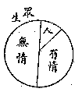
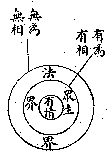

# 二無我論

補特伽羅無我，達摩無我，曰二無我。

補特伽羅，譯數取趣，是「數數取天人畜鬼等趣業報身者」之義。變言之，即流轉三界二十五有之精神個體或靈魂或業識也。凡已捨天、人、畜生、餓鬼、地獄五趣之現報，未定轉取何趣之時，先業力故，集「識上色功能」，化成一種細色根身，任持業識，曰中有身，亦名曰中陰身。以業報未定，故非五趣攝，而是數數取五趣報果者。所謂補特伽羅，於已取或未捨五趣報身時，皆隱沒不現，唯在中有身時，始得指目之耳。審諦言之，中有身亦五蘊和合相續假身，相雖不同，猶之人身與天身不同，其為五取蘊身固無異也。然除中有身則世間所名為靈魂者，益無可指物已。此補特伽羅無我，亦譯人無我，有情無我，眾生無我。人者，有情類之一類；有情類者，眾生類之一類。眾法和合、相續而生者曰眾生，雖無情之個體，若星地金木等亦名為眾生也。有情則專指動物類而言，故眾生較寬於有情，有情較寬於人。

今此補特伽羅無我正印，譯為有情無我。然以言說便故，舉人為有情類或眾生類代表，名「人無我」。或以順古譯故，於有情與眾生二名無所區別，簡稱為「生無我」，亦無不可。

達摩無我，譯法無我。補特伽羅指一切由眾法和合相續生存之「個體物」，法指能集成個體之「單性」；例如四大、五蘊假合為人，人為四大、五蘊眾法所集起之個體，地大乃至識蘊等眾法為集起個體之單性物，故眾生屬假有，法屬實事，此以眾生與法相對而言則然。究之、法者軌持，軌範物理，任持自性，實固實法，假亦假法，聖凡、染淨、有無、色空、事理、心物、性相、體用，盡一切可言可思乃至不可言不可思者，悉得名之為法，故法界較眾生界為深廣，亦較眾生界為幽玄也。

我者、主唯實常之義；主謂主宰，唯謂唯一，實謂實在，常謂常住。常人所謂之我，固無不執為本人之主宰，且執一人唯一，不容有二。執實在故，愛著不捨，順之則樂，違之則苦。執常住故，貪取無厭，得之則喜，失之則憂。然此猶是一切凡愚與生俱生而無不同有之我執，諸邪外則更依此俱生我執而分別計度，於五蘊中或五蘊外，於五蘊之一或五蘊之總，妄執為各各常存實在唯一之主宰，或萬有全體精神常存實在唯一之主宰，此皆所謂補特伽羅之我見我執也。法執之我，或有主唯實常四義，或但「唯實常」之三義，或但「唯實」二義，或但「實常」二義，或但「實」義。要之、人我執必依法我執為本而起，法我執或可不依人我執而自存在，故二乘聖人雖捨人我執，而法我執猶未能斷。人我執為煩惱障本，故由之而煩惱生死，流轉纏縛，不能止息解脫，斷人我執，則生死空而證生空真如。法我執為所知障本，故由之而宇宙心境，冥昧窒礙，不能覺悟圓通，斷法我執，則心境空而證法空真如。

云何知「人無我」？人由五蘊和合相續生存，眾法和合假成，眾法中無一實主宰可得，五蘊法中更無一實主宰可得，法法剎那生滅，雖相續不斷而非常，故人無我。云何知「法無我」？由仗因托緣，眾事集現故；由識心轉變，分別顯現故；依他起故；無自性故；無實用故；無定相故；剎那生滅故；當體空寂故；故法無我。依人無我、法無我門，說為生空真如、法空真如，而真如實不帶數相，非一非多，亦復非空非不空也。故無著大師曰：『二我無即二無我有，二無我有即二我無』。以無我法，故非不空；以真如故非空。真如由無我法而顯，是以非有非空，非非有非非空。離四句，絕百非，強存一句曰：無而有。以無而有，故證此「有」時，必言語道斷，心行處滅。

（見海刊一卷十期）

