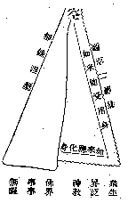

# 大乘之革命

## 目錄

- 一者　革眾生不定聚之命入正定聚
- 二者　革眾生異生之命入大乘聖位
- 三者　革眾生五乘之命入唯一大乘
- 四者　革眾生命入如來位

佛法之於眾生，有因循者，人天乘是；有半因循半革命者，聲聞、緣覺之二乘是；而大乘則唯是革命而非因循。故大乘法，粗觀之，似與世間政教學術諸善法相同；細按之，則大乘法乃經過重重革命，達於革命澈底之後——謂大涅槃，乃建立為法界緣起，以彰事事無礙。其革命之工具，即「二空觀」是也。故摩訶衍論云：『以有如是大方便智，除滅無明，見本法身，自然而有不思議業種種之用』。事事無礙法界，似乎近於吠檀多及黑格爾等之汎神教，但其根本不同之點，即大乘之事事無礙法界，是已經過「二空觀」之澈底革命而離染純淨者。彼汎神教未經過二空教之澈底革命，故非清淨，而祇是眾生之雜染心境。可圖表示之：

般若心云：菩薩依般若——即二空觀——故究竟涅槃；諸佛依般若故得阿耨多羅三藐三菩提——即事事無礙法界——；亦明斯義。此圖曲線表雜染生死法，直線表清淨常住法。生死故、流轉業繫苦海中，旅進旅退，飄泊無歸。常住故、超出苦海流轉——苦海流轉即世間義及生死義——外，隨緣任運，應現自在。而世間雖有種種政治革命、宗教革命、產業革命等，以求之惑業苦中故，無二空觀之澈底革命，故仍墮循環之因。故修學大乘者，必有二空觀之革命精神以貫澈之，不能茍安圖便，妄想從眾生界橫達佛界。從眾生界橫達佛界，則相似佛界之事事無礙，仍等於眾生界之汎神教耳。學華嚴真言者，未經過二空之澈底革命，亦不能達真實之事事無礙界。故華嚴須由理法界觀——即二空觀——經理事無礙法界觀，然後事事無礙。真言亦須以阿——即本空義——字為根本觀也。然大乘革命之進行果如何耶？茲分數章述之。

## 一者　革眾生不定聚之命入正定聚

命者，相續之義。一切眾生無始以來，忽邪忽正，忽大忽小，如猴在樹，似塵在風，轉變相續，種性不定；故大乘有習所成種性位，革除不定聚之相續，令入大乘正定聚中，永不退轉。故摩訶衍論云：依不定聚眾生，由有熏習善根力故，信業果報，能起十善厭生死苦，欲求無上菩提，得值諸佛，親承供養，修行信心，經一萬劫。以信心成就故，諸佛菩薩教令發心，或以大悲故能自發心，或因正法欲滅以護法因緣能自發心；如是信心成就得發心者，入正定聚——聚者、類也，住於大乘正信類中，畢竟不退。此即經過修行十信心位入初發心住位，從此但有前進，更無後退，已革除不定聚之惑命相續故。其修行信心之主要工夫，亦在修習二空真如觀也。見摩訶衍論修行信心分。

## 二者　革眾生異生之命入大乘聖位

眾生無始以來，隨業流轉，於五趣中或人、或天、或畜、或鬼，異類受生，以分別所起我法二執為異生性故。得入大乘正定聚後，則有十住、十行、十向之資糧位，及煖、頂、忍、世第一之加行位。以二空觀伏斷我法二執，經初無數劫滿，由世第一位無間頓斷分別所起我法二執，入真見道通達位，得聖性——由自發願不在此限——已革除異生性之業命相續故。

## 三者　革眾生五乘之命入唯一大乘

眾生無始以來，有世間出世間及有相無相等分別相續。入真見道後，依二空無分別智，於初地、二地修施戒，猶似人天世間之善；三地、四地修定慧及菩提分，猶似二乘出世之善；五地雖會世間出世間真俗兩智之相違，猶見有世間出世間之差別相；六地觀眾生緣起極有相邊際，猶與無相相違，類人天智；七地觀真空無相極功用邊際，猶與有相相違——由無相中有功用故，未能任運現相及土——類二乘智；經二無數劫滿，由第七地入第八地，於純無相觀不假功用故，能任運現相及土故，乃超過人天二乘之觀智，革斷有相無相等分別相違之智命相續，純一大乘法空妙行。

## 四者　革眾生命入如來位

眾生無始以來，捨前異熟取後異熟，有異熟識取得捨壞之苦相續，亦即依此故名眾生——受眾多生死故；離此則名如來，失眾生名；故此相續，即名為眾生命。由第八地純依法空智，歷九地十地至金剛道後，經三無數劫滿，頓斷煩惱障種及所知障種現，異熟識空，大圓無垢同時發故，入如來地，永斷先業所引之異熟報，革斷眾生苦命相續，證大涅槃，成大菩提，乃為不思議善常安樂解脫之事事無礙法界。

世之談革命者，其亦知此最勝之革命乎？盍相率而從事乎此！

（見海刊六卷一期）

