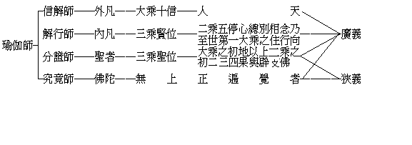
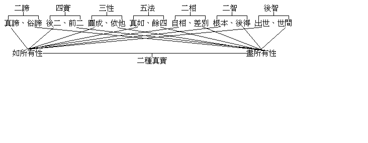
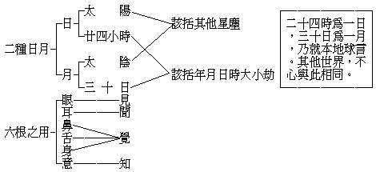
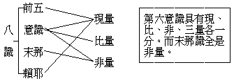
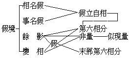
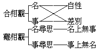
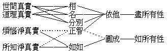

# 瑜伽真實義品講要
（1929 年，在廈門閩南佛學院講）

## 目錄

- 懸論
    - 一　本題之得名
    - 二　本論之名義
    - 三　本論之歷史
    - 四　本論之價值
    - 五　本品之組織
- 釋文
    - 甲一二　種真實
    - 甲二四　種真實
        - 乙一　列名
        - 乙二　廣辨
            - 丙一　世間極成真實
            - 丙二　道理極成真實
            - 丙三　煩惱障淨智所行真實
            - 丙四　所知障淨智所行真實
    - 甲三五　義分別
        - 乙一　所證真實理體無二
        - 乙二　修空勝解成大方便
        - 乙三　入法無我證二智行
        - 乙四　乘無戲論能正修行
        - 乙五　廣明離言自性
            - 丙一　正辨
                - 丁一　立宗旨
                - 丁二　破小乘
                    - 戊一　隨名多體失
                    - 戊二　名前無體失
                    - 戊三　色前有名失
                    - 戊四　結破餘蘊等
                - 丁三　破大乘
                    - 戊一　總標兩種相似大乘
                    - 戊二　別破兩種相似大乘
                    - 戊三　空有執之罪過比較
                    - 戊四　緣起空理有善惡別
            - 丙二　引證
                - 丁一　轉有經證
                - 丁二　義品證
                - 丁三　散地證
            - 丙三　佛起言說意
            - 丙四　愚起八分別
                - 丁一八　分別生三事
                - 丁二　修尋思等了八分別
                    - 戊一　修四尋思觀
                    - 戊二　修四如實智
                - 丁三　愚不了八分別墮流轉
                - 丁四　聖了八分別證大果
                    - 戊一　證斷果
                    - 戊二　得自在果
    - 甲四　總結顯勝


## 懸論

### 　　一　本題之得名

此書標題曰瑜伽師地論菩薩地真實義品，乃為簡略題。若具足言之，則應為瑜伽師地論本地分菩薩地第十五初持瑜伽處真實義品第四。由此，首應知此書為瑜伽師地論中之一品，茲說明之。本論大分為五：一、本地分，二、攝決擇分，三、攝釋分，四、攝異門分，五、攝事分。此品即在本地分中。此本地分中又分為十七地，茲免煩瑣，不一一列名。然此十七地中：前十地屬境，中六地屬行，後二地屬果也。而此菩薩地，即是十七地中之第十五地。在此地中又分為四處：一、初持瑜伽處，共十八品。二、第二持隨法瑜伽處，共四品。三、第三持究竟瑜伽處，共五品。四、第四持次第瑜伽處，共一品。茲所講出者，乃初持瑜伽處中十八品內之第四真實義品也。

### 　　二　本論之名義

「瑜伽」，本一名詞，故不可分開而讀。譯者祇譯其瑜伽之原來梵語，並未曾譯出瑜伽二字在漢文中之為何義，蓋以瑜伽所包涵之意義甚廣博故也。後人有以瑜伽為密宗之專名詞者，甚或視為燄口一書之專名詞者，然瑜伽名義實非如此。密宗與燄口，有身口意三業相應之義，如行者依其所宗之本尊法而修持，得成與本尊感應之效，故曰瑜伽，並非瑜伽為其獨有之名詞也。又如百法明門論中所列相應一法，亦同此瑜伽之本義。然瑜伽固不囿于「相應」一義，已進為貫攝全部佛法之精神也！

譬如「薄伽梵」一名詞，舊譯謂具有德，巧分別諸法，有名聲，能破淫怒癡之四義。新譯則謂具足自在，熾盛，端嚴，名稱，尊貴，吉祥之六義。故譯者不能偏取六義中任何一義而譯出之，只好保存其原有之梵語耳。奘師論五種不翻：一、因祕密故，如諸「陀羅尼咒」。二、因多含故，如「薄伽梵」。三、因此無故，如「閻浮提樹」。四、因順古故，如「阿耨菩提」。此本可翻，但由摩騰以來，即將此原有之梵語流至中國，故後來譯者仍保存之而不翻成華語也。五、因生善故，如「般若」。此若譯為華言則為「智慧」，考智慧一名，實不如般若之尊重，令人生敬，故亦不翻之也。由此可知瑜伽亦是五不翻中因多含故之一種。雖大抵翻此瑜伽為相應之義，實則未能盡明瑜伽之完全意義也。

考「相應」之義，須具二種條件：一、要是兩法，方得相應。二、兩法要有互相隨順不相違性，方得相應。所謂相稱、相當、相符、相契等，亦相應之義也。然則本論中究有何種「相應」之義？考本論中有境、行、果三分，皆有互相相應之義。在境言：境、即是法，而法之內包與外延甚廣，倘此法與彼法互相隨順不相違背，即是境與境相應也。而境與行果，亦有相應之義。在行言：行有聲聞、緣覺、菩薩之三種不同，如在三乘中本乘所起相應之行，即心王、心所是，以心王、心所隨順同緣一境故；而三乘人所修之行，各有相應之義。由修行而入聖，即是行與果相應義。如修行時，以四諦、十二緣起為其所歷之境，即是行與境相應義。在果言：果有多種，略則福與智相應，菩提與涅槃相應。而果與行境亦復相應，以觀境修行而得證果故。

吾儕凡夫，距離成佛甚為遙遠，然能向佛法上進行一步，則將來自有一步之成績可獲！如今之哲學家，亦重在實現其理想中之目的，故吾儕佛徒益應不憚難而苟安。須精進於佛法上，殷勤不懈，以期達到實證妙境，得大受用。然聽聞佛法，閱覽經藏，則僅如賞鑒一幅地圖之形勢與方向而已。倘不按地圖方向而去歷行，則終難達目的地。故吾人修學佛法，不可徒託空言，理應躬行實踐！并不但自求解脫，亦當展轉解脫他人。此在解釋「瑜伽師」一名詞，即可以想見其梗概矣。

所謂究竟「瑜伽師」者，須具足下列五種條件：一、機教相應：觀察聽眾心理，能否與此教相應，須視聽眾之根性——機——如何？如其真能信受奉持此種教法，則為機教相應，乃三慧中之聞慧也。二、教理相應：能詮之名、句、文身為教，其中含有所詮之意義為理。倘吾人依其言教能了解全部精粹微妙深奧之義理，乃三慧中之思慧也。三、理行相應又名解行相應：此則不單求明了教義而已，竿頭更進，既了解已，而又依之而行。換言之：即吾人之起心、動身、發語，一切行為，無不悉以所了悟之教理而實踐之，乃三慧中之修慧也。四、行果相應：常人平日之各種行動上，莫非隨其業報上所有自然之習慣而行動者。然學佛者，則不如是，乃根據佛學上之真理而作自他二利之事，莊嚴福慧，改革疇昔三業不淨之施為。所謂『諸惡莫作，眾善奉行』者。若能如是久而行之，猛勇精進，則將來必獲美滿成績，亦即證究竟瑜伽師之無上果位也。五、果機相應：洎乎自受法樂而獲最上之成效後，照見一切眾生無不具有成佛之可能，故其必以自心所證之真如妙境，開示根性適宜之眾生，亦俾其得聞佛法，即是師資相應之義也。在此五義觀之，即可證實前言，所謂自度度他是也。如是展轉師資相應，循環不休，則將來清淨世界之實現可期矣！

但瑜伽一詞，在印度實非佛教之所獨有，即如六派哲學中亦有所謂瑜伽派，其餘各派亦有用此瑜伽一名者；然其義則與佛教有殊。按瑜伽派主旨言之：則在「梵我合一」。彼以梵為造宇宙萬有之真實性，而吾人亦為其所造者，倘吾人能照見真我，則梵我合一矣。而佛教弟子，沿用瑜伽一名，作為禪定或止觀之代名詞，因瑜伽涵有「理行一致」之義。所謂理行一致者，即是依佛教理而去實行。換言之：即其所修之行，皆與教理相吻合，即是修習三摩地之種種觀行也。然此觀行，既為佛徒之所修習，故浸假而加此佛徒以「瑜伽師」或「觀行師」之名稱矣。而達摩禪師亦云：『行解相應，名之為祖』，是其例也。此就自身而言，有行解相應之師，有財釋也。倘以其行解相應，可展轉為令他人得行解相應之師，則依士釋也。

此上所說之瑜伽師，就廣義言，即謂凡能信解佛之教理而實行者，皆得謂之瑜伽師也。若就狹義言，非由凡夫位熏修佛法，俾其無漏種子日有增長，而至分證位、究竟位，不得名為瑜伽師也。要之、瑜伽師者，能以瑜伽之法為己之師，復以己得之瑜伽法能為開導他人之師者也。茲以廣狹二義之瑜伽師，列表以下———




以瑜伽攝一切法，亦無不可。蓋一切法無不與實性相應，故一切法之實性即是瑜伽。黃檗禪師云：『大唐國裏無禪師，不是無禪是無師』；蓋歎息無不是瑜伽而惜無瑜伽之究竟師也。

「瑜伽師地」者、瑜伽師之地也，此乃依主釋。云何為地？略有二義：一、從人的方面言，有三義：一、所依止，謂凡瑜伽師皆以此論所明之教法為依止而去修行故。二、所遊行，謂瑜伽師初自外凡行至內凡，自凡至聖或自小乘遊至大乘，無不悉以此法而為遊歷故。三、所攝領，即是證到究竟瑜伽師位，其所攝領之法仍不出乎此瑜伽論中所明之教法故。二、從論的方面言，亦有三義：一、能住持，謂本論中能住持一切瑜伽師所有之教法故。二、能生成，謂此論中教法，能生起瑜伽師之解行而成果故。三、能增長，謂能增長瑜伽師之福德智慧，而達無上覺果故。

瑜伽師地論者，論上所明都屬所詮之義理，而論則屬能詮。能詮云何？即是用名句文身組織成有條理有系統有判斷之論文，能說明瑜伽師一切境行果法之真相者也。

### 　　三　本論之歷史

說明萬法真理，本惟釋迦牟尼佛，但亦有在會大眾所說，經佛陀印證而成為教法者。後世如小大性相之異轍，悉淵源於是。蓋當時聽佛說法者之程度不一，因此各人意識上所變之文義相，亦大相逕庭。其後各人復以其心得而展轉傳諸他人，日月綿延，時光遷流，久而久之，則有如斯之分歧矣。當佛說法之時，或有聽法者執筆而記錄之，或以記憶力而保存之。根本一切有部毘奈耶云：『佛在世時，紺目夫人夜讀佛經』；此其明證。迨夫佛陀逝世，阿難、迦葉即開始三藏之結集。在佛滅後五百年間之所研究及修持者，大抵以小乘教義為範圍。云何小乘教義？以三學力析我歸空，其所遺留者僅為五蘊等諸法。達此目的，則能解除個人之束縛而證無我之涅槃。然我之觀念雖空，而其法之計執轉更牢固。在小乘中法執最強烈者，則為一切有部，主張三世法體實有。其所謂法，等於最後單位原子也。析心以至最後單位，亦即是法。並謂智識僅能了知其法，不可改轉或更動其法；此為世尊滅後五百年中最興盛之學說也。既而佛學者對於法之有無問題，生出煩瑣的辨論，如有部之大毘婆沙論等，多知其實非佛陀所說之最終目的，於是爭執不休。有謂現在有體，過未無體；有謂現在法體亦有假實；諸說紛紛，不得解決，迨佛滅後七百年中，龍樹菩薩興世，感於有部學說之不究竟，陷於戲論；遂發揮大乘法空義，盡掃一切執著，蕩滌無遺，絲毫不存，宣說萬法畢竟空之真理。於此可知龍樹之提倡畢竟空，全在打破有部之執為實有也！

佛滅九百年中，北印度犍陀羅國有無著菩薩降生其地，後入佛教，深明大乘教義，位登地上。乃知龍樹為對破有執而說空，實則大乘教義並非全空。中國相傳無著位登初地，證「法光定」；西藏謂其已入三地。按法光定與三地之大乘藏法光明定甚相契，故謂其證入第三發光地，亦未始不合也。其在印度弘宣教理，頗極一時之盛。阿瑜陀國之國王，亦極欽佩，遂以其都城之西隅一地，贈之為其講舍。既知龍樹所提倡之空義未為究竟，為欲安立大乘非空非有中道了義之教，遂請兜率內院彌勒菩薩降現人間，於國王所施之講舍內，說五部論。其中最弘大者，則為此論。當時彌勒說此大論時，無著以筆記之。按佛在世之時，彌勒生於波羅奈國劫波利村，命終上生兜率內院，詳彌勒上生經。兜率天較吾人所住之地球為殊勝之另一世界耳！在常人而觀之，以為彌勒既從天降，甚屬怪異，其實亦何希奇之有？蓋無著既位登地上，延其下生說法，自為可能之事；如認此事終不可信，即謂本論為無著之筆墨，亦未嘗不可也。

此論之翻譯者，先有求那般摩、曇無讖、真諦法師等，第其所譯皆未完具，不過抽出數卷而譯之耳。故未能譯成系統之組織，而說明論中之精奧。惟玄奘大師翻譯之論本，乃臻完美。蓋奘師在印度有十七年，參訪大德、依那爛陀寺之戒賢大德為親教師，而戒賢實是承無著之正統者；奘師又為戒賢大德最有心得之門下，且曾聽講此論三遍，故其所譯，乃較其他所譯者為完美。今所講者，即出奘譯本也。

佛法在龍樹、無著之時，實無空有二宗之分。至清辨、護法之時，始顯然各樹其異幟。昔中國相傳，謂戒賢、智光二人，同時各宗護法、清辨之說，有衝突相反之勢。然此傳說，實不可靠。據大慈恩寺三藏法師傳，則智光確為戒賢之門徒。果如其說，則玄奘乃與智光為同學。且玄奘與智光之往來信札，亦皆用同學之口吻。並有據掌珍論而與玄奘辨駁之某法師，亦為戒賢弟子，玄奘因而作會宗論，以融會其所說。據此而觀，胡得謂戒賢與智光同時各立一宗耶？中國相傳之說，乃產生於賢首大師所作之十二門論宗致義記上。考其說之由來，大抵智光學徒來華，云其親教師與戒賢為並肩爾。

### 　　四　本論之價值

在遣空去有不落二邊顯出中道奧妙之一點，已足彰明本論有最高之價值。再就別義言之：本論有三種特長：一、論中詮明一切世出世法，詳詳盡盡，絲毫不欠。二、論中所明，能被各類根機，若人天善法，若二乘解脫法，若大乘殊勝法，若佛智圓滿之究竟法，莫不組織成極有條理之論文而說明之。三、示諸修大乘者不可躐等。若越階而登，則如今時中國禪宗之流弊，是其龜鑑。且西藏紅衣派興盛發達之時，亦嘗主張頓超法門，而其末流至於猥雜不堪。後經黃衣派之改革，始得免其缺陷。由此可知修學大乘法者，不可不足踏實地、按步進行也。今此論對於由凡夫漸進至佛果之依次修行法門，有圓滿之說明，最為具足全部大乘之思想與精神。故習佛法者，咸應奉之為圭臬，以作超出生死海之指南針也。

真實義品、在本論上之價值尤為重大。考全論五分中之根本，即為本地分。在本地分之十七地中，又以菩薩地為最殊勝；而本品又為說明菩薩無漏智上所觀之真實境界者，由此可知本品之價值也。且在此中含有哲學上之重要問題甚多，如認識論、本體論、宇宙論、進化論之種種哲理，皆有相當之說明。普通哲學家所發明之原理，乃

就其感官之經驗，加以意識推度而得結論。本論之說明者，則憑真智所親證之境界，故普通哲學又難與此真實義同年而語也。

### 　　五　本品之組織

一切諸法，真俗二諦可以攝盡。本品首先詮表二種真實，乃盡力闡明法界之全體大用者也。然吾人欲窮此法界之全體與大用，則不得不藉般若之空慧以照了之；所以本品次以五義分別空慧，以使人獲得由凡入聖之樞紐。然空慧所照者為離言自性；而于此離言自性，若不了知，則為流轉生死之凡夫，如能覺照，則為證大菩提之聖人，故本品再次即廣明離言自性，以為吾人獲得修行之憑依。然欲徹底證此離言自性，則又非短時間所能辦到，必須先修四尋思而後修四如實智，俾漸漸圓滿；故本品在明離言自性中，充分說明之，庶吾人得免躐等之弊。此為本品組織之大綱也。吾人如能按其所言而實行之，則庶乎其趣道有方矣！

## 釋文

### 　　甲一二　種真實

> **云何真實義？謂略有二種：一者、依如所有性諸法真實性；二者、依盡所有性諸法一切性：如是諸法真實性、一切性，應知總名真實義。**

此中分真實義為二種：一、二種真實；二、四種真實。且先就二真實明之。然二真實與四真實之別，大概前二依境得名，後四依智得名。其實境智本不可分，能緣所緣，蓋有密切之關係也。

云何真實義者，乃發問所謂真實義為何如也。真、遮謬偽，實、揀虛妄，義、即境界之謂。境界可別為二種：一、為言所取，二、為心所取。即如本論，以名、句、文身詮表真實義者，為言所取；倘吾人識知領受前境而了解事理者，則為心所取。此即問如何是言所取，或心所取之真實境界也

真實義略有二種，此所謂略，但略其文而不略其義也。其一，則據如所有性而立諸法真實性之名。其二，則據盡所有性而立諸法一切性之名。前者即諸法之真理，後者則為諸法之正量也。如所有性之諸法真實性，非哲學家所謂成立宇宙之最初原素或本體，乃即指一切諸法當下之真實體性。然此境界，絕非言語思考所能形容與推測，若帶有絲毫主觀心上之分別作用，則終不能見此萬法本如之體；倘能離去一切虛妄分別，如其實而照了之，方見其本來面目。故必得根本智之地上菩薩，始能親證真如實相。此智境各有多異名：所謂一切智，無分別智，如理智等，皆根本智之別名；所謂真如、實際、法性、實相、皆如所有性之代名詞也。

盡所有性之諸法正量，亦非常情之所能知。蓋緣起千差萬別之現象，每一法之邊際皆不可思議也。然則究為何如歟？蓋宇宙中之一切萬法，每一法莫不與其他一切法發生攝入之關係。故隨一法大則遍於十方，小則量等芥子。例如色法，統名曰色，而此色中又有顯色、形色之殊；在顯色中，復有青、黃、赤、白之別；在形色中，又有長、短、方、圓之差。然此又與全法界一切法有複雜之關係。故欲明了此一法者，必盡了知一切法而後可也。請進言之：在每一法上，不僅若常人感官上之認識而已，實有五種相：一、自相——法之特殊相。如一粉條，雖與其他粉條，共藏於一粉條盒中；然各粉條，皆各有其自體之相。互不淆亂也。二、共相——法之共同相。謂彼此二法，形態類似。如兩粉條同為粉之質料所製成，而其相狀亦同為長圓形也。三、差別相——法之對待相。一自相上有多共相，一共相中有多自相，類之上又有類焉，別之中又有別焉。四、因相——法之眾緣相。謂每法由多種因緣集合而成者也。如一粉條，由地、水、火、風、色、香、味、觸之能所八種色法，並加人工製造，始得成為粉條也。五、果相——法之成就相。由有人工與水粉等關係圓滿，成為一條條之粉條，即是果相也。

在一法五相上，應知盡一法之量為不易。茲復言其諸法相關之四句，更可見其不可思議也。一、一攝一。一一諸法皆不失其自相也。二、一攝一切。一一諸法莫不與全宇宙發生密切之關係也。三、一切攝一。展轉言之，則全宇宙皆與此一法有關係也。四、一切攝一切。進言之，則宇宙中所有諸法，每一法莫不與其餘諸法有相互之連帶性也。對於此法界緣起之一切法正量，能徹底認識，非證得「根本智」後起「後得智」，不得如量而知也。此後得智復有多名，所謂：一切智智，一切種智，及如量智等，皆其代名詞。然亦得名為無分別智，以其所見諸法，皆超過常人心理上之虛妄分別，而無倒實知也。

了知諸法不出二種：一者、親證，二者、推理。親證則非得根本智不可，推理則是憑比量上所得之結論而已。今之哲學家，對於吾人所處之地球，能知其經歷之時間，及其體量之如何長廣，此猶為依據事實附加推論之觀念。至其能知地球之外，所有多種星宿亦同於此地球，則純憑其理想上之推測，為不盡可恃之判斷也。考其與佛教所有懸殊之點，即其僅推理而不能如實親證；故其所見，仍不越於常識。如於眼睛上為幻翳蒙蔽，或同於戴有顏色之眼鏡，故不能見其物之真相也。倘求窮盡諸法之量，則非效法佛教，先除去其掩蔽目光之幻翳不可。故欲徹底證窮法界，則非求獲後得智不為功！倫記以七門料簡二種真實，茲立一表於下——




### 　　甲二四　種真實

#### 　　　　乙一　列名

> **此真實義品類差別，復有四種：一者、世間極成真實，二者、道理極成真實，三者、煩惱障淨智所行真實，四者、所知障淨智所行真實。**

此乃略舉四真實之名也。茲略言之：一、世間極成真實：極成，為共許之義。謂由世間人之常識上，共同許可此法為此而非為彼；此非出於個人心理上之推想與測度，故為世間共許之真實也。二、道理極成真實：此不唯依世俗之習慣，以論理軌則為標準而建立，如科哲學者研究事物而獲其合理之判斷，故為道理上共許之真實也。三、煩惱障淨智所行真實：此不僅以推理為然，且以三學斷去煩惱障分證真如之實相，故為出世淨智所行真實也。四、所知障淨智所行真實：再進一步并斷去使心不明事理之極微細所知障，以見萬法本如之真實相，故為世出世間淨智所行真實也。此四真實，前二通世俗有，後二則唯佛教有。第一唯是有為有漏；第二通於有為、無為、有漏、無漏。然此約所推理而言，若其能知之心，則唯有漏也。後二所證之理，同於第二，但其能證智為無漏故勝。亦可兼有漏，如未親證實相，亦得由勝解加行智引生本後二智。換言之：後二真實體，不同前二唯以有漏為體，而以無漏境智為體，故通無為及無漏有為也。或後二唯取斷障後所顯之真理而言，則唯無為。略義如是，下當詳述。

#### 　　　　乙二　廣辨

##### 　　　　　　丙一　世間極成真實

> **云何世間極成真實？謂一切世間於彼彼事隨順假立、世俗串習悟入覺慧所見同性，謂地唯是地非是火等。如地如是，水、火、風，色、聲、香、味、觸，飲、食、衣、乘、諸莊嚴具，資產、什物、塗香、華鬘、歌舞、妓樂、種種光明、男女、承事、田園、邸店、宅舍等事，當知亦爾。苦唯是苦非是樂等，樂唯是樂非是苦等。以要言之，此即如此非不如此，是即如是非不如是，決定勝解所行境事；一切世間從其本際展轉傳來想自分別共所成立，不由思惟籌量觀察然後方取，是名世間極成真實。**

世間極成真實之範圍，不僅限於人之世間，實包括其他一切世間。茲就人類言之：人之所以認此法為如此者，皆隨順其事物之相而假立名言也。雖由假想安立，但一般世人自古以來都目為如此，因而在無形中成為不可改轉之固定形勢。如一「茶杯」於此，世人見之無不說為茶杯者，此即所謂悟入覺慧所見同性。意謂人之初生，本來一無所知，不辨彼此，後受其父母言語之訓誨，啟迪其智識；故其自心上對於事物之概念，於一切人無所差異也。反之、倘在同一境內，一人指茶壺為酒杯，則他人必筦爾而笑之，以其與世間習語相違也。由此習慣言語，則世界上有彼此互相通達思想之可能。並用文字代表言語，因此可與遠隔重洋萬里外之人交換意見；又能傳至後世。故一切事物之名，無形中即有共許之條約，同一之認識也。世間法雖無邊，茲按論中舉出者，立表明之——


```
　　　　　　　　　　┌地水火風……………物質之要素───┐
　　　　　　　　　　│　　　　　　　　　　　　　　　　　├物質
　　　　　　　　　　│色聲香味觸…………物質之境象───┘ │
　　　　　　　　　　│　　　　　　　　　　　　　　　　　　 │
　　　　　　　　　　│飲食衣服……………人生必需品───┐ │
　　　　　　　　　　│　　　　　　　　　　　　　　　　　│ ↓
　　　　世間極成真實┤諸莊嚴具……………人間奢侈品　　　├合二
　　　　　　　　　　│　　　　　　　　　　　　　　　　　│ ↑
　　　　　　　　　　│資產什物…………┐　　　　　　　　│ │
　　　　　　　　　　│　　　　　　　　├人群日用品───┘ │
　　　　　　　　　　│塗香宅舍…………┘　　　　　　　　　 │
　　　　　　　　　　│　　　　　　　　　　　　　　　　　　 │
　　　　　　　　　　└苦樂等………………人心之領受────精神
```


法有眾多，但世人之認識同一，故論中謂：地唯是地，非是火等；又謂：此即如此，非不如此。其所以然者，以吾人在過去世——不可指定在何時，即論中所謂本際——受習慣熏習，展轉傳來，故今一見事物，即引起其決定勝解，並不加以思索，一覽便知也。考此真實須具二種條件：一、普遍性，世人同一認識。二、恆常性，前人後人同一認識。反之，則不成為世間真實也。

倫記、景師解曰：若謂世間真實，為佛菩薩用後智照俗，即順其世俗習慣之認識，則何故不同世人計執瓶衣為實有？若同其執，乃成顛倒，何得成其真實耶？曰：佛隨世俗之假名而已，但不同其計執也。成實論云：『世人說有，佛亦說有；世人說無，佛亦說無』：此即佛不與世諍也。藉此可明佛教立此世間真實之意義矣。

##### 　　　　　　丙二　道理極成真實

> **云何道理極成真實？謂諸智者有道理義。諸聰叡者、諸黠慧者、能尋思者、能伺察者、住尋伺地者、具自辯才者、居異生位者、隨觀察行者，依止現、比及至教量，極善思擇決定智所行、所知事，由證成道理所建立、所施設義，是名道理極成真實。**

道理、本一名辭。道者、路也，即彼此相通義。理、條理也，即彼此事物相互之各種關係也。合而言之：謂吾人之心理上，對於事物之條理有共同正確之認識也。此第二真實之重心，建於比量之上，全恃諸智者之推理以為真實。所謂敏捷天才之聰叡者，用功習學之黠慧者，以思考力辨別真理之尋伺者，能文能言之有辯才者，未得真智而是觀行者；此諸智者，于現、比、聖言之三量上，善能思擇，故能于事物上生起決定智而下正確之判斷，建立真實之道理俾使自他得能了解，故謂其為道理極成真實也。此二真實皆不足恃，立表明之——


```
　　　　　　　　┌自明……………不待思索一覽便知┐
　　　　世間真實┤　　　　　　　　　　　　　　　├在一事之自體上
　　　　　　　　└相符……………古今世人都目為此┘
　　　　　　　　┌配合……………從一事各方面考察┐
　　　　道理真實┤　　　　　　　　　　　　　　　├在一事之關係上
　　　　　　　　└效驗……………以合理事應用有效┘
```


初真實既唯依自明、相符之二條件而立，故不決定可靠。蓋世事無常，潮流更迭不休，「俯仰之間，已為陳跡」，故後之所見未必同前，彼之所見未必同此，總有幾分模糊之異點也。第二真實，其重心在比量上，然比量依據現量、聖言量而得成立。雖然，亦有不足恃者。何以故？茲就配合言之：如人假作語言，初則似乎持之有故，言之成理，既而仔細考慮，則知其不稱於理矣。再就效驗言之：理論上縱無缺憾，而必求合於效驗，亦未必盡然，蓋人類之『生也有涯，知也無涯』，『坐井觀天』，安知天之真相也？

##### 　　　　　　丙三　煩惱障淨智所行真實

> **云何煩惱障淨智所行真實？謂一切聲聞、獨覺若無漏智、若能引無漏智、若無漏後得世間智所行境界，是名煩惱障淨智所行真實。由緣此為境，從煩惱障智得清淨，於當來世無障礙住，是故說名煩惱障淨智所行真實。此復云何？謂四聖諦：一、苦聖諦，二、集聖諦，三、滅聖諦，四、道聖諦。即於如是四聖諦義，極善思擇證入現觀，入現觀已如實智生。此諦現觀，聲聞、獨覺能觀唯有諸蘊可得，除諸蘊外我不可得，數習緣生諸行生滅相應慧故，數習異蘊補特伽羅無性見故，發生如是聖諦現觀。**

常人以心不悅喜，心中悶塞為煩惱，而佛法則指精神界中擾害之搗亂份子為煩惱。其數甚多，根本煩惱十種，隨煩惱二十種。自體即障，具染污性，故謂煩惱障也。伏斷此障有多種人：即如聽佛聲音悟道之聲聞，專憑自力觀察緣生之緣覺。見、修、無學三位之獲無漏智者——初證真理為見道，再加功修練為修道，修至圓滿為無學道。能引無漏智者——此亦名解行智，體非無漏，但有相似之真實可得。且通見道之前後：如煖等四加行引生見道，則通見道之前；如在修道位上而仍有煩惱現前，若制伏之引生無漏，則通見道之後。以及生起後得之世間智者，皆得親證真如，以悉是從煩惱範圍裏透出之淨智也。由此於當來之究竟果位，無所障礙焉！

推其所以得無漏智者，因修四聖諦之現觀：一、苦聖諦，謂有情及器界皆有不自由、不平等、不永久、不安甯、可破壞、可遷流之逼迫性。二、集聖諦，又名苦集諦。謂有漏苦果之結成，直接則為身、語、意業之活動力，間接則為擾蔽心身之煩惱無明，由此不息苦輪也。三、滅聖諦，又名苦滅諦。消極方面，滅苦果而得解脫；積極方面，受用無盡妙樂得大自在也。四、道聖諦，亦名苦滅道諦。謂滅苦之道路，或以三學，或以三十七菩提分法為修持，此其必由之道也。

聲聞等人，觀此四諦真理，僅覺有諸蘊存在而無我體，以其數數修習二種觀行故：一、諸法無常觀，即論謂諸行生滅相應慧。二、諸法無我觀，即論謂異蘊補特伽羅無性見。

##### 　　　　　　丙四　所知障淨智所行真實

> **云何所知障淨智所行真實？謂於所知能礙智故名所知障，從所知障得解脫智所行境界，當知是名所知障淨智所行真實。此復云何？謂諸菩薩諸佛世尊入法無我，入已善淨，於一切法離言自性，假說自性，平等平等無分別智所行境界，如是境界為最第一、真如無上所知邊際。齊此，一切正法思擇皆悉退還，不能越度。**

梵音爾燄，此云所知。有解為知見者，彷彿同於能知之心，其實所知乃屬境也。於境上有障，障礙於智，俾其不見真相，乃得此名。此即所知境上之障，依士釋也。細析之有三種要素：一、所知境，二、能知智，三、障礙物——無知無明。因有障礙物介乎二者之中，則薄弱之能知智，於所知境上生起迷執，不了事之真相，以諸法為實有。如求智光周圓，自在無礙——學佛而期證佛果，則非從此障礙內破而出之不為功！一旦達到目的，則如白日撥開烏雲，光照世界，此即所知障淨智所行真實焉！相傳煩惱障迷「理」，所知障迷「事」，其實二障事、理皆迷，不過各有偏重而已。然則獲此真實者究為誰歟？求佛智有成績之登地菩薩，與徹底覺悟真理之佛陀，皆知諸法無我，且不僅知其無有有情生命之實我而已。在見道位初得此二空智，此後入法空已便能善淨，即從見道而修道乃至無學道，在此過程中分分斷障分分證境也。其所證境，不出二種：一、離言自性：言、有顯境、顯義之二。前者為分別與思想之緣慮作用，後者為言語之詮表，離此二種言之自性，曰離言自性。二，假說自性：謂一切之似義似法，皆以假說為自性也。

二種自性與三性等，有二種配合，以表明之——


```
　　　　假說──遍計──後得智──俗諦────無體
　　　　　　　┌依他
　　　　離言─┴圓成──根本智──真諦────有體

　　　　假說──依他──後得智──俗諦──┐
　　　　　　　　　　　　　　　　　　　　　├─有體
　　　　離言──圓成──根本智──真諦──┘
```


此二圖中，一、以假說配遍計，離言配後二。一、以假說配依他，離言配圓成。並可會通，無所枘鑿。在未悟法空以前，則假說為遍計；如其已證法空，則假說為依他也。所謂法空，即證諸法真相，並非另有一空；遍計亦無所去，以本空故，但順乎俗諦，假說為空耳。故知二說並不相悖也。

地上菩薩，於二境界皆作平等觀照。根本智親證離言自性，普遍一味，故為平等。而後得智照了宇宙現象互為緣起，一律如此，故亦為平等也。前者、為如所有性，後者、為盡所有性。證此境界可謂第一，以再無有超過親證實相——真如，了知所知邊際——依他者也。一思惟抉擇，至此皆悉退還而不復生矣，以其已圓滿證得諸法性相也。倘愚者更欲求得高出此種真實之境界，非獨不如其願，卻轉增法執焉！

研究佛學者，不應僅求了解文字而已。今此不過信、解、行、證中之一「解」，似紙上之繪馬，而非實有真馬也。故欲達到實際受用，須實行而求證乃可。佛法原與科哲諸學性質不同，科哲目的，在乎籌謀世界之進步與改良，如於宮室稍稍修葺加以點綴而已。而佛教之目的，則在徹底剷除此種有漏不堪之自然界，而另創成完美之淨妙世界，亦即轉此俗諦世界而成出世間之俗諦世間，如徹底毀破宮室而重建築新舍也。故科哲唯具前二真實，而佛教則全備之。

### 　　甲三五　義分別

#### 　　　　乙一　所證真實理體無二

> **又安立此真實義相，當知即是無二所顯。所言二者，謂有、非有。此中有者，謂所安立假說自性，即是世間長時所執，亦是世間一切分別戲論根本。或謂為色、受、想、行、識，或謂眼、耳、鼻、舌、身、意，或復謂為地、水、火、風，或謂色、聲、香、味、觸、法，或謂為善、不善、無記，或謂生滅，或謂緣生，或謂過去、未來、現在，或謂有為，或謂無為，或謂此世，或謂他世，或謂日月，或復謂為所見、所聞、所覺、所知、所求、所得意隨尋伺，最後乃至或謂涅槃。如是等類，是諸世間共了諸法假說自性，是名為有。言非有者，謂即諸色假說自性乃至涅槃假說自性無事無相，假說所依一切都無，假立言說依彼轉者皆無所有，是名非有。先所說有，今說非有，有及非有二俱遠離，法相所攝真實性事，是名無二。由無二故，說名中道。遠離二邊，亦名無上。佛世尊智於此真實已善清淨，諸菩薩智於此真實學道所顯。**

二真實四真實之所以建立者，由二空觀之所顯也。云何二空？一、為實有，一、為實無；去此二執，名曰二空。云何實有？對於事物上，言語之安立，思想之分別，執為有實體。其實能詮言辭，於事物上發生所詮之假名，實不符於事實，等於代名辭，何嘗有其實體也？然智者達無，而愚者因受無始習慣熏染，則以為有。其執為實者，依論文中，列表如下——


```
　　　　　　┌色──該括一切物質，其數十一種─────物質
　　　　　　│受──近於心理學之感覺────────┐
　　　　五蘊┤想──近於知覺，有想像作用　　　　　　│
　　　　　　│行──該括時、空、思想、行為等　　　　├精神
　　　　　　└識──近於知識，其數八種───────┘
　　　　　　┌眼根──視覺神經┐
　　　　　　│耳根──聽覺神經│
　　　　　　│鼻根──嗅覺神經├淨色根
　　　　六根┤舌根──味覺神經│
　　　　　　│身根──觸覺神經┘
　　　　　　│　　┌外道指為物質，近於心理學之腦髓神經
　　　　　　└意根┤小乘指為過去前念之第六意識
　　　　　　　　　└大乘則謂意識根為第七末那識
　　　　　　┌色────眼┐　　　　　　┌─────────┐
　　　　　　│聲────耳│　　　　　　│法塵範圍甚廣，色香│
　　　　　　│香────鼻│　　　　　　│味觸皆為法。今除五│
　　　　六塵┤味────舌├所緣境　　　│根對象等，故特立一│
　　　　　　│觸────身│　　　　　　│法塵，為意識所緣。│
　　　　　　└法────意┘　　　　　　└─────────┘
　　　　　　┌地──┐　　　　┌固體──堅性
　　　　　　│　　　├物之體質┤
　　　　　　│水──┘　　　　└液體──濕性
　　　　四大┤
　　　　　　│火──┐　　　　┌熱力──暖性
　　　　　　│　　　├物之勢力┤
　　　　　　└風──┘　　　　└動力──動性
　　　　　　┌三性………善、不善、無記
　　　　　　│四相………生、住、異、滅
　　　　諸門┤三世……過去、未來、現在
　　　　　　│有為──（即論中之緣生）
　　　　　　└無為──（即緣闕不生）
　　　　　　┌此世……現世之果報色身及器世間
　　　　二世┤
　　　　　　└他世……過未之報體及其他之星球
```





此外尚有希求，已得，尋伺，乃至涅槃等法。愚者對於如上諸法，終日意隨尋伺分別計執以為實有，乃至涅槃亦執為實，然皆為妄情上之錯覺也。

云何實無？謂斷見者總撥三性為無。主張妄執所取之實體為無雖甚當，以其為遍計故；而謂假說所依之法體為無則不可，以緣生法分明現前故。至云假立言說依彼轉之圓成實性為無，尤屬荒謬，以二諦為佛陀之妙境故。若此惡見，總撥為無，故如來說為可憐愍者！

能除實有、實無之二執，則認識法相所攝之依他起及真實性事之圓成實矣！由遠離有、無二邊，契入中道，故為無上。何以故？對於非空非有之境，唯佛陀始得徹底證知故。至初地菩薩對於非有清淨，對於是有尚未清淨，故謂仍在修學過程也。茲就二執與識之關係，立表明之——


```
　　　　　　┌增益執──是有┐　　┌通六七二識──末那執我、意識尤甚┬─俱生
　　　　二執┤　　　　　　　├遍計┤　　　　　　　　　　　　　　　　└┐
　　　　　　└減損執──非有┘　　└唯通意識─────因被破我執而起─┴分別
```


總之：有此二執，則去聖道也甚遠矣！

#### 　　　　乙二　修空勝解成大方便

> **又即此慧，是諸菩薩能得無上正等菩提廣大方便。何以故？以諸菩薩處於生死，彼彼生中修空勝解，善能成熟一切佛法及諸有情；又能如實了知生死，不於生死以無常等行深心厭離。若諸菩薩不能如實了知生死，則不能於貪、瞋、痴等一切煩惱深心棄捨；不能棄捨諸煩惱故，便雜染心受諸生死；由雜染心受生死故，不能成熟一切佛法及諸有情。若諸菩薩於其生死以無常等行深心厭離，是則速疾入般涅槃；彼若速疾入般涅槃，尚不能成熟一切佛法及諸有情，況能證無上正等菩提？又諸菩薩，由習如是空勝解故，即於涅槃不深怖畏，亦於涅槃不多願樂。若諸菩薩深怖涅槃，即便於彼涅槃資糧不能圓滿；由於涅槃深怖畏故不見涅槃勝利功德，由不見故便於涅槃遠離一切清淨勝解。若諸菩薩於其涅槃多住願樂，是則速疾入般涅槃；彼若速疾入般涅槃，則便不能成熟佛法及諸有情。當知此中若不如實了知生死，即雜染心流轉生死；若於生死深心厭離，即便速疾入般涅槃。若於涅槃深心怖畏，即於能證涅槃資糧不能圓滿；若於涅槃多住願樂，即便速疾入般涅槃。是諸菩薩於證無上正等菩提無大方便。若能如實了知生死，即無染心流轉生死；若於生死不以無常等行深心厭離，即不速疾入般涅槃；若於涅槃不深怖畏，即能圓滿涅槃資糧；雖於涅槃見有微妙勝利功德，而不深願速證涅槃：是諸菩薩於證無上正等菩提有大方便。是大方便，依止最勝空性勝解，是故菩薩修習學道所攝最勝空性勝解，名為能證如來妙智廣大方便。**

照了二空真理之智，可謂重空慧，謂執空之空亦空也。若得此慧，則於求得佛陀位有大方便。其方便云何？一、能於生生世世中，精勤修習勝解空理之「空勝解」，此亦名為離二邊之「中道慧」，又名「摩訶般若」；大般若經詳闡此慧，此中僅略述之而已。然其要義，則謂無般若則不得大菩提；有般若故，方得成熟其佛果及眾生之善根也。二、唯其有般若故，則能如實了知生死緣生無性——其生死根，無非惑業而已。若無般若，則不知生死根源，而其識心中所夾雜之煩惱諸業，亦不能去，所以常游於生死之中也。三、唯其有般若故，則不同小乘視三界如牢獄，生死為怨家，時感人生苦痛，常思脫出苦海，因而不顧群眾，一心求得最後生空涅槃。彼自己尚不求證大果，而況濟人乎？而菩薩則反乎是，不求個人速入涅槃，見一切眾生悉具佛性，所以誓度一切眾生也。四、惟其有般若，固不樂著涅槃，亦不恐懼涅槃。若無般若，則懷有生存競爭之觀念，聽說求佛智者，乃推翻人所生存之自然界，於是乃生恐怖，以為愈修行愈少人生之樂，乃斷絕菩提資糧也。總之、無般若故，不了生死，生四種過：一、流轉生死；二、厭逃生死；三、欣樂涅槃；四、恐懼涅槃。如有般若，則如實了知生死、涅槃，不起四種過失，而不失其修道之廣大方便也。然此方便，乃以最勝空性勝解以為所依，云何最勝空性勝解？遠離空有二邊名空；空後所顯真性名性；此空性為最勝，故名最勝空性；菩薩對此最勝空性有殊勝之了解，故名最勝空性勝解。此乃菩薩修行定慧資糧，得此空慧者，即藉此以作成大菩提之廣大方便也。

#### 　　　　乙三　入法無我證二智行

> **又諸菩薩，由能深入法無我智，於一切法離言自性如實知已，達無少法及少品類可取分別，唯取其事，唯取真如。不作是念：此是唯事，是唯真如，但行於義。**

久修空慧，即能深入法無我智。於一切法上不落名言之現量實境，真能了知。明瞭無一法之少分，可於其上加以測度思慮，此為事相，此為真如，唯應以如實智了如實境云爾。

倫記上有三釋，茲一述之：一、景師云：如能實證依他、圓成，則了知此依、圓外，更無少法可起分別，以遍計本無體也。故後得智唯緣依他，而不分別此為緣生；根本智唯證實相，而不籌度此為真如，惟證離言自性也。二、測師云：西方原有三釋：一、與景師意近。二、謂自證分不作思念唯取其事，見分不作思慮此是唯事，是唯真如，而其但行於義。即自證分行於見分義；見分行於真如等義也。三、約位不同：地前加行俗智唯取其事；至初地唯取真如而為無相也。三、泰師云：於自性分別達無少法可起分別；於義中達無少品類可起分別。

> **如是菩薩行勝義故，於一切法平等平等，以真如慧如實觀察，於一切處具平等見、具平等心、得最勝捨。依止此捨，於諸明處一切善巧勤修習時，雖復遭遇一切劬勞、一切苦難而不退轉，速疾能令身無勞倦、心無勞倦、於諸善巧速能成辦。得大念力，不因善巧而自貢高，亦於他所無有祕吝，於諸善巧心無怯弱，有所堪能，所行無礙，具足堅固鉀鎧加行。是諸菩薩於生死中如如流轉遭大苦難，如是如是於其無上正等菩提堪能增長。如如獲得尊貴殊勝，如是如是於諸有情憍慢漸減。如如證得智慧殊勝，如是如是倍於他所難詰諍訟、諠雜語論，本惑隨惑犯禁現行，能數觀察深心棄捨。如如功德展轉增長，如是如是轉覆自善、不求他知，亦不希求利養恭敬。如是等類，菩薩所有眾多勝利，是菩提分、隨順菩提，皆依彼智。是故一切已得菩提、當得、今得，皆依彼智，除此更無若劣、若勝。**

入法無我，所證二智行相云何？平等觀察一切諸法，親證勝義諦性，無一法非真如，以平等心之根本智與諸法平等相應也。此智與最勝捨相應。然謂初地為歡喜地者，據出觀之後得智上有喜受而得名也。而泰法師乃謂菩薩緣依他俗諦之後得智，既無能所二取，則平等見了俗諦，故亦名勝義，且攝於七真如中也。從根本智所起之後得智，有多種勝用：一、世間一切學術，如工巧學、醫方學、音聲學、論理學等，無不精勤修習。即使遭遇惡劣環境，種種魔難，使其如何不舒適，非常苦悶，亦不稍退其初志；卻有方便，以使身心毫不倦困，而獲精神上之安慰與快樂。故於所學無所阻止，反而速疾成辦也。二、能得永遠不忘之大念力；又不因自善巧而起貢高我慢之心；亦無吝惜而不肯布施之意。因而有勝功能，凡所欲行，皆如順風前進。而其修行猛利，如臨陣之士，身披堅固鉀鎧而禦敵也。三、菩薩得此空慧，雖在生死中如此如此展轉漂泊，受遇刺激，而其修學菩提並無障礙，且能如是如是展轉增長其福慧也。四、因修福慧故得尊貴殊勝之果，而於有情漸脫驕慢乃至全無也。五、滋生智慧故，如其他有情之辨難詰問，互相鬥爭，暴戾恣睢之不軌行動，與無謂之言語，皆背之而不由；至根本煩惱、隨煩惱、犯戒、犯禁及失威儀處，常能提撕反省，而決意捐棄之也。六、生生所行功德，濟人事業，使人不知，以恐他人見其道行高深、恭敬禮拜、贈送諸種受用之具也。

以上六種勝利，乃成大果之成分，即獲菩提之因素。換言之，欲求不悖於道果而增長無漏功德，須藉空智為修行之方便也。求大菩提，雖有已得、今得、未得之殊，皆依法無我智而實現其目標則一，更無劣於此智或勝於此智而證得者。劣於此智者，則果尚未圓滿；勝於此智者，則實無智果出在究竟佛果之上也。

#### 　　　　乙四　乘無戲論能正修行

> **又諸菩薩乘御如是無戲論理，獲得如是眾多勝利，為自成熟諸佛法故，為成熟他三乘法故，修行正行。彼於如是修正行時，於自身財遠離貪愛，於諸眾生學離貪愛能捨身財，唯為利益諸眾生故。又能防護、極善防護，由身語等修學律儀，性不樂惡，性極賢善。又能忍他一切侵惱，於行惡者能學堪忍，性薄瞋忿，不侵惱他。又能勤修一切明處令其善巧，為斷眾生一切疑難，為惠眾生諸饒益事，為自攝受一切智因。又能於內安住其心令心善定，於心安住常勤修學，為淨修治四種梵住，為能遊戲五種神通，為能成立利眾生事，為欲除遣精勤修學一切善巧所生勞倦。又性黠慧成極真智，為極真智常勤修學，為自當來般涅槃故修習大乘。又諸菩薩即於如是修正行時，於具功德諸有情所，常樂現前供養恭敬。於具過失諸有情所，常樂現前發起最勝悲心愍心，隨能隨力令彼除斷所有過失。於己有怨諸有情所，常起慈心，隨能隨力、無諂無誑作彼種種利益安樂，令彼怨者意樂、加行所有過失及怨嫌心自然除斷。於己有恩諸有情所，善知恩故若等若增現前酬報，隨能隨力如法令其意望滿足；雖無力能，彼若求請，即於彼彼所作事業，示現殷重精勤營務，終不頓止彼所悕求，云何令彼知我無力非無欲樂。如是等類，當知名為菩薩乘御無戲論理，依極真智修正加行。**

得證法無我智，不僅有如上文之美德，因自利、利他故，尚行六波羅密多：一、布施，對於自己金、銀、什物而不貪愛；並以力助他人，使其歡喜布施，廣種福田。唯以利人為前提，凡自身之金錢、知識，莫不布施於人也。二、持戒，對於佛制之律儀，極善防護，嚴守無犯。凡所發之身、口、意業，均合律儀原則，性不粗暴而成優良之習慣也。三、忍辱，自行大忍，瞋心極薄，並不侵損於人。於作惡者之鼓煽，魔怨之攪亂，能以忍辱自勉也。四、精進，勤學五明，作自利利他之本——習因明、內明、聲明，可斷有情之疑網；學工巧明、醫方明，可以饒益眾生也。五、禪定，專心禪定，雖亦以四梵住——四靜慮——為基本，但不耽著禪味。其目的在引發神通，藉禪定力以作利生事業而不致怠惰也。六、智慧，此智蓋由禪定引生，可別為二種：一、根本智，親證真如實相。二、後得智，菩薩得此智慧，抉擇事理，深明互為緣起之理，故利世心愈重。修此智時，勤作四種功德：一、于有德學之長老，常生恭敬而供養之。二、見有不義之徒，放浪之士，造作惡事，違背公意，則生大愍心，至其人前，隨自能力勸導之，使其速能除過也。三、於有怨者，不巧言欺騙，造作與其有益之事，令其不起瞋恨，而去其怨嫌之心也。四、於有恩者，知恩而報。或報之以等；或報之以增。然皆隨自己可能之力，使其身心得以快適。倘自力微薄，不能滿其所欲，應於其前，表示誠懇殷切而欲為其所欲希為之事，並不頓止其所悕求。如事實上終不能達到目的，亦用善巧方法，使其知我非不欲相報，無奈力量之不如耳。

以上，皆為習大乘者、明了法無我之原理，始能修習如是之正行也。

#### 　　　　乙五　廣明離言自性

##### 　　　　　　丙一　正辨

###### 　　　　　　　　丁一　立宗旨

> **以何道理應知諸法離言自性？謂一切法假立自相，或說為色，或說為受，如前廣說乃至涅槃，當知一切唯假建立非有自性，亦非離彼別有自性是言所行、是言境界。如是諸法非有自性如言所說，亦非一切都無所有。如是非有亦非一切都無所有，云何而有？謂離增益實無妄執，及離損減實有妄執，如是而有：即是諸法勝義自性，當知唯是無分別智所行境界。**

試問：依據何種理由，而證明一切法有離言自性耶？曰：如上文所說之受、想、行、識、乃至涅槃等法，都無自性，以皆隨名言而假立故。其名言又不外根據知識而建立，知識大別為三種：一、至教量，此據聖言而為正碻知識。二、比量，此據已知而推知未知，即以已知而定未知之標準。三、現量，由於親證事實而為知識。此三皆為正碻之知識，與此三種相反，即是非量之不正碻的知識也。茲以八識與三量之關係，立表明之——




在散心位，前五識與第六意識定有現量，何則？若無現量，則必不能成其知識。然其現量極為薄弱，不能自知其親證性境也。第六意識在定心中亦有現量，但現量正當現前時，尚未及稍加以注意，知現量境已逝矣。現量境名性境，如第八識以其所變之山、河、大地——純粹事實——而緣之，亦為現量。至前六識雖皆不能緣賴耶所變之一切法，如眼識唯緣色塵、乃至意識唯緣法塵，但其各託第八識所變之相分為本質，而於自心上所變之影像相分恰與第八識所變者相同無異，故亦為性境。然此現量有不可捉摸之形勢，洎乎意識上起分別作用，則現量已成前一念之過去境，唯遺留一個單獨的影子存於意識而已；此即所謂獨影境也。吾人對於宇宙中之現象，謂其為日、月、星、辰、山、川、樹、木、田、地、屋、舍等者，即所謂諸法以假說為自性者，此在獨影境前、現量境後，中間有一境名似帶質境。因此時意識上所變之相分，尚帶有現量境之少分，但已有多分增益或損減，改變其原來之狀態。認之為實，則皆為非量也。

茲立二表以明假實之境——




前三假，唯意識所行，無有體用，但是假立而已。相名假即有質獨影。如妄心上之現真如等是。事名假者，如歷史上本無此事，而吾人乃偽造此事告之於人，於是彼此流傳，他人遂託此言而變無質獨影境也。餘影假者，在現量境後，猶帶有餘影，雖尚未落名言，然易訛為實境，故名似帶質境。變相假者，如第七取第八見分為我，而與第八原態相異，故名真帶質境。第六意識亦能變緣前五與第七，故亦通真帶質境也。


```
　　　　　　┌準事實──前六識現量相分
　　　　　　│
　　　　　　│事　實──諸識及第八相分
　　　　實境┤
　　　　　　│事實相┐　　　　┌後得智
　　　　　　│　　　├─聖智境┤
　　　　　　└事實性┘　　　　└根本智
```


前二種為凡夫之心境；後二種為聖智之境界。準事實者，現量離言，凡夫雖有而不覺了；然前六識託第八相分所變之影像，與本質相當，故謂之準事實也。如其轉凡成聖，則根本智證事實性，後得智了事實相焉。在二表中，雖有真假之別，然凡夫在事物上安立名言，皆假施設也。

至三乘證真如後，於後得智上生起言說作用，以顯妙境，使人了解，亦假立也。故知說一切法皆非有自性，唯依名言之施設焉耳。但亦非離彼諸法而別有自性，可為言語之所詮表。換言之，言語乃在諸法上闡明其義，但不即應認言語所詮義以為真實。例如一真法界，本為聖境，然不可以言說安立；以其為離言自性也。宇宙現象，何獨不然？由此可知諸法非有、非非有也。

然則以何而定觀一切法之標準乎？曰：如於緣生諸法之假立名言上，執為實有，此為於實無法上之增益執。如末那緣第八見分為我；第八見分本為有體，但末那執之以為我，則為非量，亦是於無計有也。如於緣生諸法之實性實相上——如宇宙真理及世間現象——總撥為空，此為於有中生無之見，故為損減執也。倘離增減二執，如實了知性相，則正為勝智所行之中道妙境也。

倫記上對於此段論文，有諸家之解釋，茲擇其要者而述之：離言自性，即無其相，然則從何而知其為離言歟？一、景師曰：佛陀親證離言智，故知法本無可言說，但非全無離言之真俗二諦。而愚者迷於二諦不知法本離言，故佛陀善為開示之也。難曰：諸法本不離言，若謂法性本無，則言性亦空？答曰：言所詮法雖不有，但非無有離言法性也。難曰：言詮之法尚無，況離言乎？答曰：凡言所行，皆屬遍計，有所增益故；若離言語，即是諸法本性，故不空也。

二、泰師曰：薩婆多說眼見青、黃、紅、白之色，乃至意識所緣涅槃之法，凡言所說者必稱於所見與所緣。而大乘則謂六識緣慮色等是證量知，境界稱其行解為證依他性境，但能證所證俱不可言說也。言說生起，乃在眼等識緣境後、意識上所起之分別作用而始有之。有部說一切皆有，勝論說在法體外尚有大有存在，由大有故一切法有也，然此皆言說自性。而大乘排斥有部法有實性；亦斥勝論離法而有自性，而主張去此增益執也。

三、基師曰：若謂法假建立無有自性，亦容商榷。如執所詮之法體為實，則可說為無；如謂名不稱境，則境豈非空矣？至謂名與所詮雖不相稱，但在能詮名中有彼色等體和合而與名言相稱，亦為不可，在事實上不見法外有和合性為言之所行也。如說名在法體上有，為言所行，則屬遍計執，故不可執為色與名合，為言所行也。

四、測師云：非離宇宙現象外另有實體為言所行，故依他、勝義為有，遍計為無也。——蓋遍計是依他上之所增益，不可為有；而勝義是依他上之所顯示，故不可為無也。——如于依他上離此實無、實有之二執，則為人、法二空之妙境，而是無分別智之所行也。錄此諸師之釋文，以闡離言自性之中道義，則使人更為明瞭焉。

###### 　　　　　　　　丁二　破小乘

###### 　　　　　　　　　　戊一　隨名多體失

> **若於諸法諸事隨起言說，即於彼法彼事有自性者，如是一法一事應有眾多自性。何以故？以於一法一事、制立眾多假說而詮表故。亦非眾多假說詮表決定可得，謂隨一假說於彼法彼事、有體、有分、有其自性非餘假說；是故一切假說若具不具，於一切法、於一切事，皆非有體、有分、有其自性。**

大乘所立宗旨，與小乘有乖諍者，彼乃主張言語中所詮之諸法諸事——諸法、諸事義本相通，然可假別為二：即以五官所感覺之色等五塵為諸事，而以聽聞經典上所說之涅槃等為諸法——，即在言語中有諸法諸事之體性。如說水、火、在言語中即有水、火體性，即謂事物隨逐乎言語也。而大乘則謂名言所詮義，乃事物之假立相，故名言中並無事物之體性。如主張名言中有諸法體性，則一法應有多體，蓋於一法上可立眾多之假說名言而表顯之也。譬如一人，初生立乳名，成人立大諱，入社會團體又有其團體中之名，做官又有官號，行惡又有謗稱，行善又有賢名，可得謂其凡有一名，即有一人之體乎？小乘轉救曰：名多而體亦多，有何過咎？大乘謂為不然，在事實上，並非一法體上、因有眾多之名即有眾多之體。不然，則應於此事之一假名中，別有其事物之自體與自量，而非此事其餘假名中所有之體量；或於此事之餘假名中所有之體量，而非此事之一假名中之體量。換言之：即應一事之多名中，各具有一整個之體量也。例如眼、目、原為一事，倘假名必稱法體，則眼名中法之全體，應非目名中法之全體；目名中之法體，應非眼名中之法體；然於事實為不可能，未嘗於一法之多名中各別有其體性焉。進而言之，不獨一法上具有多名者不得法性，即一法上不具多名，唯有一名，亦不能得法之自性，以一名多名之不得法體，其理同也。

###### 　　　　　　　　　　戊二　名前無體失

> **又如前說色等諸法，若隨假說有自性者，要先有事然後隨欲制立假說，先未制立彼假說時，彼法彼事應無自性。若無自性，無事制立假說詮表，不應道理。假說詮表既無所有，彼法彼事隨其假說而有自性，不應道理。**

倘小乘固執諸法悉隨假說而有自性，則不應道理。何則？世間諸事皆先有其法體存在，而後由吾人五識了別之，始得於意識上分別其為筆、硯、桌、椅等，亦即先有法體後有名也。當法體未經吾人感覺，或上古宇宙初成之際，法體雖有，尚無其名，是則法體亦應烏有，以計體隨名而有故。諸法既然原來無體，後乃依之安立名稱，尤不契於正理。名與法體既不相稱，又安得謂法、事，隨假說而有體哉！

倫記中景師之釋文，頗同于此，然多一節之假設問答，茲一述之。問曰：大乘謂每一識體念念皆具見、相二分，而一法上既具多名，則意識亦可仗其變起多種相分，故名多體多無有過也。答曰：小乘主張凡物皆可言說，承認諸法隨名詮召，乃據本質而言，非據相分以說。且小乘謂相分攝於能緣，故不致就相分而隨名多體也。

###### 　　　　　　　　　　戊三　色前有名失

> **又若諸色未立假說詮表已前，先有色性，後依色性制立假說攝取色者，是則離色假說詮表，於色想法、於色想事應起色覺，而實不起。**

倘小乘轉救曰：一切諸法，在其未立假說名義以前，已有其名義存在；但非至後來為吾人所感覺後，經歷意識之尋伺，不得取其原有之名義置諸言說中，亦即非以本有之名義攝受法體，不能彰其體也。答曰：果如此說，則應離色法等假說詮表，應即可生此是色法等之知覺，而事實上何不然乎？例如初生之兒童，僅覺外塵之冷暖，並不生冷暖名義之知覺，由此可知法體並不與其名義同時存在焉。

###### 　　　　　　　　　　戊四　結破餘蘊等

> **由此因緣，由此道理，當知諸法離言自性。如說其色，如是受等如前所說，乃至涅槃，應知亦爾。**

由以上種種因緣與道理，應知一切諸法皆是離言自性，倘一落語言，則即非真實矣。

###### 　　　　　　　　丁三　破大乘

###### 　　　　　　　　　　戊一　總標兩種相似大乘

> **有二種人，於佛所說法毘柰耶俱為失壞：一者、於色等法、於色等事，謂有假說自性自相，於實無事起增益執。二者、於假說相處、於假說相依離言自性勝義法性，謂一切種皆無所有，於實有事起損減執。**

在大乘中亦有兩種相似大乘人，以不明佛法真義故名其為相似大乘。而對於佛說之經、論教法及毘尼之律儀，皆為其所失壞，此即不特無益而反有損也。一、對于色等法假說自性上，即是有質、無質之獨影境上而增益之，謂其有實體也。二、對於假說相處——如言論生起，非無端倪，必有其所依之事實，此即假說相所依處之依他起性也。及假說相依——此即事實相之所依，乃離言真如也。彼於此二者而損減之，撥為全空也。一為無中生有，一為有中撥無，皆妄心上之計執焉。

###### 　　　　　　　　　　戊二　別破兩種相似大乘

> **於實無事起增益執妄立法者所有過失，已具如前顯了開示，於色等法實無事中起增益執有過失故，於佛所說法毘奈耶甚為失壞。於色等法實有唯事起損減執壞諸法者所有過失，由是過失於佛所說法毘柰耶甚為失壞，我今當說。謂若於彼色等諸法實有唯事起損減執，即無真實亦無虛假，如是二種皆不應理。譬如要有色等諸蘊，方有假立補特伽羅，非無實事而有假立補特伽羅；如是要有色等諸法實有唯事，方可得有色等諸法假說所表，非無唯事而有色等假說所表。若唯有假無有實事，既無依處，假亦無有，是則名為壞諸法者。**

關於增益執，已在上文小乘中同被破矣，而損減執尤乖佛理，茲據理破斥之。倘謂世間無有真實，則虛假法亦無，假法必依真事而建立故。例如補特伽羅——通常云我——雖是假法，然必有其所依之五蘊法而得建立，若無諸蘊和合相續似一之相，愚者從何執為有實我耶？倘謂諸法唯假而無真實，既無所依之真實法體，則假法又何從而有哉？在小乘六宗中諸法但名宗，亦近於此種空執，彼宗蓋謂諸法唯有其名而無實體者也。

> **如有一類聞說難解大乘相應、空性相應未極顯了密意趣義甚深經典，不能如實解所說義，起不如理虛妄分別；由不巧便所引尋思，起如是見、立如是論：一切唯假是為真實，若作是觀名為正觀。彼於虛假所依處所實有唯事撥為非有，是則一切虛假皆無，何當得有一切唯假是為真實？由此道理，彼於真實乃以虛假二種俱謗都無所有；由謗真實及虛假故，當知是名最極無者。如是無者，一切有智同梵行者，不應共語，不應共住。如是無者，能自敗壞，亦壞世間隨彼見者。**

溯相似大乘所以有其空執者，蓋因聽聞大乘空性相應之摩訶般若經等，對於其中佛陀密意所說之空義以起誤解，不能善巧方便研精其義，故不知依他、圓成為有，遍計本空；於是臆測妄度，而謂萬法皆假，乃主張觀一切唯假方為正觀。其實、彼極荒謬，既將假法依處之依他、圓成皆抹煞，又何得有其假法？是則真實、虛假俱謗矣。如此之人，成大邪見，害人不淺，故修梵行者，不應與之同修學、共言語也。若不爾者，則必中其毒計，受大影響，迷乎事理而起謬說也。

於此應詰之曰：汝說世界中都無有實事真理，此種論斷為合理乎？抑背理乎？若是合理，則汝所謂世間無真理之言為可恃，而世間已有真理矣，豈不與汝說世間無真理之言相悖逆乎？若不合理，則汝說世間無真理之言為不足恃，而世間固非不有真理也。觀汝所說，進退維谷，故不如棄其空執之為愈焉。

###### 　　　　　　　　　　戊三　空有執之罪過比較

> **世尊依彼密意說言：『寧如一類起我見者，不如一類惡取空者』。何以故？起我見者唯於所知境界迷惑，不謗一切所知境界，不由此因墮諸惡趣；於他求法求苦解脫不為虛誑不作稽留，於法於諦亦能建立，於諸學處不生慢緩。惡取空者，亦於所知境界迷惑，亦謗一切所知境界，由此因故墮諸惡趣；於他求法求苦解脫能為虛誑亦作稽留，於法於諦不能建立，於諸學處極生慢緩。如是損減實有事者，於佛所說法毘柰耶甚為失壞。**

上二種人，一為執有，一為執空，較量其罪，究為誰重？佛陀意指空執之罪尤重，故曾密意而說：『寧起我見，勿起空見』。以空執罪重，有執較輕也。然佛經中有處謂執無過輕，而執有過重者，蓋無順乎真理，而有則違乎法性之故也。而此處就其感果方面言，故與餘處不相衝突。茲將其罪，比較言之：一、起我見者，僅不明了事物之真相，而不毀謗因果撥一切無成大邪見，故無空見者之種種過失。二、空見對於依他、圓成，起損減執，謗無涅槃等法，因此墮於惡趣；我見既不撥無，亦不招此惡報。三、惡取空者必墮於三途，而我見者則不如是。或由他緣助其感果，非我見也。四、我見之人，未敢妄言撥無因果，阻人求修佛法；而空見者則不然也。五、我見對於有情求脫苦縛，亦不稽留而止停之，使其不能前進；而空見者，謂無聖道可期，唐捐功德，故阻塞其行也。六、空見於四諦等法，必一筆勾消；我見者不妨建立之，故亦勤修定慧，不若空見之棄除一切法門也。總之、我見只於所知境上迷惑為我，空見全備上列六失，而佛陀之至教亦為其失盡矣！

###### 　　　　　　　　　　戊四　緣起空理有善惡別

> **云何名為惡取空者？謂有沙門或婆羅門，由彼故空亦不信受，於此而空亦不信受，如是名為惡取空者。何以故？由彼故空彼實是無，於此而空此實是有，由此道理可說為空。若說一切都無所有，何處、何者、何故名空？亦不應言由此於此即說為空，是故名為惡取空者。**

須知於空性有善取、惡取之別。所謂惡取空者，或沙門——不獨為佛徒，出家於異道而修梵行者，亦曰沙門；或婆羅門——曾受教育之有知識份子，于佛說之空，由彼名言遍計本空故空，而不信受，或於佛說之離言依他為似有，而無遍計故空，亦不信受，此為大邪見者。何以故？於妄心上安立名言，謂為實我實法，觀彼本空固合於理；至於除遣妄想，顯現依他、圓成本來似有、真有之相，則不可謂為空也。換言之，佛所謂空者，本有之法並不空去，不過空去本空之遍計執而已。若說一切皆空，則違三量，亦背佛言。彼謂依他、圓成上無遍計故空，遍計本來為空故空，非謂一切全無也。

> **云何復名善取空者？謂由於此彼無所有，即由彼故正觀為空；復由於此餘實是有，即由餘故如實知有，如是名為悟入空性如實無倒。謂於如前所說一切色等想事，所說色等假說性法都無所有，是故於此色等想事，由彼色等假說性法說之為空。於此一切色等想事何者為餘？謂即色等假說所依。如是二種皆如實知，謂於此中實有唯事，於唯事中亦有唯假，不於實無起增益執，不於實有起損減執，不增不減、不取不捨，如實了知如實真如離言自性，如是名為善取空者，於空法性能以正慧玅善通達。如是隨順證成道理，應知諸法離言自性。**

所謂善取空者，謂於依他、圓成本有之法認識清楚，了知無遍計於其上，故為空也。即知除遍計外，餘依他、圓成不空也，此為善取空理。不特此也，並知遍計中有依、圓為其所依故，而在依、圓上亦得隨遍計安立假名，即在事中亦有遍計也。如此不增不減、不妄取、不錯覺，如實而知離言自性，並以善巧方法而修證之，此則乃為善取空理也。

##### 　　　　　　丙二　引證

###### 　　　　　　　　丁一　轉有經證

> **復由至教應知諸法離言自性，如佛世尊轉有經中，為顯此義而說頌曰：『以彼彼諸名，詮彼彼諸法，此中無有彼，是諸法法性』。云何此頌顯如是義？謂於色等想法建立色等法名，即以如是色等法名詮表，隨說色等想法，或說為色、或說為受、或說為想，廣說乃至說為涅槃。於此一切色等想法，色等自性都無所有，亦無有餘色等性法；而於其中色等想法離言義性真實是有，當知即是勝義自性，亦是法性。**

關於離言自性，此上已就理言之矣。然猶憚人不能深信，故復以聖言量證之。轉有經曰：『以彼彼諸名，詮彼彼諸法，此中無有彼，是諸法法性』。一釋此經之義，即可知矣。以彼彼諸名者，謂于色等諸法上而想像之，立出色等諸法之各別名稱也。詮彼彼諸法者，即以所立之各別名稱，安立於色等之上，謂其為色、為受等也。此中無有彼者，謂色等法上所立之假名中，實無色等諸法自性也。是諸法法性者，謂由心中所想像之色等假名中雖無其自性，而亦實有其離言自性，所謂諸法本來面目之依他、圓成性也。此即諸法法性，而為勝智所得緣焉！

###### 　　　　　　　　丁二　義品證

> **又佛世尊義品中說：『世間諸世俗，牟尼皆不著，無著孰能取？見聞而不愛』。云何此頌顯如是義？謂於世間色等想事所有色等種種假說，名諸世俗。如彼假說於此想事有其自性，如是世俗牟尼不著。何以故？以無增益、損減見故，無有現前顛倒見故，由此道理名為不著。如是無著，誰復能取？由無見故，於事不取增益、損減。於所知境能正觀察故名為見，聽聞所知境界言說故名為聞。依此見聞貪愛不生，亦不增長，唯於彼緣畢竟斷滅，安住上捨，故名不愛。**

義品亦為佛說，有謂為大乘阿毘達磨經中之一品，有謂為轉有經中之一品，然此二說皆無可稽。蓋以此二部經典，均未流行于中國也。其中有『世間諸世俗，牟尼皆不著，無著孰能取，見聞而不愛』之一頌，亦顯離言之旨。世間諸世俗者，謂世人于色等法上，隨心妄想安立種種名稱，而謂此假名中實有法性，此即俗人之見解也。牟尼皆不著者，謂佛陀已去增減執之顛倒，不顛倒故不著世俗之見解，而特闡如來之真風也。無著孰能取者，乃為試問：佛陀不著之境界，從何而得了知也？見而不愛者，謂佛之境界，或由於諸法能起正觀察之正見，或由於能聽受他人所說之正理；由有此正見正聞，故能了知離言法性，而不愛世俗之心境也。

###### 　　　　　　　　丁三　散地證

> **又佛世尊為彼散他迦多衍那作如是說：『散他比丘！不依於地而修靜慮，不依於水、不依於火、不依於風、不依空處、不依識處、不依無所有處、不依非想非非想處、不依此世他世、不依日月光輪、不依見聞覺知、不依所求所得、不依意隨尋伺、不依一切而修靜慮。云何修習靜慮？比丘不依於地而修靜慮，廣說乃至不依一切而修靜慮。散他比丘！或有於地除遣地想，或有於水除遣水想，廣說乃至或於一切除一切想。如是修習靜慮比丘，不依於地而修靜慮，廣說乃至不依一切而修靜慮。如是修習靜慮比丘，為因陀羅、為伊舍那、為諸世主并諸天眾遙為作禮而讚頌曰：「敬禮吉祥士！敬禮士中尊！我今不知汝，依何修靜慮」』。云何此經顯如是義？謂於一切地等想事——諸地等名施設假立名地等想，即此諸想於彼所有色等想事或起增益、或起損減。若於彼事起能增益有體自性執名增益想，起能損減唯事勝義執名損減想，彼於此想能正除遣——能斷能捨故名除遣。如是等類無量聖言，名為至教。由此如來最勝至教，應知諸法離言自性。**

考迦多衍那一名，印度人往往用之；茲以散他（有本作散地）二字別之，以表明非為其餘之迦多衍那，而為佛之弟子，名散他迦多衍那也。佛嘗謂散他曰：散他比丘！當知修最上乘禪者，不同諸餘修梵行者，依于地、水、火、風之四大；亦不依於空無邊處，乃至非想非非想處之四空；亦不依于所希求者，所得到者，及意識所尋求伺察之事而修靜慮。然則究以何法而修靜慮歟？佛說：散他比丘！謂於四大、四空等一切實有唯事中，除遣地、水、火、風乃至一切之假名想而修靜慮。倘其能如此修行者，則大梵天等必來其前而讚之曰：『敬禮吉祥士，敬禮士中尊，我今不知汝，依何修靜慮』。意謂所皈敬之靜慮師，竟不知其修何靜慮也！

在此文中，可以測度天帝釋等之如何心理。其所以來此修靜慮者前而皈投者，蓋通常習禪，則必專注一境，而不舍除地等之想像；今此修定者，雖亦不離地等，但其心光孤逈，寸絲不掛，更無地等假說之分別想。所以有他心通之天眾，皆茫然不知其所以，而來其前特別請問之也！

云何得知佛為散他所言，即是闡發此離言自性之理歟？請申述之：此習定者，于心中搆造之假想，及假想於地等上假立之名言，一概不留，亦不許離心而有諸法之獨立存在，此即除去增益執也。而於遍計執外之依他、圓成，亦不撥之為無，此即除去損減執也。離此二種計執，本其自在性之純粹事實而照了之，毫不加以推計，故能得契萬法真相，而為諸天禮敬也。

以上所引典籍，皆為至教量；然闡此離言自性之至教，不勝枚舉。即在此中，亦可窺見一斑。倘于此等平等心中流出之至教而深察之，安得不信依他、圓成之勝義為離言邪？

##### 　　　　　　丙三　佛起言說意

> **問：若如是者，何因緣故於一切法離言自性而起言說？答：若不起言說，則不能為他說一切法離言自性，他亦不能聞如是義；若無有聞，則不能知此一切法離言自性。為欲令他聞知諸法離言自性，是故於此離言自性而起言說。**

諸法既然本為離言自性，而佛陀乃徹底覺悟之人，何故於諸法上復安立種種名稱耶？其所說者，是否與諸法相稱？如其相稱，則諸法非是離言自性；如不相稱，則其說法即無若何利益。答曰：倫記中謂佛說法，略有四種因緣：一、諸佛所證本不可說，乃是方便權說。二、因為不起言說，則他不得而聽聞。三、他不聞故，則不得而了知。四、欲令他知，故起言說。按此而觀，佛陀說法，乃從悲心上不得已而說。因不起言說，則眾生不知真理本為離言自性，故方便權巧而說，俾眾生切實修證，或以比量推知此離言自性也。

要知佛說無量法門，不過作眾生超越苦海之舟航而已，登彼岸後不須再存留焉。又如醫師開方，本為治病，疾既痊癒，何須藥為？故大乘所建立之離言自性，亦在被遣之中；若不除遣；亦與法執無異！故經云：『如來說法四十九年，未說一字』。意謂佛雖終日說法，而所說者皆此未嘗說之離言性也。此所謂性相雙彰、空有不二之中道歟！

##### 　　　　　　丙四　愚起八分別

###### 　　　　　　　　丁一八　分別生三事

> **又諸愚夫，由於如是所顯真如不了知故，從是因緣八分別轉，能生三事，能起有情世間及器世間。**

大乘離言自性，非一般全愚之凡夫，及半愚之二乘所能了知——凡夫全昧我法，二乘只知人空不了法空，故有全愚半愚之稱——以其不了知故，乃從八分別生三事。八分別者，識也。謂識與二障俱，迷於事理；由此薰成種子而能變成三事。所謂「所依緣事」，「見我慢事」，「貪瞋癡事」。然此非指名言為體，乃緣生諸法也。即通常所謂迷於實事真理，為境所轉而妄想繁出，因而造成污濁世界者也。

> **云何名為八種分別？一者、自性分別，二者、差別分別，三者、總執分別，四者、我分別，五者、我所分別，六者、愛分別，七者、非愛分別，八者、彼俱相違分別。**

此處僅列出八種分別之名，其釋在後，故亦不多述。

> **云何如是八種分別能生三事？謂若自性分別、若差別分別、若總執分別，此三分別能生分別戲論所依、分別戲論所緣事。謂色等想事為依緣故，名想言說所攝、名想言說所顯分別戲論，即於此事分別計度非一、眾多品類差別。若我分別、若我所分別，此二分別能生一切餘見根本及慢根本、薩迦耶見，及能生一切餘慢根本所有我慢。若愛分別、若非愛分別、若彼俱相違分別，如其所應能生貪欲、瞋恚、愚癡。是名八種分別能生如是三事，謂分別戲論所依緣事，見、我慢事，貪、瞋、癡事。當知此中分別戲論所依緣事為所依止，生薩迦耶見及以我慢；薩迦耶見我慢為依，生貪、瞋、癡；由此三事，普能顯現一切世間流轉品法。**

文中乃闡八分別生三事之理，茲且立表明之：


```
　　　　　　　　　　┌自　性┐　　　　　　　　┌分別戲論═══識
　　　　　　　　　　│差　別├分別──合生──┤所依═════根
　　　　　　　　　　│總　執┘　　　　　　　　└所緣═════塵
　　　　　　　　　　│　　　　　　　　　　　　　　　　　┌邊見
　　　　　　　　　　│　我　┐　　　　　　　　　　　　　│邪見
　　　　八分別生三事┤　　　├分別──合生──薩迦耶見─┤見取
　　　　　　　　　　│我　所┘　　　　　　　　　　　　　│戒禁
　　　　　　　　　　│　　　　　　　　　　　　　　　　　│　　┌七慢
　　　　　　　　　　│　　　　　　　　　　　　　　　　　└我慢┤
　　　　　　　　　　│　　　　　　　　　　　　　　　　　　　　└九慢
　　　　　　　　　　│　愛　┐　　　　　　　　┌愛　故────生貪欲事
　　　　　　　　　　│非　愛├分別──別生──┤非愛故────生瞋恚事
　　　　　　　　　　└俱相違┘　　　　　　　　└俱違故────生愚癡事
```


在此表中，可見八分別生三事之程序矣。論中謂分別戲論所依緣事為名想言說所顯者，謂有漏識對於根、塵、識而起計度，而識亦為名字言語之所顯示也。而此三法又有多種，如識有八，根、塵各六，故論中謂色等想事品類眾多也。表中八分別為平立，而論中之結文上，則有其次第，如云：『當知此中分別戲論所依緣事為所依止，生薩迦耶見及以我慢；薩迦耶見我慢為依生貪、瞋、癡，由此三事，普能顯現一切世間流轉品法』。雖則有情從無始來，心與法執相應，無先後生起之程序，但就行者之斷惑上，必先去貪、瞋、無明；次斷我執；再次斷法執。故論中不妨假說由依緣事而我見、我慢，由我見、我慢而貪、瞋、癡也。薩迦耶見，譯為身見，通於我見、我所見者也。在三事中之我見、我慢、及貪、瞋、癡、並非為事，然碻為與識相應之能緣作用，故假名為事也。

> **云何名為自性分別？謂於一切色等想事，分別色等種種自性所有尋思，如是名為自性分別。云何名為差別分別？謂即於彼色等想事，謂此有色、謂此無色，謂此有見、謂此無見，謂此有對、謂此無對，謂此有漏、謂此無漏，謂此有為、謂此無為，謂此是善、謂此不善、謂此無記，謂此過去、謂此未來、謂此現在，由如是等無量品類差別道理，即於自性分別依處，分別種種彼差別義，如是名為差別分別。云何名為總執分別？謂即於彼色等想事，我及有情、命者、生者等假想施設所引分別，於眾多法總執為因分別而轉，於舍、軍、林、飲、食、衣、乘等假想施設所引分別，如是名為總執分別。云何名為我我所分別？謂若諸事有漏、有取，長時數習我我所執之所積聚，由宿串習彼邪執故，自見處事為緣所生虛妄分別，如是名為我我所分別。云何名為愛分別？謂緣淨玅可意事境所生分別。云何名為非愛分別？謂緣不淨玅不可意事境所生分別。云何名為彼俱相違分別？謂緣淨玅不淨玅、可意不可意俱離事境所生分別。**

八種分別，與無分別智相對待，此有則彼無，彼有則此無。以此為三界中有漏可斷諸心心所；而彼為出世無纏無漏不可斷之智慧也。八分別者：一、自性分別。如見一粉條，於意識上加以分別，為其安立一名；於其他法亦如此想像之而立其名，此為從諸法自性上加以分別也。二、差別分別。見此法上之條理，而與其他法上之條理互相比較其為同為異，如見一白色粉條，則知此白色乃通於瓷器；而黑墨上之黑色，則不通此白色粉條。此從彼此相互關係上所有差別加以分別也。三、總執分別。如於多數分子合成之一團體上，而執為實有一整個的東西。有情本由五蘊和合而成，屋舍本由各種材料而成，並無實有之個我與屋舍；然吾人通常計有一整個之我體與屋舍。此為於多數分子團集上而總執之之分別也。四、我分別，五、我所分別。此我我所分別，往往於諸蘊上長時生起有我我所之見。如意識薰習故於自見處事——五蘊而執為我，末那識於自見處事——第八見分而執為我；此皆以有有纏縛之相應心所拘泥之，故其於諸蘊上生起有我我所之分別也。六、愛分別。謂遭遇順適優美怡情之環境，則引起欣賞不已之愛分別也。七、非愛分別。謂由緣慮不淨妙不可喜之惡劣境遇，甚感困難，於是引起抑鬱而不適意之分別也。八、俱相違分別。謂所緣之境非好非醜，適乎中庸，不能令人生強有力之心理，而任運緣慮也。

> **此中所說略有二種：一者、分別自性，二者、分別所依、分別所緣事。如是二種，無始世來應知展轉更互為因，謂過去世分別為因，能生現在分別所依及所緣事；現在分別所依緣事既得生已，復能為因生現在世由彼依緣所起分別。於今分別不了知故，復生當來所依緣事；彼當生故，決定當生依彼緣彼所起分別。**

此上八種分別，可歸納為二法。一、精神，能分別認識之心。二、物質，有情世間——根、及器世間——塵。然此二種，即是八分別中前三分別所生之事，此能該括餘五分別；以餘分別無別所依之根境，故前三為後五之本也。此三分別從無始來展轉互為因果，謂由過去三種分別之現行，熏成五根五塵之種子；由此種子於賴耶中醞釀成熟，故於今世復起依緣之現行。倘於今世仍不了知事理，則由今世惑業，復生當來之器界根身。蓋眾生生前既造業行，迷執根塵，故當來世定招感應生之界趣，以償前因焉。總之、由迷故生死不停，長劫於苦海流轉也！

###### 　　　　　　　　丁二　修尋思等了八分別

###### 　　　　　　　　　　戊一　修四尋思觀

> **云何了知如是分別？謂由四種尋思、四種如實智故。云何名為四種尋思？一者、名尋思，二者、事尋思，三者、自性假立尋思，四者、差別假立尋思。**

離言自性、諸法真理，亦非愚夫終不可知，然須有其方法始可了達。謂須先修四尋思觀，煆煉成熟，漸能引生四如實智，實智生起則洞見之矣。論中先列四尋思之名，後隨次釋之。

> **名尋思者，謂諸菩薩於名唯見名，是名名尋思。事尋思者，謂諸菩薩於事唯見事，是名事尋思。自性假立尋思者，謂諸菩薩於自性假立唯見自性假立，是名自性假立尋思。差別假立尋思者，謂諸菩薩於差別假立唯見差別假立，是名差別假立尋思。此諸菩薩於彼名事，或離相觀、或合相觀，依止名事合相觀故，通達二種自性假立、差別假立。**

此中依名解釋四尋思之義：一、名尋思。行者觀察在名字言說中唯有名字言說，並無所依之事體詮在其中，純然為假立之名言，故曰名尋思。二、事尋思。于依他緣生之純粹事實上，唯見緣生諸法不相礙之本相，並無假立名言於中雜入，純然為事物之自體，故曰事尋思。三、自性假立尋思。自性、為法之體；假立、為法上假立之義。行者於意識上推尋法之得名，皆由自心中想像而假立者，其實名中無事，事中無名也。故曰：『名事互為客』。此為自性假立尋思。四、差別假立尋思。行者對於諸法上所有言語詮表之差別意義，如常、無常，漏、無漏等，皆能如實觀察，知其亦是假立，故曰差別假立尋思。修此觀者有二種觀法：一、離相觀，謂單觀名言或事體也。二、合相觀，謂雙觀名或事之自性與差別也。茲立二表明之——




###### 　　　　　　　　　　戊二　修四如實智

> **云何名為四如實智？一者、名尋思所引如實智，二者、事尋思所引如實智，三者、自性假立尋思所引如實智，四者、差別假立尋思所引如實智。云何名尋思所引如實智？謂諸菩薩於名尋思唯有名已，即於此名如實了知：謂如是名為如是義於事假立，為令世間起想、起見、起言說故；若於一切色等想事不假建立色等名者，無有能於色等想事起色等想；若無有想，則無有能起增益執；若無有執，則無言說。若能如是如實了知，是名名尋思所引如實智。**

前已說明四尋思矣，今進而說明四如實智為如何。其名義、如論文所列，茲就其義而一釋之。名尋思所引如實智者：蓋久習名尋思觀，而後自然引起如實了知之智，照了名中唯名，毫無事在其中也。然則世間為何而於諸法上安立種種名稱歟？蓋世間眾生從無始來，業識茫茫，終身大夢，不辨事理，錯用思想，於是認繩為蛇，計杌為鬼；於本來離言之諸法上，隨其妄想分別，謂為山、川、日、月、天、地、人、物等。由是一傳十，十而百，百而千，而萬，而兆，久久相沿成為習慣，通國皆知，此為人、彼為物等；於是世人於諸法上起想發言，可以彼此交換意見，傳達思想。然終以妄為真，計假為實；此由無始來雜亂妄想有假說也。倘勤修佛法，對治煩惱，引發無漏，則一旦豁然貫通，照了事物真相本來離言，所有名言皆妄心之搆成，此為名尋思所引如實智之境界也。

此智在有漏加行位可得；而四如實智與四尋思雖可同在有漏位獲得，但碻有程度之高下，立表明之——


```
　　　　四尋思──有漏────煖等四加行位
　　　　　　┌──┘
　　　　四實智──無漏────真見道等位
```


在見道以前，煖、頂、忍、世第一之四加行，猶為有漏；見道位則為無漏。四加行中煖、頂二位修四尋思，故唯有漏；而忍、世第一修四如實智，雖通有漏，而見道位登地以上亦修實智，故又通無漏也。

> **云何事尋思所引如實智？謂諸菩薩於事尋思唯有事已，觀見一切色等想事，性離言說，不可言說，若能如是如實了知，是名事尋思所引如實智。**

事尋思所引如實智者：行者於諸法上了知其為性離言說，即是事尋思所引如實智。然非指老成人寂靜無言，默識存諸心中而言，須由現量親證；或無分別智證得此離言自性，方為得矣。至四加行位上，不過相似證得此智而已。

> **云何自性假立尋思所引如實智？謂諸菩薩於自性假立尋思唯有自性假立已，如實通達了知色等想事中所有自性假立非彼事自性，而似彼事自性顯現；又能了知彼事自性猶如變化、影像、響應、光影、水月、燄火、夢幻相似顯現而非彼體。若能如是如實了知最甚深義所行境界，是名自性假立尋思所引如實智。**

自性假立尋思所引如實智者：即諸菩薩了知諸法自性假立，了知諸法從眾緣生，有因緣薈萃則生，若因緣分散則滅，故近於幻有，不同凡情之執實也。至其對於色等想事中，了知假立言說非事自性，但於言說中又不無有其相似自性之顯現。猶如繪畫一幅佛像，雖圖畫本非佛之自體，但圖畫中又不無莊嚴端正之佛像，所謂非有非非有者是也。總之、通達依他如幻而不執實，即自性假立尋思所引如實智之實現耳。

> **云何差別假立尋思所引如實智？謂諸菩薩於差別假立尋思唯有差別假立已，如實通達了知色等想事中差別假立不二之義，謂彼諸事非有性非無性，可言說性不成實故非有性，離言說性實成立故非無性。如是由勝義諦故非有色，於中無有諸色法故；由世俗諦故非無色，於中說有諸色法故。如有性無性、有色無色，如是有見無見等差別假立門，由如是道理一切皆應了知。若能如是如實了知差別假立不二之義，是名差別假立尋思所引如實智。**

差別假立尋思所引如實智者，倫記中景師意云：譬如一色，具足非有非無不二之性，遍計執色非有，依他起色非無：遍計是言說之增加、故非有；依他是戲論之相離、故非無。就二諦言之：遍計所執，在勝義諦中非有故；依他起性，在世俗諦中非無故。在四勝義中，亦作是說。在一法之差別意義亦不二：如依他眼識有緣慮用、故不無；遍計眼識無緣慮用、故不有。有見、無見等，亦復如是。故所有其他一切差別之意義，莫不有其不二之性也。

茲再按文而一釋之：差別、是相對待之義，如有無、是非、動靜、一異、斷常等皆是。若真智現前，乃洞察意識上所假立之差別意義皆具不二之性，非有非無，不落有無、斷常二邊，而為非有非無亦有亦無之妙境也。何以故？於諸法上、安立言說，不實存在，故名為無；於諸法上不增不減，離言絕思，故名為有。質言之，正智親證真如，無有色等可言，故假名為無；俗人智緣事相，安立名言，故假名為有。有見無見等門，亦復如是。若知此種非有非無、亦有亦無之道理，即是差別假立尋思所引如實智之發現也。

###### 　　　　　　　　丁三　愚不了八分別墮流轉

> **愚夫於此四如實智有所闕故，不現前故，便有八種邪分別轉，能生三事，能起一切有情世間及器世間。謂由如是邪分別故起諸雜染，起雜染故流轉生死，於生死中常流轉故，恆有無量隨逐生死種種生老病死等苦流轉不息。**

諸愚夫從無始來，由業蔽心，真智不彰，不明事相，故生八種邪分別，久成習性種子。此種生起，則感來世之果報。詳言之，由八種邪分別上生起我法二執，終日追逐為我主義，起貪、瞋、癡，作不善業，由是於生死中流轉受生，而有各種苦痛之所隨逐也！

###### 　　　　　　　　丁四　聖了八分別證大果

###### 　　　　　　　　　　戊一　證斷果

> **菩薩依此四如實智，能正了知八種分別。於現法中正了知故，令當來世戲論所攝所依緣事不復生起；不生起故，於當來世從彼依緣所起分別亦不復生。如是分別及依緣事二俱滅故，當知一切戲論皆滅，菩薩如是戲論滅故，能證大乘大般涅槃。**

諸菩薩者能正了知八種分別故無戲論，不復起虛妄分別；不起妄分別故，不復熏成當來世之器界與根身之種子；不熏種故，當來依緣亦不得生；依緣不生故，從依緣起之虛妄分別亦不得生。此在四加行之世第一位上有此相似無漏智之生起，以其將登初地，故能滅去三界有漏之心心所法。知其戲論無復執著，故能伏除藏識中之染污種子，而引生淨無漏識；淨識現故，得二種聖果，此中即明其斷果也。

###### 　　　　　　　　　　戊二　得自在果

> **於現法中勝真實義所行處智極清淨故，普能獲得一切自在：謂諸菩薩於種種化獲得能化神通自在，於種種變獲得能變神通自在，普於一切所知境智皆得自在，若欲久住隨其所樂自在能住，若欲終歿不待害緣自在能歿。由諸菩薩得如是等無量自在，於諸有情最勝無上。**

煩惱斷故，無漏真智發現，智現前故則獲得自在——自在者，謂此真智非向他人求得而為本有之無漏種子發生現行也。然此真智，初地分證菩提涅槃；八地所證似與佛等；究竟證得，則為佛果。其所得之自在，約分三種：一、於變化中獲得自在，即是隨心變化皆得成就。然變化義雖相近，不無小異：於無中化有為化，於有上而改其原有之形色數量與體質等為變，此為六通中之神境通也。二、智光炯炯，於境自在，即六通中之餘五通也。三、於壽命住捨獲得自在，謂其壽命，能聽其意欲之住捨，若欲捨命並不必用刀杖等之害具，自由能棄捨之。此三自在獲得，故於眾生中為最殊勝焉！

> **菩薩如是普於一切得自在故，獲得五種最上勝利：一者、獲得心極寂靜，由住最靜故，不由煩惱寂靜故。二者、能如一切明處無所罣礙，清淨鮮白玅智見轉。三者、為利諸有情故，流轉生死無有厭倦。四者、善入一切如來密意言義。五者、所得大乘勝解不可引奪，不從他緣。當知如是五種勝利，有五種業：一者、菩薩成就最勝現法樂住，能滅一切為趣菩提精勤加行所生身心種種勞倦，當知是名心極寂靜勝利之業。二者、菩薩普能成熟一切佛法，當知是名於諸明處無礙清白微妙智見勝利之業。三者、菩薩普能成熟一切有情，當知是名流轉生死無有厭倦勝利之業。四者、菩薩能正除遣所化有情隨所生起一切疑惑，護持如來玅正法眼令得久住，於能隱沒如來聖教像似正法，能知能顯能正除滅，當知是名善入如來密意言義勝利之業。五者、菩薩能摧一切外道異論，精進堅牢正願無動，當知是名大乘勝解不可引奪，不從他緣勝利之業。**

因得如上自在故，即能同時獲得勝利：一、心得寂靜，然非由斷去煩惱而獲此身心粗重之禪定；但由真智性住寂靜，故與二乘枯木死灰之定，相去遙遠也。二、智轉明處，于世間一切學說，如五明等，皆能精通熟習得其深微之處，以此而上求下化也。三、了知生佛平等，乃發充足之悲心，而於極苦之五濁惡世，生死死生不停其救世工作；亦不於苦難中生厭倦退屈之心也。四、悉能了知如來甚深妙法祕密意趣，能斷眾生種種疑網。五、習大乘法，得大勝解，故任隨何人及其他因緣，皆不能退其初心與誓願，終必以佛法而進行也。此五種勝利，有五種殊勝業用：一、成就殊勝定力，止息勞倦，便於勤修菩提也。二、五明熟習，則智慧殊勝，便於求佛果也。三、大悲心切，便於利眾生也。四、深知佛法，即能除遣眾生疑網，使正法得久住世；於相似佛法之魔說能殄滅之，此即顯正之意也。五、于外道之詖辭邪說，竭力摧除，自發誓願堅固、不為傾動，而抱著一貫之精神，此即破魔之義也。學大乘者，於佛法得勝解，則不為他人奪其志趣，故不順從不符佛法之他緣，而唯行佛法之勝利事業也。

> **如是菩薩，所有一切菩薩所作，皆為如是五勝利業之所攝受。云何一切菩薩所作？謂自安樂而無雜染，普能成熟一切佛法，普能成熟一切有情，護持如來無上正法，摧伏他論精進勇猛正願無動。**

菩薩工作不可勝數，但可統攝於此五業之中。若歸納其工作，亦可分為五種：一、定力，令自心安隱，無染瑕疵。二、慧力，于事于理，悉明瞭究竟。三、悲力，救度眾生一切苦厄，令得安隱。四、護持如來正教，摧滅邪論。五、願力，于外境不為轉移，而具足大願。此為菩薩工作之大概也。

### 　　甲四　總結顯勝

> **當知如是四真實義，初二下劣，第三處中，第四最勝。**

本來四真實即是二真實，因開合之不同，故有四真實二真實之別。開則為四，合則為二，其真實則一也。世間極成真實，就其遣執之凡夫心而言，故為依他。而修行亦隨順乎俗諦，故非遍計執也。道理極成真實，以三量證實道理故亦為依他。然前二真實皆為散心之境界，故為五法中相名分別之所攝，較之後二真實為最劣也。第三真實，乃人空所顯之真如，故處中。第四真實為人法二空所顯之真如，故最勝。後二真實若就其能證所證合說，則為正智、如如所攝；若唯從其所顯之真理方面而言，則惟攝於如如也。

茲將五法、三性與四實、二實相攝之關係，立表明之——




