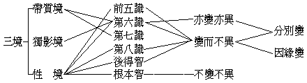
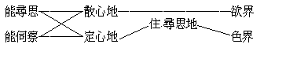

# 瑜伽師地論菩薩地真實義品親聞記
（1922 年秋，在武昌佛學院講）

## 目錄

- 懸論
    - 一　釋題目
        - 甲　釋論題——瑜伽師地論
        - 乙　釋分題——本地分
        - 丙　釋地題——第十五菩薩地
        - 丁　釋持題——初持瑜伽處
        - 戊　釋品題——真實義品第四
    - 二　明殊勝
    - 三　辨傳譯
        - 甲　明說主——彌勒菩薩說
        - 乙　辨譯人——三藏法師玄奘譯
- 解文
    - 甲一　略標釋
        - 乙一　略標真實
            - 丙一　標二真實
            - 丙二　標四真實
        - 乙二　略釋真實
            - 丙一　釋世間極成真實
            - 丙二　釋道理極成真實
            - 丙三　釋煩惱障淨智所行真實
                - 丁一　釋明真實
                - 丁二　徵示境界
            - 丙四　釋所知障淨智所行真實
                - 丁一　釋明真實
                - 丁二　徵示境界
    - 甲二　廣分別
        - 乙一　所證真實理體無二
            - 丙一　安立無二真實
            - 丙二　徵釋何者為二
            - 丙三　正明無二所顯


## 懸論

### 　　一　釋題目

初釋題目。具云：瑜伽師地論本地分第十五菩薩地初持瑜伽處真實義品第四。分釋為五：一、釋論題，二、釋分題，三、釋地題，四、釋持題，五、釋品題。

#### 　　　　甲　釋論題——瑜伽師地論

此論有一百卷，屬於大乘部之論藏也。約解為四：初、瑜伽，二、瑜伽師，三、瑜伽師地，四、瑜伽師地論。初瑜伽者，華言相應，確指行解相應以言，非泛論之相應也。其中分有五種相應：一、與境相應，不違一切法自性故。二、與行相應，謂定慧行等相應故。三、與理相應，安立非安立二諦相應故。四、與果相應，能得無上菩提果故。五、與機相應，果後行化能與機相應故。具此五種相應，是此論所名之瑜伽也。蓋由諸法若性若相，聞之確然了解，是為第一步相應。境既相應，依智起行若定若慧亦不相悖，是為第二步相應也。若境與行既相應已，即理智如如心無所得，是為第三步相應也。理智相應而得圓成妙覺，是為第四步相應也。果既圓成，應機說法，是為第五步相應也。然相應之關鍵，正在乎止觀而已。又瑜伽有顯密之二：初、顯教即前五：一、勝解與境相應——台宗謂之理即、名字即，二、正觀與行相應——觀行即、相似即，三、真智與理相應——分證即，四、圓因與果相應——究竟即，五、佛教與機相應。良以行解相應，然後理可證，道可成，眾生可度，而得始終貫徹瑜伽之旨也。二、密教之瑜伽，謂行者之三業——身、口、意——與本尊之三業，交加依持，相應互照，聖凡一致，因果同體。此密教之相應，蓋無異顯教之佛教與機相應也。


```
　　　　　　　┌─身……印契……身─┐
　　　　本尊─┼─口……咒言……口─┼─行者
　　　　　　　└─意……字觀……意─┘
```


二、瑜伽師——別云瑜祇，微異瑜伽——翻云觀行者，或云瑜伽之師，依主釋也。蓋師者，人也，因學觀行而名之也。又名有瑜伽之師，以此人有止觀之相應行故，有財釋也。瑜伽師，人法雙標也。三、瑜伽師地：一、地位，謂從凡夫地至大覺地故。二、譬喻，謂地能持載萬物，能生長萬物，喻此論能持載諸行為一切法之所依故，能生長二智為無上菩提因故。四、瑜伽師地論，瑜伽師地約所詮之義理，論約能詮之言教也。

#### 　　　　乙　釋分題——本地分

本論有五分：一、本地分，二、攝決擇分，三、攝釋分，四、攝異門分，五、攝事分。初分廣明由凡至聖之境、行、果地；餘四分中所言者，皆為此本地分之流類耳。

#### 　　　　丙　釋地題——第十五菩薩地

論曰：『云何瑜伽師地？謂十七地。何等十七？嗢陀南曰：「五識相應、意，有尋伺等三，三摩地俱、非，有心、無心地。聞、思、修所立，如是具三乘。有依及無依，是名十七地」』。此即：一、五識身相應地，二、意地，三、有尋有伺地，四、無尋唯伺地，五、無尋無伺地，六、三摩呬多地，七、非三摩呬多地，八、有心地，九、無心地，十、聞所成地，十一、思所成地，十二、修所成地，十三、聲聞地，十四、獨覺地，十五、菩薩地，十六、有餘依地，十七、無餘依地。於中前九地辨境，次六地辨行，後二地辨果。菩薩地屬於十七地中第十五地——辨行，由三十五卷起至四十九卷半止，共有十五卷半文。所謂三乘者，佛之說法本乎一味，因根不等故有三乘。然大乘不但異小乘，且能包乎小乘也。

#### 　　　　丁　釋持題——初持瑜伽處

持有四：初持、二持、三持、四持。初持文占菩薩地最多，有十二卷、十八品。約前顯教，初解境相應與觀行相應，屬此初持。二、觀行相應與智理相應，屬此二持。三、因果相應屬此三持。初持，以持菩薩解行到瑜伽處也。

#### 　　　　戊　釋品題——真實義品第四

行者之於一切法，如實了知諸法實相，假者見其假，真者見其真，而不虛誑其事，則此品之所名真實也。孔子曰：「知之為知之，不知為不知，是知矣」。品之要義，說明一切法自相，使得發生不違諸法之勝解，而入與境相應之初持瑜伽處者也。故吾人必藉此發生相應勝解，得入為初持之瑜伽師。品者，類也，文在卷第三十六本地分中菩薩地第十五初持瑜伽處十八品中之第四品。

### 　　二　明殊勝

論之殊勝分為三種：一、本論在佛法中之殊勝。二、本地在本論中之殊勝。三、本品在本地中之殊勝。初云佛法者，指佛一代時教之謂也。略言有四：一、所屬藏勝：於二藏中屬菩薩藏攝故，於三藏中屬阿毘達摩藏攝故。二、所屬乘勝：一、從此論頓入菩薩地者，即同華嚴之根本一乘故。二、從此論漸入菩薩地者，即同深密第三時普為發趣一切乘而說之大乘故。總論此論所屬乘者，唯普為與根本之大乘方能攝入，餘非所容。三、所屬教勝：一、頓機遇之，即一時一音之頓教。二、漸機遇之，即深密第三時無上無容中道了義之教。四、論自體勝有三：一、是通申一切經之宗論故。二、是法無不詮義無不了之廣論故。三、是法相唯識宗之本論故，對十支論為根本故。十支論名目如下：

二、本地在本論中之殊勝：古德嘗以此論全部不能廣譯而獨譯此一地者，可見其以此地為殊勝也。如北涼曇無讖三藏譯，名菩薩地持經。劉宋罽賓求那跋摩譯，名菩薩善戒經。一屬經藏，一屬律藏，皆不稱其為論也。後玄奘法師譯出為論，即將地持經編入論藏，而善戒經仍攝在律藏，因當時譯者重在明大乘戒故。三、本品在本地中之殊勝：心不契真實義，必偏愛見，雖有前數品之發心，亦等於空花無果耳。必須根本真實，方能念念流入薩婆若海，由初持而二持而三持以圓滿菩提耳。故此品在二十八品中，較之別品獨為殊勝也。

### 　　三　辨傳譯

#### 　　　　甲　明說主——彌勒菩薩說

彌勒，此云慈氏；名阿逸多，翻無能勝。菩薩，具云菩提薩埵，覺有情義。說者，悅所懷也。菩薩在佛滅九百年間說此論。問：佛在世時，或有菩薩示現人間，助佛行化，如觀音等；何故佛滅後九百年，彌勒仍在人間說法？答：緣由當時有無著菩薩，獲證初地，深入大乘，為要顯揚正宗摧破邪見，以神通上昇內院，求彌勒菩薩自睹史天宮降於中印度阿輸他國為說此論，乃傳於世也。

#### 　　　　乙　辨譯人——三藏法師玄奘譯

奘師越蔥嶺，遊月邦，訪道十有七載，經途百有餘國，三遍獲聞此論於戒賢法師座下。以貞觀十七年二月六日還至長安，於弘福寺與學通內外之名僧二十一人，共譯三藏梵本。於二十一年五月十五日，肇譯此論，論梵本四萬頌，每頌三十二字，至二十二年五月十五日絕筆，成一百卷。凡有五分，宗明十七地，如前釋。法師講此論時，有窺基「略纂」十二卷，遁倫記其所解成「瑜伽倫記」四十八卷，並行於世。至元末以來，遺失其本，研究者多未聞見，正理淪亡，慧日沉空！近幸日本續藏流通，取回重行於世。今講此論，都依斯記。

## 解文

### 　　甲一　略標釋

#### 　　　　乙一　略標真實

##### 　　　　　　丙一　標二真實

> **云何真實義？謂略有二種：一者、依如所有性諸法真實性，二者、依盡所有性諸法一切性。如是諸法真實性、一切性，應知總名真實義。**

云何是徵問詞。不變不異之理性謂之真，現有現在之事體謂之實。性則亙古亙今，體則無方無所。此中問以何法為真實義，所謂「欲窮真諦理，須知第一義」也。標中先開、次合。善戒經言二真實：一、法性，二、法等。地持經作：一、法性，二、一切事法性。二者名義異而不異，此則全異其名而同其義也。一者、依如性以明諸法無差別之真實性，二者、依盡性以明諸法有差別之一切性。如者不變不異之謂，今取不變不異與亦變亦異、及變而不異三義，較而明之。一、不變不異義：為根本智，親證真如故。二、變而不異義：為後得智與第八識及前六現量所緣性境，雖有因緣變、分別變別別之事，而緣時與所變境不相違異故。三、亦變亦異義：為第七六識帶質境與獨影境，由分別變更違異因緣變之實境故。如下表明——




依此不變不異之如所有性，說有諸法之真實性，除此則無有真實之體性也。盡者、窮邊際徹源底之謂。前約如理智——根本智——契諸法之性曰如；此約如量智——後得智——符一切之相曰盡。倘若境大智小，智大境小，皆不足以稱其為如量也。是故有為無為、空有、色心等法，以如量智證之，無不周遍，無不深徹，粗妙大小歷歷炳然也。即地持中所云之一切事法性也。以上二義，大抵如是。合則以根本智所證之性為諸法真實性，以後得智所證之性為諸法一切性，如是應知總名真實義也。

##### 　　　　　　丙二　標四真實

> **此真實義，品類差別，復有四種；一者、世間極成真實，二者、道理極成真實，三者、煩惱障淨智所行真實，四者、所知障淨智所行真實。**

四種真實中，初屬有漏，二通有漏無漏，三、四皆屬無漏。合四重二諦如次：


```
　　　　世間世俗───────世間真實──如天地人物是也
　　　　世間勝義─┐
　　　　道理世俗─┼─────道理真實──如蘊處界等法是也
　　　　道理勝義─┘
　　　　證得世俗──┬────煩惱障淨──苦集滅道證人空故
　　　　證得勝義─┬┘
　　　　勝義世俗─┼─────所知障淨──證法空一真法界故
　　　　勝義勝義─┘
```


#### 　　　　乙二　略釋真實

##### 　　　　　　丙一　釋世間極成真實

> **云何世間極成真實？謂一切世間，於彼彼事，隨順假立世俗串習，悟入覺慧所見同性。謂地唯是地，非是火等。如地如是，水、火、風，色、聲、香、味、觸，飲食、衣乘、諸莊嚴具、資產什物，塗香、華鬘、歌舞、妓樂、種種光明、男女承事，田園、邸店、宅舍等事，當知亦爾。苦唯是苦，非是樂等；樂唯是樂，非是苦等。以要言之，此即如此非不如此，是即如是非不如是，決定勝解所行境事。一切世間從其本際展轉傳來，想自分別共所成立。不由思惟籌量觀察然後方取，是名世間極成真實。**

釋中初徵、次釋、三例、四合、五結。云何下，徵。問言：何者為世間之極成真實也？謂一切下，釋。彼彼者，各各也。世間之得為至極成就之真實，蓋本乎世俗慣習之思想言說，為世間思想言說共所成就，是實非虛，故曰極成；乃如來隨他意語施設安立者。但為世俗之性，而無勝義之性者也。然後三種真實，不依世間之真實則無以為言說分別之所依止，是故此世間所極成者亦稱真實也。謂地唯下，例。其中先、能造四大，次、所造色相，三、依正莊嚴，四、內身苦樂。言地唯是地者，即說明此是地大，決定是地大，非火大等。地大既然，四大亦爾，萬有皆然。以要言下，合。謂世間世俗諦，是從本際展轉傳來共所成立，非今創造者也。凡新發明學說，先以思想考察而後定取者，無論正確與否，皆非此所謂世間極成真實之義也。是名世下，結。因明疏云：『極者至也，成者就也。至極成就，兩宗共許，故名極成』。又云：『雖兩宗共許，若非至實道理，亦不名極成，如勝論對五頂所立量是』。此則世間之所以名極成真實者，亦明矣。世間真實，近於俗所謂常識或直覺。

##### 　　　　　　丙二　釋道理極成真實

> **云何道理極成真實？謂諸智者，有道理義。諸聰叡者，諸黠慧者，能尋思者，能伺察者，住尋伺地者，具自辯才者，居異生位者，隨觀察行者：依止現、比及至教量，極善思擇決定智所行所知事，由證成道理所建立、所施設義，是名道理極成真實。**

釋中先徵、次釋、後結。道者、途也。人之思考，亦由途徑而達目的。謂能緣心與所緣境相通一貫之理，是此所云道理之義。亦是共所成立，故云極成真實。謂諸智下、釋，有總別義：總言諸智者，揀非愚夫愚婦之謂也，諸字所包括意，即指別中八種有智之人也。別中、初明諸智者，次示有道理義。一、聰叡者，生來六根通利故。二、黠慧者，具有巧妙學術故。三、尋思者，散心能淺思維故。四、伺察者，散心能深思維故。五、住地者，由尋伺而入靜慮故，如初禪天是也。




六、辯才者，具四種辯才故。七、異生位者，雜類凡夫中之有智故。八、觀察行者，凡三乘學者，必隨順觀察行故。諸智者，略釋如此。次示有道理義者：吾人得慧之所由，不外乎三量，以此為一切道理之源也。量度十方，權衡三世，有限無限，能通能窮，此則三量之所以名為量也。是故欲入佛智境界，亦必依是三量。文中云現者，即三量之現量，謂由親證而得，不藉言說及念度故。異生散心，雖無現量而有似量，定心必為現量。比者，比量也。比度計較之謂也。依以因之三相比類觀察，確知不虛謂之比量。近世學者慣用正反比例，亦此義也。至教量者，又云聖教量，謂由因了義教典而楷定諸法義故。至極無上，意言佛之教非外道典之所能過也。諸智者，依止三量極善思維而得決定證成之道理。是名下，結。

##### 　　　　　　丙三　釋煩惱障淨智所行真實

###### 　　　　　　　　丁一　釋明真實

> **云何煩惱障淨智所行真實？謂一切聲聞、獨覺，若無漏智、若能引無漏智，若無漏後得世間智所行境界。是名煩惱障淨智所行真實。**

文中先徵、次釋、後結。煩、擾也，惱、害也，此即是障。而為首者，則唯補特伽羅我執。以從煩惱中而得以出離，其能緣之智與所緣之境相應一致，故謂之淨智所行真實。謂一切下，釋。聞聲悟道謂之聲聞，得自然慧謂之獨覺。此二乘者，於無漏智能證生空理，不與煩惱相應，如光破暗，明暗不能並故。又有能引無漏智種而起現行之加行智，其能引智在七賢位：疏引在資糧位，親引在四加行。至見道位，斷分別人我執，如實了知唯蘊無我，故云無漏後得世間智所行境界，智通三位。是名下，結。指明二乘所緣境智，是煩惱障淨智所行真實也。

###### 　　　　　　　　丁二　徵示境界

> **由緣此為境，從煩惱障淨智得清淨，於當來世無障礙住，是故說名煩惱障淨智所行真實。此復云何？謂四聖諦：一、苦聖諦、二、集聖諦，三、滅聖諦，四、道聖諦。即於如是四聖諦義，極善思擇，證入現觀。入現觀已，如實智生。此諦現觀聲聞、獨覺能觀唯有諸蘊可得，除諸蘊外我不可得。數習緣生諸行生滅相應慧故，數習異蘊補特伽羅無性見故，發生如是聖諦現觀。**

文中初躡前真實，次徵釋四諦，後示境生觀。初謂由緣四諦之境而得淨智，如摩尼珠出於污泥，即脫煩惱障生無漏慧；至業報二障，亦於當來世捨盡矣。此復下，正徵此境界。問：四諦云何也。一苦下，釋。聖諦，正也、實也，是中正真實之言故。苦、謂三界二十五有之苦報也；集、謂貪、瞋、癡等惑，福業、非福業、不動業之苦因也；滅，謂無漏真理二乘涅槃也；道、謂三十七道品，能引凡入聖也。智者知苦是逼迫性，集是招感性，滅是可證性，道是可修性。是故二乘由此證入十六行之現觀，發生無漏智入見道位也。此諦下，示觀境。唯有諸蘊可得，除此其餘我見不可得也。大智度論云：阿羅漢視身如曾經剖解復為綴合之牛，不見有神我故。其所以得入我空無性者，蓋因屢屢數習緣生無常無我之慧，發生如是聖諦現觀耳。

##### 　　　　　　丙四　釋所知障淨智所行真實

###### 　　　　　　　　丁一　釋明真實

> **云何所知障淨智所行真實？謂於所知能礙智故，名所知障。從所知障得解脫智所行境界，當知是名所知障淨智所行真實。**

釋中初徵、次明、後結。前云煩惱障，持業釋也。此則所知不是障，以障障所知，以法執為本，依主釋也。所知、梵語爾燄，與境同義；從執一切所緣之境為心之障，能礙通達於境之智故，名所知障。出離所知障所得之智境，是名所知障淨智所行真實也。

###### 　　　　　　　　丁二　徵示境界

> **此復云何？謂諸菩薩，諸佛世尊入法無我。入已善淨，於一切法離言自性、假說自性平等平等，無分別智所行境界。如是境界，為最第一真如無上所知邊際。齊此，一切正法思擇皆悉退還，不能越度。**

此復云何者，重問所行境界為何境也。諸菩薩，約初地菩薩以上；諸佛，統括三世十方之妙覺地。世尊，謂果後行因，倒駕慈航，為天人之所尊重也。由初發心，歷三賢地，知法無我，以久修無我觀方便，斷分別法執，入初地；進斷俱生法執，究竟成就清淨，故云入已善淨。於一切法離言自性、假說自性之非安立、安立二諦，心境相應，理智一如，故云平等平等。如實了知空不空法，不隨言說分別，故云無分別智所行境也。如是境界，遍法界、徹世際、為第一無二之真如，更無有過其上者。齊此，則一切法皆悉下劣，不克勝於此矣。

### 　　甲二　廣分別

佛之說法，或廣或略，蓋因群機有愚智之所致耳。說雖不同，其揆一也。維摩詰經三十二菩薩各說不二法門不同，而同入不二法門。今此論雖重重廣為分別，亦悉詮真實之義也。依遁倫記分作五段：

#### 　　　　乙一　所證真實理體無二

##### 　　　　　　丙一　安立無二真實

> **又安立此真實義相，當知即是無二所顯。**

此真實相以何為相？當知即是絕對待、離空有、無二所顯一真常存之理體也。

##### 　　　　　　丙二　徵釋何者為二

> **所言二者，謂有、非有：此中有者，謂所安立假名自性，即是世間長時所執，亦是世間一切分別戲論根本。或謂為色、受、想、行、識，或謂眼、耳、鼻、舌、身、意，或復謂為地、水、火、風，或謂色、聲、香、味、觸、法，或謂善、不善、無記，或謂生滅，或謂緣生，或謂過去、未來、現在，或謂有為、或謂無為，或謂此世、或謂他世，或謂日、月，或復謂為所見、所聞、所覺、所知，所求、所得、意隨尋伺，最後乃至或為涅槃。如是等類，是諸世間共了諸法假說自性，是名為有。言非有者，謂即諸色假說自性，乃至涅槃假說自性無事無相，假說所依一切都無，假立言說依彼轉者皆無所有，是名非有。**

文中先言所說有，次明所說非有。所言二者，以其所執皆是有法，既有有法，必有非有，以非有非有，亦不能對待名為有矣。此中有者，以其本空，妄增益之執為實事，故為妄執之有。如云：涅槃、生死，皆同昨夢，其所言之涅槃與生死名義者，固皆安立假名，豈實有自性乎？世間，謂器世間中之有情世間也。長時所執者，謂從無始不覺迄至未來，大小眾生各各皆有其自境所執。如螻蟻然，逢擒則逃，將雨而徙，亦有其所執之境，此謂遍計所執之性，亦是分別戲論之根本耳。等言，即是假名五蘊、六根、四大、六塵、三性、四諦、生滅、十二緣生、三世有為、無為、今生、他生、空色、色空、見聞覺知、求得尋伺——未得而求謂之求，已得而得謂之得，尋、粗也，伺、細也，心隨分別謂之意隨——乃至究竟涅槃遣無可遣等法，皆是世間共同假立諸法名義。言非有者，以其所立之自性相，畢竟空無、無所有故，欲遣增益之有，故說非有。事、實有也。相、假相也。然聞非有而執非有，亦名遍計執性，是謂損減執。依彼轉者，即依假立諸法之名，而有假立諸法之義轉現也。

##### 　　　　　　丙三　正明無二所顯

> **先所說有，今說非有，有及非有二俱遠離，法相所攝真實性事，是名無二。由無二故說名中道，遠離二邊亦名無上。佛世尊智於此真實已善清淨，諸菩薩智於此真實學道所顯。**

言二俱遠離者，即明中道無上之真勝義也。不獨有法空而非有法亦空，且空之空亦空也。如起信謂：離言說相，離心緣相，乃至因言遣言，無言可遣，是名心真如相。要之、如來所說，或名一真法界，或稱諸法實相，曰圓覺性，曰自覺聖智境界，此論今名中道，亦名無上，正顯真實義為純圓獨妙之法也。其所說之中道名義，亦是假立自性。中論云：『因緣所生法，我說即是空，亦名為假名，又名中道義』。由是觀之，此無二所顯真實法，固四句皆非、百非俱遣也。諸佛於此已證，菩薩於此正顯，眾生於此當證，吾輩其努力哉！

