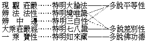

# 辨法法性論講記
（1938 年夏，在重慶佛學社講（附註））

## 目錄

- 懸論
    - 一　泛明五論
    - 二　釋本論題
- 釋頌
    - 甲一　所為
    - 甲二　正論
        - 乙一　略標
            - 丙一　總標
            - 丙二　別顯
                - 丁一　明法相
                - 丁二　明法性相
                - 丁三　成立非一非異
        - 乙二　廣釋
            - 丙　初生死
                - 丁一　總標
                - 丁二　別釋
            - 丙二　涅槃
                - 丁一　總標
                - 丁二　別釋
                    - 戊一　總明六相
                    - 戊二　別明轉依
                        - 己一　總標
                        - 己二　別釋
                            - 庚一　悟入自性
                            - 庚二　悟入物體
                            - 庚三　悟入數取趣
                            - 庚四　悟入差別
                            - 庚五　悟入所為
                            - 庚六　悟入所依住
                                - 辛一　總標
                                - 辛二　略釋
                                    - 壬一　悟入無分別智所緣
                                    - 壬二　悟入無分別智應離之相
                                    - 壬三　悟入無分別智加行
                                    - 壬四　悟入無分別智自性相
                                    - 壬五　悟入無分別智所得勝利
                                    - 壬六　悟入無分別智所應遍知事
                                        - 癸一　總標
                                        - 癸二　別釋
                                            - 子一對治遍知
                                            - 子二自相遍知
                                            - 子三差別遍知
                                            - 子四業遍知
                            - 庚七　悟入作意
                            - 庚八　悟入加行地
                            - 庚九　悟入過患
                            - 庚十　悟入功德
        - 乙三　譬喻


## 懸論

### 　　一　泛明五論

西藏所傳述之彌勒五論，三部屬於唯識，即辨中邊論、辨法法性論、大乘莊嚴經論；兩部屬於中觀，即現觀莊嚴論，究竟一乘寶性論。先略說五部的內容。

辨中邊論、以依他起為實有來安立三相，謂三界虛妄分別當體即是依他起，彼妄執有能取所取即是遍計執，能通達二取空即是圓成實。根據此三相為境，廣分別大小乘所共的境行果；最後第七品特明與小乘不共的無上大乘。辨法法性論、亦就依他起為實有來安立生死和涅槃，也就是安立世出世間一切諸法。就生死方面、明生死的果及能令流轉生死的因，即是辨明世間法。就涅槃方面、明涅槃的果及能證涅槃的道，即是辨明出世間法。總之即是依唯識正義來辨明來安立生死涅槃染淨諸法。莊嚴經論、對於外境未專破斥，重在詳明菩薩自己所修的廣大行及成熟有情的方便，即是廣明菩薩自利利他之行法。此三部之所以屬於唯識者，因為唯識說沒有離識的外境，唯有內識；若說離識別有外境者、即是常見，或說內識亦如外境無者、即是斷見。又就三性，說依他起，圓成實是有自性自相自體的，遍計執是無自性自相自體的（解深密經如是說）。若說遍計執亦有自性如依他起、圓成實者，就是常見，如於初轉法輪如言取義。若說依他起、圓成實亦無自性如遍計執者，就是斷見，如於第二轉法輪如言取義。是故解深密經雙離二邊不常不斷，不說遍計執有自性故，不墮於常，不說依他起、圓成實無自性故，不墮于斷。因三性之依他起的主要成分，還是指內心。內心中本無二取而顯現二取相，似乎有離心的外境，於是執為實有，名遍計執。故三性的自性有無亦不相同，這就是所謂唯識見。辨中邊論、辨法法性論、莊嚴經論，係根據此種意見會通般若而立論，故說他是屬於唯識的。

現觀莊嚴論、根據般若立論，雖亦抉擇究竟法空真如，但所重在發明般若經中隱藏之義。明三乘道的體性數量及次第之決定，即三乘人所修之道，也就是菩薩為攝受三乘眾生，所應知應有的行法。寶性論、明究竟離一切戲論法空真如之如來藏，亦廣明三寶功德等。此二部之所以屬於中觀者，因為中觀說內心外境皆無自性。遍計執、依他起、圓成實等一切諸法皆無自性。其無自性之理無有差別，如內心就緣起義是有，則外境就緣起義亦是有，外境就勝義說無自性，則內心就勝義亦無自性；故內心外境，無有差別。遍計執等三性亦復如是。又眾生心的無自性即是佛性，亦即是如來藏，眾生皆可證此而成佛，故說一切眾生皆可成佛，這就是所謂中觀見。現觀莊嚴論、寶性論，係根據此種意見而立論，對於般若如言取義，故說他是屬於中觀的。

昔於慈氏五論頌合刊序云：然慈尊唯造頌而釋文皆出論師，故義頗不一，今合刊五論頌為一本以存其樸，條貫而編次之，表提其綱領如左：




然此亦略據其偏勝相以言耳，其實皆一味大乘也。則於寶性可別成台、賢等宗義，亦包華土向來之傳統思想矣。

### 　　二　釋本論題

現專講辨法法性論，係法尊法師新由藏文譯為華文。此中名義文句之刊定，講者亦曾稍加參訂。昔玄奘法師譯攝大乘論，曾引有分別瑜伽二頌，分別瑜伽論未傳中土；但考所引二頌，義與此論一段頌文相符。此論是否即奘師所引分別瑜伽，頗堪考證。論題涵義，至下論文自明。今但就文句，略加詮釋。

論、為能詮，顯於三藏佛典之中，屬於論藏。辨法法性，為論所詮。辨者辨明，即辨令法、法性義明晰也。又分辨、辨別義，如辨中邊論真諦亦譯為中邊分別論。故知辨即「分別」。論為能辨，法與法性即為所辨。此能詮、所詮，能辨、所辨義，其分齊不可不先明之。

法與法性之名，中國古譯經論幾無不有，但其涵義非一。「法」與「法性」對舉，多以法表有為諸法，法性表無為真如。本論法與法性所詮，依論文而釋論文，則法表有漏法，而法性表無漏法：與常途義，頗不相同。本論所謂法者即指生死，所謂法性即指涅槃。辨明生死法之體相如何如何流轉，涅槃法性體相如何如何證得，故亦可說即是辨生死涅槃論。生死為苦總相、即是苦諦，涅槃解脫即是滅諦，故本論亦可說為辨苦諦滅諦論。生死為苦諦，招生死之業與煩惱為集諦，故本論所謂法，亦即苦、集二諦；涅槃為滅諦，證涅槃斷煩惱之途徑為道諦，故本論所謂法性，亦即滅、道二諦；故本論也可說為辨四諦論。苦、集二諦，包含生雜染、業雜染、煩惱雜染之三雜染，雜染法即是有漏法；滅、道二諦，由對治無明煩惱、業、生，成般若、解脫、法身之清淨功德，則一切皆成無漏法；故本論又可說為辨有漏無漏法論。

餘經論中，以法與法性詮有漏無漏法者，如起信論之生滅、真如二門，頗相近似。其他諸經論中，則多以法詮有為法，法性詮無為法。有為可通無漏，故一般所謂法、較此論廣，所謂法性、較此論狹。

此論悟人法性，亦歷明定慧相應之瑜伽。辨法法性、係依藏文直譯，譯分別瑜伽，其義亦可相通也。

「敬禮慈尊」！

此句為由梵傳藏譯論者所加。一、為求加持令無生障礙；二、表示佛法中凡作善事皆先皈依三寶。瑜伽師地論謂造論須禮二師，一、本師，二、釋師。一、為降伏自己的貢高，二、表示有傳承，三、為令眾生生信故。藏中各論之前，皆有敬禮尊者妙音六字，妙音為文殊別號，文殊表智，論詮智慧，故禮文殊。此論頌文彌勒所造，故言敬禮慈尊。慈尊者，慈氏世尊之略言也。

## 釋頌

### 　　甲一　所為

> **由知何永斷；有餘所應證：欲辨彼等相，故我造此論。**

此之四句，造論所為。慈尊造頌，先明宗旨，以引起聞者希求向學之心也。何、謂生死，泛指一切應永斷法。餘、謂生死永斷所餘，即是涅槃為所應證。欲辨明彼生死涅槃之相，故造此論。

何故欲辨彼等相耶？以諸眾生不明生死緣起，聞佛常說了脫生死：或執色身壞滅為了生死，故有厭世自殺等事。或執身如槁木、心似死灰為了生死，如外道之修無想定。或執觀色身空為了生死，如老聃以有身為大患；及修空無邊處乃至非想非非想處定者。彼皆不能了脫生死，以彼不明生死根本為無明故。由無明等煩惱發業，由業牽識六道流轉，生死死生無有底止。詳析之為十二緣起，具如經說。色身壞滅，業識仍在。修諸定者，為不動業，彼皆仍是隨業受生，未了生死。欲了生死，應斷無明。無明滅故行滅乃至老死等亦隨滅，是為還滅之道，乃能永斷生死。無明者：一為不了知十二緣起之無明，妄執生死自然生起或神所造，如科學家、宗教家言；一為不了知諸法性相之無明，以為實有煩惱業果生死等法。不知諸法眾緣合成，空無自性，如夢中境唯心變現。非謂由此空性能生諸法，即此現前諸法體空。若知諸法現前即空，則生死中身心世界，如幻如夢，體性皆空。如實了知而斷無明，煩惱業報隨之俱斷，是乃名為永斷生死。由使眾生先知何者應永斷除，乃知還有永斷之餘所應證得；為令現前了知生死涅槃相故，為令究竟永斷生死證涅槃故，辨彼生死涅槃等相。即造此論之所為也。

### 　　甲二　正論

#### 　　　　乙一　略標

##### 　　　　　　丙一　總標

> **當知此一切，略攝為二種：由法與法性，盡攝一切故。其中法所顯，即是說生死；其法性所顯，即三乘涅槃。**

當知此一切者，雖可汎說有為無為一切所知法，而正指此論所辨應斷、應證之一切。何故此一切可略攝為二種耶？由法與法性、盡攝一切故。前二句標，此二句成，後四句再釋之，略攝為法與法性之二種。何故能盡攝一切耶？以法字顯明三界生死，法性即顯明三乘涅槃。生死為有漏法，涅槃為無漏法，有漏無漏盡攝一切法故。此中顯言，乃詮表義。法即生死，法性即涅槃，非於生死涅槃之外，別有法與法性為其能顯。三乘涅槃，顯此論中所辨涅槃不簡二乘，總攝三乘無學有餘無餘涅槃。

涅槃、簡義為滅，亦為寂靜，如世俗恆言所謂安寧。情器世間隨業遷流，生老病死、成住壞空，是不寂靜不安寧相。煩惱滅盡，斷業識流、出生死海，寂靜安寧；此之涅槃，三乘所共。金剛經言『我皆令入無餘涅槃而滅度之』。又謂三乘『皆以無為法而有差別』。彼無為法，即此法性。三乘差別：在其修證，行有廣狹、見有深淺。觀生死苦，勤求出離，此聲聞、獨覺之發心修行；亦通大乘。觀眾生苦，勤求無上菩提，自度度他，此大乘不共之發心修行；不通二乘。又大乘深智證一切諸法空真如性，不生不滅、不垢不淨、不增不減、本來寂靜自性涅槃。故能不畏生死、不染生死，大悲大願、滿足福慧，盡未來際於一切眾生界現身說法。不同二乘極果，僅能自了。是故無住涅槃，為大乘不共功德，不通二乘。今並舉三乘涅槃，顯此論所辨，不惟明大乘涅槃也。法字通常釋為任持自性、軌生物解，包括一切有為、無為。又世俗諦名法，勝義諦名法性。又法表善法，如不善者名非法，及法有法律及標準義。又因明量以能別名法，所別名有法。此論以現有能取所取之相者名法；由知此而遠離二取相者名法性。法性即二空真如，亦即涅槃。因有二取相故生執著，由執起惑，由惑造業，由業生苦，故通名三界雜染生死曰法。其主要仍是有漏心法。三乘涅槃即無為法性，其能證之道此論亦攝於法性，故辨法法性通四諦。

##### 　　　　　　丙二　別顯

###### 　　　　　　　　丁一　明法相

> **此中法相者，謂虛妄分別，現二及名言。實無而現故，以是為虛妄；彼一切無義，惟計故分別。**

前標法與法性攝一切法，此略辨明法之體相。法與法性，各有體相可為簡別。為此中所辨之法定出一範圍分齊之相，是名法相；非通常對法性所言之法相也。虛妄分別與辨中邊虛妄分別義同，即是三界有漏心心所法。五法之中，分別、正智對舉，分別所攝。現二者，謂虛妄分別所現之能所二取。能取者，為能取種種境之分別心。所取者，為分別心所取之色、心、心所、不相應行、無為諸法境相。心能取境為能取相；然是所知境故，亦為所取。能所二取，五法之中，屬相所攝。名言者：於二取相之分齊上安立能詮，計執之以為其所詮。名言亦遍於五趣，雖異類或無顯義之名句文字，但皆有顯境之名言習氣故。名言在五法中，為名所攝。上二句確示此中之法相，即五法中分別、相、名，但次第不同耳。

下之二句，釋上二句。實無者，謂究其實體空無，惟幻現二取之相耳，故是虛妄。非謂由彼實無中，生二取相也。無義者，謂彼虛妄二取所現境界皆無實義，惟依種種計度而有，故惟分別識耳。此即諸法皆唯識現，皆不離識之義。亦可實無二句配釋二取幻現，體性實無，說為虛妄。彼一二句配釋名言，假名所詮無實境義，惟計度故但是分別。

又札迦疏說：虛妄分別為二類：一、是無分別的前五識心心所。雖現二取錯亂而無執著，如眼耳識現起離眼耳識外之色聲境，此由無始來熏習力現起，乃至十地尚未斷盡。二、是有分別的第六識心心所。對於所現境界安立名言，執此是眼識、是能取，彼是色塵、是所取等。但無論所現、所執，都是錯亂、實無，故稱為虛妄。彼一切虛妄二取都無實義，唯自計度分別，故名分別。

此中名言，於五法中、為名所攝，於三相中、遍計所攝。分別、現二，於五法中、分別與相所攝，於三性中、是依他攝。此中法性，攝五法中之正智、真如，於三性中、圓成實攝。與常途相、名、分別、正智為依他，真如為圓成義異。

###### 　　　　　　　　丁二　明法性相

> **復次法性相，無能取所取，能詮所詮別，即是真如性。**

此略明法性之體相，即無能取所取、能詮所詮差別之真如性。能取所取、惟是虛妄分別現起。無能所取，顯非如法相由無計度分別識亂現二取相；無能所詮，顯非如法相由有計度分別識於二取相更增益而安立名言。故此能取所取、能詮所詮平等一味無二無別空性，即是遍一切法常如其性之真如性，亦是本論所言法性自相。但真如義常途唯是所證；此論法性兼攝正智，則真如亦兼攝正智也。

###### 　　　　　　　　丁三　成立非一非異

> **無而現故亂，即是雜染因：如現幻象等，非有而現故。若無及現中、任隨一非有，則亂與不亂、染淨皆非理。此二非即一，亦復非別異；以彼有無事，有別無別故。**

初四句成立法相雜染因。謂虛妄分別二取相，體性實無、顯現似有，實無現有，故名錯亂。不知其錯亂而執為實有，即是無明。無明發業、業招生死，惑業生死皆由此起，是故名為雜染之因。或有難言：此生死法，體既實無云何現有？以喻答言：如幻現之象馬牛等，原唯土石草木，實無象等；然竟幻現象等之相。三界生死，皆是虛妄分別迷亂習氣所現，無實自體。於無實中，現有世界眾生幻相，故雜染因得成。對治雜染生死，即有解脫涅槃，故清淨因亦善成立。

次四句成立流轉還滅因。若無及現中者，無謂無二取性；現謂現二取相。任隨一非有者，謂或缺「無」性，或缺「現」相。非無、則有即是諸法實有體性；所現之相即法實相。不「現」、則無即惟是無。實有現有，實無現無，復依何處說名為亂？故亂之成須二條件：一、實無，二、現有。隨缺其一，則亂不成；不亂亦不成。執幻逐妄，故有生死雜染之法；了幻合覺，故有涅槃清淨之法。有亂故有染品，不亂故有淨品。亂與不亂既不成立，諸染淨品亦不成立。唯其實無、現有，故生死涅槃四諦因果，始能成立。

後之四句，釋現與無非一非異。此二者，謂幻現相與實無性，亦即下文之有無事；有謂幻現，無謂實無。此無與現、二非即一，以彼二事相有別故。云何有別？幻現之相，以多因緣成別別相，各有方所時分起滅。非實無性遍一切法，一相一味常如其性。二相不同，故是有別。亦非異者，以彼二事體無別故。無別者，謂非幻現法外別有實無性，遍諸幻現法即實無性故無別也。

前別顯一大科，略明法以虛妄分別為體相。其虛妄分別之所以，就是本無二取而詐現二取，無而現有，故是錯亂。因錯亂而生貪著、起煩惱、造眾業、感生死，故錯亂的虛妄分別是生死因。如幻現象馬之相，雖無象馬體而現似彼相，其能現之心、即是錯亂。於有者不現偏現無者，如現株杌為人，株杌是有不現，人是無而妄現。此現人與不現杌、皆是錯亂，生死即由此錯亂而來。錯亂之所以成者，即因無二取而現二取。若有而現或無而不現者，皆非錯亂。若無而不現則不起錯亂覺，即無雜染流轉生死；既無生死亦無須斷生死而修道，故亦無涅槃。若實有二取而現二取，亦非錯亂。既無錯亂便成正知，亦不起雜染感生死；既無雜染生死，即無清淨涅槃。是故法的體相即無二取而幻現二取相。法相既明，反之可知法性之相，即無二取而不現二取也。欲證此法性，須先了知生死是無二取而現二取；不於幻現妄執為實，則感生死之雜染因斷，解脫生死而證涅槃矣。無二取而不現即是諸法本來面目；亦即法性、真空、涅槃。故以無能取所取、能詮所詮為真如法性之相也。

#### 　　　　乙二　廣釋

##### 　　　　　　丙　初生死

###### 　　　　　　　　丁一　總標

> **由六相悟入諸法為無上：謂相與成立、及非一非異、所依共、不共、悟入能所取現似而非有。**

諸法，即與法性對舉之生死法。由六相為悟入諸生死法之無上方便。六相者：謂相、成立、非一非異、所依共、所依不共及能所取現似而非有。第六句悟入二字、可通六相言。

###### 　　　　　　　　丁二　別釋

> **其中相、成立及非一非異，如略標中說。**

此六相中前之三相，已於前大科略標中說。

> **諸於何流轉，說彼為所依，謂情界、器界。器界即為共，如共同所了。有情界有共，復有諸不共：託胎生、名言、攝受與治罰、饒益及違害、功德并過失、由更互增上、互為因故共。依及諸了別、苦、樂、業、死、生、繫縛與解脫，彼九不共故，名不共所依。**

此釋第四、第五，所依共及所依不共。前三句，釋所依。諸者，總指一切有情。何者，指有情流轉處之器界，即說彼情器為所依，故所依即眾生世界。次十句，釋所依共相。世界者、器世間，此唯是共所依。此一世界為此世界眾生所共了知故，眾生共業共識變此世間，故為眾生共同所了。雖由眾生各別業識變起，以業識大體相似故，現共同之世界。如一室中，諸燈之光，燈雖各別，其光相同。詳如成唯識論所說。故共了有二義：深義為共同業果；淺義即共了之色聲等也。然器世間，亦有共中不共。同一世界，三界、五趣、四生，受用各別。如恆河水：人見清水，鬼見濃河。惟在同一界趣，器界多共。若細分之，則為大體相似耳。

所依有情界中有共不共。依唯識論，唯就根身說共不共：粗色身共變用共了，名之為共；淨色根唯己所得報，生時俱生、死時俱壞，名為不共。此論所言範圍較廣，非唯色蘊，乃兼有情五蘊聚而言也。有情界中，共法有八：一、託胎生。簡別不共法中生死的生；唯指依託父母而生之生，故譯文加託胎二字。託胎之生，狹義言、有子業親因緣及父母增上緣三有情之關係，廣義言之、乃至家族諸親皆與有關，故名為共。二、名言，此依藏文直譯，義為表業。名言本義為語表業，於此亦兼攝身表業。身、語表業或由他人引起，或使他人表現，為有情間共同關係，故名為共。三、攝受。家庭、團體之所由成，或由家長攝受家屬，或由領袖攝受徒眾，必由大眾擁護，始有能攝受者。有能攝受、所攝受者，始有社會種種結合。此中眾多有情所成，故亦為共。四、治罰。攝受相反，則為治罰。佛法以戒律攝受僧伽，犯戒則有治罰。一切違反攝受之行動、侵害、鬥爭，皆應有以治罰之；如維持治安，制裁侵略皆是。五、饒益。或以財施使他豐饒資生之具，或以法施使他增長學問智識。六、違害。對于他人或于群眾，作違反其生存繁榮進步利益之事。七、功德。有情各自可生功德過失，此惟就與他有情關係言。如恭敬諸佛、孝順父母、供養師長、積集聞思修三學功德等是。八、過失。功德相反，則為過失，如毀謗三寶、忤逆父母等是。凡此八者，皆由自他有情更互為增上緣以成，故名共法。初為家庭，後七通一般社會國家，凡社會科學之所治者皆是也。

下五句就有情明不共法有九：一、依，就唯識宗即第八識；然說七、八識必出因成之，此論未出其因，亦未明說第七、八識。是故此依，亦通三乘共教，說為意根。即十二因緣之業識，為有情受生所依，各有情各別所有，故曰不共。二、諸了別。即前六識：若立八識，即前七識。識為有情各各別有，不與他共。上二識蘊。三、苦，四、樂。上二受蘊，或由自身，或由境界，各各有情所受苦、樂各別，各自感覺。五、業，即各有情思心所等。所造之業，各自攝屬，不能繫屬於他有情。六、死，七、生，有情各自生死，不與他共。八、繫縛，九、解脫。此有情成羅漢，他有情仍流轉生死；此有情流轉，不礙他有情解脫，皆須自辦，他不能代。此九者為各各有情不共他有，故曰不共。

> **共現外所取，實即能取識。以離其內識，外境義非有；是共同性故。於餘不共識，為所取等義，謂他心等法。等引非等引、諸能取識前，更互非境故：於非等引時，自分別現故；於諸等引前，三摩地行境，現彼影像故。以所取若無，亦無似能取。由此亦成立，無似能所取。然由無始來、等起而成立；二取悉非有，亦善成立故。**

初十六句悟入所取，次之二句悟入能取，後之六句成立能所取空之理。總為六相之第六、悟入能所取現似而非有。

十六句中，初之五句、明器世間及有情世間一分之共現外所取是無。共識現出相似在外之所取境，似離能取識外有其獨立可取之境；究其實際，即是識上所現，非有識外之境。初之二句、立宗，次二句、出因。以離內識，不能證外境為有故。內識之內，非以根身分其內外，乃以識言。識之自體，及不離識之法，皆名內識。如所緣之色塵，不離能緣眼識而現，憑意識計度推測為在外，其實非有，不可現量得故。義者實義，亦可釋為義理。離識之外說有外境，其義理不成也。第五句釋伏難。若有難言：若唯識現，眼不見山、山即應滅？今一有情不見山時，其他有情仍見此山，可知所見外境之山非唯識現。今答此難：共見之山是共識現；此識不現時，他多識仍現。如一時中諸燈共照，一燈光滅，眾燈光在。以不離多識故，仍可名唯識現。

六至八句、明不共現所取境，若他心法等亦不離識實有。謂有難言：若意識緣眼識，或他心智緣他有情識時，彼所緣識應在能緣識外，應是識外之境？此應答言：彼所取識，即是識故，仍非識外。且所了他心相仍不離能取心，能取智上所取他心之影相決不離能取智也。但有情界中，非許唯有一有情之識。各各有情各有其識，此有情之識外，許有他有情識。以是識故，雖彼有情之識，在此有情識外，仍是唯識。且他心智緣他有情之識，其所了知，亦是自心所現影相，仍名不離內識。

次之八句、以等引非等引更互非境，仍證不共現所取不離能取識。等引、梵言三摩呬多，為得定後定心相續引生位之定心。心心所剎那生滅故，定心亦是剎那生滅，多剎那中平等相續引起同等之心，即是等引。非等引者，即未得定之散亂心，或出定後報得之異熟分別心。定心之境，非散心能取識之境；散心之境，亦非定心能取識之境。散心唯依自分別而見一切山河大地人物房舍。於定心前，修空定者唯見有空，修火定者唯見有火。定心不見山河大地，散心亦不見空或火。此就別別有情而言。更就一有情言：若未得定，若出定後，依分別心唯見世間共見之境；入定之時唯見定境。故所取境，唯是能取識中所現影相。猶如病目見虛空花：所現空花不離目病，目病若無，空花不現。若離能取，所取實無。

次二句悟入能取無。若所取境既明其無，似與所取異體之能取識亦無。何以故？對所取境立能取識，所取既空能取自無。如見空花，說為病目，不見空花即非病目。此以似所取無為因，成無似能取也。

次二句、總明能所二取現似而非有。由上之理即可成立無似有之能所二取，然須得加行智方可悟入其影像，得真見道方可證知也。次四句釋妨難。然何以有似有實無之幻似能所取耶？因無始來二取習氣等流而現起故。識所取境，或唯名無實、如龜毛，但遍計執；或有相無用、如病目空花，亦依他起。眼病愈時空花始滅，非說為空便無花相。欲愈眼病，須由療治養息，非不待功用可令眼病愈。習氣等起二取分別依他起法，雖知現有實無而亦不能即無。若了知此二取分別由習氣起，似有實無，常時觀其幻現無實，順真如理久久修習，即可熏成習氣。以此習氣，始可對治執二取之習氣，使至於無。悉者盡也。二取習氣盡時，根本後得二無分別智中，皆離二取；了達一切法空，皆如幻化。在幻化中，無能取外之所取，亦無所取異體之能取。以二取由習氣成故，不加對治二取不無；若作對治二取可盡。故二取悉無，亦以其是無始習氣等起之故而善成立也。此六句中、所成立者應有三義：以前十八句為因，成似能所取現有實無；次以無始習氣等起為因，成能所取實無而現有；復以無始習氣等起為因，成現似二取；可由久觀二取空悉歸非有也。以上釋悟入生死法竟。

總括言之，生死即以虛妄分別似能所取為相；體即顛倒錯亂，由此為因，感生死果。果中有共不共所依。菩薩應了知其共所依及不共所依，均非離識實有，由此便能悟入無實所取能取。悟此理故，久久熏修，便可永斷二取習氣，圓成佛果。

##### 　　　　　　丙二　涅槃

###### 　　　　　　　　丁一　總標

> **由六相悟入法性為無上：謂相與依處、抉擇及觸證、隨念并悟入到達彼自性。**

由此六相，即能悟入法性涅槃一切圓滿，故為悟入之無上方便也。謂悟入相、依處、抉擇、觸證、隨念及到達彼自性也。彼謂法性。六相如下解釋。

###### 　　　　　　　　丁二　別釋

###### 　　　　　　　　　　戊一　總明六相

> **相、如略標說。處、謂一切法及一切經等。其中抉擇者，謂依大乘經如理作意攝一切加行道。觸、為得正見，故以真見道現前、得真如所有親領受。隨念、謂修道為除諸垢故，於前所見義菩提分所攝。悟達彼自性、謂真如無垢，一切唯真如；顯現彼即是轉依圓成實。**

一、相者：謂法性之分齊體相，如略標中「復次法性相」四句已說。二、處者：謂悟入法性所依之基礎。泛說即一切法，即指一切經等。等者、等取律、論。宇宙萬有，五蘊、十二處、十八界、有為、無為等一切所應可知境諸法，皆可依以聞思抉擇斷疑生智，悟入法性證得涅槃。若切要言，應依聖教，先成聞慧，依之思修方能悟入。以一切經論，皆已悟入法性者，就其正知所證為教導未知未證者而施設也。三、抉擇者：三慧之中，思修慧攝。抉謂剖抉，擇謂擇定，即抉擇是非真偽假實空有之智慧。於一切法中抉擇出法真實性。其所依以抉擇之標準即為大乘經。律僅為經之一部分，論為依經而說，三藏根本皆在於經。佛說諸經，或應他機方便而說未達究竟；特標大乘，明是了義之經，為佛實智現證之境。如理作意者，如謂循順不違，理即甚深了義；作意者，其廣義即一切心起時警發作用。此中所言如理作意，為已解大乘了義之理，如所解理集中心力而起深刻思量是也。加行道者，廣義言之、凡依法空勝解所修資糧位之十住、十行、十向，皆加行攝。狹義而言、惟十向後四位，為大乘菩薩悟入法性之加行；依於定心，以深智慧觀察法性。其前加行，未能常與定心相應也。此中可通資糧、加行。四、觸謂觸證法性，非由名言文字思維觀想而得。為得此出世正見故，以真見道現觀現前，證得諸法空性真如。前加行道以比量分別心，略見真如影相，未能由現量智證真如。雖似真如，實心所變。至世第一最後剎那，透脫影相入真見道，始以現量無分別智親證真如。即此最初所有親領受真如之智，名觸證也。五、隨念者：謂修道位。念為緣曾緣境之別境心。真見道後，隨真見道親證真如無分別智而緣曾緣之真如理，依之修菩提分所攝六度萬行。以隨正見而修行故，名為隨念。八地以前，須常修習，無分別智始能現起。八地以後，無分別智任運自起而修諸行。其所緣者，即前觸證真如所見之境。其所為者，為除諸垢。諸垢、謂俱生二障。分別二障，如礦山面上之土；俱生二障，如礦中所含之垢。真見道時，如掘礦山初見金礦。修道位中，如鍊金礦，使之純淨。隨念之體菩提分攝，廣說十度，正說即三十七菩提分中之八正道。依於正見而修正思維等：消極言之、是去無始身心無明煩惱障垢，積極言之、即為修積無邊福智資糧，方能淨除二障。如鍊金礦，一方去礦質之垢穢，一方即發揮金質之妙相。小乘惟消極斷生死，故洗不盡習氣；大乘積極發揮功德，始能永淨諸障，此即其差別。六、到達彼自性者：謂到達彼隨念中法性之究竟自性，即是涅槃。自性者，謂法性之所以為法性而不可說為他法者，非別執有一實法為涅槃之自性也。涅槃自性謂即真如無垢。異生位雖具真如性，以在垢污法中故名有垢真如。真見道時，雖見真如，諸垢未淨；要經修道淨治諸垢，至佛果位始為無垢。如金出礦，要經鍛鍊，礦質淨盡，始是純金；如鏡蒙塵，要經拂拭塵穢盡時，方顯明鏡。無垢者，謂一切唯淨真如，不稍雜其他染污之法也。真如顯現更無垢障，即是究竟轉依果之圓成實性。

轉依一名，惟唯識宗中有。依唯識說，依、有根本依及迷悟依。根本依即是第八識。此論雖未明言第八識，依之含義，亦可作第八識解。迷悟依者即是真如。本論之依正就真如言，可從下文見之。以無垢真如為轉依，是就已轉之依明轉依也。轉、有能轉道與所轉果。能轉之道為行。所轉之果，有轉所得及轉所捨。轉所捨者，為無明煩惱及隨之而起諸雜染生死法。轉所得者，復分所生得及所顯得：所生得者，即無分別智乃至佛果無上菩提之淨福智，一向無有今始生故。所顯得者，即不生不滅之真如法性，一向埋沒於二障中，由證聖智而顯現故。能轉道者：廣義言之、凡因位中從資糧道以上諸菩薩行，皆為轉依所經之道。真能轉者，即真見道之智及隨念修道諸無漏行。轉依之義：就八識言，則為對治有漏種子轉成無漏種子所依之菴摩羅識；就真如言，則為破除迷亂顛倒悟入真如，轉顯無垢真如。已轉之依，即圓成實；圓滿成就真實，一切垢離德淨已圓滿故，已永成就無改變破壞故，唯此是究竟真實故。本論以無垢真如明涅槃自性，復明此涅槃自性即餘經論所說之轉依，故本論之轉依是就真如言也。圓成實在唯識論即唯識性，在此論中即涅槃自性。關於三性，本論但出圓成，未標餘二；且就離垢真如顯圓成實，亦與餘論圓成實義、分齊不同也。

此六悟入，悟入「相」即所應了知法性之相。悟入「依處」，謂先通達得入法性所因依處，即是聞思三藏及一切法。悟入「抉擇」，即由聞已思修抉擇法真實性。悟入「觸證」，即由抉擇入真見道，以現量智親證法性。悟入「隨念」，謂隨前所證法性數憶念之修習道。悟入「到達彼自性」，謂修習至究竟之無學道。第一、正明要悟入之法性，第二、是悟入法性之預備，第三至第五、是悟入法性過程，第六、達到悟入法性究竟。是為總明六相。

###### 　　　　　　　　　　戊二　別明轉依

###### 　　　　　　　　　　　　己一　總標

> **由十相悟入轉依為無上：入性、物、數取、別、所為、依住、作意及加行、過患并功德。**

廣明轉依，為本論不共義，故於六相之後，特詳轉依。由此十相悟入轉依，最為方便無上。一、轉依自性，二、悟入轉依所依物體，三、何等數取趣能悟入轉依，四、悟入大乘轉依殊勝相，五、悟入大乘轉依所為，六、悟入依以能得安住轉之無分別智，七、悟入轉依所應起思修作意，八、悟入轉依所經道次之加行，九、不立轉依過患，十、成立轉依功德。總之、前五相正明所得之轉依及差別相，次三相明能轉依之道，後二相則明有無轉依之德失也。

###### 　　　　　　　　　　　　己二　別釋

###### 　　　　　　　　　　　　　　庚一　悟入自性

> **其悟入自性：謂客塵諸垢及與真如性，不現及現義，即無垢真如。**

轉依自性與前法性自性，同是無垢真如。所有諸垢，皆名客塵。如水濁相土混所成，水之主體實本清淨，渾濁土垢、是名客塵。非水自體，故名為客。自性本淨，無明煩惱妄習染污，覆蔽不現。無明諸垢亦是客塵。然淨性無始，垢法亦無始。非本淨性後始渾濁，如於淨水羼以泥沙。則二俱無始，何有自體客體之分耶？客塵諸垢，可以對治捨離，清淨性現，客塵即離，故名為客。清淨體性，雖在垢中，其性不失，故說為主。真如自性遍染淨法，在客塵中真如不現，客塵去盡真如即現。客塵諸垢一切不現，即真如性完全顯現，此時方是無垢真如，方是轉依自性。由此可見本論之轉所依，專就真如迷悟依言。迷者，不了真如迷亂顛倒，悟者了達真如離垢清淨；故此非就本性清淨真如名轉依，乃就斷障所顯離垢真如名轉依也。

###### 　　　　　　　　　　　　　　庚二　悟入物體

> **悟入物體者：謂共器界識真如性轉依，及契經法界真如性轉依，并諸非所共有情界內識真如性轉依。**

悟入轉依所依物體，即一切法（物）皆可依以悟入真如理性（體），以真如性遍一切故。約物分為三類：一、現起共器界及有情界共一分之識，皆可依以悟入真如。此從一切萬物顯真如性，斷除障垢清淨即名轉依。二、契經所說一切，謂之法界。界者因義，為三乘一切聖法之因故。佛所說教，教法所詮之理，依理修證之行，修行所成之果，其真實體真如性；依以悟入而得離障清淨，即名轉依。三、有情不共內識，體即真如。若悟入到虛妄分別不現，真如性現，即是轉依。要之此三類轉依，初即佛果身土，次即佛果語業，三即佛果意行之真如也。

###### 　　　　　　　　　　　　　　庚三　悟入數取趣

> **悟入數取趣：初二謂諸佛及諸菩薩眾真如性轉依，後亦通聲聞及諸獨覺者。**

此中就前三類轉依，正明能悟入之大小乘人得果差別。初二就身土及證教離垢轉依、唯為大乘不共法身功德，非二乘所能證；故能悟入有情唯諸佛菩薩。且此中菩薩，唯就聖果菩薩眾言，不攝見道以前菩薩。諸佛轉依究竟，十地菩薩分得轉依，故為能悟入者。若就後一內識離煩惱垢所得轉依涅槃通義而言，阿羅漢、辟支佛亦能證得，故亦得通名能悟入者，又藏疏述：前一器界根身之真如性離垢清淨轉依、是法身果，唯佛果得。次一契經法語之真如性轉依、是報身果，菩薩分得。後一心心所真如性轉依、是化身果，二乘共得。密宗則以心真如配法身，語配報身，身配化身。

###### 　　　　　　　　　　　　　　庚四　悟入差別

> **悟入差別者：謂諸佛菩薩，嚴淨土差別，及得智法身，報身并化身、能普見、教授、自在成差別。**

悟入差別者，了知大小乘轉依不同，以明大乘轉依有二殊勝功德，不同二乘。一者、大乘得器界果真如性轉依之淨土殊勝功德。果位諸佛皆有莊嚴國土，因位諸菩薩亦皆修莊嚴國土之行；二乘惟證寂滅涅槃，則無莊嚴國土行果。蓋為普度眾生令修淨行，方有莊嚴淨土，二乘惟求自利，無廣大度生事業故。二者、大乘得有情界真如性轉依之三身殊勝功德：一、智法身，總集總持種種功德，以法性真如總括一切無漏法，即依正智真如綜合名智法身。若按唯識所分三身，此中智法身即合彼法性身與自受用身而言。二、報身，即他受用身。報身莊嚴廣大，唯為地上菩薩所見，如華嚴說毘盧遮那，梵網說盧舍那皆是。三、化身。有三類，一、小化身，如釋迦丈六金身是。二、大化身，四加行菩薩或天人所見者是。三、隨類化身，應眾生根界趣而現者是。智法身圓滿周遍無自他相。化身隨類大小，身量亦不定。唯報身隨因行菩薩，如初地見百佛世界——一大千世界為一佛世界——，二地見千佛世界等，各隨功德而異。此三身中，智法身於每一剎那，遍緣法界性相因果，無不普見。報身能於蓮花藏海，教授十地菩薩。化身能隨類度眾生，於利他事業得極大自在。三種化身，對任何類眾生，皆能利益。此三身功德，亦非二乘所有故。

###### 　　　　　　　　　　　　　　庚五　悟入所為

> **悟入所為者：謂宿願差別，宣說大乘法即所緣差別，十地加行別。**

所為者，大乘轉依所因以不同二乘之理由也。此有三種差別：一、謂初發菩薩願心要究竟度脫一切眾生故求成無上菩提，並令眾生同得圓滿覺悟。不同二乘唯求自了生死，雖亦方便教化有緣，而無普度眾生同趨無上大覺之願。此大乘宿願，與二乘差別者也。二、即以諸佛所宣說大乘教法為所緣境界，其基礎與二乘差別也。三、則為斷所知障修十地之大乘加行，尤為二乘所無。由此願、解、行別，故轉依果成異。

###### 　　　　　　　　　　　　　　庚六　悟入所依住

###### 　　　　　　　　　　　　　　　　辛一　總標

> **悟入所依住，謂由六種相入無分別智：即悟入所緣、離相、正加行、性相、與勝利、及悟入遍知。**

悟入轉依所依住者，即是悟入無分別智。因有此智乃能斷障得轉依果，故明所依住也。悟入無分別智由六種相：一、所緣，二、離相，即離相縛。三、正加行，明修何行可入無分別智。四、性相，正明智之體相。五、勝利，明智所得果利。六、遍知，明悟入此智所應遍知事。下當廣釋。

###### 　　　　　　　　　　　　　　　　辛二　略釋

###### 　　　　　　　　　　　　　　　　　　壬一　悟入無分別智所緣

> **當知有四相初悟入所緣，謂於大乘法：說，勝解，決定、及圓滿資糧。**

悟入無分別智所緣有四，皆依大乘法說。一、應依止宣說大乘法善知識，聽聞其說，為悟入無分別智最初所緣，是為聞慧。由此可見非不求多聞，止心不起，即可悟入無分別智也。二、為依所聞法如理思維觀察，生起決定勝解，不為引轉，是為思慧。三、經細微觀察抉擇決定所緣之境，如觀諸法決定性空，以決定慧緣決定境；定心相應，是為修慧。四、依以上三慧如理作意、極善修習，未圓滿證無分別智以前，應積集福智等一切資糧。簡言之，即以「親近善士、聽聞正法、如理思維、法隨法行」為所緣也。

###### 　　　　　　　　　　　　　　　　　　壬二　悟入無分別智應離之相

> **第二能悟入離相亦四種：謂由離所治，能治，及真如，並能證智相。此四如次第，即所永遠離，粗、中、與微細、及常隨逐相。**

入無分別智所應離之相有四。一、無分別智正所對治即能所取虛妄分別，一切雜染諸法、亦皆為其所治。無分別智，了知所治分別性空，實無所治，是為離所治相。如心經云：『無無明……亦無老死』等。二、三學、六度、三十七菩提分法、皆為能治，切要言之、為觀二取空之空觀。對所治相故有能治，所治本空能治亦空，空觀亦空。即心經所言『無無明盡……亦無老死盡』等。三、真如為遍一切法常如其性之真實性。真如之名、乃為未證入真如者方便安立，令其心念觀想，有所趨向。無分別智相應真如、實無真如名所詮相，以無分別智中一切能所對待分別諸相不可得，若有所取相即非真如。如唯識論云：『現前立少物，謂是唯識性。以有所得故，非實住唯識』。以有所取故，是變起相故，非親領故，故無分別智亦離真如相。四、能證智，即無分別智。若於所證真如見有能證之智，即非能所雙忘、如如相應。諸菩薩現證真如時，實無能所證相。說為無分別智證真如者，已是菩薩後得智上據親證真如之記憶，為令未證者得證故，方便安立無分別智之名。若有能證智相，即非無分別智。如心經云：『無智亦無得』，即離真如及能證智相也。此四種相，如其次第，即入無分別智時，所應離粗相、中相、微細相及常隨逐相。所對治為粗相。能對治在粗細相之中為中相。修真如相觀時，漸離粗中二相而真如相未離，故為細相；此真如相，乃是所治粗相分別未治盡者。至於能證智相，則以了知任何一法，皆有了知之相，稍有境智能所未空，即有能證智相。能證智即分別自身，最為難離，故常隨逐。蓋種種觀察求離分別，求離分別即分別也。如懷疑派哲學否定一切，一切皆空，而最後執惟能疑者不空。未得真無分別智者，雖證一切離相，而能證智相不可離，故藏疏述：能證智所以名常隨逐相，因須至七地方能斷除故，亦明須至八地方真入無分別智也。

###### 　　　　　　　　　　　　　　　　　　壬三　悟入無分別智加行

> **悟入正加行亦有四種相：謂有得加行，及無得加行，有得無得行，無得有得行。**

此為悟入無分別智加行，較下文悟入轉依加行義狹，此惟入初地前入真見道之加行故。有四種相者：一、有得加行，謂觀唯有識可得，以為觀外境空之方便，定中修此觀慧，從四尋思、四如實智引生觀所取空之智。二、無得加行，以唯識故，畢竟無實外境可得，印所取空。三、有得無得加行，有得者、謂觀所取境唯有空可得，無得者、謂境空故觀亦無能取識可得。由境空故所取境空，所取境空故能取心亦空，境心俱寂，雙印二空，為有得無得行。四、無得有得加行者，雙印二空故無得，唯見真如故有得。二取既空唯見真如，此猶有得於真如故，仍是加行；要到真如與能證智亦不可得，乃為真入無分別智。

###### 　　　　　　　　　　　　　　　　　　壬四　悟入無分別智自性相

> **悟入於性相當知由三種：謂由住法性，以住無二取，離言法性故。第二由無現，二取及言說，根、境、識、器世，悉皆不現故。以是此即明無所觀、無對、無住、無所現、無了、無依處。無分別智相如經所宣說，由現一切法，見如虛空故；及一切諸行，見如幻等故。**

悟入無分別智之性，有三種相。一、住法性。法性即真如性，如略標中明法性相所說。法性離二取及名言，無分別智即以正住於離二取及名言之法性為自性故。二、諸法不現。二取等，即前略標明法相中所說實無而現之法。無分別智起時，二取名言，六根、六境、六識、器世間、悉皆不現。此即經等所說無分別智六相：一、無所觀，由無能所二取故無所觀。二、無對，由無名言故、無能所詮對待相可安立。三、無住，由六根不現故、無為識所依住相。四、無所現，即境不現。五、無了，即識不現，識是能了相故。六、無依處，即器世間不現，器世間為報身依處故。三、見諸法如空、諸行如幻。無分別根本智見諸法皆自性空、畢竟無得，以一相無相，無所不遍、無彼此分際故，說如虛空。次於後得智位、見諸有為亦自性空，因緣生滅如幻如化。如金剛經云：『如夢，幻，泡，影，如露，亦如電』等。應於此三種相，了知無分別智自性之相。

###### 　　　　　　　　　　　　　　　　　　壬五　悟入無分別智所得勝利

> **悟入勝利四：得圓滿法身，得無上安樂，得知見自在，得說法自在。**

悟入無分別智所得勝利有四：一、由無分別智斷盡二障，始得圓滿法身。即前說轉依差別中之智法身，為一切有為無為無漏福智功德總聚，不同二乘解脫身惟離煩惱生死，灰身泯智，無諸功德也。二、由無分別智斷盡一切有漏苦，始得無上安樂。無上安樂，即是無住大般涅槃，即用而寂，於現身說法無邊廣大妙用中，常得寂靜安寧之樂；不同小乘有餘涅槃苦報未盡，無餘涅槃了知安樂之智亦無。三、入無分別智則能於如所有性、盡所有性無障礙轉，始得知見自在。知見分言，如眼見色、是見非知，知不明利、是知非見，明利之知、是知亦見。佛位五眼是就見言，名正遍知是就知言。小乘所知障在、無明未盡，不能遍知，登地菩薩，以根本智了知真如，即不能以後得智同時了知諸法差別相。八地以上，雖能根本後得同時雙運而未究竟。唯佛知見於一剎那遍一切法，真如實性及差別相無不圓滿了知，乃為知見自在。法華經謂諸佛出世因緣，為令一切眾生入佛知見。大乘轉依，即為得此圓滿周遍之一切種智也。四、入無分別智能起後得智，一切種智，遍一切所知界對種種機說種種法，始得說法自在。菩薩位中於第九地得辯才無礙，已能說法自在，然僅對九地以下能自在說法，未能教化十地菩薩。要佛果位，方得滿足四無礙辯、十力、四無所畏，大師子吼教化一切眾生，令得究竟覺悟無上安樂。若小乘果，其初發心現無普度眾生之願，惟求自度，故無斯勝利也。前一無為果，後三無漏有為果；前三佛自利果，後一佛利他果。若依五果分別見下業遍知中。

###### 　　　　　　　　　　　　　　　　　　壬六　悟入無分別智所應遍知事

###### 　　　　　　　　　　　　　　　　　　　　癸一　總標

> **悟入遍知者當知有四相：謂對治遍知，及自相遍知，諸差別遍知，五作業遍知。**

普遍了知於悟入無分別智所應了知之一切事義，由四種相：一、無分別智所對治之五種所治法。二、無分別智由遠離五種相似相所明自相。三、無分別智乘大小乘差別之殊勝相。四、無分別智所成之五種勝利功用。

###### 　　　　　　　　　　　　　　　　　　　　癸二　別釋

###### 　　　　　　　　　　　　　　　　　　　　　　子一對治遍知

> **其對治遍知，謂無分別智對治五妄執：即妄執有法，數取趣，變壞，異，及損減性。**

無分別智所對治者，就其展轉對治而言，遍於一切雜染之法。今所舉者，是智所正對治之法，無分別智現時彼即不現。扼要言之，即五妄執：一、妄執有法，於蘊界處等法，不知從緣所生唯識所現，一切性空；妄執實有自性。如一切有部說一切法實有等，是增益執之一。即二乘尚有法我執，以未得無分別智故。二、妄執數取趣。或於五陰和合假中執為實有流轉五趣有情，以其忽天忽人，仍一有情，認有常住不壞實有情體。如數論之說神我等，亦增益執之一。此人我執通為三乘之所對治，大乘則無分別智證諸法空，而即明人我空，故亦無分別智之所對治。三、妄執變壞性。於一切有為法剎那生滅變壞別執有變壞性，離變壞法實有體性；此亦於無執有之增益執，是無分別智所對治。四、妄執法與法性實有決定異性。由不了知諸法緣生即自性空，不一不異。豈如西洋哲學，執一執多，執多元者、以為決定有多各別異性。若知諸法皆待眾緣，一切即一、一即一切，無自性故即法空性，豈得實有畢竟異性！此亦是於無事妄計為有之增益執，為無分別智所對治。五、妄執損減性。因緣生法自性皆空，而不可不認為因緣生法。若聞法空之教，遂執聖凡因果一切皆無，毀謗世出世法，破壞諸菩提行，是損減執。以執無故，是妄分別，亦為無分別智之所對治。蓋無分別智於諸法無實體而有幻用相，如如相應。故能悉離此錯亂真理之五妄執也。

###### 　　　　　　　　　　　　　　　　　　　　　　子二自相遍知

> **自相遍知者：遠離不作意、超尋伺、寂靜、自性、執息念，五種為自相。**

無分別智、無自相之可說，惟辨明其相似相遠離之，即見無分別智自相。一、遠離不作意：或以無分別者，即於赤白方圓善惡真妄一切名相差別不加思辨之謂，故即以不作意為無分別。然此非理，若不知名言理解心即無分別智者，則嬰兒皆為入真見道菩薩矣。無分別智雖不作意，然非不作意即無分別智。儒道兩家，以嬰兒之心天真無邪為至善之心：道家主返於自然，返于嬰孩之心；儒家言不失其赤子之心，主人性本善之說。佛則言初生之心，為異熟心，前業招感，不由自主。故依佛教，嬰兒之心，是無記心，非無分別智也。二、遠離超尋伺相：尋伺為五十一心所之後二心所，為依遍行思心所及別境慧心所和合所起思慧。依名言於一事一理，粗略思考，得其大概，謂之為尋；若加審細研究，窮其內蘊，謂之為伺。無分別智，不依名言義解，固超尋伺；然超尋伺非即無分別智。如二禪天以上有漏定果，皆超尋伺，然仍是上二界不動業果，非無分別智也。三、遠離寂靜相：或以心心所動相滅時之寂靜相即無分別智。此智固亦寂靜，然非寂靜相即無分別智，如無想定、滅受想定、心心所皆寂滅，然非即無分別智也。四、遠離自性相：或執諸自性無分別者為無分別智。無分別智固無分別，但無分別非即無分別智，如色根等以及土塊頑石、槁木死灰一切色法，皆自性無分別，豈皆即無分別智耶？五、遠離執息念：如覺種種憂患皆由有念，遂執止息心念，即為無分別智。此執止息心念亦一想念，此想念滅餘想念生，豈成無分別智？古德云：『莫謂無心便是道，無心尚隔一重關』，此之謂也。

執此五相為無分別智者，皆由誤認不須加行，即入無分別智。不知未有不由加行而悟入者。如前悟入加行所明無得加行、有得加行、即以唯識觀為加行。有得無得加行、雙印二空，無得有得加行、唯真如性可得，即以真空觀為加行。若離真如及智相入一切無得，真入無分別智，即同禪宗所顯；由加行入真見道時，即觀智亦不存。或執唯有識，或執唯空性，以為此若無者，即成斷滅，是未解離真如能證智相；故唯識、中觀、禪宗，亦有諍論也。其實禪宗亦要於加行竭盡分別能事，所謂參要真參，悟須實悟也。若加行所觀真如細相及能證智常隨逐相不能放捨，亦不能真悟入無分別智，所謂『百尺竿頭坐的人，雖然得入未為真，百尺竿頭重進步，十方世界現全身』是也。

###### 　　　　　　　　　　　　　　　　　　　　　　子三差別遍知

> **差別遍知者：謂不分別性，及非少分性，無住，與畢竟，並其無上相，是五種差別。**

前說涅槃，三乘所共。轉依及無分別智特顯大乘，故此中明有五種與二乘差別之殊勝性。一、不分別性：謂大乘法空無分別智，觀諸法空，其性平等。如中論所謂生死實際即涅槃實際。於生死涅槃不分別，故不住生死、不同凡夫染著，亦不住涅槃、不同二乘之畏怯。二、非少分性：二乘人無我智惟證生空涅槃，大乘無分別智遍了人法性空平等，智斷圓滿故非少分。三、無住：謂不住生死與涅槃，離一切生滅、斷常、一異、來出、空有等邊執，正顯中道不增不減。四、畢竟：此就利他上言，以無分別智達自他性空，故能不知勞倦，究竟利他，普益眾生無分憎愛，盡未來際恆興化度。五、無上相：無分別智究竟成佛，佛佛平等，更無過者；其所知境，無上無容。

###### 　　　　　　　　　　　　　　　　　　　　　　子四業遍知

> **最後業遍知：謂離諸分別；給無上安樂，令遠離煩惱、無所知二障。其後所得智，而能正悟入一切所知相、嚴淨諸佛土、成熟諸有情；並能令生起一切相智性。五種業差別。**

業者功效。無分別智所給功效，分配五果，就根本、後得二智合明之。根本無分別智之勝果有三：一、離諸分別，配士用果。士者士夫、如有力之人能現前生起作用，推之於一切當時發生作用者，皆名士用果。如風吹紙動、紙動即風吹之士用果。無分別智現時即離二取虛妄分別，證斷同時，本無前後，就功效言為士用果。二、給無上安樂，依無分別智而得無上涅槃無漏安樂，猶依眼根而發眼識，故為增上果。三、離二障，無分別智能斷二障，令有情繫縛者即是二障，故離二障為離繫果。二障者：一、煩惱障，即發三界生死業等之六根本煩惱及二十隨煩惱，自性是障，正能繫縛眾生流轉生死。二、所知障，或誤解為種種知識能為障礙，其說非是。所知在梵文為爾燄，亦可譯「境」，此所知境非能障者；於法界一切應所知境，若有未能全了知者即所知障。故所知境，為被障者而非能障。能障之體，即是無明。此障無明，不同煩惱障之無明。煩惱無明，迷執顛倒，能令有情流轉生死。所知無明，其義較廣，凡於應知應能之事，有未全知全能即是無明。二乘唯求脫離生死，故不須斷障所知之無明；大乘志求無上菩提，必所知境圓滿遍知，故所知之障品亦須斷也。大乘根本無分別智，尤以所知障品為真正所對治。

四、悟入一切所知相，嚴淨佛土，成熟有情。由根本智現一切法自性皆空，故後得智能見諸行如量。後得智又名量智，於一切所應知境界，性相因果無量差別，悉能如量了知。以此之故，始能上求佛道、下化眾生，而成莊嚴佛土成熟有情事業。後得智為根本無分別智引生，為無分別智中真能分別，雖分別而了達性空如幻無所分別。根本智清淨故，後得智亦清淨，故後得智是根本智之等流果，而後得智正知一切所知相及莊嚴佛土成熟有情，亦即為後得無分別智等流果。其中莊嚴佛土與成熟眾生之二業，亦說為士用果，後得智上起此用故。五、生起一切相智性。一切相智，亦譯一切種智、一切智智，即菩薩位修根本後得無分別智成滿為佛之果智。唯佛果智，於一切相普遍了知，故名一切相智。非無分別智同時得，須要修至二障斷盡、菩薩行滿，究竟成佛時而後得。以異時而熟故，假名為異熟果。異類而熟之異熟義，不通無漏，此中惟就異時而熟之義而言，因果皆是無漏性也。配五果名五業，則根本三而後得二，亦可根本三種合為一業，同在一剎那故；後得之所知相及莊嚴佛土與成熟有情開為三業，則根本一而後得四。

###### 　　　　　　　　　　　　　　庚七　悟入作意

> **悟入作意者，謂若諸菩薩發心欲悟入無分別智者，當作如是意：由不知真如，起虛妄分別，名曰一切種，為現二取因，依此起異識；故彼因及果，雖現而實無，彼現、法性隱，彼沒、法性現。若如是作意，菩薩即能入無分別正智。從緣知唯識，觀識不得境；由境無得故、亦不得唯識。由此無得故，入二取無別。二別無所得，即無分別智，無境無所得，以是一切相無得所顯故。**

為悟入轉依故，集中心力、專一精審思量觀察二取空義，為悟入轉依之作意。轉依即證真如。入無分別智即最初證得轉依，亦即入真見道。諸菩薩者，簡別二乘，無分別智惟大乘能入故。發心欲悟入無分別智者，明是加行位中菩薩，謂加行位菩薩，當如下文次第作意。分三段說：初觀生死，有十二句。真如為迷悟依，由無始來從未了知諸法性空之真如故，生起虛妄分別。此二句意同起信論真如緣起所謂「由不知真如法一故」云云相似。起虛妄分別即有熏習力，為能生將來三界虛妄分別之因故，名一切種。此論未有明文建立賴耶種子，但含其義，若就賴耶一切種言，一切種即所謂識種。若就未立賴耶而言，虛妄分別根本無明為能現起二取因故，名一切種。依此虛妄分別熏成之一切種，生起二取諸根塵識。彼因之一切種，果之二取異識，總是虛妄分別，雖現起幻相而實無真性，是迷真如而現起故。上七句就眾生心境觀察生死之所由來。進觀彼虛妄分別之二取諸法現時，法性即隱，要待菩薩修遣虛妄分別二取相隱沒時，入真見道法性始現，此即前悟入自性所謂客塵諸垢不現而真如現義。若如是為求真如法性顯現而作意，則此菩薩漸能二取不現，真如顯現，得入無分別智——上五句明要修瑜伽所以，次修瑜伽是入無分別智所修正觀——即唯識觀。

從緣知唯識等六句，為從唯識觀悟入真如之作意。緣者、謂所緣境，若從諸識所緣，知皆唯自識所現之影相。觀識實不有外境之可得，由所取境空無得故，則能取識亦無可得。二取俱無得故，能所雙亡，即入無二取差別之平等真如法性。攝大乘論所引分別瑜伽二頌，義同此段，而詳略稍不同。疏通解釋，大略相等。攝論所引『菩薩於定位，觀影唯是心。義相既滅除，審觀唯自想』：菩薩於定位，等於前「若如是作意」等三句；觀影唯是心，等於「從緣知唯識」句，影即所緣也。義相既滅除，審觀唯自想，等於「觀識不得境」句；審觀唯自想即是觀識，義相既滅除即是不得境，此攝論文詳本論文略也。攝論『如是在內心，知所取非有，次能取亦無』三句，等於本論「由境無得故，亦不得唯識」。如是住內心知所取非有者，即「境無得」，次能取亦無即「亦不得唯識」，此亦攝論之文較詳。攝論『後觸無所得』，即本論「由此無得故，入二取無別」二句。由此無得故，有「後」之意，「觸」證入也，二取無別即「無所得」，此本論文詳攝論文略也。即以本論此段，義同攝論所引，故推測此論或即分別瑜伽也。

後五句明智相。二別者謂二取差別。能緣心與所緣境無別故，能證智與所證境亦無別，心境俱空，境智雙泯，即入無分別智。無分別智無有對境故無所得，以是一切能所取相無得所顯故。譬如明鏡現諸影相，青黃赤白、長短方圓、即非鏡體光明本相；若無一切色彩形像，然後正露全鏡明體。又如牟尼寶珠現種種色，或執為青、或執為黃、或見人面、或見山林，就其有種種形色現故起種種分別；若置淨空，都無所現，乃能澈底顯露清明透澈之牟尼珠體也。

###### 　　　　　　　　　　　　　　庚八　悟入加行地

> **加行悟入地，於四相當知：由勝解加行，於勝解行地，是順抉擇位。各別證加行，即於初地中，是觸真實位。由修習加行，於未淨六地及三清淨地，是為隨念位。由究竟加行，任運佛事業相續不斷故，此即是達到彼智體性位。**

此為悟入轉依之加行所經之地位。此分四相以明：一、由勝解加行，入勝解行地，即順抉擇位。勝解於法法性，正確了知，有決定力，不為引轉。由十住、十行、十迴向修積資糧，至於煖等四加行位，尚未能證唯識真如，依勝解力修四加行。順於真如法性而抉擇故，名勝解行地順抉擇。二、由各別現證加行，入於初地，即見道位。在世第一加行位後，起真見道，別別現證一切法唯識性真如。觸、謂親證，真實、即真如唯識實性，是親證法性位故。三、由修習加行，入二地至十地為隨念位。既觸證真如性，入無分別智已，尚須常依無分別智隨念修習，地地升進，方能斷盡俱生二障。二地至七地間無分別智有時不現，二障未盡伏滅，故名未淨。八地至十地，無分別智無間現起，二障伏盡，故名清淨。四、由究竟加行，到達彼隨念智體性之究竟，亦即佛位。依大悲願力，遍法界中有應見佛聞法者皆為現身說法，廣度眾生，作佛事業，任運而起不待功用，盡未來際相續不斷。初地以上，地地證得一分轉依，至佛果位乃為究竟轉依。此中四位，略同成唯識論五位，但資糧加行合名順抉擇位耳。

###### 　　　　　　　　　　　　　　庚九　悟入過患

> **悟入過患者，謂若無轉依有四種過患：無斷惑依過，無修道依過，無諸涅槃者施設依處過，三菩提差別施設無依過。**

三乘共法，唯說涅槃，本論特詳建立轉依。此悟入過患者，謂悟入不立轉依之過患。若知不立轉依過患，即知轉依之不可不建立。若不立轉依則過患有四：一、無斷惑依：真如為迷悟依，不明真如、不知二取等為錯亂，即無所應斷之惑障。惑、謂煩惱、所知二障，大乘所斷之惑，尤在所知障也。二、無修道依：若無所斷之惑，亦無能斷之道須修。且大乘當修遍知一切性相之智慧，具足莊嚴國土，成熟眾生無量功德；若不達真如，必不能修大乘道。三、無諸得涅槃者施設依處：若無所斷惑及所修三乘道，何從施設聲聞、獨覺與佛得涅槃者？即無轉依，則不能建立得涅槃之三乘聖者也。四、無三乘菩提差別施設依處：由轉依故，無上菩提不同二乘。若不明此中轉依義，則三菩提差別不彰矣。

###### 　　　　　　　　　　　　　　庚十　悟入功德

> **當知彼相違，四相入功德。**

若知不立轉依，有彼過患。過患相違，即知若立轉依有四功德。謂有斷惑依，有修道依，有三乘涅槃施設依處，亦有三乘菩提差別施設依處。以上釋別明轉依竟。前八段明轉依，後二段則明建立轉依所為也。

#### 　　　　乙三　譬喻

> **於無而現有，喻如夢、幻等。轉依、則喻如虛空、金、水等。**

本論辨法與法性，別明轉依以前，生死與涅槃對舉，生死為法，涅槃為法性。別明轉依以下，生死與轉依對舉，法即生死、法性即轉依。初二句喻生死法，謂生死之依他起法雖實無性，現有種種虛妄分別之相，喻如幻象馬等。等取夢、泡、影、露、電為喻。現夢幻時宛然是有，其實體性是無，於實無中，宛然現有，故為生死幻現喻。幻夢等喻甚多，如金剛經有六喻，能斷金剛有九喻，總明有為法皆實無而現有之義。所謂『夢裡明明有六趣，覺後空空無大千』也。與辨中邊『非實有全無』，『如現實非有』，『謂知義非有、非無如幻等』義同。後二句喻轉依。虛空者喻轉依自相，遍一切法無相無分別故。金者、礦金喻有垢真如，純金喻無垢真如。水者、濁水喻有垢真如，清水喻無垢真如。此顯真如，客塵二障未滅、已滅分位不同，假說染淨，而自性無變異。等者，等取鏡、珠諸喻。與辨中邊『知顛倒作意，未滅及已滅，於法界雜染、清淨無顛倒』。『知法界本性清淨如虛空，故染淨非主，是於客無倒』。『此雜染清淨，由有垢無垢，如水界、金、空、淨故許為淨』義同。此二簡明比喻，總括全論所詮之法，生死涅槃，法與轉依，皆攝於此。

大科三段，自成三支比量。略標如立宗，廣釋如出因，譬喻即為喻依，其組織實至嚴密也。（陳濟博，塵空，游隆淨合記）

前講全依譯傳原科解說，若直觀論頌，則可成一種之分判如下：


```
　　　　論─┬序論──即第一頌
　　　　　　└正論─┬辨法法性通明三乘義─┬略標
　　　　　　　　　　│　　　　　　　　　　└廣釋─┬──生死
　　　　　　　　　　│　　　　　　　　　　　　　　└──涅槃
　　　　　　　　　　└特詳轉依別彰大乘義─┬法說─┬──總標
　　　　　　　　　　　　　　　　　　　　　│　　　└──別釋
　　　　　　　　　　　　　　　　　　　　　└喻說──最後一頌
```


所以為如此判分者，一、因本論明轉依頌文占五分之三，別為開一大科較宜。二、因本論殊勝義皆詳在轉依，如此較可表彰特點。三、因舉轉依名喻如空金水等最後一頌亦移入此，比之辨中邊論無上乘品甚相當也。

