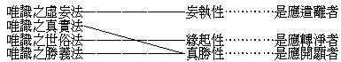
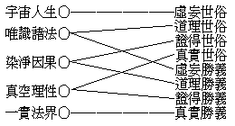

# 新的唯識論
（1920 年 3 月，在杭州作）

## 目錄

- 大綱
- 一　新的唯識論發端
    - 甲　為新近思想學術所需求故
    - 乙　用新近之思想學術以闡明故
    - 丙　非割據之西洋唯心論故
    - 丁　非武斷之古代懸想論故
- 二　宇宙的人生的唯識論
- 三　分析的經驗的觀察的系統的唯識論
- 四　轉化的變現的緣起的生活的唯識論
- 五　真理的實性的唯識論
- 六　悟了的解放的改造的進化的決擇的唯識論
- 七　實證的顯現的超絕的勝妙的成功的唯識論
- 八　究竟的唯識論

## 大綱

## 一　新的唯識論發端

『山中十日西湖別，堤上桃花紅欲然』：乃吾清明日從淨梵院赴彌勒院，在湖中泛一葉扁舟，舟次偶然流露於吟詠者。夫桃花之紅，莫知其始，山外之湖，湖上之堤，物皆位之有素。且吾非一朝一夕之吾，居乎山，游乎湖，玩春色之明媚，弄波影而蕩漾，今豈初度？然人境交接，會逢其適，不自禁新氣象之環感，新意思之勃生也！夫唯識論亦何新之有？然為歐美人及中國人思想學術之新交易、新傾向上種種需求所推盪催動，嶄然濯然發露其精光於現代思潮之頂點；若桃花忽焉紅遍堤上，湖山全景因是一新，能不謂之新唯識論乎？茲略述新義如下：

### 　　甲　為新近思想學術所需求故

近代科學之進步，不徒器物著非常之成績；且神教既全失其依據，而哲學中之所包容者，亦漸次一一裂為科學，僅存形而上學為哲學留一餘地。復經認識論之反究，懷疑到形而上學之終不可知，輒知之亦非有如何效果，直置於不成問題不須解決之列，於是哲學亦降為科學原理之總和，附庸科學而已。然最近人間世之脊脊大亂，或歸罪科學；或謂非科學之罪，罪由誤用科學。然誤用之故安在？如何而得不誤用科學？既非科學所能答，則科學亦幾乎全為無意義無目的無價值之事。近人若羅素者，殆將謂科學亦依據迷信發生，全去迷信，科學自身且難可成立。科學其尚有何種希望乎？夫神教與哲學，次第為科學所窮，卒之科學亦挈襟露肘，窮無以達。正猶專制君主，立憲君主，皆為民主政治所催陷；而民主仍無以治平，致心海茫茫，莫知奚屆！然則吾人處此，其撥諸玄遠學理專以目前人眾生活之效用為事，若詹姆士輩「實際主義」者之所為乎？則人眾生活能存在否，亦早為所疑，夫又安能依之為質信乎？然則其認形而上學，有「可然」當是，但不得執為「就是」誠然，若羅素之新實在論乎？則有「可然」「當是」之實在云者，特予人以自由探試之希望，非能指示皇惑中流無所措其手足者以方針也！然則其撥棄推理概念之方法，謂本體唯可由直覺而得若柏格森之所論乎？然異生於我法二執俱生而有，故憑直覺亦非可保信之方法也。夫在思想學術之趨勢上，既欲求一如何能善用科學，而不為科學迷誤之真自由法；繼之又有非將一切根本問題，得一究竟解決不可之傾向，展轉逼近到真的唯識論邊，有「山窮水盡疑無路；柳暗花明又一村」之概。而唯識論遂為新近思想學術上最要之需求也！

### 　　乙　用新近之思想學術以闡明故

夫唯識學之書亦多矣，種種說法，各適其宜。第對於新近思想學術界中所待解決之疑難，雖大理從同，但人心趨向之形勢既殊，順應之方法隨變。而扞格者尤在乎名句文義之時代遷化，今昔差異，故非用現代人心中所流行之活文學，以為表顯唯識學真精神之新工具，則雖有唯識論可供思想學術界之需求，令得絕處逢生，再造文明，然不能應化於現代之思想學術潮流，而使其真精神之活現乎人間世，則猶未足為適應現代思潮之新的唯識論也。蓋新的唯識論，即真的唯識論之應化身也。從真起應，全應是真，雖真應一宗，而時義之大，貴在應化。此誠鴻偉之業，吾亦聊盡其麤疏棉薄之力，為智者之前驅而已。

### 　　丙　非割據之西洋唯心論故

然與唯物論對立之唯心論，互相非斥，在西洋之思想學術界中，蓋由來久矣。言之成理，持之有故，而卒不能有所成就者，則有近代之主觀唯心論，與客觀唯心論是也。雖然，此皆未明今是之所謂心者。割據心之變現行相之一片一段，而不能明證心真，將曰唯心，心之本真愈晦；則晦昧之空即緣之而自蔽，如夢、如幻、如影之前塵虛妄想相轉紛雜凌亂而莫得其明淨。今是之唯識論者，乃適反其所趣，將使妙心圓顯，德用齊彰，如理如量，無取無捨，不與彼幾經破碎崩潰之西洋唯心論同途共道。故今茲之唯識論出現，非唯物論與唯心論之循環往復，而實為世界思潮總匯中所別開出之一時雨之新化。

### 　　丁　非武斷之古代懸想論故

古代之思想家，根據其理性中之所要求者，常用種種懸想憑虛構造，而武斷為人生唯一之實在如何若何，宇宙唯一之實在如何若何，人生宇宙究竟之唯一實在如何若何。一生二，二生三，三生萬物。太極生兩儀，兩儀生四象，四象生八卦。耶和華肇造萬有，主宰群生，絕對無外，無始無終。神我與冥性合，生覺、生我慢、生五唯、生五大、生十一根，所生諸法歸還自性，則神我離冥性而自在。此皆古人之所馳騖，但有名言，都無實義。今此絕對排除一切虛擲之懸想，妄執之武斷；抉當前之心境，成系統之理論。重現證，貴實驗，而又有其現證實驗之方法。一念相應，全體圓湛，活活潑潑，無所留礙。而一切言句文語，皆若空中鳥跡，無堪執捉。轉得山河大地歸自己，轉得自己歸山河大地，夫而後乃能轉科學而不為科學轉；圓成大用，與科學始終相成相用，故為新的唯識論也。

嘗為之論曰：『唯識宗學，實為大乘之始。自海西科學之功盛，以其所宗依者在乎唯物論也，遂畏聞大乘唯識之名；抑若一言大乘唯識，即挾神權幻術俱至。不知大乘唯識論之成立，先嘗經過小乘之「有論」、「空論」等，及大乘之空宗，將邪僻唯神論之常見，與邪僻唯物論之斷見，同日催蕩清理，乃開大乘唯識中道。故竺乾當日大乘唯識論之所緣起，正以勝論之多元或二元論等，天神汎神及數論之神我論等，順世論之四大極微唯物論等，小乘之「有論」、「空論」等，大乘之空宗等，探究玄奧，觀慧微密，皆極一時之盛。迫於人智之要求所不能自己，大乘唯識論乃應運興起。且彼時雖有小乘之正論，徒高超世表而不能普救群生，與今日雖有科學所宗依之近真唯物論，徒嚴飾地球而不能獲人道之安樂，亦恰相同。故唯識宗學，不但與唯物科學關通綦切，正可因唯物科學大發達之時闡明唯識宗學，抑亟須闡明唯識宗學以救唯物科學之窮耳』。夫然，亦可見新的唯識論之所以為新的唯識論矣。

唯者何義？識者何指？識何以可唯？唯何以為識？唯者，是「非餘」義，是「不違」義，是「無外」義，是「無別」義，是「不離」義。識者，指識「自身」，指其「相應」，指其「所變」，指其「分理」，指其「實性」。識非可唯，識之體相亦無得故；唯必為識，現實之法皆在識故。

## 二　宇宙的人生的唯識論

客曰：今現見有天地人物，非現實之法乎？切近言之，則吾人必有生命之存在與個性之存在；廣遠言之，則宇宙必有自然之存在與本體之存在。此能抹煞為非現實之法乎？或雖現實而唯是識乎？故知謂「現實諸法唯是識」者，其義不然。

論曰：客以天地人物為現實者，豈非因現見是有乎？

客曰：然！

論曰：設能證明現見中實無天地人物，則天地人物豈非非現實之法乎？

客曰：現見中分明有天地人物，又豈能證明其實無？

論曰：客今認現見中有現實之天地人物，非同現見此掌中之橘乎？

客曰：以近例遠，以小例大，其為現見之現實則無異。

論曰：客今現見之橘，非即圞然而黃之形色乎？

客曰：然！

論曰：若圞然黃者即為橘，則鏡中圞然而黃之影，與畫中圞然而黃之像，亦為橘乎？

客曰：不然！現實之橘有香，有味，有觸，故異鏡影、畫像。

論曰：但今現見者，唯是圞然而黃之形色，彼香、味、觸皆現所不能見，可知現見者與鏡影、畫像相同。而橘固非現見中之所有；現見中既無橘，可知橘非現實之法；橘既如是，天地人物不如是乎？

客曰：然則認現可見、聞、嗅、嘗、覺、的色、聲、香、味、觸、所依持之個體為橘如何？

論曰：客所謂個體者，亦能證明而出之歟？現見者形色，現聞者音聲，乃至現覺者堅脆、乾濕、冷熱、輕動等觸塵。且是等皆隨現行之見、嗅、嘗、觸，秒秒轉變，忽忽轉變，彈指非故，無可追執。而客所謂之個體者，果安在哉！

客曰：在此一處現有可見、嗅、嘗、覺之色、香、味、觸和集續存，可持可取，可藏可棄，是即吾所謂之個體。

論曰：處體空無，一數假現。由見、嗅、嘗、覺之色、香、味、觸和合續連乃有此一個，非由有此一個乃有見、嗅、嘗、覺之色、香、味、觸、和合續連。故持取藏棄者，亦祗是見、嗅、嘗、觸之色、香、味、觸和合續連耳，非有他也。正猶結合多人前滅後生相續成為一個軍團，豈離開結合相續之多人能別有一個實體存在哉！

客曰：我今但認色、香、味、觸之和續相，以為現有之實，則又何如？

論曰：既唯和合續連之相，則一朝解散，即消滅無所存在。且除色、香、味、觸本無他有，豈能認之為實有哉！

客曰：如此，則現可見、聞、嗅、嘗、覺之色、聲、香、味、觸，必為實有；此既實有，亦非唯識，以此即是物故，即是物之所集生故。

論曰：客將謂現見中真有見、聞、嗅、嘗、覺之色、聲、香、味、觸可得乎？即如今見圞然而黃：圞然之形，依附黃色而現，為黃色之分位，非現見之所見，現見唯是黃色耳！但今離卻圞形，亦無黃色可指，以無形限則無邊際，無邊際故亦無方所，天與地平，山與澤齊。圞形既可寄種種色而現，黃色亦可帶種種形而顯。如畫中景，無漥突而似有漥突；如鏡中影，無遠近而似有遠近；此皆現見所無，乃由意識在現見中營構增益而起，而現見中僅存泯同虛空之黃色耳。

客曰：此空空之黃色，其必為現見中之現實乎？

論曰：黃色一名，涵義周遍，通攝宇宙一切黃色。即今灼然明見，自有分齊。就橘言之，見此一方面而不見彼一方面，見表面一層而不見裏面多層。若少分見可名為見，則多分不見豈不益可名為不見乎？故知黃色亦非現見中有；蓋黃色之有，乃由先有一黃色之心，與種種非色非黃色之心相仗託而彰顯。實唯諸心相感相應，轉似現所見法而已。而在離言內證之現實中，唯是平等真覺，實無一相一名之可安立。現所見色如是，現所聞、嗅、嘗、覺之聲、香、味、觸亦復如是。一橘如是，無數天地人物亦復如是。故知現實諸法，定皆唯識。

客曰：此在物象雖則如是。若吾人者，有生命、有情性、有意思，能自主、能自動、能自覺者也，豈亦無性命之實乎？

論曰：生命者，即是由先業將心行支配作一期人生之分限力；此一期人生之分限力完了時，又有他種強碩之業代起，再支配心行作他種生命，此便為生命之相續不斷。情性者，即執持生命元為自己，由自己之見所發揮之力。意思，即是根據生命情性所需要之識別造作。所謂自我，個性，人格，意志，性命，靈魂等等，皆可知矣。然有與身俱生自然成者：一、為情性審持生命根元為自我等，常相續而無間斷者。二、為意思認取物質精神，或綜合或析別之相為自我等，雖相續而有間斷者。二皆任運而起，由無始來虛妄熏習內因力生，非修正觀久久剋治，難可除滅。若一般人之性命及意志，非單用理論所能空卻也。復有因言語傳受分別謬誤成者：一、為聞謬說質、力、理、氣等認取為自我等。二、為聞謬說個性、主體等認取為自我等。二皆計度而起，兼由群俗中習慣力助生，從名理中究竟研窮，即能徹悟不迷。若天神教所說靈魂，理論徵詰，即知無有。此皆自無實體，乃由心心所所變諸法和續轉似之幻相，故皆唯識。

客曰：人亦依宇宙自然律生存之一，而此宇宙之自然律及宇宙原始要終之實體乃存在不存在、真實不真實、是有不是有、一切分判之總根本。此若空無，則一切分判將全失依據，是唯識不是唯識亦應無可說。故宇宙自然律及宇宙實體，必應離識而實有。

論曰：客云宇宙自然律者，非指萬有生化流轉之理勢歟？

客曰：然！

論曰：諸物及人之萬有，既為唯識所轉變，況依萬有所現起生化流轉之理勢？譬如已知水之非有，而卻認由水而起之流動相為實有；又如人類不存，而卻認社會國家為實在，寧非謬甚！故自然律離識實有，無有是處。

客曰：幻必有真，假必有實，宇宙萬有則盡幻矣假矣，而豈無本元的究極的實體哉？既有實體，即非唯識。

論曰：宇宙實體，孰知其有？無所證知而認為有，則成獨斷，無可置論。且彼實體，究為何狀？若都無狀，應即是無！無，則即是都無實體；若有可狀，其狀安在？若在萬有，既為萬有之一，何得為萬有之實體？若不在萬有，則成非有，如何復得執為實體？故執宇宙本體離識實有，無有是處。

客曰：然則現前種種物類，生存變化自成儀則，各各個實流行轉動，豈無根極？且彼無邊空間，無盡時間，復因何有？

論曰：此因一切有情眾生無始虛妄熏習內因力故，意根任運常時相續觀生化元阿賴耶識，分別物類執為法體；或由意識緣取識心變現諸相，任運種種分別貪著，若客此所問者是也。而在現世或緣虛妄言說謬誤分別，於諸法相法性妄生計度，若天神教所說上帝造宇宙等是也。此皆諸識所緣，唯識所現，心外實無，識內似有，故知一切唯識。

客曰：然在人世及佛經中，各說人類、獸類、動物、生物、及凡夫、聖人、異生、諸佛等；又說固體、液體、氣體、元子、電子、精子等，及地、水、火、風、空、時等，若云唯識，此依何說？

論曰：此諸名相，皆由明了分別之識，轉動變似能取見及所取相之二分。又因無始物我分別熏習之力，依此能取見及所取相之二分，轉似種種眾生及世間相。依識所變，隨識所緣，假施設為人類、獸類、乃至地、水、火、風、空等。如人睡夢，以睡夢力，夢心轉現種種境相，似有自他、物我之類，不知者妄執為離夢心外之所實有。此則但隨妄情假為施設，都無實事。若知由睡夢心轉變而現似，不同妄情之所計而隨順說之者，此則雖有其事，究非其實。人等地等乃依夢心假立，唯如幻有，夢心乃人等地等所依體，亦真實有。識為一切眾生一切世界之所依故，一切眾生一切世界為識之所變故，是故眾生世界皆唯是識。

如有頌云：『由假說我法，有種種相轉；彼依識所變』。

## 三　分析的經驗的觀察的系統的唯識論

客曰：眾生無量，世界無邊，今曰皆依識變，彼識差別凡幾，有何特殊功能？

論曰：能變之識，約分三類：一者、生化體識，二者、意志性識，三者、了別境識。合之則成二種能變：一、因能變，屬生化體識中之流注化能力與生命化能力。其流注化能力，由意志性識與了別境識，熏習生化體識令得生長。其生命化能力，由了別境識「有雜染善惡性業」，熏習生化體識令得生長。二、果能變，由前二種熏習功力，轉諸識生，變諸相現。謂流注化能力以為因緣，種種識相差別而生，名曰流注化果，因相、果相等相似故。又生命化能力以為助緣，招生命體識酬報「引受生命體」之先業力，招了別境識酬報「滿足生命體」之先業力。前者名真生命體，後者名生命體生。二者俱名生命化果，果性、因性不相似故。識為眾生世界所依，識為眾生世界能變，大義若此。

客曰：如何名為了別境識，識有幾種？

論曰：照了別別境界事相，最為粗淺明顯，故曰了別境識。約有二種：一者、依色根識，二者、依意根識。

客曰：如何名為依色根識，識復幾種？

論曰：依各自淨色根為不共增上緣發生之識，故名依色根識。別有五種：一者、眼識，以感覺照了青、黃、赤、白、等別別諸顯色，或兼感覺照了顯色上長、短、方、圓、大、小、遠、近、明、暗、空、塞、屈、伸、往、來、別別諸形、表等色，為自身及行狀。二者、耳識，以感覺照了別別音聲為自身及行狀。三者、鼻識，以感覺照了別別香臭為自身及行狀。四者、舌識，以感覺照了別別滋味為自身及行狀。五者、身識，以感覺照了堅、濕、煖、輕別別礙觸為自身及行狀。是故此五個識，亦得名為色識、聲識、香識、味識、觸識。有此五種別別感覺照了之時，同時同處及有此所別別感覺照了之色、聲、香、味、觸。了，所了相，俱依識自身上轉變起故。諸有情者於茲五識，或完全有，或完全無，或復不完全有，然唯五種為定。

客曰：此五種識，其隨順和合而轉之屬性如何？

論曰：盲昧之警發，冥合之感應，領略之覺受，規摹之想象，動變之思力，此其屬性之普遍著明者。他若欲望與信、慚、愧、及貪、瞋、癡等等皆得有之。於感覺照了別別諸色、聲、香、味，觸時，細心觀察，便能獲知。

客曰：此五識所照了別別諸色、聲、香、味、觸，究是如何境況？

論曰：譬如鏡光照了顯現鏡像，鏡像顯現即是鏡光照了，鏡光照了即是鏡像顯現。光像各各親冥自相，非是語言文字所可到著及可表示，乃是現證現實性境。內外、彼此、自他、物我等等對待所起假相，及依和合連續所變似人、牛、木、石等假相，於感覺中此皆無有，故此亦名感覺唯識。

客曰：此五識所了實境，無對待假相及和合、連續假相者，則諸假相屬於何境，為何識之所了？

論曰：此諸假相屬帶質境及獨影境，為依意根識之所了。

客曰：如何名為依意根識？

論曰：依意志性識為不共增上緣根而得發生之識，故名依意根識。以了知計度分別一切實境、帶質境、獨影境種種諸法為自身、行相，故亦名為法識。

客曰：此識如何了實性境？

論曰：一者、謂與前之五識同於初一剎那時間，依前五識感覺照了於色、聲、香、味、觸一一離言自相。二者、謂於離去散動昏亂，精一靜明定慧所持心境。三者、謂全脫離計度分別，契會一切法真如性。此則即是轉此依意根識成「妙觀察智」矣。

客曰：此識如何了帶質境？且又何為名帶質境？

論曰：此識有殊勝功，具廣大用，能於一切所有境界，周遍計度分別執取。內依意根及諸心不相應行法——名、數、時、方、同、異等等——過去所了行相名義，又常連合想念現前。因此依前五識所同覺照之色、聲、香、味、觸，一剎那間即轉流入單獨依意根識界中，變為一個一個實實在在之和合連續相。自他、人我、內外、彼此、一多、方圓、大小、遠近、畛域畢足，封界完固，互相對待，安立名物；太陽、大地、群動、繁殖，莫非依意根識所了似帶質境。何義名為似帶質境？此中諸物似乎皆含帶有前五識所了色、聲、香、味、觸；其實前五識所了色、聲、香、味、觸各住自相，與此了無交涉。此乃全由依意根識自家一邊所生反映之影而已，故曰似帶質境。更有由此依意根識所了其餘諸現行識及識屬性心等，由此識與彼所了諸識心相照中間所成心影，其影不但由此識生，亦由彼所了諸識心相對生起，故名真帶質境。

客曰：此識如何了獨影境？且又何為名獨影境？

論曰：此由依意根識能用名言義相憑空捏造無有之境，及依想念推憶過去、懸觀未來等境，故能完全脫離現實心境，而分別計度乎唯獨虛影之境。一者、觀想此地無有或此時無有或此中無有，而為宇宙所有之境。如十二月所想蛙聲之類，名有質獨影境。二者、若依馬角、蛇毛等名或創造宇宙之上帝等名，由名所起想像之境而為畢竟無有之境，名無質獨影境。此獨影境，若細判別，義類繁多，茲姑從略。

客曰：此依意根識之特徵，其即在於能了別計度帶質、獨影二境乎？

論曰：如是，因似帶質與獨影，唯屬此識之境也。不寧惟是，蓋諸識唯此識功用最宏，入定慧境及證真如法性，亦為此識特殊勝能。其依前五識覺了色、聲、香、味、觸，大致同前五識。然不先知有前五識，於此亦難知及。故世人祗知有此依意根識者，皆昧昧然而不能知有真現量。然此一剎那間之真現量，雖偶迸露，鮮能印定，遂仍即流轉入帶質、獨影之意言界；故此非由定慧證會真如法性，莫得相應。然不能成就定慧契悟真如者，即由此識恆時流轉馳逐於帶質、獨影之境故；迷唯識理，欲從心外尋求伺察推觀計執不能已者，亦全因此。故唯識學第一步，當首先了解此中之似帶質、獨影諸境，唯是意言，絕無實物。故此亦名意言唯識。此意言唯識觀得到親切顯明之際，即能真覺得世間同做夢一般。

客曰：此依意根識相隨順和合起之屬性，較前五識如何？

論曰：此識之屬性心，轉化變易，尤極深廣繁速：其普遍著明者可無論矣，他若欲望、勝解、憶念、靜定、明慧等特別境界心，又若信、慚、愧、無貪、無瞋、無癡、精進、輕安、不放逸、行捨、大悲等淨善性心，又若貪、瞋、癡、慢、疑、惡見等擾濁雜染性心，又若忿、恨、覆、惱、嫉、慳、誑、諂、害、憍、無慚、無愧、掉舉、昏沉、不信、懈怠、放逸、失念、散亂、不正知等染惡性心，又若尋求、伺察、懊悔、睡眠等不定性心；在諸時處，展轉聯帶，分合生滅，飄忽難辨。而尋求、伺察之二心，功力尤偉，世間所流行之思想學術，要皆依此二心生起。此等諸屬性心，須動靜語默間剎那剎那反觀內察，方可如看電影一般，明晰幾微。

客曰：然則此之六種了別境識，其作善惡性業者，又如何？

論曰：此則徵之其屬性心即可了知，由依意根識表現為身之行動、口之語言、帶信等諸屬性心現起時，則作淨善性業；帶忿等諸屬性心現起時，則作染惡性業；單帶警發、欲望、尋求等屬性心起時，則作善惡無可記別之業。但在生死流轉位中之有情類，大都不離貪、瞋、癡、慢等屬性心俱時現起，故皆是有所覆蔽夾雜染污之心行。必到契會真如，反照破意志性識時，乃能成就純全淨善心行；此則非復因襲的而屬於創造的矣。

客曰：其於感受苦樂者，又如何？

論曰：感覺時之心境或相符順，適悅身心則樂；或相乖違，逼迫身心則苦；或無符順乖違之可區別，則領苦樂俱捨中容性受。此六了別境識，於此苦、樂及捨三受，隨時變換，皆得有之。但苦、樂受，各有二種：苦受二種：一苦，二憂。樂受二種：一樂，二喜。苦樂但屬現在，憂喜兼及過、未。前之五識，但有苦、樂、捨受；依意根識，則有苦、樂、憂、喜、捨受。細心內觀，不難審知。

客曰：雖復明此了別境識，所了實性、帶質、獨影境相。即如前之五識同第六識感覺照了色、聲、香、味、觸、法，因何必於此時此處乃有如此如彼色、聲、香、味、觸之感覺？或於彼時彼處則無如彼如此色、聲、香、味、觸之感覺？且依意根識中亦常有時有處乃有如彼如此種種和合、連續、對待之相，有時有處則無如彼如此種種和合、連續、對待之相。而此種種色、聲、香、味、觸、法、與和合、連續、對待之相，此時此處則可與多數人同有如此如彼種種覺了識別，異時異處則又與多數人同無如彼如此種種覺了識別：若非離識之外別有為發生此等覺了識別之因者，如此種種差別之法，以何得成？

論曰：客亦嘗作夢乎？夢中所覺了識別之境物，當在夢未醒時，夢為春日則亦但有桃花而無荷花，夢為沙漠則亦但有荒野而無荳麥，夢為家人離聚則亦各有悲歡涕笑，夢為男女交會則亦可有損遺精血之事。此諸夢境，亦皆宛轉成就，如有自然規律，豈亦離夢心外別有所存在乎？然至醒時，叩之心內夢境猶能歷歷，若欲於自心外求其何所存在，豈能絲毫得有？夢既若是，醒亦應爾。

客曰：此雖能明夢境不離夢心，然彼夢心亦與夢境和合、連續、共同現起，合而謂之曰夢。而此夢者，其有雖幻，要非無所因藉而有。若其有所因藉，則離夢之外，既有起夢之本因；離識之外，豈無起識之本因歟？理既相齊，疑猶待決。

論曰：夢依心有，夢不離心，心雖不必為夢，且可永遠離絕其夢。心正夢時，心亦不能離去夢心而別有心。夢境、夢心依夢而現，夢依本心而有。欲知夢依本心而有，是故當說生化體識。

客曰：如何名為生化體識？

論曰：此識廣大含容，深幽玄微，觀察難到，默認必有。約言其義：一者、曰含藏識：謂能容受意志性識、了別境識，種種熏修練習功力，悉皆包藏在內。若非一度經過使用化為他種功力，則必無有消失，此其為「能藏」者一也。又甚昧弱虛柔，無有自覺自決之能，每遇前一生命已失後一生命未得之間，輒為潛藏其中之前六識所造善惡業力，忽然突起引之趣得一種生命；用其為生命體而為之決定其生命，使其屈伏韜藏在彼業力所決定之生命之內。纔出前一生命，便入後一生命，常被繫縛隱藏，絲毫不得自由，此其為「所藏」者二也。又復被意志性識所愛注執著，佔據作「自我體」，運前六識種種造作變化行相悉皆納藏其內，此其為「我愛執藏」者三也。此含藏識，雖有三義，要以我愛執藏之義為主。二者、曰生體識：即前「所藏者識」之義。蓋生命雖非由其決定，而為生命之主體者，實在此識，所謂「真生命體」是也。三者、曰種元識：即前「能藏者識」之義。由此識體所本具之種種能力，及由前之七識所熏習在此識中之種種功力，即為能各各差別互互連帶發生諸心法。心相應法、心變現法、心不相應行法之本因種元者是也。此中「我愛執藏」之義可得離卻，我愛執藏離卻，生命主體之義漸漸亦可離卻，猶之心可離卻於睡夢也。種元功能依體之義，則無始無終而常在，故此亦名「依持本識」。離卻我愛執藏、生命主體之後，此識亦名「清淨無垢心識」。若能知此「生化種元功能依持本識」，則於來問便應可知。

客曰：此識中於一切現有法之種元功能，事究如何？

論曰：此含多義，略為分別：一者、剎那剎那變滅：前滅後生，有勝功力，不是凝住死定無用之法。二者、要與現有行相之果同時同處俱有：譬如血胞與吾肉身俱有，而彼血胞即為吾此肉身種元。三者、隨所依識恆常轉變：自類功能引續不斷，故必依持本識。四者、性用決定：是何種元功能，必但生何現行果相，如土但成土器，不成金玉之器。五者、要待眾多助緣，乃能生起現行果相：如穀種要待水、土、風、日等緣，乃能生禾稻。此諸種元功能勢力，能直接親自生自類現行果相，則為「生因」。勢限未盡，能引攝殘存之現行果相使不頓絕，則為「引因」。草木等種子，皆但能為勝助緣，非親能生草木之真因本；其真因本即諸質力原素，而諸質力原素，即由無量有情共同業行熏習本識之所生長。依此以觀諸識所緣，唯識所現之理，不更明乎！

客曰：此中所云熏習之義，究又如何？

論曰：熏習須有能熏習及所熏習乃成就。其所熏習，須有永久之性，平等之性，自在之性，虛容之性，及有與彼能熏習者，同時同處不即不離之和合性。據此故知唯「生化體識」乃能為「所熏習者」。其能熏習，須有生滅無常之性，力用勝盛之性，能作增減之性，及有與彼所熏習者，同時同處不即不離之和合性。據此故知唯餘諸識及其屬性心乃能為「能熏習者」。熏習之事，譬如室本無香，一度然香，香已然滅，室中猶餘香氣。亦如我手曾習寫字，雖不寫時，習成寫字功能依然存在。依此熏習之事，故令餘識與此識互相為因果：謂此識之種元功能親生餘識，餘識亦復熏習生長此識種元功能。可知識之生起，不須另有因藉之法，乃此識餘識相互因藉生起耳。

客曰：生化體識了別行相，及所了別境相，大致如何？

論曰：此識所了別者，亦是現實性境。約為三種：一者、帶過失之種元功力，謂依差別相及顯彼相境義之名言種種分別熏習功力。二者、依共業成熟力所變成之器宇世界。此二種境，皆由此識領以為境，持令不壞。三者、依不共業之成熟力，變成自身「淨色五根」及「根依處」。淨色五根，略同近人所發明之神經細胞。根依處，即血肉之眼耳鼻舌身。此則不但領以為境，持令不壞，亦復攝為自體，令生覺受，安危與共，生命相連。此中器界根身，有四種別：一、為「共」之「相分種業」變成：有情命者無直接所可依資之界宇是也。二、為「共不共」之「相分種業」變成：有情命者所依資佔有之地域；及隨類不同各成受用之境界是也。三、為「不共共」之「相分種業」變成：若浮塵麤色根依處，亦能互相為受用之他身是也。四、為「不共」之「相分種業」變成：各各神經細胞之淨色根是也。凡是皆依「流注化」套上一重「生命化」所成之果。此之種業、根身、器界，皆此識變現了別之「相分」。了別此相分者，則為「見分」。相分、見分皆依識起，識之當體曰「自證分」：識之本來性曰「證自證分」。有人用掌自量其腹，掌為能量，譬如見分。腹為所量，譬如相分。人即為自證分，掌、腹皆不離人。量過之後，雖復已息能量、所量之用，然以人故仍知腹之縱長、橫廣所量掌數，量之效果不至虛棄。然使其人本來不知縱橫、廣長數量多少之義，人雖由掌量腹，仍不能存在腹有幾掌之量果，故須有其人本來知有數量之心為證自證分。因何今知數量？本來知數量故。因何知本來知數量？今得知數量故。此之二種互為所量、能量、及能量果，故不更須有第五分。此之四分心成，約量果義安立。約體用義，合證自證以為自證，安立三分：自證為體，見、相為用。約能所義，合證自證、自證為見，安立二分：見為能緣慮，相為所緣慮。約一心義，所見無故能見亦無，能所亡故唯是一心，無可安立。今此人生之根身，宇宙之器界，及根身器界之種元，既皆是此識之相分，為此識之自證分所變及見分所了，故此亦名宇宙人生的本體之唯識論也。

客曰：此識之屬性心，與業性、受用及生化相如何？

論曰：此識行相既甚深隱，故其屬性之心，亦極單微。但為普遍之感應心，警發心，覺受心，想象心，思力心而已。此識與屬性心，悉皆非善非惡，雖有過患而無覆蔽。無苦，無樂，無憂，無喜，平平常常，窈窈冥冥。果生因滅，因滅果生，因果一時，果因同處，長流滔空，不斷不住。萬有與識非一非異，識與萬有不即不離，故唯此識為萬有之生化元也。

客曰：此識恆時流轉，生滅相續，識與諸種元之現行，還應等同識與種元，以何乃有萬有差別而與此識非一非即？

論曰：此識昧劣，無審決力，隨識功能雜亂而起。起時即從「意志性識種元」俱起意志性識，由意志性識固執此識為內自我體，故此之「我愛執藏識」與「意志性識」乃互依俱有。以無始來有各各意志性識故，此識亦成各各我愛執藏。內既自成根身，外亦共變植礦。一生一生熏習在此識中，成一種生命化功力，用為增上助緣，能使之受種種差別生命；而萬有差別所以然之故，即是意志性識。

客曰：如何名為意志性識？

論曰：意者，「思量」之義，志者、「恆審」之義。此識思量最勝，且唯此識能有恆審思量；有思量恆審性之識，故曰意志性識。了別境識之了別性最勝，生化體識之集起性最勝，意志性識之恆審思量性最勝。隨勝立名，故名意志，非謂全無了別。此識不但依生化體識中此識種元而得生起，亦復依託現行生化體識為不共增上緣，猶如眼識之依眼根，亦如依意根識之依意志性識為根。而此識既依生化體識自證分為根，隨逐流轉而無間斷，亦即審了生化體識見分為境，此境即所審執為內自我真體者也。乃為以心取心中間所生真帶質境，恆思審量，不相離捨。故隨我愛執藏識感受為何種生命體時，即繫縛於何種之生命體。所謂了除生死，即由明了彼生命乃由此識固執生化體識成我愛執藏而有，遂開通解放此識而不為固執，因之即得解脫「分段生命之繫縛」也。然至彼時，猶與「執法自性之見」相應，至證「平等性」圓滿時，乃得完全開放都無所執，永與「平等性智」相應。恆審思量二無我真如性及餘諸法，是為清淨圓明意志性識，能隨無邊世界無量眾生根性差別，示現種種佛化。

客曰：此識之屬性心如何？

論曰：若至究竟覺地，諸識平等，皆唯感應、警發、覺受、想象、思力、願欲、勝解、記念、寂定、明慧、信、慚、愧、無貪、無瞋、無癡、精進、不放逸、輕安、行捨、大悲、共二十一種屬性心。無始時來在迷妄中，則此識除警發等五心皆有外，而以我癡、我見、我愛、我慢四種根本上之覆蔽，擾動渾濁昏昧雜亂染汙心行，為此識極重要之屬性心。我癡，即不明本心體法無實自性及命無實自我之真如理者是也。我見，則倒之固執為法有實自性及命有實自我也。一迷一執，遂成差別諸法、差別諸命彼此自他之界。更加我愛，隨我見深貪著所執之我，集中擴充。復由我慢恃所執我，抗表高舉，因是執益堅固，迷妄顛倒而不能已！生死流轉而不能息！故此亦名萬有唯識。而昏沉、掉舉、不信、懈怠、放逸、忘念、散亂、邪知、審慧之九種心，與癡見等有共同關係故，亦常俱之同起。依此可見此識實為覆蔽之本；然因但向內心，深著專執，不能造作或善或惡麤顯之業，故此識乃為有覆無記之性質。其感受亦無憂、喜、苦、樂之可分別也。

客曰：然則合計眾識數乃有八，依色根識之類凡五，而依意根識與意志性識、生化體識各為一類，識之數類其有決定性乎？其互相依托而現起，亦有系統否乎？

論曰：八識皆從依持本識而為轉變，無始時來我愛執藏識與意志性識恆轉俱有，未始間斷。前五依色根識，則因須待光、空、塵、根等緣乃能現起；其依本識，猶如波濤依水，若無風緣即便停止。而意志性識之挾我愛執藏識而起，譬如大海暴流；依意根識依之而常現起，如由暴流所起之浪，除生無想天，入無想定、滅盡定，及睡眠、悶絕，乃無不現起之時間。於此當知一切有情眾生，最少必有二識恆時現起我愛執藏識與意志性識是也。依上二識更與依意根識俱起，則有三識同轉。依上三識更與眼、耳、鼻、舌、身識隨一乃至隨五俱起，則有四識乃至八識同轉。夫亦可以見其相依現起之系統歟。至識之類數有否決定性，分別其類隨義無定。考核識體，原始要終決唯有八。此依隱劣顯勝之相唯識，乃屬道理世俗諦義；若依勝義諦說，則一猶非有，何有乎八哉！蓋唯識即無執無得，若執唯識為有所得，則亦同乎法執而已。

如有頌曰：『此能變唯三：謂異熟，思量，及了別境識。初阿賴耶識，異熟，一切種。不可知：執受處，了。常與觸，作意，受，想，思，相應；唯捨受。是無覆無記，觸等亦如是。恆轉如暴流，阿羅漢位捨。次第二能變，是識名末那。依彼轉，緣彼，思量為性相。四煩惱常俱：謂我癡，我見，并我慢，我愛，及餘觸等俱。有覆無記攝，隨所生所繫。阿羅漢，滅定，出世道無有。次第三能變，差別有六種；了境為性相。善、不善、俱非。此心所：遍行，別境，善，煩惱，隨煩惱，不定。皆三受相應。初遍行觸等。次別境謂：欲，勝解，念，定，慧，所緣事不同。善謂：信，慚，愧，無貪等三根，勤，安，不放逸，行捨，及不害。煩惱謂：貪，瞋，癡，慢，疑，惡見。隨煩惱謂：忿，恨，覆，惱，嫉，慳，諂，誑，與害，憍，無慚，及無愧，掉舉，與昏沉，不信，並懈怠，放逸，及失念，散亂，不正知。不定謂：悔，眠，尋，伺二各二。依止根本識，五識隨緣現，或俱或不俱，如濤波依水。意識常現起，除生無想天，及無心二定，睡眠，與悶絕。』

## 四　轉化的變現的緣起的生活的唯識論

客曰：今雖已知諸識行相，然仍未了宇宙人生皆依識變，一切唯識。

論曰：前述八個識及諸屬性心，以內持種因力與俱現眾緣力，融和綿延，流轉興起。起即同時、同事，一分變為能了別之心見，一分化為所了別之心相；無有無心相之心見，亦無無心見之心相，離此之外更無他有。故諸不生滅法及生滅法，相用實法，分理假法，一切不離心故一切唯識。唯者何義？謂無離此心識外之法也。復次、由能了別心見周遍計度，分析執取，將所了別心相轉變為似在心外之活動影戲境，即所謂眾生世界之人生宇宙是也；其實則唯在心見之遷化流動而已。在識非無，離識非有；非有非無，故云唯識。

客曰：若境物皆由識心轉變而有者，例如窗前桃花，何不由心識化現於室內，何不由心識開放於冬日，今必此時此處乃能有之，則為心外實有其境，非唯心識之所轉變，明矣！且今此桃花者，予心所變，汝應不睹！汝心所變，予應不睹！予之所睹即汝所睹，可知此桃花非予心所變；汝之所睹即予所睹，可知此桃花非汝心所變。抑予之心若變桃花，如何更見汝及餘物？設此桃花由汝心變，如何更見予及餘物？由是可知予之及汝，桃花及餘人物，皆屬心外實有之境，定非唯由識心化現！況夫此諸境物，現有作用可徵，室可以居，几可以憑，衣可以煖，食可以飽，又安能例同由識心懸想所成之虛影哉！

論曰：客所難者辯矣！然客不嘗夢與二三友人，登孤山作踏雪之遊，失足滑倒石上，一驚而醒，身中感隱痛累日耶？

客曰：有之！

論曰：當客夢時，非確認孤山之在西湖、踏雪之為冬日耶？此固由心幻成之夢，而非心外實有之境，然曷嘗不有處與時之決定哉！所偕友人，同登共覽，夢中之客所見，即夢中客之友所見。且夢中之客見孤山，亦同時見餘境及餘人物。且客跌令身體於醒後猶有隱痛之效用，夫亦可見由心轉變之境，非不能有作用可徵，及互互感覺者。凡是既等於由心化現之夢境，則宇宙人生之唯識，明矣！

客曰：理雖如是，其奈分明現證有色質等心外之實境何？

論曰：眼識等五依色根識，各依自識起各各之心見、心相，其明現親證者，固皆不離自識。當現證時，感覺通泯，心無內外，寧執為外！逮後轉入依意根識，妄生分別，乃執之為外境。真現量境，實唯自識心相；但因無始意識名言串習，非色如色，非外如外，現如夢中之境而已。

客曰：若今醒境皆同夢境，何故人皆能知夢境唯心，而不能知醒境唯識？

論曰：夢未醒時，豈知夢境唯心？夢真醒後，亦知醒境唯識。

客曰：若心外之實境都無，識亦何能獨有？

論曰：識不獨有，但因諸有皆不離識，故曰唯識。然但空妄執心外之境而不空即心之法，因離言正智所證之真唯識性非無也。此非無故，識心續續轉變亦復非無，故心外之境雖不有而識不無。

客曰：識既非無，應有他識之可攀取，他識即為吾識識外之境，有此外境，豈云唯識？

論曰：雖有他識，而親切所緣者，還唯自識轉變之相，第間接亦依他識為本質而已。然今此新的唯識論，亦可謂之多元的唯識論。正智契證真唯識性，言思絕故，非一非多。就如幻之唯識相言：非以一識故名唯識，乃總攝乎無量無數有情眾生各有八個識體，及識隨應諸屬性心，與此識心所轉變之心見、心相，識心所變種種分理界位，并此諸法離相所顯如實真性，統謂之唯識也。謂之唯者，非以其一，但否認虛妄分別者所執離識之實境耳。彼諸識之含融感應，緣起無盡，由束縛而解脫，由雜汙而純淨，由偏缺而圓滿，由麤惡而妙善，皆此心識活潑無住，浩蕩無際之法界海流也。

客曰：若唯內識，都無心外實境以為依托，宇宙人生等皆由心見之虛妄分別而現，然此種種分別皆何自生起乎？

論曰：持種元識有無量數各能親生自果之差別功力，續續生起流注化果，生命化果，作用化果，增盛化果。從生起位一轉一轉遷變至成熟位，一類綿延不斷，轉不一轉，變不一變；其轉化變現而起者，又互相扶助為緣力，展轉通和，作諸分別。一切心見、心相，不外分別及所分別；此種種等一切分別，依本識之種元力，及現行諸識等扶助力，即得生起，固不須更有心外之實境為依托也。

客曰：然則此中緣生之理，因果之義，又如何歟？

論曰：義趣繁深，茲難具述。約說四緣生法，略見端倪：一者、因緣，謂有生滅作用之法，親舉自身轉成自果，喻如穀種轉成穀芽，乃為本因生法之緣。此為三類：甲、本識中種元生八識諸屬性心見相等現行法，此屬同時因果，如動力與波瀾。乙、本識中種元間接生為本識中種元，此屬異時因果，如前動力與後動力。丙、前七識諸屬性心見相等轉變起現行時，熏入本識生為自類種元，此亦同時因果，如垂滅之波瀾與續起之動力。唯此三類為本因生法之主緣。二者、等無間緣，此若同一依處，必前一波瀾滅下而後一波瀾乃得生起，即以前一波瀾滅下為後一波瀾生起之助緣是也。三、所緣緣，乃能分別見所慮所托之所分別相，此有二類：甲、親所緣緣，能了別心皆有，即於能了別心見帶有所了別心相，而為心見所托之以生起，心見心相兩不相離者是。乙、疏所緣緣，能了別心或有或無，雖為心見所了別所仗托，而此心相不與心見同依一識而密符者是也。此所緣緣乃如各各波瀾別別形相。四、增盛緣，此指除前三種，有餘有勝勢力，能為順益及為違害之法，若眼根、耳根等，若男根、女根等，若命根、意根等，事類繁多，難具陳說；如一個波瀾與有關係之各各眾多波瀾是也。此四種緣唯識心全具，其餘識內之法，或備三緣、二緣而已。此諸緣力皆不離識，萬有生起，外更不須何種緣力，故緣生因果皆唯識所成。

客曰：此在散識及礦物等，或如是耳，而在有情性有生命之人，生死死生、生生死死，各有性命繼繼繩繩，存存不絕，若非於識心外有實在法為依持者，復何得成？

論曰：若識心外有實法為人之性命，亦豈得成生死恆續！雖然，因意志性識執著生化體識之心見，愛為真自我藏，隨纏不捨；發展了別境識，造作善業、惡業、動業、靜業、諸雜染業，浸熏本識，成為功能習氣，熏習連續。新業成熟，故業畢盡，身命捨離，強業首為創引，眾業助為繼滿，即又取得一生身命。如此前生命捨，後生命取，捨取連綿，生死恆續，尚安用離識心之外實有法以為主持哉！

客曰：此云習氣，其義如何？

論曰：諸有情者生死流轉，蓋由善不善、動不動諸業習氣，與能分別取著、所分別取著之二取習氣，依附本識綿亙調融，積久業就可感後有。換言之，則習氣分為三類：一者、名言習氣，即一切有生滅作用法各別之種元功能勢力，此屬前之七識熏在本識中者。二者、我執習氣，由意志性識無始虛妄顛倒之幻見，潛率依意根識分別執取我及我所有法，熏在本識成為一類功能勢力，令有情等自他差別。三者、有趣習氣，是了別境識所造作善、不善雜汙業，熏在本識成為一種流轉受五趣身命之差別種元。應知此中名言習氣，是諸有生滅作用法所由各別之本因力。我執及有趣二習氣，是諸有情性有生命、人及眾生自他個別、苦樂類別之勝緣力。換言之，即各個各類和合連續之所由成就者是也。又二取習氣，即是名言與我執二種習氣，皆有相對之能取、所取故。業習氣，即有趣習氣，創能招感二十五有善趣惡趣之身命故。有業習氣招感身命，說之則有十二種流轉生化之緣力，唯柏格森所云：「宇宙創造轉化流動遷變之活本體」，為能近之。無始無始之經過皆存於現在綿綿轉起之一念心，無盡無盡之將來亦存於現在綿綿轉起之一念心，順逐之則流轉無止，逆解之則圓寂可期，流轉圓寂，皆唯在識。

如有頌曰：『是諸識轉變，分別，所分別，由此，彼皆無，故一切唯識。由一切種識，如是如是變，以展轉力故，彼彼分別生。由諸業習氣，二取習氣俱，前異熟既盡，復生餘異熱。』

## 五　真理的實性的唯識論

客曰：若一切唯由識心所轉變而有，離識心外無實有之法者，則都無決定之真理與圓成之實性，將何所憑證以啟信解而樹行果乎？

論曰：若識外有實法，固定執礙，亦安從樹信解之本建行果之極哉！然唯識論，非無決定之真理圓成之實性者也，然以真理實性亦不離識，即是識體離言內證之真實法，故真實理性正為唯識耳。

客曰：唯識之真理即實性，如何？

論曰：諸唯識法，總核其共通之理性，約為三義：一、為周遍計度所執著之我我所法，即所謂人生宇宙等物是。此由意志性識、依意根識，於諸識體及屬性心轉變現之心見、心相，增加一重自他、心物等等刻畫所成；體唯諸識心及心見、心相而已。彼周遍計度所種種執著之物我等，實同蛇毛馬角，唯有言說了無體相。亦同眼病所現空華，本來畢竟空寂無體。此以妄執為性，妄情所有，真理所無，了達空無是其「真理」。二、為依托眾多緣力或虛妄分別習氣所生起諸識與屬性心、見、相等事；雜汙、純淨，譬如病眼、好眼，亦如夢心、覺心。此以緣起為性，妄情所無，真理所有；變相所有，實性所無，了達唯由識心轉變之相，是其「真理」。三、為心空所顯圓滿成就諸唯識法之真實體，即以真勝為性，妄情所無，真理所有；變相所無，實性所有，是為真實性之「真理」。由妄情計第二緣起性為生命，第三真勝性為法性，種種執著，非全與空卻之，則緣起之真相與圓成之實體，莫由明顯。故說此三悉皆空寂，畢竟都無所有。一曰物相空無之性，二曰自然空無之性，三曰我體空無之性。此三空無之理，皆為遠離妄情變相，以開顯常是如此之真實勝義之唯識性者。故唯識諸法之性理分類，如下：

此中所云虛妄世俗與真實勝義法，各有四重。分列如下：

此中虛妄，是應解放應改善者；道理，是當了悟當通達者；證得，是有修行有成功者；真實，是無對待無變異者。隨何一法無不如是，諸法宗主是唯識心；持此通軌，夫亦可以啟信解而樹行果乎？

如有頌云：『由彼彼遍計，遍計種種物，此遍計所執，自性無所有。依他起自性，分別緣所生。圓成實於彼，常遠離前性。故此與依他，非異非不異，如無常等性；非不見此彼。即依此三性，立彼三無性，故佛密意說：一切法無性。初即相無性；次無自然性；後由遠離前，所執我法性。此諸法勝義，亦即是真如，常如其性故，即唯識實性。』

## 六　悟了的解放的改造的進化的決擇的唯識論

論曰：依本無漏種內因力，及聞學思量真唯識正理，熏習成種，積久粹熟，於唯識理漸能了悟。了達悟入，轉益深切，於應解放應改造者，亦漸解放改造，謂解放慳貪、齬齪、瞋恚、懈怠、散亂、愚闇之六蔽，改造為施濟、賢善、安忍、精進、定靜、慧明之六度。由向來夾雜錯亂染汙缺漏罪惡者，而進順於純粹適當清淨完全美善之真實理性化。以由了悟真唯識理之智為導首故，向開解超脫之大道前進，生生世世唯有進行而無退轉，蓋於是始有真正之進化；而前此則皆在循迴之內，隨業流轉，繫業受報，毫無自主之力、自由之分者也。故求進化者必於是，而求自由者亦必於是也。然是尚在浩茫無極之長途中，隨順唯識之真勝義以解除違唯識性之虛妄，積集順唯識性之福智資糧耳。真積力久，明慧強盛，欲求實證真唯識性，遂起精嚴深重之勝加行：斷然決然以擇滅種種障真唯識性使不得契合之遮蔽，創興深遍堅切之思考心，以尋求伺察一切法之名、之義、之自性、之差別，畢竟皆是強施設有，隨情妄計了無有實。尋思益進，明明確確周遍了知一切法之名、義、自性、差別，真實唯識，離識非有。印持生命空、法性空、所取空之真勝義，然以猶帶變相以觀之故，雖以所觀觀為唯識真勝義性，尚未安住真唯識理。

如有頌云：『乃至未起識，求住唯識性，於二取隨眠，猶未能伏滅。現前立少物，謂是唯識性，以有所得故，非實住唯識』。

## 七　實證的顯現的超絕的勝妙的成功的唯識論

如有頌云：『若時於所緣，智都無所得，爾時住唯識，離二取相故。無得不思議，是出世間智，捨二麤重故，便證得轉依』。

## 八　究竟的唯識論

如有頌云：『此即無漏界，不思議、善、常，安樂，解脫身，大牟尼名法』。

論曰：於此實證的唯識、究竟的唯識，尚為現代思潮所未能適應之事。亦為今吾覺悟所未能到達之境，照書宣布既嫌空泛，隨念分別尤落玄遠。然能善悟，則於宇宙的人生的唯識論，早實證之、究竟之矣。故茲但概括之，為盡美的、盡善的、無盡的、常住的、圓融的、安樂的、妙覺的、靈明的、自在的、真實的、不可思議的而已。內容如何，不復究論。

