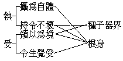
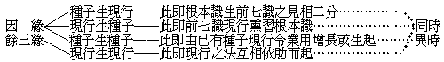
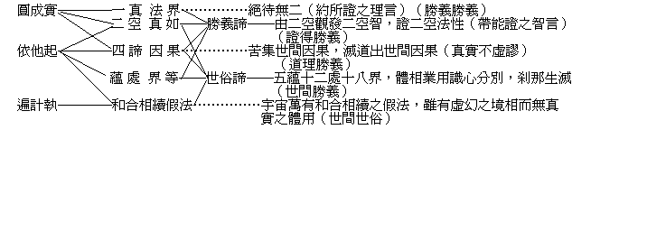

# 唯識三十論講錄
（1921 年 2 月，在杭州幽冀會館講）
唯者，遮格揀除之義。識者，明了分別之義。離識非有，在識非無，立唯識名。即識之唯，離識無餘，故言唯識，是持業釋。言三十者，為簡二十，亦頌數名。合名唯識三十者，持業帶數釋也。又、唯識為所詮，論為能詮，云唯識三十之論，依主釋；亦可謂帶數依主釋。又、唯識三十即論，持業釋也。

又、明了分別之識有八：一、眼識，二、耳識，三、鼻識，四、舌識，五、身識，六、意識，七、末那識，八、阿賴耶識。眼識明了分別色塵，耳識明了分別聲塵，乃至意識明了分別法塵，末那任運了別妄執內自我相，阿賴耶任運了別根身器界及種子。一切諸法，離識俱無。又有立六識者，即眼、耳、鼻、舌、身、意六識、如俱舍論。九識者，於八識外立第九庵摩羅淨識，如梁朝真諦。本論則唯有八識，奘師謂第九祇是第八異名也。雖然，此皆依俗諦言，非真勝義。真勝義者，法即真如，平等一味，超過數量，非一非異，心言絕故，識且無識，八安有八？

又、唯識有四分義：所明了分別之色聲等曰「相分」，能明了分別色聲等者曰「見分」，同時證知能明了分別者緣所明了分別不謬曰「自證分」，更同時證知能證知心曰「證自證分」；四分義成，唯識安立。又相分、見分為用，自證分即其體也。又唯識者，有自性唯識——即心王有八，有相應唯識——即心所有五十一，有唯識所變——即色法十一，有唯識分位——即不相應行法二十四，有唯識實性——即無為法六。又有境唯識——教唯識、理唯識——，行唯識，果唯識之三義或五義。

又、唯識論有宗論、釋論之別。宗論即本論等，釋論即護法等十大論師相繼所造之釋論等。

> **世親菩薩造。三藏法師玄奘譯。**

世親，即天親。菩薩，即菩提薩埵。菩提此云覺，薩埵此云有情。菩薩為自己已經覺悟之有情而又能覺悟其他之有情者，故即自覺覺他之義也。三藏，即經、律、論。能通經、律、論法，故曰三藏法師。玄奘、師之法諱，法師由梵士取歸經論甚多，此論即譯自梵來者。

> **護法等菩薩，約此三十頌，造成唯識論。**

此為玄奘法師敘述之語。護法等者，等於親勝、火辨、德慧、安慧、難陀、淨月、勝友、陳那、智月十大論師，相繼注釋，顯揚論旨。就中護法立義，尤為周足，故奘師宗之。

> **今略標所以，謂此三十頌中，初二十四行頌，明唯識相；次一行頌，明唯識性；後五行頌，明唯識行位。就二十四行頌中，初一行半，略辨唯識相；次二十二行半，廣辨唯識相。**

此即科判也，列表如下：——


```
　　　　　　　　　　　　　　　　　┌略論宗旨……………………由假說我法等
　　　　　　　　　　　　┌略標識相┤
　　　　　　　　　　　　│　　　　└彰能變體……………………此能變唯三等
　　　　　　　　　　　　│　　　　　　　　　┌第一能變………初阿賴耶識等
　　　　　　┌第一唯識相┤　　　　┌明能變體┤第二能變………次第二能變等
　　　　　　│　　　　　│　　　　│　　　　└第三能變………次第三能變等
　　　　　　│　　　　　└廣明識相┤正辨唯識……………………是諸識轉變等
　　　　　　│　　　　　　　　　　│　　　　┌違 理 難………由一切種識等
　　　　　　│　　　　　　　　　　└釋諸外難┤
　　　　　　│　　　　　　　　　　　　　　　└違 教 難………由彼彼遍計等
　　　　科判┤第二唯識性………………………………………………此諸法勝義等
　　　　　　│　　　　　┌資糧位……………………………………乃至未起識等
　　　　　　│　　　　　│加行位……………………………………現前立少物等
　　　　　　└第三唯識位┤通達位……………………………………若時於所緣等
　　　　　　　　　　　　│修習位……………………………………無得不思議等
　　　　　　　　　　　　└究竟位……………………………………此即無漏界等
```


又、按照佛教各宗共通之境、行、果、三種次第，以判攝此論之三十頌本，表舉如下：——


```
　　　　　　　┌唯識相……………………………………前二十四頌
　　　　唯識境┤
　　　　　　　└唯識性……………………………………第二十五頌
　　　　唯識行………………………………………第二十六二十七頌
　　　　　　├─……………………………………第二十八二十九頌
　　　　唯識果…………………………………………………第三十頌
```


> **謂外問言：若唯有識，云何世間及諸聖教說有我法？**

問意在說有二字，謂說有則非無。世間說有之我，即情、命等；說有之法，即實、德、業等。聖教說有之我，謂預流、一來等；說有之法，謂蘊、處、界等。又我謂主宰，法謂軌持。主有自在力，宰有割斷力；又主是體，宰是用、約主宰義故名我。軌範可生物解，任持不捨自相，約軌持義故名法。本論所說之我字，較金剛經所說之我相，範圍寬廣，正包含彼經所謂我相、人相、眾生相、壽者相。所說之法，包含世間法、出世間法而言。

> **舉頌以答。頌曰：『由假說我法，有種種相轉，彼依識所變。此能變唯三：謂異熟，思量，及了別境識』。**

由假說我法以下，答問之辭。由，即下所說之理由也。假說，假字有二義：一、無體隨情假，本無自體，隨情執有，世間我法，正復如是。二、有體強說假，唯識相性，眾生迷惑，佛說我法，隨位設施。種種相，即種種有情、命者、預流、一來之我相，及種種實、德、業、蘊、處、界之法相。轉，有轉變、轉起二義。彼、指種種我相、法相。謂外問既有種種我法相轉，究竟依何法得成？則曰：依識所轉變而假施設也。

此能變之識，雖有八種，以類別之，則唯有異熟——第八識，思量——第七識，及了別境識——前六識之三種。及字，依六離合釋，為相違釋。又、第八識非絕對無思量及了別境之功能，不過在比較上其思量功能，不及第七識之勝；了別境功能，不及前六識之勝。第七識，亦非絕對無異熟性——第七識可有絕對無異熟性義——及了別境之功能；前六識，亦非絕對無異熟性及思量之功能。不過第七識之異熟性與其了別境功能，不及第八識與前六識之勝；前六識之異熟性與思量功能，不及第八識與第七識之勝耳。此中異熟、思量、了別境，皆依其性能之最勝者而立名也。異熟之名，較阿賴耶為廣，較阿陀那為狹。

> **次二十二行半廣辨唯識相者，由前頌文略標三能變，今廣明三變相。且初能變，其相云何？頌曰：『初阿賴耶識，異熟，一切種，不可知，執受處，了，常與觸、作意、受、想、思相應，唯捨受，是無覆無記，觸等亦如是，恆轉如暴流，阿羅漢位捨』。**

前已舉能變識之名，今次第明其義相。初能變阿賴耶識，亦譯無沒識。阿，譯為無，如阿彌陀佛譯為無量壽佛，阿耨多羅三藐三菩提譯為無上正等正覺。又無沒，約義不如藏義更深廣。奘師譯為藏識，以其具能藏、所藏、我愛執藏三義。能藏者，謂藏有世出世間、有漏無漏一切法之種子，有如大地藏有發生萬物之種子也。所藏者，謂此識受轉識所熏成種，隨業受報也。我愛執藏者，謂有情之第七識執之為內自我體，念念不忘也。阿賴耶三藏之義，以我愛執藏為尤重要。此明其「自相」也。又、能藏含有因相之義，所藏含有果相之義。

第八識又名異熟，異熟之義有三：一、異類而熟，類、約性——性即善惡無記三性——言，熟、成熟義，謂因從善惡，果惟無記。二、異時而熟，謂因與果不同時，如春種秋收，今生作業他生受報。三、變異而熟，謂雖有業因，亦待緣起，由種成現，形量便異。異熟之義，以異類而熟、異時而熟為尤重要。第八為真異熟，由真異熟主體而發生前六識等之異熟，名異熟生。此名其果相也。

一切、為概括之辭，一切種者，謂世出世間諸法之種種不同，其性質皆決定於種種不同之種子，藏識中能發生一切法之功能力用，即謂之一切法之種子。此明其因相也。

以上阿賴耶、異熟、一切種，皆為第八識之異名。然尚有「阿陀那」、「庵摩羅」等各種名目，各名目意義，亦各廣狹不同：——


```
　　　　│眾 生 位│三乘聖位│佛　　位│
　　　　│異　　熟│　　　　│　　　　│
　　　　│阿 賴 耶│異　　熟│庵 摩 羅│
```


阿陀那、一切種，則通眾生三乘聖及佛位。阿賴耶，在眾生位有，三乘聖位——阿羅漢、辟支佛及八地上菩薩——已捨矣。異熟，眾生位、三乘聖位俱有，佛位已捨矣；此時即名為庵摩羅識。

不可知者，謂此識所緣之五淨色根，及諸種子甚微細；又所緣之外器世間，廣難測量。而其能緣行相，亦極幽妙。執受處，此為所緣境。第八識有三種境界，即根身、器界、種子。而根身與種子為其執受，器界即處。又執受各有二義：——




了、謂此識以微細了知為行相。

常與觸、作意、受、想、思相應，此言其相應心所法，心所法即心之屬性也。觸，謂根、境、識三者相和合變異而生。作意，謂警動心中之種子而起現行。受，謂領納順境、違境、俱非境之樂受、苦受、捨受。想，謂心上所起之分齊相，即種種名言所依之而立。思，謂心上所起之行為力，即種種事業所由之而成。相應，有非一非異義，非一者，各有體相業用之不同；非異者，謂所緣之事同，與其性同——如八識為無記，心所法亦為無記——且起滅同時，行動一致。此皆就凡夫位上而言，若佛位則八識平等，惟有二十一種心所相應，即遍行五、別境五、善十一也。

唯捨受，此言第八識唯有捨受，無苦、樂故。無記，有有覆、無覆二種。無記者，不能以善惡記定之也。覆，即覆障，第八識因無覆故，能藏一切有漏、無漏種子。此亦就凡聖位言，佛位惟是善故。觸等亦如是，此言第八識之相應心所，亦為無覆無記也。

恆轉如暴流者，恆則非斷，轉則非常；恆故因果相續，轉故因果變異。望前名果，望後名因，相對立言，喻如暴流。蓋謂第八識自無始以來，一類相續，常無間斷；亦念念生滅，前後變異。

阿羅漢，此言無生，煩惱不生名阿羅漢。捨，指初阿賴耶；異熟則至最後捨故。阿賴耶之我愛執藏過失最重，此位究竟盡也。三乘之聲聞乘第四果，緣覺乘之辟支佛果，永斷俱生我執；大乘菩薩八地以上，永伏俱生我執，皆名阿羅漢，捨阿賴耶之名。又如來位中并捨異熟識名，但名一切種識，亦名菴摩羅識，亦名大圓鏡智相應心品也。

> **已說初能變相。第二能變，其相云何？頌曰：『次第二能變，是識名末那，依彼轉，緣彼，思量為性相。**

末那，梵語，此云意。但與第六識名同義不同：六識名意，依意之識，依主立名——即依第七得名。如舍利弗依母得名，然舍利弗與其母固非一人。七識名意，即意即識，持業立名——即自體之功能上得名。故二者同名而異體也。意，即恆審思量，此第七識，恆審思量業用勝餘七種識故。

彼，指阿賴耶識。轉，謂變現生起。謂第七識以現行之阿賴耶識為根本依，以阿賴耶識中所藏第七識之種子為種子依。蓋七八二識無始以來，同為恆常無間，互相為依。即第八識以第七識為俱有依，而第七識以第八識為俱有依。又七識依八識之自體分而轉變生起。緣，謂緣慮。彼，亦指阿賴耶，但專指阿賴耶之見分。第七識所依之根，所緣之境，雖皆為第八識，但其緣為內我之專一境，非第八識之相分，不專一故；亦非第八識之自證分及證自證分，唯第八識自證知故。

思量為性相者，思有令心造作之業用，量有決定判斷之智慧。性謂體性，相，謂行相。第七識恆審思量，恆無間斷，審無猶疑。所思量者，唯取第八識之見分為內自我，體性如是，行相亦如是。又八識有思無慧，故恆而不審；六識有思有慧，但忽起忽滅，故審而不恆；前五識有間斷、無分別，故不恆不審；惟第七識恆審思量，勝餘七識。

> **『四煩惱常俱，謂我癡，我見，并我慢，我愛。及餘觸等俱。**

煩、謂煩躁擾動，惱、謂惱亂身心。癡、即無明。見、即妄執。慢、即倨傲。愛，即貪著。我，包括人我法我而言。人我即執我為實在，法我即執法為實在。此我字，較上言——我法——之我字義更廣。無明者，不明心之實相，因之生妄見——即我見。見者，執也，見解固定之意。由妄見，即有倨傲高舉；由有倨傲高舉，即生貪著，是故我執即煩惱之根本，亦可謂根本煩惱，即異生性。又愛即貪著，貪著與瞋相反，末那具我愛，故不具瞋心所。見即執著，執著與疑相反，末那具我見，故不具疑心所。此六根本煩惱中所以祇具四也。又第七識與第六識，俱有人法二我執，而根本則在第七識。眾生有智愚、賢不肖之不同，即緣癡、見、慢、愛輕重多寡之有異；且染污清淨，唯視七識之所轉也。其餘相應之心所，則有觸等五遍行，因其遍與八識心王相應故。有別境之慧，因七識能審故；及不信、懈怠、放逸、昏沉、掉舉、失念、不正知、散亂——八種大隨煩惱，因大隨遍諸染污心故。

> **『有覆無記攝，隨所生所繫，阿羅漢、滅定、出世道無有』。**

第七識，有四種煩惱常俱，故為有覆。其自體染污，不能謂之為善；亦不能謂之為惡，故為無記。以其現行染法所依之識，極微細故，無強計度，任運轉故。第七識，隨阿賴耶識所生何界，即於何界繫縛，以其念念執阿賴耶為我故也。此即根本無明，無始以來迷惑真性，隨生界地，依託藏識不相捨離。此第七識，恆審思量，妄執有我，至無生之阿羅漢位，方得永斷；滅定位中伏現行，此識暫伏；出世道中初轉智，此識亦暫伏。

> **如是已說第二能變。第三能變，其相云何？頌曰：『次第三能變，差別有六種，了境為性相，善、不善、俱非。**

此言第三能變差別有六種也。六種、即眼識，耳識，鼻識，舌識，身識，意識。此各識皆依主立名，如眼識以依眼根而發識，耳識以依耳根而發識等。境，即六塵境界，六塵即色、聲、香、味、觸、法。六識各有自分境界，亦各了別自分境界，如眼識不能了聲塵，耳識不能了香塵等。因六識同以能了別之功能勝，故總名了別境識。亦有名六識為色識，聲識，乃至法識等者，此為依士釋。依根名識，根為八識所變相分，勝故為依主；依塵名識，塵為六識自變相分，劣故為依士。又其體性、行相，皆為能了別塵境。善、不善、俱非者，俱、指善、與不善。俱非，即無記。六識通於善、不善、俱非三性。當其與善心所相應而起即為善，與不善心所相應而起即為不善，與俱非即為無記。但第六識最強而有力，無所不能，無所不為；前五識隨從第六識之善與不善或無記而造業，故能使前五識有三性者力在六識。

> **『此心所遍行、別境、善、煩惱、隨煩惱、不定，皆三受相應。**

此者，統六識言。遍行，謂遍行一切心王，遍行一切界地，遍行一切性。別境，謂特別境界。善，謂能為現在將來自他順益者。順、即與本性如來藏相順，益、即開顯本性如來藏。善有無漏、有漏之別，眾生因七識執我，所為善業亦帶有染污，謂之有漏善。至破我執後，本地清淨，則謂之無漏善。煩惱，謂煩躁擾動、惱亂身心。隨煩惱，謂隨根本煩惱而有。不定，謂不定三性。又、隨煩惱有小、中、大三種。小隨煩惱，謂忿以下十個，業力最猛，通惡性不通無記性，力強而狹，故名小隨。中隨煩惱，謂無慚、無愧，不通無記。自類相通，比小隨較廣，故名中隨。大隨煩惱，謂通惡及無記性，且恆與根本煩惱相應，故名大隨。

受，有憂、苦、喜、樂、捨之五種。在心為憂，為喜；在身為苦，為樂故。又名三受者，六識皆能領納違、順、俱非境相，故三受相應。

> **『初遍行觸等。次別境謂欲、勝解、念、定、慧，所緣事不同。**

遍行，已詳初能變中，故言觸等以略之。

別境所緣事實，各有不同。欲、即希望，謂於愛境希望其合，於惡境希望其離。勝解、即明確見解，有審決無猶豫。念、即憶過去之境，記取往境，分明不忘。定、即專注一心不亂，有如承蜩。慧、謂推求簡別，微細分析，了然決定。以上五種所緣，各有別境之不同也。

> **『善謂信、慚、愧、無貪等三根、勤、安、不放逸、行捨、及不害。**

信，即信實、德、能。實者，有實事實理二義。實事如法界因果，實理如唯識相性。德者，真淨之德。能，廣大功能。信實、德、能，即為善法之根。慚、即依自法力，崇重賢善；愧、即依世間力，輕拒暴惡：皆能止息惡行。無貪等者，等無瞋、無癡。根、謂其生善一切最勝，如木之根底，幹枝花葉即由之而發生也。無貪者，於有——即欲界、色界、無色界三界有果，有具——即欲界、色界、無色界三界有因，厭離而無愛著。無瞋者，於苦——三界苦果，苦具——三界苦因，不生瞋恚。無癡者，即無無明，於諸事理分明了解。勤、亦名精進——即六度中精進波羅密——即未生善令生，已生善令廣，未生惡遏令不生，已生惡斷令不續。安、即輕安，謂離三毒麤重昏懵如釋重負，身心輕快安隱堪行善行。謂修禪定，能令所依止麤重身心，轉為輕安暢適。不放逸，於所斷惡防令不起，於所修善引令增長，善惡之外亦對治無記。行捨，謂由精進力捨貪、瞋、癡，令心平等正直，任運入道。此捨非受之捨，即金剛經心無所住，不依斷、不依常、亦非依有、非依無等修禪定般若，念念捨之即念念行之；如行道然，不捨前步則後步不進。不害，即悲愍眾生不為損惱，亦即大悲。

> **『煩惱，謂貪、瞋、癡、慢、疑、惡見。**

此即根本煩惱，為諸隨煩惱之根本，為二種生死之根本。有六種：貪，愛欲為因，愛命為果，所謂於有、有具，耽染愛著。瞋，以貪為根，遇有逆境，憎嫉忿恚，所謂於苦、苦具，瞋恚惱悶。癡、即無明，有二種：一、根本無明，不明心性而生法我二執，多迷諦理，謂之理癡。二、枝末無明，不明因果而生邪見惡見等，多迷事相，謂之事癡。慢著，謂我慢。慢有七種：慢——於劣計己勝，於等計己等，令心高舉；過慢——於等計己勝，於勝計己等；慢過慢——於勝計己勝；我慢——於五取蘊，隨觀為我或為我所；增上慢——於未得增上殊勝七證法中，謂我已得；卑慢——於多分殊勝，計己少分下劣；邪慢——實無德計己有德：是皆以我慢為主。疑、謂狐疑不信，無決定見，約依六事而生：一、聞不正法，二、見師邪行，三、見所信受意見差別，四、性有愚魯，五、甚深法性，六、廣大教法是也。惡見、亦名不正見，有五種：一、身見，即薩迦耶見，執身為我。二、邊見，即我見增上之力，隨彼所執起斷常有空見。三、邪見，不信正法，此見如增上緣，四見所不攝者皆此見攝。四、見取，偏執己見。五、戒取，持牛狗等戒及彼所依諸蘊。

> **『隨煩惱，謂忿、恨、覆、惱、嫉、慳、誑、諂、與害、憍。**

此為十小隨。言隨者，以隨他根本煩惱而生。隨有三義：謂自類俱起，遍不善性，遍諸染心。具三名大，具二名中，俱無名小。忿等十法，行相麤猛，各自為主；然唯於不善心中各別而起，若一生時必無第二，故名為小。一、忿者，憤怒發起，能生暴惡，瞋一分攝。二、恨者，先有忿恨，懷惡不捨，亦瞋一分攝。三、覆者，自己罪惡，隱藏遮護，癡一分攝。四、惱者，忿恨在先，觸違發怒，亦瞋一分攝。五、嫉者，不耐他榮，因生嫉妒，亦瞋一分攝。六、慳者，耽著財法，祕吝不捨，貪一分攝。七、誑者，以詐欺人，矯現獲利，貪癡二分攝。八、諂者，巧言令色，阿諛曲媚，亦貪癡二分攝。九、害者，逼害有情，無悲無愍，瞋一分攝。十、憍者，矜高自恃，醉傲凌人，貪一分攝。又、憍有七種：即無病憍，少年憍，族性憍，色力憍，富貴憍，多聞憍。

> **『無慚及無愧。**

此為中隨二。二法皆自類俱起，但遍不善性，不通有覆，故名中隨。無慚者，不自羞恥，輕拒賢善。無愧者，不羞於人，崇重暴惡。經云：『有二句法，能救眾生，一、慚，二、愧。慚者，自不作罪；愧者，不教他作。慚者，內自羞恥；愧者，發露向人。慚者羞天，愧者羞人』。

> **『掉舉、與昏沉、不信、并懈怠、放逸、及失念、散亂、不正如。**

此為大隨八。八法自類俱起，遍不善性，不可名小；染心皆遍，不得名中。二義既殊，故名為大。掉舉，輕舉妄動，令不寂靜。掉舉有三：身掉舉亂動，口掉舉亂言，意掉舉亂思。昏沈，昏昧沈重，無所堪能，有深淺輕重之不同。不信，無有誠信，不起樂欲。懈怠，懶惰成性，無精進力。有我執即有身心之相，故有懈怠。放逸，放蕩縱逸，不自簡束，六根放逸，善損惡增。失念，忘失正念，心有散亂，不知不覺之念忽起忽落。散亂，馳散外緣，流蕩忘返。如坐禪時，心念紛飛，攀緣外境，失其正念，此為散亂。不正知，謬解觀境，不了實相，若事若理若因若果，不能真實了知。

> **『不定，謂悔、眠、尋、伺、二各二』。**

不定謂通三性。悔，亦謂惡作，已作未作，事後追悔。眠，意識昏熟，心極闇劣。尋、謂尋求，但求其概，逐外粗相。伺、謂伺察，微細考察，伺內細境。粗者、聊且之辭，細者、綿密之謂。此二並用思、慧一分為體，於意言境，深推曰伺即思，淺推曰尋即慧。深推則神凝，故身心舉安；淺推則躁動，故身心不安。若離思、慧，此二差別便不可得。二各二者，悔、眠為一類，尋、伺為一類，言二類各有二種；亦可謂二類各通善染二性也。

> **已說六識心所相應，云何應知現起分位？頌曰：『依止根本識，五識隨緣現，或俱或不俱，如濤波依水。意識常現起，除生無想天，及無心二定，睡眠與悶絕』。**

此明前六轉識現起分位。依者，依之而起，依之而存在。止者，止宿。根本識，即初能變阿陀那識。阿陀那、此云持，能持一切法之自性自相令不失壞。前六識以阿陀那識為共同依，即以阿陀那識為其不起現行之種子所止宿之處。

緣，有因緣、增上緣、所緣緣、等無間緣之四種。識之生起現行，必待眾緣具足。如眼識，須具明、空、境——即所緣緣、作意、根——俱有依、意識——分別依與五識共同而起、末那——染淨依、種子——因緣、本識——根本依等九緣。復有等無間緣，為各識之開導依。耳識有八緣，唯除明緣。鼻、舌、身七緣，除空、明二緣。六識有五緣：一、根緣，二、境緣，三、作意緣，四、根本依緣，五、種子依緣。七識有三緣：一、根緣，二、作意緣，三、種子緣。八識有四緣：一、根緣，二、境緣，三、作意緣，四、種子緣。五識所藉緣多，所以有間斷，俱則生不俱則不生。水、喻根本識，波濤、喻前五識。前五識之依根本識而起，必待眾緣具足，正如波濤之依水而起，有待風動之緣。第六意識，待緣既少，故常得現起。但無想天、無想定、滅盡定、睡眠、悶絕之五位中意識不起。

> **已廣分別三能變相為自所變二分所依，云何應知依識所變假說我法、非別實有，由斯一切唯有識耶？頌曰：『是諸識轉變，分別、所分別；由此、彼皆無，故一切唯識』。**

三能變相，即指三能變識之自證分。所變二分，即相分、見分。言自所變相分、見分皆依自證分而起，即自證分為相分、見分所依也。是諸識、指三能變及其相應之心所法。轉變者，謂一一法之自體，皆能變似相見二分，即由識之種子起現行之相。分別、指所變見分，所分別、指所變相分。由此正理，彼實我法決定非有，是故一切世出世間有漏無漏之法，無不唯識。

> **若唯有識都無外緣，由何而生種種分別？頌曰：『由一切種識，如是如是變，以展轉力故，彼彼分別生』。**

問：若唯識無境，由何而得種種心生？既無外境牽心，心識緣何而起？答：由一切種識、即第八根本識，含藏各識及諸心所法各各親種子，由此一切種子熏習生長乃至成熟，轉變不一。如眼識從親種子變生眼識現行，能分別色。耳識從親種子變生耳識現行，能分別聲。乃至身識從親種子變生身識現行，能分別觸。六、七、八各識皆然。又一切識之生起，不外因緣：——




展轉，有互相為緣互相輔助之義。彼彼、即種種，謂八種識及諸心所法。分別生，即言分別所分別之見相二分由此而生。此頌與下頌義，唯識二十論詳言之，可參閱。

> **雖有內識而無外緣，由何有情生死相續？頌曰：『由諸業習氣，二取習氣俱，前異熟既盡，復生餘異熟』。**

問：若無外緣內心不起，內心不起業無自生，何以世間有情生死相續？答：有情生死相續，皆由內之因緣。諸業，謂福業——自體及果俱可愛樂，相殊勝故；非福業——自體及果俱不可愛樂，相鄙劣故；不動業——具業多少，住一境性不移動故，習氣，謂熏習——亦即結習，即種子——氣分。二取習氣，即指我執取、名言取。此二取，俱有執著義。計有四種：一、取相分見分，二、取五蘊名色，三、取心及心所，四、取本末，本即第八識總報，末即前七識別報。彼四種所取，皆是我執名言二取所攝。又諸業習氣內，具有二取習氣。二取習氣，有如灰土；諸業習氣，有如泥團。泥團能攝灰土，諸業習氣亦攝二取習氣。即分散為二取，和合為諸業。俱，謂業種與二取種俱，是親疏緣互相助義。前異熟，謂前一生乃至前百千生，業力所感之異熟果。餘異熟，謂感後一生乃至感後百千生業力之異熟果。蓋三界內分段生死，由有漏善與不善之業種子為因，煩惱障種以為助緣，招於六道身命麤異熟果，前盡後生。即三界外不思議變異生死，亦由無漏有分別業種子為因，所知障種以為助緣，感於三種意生身細異熟果，前後改轉。是則二種生死，皆由內識惑業所感，固無藉乎外緣也。

> **若唯有識，何故世尊處處經中說有三性？應知三性亦不離識。所以者何？頌曰：『由彼彼遍計，遍計種種物，此遍計所執，自性無所有。依他起自性，分別緣所生。圓成實於彼，常遠離前性。故此與依他，非異非不異，如無常等性；非不見此彼』。**

問：若唯有識，經不應說有三性！答：言三性者，亦不離識。三性即下言遍計執性，依他起性及圓成實性也。彼彼、猶言種種，遍、周遍，計、計度。即依見相二分，加以刻畫計度，宇宙萬有由此而著。此妄執自性差別，名為遍計所執自性，如是自性，空無所有。又、遍計執性，或言：八識皆有，因八識皆具見相二分，而此遍計執性即為於見相二分上有分別故。然第八識及前五識，非能遍計。或謂：惟六識有遍計執。然執性畢竟起自末那，故護法言：遍計執性，唯於第六第七心品有之。蓋見相二分是依他而起，由依他起性虛妄執著，即為遍計執性矣。如黑夜見樹，執以為鬼，畢竟非有。他、指眾緣，依他、言仗因託緣，如眼識九緣生，耳識八緣生等。分別、言明了分別之識。生、即眾緣之集現。謂此心心所法及見相分有漏無漏，皆依眾緣而生起，悉由識心分別而顯現。如黑夜見樹，形相實有。圓、謂圓滿，成、謂成就，實、謂真實。彼、指依他起性。前性、指遍計執性。言此圓滿成就真實之法，體非虛妄，即於彼依他起性上常遠離遍計性。如枯樹非鬼，鬼無樹有。

此、指圓成實性。非異者，圓成實之真如，即依他起之實性。非不異者，依他起為一切有為之法相，圓成實乃一切無為之法性。無常、即生滅，性、即真理，等者，等於無我。言一切生滅之法，各有差別之相，亦共有無常、無我之性。共有無常等性，所以非異；各有差別之相，無常自無常，法自法，所以非不異。此、指圓成實性，彼、指依他起法。非不見，猶言見也。即言非不見圓成實性，而能見依他起性。又、圓成實性，義較真如為廣，即果位中有為無漏之法亦屬之。更分判如次：——




> **若有三性，如何世尊說一切法皆無自性？頌曰：『即依此三性，立彼三無性，故佛密意說：一切法無性。初即相無性，次無自然性，後由遠離前所執我法性。**

問：若有三性，世尊何以說一切法皆無自性耶？答：無性即識性。言即依此三性立彼三無性名，為遣執故也。密意者，方便之謂，有含而未露、說而未盡之意。為開悟故說有三性，表詮以表示自性；為遣執故說三無性，遮詮以遮撥自性。此方便立言，非了義之極談也。相者，對待之假相，有分限、有邊際、一切名言由此安立。而分限邊際之假相即由周遍計度之所生，體相非有，如空中華，故立相無性。自然者，本來如是之謂，依託眾緣而起則非本來如是可知，故立無自然性——即生無性。後由遠離前——指遍計執性——所執我法性者，言從本以來，不與遍計執性相應，故立勝義無性——即真如無性。

> **『此諸法勝義，亦即是真如，常如其性故，即唯識實性』。**

此、指圓成實性。勝義、第一最真實之義。言圓成實性為諸法中第一最真實之義。真如者，不虛妄之謂真，遮遍計執虛妄之法；不變異之謂如，遮依他起生滅之法。即無有一法可取為真如之相，亦無真如之名可立。起信論云：『言真如者，亦無有相。謂言說之極，因言遣言，此真如體無有可遣，以一切法悉皆真故；亦無可立，以一切法皆同如故。當知一切法，不可說、不可念，故名為真如』。常如其性，言真實而不虛妄，如常而無變易，隨緣不變，不變隨緣，故此為識之實性也。

> **後五行頌，明唯識行位者，論曰：如是所成唯識相性，誰依幾位，如何悟入？謂具大乘二種種性：一、本性住種性，謂無始來依附本識，法爾所得無漏法因。二、習所成種性，謂聞法界等流法已，聞所成等熏習所成。具此二性，方能悟入。**

言上已明三能變及相分見分等唯識之相，與諸法勝義及真如等唯識之性。相即事，性即理，事理已俱明矣。問：如此唯識相性，誰人悟入？幾位悟入？如何悟入？大乘之大，簡別之辭，以遍常為義。如起信論所謂：體、相、用之三大。乘者譬喻之名，以運載為義。如起信論謂：過去現在諸佛，曾從凡愚地由運載以至大覺地故；現在未來諸覺有情，皆由運載以至如來地故。種性，猶言種類，即種子類別。本性住種性，即本有之大乘佛性，起信論所云之「本覺心」是也。無始來依附本識法爾所得無漏法因，猶言無始以來根本識本具法爾所得——法有軌持之義，爾者如是之謂，得者成就之義——無漏法因。漏有破敗不完美之義，亦即煩惱生死，煩惱業上之有漏，生死果上之漏。無漏法，即諸佛究竟無上菩提、涅槃。習所成種性之習，即熏習，熏習所成之佛性，起信論所云之「始覺心」是也；聞法界等流法已，聞所成等熏習所成。法界、即一真法界，即事理法界，亦即唯識相性之現量證境。等、謂同等，流、指佛所說經、菩薩所造之論皆從法性流出。即言聞佛所說經、菩薩所造之論熏習而成佛性。具此本因、熏習二性，方能悟入唯識相性。悟、有漸悟、頓悟之別，此中所言即為頓悟。蓋由唯識相性之教，解唯識相性之理，修唯識相性之行而證唯識相性之果也。

> **何謂五位？一、資糧位，謂修大乘順解脫分，於識相性能深信解。其相云何？頌曰：『乃至未起識，求住唯識性，於二取隨眠，猶未能伏滅』。**

資、謂資具，糧、謂糗糧，譬喻之名也。謂此位順大乘法性，修十波羅密降伏惑業，於唯識性相信心成就，能分明現前了然不昧。解、即勝解，亦即理觀忍可。此頌，言資糧位分際及其功行。資糧位，包括十住——理觀，十行——事觀，十迴向——理事不二之三位。乃至云者，承上而言，有超略初住至第十迴向意。未起識，猶未證得唯識性相，即未證得真如。然已發深固大菩提心，求住唯識真勝義性。二取、謂能取、所取，即見相二分之功用。能取為我執，所取為法執。隨眠、能隨起現行眠息種子，此位尚未能摧伏斷滅隨眠種子，但能伏分別二執之現行耳。

> **二、加行位，謂修大乘順決擇分，能漸伏除所取能取，引發真見。其相云何？頌曰：『現前立少物，謂是唯識性，以有所得故，非實住唯識』。**

加行位者，加力進行，謂菩薩先於資糧位善備福德智慧，順解脫分亦既圓滿，為入見道住唯識性，乃加力進行。順大乘法性，起決定選擇之真見道出世慧。於此有煖、頂、忍、世第一等四法。此四法，依四尋思、四如實智之初位後位而立。即尋思能詮之名言，尋思所詮之義相，尋思名言義相之自性，尋思名言義相之差別，一一假有實無。若能如實遍知此四離識非有，及知能取之識亦復如是，即轉名如實智。煖者，依明得定發下尋思，觀無所取。即名無得物之功，故名是假有，物無當名之實，故義是假有。名義之自性既非實有，則名義之差別亦豈實有，皆是隨心變現施設而已。以此尋思，歷觀蘊處界等若名、若義、若自性、若差別皆不可得。此即是慧日道火前相，能破眾生長夜迷闇執著。頂者，依明增定發上尋思，數數修習所取實不可得之觀，令其增盛，如登山頂周觀無礙。忍者，依印順定——印前所取空，順後能取空，名印順定——發下如實智，於無所取決定印持，無能取中亦順樂忍；既無實境離能取識，寧有實識離所取境，所取能取但是相待立故。印順忍時，印前所取空，順後能取空，立印順名，忍印取境之識亦空。大乘止觀云：『疆觀諸法唯是心相虛狀無實，復當觀此能觀之心亦無實念』，正同此中四加行觀。世第一者，依無間定發上如實智，雙印能所二取皆空。前上忍唯印能取空，今世第一法二空雙印，從此無間必入見道，故立無間名。異生法中此最勝故，名世第一法。如實智之後位，故名為上。前忍位中，下忍印所取空，中忍順能取空，上忍印能取空，今乃二空雙印，必入真見道也。如是煖、頂，依於能取之識、觀所取之境本空。下忍起時印境空相；中忍轉位，於能取識亦如境之是空，順樂忍可；上忍起位印能取空。世第一法，雙印空相。此唯識觀之行相，入真見道之司南也。

立少物，少物即空。基云：『心上變如，名為少物』。學記解云：『見所執無即如相現，猶如穿壁虛空現故』。如顯揚云：『彼二我無，即是二無我有』。又佛地論明遍計言：『心所現無，依他起攝；真如理無，圓成實攝』。是則所執空影名變如相也。謂諸菩薩於此四位，猶於現前安立少物，謂是唯識真勝義性。以彼空有二相未除，帶相觀心，有所得故，非安住真唯識理也。蓋煖位、頂位依識觀空，則境空識有；下忍印成境空，上忍印成識空，世第一法，雙印二空，皆帶空相，未得全除。彼相滅已，方實安住真唯識理，名通達位。如手雖不取物，尚留一空拳。

> **三、通達位，謂諸菩薩所住見道，如實通達唯識相性。其相云何？頌曰：『若時於所緣，智都無所得，爾時住唯識，離二取相故』。**

悟入唯識實性，即體會真如，名通達。見道明照真理，略說有二：一、真見道，是無分別根本智。二、相見道，是有分別後得智。前真見道、證唯識性，後相見道、證唯識相。根本智，有見分無相分，挾帶體相不變相狀故；後得智，見相二分俱有，變相觀真，分別說法故。此位菩薩於所緣境，無分別智都無所得。因無智外之如為智所證，亦無如外之智能證於如——此即證得真現量——，爾時乃名實住唯識真勝義性。即證真如，智與真如平等平等，俱離能所二取之相，不同有所得心分別戲論所現相也。

> **四、修習位，謂諸菩薩所住修道，如所見理數數修習，伏斷餘障。其相云何？頌曰：『無得不思議，是出世間智，捨二麤重故，便證得轉依』。**

以前所體會唯識實性，數數修習無分別智，摧伏斷滅無始俱生之我法執。無得者，遠離所取，亦離戲論。不思議者，遠離能取，妙用難測。出世間智、即無分別智。二取之隨眠，是世間之本，唯此無得不思議智乃能斷之。二麤重、即二障種子，以其性無堪任，違於精細輕安之無漏法故。依、謂所依，即根本識，依他起性與染淨法為所依故。轉、謂於依他起中染淨二分中轉捨染分，轉得淨分；即轉捨依他起上遍計所執，轉得依他起中圓成實性。亦即由轉煩惱得大涅槃，轉所知障證無上覺。蓋煩惱、所知二障種子，皆根本識之所執持，菩提、涅槃二轉依果，亦根本識之所本具也。

> **五、究竟位，謂住無上正等菩提，出障圓明，能盡未來化有情類。其相云何？頌曰：『此即無漏界，不思議、善、常、安樂、解脫身，大牟尼名法』。**

究竟位、即唯識果，無上正等菩提、即阿耨多羅三藐三菩提。以一真法界清淨為體，以四智——成所作智、妙觀察智、平等性智、大圓鏡智——為用。障，指二障、三障。無漏界，性淨圓明，即佛界。不思議，超過尋思言議道故。善，白淨法性。常，無生無滅，性無變易。安樂，眾相寂靜，永離違害。解脫身，永遠離煩惱障縛，即大自在我，時空無礙。大牟尼，大覺世尊，成就無上寂默法，謂永寂二邊，默契中道也。法，即法、報、應三身。法身，名自性身，即一切法平等實性；報身名受用身，有自受用身、他受用身；應身名變化身，即隨類化身。

