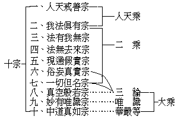
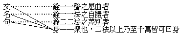
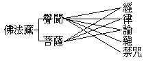
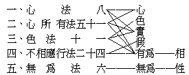
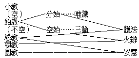
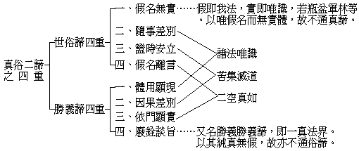

# 唯識講要
（1923 年，下學期在武昌佛學院講）

## 目錄

- 懸敘綱宗
    - 一　佛教機上之本論觀
    - 二　佛教時上之本論觀
    - 三　佛教宗上之本論觀
    - 四　佛教體上之本論觀
    - 五　佛教相上之本論觀
    - 六　佛教史上之本論觀
        - 甲　印度佛教史與本論
        - 乙　中華佛教史與本論
        - 丙　各國佛教史與本論
        - 丁　今後佛化之與本論
- 科釋文義
    - 一　科釋論題
        - 甲　唯識
        - 乙　唯識論
        - 丙　成唯識
        - 丁　成唯識論
    - 二　科釋論文
        - 甲　宗前敬敘分
            - １歸敬福田
            - ２敘釋論義
                - 一　依行位觀
                - 二　依目的觀
                - 三　依致用觀
                - 四　依判教觀
        - 乙　依教廣成分
            - 一　依教解唯識境
                - （一）彰唯識相
                    - （甲）略彰論旨辯唯識相


## 懸敘綱宗

### 　　一　佛教機上之本論觀

先觀佛教二字，就一往談，緣所現之身謂之佛，佛所說之法謂之教。次觀佛，含人與法，其人為地上菩薩現者，即他受用身，為二乘及六道凡夫現者，即變化身；其法即法性身、自受用身及平等所流之聲教，故佛是人佛，而教是法佛，佛與教皆是佛。次觀教，含言與身，言者佛之所說，身者佛之所現，故教是言教，而佛是身教，教與佛皆是教。然言佛教，不過名之與相，佛是名、詮覺者之相，教是名、詮文義之相，合而言之，無上正遍覺之五蘊和合假者、流出之文字言說及所詮義理，謂之佛教。

佛教由機，昔有二說：龍軍、無性等說：佛之圓圓果海，唯大定智悲，離形色文義相。但由佛果大悲願力，其善根成熟之有情於自心上現起形色文義相。然不言眾生教而名佛教者，以攝歸佛之本願力，故云佛教。護法、勝子等說：教由有情機感佛無漏心上現文義相，宜聞法者託為本質而現於自識上，然聞者於本質不能親緣，但託為本質而緣其自識相分。

近歐陽竟無居士，宗護法等立論，故於瑜伽真實品敘略云：「托質圓音，教則唯一，聞者識上，乘則有三」。但此義亦不可執定，所以者何？若就龍軍等說，佛果上本無能詮所詮之文義相，是無質可托；而護法等則佛心上文義由機感現，眾生之機感不同，則所托之質，亦各不同；如小機感佛心上現小教，大機感佛心上現大教，是則所托教不可定一。聞者如為一類頓機，不由小而入大，則所成乘，亦不能定三。然淨名經云：『佛以一音演說法，眾生隨類各得解』者，是就佛之平等意樂而說。佛之本願，如法華經言，皆以一乘平等濟度眾生，終不以二乘、三乘相度，此則以乘攝於平等意願，故教可說一。但因眾生差別機感不同，而聞佛言教，各自成乘，此則以教攝歸眾生機感，故乘可說三。然有從初發心，或是頓教大乘，或不定性，聞法遂歸大乘，斯又可說乘惟是一。以是義故，眾生之機可一可三，而乘與教，亦可說三說一，但得所說合理，不必執定。

凡眾生善根性欲之心理，即謂之機。然言眾生之機，有一性無別者，有五性差別者。言一性者，謂一切眾生皆有佛性也。言五性者，即一、無性，二、聲聞性，三、緣覺性，此名三無佛性，謂此三種性皆不能成佛也。四、不定性，五、如來性，此名二有佛性，謂此種性皆可成佛也。如來性是決定成佛，而凡言皆可成佛者，即就不定種性言也。然此一性五性別者，蓋以佛性二字，詮義不同。一、佛之性，此性即真如體。謂佛性即遍法界之平等真如，不但有情，無情亦依為性。如古德云：『翠竹黃花，皆有佛性』。禪宗，或問如何是佛？曰：『乾屎橛』。又曰：『有時以一莖草作丈六金身，有時以丈六金身作一莖草』等。則遍法界皆是佛性，何有一眾生而無之？以是故說眾生一性。二、佛即性，此又分二：一、謂心性，性者、是自相義，如火熱為自相，水濕為自相，地堅為自相，風動為自相，而心即以覺為其自相——如起信論云本覺——故此佛性即指心之自相。此心自相不及於無情，故就此言佛性，雖可云一性，而僅限於有情眾生。而清涼疏亦謂：在無情曰法性，在有情曰佛性。二、即法空智種，謂無法空智之種子，不能起法空智之現行，不起法空智之現行，不能斷所知障，不能斷所知障，不能成佛。故以此為佛性，以此而衡一切有情，則無二空智種者，謂之無性；無法空智種者，謂之聲聞性或緣覺性；兼有二空智種者，謂之不定性；具法空智種者，謂之如來性。由是可說眾生有五性差別。然論智種之具不具，復有二門：一、現實如是門：謂依眾生一剎那現行心，觀過去之過去，或未來之未來，皆不離此一剎那心；若此現前一剎那心無如來性，則盡未來際亦不能成佛。如是就現前一念心上，具不具二空智種等，則可說決定有五性差別。二、展轉增上門：不論現前一念之心或具不具，但由佛之平等意願為增上緣，務使一切眾生決定成佛，如法華言：唯有一乘法，佛種從緣起。雖無現具佛種，而有佛之增上緣、或菩薩等各各互為增上，亦得新起法空智種；依唯識之新熏種義，亦不相違。由是則五性可決定可不決定，應說有情非一非五性。了達此義，則於一性五性之說無惑，可進論由有情五性之機，感佛五乘之教，由佛五乘之教，應有情五性之機。

總括以上所談，約有二端：一曰、機感佛而教起，二曰、佛施教以應機。就第一論，賢首家判教，曾說教起因緣有十，今約言教起之要有三：一、佛本願故，如契經偈云：『毘盧遮那佛，願力周沙界，一切國土中，恆轉無上輪』——此則本無教起之相。二、法如是故，如經云：『法性遍一切處』；又云：『一切法皆是佛法』等——此則亦無法與非法之分別。故此二是普遍因，尚不足以言教起之因緣。三、機所感故，則因有機感佛，而佛亦因機施教，於是方有教起之可言。就第三論，亦可分二：初、就佛施教說，則佛見一切眾生皆有佛性，皆可成佛，如是則機是一性，故教亦唯一。次、就機所感說，則機有五性，而教亦因之有五乘，如人天乘被無性機，乃至佛乘被如來機等。

本論雖菩薩造，亦宗本佛之聖教而來，則本論所被何機，亦即知由何機所感。今觀本論多言五性——由阿賴耶識中無漏種子具不具等；又論首即談阿賴耶識，乃小乘所未建立，是為不共大乘。則知其所被機，為頓悟之菩薩性，為回小向大之不定性，不被無性人天及聲聞、緣覺等性。因是亦知此論由不定機及菩薩機而感來。但論中所談，亦有小乘因之得悟者，故此論可云：正被菩薩，兼被二乘。

### 　　二　佛教時上之本論觀

依釋迦如來一代時教之中，觀察此論屬於何時？故云：佛教時上之本論觀。在昔鳩摩羅什言一時教，至劉虬、菩提流支等說五時，天台亦配五時，嘉祥說佛轉三種法輪，賢首因之說三時，此皆支那判時教之所分。至在印度，亦有二派：一、清辨、智光等，以空為究竟，故判教分三時：一、一切法有時教，即小乘。二、境空心有時教，即唯識。三、心境皆空時教，即三論等。二、護法、戒賢等宗深密經亦言三時：一、有時教，即談一切法有等小乘。二、空時教、即遣有執之般若、三論等。三、非空非有時教，即唯識等。

本論宗六種經，二種未譯。今所譯來華者，即華嚴、楞伽、深密、密嚴四種。但本宗判教，亦分頓漸：於頓唯中，於漸則分有空中三。華嚴屬頓中，深密屬漸中。故本論被頓機即屬頓中，被漸機即屬漸中。

### 　　三　佛教宗上之本論觀

宗者、所尊所尚所主之旨也。就普通言，可略分十宗。




若就唯識言，則可分三：一、一切法有宗，人天小乘；二、一切法空宗，三論；三、中道唯識宗，華嚴唯識等。以華嚴等本唯識論所宗。故前之第九第十，皆可攝歸此第三中。

### 　　四　佛教體上之本論觀

依前來所講，教即能詮之文，及所詮之義，故教以文義為相。蓋凡有文必詮義，若無義即文亦無表現故。今觀能詮文即本論三十頌等，至所詮之義甚廣，實統括唯識境、唯識行、唯識果等。是故從所詮義上明體，則不啻從一切法上以明其體，故當從能詮文上以明體。能詮不出名句文身，茲釋名句文身之義如下：




今各經論，若從文觀，即全是一一聲之屈曲；從名觀，盡是一一法之自體；從句觀，亦是二法以上之差別所聚；故教即名句文身。百法論說名句文即不相應行之色心分位假法，以之詮教體，可分四門：

一、攝假從實門：楞嚴經云：『此方真教體，清淨在音聞』。故名句文身之教，從佛口宣，聞者領受，亦以聲為體。然佛滅後，眾生不能親聞佛說，但從佛說之教著之經典者得聞；佛說屬聲塵，佛經屬色塵。故從本教上說，則攝名句文身之假歸之聲實，可云以聲塵為體。若從末教上說，則攝假歸實，當云以聲、色二塵為體。且佛說聲教，亦限於此方，若他方世界，有以光明為教，香飯行化，乃至以睡夢而作佛事者，則六塵皆可為教體。即禪宗揚眉、瞬目等，亦其一端，故又可云：此方本教以聲為體，末教以色、聲為體，他方世界以六塵為教體。

二、攝境從心門：百法中十一色法，皆心心所所變之相分。若以所攝歸於能，則所緣之色境皆是能緣之心王心所；如鏡中之像，總不出鏡外。夫色聲既是心王、心所所變，即可歸之心王、心所。以是故攝境從心，則可云：教非聲色為體，以心為體。

三、攝相歸性門：能變之心與所變之境皆是相；今此言相即色心，言性即真如。是以攝相歸性，則可云：教皆以真如為體。如淨名云：『一切法皆如也』。楞嚴云：『五陰、六入、十二處、十八界，皆如來藏妙真如性』。

四、性用別收門：上來所談假實、色心、相性等三對，重重皆可為教體。惟就所明不同，別別而收。如以假法觀之，即一一假法皆可以為教體；以實法觀之，則一一實法皆可以為教體；色心、相性，亦復如是。

如前龍軍所云：佛心上無文義，但由眾生心上文義相生，故此屬攝境歸心門。護法云：或宜聞者之善根力，感佛心上文義相生，托之變起自心上文義相，則屬於性用別收門。如前、初門通小乘，後三門但大乘。又、唯識以前三門合成第四。

### 　　五　佛教相上之本論觀

一、文義相——藏：能詮之文及所詮之義為佛法藏。此論就一佛法藏，亦可屬一佛法藏；就二藏論屬菩薩藏；就六藏論，屬菩薩藏之論藏。




二、因果相——乘：乘即依教理行果而信解修證之義也。此論就一乘論即為一乘；就二乘乃至六乘論，即大乘之菩薩乘。


```
　　　　　　　　┌如來……果
　　　　　　┌大┤
　　　　　　│　└菩薩……因
　　　　一乘┤
　　　　　　│　┌緣覺
　　　　　　└小┤　　┌天
　　　　　　　　└聲聞┤
　　　　　　　　　　　└人
```


### 　　六　佛教史上之本論觀

#### 　　　　甲　印度佛教史與本論

印度佛教，從中國中唐以後大衰。而新起有婆羅門教，最盛行，斯即印度近代之吠檀多教，大概占十分之七；次則耶蘇、回回二教；而原有之佛教幾息。至今日、南印度所餘之佛教，不過小乘一部分。是故若論印度之佛教史，但從釋迦以迄中唐，則有可言，中唐以後，無足稱道矣。

若究本論之關係，則以印度自釋迦滅後，盛行小乘，至六百年頃，龍樹、提婆依般若造中、百論等，始倡大乘空義，以破小乘執一切法有，初未立宗。後清辨闡揚，乃稱空宗。惟眾生習氣，易落偏邪，習久遂更執空，於是後龍樹二百年頃，無著菩薩興世，始依瑜伽、深密而明法相，以破惡取空者。無著之弟名世親，初從一切有部出家，盛宏小乘，作五百部小乘論，往往譏毀大乘。無著憂之，乃以方便誘令回心，初為說攝大乘論，授之作釋。至最後將近入滅，乃廣攝大乘妙義，作此唯識三十頌。但在此頌之前，作二十頌亦自作釋，及作此頌，未及作釋即已入滅。於其同時有親勝、火辯二師，為作釋論，後又有八師相繼作釋，故此頌之釋論，向稱十大論師。

唯識之學，發端於彌勒，而集大成於護法。然護法之學，不行於印度，由勝軍論師傳至玄奘，獨盛行於中國，此一奇也。

十大論師，可分三類：一、親勝、火辯，與天親同時。二、德慧、安慧、淨月、難陀，勝軍祖述難陀，德慧是安慧之師。三，護法、勝友、勝子、智月，次三師皆護法弟子。玄奘與其弟子窺基釋論，糅十大論師之釋為一本，而以護法立義最圓，是故雖列諸說，獨折衷於護法，而論首亦題曰：護法等菩薩造。

#### 　　　　乙　中華佛教史與本論

自漢明帝時佛教入中國，所譯經論，不過梵本小部或大部中之一二品而已。魏、晉譯者漸盛，至鳩摩羅什出大乘經論頗多。劉宋時譯楞伽及華嚴，菩提留支譯地論等，漸行識唯義。但地論言第九識，後考九識即八識之淨分。陳真諦譯，於唯識經論更進。至唐玄奘乃集其成。然近人謂真諦宗安慧為舊義，玄奘宗護法為新義；二家學說，微有異同也。本論譯者，玄奘；解傳者則有窺基、慧沼、智周等。

#### 　　　　丙　各國佛教史與本論

自阿育王以後，佛教宏傳各國。今觀蒙古佛教自西藏輸入，顯有中觀、瑜伽等，密有諸部；然蒙藏佛教，僅有本頌而無本論。南洋如錫蘭、緬甸、暹羅等，但行小乘，亦與本論無涉。高麗佛教自中國傳入，比日本猶早，中國所有經論，彼國皆有，但未宏揚。在彼國成宗者，現有華嚴之漸宗，與法眼之頓宗，故與本論亦不相關。至日本佛教，於中國原有各宗派皆有之，而未甚宏傳。惟中國自唐後，禪宗盛行，唯識絕跡。又經三武滅佛及他種摧殘，關於唯識之典籍皆遺失，日本獨能保存。今日若窺基、泰賢、圓測、慧沼、智周、道邑等著作，多自彼國取回，由此一端言之，故此論與日本佛教之關係，較為重要。

#### 　　　　丁　今後佛化之與本論

在印度經過有精密思想之外道，及一切有部之小乘，又經過言一切法空闡明中道大乘空宗，乘此思想之系統，始立唯識論義。而中國從兩漢、六朝以下多行儒道，儒尚人事，稍高深則所謂六合之外存而不論，六合之內論而不議。道家多空洞玄虛之言，其思想皆與此論相遠，故雖有一二傑出者，如玄、基等宏揚，而不久寢息。

惟中國思想統系，向者偏近禪宗，故禪宗特盛。近來頗有變更，因泰西科學東漸，曾破宗教哲學。近又由科學建設哲學，其思想漸精密，與唯識學相鄰接，可以唯識引導其思潮入於正軌。故從今以後，唯識學將大興，堪由中國以傳布西洋各國。然以時勢觀之，能傳布西洋者當更有三宗：一、三論宗，此即從唯識所明因緣生法以觀其空，唯識既傳，則三論必興。二、淨土宗，彼國奉行耶教，上帝天國，亦與彌陀淨土相似。三、密宗，彼土由物質之反應，近來漸多鬼神學、靈學、摧眠術等，皆與密宗相近，易於通化也。

## 科釋文義

### 　　一　科釋論題

#### 　　　　甲　唯識

識為能唯，故唯即識，持業釋也。一切法為所唯。識、以了別為義，是能明了分別諸法者故。唯、以簡持為義，簡識外無，持識內有。又、簡持一切法不出於了別之外，被簡持在了知內者，即一切法，故云：一切法為所唯者，即一切法不出識之外也。今問：何謂一切法？法即軌持義，凡有法、無法皆是法，有法中，有為、無為、有漏、無漏皆然。是法出過數量，不可思議，惟佛與佛，乃能究盡。然以方便略計其數，則瑜伽有六百六十五法，天親約之作百法論，今列百法觀之：




如上百法共分五位，復可分為性相、假實、色心三對，總名一切法。

問：何謂識？即心法之八識心王，一切有情皆有之。有情又名含識，故有情可云有識，含識亦可云含情。問：何故百法唯識？今可答云：八識心王，識自性故。五十一心所，定相應故；謂隨心法而有，即識之僕從，繫屬於識。十一色法，心王心所二所變故；雖從俗言，識在內，色在外，識精神的，色物質的，若知皆心王、心所所變相分，即心王等如鏡，色如鏡中所現之影，影不出鏡外，故知色亦不在識外。二十四心不相應行法，是心、心所、色三者之分位故；如異生性為心所法上之分位，命根為識之業種上分位，名句文等色法中聲上之分位，時方等通心、心所、色三者之分位。又如：一棹有色與觸，集現為方、圓、長、短等分位，即方分位假；計其成立年代，即時分位假。六種無為，前四位之實性故；前四有為，皆法之相，後六無為，為法之性，性即實體實相。由上五重言之，總不離識，所以言一切法唯識。問：能否唯餘法？若以圓融言之，如天台云：隨拈一法，皆為法界。華嚴云：一即一切，一切即一。則無法不可唯，雖言唯心所、唯色、唯無明、唯真如皆可；以無明盡即真如，故亦可云唯無明也。問：何故說唯識？今觀百法，心所隨識，分位是假，而色法中有根與境，實無為法即真如性。若說唯境，境本迷情所著，妄想戲論，逐以流轉，唯之即成順世外道；佛法意令有情還滅，故不可說唯境。若說唯根，此根言、非有形之眼耳等，有形之根依處亦屬於境，淨色根非肉眼能見，以能發識，比知是有；佛為普通眾生說法，須依皆能現知者說，故不可說唯根，然則說無為法可乎？此真如無為等，必淨除一切妄想戲論，方能觀證，是佛境界，諸凡夫雖聞說真如，不過意識緣此真如一名，起為相似之獨影境，不能實證，佛為凡夫說法，故不可說唯真如。由以上諸義，為度生方便言，則根、境、真如等皆不可唯。獨此識法，無論賢愚，起心即自知有，知有即可依施教。又、從此識起貪、瞋、癡，造善、惡業，生死流轉三界之境，欲令觀心還滅，故雖一切可唯而不唯，獨說唯識。

上來所說，唯以簡為義，即簡擇、料簡等。識以了為義，即了知、了達、了別等。又簡有二義：以簡除而兼簡持。簡除者，離識之實我、實法定非有。簡持者，即識之有為、無為許非無。了亦有二義：以能了而攝所了。能了者，諸心、心所。所了者，諸色法、不相應行法及無為法。以是義故，言唯識者，非離一切法而求心，但了一切法之即心也。

#### 　　　　乙　唯識論

此有二：一、唯識之論，論指書；二、唯識即論，論指道理學說。如言唯境論、唯根論等，即以唯識之事或理為論。

#### 　　　　丙　成唯識

此亦有二：一、以教成教，上教字指十論師之釋論，即能成；下教字指三十頌，即所成。二、以教成理，教指能成，即三十頌及釋論；理指所成，即唯識之境行果等。由此唯識教之成，或唯識理之成，皆名唯識之成，依主釋也。

#### 　　　　丁　成唯識論

論能發揮義理，開演言教，即指此部之名句文身而言。由前言以教成教，以教成理，今更可云以理成教，以明論義。一、以理成教論：唯識理是佛菩薩之自證，為利他故立論；如天親悟理成頌，十論師悟理成釋論。由唯識理所成之論，依主釋也。二、以教成理論：如云：『此論三分成立唯識』等，則教為能成，而唯識之理為所成，故云成唯識論。即成之唯識論，依士釋也。三、以教成教論：以本頌為本教，釋論為末教，是成唯識即論，持業釋也。

### 　　二　科釋論文

#### 　　　　甲　宗前敬敘分

##### 　　　　　　１歸敬福田

宗前敬敘分即起首一頌及長行，亦釋為二：一、歸敬福田，二、敘釋論意。初歸敬福田者，稽首二字是能敬，唯識性滿分淨者是所敬。此言性、有二義：一、類性之性，二、體性之性。依類性可分為四：一、唯識之虛妄性，此是應簡除之遍計執性。二、唯識之真實性，此是應簡持之唯識相性，或唯識之實性。三、唯識之世俗性，此是應轉淨之依他起性。四、唯識之勝義性，此是所證勝義勝義一真法界。若依體性言，此性對相而言，舉性即簡除前百法中之假實、色心之相，而但敬二空所顯至極究竟真如實性。

若通以三性為性，則唯識即性；若專以真如為性，名唯識之性。但從相以顯性，是性即攝相，故名唯識相之性。又言性即簡相，因性是無為無漏所應歸敬，相之有為有漏是應簡除，相之有為無漏亦非最勝。異生由迷此成有漏唯識相故，諸佛由悟此成無漏唯識相故，故此特言敬禮唯識之性，即皈敬諸佛所證清淨、所得清淨之唯識勝義性也。

清淨者，亦分二：一、清淨即者，指清淨無漏功德之聚即者。二、清淨之者，清淨專指能清淨之正智，者指無漏五蘊假者。滿清淨即清淨圓滿者，指佛。分清淨即分證清淨者，指菩薩。清淨與雜染相翻，清純無雜，潔淨無染；依滿清淨者而示唯識之教，依分清淨者從教而顯理，故雖敬佛菩薩，即是敬彼所流出之法。因此、敬禮可略分三：一、唯敬法而非人，法由佛菩薩流出，故敬佛菩薩，即是敬法。二、唯敬人而非法，依唯識性而滿清淨分清淨者，即以人攝法。三、皈敬三寶，唯識性即法寶，滿清淨者佛寶，分清淨者僧寶；但此依唯識分清淨者，是為大乘僧寶。以當時致敬，在對人之能而敬，非對法之所而敬，故此敬禮，應取後二種。

我、即隨世俗指五蘊和合假者，乃釋論師自謂。彼說、即天親本頌。利樂者、謂於無漏功德之法有所增益，是名利益。於有漏煩惱之法能速遠離，是名安樂。眾生、梵語摩呼婆耆，謂五蘊和合假生者。有情、梵語薩埵，即是與無情分界者，在凡夫之迷情，則為情愛、情性，在佛果之悟情，即為大智、大悲。菩薩造論不外二事：一、令法久住，即頌第三句。二、饒益有情，即頌第四句也。

##### 　　　　　　２敘釋論義

釋造論意三說：一、安慧等，二、火辯等，三、護法等。初安慧說三重：一、為於二空有迷謬者生正解故；二、生解為斷重障故；三、斷障為得勝果故。


```
　　　　　　　　　┌一、迷…………全不知（凡夫）
　　　　迷謬之料簡┤二、謬………有知而偏（二乘）
　　　　　　　　　└三、迷謬……外道
```


所知、即所了知，能了知是心，所了知是境；境非是障，但由法執覆蔽所知之境，遂成為障。故古德云：『所知不是障，被障障所知』。重障者、指二障之過失重，或就品類之多，指其最重者；如我執為煩惱障之重者，法執為所知障之重者。

生空正解，斷煩惱障中我執重障。法空正解，斷所知障中法執重障。由我執為本，煩惱障具足而生。由法執為本，所知障具足而生。然煩惱障中不但我執，所知障中亦有法愛、法恚及定障等，不止法執也。


```
　　　　　　　　　┌凡夫外道……非勝非果
　　　　勝果料簡　┤二乘…………果而非勝
　　　　　　　　　│菩薩…………勝而非果
　　　　　　　　　└佛……………亦勝亦果
　　　　　　　　　┌凡外…………非真非解脫
　　　　真解脫料簡┤二乘…………解脫非真
　　　　　　　　　│菩薩…………真非解脫
　　　　　　　　　└佛……………亦真亦解脫
　　　　　　　　　┌凡外…………非大非菩提
　　　　大菩提料簡┤二乘…………菩提非大
　　　　　　　　　│菩薩…………大非菩提
　　　　　　　　　└佛……………亦大亦菩提
```


依述記例言：釋論中有初不說有義，中、後說有義者，則以初說為正。有初、中、後皆言有義者，則有二意：一意、諸說平等平等，二意、前略後廣，則後說為正。其初、中、後皆不說有義，如今釋造論意三說，則可同前皆說有義者例。但今就釋造論意三說，亦可以下之四法觀之。

###### 　　　　　　　　一　依行位觀


```
　　　　　　　　　　　　┌資糧位
　　　　一、除謬生解……┤
　　　　　　　　　　　　└加行位
　　　　　　　　　　　　┌通達位
　　　　二、生解斷障……┤
　　　　　　　　　　　　└修習位
　　　　三、斷障得果……　究竟位
```


護法在遮異執得如實解，故屬資糧位。火辯令達二空證唯識理，故屬通達位。安慧言生解斷障得二勝果，說最完全。由前觀之，安慧之說，最圓最高；次火辯；次護法；故其次序由高而下。

###### 　　　　　　　　二　依目的觀


```
　　　　一、安慧教意，在得二勝果。
　　　　二、火辯教意，在證唯識理。
　　　　三、護法教意，在破執立理。
```


此但就造論所欲達之目的言，從遠而近，其次序亦安慧為先。

###### 　　　　　　　　三　依致用觀

一、安慧專在得果，而於得果之行與解，不細分別。只求得果，則隨用何法，固無一定，故安慧之立義雖高，未免疏漏。二、火辯在證唯識理，務令直起智觀，而於一切言教義理之建立，亦不求精細。三、惟護法在以正教正思維，遣除由邪教邪思維所起之謬執，所謂以言遣言，令生勝解，解生乃能斷障證果。由如上說，安慧使人發心趨果，火辯使人作意求證，惟護法能善用名言，明確定立道理，使人就正理得正解，由解起行趨果，勢如破竹。故其致用較二家尤為切要。此則從賒而切，當以護法居後。

###### 　　　　　　　　四　依判教觀

判教多以天台、賢首為準：天台時此論尚未譯來，故未判入。賢首五教則判入始教內。然今就安慧等釋論師觀之，則可為如下之所判：




護法大悲心切，將佛法就眾生放低說，以空顯不空故，由始入終，實亦通圓。火辯由達二空，證中道唯識性故，由空始入頓。安慧意在得二勝果，故是圓教。又言生解斷障，別斷別得，有終教意。

#### 　　　　乙　依教廣成分

##### 　　　　　　一　依教解唯識境

###### 　　　　　　　　（一）彰唯識相

###### 　　　　　　　　　　（甲）略彰論旨辯唯識相

依教廣成分共三十頌，可略分為三：一、依教解唯識境，前二十五頌是。二、依境修唯識行，次四頌是。三、依行證唯識果，後一頌是。此論宗華嚴，華嚴廣談行果而略於境，此論廣談境而略行果。故境有二十五頌，次行有四頌，次果有一頌。蓋廣境者，廣華嚴之所略；略行果者，亦略華嚴之所廣也。

又從第一段說，亦可分二：二十四頌，彰唯識相。第二十五頌示唯識性。境、是就眾生因位說明法之實相實性，但能從相上講明，則即相之性自顯。故此論談相有二十四頌，談性則只一頌；以其廣談於相，故亦名法相宗。然三論宗亦廣談境，惟彼略相而廣談性，故三論又名法性宗。

就辯唯識相亦可分二：六句頌及長行，略彰論旨辯唯識相。餘二十二頌半及長行，廣釋妨難明唯識相。

就六句頌分二：一、答所執難標論宗；二、彰能變體辯識相。

前由三家述造論意，已標唯識，故此專就唯識設為問難。問意是疑必有實我實法，故世間及諸聖教說有我法。答意不必要有實我實法，而世間聖教即可說有我法。何以故？由假說故。假說有二：一、無體隨情假——世間，二、有體強說假——聖教。以真理隨妄情，則說有我法，故曰情有。以真理奪妄情，則我法本無，故曰理無。又假說我，則隨妄情有種種我相；假說法，則隨妄情有種種法相。世間隨自妄情假說既然，聖教隨他妄情假說，亦復如是。轉、謂變而現起。此中亦有伏難，謂必有實我法方有假說。答謂：不必實有，但依彼識所變。識有三分：一、自證分，非指識之本體，但指識當體之了知，在當體上有能了知所了知二相：其能名見分，所名相分，二分皆依自證所變。

此能變唯三之此，有二義：一、指上所變之種種我法相。二、即指能變，對所變說能變故。所變我法，能變即識，不離識之見相分，即我法相。唯亦二義：一、非識不能變，即唯識能變。一、是唯三，不多不少之義。

異熟三義：一、種子起現行，必有變異，異方能起，一切因緣生法皆通，故曰變異而熟。二、因在前，果在後，不在一時，故曰異時而熟。三、因中善惡，果則無記，故曰異類而熟。何云果則無記？若對各類有情言：善有善報，惡有惡報，則果固有善惡；惟對自己之報體言，則此阿賴耶識，無惡無善，亦容善容惡，故云無覆無記。亦即告子所云：性無善無不善也。蓋第八阿賴耶識為果報主，其能招感之業是善惡，而所招感之報體則無記。

下說長行：法謂軌持者，軌謂軌範，可生物解，持謂任持，不捨自相。如言黑板，使人起黑覺，不起白覺，是軌範義。然所以能使人生解，以其自性是白，不失白之自性，故一說白，即使人生白解。黑亦然。若失其自性，不能生人之黑白解，此任持義。然黑白等是有法，無法亦可生人之解，如言龜毛、兔角，雖無毛角，亦能使生無毛角想。是故法為識上變似之相，不可執為實有。

我種種相，謂有情命者等者，有異熟報體，謂之有情。一期生活，連續不斷，謂之命；有業感報，謂之命根；業盡命根斷，則報亦壞。又、有情即金剛經所云人相，命者即壽者相。

五觀略釋：一、遣虛存實：虛即我法，實即依圓。二、捨濫留純：濫即相分，濫同外境，純即內之見分、自證。三、攝末歸本：末謂心、心所之見、相，本即心、心所之自證。四、隱劣顯勝：劣謂心所，勝即心王。五、遣相證性：相謂心王等唯識相，性即真如。

眾緣所現起之心、心所法，皆自證之識體；從體分開其用，則有能了所了，能所二分皆依自證而說；因能取、所取之習慣，從識體上起似見分、相分。安慧依攝末歸本門，祗許有自證分，故說見、相是遍計無，如龜毛、兔角。護法、窺基等依遣虛存實門，許見、相亦依他有，故言見、相別種。

似我似法，非現前分別變起，乃無始以來與身俱生之我法分別習氣變起。因彼習氣從無始來積集相識，恆現起我法二執故。故識起時自然變起似我法之相見，不離於識。此不離識之似我法相——似即似能執之妄情，亦即我見法見，屬見分，我法屬相分——即內識起我法二執，執為離識似外境現；如夢牛馬，實牛馬體是無，而夢時此相似牛馬之不離心相則有。

離識外之實我法境，是無質獨影境；但從見分一方生起，屬遍計執，唯分別變。內攝於識之相、見分，是依他起，亦因緣變。




論云：「境依內識而假立故」，即俗第一重。云：「識是假境所依事故」，即俗諦二，通真諦一。

執一切有情我體是遍，則業果相雜。外救：如諸燈光，雖處無別，而各燈光照，彼此不雜。然此不得而喻，蓋能屬之燈不遍，故光可各屬，不相雜亂。外計能屬之我體既互相遍，則所屬之業果不能各屬，應相雜亂。經言：一切眾生皆有佛性，皆依如來藏而流轉生死等，與凡外所執之我是常是一，有無差別？其各思之，思之，又重思之！

凡見分與自證分，皆是無相，緣不能著。故七托八之見分為本質而緣，實不能緣得其真見分也。假如八識是燈光，病目是七識，而病目之緣燈光，但見五色華輪，不見燈光實相；七緣八見，亦復如是。

七緣八，不親著，托為本質而緣，名真帶質境——即論云起自心相。六緣八，通真似帶質，何以故？其緣五取蘊中之色蘊時，以心緣境，是似帶質；緣餘四蘊時，以心緣心，即真帶質。至執為實我，則完全成為計所執之無質獨影境也。如病目見燈五色之華，猶托燈光為本質，故名帶質。及昧其為燈而執為實五色華，則全非事實而但為想像，故名獨影。

第六意識依邪教言語文字所詮之五蘊相，托為本質，起自心相，尚是有質獨影，以五蘊之事不無故。至依邪教所說我名，托為本質起自心相，則為無質獨影。以實無我之為物故。

第七執我，自心外之本質——第八見——定有。第六執我，若俱生所執，本質定有。分別所執，或離蘊執，本質是無；或即蘊執，本質是有。凡有我執之見分，必有我相之相分，故曰：自心內蘊，一切皆有。又凡有見必有相，故影像相分之內蘊，決定是有。惟執為離心之外有實我法，則決定非有。如心上可有想像之龜毛、兔角，若執為實有龜毛、兔角之為物，則畢竟無。

