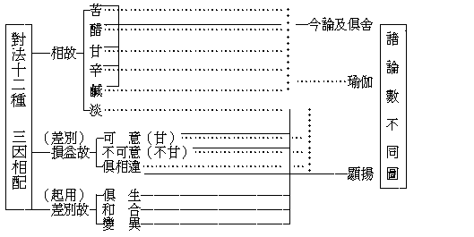
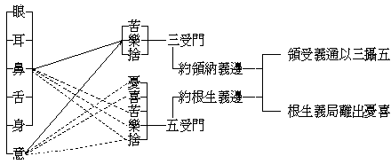
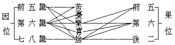
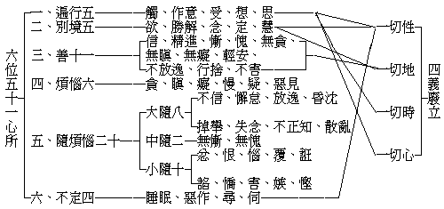
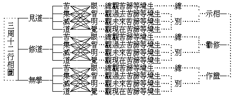

# 大乘五蘊論講錄
（1924 年，初秋在武昌佛學院講）

## 目錄

- 懸論
    - 一　序大意
    - 二　解題目
    - 三　釋撰主
    - 四　明譯人
- 釋論
    - 甲一　正明五蘊
        - 乙一　略標
        - 乙二　廣明
            - 丙一　色蘊
                - 丁一　總舉
                - 丁二　別釋
                    - 戊一四　大種
                    - 戊二　所造色
                        - 己一　總出體
                        - 己二　別釋
                            - 庚一　明五根
                            - 庚二　明五境
                                - 辛一　色境
                                - 辛二　聲境
                                - 辛三　香境
                                - 辛四　味境
                                - 辛五　觸境
                            - 庚三　法處色
            - 丙二　受蘊
            - 丙三　想蘊
            - 丙四　行蘊
                - 丁一　總舉
                - 丁二　別釋
                    - 戊一　心相應行
                        - 己一　釋心所名義
                        - 己二　明六位差別
                            - 庚一　總辨差別
                                - 辛一　列名
                                - 辛二　配屬
                            - 庚二　別明體性
                                - 辛一　明遍行
                                    - 壬一　明觸
                                    - 壬二　明作意心所
                                    - 壬三　明思心所
                                - 辛二　別境五
                                    - 壬一　明欲心所
                                    - 壬二　勝解心所
                                    - 壬三　念心所
                                    - 壬四　定心所
                                    - 壬五　慧心所
                                - 辛三　明善數十一
                                    - 壬一　信心所
                                    - 壬二　慚心所
                                    - 壬三　愧心所
                                    - 壬四　無貪心所
                                    - 壬五　無瞋心所
                                    - 壬六　無癡心所
                                    - 壬七　精進心所
                                    - 壬八　輕安心所
                                    - 壬九　不放逸心所
                                    - 壬十　行捨心所
                                    - 壬十一　不害心所


## 懸論

### 　　一　序大意

大乘五蘊論者，依大小乘共通之蘊、界、處教，明大乘法相名數之理致也。法相多如塵沙，而五蘊可以盡之；聖教廣若大海，而大小乘可以括之。何謂五蘊？色心等之有為法也。有為者，有造作、作為、生滅之謂。夫然、其非有造作作為之不生滅無為法，應不得而攝耶？曰：否，蓋五蘊雖祗攝有為，然無為豈離有為而獨有？故論中既廣明五蘊諸法，旋會之以處、界，問答以發無我之隱，無我則明證擇滅，處、界則顯攝無為——十八界中法界與十二處之法處皆攝無為——。故五蘊為一切法之總聚，依正二報之所依，百界千如之所本，上通大乘法相唯識之高幢，下共小乘諸部之標幟。是以百法明門論以五位而陳百法，結明淺深之二無我；此論以五蘊而統諸法，申破總別之三我執——一、一性我執，二、受者我執，三、作者我執。雖然、彼論以唯識為獨尊，標大乘之特有，故心法居首，餘四次之，以是識之相應、所變、分位、實性故。本論以法相為共通，歷明名色與處界，則同於俱舍，便於初心之入門故。若一一法相之名義不了，縱閱群典，皆屬囫圇，或有知解，亦是儱侗，胡能致廣大而盡精微以自利？極高明而道中庸以利他哉！故茲於未入法性、唯識之先講之，俾學者能審名檢實，以為精確研究之張本也。

### 　　二　解題目

五蘊為本論之別目，大乘為滿教之通稱。乘以運載為功，從譬得名。大有二義：一、當體，二、簡小。當體者，常遍為義；簡小者，相待受稱。常則豎窮三際，遍則橫滿十方。待謂對待，如長待短，方待圓也。此亦如是，大小相對，權實相立，顯此是大是實，有殊勝運載之功用，故曰大乘。五蘊廣如下釋，茲姑不述。論乃假立賓主，問答發揮，抉擇正理，破除邪見，簡非經律，故以論名。有解：大乘之大，謂當體之大義，是絕待大，不同對小之大，遂於大乘之上加立一乘，以顯佛法高深，理體超絕。但既落能詮，即不能無待，大有小待，一亦有非一待，對非一立一名純一，寧大待非大非純大！過泥名相，違害義理。故今雙出簡持：應了纔呼大時，即兼具持大簡小之義矣！

又六合釋云：五是數，蘊是法，蘊有其五，帶數釋也。五蘊是所詮，所詮義廣，以蘊攝諸有為法故；論是能詮，能詮義狹，以限於聲與名句文故。其義廣者為勝，狹者為劣，將勝就劣，以劣顯勝，云五蘊之論，帶數依主釋也。又五蘊是所明法體，大乘是法體上廣大運載之用，即體持用，就用彰體，大乘即為五蘊，持業帶數釋也。又不惟能詮名論，所詮亦名為論，若離所詮之意義，雖有名等亦不成為論，大乘五蘊是所詮，所詮即論，是則大乘五蘊即論，亦持業帶數釋。

五蘊、古譯五陰。陰、覆蔽義，謂此五法，能覆蓋障蔽法界平等不生滅之真實性故，唯局有漏。蘊、積聚義，謂此品類之多法積聚故，其義通漏無漏，今取蘊譯為正。蓋五蘊攝有為法盡，有為法既通漏無漏，五蘊亦應通漏無漏。三乘道諦，皆有為無漏，若用陰字，不惟不通佛果，即二乘入生空，菩薩證二空時，亦無其義。故陰義僅通異生之五蘊位耳。異生之五聚法，或名五取蘊；取者、貪著為義，即煩惱名，煩惱能執取三有生死故。取蘊者，由取生故，屬於取故，能生取故，名五取蘊也。或謂陰義亦通二乘，若小乘聖者，厭離三界生死入無餘涅槃時，灰身滅智，盡捨覆蔽涅槃性之五陰法故。然仍有一分義不通，小乘許四諦中之道諦，十八界之意界、法界、意識界咸通無漏故——大乘十八界皆通漏無漏——。如是翻五蘊為五陰，攝義不盡，則名義失其所當矣，學者不可不知。

蘊謂積聚，其義已悉，積聚之相，然猶未曉。例如色法，若內外、粗細、勝劣等品類差別，略此品類差別為一聚故，說明色蘊。受、想、行、識亦然；染淨、漏無漏位皆爾。故佛果上之眾相莊嚴，四智菩提、五分法身、力、無畏等，名無漏清淨之五蘊。異生色心但染污故，名有漏雜染之五蘊。二者之分，惟在煩惱心所等之有無而已。[1]

### 　　三　釋撰主

世親菩薩造：梵云：伐蘇畔度，唐言世親。蓋印度俗奉之神曰世天——即毗搜紐天之異名，傳言是此世天之弟，故名世親，亦名天親。婆藪槃豆傳曰：婆藪槃豆者，北天竺富婁沙富羅國——譯曰丈夫國人，生於佛滅九百年間。兄弟三人，皆名婆藪槃豆，長兄別稱阿僧伽——譯曰無著；其弟別稱比鄰持跋婆——比鄰持母名，跋婆譯兒；惟世親獨以通名稱焉。皆出家於小乘之薩婆多部。無著先悟小乘空理，意無留滯，遂通達實相，專弘大乘。比鄰持跋婆，則唯遵奉小乘而已。論主聰慧絕倫，初造五百部小乘論，後依長兄無著之勸導轉入大乘，亦造五百部論盛傳之，故世稱千部論師云。此論、即所著大乘論之一也。

菩薩、具云菩提薩埵，此翻覺有情。覺是所求果，有情是自身，謂求三菩提之有情者，故名菩薩。又菩薩修行有二：一者、自利大智為首，二者、利他大悲為先。菩提覺義，智所求果；薩埵有情義，悲所度生；發四弘誓願，故名菩薩。或菩提是所求果，薩埵者勇猛義，不憚時處求大菩提，有智有能，故名菩薩。又菩提即般若，薩埵謂方便，如是二法能利能樂一切有情，故名菩薩。

造者、造作之義，創造之謂。唯識述記云：『敘理名述，先來有故；作論曰造，今新起故』。凡菩薩造論必具二種：一者、具四德，二者、六因緣。四德者：一、於昔諸師應離憍慢，二、於有情類當起大悲，三、於同法者深生愛敬，四、不欲彰已有勝伎能。六因緣者：一、欲令法義當廣流布；二、欲令種種信解有情，由此因緣，隨一當入正法故；三、為令失沒種種義門，重開顯故；四、為欲略攝廣散義故；五、為令顯甚深義故；六、為欲以種種美妙言辭莊嚴法義生淨信故。顧菩薩造論之鄭重，為何如乎？

### 　　四　明譯人

唐三藏法師玄奘奉詔譯：唐者、李唐，世之朝代也。三藏者：經、律、論也。遍通三藏佛法，自師師人，謂之三藏法師。玄奘、師之德號也。師俗姓陳氏，河南偃師人，生年十三，出家於淨土寺，就慧景、嚴法師等學涅槃、攝論。尋赴長安、成都，就道基、震法師等究毘曇、發智，博學多能，令名夙著。然爾時學者，各異宗趣，聖典亦有隱晦，汗漫紛拏，莫知適從！乃發西遊之志，表請朝廷，奈時世未定，未邀允許。而仍不為屈，遂於太宗貞觀三年八月，陰雜行旅人中，遁出國境，經高昌、屈支——即龜茲、颯秣建等，出中央亞細亞，歷經諸國，參禮聖蹟。至王舍城，止那爛陀寺，受戒賢諸論師瑜伽、唯識之旨。留學十年，造制惡見論，立唯識量，名震五竺。貞觀十七年十二月出印度國境，十九年歸長安，自出國凡十有六年，留學萬里，一人孤征，誠為我國歷史上空前絕後之一大事實。欲知其詳，可參閱大唐西域記，大慈恩寺三藏法師傳等。所齎大小乘梵典，有六百七十五部之多。至長安時，王公歡迎，庶士頌德，政府監護，國家供養，以弘福寺、慈恩寺、玉華殿等為其譯場。所譯經論總七十五部，千三百三十卷，此論亦所翻之一也。

## 釋論

此論唯有正宗，而序與流通闕如，同瑜伽、發智、觀所緣論等，無問廣略，皆唯作者所欲也。光記一曰：『泛明諸論，正宗定有，序分、流通有無不定：或有序分而無流通，如毗婆沙論；或有流通而無序分，如二十唯識；或二分俱有，如此——俱舍——論說；或二分俱無，如發智論。隨作者意各異故』。然前後二分有無，雖隨作者所欲，總論菩薩造論所由，一以不私，皆准佛經。故光記一曰：『西方造論，皆釋佛經，經教雖多，略有三種，謂三法印：一、諸行無常，二、諸法無我，三、涅槃寂靜。此印諸法，故名法印；若順此印即是佛經，若違此印即非佛說。故後作論者，皆釋法印。於中意欲廣略不同，或有偏釋一法印，或有舉一以明三：如五蘊論等唯解諸行無常，如涅槃論等唯釋涅槃寂靜，此即偏釋一法印。乃至諸行無常唯明有為，涅槃寂靜唯明無為，諸法無我通明有為無為』。今論就廣說義邊，雖題五蘊，蘊明有為；然具含三科，處界二門攝諸無為，如上已說，故今論具三法印明也。又文中如薄伽梵略說五蘊等著，是顯憑經造論也。

### 　　甲一　正明五蘊

#### 　　　　乙一　略標

> **如薄伽梵略說五蘊：一者、色蘊，二者、受蘊，三者、想蘊，四者、行蘊，五者、識蘊。**

此略標列名數也。標有二：薄伽梵三字標能說人；略說五蘊四字標所說法。一者色蘊等，如次列五蘊名也。薄伽梵者，梵音也，略翻為世尊，具有六義：一、自在，二、熾盛，三、端嚴，四、名稱，五、吉祥，六、尊貴。又能破四魔義故，名薄伽梵；謂能破煩惱魔、蘊魔、死魔、天魔也。然有經論多用佛名者，隨方順古也。或約悟諸法義邊言佛，就顯佛德義邊言薄伽梵；就體約用，各據一義，並不相違。若但言佛，是略名也，具言佛陀，此云覺者。覺是法，者是人，即有無上正遍覺之五蘊和合假者，名為覺者，即自覺、覺他、覺行圓滿之謂也。對法論一曰：『佛薄伽梵，是契經等一切教法平等所依，無師自悟諸法實性，一切教起所依處故』。

略說五蘊者，梵云塞建陀，唐言蘊，積聚為義；佛說一切諸法無量無數，今總略之，不出此五聚法也。如薄伽梵略說五蘊，有二義：一、順經造論非自臆造故。二、師說文略義深，資廣解故。一者色蘊，色有變、礙二義，變謂現象變化而歸破壞，礙謂如手礙石，石亦礙手，自他互為能礙所礙。是知色之一字，涵義極廣，非僅如普通謂青、黃、赤、白等為色，而四大種所造色、無表色，皆得稱色也。又凡言變礙為色，同時即簡無為及心、心所、不相應行等，唯色法變而有礙故。二者受蘊，受以領納為義，謂心心所領取納受順、違與俱非之境界，而生苦、樂等之三受故。更因受心所所依之六根開為六受：曰眼觸所生受，耳觸所生受，鼻觸所生受，舌觸所生受，身觸所生受，意觸所生受。此前五名身受，後一名心受。三者想蘊，想以取像為義，心心所領受境界時，無一定分位齊限，有此想心所於所緣境，始有苦樂、怨親、男女等分齊差別相，而名言由是得以安立。此想亦有種種，曰眼識相應想，耳識相應想，乃至阿賴耶相應想。四者行蘊，有二解：一、廣義的，遷流為義。二、狹義的，造作為義。遷變流動者，有為法皆是造作義，及指思心所，此思能驅役心、心所造善、不善業；今從後說。以餘四蘊雖亦行為造作流動遷變，而彼法已從特義名餘四蘊，故取此名行蘊耳。行蘊、有七十三法，分為二類：一、相應行，五十一心所中除受、想，所餘四十九皆是，思心所正此相應行攝。二、不相應行，得、命根等二十四是。五者識蘊，識以了別為義，百法中八識心王也。八識各有明了分別自所緣境之功用，如眼識依眼根了別青、黃、赤、白等色，耳識依耳根了別內聲、外聲等聲，鼻識依鼻根了別好香、惡香等香，舌識依舌根了別甘、辛、苦、鹹等味，身識依身根了別堅、濕、煖、動等觸，意識依意根了別內外事理諸法，末那依賴耶了別自內我境，賴耶依末那——七八二識互依為根——了別根身、器界、種子等境。於中識所依根，根有二義：一、謂根依處，二、謂淨色根。通常人未加審察，不知根義。雖知五官腦筋，亦屬儱侗；此五官即五根依處，腦筋似勝義根之代名。小乘人雖知六根中之意根而不明了，謂前念現起之意識，與後念之意識為根，有根識相濫之過失；而大乘明意根為第七之末那，非意識為意根也。

綜上所明，十一色法立色蘊，受心所立受蘊，想心所立想蘊，七十三法立行蘊，八識心王立識蘊。然則何故如是次第耶？此有三釋：一、識住，二、前為後依，三、起染淨。且略舉其一：如見青黃等色相——色蘊，而領受故——受蘊，如所領受而了知故——想蘊，如所了知而思作故——行蘊，如所思作隨彼彼所作而了別故——識蘊，廣如俱舍等明。

#### 　　　　乙二　廣明

##### 　　　　　　丙一　色蘊

###### 　　　　　　　　丁一　總舉

> **云何色蘊？謂四大種及所造諸色。**

色蘊之相，略有二種：一、觸對變壞，謂根境相對門也——即欲色十有色處，上二界色及法界色，並非此門，如上已說。二、方所示現，唯境無根門也。對法抄一曰：『三界中五根、五境，及法處中假實，定所生依處，遍計所起，極略，極迴等，有諸名相方所，別名可說示現，皆此門攝也』。四大種者，地、水等四大，即是能造性也。所造諸色者，即彼四大之所造諸色也。此二於一切色法，悉攝無餘。及、相違義也，能造所造異故。

###### 　　　　　　　　丁二　別釋

###### 　　　　　　　　　　戊一四　大種

> **云何四大種？謂地界、水界、火界、風界。云何地界？謂堅強性。云何水界？謂流濕性。云何火界？謂溫燥性。云何風界？謂輕等動性。**

此有二，初徵、後釋。云何四大種？徵也。謂地界等，釋也。釋中亦二：初總出體，後別釋體。初地界水界等著，是舉真四大體。大有四義：一、所依大，謂為十有對色及法處所攝色等諸所造色之所依故。二、體性大，謂四大種遍一切色，無一物而非所造，其體寬廣故。三、形相大，謂大地、大山為地大之增盛，大江、大海為水大之增盛，炎爐猛焰為火大之增盛，黑風、團風為風大之增盛，如此四大增盛，形相大故。四、起用大，謂地能載物，水能浮船，火能燒薪，風能拔木，其作用大故；又成壞世界力用大故。種者、因義，類義，此四能為生等五因起眾色故，種類別故。虛空雖大不能為因，內種子等雖能為因，體相非大，所餘諸法非大非種，由此亦大亦種，故名大種；持業釋也。應作四句分別，表示如左：——


```
　　　　　　　　┌虛　空……………大而非種
　　　　　　　　│外　種┐
　　　　　　　　│　　　├…………種而非大
　　　　　　　　│內　種┘
　　　　　　　　│堅、濕┐
　　　　大種料簡┤　　　├…………亦大亦種
　　　　　　　　│煖、動┘
　　　　　　　　│造　色┐
　　　　　　　　│心心所├…………非大非種
　　　　　　　　└假　法┘
```


若言四大種，四是數，即帶數釋。界有多義，至下可辨，且約二義釋之：一、界別義，體相不同，各各種子現行異故。二、能持義，四大種能任持自體及一切所造色故。云何地界下，別解釋。文中有徵、有釋。上文雖辨地等是能造大種。然自性各各異故，今特示之曰：地堅性，水濕性，火煖性，風輕動性。此中風輕等動性者，等、謂相似，輕者、所造性，動者、正為能造之風性也，以風自性是動故。蓋輕與動相順相似，故舉能似輕相以彰所似風性，論記曰：『風能造與所造相似，故云輕等』。由風性動故，名輕等動性。此四大體為身根所覺一分之觸塵，如通俗所謂陰陽與夫科學家所謂質力，皆不外乎此也。問：道家之金、木、水、火、土，與地、水、火、風有何異乎？答：略同通俗所謂地、水、火、風，而與此正明之四大種異。問：此四大種與通俗所謂地、水、火、風有何區別？答：四大者，身根所觸之境，以堅、濕、煖、動為體，是為能造；通俗所謂地、水、火、風是所造色，屬於顯色、形色，為眼根所見之境，以顯、形色為體。如青等之地，依顯色為體，長等之地，依形色立名。通俗於此所造色境之顯、形色而呼為大地，佛法隨其俗情亦安立地名。餘水、火、風，准此類推。要之、通俗所謂地、水、火、風與大種之不同者，唯於所造之顯、形色各立其名而已。故此彼對望，此為觸境，彼為色境；此為身根之所觸，彼為眼根之所見；此為能造，彼為所造，二者相違可知。


```
　　　　　　　　　　　┌堅┐　　　　　　┌持┐
　　　　　　　　　　　│濕│　　　　　　│攝│
　　　　　　┌四大種體┤　├──觸塵──┤　├用
　　　　　　│　　　　│煖│　　　　　　│熟│
　　　　　　│　　　　└動┘　　　　　　└長┘
　　　　比較┤
　　　　　　│　　　　┌地…………色香味觸
　　　　　　│　　　　│水……………色香觸
　　　　　　└世俗所見┤
　　　　　　　　　　　│火………………色觸
　　　　　　　　　　　└風…………………觸
```


問：四大種是現是種？若是現行，云何名種？答：四大種是現行觸塵一分，對自種故，是現非種。然則何因緣故名能造性為四大種耶？答：一切色法雖皆由第八阿賴耶中親因緣種生，然要由堅等現行四大為普遍切要之殊勝功能增上緣，彼色、香、味、觸等方能生故。故即依此親近殊勝增上功能假名為種，如瓜豆等種，亦非種言種。問：四大種為大小乘共通之名，其義有無差別？答：小乘以四大為能生一切法之因，大乘為能生一切色法之緣，因謂親因，緣為增上，此二別也。問：四大種幾識能緣耶？答：有三識，謂身識及同時意識、阿賴耶也。蓋身識、意識變緣時，須託第八所變緣者為其本質，其境皆為現量性境。獨頭意識分別名相，屬比、非量、影質境。問：四大種大類區別可分幾類？答：四大遍於五根、五塵，如是可分為二：一、根身執受大種，二、器界非執受大種。此通有漏、無漏之依、正二報，如佛有清淨圓明之報身四大，微妙莊嚴之淨土四大故。

###### 　　　　　　　　　　戊二　所造色

###### 　　　　　　　　　　　　己一　總出體

> **云何四大種所造諸色？謂眼根、耳根、鼻根、舌根、身根，色、聲、香、味、所觸一分、無表色等。**

此中先徵後釋，謂能造四大已彰，今所造諸色應釋。所造色者，謂依止大種，即於大種處所，有餘造色生，由是因故，說四大種所造諸色。造者、是同一處攝持彼義，名之為造，此有三不相離義：一、一處不相離，謂大種及所造色同住一處，二、相依不相離，三、和合不相離。廣五蘊論曰：『造者、因義』。謂以四大種為因，所造得生故。此因有五種：一、生因——即是起因，謂離大種色不起故。二、依因——即是轉因，謂捨大種諸造色無有功能據別處故。三、立因——即隨轉因，謂由大種變異，能依造色隨變異故。四、持因——即是住因，謂由大種諸所造色相似相續生，持令不絕故。五、養因——即是長因，謂由大種養彼造色令增長故。如對法一曰：『所造者，謂以四大種為生、依、立、持、養、因義』，即以五因說名為造也。就大種與所造四字合釋，大種之所造，屬八囀聲之第五囀——因聲又名從聲，六離合釋之依主釋也。若加色言，五字合釋，大種所造即色，持業釋也。但大種造色義，略有二說：第一說曰，一切大種造一切色，相依而有，是造義故。——如此聚中有彼大種、所造可得，當知此中及有彼法，故諸大種同聚所有造色相依有者，皆可名造，互得造義，非定屬義——互為造義。第二說云，或可大造種子本性各異，後生現行各依自類，自類大種不生現行，此類造種終不生造——自類造義。然此二義，已散見前文——一見解造字，一見大種問答——茲不詳述。

謂眼根等下，後釋也。此由堅等四大種，輕重離合而成五根、五境及無表色等。於中所觸一分者，觸為身根之境，此境有十一種，分能造所造之二。今除能造堅、濕、煖、動四大種一分之外，取所造滑、澀、重、輕、冷、飢、渴等，故云所觸一分也。無表色等，等取極逈、極略、定自在所生、遍計所起色也。無表色者，無表示於他之色法，即反於表示於他之色法也。吾人動作身體、發動言語，於行善作惡時，對於他人有所表示，使知是善是惡，名為表色。又色表業，即此善惡之表業，同時依於因果之規則，明見如是原因，將來應招如是結果；以之擊發於自己之身內，如是擊發之原因，無形無象，無表示於他，故云無表色也。此有二種：即律儀無表，不律儀無表是。律儀無表者，其性善，如佛弟子受持三皈、五戒、八戒、十戒、二百五十戒、三百四十八戒等之別解脫律儀而發得無表是。此無表雖無表示於他，然有殊勝功用，其受三皈者，自然不皈依天魔外道等，故受諸戒者，則自然不敢為非，而得以別別離身口之過惡也。若遇惡緣或惡友以巧言綺語相引，事物名利相誘，以諸方便破壞，隨順彼教而犯一殺戒，或行一盜、淫——取不義財，行茍且事，乃至破齋、食肉、打牌、賭博，皆為盜戒所攝；耳聽淫聲，眼睹美色，腳履邪地，身入青樓，雖未實際接觸，亦為犯淫——在當時不過為情面所拘，或勢力所迫，偶然失足，後遂造殺行淫以為常，作盜妄動而不知畏者，良由於初次犯戒，無表功用——即戒體失壞故。是以受戒後要嚴持戒律，為受能引發——無表色體，持能引長也。故古人持戒以防非止惡者，猶若堤防然。蓋防水旁流漂蕩而損害苗稼，若持戒不嚴，為惡緣之侵蕩，一旦穿破身口之堤防，則永損害善根之苗稼，可不慎歟？不律儀無表者，由身口之惡行而得惡性之無表也。如今世在匪、在幫之結黨輩，先由發誓賭咒之表業引發惡無表之功力，遂狼狽為姦，自然敢於為惡耳。此二——善惡無表——雖無可表示，非眼、耳等十有色處所收，仍依地、水、火、風四大種之所造色法而成，故為法處所攝色之一焉。問：如是為意識所緣耶？答：無表固為法塵中之一法，但體是思種，為賴耶之現量境，非粗意識親能明了。因彼有善惡之功能，意識從是推度而知；不然、定果色等亦應稱無表耶？是可知其特殊點矣。

###### 　　　　　　　　　　　　己二　別釋

###### 　　　　　　　　　　　　　　庚一　明五根

> **云何眼根？謂色為境清淨色。云何耳根？謂聲為境清淨色。云何鼻根？謂香為境清淨色。云何舌根？謂味為境清淨色。云何身根？謂所觸為境清淨色。**

文段有五，悉明根義。根者、有由依托乃得生長之義，如草木等，由依托於根故，而幹而枝而葉得生起長成也。諸識亦然，各有其根，識方現起。然根有二：謂淨色、浮塵。浮塵者，——又名麤色根，或名根依處，浮之於外與塵寰交接，即眼如葡萄朵等之浮根四塵，及身之四肢百骸者是也。淨色根者，清淨之色不可見而有作用者也。論言五根謂淨色根也，為眼等五識之所依止，故云為根。

云何眼根者，徵釋可知。眼之差別總有五種：一、肉眼，二、天眼，三、慧眼，四、法眼，五、佛眼。此中初二眼色蘊攝——修果名天，報生名肉，故欲天眼唯肉非天，非修果故。五眼皆有通二世及三世等之差別，後三眼非蘊攝，於中慧眼、法眼為二無漏根，佛眼通於前四。今論所明眼根，即肉、天二眼也。此有現行種子差別；界門眼通種子，五根門眼唯取現行，今唯現行也。

色為境、清淨色者，廣五蘊論曰：『云何眼根，謂以色為境，淨色為性，謂於眼中一分淨色如淨醍醐，此性有故，眼識得生，無即不生』。以色者，是眼所行境，而能引發根故；謂舉能引發境顯所發眼自體也。淨色者，以淨言簡扶塵根，顯勝義根也。蓋扶塵根為有見有對之麤色，此色清淨微妙故喻如醍醐。醍醐由熬乳作酪，自酪出酥，熬酥為醍醐，乃酥精液，不可多得，淨極甘美故。一分者，簡周遍，謂舌身二根淨色遍滿所依處，眼等三根不爾，故以一分及周遍，顯其差別也。此性有故下，示眼識能生相，文顯易知。

云何耳根等者，文有二科，初徵後釋。淨色根義，上已略明，今更舉釋論——廣五蘊論——釋之：『根者，最勝自在義、主義、增上義。所言主者，與誰為主？謂眼根與眼識為主，生眼識故；如是乃至身根與身識為主，生身識故』。最勝等三義，成唯識論四、說五識四種依中——一、五色根同境依，二、第六識分別依，三、第七識染淨依，四、第八識根本依——同境依，有「依」、「所依」、「有所依」義之別，此五根正為五識之「所依」也。然所依必具四義：一、決定義，謂眼識必依眼根生，無依餘根生義。是言決定，簡第六識雖以五識為依，然不定故，非決定義也。二、有境義，謂各自有各自所取境義，如眼根有色境，耳根有聲境等。是簡四大及五塵、種子等，彼雖有決定義，蓋非有境也。三、主義，謂要主而有自在力令餘法生義也。是簡遍行等，彼雖有決定與有境二義，不能為主令餘法生也。四、令心心所取自所緣義，謂受想等皆雖取自境，不能令他取也。餘心心所雖有具一、二，不能並具四義，唯五色根具四，故為所依。今釋論中主義者，舉其一義影顯餘三。或可如上四義唯局五根，主一種通一切根，故約總相釋根舉主一義耳。最勝自在義、增上義者，此二義俱在根上一義，差別開二種，然俱舍唯舉此二，不舉主義。最勝自在義者，——根體勝故，名為最勝，根用勝故，名為自在。以一根能了別眾色義邊，名最勝自在。增上義者，隨所依根強弱能依識亦明昧義邊，為增上義；謂根強能依識明，根弱能依識昧故。若言一義差別開二種，今論何二義中間安「主」義乎？答：今論意顯所依根上具以一了多，及隨根明昧之二義，雖同有大勢用，然尚有餘意——見上文四義中所解主義——故於二義中間安立所依主義以盡其旨耳。謂聲為境清淨色者，後釋也；釋中舉所取境，顯能取根體可知。以上二根取離境，下三根合境取也。俱舍頌云：眼耳意根不至、三——鼻舌身——相違。五根，義林亦曰：『眼耳二根離質用遠，離取義增，妙用難測，故別立二通——天眼、天耳——餘三根不立耳』。

云何鼻根乃至云何舌根清淨色等者，鼻根易知，舌根有異說。釋論云：『云何舌根？謂以味為境，淨色為性，謂於舌上周遍淨色。有說：此於舌上有少不遍如一毛端。此性有故，舌識得生，無即不生』。按：此文初舉本論，後釋本論，初中徵釋可知。釋論中二：初舉所依根，後示能生相。初中復二：初示正義，後舉異說。初中周遍者，對上三根一分也。俱舍二曰：『布在舌上形如半月』，是與今論周遍同也。有說下，後辨異說。俱舍對此置言傳說以示不信，今論亦爾，故云有說。釋此，光記舉二說：初說曰：『西方古德相傳解云：醫方家說：「於舌根中如毛端量，無舌根處，是末磨死節——梵語末磨，此云死節，節者、支節也，是身中死穴，觸便致死，頗似神經系或血管等——若針刺著，其人即死。舌中法爾有斯空處」』。後說曰：『於人腦中，有臭極穢不淨腦垢，若見飲食，腦垢流出，滴此空處。若無此處承此腦垢，觸著舌根，令人嘔吐不能飲食』。是性有故下，後釋舌識能生相可知。

云何身根等者，釋論云：『以觸為境，淨色為性。謂於身中色周遍淨色，此性有故身識得生，無即不生』。釋曰：第五明身根中二：初本論，後釋論，初中徵釋二可知。以觸者，觸有二：能觸、所觸也。所觸中亦二：謂能造大種，及所造觸塵也。所造觸塵有二十二種差別：所謂滑、澀、輕、重等也，至下可辨。此中即舉滑、澀等所觸境以顯能觸身根也。謂於下，後釋論。此文亦明根體與識能生相，二科如前可知。上來正釋五根已竟。

問：淨色簡粗色，淨色即根耶？答：否！淨色可以為根，非淨色即根。上曾言之，根增上義，對緣境有發識之殊勝功能故，如眼淨色對色塵有能生起了別青黃之識之功能。耳、鼻、舌、身，如應當知亦爾。問：淨色根以極微細故，名無見有對，然用今世所新發明顯微鏡或可能見之耶？答：此乃藉光線增大其功用，雖較前為精明，然猶為上文所明五眼中之肉眼所攝，淨色為天眼所見，於天眼中尚非外道五通之天眼能及——佛菩薩天眼能見——況肉眼乎？問：然則吾人無從捉摸耶？答：近今生理學家之神經可以仿髴，日人曾發明之，然諦審觀察之，亦不可執定即是。何則？彼生理學家所謂神經者，不外二種：一、絲絲之纖維神經，二、圓圓之細胞神經；此二各有粗細之別，粗者可見，細者雖不可見，然以顯微鏡矚之即能了了分明，由是則未可妄為判斷以亂真理也。

問：五根一體耶？異體耶？答：有謂是一體，而實不然；各自有各自種子故。又若是一體，眼根有損應能視，耳根有損應能聽，而事實上若勝義，若扶塵，隨損其一，即失其功用，如瞽盲者等是。又釋論言「周遍」、「一分」，亦可見其端倪，倘非異體，焉有此別乎？

問：人之死時，轉識先沒，第八後捨，彼此依根既是異體，其失應亦如識之有次第耶？答：識亡根即失其為根，固有鉤鎖之關；然此根為色法，由第八識執持，識捨則壞，無所謂去來。但壞時——唯限五色根，七八識根，剎那生滅，相續不斷——有頓有漸：頓者、隨死隨壞，漸者、一日乃至七日。於此有人遂誤認為中陰身者，是未能曉其真相也。

問：眼根依眼依處，耳根依耳根處，乃至身根依身依處，五根既同是各依各之依處，然身根——、舌根，何竟獨周遍，其理由安在歟？答：眼之珠捏之能知，耳之朵提之能識，鼻之峰糾之能曉，舌之端刮之能覺，乃至暖、冷、輕、軟、硬、澀，曷非身根之感觸；其周遍也，不亦宜乎？舌根以味為境，全舌根依處皆能嘗味發了別之識，不同眼耳等依處之膜等不能發見色聞聲之了別，故舌根亦遍依處也。

問：識所依根，總有二種：謂共依不共依；然究竟何者為共，何者為不共耶？願聞其詳。答：五識共依——即俱有依有四種：一、五色根，是同境依，即今論所明清淨色根也。二、第六識是分別依，五識隨時皆有，如定中聞聲等，不無意識。非耳識獨起聞者，爾時定中五識先已滅故。世親攝論第四云：『五識以意為依，意散亂時五不生故』。謂五識其性鈍，無明了用，任運緣境不起分別了知，故依第六明了。三、第七識是染淨依，成唯識疏曰：『由有第七識染故，施等善法不成無漏』。乃至廣說謂恆與四惑相應故，被染諸識成有漏善污法也。四、第八識是根本依，楞伽經伽他曰：『阿賴耶為依，故有末那轉，依止心及意，餘轉識——第六及前五識——得生』。又瑜伽、顯揚說：由有第八識執受色根，五識身依之而轉，廣說乃至是共依非別依。此第八持諸識種子令生諸識，變五根令住五識，變五境令緣六識；又為第七親依也。如是諸識同依，非唯一識依，故云共依——第六識以第八識為共依，七八二識互為能所依也。二、不共依，謂前五識依五色根，第六依末那，七八二識互為能所依；此隨一識依，非餘識依，故言不共。問：五識俱有依有四種，然今論何無簡別，但言眼識之所依等乎？答：成唯識論四，會之舉四因：一、不共故，謂五識依非餘識依故。二、必同境故，謂其緣境必與五識同故。三、此相近故，謂餘三依遠，唯此依最近故。四、相順故，謂能所依隨名相順，餘依境別故。故不說餘三也。

###### 　　　　　　　　　　　　　　庚二　明五境

###### 　　　　　　　　　　　　　　　　辛一　色境

> **云何為色？謂眼境界，顯色、形色及表色等。**

於中有徵釋二科，準前可知。謂眼境界者，簡非耳境界等，乃眼根所對，眼識所緣境也。此有三：一、顯色，謂青、黃、赤、白等分明顯現之緣境也。二、形色，謂於顯色分位上長、短、方、圓等有比對之形狀者。此二類更開二十三種，即青、黃、赤、白、影、光、明、闇、雲、煙、塵、霧、空一顯色、長、短、方、圓、粗、細、高、下、正、不正、是。此中初之十三屬顯色，後之十種屬形色。顯色之中以地水之氣名霧。日燄名光。月星火藥珠寶電等之燄名明。若有餘色障光明燄可見名影。翻此名闇。空界顯現之色名空一顯色。形色之中方者有角。圓謂團圓。形平名正。不平不正。餘色易了，故今不釋。三、表色，謂有情之動作，其動作凡取、捨、屈、伸、行、住、坐、臥，乃至口目開合種種施為，皆名表色。但離長、短等無別有體，何則？如鳥之飛——表色，兔之走，魚之浮，雁之翔。其烏也尖——形色、而黑——顯色，其兔也長而灰，其魚也扁而白，其雁也玄而高，所有差別狀態無非一法上之分位假相耳。故同一有見有對之法，動之差別說三，靜之或二，究其根本唯一顯色而已——此表色依青、黃、長、短等得名，猶名句文由聲音屈曲得稱，二者比例，其義益彰。等者、等取無情及俱——情與無情之動作也。如水動樹搖，人擔並行等是。及言相違，顯、形、表三種各異故；或義通合集，三皆色境攝故。

###### 　　　　　　　　　　　　　　　　辛二　聲境

> **云何為聲？謂耳境界，執受大種因聲，非執受大種因聲，俱大種因聲。**

此為耳根所對，耳識所緣之境也。是有能發因、所發聲之二。能發因者——因指能造大種——謂執受大種為因，非執受大種為因，執受非執受大種為因。前二為情、無情數，後一俱二。執受者，執是攝義、持義，受是領義、覺義，攝為自體、持令不壞，安危共同而領受之，能生覺受，名為執受，領為境也。能生覺受者，謂眼等五根，為第八識親所執受，遇打摩等事來時，第六識生苦樂等覺，故名能生覺受也。安危共同者，五色根既為第八親所執受，根危隨危，根安隨安，故名安危共同也。此中執受義，向有二說，義皆可通，立表如下：——

此中執受者，能生覺受也。其非執受，翻此應知。復次、又分能執受所執受。釋論曰：『心心所法是能執受，蠢動之類是所執受』。即依能生覺受示能執受，以五蘊聚身為所執受。蠢動、說文：蠢，動也。又蠢動，猶云動物也。是以色心二法，分能所執受可知。上明能發因有三種，此所發聲如次亦有三種，釋論曰：『執受大種（為）因（所發）聲者，如手相擊、語言等聲；非執受大種因聲者，如風林、駛水等聲；俱大種因聲者，如手擊鼓等聲』，此聲即為內外大種之所擊發。初有執受聲中，言等者，等取瞋聲、哭聲及有表詮、無表詮等。次明非執中，駛者，玉篇云：山史切，疾也。如是瀑流等，言水勢所發聲也。後明執受非執受大種中，言等者，等簫聲、笛聲。廣如小乘之婆沙、俱舍、入阿毗達磨論說。大乘中亦有數說，茲彙圖如下，以資參考。


```
　　　　　　　　　　　┌可　意┐
　　　　　　　　　　　│不可意├────────────損 益 故┐
　　　　　　　　　　　│俱相違┘　　　　　　　　　　　　　　　　│
　　　　　　　　　　　│因受大種……語 等 聲┐　　　　　　　　　│
　　　　　　　　　　　│因不受大種…樹林等聲├─────因差別故│
　　　　對法論之十一聲┤因俱大種……手鼓等聲┘　　　　　　　　　│
　　　　　　　　　　　│　　　　　　　　　　　　　　　　相　　故├五因相配
　　　　　　　　　　　│世所共成……世俗所說諦非諦等┐　　　　　│
　　　　　　　　　　　│成所引………諸聖共許因成起說├─說差別故│
　　　　　　　　　　　│遍計執………外道執心因彼言說┘　　　　　│
　　　　　　　　　　　│聖言所攝……可信至實言　┐　　　　　　　│
　　　　　　　　　　　│　　　　　　　　　　　　├───言差別故┘
　　　　　　　　　　　└非聖言所攝…不可信不實言┘
　　　　　　　┌螺貝聲　　┐　　　　　　　┌可　意
　　　　　　　│大小鼓聲　│　　　　　　　│
　　　　　　　│舞聲　　　├─因執受大種聲┤不可意
　　　　　　　│歌聲　　　│　　　　　　　│
　　　　　　　│音樂聲　　│　　　　　　　└俱相違
　　　　　　　│俳戲聲　　│　　　　　　　　　　　　　　　　　　┌可意
　　　　　　　│女聲　　　│　　　　　　　　　　　　　　　　　　│不可意
　　　　　　　│男聲　　　│　　　　　　　　┌可　意　　　　　　│俱相違
　　　　　　　│風林等聲　│　　　　　　　　│　　　　　　　　　│因手等相擊出聲
　　　　瑜伽一┤明了聲　　├─因不執受大種聲┤不可意　　　顯揚一┤因尋伺扣絃拊革聲
　　　　　　　│不明了聲　│　　　　　　　　│　　　　　　　　　│依世俗聲
　　　　　　　│有義聲　　│　　　　　　　　└俱相違　　　　　　│為養命聲
　　　　　　　│無義聲　　│　　　　　　　　　　　　　　　　　　│宣暢法義而起言說聲
　　　　　　　│下中上聲　│　　　　　　　　　　┌可　意　　　　└依託崖谷而發響聲
　　　　　　　│江河等聲　│　　　　　　　　　　│
　　　　　　　│鬥諍諠雜聲├─因執受不執受大種聲┤不可意
　　　　　　　│受持演說聲│　　　　　　　　　　│
　　　　　　　└論義決擇聲┘　　　　　　　　　　└俱相違
```


###### 　　　　　　　　　　　　　　　　辛三　香境

> **云何謂香？謂鼻境界，好香、惡香、及所餘香。**

此鼻根所對，鼻識所緣之境也。通常雖以香為臭之對，但香亦能攝臭，故曰好香、惡香，惡香即是臭故。對法疏二云：『問：何故蒜等名香非臭？答：俗中所說香亦稱臭，謂言臭如蘭』，乃至臭亦名香，可以見矣。所餘香者，好惡二香所餘之平等香也。釋論曰：『好香者，謂與鼻合時，於蘊相續有所順益。惡香者，謂與鼻合時，於蘊相續有所違損。平等香者，謂與鼻合時，無所損益』。初中與鼻合時者，簡色聲二種離境，謂眼、耳二根離中知，鼻、舌、身三合中知故，故云合時。合者、至時名合。於蘊相續者，二十唯識論疏上曰：『言相續者，有情異名，前蘊始盡後蘊即生，故言相續』。成唯識論疏七末云：『相續者是身』；又曰：『身者相續異名』。於者、境第七，即蘊之相續同體依主釋也。有所順益等者已下，三香如應示益、損、俱。此約境示損益，若約情損益各通三香。對法疏曰：『好等三，若依境說，好益、惡損、平等雙非；若依情說，香臭俱有益損之義』。又對法論一：香差別分三種為六法，又建立之以三因，今以圖示。


```
　　　　好　香………………如沈麝等────────┐　　　　　┌─┐
　　　　惡　香………………如蒜韭等────────┼─損益故─┤三│
　　　　平等香………………如塊石等────────┘　如聲境　│因│
　　　　　　　　　　　　　　　　　　　　　　　　　　▲相故──┤　│
　　　　俱生香………………如香茅等────────┐　攝取義　│相│
　　　　和合香………………如香等─────────┼─差別故─┤配│
　　　　變易香………………熟果等熟變時增香────┘　　　　　└─┘
```


同疏二曰：『問：好惡等三攝法已盡，何須更立俱生等三？答：事類不同，立初三種；起用時別，復立後三。或將境就心，立初三種；忘心說境，復立後三』。又俱舍一：好香差別，分等、不等香為四種。於中好香惡香之中能滋養身體者為等香，反之、能損害身體者，為不等香云。

###### 　　　　　　　　　　　　　　　　辛四　味境

> **云何為味？謂舌境界，甘味、醋味、鹹味、辛味、苦味、淡味。**

此舌根所對，舌識所緣之境也。味、即所噉，是可嘗義——通常為滋味。有此甘等六味，是味之差別。然通俗只有五種，彼將淡攝甘味中，以甘淡不異故；若仔細審察，甘是甜味，淡是淡白故。瑜伽加可意、不可意、俱非為九種。對法又加俱生、和合、變異，列十二種。顯揚有可、不可、俱非，並俱生等合六，以辨苦醋等六味體相之損益——可意等三損益差別，差別——俱生等三起用差別。如是若約境，應有十二細分；約情以談，則甘味為瑜伽顯揚之可意，及對法顯揚之變異所收，淡味為瑜伽顯揚之俱非所收；於此益見世法與佛法之淺深精粗者矣。




###### 　　　　　　　　　　　　　　　　辛五　觸境

> **云何名為所觸一分？謂身境界，除四大種餘所造觸，滑性、澀性、重性、輕性、冷、飢、渴等。**

此除大種之一分身根所對，身識所緣之境界也。言所觸者，謂觸有二：能觸、所觸。能觸中分二：一、觸心所法，二、能觸身根及身識。所觸亦分二：一、能造四大種，二、所造觸處也。今言所觸一分者，於所觸中唯取所造除能造，故言除四大種。對法疏云：『於所觸中唯取所造，故言一分也，謂身境界所觸法』。除四大種餘所造觸，釋一分義；廣論、纂註之說非是。滑性下列七觸名，釋論曰：『滑謂細軟；澀謂麤強；重謂可稱；輕謂反是；煖欲為冷，觸是冷因，此即於因立其果稱。如說：諸佛出世樂，演說正法樂，眾僧和合樂，同修精進樂。精進勤苦雖是樂因，即說為樂，此亦如是。食欲為飢；飲欲為渴；說亦如是。

案：婆沙解觸有二說：初說性類各別義，謂但由大種性類差別有生滑果乃至有生渴果。後說四大偏增義，謂水火增故滑；地風增故澀；火風增故輕；地水增故重；水風增故冷；風增故飢，謂風增故，擊動食消引飢渴生，便發食欲；火增故渴，謂火增故，煎迫飲消引渴觸生，便發飢欲。此二、於有部宗前說為正。若配今論者，解滑、澀、重、輕四種，初說應理。瑜伽云：『於大種清淨性假立滑性，於大種堅實性假立重性，於大種不清淨不堅實性假立澀性及輕性』。是雖假實異說，性類差別義一同也。又解冷等三，後說應理，瑜伽云：『由水與風和合生故，假立有冷；由闕任持不平等故，假立饑渴及弱力』，一同也。雖和合與偏增異，義相似故。

等者，等軟、緩、急、飽、力、劣、悶、癢、黏、老、病、疲、息、勇十五法也。今列七名中，何故初四法安性言，後三法無之？蓋後三從果名立——軟等十五法亦同，此四自性立名；以從自性立名故，持業釋也。正理論云：『滑即性故言滑性』。餘三以從果立名，故有財釋也——全分有財。釋論所舉之滑，謂細軟等中。煖欲、食欲、飢欲，是心所欲數，由內身中有觸力令欲煖，有觸力令欲食，有觸力令欲飲，所令之欲名冷、飢、渴；即是由其能令之觸，即能令觸從果為名，名冷飢渴。以冷、飢、渴三相隱而難知，若不約果以明其體，則無從顯現，故引諸佛出世樂等之頌，以證因立果名。蓋佛出世乃至精進非是樂，能生樂故，稱佛為樂等也。

###### 　　　　　　　　　　　　　　庚三　法處色

> **云何名為無表色等？謂有表業，及三摩地所生色等，無見無對。**

文有二段，初徵後釋。初無表色者，舊云無作色。前五境如次五識所緣，無表色第六意識所緣，法處攝也，體即善惡之思種子功能也。然就其名色義邊，有大小乘異：大乘就所防所發義邊名色，謂彼善思種子上有防身語惡及發身語善功能；又惡思種子上有發身語惡及遮身語善功能；其所防善惡、所發善惡俱據身語，就其所據義邊，假名色也。表無表，義林曰：『其無表色實是無表，無表示故。而體非色，亦從所發所防假名為色』。小乘異之，俱舍有二解：第一說、隨所依義，謂所依表色有變壞故，能依無表隨之名色。第二說、約所依大種義，謂所依大種變礙故，能依無表亦名色。今言無表者，遮詮之稱，非六釋攝故，如無明等。色者、通於一切，以別簡總，言無表色，依主釋也。等者、向內等也。後釋中、有表業者，對無表；表謂表示，表自內心示他故，即色處中表色也。業者、造作義。有者、對無言有、非能所有之有。體即身語二法，故釋論謂「身語表」也。

三摩地所生色者，即定果色；或定自在色——由定力自在所變色，名定自在色；或自在所生色。三摩地為七定名中之第二等持定。（按：七定名，一、三摩呬多，此云等引。二、三摩地，此云等持。三、三摩缽底，此云等至。四、馱那演那，此云靜慮。五、質多醫迦阿羯羅多，此云心一境性。六、奢摩他，此云止。七、現法樂住。又、此七略言之不出三觀：一、奢摩他，二、三摩缽提，三、禪那是）：謂以平等持心心所俱於境轉，或平等任持雙離沉掉，故名等持。前解但專注境義，地通定散；後解有止有觀，即名禪那。所生色三字，義貫有表業與三摩地。

初有表業所生色者，表為能引，引起無表色相故，此通身語表業之善不善。故釋論曰：『謂身語表，此——身語二法——通善、不善、無記性。所生色者，謂即從彼善不善表所生之色，此不可顯示，故名無表』。蓋身語表業者，能生體相也。然此體相，若以色處中表色為體曰身表，若以聲為體曰語表，二者皆假非實。又身、語二業，表善惡故，假名善惡，實是無記，不能招當異熟果故，從業——即思心所為假也。業雖通三，而身語從思所發，所發是表，非是真業耳。無表、義林曰：『身語二業，假表業體，實是表色，而非業性』。又唯識論云：『或身語表由思發故，假說為業』。五十一說：『一切表業皆是假有，其發身語現行之思實是業性』。由此理教，故說為假。問：若爾、論文何但言身語為表業，不及意業耶？答：小乘唯以身語二為業，此論名三乘共教，文相影略，據意應有。唯識論云：『能動身思說名身業，能動語思說名語業，審決二思意相應故，作動意故』。如是論文處處皆有，不遑枚舉，思之可知。云何審決二思？成業論等說思有三種：一、審決思，將發身語先審決故，二、決定思，起決定心將欲所作故，三、發動思，正發身語動作於事故。由是觀之，身、語二業正第三發動善不善思為真自體，但唯取現行；意業以前二思為體也。此發動現行之善不善思，雖實非身語表色，約所防所發義邊，假名身語表色，其性無記；依思動作，義通三性，故云身語表通善、不善、無記性也。彼所生色等者，意謂從善生名律儀無表，從惡生名不律儀無表。然無論其善律儀或不善律儀，要之、不外依思種子上立故。唯識論云：『此或依發勝身語善惡思種增長位立』。又成業論曰：『思差別者，簡取勝思，能發律儀、不律儀表』。由此思故，熏成二種殊勝種子，依二種子未損壞位——善無表犯戒則壞，惡無表行善則損——假立善惡律儀等無表，可謂明證矣。此又名受所引色，受謂領受，引即引取，如受諸戒品，戒是色法，所受之戒，為受所引色也。

後三摩地所生色者，釋論解之云：『謂四靜慮所生色等』。靜慮、梵語馱那演那，舊訛云禪那，是色界定及所依地，並云靜慮，通攝有無心定及漏無漏、染不染，依色四地。靜者、寂靜，即是定用；慮者、審慮，即是慧用；依定慧均等，故名靜慮。此簡慧多定少——中間定，慧少定多——無色界定，皆非靜慮，顯四根本定，亦靜亦慮，定慧不二所生之定果色也。然則瑜伽何言定果色非唯色界四禪，無色定亦能現起耶？五十三說：就業生色，說無色無，非就勝定；若就勝定，則通色無色——八根本，非八未至定。而今唯言四靜慮所生者，就業生色。業所生者，觸處大種也，即異熟、長養、等流、身根、身俱意識、第八識也；非就勝定，故不相違。言勝定所生色等者，即以殊勝定力於一切色皆得自在；謂入定者，所現光明，或變石成金，乃至見一切色像境界皆有實用，如入火光定則火光發現，入念佛三昧定，則極樂聖境彌陀相好皆現前等是也。

問：此無表色是能造性，抑所造性耶？釋論答之云：『是所造性，名善律儀不善律儀等』。是者、八囀聲中體聲，即指上所明無表色并定果色自體。所造性者，表無表，義林曰：『準顯揚一云：律儀色依不現行法建立色性，不律儀色依現行法建立色性。此意總說表與無表律儀色，皆依所防身語以假名色，即顯三界別脫、定戒、無漏色等皆是能造，欲界所防造惡身語四大所造』。造色、義林明：就能所造，有即質造與離質造二種中，是離質造。彼言所造色與大種處相離者，名離質造故。又定果色大種生者，法苑五本：就勝定果色三門分別中，第三舉大種生一門，其中引瑜伽、顯揚等五文廣釋。諸無表色相類雖同，善惡性殊，故分律儀與不律儀。等者、處中無表，謂非律儀非不律儀也。然處中無表立不立有異義，難陀論師不立處中無表，護法論師立處中無表，今安慧廣論與護法師同義，故更云等也。

問：別解脫無表，上云依思種假立，而定道二戒無表，所立云何？答：表無表章曰：『靜慮無表，以法爾一切上二界十七地中，有漏定俱現行思上，有防欲界惡戒功能為體……無漏律儀以法爾一切上地所有無漏道俱現行思上，能斷欲界諸犯戒非功能為體』——此二皆隨心轉戒，體俱是現行思。顯揚文云：不律儀色，依現行法建立色性，指依現行思立有表，非立無表。現行思者，造作義故，是業義故。釋論「亦名業」，即示定、道二戒無表體也。又云：亦名曰種子者，指律儀不律儀無表。成業論示定、道二戒外，一切善不善律儀無表，皆依思種子立是也。

假實云何？定道二戒，通實通假，所餘一切無表，皆假立也。顯揚義林，皆有明文。等者、等極逈、極略、遍計所起色也。極逈謂即此離餘礙觸色，極略謂極微色，遍計所起謂影像色也。無見無對者，非眼識所緣，眼根所礙之色境也。謂意識所緣，法處所攝之五種色法，總為無見無對色耳。釋論曰：『如是諸色，略有三種：一者、可見有對——為能所礙者為有對——，二者、不可見有對，三者、不可見無對。是中可見有對者，謂顯色等——等一切形色等。有說：有見有對唯顯色，以形、表色為顯色之分位，是意識分別所安立故——；不可見有對者，謂眼根等——根指勝義五根，等聲香味觸——；不可見無對者，謂無表色等』。其文易知，足資參鑑矣。

##### 　　　　　　丙二　受蘊

> **云何受蘊？謂三領納：一、苦，二、樂，三、不苦不樂。樂、謂滅時有和合欲；苦、謂生時有乖離欲；不苦不樂、謂無二欲。**

此中有二，初徵後釋，徵可知。釋中復為二：初標列，後隨釋。初、謂三領納，領即領受，納是納入；境有順逆，而能領納之心隨之亦異，故曰三領納。領納者，受之自性也。成唯識論云：『受謂領納順違俱非境相為性』。蓋順境則生樂受，逆境則生苦受，中容境則生不苦不樂受。於是眼識領納色曰眼觸所生受，耳識領納聲曰耳觸所生受，鼻識領納香曰鼻觸所生受，舌識領納味曰舌觸所生受，身識領納觸曰身觸所生受，意識領納法曰意觸所生受等。對法依四因、五位、七類差別，總說二十七受差別，位雖有多，然不外適悅、逼迫、俱非之三類故。此三皆通有、無漏，見、修及非斷三，學、無學、俱非，並善、不善、有覆、無覆四等。然有處分為五受者，乃自苦樂中離出憂喜故：即五識之領順違境云苦、樂，意識之領順違境云憂、喜。如次依有分別、無分別建立也——五識無隨念、計度二分別。問：此中於苦、樂離出憂、喜，為五識與意識差別，何故於捨受無此差別耶？答：適悅逼迫身心相，前五第六各異故。謂苦、樂無分別轉，憂、喜有分別轉。又苦、樂二種依尤重，憂、喜二種依輕微，捨受不爾，非逼非悅，此相在五、六識更無異故。又無分別而平等轉，故不分之也。問：總一受心所，依開合不同而有三受、五受差別，然其建立根本之義安在耶？答：約受領於境義邊，建立三受門；約根生義邊，建立五受門。舉圖示之如左：




又佛果之無漏心，及因位之有漏心，受有差別：




樂謂下，後隨釋也，文中自有三段可知。大凡人之感受樂時，初則或自不覺知，久則習以為常，直至謝滅，方知其樂也不可再得，而更生希求，如魚離水者。然感受苦時，觸處便知，即希乖離，猶探湯者是。俱非之受於此二者相反，無離合希欲故。然此單就顯麤相論，若就細相論之，於樂受已得固生不乖離欲——和合欲，未得亦有希合欲；於苦受已得固生乖離欲，未得亦有不合欲。如是之義，可參閱唯識述記，自有詳釋。

綜上所說，受有苦、樂、捨之三受，或加憂、喜之五受。有通六識有者，有局前五者，乃至七八二識等之種種差別。若克論之，一切有漏位中，所有三界二十五有，無一非苦，奚喜樂等之有哉！所以者何？是有漏受心故；若三受者，樂滅時是壞苦，苦生時是苦苦，捨受非苦樂，剎那有生滅，即是行苦。又樂受於未得希得，希得不遂，求不得苦；已得復失，得不永得，愛別離苦。復次、苦生時為生苦，乖離不能怨會苦，苦之不盡陰盛苦。三受既爾，五受准知。若佛果無漏受心則不然，樂則常樂，捨受平等，寂然無苦之發生矣。

##### 　　　　　　丙三　想蘊

> **云何想蘊？謂於境界，取種種相。**

文有二，初徵後釋。初想蘊者，想、是遍行中之一也。此總有二種：有相想、無相想也。有相想者，能取諸境界，隨起彼彼言說，而具明了、分別二種，名為有相想。此有種種差別，或隨所依立六想身：眼觸所生想——眼根對色，眼識於中所取是白是黑非白非黑之分齊相者，即此眼觸所生之想心所之作用也——；耳觸所生想；鼻觸所生想；舌觸所生想；身觸所生想；意觸所生想——於一切境能明了分別，例如同時意識聞有音聲，即於其中取有合乎道理之分齊者，安立能詮之某某名相於其義理中之自性差別，復施設之為如何如何之所詮等——是。或約境界，有欲界、色界、及空無邊處、無所有處等差別：欲界想者，小想也，下劣故。色界想，大想也，增上故。空無邊、識無邊處想，無量想也，無邊際故。如是等雖有境麤細差別，然隨具明了分別二種而於境界起言說，故皆有相想也。無相想者，或能緣或所緣，若闕分別若闕明了，或二種共闕是名無相想也。如欲界中嬰兒未學語言者，雖於色起想，而不能了此名為色故；非想非非想定，彼地及定不明，不能圖畫諸境界相，雖彼散心亦無想，今從定說；及涅槃無相界定想。對法論曰：『離色等一切相，無相涅槃想故名無相想』。涅槃經三十一曰：『涅槃離十或十三相加苦樂捨，涅槃離此相，立無相名』。緣彼相名無相想，非能緣彼相分，無境無相故。如是差別，廣分別如對法疏說。此中依有相想為論，其旨可察。

謂於下、後釋，成唯識論曰：『想謂於境取像為性——依彼所觸之境而取像——施設種種名言為業』。如見青黃等色，於中取像曰：此是青，此是黃，推之於萬物，皆然。謂要安立境分齊相，方起種種名言——謂此法非彼法等，作此分齊而取共相，名為安立；由取此像，便起名言，此是青等。性類眾多，故名種種。相謂相狀，對法疏出有十種：色聲等五境，男女及生異滅相；涅槃有十三等，皆為想之所取而安立也。


```
　　　　　　│…有明了不分別………如無想界即涅槃…│
　　　　明了│　　　　　　　　　　　　　　　　　　│
　　　　　　│…有分別不明了………如有頂定等………│…無相想
　　　　分別│　　　　　　　　　　　　　　　　　　│
　　　　　　├─有明了亦分別───一切有想────┼─有相想
　　　　四句│　　　　　　　　　　　　　　　　　　│
　　　　　　│…有非明了亦非分別…如孩等……………│
```


```
　　　　　　　　　　┌─狹　小　想─┐
　　　　　　　　　　│　　　　　　　│
　　　　　　　　　　├─廣　大　想─┤
　　　　　　　　　　│　　　　　　　├─────有相想
　　　　　　　　　　├─無　量　想─┤
　　　　瑜伽五十三─┤　　　　　　　│
　　　　　　　　　　├─無所有想　─┘
　　　　　　　　　　│
　　　　　　　　　　├─有　頂　想─────┐
　　　　　　　　　　│　　　　　　　　　　　├─無相想
　　　　　　　　　　└─一切出世學無學想──┘
```


```
　　　　　　　　　　┌─狹　小　想……………│
　　　　　　　　　　│　　　　　　　　　　　│
　　　　　　　　　　├─廣　大　想……………│
　　　　　　　　　　│　　　　　　　　　　　│
　　　　　　　　　　├─無　量　想……………│………世間想
　　　　瑜伽五十三─┤　　　　　　　　　　　│
　　　　　　　　　　├─無所有想　……………│
　　　　　　　　　　│　　　　　　　　　　　│
　　　　　　　　　　├─有　頂　想……………│
　　　　　　　　　　│
　　　　　　　　　　└─出世學無學想……………………出世想
```


##### 　　　　　　丙四　行蘊

###### 　　　　　　　　丁一　總舉

> **云何行蘊？謂除受想，諸餘心法及心不相應行。**

此總舉文中，亦有徵釋二。初行蘊者，行、遷流義，蘊、積集義，謂一切心相應法等，念念落謝不少留住，故名為行。然諸論中明行蘊體有總別二種：總者、以諸相應法及不相應法為行蘊體，今論及百法論等是也。別者、遍行中之思心所為行蘊主，謂於諸行中由思最勝——造作力用——能作心等令善染等故；又由令心差別，不相應等分位行相各別故。對法論曰：造作相是行相，由此行故，令心造作，謂於善惡苦樂等品中驅役心故。是即說一思為行蘊主。主者、一切行法之導首，約據勝為論也。故他處經論，說六思身為行蘊，或有五種差別說行蘊，或有三種差別——一、勝差別，以思心所一切行中最勝故；二、所依差別，即六思身；三、依施設差別，善染分位等——明行蘊，舉表如左：——


```
　　　　　　　　　　　　　別境五約增勝
　　　　　　　　　　　│…思為蘊主　　…│
　　　　　　│……思…│　　　　　　　　├勝差別─┐　　┌─：…一為境隨與
　　　　　　│　　　　│…此中攝遍行中…│　　　　│　　│自：
　　　　　　│　　　　　　除受想餘三　　　　　　　│　　│　：…二為彼合會
　　　　　　│　┌─眼觸所生思─┐　　　　　　　　│　　│性：
　　　　　　│　│　　　　　　　│　　　　　　　　├─┐├─：…三為彼別離
　　　　┌─┤　├─耳觸所生思─┤　　　　　　　　│顯││　：
　　　　│對│　│　　　　　　　│　　　　　　　　│　││瑜：…四發雜染業
　　　　│　│　├─鼻觸所生思─┼────依差別─┤揚││　：
　　　　│法│　│　　　　　　　│　　　　　　　　│　││伽：…五令心自在轉
　　　　│　│　├─舌觸所生思─┤　　　　　　　　│論││　：
　　　　│論│　│　　　　　　　│　　　　　　　　├─┘│論：…一由境界…六思身
　　　　└─┤　├─身觸所生思─┤　　　　　　　　│　　├─：
　　　　　　│　│　　　　　　　│　　　　　　　　│　　│　：…二由分位…二十四不
　　　　　　│　└─意觸所生思─┘　　　　　　　　│　　│　：　　　　　　相應
　　　　　　│　　　　　　　　　　　　　　　　　　│　　│差：…三由雜染…本惑隨惑
　　　　　　│　　┌─諸善思…信等十………│　　　│　　│　：
　　　　　　│　　│　　　　　一法　　　　│　　　│　　│　：…四由清淨…信等十一
　　　　　　│……├─雜染思…本惑十隨惑…│　　　│　　│別：
　　　　　　　　　│　　　　　二十不定四　├施設─┘　　└─：…五由造作…思遍行三
　　　　　　　　　└─分位差…二十四不……│差別　　　　　　　　　　　　　別境五
　　　　　　　　　　　別思　　相應行法
```


謂除受想下、後釋也。受、想二法，如上所明，已為別蘊，故今除之。問：對法論除受想思三，今論何故不除思耶？答：彼論別相建立，思為主故；此論總相釋蘊，唯除受想。問：前略標文內，於二義中取造作義，今復云為遷流義者，何耶？答：前以廣狹為論，今是據實而說，文互影略，義益周顯，有何相違？問：心所相應及不相應法皆行蘊攝，今何除受想各別建立乎？答：此有二義：一、有外道等計受、想為生死因，修八等至無色定，此二最勝故，別成二蘊，故非此攝——理實此二亦思造作令成善染法，此約據勝為論。二、餘蘊雖亦具造作遷流之義，而彼諸蘊攝行少故，各受別名，此蘊攝行多故，獨得總稱——此約攝行多少為論。

###### 　　　　　　　　丁二　別釋

###### 　　　　　　　　　　戊一　心相應行

###### 　　　　　　　　　　　　己一　釋心所名義

> **云何名為諸餘心法？謂彼諸法與心相應。**

此中云何名為諸餘心法者，問也。次上既言除受、想諸餘心法，受、想二法上已專明，但未知諸餘心法者何耶？謂彼下、總答之也。彼諸法與心相應者，心、謂八識心王；彼諸法，六位五十一心所法也。心所法者，以其皆心家所有法也。此有三義：一、恆依心起，蓋心王為主，心所為輔，無主不能獨立，故必依之而起。二、與心相應，心王既起，心所亦必同時起而相應，絕無先後各出之理。三、繫屬於心，心所雖有眾多種類，善惡又不一致，而各率其眷屬歸繫於每識心王之下。合此三義，名心所有法。又相應者，謂此心法常與心王同依——同一俱有根開導依；同緣——同緣一境，王緣總相，心所緣總別相；及與同時——同一剎那而起。若約小乘，更有同行，今依大乘，心法與王不同其行。所以者何？由心法等與王行相各各不同，如緣青色，心王自變，心法自變，是故不同。此之心法與其心王各緣諸境，一時相應，心起即起，心無即無，如王左右不離於王，心數相應，亦復如是。准上所明相應之法，必具四義：一、心心所見分——即行相——各異，二、時同，三、依同，四、所緣事等。等者、相似，事謂相見所依自體，即各各心心所所有自證分體，平等相似。光記十七曰：『事平等者，事之言體，顯各體一，故言事等。於一相應心心所中，如心體一，諸心所法體亦各一，必無二體一時俱行。此約剎那同時體等，非言前後異品數等』。

###### 　　　　　　　　　　　　己二　明六位差別

###### 　　　　　　　　　　　　　　庚一　總辨差別

###### 　　　　　　　　　　　　　　　　辛一　列名

> **彼復云何？謂觸、作意、受、想、思；欲、勝解、念、三摩地、慧；信、慚、愧、無貪善根、無瞋善根、無癡善根、精進、輕安、不放逸、捨、不害；貪、瞋、慢、無明、見、疑；忿、恨、覆、惱、嫉、慳、誑、諂、憍、害，無慚、無愧，惛沉、掉舉、不信、懈怠、放逸、失念、散亂、不正知；惡作、睡眠、尋、伺。**

初徵可知。列名中，除受、想，如上已明。其列次第，諸論有異。瑜伽、對法、顯揚、百法等論，作意觸次第，今論及唯識觸作意次第也。彼瑜伽論等約觀行發修次第，謂二乘及地前菩薩觀行皆依作意而修，故作意之次列於觸等。今論及唯識等約法相生起次第，謂三和直生觸而作意現前，是以境為先故。又具列遍行五數，恐是草誤，以受想二已除故。此中總列五十一法，而釋文中於根本煩惱之不正見復開五法者，約行解不同也。其開合雖異，慧性是同，義亦無妨。

###### 　　　　　　　　　　　　　　　　辛二　配屬

> **是諸心法：五是遍行，五是別境，十一是善，六是煩惱，餘是隨煩惱，四是不決定。**

此中自有六節：第一、五是遍行者，於前總舉門中依別蘊義除受、想二，今此顯類同言此五，故曰五是遍行。遍周遍義，行起行義，此五無論何時何處何心何性均能等起，故曰遍行。由是一切心所雖有性用各異以顯差別，而大類之攸分，猶在斯四義矣。故瑜伽以此四義——時、處、心、性——廢立心所差別曰：一者、善等三性遍不遍，二者、三界、九地遍不遍，三者、剎那相續，四者、彼此同時俱起不俱起。就此四義，或有具二，或有具三，或四咸具，遂有別境善等六種之差別耳。第二、五是別境者，謂所緣境事多少不同，能緣心性乃起自所緣特別之境，故名別境。詳言之，於境不遍，闕剎那相續、俱起之二，各各別緣其境以生心也。五者、欲、勝解、念、定、慧也。是者、體聲，即指五法之自體。第三、十一是善者，明善心所類也，即信等十一數是。所言善者，二世順益故。此十一自體即善，唯善心所可得生故，是以總束稱善也。又此中、於四一切，唯具遍一切地之一種，不具餘三可知。第四、六是煩惱者，總束貪、瞋、癡等六法也。若別開之，則有十法。後作釋中開五見，一一有釋，至下當知。此六法為惑之根本，餘惑皆此等流、分位差別，故名本惑，是為根本煩惱。煩性即惱，持業釋也。第五、餘是隨煩惱者，明大中小之隨煩惱也。餘者、本惑六法之餘，即指忿恨等二十法故。若依瑜伽則有二十二法，更加邪欲、邪勝解故。此二十惑，皆本惑等流性，隨彼生故，稱隨簡本，能隨所隨異故。煩惱之隨，依主釋。若以隨煩惱三字為自名，他一分有財亦得，亦稱隨惑對本惑故。是此本隨二惑，於四一切皆不具，不通三性，不遍九地，非相續，亦不俱起故。第六、四不定者，惡作等四法也。對法疏舉三因以明不定義：謂此四於善染等三性皆不定故，非如觸、作意等定遍心故，非如欲等定遍地故，立不定名。又釋論解此及簡別曰：『此四不定，非正隨煩惱，以通善及無記性故』。瑜伽抉擇分合六位為五位，即不定四攝隨惑中。蓋彼論意，謂此四法雖通三性，於中染義增故，依之攝隨惑中，六位而為五位也。今安慧論師通之言「非正隨煩惱」，非正言，顯一分通染性義也。『以通善及無記性故』下，述所由，通三性故。此不定於四一切中，惟有一切性之一種，無餘三可識。




###### 　　　　　　　　　　　　　　庚二　別明體性

###### 　　　　　　　　　　　　　　　　辛一　明遍行

###### 　　　　　　　　　　　　　　　　　　壬一　明觸

> **云何為觸？謂三和合分別為性。**

於此科段中，除受想二，如前既辨。今文有徵釋二。釋中，三和者，三、謂根境識，和者、簡乖違。謂若眼根、聲境、鼻識，如此三法，縱並起不名和，三法各乖違故；唯於六根境識中，隨應相順生起名三和，謂如眼根、色境、眼識等也。成唯識論曰：『根、境、識更相隨順，故名三和』。又縱相順法，若闕一法，則不名三和，謂唯根境二起，識未起也。論疏曰：『正三和體，謂根、境、識。體異名三，不相乖違，更相交涉，名為隨順。如識不生，唯根境起，名為乖違』。

合者、十句義論曰：二不至至時名合。今合三種，是有已合未合，未合位三法各住本性，後至已合位，各更有順起心所功用，故云三和合。若此三法居種子時及未合位，皆無順生心所功能，則不名三和合也。如是三和合者，雖云有觸，非即是觸；觸是三和合所生果，三和合是觸能生因也，故曰三和生觸。觸與三和：一者、依三和合，二者、令三法合，三者、似彼三和。分別為性者，成唯識論云：『觸似彼起，故名分別』。疏釋之曰：分別之用，是觸功能。謂觸之上，有似前三順生心所變異用功能，說明分別。分別即是領似異名，如子似父，名分別父。謂根等三合時，其相用異自體，而能有生心所功用，是名觸，此觸之正生心所位名分別，即能似彼根等三故。如世間父能生子，此子似父，而父子自體分別，此亦如是。三和能生觸，觸雖似三和，與三和分別，而亦能生心心所，是觸自性也。

###### 　　　　　　　　　　　　　　　　　　壬二　明作意心所

> **云何作意？謂能令心發悟為性。**

文有二，初徵、後釋。初、作意者，作動於意，故名作意。後、令心發悟為性者，發、謂發動，悟、謂警覺，能發動於心使之現起，能警覺於心使之趣境；使之現起者名種子作意，使之趣境者名現行作意也。種子作意者，作意之種子激厲心心所之種子，使其現行——但彼心等種，生緣未合時不可定生，生緣已熟當生種子引發之，是作意功能也。現行作意者，心心所沉悶時，而提醒之使其趣境。例如心王寂靜意念俱泯之時，以業習種子之力鼓動此心，不覺作意，如魚噴沫，由是心動境擾，苦樂畢現矣。

###### 　　　　　　　　　　　　　　　　　　壬三　明思心所

> **云何為思？謂於功德過失及俱相違，令心造作，意業為性。**

於中有二，初徵、後釋，釋中又二：初舉所行境，後正舉所作法顯能作體。初中、功德者，謂由善業招感之順益境；過失者，謂由惡業招感之損害境；俱相違者，謂由無記業招感之非順非違不動境：此三是心心所所行境也。於者、境第七囀，可知。令心造作意業為性者，後、正舉所作法顯能作體。心、謂心王，造作者、思維籌度，意、心心所總稱，業、通身、口、意三業。意謂此思於善惡等境，取正因等相，思維造作驅役心心所，同趣所行之善惡境也。故釋論云：『此性若有，識攀緣用即現在前，猶如磁石引鐵』。即顯此思若有時，彼心心所等緣境必現在前，猶如磁石勢力，能令鐵有動用故也。

此三遍行心所——受、想亦爾，如上說四義，常遍於一切性：無論為善性，為不善性，為無記性，每一性起，必俱有此五心所。又遍於一切心：無論顯著之五、六等識，或細微之七、八等識，每一識動，必俱有此五者。又遍於一切地：一切地者，欲界則為五趣雜居地，色界則為初禪離生喜樂地，二禪定生喜樂地，三禪離喜妙樂地，四禪捨念清淨地。無色界則為空無邊處地，識無邊處地，無所有處地，非想非非想處地。無論何等地，必有此五者。又、遍於一切時：一切時者，長時如經多劫，短時如一剎那，無論何種時，必俱有此五者。統一切性、一切心、一切地、一切時，無非此五心所之所周遍游行，故曰遍行。

###### 　　　　　　　　　　　　　　　　辛二　別境五

###### 　　　　　　　　　　　　　　　　　　壬一　明欲心所

> **云何為欲？謂於可愛事，希望為性。**

可愛者，即所樂之事；事物之境，心依之而起希望，是為欲心所之自體也。所樂者，謂欲觀境，不簡欣厭求不求，隨於何境作意欲觀察處，必有欲數，故曰事事物物之境能起此心也。此有異說不同，可參觀唯識疏。

###### 　　　　　　　　　　　　　　　　　　壬二　勝解心所

> **云何勝解？謂於決定事，即如所了印可為性。**

於徵釋二科中之釋文有三節：初定所緣境，次示能緣相，後正明自體。謂於決定事四字，初定所緣境也。決定者，簡不定不決；此中不定，就所緣境，不決就能緣心。對法疏云：猶預境及非審決心，無勝解生故。今言於決定事，先示所緣境也。即如所了者，次示能緣相。成唯識論五曰：『邪正等教理證力，於所取境審決印持』。今如所了，亦即由邪正等教及道理修力而決了故。謂即於所緣境，由邪教者決定邪理，由正教者決定正理等是。印可為性者，後正示自體。印、即可，謂是事必爾，彼不爾也，凡物決定云印可，言印可即決定故。

###### 　　　　　　　　　　　　　　　　　　壬三　念心所

> **云何為念？謂串習事，令心不忘明記為性。**

徵釋可知。釋中、於串習事等者，於、境第七囀，事、業也，是舉念所記之境。有處云曾受境，今論言串習事，蓋彼約所記境，此約能記心，各據一義，並不相違。心不忘等者，正釋體。謂不忘失與明記二義名念，若於曾受境而不明記，念不生故；或於曾受境不忘失而缺明記，雖生而不分明故，故具二種，正名念也。釋論曰：『慣習事者，謂曾所習行，與不散亂所依為業』。曾所習行者，即於前所行過經驗之事明記，能緣心中而不忘失之謂。例如：先於某日隨眾打七念佛，於中有一念相應，頓見勝境，明明了了，迄至今日，尚能憶想是境而不忘失者，即念心所之功用，以念能通於三世故。又若聽講，耳識緣曲屈之聲音，意識了達其義理，明記不忘，亦念心所之力也。然通常以念為妄念，如所謂「打得念頭死，許你法身活」，及起信論之「心體離念」等，蓋不知念通善、惡、無記三性。起信等但依染污一面而言，非念悉是染污，如念佛、持咒、誦經，乃至禪門參看話頭，念念追問，刻刻究尋，無非善念；若無善念為基，定心從何相應？觀慧從何引生？故曰：由念生定，由定發慧，由慧斷惑，惑斷證真。又、四法跡為三學所依，其義尤為顯著。何謂四法跡？無貪、無瞋、正念、正定是。此四能令三學增上，謂無貪無瞋令戒學增上清淨，正念令心學增上清淨——於所緣應無失，持心令定故——正定令慧學增上清淨。且四法跡中，念是定因，定由念住故，定是念果，是念所引故。復次、乃至根本無分別智親證真如實性，亦應有念，不爾、後得智中無此明記功能故。如是應知念為斷染成淨超凡入聖之一大基礎也。

###### 　　　　　　　　　　　　　　　　　　壬四　定心所

> **云何三摩地？謂於所觀事，令心一境不散為性。**

於中有二，初徵後釋。釋亦二：初舉所注境——於所觀事，後示能注相。梵語三摩地，此云等持，平等持心令至境故。不簡界地定散，凡一切有情，任運所起，專注不散，皆得此名——如念佛、數息等。故與三摩呬多等制伏沉掉，調暢身心專注名定，自有通局寬狹之別也。於所觀事，是舉所注境也。此境要依聖教所說而緣，久久功致，於所緣境明證了解，心明智生，能知德失等相，如次即聞、思、修三慧也。釋論云：『所觀事者，謂五蘊等及無常苦空無我等』。五蘊等，凡聖之通觀，謂常、樂、我、淨四倒也；聖者觀身不淨，觀法無我，觀受是苦，觀心無常；凡夫外道依邪教邪師，非常計常，非樂計樂，非我計我，非淨計淨而成四倒。無常苦空等，約十六行相，見道之四諦觀也。——所觀事之事字，應有二釋；一、事相，謂四諦十二因緣等；二、體事，謂法身真如等；其義皆通。令心一境不散為性者，正示心能注相，即定心令心心所專注一境，不散不亂，而成現量之三昧境也。又、專注言應活看，非執定心前後唯緣一物，但隨所注心緣多少境，或一剎那別欲注心處，現量取所緣，定即得生。不爾、於相見道中，觀苦、集、滅、道等，應無等持定。故知隨欲所住而住，於理無違。

###### 　　　　　　　　　　　　　　　　　　壬五　慧心所

> **云何為慧？謂即於彼擇法為性；或如理所引，或不如理所引，或俱非所引。**

文有二，初徵後釋；釋中亦二：初總示體，後顯差別。於彼者，即舉前定中之所觀事而為此慧心所簡擇之境也。擇法為性，正出慧體；此有二類：一、善慧，離諸顛倒正簡擇性故，亦名正見，即隨法正理推求故。差別有三，聞、思、修三慧是。二、惡慧，唯是染污邪簡擇性故，亦名惡見，即隨法顛倒推求故。差別有五，至下可悉。問：見、慧既等，於此文中云見，本惑中何不云慧耶？答：慧寬、見狹別故，簡擇、推求異故。又、此中於善惡二種中，取簡擇用增盛義邊稱慧，通三性、遍九地故；彼於諸法顛倒推求，由之起惑業過失增盛義邊名見——惡見，惟局惡性，非定遍九地故。故本惑不即慧，簡擇不即見也。是以唯識論等云「於所觀境簡擇為性」，唯約勝慧一邊作境耳。如理所引等者，顯差別也；謂隨順佛說稱法界性相之理，乃至離常、樂等四倒，順苦、空、無常等理，即以佛說正理為能引，慧為所引，佛理之所引慧，第三囀依主釋也。若約由慧證佛理義邊，慧能引、佛理所引，佛理即所引，持業釋也。若反是不如理所引者，即諸外道等之顛倒有無、斷常等。非如理非不如理所引者，一切世間之慧也。

此五心所於所緣觀境，各各不同；對所樂境則起欲，對決定境則起勝解，對所曾習境則起念，對所觀境則起定起慧；四境各別，非如遍行五心所之同緣一境，故曰別境。又、此五心所或起一，或起二三，即有時同現於剎那中，亦仍是各緣各境，各別生起，所以不名遍行而名別境焉。

###### 　　　　　　　　　　　　　　　　辛三　明善數十一

###### 　　　　　　　　　　　　　　　　　　壬一　信心所

> **云何為信？謂於業果諸諦寶中，極正符順，心淨為性。**

夫信為世出世善法之首，漏無漏功德之源，故菩薩發心十信以為基，由之知解而行證；三乘聖人五根——信根以為本，由之發無漏智見道而修道。澈行位之終始，為染淨之關鍵。據信之通義言，若凡若聖、若因若果，貫通而一之，若智若愚、若賢若否，人人而守之，徵之於社會之交際，國家之約法，宗教之條規，哲學之研究，曷一能出乎信？驗之於家庭父子之間，親友之際，交易之場，曷一能離乎信？乃至無情之春生、夏長、秋歛、冬藏不失其時，星辰日月不失其軌者，豈非信性之存在乎？是以儒教有輗軏之喻，佛法有淨珠之譬。蓋車有輗軏，蠻貊可行，本之修齊以治平；水有淨珠，混濁可清，依之超凡而入聖。前者通乎世俗，性滲惡、無記，後者局於佛法，純善而無雜。今論正所明者，後之所說也。

文有徵釋二，釋中有緣境、因果、自體三。於業果等者，是初舉信之所緣境，業果即是因果法，為身、口、意三業所造；此有三種，所謂善業、惡業、不動業是。善中又分漏無漏二種，謂諸有情類，無明所覆，迷昧智眼，其造五逆、十惡業者，定墮三塗果；作五戒、十善業者，則感人天果；修四禪、八定之業者，則感不動果；若修出世無漏善，信願念佛造清淨業者，則感極樂果；修十二因緣觀等作還滅業者，則感二乘解脫果；乃至信有無上菩提，發菩提心，行菩薩道，造阿耨多羅三藐三菩提業者，定證無上菩提果。然釋論於業，唯舉福、非福、不動之三，於果只舉須陀洹、斯陀含、阿那含、阿羅漢之四。彼文雖未盡舉，意應有之，隨勝說也。

按：須陀洹之名，唐云預流，預者、言入，流者、流類，即入聖之流類，故名預流，是初果也。斯陀含、唐云一來，即一往來，謂欲界九品惑中斷前六品從人生天名往，從天還人名來，第二果也。阿那含，唐云不還，謂欲界九品惑悉斷，唯現在一生，更不還生欲界，故名不還，第三果也。此三皆為有學位，依果向差別有十八種，即四向三果成七種，八、信解，九、見至，十、身證，十一、極七返，十二、家家，十三、一間，十四、中般，十五、生般，十六、無行般，十七、有行般，十八、上流般。阿羅漢是應義，應斷煩惱，應受供，應不受分段生死，故是第四無學果也。無學中亦有九種：一、阿羅漢，二、慧解脫，三、俱解脫，四、退，五、思，六、護，七、住，八、堪達，九、不動也。又、前有學中大小有少異，無信解見至二，立隨信行、隨法行二，對法論、了義燈均有釋，恐煩略之。

諸諦寶等者，謂苦、集、滅、道諦，及佛、法、僧寶也。唯識論說信差別有三：一、信有實，二、信有德，三、信有能。信有實者，謂於諸法實事理中深信忍故，即是今論言諸諦是也。信有德者，謂於三寶真淨德中深信樂故，即今論言寶是也——深信佛證菩提，深信法是善說，深信僧具妙行。信有能者，謂一切世出世善，深信有力，能得能成起希望故——有漏善法無漏善法，信己及他——今能得後能成，無為得有為成，世善得出世成，起希望故。然本論無文，釋論言等，等之所等，即此信有能也。不爾、則缺有能義故。或信業果，即信有能。

極正符順者，次信因果，先舉業果等雖亦是因果，而就所緣境明之，今此所舉約能起心，故義門各別也。極言、簡疏淺，謂於所緣境——業、果、諦、寶——深正緣故，信即得生；若疏緣，則信不生故。正言、簡邪解，若於諸諦三寶等邪緣則信不生故。對法論云：於有德起清淨行信者，即顯此意也。——非德若能令心清淨，亦有信生，即於外道無德，信彼是無德。符順、正顯信因果，符、謂符合，符合所緣境故；順、即印順，即是勝解，印而順彼故。又謂樂順，即是欲數，樂彼法即是欲故。前者是信因，忍可——勝解——境故；後者是信果，樂希——欲——境故。又極正符順者，淺言之，即稱業果、諦、寶實相境所起之信心也。由有此信心故，菩薩則於無上菩提得不退轉，二乘則於生死解脫有分；故學佛法者首在起信。若信心成就，不啻一切功德成就，倘無信心則不得其門入，烏能得見其中美富？華嚴謂為功德母，長養諸善根；起信謂斷疑捨邪，令佛種不斷；此種緊要關鍵，其容輕忽而長此甘為生死凡夫不思脫離耶？世間多有謂其信心已足，以佛法廣大，淺慧難入，遂自退縮，懦弱不前。吾謂不然，慮前顧後，何信之有？果爾、信得真，認得定，精進猛勇熾然而起，猶預懈怠放逸等病釋然而亡。故信之為功，如人之有手，能持執諸物，象之有鼻，能持捲諸食，不慮食物之不得，但恐象手之非有。佛法亦然，唯要具象鼻信手，則不難持取諸佛法之珍貴寶物也。

心淨為性者，後正顯自體，唯識論云：『此性澄清，能淨心等，以心勝故，立心淨名』。意謂：蓋此信體澄清，能淨所淨之心心所亦同澄清；猶清水珠，自體淨亦能令濁穢水淨。唯識論疏云：餘遍行、別境等心所法，但相應善，此等十一法是自性善；彼相應故，體非善非不善，由此信等俱故，心等方善；故此淨信，能淨心等故。問：慚愧等十法，亦是自性善，體應淨？聖教中於處處釋善染以染淨言，或釋漏無漏亦以染淨言，爾何唯信為淨體耶？答：慚等十法，體性雖善，而體非淨相，信體即淨，故以淨為相，性相共淨故。又、信獨能淨，餘所淨故，唯信獨得淨名。聖教中以染淨釋善染等，能所合釋，故總以善為淨；能淨；信不共德，其旨可見矣。

###### 　　　　　　　　　　　　　　　　　　壬二　慚心所

> **云何為慚？謂自增上，及法增上，於所作罪羞恥為性。**

於中徵釋二、可知。釋中有二：初舉二緣，後顯自體。初自增上者，尊愛己身也，謂思我如是身——如學佛已發菩提心人等——乃作諸惡事，即羞己造惡，是以自體為增上緣也。法增上者，於善法生尊貴而羞己依惡法也；或偶爾為惡，則於己素日所學所修有背，心生羞恥。及者、顯人與法之相違釋；又、俱是慚之所羞法，合集義也。於所作罪者，謂於自己所作之過失，由二緣增上力故，深生厭患，極為羞恥，而不復作諸重罪，乃防息惡行耳。羞恥等者，後顯自體，謂心轉自羞恥；自恥即性，持業釋也。

###### 　　　　　　　　　　　　　　　　　　壬三　愧心所

> **云何為愧？謂世增上，於所作罪羞恥為性。**

此中分徵釋二，釋中有三：初舉能生緣，次示所羞境，後顯愧自體。初中世增上者，有二義：一、為世人可被責罰事，心生羞恥——如違世間道德等事。二、為國制可被責事，心生羞恥——如犯國家法律等條。於所作罪者，次示所羞境，即通明所作一切罪惡過失，應招世間譏刺指責議罰等之事實也。羞恥為性，後、自體可知。如是、依出世善法為增上緣，生羞恥心者為慚，依世間人或世間善法為增上緣，生羞恥心者為愧，故羞恥為慚愧之通相，人法為二之別相。唯識六曰：『云何為慚？依自法力，崇重賢善為性』。賢、謂有德，無論若凡若聖之有德者，而生崇敬；善、謂善法，無論有漏無漏善法而生崇重；此即以自增上崇敬賢聖，依法增上尊重善法，是慚心所別相之文也。又曰：「云何為愧？依世間力，輕拒暴惡為性」。有惡者名暴，染法體名惡，於彼二法，輕有惡者而不親，拒惡法業而不作，此即以總輕拒，或總暴惡，為愧心所別相之文也。又曰：『羞恥過惡，對治無慚，息諸惡行』；『羞恥過惡，對治無愧，息諸惡業』；此即顯羞恥為二通相，對治無慚無愧，及尊敬善人善法，輕拒惡者惡法，為二別相之文也——此二於隨一善心起時，不論緣何境，不簡諸諦等，皆有崇重善及拒憚惡義。

###### 　　　　　　　　　　　　　　　　　　壬四　無貪心所

> **云何無貪？謂貪對治，令深厭患無著為性。**

於中有徵釋二，釋中有三：初正舉所治顯能治，次約唯有漏明其相，後總約染淨示自體。自下無貪、無瞋、無癡名為三善根，即對下貪、瞋、癡三不善根而立。然就此名根，唯識舉二義：一、近對治義，簡餘一切善心所；謂餘皆非近對治，故名善不名根。二、生善勝義，謂餘亦雖生善而無勝義，故以二義名根也。謂貪對治者，貪是所對治法，於一切染淨諸法染著為性，故釋論云：『謂於諸有及有資具染著為貪』——有者、三有，諸有即異熟三有果也，此三界有種種有故，有諸有三界中五趣各別故；有資具者，三有之因也，即中有並煩惱業及器世間等三有具故，此為能生因，三有為所生果也。對治者，能對治法，即無貪也。此能治有二，謂遠對治、近對治也。遠對治者，一切有漏無漏慧——即正見，近對治者，無貪等三善根。此中所說對治，於二種中近對治也。三不善根相翻，對近別對治故。此正貪之對治，第四囀別體依主可知。令深厭患者，次約唯有漏示其相，謂總於三界有漏無漏因果諸法不著，為無貪體。然就因果諸法有相順因，為緣因：其相順因，直可引三有果，因唯有漏法，是可厭也。為緣因，則通一切漏無漏染淨諸法，是非可厭法也。此中唯遮能緣執，不遮所緣法故，縱執無漏涅槃成染污，是生死因，然於無漏法雖著，而仍非是可厭法也。今論已言令深厭患，知約有漏相順因也。無著為性者，後總約染淨示自體，謂無著——不著順緣二因及諸果法——故，則於漏、無漏一切諸法皆無所染著，有染著則皆為無貪之所對治。今言無著為性者，有、無漏總合出體也。

###### 　　　　　　　　　　　　　　　　　　壬五　無瞋心所

> **云何無瞋？謂瞋對治，以慈為性。**

解此分徵釋二：徵可知，釋中又二；初顯能所治，後正示自動。初、瞋對治者，瞋謂所對治法，對治謂能對治之無瞋也。通常云瞋恚，貪就身口，恚就於意，言貪恚，即雙舉三業。以慈為性者，後示自體：慈以與樂為義，於有情所起慈愍意，與之以樂也。慈之為義，如慈母之於幼子，眷愛撫養堪任勞苦，在所無怨。諸佛菩薩，等視一切眾生，猶若己子，慇懃教化，方便誘引，悉令離苦得樂；雖遇剛強眾生，逆性劣子，然猶宥其無知，不少生反感，善為攝受。故釋論云：『無瞋者，謂於眾生不損害義』。於、境第七囀聲，即此心所之慈愍境也。此境既云眾生，就其廣義，不惟有情，亦通非情。成唯識論曰：『云何無瞋？於苦苦具無恚為性』。苦者，苦苦、壞苦、行苦，為三界有情之苦果。苦具者、苦果之資具，能生苦之因緣也，是皆瞋心所行境。瞋通情無情，無瞋亦爾，故曰：於苦苦具無恚為性。又無貪、無瞋二，有通別二相：通相者，諸善心隨緣何境，一一心中皆有無貪無瞋；別相者，對有有具無著是無貪別相，對苦苦具不恚是無瞋別相。此二同遍善心，同一緣境，同一時轉，作用各別故。由是反此之貪、瞋二法，亦有寬狹異：貪通三界——發業、潤生——寬也，瞋唯欲界狹也。

###### 　　　　　　　　　　　　　　　　　　壬六　無癡心所

> **云何無癡？謂癡對治，以其如實正行為性。**

於中有徵釋二，釋中初舉能所治，後正示自體。癡者、無明，即所對治法也；此有俱不俱二種，至下煩惱中當辨。能對治，云無癡。又就對治有通別二：通謂善慧，別謂此所明無癡善根也。遠近二種，如上已辨。如實正行者，後釋自體。如實對不實，正行者、正知加行；謂如一切諸法實相實性不謬無倒，正知正解如其所應修行而行名無癡行，即以般若為先導，對治癡是無癡自性也。釋論解之曰：『如實者，略謂四聖諦，廣謂十二緣起，於彼加行是正知義』。按：解此文亦分為二：初舉所行境，即略廣二種；後示能修義，即於彼下是。如實之言，標於事理諸法境也。略廣對，四聖諦者，苦、集、滅、道四諦是即所觀境也，而苦、空、無常、無我等，如其次第不謬，如實加行不倒，即對治常、樂、我、淨之四倒耳。然就此四諦觀有菩薩聲聞異：菩薩以苦法智等八忍智，總緣三界四諦理，又以苦類智等八類忍智，緣能觀智——忍有八：謂苦、集、滅、道法智忍，苦、集、滅、道類智忍，能引決定智勝慧，忍可四諦理故。——如是以苦等十六行相，總觀四諦理，發聖慧眼，趣入真見道是。又有見、修、無學三道次第，所謂示相，勸修，作證也。此三道合有十二行相，即於見道有苦、集、滅、道四，於此又如其次第得眼、智、明、覺無漏真智。眼者、謂法智忍，智者、謂諸法智，明者、謂諸類智忍，覺者、謂諸類智。又眼是觀見義，智是決斷義，明是照了義，覺是警察義。若約小乘前解惟見道，後解通三道，如是三轉十二行相，諦諦皆有，應言十二轉四十八行相。修、無學二道，亦爾。二乘則以忍智緣下界，類智緣上界——即八忍八智十六心中，苦諦之第一第二苦法智忍、苦法智，緣欲界苦諦之境，第三第四苦類智忍、苦類智，緣上界苦諦之境；集諦之第五第六集法智忍、集法智，緣欲界集諦之境，第七第八集類智忍、集類智，緣上界集諦之境；第九第十之滅法智忍、滅法智，緣欲界之滅諦，第十一第十二之滅類智忍、滅類智緣上界之滅諦；第十三第十四之道法智忍、道法智，緣欲界之道諦，第十五第十六之道類智忍、道類智，緣上界之道諦。忍者、無間之謂，信認四諦之理毫無惑體之障礙間隔也。智者、解脫之謂，已了知四諦之理解脫惑體之位也。故俱舍二十三曰：『十六心中，忍是無間道，約斷惑得、無能障礙故。智是解脫道，已解脫惑得，與離繫得俱時起故。具二次第，理定應然，猶如世間，驅賊閉戶』。此謂凡斷一惑必有此無間、解脫之道，正斷惑之位曰無間道，斷已之位曰解脫道。法智類智云者，無始時來常懷我執，今創見法，應名法智，於法智後，觀上二界四諦智境，類似欲界前之法智，隨法智生故名類智。聲聞不能如菩薩總緣三界，智有淺深故，應以圖示之。先初依瑜伽意，圖於菩薩三周十二行相；後依婆沙、俱舍意，圖於二乘三周十二行相。




```
　　　　　　　　　　　　　┌─苦法智忍────眼─┐
　　　　　　　　　　　　　├─苦 法 智────智　│
　　　　　　　　　┌─苦─┼─苦類智忍────明　│
　　　　　　　　　│　　　└─苦 類 智────覺　│
　　　　　　　　　│　　　┌─集法智忍────眼　│
　　　　　　　　　│　　　├─集 法 智────智　│
　　　　　　　　　├─集─┼─集類智忍────明　│
　　　　┌─見道─┤　　　└─集 類 智────覺　│
　　　　│　　　　│　　　┌─滅法智忍────眼　├─示相──┐
　　　　│　　　　│　　　├─滅 法 智────智　│　　　　　│
　　　　│　　　　├─滅─┼─滅類智忍────明　│　　　　　│
　　　　│　　　　│　　　└─滅 類 智────覺　│　　　　　│
　　　　│　　　　│　　　┌─道法智忍────眼　│　　　　　│
　　　　│　　　　│　　　├─道 法 智────智　│　　　　　│
　　　　│　　　　└─道─┼─道類智忍────明　│　　　　　│
　　　　│　　　　　　　　└─道 類 智────覺─┘　　　　　│
　　　　├─修　道──────同 見 道────勸修──────┤
　　　　└─無學道──────同 見 道────作證──────┘
```


廣謂十二緣起者，即緣覺乘所行法，而苦諦中因果法也；至下邪見當辨之。於彼加行是正知義者，後示能修義也；即於彼四諦等教，如實正知，如實加行故。

###### 　　　　　　　　　　　　　　　　　　壬七　精進心所

> **云何精進？謂懈怠對治，心於善品勇悍為性。**

於中有徵釋二，釋中三：初顯能所治，次明所行境，後正顯自體。精進者，精、謂精純，簡四無記中無覆淨，彼非染故縱名純，不名精，以無記故，不能強悍且耐勞倦。進、謂升進，進可成聖者身義。即於一法具精與進二義，亦精亦進，持業釋也。如是非染非淨無記，顯唯善性矣。懈怠者，所對治法，名義體性，至下隨惑中可辨。對治者，能對治，指精進自體，懈怠之對治，第四囀依主釋也。心於善品，次、舉所行境，唯識論就修善斷惡舉善惡二法，今雖唯約善品，於善品現前，自具斷惡義故。勇悍為性，後、正示自體，無所畏怯曰勇，無所避懼曰悍，故勇表精進，簡諸染法，悍表精純，簡淨無記；謂能精一其心，勇猛強悍，直至菩提，中無退轉，是此精進自體也。釋論曰：『謂若被甲，若加行，若無怯弱，若不退轉，若無喜足』，舉五種精進。初被甲者，經說「有勢」，是最初發起猛利樂欲，喻如將入敵陣先著甲鎧而無所畏，是初發心住也。加行者，經說「有勤」，是隨所願欲發起堅固勇悍方便，如正入敵陣作戰，是修行住也。無怯弱者，瑜伽作「不下」，對法、唯識作「無下」，經說「有勇」，是為證得所受諸法，不自輕蔑，亦無怯懼畏弱，如已入敵陣立功，不自卑下，亦不恐敵也。不退轉者，瑜伽作「無動」，對法、唯識作「不退」，經說「堅猛」，是能忍受寒熱等苦，於劣等善不生喜足，欣求後後勝品功德等，顯受苦練行不退相也。無喜足者，對法、唯識云「無足」，經說「不捨善軛」，——軛謂車軛，以軛牛者，牛軛外不能有所往；善法亦爾，軛修行者不違善品，往涅槃宮——是於下劣不生喜足，欣求後之轉勝轉妙諸功德住；如入敵陣被損，能忍受不退，加功修行，進入後後勝道，即不退無喜足之相也。此五種相配屬位，唯識六有四釋：第一解、約行別，初發心、自分下、中、上三品、勝進別故，第二解、約修別，初發心、長時、無間、慇重、無餘五修別故，第三解、約位別，資糧、加行等五位別故，第四解、約道別，二加行、無間，勝進別故——此中加行分遠近二，故為五也。

###### 　　　　　　　　　　　　　　　　　　壬八　輕安心所

> **云何輕安？謂麤重對治，身心調暢堪能為性。**

釋此分徵釋二，如前可知。初、輕安者，離麤名輕，調和通達名安，即輕快安穩安樂義也。亦輕亦安，持業釋也。後釋中三：初顯能所治，次示行相，後正明自體。初、麤重者，麤、麤垢，反精，重、䁕重，對清輕，並簡無漏及無為也，即是輕安之所對治。了義燈七，麤重差別略舉五種：一者、二障種子名麤重，謂以有漏法執性沉隱故。二者、二障所引生所餘習氣，無堪任性，名粗重，以微隱故，性難斷故。三者、二障現行名粗重，違細輕故。四者、諸有漏種名粗重，漏所隨故。五者、一切有漏種及現行名麤重，漏相應故。又、瑜伽說無所堪能，不調柔相，是粗重相，有五種：一、種重相，二、剛強相，三、障礙相，四、怯劣相，五、不自在轉無堪能相。了義燈五又舉四種，雜集說二十四種，恐煩不舉，茲總料簡之，表示如下：——


```
　　　　　　┌一、不善無記………………………望善心故──善心有堪能
　　　　　　│二、一切散心………………………望定心故──定心有輕安
　　　　麤重┤
　　　　　　│三、一切有漏法……………………望無漏法故
　　　　　　└四、有漏性及種子習氣……………望涅槃性二空智故
```


此所對治法，是定障也。然障定有通別二障：通障者，即上所明五種等是也。別障者，隨惑中惛沉也。於諸障中，障定重故，對法、顯揚、此論約通障，唯言斷粗重障；唯識約別障，言對治惛沉，各據一義也。上引義燈，所言二障現行名為麤重，即說惛沉正障輕安，違細輕故，名為麤重；今就輕安之所對治論之，應以一切散心諸法皆為粗重，輕安唯在定，不通散故。對治者，能對治，即指輕安自體。然此能治隨所約有寬狹不同，若約與無漏定相應輕安，所對治寬，通一切有漏法故，通三性故；若約有漏定相應輕安，所斷狹局，唯染污性故。身心調暢者，次示行相，是輕安所得果也。對法疏曰：調暢者，安之果，身者、五蘊聚身，心者、同時俱有心心所也。疏識曰：由定滋潤所長，故有調暢。堪能為性者，後正示自體，堪能對無堪能，是於義理不能任受性，即惛沉也。瑜伽說五種無堪能，曰：復次、於有情中有五種不堪任性，若諸有情成就此者，諸佛如來尚難化度，況諸菩薩。何等為五？一、有清淨無堪任性——於本性無般涅槃法者也。二、於加行無堪任性——於般涅槃法雖已熟，於現法不能堪能修正方便也。三、於彼果成辦無堪任性——於涅槃法相續未熟，因此不能功能成辦彼果。四、於加行及彼果成辦無堪任性——於涅槃法未熟，亦不能修加行。五、於攝受饒益無堪任性——因過去因感貧賤匱乏報，因此於現法不能令彼巨富無匱安樂。乃至與此相違，當知五種有堪任性；是由對治粗重堪於一切善法領受修習，是輕安自體也。

###### 　　　　　　　　　　　　　　　　　　壬九　不放逸心所

> **云何不放逸？謂放逸對治，即是無貪乃至精進；依止此故，捨不善法及即修彼對治善法。**

文有徵釋二，釋中三：初顯能所治，次舉所依法，後更明行相。初放逸者，所對治法也，名義體相至下當知。對治者，能對治，即不放逸，體即無貪、無瞋、無癡三根及精進，故曰即是無貪乃至精進；蓋於此四法上假立，離此非別有所謂不放逸也。瑜伽五十五分別善十一中說。問：『是諸善法幾世俗有？幾實物有？答：三世俗有，謂不放逸、捨、及不害。所以者何？不放逸、捨、是無貪、無瞋、無癡、精進，分故』。成唯識論六，以二所由成無別體：一、無異相由，二、作用無別由也。乃至者，超略之詞，窮到之詞。止觀弘決曰：『越隔中間，故云乃至』。今越隔無瞋、無癡、二法，故云乃至。依止此故，此舉所依法體，即上所明三根及精進也。顯揚論云：『不放逸者，謂總攝無貪、無瞋、無癡、精進為體，依此能斷惡不善法，及能修彼對治善法』。捨不善法及即修彼對治善法者，後更明行相，唯識論云：『不放逸者，精進三根於所斷修，防修為性』。所斷者，同今論捨不善法也。所修者，同今論修彼對治善法也。彼者、一切不善法，彼不善法之能對治，第四囀別體依主，體即一切有無漏善法也。但此約通途防惡為論，若細論之，不善則通一切有漏染污，具如對法一辨。問：不放逸即無貪等四法上，於所斷惡防令不起，於所修善令增上功能，說名不放逸者，然善心所中信等十法皆有防惡修善功能，何故唯於四法立之乎？答：餘六各雖有此能，而方彼四，勢用微而且劣故。又此四法中無貪等得根名，精進遍策發一切斷惡修善心，餘六法不爾，非根亦非遍策，故非不放逸所依也。

###### 　　　　　　　　　　　　　　　　　　壬十　行捨心所

> **云何為捨？謂即無貪乃至精進。依止此故，獲得所有心平等性，心正直性，心無發悟性。又由此故，於已除遣染污法中，無染安住。**

於中有徵釋二。初捨者，捨有二：受蘊捨、行蘊捨。故唯識云行捨、簡受捨、今論不安簡言，今論是五蘊論，因於行蘊中明之，知其為行捨已甚顯然，故毋庸再置簡言耳。後、釋中有二義：第一義中二：初、舉所依法顯能依，後示差別。初、謂即無貪乃至精進等者，顯捨無別體，亦依無貪等四法為體，故曰依止此故。又釋論曰：『謂依無貪、無瞋、無癡、精進性故』；蓋捨以寂靜為相，此相即四法之能。唯識論曰：『離彼四法，無相用故，能令寂靜即四法故，所令寂靜，即心等故』。獲得下，後顯差別相，此中舉三差別：一、心平等性者，是約橫說心自相，謂不高不下，無所偏著，無所滯礙，名曰平等。以心平等故，離沈離掉，中庸其心，是捨之第一差別相也。但此捨所對治有通有別，通障惛掉二，別障掉舉一，唯識對治掉舉，是約別障，今論遠離沉掉意約通障；故釋論曰：『或時遠離惛沉、掉舉諸過失故』；初得心平等性，可顯見矣。二、心正直性者，是約堅論，謂不偏不倚，心無諂曲，是云正直。對法疏三曰：『其障已除，不由勉勵，但順前轉，無高無下，故心正直』。又雜集曰：『由心平等，遠離加行自然相續故——觀一切法空無自性，心無偏曲留戀，意無住著窒滯，如水之流行，遷動長轉而不息，猶人之行道，捨後進前而不止，此心念念捨念念入，亦同然也。三、心無發悟性者，都無所得無住本之心行也。如金剛經佛問須菩提：須陀洹能作是念，我得須陀洹果否？乃至阿羅漢能作是念，我得阿羅漢道否？須菩提俱答無所得，即此意也。倘有所得，是能所未亡，戲論不滅，妄計發悟，有實人定法，如是理事俱迷，見思滿腔，復由何證生空以達無我，離分別以臻無分別哉？故釋論云：『或時遠離諸雜染故，最後獲得心無功用』。絕思絕慮，任運而轉，是第三差別相也。——心無發悟，心無功用，名異義無差。

然此平等等三念，為同一剎那乎？為次第生乎？謂同一剎那是正義，且約增勝義立初心平等住，中心正直住，後心無功用住之次第耳。論泉曰：平等正直無功用，實一念也，但初平等勝，次正直勝，後無功用勝也。以釋論意見，則三法同時應是正義，但除論泉外，餘論皆不審，或次第生亦一理歟？更可考。又、此三差別離染有寬有狹，心平等性離惛掉狹，心正直離染寬，無功用遠離一切雜染尤寬；自狹至寬，次第顯然，亦不可不知。又由此故下，第二義；瑜伽五十五曰：『如是諸法離雜染義建立為捨，治雜染義立不放逸』。由不放逸斷諸惑已，捨住寂靜，斷惑在不放逸不在捨，即指不放逸斷諸惑，無間寂靜處言捨也；今第二義依之。準此義解此文，此者、不放逸，由者、第三囀，由不放逸已除遣染污法中，「安住無染清淨法」，是捨自體也。釋論云：『又復由此離諸雜染法安住清淨法』，與本論同。應知由此二字，指不放逸；除遣染污法五字，示捨作用；無染安住四字，明捨法體也。對法疏釋此義有三解：第一解、正準瑜伽，即說不放逸同剎那中先除雜染捨，復令心寂靜而住。第二解、俱時發勝用義。第三解、前後起勝用義也。識疏亦舉二解：初義與對法疏第三解同，後義與對法疏第二解同。識疏初義曰：謂如不放逸是無間道，此捨是解脫道，解脫道中不容雜染，此前後時別起勝用，起前後勝用義——此與對法疏第三解同也。準此解、捨亦除雜染，各有勝能故。第二解曰：或今所說此雖同時，同時不放逸能除障已，捨令此心寂靜而住，義說前後，是起俱時勝用義——與對法疏第二解同，依前後念各增時說其相也。然識疏二解與對法疏合有五解，用解今論何親？謂此論第二解，若約捨法體，則以對法疏第一解為親——不放逸治雜染，捨復令心寂靜住，而同一剎那中也。若約捨作用，以對法疏第三解及識疏第一解為親——前後起勝用義。又、對疏第二解，識疏後解，當今論第一解也——俱時起勝用義。

###### 　　　　　　　　　　　　　　　　　　壬十一　不害心所

> **云何不害？謂害對治，以悲為性。**

文有徵釋二，釋中復亦二：初顯能所治，後正示自體。初害者，所對治法，即於瞋分位假立，是隨惑攝，至下可辨。對治者、能對治，即指不害，是亦無瞋分位假立也。以悲為性者，正示自體，今就無瞋分位假立。辨此差別有二意：一、約所治，謂斷有情命是瞋自性，無瞋反之。不害不爾，唯以不損惱有情為體，已於不斷有情命中自有不損惱有情功能，故是無瞋分也。且約增勝義邊，分無瞋與不害耳。二、約拔苦與樂辨差別，謂無瞋以慈為體，慈是與樂義，即於有情與樂；不害以悲為體，悲是拔苦義，即於有情令脫苦，是此差別也。顯揚四曰：慈以無瞋善根為體，悲以不害善根為體，乃至皆是憐愍眾生法故。然悲與大悲亦有別異，如玄贊二，佛地二，起信義記上，俱舍二十七等辨。今論及雜集上，二意中以後義明自體，以初義說業——釋論中舉不損惱為業。顯揚及唯識以初義明自體，依後義說業。對法疏三會之曰：成唯識說不損害為體，悲愍為業，行善名悲愍，此——雜集——說為自體；悲愍稱不損，此說為作用。彼——唯識——說無瞋，作善為業故，不害異彼，業稱悲愍，隨舉一義，實二無差。又百法光疏上曰：『損害有情稱之為害，哀愍生故名為不害』。又釋論曰：『謂由悲故不害群生』。群生者、有情異名也，據勝為論。若細論之，通情非情也。上來所明善十一法，唯識以十二門諸門分別，對法疏以十門分別，恐煩且略之。又唯識云：頌中以及言，十一外更有厭欣二，然以假立不顯說云。

## 註釋

- [1]：此下原附有「五陰與五蘊之研究」一篇，今刪。編入「義繹中」。
