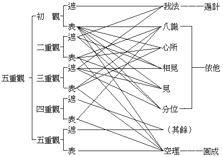
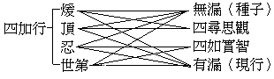
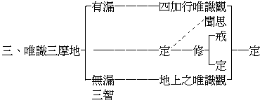
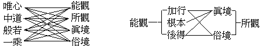
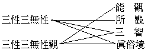
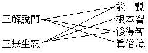
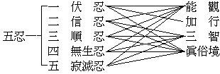
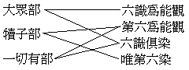

# 大乘法苑義林唯識章講錄
（1929 年，在漢口佛教會講）

## 目錄

- 科文
- 前言
- 述意
- 釋文
    - 甲一十　門總標
    - 甲二　隨標別釋
        - 乙一　出體門
            - 丙一　標釋二體
                - 丁一　標列
                - 丁二　分釋
                    - 戊一　出所觀體
                        - 己一　通觀諸法
                        - 己二　別明五重
                            - 庚一　標所觀數
                            - 庚二　釋所標重
                                - 辛一　遣虛存實
                                    - 壬一　定義
                                    - 壬二　引證
                                    - 壬三　廣釋
                                    - 壬四　結成
                                - 辛二　捨濫留純
                                    - 壬一　定義
                                    - 壬二　引證
                                - 辛三　攝末歸本
                                    - 壬一　定義
                                    - 壬二　引證
                                - 辛四　隱劣顯勝
                                    - 壬一　定義
                                    - 壬二　引證
                                - 辛五　遣相證性
                                    - 壬一　定義
                                    - 壬二　引證
                    - 戊二　出能觀體
                        - 己一　正出體
                        - 己二　辨異解
                            - 庚一　總辨
                            - 庚二　別顯
            - 丙二　別辨唯識
                - 丁一　料簡
                - 丁二五　種
                - 丁三六　門
                - 丁四　結指
        - 乙二　辨名門
            - 丙一　正辨名
                - 丁一　釋識
                - 丁二　釋唯
            - 丙二　釋妨難
                - 丁一　正釋妨
                    - 戊一　釋唯心難
                    - 戊二　釋唯智難
                - 丁二　總會釋
            - 丙三　總結成
        - 乙三　離合會釋門
            - 丙一　解門義
            - 丙二　正會釋
                - 丁一一　名會釋
                    - 戊一　舉類
                    - 戊二　釋能所觀名
                        - 己一　正釋
                        - 己二　會通
                    - 戊三　釋所觀名
                    - 戊四　列餘結成
                - 丁二二　名會釋
                - 丁三三　名會釋
                - 丁四四　名會釋
                - 丁五五　名會釋
                - 丁六六　名等會釋
            - 丙三　總結成
        - 乙四　何識為觀門
            - 丙一　標徵
            - 丙二　出異說
            - 丙三　出正義
        - 乙五　顯類差別門
            - 丙一　明真性識
            - 丙二　明俗事識
                - 丁一　正明差別
                - 丁二　別說四分
                - 丁三　結非一異
            - 丙三　總結成
        - 乙六　修證位次門
            - 丙一　明位次
                - 丁一　引攝論釋
                - 丁二　引成唯識論
                - 丁三　引瑜伽論
                - 丁四　會通
            - 丙二　辨修證
                - 丁一　結前生後
                - 丁二　正辨修
                    - 戊一　總舉
                    - 戊二　別釋
                        - 己一　證修
                        - 己二　相修
                            - 庚一　明定義
                            - 庚二　明位修
                        - 己三　地修
                            - 庚一　明二種修
                            - 庚二　別開四門
                                - 辛一　正明
                                - 辛二　料簡
        - 乙七　觀法何性門
            - 丙一　標立二門
            - 丙二　隨標別釋
                - 丁一　明能觀性
                - 丁二　明所觀性
                    - 戊一　引二論
                    - 戊二　會釋
                        - 己一　判觀位
                        - 己二二　門會釋
        - 乙八　諸地依起門
            - 丙一　辨依身
                - 丁一　明頓悟
                - 丁二　明漸悟
                    - 戊一　明不經生
                    - 戊二　明經生
            - 丙二　明地起
        - 乙九　斷諸障染門
            - 丙一　標名數
            - 丙二　明地斷
                - 丁一　正明地斷
                    - 戊一　明分別煩惱障
                    - 戊二　明俱生煩惱障
                    - 戊三　明分別所知障
                    - 戊四　明俱生所知障
                - 丁二　明障差別
                    - 戊一　瑜伽三住
                    - 戊二　深密經三隨眠
                    - 戊三　寶性論四障
                    - 戊四　勝鬘五住煩惱
                    - 戊五　舉類結成
        - 乙十　歸攝二空門
            - 丙一　標釋
            - 丙二　釋妨難
                - 丁一　出難
                - 丁二　釋難
            - 丙三　結成


## 科文


```
　　　述意
　　　釋文
　　　　甲一　十門總標
　　　　甲二　隨標別釋
　　　　　乙一　出體門
　　　　　　丙一　標釋二體
　　　　　　　丁一　標列
　　　　　　　丁二　分釋
　　　　　　　　戊一　出所觀體
　　　　　　　　　己一　通觀諸法
　　　　　　　　　己二　別明五重
　　　　　　　　　　庚一　標所觀數
　　　　　　　　　　庚二　釋所標重
　　　　　　　　　　　辛一　遣虛存實
　　　　　　　　　　　　壬一　定義
　　　　　　　　　　　　壬二　引證
　　　　　　　　　　　　壬三　廣釋
　　　　　　　　　　　　壬四　結成
　　　　　　　　　　　辛二　捨濫留純
　　　　　　　　　　　　壬一　定義
　　　　　　　　　　　　壬二　引證
　　　　　　　　　　　辛三　攝末歸本
　　　　　　　　　　　　壬一　定義
　　　　　　　　　　　　壬二　引證
　　　　　　　　　　　辛四　隱劣顯勝
　　　　　　　　　　　　壬一　定義
　　　　　　　　　　　　壬二　引證
　　　　　　　　　　　辛五　遣相證性
　　　　　　　　　　　　壬一　定義
　　　　　　　　　　　　壬二　引證
　　　　　　　　戊二　出能觀體
　　　　　　　　　己一　正出體
　　　　　　　　　己二　辨異解
　　　　　　　　　　庚一　總辨
　　　　　　　　　　庚二　別顯
　　　　　　丙二　別辨唯識
　　　　　　　丁一　料簡
　　　　　　　丁二　五種
　　　　　　　丁三　六門
　　　　　　　丁四　結指
　　　　　乙二　辨名門
　　　　　　丙一　正辨名
　　　　　　　丁一　釋識
　　　　　　　丁二　釋唯
　　　　　　丙二　釋妨難
　　　　　　　丁一　正釋妨
　　　　　　　　戊一　釋唯心妨
　　　　　　　　戊二　釋唯智妨
　　　　　　　丁二　總會釋
　　　　　　丙三　總結成
　　　　　乙三　離合會釋門
　　　　　　丙一　解門義
　　　　　　丙二　正會釋
　　　　　　　丁一　一名會釋
　　　　　　　　戊一　舉類
　　　　　　　　戊二　釋能所觀名
　　　　　　　　　己一　正釋
　　　　　　　　　己二　會通
　　　　　　　　戊三　釋所觀名
　　　　　　　　戊四　列餘結成
　　　　　　　丁二　二名會釋
　　　　　　　丁三　三名會釋
　　　　　　　丁四　四名會釋
　　　　　　　丁五　五名會釋
　　　　　　　丁六　六名等會釋
　　　　　　丙三　總結成
　　　　　乙四　何識為觀門
　　　　　　丙一　標徵
　　　　　　丙二　出異說
　　　　　　　丁一　小乘異說
　　　　　　　丁二　大乘異說
　　　　　　　丁三　結非
　　　　　　丙三　出正義
　　　　　乙五　顯類差別門
　　　　　　丙一　明真性識
　　　　　　丙二　明俗事識
　　　　　　　丁一　正明差別
　　　　　　　丁二　別說四分
　　　　　　　丁三　結非一異
　　　　　　丙三　總結成
　　　　　乙六　修證位次門
　　　　　　丙一　明位次
　　　　　　　丁一　引攝論釋
　　　　　　　丁二　引成唯識論
　　　　　　　丁三　引瑜伽論
　　　　　　　丁四　會通
　　　　　　丙二　辨修證
　　　　　　　丁一　結前生後
　　　　　　　丁二　正辨修
　　　　　　　　戊一　總舉
　　　　　　　　戊二　別釋
　　　　　　　　　己一　證修
　　　　　　　　　己二　相修
　　　　　　　　　　庚一　明定義
　　　　　　　　　　庚二　明位修
　　　　　　　　　己三　地修
　　　　　　　　　　庚一　明二種修
　　　　　　　　　　庚二　別開四門
　　　　　　　　　　　辛一　正明
　　　　　　　　　　　辛二　料簡
　　　　　乙七　觀法何性門
　　　　　　丙一　標立二門
　　　　　　丙二　隨標別釋
　　　　　　　丁一　明能觀性
　　　　　　　丁二　明所觀性
　　　　　　　　戊一　引二論
　　　　　　　　戊二　會釋
　　　　　　　　　己一　判觀位
　　　　　　　　　己二　二門會釋
　　　　　乙八　諸地依起門
　　　　　　丙一　辨依身
　　　　　　　丁一　明頓悟
　　　　　　　丁二　明漸悟
　　　　　　　　戊一　明不經生
　　　　　　　　戊二　明經生
　　　　　　丙二　明地起
　　　　　乙九　斷諸障染門
　　　　　　丙一　標名數
　　　　　　丙二　明地斷
　　　　　　　丁一　正明地斷
　　　　　　　　戊一　明分別煩惱障
　　　　　　　　戊二　明俱生煩惱障
　　　　　　　　戊三　明分別所知障
　　　　　　　　戊四　明俱生所知障
　　　　　　　丁二　明障差別
　　　　　　　　戊一　瑜伽三住
　　　　　　　　戊二　深密經三隨眠
　　　　　　　　戊三　寶性論四障
　　　　　　　　戊四　勝鬘經五住煩惱
　　　　　　　　戊五　舉類結成
　　　　　乙十　歸攝二空門
　　　　　　丙一　標釋
　　　　　　丙二　釋妨難
　　　　　　　丁一　出難
　　　　　　　丁二　釋難
　　　　　　丙三　結成
```


今日講此唯識章者，此章出大乘法苑義林中。大乘法苑義林，乃唐窺基大師所著。基師為玄奘法師高足，學德絕倫，著述百部，倡唯識宗學，平生傑作，在此義林。所詮要義，有唯識章；章者猶篇也，此唯識章義林中之一篇也。章中小字，智周法師抉擇之記，凡理之未顯，難之未釋者，智師則記釋之復為抉擇，故云抉擇記焉。今略不講。

## 述意

今獨講此章，不演餘章及餘經論何也？略述三義：

一者，近數年來，中國佛法漸有昌明氣象，於此氣象中所新興者，要有二派：一、重實行的密宗派：密宗亦云真言宗，其所宗尚，佛菩薩之真言也。中國唐時亦頗盛行，唐以後失傳於日本；近年世界交通，學者復由日本傳歸，謂之東密。又有西藏、蒙古之喇嘛傳來者，謂之藏密，其所學所宗者，同是佛菩薩之三密真言也。二、重理智的唯識派：唯識宗亦云法相宗，此宗從諸法真理上說明一切法之建立，為佛法教理之根本學，唐時最盛，厥後漸衰。迨民國來，頗為一般學者所宗尚，故又趨復興焉。

中國近千年之佛學，雖有多宗學派，然仍不外二派所屬：如淨土、禪宗可攝於實行派中，天台、賢首可攝於理智派中。實行方面，淨土、禪宗現雖亦振作精神，力謀大興，然終弗及密宗之盛。天台、賢首之宏揚，雖不乏大德之士，而終未逮新興之唯識宗得勢。如表：——


```
　　　　　　　　　　　　　┌淨土宗──┬─────衰─┐
　　　　　　　┌實行方面─┤禪　宗──┘　　　　　　　│
　　　　　　　│　　　　　└密　宗────────盛　│
　　　　佛法─┤　　　　　　　　　　　　　　　　　　　├現狀
　　　　　　　│　　　　　┌天台宗──┬─────衰　│
　　　　　　　└理智方面─┤賢首宗──┘　　　　　　　│
　　　　　　　　　　　　　└法相唯識宗──────盛─┘
```


總觀二者，雖各有差別，其實互相顯發，無所偏黨也。要知佛法重實行，尤重理解，故凡真實行者，宜依教明理而起正行，始得正軌；否則易入邪途魔境矣。又真實學者，達教明理之後，宜起觀行，不著知解，求證真實得大受用，否則難脫數寶之譏耳。即觀唯、密二派，行者、學者近有偏執，故講此章，使行者解教達理，學者明理起行，雙關兩要，尤契機宜矣。

此章所明之教理行果，乃唯識之教，唯識之理，唯識之行，唯識之果。即依此教之理，徹底觀察吾人之身心世界，謂觀察身心三業善惡等，世界微塵、惑業等，於理於事明了之後，如何取捨而起於行，是謂之大乘菩薩行。如是觀行，以智慧為先導，如行路然，由此大智慧燈導之前進，必安抵目的地，所謂證大果也。

二者，佛法來漢之後，中國古德竭智力以詳究，盡形壽而實行，凡立宗派，多為綜合之學。此唯識章，既屬中國大德所著，非傳譯來，故此章亦具綜合之性質。

佛法自釋尊示寂後，在印度即分大小乘，小乘有二十餘派，無綜合性。大乘三派：一曰法性般若宗，二曰法相唯識宗，三曰法界真淨宗。此三派，玄奘在印度曾著會宗論，作綜合之研究。故中國古德研究佛法，多為綜合匯通之作。基師此章，即唯識宗之綜合各宗、匯通他派之大著，如云：『攝一切法歸無為之主，故言一切法皆如也。攝法歸有為之主，故言諸法皆唯識。攝法歸簡擇之主，故言一切皆般若』。


```
　　　　　　　　　　　　　　　　　　　　　　　　┌─密　宗
　　　　　　　　　　　　　　　　　　　　　　　　│　淨土宗
　　　　　　　　　　┌─無為主──法界真淨宗──┤　華　嚴
　　　　　　　　　　│　　　　　　　　　　　＼　└─法　華
　　　　攝一切法歸─┤　有為主──法相唯識宗 ├───────禪　宗
　　　　　　　　　　│　　　　　　　　　　　／
　　　　　　　　　　└─簡擇主──法性般若宗────三論宗
```


此能攝雖有三主差別，其實皆總明佛法，且所攝皆一切法也。近來宏揚唯識者，猶有偏蔽，多不能遍攝互融一切佛法，故特講此章，以救宏此宗者之流弊焉。

三者，唯識章中廣明教理，而尤注重明唯識行。佛法之在中國，信仰修行者甚眾，求其明白教理者則鮮。倘不明教理而起修行，雖能種善根而終不免二弊：一、被世譏為迷信，二、令自心不穩當。迷信乃近來佛教前途之大障，凡信仰佛法者急宜破之。除此譏障，非明教理不可，今講此教，意亦在茲。不穩當者，信者本自無教理之觀察，自心對於佛法不能堅切信仰，或盲從、或附合，人言亦言，人信亦信，自無正觀，終必退墮。甚或聞說起行不知抉擇，以盲引盲招魔附鬼，益障聖教；故修行中尤應重教理。唯識之明行也，與他宗不同，非先多聞聖教徹觀真理之後，不能起正觀行。不同淨土等宗，不明教理亦可修行。因淨土等不明教理修行，真實佛法漸呈衰象；何以故？教理為佛學之根本，不明教理故失佛之根本教義，教義不明內迷外惑，社會之中即生種種障礙誹謗。今講唯識章，意在明真實佛教，釋外謗也。既以正見軌行，亦以正論息謗也。

## 釋文

### 　　甲一十　門總標

唯識義章略以十門辨釋：一、出體，二、辨名，三、離合會釋，四、何識為觀，五、顯類差別，六、修證位次，七、觀法何性，八、諸地依起，九、斷諸障染，十、歸攝二空。

此段正顯解題大綱，略有十門。十門分別攝境行果：謂前三門明唯識境，次六門明唯識行，後一門明唯識果。如表：


```
　　　　一　出　　體─┐
　　　　二　辨　　名　├────────明唯識境
　　　　三　離合會釋─┘
　　　　四　何識為觀─┐
　　　　五　顯類差別　│
　　　　六　修證位次　│
　　　　七　觀法何性　├────────明唯識行
　　　　八　諸地依起　│
　　　　九　斷諸障染─┘
　　　　十　攝歸二空──────────明唯識果
```


問：十門之中，第一出體雙出能所觀體，所觀屬境則可，能觀應屬於行云何亦屬境耶？答：文雖雙出二體明能所觀，而正所明在所觀境邊，不在能觀行邊；能觀法亦為五蘊中之法，此法仍屬所觀之境，故仍攝境中也。問：次有六段，亦兼明境，云何判為行耶？答：明行勝故，正顯行故，所以立行。問：云何二空？果復何義？答：二空者，生空、法空。生空者，謂有情眾生空。法謂宇宙萬有，此萬有空故云法空。所言果者，二空非果，二空所顯菩提涅槃是謂之果。所顯義者，一切有情無始以來執生我故，生諸煩惱障大涅槃；證會眾緣和合生本空寂，則所顯者即大涅槃。復由遍計諸法分別執為實故，障所應知諸真實境；若達法性真空，依他幻有，則能顯者即大菩提。故由二空，顯二大果。

### 　　甲二　隨標別釋

#### 　　　　乙一　出體門

##### 　　　　　　丙一　標釋二體

###### 　　　　　　　　丁一　標列

> **第一出體者，此有二種：一、所觀體，二、能觀體。**

第一出體者，標也。此有二種：一所觀體，二能觀體，列也。所謂出體，出謂標示，體即是義。看經閱論，不宜執名取義，當觀前後文義，依義定名。此中出體之體，與天台五重玄義「名體宗用教」之體不同義。天台之所謂體者，指一切法之真實性義，如云真如、實際、空性等，是普遍體。此中言體，指一一法各有自體不相混合，如火以熱為自體，水以溼為自體等。此中所出之自體，即出能觀唯識及所觀唯識之自體。所觀亦云被觀察者，能觀即是能觀察者。

###### 　　　　　　　　丁二　分釋

###### 　　　　　　　　　　戊一　出所觀體

###### 　　　　　　　　　　　　己一　通觀諸法

> **所觀唯識，以一切法而為自體，通觀有無為唯識故。**

問：所觀察之唯識，以何為體耶？答：以一切法而為自體。一切法者，略有二種：一、有為法，二、無為法。此二種法，總攝宇宙萬有一切法盡。云何有為法？謂即此法眾緣所成，生滅變易是也。云何無為法？謂非因緣生，無生滅變易是也。此以有為無為為一切法，與辨中邊論所明相同，有為即俗諦，無為即真諦；而與對法論以三性攝一切法，則不相同。如表：


```
　　　　辨─┐　　　　┌─有為法──俗諦──依他起─┐
　　　　中　│　　　　│　　　　　　　　　　　　　　├有法─┐
　　　　邊　├一切法─┤　無為法──真諦──圓成實─┘　　　├對法論等
　　　　論　│　　　　│　　　　　　　　　　　　　　　　　　│
　　　　等─┘　　　　└─　　　　　　　　　遍計執──無法─┘
```


諸法緣生依他起性，本無實我實性。妄執實有，遍計執也。如吾人身體，本來是四大、五蘊因緣而成，無有自我，而一般人不達此理，妄想執為有一自我；此即離開體相用之物質事實與感情理智等外，別執有一自我，其實此「自我」相如兔角耳。又如他教之執有造物主，此造物主能造天地萬有，如印度之執大自在天也，耶、回之執上帝也，亦同妄執。


```
　　　　我一──五蘊假者──自我─────────┬─虛妄執著
　　　　　　　　　　　　　　　　　　┌自在天─┐　│
　　　　萬有──六大緣生──造物主─┤　　　　├─┘（無體相用）
　　　　　　　　　　　　　　　　　　└上　帝─┘
```


此等造物主，非有為非無為，乃虛妄執之假想，世間俗人不明此故，復為立種種名以為說明，此皆離於事實真理而絕對沒有者，故云無法。此法雖無，妄執是有，故論云：「虛妄分別有，於此二都無」，審矣。言通觀者，遍觀察義，謂遍觀察此一切法，若有為、若無為、皆唯識現，為所觀唯識境故。此觀行不同數息、不淨等觀，數息等觀，為專取一法之觀，非一切法總觀也；今者通觀，乃大乘中遍觀一切法之總觀，如諸法實相觀，故知此觀之體即一切法也。

###### 　　　　　　　　　　　　己二　別明五重

###### 　　　　　　　　　　　　　　庚一　標所觀數

> **略有五重。**

所觀法體，廣則無量，而略顯五重者，次第義。言五重者，即從寬至狹、從淺至深、從粗至細之五重唯識觀也。


```
　　　　一　遣虛存實─┐
　　　　二　捨濫留純　│
　　　　三　攝末歸本　├─粗（淺）（寬）總觀
　　　　四　隱劣顯勝─┘
　　　　二　捨濫留純─┐
　　　　三　攝末歸本　├─細（深）（狹）別觀
　　　　四　隱劣顯勝　│
　　　　五　遣相證性─┘
```


五重妙義，略分總別：總對利智者說，別對鈍根者說。有智之士，聞初觀即可達空證不空。若鈍根者，或滯餘執，故須重重別明，如剝芭蕉，及至最後歸無所得。然此五重教理觀行，雖經論本有，而名義與層次則肇自基師，基師之前人所未發，故建立者厥屬章主。

###### 　　　　　　　　　　　　　　庚二　釋所標重

###### 　　　　　　　　　　　　　　　　辛一　遣虛存實

###### 　　　　　　　　　　　　　　　　　　壬一　定義

> **一、遣虛存實識。觀遍計所執，唯虛妄起，都無體用，應正遣空，情有理無故。觀依他、圓成諸法體實，二智境界，應正存有，理有情無故。**

此第一明初重觀也。識者，猶言唯識觀也。遣虛者，遣謂排遣，虛謂虛妄，凡不合理違離事實之虛妄執，如神我、造物主等，皆應排遣淨盡。實謂諸法真實自相——圓成實性，依他起性道理應有，故須存留。


```
　　　　　　　┌自　我─┐
　　　　遣虛─┤　　　　├─遍計執───空觀─┐
　　　　　　　└造物主─┘　　　　　　　　　　├─中道觀
　　　　　　　┌法　相───依他起─┐　　　　│
　　　　存實─┤　　　　　　　　　　├─有觀─┘
　　　　　　　└法　性───圓成實─┘
```


觀遍計所執下，顯初觀定義，即出體也。初五句正明遣虛：凡夫有情遍計執之神我、造物主等，皆是龜毛、兔角，純為假想構造，從虛妄起，毫無事實之體相用。此等執計能障正智，於妄情上可說為有，察於事實真理則無，是應正排遣之，令空無有。次五句者，正明存實：凡仗因托緣依他而起之有事實體用者，是後得智所緣俗諦，應正留存；而根本智所緣之圓成實真諦，亦應存有。此之二者，妄情執上雖是無有，事實真理都有不無，亟應正觀存有者也。

###### 　　　　　　　　　　　　　　　　　　壬二　引證

> **無著頌云：『名事互為客，其性應尋思。於二亦當推，唯量及唯假。實智觀無義，唯有分別三，彼無故此無，是即入三性』。**

引證有二，此即第一引攝大乘論證。此論為佛滅後九百餘年，印度無著菩薩所造，解釋大乘阿毗達磨經中之攝大乘品也。本論三卷，釋論有世親、無性二種，均有譯本。梵語阿僧佉，此云無著，謂於一切法無所執著。頌者，梵文文法，字句有定，或三四五六七字為句，四句一頌，猶中國之詩也。引頌有二，論句有八。欲解此頌，先明四觀、四智。

四觀者：一、名尋思觀，二、事尋思觀，三、自性尋思觀，四、差別尋思觀。云何名尋思觀？尋謂尋求，思曰思維，於事於理，先為尋求，次則如理思維，澈底觀察，故云尋思。於一切法「名」上，尋求思維，曰名尋思觀。云何事尋思觀？事、謂宇宙萬有因緣所成，有體相用，事實物件現前可得。於此尋思，名事尋思觀。云何自性尋思觀？自性者，謂即諸法或名或事所有定義。於此尋思，名自性尋思觀。云何差別尋思觀？差別者，謂即諸法或名或事所有互相差別義理。於此尋思，名差別尋思觀。如表：——


```
　　　　　　　　　┌名尋思觀
　　　　　　　　　│事尋思觀
　　　　四尋思觀─┤
　　　　　　　　　│自性尋思觀
　　　　　　　　　└差別尋思觀
```


四如實智者，即前四觀、極熟觀察所引發之四智。如表：——


```
　　　　　　　　　┌名尋思所引如實智
　　　　　　　　　│事尋思所引如實智
　　　　四如實智─┤
　　　　　　　　　│自性尋思所引如實智
　　　　　　　　　└差別尋思所引如實智
```


名事互為客，其性應尋思者，明四觀中初二觀也。名，如此物字曰花瓶，此花瓶名即指此事。事謂事實，為名所指。互為客者，謂一切法之名或事，可以互為主客，不必此名必指此事，此事必有此名。此即顯示名事二者，非是固定永久結合，如此名在此處即指此事，其在他處，名雖相同而所指非此事，或另指別物也；故名望事不可決定，是為客義。又如此事在他處立此名，其在此處事雖相同，而所立名則非此名；故事望名不可決定，是為客義。如是二者互相為客，非是固定而是可離，故云名事互為客也。其性應尋思者，正顯名之與事，應當審慮觀察。性者、名與事之體性，此二體性非是決定結合，應知尋思名唯是名而非事等，事唯是事而非名等。此事有此名、此名指此事者，皆是世俗習慣假為安立。故老子云：「鎮以無名之樸」。其未發見之事物則無名，發見之後，隨有情者樂意立名而無決定。故事離名則為真事，名若離事即為空名。若定執著名事決定不相離者，是失真事，亦壞真理，故云其性應尋思。如表：——


```
　　　　　　　　┌名唯是名不關事等
　　　　應尋思─┤
　　　　　　　　└事唯是事不關名等
```


於二亦當推者，二謂自性及與差別，推即推求考度，亦曰尋思。前之名事，既已尋思觀察，名唯是名，事唯是事，互相為客。今此自性、差別，亦應尋思觀察。云何觀耶？謂即依此名事假立自性、差別，推思自性假立上唯是自性假立，無差別義。差別義上、亦應推思差別假立唯是差別假立而無自性。如「瓶」，瓶字為名，瓶物為事。瓶自性者，以有質礙之物質為自體；此質礙性可有變化破壞，即差別義；是為瓶之名事上之自性、差別。故名事上自性、差別皆是假立。唯量及唯假者，量曰思量，哲學名認識論，佛學謂之分別了知。唯量者，猶云唯識，謂唯有認識分別而無名、事、自性、差別也。假有二種：一、隨情妄執假，二、稱理施設假。前者為凡夫對於事實真理不能明白，隨其妄情顛倒，執著事物名相，我及我所。此種假相，亟應破除。後者為覺者如理依事，隨世間想，為化導人假為建立名事等等。此固可用，然須達理，否則仍屬執著。是故於前四種事上，尋思觀察名、事、自性、差別，都是了知分別之識所變起之假相。換言之，即是八識所變緣之相分而已。事物相分皆從識變，假立名、事、自性、差別，故云唯假。唯量、唯假，謂觀自性及差別，唯分別與假立也。


```
　　　　　　　　　┌名　┐
　　　　八識　　　│　　│　　　相分
　　　　　　唯量─┤事　├─唯假
　　　　能變　　　│　　│　　　所變
　　　　　　　　　│自性│
　　　　　　　　　│　　│
　　　　　　　　　└差別┘
```


下四句，明四如實智。實智觀無義者，由四尋思，如其事實真理極熟觀察引發四智，曰四如實智。既謂現觀證驗，亦云明心見性。觀無義者，達名事等皆無實也。四如實智，云何觀無義耶？謂四如實智，遍觀種種名、種種事、種種自性、種種差別，以及一切言論思想分別，皆無實體相用，此即顯示唯假義也。唯有分別三者，如實之智分明現觀，見假立諸法唯有分別三。換言之，即唯有三分別也。云何分別及三分別？分別即識。三分別者，謂依名、事、自性、差別，成立二種三分別。此以名、事為主，自性、差別隨名事轉。第一、名，名自性，名差別。第二、事，事自性，事差別。故他論有云六尋思。如表：——


```
　　　　　　　　　┌名─　─┐
　　　　名三分別─┤名自性　│
　　　　　　　　　└名差別　│
　　　　　　　　　　　　　　├─六尋思
　　　　　　　　　┌事──　│
　　　　事三分別─┤事自性　│
　　　　　　　　　└事差別─┘
```


復云何觀唯有三分別耶？謂觀名、事、自性、差別，唯有知識分別，都無事實，此即顯示無境唯識也。彼無故此無，是即入三性者，初句顯示心境俱空，次句顯示入三性位。彼者、境也，指前名、事、自性、差別。此者、分別識也。彼無者，謂彼境既無，緣境之識亦無。由此達到四加行中世第一位最後剎那，證初地果，悟入三性。

四加行者，煖、頂、忍、世第一位。前之二位修四種觀，後之二位修四種智。如表：——


```
　　　　　　　　┌煖　　位─┐
　　　　　　　　│　　　　　├修四尋思觀
　　　　　　　　│頂　　位─┘
　　　　四加行─┤
　　　　　　　　│忍　　位─┐
　　　　　　　　│　　　　　├修四如實智
　　　　　　　　└世第一位─┘
```


是即入三性者，依先觀智證入三性：通達名事互為客等，悟入遍計執性空不可得；知諸法唯量及假，都無實義，如幻如化，即能悟入依他起性法無自性；次復諦觀無境無識，能所雙忘，證會真如，悟入圓成實性真實不虛。

釋頌已竟，云何證明遣虛存實耶？此復應知初之二句，明遍計執相：此名事二屬虛妄執，尋思觀察，排遣淨盡，名曰遣虛唯識觀。次之四句，明依他起相：緣生諸法，唯量唯假，了知名中無事、事上無名，因緣和合，形形色色盡是假有，唯識所變。事體是有，應當存有。末之二句，明圓成實相：由前觀察無境有識，進而證照境無識無，心境俱空，離諸言思，由根本智親證真如諸法實性，是即悟入圓成實性。自此復起後得無漏智，由後得智普觀諸法，分明了了如幻、如化、如泡、如影，空而不空，是謂妙有。此為初地菩薩根本智親證真如之境事也。如表：——


```
　　　　名、事、自性、差別───遍計執者─┐──────遣虛
　　　　　　　　　　　　　　　　　　　　　├（修四尋思觀）
　　　　名、事、自性、差別───依他起者─┘（假有）─┐（修四如實智）
　　　　　　　　　　　　　　　　　　　　　　　　　　　├存實
　　　　名、事、自性、差別───圓成實者　　（實有）─┘
```


> **成唯識言：『識言，總顯一切有情各有八識，六位心所，所變相見，分位差別，及彼空理所顯真如。識自相故，識相應故，二所變故，三分位故，四實性故。如是諸法，皆不離識，總立識名。唯言，但遮愚夫所執定離諸識實有色等』。**

第二、引成唯識論證。此論造者有十大師，故不舉人名。依文義觀，為護法說。此釋「唯識」二字。初釋識字，識言者，謂識之一言也。總顯一切有情各有八識者，一切有情者，有知覺感情之動物也。此識言，非指十方無量世界有情共同一識，乃顯十方無量世界一一有情各有八識。然事實上或不各具八識，如生盲等有情；三世通計則各具八識也。六位心所者，八識為心王，依八識起心理作用，謂之心所有法。此有六位五十一種，恐繁故略（六位五十一種，詳百法明門論）。所變相見者，心及心所皆是能變，相見二分是為所變。所變相者，即所觀——見聞知覺等境象。所變見者，即能觀、視覺等。如眼識起用，一面變生所見相分，一面有觀此相之見分是也。分位差別者，顯心色上假立法也。即能變識與所變相見——三事分位——上之不相應假法，如東西之方，與一二之數等；數理學上之時、空，文學上之名、句、文等是也。及彼空理所顯真如者，彼，謂前此八識，心所、相見、分位諸法；此四位法皆緣所生，本性空寂，此空所顯謂之真如，不離前相別有真如，以故真如亦是唯識。

識自相故等，成立五位真是唯識。云何八識皆是識耶？答：是識之自相故。自相者，本相也。云何六位心所亦是識耶？答：識所有故。識現起時，彼六位法，隨順和合得現起故。相應者，隨順和合義也。云何所變相見亦謂識耶？答：相見二分，為八識及六位心所法之所變現故。云何分位差別之假法，亦謂識耶？答：識及所變相見既皆是識，依此所假立之分位，豈離識別有哉！云何空所顯示真如實性，亦謂識耶？答：所謂真如實性，非離前四位法別有真如實性可得，真如性即是諸法自體性故。此真如性不離前有，故亦是識。如是等五位諸法，總攝萬有，皆非離識別有自性，是故總立識之一名。

唯言者，此下釋唯字。所謂唯之一言，遮也。所遮何等？謂即愚夫所執定離諸識實有色等一切諸法。愚夫者誰？二乘及凡外聰慧，不達諸法唯識所現皆是愚夫。


```
　　　　　　　┌世聰凡外┐───┌我─┐
　　　　愚夫─┤　　　　├色等─┤　　├執著
　　　　　　　└二乘愚法┘───└法─┘
```


如是唯識，云何成立遣虛存實？彼愚夫等，由虛妄心周遍顛倒，定執離識實有我法種種差別，說此唯識。唯言、即遮彼等此遍計執，是謂遣虛；識言、即顯我法識變因緣假有，事實如此依他而起，及彼假有空性真理圓成實性，是二於事及理皆正有故，是謂存實。


```
　　　　　　┌唯───遮───遍計執───遣虛┐
　　　　唯識┤　┌非有妙有──依他起┐　　　　├遣虛存實識
　　　　　　└識┤　　　　　　　　　├──存實┘
　　　　　　　　└真空不空──圓成實┘
```


> **如是等文，誠證非一。**

此結證也。謂今略引二論，證明應遣虛妄，正存實有。若廣引示，如是等文誠證非一。

###### 　　　　　　　　　　　　　　　　　　壬三　廣釋

> **由無始來，執我法為有，撥事理為空。**

此下第三廣釋以明此觀，文亦有二：由無始來至性離言故者，初正釋明也。說要觀空至亦應除遣者，第二釋妨難也。今初：

由無始來，執我法為有，撥事理為空者，顯諸有情無始以來顛倒執著。無始來者，謂一切有情從無始來，各有八識及六位心所，所變相見等。如是諸法，唯識所變，剎那生滅，無始無終，不同他說有始有終。彼云何說？歐美學術唯物論者，計執原子能生天地一切人物；彼謂天地萬有未起之時，由諸原子為本質故。唯我論者，執精神自我為萬有本；彼謂宇宙一切生物，未現起位，皆有神我為創造主。耶、回宗教計執上帝為萬物父，彼謂宇宙由彼造故。中國學術，儒、道、陰陽之家，多執太極為萬物本；彼謂兩儀未分陰陽混沌之際，是曰太極。又曰：太極生兩儀，兩儀生四象，四象生八卦、萬有等。墨家所執之天鬼，例同耶、回。印度學術異計更多，或執冥性——冥然無顯現之體性，或執有性，或執自在天等。如是等類，皆不應理。云何非理？謂萬有法從本以來，自類因緣生滅遷變，非另有主創造令生。若執萬有由造物者始得生起，汝意云何：彼造物主待餘造否？若不待餘，彼即無始，仍成我義；若待餘造，彼尚無主，云何能造天地萬有？又復待餘，成無窮過。又復等同此萬有法，何以故？同為他所造故。若定執彼不待餘造，此亦不須為彼所造。是故所執皆非道理。

道理云何？謂一切法若生若滅皆無始終？人生宇宙，粗色身相，雖有生死變化段落可見，其實因果鉤鎖相續，生前無始，生後無終；如水火相，前後生滅雖現變易，不常不斷；心識生滅，亦復剎那活潑潑地遷變不已。如是當知身心世界動作變化，念念生死，生生死死，死死生生，當體即是無始無終，不待餘造而成始終，故云無始。以一切有情八識心所，從無始來生滅變遷，如瀑如流。第八識中本有有漏、無漏二類種子，無漏種子諸清淨法、為迷惑故不克現起，有漏種子、無始無間恆現時起成雜染法，是曰眾生。凡夫眾生不明事理，顛倒妄想，執我執法為有實體。所執我者，認有主宰、有情、命者實體可得，是謂人我執。所執法者，執宇宙萬有之法亦有實體，實、德、業等，是謂法我執。有者、定有，謂實體性。一切有情無始以來，由迷惑故定執我法有實體性。故云無始來執我法為有。

撥事理為空者，顯迷執之因及迷執之所以也。人法之我本來無有，反執為有。依他事實及彼二空所顯圓成真理，二智所證本來是有，反不證知，撥之為空。察其所以執我法為有者，迷事及理也。然其反撥事理以為空者，以執我及法也。我法全空，妄想顛倒執而為有，遍計執也。今觀唯識，了其虛妄，是故遣之。事謂事實，依他幻有；理謂圓成，二空所顯。今觀唯識，了其真實，是故存之。不達事理如幻真如，即執我法；由執我法為有，即撥事理為空，此定理也。

> **故此觀中，遣者空觀，對破有執；存者有觀，對遣空執。**

前明我法執之有病，及撥事理之空病。病既發生，不得不治之以藥。今斯觀者，醫斯病也。遣者除遣，如藥去病。能除遣者，由習空觀，故曰遣者空觀。所除遣者，是我法有，此執有病為空所破，故曰對破有執。有執即是虛妄遍計，以本來空，除此虛妄，故曰遣虛。存者留存，如病去人存。既破有執眾生本空，因不明事理之有，遂執皆空，撥無事理。知留存者，由修有觀，故曰存者有觀。此觀對治撥無事理之空病也。既成空病，應亟觀有而對遣之，故曰對遣空執。習空破有，是空遍計；修有治空，是存依圓。此一往之談也。克實而論，破有即是空觀，虛妄一遣，當下即顯事實真理，成中道觀。又存有者，即顯我法本空；遣空亦明事理本有，契中道觀。


```
　　　　　　　　┌有──我法─┬──遣─┬───空　觀
　　　　　　　　│ ＼　／　　 └遍計──┘┌──┘
　　　　遣虛存實┤　 ╳　　　 ┌依他──┬┼──中道觀
　　　　　　　　│ ／　＼　　 ├圓成──┤└──┐
　　　　　　　　└空──事理─┴──存─┴───有　觀
```


> **今觀空有而遣有空，有空若無，亦無空有。**

此二觀者，顯中道法性之觀。所謂有者，凡夫妄執我法之有。所謂空者，凡夫撥無事理之空。今以此空有妙觀，治彼有空癥結。彼執我法之病若除，此空觀亦無；若彼撥無事理之空執一滅，此治空之有觀亦息。何以故？我之與法本無其事，迷事理故妄執為有，是增益執。依圓事理本來如是，為我法障反撥為無，是損減執。法本如是，何勞增減成邊邪耶？為去此病令不增減，還其本來，正智證驗應修中觀，是故說此遣虛存實。


```
　　　　　　┌我法有─┬──增　　益──有邊
　　　　　　│　　　　└──┐
　　　　執─┤　　　　　　　非有非空──中道
　　　　　　│　　　　┌──┘
　　　　　　└事理空─┴──損　　減──無邊
```


> **以彼空有，相待觀成；純有純空，誰之空有？**

對有空之執，修空有之觀。以觀我法之本空，遣撥無事理之頑空；以觀事理之妙有，遣妄執我法之假有。又復對彼空執、有執，成此有觀、空觀；若無有執、空執，亦無空觀、有觀，故曰相待觀成也。更深觀之，一切法若從本以來純是有者，不但無此有之義，即此有之名亦無；其治有之空，又復為誰之空？若純空者，不但無此空之義，即空之名亦不可得；其治空之有，又復為誰之有耶？齊此而明聖智事理上之有，對凡夫妄情上之空；凡夫妄情上之空，乃對聖智事理上之有。聖智之我法空，乃對凡夫妄情之我法有；凡夫妄情之我法有，乃對聖智之我法空。故空者誰之空？空凡夫迷情之執有也。有者誰之有？有凡夫迷情之撥空也。換言之，誰之空耶？凡情所執我法，聖智知其空也。誰之有耶？凡情所撥事理，聖智知其有也。

> **故欲證入離言法性，皆須依此方便而入，非謂有空皆即決定。證真觀位，非有非空，法無分別性離言故。**

離言性者，法性體上無有分別、本來如是之真實相也。有、空之病若無，空、有之觀亦去。是即有即空，即空即有，亦是非有非空，非空非有。如是有空空有，雙照雙寂，方能證入諸法離言自性真如，逮得自覺。然病之未去，藥仍須服，是故修習佛法、欲證離言法性，其未證入之先，須依此遣虛存實、有空空有之大方便門，方可入證，契證中道實相本來面目也。既屬方便，原本治病，有病吃藥，無病不吃。治彼有空，觀此空有，有非定有，空不決空，故曰非謂有空，皆即決定。此言有者，依圓妙有，此說空者，我法本空也。

證真觀位者，謂證入真如現觀位時，即非空非有；既不是對破空執之有，亦不是對破有執之空。何以故？法上無分別故；以諸法性本來如是。菩薩證真觀位，不僅一切言論烏有，即其思想分別亦成子虛，故曰性離言故。然悟他故後得智起，仍說空有，對破凡夫所執有空，是謂覺他。

> **說要觀空方證真者，謂要觀彼遍計所執空為門故，入於真性；真體非空。**

此下第二釋妨難也。初空教難，難云：般若等經皆說觀一切空方證真如，云何此處亦觀有耶？答：經言觀空者，謂觀凡夫遍計執上執我執法之有，依空遣已，方可證真。此是以觀空為門證入真實，非謂此遍計空，即彼真性實相以及一切依圓妙有皆非有也。非空之真體，即是圓成實性，非有之妙有，即是依他起性。此二真實，其體非空，非如遍計所執我法之空無耳。

> **此唯識言既遮所執，若執實有諸識可唯，既是所執，亦應除遣。**

第二釋有難也。難云：既爾，應定實有唯識之法。不爾，唯識空、有之觀，破彼有、空之執。若定於此空、有觀中執著實有諸識可唯，亦成遍計法執。既是法執，亟應除遣，證入諸法離言自性。

###### 　　　　　　　　　　　　　　　　　　壬四　結成

> **此最初門所觀唯識，於一切位思量修證。**

此下第四總結。五重觀中此觀居首，故云初門。此門所觀唯識道理寬廣圓滿，故云於一切位思量修證。一切位者，從初發心乃至成佛所有階位也。謂初發心位，固宜發心修空、有觀，遣虛存實；乃至等覺亦修此觀，遣虛存實。大覺之位，正智現前，亦依此觀，證離言性不動真如。

###### 　　　　　　　　　　　　　　　　辛二　捨濫留純

###### 　　　　　　　　　　　　　　　　　　壬一　定義

> **二、捨濫留純識。雖觀事理皆不離識，然此內識有境有心，心起必託內境生故；但識言唯，不言唯境。**

第一重觀，如對敵總攻。此下四觀，細為尋破。濫者境義，純者指心，謂捨去境之濫而留心識之純，亦即對遣前觀上法執之病也。雖觀事理下，第一明定義也。前觀事之與理不離識有，此識所變有境有心，即是所變相見，心起必託內境生故。心起者，謂即能觀見分之發生，此見分起，必變帶識內相分起，見分即託相分而生。問：識體變似相見二分，即是識體有境、有心，既可依心而言唯識，何不依境而說唯境耶？同是識自體所變故。答：心境雖皆識所轉變，內境雖可言唯，然此境義，有濫外境，不說唯境。心無此過，故言唯識。是即但從心識言唯，不從境上而說唯言。


```
　　　　　┌心─內心──────見分
　　　　識┤　┌內境──依他──相分
　　　　　└境┤
　　　　　　　└外境──我法
```


###### 　　　　　　　　　　　　　　　　　　壬二　引證

> **成唯識言：『識唯內有，境亦通外，恐濫外故，但言唯識。又諸愚夫迷執於境，起煩惱業生死沈淪、不解觀心懃求出離；哀愍彼故說唯識言，令自觀心解脫生死。非謂內境如外都無』。由境有濫，捨不稱唯；心體既純，留說唯識。**

此下、引教證：初、引論證唯識留純，二、引經證離境捨濫。此第一引成唯識論證也。識唯內有境亦通外者，謂心是內識所有；其境之一法，通於凡小遍計所執實我實法之境，恐此濫外故捨之。心無斯失，言唯何害？又諸以下，顯對病也。謂諸愚夫，由不了達內境亦是識所轉變，遂起執著有我、有法。又復由此起貪等煩惱及造善惡等業，因有煩惱及業，生死輪迴，受諸果報，無期能脫。其所以致此生死者：一面執境固矣，一面亦不知內觀於心，不了心境皆是識變，求出離行，故成大禍，生死茫茫。今說唯識，即大悲心憐愍彼等，令觀內心不執外境，如幻如化，解脫生死。其實非說內境亦如我法執無所有也。由境有濫下，章主釋成也。言心體者，謂心心所見分、自證分也。

> **厚嚴經云：『心意識所緣，皆非離自性，故我說一切，唯有識無餘』。華嚴等說：『三界唯心』。遺教經言：『是故汝等當好制心，制之一處，無事不辦』等，皆此門攝。**

此下引經證捨濫義。厚嚴經者，釋尊所說。有說：即是密嚴經，所說文句與此同故。心意識者，有云體一；其說三名，依勝而言：心為第八，意即第七，識謂前六。所緣者，所了思維觀察境也。謂此八識所緣境，皆不離八識之自體性。故我說者，釋尊所說。一切者，心意識所緣境相也。唯有識無餘者，謂心意識所緣，既即是心意識，故我說此一切相分法唯有識（留純）而無餘（捨濫）也。

華嚴等說三界唯心，引華嚴等經證論云：『三界上下法，唯是一心造』。又云：『若人欲了知，三世一切佛，應觀法界性，一切唯心造』。三界、世間境也，此境即是心之所現，不離心體，故云唯心。

遺教經言至事無不辦等，世尊證諸法界或事與理皆不離心。故教比丘當好制心，心若制於一處，則一切事皆成辦。語云：「事怕有心人」。又云：「有志者事竟成」。此言事者境義，有心人者一心人也。皆此門攝者，謂凡與此等聖言相應之教，皆在此捨濫存純唯識門中攝。

###### 　　　　　　　　　　　　　　　　辛三　攝末歸本

###### 　　　　　　　　　　　　　　　　　　壬一　定義

> **三、攝末歸本識。心內所取，境界顯然，內能取心，作用亦爾。此見相分俱依識有，離識自體本，末法必無故。**

前觀捨濫者，但捨所變二分中之相分境，不捨見分，以見分即內識故。此觀攝末者，末謂相見二分。歸本者，本謂心心所之自體分。謂相見二分依識體有，離識非有。此中言唯識者，獨指自體，不指相見，故云攝末歸本。

心內以下，初、出定義。心內所取境界顯然，內能取心作用亦爾者，言心內者，識中也。心之現起見分，亦必變似所取境界相分，相分似識如幻，故云顯然。內能取心者，見分也，既託相分，則能取之見分亦同顯然，如牛二角同時並現。別於境故，謂之作用；能起作用，如彼所取境之顯然，故云亦爾。此見相分俱依識有者，識、謂識體，見相是末，謂此能取見分與所取相分，同依八識及各心所自體分本，現起相見二分之末。若離其本，末豈能有？如依樹之本而有二枝，既離根本，枝末安有，故云離識自體本，末法必無故。


```
　　　　　　　　　　┌相分─┐
　　　　本───識─┤　　　├─末
　　　　　　　　　　└見分─┘
```


###### 　　　　　　　　　　　　　　　　　　壬二　引證

> **三十頌言：『由假說我法，有種種相轉，彼依識所變，此能變唯三』。成唯識論說：『變謂識體轉似二分，相見俱依自體起故』。解深密經說：『諸識所緣，唯識所現』。**

次、引教證。初引唯識頌由假說我法者，謂依識體似見相生，假託見相說名我法，非體實有。有種種相轉者，謂依見相，假說有種種我相轉生，復有種種法相轉生。彼依識所變者，彼謂見相二分，皆依識體之所變現，離識定無。此能變唯三者，顯能變識也。唯三者，謂能變之識，略有三種：一、異熟識，二、思量識，三、了別境識。成唯識下，解變字義。所謂變者，轉似義。既不是本故曰轉，復不異本故曰似。餘文可知。


```
　　　　　　　　　　　　　　　　　　　　┌有情
　　　　　　　　　　　　　　　　┌我相─┤
　　　　　　　　┌見分─┐　　　│　　　└命者
　　　　識所變─┤　　　├假說─┤
　　　　　　　　└相分─┘　　　│　　　┌蘊處界
　　　　　　　　　　　　　　　　└法相─┤
　　　　　　　　　　　　　　　　　　　　└實德業
```


解深密說下，引經證。諸識所緣者，諸識通指八識心及心所。諸心心法各有自證及相、見分，自證能緣見分，見分緣相，故此中云所緣者，指見、相分。此所緣相、見，唯識所現也。

> **攝相見末歸識本故，所說理事、真俗觀等，皆此門攝。**

三、章主釋成也。理事、真俗觀者，理即唯識圓成實性，事謂依他緣生諸法。理事觀者，應觀事之末，攝歸理之本也。真俗觀者，亦復如是。

###### 　　　　　　　　　　　　　　　　辛四　隱劣顯勝

###### 　　　　　　　　　　　　　　　　　　壬一　定義

> **四、隱劣顯勝識。心及心所俱能變現，但說唯心，非唯心所，心王之體殊勝心所，劣依勝生，隱劣不彰，唯顯勝法。**

前觀之中，末謂相見，本即心心所法自體。此言劣者，謂心所法，勝者心王。今隱心所法之劣，而顯心王法之勝耳，心及心所下，初、定義。所謂此隱劣顯勝之唯識觀，其識範圍包心心所，應云唯心心所。何以故？俱能變故，和合起故，同相應故。然此觀中言唯識者，識言、但標八識心王，非標心所。所以者何？心王之體殊勝心所，心所之體劣於心王，劣依於勝，故隱劣而顯勝也。王言、喻也，顯自在義，國中人王能自在故，八識亦於一切法自在變故。心所雖變不自在故，所必依王而現用故，亦如臣子隨王而行。

###### 　　　　　　　　　　　　　　　　　　壬二　引證

> **故慈尊說：『許心似二現，如是似貪等，或似於信等，無別染善法』。雖心自體能變似彼見相二現，而貪信等體亦各能變似自見、相現，以心勝故，說心似二。心所劣故，隱而不說，非不能似。無垢稱言：『心垢故有情垢，心淨故有情淨』等，皆此門攝。**

二、引教釋成也，初引大乘莊嚴經論。慈尊者，彌勒世尊也。許心似二現者，二謂相見二分，謂許心體變似相、見現起，此相見現，在妄執上有我有法，於心自體上不決定有。其所有者，相似而有，非實在有。如是似貪等煩惱心所，此等心所如是似心而生。或言：貪亦有自體，似二相見生。信等者，謂善心所，亦如貪起。既同依心似起，則無貪等染法，似心起故；亦無別信等善法，似心起故。雖心自體至非不能似者，釋也。謂心雖能似現見相二分，其貪信等心所自體亦能現似相見二分，若爾、云何頌言心似貪信等現，而無別貪信等耶？以心勝故，說心似現相見二分。心所劣故，隱而不說，非是心所不能變似二分現起也。復次，以心勝故，隱心所各現之二分，說貪信等似心現也。無垢稱言，次引經證。梵語維摩詰，古譯淨名，唐譯無垢稱。無垢稱所說，曰無垢稱經，即維摩詰經。心垢淨故有情垢淨者，心即心王，有情垢者煩惱心現行，有情淨者清淨心現行。心王垢者貪等相應，心王淨者信等相應；心與貪等相應故有情垢。心與信等相應故有情淨。等者，等取同此義經，凡具如是義者，皆此攝末歸本唯識觀門攝。

###### 　　　　　　　　　　　　　　　　辛五　遣相證性

###### 　　　　　　　　　　　　　　　　　　壬一　定義

> **五、遣相證性識。識言所表，具有理事：事為相用，遣而不取；理為性體，應求作證。**

證性者，性謂唯識真如實性，亦曰圓成真實理性。證此理性，由根本無分別智圓明覺照法性真理，如如不動故無分別。遣相者，相謂依他起相因緣生法，所謂八識自體、六位心所、所變相見、分位差別，皆是相攝。此言遣者，與前初觀遣虛不同：虛謂我法二執，遣謂除滅；此中遣相者，謂證真位時，依他起性識等諸法相待有者，均泯遣之令無分別，故曰遣唯識相證唯識性，遣依他相證圓成性。此依他唯識之相，在證圓成唯識性時，不現分別對待；證入之後，起後得智仍現清淨依他相見二分，說空有法，遣我法執。

識言以下，初、明定義也。所謂識言，表有事理。事則依他緣生，有相有用；既有相用則有分別，有分別故即有對待雜亂，故遣而不取。理者諸法實性，常住無變，亦無分別，故應作證。一切諸法性雖離言，若不遣息一切分別心相，終不能證如是真理，故修遣相證性唯識妙觀。

###### 　　　　　　　　　　　　　　　　　　壬二　引證

> **勝鬘經說：『自性清淨心』。攝論頌言：『於繩起蛇覺，見繩了義無，證見彼分時，知如蛇智亂』。**

第二、引證也。初引勝鬘經自性清淨心者，以唯識義說，即心之自性清淨也。心即八識心王，此八識心本性即真如理。以眾生之心以真如為性，曰真如心。「染而不染，不可思議」，即顯眾生雖染，真如體性自在清淨。

攝論頌云，引攝大乘論證。月夜觀繩則起蛇覺，喻凡夫人無智慧力，不達唯識似二分轉，起我法執，故云於繩起蛇覺。見繩了無義者，至分明位，見真是繩，則蛇相之妄覺無有。喻達唯識所變，達無我法也。證見彼分時知如蛇智亂者，喻遣相證性義也。彼者謂繩，分者成分，彼繩成分是麻非餘。若證見彼繩是麻分所成者，則又知見繩之智覺亦如見蛇之覺，皆非真實，分別智故謂之亂智。

> **此中所說，起繩覺時遣於蛇覺，喻觀依他遣所執覺。見繩眾分遣於繩覺，喻見圓成遣依他覺。此意即顯所遣二覺，皆依他起。斷此染故，所執實蛇、實繩我法不復當情。非於依他以稱遣故皆互除遣。蛇由妄起，體用俱無；繩藉麻生，非無假用。麻譬真理，繩喻依他，知繩麻之體用，蛇情自滅，蛇情滅故，蛇不當情，名遣所執。非如依他須聖道斷，故漸入真，達蛇空而悟繩分。證真觀位，照真理而彰俗事，理事既彰，我法便息。此即一重所觀體也。**

章主釋成也。此中所說下，以喻成法也。蛇喻遍計所執，繩喻依他起性，繩之眾分喻圓成實。了依他則無遍計，若證圓成即冥依他。此意即顯所遣二覺，皆依他起。二覺者，緣蛇、繩之二心，此二心起皆依他故。蛇覺既喻遍計所執，云何依他起？謂彼所執實我實法是無所有遍計所執，其能執實我實法之不正見，仍是依他，故云皆依他起。斷此染故，至不復當情者，若斷染汙不正見及其相應法後，則所執實我實法，隨亦消除。此須分別者，遍計執上所執實我，是本來無，喻繩上蛇。所執實法乃眾緣合之假法，不了緣生執為實有，乃成法執。若能了知眾緣生法，則知實法不真，如見麻分則捨繩者，故曰不復當情。

非於依他以稱遣故皆互除遣者，前雖有言亦遣依他，遣依他上遍計實法；若知諸法從識而生，是虛妄假，則不須遣。蛇由妄起，體用俱無者，謂凡情上遍計我法，此我法者無體無用。繩藉麻生，非無假用者，謂所執實我無體無用，其緣生法雖假、有用，如繩雖假有然有假用。如是當知麻譬圓成真理，繩喻依他從緣生故，悟緣生故，知繩之假相體用依麻分有，繩尚非有，蛇覺自滅；喻凡夫執我法虛妄都無實體，遣虛存實，其體如是。蛇情滅者正智現前，證無分別諸法離言，名遣所執。

非如依他須聖道斷，至達蛇空而悟繩分者，謂於四加行位修四尋思觀引發四如實智，聞思修漸入真位，即是通達遍計法空而悟依圓法有，修四加行世第一位。入地真觀位者，真見道位即是初地，由根本智明照諸法真如理體，故曰照真理。復起清淨依他起後得智，觀世間事，故云彰俗事。由理彰故法我執息，由事彰故人我執息，此意亦是遣虛存實。故云即第一重觀體也。

上來五重唯識觀，彰所觀唯識竟。然此五重遣存、捨留、攝歸、隱顯、遣證，遮表寬狹，互相非同。如表：




如是五重觀，表、則後後狹於前前，遮、則前前狹於後後。

###### 　　　　　　　　　　戊二　出能觀體

###### 　　　　　　　　　　　　己一　正出體

> **能觀唯識，以別境慧，而為自體。攝大乘第六說：『為何義故入唯識性？由緣總法出世止觀智故』。無性解云：『由三摩呬多無顛倒智故』。**

此正出體。謂能觀唯識之觀，以五別境心所中之慧心所為體，因中此慧屬意識相應者。攝大乘下，引證也。問：由何義故證入唯識實性耶？答：由緣一切法真如之出世止觀智慧，證唯識性總法，故云一切法之真如平等性也。三摩呬多，此云等引，等即是定，引謂引生，由定引生，故云等引。無顛倒智者，出世正智。謂此出世正智，由定中引發也。

###### 　　　　　　　　　　　　己二　辨異解

###### 　　　　　　　　　　　　　　庚一　總辨

> **或有解言：能觀唯識，通以止觀而為自性。此亦不然，若取相應、四蘊為體，若兼眷屬、即通五蘊。**

此總辨也。出古師異解，謂能觀唯識，不但以慧為體，亦止為體，止與觀慧得相應故。此亦不然下，破也。能觀唯識，若取以相應義者，則既不但與定相應，亦受想行識四蘊相應，亦應以四蘊為體。若再就相應法之眷屬明，亦通色蘊。如對觀時，根為所依，如是則一切法皆可相應。

> **今且依名，觀體為慧。無性又云：『唯識現觀智故』。又云：『由三摩呬多無顛倒智』。但舉定中所起之智以為觀體，作尋思等勝唯識觀必居定故，不言即以止為觀體。**

正名釋體，謂唯識觀之自體，以觀慧為體。

唯識現觀智故者，觀唯識實性，即以現觀正智為體。但舉定中所起之智以為觀體者，謂非由定及慧皆為觀體，所言觀體乃指定中所起之智為體。以四加行修尋思等殊勝觀時，必在定故，非以止為觀體。

> **攝論又云：『由四尋思、四如實智，如是皆同不可得故。以諸菩薩如是如實為入唯識，勤修加行，即於似文似義意言，推求文名唯是意言』，乃至廣說。瑜伽、對法等，尋思如實智皆慧為體。尋思唯有漏，如實智通無漏，攝大乘云：『入所知相者，謂多聞熏習所依，非阿賴耶識所攝』者：此文唯舉無漏種子在彼位增，名為聞熏，稱非藏識。非諸能觀皆唯無漏，不爾、四尋思應非加行智。**

引諸論證四觀等皆以慧為體也。名、事、自性、差別四尋思觀，及四觀所引四如實智，此觀此智之所觀境，各有名實，同不可得。何以故？唯識變現故。又此名、事、自性、差別，完全一致決不可得，何以故？名唯是名，非事等故。由此四觀引發四智入真唯識，在此位時，勤進勇猛修諸加行。云何修習？謂即于此文教義上意言推求，文是能詮諸法聖教，義是所詮真實道理，此二皆是識所變故，名之為似。初修觀者，即以此似文似義大乘法相為所觀方便，而求證入真唯識性。文名唯是意言者，文是聖教，名即義理，意即是意識。此名意言，略有三義：一、比喻義，謂一名言能顯一義，亦如意識能觀境界。二、所緣緣義，意識之起，多以名字言說為所緣緣，從因立名故云意言。三、言依意起義，一切名事言說，皆依意識起故，從果立名謂之意言。推求者，觀察義。由四尋思推求觀察諸名句蘊處自體差別，同是假立。如是四尋思觀等，皆以慧為體。瑜伽等說，亦復如是。尋思唯有漏，如實智通無漏者，分別唯識觀有漏、無漏也。有漏者，漏即煩惱。四尋思觀唯是有漏者，未入真觀位前，修四加行，故唯有漏。四如實智通無漏者，兼通有漏及無漏也。證真觀位後通無漏，地前忍、世第一通有漏也。


```
　　　　四尋思觀────有漏───世間
　　　　　　　　　┌──┘
　　　　四如實智─┴──無漏───出世
```


攝大乘論云：入所知相者，相者境義，謂修勝唯識觀，證所知境。入此所觀，由何功能？謂由多聞熏習。云何多聞熏習？謂修唯識觀加行菩薩，遇佛菩薩，聞淨法界等流正法，先熏有漏善種為增，次則引發本無漏種展轉增長。此無漏種所依雖是藏識，然非藏識所攝。菩薩在此位時，無漏種子名曰聞熏，故非藏識所攝。此現行慧猶為有漏，非謂能觀皆是無漏。下文，章主釋成。謂攝論言聞熏非藏攝者，單舉無漏種子在彼資糧、加行位增長，此非藏攝。然非有漏慧不為能觀也。不爾、四尋思應非加行智者，反釋也。若言能觀不通有漏唯無漏者，則四尋思觀位智，應非在四加行攝。尋思智在煖、頂位，如實智在忍、世位。如表：——




###### 　　　　　　　　　　　　　　庚二　別顯

> **此雖總說，若別顯者，略有二位：一因，二果。因通三慧，唯有漏故，以聞思修所成之慧而為觀體。此唯明利簡擇之性，非生得善。故攝論云：『似法似義意言，大乘法相等所生起勝解行地、見道、修道』等。成唯識云：『此中唯識資糧位中聽聞思惟能深信解，在加行位起尋思等，引發真見』。**

今結前。別標一因二果者，顯位別也。謂因中能觀唯識之觀慧，是地前有漏加行觀慧，及加行所熏之無漏種子。地上觀慧是因無漏，此因無漏與佛果法，皆名為果。

因通下，明因位能觀唯識。初、正明，攝論下證也。因位之唯識觀慧，通以聞思修三慧為體，且唯有漏。何以故？地前菩薩雖能伏第六意識相應煩惱，第七識上實我法執仍不能伏；故加行位中第六識上雖有三慧伏我法執，其第七識相應煩惱仍不能伏，是故有漏。云何以聞所成慧而為觀體？由依經論教典聞所生智，名聞所成慧。云何思所成慧？由聞之後，離文字相靜心思維所得智慧。云何修所成慧？即依聞思而起修慧，謂聞戒定六度等教，仍以觀慧為先導，淨持修習，理得心安生大智慧，故曰修所成慧。三界中欲界有情居散心，故須習定如理觀察。慧謂簡擇，謂最明顯最鋒利之觀察，復能辨別善惡，決斷是非。此三種慧，須實際經驗而得成熟，非生而報得者，故云非生得善。


```
　　　　　　　┌聞───────────┐
　　　　　　　│思───────────┤
　　　　三慧─┤　　┌戒┐　　　　　　　├有漏
　　　　　　　└修─┤定├修──────┘
　　　　　　　　　　└慧┘
```


故攝下，引攝論證也。似法似義意言，如前已釋。謂由意識變似文教義理，大乘法相文義相生。故此意言，即因能觀，依此聞法等緣，生起勝解行地及見道、修道等。成唯識下，第二引證也。資糧位中聞法信解，與加行位尋思、實智，即前攝論勝解行地攝。言真見者，謂真見道，對相見道言也。

> **果唯無漏，修所成慧而為觀體，通以正智、後得智為自體故。攝大乘等云：『如理通達故，治一切障故，離一切障故』，見、修、無學道，如其次第。證真理識唯正體智，證俗事識唯後得智。文多義顯，不引教成。**

辨果位唯識觀慧。果謂果地，證入初地至十地及佛地慧皆果慧。地上菩薩有漏心起則無觀慧，觀慧現行即非有漏，故曰果唯無漏。于三慧中唯修慧攝，聞思二慧亦均具足，彰修勝故，故曰修所成慧而為觀體。通以正智後得智為自體故者，因中無漏與果無漏均顯果義，此通以二智為自體也。正智者，即根本智，亦云正體證真如故。真如為一切法正體，證此正體，故曰正體智。後得智者，親證見道之後，所起遍觀有相無相之智也。故正智緣圓成實性，後智緣依他起。攝論下，引證也。如理通達故者，顯見位，于此位上無漏智起，通達諸法真實性故。治一切障故者，顯修道位，此位觀慧破迷事理一切障故。離一切障故者，顯無學位永斷諸障，任運自在化導有情。故云見、修、無學道如其次第。證真理識唯正體智者，真理識指真如言，證真如唯正體智。識之與智，體不相離，如別境慧依心王起，眾生因位，約識為勝名識；聖道果位，約智為勝名智。其實，雖正體智亦有二十一心相應——五遍行、四別境、善十一、及一心王。果中之慧通緣真俗，故云通以正智、後得為自體故。文多義顯，不引教成者，指多從略也。

##### 　　　　　　丙二　別辨唯識

###### 　　　　　　　　丁一　料簡

> **上來雖復辨能所觀，總義說者，若總言唯識，通能所觀。言唯識觀，唯能非所，通有無漏，通散及定，以聞、思、修、加行、根本、後得三智而為自體。若言唯識三摩地，通有無漏，唯定非散，唯修慧非聞、思，通三智。若言正證唯識，唯無漏非有漏，唯定非散，唯修慧非聞、思，唯正智、後得非加行。此非義說，不爾、三摩地等亦通聞思，十地論說故。至下當知。**

上來標釋二體竟。下別辨唯識，今初、料簡。寬狹總言，唯識則通能觀唯識與所觀唯識。若言唯識觀，則唯能觀唯識，不通所觀唯識，故云唯能非所。但能觀唯識，復通有漏、無漏，及散與定，并以聞、思、修三慧，及加行、根本、後得三智為體。如表：——


```
　　　　　　　　　　┌───────┐
　　　　一、唯識──┴────能觀　│
　　　　　　　　　　┌────┘　　│
　　　　　　　　　　├────所觀─┘
　　　　　　　　　　├────有漏
　　　　二、唯識觀─┼────無漏
　　　　　　　　　　├────散
　　　　　　　　　　├────定
　　　　　　　　　　├────三慧
　　　　　　　　　　└────三智
```


若言唯識三摩地者，就唯識之定以明也。三摩，古譯三昧，訛也。此云等，謂心于境均等思維，不沈不掉。地、即持義。謂此唯識若說為唯識定者，則通有漏、無漏，漏無漏位同修此定故。然皆定非散，三摩地之唯識觀故。其于三慧，唯是修慧，而聞思亦非全無，定中能聞法故。其于三智，則全具足。如表：——




若言正證唯識者，就真見道位明。世第一位引發根本智親證真如——唯識性——，曰正證唯識性。起後得智，曰正證唯識相。此正證位，唯無漏，唯定，唯修慧，唯二智，非加行，非聞、思，非散，非有漏也。


```
　　　　　　　　　　　┌無漏
　　　　　　　　　　　│定
　　　　四、正證唯識─┤
　　　　　　　　　　　│修慧
　　　　　　　　　　　└正智後得
```


上來四重，正約修觀位說，非就法約義之談。若約義料簡，則開合寬狹，又復不同，恐繁不贅。不爾下、顯約義亦通聞思等，若不許者違經論故。

###### 　　　　　　　　丁二五　種

> **然總遍詳諸教所說，一切唯識，不過五種：一、境唯識；阿毗達磨經云：『鬼、傍生、人、天，各隨其所應，等事心異故，許義非真實』。如是等文，但說唯識所觀境者，皆境唯識。二、教唯識：『由自心執著』等頌；華嚴、深密等說唯識教者，皆教唯識。三、理唯識：三十頌言：『是諸識轉變，分別所分別，由此彼皆無，故一切唯識』。如是成立唯識道理，皆理唯識。四、行唯識：『菩薩於定位』等頌，四種尋思、如實智等，皆行唯識。五、果唯識：佛地經言：『大圓鏡智，諸處、境、識皆於中現』。又如來功德莊嚴經言：『如來無垢識，是淨無漏界，解脫一切障，圓鏡智相應』。唯識亦言；『此即無漏界，不思議、善、常、安樂、解脫身，大牟尼名法』。如是諸說唯識得果，皆果唯識。此中所說五種唯識，總攝一切唯識皆盡。**

次、五種也？依境、教、理、行、果之五法明唯識。遍詳如來一代言教所說唯識，今以五種略攝無餘。

一、境唯識者：從境以明唯識，故曰境唯識。引經證云：『鬼傍生人天，各隨其所應，等事心異故，許義非真實』。此頌初句，明四類眾生之不同：曰鬼，曰傍生，曰人，曰天。次二句，明各見不同也。謂此四類眾生，各隨其類，同於一處所觀有異。處事雖同，而能觀見分心異故，所緣之境成異。等事者，等同一事。心異者，所覺不同也。譬人見海水，鬼見是膿血而不能飲，魚等傍生見為虛空宮室自在而住，天見為琉璃。此雖同一事，而所見成四境者何耶？唯識變故。既唯識變，故境義非真實。

二、教唯識者：謂研究唯識者所依據之經論文句，如華嚴、深密、瑜伽之經論等，皆教唯識。

三、理唯識者：於道理遍觀唯識，皆理唯識。三十頌下，引證也。是諸識者，通指八識及心所法。轉變者，謂心心所轉變。分別所分別者，分別即見分，所分別即相分，意云諸識轉似二分。由此者，此即指識二分由識轉變。彼皆無者，彼即依二分所執之我法，謂此二分既由識變，執為我法更皆無故。心境諸法，皆是唯識。

四、行唯識者：行謂修行，對治有漏，熏習無漏。戒定慧三，及四尋思、四如實智，六度萬行，及所對治，皆行所攝。此亦唯識，故云行唯識。菩薩于定位等頌者，出彌勒菩薩所造分別瑜伽論中。此論未譯，攝論引之。故此亦引四種尋思及四種如實智，詳瑜伽真實義品。如是皆是行唯識攝。

五、果唯識者：果謂果地，通則詮三乘聖果，別則顯佛不共功德。佛地經言：大圓鏡智，諸處境識皆于中現者，大圓鏡智四智中之一智，唯佛果有。大圓鏡者，喻也，謂佛之智，如最大之圓鏡，鏡體光明，能遍映現諸處、諸境、諸識，故云皆于中現。無垢識，亦云庵摩羅識。無垢者，已離一切執障故。此識如來地有，故云如來無垢識。是淨無漏界者，界是藏義，謂如來無漏清淨之功德藏，亦云如來藏。若無垢識大圓鏡智相應起時，即能解脫一切障法。唯識亦言下，引唯識頌。此即無漏界，此者，指前二種轉依。二轉依者，轉煩惱依菩提、轉生死依涅槃。謂修唯識觀所轉得二果，即名如來無漏功德藏。亦曰不思議，遠離共相故，證離言性故。曰善者，謂淨無漏善。曰常者，有三義：一、法性常，二空所顯真相。二、相續常，轉八識成四智，不間斷故。經云：『湛然相續，盡未來際，不可思議』是也。三、無盡常。如來所現應化等身，大覺圓滿，盡未來際，隨類應化也。安樂者，解脫二死之逼迫，得大安養；捨所知之礙縛，得圓明樂。解脫身者，解脫生死所成功德之身，此身三乘共有。大牟尼名法者，顯佛果身，不同二乘。此指佛果上所成之無漏功德藏身，非但指法性身。牟尼，此云寂默，釋迦世尊之德號也。大牟尼者，大寂默也。大寂默所成之身曰法身，故云大牟尼名法。如是經論所說之果，由唯識觀得，故云果唯識。此中所說下，章主結成。

###### 　　　　　　　　丁三六　門

> **然諸教中，就義隨機，於境唯識種種異說：或依所執以辨唯識，楞伽經說：『由自心執著，心似外境現，以彼境非有，是故說唯心』。但依執心虛妄現故。或依有漏以明唯識，華嚴經說：『三界唯心』，就於世間說唯識故。或依所執及隨有為以辨唯識，三十頌言：『由假說我法，有種種相轉，彼依識所變』。依識自體起見相分二執生故，世間聖教說我法故。或依有情以辨唯識，無垢稱經云：『心清淨故有情清淨，心雜染故有情雜染』。或依一切有無諸法以辨唯識，解深密說：『諸識所緣，唯識所現』。或隨指事以辨唯識，阿毗達磨契經頌言：『鬼傍生人天，各隨其所應』。隨指一事辨唯識故。如是等輩無量教門，舉此六門，類攝諸教。理義盡者，唯第五教，總說一切為唯識故。**

此六門也。初標，謂諸經論所說唯識，雖不外前之五種，然諸教中，或約義說，或約機說，于境唯識，復有異說。或依所執以辨唯識者，第一遍計門也。楞伽經說，引經證。本無外境，由妄執上相似外境變似而起。彼境非有者，彼妄執境非有也。餘文可解。或依有漏以明唯識者，第二有漏門也。華嚴經說三界唯心，就眾生位明，範圍狹小，故云就世間說唯識。故萬法唯識之義，廣于三界唯心，說漏無漏法皆識現故。古云：三界唯心是性宗，萬法唯識是相宗者，謬說也。或依所執及隨有為以辨唯識者，第三有為門也。所執者，遍計執上實我實法。有為者，依他起性。三十頌文如前已釋。依識自體起見相分者，謂由識體轉似二分。二執生者，由見相分復執我法。以是義故，世間妄情假說我法，聖教利他假說我法。或依有情以辨唯識者，第四有情門也。引經、如前可知。或依一切有無諸法以辨唯識者，第五有無門也。諸識所緣者，猶言諸識所觀所了。唯識所現者，現有二義：一、變現，攝一切有為法盡。有為者，即有為變化之法。此法識所變現，故云唯識所現。二、顯現，攝一切無為法盡。無為法者，無作為變化生滅之法。此法識所顯現，故云唯識所現。或指事以辨唯識者，第六指事門。引經、如前應知。

如是等輩無量教門者，輩者、類也，謂如是等類無量教門。舉此六門類攝諸教。理義盡者，謂六門之中，明理之盡與顯義之盡者，厥為第五深密之教。何以故？總說一切皆唯識故。

###### 　　　　　　　　丁四　結指

> **或束為三：謂境、行、果。如心經贊，具廣分別。**

結指也。結成前明境、教、理、行、果五種皆是唯識，今歸為三，曰境、曰行、曰果。指見他書。如表：——


```
　　　　境─┐
　　　　教　├────────境
　　　　理─┘
　　　　行──────────行
　　　　果──────────果
```


#### 　　　　乙二　辨名門

##### 　　　　　　丙一　正辨名

###### 　　　　　　　　丁一　釋識

> **第二辨名者，梵云毗若底，此翻為識。識者了別義。識自相，識相應，識所變，識分位，識實性：五法事理皆不離識，故名唯識。不爾，真如應非唯識。亦非唯一心更無餘物。攝餘歸識，總立識名，非攝歸真，不名如也。**

梵云毗若底者，出梵音。此翻為識，顯華義也。毗若底之音義，與般若音義近，故智與識義亦相近。識者了別義，總釋也。了謂知覺，別謂別境，即了知別別不同境界之分別，名之曰識。如眼之了別于色，乃至賴耶了別于根身器是也。

識自相者，八識心王。識相應者，六位心所。識所變者，所變見相二分。識分位者，色心差別，二十四種分位假法。識實性者，二空所顯前四真理。五法事理者，五位法中，前四屬事，第五歸理，故云五法事理。此五位法，總攝世出世間有為無為、有漏無漏一切法盡，同不離識，識所變故，識所現故，名曰唯識。

不爾、真如應非唯識，釋難也。謂若不許識之一言攝事理諸法，則真如應非唯識所顯現：果爾，互違教理。亦非一心更無餘物者，亦非說唯一心，更無別法。若言一心包盡諸法，則與神教之一神相似，亦與西洋「宇宙唯心論」等相同。彼謂宇宙即以「唯一精神」為本，宇宙萬有皆由此「唯一精神」生，此亦仍類一神教義。一神教者，如印度人執大梵天造物主等。謂明白大梵天，則知全宇宙是一神，不明大梵天，則妄見萬有差別。佛法中謂彼曰一因論，亦曰不平等因。大小乘教，皆須破遣。

所謂一切有情，從無始來各有八識、六位心所、事理諸法，非是祗有一心更無餘法也。若爾，云何名識耶？攝歸識故。真如即一切法實性，云何不名唯如耶？真如顯境，要令有情捨境觀心以求解脫，故云唯識，不名真如也。

###### 　　　　　　　　丁二　釋唯

> **梵云摩咀剌多，此翻為唯。唯有三義：一、簡持義，簡去遍計所執生法二我，持取依他、圓成識相識性。成唯識云：『唯言為遮離識我法，非不離識心心所等』。二、決定義，舊中邊頌云：『此中定有空，於彼亦有此』。謂俗事中定有真理，真理中定有俗事。識表之中，此二決定，顯無二取。三、顯勝義，瞿波論師二十唯識釋云：『此說唯識，但舉主勝，理兼心所，如言王來，非無臣佐』。今此多取簡持解唯。**

唯有三義者，總出三義。一、簡持義，簡謂簡去，是否定義。遍計所執，須簡除故，生法二我即是人我法我二執也。唯是簡義，簡去此執也。二、持謂持取，是肯定義。依他、圓成識相識性者；諸法依他緣生是識之相，空所顯性圓成真實是識之性；說唯一言，持取此義也。成唯識云下，引論釋成。為遮離識我法者；說唯識者，唯言遮去遍計執上離識之外獨有實我實法。非不離識心心等者，離識我法簡遮淨盡，其餘不離識之心心所，則持取也。

二、決定義。引舊中邊頌「此中定有空，於彼亦有此」者，新論譯曰「唯有空」。今引此頌，特顯「唯」即「定」義。此中者，謂依他緣起之俗事中。定有空者，空謂二空真理，緣生法中決定有此二空真理，真不離俗故。次第二句，彼者、二空，此、曰緣生，俗不離真，故曰于彼亦有此。識表之中者，說識一言，有遮有表，遮謂簡去，表謂持取。真俗二事互不相離，亦常決定，故云此二決定。既真不離俗，俗不離真，則無能取真俗之執見，及所取之真理俗事，故云顯無二取。

三、顯勝義。但舉主勝者，說唯識言本兼心所，心王為主，功能勝故，範圍寬故，是故獨舉識王。依理而論，亦兼心所。引喻可解。

三義之中，取第一義。既云唯識，云何釋中先識後唯耶？先體後用，先主語而後說明語也。又唯字亦可名量，量者範圍義，識範圍故，曰識量義。

##### 　　　　　　丙二　釋妨難

###### 　　　　　　　　丁一　正釋妨

###### 　　　　　　　　　　戊一　釋唯心難

> **識者、心也，由心集起采畫為主之根本，故經曰唯心。分別了達之根本，故論稱唯識。或經義通因果，總言唯心；論說唯在因，但稱唯識。識了別義，在因位中，識用強故，說識為唯；其義無二。二十論云：心意識了，名之差別。識即是唯，持業釋也。或順世外道及清辨等成立境唯。為簡於彼，言識之唯，依主無失。**

華嚴等經多說唯心，今言唯識，豈不違教？所謂心者，是集起義，謂能集中諸法種子；復能發起諸法現行，以是義故，如采畫師。所餘心所，喻如畫徒，隨師模型，添眾色彩。依此集起根本，故經說唯心。識者、了別義，了達分別為最殊勝故，論說唯識。各依勝說，理不相違。或經義通因果，總說唯心者，出別解也。剋實而談，識亦通因果。論說下，釋二義無別，識于眾生因位強勝，故說唯識。二十論云心意識了之四，名雖有別，義實通也。

順世外道，印度學術中之一派，其主義如今之唯物論。彼執萬有之存在，是由物質極微和合而成，極微質異，所成亦別。心理作用、精神現象，不過物質之有機體，受外界之激剌，現起神經原子之反應作用而已。近世行為派之心理學，均執是說。清辨論師依般若義，立一切法皆是真如性境，餘為幻有。今簡此義，故說唯識。依主無失者，八識心王變現諸法，故名曰主。境依主有，說依主無失。

###### 　　　　　　　　　　戊二　釋唯智難

> **為令捨識而依於智，說唯識言。若能觀中智強識劣，若以為境，皆不離心；今為所觀，故名唯識。又不離依主，稱為唯識。決斷從能，故可依智。又從欣為目，經唯名皆般若。從厭為號，論標並唯毗若底。**

釋唯智難也。涅槃經中說四依法：一、依法不依人，二、依義不依語，三、依了義不依不了義，四、依智不依識。經中既言依智，云何論說唯識耶？謂出識過故，有漏雜染妄識變現，令捨于此而取于智，說唯識言。若能觀中智強識劣下，謂就能觀可言唯智。能觀因中，聞思修三慧加行，及果中根本、後得二智，殊勝強故，識用劣故。至所觀中識能變境，境不離識，故曰唯識。若依決斷功能而說，亦可依智。又從欣為目下，會釋般若經義。從欣求聖者心境之解脫上說，故云般若；從厭離眾生心境之生死上說，故曰唯識。今從厭說，理不相違。

###### 　　　　　　　　丁二　總會釋

> **攝法歸無為之主，故言一切法皆如也。攝法歸有為之主，故言諸法皆唯識。攝法歸簡擇之主，故言一切皆般若。**

此以三門總會一切諸法。主者、宗主，若攝一切法為伴，而宗歸無為之主，故一切法皆真如也。無為者，非變易生滅之法。以是義故，隨舉一法攝盡法界諸法，此亦通釋淨名經等一切皆如妨難。若攝一切法為伴，而宗歸有為之主，故一切法皆唯識也。有為者，緣生識變之法也。若攝諸法為伴，而宗歸簡擇之主，故一切法皆般若。般若云智，智以抉擇諸法皆空為性，即一切皆空宗。能攝三主雖別，所攝一切法則同也。

##### 　　　　　　丙三　總結成

> **是名第二辨名也。**

#### 　　　　乙三　離合會釋門

##### 　　　　　　丙一　解門義

> **第三離合會釋者，離者、別也。合者、同也。謂諸經論各各別說諸觀等名，今合解之，但是唯識之差別義，非體異也。**

此標也。西方釋名有六種方法，名曰六離合釋，亦梵文文法之一種也。離者別也，如使二名分立。合者同也，如此名與彼名之結會。今以何義離合會釋？以諸經論各各別說諸義，如一乘、實相等，此名雖異，今合解之，明皆唯識觀之別義，得其會通，體非有異。

##### 　　　　　　丙二　正會釋

###### 　　　　　　　　丁一一　名會釋

###### 　　　　　　　　　　戊一　舉類

> **一名有三十一類。**

此第一舉類也。一名者，單名也。與一名會釋，略舉三十一類。

###### 　　　　　　　　　　戊二　釋能所觀名

###### 　　　　　　　　　　　　己一　正釋

> **華嚴等中遮境離識，名為唯心。辨中邊論遮邊執路，名為中道。般若經中明簡擇性，名為般若波羅密多。法華經中明究竟運，名曰一乘。**

一、「唯心」：華嚴等經說名唯心，遮境離識。遮境者，簡去義。離識者，離識別執實我法也。以遮此離識別有境，故說唯心。二、「中道」：辨中邊論說名中道，道是路義，平正無偏坦蕩大路，名曰中道。喻唯識觀境無識有，內觀于心離妄執故。妄執離識別有我法，或常或斷，或一或異，或有或空，名邊執路。為遮此執，顯唯識觀，名曰中道。三、「般若波羅密多」：大般若經說名般若波羅密多，般若波羅密多者，梵語也，譯曰智慧到彼岸。慧以簡擇為性，明照諸境為用。由此智慧簡擇諸法真實體性，達一切法空不可得，故一切皆空，名大般若。以空性故，諸法緣生事皆成辦。唯識觀慧亦復如是，遍計執性本性空故。四、「一乘」：法華經中說名一乘，經云：『唯一大乘法，無二亦無三』。此顯佛陀度生濟世之究竟，故名一乘。

###### 　　　　　　　　　　　　己二　會通

> **此之四名通能所觀真俗境觀。正智唯真，加行、後得並通真俗。若言證者，後得唯俗。法華，有說：唯依果智，但說三車在門外故，宅中出者名衣裓、机案及門，不與乘名。理亦不然，聲聞、緣覺、不退菩薩乘此寶車，直至道場，故通因位。勝鬘經中六法、既為大乘故說，故通加行。至乘章中，當具顯示。**

此唯心中道般若一乘四名，于此唯識觀中云何會通？謂四皆通能所唯識觀，復通真俗境觀。般若以文字為所觀，餘為能觀。能觀于境，復如何通？如表：——




法華有說下，別辨一乘也。有說，出異解：謂一乘者，唯就佛之果智上說，不通因位。經說三車在門外故；出火宅時不用車乘，或衣裓、或机案、或門戶而出火宅。此喻因位修道，門外三車是果得也。六道輪迴喻火宅，超出三界喻如門外。文出法華，可別尋研。理亦不然下，辨也。不退菩薩，或云七住，或是初地。寶車者，喻如一乘。道場者，菩提場也。三乘賢聖人，因地中既乘此乘，理通因位。勝鬘六法者：一、正法住，二、正法滅，三、波羅提木叉，四、毗尼，五、出家，六、具足戒。此六種法，雖初步法，然亦皆為大乘故說，故通加行因位也。

###### 　　　　　　　　　　戊三　釋所觀名

> **勝鬘經中遮餘虛妄，名一實諦。顯法根本，亦名一依。由空為證，又是空性；亦名為空。彰異出纏，顯攝佛德，佛從中出，名如來藏。明體不染真實法性，名自性清淨心。功德自體，亦名法身。無垢稱經遮理有差別，名不二法門。大慧經中表無起盡，亦名不生不滅。涅槃經中彰法身因，多名佛性。楞伽經中表離言說，名不思議。瑜伽等中顯不可施設，名非安立。攝大乘等顯此遍常等，名圓成實。對法論等明非妄倒，名曰真如。此十三類名，唯所觀理，唯真智境。恐文繁廣，略舉爾所，非更無也。**

一實諦者，唯一真實真如性義，遮餘幻事虛妄執故。一依者，依謂依止，此為諸法之所依止，即顯為諸法本也。空者，由空為門，證入法性；此性亦空名曰空性。空即不空，是真如義。如來藏者，真如未出纏，即是如來淨法界身。然在眾生生死纏中，煩惱現行，無智顯現，故云如來藏。眾生分位，名如來藏，顯攝佛德、是含藏義，佛從中出、是胎藏義。皆是約眾生因位說。又釋、此名有空不空：煩惱雜染曰空如來藏，煩惱雜染是應空法，覆障不顯，故曰空藏。二、不空如來藏，此有二種：一、真如性，二、第八識中本無漏種。自心清淨性者，謂心之清淨性，如前已釋。法身者，謂佛果上無漏功德，功德之自體，即真如法身。功德即自體，或功德之自體，即通三身。以上五名，出勝鬘經。

不二法門者，謂真如理性無二無別也，出無垢稱經。不生不滅者，表無起無盡：謂一切法無始無終，非從無而有、故曰不生，即顯無起；非暫有還無、故曰不滅，即表無盡；出大慧經。大慧經者即楞伽經，大慧菩薩之所請問，故立此名。佛性者，略有三種：一、理佛性，無為真如。在凡夫位，理未顯現，名曰佛性。此通有情及于無情，亦依是義說有無情皆可成佛。二、事佛性，一切有情第八識中無漏種子，名曰佛性。以是義故，說諸有情有無佛性。三、隱密佛性，煩惱所知二障隱密說為佛性，以障空性，即為佛性。以是義故，說煩惱即菩提，一切有漏法皆佛性，如涅槃經廣說。不思議者，謂不可思想議論。一切法性，思想之所不及，言論之所不詮，故云不可思議。然非令人不去思想言論也。

非安立者，安立亦云施設建立，既無思議，則不可施設建立，名非安立。圓成實性者，諸法平等遍常、成就、真實，名圓成實。出攝大乘論等。真如者，非虛妄曰真，不顛倒曰如，出對法論等。——此十三類名，云何會通？謂十三名，于唯識觀中，皆是所觀而非能觀。且為真智所緣，是真境故。

###### 　　　　　　　　　　戊四　列餘結成

> **謂法界、法性、不虛妄性、不變異性、平等性、離生性、法定、法住、法位、真際、虛空界、無我、勝義、不思議界等十四名，如大般若廣釋。合前三十一單名。**

此十四名出大般若經，亦皆所觀，真智境界。合前四及十三，共三十一名，恐繁略舉。

###### 　　　　　　　　丁二二　名會釋

> **二名有四：瑜伽論中施設、非施設，淺深異故，名為安立、非安立諦。即勝鬘經有作四聖諦，無作四聖諦。涅槃經中亦名勝義、世俗二諦。顯揚論中能詮、所詮，名名、事二法。此之三名，通能所觀，亦真亦俗，初、中、後智。攝大乘等顯所執無，名生法二無我。亦通能所觀，唯真非俗，通初、中、後智。**

一、瑜伽二名曰安立非安立：可施設法，是緣生和合事，義理淺顯，名安立諦。非安立諦，反此應知。此亦名曰有作無作二種聖諦，有作名可安立，無作名不可安立。云何名聖諦？苦、集、滅、道，聖智所證，名四聖諦。二、涅槃經中曰勝義諦、世俗諦：最勝智慧所證之義，曰勝義諦。世俗幻事顯現變化，名世俗諦。三、能詮所詮：名、曰文教，是能詮。事、曰義理，是所詮。以上三種二名，唯識觀中通能所觀，唯識境中通真、俗境，唯識智中通于三智。四、攝論顯無所執實我實法，名二無我。此二無我，通能所唯識觀，既無我法故唯真非俗，然通三智。

###### 　　　　　　　　丁三三　名會釋

> **三名有四：解深密等，顯一切法有無事理種類差別，名為三性。顯三俱無遍計所執，亦名三無性。此二唯所觀，亦通三智，真俗二境。若言三性等觀者，唯能觀非所觀，通三智及真俗。瑜伽等中明離繫之方便，亦名三解脫門。表印深理，名三無生忍。唯能觀非所觀，唯本、後二智，通真及俗。**

三名會釋，略有四種，故曰三名有四。一、明深密三名，有二種：一、三性：曰遍計所執自性，曰依他起自性，曰圓成實自性。顯一切法無差別者，遍計執性本空也。顯一切有事差別者，依他幻有也。顯一切有理差別者，圓成實性也。此三若離遍計所執，則為三無性：曰生無自性性，曰相無自性性，曰勝義無自性性。此二唯所觀者：會通唯識觀也。能所觀中唯所非能，亦通三智，二境。若言三性觀者，于唯識觀中則唯能非所。如表：——




瑜伽三名有二種：一、三解脫門：曰空，曰無相，曰無願。此三法門離繫方便，又能觀智照解纏縛，名曰解脫。二、三無生忍：忍謂忍可，即印證義。一、本性無生忍，印遣遍計我法二執。二、自然無生忍，印達幻有緣生法空。三、勝義無生忍，印證圓成真實法性。此二種三名，于唯識觀中唯屬能觀、非所觀，唯根本、後得二智不通加行，于唯識境通真及俗。如表：——




###### 　　　　　　　　丁四四　名會釋

> **四名有四：菩薩地中明義總集，名四嗢陀南：諸行無常，有漏皆苦，諸法無我，涅槃寂靜。大智度論顯宗差別，名四悉檀：一、世界悉檀，二、第一義諦悉檀，三、對治悉檀，四、各各為人悉檀。此上二門，通能所觀，真俗，三智。諸論以初觀麤，亦名四尋思；唯能觀非所觀，唯加行智非中、後智，通真、俗二。諸論以後觀細，亦名四如實智；亦唯能觀非所觀，通三智，真俗所攝。**

四名會釋，亦有四種，故曰四名有四。菩薩地者：瑜伽師地論十七地中之菩薩地也。梵語嗢陀南，此云集義，亦云總集，謂總集一切佛法要義。此略有四：一曰、諸行無常，生滅法故。二曰、有漏皆苦，雜染法故。三曰、諸法無我，真實性故。四曰、涅槃寂靜，無生滅故。大智度論名四悉檀。梵語悉檀，此云宗，亦曰主。天台云遍施者，望文生義之訛解也。四悉檀者，佛陀說法利生之四種主義也。一、為世間普通說法，曰世界悉檀。二、顯說最上勝義，曰第一義悉檀。三、為對治一切眾生若何之病症，即說若何之法，即應病與藥之意，曰對治悉檀。四、觀機說法，曰各各為人悉檀。以上二種，會唯識義，如文可知。諸論下，明四尋思觀，四如實智，依文應思。

###### 　　　　　　　　丁五五　名會釋

> **五名有一，仁王經中位別印可，亦名五忍：一、伏忍，在地前伏印故。二、信忍，在初二三地創得不壞信，相同世間類故。三、順忍，在四五六地，順為出世行故。四、無生忍，在七八九地、長時任運觀無相理故。五、寂滅忍，在十地、佛地、因果位中圓滿寂故。唯能觀非所觀，初唯加行智，後可通餘智，皆通真、俗。**

五名會釋，唯有一種，故云五名有一。引仁王經菩薩位別五忍會釋：一曰、伏忍，地前十信、十住、十行、十迴向、四加行，能印忍觀理，以伏分別煩惱故。二、信忍，初二三地獲得出世不壞信故。三、順忍，四五六地能順出世無分別行故。四、無生忍，七八九地任運恆觀無相之理，諸法無生故。既無有相，無相本空，此理忍可，故亦名曰無生忍。五、寂滅忍，十地、佛地，于因果位各圓滿寂滅故。此之五忍，會唯識觀，云何應知？如表：——




###### 　　　　　　　　丁六六　名等會釋

> **或名六現觀，七覺支，八聖道，九奢摩他，十無學法，四念住，四正斷，四如意足，五根，五力等，非菩薩正觀，故不別說。**

此中名數，檢尋可知。

##### 　　　　　　丙三　總結成

> **如是一切，雖異名說，皆是此中唯識境智差別名也。**

由上總觀，可知一切佛法皆可會通，並無偏執，其義應思，不可忽焉。

#### 　　　　乙四　何識為觀門

##### 　　　　　　丙一　標徵

> **第四何識為觀者？**

此標徵也。前出觀以別境慧為體，慧是心所；八識之中，與何識相應耶？亦可問云：八識之中，究竟以何識為能修唯識觀慧耶？

##### 　　　　　　丙二　出異說

> **大眾部等說六識有染，皆能離染。犢子部等說五識非染亦非離染，第六俱有。薩婆多等，六識有染，離染唯第六。於大乘中，古德或說七識修道，八識修道。皆非正義，不可依據。**

大眾部者，佛滅後小乘先分二派，大眾部其一也。等者，等取與大眾同說之小乘派。彼謂眼等六識，皆有雜染煩惱，故云六識有染。然此六識，亦皆能修離染之觀慧，故云皆能離染。犢子部者，亦小乘學派之一。彼謂眼等五識無有分別，亦無煩惱，故云五識非染。既無煩惱為雜染故，何有觀慧離于煩惱？故云亦非離染。第六意識有分別故有煩惱，亦有觀慧能離染，故云俱有也。薩婆多部，梵語，此云一切有部。此派學者，說蘊、處、界三世俱有，名一切有，為印度小乘學中最強盛之學派。彼謂眼等六識俱有染汙煩惱，然能離染者則唯第六意識。小乘不修唯識，故章中未以唯識觀相會。然以小乘離染，與大乘唯識觀離染相同，故出其說也。上來出小乘異說如表：——




於大乘下，出大乘異說。大乘古德者，即指菩提流支、真諦三藏等。彼謂七、八識修道，修道故有觀慧，此觀以七、八二識為觀也。皆非正義不可依據者，結非也。小乘之說姑且不談，大乘二說云何非理？答：果義可爾，因位不然。初地以上七識雖修，未登地前則不能修。因七識常執我故，八識須至佛果始能觀故。

##### 　　　　　　丙三　出正義

> **若能觀識，因唯第六，瑜伽第一，云能離欲是第六意識不共業故。通真俗，三智。餘不能起行總緣觀理趣入真故。瑜伽又云：審慮所緣，唯意識故。第七、由他引亦為此觀，通中、後智。佛果通八識能為唯識觀，三智通真俗理事二門，成事非真唯觀俗識。此解依論，理或有真；但真如識定非能觀。若論所觀，八識皆通因果二位，真識亦爾。**

于大乘中何識為觀耶？若在因位，唯是第六意識相應之慧為能觀識。云何知然？瑜伽說故，能離欲是第六意識不共業故。欲者、心所之一，通于三性。此言離欲，離欲界粗重之貪欲也。在欲界初發心人，修離欲行，是其第六意識不共功能，他識所無，故云不共。餘不能起行者，不能起三解脫門、十六諦智等行。總緣觀理者，總緣者、緣真如遍法，觀理者、觀四諦、三性之理。餘、謂餘識，即前五識與七八識，除第六意識之外，皆不能起三解等行及遍緣觀理；由此，餘識亦不能趣入真見道位。從反面言之，即顯第六意識在因位中能起行能總緣觀理，趣入真道，是故能觀識因唯第六。審慮考察一切境者，亦是意識不共業故。第七雖能審慮，然執內我非一切境，是故覺慧唯第六識。

第七由他引亦為此觀者，真見道後第六識轉智，第七末那亦隨漸轉，不內執我而審觀平等性，亦為能觀。然唯果智非加行智，故云通中、後智。至佛果位大圓覺已，八識俱能為觀。三智者：妙觀察智，平等性智，大圓鏡智。此三智通觀真理俗事二門，真理謂唯識性，俗事謂唯識相。成所作智非真者，唯觀俗事故。頌云：『三類分身息苦輪』，又云：『果中猶自不詮真』。然此乃依唯識等論而說；依理而推，或亦通真。但真如識定非能觀者，料簡也。真如識者，即真如實性，此定非能觀。上來明八識能觀，若論何為所觀者，則八識或因或果皆通所觀。事識如是，真識亦爾。

#### 　　　　乙五　顯類差別門

##### 　　　　　　丙一　明真性識

> **第五顯類差別者，其圓成真性識，若加行、後得觀，是共相非別相，以總緣遍法故。根本智觀，是別相非共相，諸法別知故。然體非共相，萬法不離此，理一無二故，亦可名共相。諸經論云共相作意能斷惑者，依此道理及前加行，并能詮說。然諸法上，各自有理內各別證，不可言共。**

顯類差別者，類是種類，謂識之種類差別有幾？真性識者，猶云真如唯識。此真如，加行後得二智所緣者，乃變相真如，非親證真如，故所觀相亦屬共相。共相者多法共通之相，決非自相，以此二智觀真如，為一切法之總相，亦曰遍法故也。正智者，親證一切法正體之根本智也。此智親證真如，現觀諸法別別自相而一一印證之，故云是別相非共相。然體非共相者，謂一一法各有自相，即此自相曰體，故非共相。萬法不離此者，然此自相、事事無礙，法界之事事——一一事互為主伴，此一為主餘事助之，餘一為主此亦助之——，一攝一切、一切攝一，一即一切、一切即一，如是其體雖非共相，然亦無餘事得離此任何一事。根本智所觀之法法離言自相，皆為事事無礙法界，此理無二，故亦可名共相。作意、即是觀義，有謂共相觀亦能斷惑者，依此道理而說；或連前加行位之共相觀，及能詮之教說。然據實，則諸法上各自有一事事無礙法界之理，由離言說分別之根本智內各別證故，不可言共也。

##### 　　　　　　丙二　明俗事識

###### 　　　　　　　　丁一　正明差別

> **其幻性依他識，或說因果體俱一識，作用成多，一類菩薩義。或因果俱說二，決擇分中有心地說，謂本識及轉識。或唯因說三，辨中邊云：『識生變、似義、有情、我及了』。三十唯識云：『謂異熟、思量、及了別境識』。多異熟性，故偏說之。阿陀那名、理通果有。或因果俱說三，謂心、意、識。或唯果說四，佛地經等說四智品。或因果俱說六，勝鬘經中說六識。或因果俱說七，諸教說七心界。或因果俱說八，謂八識。或因果合說九，楞伽第九頌云：『八九種種識，如水中諸波』。依無相論同性經中，若取真如為第九者，真俗合說故。今取淨位第八本識以為第九，染淨本識各別說故。如來功德莊嚴經云：『如來無垢識，是淨無漏界，解脫一切障，圓境智相應』。此中既言無垢識與圓鏡智俱，第九復名阿末羅識，故知第八識染淨別說以為九也。或因八、果三識，佛地等云：前十五界唯有漏故。或因八果七識，安慧論師云：末那唯染故。或因果俱八識，如護法等正義所說。**

幻性依他起識者，依他起者因緣生法，既是緣生故是幻有。非有之有，無實自體，一即一切、一切即一，事事無礙，即是妙有。由此道理，眾生幻有，故佛亦如幻有。

一識說：或說因果體俱一識作用成多者，一類菩薩作如是說。一切有情，在因在果，各唯一識，隨用成多。

二識說：一切有情，在因在果俱有二識：謂一、本識，二、轉識。本識即第八識，轉識即前七識。出瑜伽決擇分中。

三識說：辨中邊論就因說三識，謂識生變、似義、有情者，識之生變，指第八種子也；識之似義，指第八器界也；識之有情，指第八根身也——此上謂第八識。識之我者，謂第七識。識之了者，謂前六識。依三十頌因亦說三，如前文解。阿陀那識此翻執持，謂持有情根身不壞，義通因果。二十頌等因果俱說三識，謂心、意、識。心即第八，意即第七，識即前六，此三名俱通因果位。

四識說：佛地經中就果說四識，即轉八識成四智也。

六識說：三乘共教多說六識：謂眼、耳、鼻、舌、身、意識，意識攝七、八二識也。

七識說：亦三乘共教說。七心界者，謂眼等六識外加意根界，成七心界。

八識說：因果俱通，如成唯識論等說。

九識說：楞伽經中說九識者，因位亦八，至果位中淨第八識別曰菴摩羅識，染淨別說故成九識。依無相論及同性經，亦可以真如識解為第九，此依真俗境明。然今取第八識轉成淨識以為第九，引經如前解。

因八果三說：根境識十八界，前十五界是有漏，至無漏者唯後三界。故因有八識，果中唯三——意識界、法塵界、意根界。

因八果七說：果七識者，第七末那唯染汙，故果中不全。

因果俱八說：此是護法菩薩正義，謂眼、耳、鼻、舌、身、意、末那、賴耶。

###### 　　　　　　　　丁二　別說四分

> **依他識中，或說唯一，自證分，謂安慧師。或說唯二，見、相分，難陀師。或說有三，自證、見、相分，陳那師。或說四分，加證自證分，護法師。**

四分者：一、見分，二、相分，三、自證分，四、證自證分。分謂成分，八個識各有幾成分耶。安慧論師說唯一分，謂自證分，相見皆是自證變故。難陀論師說有二分，謂見、相分。陳那論師說有三分，合前二說，自證為體，見、相為用，體用別故說有三分。護法論師說有四分，加證自證分，足前成四，能證第三分故。此之四分，相分為所量，見分為能量。見分量相分時，其能證知者為第三分。第三又須第四證知。第四則用第三證知，無無窮失。

###### 　　　　　　　　丁三　結非一異

> **如是所說諸識差別，一往而論。依成唯識云：『八識自性，不可言定異，因果性故，無定性故，如水波故。亦非定一，行相、所依、所緣、相應異故，起滅異故，熏習異故』。楞伽經云：『心意識八種，俗故相有別；真故相無別，相所相無故』。**

一往而談，八識種類，有此差別。若再往而論，八識自體，不可說為定異定一。云何非定異耶？一、同因果性故，不可定異。二、同無定性，互相相通，不可定異。三、如水如波亦非定異。云何非定一耶？一、行相異故非定一，八識了知作用不可同故。二、所依異故者，根別也。三、所緣異故者，境別也。四、相應異故者，相應心所多少別也。五、起滅異故者，八識生起不同時故。熏習異故者，第八為所熏，前七為能熏故。楞伽經下，八識于俗事中有差別，于真理中無別也。相所相無故者，言在真理中無能所相故。

##### 　　　　　　丙三　總結成

> **如是一切識類差別，名為唯識。此幻性識，若加行觀，唯共非自。若後得觀，通自相觀，一一依他各各證故。**

識之一名，在幻性識雖有如是差別，總而言之名曰唯識。前真性識三智均觀，加行、後得觀其共相，正智乃證自相。此幻性識，唯加行、後得二智之所觀，加行但觀共相，後得乃證自相并觀共相。

#### 　　　　乙六　修證位次門

##### 　　　　　　丙一　明位次

###### 　　　　　　　　丁一　引攝論釋

> **第六修證位次者，攝大乘說：『何處能入？謂即於彼有見似法、似義意言，大乘法相等所生起，勝解行地、見道、修道、究竟道中，於一切法唯有識性隨聞勝解故，如理通達故，治一切障故，離一切障故』。無性解云：『在勝解地，於一切法唯有識性中，但隨聽聞生勝解故。在見道中，如理通達此意言故。在修道中，由此修習對治煩惱所知障故。究竟道中，最極清淨離諸障故』。**

何處能入者，問：悟入唯識實性，是何地位方能悟入？謂初發心，即依大乘法相，于自意識上所變起之教曰似法，教所詮曰似義意言。復有能觀意識，現見大乘法相等。依此最勝義生起勝解，依之而行曰勝解行地，斯為初位。復次、由此經一大劫，世第一後真相見道，是第二位。見道之後，精勤習練，曰修道是第三位。修至圓滿曰究竟道，是第四位。四位之中，皆能悟入一切法唯識性，故曰於一切法唯有識性。隨聞勝解者，長時聞法求生勝解，此出勝解行地之行相也。如理通達者，悟一切法皆唯有識，非有妙有，出見道行相也。治一切障故者，出修道行相也。離一切障故者，出究竟道行相也。無性解之下，釋成。勝解行地者，知一切唯有識性，但隨聽聞大乘法相而生勝解。見道位中，根本後得二智如理通達此意言者，即是如唯識理通達唯識。由悟此理，修十度行，對治二障。能擾害眾生精神界之心理曰煩惱障，煩惱即障，持業釋也。所知障者，所知謂境，即是相分，此境非障，境是應知之境，然虛妄顛倒之法執，障而不知唯識性相曰所知障。所知之障，依主釋也。究竟道者，如文可知。

###### 　　　　　　　　丁二　引成唯識論

> **成唯識說：『云何漸次悟入唯識？謂諸菩薩於識性相，資糧位中能深信解；在加行位，能漸伏除所取能取，引發真見；在通達位，如實通達；修習位中，如所見理數數修習，伏斷餘障；至究竟位，出障圓明，能盡未來化有情類，復令悟入，唯識相性』。**

此第二引成唯識論五位次第。云何漸次悟入唯識者，問起也。漸次者，如行路然，漸次而進。修唯識觀菩薩，于唯識相及唯識性，由十信、十住、十迴向能深信解確而不移者，資糧位也。加行位者，由資糧位長時聞法，起四尋思觀及四如實智，能漸伏除所取能取。所取謂境、屬法執邊，能取謂心、屬我執邊，此位菩薩第六識上能漸伏除現行不起。修四尋觀，能取之心不執為我，所取之境亦不執為法。以煖、頂位印所取空，入上忍位印能取空，世第一位印能所二取空。二取空故，引生真見入通達位。通達者，如實相理，通達諸法唯識所現。修習位中如所見理者，如其通達位中所見實理。數數修習者，漸漸鍛鍊，除一切障。至究竟位，頓斷諸障，如月出雲究竟圓滿，究竟光明，等真際、遍法界，自覺圓滿也。盡未來際化度有情，亦令悟入唯識相性，覺他圓滿也。

###### 　　　　　　　　丁三　引瑜伽論

> **五十九說：『云何能斷煩惱？云何當言已斷煩惱？謂善法資糧已積集故，已得證入方便地故，證得見地故，積集修地故，能斷煩惱得究竟地，當言已斷一切煩惱』。正同唯識。**

一問、如何修行方能斷煩惱耶？二問、至何地位可言已斷煩惱？善法資糧已積集故者，資糧位也。福德智慧雙修齊集，是故云：『福智無邊誓願集』。已得證入方便地故者，加行位也。證得見地故者，通達位也。積集修地故能斷煩惱者，修習位也。得究竟地已斷煩惱者，究竟位也。

上來三論所明，唯識、瑜伽同明五位，獨攝大乘論明四位。如表：——


```
　　　　　　　　┌勝解行地─┬────資糧位┐
　　　　　　　　│　　　　　└────加行位│
　　　　攝論四位┤見道地───────通達位├唯識瑜伽五位
　　　　　　　　│修道地───────修習位│
　　　　　　　　└究竟地───────究竟位┘
```


###### 　　　　　　　　丁四　會通

> **攝大乘中，以資糧道聞思位長，大劫修滿方起加行，等持位中作唯識觀，從多為論但說四位，以觀時少略隱不說。唯識等中據實為論，別修行相，見道前位亦有伏除。攝論、唯識等，各言煖等中作尋思等觀故伏除。直往、迂迴，地前皆同，迂迴之人雖得無漏，遊觀心中亦不能伏除，未證真識，終不能了如幻識故。**

攝論中何以獨明四位耶？據時間論，以地前菩薩于十住、十行、十迴向之三十位，長時聞法，如理思維。大劫修滿方起加行者，謂三劫修行，初劫從初發心至地前為一大劫，信等資糧位大劫將滿時，方起煖等加行。等持位中作唯識觀者，謂四尋觀、四如實智位。以此煖等加行，較前位資糧等時間短略，今從聞思時長立論，故不別說加行而通曰勝解行地。唯識論說五位者，據實證論，故別立加行位。一依時間，一依實證，實不相違也。倘別論修相，見道位前四尋思觀與四如實智，亦觀能所取空。如是則二論同說煖、頂位修四尋觀，忍、世第一修實智觀。故攝論之勝解行地，亦能伏除二取執。直往迂迴地前皆同者，直往謂凡夫人發大乘心，求菩薩果，修菩薩行，所謂直趨道場之人也。迂迴，謂先小乘而後大乘，或由大乘退小乘復趣大乘者之不定性人。此人未登地前，皆修四尋思觀等，方可發生真見，故云地前皆同。問：迂迴之人已證聖果，具無漏智，云何復修四尋思觀之有漏行耶？答：二乘聖者僅證生空無漏智，雖游觀法空，尚未悟入，法執未除。故必迴心向大，修四尋等了諸法空，唯識所變，證真見道。以是義故，由智證真，方能了幻。不爾、未證真識，則不能了如幻識也。

##### 　　　　　　丙二　辨修證

###### 　　　　　　　　丁一　結前生後

> **上來明位，下當辨修。**

位次既明，其位所修應云何？故下辨修。

###### 　　　　　　　　丁二　正辨修

###### 　　　　　　　　　　戊一　總舉

> **辨修有三：一、證修，二、相修，三、地修。**

略以三類，辨修差別。

###### 　　　　　　　　　　戊二　別釋

###### 　　　　　　　　　　　　己一　證修

> **證修者，此見道前，雖作真、俗二唯識觀，似而非真。入見道中，真相見道俱了真識；後得俗智方了俗識。四地以前，真俗別觀。第五地中，真俗方合，然極用功始能少起。至第六地，無相雖多，未能長時。於第七地，方得長時，猶有加行，亦未任運。八地以上，無勉勵修，任運空中起有勝行，真俗二識恆俱合緣。至佛位已，三智俱能緣真俗識；第六不定，隨意樂故。成事唯俗，行緣淺故，或亦通真，自在滿故。**

證修者，猶言修證。地前菩薩于證實智勝解之上，修四尋思、四如實智，雖能明唯識相性，然尚不能親切明證；所得二取空相仍是心變，故曰似而非真。

世第一心，剎那悟入真見道者，無分別智親證空所顯理。相見道者，觀非安立諦遣假緣智，除一切分別，隨即觀安立諦修十六心。俱了真識者，謂此二見道，俱能證明，親了真性唯識。由此證後後得智起，方了諸法如幻如化，得幻性唯識觀。此明初地先真後俗也。四地以前真俗別修者，謂二三四地菩薩，于真性、俗性二唯識觀，各別而修，亦各別而證也。第五地中真俗方合者，真境智與俗境智行相互違，此地菩薩，由極用功始能少起相合，最極難勝。六地證修緣起智，引無分別故，無相時多，然未能時時現行，故云未能長時也。七地菩薩，由加行力精進無間，既由加行故非任運。任運者，猶自然而然也。八九十地，真俗二智合觀二境，均任運修，故云無勉勵修。大覺位上，圓鏡平等二智，定能真俗唯識相性合緣；第六妙觀察智，有時合緣、有時單緣、隨意應得，故云不定。成所作智或言唯觀俗性唯識，或言通真，如前已明。

###### 　　　　　　　　　　　　己二　相修

###### 　　　　　　　　　　　　　　庚一　明定義

> **相修者，云何名為修唯識觀？謂令有漏無漏觀心種子、現行，展轉增勝生長圓滿。初修習位，隨所聞法託境思惟，令此觀心純熟自在。後伏所取能取二執，觀心轉明勝，境相漸微忽；心境乃冥觀，轉成無漏。如是展轉，下轉成中，中轉成上，究竟圓滿，名之為修。**

相修者，明修行時之行相也。初問起。有漏無漏觀心者，有漏無間引生無漏，無漏無間出生有漏。四尋觀等有漏種現，引內無漏種子展轉增勝。入真見道得生現行，現行復熏種子，種子又生現行，故曰生長。入究竟位，至極圓滿，故云展轉生長圓滿。又解：有漏觀心地前修，無漏觀心地上修。初修習位者，謂初發心修習之時。隨所聞法者，謂即於彼意言似法、似義所聞大乘法相等。託境思維者，聞彼大乘法相意言似法似義，所明境界名事等法。如是而觀，剎那剎那，如理思維起尋思觀，依此念念令觀心境，不轉不移，名純熟自在；謂四尋思觀也。復次引發四智，伏除二取，則觀心之無漏種子更轉明勝，其有漏境相亦必漸微忽矣。心境乃冥觀轉成無漏者，世第一後入真見道，心境平等同無分別，故云冥觀。正智現前證真如境，曰轉成無漏。如是展轉，由下轉中，由中轉上，及至究竟名之為修。下者、地前二位，初僧祗劫。中者、七地以下，二僧祗劫。上者、八地以往，第三僧祗。如是三大劫中，展轉修習，名之為修。

###### 　　　　　　　　　　　　　　庚二　明位修

> **於初二位，有漏三慧皆現、種修，種修無漏用漸增故。通達位中，唯有修慧，純是無漏，通現、種修，種修有漏。在修習位，七地以前，有漏無漏皆具三慧，通現、種修。八地以上，無漏三慧通現、種修，種修有漏。於究竟位，有漏皆捨，無漏滿故，而更不修。然具現種、真俗二門無漏之觀。**

此明修相，依種子現行說。初明地前相修，二位者，資糧、加行位也。有漏三慧，謂資糧、加行之菩薩，依聞、思、修三慧修唯識觀。或在現行上修，或在種子上修。現行修者，純係有漏，謂聽聞、思維、六度萬行等。種子修者，可通無漏，由前有漏現行善，熏習本有之無漏種子，令種勢用漸漸增勝，故云種修無漏，用漸增故。通達位者，初地菩薩，彼于三慧唯有修慧，通達諸法皆唯有識，正智見道證真如理，故純無漏。然其修相雖通現、種，而種修則亦通有漏。何以故？現修無漏者，以其現行純是無漏心品故。種修有漏者，其有漏種有斷伏故。修習位者，十地皆通，惟初之七地，或無漏無間生有漏下利眾生，或有漏無間起無漏上求佛道。皆俱三慧，亦通種、現二修；種修仍通有漏。八地以上齊成佛位，有漏不現。所有現行任運無漏，故其三慧亦皆無漏。修種子者，仍通有漏，二障種習未全害故。究竟位者，正遍知覺，究竟斷除二障種習，究竟證會圓成實性，無漏滿故。有漏皆捨，不須更修。盡未來際，開示有情悟唯識性。然具現種真俗二門無漏之觀者，謂大圓鏡等四智心品，或後得智生起現行，觀幻性無漏唯識，或正體智印證真性無漏唯識也。

###### 　　　　　　　　　　　　己三　地修

###### 　　　　　　　　　　　　　　庚一　明二種修

> **地修者，有得修、習修。對法云：『又道生時，能安立自習氣，是名得修，從此種類展轉增盛相續生故。又即此道現前修習，是名習修，由即此道現前行故』。習謂現行，得謂種子。**

言地修者，地謂定地。此明修唯識觀者，于色無色界十地之中（欲界非定地。故色界六地，謂初禪未至地，初二禪中間地，及四禪地。無色界四地），依何定地而修觀心？有得修習修者，開二門也。得修者，依修所得之種子而修，曰得修，未得不修。習修者，依現行而修習熏煉曰習修。道生者，無漏智品，此起現行，故曰道生。如修法空觀道生時，即此法空熏習之種子曰自習氣。此能安立，名曰得修。從此種類展轉增盛相續生故，釋種修也。云何習修？謂即所生法空觀道現行上之修習。由即此道現前行故，釋習修也。

###### 　　　　　　　　　　　　　　庚二　別開四門

###### 　　　　　　　　　　　　　　　　辛一　正明

> **有依下地起下地心，習修唯下，得修通上，得緣上境令勢增長；下體用俱增，上唯用增故。成唯識云：『前三無色有此根者，有勝見道，傍修得故』。有依下地起上地心，習修唯上，得修通下地。有依上地起上地心，習修唯上，得修亦通下。有依上地起下地心，習修唯下，得修通上。**

一、依下地起下地心者，例如依初禪定地起初禪中唯識觀心。現行修——即習修——唯是下地者，以現行心是初禪；種子修——即得修——者得緣上境，緣上境者，熏上地種，令其增長勢用成熟。但體用分別者：下地體用俱增，現行熏習新成種子，名為體增，此唯自地。用增者，使自地、上地本有種勢用增，以得修原有種子故。引成唯識，釋妨也。前三無色有此根者，謂未知當知、已知、具知之三無漏根。若勝見道依此三根者，是傍修得，通正修。依四禪天定起見道心，必先修前三定種令勢用增，方起現行能勝見道。二、有依下地起上地心者，謂如依初禪地定修二禪以上唯識觀心。現行修唯上地，現修觀心是上地故。種子修亦通下地，以能令自地及下地種增勢用故。三、有依上地起上地心者，謂如依四禪定地起四禪觀心。現行修在上地、定觀俱在上地故。種子亦通下者，斷伏下地種故。四、有依上地起下地心者，謂如依二禪定地起初禪觀心。現行唯屬下地，種子通上。三、四禪天，會釋亦爾。

###### 　　　　　　　　　　　　　　　　辛二　料簡

> **諸上修下及自地修，通一切品。下修上者，必是曾得、自在者修，非餘品類。對法論云下地不能修于上者，以諸初業及漸鄰近習修者說。未得自在、未得上定，不能上修，近未生果故，非勝者可爾。**

居上定位，作下地觀，當屬可爾。故上修下及修自地，一切品位通可修習。若下修上者，有二種人：一者、謂曾得上地者，現示居下地，可下修上。二者、于上地法得自在者，可下修上。除具此二種資格之外，餘之品類，不可居下修上。言自在者，或指八地菩薩，能于諸行得任運故。問：對法藏論下地不能修上地者，何通？答：對法論下不修上者，非依勝者說。有二因故：一、依初得禪定觀行上說，二、依漸鄰近上地定現行上說。何以故？此二皆不自在，亦未曾得上地定故，近未生果故。若是曾得或已自在者，則可修上，故云非勝者可爾。

#### 　　　　乙七　觀法何性門

##### 　　　　　　丙一　標立二門

> **第七觀法何性者，此有二種：一、能觀，二、所觀。**

自下大文第七釋觀法何性。觀法者，通能觀所觀。謂此唯識觀法，于三性中，屬于何性。能觀謂唯識觀慧，所觀謂唯識諸法。此二種觀，于三性中各屬何性耶？

##### 　　　　　　丙二　隨標別釋

###### 　　　　　　　　丁一　明能觀性

> **能觀定非遍計所執，彼無體故，此據正義。有漏觀者，定屬依他。無漏觀者，二性所攝：常無常門，屬依他起；有無漏門，攝屬圓成；決定無唯屬圓成者，非真理故。即顯地前唯是有漏依他能觀，七地已前有漏、無漏二性能觀。**

所言性者：謂遍計所執自性，依他起自性，圓成實自性。初遍計性者，妄執有我及法實體而實無體可得，以是義故，能觀唯識之觀慧，定非遍計所執自性攝。以此是有體故，抉擇諸法有勝用故。此據正義者，有義：凡夫之妄想知見是遍計所執自性，亦有能觀之用，故可屬遍計所執自性。此非正義，故略不說。有漏觀慧，謂地前加行四尋觀等仍依自識所變相分，托佛心上名句文為本質而起，觀二取空，亦是識變，既皆是識故屬依他。此依現行而言，若內熏無漏種，亦通無漏。無漏觀慧，謂地上觀慧。此以二門分攝：一、常無常門，二、漏無漏門。初門，常謂不生滅之圓成實性，無常謂生滅之依他起性。而唯識觀慧則屬依他起性，何以故？是生滅無常法故。次漏無漏門，有漏屬依他起性，無漏屬圓成實性。此觀是無漏，故屬圓成實性。然無漏觀慧決不能獨攝于圓成實性，何以故？觀慧是能觀故，非是所觀真如理故。依他起之觀慧，在地前唯是有漏，七地已前通漏無漏。八地以上依他、圓成二性觀慧，純是無漏，成就清淨依他性故。

###### 　　　　　　　　丁二　明所觀性

###### 　　　　　　　　　　戊一　引二論

> **所觀性者，攝大乘云：『如是菩薩悟入意言似義相故，悟入遍計所執性。悟入唯識故，悟入依他起性。若已滅除意言聞法熏習種類唯識之相，乃至爾時菩薩平等平等無分別智已得生起，悟入圓成實性』。**

此初引攝大乘論之第一段文也。如是菩薩者，謂修唯識觀之聖者也。一、修四尋觀之菩薩，此位菩薩觀察三性云何悟入？若能覺悟通達我及我法所有名言義理，皆是意識所變，毫無實體，是即覺悟初遍計所執自性；亦即此性為所觀性。二、依四尋觀所引四如實智，觀一切法皆有唯識種子現行，仗因托緣之所現起，都無自性，是即覺悟第二依他起性；亦即此性為所觀性。三、依如實智如理觀察，若意言，若聞法所熏而起之似義似相等種類差別之唯識相，如是觀見同如帶相之觀，如是如是，乃至無分別智生起，觀照真如平等平等，悟證圓成實性；亦即此性為所觀性。此中雙言平等，第一平等謂即真如，次曰平等即正體智，謂真如平等，證真如之智亦平等；是二平等之智，曰平等無分別智。

> **又云：『名事互為客，其性應尋思。於二亦當推，唯量及唯假。實智觀無義，唯有分別三，彼無故此無，是即入三性』。初半頌悟入遍計所執，次半頌悟入依他起性，後一頌悟入圓成實性。**

此亦引攝論文也。頌初二句悟入初性，次二句悟入依他，後一頌悟入圓成實性，如文可知。見初門釋。

> **成唯識云：『非不見真如，而能了諸行，皆如幻事等，雖有而非真』。**

此引成唯識論也。頌中意謂證見真如圓成實性以後，方能了達諸法無我諸行無常之依他起性。若未見真如，則不能悟了依他起性之諸行如幻如化。所言幻事者，真相顯已，觀幻化假，此假雖有而非真，然假不離真，故假中有真。若不親證，終無真知。見真者，謂真見道。此位觀一切我法執空，即入圓成實性。後得智觀幻事唯識，悟入依他。既悟二性，亦即悟入遍計執性。

###### 　　　　　　　　　　戊二　會釋

###### 　　　　　　　　　　　　己一　判觀位

> **如是上下，三處不同：攝論初文，煖、頂二位，悟入所執；忍、第一法，悟入依他；初地初心，入圓成實。攝論第二文，煖頂、尋思悟入二性，四如實智悟入圓成。成唯識文，要入初地方悟三性。**

判位有三，攝論初文：悟入遍計所執自性者，修四尋思觀是煖、頂二位。悟入依他起性者，煖、頂之後，忍、世第一，修如實智始能悟入。悟入圓成初地初心者，即世第一位後剎那心，見道真心證離言性，無有分別，是為初地初心。第二心念，後得智觀依他起故。

攝論第二文：煖、頂二位，即可悟入遍計、依他二性；忍、世第一四如實智、悟入圓成。

判成唯識論文，如文可知。

###### 　　　　　　　　　　　　己二二　門會釋

> **雖有三文，義理唯二：一者實證，二者相似。**

結前標後也。一、實證三性，二、相似三性。實證者，謂依此事實，親身確切證驗不謬，亦謂之得現量境也。相似者，謂所得境影象相似，非如實體。

> **成唯識中據實親證，由無漏二智真俗前後，方可證得後二性故。證二性時不見二取，即名證遍計所執無。**

此下會釋。先唯識論文。無漏二智者，謂根本智與後得智，是能觀慧。真俗前後者，真俗謂境即是所觀，前後者由根本智先親照真如平等法性，實證圓成實性，後後得智觀一切法如幻如化，證依他起。後二性者，即依圓二性也。證二性時不見二取者，二取謂能所分別，二取分別是為言說，言說分別不詮諸法自體性故。是故證二性時，真如正智平等平等無有分別，無分別故不見二取。二取即是遍計所執，既不見二取，即名為證入初性遍計執無。

> **無法體無，智何所證？心所變無，依他起攝。真如理無，圓成實攝。故計所執不說別證，但于二性不見二取，可名悟入遍計所執。**

問云：依他起性如幻妙有，圓成實性真空妙有，是謂有法。遍計所執如龜之毛、似兔之角，都無體相，是謂無法。有法有體可言智證，無法體無所證者誰？釋云：計所執法、心所變現事實本無，依他起攝。真如性上我法理無，圓成實攝。遍計所執，迷此二性。今既悟入不見二取，即悟入遍計所執，不說別證。

> **然正體智達無證理，多說此智證計所執。雖見道前亦已不見，未親得二，不名證無。故於初地方名證得。**

釋入初地方悟三性。正體者，即是正智，體即真如；正證真如曰正體智。達無證理者，無謂二取無，通達諸法唯識所變，所計體無名曰達無；理謂真理，本真如是，應求作證，名曰證理。此達無證理之正體智，即為證入初性之智。見道之前，如實智觀世第一位。雖亦觀二取空，然此空相仍是識變，非智證得。以未得二智，不能證得後二性；證後二性即證初故，由此成唯識言入初地方證三性也。

> **攝論初文，悟圓成者，據實證得，與唯識同。悟前二性，據相似悟，長時多分，意解思惟前二性故。短時少分，雖亦相似悟入圓成，非長時多分，亦非親證，故據實說。**

此下會釋攝論初文。悟圓成實，據實證說，初地方證與唯識同。悟初二性據相似說，未見道前，資糧位中多聞熏習，至加行位，煖、頂、忍、世第一皆觀二性，時分長遠，相似觀見二取本空，意解思維前二性故。意解、謂如是忍、第一位菩薩，相似悟入自意解中，以為證得如是。後觀前二性亦不見二取，屬忍、第一，不通煖、頂故，時短少故。此忍、第一位，雖分悟圓成實，時短且是相似而非親證，故不說證。

> **攝論次文悟入三性，總據相似意趣而說。創觀名事不相屬故，名悟入所執。次觀唯有識量及假名等諸法，雖未證實，名悟依他。如實智位，雖實有相而未證真，二取俱亡，與真智觀相似，趣入意解，亦謂即是真如。故實智位，名入圓成，實未悟入。**

此下會釋攝論次文，總據相似意趣而說。謂攝論次文悟入三性，同據相似而說，非如唯識同據實證，亦非前文悟圓成據實，故云總據相似意趣。創觀名事不相屬故者，名唯是名，事唯是事，各互為客不相結屬，不定計執，名悟初性，是煖、頂位。次觀唯有識量及假名等諸法者，如是菩薩復觀諸法唯識，因緣假有，雖未證悟，名觀依他。如實智位者，四如實智，忍、第一位也。此二位中，能觀二取雙亡，此與真見道智觀空相似，亦名悟入圓成實性。趣入意解者，謂此位菩薩自心意上亦覺如真如，頌云：『現前立少物，謂是唯識性』是也。

> **攝論據相似意解三性別明悟入，唯識據真實別證二性通證所執。雖文有異，而不相違。餘所有文，皆準此釋。**

此正相會也。攝論相似意解三性而明悟入；唯識依實證明證悟二性，于二性中，不見二取，即是悟入初性。此文雖異，各據一義，理不相違。餘文準釋，廣會通也。

#### 　　　　乙八　諸地依起門

> **自下大文，釋諸地依起者，地即定地，亦名為心。依謂依身。諸地者，上二界之十地也，以初欲界五趣雜居為不定地，色界以上皆曰定地。謂唯識觀者，依何種定起何種觀慧？次諸依者，謂異熟身。謂屬何界之報身，而修起唯識觀慧？**

##### 　　　　　　丙一　辨依身

###### 　　　　　　　　丁一　明頓悟

> **第八諸地依起者，此中有二：初辨依身，後明地起。**

標二門。身顯先明，地深後說。

> **依身者，若頓悟者，初起依於欲界身得，創發勝心，唯欲界故。顯揚等說：『極戚非惡趣，極欣非上二，唯欲界人、天，佛出示現觀』。**

此明初發心依身。言頓悟者，直往菩薩也，從凡夫位發心直成佛道者。此初始發心求成佛菩薩，必是欲界有情，故云于欲界身得。引顯揚聖教論證：由于苦故，發菩提心。云何非惡趣，極戚故不發勝心。色無色界極欣樂，故不發勝心。下之惡趣，上之二界，佛不出現。唯欲界人中及欲界天中，佛得出世。并唯欲界能修現觀，謂真實明白得真如現觀。現觀有六，此尤側重真現觀也。

> **初地以前，三界依身，一切容得。許毗缽舍那菩薩生無色界，以無色心了一切故，非此、何人得有是事！七地以前，得依欲、色二界身起，菩薩不生無色界故。八地以上，唯定依於色界身起，託勝所依得菩提故。**

初地以前，謂地前四十四賢位，以有業報身，故生于三界。所得報身，皆容起觀。

許毗缽下，辨生無色界也。無色界之有情既無物質之色身，云何依彼起唯識觀？答：發大乘心直往菩薩，雖由業故生于無色，能以無色定心觀一切境。若非曾發大心之修觀者，誰能有斯事耶？故許地前菩薩，可以三界依身修唯識觀。

七地下，明聖位地上依身。謂直往菩薩，初地至七地可依欲、色二界身修唯識觀。依欲界者，廣利有情。依色界、謂依四禪，或五不還等身。得勝身故不生無色者，菩薩轉業，有自由力，不隨業轉，無色界中彼無利益，故不生也。八地以上，至于成佛之頓悟菩薩，唯依色界身起唯識觀。不依欲界者，常住定中無有散心，雖在定中，能以神通利有情故。依色界者，依此勝身得菩提故。不依無色者，無利益故。

###### 　　　　　　　　丁二　明漸悟

###### 　　　　　　　　　　戊一　明不經生

> **其漸悟者，初二果人，初起必依欲界身得。**

漸悟者，先修小乘行，後迴修大乘。其迴心之時，若初二果者，依欲界身得。初二果人謂四果中初須陀洹果，二斯陀含。

> **七地以前、不經生者，亦通色界依身而起。雖未入地，亦不生無色，悲願自在隨受生故。亦不因修，許轉生故。不同頓悟見道以前；此已得無漏，彼業力多故。或亦許生，三界業縛彼猶有故，非此生上厭下染故。**

言不經生者，經生謂得初果，要于人天中經七返生死，二果要一往返方得無生。要經此生死，迴心向大者，名曰經生。得初二果，未經此生死即迴心向大者，名曰不經生。大乘漸悟七地以前之初二果，漸悟菩薩受分段生死故，如前可通依欲色二界身。以此中有不怖生死之輩，故不妨捨欲界身，別受色界身。但其怖生死者，亦可依欲界身，轉為變易。

雖未入下，釋初二果不同頓悟之地前菩薩也。問：此不經生者初二果人既未入地，云何不生無色界耶？謂聖地菩薩大願自在，可得隨意受生，今初二果人非願自在生，云何不任業生無色界耶？謂生空無漏慧力勝，不復因循業力而轉，故亦不生無色。因修者，任運也。

未入地之漸悟菩薩，即迴小向大之二果聖人，此不生無色者，因已悟生空真如之生空無漏慧強故。彼業力多故者，明未入地頓悟菩薩生無色者，以未斷我執，未得生空無漏，業力猶多故，故亦生無色界。然以具觀慧故，即依彼界可起現觀。或亦許生者，謂許漸悟人亦生無色界。以彼雖得生空慧斷三界惑，猶有三界修惑未盡，故云三界業縛彼猶有故。以有業故，任運生無色界。問：既生無色，如何受佛大菩提耶？即謂此生無色，非厭下二界染、欣無色界之樂而生，由業暫生。業若了時，還生色界第四定，依勝身而修。

###### 　　　　　　　　　　戊二　明經生

> **若經生者，必不上生。發心及後，唯欲界故。**

下明經生初二果也。經生者，謂已經受過往反生死者，發心向大修唯識觀，以怖生死故不轉生上界。發心及後者，謂初發心以至于成佛，皆依欲界本身展轉變易增勝而得，不別受身。

> **第三果人不經生者，欲界發心後，通色界依身而起；不生無色，無利益故。若經生者、及第四果欲界發心，初後唯依欲界身起。色界發心，亦唯依於色界身起。**

此明第三果也。第三果人名曰不還，謂於欲界得三果者，此身之後生于色界，不還欲界受身。然未經過此上生者，曰不經生。初在欲界發大乘心，依欲界身修唯識觀之後，仍得轉生依色界身起唯識觀。不生無色，如文可知。

若經生下，明第四果。經生者，謂前三果。第四果者，謂無學阿羅漢。此若發心修大乘唯識觀，若在欲界創發心者，從初至後，唯依欲界身起。若在色界創發心者（住五不還天者），亦唯依于色界身起，即依色界身修唯識觀。

> **初證頓悟必欲界身，由斷生執慧厭深故。漸證初依亦通色界。顯揚等說唯欲界中入現觀者，據各初入，非漸悟故，唯斷法執非深厭故。**

此下結成。頓悟菩薩證唯識性初所依身，必為欲界。何以故？欲界生死重故。初心菩薩要由厭生死心深故，斷生空煩惱之厭慧強故，依欲界起。漸悟菩薩證唯識性，初所依身通色界起唯識現觀，五不還天聖者亦回心故。若爾、顯揚論說豈不相違？彼論說言唯欲界中得入現觀。彼論此說，通據三乘初入現觀而說。其漸悟若在欲界迴心，即依欲身。若在色界迴心，即依色身。故彼論之說，但據大乘中之頓悟者而言，非依漸悟。以大乘漸悟人已證生空，發大心後但求更證法空，而于生死煩惱不須更深心厭離故。

##### 　　　　　　丙二　明地起

> **上明依身，下明地起。欲界自地，觀通聞、思，唯散非定，亦非無漏。此依正義，不取傍說。**

上來明依何身修唯識觀，下明依何定地修唯識觀。此明依欲界修唯識觀也。初修唯識觀者，依欲界自地。自地者，即報得之五趣雜居地也。此位觀慧，唯通聞、思，不通修慧，唯散非定，亦非無漏。

> **色界觀中，通聞、修慧。無色界觀，唯修無餘。色界無思慧，無色又無聞，諸教同故。此唯加行善故，非生得攝。**

明上二界地所起觀慧。色界通聞慧者，如梵王等聞法，又定中亦可聞法故。即定中慧名曰修慧。然無思者，思是尋伺心故，初禪雖有，時極短少，以少從多，故不說有思慧。無色又無聞者，以無色無耳根故。

此唯下別辨，謂此諸慧由加行用功得，非生來報得也。

> **然依瑜伽六十五說：『若定、若生毗缽舍那菩薩未得自在，及得廣慧聲聞，若諸有學、若阿羅漢，以無色界心了三界法及無漏法』。故知無色亦有。此觀菩薩，即是見道以前四十心位，地上不生，處處說故。廣慧聲聞者隨應說之，不愚于法故。除此二外，不說餘人亦得無色心、通緣于一切。**

若定若生者，若定、謂得彼定者，若生者、謂得彼定復生彼天者。瑜伽論意：或得彼定，或又生彼天之未入地菩薩，及得廣大智慧之聲聞——聲聞中或居有學之前三果，或無學之阿羅漢——如是聖者能即于彼無色天定，以無色心緣了三界及無漏法。既爾，故知無色界中生者，亦有此觀慧菩薩也。然即資糧、加行等位，非地上生，地上已得自在者不生無色故，廣慧聲聞不愚于法故者，釋廣慧聲聞緣三界法及無漏法之所以也。

> **菩薩見道及金剛定，唯第四定；後通諸地——色六、無色四、十地隨應依起。此觀斷惑九，遊觀十，隨應別說。無漏聞、思，隨依無爽。上七未至，唯有欣厭，行相猶局，故不能作。**

明地上地起也。見道者初地，金剛定者十地後心。此二皆依色界第四靜慮以起唯識現觀。言金剛者，喻也，此定所發智如金剛，能摧一切二障種現，而不為一切障所破。喻如金剛諸物中堅，能破一切，而不為他物所破也。金剛定者，定相應慧，亦云金剛道、金剛智。後通諸地者，後謂見道之後修習位中，通于諸地，隨應起觀。諸地者，色界六地：一、初禪有尋有伺未至地，二、無尋唯伺初禪地，三、無尋無伺由初禪至二禪中間地，四、二禪定，五、三禪定，六、四禪定。無色四者：謂空無邊定，識無邊定，無所有處定，非想非非想定。足前成十。此觀斷惑九者，謂依此諸地修唯識觀，能斷惑者唯有九地，除去非想非非想定，少有慧故。然遊觀者通于十地。無漏聞、思隨依無爽者，見道之後所有聞、思，純是無漏，隨所依諸地而起，無有爽礙。上七未至者，謂未至定共有八種，初初禪未至定可以依修，上七未至定則不能依修。何以故？以唯有欣厭故，行相局故。

#### 　　　　乙九　斷諸障染門

自下大文第九，明斷諸障染。前之三門明唯識境，即明障染之所依也。次之五門明修諸觀，由觀行故對治障染，顯二空理，謂之能斷治者。今正明所斷之障染。

##### 　　　　　　丙一　標名數

> **第九斷諸障染者，障有二種：一、俱生，二、分別。此復有二：一、煩惱障，二、所知障。**

障謂障礙，染即雜染。二障即染，為二障品所間雜者，則曰雜染。煩惱障障大涅槃，所知障障大菩提。諸表非一，略有二種：一、俱生，二、分別。此復各二：一、煩惱障，二、所知障。此復又二：一、現行、二、種子。如表：


```
　　　　　　　　　　　　┌現行
　　　　　　　　┌煩惱障┤
　　　　　┌俱生┤　　　└種子
　　　　　│　　│　　　┌現行
　　　　　│　　└所知障┤
　　　　障┤　　　　　　└種子
　　　　　│　　　　　　┌現行
　　　　　│　　┌煩惱障┤
　　　　　└分別┤　　　└種子
　　　　　　　　│　　　┌現行
　　　　　　　　└所知障┤
　　　　　　　　　　　　└種子
```


##### 　　　　　　丙二　明地斷

###### 　　　　　　　　丁一　正明地斷

###### 　　　　　　　　　　戊一　明分別煩惱障

> **成唯識論第十卷云：分別煩惱障現行，資糧道中漸伏，加行道中能頓伏盡；種習俱初地斷。**

分別煩惱障現行者，謂由分別所起煩惱障之現行，換言之、即現在由邪說邪思維等妄想分別所起之邪見等心行也。此現行之分別煩惱障，在十信、住、行、迴向之資糧位漸伏。伏者，降伏、制伏令不起也。然未能盡伏；至四加行道則能降伏盡淨，令不現行。種習俱初地斷者，種謂種子，亦曰功能，能生現行，如穀等種能生芽等。習云習氣，亦猶痕跡。譬如菜缸，菜去氣留，然無功能可生現行。此種與習，以隱細故，初地方斷。

###### 　　　　　　　　　　戊二　明俱生煩惱障

> **俱生煩惱障現行，地前漸伏，初地以上能頓伏盡。然故意力，有時猶起而不為失。八地以上，永不現行。習、地地除，種、金剛斷。**

俱生煩惱障現行者，俱生、謂與身俱，從生來即有之煩惱，如貪、慢等，非由邪說邪分別而起者是也。此現行俱生煩惱障，未見道前四十位中漸漸修習，漸漸伏抑令不現起。至見道位，能頓降伏令永不起。

然故意下，明地上菩薩行菩薩道時所行之方便。所謂為度生故，雖現煩惱，不惟無失且多功德。如瑜伽戒品所開性罪等，皆是菩薩故意所作，以煩惱為行利他之工具，非不知也。故云有時猶起而不為失。

八地菩薩有大威德，任運度生，自在遍化，不假煩惱為其工具，而一切煩惱遂永不現行。

習地下，明斷俱生煩惱之習氣、種子也。俱生煩惱之習氣，十地之中，地地皆漸除。故云習地地除。俱生煩惱之種子者，至等覺位金剛道中，方可斷除，故云種金剛斷。

> **其身見等及此俱生，四地永伏，法執無故。此所生起，五地不行，以害伴故。**

別明從身見俱起之煩惱。梵語薩迦耶見，此云身見，亦云我我所見。此見為諸煩惱上首。等者、等取與身見相應所起之煩惱。及此俱生者，謂與身見同起之貪心等。四地永伏不生，以身見等所依之法執無故。大乘菩薩見道之後，不重斷我執而重斷法執，至第四地以身見所依法執空故，人執亦空；人我須依法我起故，譬如蛇覺依繩覺起。是故身見，四地以上不復現行。此所生起者，謂身見生起之煩惱。即身見起後隨帶而起之惑，獨行貪、獨行無明等。其所現行，五地不起。何以故？害彼伴故。

###### 　　　　　　　　　　戊三　明分別所知障

> **所知障中，分別現行，亦資糧道中漸伏，加行道中能頓伏盡，種、習初地斷。**

此明由分別而起之所知現行與種子，伏斷位次與分別煩惱障同。

###### 　　　　　　　　　　戊四　明俱生所知障

> **俱生現行，地前漸伏，乃至十地方永伏盡。若別說者，前之六識，八地伏盡，種、習皆地地斷。七識現行，金剛喻定加行道伏，金剛喻定起時，種、習俱斷。**

俱生所知障之現行，地前漸伏，十地永伏，此總說也。

此若別說，謂前六識相應所知障中俱生所起現行，八地以前漸次伏除，至第八地能永伏盡；其俱生種子、習氣者，地地斷除。第七識相應所知障中之俱生所起現行，在金剛喻定勝加行道上，能永伏盡。換言之、即是十地圓滿，入金剛喻定之加行位中也。至金剛定起時，異熟一空，種、習俱斷。附地斷表：——


```
　　　　　　　　　　　　　　　　　　┌現行……地前漸伏八地永伏
　　　　　　　　　　　　　┌前 六 識┤種子……地地漸斷金剛永斷
　　　　　　　┌俱生所知障┤　　　　└習氣……地地漸斷解脫道永斷
　　　　　　　│　　　　　│　　　　┌現行……地地或伏或起金剛之加行永伏
　　　　　　　│　　　　　└第七八識┤種子……金剛無間道斷
　　　　地斷表┤　　　　　　　　　　└習氣……解脫道斷
　　　　　　　│　　　　　　　　　　┌現行……地前漸伏初地以上頓伏
　　　　　　　│　　　　　┌前 六 識┤種子……金剛無間道斷
　　　　　　　└俱生煩惱障┤　　　　└習氣……地地漸斷解脫道永斷
　　　　　　　　　　　　　│　　　　┌現行……初地以上漸伏第七地永斷
　　　　　　　　　　　　　└第七八識┤種子……金剛無間道頓斷
　　　　　　　　　　　　　　　　　　└習氣……解脫道斷
```


###### 　　　　　　　　丁二　明障差別

###### 　　　　　　　　　　戊一　瑜伽三住

> **菩薩地說：煩惱、所知障，皆有三住所斷：一、極喜住，一切惡趣諸煩惱品及所知障在皮麤重皆悉永斷，能令一切中上煩惱皆不現行，最初證得二空真智。**

下明瑜伽三住，配三劫：一、極喜住為初劫，二、無相住為二劫，三、成滿住為三劫。此第一明極喜住：極喜住者，即初歡喜地。得二空智證不退故，名之曰住。一切惡趣者，謂欲界中三途惡趣。諸煩惱品及所知障者，根本煩惱及隨煩惱等一切雜染品法，名諸煩惱品。所知障者，謂所知非障，障于所知境者，曰所知障。惡趣于二障為最粗顯亦極深重者，故喻曰皮粗重。至極喜住，此皮粗重二障品法皆永斷除。如諸匠人，鍛鍊鋼鐵，初鑪初打所去污質，似此皮粗重也。能令一切中上煩惱皆不現行者，上品煩惱不現行：謂極惡之煩惱，亦即資糧位中所伏煩惱。中品煩惱不現行：謂稍輕之煩惱，亦即加行位中所伏之煩惱也。最初證得二空真智者，最初謂初始發心求二空智，今始證得，名曰最初。二空者，謂生法二空。真智，即二根本無分別智。證彼空智，曰二空真智。

> **二、無功用無相住：一切能障無生法忍諸煩惱品及所知障在膚麤重皆悉永斷，一切煩惱皆不現前，最初任運得無生忍。三、最上成滿菩薩住：一切煩惱習氣隨眠及所知障在骨麤重皆悉永斷，入如來住。**

第二明無相住：由初地起至第八地，是第二大劫。八地以前皆藉功用，至第八地由無相智慧證無相真如，于二空理不加功用，無相而住，得無生法忍。故障于無生法忍之煩惱、所知二障，皆永斷除。猶如匠人二次鍊鐵，二鑪二打，所去鐵中細銹污質。故所斷障喻在膚肉，曰膚粗重。

第三明成滿住：由第八地至如來位，無上菩提大覺圓滿，是經第三大劫矣。最上成滿者，謂最極無上，至極成就，圓滿、究竟之位也。言隨眠者，謂即種子。此所斷二障習氣與種子，最極深細，如骨中垢，至為難斷。入如來住，始能斷除，所謂金剛道後異熟空者。亦如匠人三鑪燒鍊，第三鍛打，所去至細之銹質耳。

###### 　　　　　　　　　　戊二　深密經三隨眠

> **解深密經說：有三隨眠：一害伴隨眠：謂前五地『諸不俱生煩惱，是俱生煩惱現行助伴，彼于爾時永無復有』。此意說言：第六識俱身見等攝，說名俱生。所餘煩惱，名非俱生。然體稍麤，因彼而起，由彼斷故此亦隨無，故名害伴。**

引深密經明三隨眠。此第一明害伴隨眠。初正引經，下章主釋。隨逐現行，眠伏藏識，名曰隨眠。言害伴隨眠者，害謂斷除。斷除身見所起助伴之煩惱，曰害伴隨眠。前五地諸不俱生煩惱者，第五地以前所有不與我我所見俱生之煩惱，即獨頭貪、癡等，名曰不俱生煩惱。此不俱生之貪等煩惱，是彼與我我所見俱時而起諸煩惱之伴侶。此貪等入五地時永斷，故曰彼于爾時永無復有。

此意說下、章主釋也。第六識上相應煩惱與身見同時起者，名曰俱生。不同時起，名非俱生。此不與身見同起之煩惱，體稍粗重，待四地身見一斷，其不與身見俱生之助伴煩惱，五地亦無有矣。

> **二、羸劣隨眠：『謂第六七地微細現行，若修所伏不現行故』；非俱生身見斷此亦隨滅，稍難斷故。**

此第二明羸劣隨眠。六七地上所斷煩惱所知微細現行，如微細貪等，此由修慧力故伏令不生。五地以前俱生身見雖斷，此未能滅，體微細故。

> **不違楞伽俱生身見斷故貪即不生？彼約二乘斷煩惱說，不依菩薩所知障無故煩惱不生說。或依二隨眠究竟斷位，彼經此論亦不相違。**

問難也。俱生身見第四地已斷，則五六地已無，云何此六七地中仍有耶？

彼約下釋，第一、約斷障答。楞伽經約二乘斷障說：二乘直從煩惱障斷，則如楞伽所說。菩薩修法空觀斷所知障，所知障斷煩惱不生，故如此說，思之可知。第二、所斷不同。若五地害伴侶，七地斷羸劣；經以身斷餘亦隨斷，但指粗相，論說斷細。各依一義，經論不違。是故研究佛學，宜觀一經一論前後文之大意，然後判一句一段之文義，不可固執一詞以當其意義也。

> **三、微細隨眠：『謂于第八地已上，從此已去一切煩惱不復現行，唯有所知障為依止故』。然由初地已斷皮麤重故，方可顯得初二隨眠位。復由第八地在膚麤重斷故，顯微細隨眠位。若在骨麤重斷者，我說永離一切隨眠，位在佛地。**

第三明微細隨眠。初正明，次會釋。八地以上煩惱斷盡，一切粗品均已伏除，唯所知障為依止，亦曰無明。是為微細，非二乘所斷故。然由下，以三隨眠會釋三粗重障，如文可知。

###### 　　　　　　　　　　戊三　寶性論四障

> **寶性論中或說四障：一、闡提不信障，二、外道著我障，三、聲聞畏苦障，四、緣覺捨心障。**

下明寶性論四障。此初列舉：闡提不信障，謂無善根種姓。外道著我障者，謂執各有一神我、靈魂等外道種姓。聲聞、緣覺二障者，謂定姓種姓，不發大心名畏苦，捨大慈悲心名曰捨心。

> **十信第六心伏初障，信不退故。十住第四住，伏第二障，分別我見麤不生故。此二種子，入初地斷。**

次、別釋斷障。言十信者，三賢之首，萬行之本，凡欲從凡入聖，必以十信為先導；始自信心，終至願心，為菩薩發趣菩提之最初方便也。言十信第六心者，即是十信之中，第六「不退信」心：謂由四五、慧定心，知道不遠進修不退，故名不退心。信既不退，善根增長，故伏闡提姓障。

十住下明斷第二外道執我障也。十住者，謂次十信後之初發心住至十灌頂住。言第四住，謂十住中第四「生貴住」也。經云：『行與佛同，入如來種，名生貴住』。謂由前修行為法王子，不為外道理惑，故至此住能伏彼障也。分別我見粗不生者，一切執見，由我見生，我見即是身見別名。此二種子，入初地斷者，前明伏者伏其現行，今明斷種。此二種子，極粗重故，入初地斷。

> **第三所知障，五地斷；樂于下乘涅槃之障，五地斷故。緣覺捨心所知障，七地方斷；六地猶觀十二緣故。或初二煩惱種，見道斷。後二煩惱種，金剛斷。**

此下明斷後二障。聲聞、緣覺已達生空斷煩惱障，不明諸法緣生性空，仍障所知。此聲聞畏苦之所知障，五地方斷。以五地以前，猶樂二乘涅槃故，真俗別觀故。至第五地真俗雙觀，極為難勝，故斷下心。緣覺捨心所知障者，捨慈悲心入寂滅故，障化他故。七地菩薩方斷此障。以六地猶觀十二緣起，同獨覺故。故至第七地，盡真如際以求作證，是名遠行。或初二後二見道、金剛斷者，約依煩惱障明也。

###### 　　　　　　　　　　戊四　勝鬘五住煩惱

> **勝鬘經說五住地煩惱：謂見一處住地，欲愛住地，色愛住地，有愛住地，無明住地。見一處住地，初地斷。次三、金剛斷。無明住地，見修二道，如其次第頓漸而斷。若初四習隨同所知障，見修道中頓漸而斷。**

此下第四明五住地。初列名：見一處住地者，見惑也。欲愛住地者，修道中欲界惑也。色愛住地者，謂色界惑。有愛住地者，無色界惑。此三惑亦曰修惑，合前見惑名煩惱障。無明住地者，所知障也。

次明斷住地位次：初住，見道斷。次修道三住，金剛道斷。無明所知障，地地斷。見修二道所斷之惑，若分別起者頓斷，若俱生起者漸斷。其五住地中之初四住地種子、習氣同所知障，在見修道中亦頓漸斷。

###### 　　　　　　　　　　戊五　舉類結成

> **或說六煩惱，或說七隨眠、八纏、九結、十煩惱、十分別、十散動等，如斷障章廣說。此說唯識觀斷，不說餘所除。**

此中各煩惱等，可檢法數，故不贅述。其斷伏位次，如斷障章中廣說。此第九斷諸障染者，唯說修唯識觀所斷障染，不說餘觀所斷障等。


```
　　　　　　　┌貪　────┐　　　　　　　　　　　　　　　　┌惛
　　　　　　　│瞋　　　　　│　　　　　　　┌欲愛┐　　　　　│嫉
　　　　　　　│癡　　　　　│　　　　　　　│瞋恚│　　　　　│眠
　　　　六煩惱┤慢　　┌身　├大煩惱　　　　│有愛│　　　　　│慳
　　　　　　　│疑　　│邊　│　　　　七隨眠┤慢　├隨眠　八纏┤掉舉
　　　　　　　└不正見┤邪─┘　　　　　　　│無明│　　　　　│無慚
　　　　　　　　　　　│見　　　　　　　　　│見　│　　　　　│悔
　　　　　　　　　　　└戒　　　　　　　　　└疑─┘　　　　　└無愧
　　　　　　┌愛　　　　　┌根本分別…………阿賴耶
　　　　　　│無明　　　　│緣相分別…………色法等
　　　　　　│疑　　　　　│顯相分別…………眼識眼根等
　　　　　　│恚　　　　　│緣相變異分別……老死流轉時劫等
　　　　九結┤見　　　　　│他行分別…………聞法等
　　　　　　│嫉　　十分別┤不如理分別………外道師徒
　　　　　　│慢　　　　　│顯相變易分別……顯相上如上變異
　　　　　　│取　　　　　│執著分別…………身見等
　　　　　　└慳　　　　　│見趣相應分別……六十二見等
　　　　　　　　　　　　　└如理分別…………佛法師徒
```


#### 　　　　乙十　歸攝二空門

自下大文第十攝歸二空者，前來初三門明唯識境竟，次六門明唯識行竟，此第三明唯識果也。所言二空者，非果也，以二空為門，由入此門故果德周圓，顯發無隱，故從二空明果。

##### 　　　　　　丙一　標釋

> **第十歸攝二空者：諸論說二空：一、生空，二、法空。其唯識觀通二空觀。尋思、實智通生法空，為生所依但說觀法，意求種智觀法空故，為於二空生正解故。然且法觀必帶生空，論誠說故。**

言生空者，生即有生物之精神生命者也。此有生物之精神生命，若言無者，顯與非生物別；若言有者，的無所指。佛法指明唯識所現，離識之外、無有固定之生命體可得。夫生空者，非謂此生命滅無也，乃明此有生物之生命是因緣和合，假現作用而已。既曰因緣合成，則非另有一固體物以為生命。如一國家然，離人民、領土外無所謂國家之自體，人生離四大、五蘊外亦無別有人生個體。且此國家民士人生，因緣生滅、剎那變化，故曰生空。言法空者，義亦如是。法謂軌持，即是諸法。空謂宇宙萬有其體因緣生滅，識所變現，離識之外亦無少法可得。而且唯識之識，亦是因緣和合如幻如化，是曰法空。此諸法境甚深廣細，大心菩薩為一切有情利益故，乃遍觀全宇宙之現象（即諸法之現象）而達為空。由達空故，任意化導，諸事得成。

其唯識觀通二空觀者，人生、宇宙，情及非情，皆識所變。故唯識觀通觀二空，曰通二空觀。尋思實智者，謂即四尋思觀，與觀所引四智曰四如實智。通生法空者，此觀及智皆觀生法，識之所變無有自性，故曰通生法空。為生所依但說觀法者，生義狹故，體即是法。法義廣故，非即是生。是故法為生所依，觀法空時生亦必空。意求種智觀法空故者，種智即一切種智。發心菩薩常觀法空，以求種智而得解脫，以離四大、五蘊諸法無生可得，故觀法空即是生空。為于二空生正解故者，以觀諸法不自他共及無因生，唯識所現。以法空觀兼觀生空，故由正悟解二空正理，則能斷除二執障；由除執障必得二空果故。法觀必帶生空者，謂法空觀中必具生空，以生起必依法故，如繩必依麻起。

##### 　　　　　　丙二　釋妨難

###### 　　　　　　　　丁一　出難

> **何故翻悟說迷，生執必兼法執？返迷說悟，生空不帶法空？若以解有淺深，悟生未必悟法；亦應迷有深淺，迷用不迷于體。**

此正問難也。若觀法空必帶生空，何故翻悟說迷生執必兼法執耶？若言悟生空不必悟法空，何故返迷說悟，生空不帶法空耶？若以解有淺深（淺謂生空，深曰法空）者，以悟生空之淺，不能悟法空之深者；則迷亦應有淺深，迷淺之用，不必迷深之體。用謂生空，體曰法空。

###### 　　　　　　　　丁二　釋難

> **今釋：未有解體而迷用，所以生執必帶法執。悟淺不達深，生空未必帶法。**

此正釋難也。未有解體而迷于用者，未有悟法體空而不悟生用之空者，如悟繩即是麻，則蛇覺自無矣。以用依體有，迷用必迷于體故生執必兼法執。體不依用，悟淺未必悟深故生空不帶法空。

> **二十唯識云；『所執法無我，復依餘教入』。此唯識教入于法空，此說法空必依唯識，非唯識觀唯是法空。獨作生空，亦唯識故。但是法空觀，必定是唯識；生空不定，二乘生空非唯識觀故。**

法無我者，即法空智。所執法無我，即迷法空也。若欲悟此法空，必依餘教入，餘教即唯識教。此顯十二處教，不明法空也。

此唯下，明法空定依唯識，而唯識觀不但通法空，亦通生空故。但是下，明生空，不定屬唯識也。

> **唯識觀寬，通生法觀。法觀義局，唯是唯識。生觀義寬，通唯識非唯識觀。唯識觀局，有生空非由此唯識觀。望生空觀，順前句分別，無唯識觀非生空，但法空觀必帶生故；有生空觀非唯識，謂二乘生空觀。法空對唯識，亦復如是。有唯識非法空，謂唯生空唯識觀，無是法觀非唯識。此二俱句，其義可知。**

此明生法二空，與唯識觀之寬局也。如表可解：


```
　　　　　　　　┌生空觀──┐
　　　　唯識觀─┤　　　　　└───非唯識觀
　　　　　　　　└法空觀
```


##### 　　　　　　丙三　結成

> **總相而言，唯識通二空觀。論但說法觀為唯識觀者，據決定故。復說諸空互相攝者，如空章說。**

但法空為唯識觀，就決定義說。其空空相攝，如空章中。今按義林之中，空章缺矣。

