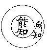

# 法相唯識學概論
（1932 年 12 月，在廈大文哲學會講）

## 目錄

- 一　法相唯識學之略釋
    - 甲　何謂法
    - 乙　何謂相
    - 丙　何謂法相
    - 丁　何謂法相唯識
- 二　法相唯識學之由起
    - 甲　出發於究真之要求者——萬有之本因及體質之推究
        - １迷信之神話與設想之玄談
        - ２實驗之科學與執法之小乘
        - ３法性之本空與唯識之轉依
    - 乙　出發於存善之要求者——吾人之自我及價值之存在
        - １天神之永生與自我之獨存
        - ２質散之斷滅與生空之解脫
        - ３本空之常如與唯識之轉依
- 三　法相唯識學之成立
    - 甲　其餘唯心論不成立之故
        - １主觀唯心論之不成立
        - ２客觀唯心論之不成立
        - ３意志唯心論之不成立
        - ４經驗唯心論之不成立
        - ５直覺唯心論之不成立
        - ６存疑唯心論之不成立
    - 乙　法相唯識學成立之故
        - １獨頭意識與同時六識——虛實問題
        - ２同時六識與第八識變——象質問題
        - ３自識所變與他識共變——自共問題
        - ４第八識見與第七識見——自他問題
        - ５八心王法與諸心所法——總別問題
        - ６能緣二分與所緣三分——心境問題
        - ７第八識種與前七識現——因果問題
        - ８第八識現與一切法種——存滅問題
        - ９一切法種與一切法現——同異問題
        - 10前六識業與八六識報——生死問題
        - 11諸法無性與諸法自性——空有問題
        - 12唯識法相與唯識法性——真幻問題
        - 13染唯識界與淨唯識界——凡聖問題
        - 14淨唯識行與淨唯識果——修證問題
            - （一）四尋思引四如實智與五重唯識觀
            - （二）大般涅槃與四智菩提
- 四　法相唯識學之利益
    - 甲　破除我法之謬執
    - 乙　斷盡生法之惑障
    - 丙　解脫變壞之業報
    - 丁　滿足心性之意願
    - 戊　成就永久之安樂
    - 己　證得無礙之清淨


## 一　法相唯識學之略釋

此次所講為法相唯識學概論，為佛學中重要之學問，其典籍甚多，此次祗提此學綱要作簡單之研究而已。惟未講斯學之先，將此法相唯識學之名一審定之。在佛學中有稱為法相學者，有稱為唯識學者，其內容本同，今合稱法相唯識學，有特別之意義在。以近人或謂法相學範圍寬大，通於大乘小乘之一分而言，唯識學只屬大乘之一分而已。余意法相唯識學應合稱，小乘不應歸入法相學，故以法相唯識學名之也；義詳於後。今將法相唯識學一名，以次剖解。

### 　　甲　何謂法

法字通常指法律、法則而言，義涉抽象。佛學所用法字，較尋常所謂法律、法則為具體，法字之義，其範圍最廣，固無論具體、抽象，言論上可以言論，思想上可以思想皆是也。事物之有者，可稱為法，即事物之無者，有此「無」之概念，亦可稱之為法；分析至極微為法，集聚成具體亦為法；有變化、有作用為法，無變化、無作用亦名為法；乃至龜毛、兔角之畢竟無，亦稱為無法也：其範圍有廣於吾人所謂萬物之「物」字者。法之範圍既如上述之廣，然其定義何在？依佛典言，法有二義：何者為二？一、軌範他解，二、持存自性。如言白色，保持白之自性而存在，是謂法之持存自性義。又能使他人了解其為白而不生他解，是謂法之軌範他解義。前為能保持其自己之體性，後謂使他人了解不生他想耳。白色如是，其他亦然；具此二義，即名為法。

### 　　乙　何謂相

相字、在中國字義，通指互相之相——互關義，宰相之相——輔助義，相看之相——看察義三者，今此皆非所取。此間所謂相，乃指相貌之相，義相之相，及體相之相三者，是法相唯識所取義。今先述相貌之相：

1.相貌之相平常指由眼識所見之事物而言。然相貌之能了別，不惟眼識已也，眼識之外猶有意識了知存焉。如心不在焉，視而不見，即意識不注，眼見同於不見之故也。由意識與眼識同起作用，所了之長短、廣狹之相貌乃生。色塵為眼及意所了，有青、黃、赤、白等之顯色，長、短、方、圓等之形色，及行、住、屈、伸等之表色。此三者，皆意識作用存也。

2.義相之相意識上所了解之相，曰：義相之相。意識所分別、所思維、所判斷，皆是義相之相。非前五識——眼、耳、鼻、舌、身識所能了到，乃意識所取之義相也。詳言之，則第六意識及第七意根所取之相也。第七末那識於隱微不知不覺之中取自我之相；其餘一切義相，乃意識所取之相。以事實言，凡過去之回憶，未來之推想，名詞之假設，文字之記載，無論思想到或知識到，皆可為義相之相。通於第六意識及第七末那識，惟六廣七略耳。

3.體相之相此間所取，乃關於一種直接覺到之體相；簡言之，從實體知覺所到者，較平常所言直覺更為單純，略當心理學上之感覺。最單純實體之感覺，曰：體相之相。此相適於前五識，不適第六意識，因第六意識可憑空搆撰，此相須有實體刺戟才能覺到，如聲來才有聲覺，味來才有味覺也。然意識與前五識合作所感覺，亦可稱體相之相，此中惟加上意識之義相耳。第八識所覺到亦是體相之相，以第八所覺到亦有實體故。

以上被心知所覺到之相，可分三類：一、性境，實有體性之境，即體相之相。二、帶質境，帶質乃原相加上心理主觀之意識作用所取之義相；如眼覺之白，此白之名詞，乃意識所取義相之白，非體相之白，乃別於非白之類而言，故意上所覺之義，雖從白之體想而言，然已非體相之相，故謂之帶質境。三、獨影境，過去之回憶，將來之推想，乃至名詞上所施設龜毛、兔角等，凡意識之假想，比擬之影像，皆稱為獨影境。由上三類，體相之相通於性境。體相之相，既通性境，則佛典中真如、體性、法性，亦包括在體相之內，以真如為根本無分別智所了知故，真如即無相之實體故。義相之相，通帶質獨影。相貌之相，則通性境及帶質二境。以上所言三相與三境之關係，略如此。

心知之所了知，即所取之相。相字、除以上三種義外，尚有自相、共相、差別相、因相、果相五種。如言鋼筆，鋼筆之自身為自相；一言鋼筆，則一切鋼筆多包括在內，此鋼筆乃無數鋼筆之一，此為共相；又此筆屬鋼製，凡鋼製之筆為同類，非鋼製為非同類，從多數之關係上，即顯其差別相；明此鋼筆如何造成功為因相；從因相推究其結果為果相。凡思想上所能分別皆有五相；西洋論理學之同一律，（LawofIdentity）矛盾律，（LawofContradiction）因果律，（LawofCauseandeffect），即通此相之義也。

### 　　丙　何謂法相

法義與相義已各明如上，今將法相二字合說。法相者，所知一切法之相貌、義相及體相之謂也。佛典有「能知」「所知」二義：所知即是被知，一切法皆為所知，與所知相對為能知，能知謂人類及其他動物心靈之能了知作用。然能知亦為所知，使能知非所知，亦不知其有此能知也。可知能知必為所知，惟所知不定即是能知；其範團之大小，如左圖：




能知為所知之一部份，所知之範圍廣而能知之範圍狹也。如一切法為所知，一切法中一部份心法為能知，同時亦可為所知；如意識上起一剎那之知識，即此了知一剎那之知識為能知，其餘皆為所知。所知的知識即能了知之知識，故不離能知，而能知又為所知之一，故能知亦包括在所知也。——如見分緣相分時，即為自證分之所緣，故能知同時即為所知。——知識能知亦所知法之一，故法相包括所知一切法之相貌、義相及體相也。梵言爾燄，譯所知義，或境義，即一切法為所知境也。

復次、法又分為五法藏，即名——能詮表種種事物，相——為名所詮表之事物，分別——識能分別，正智——離虛妄分別之能了知，真如——正智所知之法體。能以五法含攝一切，故以藏名，如四庫全書之庫。

復次、相又為遍計所執、依他起、圓成實之三性相：一、遍計所執，謂義相中之顛倒虛妄相。二、依他起，依因緣和合所起之相。三、圓成實，謂圓滿成就真實不變之體相。

### 　　丁　何謂法相唯識

法相謂所知一切法之相貌、義相及體相。一切法無窮無盡，不可勝說，然研究法相唯識學者，最重要、最基本者在百法，天親百法明門論及大乘五蘊論等，可尋究參考之。

百法中，第一種為心法Citta（mind），略有八種：一、眼識Consciousnessdependentuponsight.，二、耳識Consciousnessdependentuponsound.，三、鼻識Consciousnessdependentuponsmell.，四、舌識Consciousnessdependentupontaste.，五、身識Consciousnessdependentupontouch.，六、意識Consciousnessdependentuponmentation.，七、末那識KlistamanoVijnana（Soiledmindconsciousness.），八、阿賴耶識AlayaVijnana（RepositoryConsciousness.）。

第二種心所有法CaitasikaDharmas（MentalProperties），又有五類。一、遍行UniversalMentalProperties五者：一、作意Manaskara（attentionorpreliminarymentalexcitation.），二、觸Sparsa（resultantsensation.），三、受Vedana（feelingsarousedbysensation.），四、想Samjna（ideation.），五、思Cetana（Volition.）。

二、別境ParticularMentalProperties五者：一、欲Chanda（Willordesiretoact.），二、念Smrti（mindfulnessormemory.），三、勝解Adhimoksa（deciding.），四、三摩地Samadhi（concentration.），五、慧Mati（intelligenceorwisdom.）。

三、善心所MeritoriousMentalProperties十一者：一、信Sraddha（faith.），二、精進Virya（energy.），三、慚Hri（shame.），四、愧Apatrapya（humility.），五、無貪Alobha（absenceofcupidity.），六、無瞋Advesa（Absenceofhate.），七、無癡Amoha（absenceofignorance.），八、輕安Prarabdhi（serenity.），九、不放逸Apramada（carefulness.），十、不害Ahimsa（harmlessness.），十一、行捨Upeksa（indifference.）。

四、不善心所DemeritoriousMentalProperties中，初、根本煩惱TheFundamentalKlesas六者：一、貪Lobha（cupidity.），二、瞋Dvesa（hatred.），三、癡Moha（ignorance.），四、慢Mana（pride.），五、疑Vicikitsa（doubt.），六、惡見Asamyagdrsti（erroneousviews.）。次隨煩惱TheSubsidiaryKlesas.二十者：一、忿Krodha（Anger.），二、恨Upanaha（enmity.），三、覆Mraksa（hypocrisy.），四、惱Santapa（gloom,vexation.），五、慳Karpanya（selfishness.），六、嫉Irsya（envy.），七、誑Sathya（dishonesty.），八、諂Maya（deceit.），九、害Vihimsa（harmfulness.），十、憍Mada（arrogance.），十一、無慚Ahrikya（shamelessness.），十二、無愧Anapatrapya（impudence.），十三、惛沈Styana（sloth.），十四、掉舉Auddhatya（recklessness.），十五、不信Asraddha（lackoffaith.），十六、懈怠Kausidya（idlenessorremissness），十七、放逸Pramada（carelessness），十八、失念Musitasmrtita（forgetfulness.），十九、散亂Viksepa（confusion.），二十、不正知Asamprajanya（wrongjudgment.）。

五、不定心所TheIndeterminateMentalProperties四者：一、悔Kankrtya（Remorseorworry.），二、眠Middha（torpor.），三、尋Vitarka（initialapplication.），四、伺Vicara（sustainedapplication.）。

第三種色法Rupa（MatterLiterallyformorshape）略有十一種：一、眼根Sightorgan.，二、耳根Soundorgan.，三、鼻根Smellorgan.，四、舌根Dasteorgan.，五、身根Touchorgan.，六、色塵Sightobject.，七、聲塵Soundobject.，八、香塵Smellobject.，九、味塵Dasteobject.，十、觸塵Touchobject.，十一、法處所攝色Matterincludedunderdharmadhatu.。

第四種心不相應行法TheCittaViprayuktaWharmar：一、得Prapti（attainment.），二、命根Jwitendriya（vitality.），三、眾同分Sabhagata（uniformityofcharacteristics），四、異生性Evambhagiya（individuality.），五、無想報Asamjnika（unconsciousness.），六、無想定Asamjnisamapatti（mentaltrainingleadingtounconsciousness.），七、滅盡定Virodhasamapatti（thementaltrainingleadingtothecessationofallexistence.），八、名身Namakaya（word.），九、句身Padakaya（sentences.），十、文身Vyanjanakaya（letters.），十一、生Jati（birth.），十二、老Jara（decay.），十三、住Sthiti（continuance.），十四、無常Anityata（death.），十五、流轉Pravrtti（phenomena.），十六、定異Aprapti（non-attainment.），十七、相應Pratyanubandha（correlation.），十八、勢速Javanya（change.），十九、次第Anukrama（succession.），二十、方Desa（space.），二十一、時Kala（time.），二十二、數（number.），二十三、和合性Samagri（Inherence.），二十四、不合和性Bheda（noninherence.）。

第五種無為法Asamskrta（unconditionedFactors）者：一、虛空無為Akasa（omnipresentether.），二、擇滅無為PratisamkhyaNirodha（consciouscessation.），三、非擇滅無為ApratisamkhyaNirodha（unconsciouscessation.），四、不動無為Heala（immovabilityorindifference），五、想受滅無為SamjnaVedanaNirodha（astateoftranceinwhichbothideationandfeelingcease），六、真如無為Tathata（SuchnessortheTrueNature.）。

錄者按：此所采錄之英文譯名，其意義雖或不全，然大致不謬，而可作從西文以研佛學之一喤引。

眼、耳、鼻、舌、身、為五根。色、聲、香、味、觸、為五境。——觸通能所，此指所觸。——法處所攝色，為意識所取色，眼等所不能見；如化學上之電子、元子之類，天文家所推想宇宙之屬是也。法處所攝色有五：一、極略色，謂分析有質之實色至極微處故名。二、極逈色，謂推測虛空明闇等無質之色，至極遠處難為達見者故名。三、定所引色，謂禪定所變現之色、聲、香、味等境故名。四、受所引色，又名無表色，謂受戒時動作上言語上受感動而得成故名。五、遍計所執色，謂於意識假想上虛妄計度執為實有故名，如有創造世界之上帝，是其例也。

相應者，謂能與心合作一事。不相應者，即不能與心合作一事也；如康德Kant之十二範疇Categories及其他範疇皆屬之。不相應行法有二十四種，今約說八種以示概略：一、類與非類之性，每類分辨出其特性，如男性、女性、人性、獸性等。二、定與不定之命，此命即命根，謂決定或不決定之命運；如天命之命，墨子非命之命，及佛學之命根法等。三、過現未來之宙，一剎那、一月、一年及將來之時間，依色心剎那展轉而假立。四、四方上下之宇，四方上下空間之差別，依形質前後、左右而假立。五、一二三多之數，一十百千乃至阿僧祗之數差別。六、點線面積之量，謂積點成線、積線成面等之量。七、生、異、滅之相，謂諸位由發生而至變動滅盡之相。八、名、句、文之教等，依名句所成之文字，本依聲之抑揚、長短、曲直而假立；書本之名、句、文，又依點、畫、橫、豎等色相而假立。其作用在聲色變化上，故屬不相應行法。以上皆從略言之耳。

有為法有造作、有變化、有功用，無為法則無造作、無變化、無功用。何謂虛空無為？非眼所見之虛空，亦非人物等可通過之空。以眼所見之空，屬色法中之顯色，是有為色法故；以通過之空，是有為觸法故，變動不居故。此間無為法之虛空，體是常住，無隔別故。何謂真如？真如謂一切法真實如此之體性：普遍如此，常住如此，一切變化皆依此為體，是謂真如。以上五類一切法，總集為百法。一切法不出此百法，以百法統括一切法，惟使所知境有觀察之範圍耳。今將百法分類列表如下：


```
　　　　　　　　　　　　　　　　┌心王：眼識、耳識、鼻識、舌識、身識、意識、末那識
　　　　　　　　　　　　　┌心法┤　　　、阿賴耶識。
　　　　　　　　　　　　　│　　└心所：遍行五，別境五，善十一，煩惱六，隨煩惱二十
　　　　　　　　　　　　　│　　　　　　，不定四。
　　　　　　　　　　┌實用┤　　　　　　　　　┌細色根……腦筋神經系
　　　　　　　　　　│　　│　　　　　　┌五根┤
　　　　　　　　　　│　　│　　┌有對色┤　　└粗色根……眼耳鼻舌身┐
　　　　　　　　　　│　　│　　│　　　│　　　　　　　　　　　　　├表色
　　　　　　　　　　│　　└色法┤　　　└五塵………………色聲香味觸┘
　　　　　　　┌有為┤　　　　　│　　　┌極微色
　　　　　　　│　　│　　　　　│（法處│極逈色
　　　　　　　│　　│　　　　　│所攝色│
　　　　　　　│　　│　　　　　│）　　│
　　　　一切法┤　　│　　　　　└無對色┤定所引色
　　　　　　　│　　│　　　　　　　　　│受所引色……無表色
　　　　　　　│　　│　　　　　　　　　└遍計所執色
　　　　　　　│　　└假名……不相應行分位假法之命根等二十四
　　　　　　　└無為……虛空、擇滅、非擇滅、不動滅、想受滅、真如。
```


今以法相唯識連稱，則示一切法——五法、三相等——皆唯識所現。唯、不離義，識、即百法中之八識及五十一心所，其餘四十一法亦皆不能離識而存在；以一切法皆唯識所現故，一切法多分受識之影響而變化故。現有二義一、變現義，如色法等。二、顯現義，如真如等。法相示唯識之所現，而唯識所現即一切法相；唯識立法相之所宗，故法相必宗唯識。所現一切法甚廣，然所變所現一切法之所歸則在唯識，故示宗旨所在：曰法相唯識。法相唯識學，即說明唯識法相之學理理論，凡經論有闡明法相及唯識之義者，皆屬之。

## 二　法相唯識學之由起

### 　　甲　出發於究真之要求者——萬有之本因及體質之推究

凡學說之產生必有其因由，固勿論古今中外也。諸佛說法，原應眾生之機感為其緣起。自佛典言之，佛之智慧與常人不同，蓋諸佛經過長久修證之工夫，已得無上正遍覺知，與世人憑五官感驗或意識上所推斷之知識，逈異其趣。惟其如此，諸佛對於萬有真理實相，於一切時一切處如如證明也。易詞而言，佛非創造或主宰世界之人，乃徹底覺悟之人也。惟佛之與佛，更無言說之必要，以所證諸法性相，皆已如如相應故。其所以有種種之言說教化，莫非因眾生未得佛智之前，生出遍計之見，或全不覺悟，或覺悟不澈底，欲令同得正覺而說也。可知諸佛非應眾生心理上之要求，自無佛之所說法也。

對於現前宇宙之現象人類，皆有求知之欲望，謂對萬有現象之由何原因而生，其最後之本質若何？由本質又若何而生出萬有？逼吾人以適當之解答，於是宗教、哲學、科學應運而興。惟此宗教、哲學、科學雖同出推究宇宙萬有之由來及其本體，然其解答，則有正謬淺深之殊，茲分三段判之。

#### 　　　　１迷信之神話與設想之玄談

欲究宇宙萬有之真相，最早則有多神教或一神教之解釋。此種神教之解答，祗可信仰，不能用思想推論也。神教以萬物未有之前，由神自動所創造，宇宙萬有即以神為體質。基督教上帝創造萬物，印度婆羅門教以大梵天為宇宙萬有之因體，乃至中國神話中所謂盤古開闢天地之說皆屬之。古代人智淺薄，以神為本體而生萬有，自謂滿足其宇宙萬有說明之要求已。惟自佛法觀之，一切法因緣和合而生，皆無主宰，如以上帝為創造萬物，則彼上帝復為誰造？如云有造，造則無窮，亦即失主宰義。如云上帝無造而自生，則萬物又何須待造耶？於事於理，皆不能通，稍有論理思想，莫不知其為迷信之神話矣。

古代於迷信神話之宗教外，較宗教為進步之解釋，尚有設想之玄談，即哲學是也。在中國有太極、兩儀、四象之說，謂陰陽不分之太極，動後即生兩儀，繼兩儀而生四象，繼四象而生八卦萬物等。老氏以為萬物生於有，有生於無；一生二，二生三，三生萬物之說，計虛無為宇宙萬有之因體。在印度則有數論派（Samkhyasystem），勝論派（Vaiceshika）等之玄談。數論，梵云僧佉，此翻為數，即以智慧數數推度諸法之根本立名，從數起論，名為數論。此派計宇宙之根本有二物，純然為二元論（dualism）：一、為精神之「神我」（Purusa），二、為未現萬有差別之無差別之本體的「自性」（Prakriti）。彼解釋一切謂：由神我忽生要求，與自性相感而生宇宙萬有；欲得解脫，須究明二十五諦之真相，依禪定而止息神我之要求，歸還自性不動之狀態。其最後之結果，惟神我獨存。勝論說明宇宙萬有有根本六句義法，即所謂實句義（drauyaPadartha），德句義（gunapadartha），業句義（Karmapadartha），有性句義（Samanyapadartha），同異句義（Visesapadartha），及和合句義（Samavayapadartha）。如云茶杯，此杯之自身即實句義，實句義有地（prithwi），水（ap），火（tojas），風（vagn），空（akaca），時（kala），方（dic），我（atman），意（manas）。杯之堅白，形態，容量，運動等，即德句義。德句義，凡二十四種：一、色（rupa），二、味（rasa），三、香（gandha），四、觸（sparsa），五、數（sankhya），六、量（parimana），七、別體（prthaktva），八、合（Sainyoga），九、離（vibhaga），十、彼體（paratva），十一、此體（apsaratva），十二、重體（gurutva），十三、液體（dravatva），十四、潤（sneha），十五、聲（cabda），十六、覺（buddhi），十七、樂（sukha），十八、苦（dukkha），十九、欲（iccha），二十、瞋（dvesa），二十一、勤勇（prayathna），二十二、法（dharma），二十三、非法（adharma），二十四、行（samskara）。杯之作用，即業句義。業凡有五種：一、取（utksepanam），二、捨（avaksepanam），三、屈（akuncanam），四、伸（parisaranam）五、行（gananam）。茶杯是有非無，但別有一大有能有之而有。有體是實德業三之所共。同是茶杯者為同句義，非茶杯者為異句義。其中又有同中異、異中同。同異體多，實德業三，各有總別之同異。此茶杯為實德業之和合而成，惟別有一能和合者使其和合之，故彼此有不可分離之一種關係（Co-inherence），是名和合義。若實句義九種全備而和合，即成人等有情，以「我」「意」為有情精神之特徵故；若僅有前七——除我意，則成無情物體。在西洋希臘古哲，有謂宇宙之因體，由水而成，或由火而成，或由空氣而成，或由地水火風等而成，略同印度順世外道四大極微為因體也。以上中西哲學所推究宇宙之因體，雖較宗教中之計有能造之上帝為進一步，惟其依當前之現象，假想種種意像，以追求宇宙之真實，充其所極，仍為設想之種種玄談而已！於求知真實也何與？

#### 　　　　２實驗之科學與執法之小乘

從事由五官之驗證，代設想玄談之哲學而起者，其實驗之科學歟？從法國孔德（AngusteComte，1798-1857）主張建設哲學於科學之上，謂總合各科學實驗之結果，作為哲學推論之基礎。彼分社會進化有三階段：一、宗教階段，二、玄學階段，三、實證階段。今此一階段以證驗支配一切，遇事皆探本窮源，求最後之解決。以為一切知識，皆須實驗，必須為眼、耳、鼻、舌等五官所能接觸者方為真理。換言之，此實證階段，不事迷信，不尚玄談，所有神權思想，皆破除殆盡，於科學明證之外，其餘不能為究竟也。今之科學，其方法多據孔氏之言，發揮而光大之耳。所謂科學，即從實際證驗狀況之如何而敘述之，然後依敘述再加推論以說明其實在。五官驗證所不足者，以器械——顯微鏡、望遠鏡等——補其未達之處，此從事徵驗，固科學家之特色也。但其徵驗，僅依於五官之擴大，雖比玄學較為確實，惟五官所驗證，僅能及法之片面之一部一部，後雖可由意識歸納以成為系統之理論，亦從零碎組合而成。對於全部宇宙整個人生之真相，仍不能直接覺知。蓋科學原為部分類別之學，或物理、或心理、或生理一部分之現象，故惟得零片之粗相也。以佛學衡之，科學之實驗與小乘之執法頗為相近。小乘對人觀察，乃物理「色蘊」，生理心理「受蘊、想蘊」等現象之組合，現象之外，並無整個之自我存焉。而宇宙萬有，亦由地質、水質、動力、熱力，並加以有情心理活動之業力組合而成之也。小乘說五蘊：一、色蘊，即百法中之色法。二、受蘊，五官與色、聲、香、味、觸相接觸，或受苦，或受樂，或受不苦不樂，略當心理學之感覺，惟此受同時亦是感情，以根境相觸為知識之感覺，亦為感情。三、想蘊，從感受境上分出彼此，思想名詞由是而立。四、行蘊，行為之行，或道德或不道德所發動皆屬之，見之語言意志活動，行蘊關係最切。以上四蘊，皆被知識。五、識蘊，即百法中之心法，惟小乘未見到七、八二識耳。小乘五蘊之色蘊包括色法，受蘊、想蘊惟指五遍行中之受、想，行蘊包括其餘心所有法及心不相應行法，識蘊即包括心法等。小乘與大乘雖有出入之處，大部分仍相差不遠耳。小乘以為宇宙萬有，人生世界，祗有法——五蘊等——之存在，猶之科學以為祗有心理、生理、物理之現象也。神我、上帝皆為彼等所否認，小乘論條理非常精細，亦如科學之嚴密，惟科學乃憑五官及器械以證驗，小乘乃由戒定所生之智慧，以明宇宙之法；前為恃外之觀察，後為從內之觀察，此其不同耳。故科學小乘所說略同，而所用方法及其目標則異，二者皆未臻圓滿也。

#### 　　　　３法性之本空與唯識之轉依

法性從小乘法作進一步之解釋，明萬法本性為空，大般若經、大智度論、中論皆屬之。小乘以觀法有而顯我空，謂五蘊等諸法恆有，於粗相之物體已見其空，於細微之法仍有未明，故於世界上之草木，明由地、水、火、風無數關係條件而成，無自性之可言，而於組成之關係條件猶執以為實。然進一步觀察，即一切法中之每一法，亦由眾緣之條件而成，如離眾緣，則無一切法；此一切法，既皆眾緣組合，故自性本空。此理略近最新科學相對論（Theoryofrelativity），謂一法之現見，皆從相對之關係上而顯，凡此時、此處四圍之環境及立足之觀點，皆與其事物之廣、長、厚等密密相關，設其周圍之環境或時處觀點一變，其事物之本身亦即全異也。如地球繞日而行，以相對之理或增上緣之理而言，不惟日球與地球有密切之關係，實由其他行星、流星等相切相磨而成，故知地球繞日一事，即由逈色之空乃至恆星等，亦無不與此有關者，世人祗取其切近而遺其疏遠耳。從法性言，小乘固執之法，亦因緣互集之假相，與我之空，了無二致。僅有因緣之聚集，而無因緣所共合之實體；僅有緣成之因緣，而無因緣之自性：此法性本空之義也。然僅知法性本空，不知法相之唯識義，則眾緣所集現之攝持力，何歸何與？從此透過法性本空，即彰法相唯織。自性本空，非五蘊等滅卻說空，乃從眾多因緣法生而無自性以說空。因緣所成法，其自性本空，然非無此眾緣集合關係之法相。法相之中，心法及心所有法即所謂識，不但可以被知作為知識對象，並且本身即是能知識。一切所知識之法，即攝持能知識之中，凡此皆心理知識中之現象，非離識外另有色等諸法。所覺知者，則為前六托第八相分為本質塵所變之相分，仍在識內而非外；見託相起，相挾見生，法相皆多分受心理知識影響而變化故。在知識觀點強度如何，所知識即現如何，知識強度不同，所彰之現象全異，所有知識之法，皆受識之影響而變動。法性明一切法從多種因緣所現之相非固定，其自性本空；法相則彰萬法依心及心所法如幻如化而建立，不於識外別有他物，故曰法相唯識。法性本空，可破小乘之法執；而法相唯識，又可顯法性本空中多種因緣所現之法相非離識而有，皆同為識變故。以法性詮法相，則法相如幻如化，皆成妙用；以法相顯法性，則法性本空，其相唯識。性相如如，故推究萬有之本因及其體質，至此方理善安立。

### 　　乙　出發於存善之要求者——吾人之自我及價值之存在

人之生也，莫不覺有自我，而一切欲望皆從之以生也。然此自我，為隨死以俱盡，其性乃暫時歟？抑人身雖死，而自我有不死者存，其性乃無窮歟？茍自我隨死以俱盡者，則芸芸眾生，寄生霄壤之間，此數十年與草木何異？為善成仁，作惡行詐，其價值何在歟？設非然者，人生死而有不死之自我者存，則彼不死者又何往歟？隨此界以升沈歟？入他界而受生歟？如是等者，乃有宗教、哲學、倫理出發於存善動機之由來，古之賢哲篤行其志，或立功，或立德，或立言，覺本身為萬有之中心，期精神之充實以永存，此種要求，豈無所恃而然耶？俗語：「人死心不死」，即認有自我之價值永存藉以自慰者，要求有最善永存不滅之標準，於是宗教倫理之說起；然其開始，實由神道之說。茲亦分三節言之：

#### 　　　　１天神之永生與自我之獨存

天神之永生與前迷信之神話相一致，此神為無始無終無所不在，而人為神所創造所管領，能將低等性質破除，培植為善之道德，即能與神同其永生。此說一興，從者如響，蓋以為必如是然後自我之價值乃能常存，人心因以大慰。至於自我之獨存，古印度數論，即創此說，彼為生死所以循環不息，乃出自我之要求，必假定慧之力，將自我要求息滅，漸能離自性而獨存矣。其餘耆那教等，亦莫不以自我解脫而獨存，為達最高善之目的。以法相之理觀之，其託神庇護者，雖可慰暫時之煩惱，以神為唯一之依恃；然其認神權為無上，捨自作自受之理於不顧，已犯世間相違等過。而自我之獨存，亦徒為玄想耳。

#### 　　　　２質散之斷滅與生空之解脫

科學謂人生作何事業，留於團體，或可不朽。如將每人個體觀察，皆依物理為基礎，而此物理之本質，不過化學之十幾種原素組合而已。心理依物理為基本，最後則在物質，至於心靈等則死後隨質散而斷滅。所謂自我、靈魂等等，皆撥為無，自更無所謂永生、獨存也。印度之極微論，今世之唯物論，均持是說。但小乘證生空之解脫則在擴充為善之行，非相抵相抗，乃由相依相益，由戒生定，由定發慧，將世人迷有自我的實體破除，明內無我，外無實物，向以物我為實之推求，於焉而息，一切心理活動亦隨之而息。得此生空之解脫，表面上雖與質散之斷滅似同，然科學不從業力解散，雖計斷滅而終非真滅；小乘從生機上斷滅，乃真解脫，此其不同也。科學對於善的價值之永存仍未達到，且較小乘猶遜一籌也。

#### 　　　　３本空之常如與唯識之轉依

科學主質散之斷滅落於斷滅之見，理有未善，固勿論矣。即小乘生空之解脫，執有法之實在，於法性法相之義，亦未契合。法性明萬法本空，了無隔礙，常是如此，普遍如此，故曰諸法空相，不生不滅，不增不減。亦無生死苦惱可脫，以萬法本空，本無生滅增減故，故曰：本空之常如。諸法之本性雖空，然諸法之現象，仍隨因緣之合散而變現；一切法皆依識，故可從識而轉之也。凡不圓滿之有漏法既依識所變，即此不善不圓滿所依之識，改轉之使為覺悟而圓滿，佛典謂為轉識成智，則達善之價值永存之極則矣。

## 三　法相唯識學之成立

由前出發於究真及存善之二重要求，可知法相唯識成立有二動機，在此動機中，即法相唯識學產生之原因也。法相唯識學之能否成立，當更考察其理由是否充足，有無事實之證明，與可得相當之效果否。然與唯識類似之說，不能不先一辨之，即各種之唯心論是也。各種唯心論，雖各言之成理，持之有故，惟有許多問題不能解決，而卒不能有所成就。故茲先將其餘唯心論不成立之故一闡明之，然後始能彰法相唯識學之成立也。中國向來對於唯心論，少有系統理論，以先哲曾言之太極之說等，概非顯著之唯心論；故今所言唯心論皆屬西洋哲學。西洋唯心論自古有之，至近代乃極其變。古代之唯心論（Spiritualism），殆同觀念論（Idealism），觀念不過是一種相而已；與其稱為唯心論，勿寧稱為唯理論（Apriorism）也。故今此所言，又專在近代的西洋唯心論。近代唯心論，其初、蓋對於多元論、二元論、及唯物論之不滿足而起。以上各論，皆可稱為素樸實在論（Naiverealism）；素樸的實在論，以為耳、目之見聞，即能得事物之實在。故吾人覺知之所得，以符合客觀之事物為真確。輕重、厚薄、大小、方圓，莫非事物之所固具，心之認識或不認識皆爾也；知識所含之性質，不過依事物去認識而已。素樸實在論係根據一般常識上之見解而演成者，如見此桌存在，即依此桌之實在加之認識，如以萬有之本，原為眾多不同之實體，則成多元論；謂萬有之本原乃二種或一種之物，則成二元論或一元論；此稱一元論即唯物論，皆素樸實在論也。近代之唯心論，即起於對素樸實在論之反動，而有主觀、客觀唯心論等之產生，今以次臚列，兼論其得失焉。

### 　　甲　其餘唯心論不成立之故

#### 　　　　１主觀唯心論之不成立

近代如培根（Bacon）、洛克（Locke）以至休謨（Hume）的經驗派，以謂凡可經驗者，即感覺現象；除去所見到之色、所聞到之聲、乃至身上所覺到之觸等現象之五官感覺經驗外，別無可經驗到者。向來所謂關係法則、貫通理性等，不過實際感覺到的經驗上之條理而已。因此經驗派的思想而進一步，勃克萊乃發生主觀的唯心論。勃克萊（Berkleg）否認物質本質之存在，以為一切物性，莫非吾心之所知，宇宙萬有物體云者，不過為吾心所知覺之一切耳，並無知覺外另有所謂實物之存在者；由知覺上發現種種現象，即自心知覺現象。勃克萊之意、以為一切事物之存在，均在主觀意識之內，主觀意識之外無事物存在，凡存在者即被知覺者也。此主觀唯心論，在其一貫的理論上，似亦能成立，然一推究，則疑問重重。勃氏以一切外物之存在，歸之自心主觀所現之影子，則自心如鏡子，外物如鏡子之影子，如此祗有自心，則他人之人格亦被其否認。推其極、不過自心之存在而已，然則國家、社會與法律、倫理皆等虛設，失其效用；如是顛倒，世共不許！又復應思：既如汝言，所見之桌，除色、香等外並無實質之存在，然在夜間無人知覺，至第二日仍有此桌之存在。試問此桌在夜間是否繼續存在？若謂所見之桌乃由汝心而有，汝心不知覺時則桌消滅，云何得有重見昨日之桌之存在？至是勃氏落於遁辭，謂物之存在，如不存在於自心或他心，亦必存在於上帝之心。然上帝非經驗之可得，先不成立，而勃氏之說，遂不能自圓矣！

#### 　　　　２客觀唯心論之不成立

主觀唯心論從經驗派產生，迨其說不能自圓，於是理性派起為解除上述之困難，一轉而變為客觀唯心論。此派謂宇宙萬有，有共同之心或共同意識之客觀存在，故萬有乃一客觀的心之表現。宇宙所有動物、植物、礦物，程度雖有不同，然皆為宇宙共同之心，如千江萬湖之皆為水。人類或其某民族，為此共同心發達之最高者，動物、植物、礦物等乃其低下者，所以萬有的存在皆此客觀的心。惟此客觀的心，即為自己他人及萬有以至全宇宙；至各人乃共同心之一分，非以個人自心為立場，乃以共同心為立場者。黑格耳（Hegel1770-1831）即可為此派之代表，以共同心包括一切，計劃之而支配之。惟此共同心無可證明，與一神教所謂一神無可證明之性質，相去幾何？一神不能成立，則共同心亦不能成立。又、所謂客觀存在之心，不過稱彼為心，其與素樸實在論不可證明之物，亦僅名之不同，同為不能證知，但隨名言而假立耳。若唯物論不成立，則客觀唯心論亦不能成立。今縱許汝有共同心之存在，萬有乃共同心所生；然世間凡被生皆同於能生，如人生人，犬生犬，未見有石能生人畜；既為唯一之共同心，以何而得生出各別的萬有，被生與能生了不相似？復次、既然萬有皆由共同心所現，則應共同為一，云何萬有有一定之條理及規則，必眾緣具備，然後事物才能成功？反是、眾緣或缺，則事物無從顯現？此皆有為客觀唯心論所不能說明者，故客觀唯心論亦難成立。

#### 　　　　３意志唯心論之不成立

康德（Kant1724-1804）調和理性派與經驗派，一面承認經驗派凡存在的不能越出五官經驗之外；一面又從為感官知覺所不能知覺之經驗外設立一「物如」Dingan-Sich或稱自存物；又主張有先天理性能向雜亂無章的經驗中立出法則。而所謂自存物，既在一切知識之外而不可知，故康氏非唯心論者，亦非唯物論者。然因康氏所立自存物為不可知，從康氏之後，有解釋自存物為唯物者，亦有解釋為唯心者。迨叔本華（Schopenhaucr，1789-1860）謂自存即為吾人求生存之意志，此意志乃不知其然而然，因有要求生存之意志，故有繼續不斷之努力在各處表現，一切生機之活動，植物永久之成長，動物一切的衝動，均足表現世界之根本，端在意志；意志存，則萬有雖旋滅而旋生，滅生不已。惟叔本華頗受印度數論及小乘思想影響，以為人生世界，既出彼意志之盲目的要求，故人生世界皆唯痛苦，根本解脫之途，在否認求生意志，使之消滅於藝術之音樂等中，亦可使之暫忘也。叔本華認人生世界皆意志所造成，以求生之意志消滅，由求生意志所生之萬有亦可消滅，此與印度之數論或小乘之思想頗相近。余前在德國曾詢杜里舒：所謂生機一耶抑多耶？據杜氏言：最初為一，後成為多，最後仍歸為一。今叔本華之意志亦可同上問之：所謂之盲目意志，各有其一耶？抑萬有共為一耶？共一則自己生存之意志消滅，與萬有共同意志何與，何能由各自而消滅？若云各一，何能生起共有之世界？即消滅祗可言各有之意志消滅，乃各人自己之解脫。現在共同之地球太陽，是否各有意志耶？有則各人意志消滅亦無用矣！如云：世界等乃各人意志所生，則世界與各人意志又如何貫通耶？又復應問：向之不知其然而然之求生意志，其現起為有相依之關係耶？抑無相依之關係耶？如無相依之關係，則不能以其他方法使之消滅；如有相依之關係為之緣起，則意志之前，仍有其他原因存在，意志應非根本。故意志唯心論亦不成立。

#### 　　　　４經驗唯心論之不成立

主觀唯心論從經驗派而起，客觀唯心論從理性派而起，意志唯心論間接從康德調和理性派及經驗派而出。至經驗唯心論則從擴充經驗範圍而起，從前經驗派所謂經驗，唯指五官直接知覺到而言，此則為擴充經驗而將理性亦併歸經驗中的實驗主義。故詹姆士（WilliamJames，1842-1910）等所謂經驗，乃通於一切而言，非各人經驗已也，非五官覺到已也，無論意識或知覺或思想或想像皆屬之，故空間則成為經驗之大網，時間則成為經驗之常流，全部心理之內容，亦即經驗之內容也。同在經驗之中可分二種：一、素樸之經驗、二、經過彫刻之經驗。素樸經驗之原料，可經意識彫刻工夫，由此彫刻即成種種之相，由意識立種種之名，成為實際有用的方為真理。世間所有之事業及思想，既皆依素樸經驗復經意識彫刻而成，故真理亦無決定性可得。簡言之、於此時、此地能適應吾人實際生活之要求，方成真理也。此派非以唯心論自居，然將經驗範圍推廣，所謂經驗既即為心理內容，故是唯心。惟其構成經驗，仍依生理有機體，經驗流既藉有機體而存，有機體乃是基於物理之生理，則有機體之身一壞，而經驗之流亦斷矣。此有機體又從許多物素組成，從構成上追究，仍以物理為基本也。行為派心理學，亦可謂即從此派影響而出，適見其經驗之流乃藉物而有，非唯心而反成唯物，其推論自難極成矣。

#### 　　　　５直覺唯心論之不成立

帕格森（HenriLouisBergson1859-X）並非以所謂直覺（Intuitionism）為萬有之本源，彼所謂萬有之根原乃「生命之流」，或「生之衝動」；惟此生命之流非理智可以把捉，乃靠直覺覺得。蓋生命之流乃產生萬有之渾然真體，理智祗能見出彼所分別之物體，乃實際應用之一種工具；若此內在生命之流，則須依直覺乃能了知也。平常直接知覺到無彼此、自他、內外之分別，是謂直覺；從直覺悟到的萬有生命之流，綜合叔本華盲目之意志與詹姆士之經驗流，而以直覺握其樞紐者，此柏格森之直覺中的生命之流。此生命之流，即隱於吾人意識之後，以激勵鼓舞吾人時時向創造之途以趨於進化。柏格森本此以說明創造的進化，彼說進化為由原始而現在而未來而永續無窮之巨流。彼謂「生之衝動」，宛如噴發之爆彈，分為二流：一、緊張而上湧之火燄，為精神現象，如動物等；二、弛緩而下墮之火花，則為物質現象，如礦物等。前者為動物，如爆彈之燄火極緊張之部；後者為礦物，如火花之點點斑斑也。此雖可為一極有力之唯心論，惟在理論上仍有許多困難之問題在：一、彼既認生之衝動即創造原動力，何以萬有乃有秩序條貫等之存在？設認萬有無條貫秩序，則亦無進化可言。如緊張之則為精神，弛緩之則成物質，然在常識上或科學上，均覺得生命現象必有其非生命的為所依之處，此所依之處，或地球或其他之物質現象，乃先於精神現象而存在；然則與柏氏先有精神之生命現象又相違矣！故其說亦難極成。

#### 　　　　６存疑唯心論之不成立

康德（Kant）之不可知的自存物，可為存疑之唯物論，亦可為存疑的唯心論。至於最近之安斯坦（Finstein，Albert1879-X）的相對論，客觀宇宙的存否，存疑而不速斷，而一切運動之現象，與其距離之時間，皆由觀點之不同而不同，成為相對之現象，已有唯心論之傾向。從唯心論上說，亦可成為存疑之唯心論也。至羅素（BertrandRussell1872-X）的新實在論（NewRealism），雖極力擴充客觀實在之範圍，將經驗派之感觀的事與理性派之超驗的理，皆與以不倚心而存在，不由心而變動之客觀存在的實在意義，建立中立一元論，謂心及物乃中立一元所構成。然彼非心非物之中立一元，即為感覺之經驗；惟一探其所謂中立一元的一元之謂何？彼尚存疑而未速斷。余前到英國曾以此問題詢之，彼謂猶在研究而未能判斷。彼雖存疑，而亦得謂之唯心論也。但此種存疑唯心論，消極方面雖足以避免他人之批評，積極方面亦缺少成立性也。

### 　　乙　法相唯識學成立之故

對於法相唯識學之名義及產生之動機，前已說過。各種唯心論，因事實上、理論上皆未完善，而卒不能有所成就！今再以能極成立之法相唯識學，次第設立各種問題論之。

#### 　　　　１獨頭意識與同時六識——虛實問題

主觀唯心論謂唯主觀的自心是實在，其他事物不過心中之影子而已，一切現象乃皆成為空虛而無實。另一方面主張實在者，乃有新實在論，以為一切見到、聞到、觸到，乃至意識上觀察、思辨到的一切對象，皆為真實。主觀唯心論以一切外物之存在，悉歸主觀之心，自心以外皆是空虛；如此祗有自心是實，則一切人格及社會均被否認，與事實不符，而理論上亦通不過，已如上辯。經過主觀唯心論之不能極成，可一轉而到新實在論；主觀唯心論謂虛，新實在論謂實；前為虛之代表，後為實之代表，乃構成虛實問題。此在法相唯識學將如何解決之乎？依斯學百法中之八識，依眼發生出來之知識謂眼識，依耳發生出來之知識謂耳識，乃至依身發生出來之知識謂身識。至第六意識與普通心理學所謂意識略同，惟從意識全部之領域及分類而言，則法相唯識學之意識，較普通心理學為廣，若專從一部分現象而推究其細末，則普通心理學之所言，亦有獨到之處也。

此種意識，大致可分兩種、一、獨頭意識，二、同時意識。獨頭意識，乃於離開眼、耳、鼻、舌、身五官感覺之後——眼不見色乃至身不領觸——單獨構成，略似心理學所云之想像。蓋意識離開前五識仍可自起分別，如意識緣過去、未來之境，不過為意識所憶想耳。但獨頭意識範圍頗寬，又分三位、一、夢位意識，夢時前五識不起現行，唯是第六意識之分別現境也。二、散位意識，清醒時心理之分散，而非集中統一者，為散位意識。三、定位意識，此非常人所有，須經修定工夫乃能發現，不惟佛教得定之人有之，即道教及印度外道經過修定工夫，使心力集中統一，精神上成為和平安寧，而增加許多超越之力量，亦屬定位意識；惟真正得成定心，眼之知識乃至身之知識，均不起作用也。獨頭意識包括此三位，而知識之性質則截然不同。夢位意識顛倒錯誤，表面上似真，其實非真，表面上似能推理，其實皆非理、非量之識也。散位意識範圍甚廣，通常心理作用多屬之，佔通常心理作用百分之九十九；此種知識又分為二：一、貫通前所經驗成為推理不誤之比量知識，二、有大部份則為錯誤知識。此中又有二種：一、如言見桌，不過見到一小部份之顏色之少分，至於桌子多分之色及聲、觸、重量等，皆非眼所見，通常即以此直接眼見到之少分以為眼能見桌，其實非真見，乃成似現量之非量。二、如唯物論或素樸實在論之種種推論，又成為相似比量之推理的非量知識。定位意識少起主觀作用，惟是明顯之心境，故多屬現量之直接知覺也。更就境辨之：夢位意識多屬獨影境，單獨之影子為獨影，係純粹主觀之心而起。夢位意識，前次為心理學會講「夢」之題目，曾言夢亦尚有帶有實質之境，如因生理關係影響而成夢，乃至其他心之關係使成為夢等，皆帶有其他精神力之關係者，故夢位意識亦有帶質之境；惟大部份為獨影境，少部份為帶質境耳。散位意識大部份仍為獨影境，如想像因名詞之施設，馬雖無角，亦可想像於馬角也；即想過去之事，亦為獨影。獨影境有二種：一、無質獨影，此時、此處、此界無有，即他時、他處、他界亦無有，祗意識上假立名言之分別耳，如因名而妄立龜毛、兔角等。二、有質獨影，雖此時、此處無有此法，然為他時、他處之宇宙間實有其質，特今此但為意識所變現之獨影，為有質獨影。帶質境亦有二：一、如言見桌祗可稱帶質境，桌雖不能見到，然意識將直接知覺時於桌子觀念上，乃或為桌之顏色，雖所依之實質不能全部相符，惟帶真實質一部份，經過意識上之構成而成，謂之似帶質境。二、其以心緣心者，則為真帶質境。依唯識言，通常所謂見到、聞到、嗅到、觸到之天地人物，皆是散位獨頭意識之帶質境而已，均與真正之感到不符，惟隱帶其內容而已。依此帶質境所推理則成比量，故此散意識中被知識所知識的，有獨影境及帶質境。定位意識，非一般人之心境，不易經驗，可從略。大抵深定位之心境為性境外，其餘通常定位，仍為獨影境也。

由上所言獨頭意識之心境，可見主觀唯心論祗能講到獨頭意識之一部份，而定位獨頭意識則尚非彼所能望見，以此一部份為立足點，而解釋宇宙萬有，自難成立；較唯識學所言識有八種，前有眼、耳、鼻、舌、身五識，後有末那、阿賴耶識，領域之大小，自不可同時而語矣！同時意識乃依眼識、耳識乃至身識等之五官感覺，與第六意識起同時作用；此間非必全部前五識與意識同起作用，乃前五識中之一或二或三或四或五與意識同起作用，稱之謂同時意識。簡言之：五官之中有一或多與第六意識同起作用也。柏格森（HenriLouisBergson1858-X）之直覺（Intuitionism），亦此同時第六意識之感覺。同時六識知境像之現量直接知覺，并無推理作用，同時意識現量所知的是實在之性境，與獨頭意識多分為主觀作用所起不同。同時意識乃真實之性境，惟其為真實性境刺戟所生起之意識，故謂同時六識所緣緣乃為實在有體性之境。從內容言，此性境與新實在論（NewRealism）所謂的客觀實在略同，因所言直接知覺到，乃意識上關於數量或分位——心不相應行法時空數量——等，前五所無，而為同時意識所感到的，均可等於新實在論之所謂實在；蓋即同時六識現量之心境耳。然唯識固不能以獨頭意識局於主觀唯心論，同時亦不能認同時六識之現量而局於新實在論。同時六識之所緣境，非單依主觀可以轉變，并須托六識外存在之境作所緣緣之刺戟；準此而言，豈非與新實在論或唯物論無異乎？但須知此間所言同時六識，略同實驗主義之純粹經驗，經驗本身即感覺，感覺即心識，謂須境之剌戟，不過就純粹經驗之說明上而言，此種所經驗的仍在純粹經驗之中。感覺可作兩面解釋：一面為能知識之知識，一面為所知識之境相；能為見分，所為相分。因此事實上感覺之有感於是而有所知識，均不離純粹感覺心識之外，故仍是唯識。此種不離純粹經驗六識覺到之現象之外，有所謂「感覺今有」或「感覺所與」的本質，如康德（Kant）之物如或自存物，即同時六識之境像底下另有其本質，祗以同時六識心境之境像完全與本質相同，故與本質之境同為性境。蓋同時六識所知之境，絕無主觀作用夾雜其間，實在如何即感到如何也。然以同時六識所依託之本質謂神則成一神，謂物則成唯物，謂理則成唯理，故須更進推究同時六識與第八識變。

#### 　　　　２同時六識與第八識變——象質問題

從同時六識所知境象的本質之推究，則不能不言第八阿賴耶識。阿賴耶是梵語，此譯為藏，意謂將所有經驗皆能收藏之知識，乃至行為上之行為亦能為所收藏，故此識亦可言「處」，即一切所現行之潛勢力保藏之處也。此識具有三義：一、能藏，二、所藏，三、我愛執藏。一、對一切種子名能藏，因一切種皆收藏於阿賴耶識之中，種子為所藏，阿賴耶識即能藏之處也，故曰能藏。二、對一切雜染法名所藏，因根身器界一切雜染現行之後，阿賴耶識反為一切雜染法覆藏，為一切雜染所藏也，故曰所藏。三、對第七識名我愛執藏，因第七識恆審思量我愛之執，此識被執為我，即阿賴耶識現行之見分，成為第七識所愛執之處所，故曰我愛執藏。佛典分萬有為有情無情二種：動物為有情，礦植為無情。宇宙一切有情，各有一阿賴耶識，此識能將各個所有經驗保藏之無失，遇有機緣即可復現。通常所有記憶想像之功能，即有保藏之第八識使然也。普通心理學以為腦府能保藏，凡心理之保藏，皆依腦府之生理機關而生，細胞活動復現即起想像之作用，此種解釋，不能極成。試問所見之屋宇海水等至大至遠，如何能為僅方寸量之腦府所能保藏？如將所見之屋宇海水與方寸之腦府較，其非腦府所能範圍，抑奚待言？設云：腦府之保藏事物如照相機之攝影，然照相機所攝映之影子，不能如事物之大小量。與眼識如量而見不同故。又、前後之影，應錯亂無序同糅於腦府之中故。依佛典言，識乃依境之大小而遍法界，故各人之阿賴耶識皆交遍宇宙，凡事實上或經驗上皆賴保藏，使之復現也；此識雖交遍法界，惟仍各為各有，如某甲之讀書，久誦則保藏之於第八阿賴耶識之中愈深，然不能易之某乙。柏格森之生命之流，或潛意識之最深部份，均可見到阿賴耶識之一少分。有情生命之本身，即第八識，此有情生命本身，即非物質之心識。此種心識有二種作用：一、能知，二、能變。有情生命本身之第八識為能變，得到一段生命，則有生命本身，即是根身，其所依止之處即器界是也；同時六識境像所依之本質，即第八識所變一部分之器世間，即所謂內變根身、外變器界之器界也。所變本身之表面形軀非真五根，乃根所依處，真正五根略同神經系，非同時六識所知。此器世間之本質，即感覺所與，可知康氏之物如，亦即第八識所變之器世間也。因第八識所變之根依處及器界，雖在同時六識之外，但仍在第八識之中，不離識而存在；可知器界為第八識之所變，實有體性可作為同時六識所緣之本質，然不離第八識而有，故仍唯識也。

#### 　　　　３自識所變與他識共變——自共問題

自識所變與他識共變，為自共問題。前段所講本質乃第八識變之一部，即器世界及根依處。由第八識變為前六所緣境之本質，各個有情各有第八阿賴耶識，唯此本質為各賴耶各變耶？抑各賴耶共變耶？若謂各個各變，則各有情一時期生命終了之期，不惟身體壞滅，即宇宙亦應壞滅！設云：宇宙器界乃各有情共變，則除各人等八識外，仍有共同所變之器界者在，於是乃有自共問題。解決此問題，須知根身器界有共變不共變之義，絕對不共變，即淨色諸根是也。淨色諸根非有情形體，略似生活的神經系，此種五根乃各個有情第八識所各變，生時有神經作用，死時即無神經作用。各人真正依之發生五識之五根功能，與他人無關也。除此之外，根依處之形體乃至腦髓等，已有一部份為共變共用之關係也。至器世界山河大地，除各人各動物之身外，則純粹為共變，惟此共依之宇宙，仍有一部份為共中不共之性質，此種不共性質，乃就一類一類而言。如言汪洋之水，從水族之動物魚類等，則覺為其空穴房宅，與人類對水之為感不同，魚之於水，猶人之於空氣，不可須臾離也。所受之身體不同，即所受之器亦異，故雖共變之器界，仍是一類一類共中有不共變之性質者在。嚴格言之，每一人或每一動物，對於器界皆有不共變之性質存也；譬如有植物於此，若有某人或某緣具足則繁榮，反是則枯衰矣。乃土地江湖亦或因某人或某緣之關係，乃可使之改變興廢者，植物、礦物雖由同類第八識共變而資為物用，但共變中仍有不共之少部份也。可知共依之器界，有共中之共及共中不共也。各變之人生，各根為不共，而根依處之外形仍有共變之意義，如身體有父母親屬之關係，雖死猶存有共見共變之屍骨是也。如單獨之第八識變，則應無共見之功用也。簡言之，世界雖為共變，而仍有一類一類之不共變也。

茲分四類言之：一、不共變之人生有二：一、不共不共，神經系之五根是也。二、不共中共，外形之身是也。二、共變之宇宙亦有二：一、共中不共，田宅等有特殊之關係，變生特殊之資用是也。二、共中之共，地、水、火、風、山、河、大地是也。自變共變大抵可分四類，細詳則仍可分析也。是知宇宙有一切有情心識共變之意義，但各個有情仍有各個所變之根身器界，因同為一類，相似相類和合成為一體，不易覺察，其實在能變之關係上，仍各是各變也。不過性質相似，可同在一處，成為共依共用耳。譬如室內有千盞、萬盞之燈光，各個燈光皆普遍室內，相似似一，然仍有各燈光之系統；猶之除五根外共變之器界，仍各人各有能變所變之系統也。依唯識言：各有情生命之將得或初得時，其所變之器界根身隨之而現，死時亦隨之而滅也；猶之一燈熄滅，其所有之光亦隨之而熄滅也。然一人死時，器界等何以不覺壞滅？乃微細難知之故，亦猶無數燈中之一燈熄滅，並不覺光力有所退減也；是知共變之宇宙，乃異常複雜。大抵言之，同類中關係愈密則覺愈切，愈疏則覺愈遠耳。共變之大宇宙生起，固由無數有情眾生之業力。而共同變起之中，依佛典言：每一宇宙如太陽系之小世界由共變而成外，亦仍許有偉大之業力作全宇宙變起之總樞。其他宗教不明斯理，即謬託為上帝或神所創造，似印度所言之大梵天等，佛說其先此一小世界之有而有，後此一小世界之滅而滅，亦仍有生有滅，惟業果較尋常悠遠耳，並非唯為此天神所主宰也。譬如建立國家之要素，固由人民、土地、生產種種關係而成，然仍有最根本之要素，如現代中國以三民主義建設之國家，即三民主義之首創者為最根本之要素也。建國如是，器界之變現亦然。對於宇宙根身器界之自共問題，大抵如此！

#### 　　　　４第八識見與第七識見——自他問題

此段乃研究區別自他之核心何在也。自變共變乃從自他區別，然如何而有此區別？須知八識各有相分見分之分，根身器界乃第八識相分，依此相分同時即有了知相分之見分，此見分即此間第八識見也，亦即第八識能了知之功用也。惟此第八識為第七識見分取為自我，則第七識見為能取，第八識見為所取；簡言之，即第七識見取第八識見，執為自我也。第七識從向內取第八識見執為自我，無時或息，童稚之時，第六識之自我觀念，雖無甚顯著，然根本之自我執，仍無間斷，至成人則到處時時保存自己，發揚自己，提高自己，自我之觀念，極為顯著；凡一切有生命之動物，皆有此相續不斷之自我見，即第七識見專取第八識見分為自我也。通常之自我精神，皆依託此根本第八識見而有所發表於外，因有我則有非我，因有我所有，則有非我所有，區別彼此，乃有自他之見。然溯其源，皆因第七末那識——梵言末那，此翻名意，是恆審思量義，恆不斷義，審不疑義，即恆審思量賴耶度為我故。——取第八識見分為我體之為用使然也。

#### 　　　　５八心王法與諸心所法——總別問題

眼識、耳識、鼻識、舌識、身識、意識、末那識、阿賴耶識，謂之八心王法。所以稱為心王，喻其每一各有統率許多心理作用之能力也。如眼識能將受、想等許多心理作用為彼所統率，故謂為心王法，其他各識亦爾。依此八心王法所有的許多心理作用，為諸心所法，心王所屬，名曰心所法，助伴之義也。心所統計有五十一，總有六位：一、遍行位有五種，二、別境位亦有五種，三、善心位有十一，四、煩惱位有六，五、隨煩惱有二十，六、不定位有四：如是六位，共有五十一心所。六位心所之名，差別繁多，廣如前表。此五十一心所，非每識皆有也，即第六意識上諸心所法較最完備，然亦非在每一剎那同時有此諸心所，乃謂第六意識於此諸心所法皆可相應耳。至前五識則或有無有也；依成唯識論考訂，前五識祗有三十四，不定位無，隨煩惱位或有或無也。第七識有十八種，第八識祗有五種。今之心理學祗講到潛意識或隱意識，稍涉及第七識及第八識，此微細之七八二識，不惟物觀的行為派之心理學全未見到，即內省心理學仍未見到，蓋七八二識須依修證定慧才能明瞭到、觀察到故。第八識有遍行五種心所：一、作意，能警動其餘心心所現起之主動力。二、觸，根、境、識三接觸，能觸境之心理作用。三、受，順觸之領受。四、想，於領受境取分齊限量，由此有彼此是非之判斷，而立種種名，故想為名字言說所依。五、思，依受、想境而動作，能領餘心心所起造作。至於第七識，則除以上遍行位外，復有貪、癡、慢、惡見及隨煩惱等，皆從我見所生也。八心王法取總相，諸心所法取各別之相。故有總別之分。如見一種顏色或形相，眼識取一總相，伴眼識所起之心理作用，如觸、作意、受、想、思，則生善不善、愛非愛、取各別之相，由此可知有總別之分也。由心識取總相，由諸心所法取別相；又由意識取綜合之總相，故有重重層級之總別也。種種法則，皆從八識心王及諸心所法區分而然也，有自共之區別，有總別之條理，對於識所變現之一切法相，皆有其法則，井然不亂也。

#### 　　　　６能緣二分與所緣三分——心境問題

識有三分：一、自體分，二、見分，三、相分。見分為能知，相分為所知。識即知識，顯得知識即是能知，有能知則有所知，要說明能知如何，即須說明所知如何也。渾然不分的覺心為自體分，自體分分能所知則有見相二分；見分為識體一種覺知之用，相分為見分所知之相，體、見、相、合稱三分也。八識各有各之相分、見分、自體分，其各心所亦然也。復次、唯二分能知為心，三分皆所知為境；自體分為渾然不分之心覺，亦可成所知境。能緣即能知，所緣即所知，能知二分，指自體分及見分而言。渾然不分之自體分，略同羅素非心非物之中立一元，然一分別則成見分相分，見分即能了知相分，而見相分皆依渾然一體之自體分，此自體分一名自證分，以有同時又了知於了知之見分故。換言之，不惟了知知識何種，并了知何種知識，此自證分之義也。自體分、見分、相分，皆所知境，稱所緣三分；自體分、見分為能知心，稱能緣二分；惟所知境非離識而有，與新實在論認有所知境為客觀存在不同也。

#### 　　　　７第八識種與前七識現——因果問題

前講第八識變，其實非第八識變，乃指依第八識而存之各別不同的潛勢力或功能之種子而變。蓋第八識所含一切種，如地中之種子，有能現起之潛在功能也。此第八識所含之種子與前七識現起流行，成為因果；第八識種為因，前七識現——心心所及見相為果，然此果非無因，而因則第八識種也。但前七識現為果，對第八識種為因——即種生現，然第八識之種，一面亦仍為果，則由前七識現，又可為第八識種之因也。以一切識種現行之後，同時即息下成為潛勢力的種子——即現生種。可知第八識種與第七識現，在互為因果，形成四類：一、種生種，二、種生現，三、現生種，四、現生現；前三成因果之關係，後一則成彼此之關係也。此一剎那之種起為現實上之心心所法，則成種生現，經現行將前所有種子有所熏變後成現生種，如從種子生枝葉花，復從花生果可為種也。則知宇宙萬有不同之現實，皆由不同之因而生，非從上帝或客觀心等一因而生，以上帝或客觀心等之生萬物，與因果義相違故！因一果多，不相稱故！現行法各各不同，乃由各各不同之種子而起。然現行又成為種子，可知現在法有引生後用，假立當果，對說現因；觀現在法，有望前相，假立曾因，對說現果；以此說因果義，則甚明顯。各別之因成各別之果，又有從現生現的其他眾緣而助成之，故現行後之種已非前種也。比如後稻之種子，已非前稻之種子，蓋由關係眾緣熏變之不同矣。

#### 　　　　８第八識現與一切法種——存滅問題

一切潛能是否繼續存在，即為存滅問題之所關。在現行生起連續上，個人幾十年，或人類幾萬年之歷史，形式上雖終消滅，其實非滅，以現行熏在賴耶中諸種子，遇有機緣仍可復現。故個人雖死，世界雖滅，一切法之種子仍保持不失而繼續存在，於是可解決存滅之問題。以曾現行之一切法種子，為現行之第八識所保持，現行八識相續不斷，旋生旋滅，旋滅又旋生，有二種特性：一、曰恆，二、曰轉。轉變起滅而不間斷，不惟不斷，亦不間隔，故曰恆。如各人心識死時似斷，其實仍不斷，惟在平常經驗未易見到，須經戒定慧破脫了無明，得無分別智極顯明之智慧纔能見到耳。惟第八識現行事實上雖恆續而有轉變，其餘一切法種子皆依第八識而存，故雖不斷滅而亦并非固定存在，乃剎那剎那生滅連續而存在也。然一切法種與一切法雖可以恆存而不斷滅，亦非絕對不能斷滅；易詞而言，以有相反之性質，亦可使之消滅也。例如光明永久現行，黑暗種子即不得生是也。可知一切法種雖依八識恆轉，若遇相反之性質，仍可使之消滅。惟其有消滅之可能，故有創造、改造、自擇、自新之路；轉煩惱為菩提，轉雜染為清淨，其斯之謂歟！

#### 　　　　９一切法種與一切法現——同異問題

一一法各有別異，而每類又有每類之別異，如眼識所緣之顯色，既別青、黃、赤、白，而青復有一一極微之異。同時、色同是色而外，與聲、香、味、觸又成別異；然對感覺等心法，則色、香等又同為色法。如此異而又異、同而又同之重重同異，以依第八識存在而能生一切現象之功能種子，有無量無數之差別，故一切法現象亦有無量無數之差別。一切法種、指潛在功能而言，無量別異之相似相等則成為同，依更大範圍則成更大之同，最大同則都無不同。別而又別、別而又別為異，共而又共、共而又共為同，故現起法有種種差別現象。而其他唯心論以一心生萬有，一多相違，成能生所生因果相違，故難極成。然何以同中有同，別中有別耶？以一一法能生之功能差別，故成現象差別，而每一現象，又與其他一切法連帶相依不相離，由此可為異中有同、同中有異之說明。但此祗就非生命之一切法以論其差別，欲究生命之差別，當更進論業報。

#### 　　　　10前六識業與八六識報——生死問題

通常以初受胎為生，至命終為死，在此一期生死間有連續之生命。一一之生命，又有同異，如言人類為同類，與飛禽走獸則為異類；惟在動物，則又為同。此各個生命與各類生命異同之所由，依唯識學言：前六識能作種種之業，業、即是行為，通善、惡、無記三類，依眼、耳、鼻、舌、身、意六根，觸受器界六塵而有種種之動作發生，即為或善、或惡、或中立性之業，倫理學中之所謂行為是也。此業乃經心理作用上發動審決而起，依行為結果上判斷其優強力之性質。由此優強力用，但個人之關係則成為個性，通團體之關係則成為社會性，有個性、社會性之分，即成私德、公德也。此業只在前六識者，因須與他心境接觸而有，故業上有創造性，在第六意識尤有強力，能自由發動，轉變他識，創造所無，故依此優勝之業，可以從現在生命失去時，由創造業之成熟力，或更善，或較不善，或相等，而再得到一期之新生命。所得之新生命，由業一面為引導力，一面又為範型性，以之規定後來新得之生命為屬於何種之生命，以成為生命種種之不同，皆由業力使然也。由業力刱成生命之報體，可知業的引生力、範型力存則生，此業盡時即死。如砲彈之彈出力，可彈放至何處，及其彈力盡時即低落也。業力亦如此，故有一定之限度。現在之報體，乃由以前前六識業為引生力及範型力而成，由此而有各個各類之不同生命，此種引生力、範型力既盡，遂爾散沒，他種之引生力及範型力勢增，遂爾現起後期之新生命。所謂生起死滅者無他焉，不過引生及範型之業用起盡耳。換言之，即諸業之起伏乘除耳。此伏彼顯，彼來此去，知其他種引生及範型之業又可生滅，故有生死輪迴之事。從過去「世間極成真實」證之，如一開國君王，決定一朝代之興亡期限，達至極限，朝代雖亡，非土地人民并滅，其他強有力者，固將另刱新朝代起而代之也。

#### 　　　　11諸法無性與諸法自性——空有問題

前來已大略講明唯識之諸法，然此唯識諸法是否有決定性？如不決定，不過言說思想所建立而已，則如康德所謂宇宙以意識為立法者，則諸法本身無決定自性，則成為空；或諸法有其自性，則成為有。有自性則法皆有，無自性則法皆空，乃構成空有問題。此間可用三重觀之：一、遍計所執自性，此於一切依他起法事實不相符，全出意識上之決定。依他起法為意識周遍計度而不能適如其量，或增益之，或損減之，此所執法之自性，可知其絕無實體。惟此祗指妄執彼依他起法之所執法為空，非將事實之意識本身亦撥為空；離此妄執，於實體性之法而不起增損之二執，固無妨遍計焉。二、依他起自性，此雖無有獨立存在之法性，然可依眾多之關係而現起相貌功用，此依他起法，非無仗種種不同之因，託各類各類諸法互相關係之緣，以成種種不同諸法之差別，雖無絕對存在而有相對之事用。三、圓成實自性，依他眾緣而有的一切法，皆唯識所現，因知識有種種不同，成種種之差別，能除卻此重重差別之知識，掃空主觀差別之妄執，成為平等普遍之智慧所了知之境，則不惟意識妄計之遍計所執皆空，而依他起之差別亦空，如此通達諸法真實性相，是為圓成實性。由此可知依他起、圓成實為有，遍計執為空。而所要者，在須將意識妄執空去，不然、則所見、所知之依他起、圓成實，皆成為遍計所執之法。由此顯現須有無分別之真實智，纔能通達眾緣所生之依他起，達此依他起相，纔無妄執。佛法之空宗，皆對遍計所執法而說，遍計所執法如不澈底空掉，則不能達到諸法實相；如未達到圓成實性，則雖說依他起之因緣所生，不起遍計執，亦無是處。

#### 　　　　12唯識法相與唯識法性——真幻問題

唯識法相者，對唯識法性言。唯識法相即依他起法，眾多關係所變成之法，且顯然在眾緣中，識為最重要之勝緣，因依他起之眾緣關係所變之法，皆為能變知識所了知故。依種種差別之知識現種種差別法相，如能離掉依他起差別之相，現觀一切法真如實性，乃謂之唯識法性也。簡言之，在能變之識與所變之法上，將遍計執離掉之依他法，即唯識法相；唯識法相空所顯之一真法界平等真如，即唯識法性；於此二義，可解決真幻問題。蓋依他起眾緣之有，乃相對之有，非澈底之有；換言之、依他起乃如幻之有耳。通常所謂現象本質，皆幻有之依他起法，眾緣所成，如幻如化；至圓成實性之唯識法性，即諸法真實性，乃真實非幻也

#### 　　　　13染唯識界與淨唯識界——凡聖問題

真如法性，離言思，絕是非，而依他起之法相，則有染淨之別，故有凡聖問題。佛法於凡聖問題，有精嚴之解決，須得聖果纔能謂之聖。聖果有高高下下不同之階級：小乘有四，大乘有十一。凡夫證聖果，初步須將現行煩惱所依之種子，要能永遠斷滅其一部分，即第六識有一部分分別所起自我執著之心，將此計我之心離掉，並將俱生而有恆審思量之我執永離一分，方可入於最初聖位。唯識界、指一切法之範圍而言，有雜染唯識界，以根本煩惱及隨煩惱本身為染法，凡有此染法之雜在唯識界中，皆為雜染唯識界。能將此虛妄分別之雜染唯識界空掉一分，則成一分之淨唯識界，亦即初成為聖也。能將此重重之染唯識界空盡，則成最高聖果之佛。故法相唯識學非為理論而已，并須將染唯識界改造成淨唯識界。余嘗謂佛法乃自然界中澈底之革命，即此意也。

#### 　　　　14淨唯識行與淨唯識果——修證問題

此段明須用何種工夫，改變之成為聖果也，故有修證問題。蓋假使不能真修實證，不惟成為空談而已，即前說須依修證所成之理論，亦將隨之而根本推翻也。修唯識行，證唯識果，再由較高之唯識行，又成較高之唯識果；故真正之進化，即在此唯識之修證中而已。然徒言進化，若無究竟圓滿之境，則漫無標準，進化之義亦不成立。今於此分兩段言之：

##### 　　　　　　（一）四尋思引四如實智與五重唯識觀

四尋思引四如實智與五重唯識觀，即明由心理改變心理，次由心理改變而到生理改變，再由心理生理改變而到物理改變；及至宇宙之現象，皆即無分別之真如，而成為自他互融彼此無礙之宇宙。換言之，即成為不可思議之事事無礙法界也。然此改造入手，首由心理之訓練，即先從意識上改造。常人大抵以言語名字為即能得事物之真相，乃觀名言但屬名言，事實純係事實，事實絕非名言，名言亦非事實，二者分離而不相及，此即四尋思中一、名尋思，二、事尋思之義也。三、自性假立尋思，四、差別假立尋思者，謂通常思想上，無論於一名字或一事實，皆有特定之意義，名為自性。如言茶杯，只是直爾任持自體，局守自體，不通他也。義貫於他為差別，如云茶杯為磁製之可破壞物，此可破壞義可貫通於他物，即為差別。貫通他義對眾多，局自體義對自少，以賓辭解主辭，不以主辭解賓辭，故主辭名自性，賓辭名差別。於每名每事雖可假立自性、差別，然此自性假立之意義中無差別假立之意義，差別假立之意義中亦無自性假立之意義。此種心理訓練，略同符號邏輯。如舊式邏輯所謂主辭——自性、賓辭——差別。符號邏輯以為各種主辭、賓辭，不過所列之次序不同，因種種概念各成一自立之概念，但以組織之不同，成為或主或賓，其實、自性假立惟自性假立，差別假立惟差別假立。將此四種尋思觀常常練習，則可引生四如實智。所謂如實智，即習成如其實際了知之心理，而生起印可決定之智也。如實於所緣名、事、自性、差別，了知其唯名、唯事、唯假立，謂之四尋思引如實智也。五重唯識觀者：第一重將遍計妄執之法離掉，祗存能變之識與所變之法之唯識法相及圓成實之唯識法性。再作第二重觀，觀唯識所現之諸法相分，皆能知識上所變現所了知之法，唯存能知能變之心心所法。第三重觀能緣二分與所緣三分中，唯存渾然不分之自體分，不惟相分為空，即見分亦泯，則見相之區分雙忘，只有渾然不分之自體分。由此進步作第四重觀，觀一切心心所法中諸心所但是心王屬性功用，不能與心王相對存在，由此祗有八識心王。第五重觀八識心王仍是互相相對相依而有，澈底追究則如幻如化而無決定，由此究竟真實，唯法性平等真如，捨相依相對之虛妄相，乃為真實存在，此第五重遣法相而證法性也。至第五重證真如法性，乃初成淨唯識界，以後仍用此五重觀數數修習增進，乃證圓滿二轉依果。

##### 　　　　　　（二）大般涅槃與四智菩提

涅槃、圓寂義。染唯識轉為淨唯識，得大般涅槃，涅槃所成為四智菩提。菩提、正覺義。前五識成為成所作事智，第六意識成妙觀察智，第七末那識成平等性智，第八阿賴耶識成大圓鏡智；即將雜染界之八識，成為正覺界之四智也。以上二段，可知法相唯識學，確可由凡入聖，而證明法相唯識學之能成立。

## 四　法相唯識學之利益

### 　　甲　破除我法之謬執

我法皆從遍計執而生，因計有主觀之自我名為我執，計有客觀之宇宙名為法執。因我則有非我，於是生於種種之貪，貪不遂故則生瞋，貪瞋依以癡、慢，世界之苦惱，乃皆從此我法二執而生也。學法相唯識，明諸法皆眾緣所成，唯識所現，則執我之觀念既破，而為我所有之法亦空矣。

### 　　乙　斷盡生法之惑障

生、指有情眾生之人生，法、指宇宙萬物等。因我執不破，則生貪、瞋、癡之煩惱障，法執未除，則生所知之障。明法相唯識學，則能得到最究竟人生宇宙之真相，以如實了知故，乃不生煩惱及所知之障也。

### 　　丙　解脫變壞之業報

生死從我法謬執所生惑障，發生種種思想行為之業，因有限量之業招有限量之報，則有生死。譬如專制君國之朝代，終有消滅之時，以其業有盡而報必壞也。能將我法謬執去掉，則能解脫變壞之業報，而成為四智菩提不思議業之圓滿報。佛學所謂了脫生死，即指此而言。

### 　　丁　滿足心性之意願

人生皆有止於至善之要求，如不止於至善，則不能滿足心性之意願，猶之千江萬湖之水，不流至大海皆不能得到最後之歸宿。四智菩提之大圓滿覺，才是至善之地；能將諸法性相如如了知，能轉一切染成一切善，人生意志之願望，才能滿足。

### 　　戊　成就永久之安樂

安樂有久暫之殊，小康太平時代，或近代為最大多數人謀最大幸福之社會主義國家，皆有限業力所成之有限安樂而非永久。蓋世界一治一亂，人生苦樂相尋，況國家不能有存而無亡，人生世界不能有成而無壞，僅以目前為限，尚何價值之足云！故必至淨唯識之四智，成大菩提，方成就永久之安樂。

### 　　己　證得無礙之清淨

無礙之清淨，即真自由也，絕對善也。通常所謂自由，因受根塵有限之牽制，皆成為束縛而無真實自由之可言；若能修無漏清淨行，得成淨唯識界，轉識成智之時，即證得無礙之清淨，所謂我淨是也。


