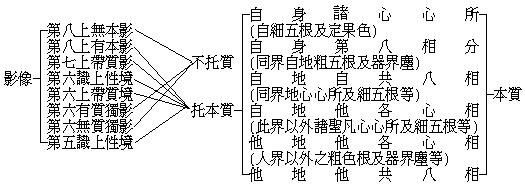

# 人心所緣有為現行境之本質與影像關係

## 目錄

- 一　影像法托質不托質及本質法
- 二「能托影像」與「所托本質」之關係


## 一　影像法托質不托質及本質法




## 二「能托影像」與「所托本質」之關係


```
　　　　　（現親）
　　　　第七識帶質境┐
　　　　　（現親）　│
　　　　第六真帶質境│
　　　　　（現隔）　├──自身諸心心所
　　　　第六有質獨影│
　　　　　（過未）　│
　　　　第六無質獨影┘
　　　　第八上無本影┐
　　　　第六識上性境│
　　　　第六有質獨影├──自身各變八相……細五根及定境
　　　　　（過未）　│
　　　　第六無質獨影┘
　　　　第 八 上 有 本 影 ┐
　　　　第 六 識 上 性 境 │
　　　　第 六 似 帶 質 境 │
　　　　第六有質獨影──┐├自地共變八相……同界自他粗色根及器界塵
　　　　（過未及兔角等）││
　　　　第六無質獨影─名┴┤
　　　　前 五 識 上 性 境 ┘
　　　　　　　　　（現隔）
　　　　　　　（第六有質獨影）┐
　　　　　　　　　（過未）　　│
　　　　　　　（第六無質獨影）│自地他各心相……同界他心心所與細五根等
　　　　　　　　（所緣他心等）├
　　　　　　┌（第六上帶質境）│他地他各心相……人界以外諸聖凡心心所及
　　　　通智┤　（所緣根色）　│　　　　　　　　細五根等
　　　　　　└（意眼識上性境）┘
　　　　　　　　　（現隔）
　　　　　　　（第六有質獨影）┐
　　　　　　　　　（過未）　　│
　　　　　　　（第六無質獨影）│
　　　　　　　　（所緣根塵）　├他地他共八相……人界以外諸聖凡粗五根及
　　　　　　┌（前六識上性境）│　　　　　　　　器界塵等
　　　　通智┤　（所緣人物）　│
　　　　　　└（第六上帶質境）┘
```


