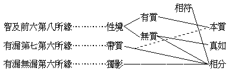

# 四大種之研究
（1924 年，下學期在武昌佛學院講）

## 目錄

- 一　佛典地、水、火、風，之四大種，與通俗所謂地，水、火、風，有何區別？
- 二　四大種是種子是現行？若是現行，云何名種？
- 三　四大種為何識所緣？
- 四　四大種之大類區別有幾？
- 五　身意二識所緣之四大種，有大小久暫之限量，賴耶所緣亦如是否？

## 一　佛典地、水、火、風，之四大種，與通俗所謂地，水、火、風，有何區別？

四大種、即堅、濕、煖、動之四性。種、乃能生義，大、乃普遍義；四大種者，謂具大種二義者，唯有此四。因地、水、火、風、空、識之六界，空則大而非種，識則非大非種，餘種子等則種而非大故。此四大種，即四件普遍能生一切色法之物，乃帶數持業釋也。又、此四大種體相用均大，故稱大種：體大者，謂四大種普遍於一切所造色，又為一切所造色之所依。相大者，謂堅之增盛則成金石之剛勁，濕之增盛則成江海之汪洋，煖之增盛則成爐燄之熾燃，動之增盛則成颶飆之猛暴。用大者，謂堅有承載覆壓之功，濕有融攝腐朽之能，煖有成熟燒燬之效，動有增長摧敗之力。又四相互攝，地大內有水、火、風，水大內有地、火、風，火大內有地、水、風，風大內有地、水、火。其言地大、水大者，乃就其偏盛者而言也。此四大種既但堅、濕、煖、動，非顯形色，身根所觸，眼識弗見，彷彿儒家陰陽、科學質力，故與通俗所稱之地水火風逈異。通俗所稱之地、水、火、風，乃四大種所造顯形色等——地具色、香、味、觸四塵，水具色、味，觸三塵，火具色、觸二塵，風具觸一塵——為眼等識所緣之境，與只為身識所緣非顯形色之四大種，大有區別也。

## 二　四大種是種子是現行？若是現行，云何名種？

四大種是第八識中所藏四大種之種子所發之現行，其所以稱為種者，因四大種有切要殊勝助生根塵等所造色之功能，故假名種。實則色、香等所造色，各有自種子含藏於第八識為能生親因，但須四大種種子發現為四大種後，諸所造色種子藉其資助，始得生起諸所造色，否則不生。因其對於所造色之生有親切增上之關係，故假說為種耳。

## 三　四大種為何識所緣？

色法但為所緣，心心所法通能所緣。大種、造色均為色法，俱時而有，兩不相離。然四大種唯觸非餘，故為賴耶、意識、身識所緣。云何為賴耶所緣耶？此識緣境有其三類：曰一切種，曰有根身，曰器世間，總稱第八之執受處。執受各具二義：執二義者：一、攝為自體義，二、持令不壞義。受二義者：一、領以為境義，二、令生覺受義。第八緣一切種有執之二義，及受之領以為境義。第八緣有根身，則四義俱備；有根身大種之所造，不離大種，故大種亦為其所緣。第八緣器世間有執之執令不壞及受之領以為境二義；器世間亦為大種所造，故亦為賴耶之所緣。

云何意識所緣？此意作用力強，能遍緣十八界及三世有無諸法。雖然、意識緣境，有其二種：一、同時意識緣境，謂與前五識俱時而了別色等諸法。二、獨頭意識緣境，謂不與前五俱起而獨緣一切諸法。故此四大種既為身識同時意識所緣，其名義相又為獨頭意識所緣。

云何身識所緣？身識緣觸，此四大種是觸一分，故知四大種為身識所緣。

## 四　四大種之大類區別有幾？

曰：大類析之，可分為二：一者、有執受四大種，二者、非執受四大種。云何有執受四大種？謂異熟識不共相種熏習成熟所起，能造一切凡聖色根及根依處者，是為內四大種。凡聖有情執持為體，令生覺受，故云有執受大種。云何非執受四大種？謂異熟識中共相種熏習成熟所起，能造大地山河草木叢林器世間者，是為外四大種。凡聖有情領以為境，不執為體令生覺受，故云非執受四大種。問：有情各有八識，其所變之相，胡無差別而相同耶？曰：眾生雖各有八識，所變有異，然以其同業感故，所以所變之相相似。論云：『如眾燈明，各遍似一』，斯言誠可釋此疑也！

## 五　身意二識所緣之四大種，有大小久暫之限量，賴耶所緣亦如是否？

第八識所變緣者，即有根身、種子、器世間是也。前五所變緣者，托第八所變緣．之一分為本質而變緣也。第六識所變緣者，托前五塵而變緣一切諸法也。欲窮三識變緣不同，當研三境與本質相分之關係；故略表於左：

前五識所緣者，有質之性境也，即是色、聲、香、味、觸之五塵，此五塵是五識之相分，乃托賴耶所變緣為本質而現；然所緣相分與本質相符．故為性境。但相符亦就其變緣之一剎那點以言耳，非能與第八所變緣身器之體相悉符也。諸身器聚各自成系，能造為四大種，所造為各身器；在有根身即為有執受大種，在器世間即為非執受大種。第八所緣深廣微細，難可測知，以吾人無無漏清淨慧故，故能所緣皆非所知。金剛心後大圓鏡智相應，方可了知，即為事事無礙之境。故身、意識所緣，不能與賴耶所緣適如其量。

然身識所變緣與第八不同者，以身識所緣是五塵分隔之一相分，此一雖與第八本質相符，然色之一分，是眼識所緣，不為他識所緣，身識緣觸，亦復如是；喻如生盲摸象，耳、鼻、脊、腹各取一分，雖第知一分，而此一分確是象上之一分，故云相符。盲者若以觸知一分執為是象，則妄矣！前五識所緣之一分，符本質境，第六增益認為一物，則成似帶質境，墮俱生分別之我法執。故身識所變緣是各別間隔，第八所變緣則是融通交遍。

身識緣觸有覺不覺之差，全不全之別，然此非身識自變獨有，乃托第八之一分為本質變為相分觸而緣也。故身識不緣時，第八恆緣，以第八所變之器界不可測故。第八所緣之量，與身識所緣之量，於現器界中尚不能等，況第八尤能變緣十方器界耶？由此觀之，前五所變緣者，是條然有別之五系——見不出色，耳不超聲；第八變緣者，乃交遍之一一總系也。然非第六七識法我見所執之一一我法體，五識所緣五塵，為第六識取而別組為一系，第六恆緣，則似帶質境也。此境雖似托本質，而實不符本質，意識所緣之和合相，如死物而固定，第八則活動且交遍涉入。以其頓起頓滅、頓變頓緣，剎那剎那，由種而現、由現而種，非染識可知。因其在剎那上變緣不可說，在變緣相續上亦不可說，說為生滅者，以前剎那頓滅之相，不同後剎那頓生之相故。然身器相續不壞者何耶？以有業為統系之力；此統系力令其續續生滅，相似相續，故有身器之和合相存在。然此和合相續相，乃剎那恆變，法界交遍者也。故非吾人現前意識所取之相。

然此剎那相續之相，雖地上菩薩亦不能確知，有知亦是比知者也。故第八識之境，即事事無礙之法界，斯法界至佛智方可如量證明。由斯異生第八識剎那生滅所變緣之諸法自體相，亦即佛果上之海印三昧境界，亦即佛之法界無障礙智境也。然似帶質境，即意識綜合前五識上所緣一分變為自識——第六所緣之相分也，此境不符第八變緣之境，故非實有。然吾人現見之個個天地人物等相，即是此第六變緣之帶質境。

近世西人科學方法，依前五識所緣五塵，在直接感覺上用第六意識之計度分別，從經驗中求萬有之實體；然祗得意識所變緣之似帶質境，及比量計度之獨影境而已，何能了達第八識變緣之器界全體、有根通身、剎那生滅、現量親緣之實境哉！故欲知現實之真相，亦非成佛不可。

然則凡夫日為煩惱、所知二障纏覆，如何能了第八之微細境相耶？佛說三藏，無非為此大事而已。然佛法無際，若不捨繁取簡，將茫然無從矣！夫淨慧之發，由於止觀，故欲知賴耶真相，非先修止觀不可。初修之時，當先以正比量智，遣除第六識上之遍計謬執，染執既遣，淨慧自生，以真智慧漸除諸微細障，一地二地及至金剛心後異熟空時，則萬有之真境豁然開朗，顯現於大圓鏡中矣，故是現量。此即從華嚴之理法界觀，及天台三觀之空觀入手者。禪宗之參話頭，不涉解路，欲從前六及第八之現量上頓得相應，無階級可由，頗難契入。能究唯識之教，直觀吾人現行賴耶心相，本為事事無礙之佛智境，則頓依佛慧圓觀實相矣。學者於是當精進焉！

