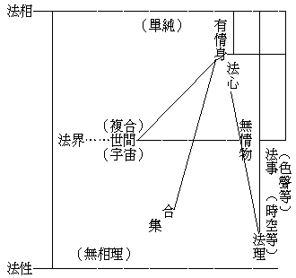
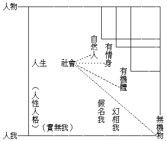

# 法與人之研究
（1931 年 4 月，在南京覺林講）

## 目錄

- 前言
- 一　法之研究
- 二　人之研究

今天的講題是法與人之研究。下面分為二段：一段是法之研究，一段是人之研究。本來佛學的大旨，就是說明「法空所顯真理」及「人空所顯真理」，所有佛學皆不出此二。現因要講佛學大意，所以提出這個題目。

要了解法空所顯真理，又了解人空所顯真理，須要從「人」及「法」上加一番研究。這二種研究，假如用哲學名詞解釋，法之研究，可以說是宇宙哲學，人之研究，可以說是人生哲學。

## 一　法之研究

在佛學上，法之一字，意義最廣，無論甚麼，都可以叫做法。佛典中所謂「諸法」、「一切法」等語，實在賅括一切所有。所以法之一字最廣汎又最普遍。梵語達磨或達爾磨，華文譯做法；所謂法，意思是一切所有各有自有的性質，能夠叫我們及一切有情生了解。換句話說：就是凡可以生了解的，都叫做法。所以他的意義，廣汎而且普遍。法之研究，就是拿宇宙萬有來研究，就是宇宙哲學！

現在依表從最下一條講起：表中最下一條線「事法」：事者、事情事實之謂。括弧內註色聲等者，總括五根所對之五塵而言——眼見之色、耳聞之聲、鼻嗅之香、舌嘗之味、身感之觸及其同類的色法，皆為事法，以其皆為一一之事也。但佛學所謂事，乃包括心法而言。此表且依一派哲學，如新實在論謂事乃中立、非心非物，而為心物中間的事情。彼所謂中立之事，惟在五識所感之五塵，如羅素來華所說：謂「事者、非心非物，而為心物之原素」等語之類。但佛學上事之意義較彼為廣耳。

第二橫線「理法」：理者、條理分理之義。括弧內註時空等——時、指古、今、過、未等，空、指點、線、面積等，餘如生、住、異、滅，長、短、一、多，生、滅、去、來，方、圓、大、小，諸數理、論理等，皆為理法。譬如吾人所見或紅或白者，事也；又如紅而圓、白而方，或紅者一、白者三，則此圓也、方也、一也、三也，皆為理法。可知事乃各別，理惟貫通，理法惟在事法上顯現。故理法雖另有其義，而不能與事法相離，亦可見有事即有理。而且理法上所謂時、空、數等，不但事法上有，即心法上亦有。故理法者，乃事法、心法上普遍之條理，表現之分理，轉變之位次也。故表中另以斜線聯之。

第三橫線「心法」：簡言之能覺知者，即是心法。分析言之，則有心王及心所有法——亦稱心所。依唯識宗心王有八種：一、眼識，二、耳識，三、鼻識，四、舌識，五、身識，六、意識，七、末那識，八、阿賴耶識。心所有法有五十一，即是心之作用及行為，如思想、感受乃至定、慧等。以心王、心所皆是能覺之相，故皆謂之心法。

上來事法、理法、心法三種，事與理乃被覺者，心乃能覺者。但此三種現則同時，不能相離。有其一即有其三，無單現其一者，以其無單現，可稱之為基本法。佛學所謂法相，即指此三種，故表中三線直上通於「法相」，以其最單純，如科學所稱之原素也。佛學上常分「相」、「名」、「分別」、「正智」、「真如」五種法。吾人常識以為有名而後有相，所謂顧名思義者，其實誤也！即如三種法相皆可不待於名，而能實際覺及之，如人覺知冷暖黑白，固不待先有此冷暖黑白之名，而後有此冷暖黑白之相。至若一人或一屋則異是，必先有名而後人義、屋義乃見。吾人習言見人見屋而不知其誤，實則所見者黑白紅綠之顯色——事法——與夫肥瘦高廣美麗之形色——理法——而已！然人與屋非但顯色形色已也。若此黑白與夫高廣等可說為實際之「人」及「屋」，然則影片之中，形色備呈者，亦可認為「人」、「屋」，不亦謬乎？故「人」、「屋」待名而生義，非可實際覺知。事法理法不然，故謂之基本法相。心法亦爾，能自覺知。蓋被覺者事、理，能覺者心，同時此心亦能自知其「能覺此事理」。故佛學上以三分說明心法，所謂「相分」、「見分」、「自證分」，自證者、能自覺到之謂。故心法亦基本法，不須名而有相。

綜上事法、理法，心法三者，為單純之法相。可比之哲學所稱論理的原子論，今則稱為「知識的原子論」。此知識原子論，只認基本實在之三種法相；與常識認「人」、「屋」等名為實在者，逈然不同。近世哲學如新實在論，對於此義，亦有一部分相合，但仍有一部分相反。以其僅知事法、理法為基本實在，而以心物，皆為論理搆成品。實則無情物為事法、理法搆成，如表中直線所示。譬之杯然，色白為事，形圓為理，事、理組合而成物，名之為杯。故此事法、理法可謂等於原子，此其同也。至於心法亦如事、理之單純，不應與物平列，而應與事法、理法平列者。新實在論雖見事法、理法之實在，而於心法未能認清，故與知識原子論仍有相反處也！

中行直線「無情物」：即佛典所謂器世間，包括一切礦、植。亦如常識所謂一件東西，小之原子、電子、微塵，大之地球、太陽，無非一物。以法相論及新實在論哲學觀察之，凡所謂物，皆為事法、理法所組織而成；既為組織而成，如團體然，無有實在。以此十九世紀唯物論之根據遂打破無餘。科哲諸學，至二十世紀始打破唯物論，而不知二千餘年以前之佛典，早見及此而說明之。況新實在論猶不知心法之實在，則其所見，但得少分。近世相對論、量子論亦然，亦僅從事法、理法，說明物質非實而已。

右邊短直線「有情身」：即佛典所謂有情世間，包括「人」及動物。但有情身亦集合體，不過組織之原素（即法相）不同，蓋無情物只事理二法集合，而有情身則事理心三法集合，以有心法故，故無情物與有情身得而區別。二者於表中斜線表示為集合體。

中行「世間」：為有情世間及器世間之總名。其義賅括家國天地乃至一太陽系，一三千大千世界及無量數世界，皆為世間，與吾人習言宇宙之義略同。世間乃複合體，故表中以括弧旁註「宇宙」及「複合」以明之。複合云者，以由集合體——有情身及無情物——組織而成之謂。故法相——事、理、心法可假設為實在，而集合與複合則只可說為假立。然此二者仍有區別，蓋集合體在佛學上說為依業力而成之果報，在常識上則認為自然物；至複合體則為一類一類之總合，所謂宇宙，世間，乃為思想上之概念耳。

上說事法，理法、心法，為實在之基本法；而無情物與有情身，皆為非實在之假法。良以身物所依以組織之基本法，覺知極純，生滅極速，故身物僅得在空間之團結上及時間之連續上呈其假有之相。故凡假法，必須有名，否則其義不能存在。以其不能如單純之法相可實際覺知，而須合多數覺知、組織成一概念，觀定其意義而後能知。是以集合與複合諸法，皆非實際感覺上之相也！

今者既知單純覺知之法相為實，集合複合者為假，則吾人常識向認宇宙人物乃至一切所有皆實之習想，亟須改變；須知世間一切所有，無非事法、理法、心法、組合之假相。若於一切所有看出皆三法之假相，則能改變誤謬之常識，亦謂之見得第一重法空——分別法執空。

由此言之，以觀察事、理、心法等之實，故能空諸身物世間等之假；然則此事法、理法、心法者似乎非空矣？實則事、理、心三皆依知覺而現，基於三種分別——自性分別、計度分別、隨念分別——中之自性分別，如以視覺之自性分別故見諸色相，此自性分別即為基本知覺。故知法相只建築於基本知覺之自性分別上，所謂法相唯識者是。修此法相唯識觀，久之久之，即能空諸法相而證法性。「法性」、即無相理，如表中左邊直線所明。證此無相所顯之真理（即法性），謂之根本無分別智——以無諸識之自性分別也。故根本智空相而證性；復從根本智而起後得不思議智，則能真實通達諸法法相，以證真如，乃能了知法相惟依眾緣所起唯識所現而非實故。

如前所言，在常識上必先有名物，而後有事理諸法，終乃了知心法，但觀法相則知一切名物皆假，此猶知解邊事。所謂講到非證到，誠以未改常識，則恆覺先有名物，不知其假，適與法相觀相反也。若能改變常識，先觀法相，了知一切名物是假非實；後觀唯識，了知法相唯識如幻現。離相親證法性，然後真見法相，即到大乘初地境界；從根本智起後得智，二智久久修習成熟，不假功用常得現前，即至八地。過此至於成佛，一念之中，如理如量——如理智即根本智，如量智即後得智——事理不二、性相不二，時時相應，於見無量差別法相而證無相平等法性，即為諸法中道實相，即為法界。初證法性時乃無相空性，能所分別皆空，至八地始證性相不二，佛地四智圓成，故能究竟實證性相不二之法界。

表中「法界」下以虛線聯於「世間」，以明法界非虛玄之稱謂，乃即世間是法界，等而至於有情身、無情物乃至一心一理一事無非法界。以性即相中所顯現，相即性中所建立，故差別即平等，平等即差別，所謂『眾生及國土全露法王身』。是故一一法皆現法界性，一法統攝一切法，一切法普遍一法，故每一法皆法界，禪語所謂『拈一莖草作丈六金身，將丈六金身作一莖草』，皆無不可。譬如一剎那心之視覺現起——一瞬之視覺，其功用亦遍法界；以事、理、心三法不能相離，同時而現，是以一現一切現，亦即一切現而一現。推而至於一色、一聲、一香、一味，無不性相具足，皆全法界，是故一一皆法界，是為究竟法界觀。窮了性相不二之法界，亦即圓滿的法界觀，是為佛學的宇宙觀！

茲以華嚴教義五重法界，比例前說．一、事法界；即前之觀事、理、心三法之法相實在，而空諸集合之有情身及無情物，與複合之世間宇宙。二、理法界：即前之由法相唯識觀，以空無量差別法相，而證無相平等空性。三、理事無礙法界：即前之性相不二、理事不二，以無量差別之相皆在性中建立，而無相平等之性皆在相中顯現。四、事事無礙法界：即前之即性即相，觀世間乃至一一法皆法界。五、一真法界：即前所謂窮了性相不二之法界，為圓滿之法界觀。

前四義，皆可依言說安立，謂之安立諦。此一真法界非可依言說思想安立，故為非安立諦；以諸法本真，本來如是，不落言說故。法之研究，姑以此為結論。

## 二　人之研究

佛學上所謂「人空」、「法空」，實則人空非單指人類而言。不過以人代表一切有情，或稱一切眾生。以釋迦牟尼佛現身人中，不妨在人言人，就人類而立說。今之研究亦然，亦以人類為範圍，而從切近之人生問題下研究，成為人生哲學。人生既明，則一切眾生亦可推類及之，故人生哲學之範圍與人空同。

表中最下第一橫線「無機物」，第二橫線「有機體」，二者即前「法之研究」中之無情物。以其皆為事法、理法所結合故。在此分之為二以便說明：一者、無機物，又可分為二種：其一最基本者，如化學所謂原素，所謂九十二種原質；其二化合者，如空氣、礦質、水土等。二者、有機體，即較無機物略進，須以無機物加有機組織而成。雖為一體而有各部分工合作之意義，如草、樹等，葉司吸收生活素，乃至根、幹、花、果，各有作用是。又有新陳代謝之遺傳，如樹至結果，老樹萎謝而新芽茁生是。有機體有此等意義，故較無機物為高一重。無機物最簡單，有機體則加複雜，表中於二者之間以直線聯之，以示有機體包含無機物，又加其特有性質而成也。雖然，二者乃組織不同，非性質不同，從單純之法相觀點言之，無機物與有機體均為事、理二法組成，仍無心法要素；以較有心法之有情身，則又逈然不同，故二者均屬無情物。

第三橫線「有情身」：內典亦稱為有根身。如鳩摩羅什譯六根為六情，以根能發識——眼根發眼識、耳根發耳識、鼻根發鼻識、舌根發舌識、身根發身識，故有根即有情。但意根（即末那識）屬於心法，前五根為色法，均以發識而有根義。故有情身有心法合成要素，較之無機物及有機體——無情物——非僅組織不同，實為性質不同！表中以直線聯貫之，亦示有心法者包含無情物而又超出於無情物之上。至平常所稱動物一語，與有情身同，但其義較混，不能如有情身一名之能具體表現。

第四橫線「自然人」：人亦有情身之類，即動物之一。惟於「有情身」上再加意義，如稱「人性」、「人格」，義即自然人特有其性格，亦見人類有其特殊之地位及意義，而在一般有情身之上。略言其不同之點，則人皆直立，而有情身類皆非直，故內典稱餘有情為「旁生」或「橫生」。又動物單靠生來身體而生活，無創造力，人類則否，行時祗用兩足而餘兩手可以作事，故衣、食、住多以自力製造，而非純賴天然素樸之物。人類富有工作創造之能力，以謀供給其需要，即顯然與其餘有情身不同。佛典亦云人類最有造作能力，其餘有情身類皆受報，但人能造業。且以富於造作能力故，知識因以發達，既有語言以達意，又能創造文字以代語言，而排除空間（遠地）時間（將來）上之阻隔。其所造作，蔚然成為學問、知識、文化、道德，而代相遺傳。猶之個人之衣、食、住等之生活財產之遺傳於若子若孫然，此則尤非一切動物所能者。取要言之，形狀豎立，以手工作，能力富於創造，心力富有知識，皆顯然異於群類，故能自達其所欲達之目的，自覺其所應覺之趨向，善能變化，不純受自然力之拘束。是以人類在宇宙中，實為萬有之中心，故特列之。

表中右直線「人物」貫於四橫線，若言人亦是一物，故有「人物」之稱。譬如從化學上研究，人為十四種原素而成，內典則謂地，水、火、風，四大和合為身，由是以言、人實等於無機物。若在生物之生理學上觀察，則人亦有機體，如樹之有根、幹、枝、葉，花、果，而為呼吸、消化、生殖等作用。至與有情身比觀，人在自然界中亦一動物，飲食、睡眠，男女、貪生怕死乃至一切生活運動，受環境機械的支配皆與動物同。若謂業報不同，則水陸動物，移地則死，亦因業報不同。且人之不能潛於水，亦如狗之不能潛於水，若謂形相有異，則牛固與狗異，牛狗又與魚鳥異，乃至非其類者莫不異，皆不足據以為相異之點。故從自然科學、化學、生物學、動物學等觀之，人亦自然界中萬物之一。一切萬物動受機械的因果律支配，人亦同受支配。譬之自然界如機器，其中無機物、有機體、有情身、自然人等，則如機器中一部分之機件，以其同受必然之因果律所支配，動則隨動，莫之能外，且可以科學方法研究出其「變化公式」。人之活動，實等於風吹水流諸活動，故人實機器性之自然物！如唯物論哲學所明，一切基本皆無機物。其有植物、動物乃至人類之分者，以有力故。力者、質之活動，人則活動至於靈妙而已，初無所謂精神或靈魂也。至行為派心理學，僅認人為有機體，更不承認心法，可稱為取銷心理學，所謂心理現象如意識等，無非受刺激而起反應。例之物被風吹而搖，眼被光刺而眩，故將意識、精神、靈魂等等，根本推翻。此等科哲諸學，類皆以人同受物理變化而與一切動植無機等觀，亦未嘗非見一邊之真理。故近世科學的人生觀，亦仍有一邊之真理，但必能融會中道，始得人生之真相耳！

中行直線「社會」：社會以人為主，若以自然科學之視人同物，則社會亦可說為物質的。譬之家有家室、家產、家畜，國有領土及動植出產，推而至於世界之大，無非包羅各無機物，各有機體，各有情身；而以人為主位。雖稱人類社會，亦有動植諸物為要素也。倘以人有精神作用而言，則社會復可說為精神的，而不必基於物質條件，如異地之人，雖至遠隔天涯，而以同心同行故，亦可以團結而成一社會。又如尚友古人，則精神相通亦有團結之義，故可稱為精神的。

自然科學以人類同在物理支配之下，而視社會為唯物的社會。蓋以泰西十九世紀，唯物思想獨霸一時，故其時社會學亦唯物的。如唯物史觀謂社會變遷，乃依人之物質生活經濟狀況為基本，苟生活與經濟變化，則社會隨之變化。人之社會遂等於無機物之受物理支配，而成為唯物史觀或經濟史觀之社會學。是皆一偏之見，其說明只在唯物一邊。最近科學不然，如相對論物理學言：物質一概念之構成，純為眾多關係——因緣——而來，否認實有物質存在；量子論說明力合為質，而否認力依質有，恰將十九世紀唯物舊說推翻。此等學說，吾華知者尚少，以譯本多十九世紀舊籍，故猶封蔽如未聞。但此最近學說雖能打破舊說，而說明一面真相，要亦一偏之見而已。

自唯物科學發達以來，否認有精神之存在，而成為機械人類觀。所有靈魂、神我，或精神自我等統被打破無餘，絕對否認。佛學亦爾，所謂空諸「我執」一語，即在破除神我、自我及靈魂等觀念，絕對否認人之身中有固定不變、永久、常住、單一的自我存在，茍有我執，即成「常見」。但自然科學等以機器方人而打破神我等「常見」，以其所見只有物理故，則執人至死亡不過僅有所餘物質存在，而無精神活動之繼續，故又成為「斷見」。是皆與真相相反。佛教小乘人，一般愚法聲聞，其觀察與科學略同。以為人者，四大、五蘊、十二處等組織而成，即是惟有諸法——如物質原質——而神我自我皆空。再見剎那生滅，而修無常、無我、等觀，其無常觀同於科學萬有皆動之說，無我觀亦同於但認質力之物理。然其見理雖同而趨向有異：蓋愚法聲聞以自身為對象，見四大、五蘊等之生滅而觀無常、無我，雖以不明法相及法空理，尚有法執；但以我執既破，其因我執而起之貪、瞋、癡等煩惱已根本消滅，故得解脫生死輪迴證羅漢果。至科學者，不反觀自身以破除俱生我執；但觀自身以外之人類動物等，既無精神存在，譬諸土木，可以應用科學方法，魯莽從事，以對礦物者施諸人類、施諸社會，消滅宰割而毫無不忍之心，以求發展一己之我——俱生我執。充其意，似謂唯我是人，其他皆物！此十九世紀之偏見，蔽於人心，人皆自期優勝而奮鬥，實則難免對方反抗，故演成私人乃至國家與階級之鬥爭。是故無常、無我之理，小乘與科學之觀察略同，其結果也，一則以之鬥爭，一則以之解脫，是不可同年而語矣。

茲以大乘教理觀察而言：不主張決定有我。如印度昔日之勝論、數論、瑜伽等派學說，皆認有獨立常時不變之我。近日太哥爾亦云：人者、一方面立在宇宙法則支配之下，一方面又有獨立的精神自我，雖全宇宙的壓力亦不能屈服之。故皆欲尋求最根本之自我而得自由！在此點上（真實之我），認為每人及每一動物皆同有此之我執，表中左直線「人我」即此義，佛法則認作妄執而一一破除之，故人我線下註「實無我」。以實體之我無故，謂之「人空」，故佛法大小乘經皆破實體自我而明真實無我。表中「有情身」、「自然人」，旁註「幻相我」及「假名我」，即明無實自我而有幻我、假我之意。良以動物以有心理現象——即心法，故與植物不同。每一有情，皆有八識及其心所，此中第八阿賴耶識，雖剎那生滅而一類相續，是以似常似一，受熏流轉，幻成我相；故每一有情，得以統攝其一期報身而不散。同時第七末那識又恆時堅執此虛幻我相為實自我，基此而起第六意識。故有情莫不帶有「我」之性質、精神、意義、色彩。是故有情世間，雖無實我，但以末那迷謬，認幻為實而成我執；遂以求自我之保存發展而起「貪」，彼此衝突而起「瞋」，不明我幻即為「癡」，恃之自高而為「慢」，故有一切非理的感情作用。人與動物，莫不皆然，則皆此「幻相我」之為祟也。及至人之階位，則更有「假名我」之產生。蓋以語言文字增上作用，成為種種概念，建立種種名字，又以各人觀念不同，認識不同，我之意義及價值亦隨之不同。幻相我與生俱來，末那所執，名為俱生我執；假名我由分別生，意識獨有，名為分別我執。又以認識不同故，人各有其我之定義，略言之如謂：身體是我，受苦受樂者是我，辨彼此是非者是我，能造作者是我，乃至知識是我。推而廣之，如國家學謂國家有獨立主權，亦即我義；乃至一神教謂宇宙亦有獨立之我，如上帝之類。凡此假名，皆依幻相推度而產生。可見心法有無，情器攸分，有情世間，與物有別矣！

一切動物，求自生存，殘害他物；其心理之貪、瞋、癡等現象，見諸行動，至於人而加厲。更有假名我以為團結工具，其志趣同、行為同、乃至思想、信仰、力量同者，所謂天涯比鄰，雖遠而合；其不同者，所謂肝膽楚越，雖近而離。是故社會組織上，不能不承認精神勢力之偉大也！

夫物質生活之需要，固所尚矣。若遂抹煞精神，而以經濟——物質的——支配為已足，必至糾結滋生。彼思想簡單之人，以為社會者，衣、食、住、行而已，男女性慾而已，解決之固易易。此種觀察實大謬不然！試思古今大戰之起，其主動者決非迫於凍餓之人，蓋彼志在謀衣食之流，縱迫饑寒亦為鼠竊狗盜而已，烏能興風作浪，為禍天下？然以饑饉疫癘流亡者多，野心家得此機會，思所利用，揭種種名義以為號召——即利用假名我作祟——以償其爭意氣、爭體面、爭光榮、爭領袖之欲；微特不為衣食之謀，且可犧牲一己之財產身命，從事於此。故謂社會問題純屬物理，思以經濟支配力以解決之者，實為不見人生真相，只知一偏之謬論。蓋社會問題變化，物理固大，心理亦強：自我之貪、癡、見、慢、常伏動機，相互之恩怨冤親、尤生關係。若不觀察明晰，妥善安排，太平之期，不幾絕望？此談人生者所當注意及之也！

佛法打破實我，而以四大、五蘊諸法說明無我。小乘遂起法執，認定實有諸法及無我理，將幻相我、假名我消滅之，以成其解脫。大乘不然，真無我之理既明，其事實上之幻我、假我即不為所惑，幻則明其為幻，假則明其為假，所謂還他本來面目，固不必改造消滅之。以其明瞭無惑即無顛倒，譬如合土地人民制度等等而名之為國，則知國為假名，非離土地人民制度等等而別有，不過土地人民制度等得「國」之一名以統括之。故假名亦有假名之用，最近科學亦見及此，以為凡名乃思想言說上之一種便利。有杯於此，色白而圓，中空而有容量，得此假名，名之為杯，則諸法相概括無餘，便利孰甚！但不惑為實在而已。大乘以人空理觀一切有情，「真我」是無，惟有似常似一之阿賴耶識及餘心王心所，是為「唯識人生觀」。明此似常似一之幻相，是識非我，故末那不起誤執，意識亦除我見，即人我空——即真我之見消除——而證人空所現真理。從人空所現真理，乃能顯現幻相、假名之作用。如前所言，阿賴耶識雖剎那生滅，而展轉熏習相續不斷，故能從幻相我上覺知人生固非一成不變，心法變化上皆有改善之可能；只在破除迷謬，希望覺悟，人皆可以向上漸增漸進，希賢希聖乃至成佛。而且對於人生的社會，亦可從假名我上見到有改善之希望，與進步之道路；譬如一家、一國、一民族乃至宇宙，無非和合相續似一似常之團體，此種相似常一之團體，皆以人為主位，可見每人皆有社會性。社會之搆成，皆借種種關係集合及人的活動力量；故人對於社會的搆成關係密切。故談改善社會，須觀察人的一方及社會的一方，而後善惡利害可辨。不為一己而謀福公眾者、善也，損害其他而自圖權利者、惡也，善為社會利而惡為社會害，害所當去而利所當作；非可由個人壓迫或殘害其他之人，亦非可由一部分壓迫或殘害其他部分，而後社會乃得由此互相交遍之精神，而成功為蒸於善利之社會。

上來「人物」、「人我」二義，皆見一偏，故成妄執。妄執者遣除之，合理者收集之，而歸納為人生之觀察。蓋人生者，包括人之生活、生命，雖不離於物理並非完全受物理支配，而有相當自由者也。譬如醉人為酒（物理的）力支配，乃呈暈態，但能自由不飲即不受酒力支配。人有心法，故有選擇判斷動作之自由可以轉移物理。是故人生非物非我、即物即我。

人與他物之區別為人生性，即人之特性。如百法所明二十四不相應行法之眾同分中，人有人同分，同分者類性之義，人同分即人類性。此人類性可以概括人之一切而具體表現「人」之不同，以有人性支配故，故人之物理關係即非凡物之物理關係，其心理亦係人的心理，是類性上即可顯有人性。若認人之性格即人格，則人生之義即包含人性、人格；其關係有物理的及心理的，故人生有其意義，有意義故有價值。以佛學言：人在宇宙間，一方面與一切有情隨業受報——即自然力支配——等無有異；又一方面則人之特性，富有造作、思想、覺悟之自由自動之能力；故可憑自力認識人空、法空所顯真理，而改善個人、家、國、乃至全宇宙。此為佛學上人生之意義與價值，人各具有，當視各人之心理為出發點：自由活動，改善向上。有此自由創造活動之力，故有其豐富之意義，與廣大之價值，而人生之希望亦無窮！人之研究竟。

茲請總結一語：學佛，乃證明人空、法空所顯之真理；達到宇宙人生究竟之至善！

