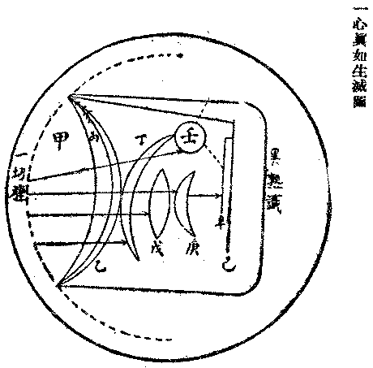

# 唯識觀大綱
（1922 年 3 月，在漢陽歸元寺說）

## 目錄

- 一　引論
- 二　五位百法之唯識觀
- 三　依真有幻全幻即真之唯識觀
- 四　悟妄求真真覺妄空之唯識觀
- 五　空雲一處夢醒一心之唯識觀
    - 一　喻依真有幻全幻即真
    - 二　喻悟妄求真真覺妄空
- 六　五重層次之唯識觀
    - 一　遣虛存實唯識觀
    - 二　捨濫留純唯識觀
    - 三　攝末歸本唯識觀
    - 四　隱劣顯勝唯識觀
    - 五　遣相證性唯識觀

## 一　引論

若修唯識觀，當與唯識各經論之彌勒等菩薩，天親等論師，所發信願相同，始能成就。故發心初首，須作方便：一者、歸命三寶，以決定信心。二者、普求二利，以發大願力。如成唯識論曰：『稽首唯識性，滿、分證覺者；為自利、利他，令法久住故』。

唯識性者，對唯識相言。能變之識，與所變之法，即唯識相；一真法界，平等真如，即唯識性也。於唯識性，唯佛能圓滿證覺故，名唯識性滿證覺者。諸菩薩亦能分證故，名唯識性分證覺者。所證唯識性、是性，能證性智、是相；統此無漏真實性相，謂之法及佛僧。佛能于法圓證圓說，僧能弘傳佛法，如實修證。故此三者，皆應歸依。稽首即傾身命歸投之，以決定信心也。謂歸命唯識性相之法佛僧，欲實將身心境界鎔歸於唯識無漏性相之海也。

發大願力者，誓證一切法唯識究竟真實性，是自利也。觀一切眾生同依一唯識性為體，普導含靈，胥成正覺，是利他也。證此覺性，解除煩惱，了卻生死，成就圓滿福德智慧，使佛法普行，佛種不斷，此通利自他也。是故乘大信心，發大願力，修者依此，即為因地法行；發心充實，自可無有蹇屯。

以上所言，憑自理觀之力。復有事緣，可相輔成：如讀誦大乘經論，凝心聖教，持念釋迦本師，彌勒菩薩，禮拜諸聖，以祈加持；並懺悔無始來一切業障，使修觀不起魔難。譬如築堤，既固址基，復肅眢眚，則可久遠。自因助緣，亦復如是。

言觀行者，即具二分：一、能觀智，二、所觀境。復攝此二為能證入門，以證入所證入法。故是一觀，具二能所。能觀智者，各宗皆同：天台、賢首、禪宗、淨土，莫不須依第六識心王相應之慧心，為其主體。餘如五遍行，及欲、勝解、念、定，與善法之信、精進等心，亦皆相應，以為助伴。

## 二　五位百法之唯識觀

所觀境者，在唯識觀乃通觀一切法皆唯是識。故法界一切諸法，皆所觀境。言一切法者，廣大悉備無不窮盡，世界微塵難喻其數，如此紛綸，何堪攝取！是故慈尊造瑜伽師地論、約為六百六十五法，無著大士依之作顯揚論、又約為百有六法，至于天親大士遂立百法，以此百法攝盡一切。百法者，初地菩薩之所證法。初地所證，皆百法門，如見百世界，供養百佛等等，皆以百數。二地則千，三地乃萬，以至大覺，數不可窮。是故修觀當明百法，熟悉各法，何者為性，何者為業，了然心中以成觀境。今舉大要，明其唯識。

百法者，略分有兩。一者有為，二者無為。有為者，復別為二：一者實法，二者假法。實法有二，心與色是。假法有一，寄在心色分位假立，心不相應行是。心復有二：一者心王，二心所有。

心王者，正所言識。明了分別，為其體用，故謂之心，或名為識。二十論言：『心、意、識了，名之差別』。然此心王，唯是眼、耳、鼻、舌、身、意、末那、阿賴耶之八識。

心所有者，不能自有，隨心王有，與彼心王相應不離；心王是主，此為僕從。言相應者，非一非異，謂體雖二而事常一，同依一根、同緣一境。八識心王，於五十一心所有法中，各與其相應之心所有法而轉；與識相應，隨識而有，是故唯識。

次論色法，今言物質，在佛法義說有二性：一者變滅，二者窒礙。宇宙萬有，前六心王對境，皆可云色，是故六識名了別境。以言其數，五根、五塵、法所攝色，凡十有一。五根發識為不共增上緣，變現五塵為所緣緣。眼識所緣有見有對，耳等所緣有對無見，意識所緣無見無對。若散位獨頭，夢定中緣，皆法所攝色。以此諸色皆心所變，何以言之？心自體相為自證分，其作用相則有能所，能者見分，所者相分。相分變現，唯見所取，心自證知，故云唯識。

復次、假法心不相應行。行表行蘊，遮非無為及色、受、想、識蘊；心不相應，遮非心所有法。上言心所有，多是相應行，與此正相違異。心所有中，除卻受、想，皆行蘊攝。此中得等，雖在行蘊而與心不相應，故立此名。詳此一法，惟是心、色分際位置，對實法言，謂之假法。較其所屬，通局有殊：如命根者屬心分位，如異生性屬心所分位，若無想定等屬心心所分位，若時、數、生、滅等通為心、色分位。是故當知此諸假法，唯依心、色分位而立，無獨自體，故亦唯識。

無為者，無有生滅，不可變異，亦無作用，不能表示；列為六法。五隨相立，其一真如。此中虛空、非方分空，乃是觀智空無相境，唯心所變還自緣取，雖湛明照而非真如，乃識所變似真如相。真如性者，其所言法，無可言思，離一切相、不思議故，見無所得、不可立故，諸常如法、各遍顯故。此乃唯識之真實性，故是唯識。

一切法界無量諸法，皆此百法之所成立；觀此百法唯識，即遍觀一切法皆唯是識。上能觀智與所觀境，即為能證入於唯識法之觀門。而由此觀門所證入之唯識法，初則了然觀見法界一切諸法，皆唯識所變之相；次即離一切染唯識相，而證真唯識性；次由證真唯識性，而能如實照了諸行『猶如幻事等，雖有而非實』；由是證得圓滿清淨轉依，性相不二，身土一如，是為究竟唯識。

## 三　依真有幻全幻即真之唯識觀

包羅萬有，唯是一心；即此一心，融貫凡聖，而能任持一切法之種子，及有情、無情之根身、器界，故又名阿陀那識。此識非真非幻，全真全幻，為真幻之所依，通於佛位、眾生位者也。遍持諸法，唯一真心，故亦謂之一真法界。一者、絕對待，真者、無變異，為一切法根本依處，至佛果上之離垢清淨地，又名菴摩羅識，此識圓滿清淨離染污法，乃無漏智相應之真淨一心也。此真淨一心，在眾生位名如來藏，至如來地始能究竟證明顯現故，在眾生位含藏在眾生心中故。表此一心非虛妄故、曰真，無變異故、曰如，真如云者，的指此一心之性體。上言阿陀那識、菴摩羅識、一真法界等，雖同一體，隨相異名。惟此一心，通一切位，依真有幻，故曰一心生滅；全幻即真，故曰一心真如。欲觀一心真如、生滅之體用，今另列圖如下：

圖中大圓圈，即表示一心真如——本無形相限量可言，強作此形量表之耳。阿陀那識，為世出世間、有漏無漏諸法所依持，有發生一切法之別別功能，指此別別功能名一切種，為圈內所表之長曲線是。而此一切種，亦遍十法界一切位。由此一切種有根本無明發生，所謂『不覺心動，忽然念起』，如「乙」所表，是謂末那之根本法我癡見。其乙線裏面所表「丙」，即念念執阿賴耶見分為內自我。如「甲」線內部分即阿賴耶識之範圍，完全為末那所執之我愛執藏。此阿、末二識互依為根，末那依阿賴耶而起我見，阿賴耶依末那而成我愛執藏。同時阿賴耶又變起根身、器界、轉為異熟識，是為三細，此三細實無先後之別。概括言之，動、為末那、阿賴耶，能起、為一切種，所起、為異熟識。忽然一念乍動，無明相應，末那即執阿賴耶見分為我，念念不息，使阿賴耶識內種子皆成有漏，於是現起一切根身器界，此即依真有幻之義也。

從末那背方，依阿賴耶內種子而現起者，如圖「丁」所表，是為意識。意識方向與末那相反，末那向阿賴耶見分，意識向阿賴耶所變根身器界；蓋末那執內為自我，意識認外為各個我。且末那為意識不共增上緣之依托根，故意識亦必帶有俱生我執；然雖依末那為根，實從阿賴耶內之有漏意識種子所現起，如圖有直線由阿賴耶通發於意識是。

如圖「戊」所表為五根身，即正報身。而此根身雖經過意識而成，卻仍從阿賴耶色法種子而生，故此根身非浮塵根，乃清淨四大所成之五淨色根，為藏識安危與共攝為自體者。云何現此根身？因末那執我，欲有所見有所現故，正面由藏識變起根身器界，反面由根身器界發生意識，遂建立有情世間及器世間。末那能執之力，彷彿海中有一種鼓盪之力能起波浪，又如叩鐘有撞力而發聲，是故情器世間之生起，皆由末那潛動力而出發也。

如圖「己」所表為器世間，雖間接亦由末那之執染，而直接唯阿賴耶種子之所變及見分之所緣；乃為微細流行轉化之象，剎那剎那，生滅不停，不易覺察。吾人所見之山河大地，仍屬粗相耳。何則？以末那所執之藏識，變動不息，其所現之相亦變動不停故。凡屬根身、器界，皆是如此，而無一剎那之暫住者。

如圖「庚」所表為眼、耳、鼻、舌、身五識，從阿賴耶種子經過末那、意識而生。故前五識以阿賴耶為根本依，以末那為染淨依，以意識為分別依，五識各以淨色根為不共依，而淨色根又以浮塵根為寄托。前五識現於五塵時，即意識同現時，故意識遍分別於五識也。

如圖「辛」所表為五塵，五塵性境，即前六識自變之相分，但須依阿賴耶所現器界為本質。此本質即異熟識境，由業所感，前六識依之而變為相分。何謂性境？性者，實在之義。前六識現量所緣之相分，完全與阿賴耶所變之境相同，毫未改異，是謂性境。一剎那間，第六識起隨念、計度分別，則非性境矣。

如圖「壬」所表為獨頭意識所緣法塵境界。分別有三，謂散位、定中、夢中等是也。其率爾心緣現量境，離於隨念、計度分別，斯須即入獨頭意識，非復現量性境，而已為前五塵之落謝影子矣。遂由意識內依末那我執及藏識中名言習氣，變造為意識所現之法塵境。凡前塵種種之相，皆為阿賴耶種子所現；獨頭意識所緣，則為前塵影境。故獨頭意識所現之境，多為似帶質境，即吾人現前之境物是。

又意識能憶過去境界，即前塵影境經意識念度過而藏於阿賴耶識中者，忽然念起，或於夢中現起，皆是獨頭意識所現。除無想定外，四禪、八定，亦皆獨頭意識所緣之境。因不由異熟習氣所生，故不成業果關係。如夢中所現之境，全是虛妄，則甚易見也。若由異熟習氣所發生者，屬於先業，故有果報關係。比如放砲，彈乘砲力飛行空中，必至砲力衰竭方始落下，緣為他力之被動，不能自由而止也。異熟報亦同此道理。常人不知，誤為自然，不知實先業之感招也。又此意識法塵境界，亦可超出異熱範圍之外，而達於不可思議之境，以意識功用甚宏故也。

綜觀上圖，可以尋由真起幻，從幻反真之途徑。常人不明此理，執此根身、器界為實有，不知皆阿陀那識一心之幻現也。夫一念心起，無不依一真法界而有，無始無明念念不息，即是全法界盡在無明，是故一心之動，即萬法所由生。萬法之變，悉唯識之所現，故曰萬法唯識，而唯識之實性即是真如。能知此義，斯可以觀依真有幻、全幻即真之唯識也。

## 四　悟妄求真真覺妄空之唯識觀

上既說明依真有幻、全幻即真之理，此更進演悟妄求真，真覺妄空之義。所謂妄者何指？指第六意識所起之似帶質境，即吾人現前所謂之天地人物是也。原意識依末那為根，二執俱生，恆與前五根識托阿賴耶所現之根身、器界，變緣五塵，隨續分別，因綜合離開之結果，認為實有種種物體；乃執何者為長、短、方、圓，何者為紅、黃、黑、白，何者為我，何者為非我，重重錯妄，莫能窮詰！如此妄執，是謂遍計所執自性。此妄執境，在與前五識俱起之意識現量上，本無所有，實為意識重緣五塵之影，而自加以分別所成者也。故修唯識觀者，首當悟此現前妄執之境，皆是遍計所執自性。是為悟入之第一步。

今更可以夢喻之：吾人入夢時，或見花鳥人物，或感苦樂悲歡，當其時何嘗不聲色俱備，情懷真切；卻至南柯醒後，都杳無所得。究竟真耶？妄耶？推之現前所見事事物物，非不在在是實，一一逼真；如得無明豁破，慧目開朗，反觀現在之境，亦等如夢中所見，畢竟一無所得矣。是故對於現在之境，先應作如夢觀，以遣意識上遍計所執之我法，則根身器界，宛然唯識心變現之虛幻相而已。或謂夢境既空，夢心亦空，應云唯空，何謂唯識？不知夢中之心即醒時之心，境異夢醒，心貫醒夢，故醒後心中亦能了然夢中之境物，而欲求夢物於醒境，則必不可得也；是以夢境實空，夢心幻有。境空不離心有，心有元即真覺，境空心有，善成唯識。然則心可通幻，亦可通真，真妄之轉，統依一心。是為悟入唯識之第二步。

夫此所謂真覺，指現行意識之證智而言。意識完全不現行時，若所謂五無心位者，豈不心境俱空，如何得成唯識？是故當進觀意識所依之意根，及種子心。蓋意識依末那為根，從阿陀那種子識生，此之二識，恆時現行，意識等種子亦依存不斷。故雖至睡眠悶絕時，意識不起，知覺中斷，而醒後仍能繼續憶知前經事，不相乖謬。可知末那恆審思量，念念執阿賴耶為內自我，未嘗稍息；而阿賴耶受異熟、持種子，無始至今亦未嘗稍息。前六根塵識心，依藏識種為因，末那為緣，乃以繼續生起而不斷也。彼外道不知觀此，憑禪定力，強伏意識不使現行，待定力盡時，仍墮生死流轉！猶之睡眠悶絕，醒後仍復攀緣意境，不相離捨。此可以悟意識止伏，另有潛勢力存乎其根底，曰、末那阿賴耶，無始恆轉。此為悟入唯識之第三步。

無始以來，末那執本識見分為內自我體，而有俱生法執，是為根本無明。本識為末那所執故，變為我愛執藏之識，受前六識之熏，而藏守諸雜染法種，固執不失，枉受業繫。六識取塵造業，若明中張手現影而捉取其影，藏識受熏持種，若明滅猶固握其拳以為影在。蔽藏識不明者是為根本無明，根本無明一明，則阿賴耶轉成離垢清淨之庵摩羅識；此識能任持一切法而不為一切法之所蔽，鏡智相應，得大自在。是為唯識觀之究竟。

## 五　空雲一處夢醒一心之唯識觀

合上二觀以喻明之：

### 　　一　喻依真有幻全幻即真

謂依空有雲，全雲即空，雲之有非自有，依空有也。無雲之空，喻一真心。不起根識身器全如虛空，根識身器起如空中生雲，頓呈昏闇之相。然雲不從虛空生而從汽生，喻根識身器不從真如生，而從阿陀那識一切種生也。汽由波動而凝聚為雲，即本識由末那無明之動而現諸蘊、界焉。夫雲之為幻，原無實體，以比依他起性，幻不離真、如雲浮空，而無自體之可言也。然而雲起於空實不礙於空，以雲之在處，空未嘗不在故。且空大無邊，片雲何足為蔽，不過常人眼識低隘，一為雲所籠罩，即不能遍見澄空之相。假使有人立於雲表，則雲自浮闇，空自湛明，了無相涉矣。此喻識生諸法，不變真如，若妄執我法，隨業流轉，則不顯真如之性。設一旦覺悟，則幻自虛疏，真自常寂，亦了無相涉矣。就上義，可以廣大虛空、喻如來之法性身，以虛空明相、喻如來自受用身，以騰起霞雲，喻如來之他受用身及應化身。但雲有光彩，耀人心目，是為卿雲、瑞雲，非烏雲、濃雲耳。且佛應化之雲，若身若土，皆同幻現，諸佛證真、真可容幻，眾生在幻、幻亦含真。真幻不二、則真性即是幻性，空雲不二、則空處即是雲處；幻即同真，真即同幻，真幻相含，幻幻相含，所謂真俗不二之理事無礙、事事無礙觀是也。

### 　　二　喻悟妄求真真覺妄空

謂悟夢求醒，醒覺夢空。如觀現醒之物，皆同夢境，則夢中之物，亦同醒境。夢不知夢，是為妄中執妄，醒定執醒，亦復未出妄中。醒境夢境，不離一心，是一心直貫世出世間，總持十法界而不可以區別者也。試以夢為喻：初地菩薩、知夢未離夢相，七地以上菩薩、夢醒未離醒相，從金剛後心至佛地、方能大覺，夢醒無礙。眾生在迷妄顛倒中，夢醒俱夢，諸佛隨緣而度眾生，醒夢俱醒。是同一心境，而凡聖互見，各不相侔也。

復次、以心為喻：夢中之心、凡夫心也，夢中知夢之心、菩薩心也，夢覺之心、佛心也；雖然三種心境，仍是一心所現。蓋夢中之境唯心所現，覺中之境亦唯心所現，是以夢中之心即覺時之心，眾生之心即佛之心，『心佛眾生，三無差別』。一心現起、即是心之全體，並非少分，所以佛能遍法界而度眾生，眾生亦以此心具造十法界，而終能悟入佛之知見也。

綜上二義，換言之、亦可云空雲一空，夢覺一覺，成為一真無障礙法界之唯識觀。又上節所講猶為漸次，此中所說方為圓融。何則？生佛不二、空雲一空，真妄俱泯、夢覺一覺，是為圓滿一心之唯識觀。

## 六　五重層次之唯識觀

上來反覆推闡唯識觀之理，不外於從妄而顯真、即真而空幻，以歸到真幻一心、一心真幻之實相。是實相雖一，而觀非無漸次。茲更依古德所擬之五重唯識觀，提出重宣此義。

### 　　一　遣虛存實唯識觀

云何遣虛存實？即遣遍計所執之虛妄，而存依他、圓成之實有也。前已云遍計所執，如認夢為實境，如執雲為固體，唯是虛妄；依他起性，如心現夢，如雲浮空，幻不離真而無自體。此云遣遍計執之虛，而存依他、圓成之實者，以雙觀真俗二諦，而專遣虛妄執耳。就俗諦說、依他起亦為實，就勝義說、圓成實方為實，對虛說實，是為空有相對之唯識觀。復次、二諦又為性相二門，相依性而常顯，性離相而常住。起信論云：『一心生滅門』即是依他起性，『一心真如門』即是圓成實性；二者皆不離乎一心，此唯識所以成立也。

### 　　二　捨濫留純唯識觀

一切諸法皆不離識，識分心、境，境別內、外。上云遣虛，僅遣去心外之虛妄執境，此云捨濫，乃將心內之相分境一並捨去，較為更進一層。然心外本無境，凡所緣皆心內相分，能緣皆是見分，悉統於百法之中。今就百法捨去十一色法，二十四不相應法，六變相所緣之無為法；所留者，為八識心王及五十一心所。留能緣心，捨所緣境，是為能所相對之唯識觀。

### 　　三　攝末歸本唯識觀

心心所法各分本末，本者、心之自體，末者、自體上所現之相分、見分。上雖已捨相分，猶存見分之用，此則攝彼相見二分歸就識心之體。心體云何？即自證分也。謂攝取識心上之相分、見分，而歸於自證分。以鞭辟入裏，較上二重更進一層也。是為體用相對之唯識觀。

### 　　四　隱劣顯勝唯識觀

心王心所勝劣懸殊，心王為勝、心所為劣，以心所原為心王之所管領也。就勝義說，顯主體之心王而隱屬性之心所，亦由博而約、從粗而精之理，以便作觀耳。至此又去五十一心所，僅存八識心王，是為王所相對之唯識觀。

### 　　五　遣相證性唯識觀

心王雖尊，有事有理：事者、差別之相用，必須遣之；理者、無差別之法性，必須證之。是為事理相對，事盡理顯，智無所得，入真唯識之唯識觀。

上五重唯識觀，總核其理性可約為三義：一、周遍計度為唯識之虛妄法，屬妄執性，是應遣離者。二、依托他緣為唯識之世俗法，屬緣起性，是應轉淨者。三、圓滿真實為唯識之勝義法，屬真勝性，是應開顯者。就此三義，更可約留二法：一、世俗，二、勝義。而二法又各有四義，謂「虛妄」、「道理」、「證得」、「真實」是也。以此二法互融四義，第一重、為虛妄世俗，第二重、為道理世俗兼攝虛妄勝義，第三重、為證得世俗兼攝道理勝義，第四重、為真實世俗兼攝證得勝義，第五重、為真實勝義。所云「虛妄」、是應離捨。「道理」、是當了悟通達。「證得」、是有修行，有成功者。「真實」、是無對待，無變易者。隨何一法，無不如是，諸法本性，是唯識性。循此觀想，夫亦可以悟唯識而證真如矣。

