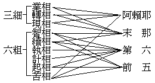

# 佛法總抉擇談
（1922 年 12 月，作）

昔基師既著唯識料簡，於法苑義林復有總料簡章之作。頃獲讀竟無居士之唯識抉擇談，十之八九，與吾意吻合無間。然以之專談唯識一宗，雖無不可，而置之佛法總聚中，則猶須為抉擇之抉擇焉！故今之佛法總抉擇談，即對於竟無居士之唯識抉擇談而作。

今作佛法總抉擇談，將以何為準據而抉擇之耶？曰：依三性。蓋三性雖唯識宗之大矩，實五乘法之通依也，故今依以為抉擇一切佛法之準據焉。而抉擇之先，當略明三性之梗概。

一者、遍計所執自性：其能周遍計度而倒執者，則六七二識煩惱相應諸心心所也。其所周遍計度以倒執者，則於一切依他起法周遍計度，不能適如其量，或增益之，或損減之，而倒執為圓成實也。云何遍計所執？謂計度彼依他起法，或增益之，或損減之，顛倒執為圓成實性。若達唯依他起而不起增損之二執，固無妨遍計焉！但遍計執自性即是倒執，倒執解即無所謂遍計執自性。故所計之依他起及所執之圓成實，概唯虛妄。

二者、依他起自性：依他所起之法，則一切有漏無漏之有為法是；以相用不空而無實自體為其自性。其所依之他，若分別言之，則眾緣是；若概括言之，則一切雜染依他起法皆依倒執起，一切清淨依他起法皆依正智起。然倒執由迷真如違真如故起，而正智由悟真如順真如故起。間接言之，則謂彼違真如之雜染法，由能迷真如之恆行無明起；彼順真如之清淨法，由所悟真如之二空真如起，亦無不可。

三者、圓成實自性：乃一切法圓滿成就真實之體，以無欠餘、不變壞、離虛妄為自性者。不變壞遮非依他起，離虛妄遮非遍計執，無欠餘表是圓成實。若依遣遍計執、斷依他起之所遣清淨、所斷清淨以言圓成實，則唯無為真如是圓成實。若兼能遣清淨、能斷清淨以言圓成實，則亦兼攝無漏有為是圓成實。若唯無為是圓成實，則佛果具圓成實及淨依他之二性，或兼離執之遍計性——唯識宗是；若攝無漏有為是圓成實，則佛果唯圓成實性——真如宗是。有處以真如、無為、與圓成實等量齊觀，故亦言佛果唯真如或唯無為——真如宗經論是。

依此三性以抉擇佛法藏，其略說依他起之淺相而未遣遍計執者，則人乘天乘之罪福因果教也，亦世出世五乘之共佛法也。其依據遍計之法我執，以破除遍計之人我執而棄捨依他起者，則聲聞乘之苦、集、滅、道、教也；亦出世三乘之共佛法也。至於不共之大乘佛法，則皆圓說三性而無不周盡者也。但其施設言教所依託、所宗尚之點，則不無偏勝於三性之一者，析之即成三類：一者，偏依托遍計執自性而施設言教者，唯破無立，以遣蕩一切遍計執盡，即得證圓成實而了依他起故。此以十二門、中、百論為其代表，所宗尚則在一切法智都無得，即此宗所云無得正觀，亦即摩訶般若；而其教以能起行趣證為最勝用。二者、偏依托依他起自性而施設言教者，有破有立，以若能將一切依他起法如實明了者，則遍計執自遣而圓成實自證故。此以成唯識論等為其代表；所宗尚則在一切法皆唯識變；而其教以能建理發行為最勝用。三者、偏依托圓成實自性而施設言教者，唯立無破，以開示果地證得之圓成實令起信，策發因地信及之圓成實使求證，則遍計執自然遠離而依他起自然了達故。此以華嚴、法華等經，起信、寶性等論為其代表；所宗尚則在一切法皆即真如；而其教以能起信求證為最勝用。

此大乘三宗之宗主，基師嘗略現其說於唯識章曰：『攝法歸無為之主，故言一切法皆如也。攝法歸有為之主，故言諸法皆唯識。攝法歸簡擇之主，故言一切皆般若』（法苑義林章卷三）。攝法、謂統攝法界一切法罄無不盡也。其所宗主之點，雖或在如、或在唯識、或在般若，而由彼宗主所統攝之一切法則罄無不同，故三宗攝法莫不周盡也。譬唯一中華民國之中央政府，或設之在北京亦統攝此全國，或設之在漢口亦統攝此全國，或設之在南京亦統攝此全國；其能統攝之中央政府設在地，雖有或北京或漢口或南京之異，其所統攝之全國則無異也。昔嘗以此三宗判攝中國大乘八家之學，除淨律分屬各宗外，其嘉祥、慈恩、禪宗、天台、賢首、密宗之六家，為表如下：


```
　　　　　　　┌簡擇主之般若宗…………………（即攝論之得此清淨）…嘉祥
　　　　攝一切│
　　　　法　歸┤有為主之唯識宗………………………………………………慈恩
　　　　　　　│　　　　　　　┌全體真如……（即攝論之自性清淨）…禪宗天台
　　　　　　　└無為主之真如宗┤離垢真如……（即攝論之離垢清淨）…賢首
　　　　　　　　　　　　　　　└等流真如……（即攝論之生境清淨）…密宗
```


然此三宗雖皆統一切法無遺，其以方便施設言教，則於所托三性各有擴大縮小之異。般若宗最擴大遍計執性而縮小餘二性，凡名想之所及皆攝入遍計執，唯以絕言無得為依他起、圓成實故。故此宗說三性，遍計固偏計，依他、圓成亦屬在遍計也。唯識宗最擴大依他起性而縮小餘二性，以佛果有為無漏及遍計執之所遍計者皆攝入依他起，唯以由能遍計而起之能執、所執、為遍計執，及唯以無為體為真如故。故此宗說三性，依他固依他，遍計、圓成亦屬在依他也。真如宗最擴大圓成實性而縮小餘二性，以有為無漏及離執遍計皆攝入圓成實，復從而攝歸於真如無為之主，唯以無明雜染法為依他、遍計故。故此宗說三性，圓成固圓成，遍計、依他亦屬在圓成也。

然此三宗，雖各有當，若從策發觀行而伏斷妄執以言之，應以般若宗為最適，譬建都要塞而便於攘外安內故。若從建立學理而印持勝解以言之，應以唯識宗為最適，譬建都中部而便於交通照應故。若從決定信願而直趣極果以言之，應以真如宗為最適，譬建都高處而便於瞻望趨向故。要之、於教以真如宗為最高，而教所成益每為最下，以苟非深智上根者，往往僅藉以仰信果德故。於教以般若宗為最下，而教所成益卻為最高，以若能絕慮忘言者，必成妙觀而發真智故。於教以唯識宗為處中，而教所成益亦為處中，以如實了解唯識者，雖或進未行證，而必非僅能仰信故。

由上來所說以觀之，起信論等與中、百論及唯識論各為一宗，而其為圓攝法界諸法之圓教則同；雖同為圓教而勝用又各有殊。依此，於諸教法抉擇記別，可無偏蔽。轉觀竟無居士所瑕玭起信論者，亦可得而論決矣。

嘗聞持賢首家言者，傳述竟無居士據起信論『依如來藏故有生滅心，所謂生滅與不生滅和合，非一非異，名阿黎耶識』一文，斥為同於數論自性與神我和合而生二十三諦之外道論；然吾未睹居士之著於文言也。但唐以來之誤解於起信論者，未嘗不可以此斥之，而非起信論之本義有斯過咎。起信論以世出世間一切法皆不離心，故就心建言，實無異就一切法建言也。一切法共通之本體，則真如也，即所謂大乘體。真如體上之不可離不可滅相——真如自體相，如來藏也。換言之、即無漏種子，亦即本覺，亦即大乘相大。所起現行即真如用，即能生世出世間善因果之大乘用。其可斷可離相，則無明也——一切染法皆不覺相。換言之、即有漏種子，即違大乘體之逆相；所起現行則三細六麤等是也。無始攝有順真如體不可離不可滅之本覺無漏種未起現行，亦攝有違真如體可離可滅之無明有漏種恆起現行，故名阿黎耶識；譯者譯為生滅不生滅和合爾。言依如來藏者，以如來藏是順真如體不可離滅之主，而無明是違真如體可離可滅之客，故言依也。又起信論宗在真如，從真如以起言，而此上真如門中唯以體名為真如，不可言依真如而有生滅。譬不可言依濕性有波浪，但可言依水有波浪，故取真如體上不可離斷之本淨相，言依如來藏也。標如來藏是主，不可離滅，而應離滅可離滅之無明有漏，亦此論宗旨之所存。譬如有一講檯於此，或言由植物成——喻唯識宗，可見其為物理學家；或言由原質成——喻真如宗，可見其為質化學家。於此可見此論為真如宗，亦然。

真如宗以最擴大圓成實故，攝諸法歸如故，在生滅門中亦兼說於真如體不離不滅之淨相用名為真如。以諸淨法——佛法——統名真如；而唯以諸雜染法——異生法——為遍計、依他，統名無明，或統名念；此起信論所以有「無明熏真如，真如熏無明」之說也。無明熏真如者，無明如目病，病彼體自離病之目——如熏正智或心之自證體——，而觀——熏——淨空之真如，有諸狂華。依淨空實不變生狂華言，言真如不受熏；據因目病所觀故，即淨空有狂華現，亦可寄言真如受熏。要之、其病（無明）共好目淨空（真如）相和合——熏——而有病目空華，可以喻此所云無明熏真如義。真如熏無明者：以一切淨法——真如體及於真如體不可離滅之淨相淨用，皆名真如故，一切佛法皆名真如；以一切染法皆名無明故，一切眾生法皆名無明。眾生見聞諸佛真如等流所示身言，而生起眾生信解思修真如熏無明也。以見聞信解思修故，而自內本具之無漏智種——真如，漸漸引起能熏破於煩惱——無明，亦真如熏無明也。唯識宗以擴大依他起故，祗以諸法之全體名真如，而真如宗時兼淨相淨用統名真如；此於真如一名所詮義有寬狹，一也。唯識宗於熏習專以言因緣，真如宗於熏習亦兼所緣、等無間、增上之三緣以言，二也。明此、則唯識宗正智現行唯識熏正智種子，無明現行唯熏無明種子，且不可言正智無明相熏，何況可言無明真如相熏！而真如宗則可言無明熏真如，真如熏無明也。二者各宗一義而說，不相為例，故不相妨。如聞擊柝，或言木聲，或言四大種聲，均無不可。

唯識抉擇談中，引被成唯識所破之分別論與起信論對例者凡二條，其第二條完全牛頭不對馬嘴，茲可不論。其第一條，心性本淨客塵煩惱所染污故，名為雜染，雖為小乘說假部之所計，成唯識論卷二，亦唯以其錯解心性本淨而破之，非並其所用教文破之也。故曰：「然契經說心性淨者，乃至名心本淨」云云。所本契經，述記謂即勝鬘經「自性清淨心難可了知，心為煩惱所染亦難了知」等文。解起信論者，復兼引楞伽經：如來藏是清淨相，客塵煩惱垢染不淨等文；則此固赫然契經之聖言也。乃竟無君僅視為分別論之說，連同起信破之，抑何謬耶？然唯識宗乃依用而顯體，故唯許心之本淨性是空理所顯真如，或心之自證體非煩惱名本淨。若真如宗則依體而彰用故言：『以有真如法故有於無明』；『是心從本以來自性清淨而有無明』——應如此斷句，不應於自性清淨字下斷句——。其所言之自性清淨，固指即心之真如體而亦兼指真如體不可離斷之淨相用也。此淨相用從來未起現行，故僅為無始法爾所具之無漏種子。所言從本以來自性清淨，不但言真如，而亦兼言本具無漏智種於其內。然此心不但從本以來自性清淨，亦從本以來而有無明——此心從本以來六字，應雙貫自性清淨及而有無明讀——為無明染而有染心，則無始有漏種子恆起現行而成諸雜染法也。雖有染心而常恆不變，則雖有漏現行，而真如體及無始無漏種不以之變失也。此在真如宗之聖教，無不如是說者。故基師於宗輪論記設問答云：『有情無始有心稱本性淨，心性本無染，甯非本是聖？答曰：有情無始心性亦復有心即染，故非是聖。又問：有心即染，何故今言心性本淨，說染為客？客主齊故。答曰：後修道時，染乃離滅，唯性淨在，故染稱客』。據此一文，亦可見於真如體不可離不可滅之淨相淨用，得稱為主之性淨也。此諸聖教可誹撥者，則攝一切法歸無為主之真如宗經論，應皆可誹撥之！故今於此不得不力辨其非也。

至立種子義不立種子義，除般若宗專破計執，當然不立之外；在唯識宗以擴大依他起性故，立法爾具染淨種子；而真如宗以擴大圓成實性故，諸有漏雜染種說為不覺，或名不相應染，故曰：『不相應義者，謂即心不覺』。諸無漏清淨種，說為本覺，或兼真如名如來藏，故曰：『二者相大，謂如來藏具足無量性功德故』。天台宗就全體真如以言，其所謂性具，亦種子義也，其所謂事造，亦現行義也。在真如宗宗依真如而起言說，義應然也。此則但取義立名之不同，而非於法有所增減。

君又謂起信不立無漏種子，於理失用義，於教失楞伽；以三細六麤連貫而說，於理失差別，於教違深密。以楞伽正智真如並談，而起信合為一故。然起信論於正智真如誠不定分，而有時亦不定合，如曰：『法身顯現——真如，智淳淨故——正智』。又曰：『法身、智相之身』。若據此必謂起信違楞伽者，亦可指唯識違楞伽！以五法分別——識、與正智並談，乃唯識則唯分別故；且亦可曰唯識於理失淨用也！彼既不然，此何云爾？至起信之三細六麤，古來解者誠多未善，嘗察起信全文，為表如下：




觀此、可知並非豎說八識，不違深密平說八識，亦不違差別也。

至於掌珍論偈與楞嚴一偈同，吾初閱藏時亦曾疑及之。但清辨護法於此偈雖未標明聖言，然亦未嘗標明其非聖言；而楞嚴屬密部之經，奘師所傳鮮及密宗，故皆不足致疑。而此一偈，依般若宗攝一切法歸簡擇主以擴充遍計執言之，有無為皆遍計所執境故，一切空故，亦無何過。護法等各據一宗以相辨，亦藉之以極顯自宗之義而已。

其十談中，餘說大都契同，間有一二處亦可以前文會之，故不復一一。比年遊目佛法藏者日多，往往因智起愚，自生顛倒分別以蔽其明！蓋其心習側重於是，即落窠臼，執此為是，斥餘為非，不能砉然四解，說法無礙！得吾說以通之，庶幾裂疑網於重重。

（見海刊三卷十二期）

