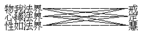
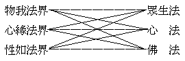
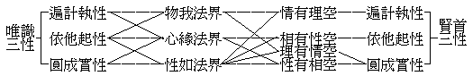
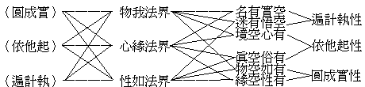
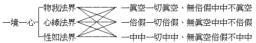
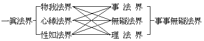

# 三重法界觀
（1922 年春，作）

## 目錄

- 前言
- 一　三重法界義
- 二　觀聖教三學
    - 甲　單觀
    - 乙　複觀
    - 丙　圓觀
- 三　觀佛華三法
    - 甲　單複觀
    - 乙　複圓觀
    - 丙　圓圓觀
- 四　觀法相三性
    - 甲　單觀
    - 乙　複圓觀
    - 丙　圓圓觀
- 五　觀天台諦觀
    - 甲　單觀
    - 乙　複觀
    - 丙　圓觀
- 六　觀賢首法界
    - 甲　單複觀
    - 乙　複複觀
    - 丙　圓圓觀


華嚴宗立四重法界：一、理，二、事，三、理事無礙，四、事事無礙，而統以一真法界。今以其所言者未切符心境，另立三重法界為法本，回互交絡以觀其義。

## 一　三重法界義

何謂三重法界？一、物我法界，二、心緣法界，三、性如法界。

一、物我法界者：物謂「各個體相」，我謂「個體主意」。不越此各個體相及個體主意之範圍者，則謂「物我法界」。若異生及二乘但見佛之應化身土，則雖觀佛亦不越於物我之域，觀餘更可知矣。故二乘之涅槃必灰身泯智而後證，即彼觀佛亦未至灰身泯智，則不越物我之範圍也。依此以觀之，則法界者物我而已矣。舉心動念無越於物我者，故契經云：『汝纔舉心，塵勞先起』。又云：『以生滅心辨淨圓覺，彼淨圓覺亦同流轉』。蓋除塵勞流轉無心境也。

二、心緣法界者：心謂「慮知靈覺」，緣謂「轉變依持」。觀一切法，無有越於慮知靈覺所轉變依持之域者，則謂「心緣法界」。在佛大士，雖觀地獄亦心識所變所緣境，於其自住三摩地境更可知矣。故登地大士，證法界不離心故，見佛身土相好無量。經云：「諸識所緣，唯心所現」。又云：「無有少法，取於少法」。蓋法界無非靈妙變通之心心所緣境耳。

三、性如法界者：性表「常遍真實」，如遮「變異虛幻」。都非變異虛幻之一切法，而一切法唯是常遍真實，強名「性如法界」。離名言相，離心緣相，法界泯絕，無說無證。

今用此三重法界觀，以略觀諸教義。

## 二　觀聖教三學

### 　　甲　單觀


```
　　　　物我法界………………戒、唯依此以辨持犯
　　　　心緣法界………………心、唯依此以辨定亂
　　　　性如法界………………慧、唯依此以辨真妄
```


二乘法中三增上學，要唯如此：戒唯止持，借作助止；心唯靜定，觀化取靜；慧唯滅真，厭生欣滅。由滅證真，滅尚非真。蓋但悟物我法界之患之空，未悟餘二法界之德之不空，故滅有患而取滅有患所成之空也。

### 　　乙　複觀


```
　　　　　　　　　　┌───────┐
　　　　物我法界──┴──────戒│
　　　　　　　　　　┌──────┘│
　　　　心緣法界──┴──────定│
　　　　　　　　　　┌──────┘│
　　　　性如法界──┴──────慧┘
```


大乘凡位三增上學，大致如此：戒曰心戒，定曰性定，慧曰空慧。若三論宗之慧當屬於此，利者能見性德不空，鈍者但見物患之空。

### 　　丙　圓觀




大乘聖位三增上學，義見於此：一、物患泯乎心性，性德充乎物心，心光炳乎物性，故曰金剛心地寶戒。二、心離乎物而契乎性，性持乎心而顯乎物，物現乎心而寂乎性，故曰海印三昧。三、性周遍乎心物，物交徹乎性心，心含照乎性物，故曰法界海慧。

## 三　觀佛華三法

### 　　甲　單複觀


```
　　　　物我法界─────────眾生法
　　　　　　　　　┌───────┘
　　　　心緣法界─┼───────心　法
　　　　　　　　　└───────┐
　　　　性如法界─────────佛　法
```


舉一心為眾生，亦舉一心為佛；心雖非生非佛，可為生佛交通，故得成無差別之義。

### 　　乙　複圓觀


```
　　　　　　　　　　　┌物我法界─┐
　　　　　　　　　　　│　　　　┌┴────心生滅相………眾生法
　　　　心法……眾生心┤心緣法界┤
　　　　　　　　　　　│　　　　└┬────心真如性………佛　法
　　　　　　　　　　　└性如法界─┘
```


大乘起信論之一心二門，可作如此觀法。

### 　　丙　圓圓觀




心者物之用，性者物之體，未有不具體用之眾生者，故眾生法全攝心法、佛法，平等平等。物者心之相，性者心之性，未有不具性相之心者，故心法全攝眾生法、佛法，平等平等。心者性之智，物者性之境，未有不具境智之佛者，故佛法全攝心法、眾生法，平等平等。如此乃極成三無差別義。

## 四　觀法相三性

### 　　甲　單觀


```
　　　　物我法界………遍計執性………妄執唯空
　　　　心緣法界………依他起性………從緣幻有
　　　　性如法界………圓成實性………本有如真
```


### 　　乙　複圓觀




### 　　丙　圓圓觀




如此方盡三自性、三無性之理。

## 五　觀天台諦觀

### 　　甲　單觀


```
　　　　假觀俗諦境………物我法界………真諦空觀智
　　　　中觀中諦境………心緣法界………俗諦假觀智
　　　　空觀真諦境………性如法界………中諦中觀智
```


初觀、從假入空，從俗入真，則從物我法界到於性如法界，證性如法界之空觀真諦境，成物我法界之真諦空觀智。次觀、從空出假，從真出俗，則從心緣法界又到物我法界，證物我法界之假觀俗諦境，成心緣法界之俗諦假觀智。三觀、從二入中，則從物我法界到性如法界，同時又從性如法界到心緣法界，故證心緣法界之中觀中諦境，成性如法界之中諦中觀智。此為次第諦觀。

### 　　乙　複觀


```
　　　　物我法界─┬─真諦空觀（此通大小乘，鈍者住偏空，利者入假中。）
　　　　　　　　　└─┐└────┐
　　　　心緣法界─┬─俗諦假觀　　│
　　　　　　　　　└─┐　　　　　│
　　　　性如法界─┬─中諦中觀　　│
　　　　　　　　　└───────┘
```


此亦次第三諦三觀：

### 　　丙　圓觀




此為一境三諦、一心三觀之圓融諦觀也。

## 六　觀賢首法界

### 　　甲　單複觀


```
　　　　物我法界──事　 法　 界─┐
　　　　心緣法界──理事無礙法界─┴事事無礙法界─┐
　　　　性如法界──理　 法　 界─────────┴一真法界
```


### 　　乙　複複觀


```
　　　　物我法界─┐
　　　　　　　　　├─事法界─┬────────┬事事無礙法界─┐
　　　　心緣法界─┤　　　　　├─理事無礙法界─┴───────┴一真法界
　　　　　　　　　├─理法界─┘
　　　　性如法界─┘
```


### 　　丙　圓圓觀




茲僅略明其致，廣開其義無盡。要之、「物我」者業所集生之假相，非體能覆於體，無用能礙於用，諸浮現世間者皆是。「心緣」者，果所由起之實用，非體能緣於體，無相能起於相，諸世間轉依者皆是。「性如」者，非業非果之真體，非相不住於相，無用不捨於用。若能心不隨物，心契乎性，則「物我」覆礙空，「性如」朗顯，「心緣」自在！成佛之要，無捷於此。

