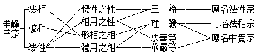
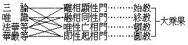

# 對辨唯識圓覺宗
（1922 年春，月作）

或曰：依賢首五教分判，則唯識乃大乘分教，與三論同為大乘始教，屬大乘權教攝；而圓覺則正為頓教，前綰終教，後通圓教，屬一乘實教攝。又依圭峰三宗分判，則唯識僅為法相宗，進之乃為三論之破相宗，再進之乃為圓覺法性宗。教相宗體，如此逈然不同，今乃和會以為一宗，其烏乎可？

辨曰：立名取義，判教分宗，意趣歧異，未應一割求齊。嘗觀天台之立藏通別圓四教，判三論為通別圓教，前攝藏教，後通別圓，而以通教為正；故今亦謂之大乘攝小宗，以其共般若猶為三乘之平等法也。判唯識則為別圓教，而以別教為正。——其判華嚴則圓兼別，而判唯識則別兼圓，雖無明文，其義必然。——獨但大乘，不通於小，歷別法相，不即於圓，故今亦屬之大乘不共宗，以其與圓覺同為大乘之殊勝法也。然在賢首於始教有分始、空始之二，其詮次則分淺，空深，遂謂天台之別教，僅為分始教，即圭峰法相宗；天台之通教，乃為空始教，即圭峰破相宗。天台以通為淺，以別為深，先後之序，已適相翻；但天台之通、別，要唯賢首之始教耳。故天台之圓教兼終頓教。即圭峰法性宗，非賢首純圓之圓教；顧天台亦譏賢首之圓教為兼別、圓，非天台純圓之圓教。二家之徒裔各據一勢以爭勝，迄今未有以論決也。然以何意趣成此歧異乎？蓋賢首之圓教本依唯識演增而相一貫，欲顯華嚴特勝，正由相近而恐相合，故設空始教、終教、頓教、三重隔離之。而天台之圓教本依三論演增而相一貫，為顯法華特勝，亦由相近而恐相合，故設別教一重以隔離之。今以淘融二乘法執入大乘之般若為無生法性宗，以大乘不共者為唯識圓覺宗。法華開示悟入佛之知見，佛知見即圓覺，融會三乘而歸存一大乘，即是由般若入圓覺；華嚴是佛本自住之大乘，正為圓覺；菩薩悟唯識得一切智智，果即圓覺；故皆總統於唯識圓覺宗。如此分判，似較賢首五教及圭峰三宗為允當，遍諸教文，亦無違難。

按梵士傳大乘教之本宗，蓋唯般若、瑜伽，般若為空宗、法性宗，瑜伽為有宗、法相宗。圭峰改名般若為破相宗，別依勝鬘、密嚴、楞伽、華嚴、法華、涅槃等，立為法性宗。夫如如不動為法性，而緣緣無盡為法相；圭峰所云法性，謂之法性固可，謂之法相亦無不可。且摩訶衍論以真如當體，以如來藏當相；謂圭峰所云法性是指真如言，毋寧謂其是指如來藏言。如來藏雖不遺體用，而於相義為顯，猶之真如不遺相用，而於體義為顯；故圭峰所云法性，不如謂之法相尤當也。究之法性、法相二名，義詮雖二，法實唯一。何者？性有體性之性，相用之性；相有形相之相，體用之相。相用之性乃是即相之性，故法華謂之實相，而涅槃謂之佛性，實無欠餘。體用之相，乃是即性之相，故楞伽謂之識海，而華嚴謂之法界，亦無欠餘。三論顯性，側重體性之性，唯以遮詮空一切法，殆同有主無賓，劣者未能入於具顯相用之不空性，然固當名之為法性宗也。唯識彰相，深探體用之相，雖以表詮立一切法，未嘗取貌棄神，悟者皆能證於全彰體用之如幻相，固可名之為法相宗，尤當與即相之性法華等，即性之相華嚴等，同名為中實宗也，乃圭峰於三論遺其法實，但名破相，於唯識似指其得假遺真，但彰形相，於相性之法華等及性相之華嚴等，又遺法相，單言法性而不彰性相不二之中實，似乎皆有未當！今將法義圖示如下：

由此觀賢首五教之大乘四教，亦可見為並入大乘妙覺海之四門，而決非如賢首家所排列為由淺進深之四階級也。先以圖示，後為說明：

般若宗以遠離蕩除一切法相，皆畢竟空而顯性真，若性顯即唯性亡相，則通禪宗，故黃梅、曹溪皆宏揚般若。若融一切法相皆等同於法性，則通天台，故天台教觀乃依智度中論流出也。瑜伽宗先分別離析一切法相皆唯識變而顯性真，次性顯則唯性亡相，同於禪宗，故少室傳楞伽以印心也。終乃即性起相而同華嚴。此其序次，閱天親三十頌甚明。天台宗法華等經宏融相同性之教，一根一塵皆是法界，一色一心無非中道，然圓教妙覺佛坐虛空座身同虛空，則又唯性亡相。賢首宗華嚴等經宏即性起相之教，珠網交羅，芥瓶炳現，無際無盡，無障無礙，然亦統唯一真法界，融相同性。由此四門，同入密嚴。但以無生法性乃根本智境，是大涅槃果。唯識圓覺乃後得智境，是大菩提果。一可攝小，一獨在大，故復分為二宗。

或謂古師嘗立十別以揀異於所云之法性宗及法相宗：一、一乘三乘別，二、一性五性別，三、唯心真妄別，四、真如隨緣凝然別，五、三性空有即離別，六、生佛不增不減別，七、二諦空有即離別，八、四相一時前後別，九、能所斷證即離別，十、佛身有為無為別。此若未能一一論決，則唯識圓覺猶不得為一宗也。辨曰：若依楞伽、密嚴、華嚴，統為唯識宗本之經，則彼所引以成立圓覺宗之義據者，原即唯識宗之義據，所宗既同，復何須辨！但此師意中之唯識宗，專屬在深密經及成唯識論——或專屬護法師言及窺基師言；故復逐條一疏解之。

一、謂法相之深密等經以三乘為實，一乘為權；法性之法華等經以三乘為權，一乘為實，故一乘三乘別。辨曰：約佛意則一乘為實，五乘為權，以一雨一地故；約生機則三乘為權，以三草二木故。一乘為實，說為一乘則權，因機起說，別被不定機故。——雖亦兼通餘機，專為則在於是。五乘為權，說為五乘則實，通被一切機故。又約融相同性門，則五乘權一乘實，即性起相門，則一乘權五乘實。故華嚴之無小唯大，異於法華攝小歸大，以顯佛乘最上乘之殊勝大乘。又華嚴或有國士說一乘，或二或三或四五，如是乃至無有量，異於法華廢多存一，以顯一乘無量乘之普容大乘。深密獨為第三時無上無容之中道了義，是顯殊勝大乘。又云普為發趣一切乘者，是顯普容大乘。故深密與華嚴同，而與法華涅槃異。然不足以別彼宗所云之法相與法性也，以法華、華嚴同是彼宗所云之法性宗故。餘義別見對辨大乘一乘。

二、謂法相則說佛性三無二有而有五性差別是實，皆有佛性是權；法性則說一切眾生皆有佛性是實，而說五性差別是權，故一性五性別。辨曰：佛性是如來藏異名，如來藏通攝真如及無漏智種，約融相歸性門指真如為佛性，故說皆有佛性；約即性辨相門指智種為佛性，故說五性差別。依第二門又有現實、展轉二門：約現實如是門，以十方三世不離剎那心故，則始終決定有五性差別，佛性三無二有。約展轉增上門，以唯為一大事、佛種從緣起故，則先後不決定五性差別，佛性可能皆有。然二二門皆不足為法性法相之別，以在彼宗同是法性宗故。

三，謂法相宗說八識從惑業生，一期報盡，便歸壞滅，以其識種，引起後識，依生滅識種建立生死因及涅槃因；法性宗立八識通如來藏，但是真如隨緣成立，故法相之唯心但妄，法性之唯心通真妄。辨曰：既為涅槃因，則已通如來藏矣。況成唯識論之說第八識，與起信論之說阿黎耶識，一為從淺達深，一為由深到淺之不同耳。故成唯識論第三云：『然第八識雖諸有情皆悉成就，而隨義別立種種名』：謂或名心，或名阿陀那，或名所知依，或名種子識等，此等諸名，通一切位——此即通如來藏，以無漏智種是如來藏故。或名阿賴耶，無學及不退菩薩位捨；或名異熟識，捨入如來地，此二可唯妄。或名無垢識，唯如來地得，此一則唯真。偈云：『如來無垢識，是淨無漏界，解脫一切障，圓鏡智相應』。且同卷釋「及涅槃證得」句，謂能所斷證皆依此識，則此識通為真妄之依，明矣。況第九又明真如即唯識實性，何得但取其局而不觀其通乎？

四、謂法相宗立真如常恆不變，不許隨緣；法性宗說真如具不變隨緣義，故真如隨緣凝然別。辨曰：不然。真如即唯識之實性，不離唯識有故隨緣，一切法常如其性故不變；若定執真如有能熏所熏，則反失不變義而僅隨緣義矣。故唯識真如具隨緣不變，而彼宗真如但隨緣耳！

五、謂法相宗依他是有，非即真空，經說空義，但約所執；法性宗則依他無性，即是圓成，故三性空有即離別。辨曰：唯識三十頌云：『由彼彼遍計，遍計種種物，此遍計所執，自性無所有；依他起自性，分別緣所生；圓成實於彼，常遠離前性。故此與依他，非異非不異；如無常等性，非不見此彼』。案此頌顯依他幻有，雖有而無遍計執所執之實有性故空，雖空而有分別緣所生之幻有相故有。於有依他起法若遠離遍計所執性，即圓成實，故曰：「圓成實於彼，常遠離前性」。此非依他無性即是圓成之義是何？故此語但欺未見成唯識論之人耳。

六、謂法相宗說一分眾生定不成佛，名生界不減；法性宗以一理齊平，故說生界佛界不增不減，故生佛不增不減別。辨曰：約融相歸性門，則一理齊平而生佛不增不減；約即性辨相門，則五性常別，而生佛不增不減。非辨於相，尚無生佛，說何不增不減？非歸於性，既執生佛，難免見增見減！故須二門以成其義，全則雙是，遍則兩非。然相徹性裏而徹性相表，表裏周圓，何德何失？夫生佛皆唯識，而識性即真如，於一切法常如其性，寧不一理齊平也哉？

七、謂法相宗真俗二諦迢然不同；法性宗第一義空該通真妄，故雖空不斷，雖有不常，故二諦空有即離別。辨曰：遍計俗有真空，依他真空俗有，圓成真有俗空。有亦該通真妄，空亦該通真妄；俗有空故不常，真空有故不斷，不壞、不雜，無障無礙。法相如是，未應執取其一而攻其一。

八、謂法相宗因滅非常，果生非斷，同時四相，滅表後無；法性宗則四相同時體性即滅，故滅與生而得同時；故四相一時先後別。辨曰：約法剋實，故曰同時四相；約義釋名、則云滅表後無。執名迷實，何至如此！且顯揚論及唯識述記等，明緣生法體性即滅，其文非一，何不稍窺？

九、謂法相宗根本、後得，緣境斷惑，義說雙觀，決定別照；以有為智，證無為理，義說不異，而實非一。法性宗則照惑無本即是智體，照體無自即是證如，故能所斷證即離別。辨曰：所斷能斷，能證所證，惑智智如，兩種能所，不即說離，不離說即；說離以審名實，說即以彰德能，不即不離，何乖何諍？

十、謂法相宗既世出世智依生滅識種，故四智心品為相所遷，佛果報身有為無漏，以生法必滅一向記故；法性宗既世出世智依如來藏，始覺同本，則有為無為非一非異，故佛化身即常即法，不墮諸數，況於報體？即體之智，非相所遷，故佛身有為無為別。辨曰：既云有為無為非一非異，約非一義以辨其異，報化異法，故唯有為；約非異義以彰其一，化報即法，故亦無為，何須自為矛盾！若歸融相所同之性，固如彼所云之法性；然辨即性所起之相，必如彼所云之法相。

此在古師設此為揀，已無當矣！後師依之衍為八重對揀，每重五義，從初對揀性相至八對揀同別，更屬繳繞無已！故今一切斷之，統立一唯識圓覺宗。

（見海刊三卷五期）

