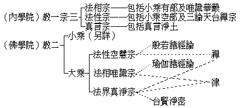

# 釋會覺質疑

## 目錄

- 一　質疑
- 二　釋疑

## 一　質疑

唯識宗義，乃就異生心上明一切法以歸唯識，方有斷惑、證真之無邊大用。法師謂依空後安立一切法相，就能立智邊，理固可然，而於唯識大用，似成虛設，以於異生不相應故，此可疑者一。因此破空前之法執非法相，正與唯識宗義適得其反，以唯識正在遮破二執使證入法性故，此可疑者二。反面言之，依空後之後得智安立之種種法相，遮執之空慧，雖不容施設一法，然亦不妨於空慧中幻有一切法相，正與空後建立法相似同，此可疑者三。果上佛智，雖為安立非安立圓融之一真法界，然亦不無空後種種法相，以捨此無所謂安立非安立圓融之一真法界故，此可疑者四。

前二間能成立，小乘法執正在唯識之所唯中，法相安立唯識，意正在此。後二問能成立，則於佛智空慧不應遮破，以於佛智空慧不無所謂空後之法相故。以如此法相安立唯識，則唯識大用仍在異生破執證真，復不應遮破小乘法執非法相，捨此、法相唯識宗義便成虛設故。

## 二　釋疑

大乘各宗，乃就其宗點所在而有區別；實則各宗皆攝諸法，平等平等。然以宗點所在不同，故其攝諸法各有破立詳略之不同。唯識之施設安立一切法相，其依以施設宗主者，即地上菩薩之空後後得智境，亦佛菩薩之如量智境，世俗諦智所了之非有如幻有境，天台教謂之不思議假。故曰：『非不見真如，而能了諸行，猶如幻事等，雖有而非實』。在廣明俗諦事故，所明偏詳異生心境；而此藏識海浪之異生心境，實依空後之智以明也。至令異生斷惑證真之效用，不惟唯識有然，即餘宗亦莫不然也。——釋疑一。小乘法執之非唯識之法相者，以非立而是所破故。若以所破之執混為所立之法相，則所破之一切外道法，亦應為大乘之法相。彼既不然，此何云爾？由是二乘法執亦在所破之列。——釋疑二。法性空慧宗以觀諸法畢竟空慧為宗點，故詳遮破空前之法執，而略安立空後之法相，不同唯識之法相。明此、則習大乘學之次第，當先從法性空慧宗而進法相唯識宗。——釋疑三。法界真淨宗，依佛果圓融智境明一切法，雙遮雙照，遮照同時，故異空慧，亦異法相。且唯識之施設法相，分別明了，真淨圓融，變動不居。又真淨宗偏詳佛菩薩智境，異於唯識之詳異生心境，故亦不可束之為法相，——釋疑四。然此三宗，基師法苑義林章，曾別攝法歸簡擇主，有為主，無為主。主即宗義，總抉擇談已援用。又可依據三性，唯識依依他起立一切法，空慧依遍計執遮一切法，真淨依圓成實明一切法。

今夏余在天童講楞伽時，成立一比量曰：諸法皆幻，隨心現故，如鬼見恆河為猛火。亦明如幻有法相宗唯識義。歐陽居士昔於內學院緣起曾立三宗，可與余所立對明其大概。

