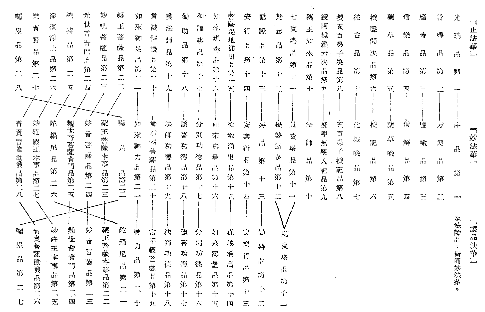

# 大乘妙法蓮華經懸論
（1934 年 4 月，在四明延慶寺講）

## 目錄

- 一　釋名
    - 甲　列眾名
    - 乙　定今名
    - 丙　析名義
        - １大乘
            - （一）大白牛
            - （二）大車
            - （三）僕從侍衛
        - ２妙法
            - （一）一切法妙
            - （二）教證法妙
            - （三）境行果妙
        - ３蓮華
        - ４經
    - 丁　綜名義
- 二　提綱
    - 甲　天臺絕待妙
    - 乙　嘉祥乘權實身權實
    - 丙　慈恩境行果
    - 丁　教理行果
        - １開佛知見信法華教分
        - ２示佛知見解法華理分
            - （一）顯法華理
            - （二）成法華解
            - （三）解理流通
        - ３悟佛知見修法華行分
            - （一）正說妙行
            - （二）流通妙行
        - ４入佛知見證法華果分
            - （一）證自利果
            - （二）證利他果
            - （三）證二利果
- 三　考經
    - 甲　佛經起源
    - 乙　佛經結集
    - 丙　佛經流布
    - 丁　本經翻譯
    - 戊　本經品次
    - 己　本經講誦

## 一　釋名

釋名、即五重玄義中的名；體宗用等，亦可攝入此釋名中。若收攝不盡者，可在提綱中攝盡。

### 　　甲　列眾名

此經之名，散布經中，種種不一。據天親菩薩法華釋論，可得十七名。普通諸經中所表經名，每多在佛說流通分時，由菩薩或聲聞啟問於佛，如說：『世尊！當何名此經？我等云何奉持』？然後由佛定出經名。惟此經不然，在佛未說此經之前，由佛入無量義處三昧，天雨四華，六種震動，彌勒質疑於文殊，文殊已將此經之名顯出。又如本經中諸品，處處皆點出此經之名，其非經後流通分中由問而說者可知。所謂十七名者：一、無量義：佛未說此經前，已說無量義經；蓋佛所證甚深，為眾生故，從一實相說無量義，故名。二、最勝：此經純圓獨妙，勝過四十年所說一切粗法故。三、大方等：即大乘義，如本經之標題是。四、教菩薩法：顯此經是教大乘菩薩法，非教小乘法，縱有小機在座，亦皆會歸一乘。五、佛所護念：顯此經微妙希有，為十方諸佛之所護念，如彌陀經等亦有為諸佛所護念語。六、諸佛祕藏，此經據諸佛所證所說之法藏，皆藏於此。七、（？）八、一切佛密字：言此經是三世諸佛所說百千旋陀羅尼等無量祕密咒，諸佛所有善巧言辭，攝盡無遺。九、生一切佛：由此微妙法，出生一切佛。十、一切佛道場：此為諸佛所坐之道場，即所證之菩提；此所證菩提，即妙法蓮華經，故此經可謂佛之道場。十一、一切佛所轉法輪：十方諸佛從根本智親證真如，為度眾生，起大悲心宣揚自證之法，聞者由此領解修習，輾轉悟入佛之知見，由佛自證法界，流轉入眾生心識中，使煩惱轉成菩提，生死轉入涅槃，佛與眾生間，如車輪之旋轉。三世諸佛出世之本懷，無非使諸眾生證佛所證，覺佛所覺，而此經皆已說故。十二、一切佛堅固舍利：諸佛一期化緣既畢，遂入滅度，而為利益將來人天，從色身遺留堅固之舍利子，使後人見相供養，種諸善根，舍利在世，亦猶佛之住世。故此經壽量品明佛壽命無量，時時處處示現成佛，為諸眾生開示悟入佛知見故，無量國土，種種教化。此法傳流于世，令人深入佛慧，亦同佛入滅時色身所遺留下來之舍利子。所謂『經典所在，即如來舍利之身』。是顯經中能詮之教與所詮之理，皆堅固不壞。十三、諸佛大巧方便：諸佛為利眾生，大權善巧，施設無量言教，凡有所作所說，皆為眾生成佛。然其說法，並無定相可得；如方便品所謂向佛前舉一手，低一頭，合一掌，一稱南無佛，生一念歡喜心，『乃至童子戲，聚沙為佛塔』；一與佛法發生關係者，法華開顯，皆當作佛。如經中所明聲聞等皆得授記，甚至破壞誹謗佛法如提婆達多者，亦得授記作佛。故依法華本意：若讚若謗，俱作勝緣而得成佛，諸根普被，法雨均霑，此之謂也。十四、說一乘：此經唯顯一佛乘法，所謂『十方佛土中，唯有一乘法，無二亦無三』；『諸佛所說，唯是一乘』。蓋佛陀平等意趣，無非欲眾生證悟一乘之妙法也。十五、第一義住：第一義住即最勝義，所謂『諸法實相，唯佛與佛乃能究盡』；『諸法寂滅相，不可以言宣』。正顯諸佛內自所證之妙真如性。此經以諸法實相為體，亦即由第一義住上顯明。十六、妙法蓮華：即今所標之題，詳解如下。十七、攝無量名句文身：不但前名所詮義理無量，即能詮之名句文身等言教亦復無量。普通人往往以為除此經外另有他經，其實即此一經，便可攝盡無量諸經，十方諸佛所有言教，皆不外乎此也。

上來所列十七名，在經文中，處處流露點示，非由有人請問于佛而定名者。不過其最著者，唯推妙法蓮華。雖示十七名，而亦更有其餘非能盡述者。

### 　　乙　定今名

諸經中有名此經為妙法蓮華，或加大乘二字，即十七名中第三大方等，亦即是大方廣，十二分教中方廣一分所攝。依瑜伽，小乘通十一分，大乘唯是方廣。故依大方廣言，此經亦可名大方等經。此經古今傳譯，名亦有別：如竺法護譯為正法華經，而鳩摩羅什與闍那笈多，則同譯妙法蓮華經。考梵文正、妙、二字，其義相近。但就正確愜適，恰到好處與佛意契合言之，故名為正；若就盡善盡美、莊嚴圓滿言之，則以譯妙為圓滿。故今十七名中，唯取第十六名妙法蓮華，定為今名；或如大乘二字，則兼取第三名而已。

### 　　丙　析名義

#### 　　　　１大乘

梵語摩訶，此土言大。大對小而言，非小非大，稱法性故大，絕待絕對故大；乘是運載義，佛所說法，依之信解修習，便可運出生死之海，載至涅槃之岸，故言乘。諸佛平等意樂，普令作佛，而眾生機隨有大小，不稱佛意，故運載有限；若明佛意，其運載力用無量無邊，故言大乘。諸經論明大乘義，說或不同：如大乘起信論，依體、相、用，三大，運凡夫眾生到如來地，乃為大菩薩所乘之大乘。依天台三德說：體大即法身德，相大即般若德，用大即解脫德。三德秘藏、為諸法之奧府，無所不包，無所不容，故言大乘。瑜伽七義顯大乘，就是：法大，心大，解大，淨心大，眾具大，時大，得大。若天台則以觀境，起心，善巧止觀，破法遍，識通塞，對治助，知次位，能安忍，修道品，無法愛之十法以成乘。古來諸師解釋大乘雖有種種，今直依法華譬喻品中所譬喻之大白牛車來顯大乘之自體，則此經從法立名，故名大乘經。若依喻立名，亦名大白牛車經。

##### 　　　　　　（一）大白牛

此喻根本智，即般若無分別智。諸佛以種種方便說法雖別，而無分別智所證無分別理，即法華諸法實相之理則同。其顯大白牛之殊勝有五義：一、膚色純潔，二、形體姝好，三、有大筋力，四、行步平正，五、其疾如風。此中膚色純潔，顯此般若智精純無雜，惑障不染。形體姝好，猶般若智之離過絕非。有大筋力，一、喻般若之智，無所不遍，無所不照，如大白牛具大筋力，任何法無不遍照。二、喻般若之智，在死生險道中得其自在，如大白牛具大筋力，衝鋒陷陣，出生入死，而無所畏避。三、喻般若之智，於煩惱魔、五蘊魔、死魔、天魔摧毀無餘，如大白牛具大筋力，所有怨敵，悉能摧折。行步平正，喻證理之智，不偏生死，不偏涅槃，寂照同時，無所側倚；如大白牛行四衢道，足步均齊，而無跛跌。其疾如風，喻般若之智，一剎那中深入法界，直登佛果菩提。

##### 　　　　　　（二）大車

喻後得智，即從根本無分別智上所起任運照法度生種種之妙智。經有十喻：一、其車高廣，喻佛後得智體，高徹三際，橫遍十方。二、眾寶莊校，喻後得智在菩薩因修萬差，果獲無量無邊功德莊嚴。三、周匝欄楯，喻佛所得陀羅尼，總持一切法而不散失。四、四面懸鈴，喻佛四無礙八音齊宣，能令聞者咸生敬信。五、上張幰蓋，喻四無量心，慈悲普覆故。六、珍奇雜飾，喻佛遍攝世出世間一切善法，無不為成佛之廣大方便。七、寶繩交絡，使大車堅固，喻佛因中修四弘誓願，果上為願力所動，任運能行四弘願法。八、垂諸華纓，喻佛行四攝法，攝化一切眾生；種種神通，駭動一切眾生；乃至十八不共法等，一一皆為攝化眾生之工具。九、重敷婉筵，婉筵指車床氈褥，喻佛後得智，能常與世間禪乃至出世間大乘無上深妙禪相應也。十、安置丹枕，車內巾枕以枕其頭，所以喻佛之後得智方便自在也。

##### 　　　　　　（三）僕從侍衛

喻佛果根本後得二智之大乘自體，圓照諸法性相，于平等性相中以種種善巧方便化五乘、三乘諸眾生，皆為佛乘之侍衛；亦猶大白牛車出發時，眾多僕從侍衛。總之、大白牛車，是顯大乘之自體，僕從侍衛是由大乘體所等起的五乘、三乘之種種教化，隨從大乘，為大乘所攝也。此依經文略釋大乘義竟。

#### 　　　　２妙法

美善精微之極曰妙，妙極于不可思議。法有二義：一、任持自性，二、軌生物解。任持自性者，諸法之相生住異滅，諸法之性本無遷變，所謂『是法住法位，世間相常住』。世間諸法，以眾生視之，變化無常；以佛慧視之，若有漏、若無漏，性相任持，古今不遷。軌生物解者，即此法爾如是之法，因隨見者之智慧淺深，學識厚薄，業力不同，種種知解亦別。例如依佛界觀，九界盡成佛界；依九界觀，各自所見，作別別解。所言妙法者，依法談妙，有總有別。智者玄義等總顯妙法，有相待妙與絕待妙。法華以前，粗妙對說，對三途法粗說人天法妙，乃至對菩薩法粗，說佛果法妙，是謂相待妙；法華會開，顯三乘同歸一乘，九界同歸佛界，妙外無粗，純圓獨妙，是為絕待妙。華嚴明五教，第五圓教又分別圓與同圓，顯華嚴超勝餘經之妙為別圓，而判法華屬同圓，不及華嚴。殊不知法華之同圓同妙，即絕待妙，所謂『粗言及細語，皆歸第一義』也。

別顯妙法，即法華跡門十妙與本門十妙。跡門十妙者：一、境妙，二、智妙，三、行妙，四、位妙，五、三法妙，六、感應妙，七、神通妙，八、說法妙，九、眷屬妙，十、利益妙。十妙次第相生，理極圓妙，藕益大師法華綸貫釋云：『實相之境，非佛天人所作，本自有之，非適今也，故居最初。迷理故起惑，解理故生智。智為行本，因於智目起於行足。目、足及境，三法為乘，乘於是乘，入清涼池，登於諸位。位何所住？住於三德秘密藏中。住是法已，寂而常照，照十界機，機來必應。若赴機垂應，先用身輪，神通駭動。次以口輪，開示宣導。既沾法雨，稟教受道，成眷屬妙。拔生死本，開佛知見，得大利益』。此為跡門十妙。

本門十妙者：一、本因妙，佛最初發菩提心，修菩薩道，所行之因。二、本果妙，本初所行圓妙之因，契得究竟常樂我淨之本佛果也。三、本國土妙，本既成果，必有依土，即最初在此娑婆成佛教化之本娑婆，為本國土妙。四、本感應妙，即證本時所證果已，慈悲誓願，機感相叩，即寂而照，教化眾生是也。五、本神通妙，即從本果所起神通妙用，教化可度眾生是也。六、本說法妙，亦即塵點劫前，八相成道所轉法輪，名本說法妙。七、本眷屬妙，本時說法所化之眾，從地湧出，彌勒不識，即本眷屬妙。八、本涅槃妙，本時所證斷德涅槃，緣盡入滅，為本涅槃妙。九、本壽命妙，即本時所有之壽命。十、本利益妙，即本時眷屬所獲之功德利益也。此為本門十妙。本跡十妙，其義深廣，今別以三義，簡略言之：——

##### 　　　　　　（一）一切法妙

法華未開顯前，四十年間所說有漏、無漏，有為、無為，若大小，若色心，若假實，若粗妙，千差萬別，相隔不融，雖說妙法，而實非妙。法華開顯，小大圓融，眾粗無不皆妙，一色一香，無非中道妙法，故云：『世間一切資生事業，皆與實相不相違背』；『是法住法位，世間相常住』；『佛種從緣起，是故說一乘』；『十方佛土中，唯有一乘法，無二亦無三』。凡有所說，皆是妙法；昔日三乘、人、天因果等法，一經法華開顯，無非無上菩提之妙法。諸佛為一大事因緣出現于世，無非使一切眾生開示悟入佛之知見，故方便品言：童子遊戲，皆已成佛；舉手低頭，皆當作佛。此法華之法，所以絕待絕對而純圓獨妙也。達此則不用分跡、分本、標章列段，自全顯以至一句一字皆妙法也！

##### 　　　　　　（二）教證法妙

佛法不出證法與教法，而法華教證皆妙。證法妙者，方便品云：『爾時世尊，從三昧安庠而起，告舍利弗：「諸佛智慧，甚深無量，其智慧門，難解難入，一切聲聞、辟支佛所不能知」』。此顯諸佛所證之法，甚深微妙，唯佛與佛乃能究盡，非一切聲聞、菩薩所能測度，即所證法妙。教法妙者，本品又云：『所以者何？佛曾親近百千萬億無數諸佛，盡行諸佛無量道法，勇猛精進，名稱普聞，成就甚深未曾有法，隨宜所說，意趣難解』。因所證法微妙甚深，故從自證法界中平等流出之教化法，亦復意趣甚深，不可思量。又云：『舍利弗！吾從成佛已來，種種因緣，種種譬喻，廣演言教，無數方便，引導眾生，令離諸著。所以者何？如來方便、知見、波羅密，皆已具足。舍利弗！如來知見廣大深遠；無量、無礙、力、無所畏，禪定、解脫、三昧，深入無際，成就一切未曾有法』。此等言教，皆顯如來教證法妙也。

##### 　　　　　　（三）境行果妙

法華顯佛自證之實相，暢佛說法之本懷，明三乘唯一乘，皆與授記成佛，是為境妙。依此妙境所起妙行，如安樂行品說如何修習四安樂行等，即是行妙。由修妙行，克證妙果，如壽量品等所明，即所成佛果之妙也。

#### 　　　　３蓮華

此經以蓮華喻妙法，故妙法為蓮華之所喻，而蓮華為妙法之能喻。古來解蓮華，可有三句：一、為蓮故華；二、華開蓮現；三、華落蓮成。為蓮故華，即華未敷時，蓮已發生。華開蓮現，即華果同時，微妙希有，不同其他梅蘭桃李等華華果不同時，或先華後果，或先果後華，或有華無果，或有果無華。華落蓮成，即華謝果存。具此三義，不同餘華，乃為蓮華獨勝特殊之義；故唯以蓮華可喻妙法。所喻妙法分二門：一、權實門，二、本跡門。權實門有三句義：一、為實施權；二、開權顯實；三、廢權存實。為實施權者，實即佛自證佛果之妙法，權是權宜，佛為適應機宜，開悟眾生，故從自住一大乘中，方便施設二乘等無量權教。雖說權教，非佛本意；蓋佛本意，是使個個眾生同成佛果，故雖說權而是為實施權，權即實家之權。開權顯實者，是因聲聞等不知為實施權，執權教為究竟，故至法華會上開四十年前之權，顯一乘妙法是實，使諸眾生預入佛流，故開權顯實，實即權家之實也。廢權存實者，法華會上，印可一切眾生，授記作佛，所謂『汝等所行，是菩薩道，舉手低頭，皆得作佛』。會三乘之權法，皆廣大之一實，則權名自失矣。若以蓮華合妙法，為蓮故華，即為實施權；華敷蓮現，即開權顯實；華落蓮成，即廢權存實。本跡門亦有三句義：一、從本垂跡；二、開跡顯本；三、廢跡立本。從本垂跡者，跡是釋迦如來應化身，從兜率降王宮，三輪說法，八相成道，所現之事跡。但考跡自何來，必有過去久已成佛之本佛，如雪中見腳跡，必有腳本，此之謂從本垂跡。開跡顯本者，如壽量品中揭開伽耶城出家之近跡，顯出久遠塵點劫前之本佛。若不開跡，云何知本？故須開跡顯本。廢跡立本者，未經法華開顯，不知本跡，既經法華開顯，了知法華會上跡中之釋迦，即久遠劫前所成之本佛，應化身即同報身、法身，報身、法身即應化身，三身即一身。既知本已，跡自廢矣。總之、從本垂跡，是佛應機設化之事實；開跡顯本，是佛說明真佛事實；廢跡立本，是由眾生了解真佛。若以蓮華喻之，為蓮故華即從本垂跡；華敷蓮現，即開跡顯本；華落蓮成，即廢跡立本。

然上來所述古解蓮華之義，似重蓮而輕華。直考經文言蓮華，乃簡別其非梅華、桃華而已，其意在華而不在蓮；如言梅之華、桃之華等，皆注重於華。故應是以此華之美妙莊嚴圓滿，以喻妙法耳。故在天親法華論中，有二義解釋蓮華云：一、出水義，蓮華生污泥而不為污泥所染，華開時出現于水外，其根猶在污泥之中；是喻佛從二乘粗法顯一乘妙法，而一乘妙法不離二乘濁水淤泥，然亦不為所染。經法華開顯，暢佛本懷，使出小乘淤泥，與諸菩薩同坐於蓮華也。二、蓮華開敷義，此言蓮華盛開，其形美麗，其香色光潔清妙，遇者歡喜。正顯法華會中授記成佛等種種身土功德莊嚴，聲聞、緣覺等諸弟子，皆能決定作佛，故聞者自知成佛，生決定信，猛勇精進，踴躍歡喜，亦猶蓮華盛開時使人歡喜親愛也。

今更以三義助明蓮華之義：一、優曇缽羅華靈瑞希有義：如方便品云：『諸佛出世希有難得，如優缽羅華時一現耳』。優缽羅華，即是金蓮華，其華於金輪王出世乃生，故為靈奇希有之祥瑞。正顯諸佛出世固希有，而說此法尤為希有，若優鉢羅華時一現耳，故以優缽羅華即蓮華喻之。二、芬陀利華潔白開敷義：正顯法華純圓獨妙，闡一乘實相之妙法，暢如來出世之本懷，是顯露非秘密，亦猶芬陀利華之潔白開敷也；故以芬陀利華即蓮華喻之。三、正敷蓮華微妙香潔義：此言蓮華盛開時，微妙香潔，莊嚴美麗，喻佛自所成就無量功德智慧，法財充溢，方便品所謂：『佛自住大乘，定慧力莊嚴』。綜上諸義，故以難能可貴之蓮華，喻希有無上之妙法也。

#### 　　　　４經

梵語修多羅，或素怛纜，義同音異，中國可直譯為線，有貫穿義。如珠花等物，以線貫穿，便成串而不散失；亦猶佛所說教法，結集成經，貫穿攝持所詮義理，使不散失，便可流傳後代。修多羅約別義說，是十二分教中之一分；若約廣義，凡佛所說，乃至菩薩、聲聞、人天等所說經佛印證者，皆稱為經。佛所說教，結集之不出修多羅與毗奈耶；修多羅是經，毗奈耶是律；而經為佛自說或由佛印定之至教量，極可信奉者。此與中國訓經為常義、法義，頗為相當，故譯之為經。或加一契字，譯為契經；契即契合義，言經有契機、契理之勝用。佛所說法，皆不與自證實相之理相違，而契合于正理，故曰契理。同時、佛說法時，必先鑒機，故凡有所說，皆與眾生機宜相投。如在本經之前，先說三乘等種種隔別之法，然後開顯一佛乘理，其中均含契機作用也。一切佛典，別為經、律、論三藏，若加雜藏為四藏，此經為三藏或四藏中之經藏所攝。

### 　　丁　綜名義

妙法蓮華、是法喻得名：妙法是法，蓮華是喻；蓮華是妙法之所喻，妙法是蓮華之能喻；妙法與蓮華並稱即法喻雙彰，以華喻法更顯妙法，故本經中以優缽羅等種種華喻妙法為蓮華也。若大乘妙法蓮華總合起來，亦顯此經非小乘教，是大乘教。大乘是通，通于大乘理趣，大方廣圓覺等諸大乘經；妙法蓮華是別，正名此經。故大乘與妙法蓮華，有通別之異。若再以大乘妙法蓮華經綜合言之，則大乘妙法蓮華是經中所詮之理，經與名句文身為能詮之教，故就能所詮上，顯大乘妙法蓮華是經之所詮理，經是大乘妙法蓮華之能詮教，故名大乘妙法蓮華經。

## 二　提綱

### 　　甲　天臺絕待妙

據天臺絕待妙之意，就可以妙法為本經之綱宗；以蓮華是喻，意在妙法。所謂絕待妙，亦即前說一切法妙義。若提此妙法為本經綱要，則法華全部，從始之終，更不須分章別段，隨拈一句一偈，即是妙法之全體大用，正所謂一色一香，無非中道；但以隨機方便，種種開示佛之境界，使見聞者皆入佛慧。『諸佛智慧甚深無量，其智慧門，難解難入』；諸佛由此能證之智慧，親證所證之諸法實相，此實相理，其相寂然，離四句，絕百非，非言說文字所能到，思量分別所能解，唯十方諸佛親歷其境者方知。然諸佛所證之實相妙法，非離眾生法外另有實相，即各各眾生皆是實相，故佛所覺悟，即悟眾生之所迷，眾生迷昧，即迷諸佛之所覺。悟此故起神通妙用于佛界，迷此故流轉苦輪於諸趣；同一妙法，迷悟有別。自佛智觀之，則『是法住法位，世間相常住』——常常時，恆恆時，法爾如是——若為無為，若漏無漏，若色心，若假實，無非諸佛所證之第一義諦妙法。故此經中處處顯示妙法，所現應化，即同法身；所有說教，皆從為令開示悟入佛智之平等意樂中流露出來；隨舉一句一偈乃至全經，無非妙法。正玄義所謂『提網之綱，無目而不動；牽衣一角，無縷而不來』。明乎此，則一大藏教以至菩薩、聲聞所說，及歷代祖師闡述佛意之典籍，無非妙法全體大用。是以天台智者大師，即以此法，判釋如來一大藏教。十方佛土中，唯此一乘實；不特佛法如此，即世間法如文化、教育、政治、法律、社會治安、產業資生等法，皆是一乘絕待妙法，所謂『世間資生事業，皆與實相不相違背』。即此絕待妙法，為本經之綱宗，若能握得此綱宗，則世間所有之法，皆會歸於佛法大海。地持經謂：『菩提當於五明處求』。五明者：一、聲明，即語言文字音韻學；二、因明，即論理學；三、醫藥明，即醫學、藥學；四、工巧明，即工藝學；五、內明，即為一切眾生生命心性之佛學。五明皆是實相妙法，佛子宜學。法華即以此一切法皆絕待妙法為綱宗，故不須節外生枝，另分章段。但在無章段中，亦不妨有千差萬別的章段，圓融不礙差別，差別不礙圓融，一多相攝，粗妙相融。如是妙法，亦即諸佛總持大陀羅尼，諸佛法無不從此陀羅尼中流出。故只一妙字，攝盡諸法，縱現身微塵剎土亦不能說盡也。

### 　　乙　嘉祥乘權實身權實

微妙法中，既不妨分章列段，古今諸家，說亦有別。通常科儀皆分序、正、流通、三分。法華七卷二十八品：序品即序分；從方便品至常不輕品為正宗分；神力品至普賢品為流通分。但三分中除序與流通，正宗分中分判章段，亦復甚多。天台智者大師，曾將全經分本跡二門，從方便品至安樂行品為跡門法華；從地涌品以下，為本門法華。此同三論宗嘉祥大師分乘權實與身權實：亦從方便品至安樂行品明乘權實，三乘為佛說之權，一乘為佛說之實。於中方便至提婆達多品，正明乘權實；持品、安樂行，是流通乘權實。自地涌至普賢，明身權實，由地涌諸菩薩所顯之本佛為實身，知今淨飯王宮出家所成之今佛為權身。於中地涌品、無量壽品，正明身權實；分別功德至普賢品，乃是流通身權實。此見嘉祥法華遊意。

### 　　丙　慈恩境行果

慈恩法師法華玄贊，以境、行、果、三法為全經之綱領而疏釋之：法華實相之境，無量甚深，諸佛智慧，難解難入，其所說五乘、三乘等法，皆是一乘實相之妙境；從方便至持品，皆明實相妙境。安樂行與地涌，明由一乘妙境——教理——所起之妙行；故如地涌中上行、無邊行等菩薩，皆依行立名，為一乘妙行之象徵。從壽量至不輕，明由一乘妙行修得之一乘妙果。從神力品下，皆是流通境行果三之文義也。

### 　　丁　教理行果

方便品云：『諸佛為一大事因緣故，出現於世；所謂欲令眾生開、示、悟、入、佛之知見』。開示悟入佛之知見，換言之，即是：信教、解理、修行、證果。即此一句，為本經之綱要，亦三世諸佛出世之本旨也。教是開佛知見所說之教，理是示佛知見所顯之理，行是悟佛知見所起之行，果是入佛知見所證之果。若依此四義觀本經，則本經自不必與通常經典分序正流通三分相同，即一序品已總顯教理行果，開示本經綱要無遺。如佛從三昧放光現種種行，文殊答彌勒疑問等，已將全部經意，昭然揭露于各人六根門頭，洞然明白，不蔽纖塵。故序品可說是總示法華教理行果；其餘二十七品，是別示法華教理行果也。開佛知見信法華教，示佛知見解法華理，悟佛知見修法華行，入佛知見證法華果，今且分段略言其義。

#### 　　　　１開佛知見信法華教分

開佛知見者，法華會上，開三乘權顯一乘實，『汝等所行，是菩薩道，漸漸修行，皆當作佛』。諸弟子眾自知皆有成佛之可能性，斷疑生信，決定信受佛所教語。自方便品至法師品，皆是開佛知見信法華教。其說法主為釋迦佛，聞法眾首領為舍利弗。此九品中：一、三周說法，攝前八品；二、普記流通，攝後一品。三周說法者：一、法說一周，即方便品，明諸佛出世度生，皆令成佛，上根舍利弗信受佛教，授記作佛。二、喻說一周，即譬喻品說火宅喻，迦葉等悟入；信解品，諸弟子眾信解領受，說窮子喻；藥草品，三草二木，一地所生，一雨所潤，佛再印成；授記品為中根迦葉等授記作佛。三、因緣一周，會眾中下根猶有未信受者，乃復說化城品，因此五百弟子及學無學眾，悉皆作佛。二、普記流通者：即後法師品，不論當時在會不在會，若現在，若未來，若此土，若他土，皆悉授記作佛，使人於法華教生決定信，故不但當時無量人天等眾已得佛授記，即我等及未來無量眾生，亦已蒙佛授記矣。

#### 　　　　２示佛知見解法華理分

示佛知見解法華理，攝經中見多寶佛塔品，提婆達多品，持品，安樂行品。示、即將佛所知見之法華妙理，顯示於人，使人了知教所詮理，領解洞徹。此分說法主亦是釋迦佛，其聞法眾有隨從多寶佛及分身佛來之智積菩薩等，及此土憍曇彌等諸比丘尼，而以文殊師利為領袖。以自寶塔品後至提婆達多品，說文殊從海中龍宮而出，領諸菩薩而為上首。安樂行品中亦由文殊問佛：『於後惡世，云何能說是經』？故以文殊為上首，但云何知此分是示佛知見解法華理耶？

##### 　　　　　　（一）顯法華理

多寶佛塔品是顯示法華所詮之理，此理為三世諸佛所同證同說，古今不二。普通托事觀理，達到理妙之觀想猶淺，而此寶塔品則更進一層，托理示事，由無形段之法華的抽象理，涌出多寶佛塔的具體事，示以五重不二妙理：由多寶佛證明釋迦佛此經為過去佛所同說。過去所說的法華，即今日所說的法華，古今不二；又由開寶塔時，釋迦與多寶同坐，亦顯古今佛同證不二之理。開塔前釋迦召分身諸佛雲集，釋迦為主，諸佛為賓，諸佛為主，釋迦為賓，隨舉一佛皆可為賓主、即賓主不二。同時釋迦為總，餘佛為別，餘佛為總，釋迦為別，一佛攝多佛，多佛攝一佛，佛佛相攝亦復如是，即成一多不二。一釋迦佛法身，即是無量諸佛法身，無量諸佛法身，即同釋迦佛法身，所謂平等會中，無自他之隔別，即是自他不二。再由釋迦三變淨土，將此五濁污穢之娑婆，一變而為琉璃莊嚴之淨土，諸佛集會，萬聖垂光，即此土而攝取他土，他土亦攝取此土，即成淨穢不二。由此五重不二，顯示法華妙理。唯是顯法華妙理，必藉文殊妙智，由文殊妙智方解法華妙理，故來下品。

##### 　　　　　　（二）成法華解

由提婆達多一品，即成法華妙解。其中隨多寶佛來之智積菩薩，既受釋迦佛法，欲還本土，佛乃告以此土有文殊師利，智慧甚深，可與之研討佛法。因此、文殊率領海藏龍宮所化之眾，從海而出，理智相應，妙法理契。智積為理中之智，文殊達智中之理，由此品文殊妙智契前品五重不二之妙理，亦即以前品五重不二之妙理，成此品五重不二之妙解。五重不二妙解者，即在與文殊俱來之龍女成佛，與舍利弗等問答，及提婆達多授記等文中流露顯示。舍利弗等雖於開佛知見信法華教，不過信仰佛語而已，尚有勝劣、逆順等觀念差別，至今示佛知見，解法華理，差別觀念不復可得。故其中所現之龍女，乃屬三惡趣罪報之畜類所攝，而其修善聞法成佛，即屬福報，正顯罪福平等不二。凡欲界動植物中，皆有陰陽二性，而龍女是女性，為人所輕賤，如舍利弗言：『女身垢穢，非是法器，云何能得無上菩提？佛道懸曠，經無量劫，勤苦積行，具修諸度然後乃成。又女人身，猶有五障』。然龍女以寶珠獻佛，『當時眾會，皆見龍女忽然之間變成男子，具菩薩行，即往南方無垢世界，坐寶蓮華，成等正覺』；正顯男女平等不二。又眾法會中，舍利弗等髮白面皺，眾中長老，而龍女年始八歲，依文殊智解法華理，正顯長幼平等不二。再自提婆達多言之，其毀謗三寶，造五逆罪，生生世世為邪見外道，違逆于佛，死入地獄；而佛乃言：『由提婆達多善知識故，令我具足六波羅蜜，慈悲喜捨，三十二相，八十種好……成等正覺，廣度眾生』；乃至授記，於當來世，作天王佛，是顯逆順平等不二。又同一法會，同一時間，舍利弗等正見者授記，而提婆達多等邪見者亦授記，正顯邪正平等不二。由自他等五重不二妙理，證成罪福等五重不二妙解，提婆品妙解既成，寶塔品妙理更顯矣。

##### 　　　　　　（三）解理流通

前開佛知見信法華教，是以法師品為普記流通；今示佛知見解法華理，是以持品、安樂行品為流通。然此流通可分二種：一、持經人；二、持經行。持經人者，即是持品。此理、法華須解理始能流通，理不解即不流通。故前分富樓那等比丘雖皆授記作佛，而憍曇彌等比丘尼因感女報，不敢有所希冀。及此分解法華男女平等妙理，乃亦請佛授記，流通是經。但在法師品普記流通，將未來眾生皆與授記，故當時諸比丘尼眾亦已授記。然此品為明不但諸大菩薩發願流通是經，即諸比丘尼眾解法華理，悟男女平等亦皆為流通是經之人也。二、持經行者，即是安樂行品。文殊問佛，於後惡世云何奉持此經？佛說四安樂行，使其信法華教，解法華理，修法華行，即能流通是經。以上寶塔、提婆達多、持、安樂行四品，以示佛知見解法華理為綱宗。

#### 　　　　３悟佛知見修法華行分

前依教解理，此從理悟達佛之知見，親悟諸法實相妙理，由悟妙理而起妙行，方是真修。修有緣修與真修二種：緣修、是依教理而修，真修、是悟真理而修。此悟佛知見所起之行，正是真修。此攝地涌至囑累八品。其說法主，亦為釋迦佛，即應化身而成報身、法身，王宮出家之跡身，即久遠劫前成佛之真身，為此會之教主；其當機之眾，為地涌諸菩薩，及為常不輕所教化之跋陀婆羅等眾；其領眾者為彌勒菩薩，以地涌品有彌勒之問，始說壽量品等諸品。在此悟佛知見、修法華行之八品中，可分二段來說。

##### 　　　　　　（一）正說妙行

正說妙行，又分四節：一、依果起行，二、藉行彰果，三、示功勸修，四、舉德作證。

一、依果起行：悟佛知見，是由悟佛果所知見法而起行，故其行乃從果智而起。如從地涌出諸菩薩，當時會眾，皆不認識，蓋從佛果地所起修之行，決非其他由因起行的會眾所能覺知。故從果起行，即指從地涌出之上行、無邊行諸菩薩，皆從果行上立名，是依佛果法界而修行，故因中起行諸菩薩眾，乃至補處彌勒亦不識也。爾時彌勒欲自決疑、及決眾疑而問佛，此等菩薩依誰發心修行能作如是神變耶？而佛則答言：是無數阿僧祇從地涌出諸菩薩，皆是我在此娑婆世界成道教化之眾。於時彌勒等諸菩薩眾，疑竇橫生：『如來為太子時，出於釋宮，去伽耶城不遠，坐於道場，得成阿耨多羅三藐三菩提，始過四十餘年，云何於此少時大作佛事，教化如是無量菩薩眾』？『父少而子老，舉世所不信』？因決眾疑，開跡顯本，說壽量品，皆此依果所起之行引發也。

二、藉行彰果：即藉地涌等依佛果法所起之行，彰顯壽量品佛所得果之久遠。釋迦曾在此成住壞空之娑婆世界出家成佛，而非僅今日伽耶城出家成道之釋迦，乃是塵點劫前出家成道之釋迦，此則藉上行等而彰佛果長久也。其實佛果無量壽命，亦由因地修得，壽量品言：『我本行菩薩道，所成壽命，今猶未盡』。正顯釋迦本因地中修成佛果壽命，歷劫相續，今猶未盡，則藉因中所修之行彰佛果長遠也。

三、示功勸修：悟佛知見，依佛果所起法華妙行，即此妙行所依之佛果法，乃是佛果自受用法樂，妙用無量，深不可測，故曰：『盡思共度量，不能測佛智』。『新發意菩薩，供養無數佛，了達諸義趣，又能善說法，如稻麻竹葦，充滿十方剎，一心以妙智，於恆河沙劫，咸皆共思量，不能知佛智』。佛自受用果法，唯佛與佛親自證得，他皆莫測，但唯依信心接受此果法而奉行，即可得此妙用。故如密宗三密加持，皆為大日如來果上之法，專心修習，即得果法妙用，所謂『一念加持一念佛，念念加持念念佛』。故悟佛知見修法華行，即是依果上之法而行，妙用不可思議。如平常說有思議行與不思議行：思議行如修五戒、十善得人天報，依諦、緣、度得三乘果，皆可思議；若依佛果法修習之真言行、淨土行等，則妙用難測，是為不可思議之妙行也。如世間自食其力者，因勞作幾何苦工，便得幾何代價作衣食住等，種瓜得瓜，種荳得荳，作如是因，得如是果，盡人皆知。然如窮子遇長者，衣衫襤褸之丐兒，忽變擁資巨萬之富翁，則瞠目難思矣！依佛果法修行，其所得妙用，亦復如是。故分別、隨喜、法師三功德品，皆顯持佛果法之微妙功德，勸令修行，便得妙用。如法師品明父母生身之肉眼，徹見三千大千世界，肉身能攝現大千國土，皆依法華果法加持之力所得妙用。雖密宗所謂由加持力，即身成佛，猶勿能及之也。故法華果行，以密宗眼光觀之，誠密法中最上密法焉。

四、舉德作證：即舉常不輕品之常不輕菩薩，受持法華一句之功德作證。所謂一句者，即是：皆可成佛。故云：『我不敢輕於汝等，汝等將來皆當作佛』。凡有見者，童叟無欺，頂禮膜拜，作如是說；此皆依信心接受法華所起妙行，故成就今日釋迦牟尼之功德與偉大，即其證明也。

##### 　　　　　　（二）流通妙行

神力品與囑累品，是流通此妙行，顯此妙行依果法起，最極殊勝，諸行中最勝，依此修習，現身能得殊勝妙用。故神力顯種種神變，更加囑累以流通是不思議妙行也。

#### 　　　　４入佛知見證法華果分

由悟佛知見修法華行，依法華行趣入究竟，即圓成法華妙果。自藥王至普賢六品，皆明入佛知見，證法華果。此分教主，亦是釋迦；法眾首領、則推普賢。由此六品，合前二十二品，即成法華七卷二十八品。但此六品，可作二番看法：初番一、藥王品是證自利果；二、妙音等四品，是證利他果；三、普賢品是證二利果。次番一、藥王品證十住果；二、妙音品證十行果；三、普門品證十向果；四、陀羅尼品證四加行果；五、妙莊嚴品證十地果；六、普賢品證等妙覺果。今說如下：

##### 　　　　　　（一）證自利果

藥王證果，依天台圓教登初住，可八相成佛。但此為大乘通義，起信、唯識，理亦相同。故前法師功德品證果乃初住前之果；此藥王品以下是證初住至等覺之果。又法師功德為因行，因行成就之圓滿功德，為法華果；而此品是藥王菩薩修法華行，觀諸法空，燒身燃臂，供養如來，證二空理，成就斷德，解脫生死，證得自利妙果。

##### 　　　　　　（二）證利他果

妙音等四品，是證利他果。前藥王是證入十住，此妙音是證入十行；觀音是證入十迴向；陀羅尼是四加行；妙莊嚴是證入十地；普賢是由等覺證入妙覺也。妙音等四是證利他果者，一、妙音密化：其未現入法會時，使眾起希有之心，生難遭之想；既入法會，使會眾得眾三昧及陀羅尼，皆是佛果法身自受用身平等普熏，不可思議密化之利益。二、觀音救苦：尋聲救苦，無剎不現身，是即大悲利他，證利他果；正同佛果應九界之機，現他受用身應菩薩機，現三類變化身應二乘、六凡機。佛果功用不可言示；故妙音以法身密化，觀音現三身普應也。三、陀羅尼品之祕咒妙用：能破惡生善，若有毀謗是法、摧殘是法者，皆使降伏，變為讚歎是法、擁護是法者。如佛果所現之金剛神等，種種妙用，無非摧邪顯正、破惡為善之功德也。四、妙莊嚴王是迴邪入正：妙莊嚴王，本是邪見不信佛法，由妻及子施設種種神變與方法，始信佛法捨邪迴正。是故此皆證利他之果也。

##### 　　　　　　（三）證二利果

普賢一品，證二利果。果前普賢修因行圓滿而證佛果，是證自利果；果後普賢起行教化眾生，屬證利他果；故以果前果後之普賢，為證自利利他之妙果也。

法華全經二十八品，由前所說四分，有總有別：序品是總持開示悟入教理行果分；餘二十七品是別顯開示悟入教理行果分。每分之中，各別有流通分，而以普賢品末二行為全經之總流通分。照通常講經分科之通規，則必以序、正、流通之三分判釋此經。但流通分須居經後，而經中間時有流通之文，似覺參差不齊，有流通不能攝盡之慨！若依今所列四分判此全經，即可免去參差不整之慨。至以此四分為全經之綱宗，示妙法之至理，昭然若揭，猶其餘事矣。

## 三　考經

考經、是考佛經中此經之歷史。凡佛所說之經典，有事實可證，歷史可稽，方可正信；否則、魚目混珠，真偽莫決，殊難置信。同時、經為佛說，通於諸經，考一經之源流，諸經亦由此顯焉。

### 　　甲　佛經起源

佛、通三世諸佛，經、乃諸佛所說之經。若此土，若他土，諸佛無量，故其所說經典亦復無量；諸佛無始無終，起相不可得故，經教之始起相亦不可得。但雖無量，且舉三千大千世界中一四天下之一的吾人所居之南瞻部洲言之，在此賢劫之中，過去已有拘那含牟尼等三佛，而此三佛所說經教，皆已過去不傳。蓋每一佛法，必經歷正、像、末法之三時期，末法既盡，經教亦沒。故今所流行之經典，皆為賢劫中降誕于南閻浮提之第四釋迦佛所說，或佛所印定之說，始結集成經，流通于世。是知今所流傳之經典，皆起源於釋迦之金口宣揚，故今娑婆世界佛教以釋迦為本師也。雖然，今法華經中，通說三世諸佛教法，但因釋迦說之，吾人方知，故猶以釋迦為起源；而十方三世諸佛所說教法，亦因釋迦說教而顯示，故今必以釋迦為經教之起源也。由釋迦所說一切法中，深密、華嚴等大乘經，阿含、樓炭等小乘經，大小、偏圓、權實之理，皆已發揮無遺，均在佛世流傳。作如是解，可破執小乘法者，言佛唯說阿含等經，大乘經典為後世龍樹菩薩等闡演而出；而對密宗陀羅尼等密典，更加懷疑。故從古來有許多研究之歷史考據家，每以陀羅尼等密典，為印度後期佛徒混合婆羅門所偽造。若正信佛一切教法皆出於佛，則此等邪疑皆宜息滅。須知諸佛智慧，無量甚深，隨眾生種種性欲好樂，大小、偏圓，陀羅尼等無量差別教法，無不施設；蓋佛為大事因緣故出現於世，欲使一切眾生開示悟入佛之知見，若有一法不說，即攝機不盡。故知一切佛教，皆起源於佛，依此決定勝解則知現存一切經典，皆因釋迦佛轉法輪而有也。

### 　　乙　佛經結集

佛世說法，唯金口宣揚，而無文字記載。如法華會上為無量若干眾生而說法華，佛為教主，依佛音聲中名句文身為能詮教體，詮所詮之義理。但當時說法唯有言音、而無文字，云何有後世流傳經教？即因佛弟子結集經典故，使經典輾轉流傳於後世也。梵語結集，此言會誦，就是結集一經，須召大眾會集，推一人於中朗誦而出，經眾磋商考慮決定，認為所誦之言教與佛說相符，曾經佛印定者，始一致贊成，全體通過，然後寫為定本，讀誦流通。相傳佛初滅度，迦葉、阿難、優波離等便在畢波羅窟中結集經律；同時窟外大眾意見不一，在畢波羅窟外，復有富樓那等結集。如是乃至第二結集，第三結集，以致無量經典流播後世，但由文字流傳於世之經典，謂皆出於結集，似亦不然，因結集會誦時，亦仍並無文字。反之、則在佛世時，亦或已有文字，毗奈耶中說佛世時，就有長者深夜讀經，四天王來聽法。又有紺容夫人，夜燭讀經。諸如此類，皆可證明佛世時代已有文字，方能讀誦。又古來傳說：佛在靈山說法華時，所有樹皮木葉之上，滿刻經文，其已有文字記錄流傳者可知也。在經過結集會誦時，更可有文字記錄，經大眾考定之定本。但由文字流傳於後世之經典，亦有始終未經會誦結集而流傳者，如印度佛教史中，弟子所誦經句，往往分別記誦，互有出入，即其例證。平常皆知初次阿難等結集經典，此不過最顯著之若干經律之結集，為舉世所共知共信者。其實、佛經由歷代菩薩祖師等所集錄而流通者，正復不少，亦久為世所公認。故佛經有因佛世記錄而流傳，有於佛後結集而流傳，有始終未經會誦而由私家流傳於世者。

### 　　丙　佛經流布

佛經之流布，以時節因緣之不同，流布不流布有別。當時結集記錄之經典。緣熟者得人傳播，緣缺者隱沒不彰，比比皆是。如中國至宋時始有大藏刻版，多有從未流行於世之經典，皆得保存其中。但推之佛世到宋前，亦必多有未流行之經典，其時既無刻版藏本，必有若干經典，因不傳而隱沒，亦顯然易知。例如今於燉煌石室，發現若干古人所藏之經典，為今宋藏等所無，而隱沒於石室中者，尤為顯然證明之事實。佛後經典隱沒不傳，亦復如是。以當時專靠記誦口傳，其講誦著者，始獲傳布；其他為普通不常講誦者，難免隱沒不彰，雖存若亡。但此類湮沒之經典，在某一時期，經若干智慧深厚者發現講誦於世，則由隱沒復成顯彰矣。如是觀察，佛世與佛後之經典，皆為聲聞、菩薩之所記錄結集，而佛寂之初，小乘經典因聲聞眾傳誦普遍，得先流布於世。其時大乘經典以少人講讀，隱沒不彰；但時節因緣一熟，復得傳播於世。若大乘經典佛初滅時隱而不彰，在佛後六七百年間，馬鳴、龍樹菩薩出世，發現若干大乘經典乃講傳於世；及無著、天親出世，復發現若干大乘經典，遂又傳誦於世。乃至龍智出世，復發現陀羅尼等密咒儀軌，傳持於世。故向所不傳之經典，一經少數智慧深厚者發現講讀，仍可隱而復顯。如中國之三論宗，隋唐之間極為弘盛，自唐以後，其氣燄一落千丈，宋明後人皆莫知其名，向所弘盛之經疏，亦隱沒失傳！迨至清季自日本取回，今日始復弘講；中國如此，佛世亦然。佛世所有大乘經教，雖亦同時記錄結集，而佛後五百年間所流傳之經典，唯是小乘。迨至龍樹、無著、龍智出，而大乘次第傳布；是為大小乘佛經流布之次第。是知今日所講之法華經，是由佛初滅時聲聞菩薩、所記錄結集；而得流行於世，則在龍樹時代。考諸印度佛史，理宜如此。道宣律師弘傳序云：『蘊結大夏、出彼千齡』，知此經在印度一千年，始流入中國。又『東傳震旦，三百餘載』，此為道師唐時所言；迄至今日，其流傳千五六百年矣。

### 　　丁　本經翻譯

本經翻譯，自西晉永康至隋代仁壽，三百載間，翻譯共有三次。今經前刊：姚秦三藏法師鳩摩羅什奉詔譯，為本經第二次之譯本。今從道宣律師之法華弘傳序，可窺見三次翻譯之概況。

1.『西晉惠帝永康年中，長安青門，燉煌菩薩竺法護者，初翻此經，名正法華』。西晉是簡別東晉。西晉惠帝永康年間，正出初次翻譯之年代。長安是西晉之都城，青門是城之一門，是出譯經之地點。燉煌菩薩竺法護者：燉煌是西域地名，竺法護是燉煌人，時人尊稱燉煌菩薩。竺法護、梵音竺曇摩羅剎，亦作曇摩羅察，中國譯竺法護，姓竺、名法護也；此出譯經之人名。其所翻者，名正法華，是出此經最初譯出之名字。

2.『東晉安帝隆安年中，後秦弘始，龜茲沙門鳩摩羅什，次翻此經，名妙法蓮華』。初次翻譯，是西晉之末年，此第二翻譯，是東晉末年。東晉安帝隆安年中，正是東晉之末；後秦弘始，是三秦中之姚秦；此皆出第二次翻經時代。龜茲沙門者，龜茲、是西域三十六國之一，在今新疆。沙門是梵語，此云勤息，勤修戒定慧，息滅貪瞋癡。鳩摩羅什是梵音，此言童壽，以其童年具耆德故名，此出翻譯之人名。其所翻經名，則為妙法蓮華，即今所講者是。

3.『隋代仁壽，大興善寺北天竺沙門闍那笈多，後所翻者，同名妙法』。此第三次翻譯，是在晉秦之後，經宋、齊、梁、陳數代，至隋朝仁壽年間，始翻此經。大興善寺，在今陜西西安，為當時翻經之地。天竺、今譯印度，皆譯音之異；義譯月邦，以其地形半島如月也。印度有五印度，此所指者是北印度。闍那笈多、此言德志，顧名思義，可知其人。其所翻經名，亦名妙法，與什翻相同。

此三譯中，初名正法華，後二同名妙法蓮華；故蓮華皆同，而正妙稍別。但三譯義理，亦互有出入，其所弘盛，首推什翻，故道師云：『三經重沓，文旨互陳，時所宗尚，皆弘秦本』。道師唐時人，自秦至唐，皆弘秦本；直至今日，仍以秦本最極弘盛。蓋羅什為七佛以來譯經第一人，其所譯經，文義舒暢，善達佛意，故不但此法華經以什譯為最弘盛，即如金剛經等，流布於世者，亦皆以什譯為最弘盛也。綜上明法華自印度入中國有三譯，三譯中又以什譯弘傳最盛，則姚秦三藏法師鳩摩羅什奉詔譯之理亦彰矣。

### 　　戊　本經品次

本經之增減與品次之次第，三經頗有出入。有言：秦譯與隋譯妙法蓮華，皆祇二十七品，以秦譯無提婆達多品，而隋譯將提婆達多品附於寶塔品後，未曾獨立標出。但隋譯較晉譯，又於光世音品下添入偈頌，故亦名添品法華。而秦譯之提婆達多品，則係後賢加入。若依智者大師說，則什譯原有二十八品，不過提婆達多品是當時譯留宮中，未編入流行而已。此為三經品文之增減不同。又囑累品，什譯在二十二品，其他二譯皆在最後二十七、八品，此為前後次序不同。此等增減次序，古來記載，亦難盡考。道宣弘傳序言：『自餘支品別偈，不無其流，具如序曆，故非所述』。然添品法華序——失作者名——述頗詳晰，茲摘錄於此：『昔燉煌沙門竺法護，於晉武之世譯正法華。後秦姚興更請羅什譯妙法蓮華。考檢二譯，定非一本；護似多羅之葉，什似龜茲之文。余檢經藏，備檢二本，多羅則與正法符會，龜茲則共妙法允同；護葉尚有所遺，什文寧無其漏？而護所闕者，普門品也；什所闕者，藥草喻品之半，富樓那及法師品等二品之初，提婆達多品，普門品偈也。什又移囑累於藥王之前；二本陀羅尼並置普門之後；其間異同，言不能極。竊見提婆達多品及普門品偈，先賢續出補闕流行。余景仰遺風，憲章成範。大隋仁壽元年辛酉之歲，因普曜寺沙門上行所請，遂共三藏崛多、笈多二法師，於大興善寺，重勘天竺多羅葉本，富樓那及法師品之初，勘本猶闕；藥草喻品更益其半，提婆達多通入塔品；陀羅尼次神力之後；囑累還結其終，字句差殊，頗亦改正』。又近人日本境野黃洋氏所著之支那佛教史講話——上卷第二編第一章鳩摩羅什之學統——中，對三譯品文之增減，品序之前後，品名之不同，製有一表，今錄出以見其詳：——

原表正法華無梵志品，僅二十七品，今依清藏本加入，故亦二十八品。又原表並列卷次，而以秦譯為八卷，與今本不符，故將其卷次刪去。

### 　　己　本經講誦

道宣律師弘傳序云：『自漢至唐，六百餘載，總歷群籍，四千餘軸，受持盛者，無出此經』。則此經在中國講說與誦持之弘盛，實打破諸經之紀錄。不特自漢至唐六百餘載間弘盛如此，即迄今一千五六百年間，其弘傳誦持亦何嘗不如此耶？故古今誦持是經之比丘等，其感應道交開示悟入者，亦復無量：如智者大師讀藥王本事品：『是真精進，是名真法供養如來』，朗然大悟；如寧波天童開山義興祖師，在太白山讀誦此經，感太白星化為天童送供；如慈谿普濟寺之法華肉身菩薩，肉身不壞，亦因誦持法華功德所致；如湖州白雀寺總持比丘尼葬後，其墳上出青蓮華，考蓮華乃自其舌根中生，是非生前口誦法華所致乎？如梁光宅寺法雲法師，因梁武求雨，講法華經，即得感應。諸如此類，誦講是經而得感應者，不可勝計。又古來大德講經，於諸經每有抑揚，唯對此法華，無不信重。故諸經之弘盛，及其注疏之多，亦以此經為最。依此所起之功德，讚莫能窮！故現前聽經大眾，宜於此妙法蓮華，起敬重心，生難遭想，頂戴奉持！

（守志記）（見海刊十五卷六期）

