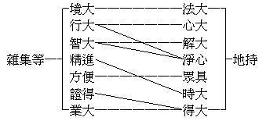

# 大乘入楞伽經釋題

## 目錄

- 一　分釋
    - 甲　大乘
        - １列古說
            - 一　大乘起信論依眾生心法立體用相大義及乘義
            - 二　依雜集論七種大性相應故名大乘
            - 三　大乘莊嚴經論以八事總攝一切大乘
            - 四　攝大乘論以十殊勝攝大乘法
            - 五　天台圓教以十法成大乘
        - ２出今釋
            - 一　境大故
            - 二　行大故
            - 三　果大故
        - ３會異說
        - ４正兼釋
            - 一　正取於行
            - 二　兼攝境果
    - 乙　入
        - １互為能所入
        - ２別約能入行
    - 丙　楞伽
        - １約能喻釋名
        - ２約所喻顯義
            - （一）顯險城之所喻義
                - 一　染藏海——阿賴耶
                - 二　幻境風
                - 三　轉識浪
                - 四　我執山
                - 五　三有城
                - 六　四倒入
                - 七　瞋恚王
                - 八　煩惱眾
                - 九　殘害業
                - 十　生死苦
            - （二）顯寶城之所喻義
                - 一　淨心藏——如來藏
                - 二　佛法興
                - 三　悟本心
                - 四　真如山
                - 五　涅槃城
                - 六　法空入
                - 七　妙定通
                - 八　大慧辯
                - 九　法界身
                - 十　願方便
    - 丁　經
- 二　合釋


## 一　分釋

### 　　甲　大乘

此中但釋大乘名義，抉擇諸乘，別詳宗地。大者、表此乘大，揀餘小故，具有當體名大及簡小名大之二義。乘者、以能運載比車乘故，但取能轉運裝載之用義。表此是乘中之大者，乘有其大——有財釋——，大即是乘——持業釋——，故名大乘。然此大乘依何法立？又分四節明之：

#### 　　　　１列古說

##### 　　　　　　一　大乘起信論依眾生心法立體用相大義及乘義

論曰：『摩訶衍者，總說有二：一法，二義。所言法者，謂眾生心；言眾生心，則攝世間出世間諸法』。故此眾生心，即出依以立大乘義之法本者，下依此明體等大義及乘義故。然舉眾生心攝世間出世間法，又不啻總依世間出世間法立大乘義也。大義有三：一、體大義，依眾生心示一切法平等不增減之真如性為大乘平等體故。二、相大義，依眾生心自體上不可離斷滅除之如來藏淨法為大乘勝德相故。雖有情心性亦無始本染，以淨法起時染可離斷滅除故，非是心之自相。又此取心本淨性立大乘相，故不取心之染相。三、用大義，依眾生心順修之能生世出世善因果為大乘廣多用故。雖眾生心逆擾之亦能生世出世惡因果，此但取順生之善明大乘用故，不取逆生之惡。依此三義，故名為大。即此大法，諸佛本所乘故謂之佛乘，諸菩薩乘此到如來地故曰菩薩乘。體相用大即乘，於一心法上有大義、乘義，名大乘也。

##### 　　　　　　二　依雜集論七種大性相應故名大乘

一、境大性者，以諸佛所說廣大教法為所緣故。二、行大性者，自利、利他二利行故。三、智大性者，我空、法空二無分別智故。四、精進大性者，三阿僧祇修行無疲厭故。五、方便大性者，不住生死及涅槃故。六、證得大性者，佛地功德悉圓滿故。故、業大性者，應現十方化眾生故。莊嚴論大同，瑜伽、顯揚論小異。古譯地持（即瑜伽菩薩地）：一、法大，方廣乘上故。二、心大，菩提心上故。三、解大，菩薩大解故。四、淨心大，行解地淨故。五、眾具大、福德眾具故。六、時大，三阿僧祇劫故。七、得大、菩提上果故。二者相較，開合之異如下：




##### 　　　　　　三　大乘莊嚴經論以八事總攝一切大乘

頌曰：『性、信、心、行、入、成、淨、菩提勝，如是八種事，總攝諸大乘』。釋曰：『此以八事總攝一切大乘。八事者：一、種性，如種性品說。二、信法，如信品說。三、發心，如發心品說。四、行行，如度攝品說。五、入道，如教授品說。六、成熟眾生，謂初七地。七、淨佛國土，謂第八不退地。八、菩提勝，謂佛地。菩提有三種，謂聲聞菩提、緣覺菩提、佛菩提，佛菩提大故為勝，於此佛地示現大菩提及涅槃故』。

##### 　　　　　　四　攝大乘論以十殊勝攝大乘法

一、所知依殊勝，建立阿賴耶故。二、所知相殊勝，明遍計、依他、圓成三自相故。三、入所知相殊勝，觀諸法唯識故。四、彼入因果殊勝，六波羅密多行故。五、彼因果修差別殊勝，地前十地差別故。六、增上戒殊勝，饒益有情故。七、增上心殊勝，大乘光明定等故。八、增上慧殊勝，法空無分別智故。九、彼果斷殊勝，無住涅槃故。十、彼果智殊勝，無上菩提故。

##### 　　　　　　五　天台圓教以十法成大乘

一、觀不思議境——其車高廣，二、真正發菩提心——又於其上張設幰蓋，三、善巧安心止觀——車內安置丹枕，四、以圓三觀破三惑遍——其疾如風，五、善識通塞——車外軫，六、調適無作道品——有大白牛肥壯多力等，七、以藏、通、別等事相法門助開圓理——又多僕從而侍衛之，八、知位次令不生增上慢，九、能安忍策進五品而入十信，十、離法愛策於十信令入十住乃至等妙——乘是寶乘遊於四方直至道場。其以藏、通十法亦能成聲聞乘等，今此是取其依法華圓教成大白牛車大乘者。

#### 　　　　２出今釋

##### 　　　　　　一　境大故

境大有二：一、真如性平等體故，二、諸法唯識宗要義故；即真俗二諦為所緣境故。此真俗二諦，亦可云唯識性相，亦可云一真法界與四法界或理事法界，亦可云諸法實相與眾緣生法，亦可云法性與法相，亦可云無為與有為，亦可云離言自性與假說自性，亦可云非安立諦與安立諦，如是等眾多異名皆明境大。

##### 　　　　　　二　行大故

行大亦二：萬行圓修成勝德故，二空妙慧為導前路故。菩薩行以福慧均等，悲智兼大，自他俱利，權實雙運，由大精進遍能策發無量波羅密多行為殊勝相故。又一一行由我空法空之二空無分別慧——或智或觀——以導其先路，遂皆成無得不思議行故；所謂應無所住而生布施持戒等心者是。

##### 　　　　　　三　果大故

果大亦二：無住涅槃為證得故，無上菩提為究竟故。此二全同攝論所明彼果斷，彼果智之二殊勝。四涅槃中獨取無住，不共二乘故。又聲聞、獨覺猶有所知障故，非正等覺，不名無上菩提。

此三大六法中，一真如性為本，一實相印所印定故。無上菩提為極，一心專志所志求故。此二為諸大乘教之通義，異茲則非大乘教故。然宗要義，諸經有別。此經大分明如來藏藏識，故諸法唯識為宗要，亦可以諸法唯智為宗要，如來藏是智淨相故。故大乘教總有三宗：一、法相唯識宗，諸法唯識為宗要故。二、法性唯慧宗，二空妙慧為宗要故。三、法界唯智宗，無上菩提為宗要故。本經遍攝三宗，尤重初後，廣如宗地所明。

#### 　　　　３會異說

一、起信心法及大義皆境，其乘義為行果。二、雜集等七法：初為境，二至五為行，六、七為果。地持則二至六為行，初境，後果。三、莊嚴八法：一、二通境、行，三至七為行，八為果。四、攝論十殊勝：一、二為境，三通境、行，四至八為行。五、天台十法：初一通境、行，能觀為行所觀為境故；後九皆行。

#### 　　　　４正兼釋

##### 　　　　　　一　正取於行

謂諸乘皆取行為乘之當體故，行正是能運載法故。人乘者、謂三皈、五戒之行，運載行人越於三塗，生於人間。天乘者、謂上品十善及四禪、八定行，運載行人越人入天。聲聞乘、緣覺乘者，謂四諦觀行、十二因緣觀行，運載行人越三界到有餘、無餘涅槃。大乘者，謂悲智六度萬行，運載菩薩越三界二乘到無上菩提大般涅槃。故法華云：『若有眾生從佛世尊聞法信受，勤修精進，求一切智、佛智、自然智、無師智、如來知見、力、無所畏，愍念安樂無量眾生，利益天人度脫一切，是名大乘』。

##### 　　　　　　二　兼攝境果

行所依起，故兼攝境；行所趣至，故兼攝果。瑜伽四十六云：無上大乘七行相者：一、離言說事，一切法中所有真如無分別平等性出離慧。二、此慧所依。三、此慧所緣。四、此慧伴類。五、此慧作業。六、此慧資糧。七、此慧得果。當知由此七種行相施設建立無上大乘無不周備。此中慧即法空妙慧。慧伴類、慧作業、慧資糧，即慧所導修之萬行等。慧所依、或心或真如，慧所緣、則真如及一切法；此二明「慧行」所依起而及於境。慧得果、即二轉依果，明「慧行」所趣至而及於果。故乘之正體，是行而兼攝境果。依此釋法華大白牛車喻，則不同天台教之十法成乘說。一、大寶車，是萬行圓修之勝德，亦悲智圓融之無得不思議行。其大白牛，是法空無分別妙慧——此出世間無得不思議智及根本無分別智。地前未得，故地前菩薩同索之。由根本無分別智導生不思議萬行智故，如大白牛引運寶車。大白牛車所行地，是「慧所緣」義。大白牛車所由造成之材力，是「慧所依」義。遊於四方直至道場，是「慧所得果」義。雖不離境果而乘正是行。決然可知，別詳宗地及法華講演錄。

### 　　乙　入

宋譯無「入」而魏唐譯有之。依所入處之甚難，顯能入行之不易；題此入字，殊有深意，今以二節明之：

#### 　　　　１互為能所入

佛法分為教、理、行、果，此之四法可互為能入與所入。經卷四云：『菩薩摩訶薩善於語義，知語與義不一不異，義之與語亦復如是。若義異語，則不因語而顯於義，而因語見義，如燈照色。大慧！譬如有人持燈照物，知此物如是，在如是處。菩薩摩訶薩亦復如是，因語言燈，入離言說自證境界』。此明可由言「教」入於「理果」。又卷三云：『第一義者，是聖樂處，因言而入，非即是言』。此唯「果」證為所入第一義，明言「教」亦有能入功。然就親入，依信教悟理則教為能入，理為所入。由解理起行，則理為能入，行為所入。從修行證果，則行為能入，果為所入。因證果施教，則果為能入，教為所入。自悟悟他，因果交徹，故得互論能所入也。若統親疏及超越入，教為能入，有十二句：


```
　　　　　　　　┌─教
　　　　　　　　├─理
　　　　　　　　├─行
　　　　　　　　├─果
　　　　　　　　├─教理
　　　　　　　　├─理行
　　　　以教入─┤
　　　　　　　　├─行果
　　　　　　　　├─果教
　　　　　　　　├─教理行
　　　　　　　　├─理行果
　　　　　　　　├─行果教
　　　　　　　　└─果教理
```


理與行及果為能入，亦復如是。於佛法中論入，不逾乎此。

#### 　　　　２別約能入行

此經入楞伽之入義，雖於教、理、行、果亦可通為能入所入，其特殊處，則在專約「能入行」以言「入」。又分二節明之：

一、約能喻是神境通入險城：羅婆那王獻華宮殿，佛及聖眾乘以入摩羅耶山頂之楞伽城。摩羅山頂既最崇而最嚴，楞伽城中實難往而難入！蓋孤懸於海濱，其為險一；乃夜叉之所據，其為險二。此天險之靈地，非具五神通之神境通者，不能入之。顯難入之能入，故云入焉！此就能喻之事象如是以言者。

二、約所喻是法空慧入寶城：楞伽寶城所喻之勝寶城，則實相無相一真如性為體之無住涅槃也。具足無邊無漏功德之寶，故云寶城。法華經曰寶所，涅槃經曰寶渚，皆用此寶城喻。寶城現成，非有之難而得入難。常在寶城，非進入難而「相應」難。唯照達諸法畢竟空妙慧，能如如相應於實相無相之真如涅槃城。相應曰「入」，非出入於其中曰入，此入最勝，遂標舉為題也。

### 　　丙　楞伽

#### 　　　　１約能喻釋名

楞伽乃說經處之城名也。古譯不可往、不可入。又、釋迦毗楞伽，譯能勝寶，故楞伽亦譯為「勝寶」。今按說此經處之城，就「形勢」為不可往不可入之義，在南海濱——即今錫蘭島之有佛跡處——上寬下狹之摩羅耶山上，且為飛行食肉之夜叉等聚居，故為險城。就「體質」為勝寶之義，此城為天然勝妙珍寶之所成。偈云：『此妙楞伽城，種種寶嚴飾，牆壁非土石，羅網悉珍寶』。至今其地亦為採珍寶處，故為寶城。險、寶雙具，曰楞伽焉。

#### 　　　　２約所喻顯義

夫楞伽城依摩羅耶山而位於海濱，海有風浪，城為夜叉所居；佛從海出而入於城，現通說法，聖眾圍繞。有如是等重重相關之事，昔嘗合明為十六義，今就險城、寶城別之，各為十義：

##### 　　　　　　（一）顯險城之所喻義

能喻險城就形勢言，而以有漏雜染界為所喻，分為十節：

###### 　　　　　　　　一　染藏海——阿賴耶

諸雜染法之含藏海，曰阿賴耶，為五趣、三乘之異熟心海。卷二云：『藏識海常住』，此通聖凡、染淨之所依以言者。然舉染藏阿賴耶海，則淨識之如來藏海寄焉；舉淨藏之如來藏海，而染藏阿賴耶海亦寓焉。故以城山所依之海，喻根身、器界之集起心也。此心是依他起之本，為真妄性所依。圓成實之真如，於此離妄而顯；遍計執之妄法，於此迷執而起，故首明之。

###### 　　　　　　　　二　幻境風

根身、器界皆藏識變，業幻似境，如有實空。如是心起，如是境現無有少法能取少法。於此不明，即為無明，以無明故起心取境，曰無明風。以取境故，境塵擾心，曰境界風。此無明境界風，鼓盪藏海，經云『境界風所動』也。

###### 　　　　　　　　三　轉識浪

風鼓藏海，意等諸識隨境界緣相續而起，如海中浪。經云：『種種諸識浪，騰躍而轉生』是也。

###### 　　　　　　　　四　我執山

七、六二識不達唯識無我，於阿賴耶見分及五蘊和合假，執為人之實我；又於根塵等法，執為法之實我。人法二我之山，乃巍然高聳於心海、境風、識浪之上，愈高愈大。所以下小上大，作不可往相。又憨山觀記，傳摩羅耶山但影現於風雨昏黑之夜。亦顯二執之山，乃無明邪見之妄現，本空無實。夫二我本空，原無可取，而夜叉王往來其中，亦為不可往而往義。

###### 　　　　　　　　五　三有城

我執山上有欲有、色有、無色有之三有城——三有城即無安如火宅之三界——，此山不滅，則恆住此三有城中，生死流轉，無斷絕時。斷分別、俱生我執盡時，則離分段生死。斷分別、俱生法執盡時，則離變易生死也。

###### 　　　　　　　　六　四倒入

夜叉王等於我執山三有城中，無常計常，無樂計樂，無我計我，不淨計淨；乘此四倒，往來出入於本空寂不可往入之山城中也。

###### 　　　　　　　　七　瞋恚王

夜叉眾等通喻煩惱雜染之有漏法，而取瞋恚以為王者，根本之瞋與忿、恨、惱等，皆為煩惱中最麤猛故，唯欲界故，唯不善故，菩薩四他勝處之第一故，瞋恚起時暴惡之相殘害之業尤熾盛故。為十根本、十小隨之首惡，故喻為十首之夜叉王也。

###### 　　　　　　　　八　煩惱眾

其夜叉眾，正喻根隨諸煩惱法，煩擾惱害為其性故。夜叉羅剎擾害五趣、四生，猶煩惱之雜染乎三界心、行使皆成有漏心也。

###### 　　　　　　　　九　殘害業

夜叉王眾合為煩惱雜染，此殘害業為業雜染。以易知之夜叉眾殘害業，以喻三界有情之所行皆為殘害業。若法華經火宅品之所明，蓋無常有漏之苦界，非殘害他身不能謀自身生存，故謀自身生存即為造殘害業，等於夜叉，此所以無常且苦也。

###### 　　　　　　　　十　生死苦

此生死苦，明生雜染，由殘害他以自生存，以死得生，雖生必死；為求生之所逼，成必死之相迫，遂無日不在生死逼迫之苦中。夜叉如是，三界有情亦然。

##### 　　　　　　（二）顯寶城之所喻義

能喻寶城就體質言，而以無漏清淨界為所喻，亦分十節：

###### 　　　　　　　　一　淨心藏——如來藏

諸清淨法之含藏海曰如來藏，在生佛平等為真如，在有情為本有新生無漏種現，在佛果為無漏界不思議善常安樂解脫身大牟尼法身。經初言佛在「海」龍王宮中說法，又言佛從「海」出，此海即喻淨心藏之如來藏海。

###### 　　　　　　　　二　佛法興

佛悲願故，又有情之機感故，佛從海出，即佛興世。佛言：我今亦當為羅婆那王開示自所得聖智證法，即法興世。

###### 　　　　　　　　三　悟本心

羅婆那王聞佛言音——聖教為增上緣——，遙知如來從龍宮出——龍宮喻佛法性身自受用身土，即如來藏海之正體；從龍宮出，即起他受用及應化身土——，梵、釋、護世、天龍圍繞，見海波浪，觀其眾會，藏識大海、境界風動、轉識浪起，此即悟聖凡共依之藏海本心，即藏識即如來藏也。

###### 　　　　　　　　四　真如山

由悟本心，則轉我執山為二空所顯無相真如性山。故憨山觀記傳：摩羅耶山，當晴明時，海湛空澄，即無蹤影。偈云：『過去無量佛，咸昇實山頂，世尊亦應爾，往彼寶嚴山』！

###### 　　　　　　　　五　涅槃城

由二空智擇滅二障二死皆盡，即依真如說為究竟安樂之大涅槃，具足無邊無為無漏勝功德寶，故即喻以除垢山上之勝寶城，譬晴空湛海中唯光明充滿也。偈云：『此妙楞伽城，種種寶嚴飾，牆壁非土石，羅網悉珍寶』。

###### 　　　　　　　　六　法空入

無相真如之除垢山，圓明妙寂之涅槃城，孰能如如相應契入？曰：唯法空般若。經云：『時羅婆那即以所乘妙華宮殿奉施於佛——修法空慧迴因行向佛果——，佛坐其上，王及菩薩前後導從——同乘法空慧也——，無量綵女歌詠讚嘆供養於佛——依法空慧具修萬行，皆迴因行向佛果也——，往詣彼城』，是乘法空慧入涅槃城義。

###### 　　　　　　　　七　妙定通

如來入楞伽已，楞伽法會中之羅婆那王及夜叉眾，即喻無漏禪定神通。故夜叉等興諸供養，佛為現諸神通變化，廣如華嚴十定、十通品明，即如來覺海中之大定也。

###### 　　　　　　　　八　大慧辯

大慧及一切摩帝菩薩眾，在除垢勝寶法會中，當喻無漏智慧辯才。故大慧興種種問難，如十力、十智、四無畏、四無礙解等，即如來覺海中之大智也。

###### 　　　　　　　　九　法界身

此除垢山勝寶城中之牟尼佛，即喻湛明空海之法界身。蓋染藏海已轉為淨藏海，乃大圓無垢之如來藏覺海也。

###### 　　　　　　　　十　願方便

如來隨行大比丘及梵釋等眾，則喻佛之大悲願風——幻境無明之風轉成——，方便法浪——識浪轉成——，為如來覺海中之大悲願方便。融三世間以為佛身，故佛入楞伽則楞伽法會皆成佛之自證心境。

### 　　丁　經

梵音為修多羅、修妒路、素怛纜，直譯喻線，或喻結鬘，取貫穿諸法攝持群機義。然舉經以簡非律、論，則限佛說或佛印可，有十方三世可常遵為法之義，適當華士經字。復因契真理時機故，譯云契經。名通諸經，而在此即一部七卷十品之宏文也。

## 二　合釋

依六合釋之式，今為九重合釋於左：

一、大乘若指能詮教，則唯聲名文句故劣；入楞伽通教理行果故勝。將勝依劣，大乘之入楞伽，是依士釋。二、專約能入行以言入，故劣；楞伽通於教理行果，故勝。就劣顯勝，入於楞伽，亦依士釋。三、互為能所入，則入通教理行果故勝，楞伽城名但所入處則劣。依勝彰劣，入於楞伽，則依主釋。四、入楞伽通教理行果故勝，經但能詮之教故劣；依勝彰劣，曰入楞伽之經，亦依主釋。五、大乘通於教理行果，故勝；經但聲名文句之能詮教，故劣。依勝彰劣，大乘之經，亦依士釋。六、直指教體曰經，教體上有能入勝寶義用曰入楞伽；由用彰體，曰入楞伽即經，是持業釋。七、經是教體，教體上有簡小運載之義用曰大乘；由用彰體，大乘即經，亦持業釋。八、或大乘為教體，教體上有契理契機貫穿攝持之用；由體持用，曰大乘經，亦持業釋。九、大乘入楞伽是所詮，通境行果故勝；經是能詮，但名句文故劣。依勝彰劣，曰大乘入楞伽之經，乃依主釋。

