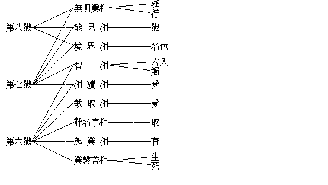
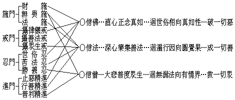

# 大乘起信論略釋
（──民國七年十月在漢口編──）

## 目錄

- 懸論
    - 一　出論總義
        - 甲　示論體
        - 乙　明論相
        - 丙　顯論用
    - 二　判論部位
        - 甲　藏──屬菩薩藏中論藏攝
        - 乙　乘──一乘大乘菩薩乘攝
        - 丙　時──頓中亦兼漸中不定中攝
        - 丁　教──頓教中道教攝
    - 三　傳論師承
    - 四　釋論題目
- 釋論
    - 甲一　敘敬述意
    - 甲二　標宗顯益
        - 乙一　總列
        - 乙二　別說
            - 丙一　因緣分
                - 丁一　顯造此論總別相安立之緣由
                - 丁二　顯造此論能所詮略攝之緣由
            - 丙二　立義分
            - 丙三　解釋分
                - 丁一　總列
                - 丁二　分解
                    - 戊一　解釋大乘心性
                        - 己一　顯示正義
                            - 庚一　示二門一心依
                            - 庚二　依一心二門顯
                                - 辛一　心真如門示大乘體
                                    - 壬一　離言直示心真如
                                    - 壬二　寄門辨證真如相
                                - 辛二　心生滅門顯大乘自體相用
                                    - 壬一　顯疏依真如門轉成生滅門
                                        - 癸一　示具分依他起性
                                            - 子一解釋心生滅因緣相
                                                - 丑一解釋心生滅義
                                                    - 寅一依如來藏有藏識
                                                    - 寅二依藏識有覺不覺
                                                        - 卯一總標
                                                        - 卯二別釋
                                                            - 辰一釋覺義
                                                                - 巳一約對覺離念釋
                                                                - 巳二約隨染生淨說
                                                                - 巳三約覺體相用釋
                                                            - 辰二釋不覺義
                                                                - 巳一約互依無性釋
                                                                - 巳二約緣起生相釋
                                                                - 巳三約染法不覺釋
                                                        - 卯三俱融
                                                - 丑二解釋心生滅因緣
                                                    - 寅一總標
                                                    - 寅二別釋
                                                        - 卯一明藏心轉識互為生滅親因緣
                                                        - 卯二示無明染心互為生滅增上緣
                                                            - 辰一顯無明起染心之深玄
                                                            - 辰二顯染心由無明而差別
                                                                - 巳一列釋染心治斷差別
                                                                - 巳二兼釋無明治斷差別
                                                                - 巳三隨釋相應不相應義
                                                            - 辰三顯染心與無明所障礙
                                                - 丑三解釋心生滅因緣相
                                                    - 寅一正明生滅麤細因緣相
                                                    - 寅二寄辨心相體滅不滅義
                                            - 子二顯示心染淨熏習義
                                                - 丑一總標染淨熏習法相
                                                - 丑二隨解染淨熏習名義
                                                - 丑三廣釋染淨熏習法義
                                                    - 寅一明染淨互熏無斷
                                                        - 卯一明熏習起染法不斷
                                                        - 卯二明熏習起淨法不斷
                                                            - 辰一淨熏習通相
                                                            - 辰二淨熏習別相
                                                                - 巳一妄心熏習
                                                                - 巳二真如熏習
                                                                    - 午一標名數
                                                                    - 午二釋名義
                                                                        - 未一顯體用熏習相
                                                                            - 申一體熏習
                                                                            - 申二用熏習
                                                                        - 未二示體用熏習位
                                                    - 寅二明淨滿染法有斷
                                        - 癸二　顯成實淨依圓性
                                            - 子一合顯真如自體相
                                            - 子二別顯真如用
                                                - 丑一略明
                                                - 丑二廣顯
                                    - 壬二　示直從生滅門即入真如門
                        - 己二　對治邪執
                            - 庚一　標名列數
                            - 庚二　隨執對治
                                - 辛一　對治人我見所起邪執
                                - 辛二　對治法我見所起邪執
                            - 庚三　究竟離妄
                    - 戊二　解釋大乘因果
                        - 己一　標果建因
                        - 己二　從因顯果
                            - 庚一　標列三種發心
                            - 庚二　釋成三種發心
                                - 辛一　信成就發心
                                    - 壬一　明發心因緣
                                    - 壬二　明發心行相
                                    - 壬三　明發心成就
                                - 辛二　解行發心
                                - 辛三　證發心
                                    - 壬一　通明諸地行相
                                    - 壬二　別明十地功德
            - 丙四　修行信心分
                - 丁一　標人立法
                - 丁二　從理起行
                    - 戊一　寄問總徵
                    - 戊二　隨問分釋
                        - 己一　發信心起行
                        - 己二　修行成信心
                            - 庚一　標列五門
                            - 庚二　釋成五門
                                - 辛一　總明前四門
                                - 辛二　廣明止觀門
                                    - 壬一　略明
                                    - 壬二　廣辨
                                        - 癸一　修次第止觀
                                            - 子一修止
                                                - 丑一修止人法
                                                - 丑二揀除劣行
                                                - 丑三發生勝德
                                                - 丑四警辨魔惑
                                                - 丑五顯示利益
                                            - 子二修觀
                                        - 癸二　修平等止觀
                - 丁三　方便攝護
            - 丙五　勸修利益分
    - 甲三　圓滿迴向


## 懸論

### 　　一　出論總義

#### 　　　　甲　示論體

1.示將性隨相之論體：云何出將性隨相之論體？謂論有法論、義論、行論、果論、教論之五別。法者：詮一切法自性。論云：『所言法者，謂眾生心，是心則攝一切世間出世間法』。故法論之體，即眾生心也。眾生，謂自地獄界至佛界之十法界。眾生心，謂十法界眾生非一非異之根本依心也。義者：詮一一法共相。此論有二重依：第一、依眾生心示大乘體及示大乘自體相用；則理論之體，即心真如相及心生滅因緣相也。第二、依大乘示體大、相大、用大；則理論之體，即一切法真如也，如來藏也，及能生一切世間出世間善因果也。用因明論以說明之，如云：聲是無常或常。聲者，法之自性，謂之宗依，謂之有法。在此論、則即眾生心也，亦即大乘也。無常或常、是依聲之一法所起差別之義，亦是聲等一一諸法通共之相，謂之宗體，謂之法義。在此論、則真如相也，生滅因緣相也，亦體相用大也。上二、論之顯理，下為論之成事。行者：法之造修進趣。此論題為大乘起信，論曰：『有法能起摩訶衍信根，是故應說』。則知此論行論之體，即大乘信心也。上三、論之立因，下為論之辦果。果者：法之到達成就。論曰：『一切諸佛本所乘故；一切菩薩皆乘此法到如來地故』。則知此論果論之體，即如來地。如來地以一真法界、四智菩提為體，即此論之果論體也。上四、皆論所詮，下為論之能詮。能詮即此論之文字言句──教。若就法論，示眾生心為體。若就義論，或真如相為體，或生滅因緣相為體。從生滅因緣相為體而更別論自體相用，亦可聲、色二塵色法為體，名句文字假法為體，色法、心、心所法為體。若就行論，則即吾人大乘善根因緣力故，開發大乘信心，於大乘信心上所生文義以為教體。若就果論，乃諸佛菩薩大悲本願力故，於清淨平等法界中所流出之文義以為教體。若剋就能詮之文教以言其體，實即色、聲二塵之實法，及名句文三位之假法以為體也。


```
　　　　眾生心為體…………法論…法┐
　　　　真如生滅因緣為體…理論…義┘…理┐
　　　　大乘信心為體………行論…………事┘…因┐
　　　　佛地五法為體………………果論…………果┘…………所詮┐
　　　　性用別論色心假實有為無為有漏無漏為體……教論……能詮┘……論
```


2.示攝相歸性之論體：論云：『心真如者，即是一法界大總相法門體，所謂心性不生不滅，唯是一心，故名真如』。則上法、義、行、果、教，皆唯一真如性以為體耳。

#### 　　　　乙　明論相

以大乘不共人、法、因、果為論相，所謂如來藏也。

#### 　　　　丙　顯論用

以斷凡外、小偏之疑見，而起大乘之信行為論用；所謂能生世出世間善因果也。

### 　　二　判論部位

#### 　　　　甲　藏──屬菩薩藏中論藏攝


```
　　　　一藏………佛藏
　　　　　　　　┌菩薩藏
　　　　二藏……┤
　　　　　　　　└聲聞藏
　　　　　　　　┌經
　　　　三藏……┤律
　　　　　　　　└論
　　　　　　　　┌經
　　　　　　　　│律
　　　　四藏……┤
　　　　　　　　│論
　　　　　　　　└雜……菩薩
　　　　　　　　┌經
　　　　　　　　│律
　　　　五藏……┤論
　　　　　　　　│密
　　　　　　　　└雜
　　　　　　　　　　┌經─┐
　　　　　　　　┌─┤律　├─菩薩
　　　　　　　　│　└論─┘
　　　　六藏……┤
　　　　　　　　│　┌經─┐
　　　　　　　　└─┤律　├─聲聞
　　　　　　　　　　└論─┘
```


#### 　　　　乙　乘──一乘大乘菩薩乘攝


```
　　　　一乘………佛
　　　　　　　　┌大乘
　　　　二乘……┤
　　　　　　　　└小乘
　　　　　　　　┌菩薩
　　　　三乘……┤緣覺
　　　　　　　　└聲聞
　　　　　　　　┌人
　　　　　　　　│天
　　　　五乘……┤菩薩
　　　　　　　　│緣覺
　　　　　　　　└聲聞
```


#### 　　　　丙　時──頓中亦兼漸中不定中攝


```
　　　　頓………………………………………中（華嚴經、馬鳴大乘起信論）
　　　　　　　　　　　　　　　　　　　　┌有
　　　　不定……………………………………┤空
　　　　　　　　　　　　　　　　　　　　└中
　　　　漸……經……│有………………│空………………│中…
　　　　　　　論……│馬鳴大莊嚴論　│龍樹　　　　　│無著
```


#### 　　　　丁　教──頓教中道教攝

### 　　三　傳論師承

釋尊（論之宗依者）……馬鳴（論之宗造者）……真諦（論之傳譯者）

### 　　四　釋論題目

大者彰表之名，以遍常為義。乘者譬喻之名，以運載為義。所彰表者何法？道無方體，在人則人。人心之真如性體，離一切相即一切法，平等周遍，絕待圓常，不墮數量，本非大小，無可表彰，強名曰大。人心之自體即如來藏妙真如性，周遍圓常，故名曰大。人心之自體相即如來藏，足具無量無邊性淨功德，故名曰大；大者多也。人心之自體相用即如來藏，能生世出世間諸善因果，故名曰大；大者勝也。故大之一名，所以彰表人心之真如體性、與人心之自體相用者也。所譬喻者何事？此人心之妙體相用，過去、現在諸佛，曾從凡愚地由運載以至大覺地故；現在、未來諸覺有情，皆由運載以至如來地故。故乘之一名，所以譬喻諸佛、菩薩──十方同準三世無改──之一乘教理行果也。是故離而釋之：大表眾生了妄即真、轉迷成悟之共同依正義，及如來究竟顯現義。乘喻眾生從因趣果、轉凡成聖之唯一歸極義，及如來圓滿正覺義。大非是乘，乘非是大，屬相違釋。合而釋之：或大法之能運載者，即大是乘，持業釋也。或大人之所運載者，大所有乘，有財釋也。大人之乘，亦可依主釋也。起者、表有法先非有而今始有；信者表有法能自淨而淨餘法。是故離而釋之：起者、一切法隨緣成事，起住異滅之最初相。信者、五乘人從因趣果，信解行證之最初相。起者、屬不相應行分位假法；信者屬相應善心所法。起非是信，信非是起，屬相違釋。合而釋之：起所起法，即是信心，即起是信，屬持業釋。起即信心初有之相，信之起相，屬依士釋。起即信心所有生起之緣，屬有財釋。能起他人信心之人，即是馬鳴菩薩；能緣之自起信心之人，即是一切未入大乘正定聚菩薩。所起信之法，即是心真如相大乘體，及心生滅因緣相大乘自體相用、因果也。能起信心之法，即此大乘起信論。

論者、諸論之通號，大乘起信者、一論之別目。以別別通，攝通從別，大乘起信之論，屬依士釋。大乘起信是義，論是文辭，大乘起信之論，即是大乘起信之義，屬持業釋。

## 釋論

### 　　甲一　敘敬述意

> **皈命盡十方，最勝業遍知，色無礙自在，救世大悲者；及彼身體相，法性真如海，無量功德藏；如實修行等。為欲令眾生，除疑捨邪執；起大乘正信，佛種不斷故！**

反本圓淨之謂皈，色心連持之謂命。信任奉託之謂皈，一生總根之謂命。舉生命而皈奉，見造論者能敬之深切也。盡十方而皈命，見造論者所敬之宏遠也。此皈命盡十方一句，直通貫至第八句如實修行等，即是十方三世大乘常住三寶尊也。第二、三、四、五句，敬稱佛寶。即最勝者得業、遍知、色三大無礙自在者，救三種世間有大悲願者。者字、彼字，指佛，即以佛果上不共因人小聖外凡而獨有之大雄、大力、大慈悲三德，又總舉夫佛身體相敬稱乎佛也。第五、第六、第七句，稱法寶。上從大乘極果妙用以顯佛德，今即指大乘果用所依之自體相為法寶，以顯佛、法非二。復加及之一字，以簡別乎佛寶、法寶非一。非二非一，融歸法性真如之海，深廣無際，出生無盡，故曰無量功德藏；蓋即指心真如體與心生滅因緣相不即不離之大乘體及大乘自體相用而為法寶者也。第七、第八兩句，稱僧寶。無量功德藏、即諸佛開示之法；以如實信解行證者，即為清淨和悅徒眾，乃十信、十住、十行、十向、十地及等覺地五十一位之覺有情。以顯三寶非一非異，故佛、法、僧次第鉤鎖而敘稱也。此之八句，為造論而敘敬。下之四句，欲造論而述意。凡諸論前必有敘敬述意之儀者，以顯法有師承，義有宗本。抑以佛、法、僧寶為世間最吉祥事，最福德事，願仗加被，令造說者說之無謬，令受聽者聽之易解，除疑捨執，起信生智，以廣流傳而使佛種不斷絕也。又菩薩之於佛、法、僧，譬如孝恭子弟之於父母兄長，欲作一事，必先恭敬稟明；故馬鳴菩薩亦先敘敬述意也。

### 　　甲二　標宗顯益

#### 　　　　乙一　總列

> **有法能起摩訶衍信根，是故應說。說有五分，云何為五？一者、因緣分，二者、立義分，三者、解釋分，四者、修行信心分，五者、勸修利益分。**

摩訶有大、多、勝三義。梵語摩訶衍，即華言大乘。此中所言有法，即指本論立義、解釋、修行信心之三分法。大小乘皆有信、精進、念、定、慧之五根。依大乘法解大乘義，信心深植，不可搖拔，乃謂之摩訶衍信根；由此信根為增上緣，則能生世出世間之善因果也。

#### 　　　　乙二　別說

##### 　　　　　　丙一　因緣分

###### 　　　　　　　　丁一　顯造此論總別相安立之緣由

> **初說因緣分。問曰：有何因緣而造此論？答曰：是因緣有八種。云何為八？一者、因緣總相，所謂為令眾生離一切苦、得究竟樂，非求世間名利恭敬故。二者、為欲解釋如來根本之義，令諸眾生正解不謬故。三者、為令善根成熟眾生，於摩訶衍法堪任不退信故。四者、為令善根微少眾生，修習信心故。五者、為示方便，銷惡業障，善護其心，遠離癡慢出邪網故。六者、為示修習止觀，對治凡夫、二乘心過故。七者、為示專念方便，生於佛前，必定不退信故。八者、為示利益，勸修行故。有如是等因緣，所以造論。**

此中第一名因緣總相者，是諸佛菩薩說法利生之通意，亦此論全論之所緣起也；對下七者皆因緣別相故。所以為別相者，一、專指造此論之因緣故；二、別為此論一分一分以作因緣故。二者、即是造立義分及解釋分之因緣，所以顯如來一心性相之根本義，及如來一乘因果之根本義也。三者至七者、作修行信心分之因緣，如次可知。

###### 　　　　　　　　丁二　顯造此論能所詮略攝之緣由

> **問曰：修多羅中具有此法，何須重說？答曰：修多羅中、雖有此法，以眾生根行不等，受解緣別：所謂如來在世，眾生利根，能說之人色心業勝，圓音一演，異類等解，則不須論。若如來滅後，或有眾生能以自力廣聞而取解者；或有眾生亦以自力少聞而多解者；或有眾生無自智力、因於廣論而得解者；亦有眾生復以廣論文多為煩，心樂總持少文而攝多義能取解者。如是、此論為欲總攝如來廣大深法無邊義故，應說此論。**

文中凡有四重，乃推出須造此論也。一者、佛在世時，人根利，教主勝，總不須論。二者、佛滅度後有自力者，亦不須論。三者、佛滅度後有因廣論而得解者，亦不須此略論。然今多有欲從略論而了解多義者，故須造此論以少文而攝廣義也。

##### 　　　　　　丙二　立義分

> **已說因緣分，次說立義分。摩訶衍者，總說有二種。云何為二？一者、法，二者、義。所言法者：謂眾生心。是心則攝一切世間出世間法；依於此心，顯示摩訶衍義。何以故？是心真如相，即示摩訶衍體故；是心生滅因緣相，能示摩訶衍自體相用故。所言義者：則有三種。云何為三？一者、體大，謂一切法真如平等不增減故。二者、相大，謂如來藏具足無量性功德故。三者、用大，能生一切世間出世間善因果故，一切諸佛本所乘故，一切菩薩皆乘此法到如來地故。**

此分先立一論大義以為總綱，猶外籀論法之先建大公例也。隨言一事，各有自共差別因果之相，故總舉大乘以為言。就虛空界、法界則謂之大，而有法與義二相；就時界、有情界則謂之乘，而有因與果二相。法者，一一法各各自相及各各共相；義者，一一法自相、共相之關係，及由此關係所發現之差別相。相似和合之假相謂之眾，相似連續假相謂之生；十法界正報、依報皆是連續之假相而已。此一一所和合連續之假相及一一能和合連續之實法，共同依止起存之心，則謂之眾生心。故舉心、即攝一切世間法及出世間法也。然眾生心即是如來藏心。何者？一一法皆真故，一一法同如故，唯一心故，無二性故。尚無一法，況有眾多法之和合！尚無和合，況有一合相之連續！即假相心是實性之謂如，攝假相歸心實性之謂來。故言眾生心猶言如來心，亦可見心、佛、眾生三法差別而無差別也。大乘義所宗依之法，既為此眾生心，可知大乘乃總以一切法為依而無外無遺也。即假相心是實性故，故依此心示大乘體；攝假相歸心實性故，故依此心示大乘自體相用也。示大乘自體相用即示大乘義。前大乘體是心真如，此大乘自體相用是如來藏心。大乘之自體不異前大乘體之真如，以隨相故說為自體，即如來藏之如義也。大乘之自相具含無量性功德，即如來藏之藏義也。大乘之自用能生一切善因果，即如來藏之來義也。此中有三層次：第一層次，以眾生心為法自相，以真如相及生滅因緣相為法共相，以心之真如相或生滅因緣相為差別相。第二層次，以大乘為自相，以心真如相或心生滅因緣相為共相，以心真如示大乘體及心生滅因緣示大乘自體相用為差別相。第三層次，以大乘自體相用為自相，以心生滅因緣相為共相，以體相用三大為差別相。必審大乘之差別相，乃知大乘之所以為大乘。故僅示真如則為諸乘之共依，亦為十法界之共依：與堯俱聖，與桀俱狂，與佛俱覺，與生俱迷，與草木俱有生，與瓦石俱無情，謂之法性，不名佛性。故必示如來藏乃為大乘不共之依；蓋如來藏專與佛果一切性淨功德為體，謂之佛性，一得相應，決定成佛。復能廣生人、天、小乘、大乘之善因果。以決定成佛故，復有因相、果相，所謂一切諸佛本所乘故，一切菩薩皆乘此法到如來地故也。更製圖表如下：


```
　　　　　　　　法性離相┐　　　　　　　　　　　　　　　　　　　　　　　　　　　　　　　一一法皆
　　　　　　　┌　　　　├六凡生滅眾生世界…………………………迷染動真如…完全迷真如┬─
　　　　　　　│即一切法│　　　　　　　　　　　　　　　　　　　　　　　　　　　　　│　真如全體
　　　　　　　│　　　　├第四禪天與無想天及四空天………………迷執靜真如…謬似證真如┤
　　　　　　　│　　　　│　　　　　　　　　　　　　　　　　　　　　　　　　　　　　│
　　　　　　　│　　　　├滅受想定二乘涅槃…偏證靜真如─┐　　　　　　　　　　　　　│
　　　　　　　│　　　　│　　　　　　　　　　　　　　　│…悟淨靜真如┐　　　　　　│
　　　　　真如…不變隨緣┼初地創證空如來藏…圓證靜真如─┘　　　　　　│　　　　　　│
　　　　　　　　　　　　│　　　　　　　　　　　　　　　　　　　　　　│　　　　　　├┬隨緣不變…真如
　　　　　　　　　　　　├初地至八地等覺地等證空不空如來藏…悟妙動真如┤…偏分證真如┤│
　　　　　　　　　　　　│　　　　　　　　　　　　　　　　　　　　　　│　　　　　　││
　　　　　　　　　　　　├不動地捨我愛執藏阿賴耶轉名如來藏…如來藏真如┘　　　　　　││
　　　　　　　　　　　　│　　　　　　　　　　　　　　　　　　　　　　　　　　　　　││　一一法即
　　　　都無一切法妄幻相┴不動地至妙覺地證圓成實如來藏………圓成實真如……圓滿證真如┴┴─
　　　　　　　　　　　　　　　　　　　　　　　　　　　　　　　　　　　　　　　　　　　　　性離法相
　　　　　　　┌佛性心中眾生┌三界凡愚┐
　　　　　　　│　　　　　　│　　　　│……全具如來藏而全迷┬─諸染淨法皆如來藏全體
　　　　　　　│　　　　　　├二乘聖賢┘　　　　　　　　　　│
　　　　　　　│　　　　　　│　　　　　　　　　　　　　　　│
　　　　　　　│　　　　　　├信住行向………信解如來藏起修證┤
　　　　　　　│　　　　　　│　　　　　　　　　　　　　　　├┐隨緣不變………如來藏
　　　　如來藏……不變隨緣…├初歡喜地………始悟達密證如來藏┤│
　　　　　　　　　　　　　　│　　　　　　　　　　　　　　　││
　　　　　　　　　　　　　　├八不動地………始住持顯證如來藏┤│
　　　　　　　　　　　　　　│　　　　　　　　　　　　　　　││
　　　　　都無一切法雜染相…└佛妙覺地………圓顯如來藏而圓證┘└─眾生心中佛性
　　　　　　　┌法──眾生心……………………………自相
　　　　大乘┬┤　　┌體……………真如………………共相
　　　　　　│└義─┴自體相用……如來藏…………差別相
　　　　　　│┌因…………………………………………因相
　　　　　　└┤
　　　　　　　└果…………………………………………果相
```


要之，世間出世間法之理，不越心性，世間出世間法之事，不越因果而已。

##### 　　　　　　丙三　解釋分

###### 　　　　　　　　丁一　總列

> **已說立義分，次說解釋分。解釋分有三種，云何為三？一者、顯示正義，二者、對治邪執，三者、分別發趣道相。**

###### 　　　　　　　　丁二　分解

###### 　　　　　　　　　　戊一　解釋大乘心性

###### 　　　　　　　　　　　　己一　顯示正義

###### 　　　　　　　　　　　　　　庚一　示二門一心依

> **顯示正義者：依一心法有二種門。云何為二？一者、心真如門，二者、心生滅門。是二種門，皆各總攝一切法。此義云何？以是二門不相離故。**

唯是一心，遍為諸法。由勝義平等智觀之，舉一心全體而為真如門，故真如門總攝一切法。由世俗差別智觀之，舉一心全體而為生滅門，故生滅門總攝一切法。既皆同時舉心全體而為真如及為生滅，故是二門不相離也。

###### 　　　　　　　　　　　　　　庚二　依一心二門顯

###### 　　　　　　　　　　　　　　　　辛一　心真如門示大乘體

###### 　　　　　　　　　　　　　　　　　　壬一　離言直示心真如

> **心真如者，即是一法界大總相法門體。所謂心性不生不滅，一切諸法唯依妄念而有差別；若離心念，則無一切境界之相。是故一切法，從本已來離言說相、離名字相、離心緣相，畢竟平等，無有變異，不可破壞，唯是一心，故名真如。以一切言說假名無實，但隨妄念不可得故。言真如者，亦無有相，謂言說之極，因言遣言：此真如體無有可遣，以一切法悉皆真故；亦無可立，以一切法皆同如故。當知一切法不可說、不可念，故名為真如。問曰：若如是義者，諸眾生等云何隨順而能得入？答曰：若知一切法雖說無有能說可說，雖念亦無能念可念，是名隨順；若離於念，名為得入。**

此中有二段文。從心真如者以至故名為真如，是由絕對不可得故名心真如。從問曰至名為得入，是由究竟離妄念故見真如性，此達磨傳心宗之本。

###### 　　　　　　　　　　　　　　　　　　壬二　寄門辨證真如相

> **復次、此真如者，依言說分別，有二種義。云何為二？一者、如實空，以能究竟顯實故。二者、如實不空，以有自體具足無漏性功德故。所言空者：從本已來一切染法不相應故；謂離一切法差別之相，以無虛妄心念故。當知真如自性，非有相，非無相，非非有相，非非無相，非有無俱相；非一相，非異相，非非一相，非非異相，非一異俱相。乃至總說：依一切眾生，以有妄心念念分別，皆不相應，故說為空；若離妄心，實無可空故。所言不空者：已顯法體空無妄故，即是真心常恆不變，淨法滿足，則名不空；亦無有相可取，以離念境界唯證相應故。**

從復次此真如者，至以有自體具足無漏性功德故，總標寄言分別之二門也。所言空者至實無可空故，乃從離一切名相之空門，遣遍計執以顯圓成實也。此即龍樹三論宗本，亦即天親唯識宗本。何以亦為唯識宗本？以明所空之有無、一異等妄相，皆從妄心念念分別而現，若離妄心實無可空。即是一切遍計所執相，皆執染分依他起性而妄現之義。所謂能空、所空皆唯是識。於妄境空，境性本空故空妄境，實無可空。於妄心空，心性真有，故空妄心，究竟顯實。此唯識論境行果三中之境唯識也。從所言不空者至唯證相應故，乃是由前空門究竟開顯之真實性，即如來藏心也。然或但依妄心而取空彼妄境所現之妄空相，雖由空門不證實性。應更為說即一切法之不空門，使從不空門入。此為南山、淨土、真言、天台、華嚴諸宗之本，亦行果唯識也。雖即一切法而依然離一切相，因一切相由妄念生，而不空之真性唯正智之親證。心離妄念，乃成正智，故正智證於真性，必離諸可取相也。阿僧伽曰：『二我無即二無我有，二無我有即二我無』，斯之謂也。

###### 　　　　　　　　　　　　　　　　辛二　心生滅門顯大乘自體相用

###### 　　　　　　　　　　　　　　　　　　壬一　顯疏依真如門轉成生滅門

###### 　　　　　　　　　　　　　　　　　　　　癸一　示具分依他起性

###### 　　　　　　　　　　　　　　　　　　　　　　子一解釋心生滅因緣相

###### 　　　　　　　　　　　　　　　　　　　　　　　　丑一解釋心生滅義

###### 　　　　　　　　　　　　　　　　　　　　　　　　　　寅一依如來藏有藏識

> **心生滅者：依如來藏故有生滅心。所謂不生不滅與生滅和合，非一非異，名為阿黎耶識。**

真妄之依，名阿黎耶。即生滅不生滅之根本依，亦即覺與不覺之根本依。此中名阿黎耶識者，正取能藏一切種子之心體，與所持一切無漏無明之業幻相用，不偏依我愛執藏以立名；故與成唯識論所謂阿黎耶之名義，分齊有異。其分齊、乃正如彼論之阿陀那識也。阿黎耶識如空海水，如來藏如空海澄淨明靜均平虛通之水，真如如海水之空性溼性。阿黎耶與末那為俱有依而現前七識之心境，如海水渾濁昏動起伏搏激之波流相。雖海水之昏動渾濁起伏搏激，非必先依澄淨明靜均平虛通而起，亦互輾轉前後相引；然水之自體相，固自是澄淨明靜均平虛通者。故但應說波流依水而起，不說水依波流而起。理唯如是，唯事上則水與波流無前後之可言。抑不唯離水無波流，且全海水為波流時，亦復離波流而無水。但水離昏動等則不名為波流而不無水；故水有時可離波流而有，非若波流必依乎水而有，離水必無也。又以離波流相而有水故，有水之澄靜等相故，可證水相原自淨明，本離昏濁等相。故此中說依如來藏有生滅心。如來藏喻空海水中之明靜等相，真如喻空海水隨現何相不變不易之空濕性。故阿黎耶具有不生滅性與生滅性，本不覺義與本覺義；如來藏即指不覺生滅所不能離之不生滅覺性，而真如即指生滅覺不覺所圓同之不生滅性。然阿黎耶識依不生滅與生滅和合立名，如云空海水波流也。和合識破，則生滅心相滅，不與生滅和合，則即不名為阿黎耶，而唯應名為如來藏。故亦說依如來藏心而有阿黎耶識，如云依空海水而有空海水波流也。一者指不覺生滅中之不生滅覺性，一者指不生滅覺內之不覺生滅相，故如來藏與藏識雖相即而非一也。證如來藏則非不覺生滅，成阿黎耶則非不生滅覺。然證如來藏時，阿黎耶全成如來藏，別無阿黎耶識；成阿黎耶識，如來藏全轉阿黎耶，別無如來藏心：故藏識與如來藏雖相離而非異也。待如來藏而有藏識，待藏識而顯如來藏，故相待互依而現起，俱無自性。無性之性，即真如性。

###### 　　　　　　　　　　　　　　　　　　　　　　　　　　寅二依藏識有覺不覺

###### 　　　　　　　　　　　　　　　　　　　　　　　　　　　　卯一總標

> **此識、有二種義，能攝一切法，生一切法。云何為二？一者、覺義，二者、不覺義。**

###### 　　　　　　　　　　　　　　　　　　　　　　　　　　　　卯二別釋

###### 　　　　　　　　　　　　　　　　　　　　　　　　　　　　　　辰一釋覺義

###### 　　　　　　　　　　　　　　　　　　　　　　　　　　　　　　　　巳一約對覺離念釋

> **所言覺義者：謂心體離念。離念相者，等虛空界，無所不遍，法界一相，即是如來平等法身。依此法身，說名本覺。何以故？本覺義者，對始覺義說，以始覺者即同本覺。始覺義者，依本覺故而有不覺，依不覺故說有始覺。又以覺心源故，名究竟覺；不覺心源故，非究竟覺。此義云何？如凡夫人覺知前念起惡故，能止後念令其不起；雖復名覺，即是不覺故。如二乘觀智，初發意菩薩等，覺於念異，念無異相；以捨麤分別執著相故，名相似覺。如法身菩薩等，覺於念住，念無住相；以離分別麤念相故，名隨分覺。如菩薩地盡，滿足方便，一念相應覺心初起，心無初相；以遠離微細念故，得見心性，心即常住，名究竟覺。是故修多羅說：若有眾生能觀無念者，則為向佛智故。又心起者，無有初相可知而言知初相者，即謂無念。是故一切眾生不名為覺，以從本來念念相續未曾離念，故說無始無明。若得無念者，則知心相生、住、異、滅；以無念等故，而實無有始覺之異。以四相俱時而有，皆無自立，本來平等，同一覺故。**

此中指初地菩薩離念如如根本智現證心真如體，說為本覺。然覺性雖人人同具，無始覺智孰證明之？無所證明，孰知其有？故曰：本覺義者，對始覺說。然始覺證於本覺時，證無證相，不二如如，故始覺者即同本覺。大佛頂經所謂『入流成正覺』也。然本覺待始覺證明其有而說，始覺又從何說有乎？蓋依本覺說有不覺，不覺者即不覺於本覺耳；然依不覺故有妄念所取之妄名相，因之得聞本覺之名及觀本覺之相，心求證得，遂起始覺之智，故又依不覺說有始覺也。然始覺依不覺而轉，未究竟成圓滿覺時，猶有不覺與之俱轉。是以初發大乘心之凡夫，雖能觀心性無念而向於佛智，然僅能以後念而覺前念滅相，一一念當念之念相，不自覺也。久之、則能如二乘聖者，能於當念覺其異相。初證法身，始覺念住；以前此皆緣觀之覺，至此始是真覺，然未能圓滿也。菩薩地盡，進入佛地，乃成究竟真覺，能覺念念初起之相。然念念本無初起相，言覺念念初起相者，以覺心體本來未嘗有念故耳。是以能覺心體本無念者，即為證得如來智慧。蓋心體本無念，故一覺心體即離念。一切眾生從未離念，念念相續，名為眾生。故諸眾生不名為覺，唯名本來不覺。然念念上之生、住、異、滅相，皆依妄念上所現之分位假相而立，時分亦從念念相續之分位而假立；如覺心體實無有念，且無妄念，況有依附妄念而現之妄相哉！妄念本無，則無不覺，無不覺故亦無始覺，無始覺故亦無本覺，唯一圓滿平等真覺。

###### 　　　　　　　　　　　　　　　　　　　　　　　　　　　　　　　　巳二約隨染生淨說

> **復次、本覺隨染分別，生二種相，與彼本覺不相捨離。云何為二？一者、智淨相，二者，不思議業相。智淨相者：謂依法力熏習，如實修行、滿足方便故，破和合識相，滅相續心相，顯現法身智淳淨故。此義云何？以一切心識之相皆是無明，無明之相不離覺性，非可壞、非不可壞。如大海水因風波動，水相、風相不相捨離，而水非動性；若風止滅，動相則滅，濕性不壞故。如是眾生自性清淨心，因無明風動，心與無明俱無形相不相捨離，而心非動性；若無明滅，相續則滅，智性不壞故。不思議業相者：以依智淨相能作一切勝妙境界，所謂無量功德之相，常無斷絕，隨眾生根，自然相應種種而現得利益故。**

本覺隨染分別所生二相，即是由始覺證本覺至究竟覺所成之根本真智與後得智，所謂智淨相、不思議業相是也。風相滅、本相不滅者，喻果上轉識成智時，盡捨一切根本無明相應之雜染心心法，而一切智相應品之善淨心、心法，則湛存而圓顯也。

###### 　　　　　　　　　　　　　　　　　　　　　　　　　　　　　　　　巳三約覺體相用釋

> **復次、覺體相者：有四種大義，與虛空等，猶如淨鏡。云何為四？一者、如實空鏡：遠離一切心境界相，無法可現，非覺照義故。二者、因熏習鏡：謂如實不空，一切世間境界悉於中現，不出不入、不失不壞，常住一心，以一切法即真實性故；又一切染法所不能染，智體不動，具足無漏熏眾生故。三者、法出離鏡：謂不空法，出煩惱礙、智礙，離和合相，淳淨明故。四者、緣熏者鏡：謂依法出離故，遍照眾生之心，令修善根，隨念示現故。**

此以虛空、淨鏡，合喻四種大義，以顯覺體相用。如實空虛淨鏡，初地真智始證得真如之不二如如體也。體即真覺，不以別有能覺、所覺乃名為覺。如別有能覺、所覺，即違真覺。如虛空淨鏡照於色像時，虛空淨鏡相轉為色像相，則不見空鏡之自體相也。第二、因熏習虛淨鏡，即如實不空義。所謂大乘體相之如來藏，能令眾生自發大乘心之佛性本因是也。一切染法所不能染，故隨緣而不變。一切法即真常實性悉現於中，故天台立性善惡義，謂一念具足百界千如、理事性相也；此八地始能顯證耳。三者、法出離虛淨鏡，佛地始證。即轉異熟識成大圓鏡智，乃如來藏出障圓明而轉為佛法智身也。四者、緣熏習鏡，即佛果後妙用。示即大乘別相佛法僧寶，能令眾生發大乘心之增上緣是也。

###### 　　　　　　　　　　　　　　　　　　　　　　　　　　　　　　辰二釋不覺義

###### 　　　　　　　　　　　　　　　　　　　　　　　　　　　　　　　　巳一約互依無性釋

> **所言不覺義者：謂不如實知真如法一故，不覺心起而有其念；念無自相，不離本覺。猶如迷人，依方故迷，若離於方，則無有迷。眾生亦爾，依覺故迷，若離覺性，則無不覺。以有不覺妄想心故，能知名義，為說真覺；若離不覺之心，則無真覺自相可說。**

不覺者，即不覺真覺而生妄念。然妄念空無自體而體即真覺，故不覺不離覺，而不覺無自性。然一真覺離諸名相，今有真覺之名可言及真覺之相可觀者，又依不覺之妄想心而有。故覺不離不覺而覺亦無自性。

###### 　　　　　　　　　　　　　　　　　　　　　　　　　　　　　　　　巳二約緣起生相釋

> **復次、依不覺故生三種相，與彼不覺相應不離。云何為三？一者、無明業相：以依不覺故心動，說名為業；覺則不動，動則有苦，果不離因故。二者、能見相：以依動故能見，不動則無見。三者境界相：以依能見故境界妄現，離見則無境界。以有境界緣故，復生六種相。云何為六？一者、智相：依於境界，心起分別，愛與不愛故。二者、相續相：依於智故生其苦樂，覺心起念，相應不斷故。三者、執取相：依於相續，緣念境界，住持苦樂，心起著故。四者、計名字相：依於妄執，分別假名言相故。五者、起業相：依於名字，尋名取著，造種種業故。六者、業繫苦相：以依業受果不自在故。**

此說藏識、思量識行相相應心法，及思量識、了別境識行相相應心法，由十二緣起支而眾生、世界生死成壞相似相續也。依阿陀那識不相應種子及末那識相應現行之恆行不共本不覺無明，漫有妄動，即為第八識體，而具藏一切種異熟之自因果三相。在相應門，即八識之作意；在十二緣起支，則由藏識中無明種緣起業行，所謂無明緣行是也。能見相即第八見分，在相應即觸、受心所，在緣起支即行緣識。境界相即第八相分，在相即想、思心所，在緣起支即識緣名色也。名色即五蘊法，在一一自種子即為第八相分，託之以起麤色根身、世界，故下為分別事識之緣也。由境界緣所生六相，內依末那，外起五識，皆攝就意識言。以末那深隱而前五皆依第六分別而起故也。略表於下，詳如別說。




###### 　　　　　　　　　　　　　　　　　　　　　　　　　　　　　　　　巳三約染法不覺釋

> **當知無明能生一切染法，以一切染法皆是不覺相故。**

觀三細、六麤相，皆依不覺心動而起，可知。

###### 　　　　　　　　　　　　　　　　　　　　　　　　　　　　卯三俱融

> **復次、覺與不覺有二種相。云何為二？一者、同相，二者、異相。言同相者：譬如種種瓦器皆同微塵性相；如是無漏無明種種業幻皆同真如性相。是故修多羅中依於此真如義，故說：一切眾生本來常住，入於涅槃。菩提之法，非可修相，非可作相，畢竟無得，亦無色相可見。而有見色相者，唯是隨染業幻所作，非是智色不空之性，以智相無可見故。言異相者：如種種幻器，各各不同；如是無漏無明，隨染幻差別，性染幻差別故。**

此正顯生滅相、真如相，皆不離一心而有。而真如又為十法界之通性，全十法界唯一真如，全一真如唯十法界。但有真同俗異二相之殊，實無二體。就眾生之真相覺之，故言本來菩提涅槃。然佛法界與眾生法界有殊者，眾生迷真造無明業，實唯染幻差別；諸佛證真成無漏智，圓滿淨德，具足妙用，同平等真，普無差別，但隨順眾生之業染幻現差別而已。故諸凡夫眾生，不可聞本來菩提涅槃之言，便自謂即佛菩薩而不事修證也。

###### 　　　　　　　　　　　　　　　　　　　　　　　　丑二解釋心生滅因緣

###### 　　　　　　　　　　　　　　　　　　　　　　　　　　寅一總標

> **復次、生滅因緣者：所謂眾生依心、意、意識轉故。**

###### 　　　　　　　　　　　　　　　　　　　　　　　　　　寅二別釋

###### 　　　　　　　　　　　　　　　　　　　　　　　　　　　　卯一明藏心轉識互為生滅親因緣

> **此義云何？以依阿黎耶識說有無明不覺、而起能見、能現、能取境界，起念相續，故說為意。此意復有五種名：云何為五？一者、名為業識，謂無明力不覺心動故。二者、名為轉識，依於動心能見相故。三者、名為現識，所謂能現一切境界，猶如明鏡現於色像；現識亦爾，隨其五塵對至即現，無有前後，以一切時任運而起，常在前故。四者、名為智識，謂分別染淨法故。五者、名為相續識，以念相應不斷故。住持過去無量世等善惡之業令不失故；復能成熟現在、未來苦樂等報無差違故；能令現在已經之事忽然而念，未來之事不覺妄慮。是故三界虛偽，唯心所作，離心則無六塵境界。此義云何？以一切法皆從心起妄念而生，一切分別即分別自心，心不見心，無相可得。當知世間一切境界，皆依眾生無明妄心而得住持。是故一切法如鏡中像，無體可得，唯心虛妄：以心生則種種法生，心滅則種種法滅故。復次、言意識者：即此相續識。依諸凡夫取著轉深，計我我所，種種妄執，隨事攀緣，分別六塵，名為意識，亦名分離識，又復說名分別事識。此識依見、愛煩惱增長義故。**

阿陀那識為無始時來界，本具有一切法種子，具有根本無明種子；亦具有本覺種，亦本具八識及諸心所法、色法種子。無明種子起現行時，即有阿黎耶識與末那識互依俱有而轉。根本無明現行無始，故阿黎耶識與末那識亦現行無始。此根本無明在阿黎耶識即為種子，即為無覆無記；在末那識即為相應心所之法我癡，即為染污無記之本，所謂恆行不共無明是也。八、七二識既為互依俱有，就無明現行為增上緣門，則說由末那識我癡、我見而有阿黎耶識；就無明種子因緣門，則說由阿黎耶識有無明不覺起能見、能現、能取境界，心念相續，謂之末那（末那譯意）。此以五相釋意，即前三細及前二麤相也。一者、業識：即持識中末那識種，由無明種為增上緣，警動而與藏識俱起現行自體。二者、轉識：即由自體而起能見。三者現識：既有能見，同時即有一切所見境界。末那緣阿黎耶為實我體，阿黎耶緣種子、根身、器界為執受境；能緣所緣，兩皆任運自類相續，故無始起亦無終盡。四者、智識：謂末那識有我見能恆審思量，執阿黎耶見分為內自我體，與顛倒慧相應，故成染心；為一切法染淨之依，謂末那染故前六識俱染，末那淨故六識亦成淨也。五者、相續識：以末那識念念審度執著藏識為內自我體故，乃念念與前六識所造善惡無記業熏習藏識。藏識受熏，持諸習氣，俱末那識隨業流轉。意識依之緣念過去未來，而有色心假實之境，皆心變現，唯虛偽相，依無明妄心故，相似相續存在。若能了妄境空，妄心不起，順真如性，逆無明習，則無明破而真如顯；妄心滅故，一切妄法無不寂滅。然諸凡夫，依相續意起分別識，取著轉深，於五蘊法計我我所，種種妄執宇宙物我，隨事攀緣，增長愛見，繫生死苦，故又當先斷見、愛為本也。見謂界內一切見惑，愛則三界、九地思惑是也。

###### 　　　　　　　　　　　　　　　　　　　　　　　　　　　　卯二示無明染心互為生滅增上緣

###### 　　　　　　　　　　　　　　　　　　　　　　　　　　　　　　辰一顯無明起染心之深玄

> **依無明熏習所起識者，非凡夫能知，亦非二乘智慧所覺。謂依菩薩從初正信，發心觀察，若證法身得少分知，乃至菩薩究竟地不能盡知，唯佛窮了。何以故？是心從本已來自性清淨而有無明，為無明所染有其染心，雖有染心而常恆不變，是故此義唯佛能知。所謂心性常無念故，名為不變；以不達一法界故，心不相應忽然念起，名為無明。**

六凡、二乘智慧，僅能觀察依根境為增上緣所起之前六分別事識，不知此根境緣者，亦從無明熏習所起也。無明熏習所起識者，即由無明力故，依如來藏，有末那識、阿黎耶識與前六根塵識之種子轉生也。如來藏心體相清淨，雖為無明所染有染心起，而恆常不變，其體相性自清淨，故深玄難了，唯佛能知也。唯佛證窮究竟離念心性，顯然了知心性從本以來離念無念，未嘗與念相應。而無明者，本無性故。不如實知唯是一心，違如來藏清淨體相，窈冥恍惚，囫圇混沌，晦昧虛懸，昏漫眩蕩，忽起妄念，幻現妄境。故雖非離心而別有，又與本清淨心相違不順也。

###### 　　　　　　　　　　　　　　　　　　　　　　　　　　　　　　辰二顯染心由無明而差別

###### 　　　　　　　　　　　　　　　　　　　　　　　　　　　　　　　　巳一列釋染心治斷差別

> **染心者、有六種。云何為六？一者、執相應染，依二乘解脫及信相應地遠離故。二者、不斷相應染，依信相應地修學方便，漸漸能捨，得淨心地究竟離故。三者、分別智相應染，依具戒地漸離，乃至無相方便地究竟離故。四者、現色不相應染，依色自在地能離故。五者、能見心不相應染，依心自在地能離故。六者、根本業不相應染，依菩薩盡地得入如來地能離故。**

執相應染，即第七、六識現行之俱生分別我執煩惱，故二乘聖及智增上信心成就菩薩能遠離也。不斷相應染，屬第六識現行之俱生分別法執，故至初地究竟離也。分別智相應染，屬第七識現行之俱生法我執，故七地究竟離相無相分別乃斷也。現色不相應染，乃無始來心外取境所熏積之相分習氣種子；第八地證如來藏自性清淨心，永除取色分齊習氣，故得色自在也。能見心不相應染，即無始來能緣外境所熏積之見分習氣種子，第九地得心自在故能捨離也。根本業不相應染，即笫八真異熟識，至佛地依如來藏心，乃轉捨此異熟識而轉得大圓鏡智相應之菴摩羅識也。

###### 　　　　　　　　　　　　　　　　　　　　　　　　　　　　　　　　巳二兼釋無明治斷差別

> **不了一法界義者，從信相應地觀察學斷，入淨心地隨分得離，乃至如來地能究竟離故。**

大乘初心，即直心正念真如法，初地創證真如，至佛地名圓證真如。故雖初心即學斷無明，至佛地乃究竟捨離也。

###### 　　　　　　　　　　　　　　　　　　　　　　　　　　　　　　　　巳三隨釋相應不相應義

> **言相應義者：謂心念法異，依染淨差別而知相、緣相同故。不相應義者：謂即心不覺，常無別異，不同知相、緣相故。**

言相應者，指諸心心所法現行同聚，既並列各有自體用，而又同依一根，同緣一境，同屬一性──或淨或染，或無覆無記，或善、或惡、或無記性。不相應者，即諸染心心所法之習氣種子，更無別體，且皆屬於第八之所緣境，不與諸心心所同根、同境、同性而轉，故曰不相應也。

###### 　　　　　　　　　　　　　　　　　　　　　　　　　　　　　　辰三顯染心與無明所障礙

> **又染心義者，名為煩惱礙，能障真如根本智故。無明義者，名為智礙，能障世間自然業智故。此義云何？以依染心能見、能現、妄取境界，違平等性故。以一切法常靜無有起相，無明不覺妄與法違，故不能得隨順世間一切境界種種知故。**

染心能起分段、變易二種生死，障大涅槃，故名為煩惱礙；即前七識現行相應諸煩惱心心法，及阿黎耶識中諸煩惱種是也。無明能起六種染心，障大菩提，故名智礙；即第六、第七識中現行相應之獨行恆行不共無明，及阿黎耶識中之無明種子也。

###### 　　　　　　　　　　　　　　　　　　　　　　　　丑三解釋心生滅因緣相

###### 　　　　　　　　　　　　　　　　　　　　　　　　　　寅一正明生滅麤細因緣相

> **復次、分別生滅相者有二種。云何為二？一者、麤，與心相應故。二者、細，與心不相應故。又、麤中之麤，凡夫境界；麤中之細及細中之麤，菩薩境界；細中之細，是佛境界。此二種生滅，依於無明熏習而有，所謂依因、依緣：依因者、不覺義故；依緣者、妄作境界義故。若因滅則緣滅：因滅故不相應心滅，緣滅故相應心滅。**

因滅謂無明所熏起之生滅心種因緣滅；緣滅謂八識心心法能為增上緣、所緣緣、等無間緣之現行生滅心滅。麤生滅相、謂異熟因果生滅相；細生滅相、謂等流因果生滅相。麤麤、謂人我見相應心心法聚之現行；麤細、謂人我見不相應心心法聚之種習；細麤、謂法我見相應心心法之現行；細細、謂法我見不相應心心法之種習。推其所本，則皆由無明熏習而起也。

###### 　　　　　　　　　　　　　　　　　　　　　　　　　　寅二寄辨心相體滅不滅義

> **問曰：若心滅者，云何相續？若相續者，云何說究竟滅？答曰：所言滅者，唯心相滅，非心體滅。如風依水而有動相，若水滅則風相斷絕，無所依止；以水不滅，風相相續。唯風滅故，動相隨滅，非是水滅。無明亦爾，依心體而動，若心體滅則眾生斷絕，無所依止；以體不滅，心得相續。唯癡滅故，心相隨滅，非心智滅。**

體指非染非淨無名可名之本心體；相指一切雜染差別心相。染相亦不離體，以違於體，令體晦昧，故但名為心相。然彼清淨平等之智，亦不離相，以順於體，令體明顯，故但名為心體。心體如水，雜染心相如昏動渾濁之水，名為波流，不名為水；智淨心相如澄清平明之水，正名為水，不名為波流也。

###### 　　　　　　　　　　　　　　　　　　　　　　子二顯示心染淨熏習義

###### 　　　　　　　　　　　　　　　　　　　　　　　　丑一總標染淨熏習法相

> **復次、有四種法熏習義故，染法、淨法起不斷絕。云何為四？一者、淨法，名為真如。二者、一切染因，名為無明。三者、妄心，名為業識。四者、妄境界，所謂六塵。**

###### 　　　　　　　　　　　　　　　　　　　　　　　　丑二隨解染淨熏習名義

> **熏習義者：如世間衣服，實無於香，若人以香而熏習故，則有香氣。此亦如是，真如淨法實無於染，但以無明而熏習故，則有染相。無明染法實無淨業，但以真如而熏習故，則有淨用。**

根本無覆無記心體，本非善惡，故曰無記；本非染淨，故曰無覆。有時說本淨者，當知即以本無染淨相說為本淨也。以有隨順無明諸有漏法為熏習故，則有染相。以有隨順真如諸無漏為熏習故，則有淨用。然有漏、無漏之心種，各具無始本有與熏習始起之二類。此中所言實無於染之真如淨法及實無淨業之無明染法，即無始本有之染淨心種也。

###### 　　　　　　　　　　　　　　　　　　　　　　　　丑三廣釋染淨熏習法義

###### 　　　　　　　　　　　　　　　　　　　　　　　　　　寅一明染淨互熏無斷

###### 　　　　　　　　　　　　　　　　　　　　　　　　　　　　卯一明熏習起染法不斷

> **云何熏習起染法不斷？所謂以依真如法故有於無明；以有無明染法因故即熏習真如，以熏習故則有妄心；以有妄心即熏習無明，不了真如法故，不覺念起現妄境界；以有妄境界染法緣故，即熏習妄心，令其念著造種種業，受於一切身心等苦。此妄境界熏習義，則有二種。云何為二？一者、增長念熏習，二者、增長取熏習。妄心熏習義有二種。云何為二？一者、業識根本熏習：能受阿羅漢、辟支佛、一切菩薩生滅苦故。二者、增長分別事識熏習：能受凡夫業繫苦故。無明熏習義有二種。云何為二？一者、根本熏習：以能成就業識故。二者、所起見愛熏習：以能成就分別事識義故。**

以真如法非明無明，以非明故，有於無明，為諸染法作增上緣，熏習心體，有妄心起。以妄心由無明而起，妄有所見，現妄境界。復以境界為增上緣，妄心愛取，造業受報。此即以一真如、二無明、三妄心、四妄境界之一淨三染法，互熏起染法不斷絕也。妄境界熏習妄心增長於念者，即名言習氣也。增長取者，即二取習氣也。妄心熏習無明之業識根本者，即變易生死之真異熟也。又增長分別事識者，即分段生死之異熟生也。此二皆異熟習氣也。無明熏習心體之根本者，即不共無明能令第八、第七之二識為俱有依，現起八識四分諸心心法，乃等流習氣也。又所起見愛者，即三界內潤生無明，乃有支習氣也。

###### 　　　　　　　　　　　　　　　　　　　　　　　　　　　　卯二明熏習起淨法不斷

###### 　　　　　　　　　　　　　　　　　　　　　　　　　　　　　　辰一淨熏習通相

> **云何熏習起淨法不斷？所謂以有真如法故能熏習無明，以熏習因緣力故，則令妄心厭生死苦，樂求涅槃；以此妄心有厭求因緣故，即熏習真如，自信己性，知心妄動，無前境界，修遠離法；以如實知無前境界故，種種方便，起隨順行，不取不念，乃至久遠熏習力故，無明則滅。以無明滅故心無有起，以無起故境界隨滅；以因緣俱滅故，心相皆盡，名得涅槃，成自然業。**

以真如法非無明故，有於本覺，能違無明。轉令妄心起始覺智，求證真如，厭離妄境。證真如故無明則滅，無明滅故無妄念起，妄念息故妄境界空，妄境界空得大涅槃，真心性顯，成自然業。

###### 　　　　　　　　　　　　　　　　　　　　　　　　　　　　　　辰二淨熏習別相

###### 　　　　　　　　　　　　　　　　　　　　　　　　　　　　　　　　巳一妄心熏習

> **妄心熏習義有二種，云何為二？一者、分別事識熏習：依諸凡夫、二乘人等，厭生死苦，隨力所能以漸趣向無上道故。二者、意熏習：謂諸菩薩發心勇猛，速趣涅槃故。**

凡夫、二乘，但知有前六識，故但令先從分別事識，斷貪、瞋、癡，修戒、定、慧也。菩薩發心，先知有如來藏、藏識、末那識故；六、七二識能同時轉為妙觀察智與平等性智，不滯化城而直趣圓寂也。

###### 　　　　　　　　　　　　　　　　　　　　　　　　　　　　　　　　巳二真如熏習

###### 　　　　　　　　　　　　　　　　　　　　　　　　　　　　　　　　　　午一標名數

> **真如熏習義有二種，云何為二？一者、自體相熏習，二者、用熏習。**

###### 　　　　　　　　　　　　　　　　　　　　　　　　　　　　　　　　　　午二釋名義

###### 　　　　　　　　　　　　　　　　　　　　　　　　　　　　　　　　　　　　未一顯體用熏習相

###### 　　　　　　　　　　　　　　　　　　　　　　　　　　　　　　　　　　　　　　申一體熏習

> **自體相熏習者：從無始世來具無漏法，備有不思議業，作境界之性。依此二義，恆常熏習。以有力故，能令眾生厭生死苦，樂求涅槃，自信己身有真如法，發心修行。問曰：若如是義者，一切眾生悉有真如，等皆熏習，云何有信無信、無量前後差別？皆應一時自知有真如法，勤修方便，等入涅槃？答曰：真如本一，而有無量無邊無明，從本已來自性、差別厚薄不同故。過恆沙等上煩惱依無明起差別，我見、愛染煩惱依無明起差別；如是一切煩惱，依於無明所起前後無量差別，唯如來能知故。又諸佛法有因、有緣，因緣具足乃得成辦。如木中火性是火正因，若無人知，不假方便，能自燒木，無有是處。眾生亦爾，雖有正因熏習之力，若不遇諸佛、菩薩善知識等以之為緣，能自斷煩惱入涅槃者，則無是處。若雖有外緣之力，而內淨法未有熏習力者，亦不能究竟厭生死苦，樂求涅槃。若因緣具足者，所謂自有熏習之力，又為諸佛、菩薩等慈悲願護，故能起厭苦之心，信有涅槃，修習善根。以修善根成熟故，則值諸佛、菩薩示教利喜，乃能進趣向涅槃道。**

此云真如，乃以心真如性心根本體，與本有諸無漏功德種性，及佛果上成滿一切無為無漏功德，總名之曰真如者也。故即如來藏，亦即如來法身也。此中言真如自體相者，即如來藏，乃人人正因佛性之內熏；能令有自覺心，啟發淨信，修行佛法也。其問答中，說明同具佛性而有信不信前後差別者，一、由無明煩惱厚薄；二、由雖具佛性正因，尚須緣因、了因，乃能發動開顯。文義可知。


```
　　　　　　　依他起性　──┐
　　　　　　　　　　　　　　│　┌有漏……雜染依他起性……隨順遍計所執性起者
　　　　　　┌生滅因緣相……有為┤
　　　　一心┤　　　　　　　　　├無漏……清淨依他起性……隨順圓成實性起者
　　　　　　└真　如　性……無為┤　　│
　　　　　　　　　　　　　　│　└──┤　　　　　　　　　　　　　即如來藏亦
　　　　　　　圓成實性　──┘　　　　└─真如………………圓成實性
　　　　　　　　　　　　　　　　　　　　　　　　　　　　　　　　　即如來法身
```


###### 　　　　　　　　　　　　　　　　　　　　　　　　　　　　　　　　　　　　　　申二用熏習

> **用熏習者：即是眾生外緣之力。如是外緣，有無量義，略說二種。云何為二？一者、差別緣，二者、平等緣。差別緣者：此人依於諸佛、菩薩等，從初發意始求道時乃至得佛，於中若見、若念，或為眷屬父母諸親，或為給使，或為知友，或為怨家，或起四攝，乃至一切所作無量行緣；以起大悲熏習之力，能令眾生增長善根，若見若聞得利益故。此緣有二種，云何為二？一者、近緣，速得度故。二者、遠緣，久遠得度故。是近、遠二緣，分別復有二種。云何為二？一者、增長行緣，二者、受道緣。平等緣者：一切諸佛、菩薩皆願度脫一切眾生，自然熏習恆常不捨，以同體智力故，隨應見聞而現作業；所謂眾生依於三昧，乃得平等見諸佛故。**

真如之用熏習，謂佛及法身大士所成就無邊福智，以大悲願增上力故，能發起眾生緣因佛性也。其差別緣，乃佛菩薩以應化身，為三界內凡夫作顯熏習者。增長行，謂增長施、戒等行；受道，謂信受行持出世三乘之道也。平等緣乃同體悲智，能為界內凡夫冥熏習緣。依禮拜、禪定力，感應道交，不可思議，常現身光，啟人心信。諸佛應法身地上菩薩者，則即他受用身土也。

###### 　　　　　　　　　　　　　　　　　　　　　　　　　　　　　　　　　　　　未二示體用熏習位

> **此體用熏習，分別復有二種。云何為二？一者、未相應：謂凡夫、二乘、初發意菩薩等，以意、意識熏習，依信力故而能修行，未得無分別心與體相應故，未得自在業修行與用相應故。二者、已相應：謂法身菩薩得無分別心與諸佛知用相應，唯依法力自然修行，熏習真如、滅無明故。**

未相應熏習，即未證真如位、緣修也。已相應，即已證真如位、真修也。

###### 　　　　　　　　　　　　　　　　　　　　　　　　　　寅二明淨滿染法有斷

> **復次、染法從無始已來熏習不斷，乃至得佛後則有斷。淨法熏習則無有斷，盡於未來。此義云何？以真如法常熏習故妄心則滅，法身顯現起用熏習，故無有斷。**

妄染本空，唯從來未得契應真淨故，住於妄染而不能覺。一得契應真淨，淨法滿足，則自無妄染也。

###### 　　　　　　　　　　　　　　　　　　　　癸二　顯成實淨依圓性

###### 　　　　　　　　　　　　　　　　　　　　　　子一合顯真如自體相

> **復次、真如自體相者，一切凡夫、聲聞、緣覺、菩薩、諸佛，無有增減，非前際生，非後際滅，畢竟常恆，從本已來性自滿足一切功德。所謂自體有大智慧光明義故，遍照法界義故，真實識知義故，自性清淨心義故，常樂我淨義故，清涼不變自在義故。具足如是過於恆沙不離不斷不異不思議佛法，乃至滿足無有所少義故，名為如來藏，亦名如來法身。問曰：上說真如，其體平等離一切相，云何復說體有如是種種功德？答曰：雖實有此諸功德義而無差別之相，等同一味，唯一真如。此義云何？以無分別，離分別相，是故無二。復以何義得說差別？以依業識生滅相示。此云何示？以一切法本來唯心，實無於念而有妄心，不覺起念見諸境界，故說無明。心性不起，即是大智慧光明義故。若心起見則有不見之相，心性離見即是遍照法界義故。若心有動非真識知，無有自性，非常非樂非我非淨，熱惱衰變則不自在，乃至具有過恆沙等妄染之義；對此義故，心性無動，則有過恆沙等諸淨功德相義示現。若心有起，更見前法可念者，則有所少；如是淨法無量功德，即是一心，更無所念，是故滿足，名為法身如來之藏。**

從一切凡夫至畢竟常恆，即顯大乘體大，所謂以一切法真如平等不增減故。從復次真如自體相者至是故滿足名為法身如來之藏，即顯大乘自體相大，所謂以如來藏具足無量性功德故是也。大智慧光明義，即大乘不共般若也。遍照法界義，即根本無分別智證真如性也。真實識知義，即後得正分別智，如實了知世出世間一切染淨因果差別法相。自性清淨心義，即由七地證入八地，不更起業識現行相，捨阿賴耶識名轉名如來藏心，常契清淨心性也。常樂我淨即佛果德。清涼不變自在義，即佛果之涅槃、菩提也。此諸性功德相，乃是無相之相，相相無相，不可思議。一者、與真如等同一味、無二無別故。二者、惟約業識轉捨之相而說有差別故。文義可知。在自性清淨心位正名如來藏，猶是諸佛在纏法身；至佛果一切性功德無不圓滿成實，乃名如來法身；合之則名法身如來之藏。

###### 　　　　　　　　　　　　　　　　　　　　　　子二別顯真如用

###### 　　　　　　　　　　　　　　　　　　　　　　　　丑一略明

> **復次、真如用者：所謂諸佛如來，本在因地發大慈悲，修諸波羅密攝化眾生，立大誓願盡欲度脫等眾生界，亦不限劫數盡於未來；以取一切眾生如己身故，而亦不取眾生相。此以何義？謂如實知一切眾生及與己身真如平等無別異故。以有如是大方便智除滅無明，見本法身，自然而有不思議業種種之用，即與真如等遍一切處。又亦無有用相可得，何以故？謂諸佛如來唯是法身智相之身，第一義諦，無有世諦境界，離於施作。但隨眾生見聞得益，故說為用。**

此明諸佛果中真如妙用，由本因地慈悲、誓願、六度、四攝，修習諸功德成滿故，乃不由作意而有不思議大用。此妙德用與真心體融遍無二，本無名相，然約眾生依自善根力故，隨所見聞而得種種利益，故說為種種真如業用耳。

###### 　　　　　　　　　　　　　　　　　　　　　　　　丑二廣顯

> **此用有二種。云何為二？一者、依分別事識：凡夫、二乘心所見者，名為應身。以不知轉識現故，見從外來，取色分齊，不能盡知故。二者、依於業識：謂諸菩薩從初發意乃至菩薩究竟地心所見者，名為報身。身有無量色，色有無量相，相有無量好，所住依果亦無有量，種種莊嚴隨所示現，即無有邊、不可窮盡，離分齊相，隨其所應，常能住持不毀不失。如是功德，皆因諸波羅密等無漏行熏及不思議熏之所成就。具足無量樂相故，說為報身。又為凡夫所見者，是其麤色；隨於六道各見不同，種種異類，非受樂相故，說為應身。復次，初發意菩薩等所見者，以深信真如法故，少分而見，知彼色相莊嚴等事，無來無去離於分齊，唯依心現，不離真如。然此菩薩猶自分別，以未入法身位故。若得淨心，所見微妙，其用轉勝。乃至菩薩地盡，見之究竟。若離業識，則無見相，以諸佛法身無有彼此色相迭相見故。問曰：若諸佛法身離於色相者，云何能現色相？答曰：即此法身是色體故，能現於色。所謂從本已來色心不二，以色性即智故，色體無形，說名智身；以智性即色故，說名法身。遍一切處所現之色，無有分齊。隨心能示十方世界，無量菩薩、無量報身、無量莊嚴各各差別，皆無分齊而不相妨。此非心識分別能知，以真如自在用義故。**

此二種真如用，皆所謂隨眾生見聞得益故說為用者。依凡夫、二乘分別事識所見者，乃應化身，是如來妙觀察智、成所作事智之所示現。以凡夫、二乘不了唯心故，心外取佛身故，故有分限。依地上菩薩業識所現者乃他受用身土，以了知一一法即真如故，唯心現故；是以身色相好依正莊嚴不可限量，無邊無盡。又能隨諸菩薩地差別不同而秩然不失其序，所謂初地見百佛世界等。此皆無漏福智之所成就，唯真妙樂，故名報身。而六道凡夫隨類所見不同者，似有苦相，故名應身。初發意菩薩以深解如來藏真如故，能即從應身以觀佛報身、法身。初地以上能見佛法報身，至佛地無不圓滿故，乃無可見。其問答中，以佛法身、智身，即色心體，故能現諸身土相好。復以色相身土即是法性智性，故能各各無量差別而不妨亂。此正所謂不思議之佛境，非凡愚心所能測度者也。

###### 　　　　　　　　　　　　　　　　　　壬二　示直從生滅門即入真如門

> **復次、顯示從生滅門即入真如門：所謂推求五陰──色之與心──六塵境界，畢竟無念。以心無形相，十方求之終不可得。如人迷故，謂東為西，方實不轉。眾生亦爾，無明迷故，謂心為念；心實不動。若能觀察知心無念，即得隨順入真如門故。**

妄心所取諸生滅法，不出五蘊、六塵境界。知此五蘊、六塵，皆由妄心分別而幻現之幻相。反觀妄心本無形相，故即離一切相之心真如，本未嘗有想念，以離念故，故能即從生滅門入真如門也。

###### 　　　　　　　　　　　　己二　對治邪執

###### 　　　　　　　　　　　　　　庚一　標名列數

> **對治邪執者：一切邪執皆依我見，若離於我，則無邪執。是我見有二種，云何為二？一者、人我見，二者、法我見。**

諸有邪執，皆由於所聞名言或所緣境界有所封取貪著而起。封取貪著則成我所有見，有我所有見必先有我見，有能取者乃有所取之名言境界者也。故曰一切邪執皆依我見，若離於我則無邪執。

###### 　　　　　　　　　　　　　　庚二　隨執對治

###### 　　　　　　　　　　　　　　　　辛一　對治人我見所起邪執

> **人我見者：依諸凡夫說有五種。云何為五？一者、聞修多羅說如來法身畢竟寂寞猶如虛空；以不知為破著故，即謂虛空是如來性。云何對治？明虛空相是其妄法，體無不實，以對色故有，是可見相，令心生滅。以一切色法本來是心，實無外色；若無外色者，則無虛空之相。所謂一切境界唯心妄起故有；若心離於妄動，則一切境界滅，唯一真心，無所不遍。此謂如來廣大性智究竟之義，非如虛空相故。二者、聞修多羅說世間諸法畢竟體空，乃至涅槃真如之法亦畢竟空，從本已來自空離一切相；以不知為破著故，即謂真如涅槃之性唯是其空。云何對治？明真如法身自體不空，具足無量性功德故。三者、聞修多羅說如來之藏無有增減，體備一切功德之法；以不解故，即謂如來之藏有色心法自相差別。云何對治？以唯依真如義說故，因生滅染義示現說差別故。四者、聞修多羅說一切世間生死染法皆依如來藏而有，一切諸法不離真如；以不解故，謂如來藏自體具有一切生死等法。云何對治？以如來藏從本已來唯有過恆沙等諸淨功德，不離不斷不異真如義故；以過恆沙等煩惱染法唯是妄有，性自本無，從無始世來未曾與如來藏相應故。若如來藏體有妄法而使證會永息妄者，則無是處故。五者、聞修多羅說依如來藏故有生死，依如來藏故得涅槃；以不解故，謂眾生有始，以見始故，復謂如來所得涅槃有其終盡，還作眾生。云何對治？以如來藏無前際故，無明之相亦無有始，若說三界外更有眾生始起者，即是外道經說。又如來藏無有後際，諸佛所得涅槃與之相應，則無後際故。**

此人我見，即由和合連續而似有常一之假相，從似常似一之假相起於總相之見，依之執取如來法身而生種種分別貪著。唯是修學大乘之凡夫所起邪執，所謂凡情佛見是也。離諸妄見，乃得見佛；於佛而起虛妄之見，非顛倒之甚歟！一者、著如來法身為虛空邪執：以虛空但是妄念所取之一妄相對治之；而顯性智廣大圓滿，名為如來法身，非是虛空之妄相也。二者、著真如法身為空無所有邪執：以真如如實不空對治之。三者、著如來藏為有色心自相差別邪執：以體相同──真如一味平等，但依業識而現差別對治之。四者、著如來藏為有世間生死諸法邪執：以如來藏唯有圓同真如諸淨功德，一切染法本來不相應對治之。五者、眾生生死有始、如來涅槃有終邪執：以如來藏常現在而無過去故眾生無始，如來藏常現在而無未來故如來無終對治之。文相如次可知。

###### 　　　　　　　　　　　　　　　　辛二　對治法我見所起邪執

> **法我見者：依二乘鈍根故，如來但為說人無我；以說不究竟，見有五陰生滅之法，怖畏生死，妄取涅槃。云何對治？以五陰法自性不生則無有滅，本來涅槃故。**

此法我見，乃於一一法之別相執有實性，妄謂實有生滅之法。因之怖畏生滅，妄取不生滅法，執為涅槃。此由執二乘法而起，所謂聖解法見是也。今即以一切五陰生滅法，性本空寂，本無有生滅對治之。

###### 　　　　　　　　　　　　　　庚三　究竟離妄

> **復次、究竟離妄執者，當知染法淨法皆悉相待，無有自相可說。是故一切法從本已來，非色非心，非智非識，非有非無，畢竟不可說相。而有言說者，當知如來善巧方便，假以言說引導眾生。其旨趣者，皆為離念歸於真如；以念一切法令心生滅，不入實智故。**

此即真如如實空門。明法性離言念，而有言者，唯假施設，以顯離言法性。故佛說法，旨在遣一切法令皆離念，得入真如而已。

###### 　　　　　　　　　　戊二　解釋大乘因果

###### 　　　　　　　　　　　　己一　標果建因

> **分別發趣道相者：謂一切諸佛所證之道，一切菩薩發心修行趣向義故。**

一切諸佛所證之道，即標大乘之果；一切菩薩發心修行趣向，即建大乘之因。舉如來果覺以決定因心，修菩薩因行以圓成果德，是名大乘因果。

###### 　　　　　　　　　　　　己二　從因顯果

###### 　　　　　　　　　　　　　　庚一　標列三種發心

> **略說發心有三種，云何為三？一者、信成就發心，二者、解行發心，三者、證發心。**

###### 　　　　　　　　　　　　　　庚二　釋成三種發心

###### 　　　　　　　　　　　　　　　　辛一　信成就發心

###### 　　　　　　　　　　　　　　　　　　壬一　明發心因緣

> **信成就發心者：依何等人，修何等行，得信成就堪能發心？所謂依不定聚眾生，有熏習善根力故，信業果報，能起十善，厭生死若，欲求無上菩提，得值諸佛，親承供養，修行信心經一萬劫，信心成就故。諸佛菩薩教令發心，或以大悲故能自發心，或因正法欲滅以護法因緣故能自發心，如是信心成就得發心者，入正定聚畢竟不退，名住如來種中正因相應。若有眾生善根微少，久遠已來煩惱深厚，雖值於佛、亦得供養，然起人天種子，或起二乘種子，設有求大乘者，根則不定，若進若退。或有供養諸佛未經一萬劫，於中遇緣亦有發心：所謂見佛色相而發其心，或因供養眾僧而發其心，或因二乘之人教令發心，或學他發心。如是等發心，悉皆不定，遇惡因緣或便退失墮二乘地。**

聚者、類也。不定聚者，三界、六凡俱名不定之聚，以流轉無定故。於出世三乘已成就不退心故，乃捨不定聚名而名為大乘正定聚，或緣覺乘，聲聞乘正定聚。然入緣覺、聲聞正聚者，後皆發大乘心而更轉入大乘，唯一入大乘正定聚乃無所轉，從因趣果，直至成佛。故雖入二乘正定聚，猶然不定，唯入大乘正定聚乃真為正定聚也。此云信成就發心者，大乘內凡修十信行，十信心滿得登初住，發大乘心，成不退信是也。佛菩薩教發心，緣因勝故不退；以大悲護法故發心，正因勝故不退。見佛色像、供養眾僧、二乘人教效學他人如是等發心者，以大乘善根未成熟，非由自覺正因心發；緣因又不殊勝，故或退墮二乘地也。然大乘不退位有四：一、十信心滿入初住得信不退，即今信成就發心者。二、從七住以上得解不退，即今解行發心者。三、至初地得行不退，即今證發心者。四、至八地得念不退，謂念念皆任運增進佛功德也。然一成就大乘信心不退，即登佛位為法王子，故已超過凡夫權乘而能現八相成佛矣。

###### 　　　　　　　　　　　　　　　　　　壬二　明發心行相

> **復次、信成就發心者，發何等心？略說有三種。云何為三？一者、直心，正念真如法故。二者、深心，樂集一切諸善行故。三者、大悲心，欲拔一切眾生苦故。問曰：上說法界一相，佛體無二，何故不唯念真如，復假求學諸善之行？答曰：譬如大摩尼寶，體性明淨而有礦穢之垢；若人雖念寶性，不以方便種種磨治，終無得淨。如是眾生真如之法，體性空淨而有無量煩惱垢染；若人雖念真如，不以方便種種熏修，亦無得淨。以垢無量，遍一切法，故修一切善行以為對治。若人修行一切善法，自然歸順真如法故。略說方便有四種，云何為四？一者、行根本方便：謂觀一切法自性無生，離於妄見，不住生死；觀一切法因緣和合，業果不失，起於大悲，修諸福德攝化眾生，不住涅槃：以隨順法性無住故。二者、能止方便：謂慚愧悔過，能止一切惡法不令增長，以隨順法性離諸過故。三者、發起善根增長方便：謂勤供養、禮拜三寶，讚歎、隨喜、勸請諸佛，以愛敬三寶淳厚心故，信得增長，乃能志求無上之道；又因佛法僧力所護故，能消業障，善根不退：以隨順法性離癡障故。四者、大願平等方便；所謂發願盡於未來，化度一切眾生使無有餘，皆令究竟無餘涅槃：以隨順法性無斷絕故；法性廣大，遍一切眾生平等無二，不念彼此究竟寂滅故。**

初發大乘心之三心，維摩詰、十六觀諸經皆同。一者、信念真如，解行真如，回向真如，證契真如，所謂直心正念真如法也。二者、好樂佛果福德智慧，修集佛果福德智慧，回向佛果福德智慧，成就佛果福德智慧，所謂深心樂集一切諸善行也。三者、願度一切眾生，攝化一切眾生，回向一切眾生，救護一切眾生，所謂大悲心欲拔一切眾生苦也。以迴情向理故，惡無不止、體無不顯，消極之究竟也；以迴因向果故，善無不行、德無不備，積極之究竟也。此二皆是上徹之道。以迴自向他故，寓之無方，用之無盡；此一乃為下徹之道。徹上徹下，唯一信心，是名信成就發心相。問答之中，明所以須深心、大悲心者，其義可知。所云四種方便，皆是隨順法性之行。第一、為修行信心中止觀，止故不住生死，觀故不住涅槃，止觀平等隨順法性無住，所謂應無所住而生其心是也。此一方便，普為下三方便之根本故，故名根本方便。下三方便，如次為直心、深心、大悲心所增長成就之前方便見之行事者，可知。離過絕非以觀真如，仰德崇善以敬三寶，大願等慈以度眾生，菩薩之心如是而已！

###### 　　　　　　　　　　　　　　　　　　壬三　明發心成就

> **菩薩如是發心故，則得少分見於法身。以見法身故，隨其願力，能現八種相利益眾生。所謂從兜率天退、入胎、住胎、出胎、出家、成道、轉法輪、入於涅槃。然是菩薩未名法身，以其過去無量世來有漏之業未能決斷，隨其所生與微苦相應；亦非業繫，以有大願自在力故。如修多羅中或說有退墮惡趣者，非其實退，但為初學菩薩未入正位而懈怠者恐怖，令彼勇猛故。又是菩薩一發心後，遠離怯弱，畢竟不畏墮二乘地。若聞無量無邊阿僧祇劫勤苦難行乃得涅槃，亦不怯弱，以信知一切法從本已來自涅槃故。**

此明大乘信心成就，證初發心住之菩薩，即能現八相成佛也。與微苦相應者，若二乘、凡夫見釋尊亦有老病等也，然非業繫；則由乘願度人乃來，非乘願度人固可不受此微苦相也。又入菩薩正定聚者，畢竟不退。故經中或說有退者，非發心因緣未成就本未得入正定聚者，則是方便假說有退，令未入正定聚之大乘初學人勇猛精進不生懈怠而已。

###### 　　　　　　　　　　　　　　　　辛二　解行發心

> **解行發心者，當知轉勝。以是菩薩從初正信已來，於第一阿僧祇劫將欲滿故。於真如法中深解現前，所修離相。以知法性體無慳貪故，隨順修行檀波羅密。以知法性無染，離五欲過故，隨順修行尸波羅密。以知法性無苦，離瞋惱故，隨順修行羼提波羅密。以知法性無身心相，離懈怠故，隨順修行毗黎耶波羅密。以知法性常定，體無亂故，隨順修行禪波羅密。以知法性體明，離無明故，隨順修行般若波羅密。**

此即理解、事行等運，由十住心、十行心進入十迴向心輾轉勝進也。隨順法性而行六波羅密，乃由理成事、即事顯理也。蓋信成就發心為信念真如、好樂佛德、願度眾生，此則為解行回向真如、修集回向佛德、攝化回向眾生，亦依前之三心為本。故一一波羅密皆有三相，如次有攝律儀戒、攝善法戒、攝眾生戒等是也。

###### 　　　　　　　　　　　　　　　　辛三　證發心

###### 　　　　　　　　　　　　　　　　　　壬一　通明諸地行相

> **證發心者，從淨心地乃至菩薩究竟地。證何境界？所謂真如。以依轉識說為境界，而實證者無有境界，唯真如智名為法身。是菩薩於一念頃能至十方無餘世界，供養諸佛，請轉法輪，唯為開導利益眾生，不依文字。或示超地速成正覺，以為怯弱眾生故。或說我於無量阿僧祇劫當成佛道，以為懈慢眾生故。能示如是無數方便，不可思議，而實菩薩種性根等，發心則等，所證亦等；無有超過之法，以一切菩薩皆經三阿僧祇劫故。但隨眾生世界不同，所見所聞根欲性異，故示所行亦有差別。又是菩薩發心相者，有三種心微細之相。云何為三？一者、真心，無分別故。二者、方便心，自然遍行利益眾生故。三者、業識心，微細起滅故。**

淨心地、即初歡喜地。前者由信解行願而成就增長三心，此則由證得真如而轉現如來法身功德，蘊德成身。上求之道已成，唯須下化以圓滿佛果功德智慧耳。根本無分別智親證於真如，不二如如，本無境界，然以猶有細微業識俱之轉現，故依之說所證真如以為境界而已。以真智挾體而緣真如故無境界相，以與業識俱轉之後得正分別智變相而緣真如故有境界相。然能證真如之真智與能如量分別染淨因果諸法之後得智，一地一地，分分深廣明淨，而業識又同時一地一地分分微薄捨離，故有從一地至十地之所轉得、所轉捨可言也。梵語三阿僧祇大劫，華言三無數大時也。從初住位入初地位，歷一無數大劫；從初地位入八地位，歷一無數大劫；從八地位至十地位，歷一無數大劫：故有三阿僧祗大劫。此為大乘從因至果、從初入正定聚至佛果地一定所經歷之程序。然菩薩為化未入正定聚凡夫，開示種種言教行相，或極久遠，或極速疾，則如空中鳥跡而無可測量也。三種心微細相：一、即如理真智，是所顯得。二、即如量俗智，是所生得。二皆是所轉得。三、即唯識諸如幻事，一分屬所轉依，即是第八心體，至果後名為菴摩羅識也。一分屬所轉捨，即是第八諸雜染種及異熟識與前七識生滅雜染心心法也。

###### 　　　　　　　　　　　　　　　　　　壬二　別明十地功德

> **又是菩薩功德成滿，於色究竟處示一切世間最高大身，謂以一念相應慧，無明頓盡，名一切種智，自然而有不思議業，能現十方利益眾生。問曰：虛空無邊故世界無邊，世界無邊故眾生無邊，眾生無邊故心行差別亦復無邊；如是境界，不可分齊，難知難解。若無明斷，無有心想，云何能了名一切種智？答曰：一切境界，本來一心，離於想念。以眾生妄見境界故，心有分齊，以妄起想念不稱法性故，不能決了。諸佛如來離於見想，無所不遍，心真實故，即是諸法之性；自體顯照一切妄法，有大智用，無量方便，隨諸眾生性所應得解，皆能開示種種法義，是故得名一切種智。又問曰：若諸佛有自然業，能現一切處利益眾生者，一切眾生若見其身、若睹神變、若聞其說、無不得利，云何世間多不能見？答曰：諸佛如來法身平等，遍一切處，無有作意故而說自然；但依眾生心現。眾生心者，猶如於鏡，鏡若有垢色像不現。如是眾生心若有垢，法身不現故。**

佛地功德無自他身土相。捨盡業識，全無境界，唯佛能知，無可開示。又以十地菩薩全似乎佛，是故寄因明果，就十地圓因以顯佛果功德也。所顯實是佛果功德，特依十地菩薩境界以顯之耳。一念相應慧者，即第八識全是無明，自來未與慧心相應，至成佛時，一得相應，即求斷諸無明染種，轉成大圓鏡智無垢心也。大圓鏡智名為一切種智。由四智無垢識故，自然而有不思議業，能現十方利益眾生也。問答二章，文義可知。

##### 　　　　　　丙四　修行信心分

###### 　　　　　　　　丁一　標人立法

> **已說解釋分，次說修行信心分。是中依未入正定聚眾生，故說修行信心。**

###### 　　　　　　　　丁二　從理起行

###### 　　　　　　　　　　戊一　寄問總徵

> **何等信心？云何修行？**

###### 　　　　　　　　　　戊二　隨問分釋

###### 　　　　　　　　　　　　己一　發信心起行

> **略說信心有四種，云何為四？一者、信根本，所謂樂念真如法故。二者、信佛有無量功德，常念親近供養恭敬，發起善根，願求一切智故。三者、信法有大利益，常念修行諸波羅密故。四者、信僧能正修行自利利他故，常樂親近諸菩薩眾求學如實行故。**

初云信根本者，乃聞上來所說心真如如來藏大乘自體相用，諦觀審察深解其義，欣樂思念渴仰其法，而發心皈依乎即心自性之同體三寶也。後之三者，如次即為皈依信奉乎大乘之別相三寶可知。何緣信佛？有大功德，能發起善根故。何緣信大乘法？有大利益，能令到彼岸故。何緣信大乘僧？能正修行，以自利利他故。因信佛常念親近供養恭敬故，起求一切智行；因信法常念修行諸波羅密故，起集眾善法行；因信僧常樂親近諸菩薩眾故，起如實修學行。

###### 　　　　　　　　　　　　己二　修行成信心

###### 　　　　　　　　　　　　　　庚一　標列五門

> **修行有五門，能成此信。云何為五？一者、施門，二者、戒門，三者、忍門，四者、進門，五者、止觀門。**

###### 　　　　　　　　　　　　　　庚二　釋成五門

###### 　　　　　　　　　　　　　　　　辛一　總明前四門

> **云何修行施門？若見一切來求索者，所有財物隨力施與，以自捨慳貪，令彼歡喜。若見厄難、恐怖、危逼，隨己堪任，施與無畏。若有眾生來求法者，隨己能解，方便為說；不應貪求名利恭敬，唯念自利利他迴向菩提故。云何修行戒門？所謂不殺、不盜、不淫、不兩舌、不惡口、不妄言、不綺語，遠離貪嫉、欺詐、諂曲、瞋恚、邪見。若出家者，為折伏煩惱故。亦應遠離憒鬧，常處寂靜，修習少欲、知足、頭陀等行。乃至小罪心生怖畏，慚愧改悔；不得輕於如來所制禁戒，當護譏嫌，不令眾生妄起過咎故。云何修行忍門？所謂應忍他人之惱，心不懷報；亦當忍於利、衰、毀、譽、稱、譏、苦、樂等法故。云何修行進門？所謂於諸善事心不懈退立志堅強，遠離怯弱。當念過去久遠以來，虛受一切身心大苦，無有利益；是故應勤修諸功德，自利利他，速離眾苦。復次、若人雖修行信心，以從先世來多有重罪惡業障故，為邪魔諸鬼之所惱亂，或為世間事務種種牽纏，或為病苦所惱；有如是等眾多障礙。是故應當勇猛精勤，晝夜六時，禮拜諸佛，誠心懺悔，勸請、隨喜、迴向菩提，常不休廢；得免諸障，善根增長故。**

依前發三種信心故，此四度門，一一皆有三相。唯序次間有參互耳。




復次、若人雖修行信心下，即是別出止惡精進之相。此能止惡免障之法，即為善行。惡止障免，即此善行之得成就。且諸善根向為惡障所障，未能發生，今以惡止障免，皆得增長，故曰得免諸障善根增長也。惑、業、報障，皆為惡障。略攝惡障為四，以勇猛精勤禮拜諸佛修四善行治滅之。

業報障……修諸懺悔法治滅之

魔邪障……勸請諸佛菩薩住世轉法輪治滅之

嫉妒障……隨喜諸佛菩薩二乘天人諸勝行治滅之

貪著障……常發三種迴向心治滅之

###### 　　　　　　　　　　　　　　　　辛二　廣明止觀門

###### 　　　　　　　　　　　　　　　　　　壬一　略明

> **云何修行止觀門？所言止者：謂止一切境界相，隨順奢摩他觀義故。所言觀者：謂分別因緣生滅相，隨順毗缽舍那觀義故。云何隨順？以此二義漸漸修習，不相捨離，雙現前故。**

奢摩他、譯止，毗缽舍那、譯觀。觀止、止觀，平等運持，名為正止、正定、正觀、正慧。言隨順奢摩他觀者，觀心真如止一切境界相，隨順止行之平等運持，正止也。隨順毗缽舍那觀者，觀心生滅因緣相，分別十法界善惡、染淨、苦樂因果諸法而止惡行善，轉染成淨，拔苦與樂，修因證果，以隨順觀行之平等運持正觀也。以先止、後觀修習為隨順，以止觀平等現前為成就，此為修行止觀之常法也。

###### 　　　　　　　　　　　　　　　　　　壬二　廣辨

###### 　　　　　　　　　　　　　　　　　　　　癸一　修次第止觀

###### 　　　　　　　　　　　　　　　　　　　　　　子一修止

###### 　　　　　　　　　　　　　　　　　　　　　　　　丑一修止人法

> **若修止者：住於靜處，端坐正意，不依氣息，不依形色，不依於空，不依地、水、火、風，乃至不依見、聞、覺、知，一切諸想隨念皆除，亦遣除想。以一切法本來無相，念念不生，念念不滅，亦不得隨心外念境界。後以心除心：心若馳散，即當攝來住於正念。是正念者，當知唯心無外境界；即復此心亦無自相，念念不可得。若從坐起，去來進止有所施作，於一切時常念方便，隨順觀察；久習淳熟，其心得住。以心住故，漸漸猛利，隨順得入真如三昧；深伏煩惱，信心增長，速成不退。**

若修止者，指具足二十五前方便能修行止之人。次二句，即含攝二十五前方便也。

二十五前方便圖表：


```
　　　　　　　　　　　　　　　　　　　┌清靜住處
　　　　　　　　　　　　　　　　　　　│衣食不缺
　　　　住於靜處───────┬具五緣┤休捨塵務
　　　　　　　　　　　　　┌─┘　　　│遠離病障　┌色
　　　　　　　　　　　　　│　　　　　└近善知識　│聲
　　　　　　　　　　　　　├──呵五欲──────┤香
　　　　　　　　　　　　　│　　　　　┌貪欲　　　│味
　　　　　　　　　　　　　│　　　　　│瞋恚　　　└觸
　　　　端坐正意─────┼──棄五蓋┤睡眠
　　　　　　　　　　　　　│　　　　　│掉悔　　　┌食
　　　　　　　　　　　　　│　　　　　└疑惑　　　│睡
　　　　　　　　　　　　　├──調五事──────┤身
　　　　　　　　　　　　　│　　　　　┌正志修止　│息
　　　　　　　　　　　　　│　　　　　│正勤修止　└心
　　　　　　　　　　　　　└──立五信┤正念修止
　　　　　　　　　　　　　　　　　　　│正慧修止
　　　　　　　　　　　　　　　　　　　└正解修止
```


依借事門修習三昧圖表：


```
　　　　　　　　　　　　　　　　　　　┌數息
　　　　氣　　息○─────○安那般那┤
　　　　　　　　　　　　　　　　　　　└隨息
　　　　　　　　　　　　　　　　　　　┌頂間
　　　　　　　　　　　　　　　　　　　│髮際
　　　　　　　　　　　　　　　　　　　│眉間
　　　　　　　　　　　　　　　　　　　│鼻端
　　　　　　　　　　　　┌─○繫身九緣┤胸間
　　　　　　　　　　　　│　　　　　　│臍間　　　　　　┌內有色想外觀色少
　　　　　　　　　　　　│　　　　　　│丹田　　　　　　│內有色想外觀色多
　　　　　　　　　　　　│　　　　　　│足心　　　　　　│內無色想外觀色少
　　　　　　　　　　　　│　　　　　　└足指　　　　　　│內無色想外觀色多
　　　　形　　色○───┼─────────○八背捨勝處┤內無色想外觀色青
　　　　　　　　　　　　│　　　　　　┌膨脹　　　　　　│內無色想外觀色黃
　　　　　　　　　　　　│　　　　　　│青瘀　　　　　　│內無色想外觀色赤
　　　　　　　　　　　　│　　　　　　│敗壞　　　　　　└內無色想外觀色白
　　　　虛　　空○──┐│　　　　　　│塗污
　　　　　　　　　　　│├─○觀身九想┤膿爛
　　　　　　　　　　　││　　　　　　│蟲噉
　　　　　　　　　　　││　　　　　　│分散
　　　　　　　　　　　││　　　　　　│白骨
　　　　　　　　　　　││　　　　　　└燒空
　　　　地水火風○─┐│└───┐　　┌青┐
　　　　　　　　│　││　　　　│　　│黃│
　　　　　　　　│　││　　　　└─○│赤│
　　　　見聞覺知○┐│├──────┐└白│
　　　　　　　　││├○二十五圓通　│┌地├十遍處勝定
　　　　　　　　│││　　　　　　　││水│
　　　　　　　　││└──────○││火│
　　　　　　　　│└───────┐│└風│
　　　　　　　　└○十八界　　　　│└○空│
　　　　　　　　　　　　　　　　　└─○識┘
```


以上即為正修真如三昧之法。不依氣息乃至不依見、聞、覺、知。以形、氣、色、空乃至四大、五蘊、十八界一切法，皆心真如性，都無自體、自相、自用可得。以一切都無可依故，故總不借安那般那諸事相門以修之也。不依氣息乃至不依見、聞、覺、知者，是遍觀一切法皆心真如，一相無相，一性無性，覓心了不可得而心安真如也。一切諸想隨念皆除者，以無始熏習名言習氣故，暫息念，又起想，於想念諸法時，纔一覺了即捨其念，不稍令想念相續也。亦遣除想者，所除想除，亦除能除想也。以一切法本來無相，念念不生念念不滅者，豁然確了一切法相本來無有，本無所除，故亦無能除也。唯其了知本來無有，故不同外道厭想、滅想之無想定也。亦不得隨心外念境界者，指定心中所發生之種種通玄勝妙神奇境界，了知亦同意想之法，遍是過患，令心動靜，亦不起念生貪著也。後以心除心者，捨心清淨，不唯離憂、苦受，亦復離喜、樂受，得寂靜也。心若馳散乃至念念不可得者，從坐而起不修止時，對色、聲、香、味、觸、法境，歷行、住、坐、臥、云、為緣，心纔不與寂靜真如相應有馳散時，即當攝念唯心；無心外境，亦無內心，唯心真如。所緣之相與能緣之見兩俱不可得，住最極寂靜也，此即止觀雙現前矣。若從坐起乃至其心得住者，於一切處、歷一切緣、對一切境之時，常修無境唯心勝方便觀，久習淳熟，語默動靜融成一片，無住生心，生心無住，恆遍一切時處無不與真如相應也。以心住故乃至速成不退者，則成就止觀平等運持之正受、正定、正見、正慧也。真如不住於寂滅故，觀世間苦，發大悲心，集眾善行；真如不住於生死故，止流轉因，集眾善行，求圓滿覺。故曰漸漸猛利，隨順得入真如三昧，深伏煩惱，信心增長，速成不退。此云深伏煩惱，乃信心成就時圓伏見、思及分別無明之五住煩惱也。此云速成不退，或信不退，或解不退，或證不退，隨修止者行位而發。然此中既依不定聚人說修行信心，則正是信成就發心而成信不退耳。

###### 　　　　　　　　　　　　　　　　　　　　　　　　丑二揀除劣行

> **唯除疑惑、不信、誹謗、重罪業障、我慢、懈怠，如是等人所不能入。**

此即於二十五前方便不具足者也。

###### 　　　　　　　　　　　　　　　　　　　　　　　　丑三發生勝德

> **復次、依是三昧故，則知法界一相。謂一切諸佛法身與眾生身平等無二，即名一行三昧。當知真如是三昧根本，若人修行，漸漸能生無量三昧。**

真如三昧，即心佛眾生平等無二之法界一行相，故亦名一相三昧及一行三昧。一切正受皆同會歸，一切正見皆從流出。

###### 　　　　　　　　　　　　　　　　　　　　　　　　丑四警辨魔惑

> **或有眾生無善根力，則為諸魔、外道、鬼神之所惑亂。若於坐中現形恐怖，或現端正男女等相，當念唯心，境界則滅，終不為惱。或現天像、菩薩像，亦作如來像、相好具足：或說陀羅尼，或說布施、持戒、忍辱、精進、禪定、智慧，或說平等空、無相、無願，無怨無親，無因無果，畢竟空寂是真涅槃；或令人知宿命過去之事，亦知未來之事，得他心智，辯才無礙；能令眾生貪著世間名利之事；又令使人數瞋、數喜，性無常準；或多慈愛、多睡、多病，其心懈怠；或卒起精進後便休廢，生於不信，多疑多慮；或捨本勝行，更修雜業，若著世事種種牽纏；亦能使人得諸三昧少分相似，皆是外道所得，非真三昧；或復令人若一日、若二日、若三日乃至七日住於定中，得自然香美飲食，身心適悅，不飢不渴，使人愛著；或亦令人食無分齊，乍多乍少，顏色變異。以是義故，行者常應智慧觀察，勿令此心墮於邪網。當勤正念，不取不著，則能遠離是諸業障。應知外道所有三昧，皆不離見、愛、我慢之心，貪著世間名利恭敬故。真如三昧者，不住見相，不住得相，乃至出定亦無懈慢，所有煩惱漸漸微薄。若諸凡夫，不習此三昧法得入如來種性，無有是處。以修世間諸禪三昧，多起味著，依於我見，繫屬三界，與外道共。若離善知識所護，則起外道見故。**

魔事眾多，此論但略陳耳。廣如楞嚴五十種陰魔境及諸經論止觀所明。若一切時不離唯心正觀，無見無得，無取無捨，直心正念真如法故，不貪著世間名利恭敬故，不貪著世間才智藝能故，不貪著世間神力威福故，不貪著世間欲樂壽命故──未得欲得曰貪，既得患失曰著──纔起貪著，即落魔邪，永離貪著，直入真覺。若復內蘊毒智，外現德儀，附聖教言，成大妄語；則如雕刻人糞成旃檀像，欲求香氣，終不能得，其害人固多而自害者尤深也。然諸凡夫得入如來種性，所以必修此三昧者，以修其餘諸事三昧多起貪著，一起味著即繫屬於我我所見，與外道共，墮魔邪種。唯此真如三昧，諸外道雖能聞名義，以無味可著故，不樂修習。所謂太末蟲於一切處俱能行，唯不能行於火聚中。凡夫毒智亦然，一切處俱能緣，唯不能緣於大般若。故能修此三昧，必入如來種性，得不退也。

###### 　　　　　　　　　　　　　　　　　　　　　　　　丑五顯示利益

> **復次、精勤專心修學此三昧者，現世當得十種利益：云何為十？一者、常為十方諸佛菩薩之所護念；二者、不為諸魔惡鬼所能恐怖；三者、不為九十五種外道鬼神之所惑亂；四者、遠離誹謗甚深之法，重罪業障漸漸微薄；五者、滅一切疑惑，諸惡覺觀；六者、於如來境界信得增長；七者、遠離憂悔，於生死中勇猛不怯；八者、其心柔和，捨於憍慢，不為他人所惱；九者、雖未得定，於一切時一切境界處，則能減損煩惱，不樂世間；十者、若得三昧，不為外緣一切音聲之所驚動。**

前九利益，是指修學此三昧未成者、即能得之利益。後一利益，係已得三昧者、世間人所見之相也。不為外緣一切音聲之所驚動，即是得音聲忍，所謂：利、衰、毀、譽、稱、譏、苦、樂之八風不能吹動，因已超過世間苦、樂、憂、喜之境故也。

###### 　　　　　　　　　　　　　　　　　　　　　　子二修觀

> **復次、若人唯修於止，則心沈沒，或起懈怠不樂眾善，遠離大悲，是故修觀。修習觀者，當觀一切世間有為之法，無得久停，須臾變壞；一切心行念念生滅，以是故苦；應觀過去所念諸法、恍惚如夢，應觀現在所念諸法、猶如電光，應觀未來所念諸法、猶如於雲忽爾而起；應觀世間一切有身，悉皆不淨，種種穢汙，無一可樂，如是當念：一切眾生從無始世來，皆因無明所熏習故，令心生滅，已受一切身心大苦，現在即有無量逼迫；未來所苦亦無分齊，難捨難離而不覺知。眾生如是，甚為可愍！作此思維，即應勇猛立大誓願，願令我心離分別故，遍於十方修行一切諸善功德；盡其未來，以無量方便救拔一切苦惱眾生，令得涅槃第一義樂。以起如是願故，於一切時一切處所有眾善，隨己堪能不捨修學，心無懈怠。唯除坐時，專念於止；若餘一切，悉當觀察應作不應作。**

修止心或沈沒、懈怠；乃是修至亦遣除想，住著息想定境，不成增進，故致沈沒、懈怠。如能進至若從坐起於一切時常念方便隨順觀察，則於止中原有正觀，即同止觀平等雙運，不須別修觀也。然智慧力微者，往往稍得定中滋味，不知不覺即生貪著。一生貪著，即成與貪、癡煩惱俱之凡夫禪，不能進成聖定、聖慧。是故除坐時專修止之外，當更修觀。初言當觀一切世間以至無一可樂，如次即是無常、苦、空、不淨四觀。如是當念一切眾生以至眾生如是甚為可愍，總謂之觀世間苦也。作此思維以至心無懈怠，乃是發大悲心修行一切善功德也。悉當觀察應作不應作者，對六塵境，歷六事緣，非無明所起貪瞋癡所俱則為應作，反是、即為不應作也。

###### 　　　　　　　　　　　　　　　　　　　　癸二　修平等止觀

> **若行、若住、若臥、若起，皆應止觀俱行。所謂雖念諸法自性不生，而復即念因緣和合，善惡之業，苦樂等報不失不壞；雖念因緣，善惡、業報，而亦即念性不可得。若修止者，對治凡夫住著世間，能捨二乘怯弱之見；若修觀者，對治二乘不起大悲狹劣心過，遠離凡夫不修善根。以是義故，是止觀二門，共相助成，不相捨離。若止觀不具，則無能入菩提之道。**

此中止觀俱行，說有前後，實無前後。蓋止觀不離於一心，一心全體成止、成觀，即是真如、生滅二門不離一心，一心全體成真如門、生滅門也。但初修者則當由觀入止，觀生滅相皆真如性，迴事相以歸向理性。凡夫知世間無法可貪取，乃離住著之心。二乘知諸法本來不生滅，能捨怯弱之見。同時即當從無住本觀有為法，慕無漏德勤修眾善，憫有漏苦普度群生。迴因行以歸向佛果，迴大圓覺心以歸向世間無邊、眾生無盡。則二乘起大悲之心而不墮二乘；凡夫具淨善之行而不墮凡夫矣。非如是必不成大乘之信心也。

###### 　　　　　　　　丁三　方便攝護

> **復次、眾生初學是法，欲求正信，其心怯弱，以住於此娑婆世界，自畏不能常值諸佛，親承供養，懼謂信心難可成就意欲退者；當知如來有勝方便，攝護信心。謂以專意念佛因緣，隨願得生他方佛土，常見於佛，永離惡道。如修多羅說：若人專念西方極樂世界阿彌陀佛，所修善根、迴向願求生彼世界，即得往生，常見佛故終無有退。若觀彼佛真如法身，常勤修習，畢竟得生，住正定故。**

此中說往生極樂之方便，約有二種：一者、專念阿彌陀佛名號往生，隨其功行淺深，品位高低不定。二者、能觀阿彌陀佛真如法身往生，此即兼修真如止觀，永明壽所謂有禪有淨土者也。此往生者，必登上品。

##### 　　　　　　丙五　勸修利益分

> **已說修行信心分。次說勸修利益分：如是摩訶衍諸佛祕藏，我已總說。若有眾生欲於如來甚深境界得生正信，遠離誹謗，入大乘道；當持此論思量修習，究竟得至無上之道。若人聞是法已，不生怯弱，當知此人定紹佛種，必為諸佛之所授記。假使有人能化三千大千世界滿中眾生、令行十善，不如有人於一食頃、正思此法，過前功德不可為喻。復次、若人受持此論，觀察修行，若一日一夜所有功德，無量無邊不可得說。假令十方一切諸佛，各於無量無邊阿僧祇劫歎其功德，亦不能盡。何以故？謂法性功德無有盡故；此人功德，亦復如是無有邊際。其有眾生於此論中毀謗不信，所獲罪報，經無量劫受大苦惱。是故眾生但應信仰，不應誹謗，以深自害，亦害他人，斷絕一切三寶之種。以一切如來皆依此法得涅槃故，一切菩薩因之修行得入佛智故。當知過去菩薩，已依此法得成淨信；現在菩薩，今依此法得成淨信；未來菩薩，當依此法得成淨信。是故眾生，應勤修學！**

### 　　甲三　圓滿迴向

> **諸佛甚深廣大義，我已隨順總持說：迴此功德如法性。普利一切眾生界！**

