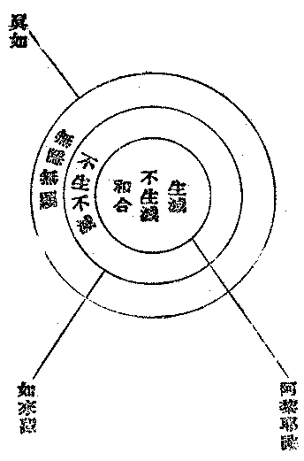
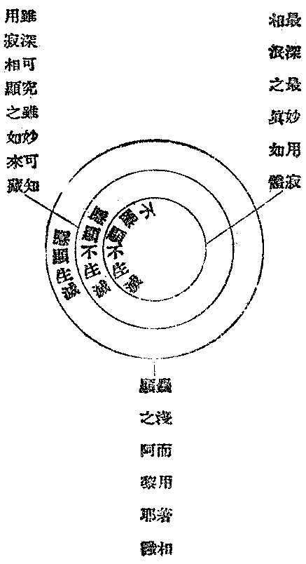
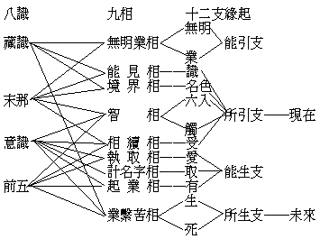
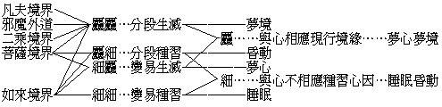

# 大乘起信論別說
（──九年初夏在武昌龍華講經會說───）

## 目錄

- 一　大乘起信說
    - 一　何謂乘
    - 二　何謂大乘
    - 三　何謂大乘信
    - 四　如何起大乘信
- 二　皈命三寶說
    - 一　何謂歸命
    - 二　何謂三寶
    - 三　何故皈命三寶
    - 四　如何皈命三寶
- 三　馬鳴大士造大乘起信論意趣因緣說
    - 一　造論者有何願欲故造論乎
    - 二　何故造此論及此論文義如此先後相次乎
    - 三　此論法義既皆具在佛所說經中何故須更造此論乎
- 四　摩訶衍一者法二者義說
- 五　依一心有真如門生滅門各總攝一切法二不相離說
    - 一　何謂一心
    - 二　真如門生滅門何故依一心有？一心何故有真如門生滅門乎
    - 三　真如生滅二門何故皆各總攝一切法乎
    - 四　真如生滅二門何故不相離乎
- 六　心真如是一法界大總相法門體說
    - 一　心真如是一法界法門體
    - 二　真如相是大總相法門體
    - 三　心真如相
- 七　依如來藏故有生滅心說
    - 一　何故不云依真如故有生滅心而云依如來藏故有生滅心耶
    - 二　生滅心何故要依如來藏而有乎
- 八　不生不滅與生滅和合非一非異名為阿黎耶識說
    - 一　不生不滅何指耶
    - 二　生滅何指耶
    - 三　如何和合耶
    - 四　如何非一非異耶
    - 五　何義名為阿黎耶識耶
    - 六　阿黎耶識有始終乎
- 九　阿黎耶識有覺義不覺義能攝一切法生一切法說
    - 一　有覺不覺義能攝能生一切法
    - 二　能攝能生之別
- 一〇所言覺義者說
    - 一　第一義覺
    - 二　相對相待有本覺不覺始覺
    - 三　依始覺覺心源不覺心源立究竟覺非究竟覺
    - 四　本覺不覺始覺究竟覺本來平等同一覺
    - 五　始覺斷不覺究竟本覺隨之成二種德相
    - 六　覺體覺自體相用
- 一　一所言不覺義者說
    - 一　第一義不覺
    - 二　念無法體自相不離本覺故不覺待本覺而立
    - 三　真覺無名義自相可說說真覺不離不覺故真覺待不覺而立
    - 四　依無明緣生三種細相依境界生六種麤相皆不覺相
- 一　二覺與不覺有二種相說
- 一　三眾生依心意意識轉故說
    - 一　佛法中心之定義
    - 二　佛法中意之定義
    - 三　佛法中識之定義
    - 四　合論心意識名義之通別偏圓
    - 五　意識
    - 六　眾生即依心意意識轉
    - 七　眾生依心意意識轉之剖解
    - 八　心生滅與生滅因緣
    - 九　本識轉識互為生滅親因緣
    - 十　無明染心互為生滅增上緣
- 一　四復次分別生滅相者說
    - 一　生滅相與心生滅及生滅因緣之分別
    - 二　生滅麤細因緣相
    - 三　心相體滅不滅義
- 一　五染淨熏習之淨法真如與染法之無明及妄心妄境界說
- 一　六熏習義者說
- 一　七云何熏習起染法不斷說
- 一　八云何熏習起淨法不斷說
- 一　九染熏習至佛有斷淨熏習盡未來無斷說
    - 一　染法熏習有斷
    - 二　淨法熏習無斷
- 二〇復次真如自體相者說
- 二　一復次真如用者說
- 二　二顯示從生滅門即入真如門說
- 二　三對治邪執說
    - 一　邪執
    - 二　一切邪執皆依我見
    - 三　人我見
    - 四　法我見
    - 五　究竟離妄執
- 二　四信成就發心者說
    - 一　辨發心人及其發心因緣。
    - 二　辨所發心及所修善行
    - 三　辨法性所成就之德相
- 二　五解行發心者說
- 二　六證發心者說
    - 一　淨心地
    - 二　菩薩究竟地
    - 三　證何所證
    - 四　菩薩利他之功德
    - 五　三無數大劫
    - 六　菩薩發心相
    - 七　色究竟處成佛
- 二　七修行信心分說
- 二　八總修施戒忍進行說
- 二　九別修止惡精進說
- 三〇修止觀行說
- 三　一專念方便說
- 三　二勸修利益分說


## 一　大乘起信說

### 　　一　何謂乘

乘者：謂今有法焉，能運行，可容載，依經過及前進之軌塗，就此出及彼達之界地，而譬如車乘也。據茲所譬之法，或將『見思十惡』為運載眾生入三惡道之『跛驢壞車』，當知此為引伸之說，未是乘之正義。何者？以其等於冥行險阻而墮坑落塹，不得謂之有前進之軌塗及彼達之界地故，簡此不名乘故。依解深密等經論，說乘為五：由人行五戒、十善還得為人，其功僅於不墮惡趣、不失人生而已。然亦得乘名者，以今濁世之人，大都鮮有不造惡業當墮惡趣者；得五戒、十善以為之仍運載入人道中，斯即具足乘之涵義，故得謂之乘也。或復簡除人乘亦不名乘，以從人道仍在人道，於乘所詮運載之以從此達彼之義未能顯著彰明也。故當從修十善、四無量心、九次第定，而由人入天以起乘義。唯應有人天乘、聲聞乘、緣覺乘、菩薩如來乘之四乘耳。然更有他義：由人入天，亦未得謂之乘。以雖前進而仍有退故，以雖此出而仍有墮故，未離牽轉繫纏之域故，猶憑業力招感之報故。故將此亦簡除，唯超脫業繫輪迴之出世三乘耳。夫出世三乘之於乘義，洵圓滿靡缺矣。顧彼聲聞之輩，但依託知苦、斷集、慕滅、修道之車乘，經過三界、九地向解脫界前進，得出離流轉界而達到解脫界而已。此車乘之所以為車乘，而何緣有是運載之以從此達彼之德用者，尚非所知也。故修聲聞行而證聲聞果者，亦於乘義未能圓滿，不得謂之乘。故唯有獨覺乘、菩薩如來乘之二乘耳。然彼獨覺之輩，雖能自得其法門用之建行致果，亦纔窺得其本然之理，成辦自利而已。逮得自利，即能乘所乘俱捨，而未嘗知何為有乘之真能乘者。故不能主其乘以自由施用，盡未來際乘之自運運眾，咸度之離苦得樂，常住而常無住。故獨覺乘猶然未能圓滿乘義，不得謂之乘；唯一真乘，但是從菩薩而如來之大乘耳。

### 　　二　何謂大乘

大義、乘義，論中自有說明。立義分之所立，解釋分之所解，要不過此大義與乘義而已。第今更就淺顯者言之：一曰、大乘者，對非大乘以言之者也，乃揀別之辭也，所謂最上乘、菩薩乘、勝乘、佛乘是也。即揀別彼世間、出世間之餘乘，非最上、非勝，非大士所乘乘之以成佛者；獨此是無上、最勝之大士所乘之成佛者，故特稱之大乘也。二曰、大乘者，絕對無餘以言之者也，乃廣苞之辭也，所謂普為乘、無量乘、一乘、圓乘、是也。即如眾生心攝一切世間出世間法盡之量為大乘量：依心真如大乘體言之，本來無有迷妄雜染之世間法及真覺清淨之出世間法一切差別，而此一切差別之法，無不當體都是平等真如。依心生滅因緣大乘自體相用言之，一切迷妄雜染世間法是大乘智德、斷德之所由故，一切真覺清淨出世間法是大乘智德、恩德之所成故，亦無不都是大乘法者。故大乘者，不但為菩薩，而善能普為種種根性樂欲不同之眾生，而隨宜以成就人天及三乘之行果者也。故大乘之為乘，亦隨之而成無量無數差別之乘。凡所有乘之體、相、力用，舉不外乎大乘，無二圓遍，非擬議思量文字言說所可推測度知，莫得而名，強名之曰大乘耳。小車、人力車、馬車等，人、天乘也。自由車、自動車等，聲聞、獨覺乘也。電車、火車等，大乘也：此亦譬喻之餘義也。

### 　　三　何謂大乘信

論中嘗自說信心有四種義，今更助發明之。信者、精純正確之心，自性淨善，而有力能轉淨其餘一切心心所法者也。故今此大乘信心之成就：第一、當如實了知心真如之大乘體，此即是一切法之最真實性。悟之與迷，唯視覺此、不覺此以為判故。不如實知此，則無真實理，故不能有大乘信心。第二、當如實了知如來藏之大乘自體相，此即是自心中所本具之一切淨覺性德。不如實知此，則無殊勝性，故不能決定大乘信心。第三、當如實了知如來法身具有大智、大悲三輪不思議化無量無邊功能力用，恆能普於一切眾生界為救、為護。不如實知此，則無究竟義，故不能增長充足大乘信心。一心中如實知真實理，如實知殊勝義，如實知究竟義；則精純正確而能自淨淨餘，發生一切功德，長養一切善根，謂之大乘信。

### 　　四　如何起大乘信

論中於分別發趣道相文中及修行信心分中，於如何起大乘信之義，亦嘗詳言之而深言之矣。今謂若在上上根利利智者，初用不著如何若何，佛祖出世皆為多事。即不然，亦纔聞便悟，悟便究竟。甚麼施、戒、忍、進、止、觀、皆不過是些沒用的閒家具。雖然、若不能真得如是，便切須按下頭來照顧足下，按部就班於施、於戒、於忍、於進、於止、於觀須循序修習；一法也不得缺少，一法也不得躐等。最要者、即在於施。施者、捨也：內一切捨，外一切捨，內外一切捨。若有一些些我我所法、玄妙理解、殊勝心境執著不捨者，便是蛇入竹筒，驢繫木橛，差以毫釐，失以千里，萬劫不能起大乘信。捨捨無犯故戒淨，捨捨無違故忍順，捨捨無住故進精，捨捨無起故止寂，捨捨無亂故觀徹。離、淨、順、精、寂、徹之極，則大乘信心自不起而起矣。又不然，則依大乘究竟義以專念一佛，尤為起大乘信之不可思議勝方便法門。若真得發起大乘信心，信有根義、力義，以根義故於大乘但有增進而更無減退；以力義故能轉捨一切染心心所法，能轉得一切淨心心所法。故唯起信之難，信起則於大乘可坐而進也。

## 二　皈命三寶說

### 　　一　何謂歸命

歸者，投向、依靠、奉託等義。命者，生命。一切所有，皆由有生命而有意義價值；今既根本上連生命都投向奉託依靠了，尚何有放不下、捨不得的！換言之，此即表示信賴之極，連性命都交託他。縱使因信賴他故而有斷壞卻生命之困難，亦決不以之退失信心而不信賴他。若能如此，則此信心便更無有能破壞之者。所謂不壞信是也。吾人若沒有此生命以上最尊重最寶貴之信賴，便埋沒在生命的覆盆之下，執著我我所法，絕不能有出離、開放、超越、解脫之希望。雖然、此極尊重寶貴連生命都投向依靠奉託他的信賴，豈輕易可漫然妄許哉！故欲言皈命三寶，則所皈命之三寶，不可先一精審其究為何指。

或云：皈者敬奉，命者佛聖教命，皈命即是敬奉佛及諸聖所垂教命之意義。此則以吾人恭敬信奉之心為能歸，而以命所歸之佛聖教命，說亦可通。然自以前解以「命」為能歸，以「三寶」為所歸，為皈命之正義。

### 　　二　何謂三寶

詳覈世出世一切所有法之最可寶貴尊重者，唯有佛、佛法、佛法僧之三事也。佛何故為第一極可寶貴尊重耶？十法界三世間中此最勝故；所起身、口、意三輪不可思議淨妙業用，常遍無礙自在故；所有無垢清淨識心靈覺，平等了知如如不二真性，及一切法自共差別因果之相，常遍無礙自在故；所現色身、器界，依中具正、正中具依，一入一切、一切入一，常遍無礙自在故；有深悲愍，等同一體，能常遍救護覺悟度脫一切世間之有情眾故。此中最勝者，即大雄也；三無礙自在，即大力也；大悲救世，即大慈悲也。為佛果與因聖、小聖及天人等所不共之果德，亦即佛果上所成真如法身妙用，所謂大乘自體相用之用大是也。佛法何故極可寶貴尊重耶？以即是佛之一切功德法藏身聚之體及相故。體、即一切法真實不虛、常如不動之自性；相、即此自性本來深廣無際、含藏無盡、具有無量無數淨妙德相，隨緣顯現，能發生一切有情眾之理解。乃心真如大乘體，亦即如來藏大乘自體相也。佛法僧何故極可寶貴尊重耶？以即是依佛法之如實義起如實解，依佛法如實義解起如實修行之大眾故。佛與佛法，不即不離，不一不異；佛法與佛法僧，亦不即不離，不一不異。佛，即僧之果、法之用故；法，即佛之體、僧之理故；僧，即法之事、佛之因故；不離不異。果故、用故，體故、理故，事故、因故；不即不一。不即不一，故謂之別相三寶；不離不異，故謂之同體三寶。統而言之，則三寶即「佛教」耳。

### 　　三　何故皈命三寶

此有二問：一、何故要皈命，不皈命不可乎？答曰：脆弱哉人生！身如泡沫，命如浮漚，入息不出，現世即謝。危險哉人生！莫知其所來，莫知其所往，盲人騎瞎馬，冥夜臨深谷。苦惱哉人生！有身則為身累，不能脫離饑渴、冷熱、疲勞、淫慾、衰老、病痛等患晝夜煎迫。有世則為世困，不能脫離颶、霾、淫、旱等，崎嶇、波濤等，毒蟲、惡獸等，盜賊、刀兵、監禁、冤仇等，前後交逼。人生的真際如此，那連身命都歸奉的最高信賴要不要有，可不可沒有，還叩之各人自心耳！或謂：歸依便可，何必定要說出連性命都投託乎！但世間一切所謂我、所謂我所有的，皆是以有生命故有的。若不根本上連生命都歸奉，則其歸奉者便不窮盡、不徹底。是故不歸託則已，要歸託則必須成一個連生命都歸託的徹底歸託。二、何故要皈命佛法僧？皈命其餘的不亦可乎？答曰：這不是個兒戲的事，乃是個極尊重極尊重的事。要須仔細審觀：有廣大於佛法僧者乎？有殊勝於佛法僧者乎？有圓滿於佛法僧者乎？有深妙於佛法僧者乎？若沒有能相過、能相等的，則不此皈命、更何所皈命乎！於此如稍有一點徘徊遊移，當知便是有所沾滯夾帶不能捨，便是不能澈底的連生命都歸託之。不以生命歸託則已，今既要連生命歸託之，則必須要歸託一確實可靠永久可靠的。如審觀結果唯有佛法僧，最為確實永久可靠，則必要皈命三寶的必然之故，也便可知了。

### 　　四　如何皈命三寶

審觀佛法僧之如實義，心中得其理會，心得與佛法僧之如實義相應一致，此為皈命三寶之第一步。繼之以心心念念對佛法僧渴仰勝慕，要在自己身心上將佛法僧實現，此為皈命三寶之第二步。正正確確覺得佛法僧是最真實的、最親切的自己及自己的究竟安歇處，這幻命所持的浮世、浮世所根的幻命，但以信託擁護佛法僧始有存在的意義價值。故雖致傷失生命、等棄敝屣，決不致搖動及擁護皈依佛法僧的信託，此為皈命三寶之第三步。由是根深力固，歷無數生世直至圓滿佛果，沒有一剎那頃不投契佛法僧的，則便是甚深甚深、無盡無盡、不可說不可說的皈命三寶。

## 三　馬鳴大士造大乘起信論意趣因緣說

### 　　一　造論者有何願欲故造論乎

按之論偈，馬鳴大士之所由造此論者，蓋出於馬鳴大士之四宏誓願也。偈云：為欲令眾生，即眾生無邊誓願度也。除疑捨邪執，即煩惱無盡誓願斷也。起大乘正信，即法門無量誓願學也。佛種不斷故，即佛果無上誓願成也。

### 　　二　何故造此論及此論文義如此先後相次乎

總而言之，諸佛菩薩之應化宣演，無非為令一切有情眾，離一切苦惱得究竟安樂而已！不同人或天等異生之類，凡所造作施為，皆雜染有為求世間名利恭敬之念也。馬鳴大士所以造此論之故，亦如此耳。然此論宗趣，具在立義、解釋、修行信心之三分；其文義前後層次所以如此條貫者，具如論文自明。

### 　　三　此論法義既皆具在佛所說經中何故須更造此論乎

以諸有情類根行性欲不同，故能令其信受了解之法緣亦種種不一，此固非經非律而是論也。在佛現身說法時代，聖哲際會，初不須律，況須論乎？嗣雖須律，猶不須論。蓋論由有人不信解佛所說法者，乃須有論以為之分別解釋耳。在佛時聞法者既皆機智淳利，而說法者之色身心智業用猶為殊勝，佛音圓遍，眾解俱超，信受奉行不涉疑執，故都不須乎論也。然馬鳴之世，則非復佛時矣；雖亦有能憑自己智力了解佛所說法者，然有需乎論者蓋多矣。然所須乎論者，欲以為解說佛經也，則其所須者應在詳細開析之廣論，復何為要此攝多義於少文之略論乎？要知一切法原來無真無妄、無迷無悟、無染無淨。以無悟故妄動，以妄動故發生困難苦惱結果，轉至末世濁劫以困苦極重切故，反省迷源改向真際之力亦深猛；非宏富玄勝之法義，不足以饜其心。然以迫切之故，復不能探眾經、尋廣論以求信解，乃唯有攝多義於少文之略論，為最適當之需要耳。嗚乎！此馬鳴大士之大悲勝義，正所以嘉惠今此末世濁劫之吾人者也！

## 四　摩訶衍一者法二者義說

論曰：『摩訶衍者，總說有二種。云何為二？一者、法，二者、義』。唐譯則作『摩訶衍略有二種：有法及法』。此同因明論比量三支上之第一宗支，所謂前陳名「有法」，後陳名「法」之式。有法者、但能任持自性，不能軌生物解；必能任持自性及能軌生物解，始得謂之為法。故言之前陳者，皆未得謂之為法。然後陳能軌生他解之法，固已為前陳中之所含有；且其所以能軌生他解者，還依此前陳而有；故此前陳者雖未得謂之法，而卻得謂之有法。有法者，謂能有於法也。此論之立義分。原但立「宗」，未出因喻。故唐譯蕅益裂網疏所立：眾生心即大乘體宗，真如相故因；眾生心能示大乘體相用宗，生滅因緣相故因之二量，皆屬非是。此宗既但立宗，則唐譯有法及法，似較梁譯一法二義為當。然細覈之，前陳有法與後陳法，二皆「宗體」之所依事，未是所立「宗體」；故前陳為「自相」，後陳為「共相」。自相有於共相，共相別於自相，連合發生之定義即謂之差別相。真能為軌範以發生他人之決定智解者，唯在乎差別相，而自相共相則為此差別相之宗體之所依者耳。然則此中既在出宗體之所依以建立宗體，不單是別出宗體之所依，而所重者尤在乎差別相之定義，故說為一法二義。以法指宗之所依──前陳、後陳，以義指差別相之宗體，意尤較圓。

此立義分中但立宗未出因喻之式，圖如下：

心性不生不滅畢竟平等無有變異不可破壞唯是一心故（因）

性不生滅畢竟平等無有變異不可破壞唯一無二者即大乘體（喻體）

如不隨人心迷悟轉變之方位（喻依）

如來藏藏識心意意識有覺不覺有淨不淨能轉不覺令覺轉不淨令淨故（因）

有覺不覺有淨不淨能轉不覺令覺轉不淨令淨者能示大乘自體相用（喻體）

如人依方故迷悟方不迷（喻依）

雖為此說，今按論文意猶不然。原論主之意，大乘之大乃彰表詞，大乘之乘乃比況詞。所彰表者、所比況者，究為何法乎？為指出所彰表所比況之法，故指出『眾生心真如相及眾生心生滅因緣相』之世間出世間一切諸法，所謂「一者法」者此也。雖知大之所彰表者、乘之所比況者即為『眾生心真如相及眾生心生滅因緣相』之世間出世間一切諸法，然猶未知何義故彰表為大，何義故比況為乘；由是乃依眾生心釋出三種大義及二種乘義，所謂『二者義』者此也。故此中雖有立三支比量之第一「宗」支之理，在論主則初未嘗以立比量之式而出之者。故比較二譯，自以梁譯一法一義之言為尤善。

## 五　依一心有真如門生滅門各總攝一切法二不相離說

### 　　一　何謂一心

佛為眾生說法，就眾生以指心，故即謂之眾生之心。直從心以言心，故又謂之一心：非二故謂之一，而其實非一非非一。故一心有『一切一心』及『一一一心』之二義：一切一心、是一法界心即心真如體，所謂一真法界藏心是也。一一一心、是遍在如來眾、菩薩眾、獨覺眾、聲聞眾之四眾，及遍在胎生、卵生、濕生、化生之四生，乃即十法界眾生心是也。明此一心之義，則二門及二門不相離義亦可知矣。

### 　　二　真如門生滅門何故依一心有？一心何故有真如門生滅門乎

門者義門，即依法性所顯義相，能軌範生心、發解起行、從因致果者是也。一切法義皆不離心而有，舉心即舉一切法義。真如即一切法義之平等本體；生滅即一切法義之差別現象；是故真如、生滅皆依一心而有，是故一心有此真如、生滅二門。

### 　　三　真如生滅二門何故皆各總攝一切法乎

以此二門不相離故。真如即一切法之實性故；生滅即一切法之共相故。一切法者，即是雜染法、清淨法，世間法、出世間法等也。

### 　　四　真如生滅二門何故不相離乎

二皆依一心分別開示故，不離心故，故不相離。譬如無變異之濕體，與有起滅之波浪相，皆依一水存現，不離水故，故不相離。依唐譯曰『展轉不相離』者，一切生滅相皆依妄念有，妄念當體即真如性，此真如門中二門展轉不相離也。妄境妄心從無明起，無明離真如無自體，真如離妄心無自相，此生滅門中二門展轉不相離也。復以不相離故，二門皆各總攝乎一切法：謂生滅門不但攝一切生滅法，且總攝一切真如法；真如門亦不但攝一切真如法，且總攝一切生滅法。以真如即一心之全，如一心攝一切法盡故；生滅亦即一心之全，如一心攝一切法盡故。

## 六　心真如是一法界大總相法門體說

### 　　一　心真如是一法界法門體

舉要言之，諸法本來唯是一心，是一法界體義。言真如亦無真如相，無說無念，隨順得入，是一法界法門體義。今舉論文以分證之：從『所謂心性不生不滅』起，至『但隨妄念不可得故』止，正明一法界體。法界者，是諸法本元義。從『言真如者』起，至『名為得入』止，明一法界之法門體。法門者，是可由之生解起行義。『心性不生不滅』，示圓成實性以直指一法界體也。『一切諸法唯依妄念而有差別，若離心念則無一切境界之相』，就遍計執性所執境，本來畢竟空寂以顯一法界體也。從『是故一切法從本以來離言說相』，至『但隨妄念不可得故』，就依他起性一切法，離遍計執、即圓成實，以明一法界體也。『言真如者』至『故名為真如』，持性生解之法也。『問曰』以至『名為得入』，從行致果之門也。

### 　　二　真如相是大總相法門體

一者、如實空，以能究竟顯實故；二者、如實不空，以有自體具足無漏性功德故；即是大總相體。皆絕待無外謂之大，皆統攝無遺謂之總，依言說分別其義謂之相；究竟顯實有自體故，謂之大總相體。『所言空者』至『唯證相應故』，此即顯大總相法門體之義者。於一依他起性心上，用遮門以空遍計執之妄，用表門以示圓成實之真。又復即遮而表，即表而遮，遮表俱彰，表遮同絕，可見立言之巧！

### 　　三　心真如相

舉要言之，即是一法界大總相法門體耳！

## 七　依如來藏故有生滅心說

### 　　一　何故不云依真如故有生滅心而云依如來藏故有生滅心耶

名無取實之功，實無守名之德，固矣。然而隨義立名，亦復各有攸當；名各有當，義乃可解。故真如，所以名一切法一相無相、一性無性、離相離性之平等本體者。如來藏，所以名一切法隱含在雜染依他起相中之清淨自體相者。生滅心，所以名一切法生滅及生滅因緣與生滅相者。一切法中舉水言之，水自體具有清明融通等德相，在顯現位曰法身；在為波浪等依他起相所隱藏而不遺失位，曰如來藏；依此水之自體相所變起之波浪等相，曰生滅心；水與波浪或冰或湯等等直下不二真實常如之濕體，曰真如。此真如不唯無生滅之起盡，亦復無隱顯之轉變，故不得言依真如有生滅心。如來藏雖亦無生滅之起盡，而可有隱顯之轉變，故得言依如來藏故有生滅心。譬如不應曰依濕故有波浪，但應曰依水故有波浪也。然今亦不曰依法身故有生滅心而但曰依如來藏故有生滅心者，尤有深意：蓋如來藏本以名隱覆在依他起相中之自體相者，故言如來藏雖但指隱而未顯之自體相，而彼能隱覆此如來藏自體相之生滅心依他起相亦即與之同時而著；不同言法身則與能顯此法身自體相之一切波羅密功德同時而著也。言如來藏，雖但指不生滅之自體相，而生滅之依他起相亦即與之同時而著，故可見但是同時分別出性淨之自體相與業染之依他起相，而指業染之依他起相為依性淨之自體相而起耳。知此、則本覺本不覺之義明甚，斷不致翹心妄執如來藏為未有無明前之另一時期，而生『後時何故忽起無明』之疑也。觀此、又可見此說依如來藏故有生滅心者，其立言之善，無以復加！

### 　　二　生滅心何故要依如來藏而有乎

生滅心是依他起相，本無自存之體。所云依他起者，謂依如來藏及無明所起，譬如波浪依水、依風而起。無明亦為助緣，而親依之轉變而起之本因端在如來藏而已；猶波浪所親依之自體端在乎水。故生滅心必要依如來藏而有。

## 八　不生不滅與生滅和合非一非異名為阿黎耶識說

### 　　一　不生不滅何指耶

不隱不顯與隱顯和合，非一非異，名為如來藏。不隱不顯何指？指真如體。隱顯何指？指自體德相，故非一；然自體德相由之隱而不失之所依，體即真如，真如所本來具有不可離滅之法即自體德相，故非異。此不隱不顯之真如，及不隱不顯與隱顯和合非一非異之如來藏，二皆此中所云之不生不滅。

### 　　二　生滅何指耶

前七轉識心心所、所變、所緣諸法，與第八識所受熏、所持種、所感報、所變現之諸法，皆此中所指之生滅也。

### 　　三　如何和合耶

本是一法，據義分之乃成真如、如來藏之不生不滅與八識生滅。此一法者，有時謂之眾生心，有時謂之一心，今在此處則謂之阿黎耶識。據彼二義，在此一法在義不相即，而在法又不相離，是故謂之和合。

### 　　四　如何非一非異耶

此為生滅，彼為不生不滅，故非一。全水在波浪時，滅去波浪不但無水亦復無濕，非濕則無水，非水則無波，義尤可知，故非異。依他起法皆和合相，和合相義，法爾如是，不即不離、非一非異故。

### 　　五　何義名為阿黎耶識耶

阿黎耶此云藏，有能藏、所藏、我愛執藏之三義。成唯識論等多就我愛執藏以名此識，故其義稍狹。此論多就能藏以名此識，能藏通於異生、如來，故其義最寬；與成唯識論等所云根本識、阿陀那識同義。此中真如、如來藏、阿黎耶三位，雖不離不異而皆能盡收一切法，然其內容之深淺與外延之廣狹，亦殊不即不一。茲作圖以表之如下：




外延以真如為最廣，內容以阿黎耶識為最深。就大乘以辨之：則真如、為大乘非大乘之通體，如來藏、為大乘之自體相，阿黎耶識、則為大乘自體相用。從另一式觀之，又可為圖如下：




於此三位相為比對，就其各各特勝之一點以觀之：則真如者、大乘之體大，如來藏者、大乘之相大，阿黎耶識者、大乘之用大，又大乘之乘也。

### 　　六　阿黎耶識有始終乎

阿黎耶識無始無終而可有一分有終。此義如何？以本來唯是此阿黎耶識，就此阿黎耶識內究之，而知有在隱而可顯之不生不滅自體相，則謂之如來藏。就此阿黎耶識外發之而為三細、六麤以及前七心心所法所變所緣諸法，則謂之心生滅。不問為心生滅、為阿黎耶識、為如來藏之一切法，一一直下無隱無顯、無生無滅之真實常如體性，則謂之真如。此阿黎耶識之所以無始無終也。以悟真如故究竟得顯如來藏自體實相，而阿黎耶識一分和合染相永滅不有。此阿黎耶識之所以可有一分有終也。然此中真如、如來藏、阿黎耶識之分別，皆就原來位──凡夫位──以言之耳。若就究竟位──佛位──以言之，則常寂光真如、圓明自在如來藏、無垢清淨藏識、皆以名『如來法身』而無二無二分者也。如來法界藏身之量，正同凡夫阿黎耶識之量，具足自體相用。不過藏識是生滅牽轉晦昧雜染之相，而法身是常寂自在圓明清淨之相而已。

## 九　阿黎耶識有覺義不覺義能攝一切法生一切法說

阿黎耶識即眾生心，故雖說生滅門，而仍具真如、生滅之二門。展轉遞降言之，一根、一塵、一聲、一色、無不即眾生心全個，亦無不具真如、生滅二門。蓋動起即生滅，而靜止即真如。一切法一法，一法一切法，無乎不當無乎不然者也。而阿黎耶識者，即一切法之根本依也。其具有真如、生滅之二門，自不待辨。今剋就此識自身於真如及生滅之特著者以言之，即覺與不覺是也。覺義、不覺義，論自分釋。於此今有疑者二：

### 　　一　有覺不覺義能攝能生一切法

為此識有覺不覺二義故，能攝一切法生一切法耶？為此識所有之覺與不覺，各各能攝一切法生一切法耶？此有二說：一、謂論中但言此識有二種義能攝一切法生一切法，不言二種義各能攝一切法生一切法。故直以此識有二種義故，故曰能攝一切法生一切法耳。二、謂剋就義相言之，此識有覺義故，能攝一切生一切出世間常樂真淨之法；此識有不覺義故，能攝一切生一切世間無常苦空無實不淨之法；是以此識能攝一切法生一切法。若就展轉言之，依始覺故說有本覺，依本覺故而有不覺，依不覺故而起始覺，依始覺故而同本覺；此則不覺待覺，覺待不覺，二義相有，亦復相無。以相無故，各能展轉攝一切法無欠無餘；以相有故，各能展轉生一切法無欠無餘。後文顯示染淨互相熏習起一切染淨法，義尤可證。故此二說，後說為優。

### 　　二　能攝能生之別

何故雙言能攝一切法生一切法，不單言能攝、亦不單言能生？若能攝與能生義各有殊，則其所殊者又安在耶？答曰：不生不滅自體相法，離生滅相，離因果相，故在真如如來藏雖復為一切法所不能外，而但應言能攝而不得言能生。於一切法不能外於真如如來藏者，一一無不離生滅相、離因果相故。獨在依他所起一切功能業用之法，乃得有果生因滅、因滅果生之事，可言其能生所生之相。此識為一切法種子識，能生一切法，乃是其唯一無二之功能，故於此處特表出之。真如但體，如來藏但自體相，故但能攝。阿黎耶識是自體相用，以有用故，故亦能生。今引大涅槃經以分別一切法生不生義如下：


```
　　　　　　　　　┌真如…………………………不生不生。
　　　　　　　　　│如來藏………………………生不生。（雖為他法依之以生，而在自為不生。）
　　　　一切法一心┤藏識…………………………不生生、生生、生不生。
　　　　　　　　　│意意識………………………生生、生不生。
　　　　　　　　　└前五識………………………生生。
```


## 一〇所言覺義者說

此論所說藏識覺義一章，字句精圓，關節深隱。析取論文，略通貫之。

### 　　一　第一義覺

直示覺之當體，體即如來平等法身。換言之，即是真如如來藏耳。覺之當體即是真如，而此真如遍為覺不覺等一切法之當體，故曰平等法身，亦曰本來平等同一覺故。在此第一義覺，絕不帶本覺、本不覺、始覺、究竟覺等對待假相，彼等對待假相，皆依此立。

### 　　二　相對相待有本覺不覺始覺

此等對待假相，一一皆依第一義覺安立，一一當體即是第一義覺。而其對待安立次第，列為五層：


```
　　　　甲　依第一義覺立本覺………………………………………依此法身說名本覺
　　　　乙　本覺對始覺說（非第一義覺可對之說本覺故）…………何以故本覺義者對始覺說
　　　　丙　以始覺同本覺（始覺起修對治不覺究竟異故）…………以始覺者即同本覺
　　　　丁　依本覺有不覺（始覺之所覺者即此）……………………始覺義者依本覺故而有不覺
　　　　戊　依不覺有始覺（始覺之所起者以此）……………………依不覺故說有始覺
```


### 　　三　依始覺覺心源不覺心源立究竟覺非究竟覺

甲、三乘內凡覺念滅相位：如凡夫人（能覺人），覺知前念起惡故（所覺法），能止後念令其不起（覺之效）：雖復名覺，即是不覺故（覺有限）。乙、小乘聖大乘賢覺念異相位：如二乘觀智初發意菩薩等（能覺人），覺於念異（所覺法），念無異相；以捨麤分別執著故（覺之效），名相似覺（覺有限）。丙、大乘聖覺念住相位：如法身菩薩等（能覺人），覺於念住（所覺法），念無住相；以離分別麤念相故（覺之效），名隨分覺（覺有限）。丁、大乘佛果覺念生相位：如菩薩地盡（能覺人），滿足方便，一念相應，覺心初起（所覺法），心無初相：以遠離微細念故，得見心性，心即常住（覺之效），名究竟覺（覺無限）。是故修多羅說：若有眾生觀無念者，則為向佛智故（引經證成）。此中示修行佛法人，從麤至細由淺入深之漸進次序，簡明之極。復以能觀無念即為向佛智故，則漸次即無漸次，而覺覺當體直顯第一義真覺。

### 　　四　本覺不覺始覺究竟覺本來平等同一覺

生住異滅四相，皆因不覺有妄念故，依妄念所假立之妄相。覺之究竟無不覺故。唯覺無念；念且自無，依念所立初起及終滅等假相，尚何能有？譬如石女兒且自無，安有石女兒之生年及死月哉！圓覺離念；念且自無，念上初起相自更不可得。無初起故無念，無念故無不覺，故但有本覺，不得有不覺。不覺故有妄念，念妄故有假相。假相名為眾生，眾生居在妄念。眾生居在妄念之內，猶吾人今居在宇宙之內。既居其內，豈能得其初始？故本來是無始無明不覺，亦不得有本覺。然妄念實本無，得如實知，則知依妄念所立之生住異滅四相，以等是無念故，等是無相。等故無各各之『異有時』，及一一之『自立處』。無念故無初起，無初起故無起念之不覺及覺初起之究竟覺。無念故無前念滅，無前念滅故無覺前念滅之始覺，無始覺故無對始覺說之本覺。然復以無念故，本來平等同一真覺。

### 　　五　始覺斷不覺究竟本覺隨之成二種德相

一、智淨相：始覺斷不覺究竟時，所顯之自性清淨心，即如來藏自體相之出障圓明也。二、不思議業相：始覺斷不覺究竟時所生之妙用，即轉八識成四智之大乘用也。合之、即是大乘自體相用，亦曰如來法身自體用相。

### 　　六　覺體覺自體相用

一者、與虛空等如實空鏡，喻第一義覺真如體。二者、與虛空等如實不空因熏習鏡，喻覺自體相如來藏。三者、與虛空等不空法出離鏡，喻覺自體相出障圓明佛果法身。四者、與虛空等緣熏習鏡，喻覺自體相用出障圓明自在佛果法身大用。第一、通於因果凡聖、異生如來、有情無情、有形無形、一切法皆平等一性，無異生性、無佛性之佛性。第二、確指有情眾生，在於因位正因覺性。第三、第四、確指果位之法身菩薩分覺及如來大圓滿覺。第三、亦是因位菩薩了因覺性。第四、亦為異生菩薩緣因覺性。第三、第四、亦同前說覺之智淨相及覺之不思議業相。

上來六層所言覺義，洵無上甚深微妙圓滿之法門哉！其要唯在直下純覺遺念。

## 一　一所言不覺義者說

### 　　一　第一義不覺

論云：『所言不覺義者，謂不如實知真如法一故，不覺心起而有其念』。非曰不知，特是知不如實。非不知故本覺，不如實知故本不覺。非不知是知，不如實知亦是知，故本覺、本不覺皆第一義覺。然依何證其不如實知耶？即依如實知真如法一故。如實知真如法一而離念，不如實知真如法一不覺心起而有其念；二皆依真如法。此一切法等依之真如法，平等常一，不隨覺不覺相為二。是故離念而覺，契真如法一故。有念起為不覺。念即虛妄想相之差別心境故，念皆由不覺而起故；覺時即無念無起故，無念無起即契會真如法一故。

### 　　二　念無法體自相不離本覺故不覺待本覺而立

此中有比量云：眾生念不離覺體宗，以無自體相故因，既無自體相則不能離本覺自立（同喻體），如迷方人依方故迷用（喻依）。此中迷方人之一喻，分有三喻：所起迷喻藏識眾生念，所迷方喻真如如來藏，能迷人喻如來藏藏識。

### 　　三　真覺無名義自相可說說真覺不離不覺故真覺待不覺而立

譬如東西方位，原是人心上之定理，不迷方者本無言說。忽有迷方者迷東為西，生種種之疑念，知者遂起言說而為指出之曰此為東、此為西。如有人為迷塗人指點云彼非正東，彼是正東，彼非正東而唯此為正東，某處某處即在正東；此其言、設非依迷塗人之所迷，無端又安得而有其說哉！然此一經指點，若迷塗人確得明白，則以如實知故，於此更當不自再起東西易位之迷。故真覺亦待經過不覺而確立。

### 　　四　依無明緣生三種細相依境界生六種麤相皆不覺相

所言不覺，亦曰無明，二者異名同義。此中直緣無明起者，即唯心動業生之相，所謂業相是也。非謂先有一期唯為不覺，後有心動之業相生。直以心動即業、業即是生，而一切之覺亦皆從心動而生。心何所緣而動則不可覺，乃即以此不可覺為心動之緣。依心動之緣而生者，又皆迷闇不覺。覺即空無，皆為不覺之相，故曰依不覺故生三種相。此不覺即阿黎耶識能生一切染法之緣。生緣有四：辨之心動，心體本具能動之種，曰親因緣。以不覺故冥然妄動，曰增上緣。動無間斷，曰等無間緣。此中尚無所緣之緣，至於依能見故境界妄現，則有所緣緣耳。然動即是阿黎耶識。能見及所見之境界，即是識變之見分、相分。見分即是末那所執內我；相分即是根身、器界、種子，為前七識所分別之我我所法之依。又根本無明即末那之法我癡，及彼無明所起諸法，通前七識緣所緣法，皆悉無自真體；不能離藏識而有，與藏識和合非一非異。約非異義邊，唯一藏識，更無他有，故將三細、六麤之九相皆說在藏識。或以根本無明唯屬藏識，非是末那之癡。不知藏識本以如來藏及七轉識和合立名，若盡滅七轉識則即成如來藏，單在如來藏位何得尚有根本無明？如來藏若尚有根本無明，則根本無明便無可斷除，亦無成佛之義。何者？以如來藏本以明真如體自有之畢竟常恆不可斷滅不可破壞之自真相故。故根本無明必約與未那和合非一非異之藏識位，乃能說之。末那者何？即動是也。動依心起，是為和合。其起初不可知，是為根本無明。但有妄心妄境依無明而生起，而彼無明則無起而有斷，是故謂之根本無明。無明何以無起？以即起故。無明何以有斷？起則有業，業則有苦，苦則有覺，覺徹源底則便永不起故。依心動故能見，是依無明妄動起妄心，即依自證分起見分也。依能見故境界妄現，是依心動及能見起妄境，即依自證分、見分起相分也。藏識之證自證分即如來藏心，自證分、見分即與末那互依俱有之藏識自位，所緣相分即通為末那及前七轉識之和合位。故下曰以有境界緣故，復生六種麤相。然雖為前六識生緣而唯是藏識之境界，並非前六境界，故是細相。是以藏識無始來有一識俱轉，所謂末那。時與二識俱轉，所謂意及意識。有時亦與三識及至七識俱轉，謂於眼識等前五識或一識或二識乃至或五識俱轉故。未嘗有一時不與末那和合俱轉者，故以和合非一非異名為藏識。而至末那完全轉為平等性智（不動地位，即如來藏心不與末那動和合為心動之藏識）之位，捨阿黎耶識名而正名為如來藏也。依境界緣所生六種麤相可知。今再為表以補前番略釋於三細六麤與八識及十二有支關係所未盡之義：




由是觀之，此中煩惱雜染、業雜染、生雜染之一切雜染法，皆無明所生，以展轉皆緣不覺起故；皆無明所攝，以起動皆是不覺相故。而無明不覺無自體真相，直下即如來藏真如，則不覺義能攝一切法、生一切法者明矣。

## 一　二覺與不覺有二種相說

藏識之覺即如來藏，不覺即和合識。是故名為藏、識，而以覺不覺義總顯『藏識』。藏識即眾生心，即一法界，即一切法一心。是故覺與不覺之相，或圓明無漏或無明有漏，或自在清淨或業繫雜染，當知皆是染幻差別之性及對治染幻差別所隨起之作用相。然彼當體之自真實相，則直下即真如如來藏性，無有覺與不覺相之可別異。換言之，即在於體自真相，無如來與異生之可區別。故曰：『一切眾生，本來常住入於涅槃，菩提之法非可作相，畢竟無得』。此說微塵瓦器之喻，他經亦喻為微塵與泥團。今更為合喻之：微塵微形可喻真如；泥團泥形可喻藏識；瓦器隨器形別，器用亦異，可喻眾生及隨眾生所現應化身佛。瓦器化還極精微微塵泥，則無一切器形之別，而實具有能為一切器用之性。然微塵不即能生一切器用，在泥團始能生器用。以大地皆微塵性故，皆化成極精微之泥，隨所需用能生種種上妙形器，隨用皆不掩其精微之體，不同雜質泥團所成瓦器，自有種種駁異性質。故佛為隨染幻差別，眾生為性隨幻差別。然此種種業幻差別，剋觀本體之自真相，畢竟平等，唯是一心，實無差別可得。故心生滅即不生不滅，心生滅門於一切法攝無不盡。舉要言之，心生滅者，即覺之如來藏、不覺之和合識，藏與識和合之藏識。

## 一　三眾生依心意意識轉故說

### 　　一　佛法中心之定義

甲、肉團心：此為隨俗而說，實是身根所攝，為識所變所緣色法，絕非心法。此應首先揀除在心之名義之外者。乙、緣慮心：緣謂對觀，慮謂向思。此義遍通眼識等六識與末那識及藏識八個心王並各心數，皆能對自識所觀之境而向之起思故。普通所言心者，即是此義。丙、集起心：集謂積集，起謂生起。能積集種種所經過之緣慮而不遺失者，能重新生起所經過之緣慮及生起未曾有之緣慮而不斷絕者。此心直就其能體言，即唯第八藏識。而第七末那識執持第八藏識為我愛執藏者，亦與有功。合而言之，此心乃專指我愛執藏者。斯在眾人雖亦無不有之，皆日用而不知，故與下所言真實心同為能生諸緣緣所遺者。或者雖欲有所了知，而所知皆不能適符其實，故反成為緣慮中之種種顛倒虛妄之相。自我、個性、靈魂、上帝、天命、真宰，隨相妄名，隨名妄執。丁、真實心：斯即此論所言如來藏真如心。實、謂如來藏自體實相，真、謂心真如性。此亦雖為吾人日用而不知之所遺，唯佛菩薩如實證知。在吾人心行中概未能明了證知，或唯隨所緣慮構畫種種虛妄想相，安立種種虛妄名義，隨名取相，妄想執著；或復得聞如實證知者之示說，漸起了解，決斷一切闇疑邪執，內向契會，體驗一切動靜語默，久之久之乃亦能得如實證知。然唯第八藏識專有集起之義，深含真實之性，獨得心名。

### 　　二　佛法中意之定義

梵語末那，此譯曰意。分析其義：甲、能緣慮心前滅後生、自類引續不斷者謂之意，此義通於八個心王。乙、恆審思量者謂之意，此義專在第七心王。思量雖為八個心王之所同有，但在第六審而不恆，第八恆而不審，前五不恆不審；唯此第七恆而且審，由是獨得意名。丙、染污意：此指異生地位中與我癡、我見、我愛、我慢四根本煩惱相應意，為一切煩惱雜染、業雜染、生雜染之所依止者。即異生性（非涅槃性、佛性），亦即生滅因緣。所謂了脫生死者，即了脫乎此而已。故此義通緣慮、集起，不通真實。丁、清淨意：此指大乘聖位中與平等性智相應意；此俱通緣慮、集起、真實心，亦通佛位四智相應八識心心數。

### 　　三　佛法中識之定義

甲、了別曰識：明了分別之義，通於八個心王及諸心數。乙、了別事境曰識：事境、指六塵之境界，前六識皆依止境界緣而生起，其了別用較為粗顯，此義專在前之六識。丙、計執名相曰識：此義專在第六意識。俗語所謂有意識、無意識者、亦指此，佛經中所謂破除妄識者亦指此。丁、白淨識：此義即指聖位、佛位四智相應之八識心心數。

### 　　四　合論心意識名義之通別偏圓

依此心、意、識三名之定義觀之：別、則心指第八藏識，意指第七末那，識指前六或第六識；通、則心意識三皆可通於八識。偏、則指第六或前六為妄識，指第七為染意，指第八為真淨心；圓、則皆通真妄、染淨。或有於此三名通別、圓偏、未能了解，妄執一名，矯排餘說，當知皆由未善名義之故。此唐宋之古德，乃至輓近若楊仁山居士等，間亦往往不免。

### 　　五　意識

此中所云意識，內依染汙意而外緣六塵境界，率前五識同行或自獨行以為了別；故此亦將前之五識攝在意識，但轉名之曰分離識及曰分別事識，而不將眼識等一一別說。

### 　　六　眾生即依心意意識轉

『眾生依心、意、意識轉』，即與論初所標之眾生心名義分隅相等。眾生即心、意、意識所轉變起之一切我我所生滅法。換言之，即人生宇宙。心、意、意識，即眾生所依之體及自體相用。依上所說之心、意、意識三名觀之，言眾生心則攝世間出世間一切法盡，其義不昭然若揭乎。

### 　　七　眾生依心意意識轉之剖解

甲、眾生，即是成唯識論中由假所說種種我，若人格等、士君子等、聖賢佛等、畜生天神鬼等；及由假所說種種法，若本體等、若物質等、若時間、空間等、若精神界、自然界等，即此論為生滅所生滅之法也。乙、轉，即成唯識論『有種種相轉』之轉字，及『彼依識所變』之變字。合此轉謂轉變、轉起之義，正指生滅；以生滅即是轉變、轉起，起即為生，變即為滅故也。丙、依心、意、意識，即成唯識論『彼依識所變』之依識二字。彼論繼言『此能變唯三，謂異熟、思量及了別境識』。異熟、即此論所云心，思量、即此論所云意，了別境識、即此論所云意識。生滅所生滅之眾生與眾生之生滅，皆依心、意、意識而有。此即說明生滅所由之故，即此所云生滅因緣是也。

### 　　八　心生滅與生滅因緣

問：生滅究為何物所有？則心生滅一章解答之曰：是心生滅，非有他物生滅，故曰心生滅也。問：生滅究因何故而有？則此章解答之曰：依心意意識轉故生滅，非有他故生滅，故曰生滅因緣也。無有一生滅離生滅之物者，亦無有一生滅離生滅之故者。故心生滅與生滅因緣，皆盡生滅之邊際。換言之，即皆攝八識心心數法所變所緣是也。然在以心生滅答『生滅者究為何物』之問，則其勢自側重於舉出藏識以為答。猶之問波浪何物所有者，必答曰水（如來藏），或動之水（藏識）。而在以眾生依心意意識轉答『生滅何故生滅』之問，其勢自側重於舉出末那以為答。猶之問波浪何故而有？必答曰動，或水之動。今之說此，要明此之二章，所依以說明之法非有別，所欲以說明之義各有殊。非有別故，皆是心、意、意識，譬如波浪之水無非動者，波浪之動無非水者，水之動、動之水亦無非波浪者。各有殊故，心生滅以統歸藏識為主，生滅因緣以統歸末那為主，一主在水，一主在動故也。或者不明其非有別：定執心生滅章但說藏識，此章但說末那。或執三細相及業識、轉識、現識定屬藏識，不屬末那。或執別有根本無明定屬藏識，不屬末那。此由不明在生滅之藏識無非末那。末那即無明，無末那即無生滅，猶之在波浪之水無非動，動即風，無動即無波浪，故不善能通達其義。或者不明其各有殊：既不知前章所說之主要者在藏識，復不知此章所說之主要者在末那，故或有執此章亦專說藏識者。古今略為分解。

### 　　九　本識轉識互為生滅親因緣

在此文中，本識即藏識，轉識即意、意識。其說『依阿黎耶識說有無明不覺而起能見、能現、能取境界，起念相續故說為意』，從藏識中一切心心所法，所緣所變種子起現行也。此意復有五種名，乃至心滅則種種法滅故：前七現行心心所法，熏習藏識生種子也。復次、言意識者，依相續意，在凡夫位取著轉深，計我我所種種妄執，隨事攀緣，分別六塵，名為意識，亦名分離識，又復說名分別事識。此識依見愛煩惱增長義故。依此復生有支習氣，以成三界凡夫業繫生死。前意及前六識但為熏成名言我法習氣種子，起諸名言我法現行；至此意識率前五識熏成有支習氣種子，能作增上緣招異熟生死之果。別見大乘起信論略釋所分解。

### 　　十　無明染心互為生滅增上緣

顯無明起染心唯佛能知，此即前覺義中『覺心初起』之時、即成佛義，故此云唯佛窮了也。具如論釋。明六種染心治斷差別；明不了一法界無始無明之治斷差別；釋相應義不相應義；顯染心名煩惱礙、無明名智礙之義，具如論釋。

## 一　四復次分別生滅相者說

### 　　一　生滅相與心生滅及生滅因緣之分別

甲、心生滅者，指出能有乎生滅之體實者也。以生滅不自立，依他立故。所依之他何指？指如來藏藏識。譬如吾人所做之夢不能自有，依乎吾人睡眠昏動之心而有。乙、生滅因緣何指？指生滅之何由而起。以生滅不自起，依他起故。所依之他何指？指藏識、意、意識。譬如吾人所做之夢不能自起，由乎吾人心之睡眠昏動而起。丙、生滅相者，正指一切依他所起生滅法之幻相。譬如夢之夢心夢境、及夢心夢境所由起之睡眠昏動等、麤細層次相也。

### 　　二　生滅麤細因緣相

『一者麤，與心相應故；二者細，與心不相應故』。以至『因滅故不相應心滅，緣滅故相應心滅』。其義如下：




此中境界之義，是所了知之境之義。所了知之境，即是所解脫超出之境。如來究竟解脫超出乎睡眠之夢本，故能究竟了知睡眠為夢之本。離睡眠後，非無吾心自真體相。而離吾心，則無睡眠法之自體，睡眠且無，依睡眠所起之昏夢心境，本空可知。而凡夫者但知著夢境為實有，要夢境之常有、種種愛取。二乘者但知夢境之可滅，要夢境之速滅、種種解脫。更有不得其方法者，要有要滅，於中妄作功用而成種種邪魔外道；若中國屬於道教之各派，及印度彌曼差、數論、勝論、瑜伽等是也。菩薩乃知此夢境者，皆由夢心昏動而現，故知一切夢境唯心；亦能分知夢心昏動由於睡眠而起。但因未得全醒故，猶不得完全切實了知離卻睡眠之吾心真實耳。

### 　　三　心相體滅不滅義

此中心相，指心之睡眠及睡眠和心所起之夢心、夢境。此中心體，指遍在睡眠、離睡眠之真吾心。此中心智，指吾人離睡眠之醒覺心。故曰唯心相滅，非心體滅，非心智滅。

## 一　五染淨熏習之淨法真如與染法之無明及妄心妄境界說

此中真如，指遍在睡眠、離睡眠之真吾心（喻真如體）。其自性實相（喻如來藏）與睡眠（喻無明）所起夢心、夢境（喻妄心妄境界）不適當者，遍在睡眠及離睡眠，故能為睡眠及夢心之所熏習，而自性實相是明覺真確。與睡眠昏動迷亂恍惚心境不適當，故能內熏睡眠使之醒覺，滅除一切夢心夢境；而成醒覺之正知心與常寂境，現為種種淨妙佛土之用。

## 一　六熏習義者說

非睡眠非非睡眠之吾人，本來無夢無醒，依此說為本真如體。非非睡眠故，亦依此說為根本無明。非睡眠故、亦依此說為本覺真如如來藏。以非睡眠之吾心，即非非睡眠之吾，故得為睡眠所昏動而起種種夢心、夢境。依此說為『真如淨法實無於染，但以無明而熏習故則有染相』。以睡眠所起夢心夢境即非睡眠之吾心，故夢心得由之反熏睡眠，熏使醒覺。由睡夢而醒覺，則實現非睡眠之吾心而離絕非非睡眠之睡眠。此時不唯真覺心境明明實現，即睡夢心境亦了了內知。對彼了了內知而非現實之夢心境，乃能確知此為真實心境；亦復對此真覺心境，乃能確知彼為亂夢心境，不復染著。若非經過睡夢則亦無正確之醒覺。睡夢雖非醒覺，而正確之醒覺、實由非睡眠之吾心熏習吾非非睡眠之睡眠，將睡夢除滅而獲得。故曰：『無明染法實無淨業，但以真如而熏習故，則有淨用』。

假如有人未嘗睡夢、醒覺，心中了無睡夢、醒覺之事及此二事所區別之觀念（本真如體）。以無確定之醒覺故（真如根本無明），墮於睡眠昏夢之境（心意意識所變所緣），於中種種執著，造諸善惡，受諸苦樂。復以睡夢無自體相，其自體相是醒覺故（本體真如如來藏），間亦於夢境中疑其不實。復因恍惚如聞有醒覺者大聲疾呼令醒，漸漸了知本來真覺，此為夢幻而非實有。由之一面不忘記此夢境為夢幻非實有，一面力求破睡而醒（始覺真如如來藏）；由是久經如醒如睡、如覺如夢之程，直至究竟豁破睡夢，真醒正覺，乃能確知彼為睡夢、本空無實（究竟覺真如如來藏）。與未嘗睡夢醒覺心中了無睡夢醒覺之事，及此二事所區別之觀念者不同。其不同者：此始確實將醒覺之自體相顯豁出，不同彼時無確顯之自相，一也。此有確知彼為睡夢此為醒覺之正觀念（淨用），不同彼時了無睡夢醒覺之觀念事，二也。是故在夢中之吾人，當了知有本真如體而又不可執為就是，住著於此；但當悟此而依之以力求滅盡諸夢，豁破長睡之究竟位真正醒覺，乃能圓滿法身相用。若執本真如體為是，或任之而流轉，或止之而靜住，無有方便，不求正覺；則夢中既不由自主，忽然夢境一變，此執本真如體之念，便又昧卻。即使夢中方便覺成，不復昧卻，得寂靜住，不再現生死之夢境（二乘境界）；然實猶在長睡之中。夢心依於睡眠，亦尚微細流注。故悟之所依『發』者雖在乎無佛無眾生之本真如體，而求之所欲得者必在究竟正覺，故但曰發阿耨多羅三藐三菩提心（正覺），不曰發涅槃心（寂靜）。蓋若唯求寂靜，不唯與小乘共，且或不能完全三十七覺分之方便，破除俱生我執。或但有定，則成精靈、鬼怪、妖魔、神仙等果，最高亦不過成無想天定。若有戒定始成色界、無色界之禪定。必能完全具足修習圓滿三十七覺分之方便，始能得成滅受想定，得小乘果。如此分明如眠黑白之事，人亦何苦不發正遍覺心，而甘墮入種種邪外之黑獄中，或從小乘法雖得正方便而猶滯化城耶！其但執真如體而任之流轉者（欲界凡夫及諸精靈、鬼怪、妖魔、神仙乃至種種外道），更無論矣。故在大乘經論，除卻但用遮詮之三論宗，無有不建立如來藏藏識（佛性）之正覺因，而求無上正遍覺之果者。三論雖但用遮詮以顯本真如體，而復處處提醒知而不證、不住正位、不墮正位等等，蓋皆明此。金剛經中應無所住而生布施等心，意猶顯然。古昔曹溪聞黃梅說至此恍然大悟，乃曰：何期自性本來清淨、本來光明、出生無量智慧功德（指如來藏）。而捨前此但是本來無一物（指真如體）之執也。宗門云：向此處悟得（向真如體無佛無眾生悟），須向那處行履（有眾生有佛，由眾生確發求正覺心，從不覺覺漸向相似覺，而深入深入又深入），意亦在此。愚者好放言無佛無眾生以為高、以為無執著，不知此正執著，其執著與執我、執物、執龜毛、執兔角相等。若不破此執著，則終與蛆蟲屎溺相等，而不成其為高也。

## 一　七云何熏習起染法不斷說

從『所謂以依真如法故』至『受於一切身心等苦』，此為總說染熏習義。今為譬喻明之：以依人故（以依真如法故）有於睡眠（有於無明）；以有睡眠亂夢因故即昏蒙人心；以昏蒙故則有夢心（以有無明染法因故即熏習真如；以熏習故則有妄心）；以有夢心即昏擾睡眠不了人真相故，昏迷妄動現夢境界（以有妄心即熏習無明，不了真如法故，不覺念起現妄境界）；以有夢境界亂夢緣故，即擾動夢心，令於夢中造諸善惡受諸苦樂（以有妄境界染法緣故，即熏習妄心令其念著造種種業，受於一切身心等苦）。

別明妄境界熏習義：一者、增長念熏習，一者、增長取熏習。別明妄心熏習義：一者、業識根本熏習，一者、增長分別事識熏習。別明無明熏習義：一者、根本熏習，二者、所起見愛熏習。解見大乘起信論略釋。

## 一　八云何熏習起淨法不斷說

從『所謂以有真如法故』至『名得涅槃成自然業』，是總明淨熏習義。今亦譬喻明之：以人心自體是明覺故，醒熏睡眠（以有真如法能熏習無明）；以心內醒力故，則令夢心厭變亂苦、樂求脫離（以熏習因緣力故，則令妄心厭生死苦樂求涅槃）；以夢心有厭求故，即隨順醒覺，悟夢境空，放捨不執（以此妄心有厭求因緣故即熏習真如，自信己性，知心妄動，無前境界，修遠離法）；夢心忽息，夢境頓空，由此確覺夢境空故隨順醒覺；醒覺力增，終至豁破睡眠，夢即不起；以不起故，夢境隨滅；夢因夢緣俱滅故，夢相皆盡，乃得清醒，成真覺事（以如實知無前境界故，乃至名得涅槃成自然業）。吾人睡夢之中往往有此狀況：遇到惡夢、亂夢，即厭之求脫離，亦有因之頓醒覺者。亦或由之夢中自知是夢，但因睡力尚不能離夢而頓醒，已不取著夢境求醒覺耳。有時夢心一息，夢境全空，夢相雖尚相續而起，而夢心則已成完全醒覺，如是則不久必破睡而醒。故吾人睡中若遇到苦夢、清夢，或自知是夢時，必將不久醒覺。而吾輩人類及諸有情眾生類，皆是在長睡之夢中。由夢境生夢心，夢中作夢，生生死死、死死生生，皆不過是一夢又一夢之變換而已。最近西洋哲學家羅素爾，嘗作『夢與實在』一文，云近人多指摘信神教為迷信，不知種種政治事業、社會事業乃至種種科學、種種哲學、皆無不在於似夢非夢之迷夢中，而根本上皆無不以迷信為其立足點者。故欲希望以社會科學、自然科學及哲學以破除迷信者，亦終是無望耳。然而吾敢呼召舉一世之人而告慰之曰：汝毋失望！汝毋失望！有專能破除汝舉一世人之迷夢及更有自此而上之種種迷夢、之大乘佛法在，汝曷研究、汝曷極深研究！汝勿貪求苟安速效，汝勿迷戀內身環境，汝當極汝心之所能疑者而疑之，所能思者而思之，所能看破者而看破之，所能考驗者而考驗之；以求一個徹底的明白，以求一個徹底的醒覺！嗚呼迷夢！嗚呼迷夢中人！汝其醒！汝其覺！

別明妄心熏習。別明真如熏習相：一者、自體相熏習，二者、用熏習。別明真如熏習位。解如大乘起信論略釋。

## 一　九染熏習至佛有斷淨熏習盡未來無斷說

### 　　一　染法熏習有斷

染法從無始來熏習不斷，乃至得佛後則有斷。何以故？以得佛法後真如法常熏習無間斷故；佛真覺心即真如自體相，圓滿清淨，平等無二，更不容有他法羼雜。無明染法不得而起，故永斷也。

### 　　二　淨法熏習無斷

淨法熏習則無有斷，盡於未來。以法身顯現，從『自體性功德相起清淨妙用熏習，一一妙用皆順應畢竟常恆不可破壞之自體相故』。佛果有三種真常：一、法性常：真如自體相（即真如如來藏），佛之法性身土也。二、大覺常：一心圓顯真如自體無量無邊性淨功德恆相應故。三、妙用常：從法性覺心中平等流出，應於法身菩薩之受用身，與應於二乘六凡之變化身、盡未來際無有窮盡。即體相而用相，即用相而體相，一相實相，實相不相。等流恆續無間歇故，自在自主不倒亂故，依此妙用常、說淨法熏習不斷。

## 二〇復次真如自體相者說

此有問曰：上說真如其體平等離一切相，云何復說體有如是種種功德？答：有二義：甲、雖實有此諸功德義，而無差別之相，等同一味，唯一真如。此義云何？以無分別、離分別相，是故無二。此即以出障圓明所顯真如如來藏體自相以為答也。乙、『復以何義得說差別？以依業識生滅相示』乃至『名為法身如來之藏』，此即以能斷除無明染法，顯出真如如來藏體自相之始覺淨用以為答也。

## 二　一復次真如用者說

從『復次真如用者』至『但隨眾生見聞得益故說為用』，是總明佛果法身之真如大用。別示所說真如大用，有二：甲、依凡夫二乘分別事識者，即變化身。乙、依菩薩業識者，即他受用身。具如論釋所明。

## 二　二顯示從生滅門即入真如門說

推求色心、根塵、識法畢竟無有真相，以皆由識心轉變而現故。反之、以究心之真相亦復無有少相可取，可取之相皆是心變而非是心；乃至以為不空或空不空，不空與空不空亦是心之變相，是心所變而非是心。如是畢竟無有取故，心無可起，心無起故，即能隨順真如。若如實知心無起故，即能隨順入真如門。

## 二　三對治邪執說

### 　　一　邪執

前來即一心真如門示大乘體，由一心生滅門顯示大乘自體相用，法義全彰，疑網俱裂。然以二種俱生我執習氣深故，還復緣之起種種之虛妄分別。故此中所云之邪執，非常俗之邪執，乃是從聞聽佛法所分別起之邪執。然則佛法乃實可緣之以起邪執耶？當知此又不然。何者？以恆執實有、常、一之我見，與生俱有，故雖聞佛法，還緣之以起種種虛妄執著；所謂獨影境但從見之一頭生起者是也。譬如近有一種外道，祕以教人專守鼻梁尖之關竅靜坐，以風火二大被凝聚故，以散亂意識被壓伏故，成一種人工造成似睡非睡之特別睡眠。一面以睡眠法似安寧故，可樂著故；一面因於睡中作諸奇夢、癡夢，久之深執痴夢為實，遂成邪魔，淪入神鬼。如此等類外道邪術，本與佛法全不相干，乃亦附會之為達摩西來所單傳──千聖不傳之向上一竅的教外別傳。其實達摩淨裸裸、赤灑灑，尚不以一些些醍醐酪酥納向他人口中，況用此種毒穢以置向他人咽喉內哉！故外道雖如是附會，究竟與達摩了沒有交涉。但彼外道一面指毒穢為妙膳，毀謗正法；一面又以盲引盲，導世愚盲墮坑落塹，真不知將墮若干劫數之無間地獄耳！言此、不禁特為悲切！

### 　　二　一切邪執皆依我見

我見之我，具有體相、實在、主宰、常一之義。即於一一成形的事、一一抽象的理，皆執有一實在或主宰之意義。是故若無所執內我為根，不唯於所聞名言所緣境界必無所封取貪著，且了不見有實在的自他彼此區別，又安從設立種種想念哉！是故若離於我，則無邪執。

### 　　三　人我見

具如論釋。

### 　　四　法我見

二乘但見生滅法相，不見不生不滅法性。見生滅法起生死苦，怖畏生死，修道品慧、擇滅生滅；生滅滅處執為涅槃。既執生滅，復執涅槃，故成法執。若知五陰諸法性本不生，且無有生，何有生滅？且無生滅，何有滅生滅之涅槃！則生滅與涅槃二執俱解，得無所住，成同體悲。

### 　　五　究竟離妄執

按此即同真如門中如實空義。若未過此如實空門，一切佛法皆妄念相。若得通過此如實空門已，始能轉一切生滅法皆成如實不空實智。所以、若用凡夫知見測度如來無上菩提，無有是處。但應永離妄念，始能隨順通入。

## 二　四信成就發心者說

### 　　一　辨發心人及其發心因緣。

甲、信心成就正發心者：此中信心成就之人，即『不定聚眾生』是也。聚者，種姓、族類。或有經論將一切眾生分別為五類：一、異生種姓，二、聲聞種姓，三、緣覺種姓，四、菩薩種姓，五、不定種姓：此皆依其已具之性習種姓分別者。在此論中，則除已得正住如來種中之菩薩類，其餘皆所謂『不定聚眾生』而已。何則？以展轉熏習遠久之後，皆許得入如來種中故。但現前則向淪墜邪惡、徘徊人天及二乘等中，尚未定耳。然此中得發決定之大乘心者，亦非通汎之不定聚眾生；乃是大乘內凡之信成就眾生，須具左列諸款，始得名為信心成就：

一、有熏習善根力：非徒性具如來種姓，且久遠來聞熏思習如來法界清淨等流法義，深植出世大乘善根。習種姓成，有勝力用，能於人天豎正因緣法幢，不復淪墜邪外魔梵。二、信業果報：業果是指等流因果，業報是指異熟因果。世界所由成住壞空，眾生所由生老病死，眾生之有苦樂、勝劣，世界之有麤妙、淨穢，胥具顯乎共不共之業果、業報。於此善能不惑而知，確得信入，便是人中大聖。三、能起十善：止身三、口四、意三之惡業；反之、恆常發起救護生命乃至不昧因果之十善行。離身三過故漸得與禮儀相應，離口四過故漸得與戒、定相應，離意三過故漸得與戒、定、慧相應。由此生生世世常在人、天自修化他，不復墮四惡趣。四、厭生死苦：信業果報，能起十善，尚為佛教人、天乘之正法。厭生死苦，則成出世三乘正法之因，即隨順修習四諦法門也。五、欲求無上菩提：此又進為大乘不共之因，即四宏願。六、得值諸佛親近供養：此又進為佛果不共之德，亦即普賢十大願王。七、修行信心經一萬劫：上來六行皆為修習信心。其法通於修行信心分所說之五門──布施、持戒、忍辱、精進、止觀──貫通此之六行；此之六行亦復貫通彼之五門。止觀一門特重大乘不共之因，以止護持，不滯僅前三行之凡夫地；以觀護持，不滯僅前四行之二乘地。由是久久修習經一萬大劫波，大乘信心乃能確得成就，永不退轉。梵語劫波，此云時分。時分假立，本無定限，然隨世界不同，亦不雜亂。今此蓋依娑婆世界經一度之成住壞空為一大時代也。如是修行信心經過一萬個大時代，故曰修行信心經一萬劫。於此、按之人中聖哲，若孔、顏等，庶已漸能信業果報，起修十善。若所謂信心成就者，甚不易得，若梁、陳、隋、唐，宗門、天台諸祖，其或庶幾。若達磨至曹溪一脈相承，殆亦可謂之諸佛菩薩（指達磨等）教令發心耳。蓋此真曠世難匹之無上上利根智人也。

乙、信成就者發心勝緣：一、諸佛菩薩教令發心：例如佛華嚴會，善財童子遇文殊師利等菩薩及釋迦牟尼佛發心者是。又例如慧可之得遇達磨，永嘉之得遇曹溪等是。二、或以大悲故能自發心：若釋迦牟尼佛為救護一切眾生老病死苦故求無上覺等是。三、或因正法欲滅以護法因緣故能發心：馬鳴、龍樹、提婆、無著、天親、陳那之輩，大都因是。

丙、結成真正信成就發心決定不退：『如是信心成就得發心者』，至『名住如來種中正因相應』是。此中所言正因，即真如如來藏佛性。與此相應，故能入大乘正定聚，畢竟不退，名住如來種中。此即馬鳴造論之本意，所云『起大乘正信得佛種不斷』者是。正因即如來藏妙真如性，萬劫所修之行，至此皆成緣因佛性；此中徹透了悟如來藏性之慧命，曰了因佛性。三性圓發，謂之發心。

丁、信心未成就偶發心者：『若有眾生善根微少』至『或有供養諸佛未經一萬劫』是。此與前信心成就正發心者，對辨可知。

戊、信未成就者發心劣緣：『於中遇緣亦有發心』至『或學他發心』是。一者、智劣，見假相不見實性故。二者、福劣，供眾僧未供大師故。三者、教劣，二乘所轉三乘共教、非大乘之不共教故。四者、志劣，但隨他人無自願故。

### 　　二　辨所發心及所修善行

直心，即了悟心真如法性之智。一得了悟，平等正直，無復行曲。於世界名利恭敬、有漏因果、及二乘之涅槃，不復稍存希冀，故得離過絕非。深心，即於如來藏心發見無量無數性淨功德，欣樂希求。故隨順之修集一切善行，仰德崇善。大悲心，即徹見恆沙苦患總在心源，無邊眾生一心無二。故欲拔除一切眾生苦本，大願等慈。大摩尼寶體性明淨而礦穢之垢，即喻如來藏心。寶性即喻佛性，礦穢之垢即喻煩惱、業、生之法。一面悟得寶性，恆念不忘；一面須修戒善定慧、十波羅蜜、一切對治之行，總為四方便行，其義可知。

### 　　三　辨法性所成就之德相

佛華嚴云：一切眾生皆具如來智慧德相，初發心時便成正覺。此論依之，故云見法身故，隨其願力能現八相成佛，利益眾生。然而此但初發心住菩薩，乃三阿僧祇劫修行之始。雖復智勝、願宏，有自在力，猶用夙世生死之業，以為人天受身之因，故此尚居相似覺位。又、發心住菩薩，無復退墮，但方便示現故。又、發心菩薩遠離怯弱，得法空觀恆相應故。

## 二　五解行發心者說

前者之信成就發心，是說由十信心進入初發心住。此之解行發心，是說由初發心住、展轉勝進至十迴向也；故曰當知轉勝。從發心住為入第一阿僧祇劫之始，今曰於第一阿僧祇劫將欲滿故者，在十行、十回向上也。於真如法中深解現前者，此正十住進入十行之相，以十住亦曰十解故。所修離相，即六波羅蜜是所修，慳等六蔽是所離也。隨順法性修行六波羅蜜，此正所謂應無所住而生布施之心乃至般若之心是也；亦是深解如來藏本具無量性淨功德，而隨之修集一切善行也。是故直心、深心、及大悲心，雖復三心同發，修習成熟則有次第。十信、十住、多修習直心，十行、十回向、多修習深心，十地多修習大悲心，即此論三種發心相。故此解行發心，專言修六度行；證發心則多言利他功德。或者昧之，以專言離過絕非者為高，不知彼正以未入正定聚過非重故，故專直顯真如以遣除諸患耳。

## 二　六證發心者說

### 　　一　淨心地

初地名淨心者，妙觀察智、平等性智現前，我法分別至此永斷；從初信心來所求證自性最清淨心，乍得相應，故名淨心。地者，依義、持義。猶如大地為諸山河叢林、動植飛潛所依，而能為之住持不失。菩薩創證得自性清淨心，亦復如是，能為本有及所修習與後後地無盡功德法所依持，故名曰淨心地。

### 　　二　菩薩究竟地

或說即第十之法雲地，通常則皆說等覺地。而在此論似亦依法雲地說之。

### 　　三　證何所證

正證真如，都無能證、所證心境可得，唯是根本妙觀察智、平等性智如如不二，名為法身，更無他故。後時業識重轉起時，乃得依之說為境界。

### 　　四　菩薩利他之功德

甲、一念能至十方世界供養諸佛，請轉法輪，利益眾生。乙、或示超地速成正覺，以為怯弱眾生。丙、或說久劫方成正覺，以為懈慢眾生。丁、能示如是無數方便，不可思議。

### 　　五　三無數大劫

『而實菩薩種性根等』以至『故示所行亦有差別』，則以決定說決定，菩薩從初發心住皆經三無數大劫而得成佛：初住至初地為第一無數大劫，初地至八地為第二無數大劫，八地至菩薩地盡為第三無數大劫。而斷定各經論中說菩薩經歷時劫行位種種不同，皆為利他不可思議權巧方便。大宗地玄文本論，所說無超次第漸轉位，亦與此同。菩薩何故必經三無數大時分？何故有處經論各說頓漸、遲速，不相一致？廣為決擇，讓之他處。

### 　　六　菩薩發心相

一、真心無分別，即前直心正念真如之果；乃真如根本無分別智是。二、方便心自然遍行利益眾，即前深心樂集一切善行之果；乃真如後得正分別智是。三、業識心微細起滅，即前大悲心欲拔一切眾生苦之果；蓋至此如實知一切眾生唯是自心中之眾生，而此微細起滅之業識心，即緣之以起同體大悲心也。

### 　　七　色究竟處成佛

此菩薩功德成滿寄色究竟處示現成佛，乃依十地菩薩寄報以明佛地功德。以佛地則唯佛法性自受用身，無可明故。一念相應慧者，謂真如根本有無明闇故，阿黎耶識向來未與慧心相應。一得相應，則如千年闇室，一燈頓破，故曰以一念相應慧無明頓盡。心真實即諸法之性，自體顯照一切妄法，名一切智；隨所應解示種種義，名為種智，合之則名一切種智。

## 二　七修行信心分說

此大乘起信論，題目未標，法義已圓。及至敘敬述意，倒篋傾囊，宣露更無遺剩。況復因緣既顯，文彩全彰！立義一分、早成杖頭明月；解釋三章、直同海底泥牛！神氣完足，一真心幾活躍乎字裡行間；波瀾壯闊，三藏教可總持乎單言隻句，又何須畫蛇添足，拗節生枝，而有此修行信心分哉！雖然、因緣分中早言之矣，『為令善根微少眾生、修習信心故；為示方便銷惡業障、善護其心遠離癡慢出邪網故；為示修習止觀，對治凡夫二乘心過故；為示專念方便生於佛前，必定不退信心故』。由是之故，乃取信成就發心中，所謂『依不定聚眾生，有熏習善根力故，信業果報，能起十善，厭生死苦，欲求無上菩提，得值諸佛親承供養，修行信心經一萬劫』一段文字，重取推演之，以成此修行信心一分。雖然、今此末劫濁世中人、心高氣傲，無不沒在癡、慢、邪網。而又大都善根微少，惡業障深，非側著凡夫、即偏墮二乘。身若泡漚，命懸呼吸！心底縱得一隙孤明，而塵事紛擾，業緣繫牽，未能有自由自在之分者乎！夫然，馬鳴所廣言者雖在乎彼，而吾人所專要者則尤在乎是也。此一分中所為人根，又有四等。就人根說，自然前前高於後後。就法門言，則又後後深於前前。何者？後必兼前，而前不必兼後；後不兼前，則非大乘不共之無上法門故。是故修行信心，所修之行雖可通共，而行所依起之信心及修所成就之信心，則唯大乘不共之法。然則專念方便之一法門，上覆乎最高最高善根成熟眾生而不能過，下承乎最下最下怯弱欲退眾生而無所遺；亦正由依真如如來功德藏──即心自性同體三寶，及大乘別相三寶之信心為根本也。要之、莫若以明。不明，則雖一句阿彌陀佛，亦殊未易持誦；況欲盲修瞎煉，摸索於止觀之淵哉！若得大乘通身明徹，即心自性之大乘體、大乘自體相用頭頭圓顯念念全彰，則隨提起一句阿彌陀佛，又安得非豎常橫遍之如來法界藏身乎！斯可知用心所當勤者之何在矣！

## 二　八總修施戒忍進行說

修五門行，成四信心，修在一心中修，成在一行中成，以行即心、心即行故。而以能五門同時等修者為上，而修行中又以修習施、戒、忍、進為難。以此一一皆須相應之以身、口、意之三業，及內外中之一切處故也。是故若能總修施、戒、忍、進之行，當知即是止觀已得平等成熟之者，故止觀早在其中矣。

論云：『云何修行施門』乃至『自利利他速離眾苦』，此即專為上根上機之『善根微少眾生修習信心』者。以其明理深切，解解圓滿，於心真如、心生滅義，自然頭頭上現，物物上顯，遠離魔邪癡慢之惡業障及凡夫二乘人心過。止觀平等，恆自現前，更不須得擯絕他緣專為修習；於一功時及一切處，事理圓融，解行相應，故能六度齊修，三心等運。考之天台圓教六即佛位，此為觀行即佛勝進中之講說兼行六度、正行六度之位，乃觀行即佛中之最高位，若天台智者大師之所居，斯正在乎此也。或者不知，以為修此施、戒、忍、進者不及下之修習止觀者，殊不知下之修習止觀者，比較此能等修六度者尚差兩階也。彼蓋猶有凡夫、二乘心過之待對治，乃在由名字即佛、進入觀行即佛之間耳。

由是如實之義，應當信解。故修行人不可浮慕止觀為高，或復浮慕宗門參究話頭為高，以此為高，則適成其低也。然則當如何修行之？曰：當依照此中所說布施、持戒、忍辱、精進，一一身、口、意三業體會力行之。最深切重要者，是唯施行。於戒、於忍、於進，當令展轉修習純熟，自然道力堅精，在生死中大願自在。如或未能，可加修下列之止惡精進門行。如再未能，可加修下列之止觀門行。如再未能，可加修下列之專念方便。如再未能，則可參究話頭。蓋參究話頭者，實是真理莫明，勝解難成；邪疑莫斷，正信難起，故必須反向心頭上求個悄然。求得個悄然時，上者能等天台名字即佛之位，其次則尚徘徊內外凡夫、二乘之間。故真有伶俐人解翻身修行者，但勤修施、戒、忍、進行可也。

## 二　九別修止惡精進說

論曰：『復次、若人雖修行信心』以至『得免諸障善根增長故』一章，即專對其次之善根微少眾生，為示方便銷惡業障、善護其心遠離癡慢出邪網故，而令修此加行之法門也。此則等於天台觀行即佛前：一、讀誦，二、禮拜，三、講說之法師位，乃是恆修普賢十大願王，以消滅一切業障、成就一切功德者。按照天台所修法華三昧等十科之行道儀法，則亦三心等運、六度齊修，而一切善行攝無不盡也。十大願王者：一、禮敬諸佛，二、稱讚如來，三、廣修供養，四、懺悔業障，五、隨喜功德，六、請轉法輪，七、請佛住世，八、常隨佛學，九、恆順眾生，十、普皆迴向。一一願皆等法界、等虛空界、等眾生界，盡於未來際、無有窮盡。蓋即轉變凡夫眾生重罪惡業病苦障礙、邪魔鬼神惱亂、世間事務牽纏之煩惱惡業苦報法。修習之令得大乘菩薩四種信心，豁除惑、業、苦三障，以開顯成就也。此即謂之修精進行以成信心。得免諸障，即是直心正念真如。善根增長，即是深心樂集善法。所修勸請、隨喜、迴向之行，即是大悲心普度一切眾。是謂三心等運，速得入信成就發心，捨不定聚為正定聚，於大乘信得不退轉。

此中重罪惡業及世間事務種種牽纏或為病苦所惱等，皆業報障。當勇猛精進，晝夜六時禮拜、讚歎、供養諸佛菩薩、誠心懺悔之。常不休廢，久自解脫。邪魔諸鬼之所惱亂，乃魔邪障及嫉妒障。以向來與諸魔外邪鬼為徒侶，今欲決定趣入大乘正信，起諸魔鬼外邪憤懼，故來惱亂。以向來往往嫉妒破壞他人之勝事，今欲決定堅立大乘無上勝心，故為魔邪、凡小俱所嫉妒而為種種障礙。當勇猛精進，晝夜六時禮拜、讚歎、供養諸佛菩薩諸聖賢眾及諸天人等類，勸請十方諸佛常住在世，滅魔邪障；隨喜一切聖賢功德，滅嫉妒障。若從根本總而言之，皆因我我所見未空，念念處處皆不能免無明所起之貪著心；未能徹修施行，有所得著，故成種種諸障。此貪著障，亦須禮拜、讚歎、供養十方大乘常住三寶，晝夜六時常不休廢，發大誓願，盡以迴向無上菩提。迴向無上菩提者，即迴向真如、迴向佛果、迴向一切眾生是也。能如是迴向者，則便無所貪著，無貪著故不受福報，不受報故不為業繫，不業繫故便得自在。若小有所獲沾沾自喜者，即為墮入癡慢邪網，切須隨時覺破。

## 三〇修止觀行說

論中對於修止觀行，說之頗詳。先析為二：一者略明，二者廣辨。於廣辨中又析為二：一修次第止觀，二修平等止觀。於修次第止觀又析為二：一者修止，二者修觀。於修止中又析為五：具如略釋中之所說，今不重說。

此中別說加修止觀，是對於又次一等之善根微少眾生，理無真見，解無勝力，雖復聞熏聞思大乘法義，有時亦得了了無疑；而復有時以分別貪著習氣深重故，昧心真如理、起凡夫心過，昧心生滅理、起小乘心過。以之不唯不能修習施等六波羅蜜，皆得事理圓明、行解契應；而且雖欲勤修普賢願王，以行禮拜、懺悔、勸請、隨喜、迴向、發願之法，尤是事理反違，解行乖僢。理、則即偏於空寂而墮小乘過，事、則即偏於形跡而墮凡夫過，不能成就大乘信根。是則非將一心真如、生滅之法，端意精思，審觀諦察，得個深切著明體會心融之理解不為功。是故有此廣明修止觀之一門。

此中雖云止觀，其實二俱是觀，二俱不離一心。直以觀一心真如法為止，觀一心生滅法為觀而己。故曰『所言止者，謂止一切境界相，隨順奢摩他觀義故。所言觀者，謂分別因緣生滅相，隨順毗缽舍那觀義故。云何隨順？以此二義漸漸修習，不相捨離，雙現前故』。

修止所以對治凡夫住著世間、及捨二乘怯弱之見。蓋一切境界皆真如，則離世間相而無可住著；一切境界皆心真如，則眾生皆本來涅槃，無所怯弱。然以修止對治凡夫心過，使之轉凡成聖，功用極為殊勝。稍不得當，過患亦重，淺、既墮於魔邪凡外，深、復墮於二乘。故於修止人法之須揀除疑惑不信、誹謗重罪業障、我慢懈怠如是等人，及夫發生勝德之須警辨諸魔外道、鬼神等輩惑亂之相，皆詳乎其言之。而復舉修學時及成就時之利益，以為之勸也。修觀雖是兼為對治二乘不起大悲狹劣心過，及遠離凡夫懈怠不修善根等過，而皆在使之能集修施、戒、忍、進、之行，以去除其沉沒、空寂、身心懈怠、不樂眾善、遠離大悲之過，尤重在對治二乘也。此云二乘，指原來修大乘信者，先於止中漸耽寂靜之樂，謂之二乘心過。是故於此當觀世間眾生，沒在無常、不淨、不自在等無量苦中；發大勇猛，立大誓願，確植深固大菩提心，積一切善，救一切苦，不稍懈怠，永無厭足。此觀專以確定大乘信心，轉小成大，功速而過亦輕，故不深言；亦以前者心生滅門言之綦詳故也。

此中修止，但以觀一切法皆心真如，直下即無一切差別生滅等相之當體即真止，內亦稍兼用常覺遺念止。至以繫心緣中止及守心一境止，則此皆揀除不取。以此等皆易令凡夫心著，起種種患，搖惑魔鬼邪外之定，墮入其中，不能自出。或復通為二乘方便，不是專入大乘之不共法門故。故下專念阿彌陀佛方便，雖可是繫心緣中止之一，而此論則但取其有『為佛攝受往生必定不退大乘正信』，不重其能繫心所緣之中以成三昧。然按之天台之止觀，果能大開圓解，深入諸佛祕密之藏，畢竟無有凡外、邪小能迷亂貪著者。則於當體即真止或常覺遺念止不能相應時，亦可借用繫緣守境等止以為階進，而與此論之意微別。此中修觀即四念處，所謂觀心無常、觀法無我、觀身不淨、觀受是苦是也。此四念住於佛法中特為重要，無論大乘、小乘，離此則便非出世之佛法。其詳切深明者，當觀天台所著之四念處。

## 三　一專念方便說

大乘者，大士之所乘。大士者，大勇猛之士夫也。世界眾生雖復無邊，誓救度解脫之。眾生煩惱雖復無盡，誓對治斷除之。救度眾生、治斷煩惱之法門雖無量，誓求學修習之。無上正遍等覺雖在遙遠，誓到達成就圓滿之。有如是勇猛之誓願，意志堅固逾於金剛，心量深廣等於虛空，不存疑畏無有怯弱，是故名為大士。前之善根成熟眾生，一聞千悟，信任不退，於此自無困難問題。降至善根微少眾生與夫有重罪惡業，癡慢邪網障及為邪魔魂神所惱眾生，在其自心以有深宏意願，不為搖奪，於此猶然不成困難問題。獨至雖欲志求無上菩提，而復時有凡外、權小心過，須待雙運等修止觀以為對治，則於止於觀既皆屬不易成善：且偏修止，既難免沉沒懈怠不樂眾善，墮落於凡夫味禪、外道邪定之極重過患。即得免此，亦有遠離大悲之二乘過，障令不得成就大乘信心。若偏修觀，復有心識散亂流動，多生尋伺，易起疑慢，不隨順心真如，墮於凡夫住著世間及二乘怖畏世間之過患，障令不得成就大乘信心。是以前文於施於戒皆各列為一門，獨於止觀二法并為一門，以見此止之與觀必應在一心中同時俱修也。故曰：『止觀不具，則無能入菩提之道』。然於一心等修止觀二門，雖復但是隨順一心真如、生滅二法，本無何種艱難。然必修習成熟，一切時處漸漸堪能隨順真如，深伏煩惱，勤修眾善，開發大悲，始可信心增長，速成不退。古人若趙州從諗禪師所云『四十年無雜用心』，方能殆庶。於此保無失墮凡外、前功盡棄、退趣二乘，反成迂滯者乎？況夫業繫苦身，命懸呼吸，死到生來，安排不得，報緣現前盲動隨墮，隔陰一迷，何時再覺？處此境況，起此思念，則於初學大乘正信欲求成就信心不退，設非意逾金剛，心如虛空，自不禁其危疑恐怖畏懼怯弱之來之莫能消弭也。在此若無殊勝方便以為攝護，則或頹然委靡，聽天任命以淪溺於凡夫苦海，徒自悲悼。或復甘於飲鴆止渴，趣就邪途曲徑，求短時之宴安，受長劫之慘痛。藉能善得方便，亦成暫息化城，沉空滯寂，泯智灰身，醉無明酒，眠無為床；無上心寶枉自廢棄，不見不知，不得其用，此其可悲可憫為何如乎！於是馬鳴乃依如來所說專意念佛方便，以攝護此一類根機，使得生於佛前，保其必成不退之信。

專意念佛因緣，種種不一，具如他說。若於此論，則唯為求成就大乘信心，欲得方便攝護，速登信成就發心不退地而已。為欲成就大乘信而求生淨土；但不為欲免墮苦趣，或為自脫生死苦而求生淨土；故此論所說之專意念佛方便，乃是總攝前前諸分所有解行而成，並非取此即可遺棄前前之解行也。愚者纔行施、戒，即廢定、慧；纔修止、觀，即廢慈善；纔習念佛，即廢解行；纔究宗教，即廢淨業：此皆但成凡外偏小，不能成就大乘信心者也！

此論所說專意念佛因緣，初非但指專念西方極樂世界阿彌陀佛。或復專念兜率內院淨土彌勒世尊，求得生在兜率內院淨土彌勒佛前，得成大乘不退信心；或復如維摩經所明、往生東方不動世界阿閦佛前；或復如藥師經所明，往生東方琉璃世界藥師佛前。何者？以此皆是隨願得生他方佛土，常見於佛，永離惡道，得成就大乘信心故。然以阿彌陀佛於因地時攝受十方眾生特勝願力，及此世界眾生增上緣力深重之故，釋尊既處處經中多說專念阿彌陀佛求生西方極樂世界之因緣，而馬鳴大士遂亦舉此以為之證也。

論云：『若人專念西方極樂世界阿彌陀佛，所修善根，迴向願求生彼世界即得往生，常見佛故，終無有退』。所云常見佛故終無有退，即指不退求大乘志。然但云以常見佛故終無有退，未云住大乘正定聚，蓋此雖生極樂，亦尚未登大乘信心成就初發心住，但以常得見佛勝緣力故，可保求大乘信之志不退終得成就大乘之信心耳。然於此不但曰專念西方極樂世界阿彌陀佛即得往生，而又加言所修善根迴向願求生彼世界。云所修善根者，即聞熏聞思諸大乘經論，增明理解，長養信樂；及於施、戒、忍、進、止、觀一切善法，無不奉行者也。特彼單欲就自力修習此諸行成大乘信，此則一心依恃阿彌陀佛以修之耳。或復聞說專念阿彌陀佛，便廢大乘經論及諸善行全不修學；或復但懸阿彌陀佛一招牌，以為躲藏其愚癡懈怠之地，關閉一切善門，固其慳、貪、誑、覆、嫉、妒、恨、恚之私，諸惡潛作，眾善禁行：則不唯不得竊附於此論所云專意念佛方便，雖與求帶業往生者亦全違反，必不成就。何者？彼因無力除生死業專求佛耳，既專求佛則不復造生死之業；而在此則以念佛自文其過非，並以閉拒諸善，唯在加造生死惡業，故亦不成帶業往生。

若能依此論不遺棄前前解行，加專意念佛之方便，得往生極樂時，必定得居上品下生。若沙門之蕅益、夢東，居士之彭二林，楊深柳等是也。設復加以如論所云：『若觀彼佛真如法身，常勤修習，畢竟得生住正定故』：則屬上品上生，而即登大乘信成就初發心住位矣。唯永明大師斯是耳。云何名觀彼佛真如法身常勤修習？亦依此論四信等行、六度齊修而已，此初發心菩薩修行之正宗門也。

## 三　二勸修利益分說

問曰：說修行信心分既等蛇腹添足，更說勸修利益不尤類龜背栽毛歟？答曰：可為善根微少如次四類根機眾生，悉皆令其於此一生做到永不退失大乘信之地位，故有修行信心一分。然此正是此論當機之眾；而更有為此論結緣之眾之一類根機在。此類根機眾生，今尚未能厭生死苦、欲求無上菩提、得值諸佛親承供養、修行信心經一萬劫信心，成就發菩薩心，然已屬有聞大乘法熏習善根，可以信業果報、能起十善，以為將來求大乘信之遠因者。故復推衍『依不定聚生有熏習善根力故，信業果報能起十善』之三句，以成此勸修利益之一分。

論云：『如是摩訶衍諸佛祕藏我已總說』，乃至『必為諸佛之所授記』，是因其『有熏習善根力故』，乃舉此所說者以為之勸令起欣也。

論云：『假使有人能化三千大千世界滿中眾生令行十善』，乃至『是故眾生應勤修學』，是因其『信業果報能起十善』，故推而廣之以導其進修也。

或曰：然則若未能有熏習善根力者，若未能信業果報、起十善行者，則於此論其必不能得生正信遠離誹謗，而於此論但得其害，不得一點之利益乎？答曰：此亦不然。蓋於此論若見一字，若聞一句，或喜或惡，或明或昧，或信或謗，或記或忘，或復因之墮大地獄展轉沉淪諸惡趣中、諸鬼魔中、諸邪外中、諸人天福報中、諸小乘紆曲中，當知久之久之，皆能以為欲求成大乘信之聞熏種子也。故若言其結將來之遠緣，則於讀誦講說此論之時，雖禽獸魚蟲等聞之亦無不可獲其益者，況在人乎！

或曰：然則於此大乘佛法，若非先有熏習善根之力，信業果報、能起十善，則但可結聞熏遠緣而於現世終不能獲其利益乎？果如是，則毫無善根、廣造惡業、毀謗正法、疑惑經論、我慢貢高、不受勸化、深入邪網、沉沒癡海之人，於其現生終非大乘佛法所能救乎？果如是，則大乘佛法於人中且不能攝盡諸類，況一切世界一切眾生乎？答曰：是故殺母、殺佛之央掘魔羅，頓超入佛乘；是故涅槃會上廣額屠兒，放下屠刀即成千佛一數；是故釋迦於靈山會上拈花示眾；是故迦葉於大眾中破顏微笑；是故達磨面壁；是故神光立雪；是故或聞『將罪來、誰縛汝』皆得解脫；是故持鏡小兒、賣柴麤漢皆得稱佛道祖；是故龐家小女兒道：『易、易、易，百草頭上西來意』；不須一點熏習，不假一毫持修。要知各各皆自有一不失不壞亙古亙今之本來天真佛在：悟便直見，疑則別參！

