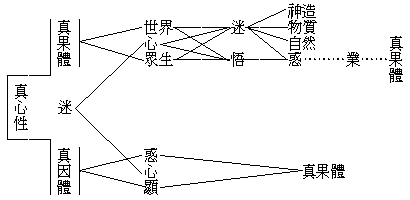

# 迷悟由心
（──十一年四月在黃陂自新堂講──）

──十一年四月在黃陂自新堂講──

世間眾生所以受種種生死流轉之依正苦報，皆由靈明真常之本心性不覺而有迷惑，後因惑而造業受苦，輪迴不息。然此迷惑既本非由外而來，乃自心所變現，則其體性必屬虛妄不實；其本來之妙明覺心，仍不失壞不變異。此迷惑既係虛幻，自可用對治法以磨除之，及至垢淨對除，則吾人一心靈明不昧之本體，既得顯現而出，生無量智慧光明矣。茲繪一圖如左：

右表顯迷悟皆由一心，在迷者則謂世界眾生或為神造，或由物質和合變化，或為自然而有，其實皆非。至宇宙人生觀能夠澈底覺悟之人，方知世界眾生之顯現，乃由真心性之迷惑造業而起，故研求種種法門以蘄達到斷惑止業之目的，則世界眾生之幻象可以永不起，而種種之痛苦解脫矣。

學佛之次第，有信、解、行、證四級。若但有信、解，而無行、證，則吾人亦不能稍得受用。如吾人雖聞知世界眾生皆由心現，而現前已受根身、器界之果，仍不能直下解脫。所以者何？以有過去世之煩惱業力為之繫縛，故須設法對治之磨除之。然佛法無量，以五戒、十善為人天之種子，人道之初基。

眾生因迷惑而造身三、意三、口四等十惡業，由其作惡之上中下品而墮入地獄、餓鬼、畜生等三惡道，欲脫此苦，須修不殺等十善業以治之。善業而感善報，既如前說。然善力究有時而窮，終未究竟，終屬有漏無常，故更進一步須知三界、六道猶如火宅。惡報固當避免，福報亦應捨離；須勤修出世大法，而求究竟解脫。

出世法之初步，謂止惡行善、修習禪定、智慧等法，滅苦斷集漸次證入於阿羅漢、辟支佛果。然此中小二乘，祇能自了自覺，斷惑止業而已，其一心根本之迷──即無明──尚未打破也。故又進一步言，若能了知吾人常住真心本來具有無量恆沙智慧功德，在迷不染，在悟不淨；即妙有而真空，即真空而妙有，勤修六度萬行，不住二邊，直顯中道；若是修行者，謂之菩薩。其間等級甚多，漸次增進，及至圓滿，遂頓破無明，德用顯現而成佛果。

人天乘似積極而消極，中小二乘以擇滅為手段，但求自了，故亦屬消極。惟菩薩乘為真積極。菩薩發心，當發四弘誓願；依願起行，行到願滿，即成佛果。菩薩行仍以止惡行善做起，自從此做，兼勸他故；能明理遣相，可為菩提助緣，非復有漏種子矣。

（王淨元記）（見海刊三卷十一期）

（附註）出前川聽法紀聞之三，原無題。

