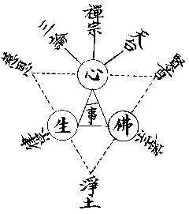

# 略說賢首義

賢首大師以三時、十儀、六宗、五教、三觀立一家言。而第一時、第六宗、第五教、第三觀之極旨，則集中於六相、十玄。然三時大同嘉祥三種法輪；於第二時更分三時，亦大同天台漸初、漸中、漸後。其十儀亦仿天台化儀四教分析開立。而六宗第一隨相法執宗所分小乘六宗，襲自慈恩。第二唯識法相宗至第六法界圓融宗，固出創見，然此亦隨所判『分始』、『空始』及終、頓、圓四教而來。故其根柢唯在於五教，而五教實為賢首義之綱骨也。雖賢首弟子慧苑嘗駁其五教，謂小、始、終、圓係襲取天台之藏、通、別、圓，而別加頓教為不妥當，──天台家譏五教不明斷證位次，續法作五教儀，仿天台立之，後人尤多非議──但此五教義乃承自杜順大師五門止觀而立者，唯彼五門專在修證，非談判教。智儼大師孔目章等始據之以高判華嚴，至賢首遂繼以完成其判教之義。三觀全出於順師之法界觀章，十玄門亦儼師記於順師者，屬在周遍含容觀中。六相圓融則唱於儼師而和于賢首者也。但賢首於儼師所記十玄，改諸藏純雜具德門為廣狹自在無礙門，又改唯心迴轉善成門為主伴圓明具德門，於事事無礙觀亦殊有增勝之處。要之、賢首於佛果實智之境，宗依華嚴發揮者，實有足多。於明佛果利他權智之祕妙，則又當推天台宗依法華者為擅長耳。

然賢首、雲華、帝心皆習宋譯六十華嚴者，唐譯之足本八十華嚴。至清涼大師始為疏鈔。故完成此宗者，復應在清涼而不在賢首，此予所以嘗稱之為清涼宗也。賢首傳自雲華，雲華傳自帝心，而帝心號稱孤起，別無淵源。然細按雲華實學華嚴於至相寺智正法師者，智正乃慧光律師法系下之第五代，即開建終南之至相寺者。慧光既為四分律宗之遠祖，復傳少林寺佛陀禪師之禪，其集力處尤在合勒那摩提與菩提流支各譯之十地論為一本，由研究宏揚十地論盛講華嚴。其弟子極多，有為地論宗者，有為律宗者，至智正傳雲華，則更為開華嚴宗者。由此推之，帝心亦必出於慧光之系下，而為與地論宗極有淵源者，故雖謂華嚴宗由地論宗轉成可也。由地論宗之淵源而觀真諦之攝論與慈恩之唯識，則知賢首之華嚴，實與之俱出於世親之唯識宗者。特於境、行、果三，唯識多談因分識境，攝論於境、行、果略均等，十地論則多談行、果，而帝心、雲華、賢首等宗華嚴則激而益上，彌盛談果分心境而已。在唐前有慧光系之地論與真諦系之攝論，雙峰並峙。至唐則攝論被併於慈恩之唯識，而地論被併於清涼之華嚴，復成對抗之勢，其實則同一世親法流，不過唯識多談因分，而華嚴多談果分而已。多談果分亦未嘗不即果而明因，多談因分亦未嘗不即因而明果，得其意者固潛通無際，可於唯識之底得華嚴，亦可於華嚴之底得唯識，所謂因賅果海、果徹因源也。

此於古來地論與攝論及唯識所爭本識之義，如慧光地論以本識為菴摩羅淨識──猶云真心──，真諦攝論以本識為真妄和合──猶云淨染和合──識，慈恩唯識以本識為阿賴耶染識。觀此對於本識建立不同，即可知地論依華嚴而所明在極證之果，故宗本於菴摩羅淨識。攝論依阿毗達磨而所明在地上之行，故宗本于真妄和合識。唯識依深密而所明在現因之境，故宗本於阿賴耶染識。而宗依華嚴之賢首家，則益從大乘極證之果境以盡量發揮之而已。若知總為一大乘之境行果，雖所明有偏勝，以果必從境行而致故，以行必依境而趨果故，以境必起行而證果故，互含交攝實無欠餘，則同會於平等之際，而各成其殊勝之用矣。

予向者嘗略分疏大乘八宗，表釋於整理僧伽制度論內，可參考焉！[1]

近有人見覺書、海潮音上評支那內學院文件，評梁漱溟唯識述義，及三重法界觀、對辨一乘大乘、對辨唯識圓覺宗、曹溪禪之新擊節等，或疑有所偏重於天台、唯識或唯識、三論，而對於賢首獨若深非之者。然予所崇重於華嚴者，雖不若墨守賢首家言者之甚，而於平等大乘之上，別標華嚴之殊勝處，實不讓持賢首家言者也。此予總持大乘之根本宗旨，曾一表現於整理僧伽制度論外，又曾示之以大乘宗地圖，他處則隨轉門中密意趣之抑揚耳。

世人雖尸賢首之名而祝之，或未知賢首可崇重之殊勝處何在也，今試一略談之。中國於華嚴殆有三派：一、地論之華嚴，二、賢首之華嚴，三、棗柏之華嚴。地論行果，賢首純果，同屬世親、流支系。棗柏融行果於不可得，則屬龍樹、羅什系。銷納此三派二系以歸之，則為清涼之華嚴。然華嚴特勝之處，予謂賢首乃獨得之。蓋佛華嚴者，乃佛初成佛時妙覺光中所頓輝重重無盡之遠近因華行、自他妙嚴境也。由佛智以觀之，則一切皆為佛境，故眾生皆如來功德智慧之相，而國土皆蓮華藏海莊嚴之剎。此現證界，非身非言，而遍一切，即身即言。隨諸菩薩所修之行，所達之境，呈身興言。證之有淺深高下之差別，說之有先後廣略之差別，皆為海印三昧之影。故諸菩薩信解行證皆依佛果安立，一切諸位皆為佛位。以果徹因源之故，而因源──阿賴耶識──幻依於果海菴摩羅識中，靡不融為果德。故因即能賅通果海，而一切異生、亦皆以如來妙覺海為心源──淨心緣起真界緣起──也。依佛智以觀之，無非佛境，是故一塵、一毛、一剎、一身，莫非六相圓融、十玄無礙之佛法界。此則賢首所獨勝於華嚴者也。

然佛華嚴有言，『心佛及眾生，是三無差別』。以佛心──或曰真心、或曰淨識、或曰真界──融攝眾生法而大明佛心者，固推賢首為勝。以其眾生心──或曰賴耶、或曰異熟、或曰陀那──融攝佛法而大明眾生心者，又推唯識為勝。由是例推及之，則禪宗者，明無佛無眾生，眾生與佛皆心者也。密宗者也，明無心無眾生，眾生與心皆佛者也。天台宗者，明即佛即眾生，眾生與佛即心者也。淨土宗者，明唯佛唯眾生，心祗佛與眾生者也。三論宗者，明非心非佛非眾生，而照達一心者也。律宗者，明即心即佛即眾生，而淨治眾生者也。蓋心與佛及眾生為一事之三方面，方面雖三而實事一，故無差別。假為形式如下：

觀此可知其融通之平等，亦可知其差別之殊勝矣。明此平等殊勝之義，有無量門。茲以心佛眾生門略言之，詳在大乘宗地圖解。

（見海刊五卷三期）

## 註釋

- [1]：見僧伽制度論宗依品之七門次第，原文複載，今刪。
