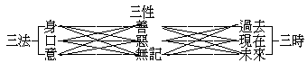

# 釋經

## 目錄

- 甲一　敘啟分
    - 乙一　追敘嘉會
    - 乙二　問啟綱宗
        - 丙一　本事問答
            - 丁一　問禮六方
            - 丁二　答修六度
        - 丙二　決擇問答
            - 丁一　辨能供養之菩薩性
            - 丁二　辨明所發生之菩提心
                - 戊一　明十種能發因
                - 戊二　示三種所發心
                - 戊三　辨發心無定性
            - 丁三　辨菩薩性之因緣生
        - 丙三　揭示綱宗
            - 丁一　彰一切菩薩之義類
            - 丁二　顯在家菩薩之殊勝
- 甲二　正說分
    - 乙一　明能行六度之菩薩
        - 丙一　廣說修成菩薩之行
            - 丁一　策發心願
                - 戊一　策發總心
                    - 己一　明發心相
                        - 庚一　善生問
                        - 庚二　世尊說
                            - 辛一　分別廣說
                                - 壬一　信解發菩提心
                                - 壬二　修習發菩提心
                                - 壬三　真正發菩提心
                            - 辛二　揭示正宗
                    - 己二　辨發心因
                        - 庚一　大悲生因
                            - 辛一　問答發因
                                - 壬一　通問發因
                                - 壬二　廣答因義
                                    - 癸一　汎說多種因相
                                    - 癸二　正辨悲是生因
                            - 辛二　問答修悲
                                - 壬一　善生問修悲法
                                - 壬二　如來說修悲相
                                    - 癸一三十六　因明生悲
                                    - 癸二　別以四因明大悲
                                - 壬一　結示修悲利益
                                    - 癸一　總明修悲菩薩益
                                    - 癸二　別顯在家菩薩益
                                    - 癸三　結成修悲廣大益
                        - 庚二　解脫了因
                            - 辛一　承前起說
                            - 辛二　問答推明
                                - 壬一　問得體義
                                - 壬二　問方便得
                                    - 癸一　辨得不得
                                    - 癸二　得解脫時
                                    - 癸三　得解脫人
                                - 壬三　問得法相
                                    - 癸一　正明得相
                                    - 癸二　廣辨得人
                                        - 子一就五趣辨
                                        - 子二就三乘辨
                                    - 癸三　作菩提種
                                    - 癸四　明佛難得
                                    - 癸五　顯在家勝
                - 戊二　別策勝願
                    - 己一　辨勝策發
                        - 庚一　辨三種菩提策發
                            - 辛一　善生問
                            - 辛二　如來答
                                - 壬一　就所問三義答
                                - 壬二　別增舉八事辨
                                - 壬三　廣明佛功德辨
                                    - 癸一　總示佛功德
                                    - 癸二　別顯身心力
                                    - 癸三　列舉諸德號
                                    - 癸四　結非聲緣比
                                - 壬四　結在家菩薩勝
                        - 庚二　修三十二相策發
                            - 辛一　善生躡問
                            - 辛二　如來廣說
                                - 壬一　正答得成身力
                                - 壬二　總明修相功德
                                    - 癸一　略明功德
                                    - 癸二　較顯功德
                                    - 癸三　出修相人
                                    - 癸四　示修相時
                                - 壬三　別明修相次第
                                    - 癸一　汎說先修何相
                                    - 癸二　正明修相次第
                                - 壬四　結在家菩薩勝
                    - 己二　正發勝願
                        - 庚一　善生問答
                        - 庚二　廣說發願
                            - 辛一　發願所因
                            - 辛二　正陳願言
                            - 辛三　顯示願果
                                - 壬一　總顯立願利益
                                - 壬二　別明法財長者
                                - 壬三　結示法王自在
                        - 庚三　結在家勝
            - 丁二　積集福智
                - 戊一　分別名義菩薩
                    - 己一　善生問
                    - 己二　如來答
                        - 庚一　假名菩薩
                        - 庚二　實義菩薩
                        - 庚三　彰在家勝
                - 戊二　勉為實義菩薩
                    - 己一　正明實義菩薩
                        - 庚一　善生問
                        - 庚二　如來答
                            - 辛一　列舉本生行
                            - 辛二　汎明菩薩行
                            - 辛三　行時自觀心
                            - 辛四　較顯在家勝
                    - 己二　勉修菩薩功行
                        - 庚一　舉德勸修
                            - 辛一　舉自利利他勸
                                - 壬一　問答菩提及道
                                - 壬二　問答三乘同別
                                - 壬三　分別菩提學果
                                - 壬四　正明自他兼利
                                    - 癸一　示自他兼利相
                                    - 癸二　能自他兼利行
                                    - 癸三　辨自他兼利人
                                        - 子一從說法聽法辨
                                        - 子二從在家出家辨
                                        - 子三從自行化他辨
                                - 壬五　顯在家菩薩勝
                            - 辛二　舉自他莊嚴勸
                                - 壬一　問答能自他利
                                - 壬二　問答八事所因
                                - 壬三　明八事所由成
                                    - 癸一三　因緣
                                    - 癸二八　所以
                                - 壬四　由八事所成德
                                    - 癸一　有德不憍
                                    - 癸二　處世不動
                                - 壬五　顯在家菩薩勝
                            - 辛三　舉福智二嚴勸
                                - 壬一　躡前問答
                                - 壬三　明二嚴相
                                    - 癸一　以果利明
                                    - 癸二　以因行明
                                    - 癸三　以別相明
                                - 壬四　結在家勝
                        - 庚二　化他攝眾
                            - 辛一　善生問
                            - 辛二　如來答
                                - 壬一　總明以四攝法畜徒
                                - 壬二　無德有德畜徒弊利
                                - 壬三　別辨在家出家畜徒
                                    - 癸一　總明出家在家
                                    - 癸二　別辨出家在家
                                        - 子一出家教二眾
                                            - 丑一教出家弟子
                                            - 丑二教在家弟子
                                        - 子二在家教一眾
                                            - 丑一師長教徒眾
                                            - 丑二國王教民眾
                                - 壬四　結顯在家菩薩難勝
            - 丁三　受持戒行
                - 戊一　受戒
                    - 己一　善生問
                    - 己二　世尊答
                        - 庚一　受前方便
                            - 辛一　供養
                            - 辛二　請許
                            - 辛三　問答
                                - 壬一　問遮難
                                - 壬二　審至誠
                            - 辛三　示歸戒
                                - 壬四　廣教誡
                            - 辛四　試察
                        - 庚二　正受戒法
                            - 辛一　總授歸戒
                            - 辛二　別示重輕
                                - 壬一六　重戒相
                                    - 癸一　正說
                                    - 癸二　結讚
                                - 壬二　廿八輕戒
                                    - 癸一　列舉
                                    - 癸二　結讚
                                - 壬三　結在家勝
                - 戊二　持行
                    - 己一　持戒清淨
                        - 庚一　善生問
                        - 庚二　世尊答
                            - 辛一　示能淨法
                            - 辛二　辨淨心時
                            - 辛三　結在家勝
                    - 己二　息除諸惡
                        - 庚一　問答息惡
                        - 庚二　問答修法
                            - 辛一　問修法
                            - 辛二　答念佛
                                - 壬一　廣觀佛德
                                - 壬二　結會戒淨
                                - 壬三　結在家勝
                    - 己三　供養三寶
                        - 庚一　善生問
                        - 庚二　世尊答
                            - 辛一三　寶福田
                            - 辛二　住持三寶
                                - 壬一　廣明佛寶
                                    - 癸一　建供塔像
                                    - 癸二　敬讚佛法
                                - 壬二　略顯法僧
                            - 辛三　示供養益
                            - 辛四　結在家勝
        - 丙二　正明能行六度之相
            - 丁一　善生問
            - 丁二　世尊答
                - 戊一　正答能行人相
                - 戊二　別明各有四事
                - 戊三　確示定有六度
                - 戊四　出六波羅蜜相
                - 戊五　結顯在家為難

經題之優婆塞戒義，前已言之。其內容共有七卷，分為二十八品。品即品目，凡文義相類，則收為一品。茲將二十八品經文，依古德分為三分：一、敘啟分，即集會一品。二、自發心品至般若品多分，共二十七品，皆為正說分，又稱正宗分。三、結成分，即最後兩行之文。

> **集會品第一**

## 甲一　敘啟分

### 　　乙一　追敘嘉會

> **如是我聞：一時、佛在舍衛國祇陀林中阿那邠坻精舍，與大比丘僧千二百五十人，五百比丘尼，千優婆塞，五百乞兒。**

此為結集人追敘本經有說法者、有聽法者、及說聽之時與地，謂之五重證信，藉證此經之確實可信，以流傳於永久。佛弟子有阿難陀者——義即慶喜——在佛弟子中為多聞第一，記持不忘。佛滅後第一次結集經典時，由五百弟子推舉阿難陀結集經藏，優波離結集律藏，大迦葉結集論藏。此經為阿難陀所結集，當結集時，追敘有此嘉會。如是我聞，是敘親聞。我字、是結集者自稱。如是，含義甚深，此中且指本經文義而言，謂如此經義，是我親從佛說得聞，以證本經非道聽途說，憑空杜撰者比。是為親聞證信。

一時，係敘說法之時。所以不記明某年某月某日時者，就廣遠義言，天上人間，年月日時長短不同。就切近者言，世界各國所用歷法亦互有差異，不相統一，故不能用某年某月某日時記之，以便行於各地也。復有事一時、理一時之分，所謂機教相扣、說聽事畢，謂之事一時；依無分別智契無分別理，理之與智無二無別，謂之理一時。是為說時證信。

佛、係梵音，具足應言佛陀，或浮屠、浮圖。浮圖、中國一般人每指塔而言，其實、塔為供佛舍利之所，殆借名以代表佛耶！古時文人，又每以浮圖二字稱佛出家弟子，實在出家人為學佛而尚未成就者，不能逕稱之為佛；或以出家人為佛弟子之上首，代佛宣揚，亦稱之為佛歟！佛陀之本義為覺者，覺為覺悟之覺，與中國之聖字相似。但佛法中阿羅漢、辟支佛及地上菩薩亦可稱聖，而佛則為聖中之聖。覺者、謂有覺悟之聖者，譬如有學問之人稱為學者，以有覺悟故稱之為覺者。但此中覺者，要無絲毫迷惑錯謬，究竟圓滿者方可當之；所以聖中阿羅漢乃至大菩薩，尚不能謂為覺者，要證得阿耨多羅三藐三菩提——即無上正遍覺者——方可稱為覺者。正、即正而不謬，遍、即遍而不偏。大菩薩雖有正遍覺悟，猶非無上，故須福智兩足，乃可稱佛。佛本為通稱，如東方藥師佛，西方彌陀佛，乃至十方諸佛，皆可稱為佛。但因此世界祇有釋迦牟尼佛教法化行，故可單稱為佛，別佛則須加別名於其上，如藥師佛之類。故此中佛字，即指釋迦牟尼佛。但十方諸佛，福智均等，其所證所說無有高下，僅於應機設教上有各種方便之不同，一佛說亦即等一切佛說耳。此為說主證信。

舍衛國、在中印度。中印度非祇舍衛一國，不過舍衛與摩竭陀等國較大耳。舍衛、為譯音，其義為豐德，謂豐富道德之國也。祇陀林阿那邠坻精舍，即是金剛經中所云祇樹給孤獨園。祇陀、簡稱為祇，是舍衛國太子之名，其義為戰勝，因生在其父王戰勝時而命名。阿那邠坻、譯為善施，即給孤獨長者，以其常時給卹孤獨之人，故稱為善施長者。林為祇陀所有，精舍為阿那邠坻所有，故合謂為祇陀林阿那邠坻精舍。此處原為祇陀太子之地，阿那邠坻長者欲買此地以供養佛，祇陀太子戲謂須黃金鋪滿其地方可，長者供佛心切，復饒有家產，乃傾其所有金以鋪此地。祇陀太子受其感動，止其鋪金，即以此地售與長者，而留樹林以自供佛，故謂之祇陀林。長者得其園林，構造最精美之房舍以供佛，故謂之阿那邠坻精舍。此中舍衛國為大地名，譬如南京；祇陀林阿那邠坻精舍為小地名，譬如逸仙橋中國佛學會。是為說處證信。

敘與大比丘僧、比丘尼、優婆塞、乞兒者，為同聞證信。此中先敘比丘僧者，出家五眾以比丘為首故。比丘、有人望文生義，謂比於孔丘。然比丘為譯音，即乞士之義。因出家之人，不獨不事生產，且將家財捨盡，常行乞食以資生命，現在錫蘭、暹羅、緬甸等地尚是如此。又有乞法以資慧命之義，乞法即求法，謂從佛出家，求學佛法以除煩惱了生死也。比丘本義，不過如此。若引申之，則有怖魔、破惡等義。蓋修學正法，破除諸惡，為天魔所恐怖也。僧字、多有錯用誤認之者，或以僧為出家人之姓，或以僧即是出家之人。但僧為譯音，具言應稱僧伽，即眾也。故僧即出家佛教徒之團體。此團體係依戒律而住；依比丘律而住者，謂之比丘僧；依比丘尼律而住者，亦可謂之比丘尼僧；僧、即出家各類團體之通稱，佛經中亦有譯為眾者。比丘程度不齊，有證聖度生者，有破戒退墮者，復有新學之人，而此中比丘，皆是證阿羅漢果、發菩提心、有大功德智慧者，故謂之大比丘。復是常隨從佛者，其數有千二百五十人。尼係譯音，比丘尼即比丘之女性者，其數有五百人。比丘尼在佛徒中為晚起之事，佛成道後約二三十年，由佛之姨母求出家，方有比丘尼。又優婆塞之義，前日雖曾略說，今日聽眾中不乏新來者，再約言之：優婆塞為譯音，又有譯為鄔波索迦、鄔波塞迦或優蒲塞者，義為近事，能親近承事三寶故。有處翻為善宿、近宿、清信。中國習稱為居士，其實、佛典中居士稱通常之人，若佛弟子應稱為優婆塞或優婆夷。大概為受過五戒者所稱；廣義則但歸依三寶者亦可稱為三歸優婆塞夷，受五戒者稱為五戒優婆塞夷，受八戒者稱為八戒優婆塞夷。此中，其總數有一千人。乞兒、乃普通之乞丐，與前之比丘有乞食、乞法之二義者不同，其數有五百人。此會、僧俗、男女、貧福俱備，全為人眾而無他道眾生，亦此經特殊之一點，可為本經正為人道而設之證。此種集會追敘，與現代之開會紀錄相同：如是我聞，乃紀錄人之自署也；繼之有會時、有主席、有會地、有會眾。如此佛經，證據確鑿，無怪流傳至今，永久可信也！

### 　　乙二　問啟綱宗

千優婆塞中，有長者子名善生，發問啟動佛說，揭示此經之綱宗。

#### 　　　　丙一　本事問答

##### 　　　　　　丁一　問禮六方

> **爾時、會中有長者子名曰善生，白佛言：『世尊！外道六師常演說法，教眾生言：若能晨朝敬禮六方，則得增長命之與財。何以故？東方之土屬於帝釋，有供養者，釋提桓因則為護助。南方之土屬閻羅王，有供養者，彼閻羅王則為護助。西方之土屬婆婁那天，有供養者，彼婆婁那則為護助。北方之土屬拘毗羅天，有供養者，彼拘毗羅則為護助。下方之土屬於火天，有供養者，火則為護。上方之土屬於風天，有供養者，風則為護。世尊！佛法之中，頗有如是六方不耶』？**

長者、為年高德劭，饒有財譽人之尊稱；善生年輕，稱長者子。在他經中，言其父命終時，囑令禮拜六方之事甚詳。善生歸佛法後，因再啟問六方之義。因其有善根方生人中，又能不空過此生，增進為善，故曰善生。此時善生雖已歸佛，然未詳問佛法，故舉外道六師常說禮六方義以問。凡非佛法，即為外道。據理，所說所行與一切法實相相應，則為內道；反之，則為外道。在佛世外道有九十六種，六師為其著名之代表，涅槃經曾詳言之。第一、富蘭那迦葉，富蘭那其字，迦葉其姓。立一切法斷滅性，無君臣、父子忠孝之道。第二、末伽梨拘賒梨，此云不見道，末伽梨其字，拘賒梨其母名。計眾生之苦樂非由因緣，惟自然生。第三、刪闍夜毗羅胝子，刪闍夜其字，毗羅胝子其母名，此云正勝不作。計不須求道，但經生死劫數自盡苦際，如縷丸轉於高山，縷盡自止。第四、阿耆多翅舍欽婆羅，阿耆多翅舍其字，欽波羅即粗衣也。身著弊衣，五熱炙身，以苦行為道，謂將長時之苦於短時受盡，即得解脫。第五、迦那鳩陀迦旃延，迦那鳩陀、此云牛領，其字也，迦旃延、此云剪髮，姓也。計諸法亦有相亦無相，應物起見，隨意而答，謂之邪命外道。第六、尼犍陀若提子，尼犍陀、此云離繫，為出家總名，若提、為母名。計苦樂善福悉由前造，非今生行道所能斷者，即現在印度之耆那教，徒眾甚夥。以上六種外道，均有徒眾，亦教化眾生，此中亦非六師皆如此說，不過六師中有作如是言者耳。

增長命財，如所謂添福添壽。外道之人，多隨順世俗之要求，以圖其恭敬供養；而在大乘佛法，亦不僅修智慧，尚欲兼修福德以增長財命，為利他之資故。東方之土，土字、訓為世界，非泥土之土，即天帝之領土。能為天中之帝，即為帝釋，釋提桓因、即是能天主之義。閻羅王、為地獄之主，掌管地獄苦報眾生。婆婁那、即龍王名，掌治水者。水天之天、可訓為神；婆婁那天即水神。拘比羅、義為蛟，乃夜叉神名，非蛟龍之蛟。火天、即火神。風天、即風神。禮彼天或神，彼則為保護救助，此外道禮六方之道理。世尊，為一切世界之所尊敬也，譯音為薄伽梵。

##### 　　　　　　丁二　答修六度

> **『善男子！我佛法中亦有六方，所謂六波羅蜜。東方即是檀波羅蜜，何以故？始初出者，為出智慧光因緣故。彼東方者屬眾生心。若有眾生能供養彼檀波羅蜜，則為增長壽命與財。南方即是尸波羅蜜，何以故？尸波羅蜜名之為右。若人供養，亦得增長壽命與財。西方即是羼提波羅蜜，何以故？彼西方者名之為後，一切惡法棄於後故。若有供養，則得增長壽命與財。北方即是毗梨耶波羅蜜，何以故？北方名號勝諸惡法。若人供養，則得增長壽命與財。下方即是禪波羅蜜，何以故？能正觀察三惡道故。若人供養，亦得增長命之與財。上方即是般若波羅蜜，何以故？上者即是無上無生故。若有供養，則得增長命之與財。善男子！是六方者，屬眾生心，非如外道六師所說』。**

佛答六方即六度。所謂正人說邪法，邪法皆成正，佛即六方說為六度，則外道轉成佛道矣。波羅蜜係梵音，義為度到彼岸，凡事做到圓滿成功，即謂之波羅蜜。六度之義，後當詳說，此處祇約言之。檀、具言檀那，義即布施，先修布施，可開智慧之光。供養、即修學之義。尸、具言尸羅，義即持戒。右、訓為上、為優，能受戒修持則為上為優。羼提、義為忍辱，後者、能忍辱即是將惡法棄之在後。毗梨耶、義即精進，北方能降伏惡法，故號勝諸惡法。禪、即禪定，具言禪那，義為靜慮，能靜觀善惡因果之義。般若、義即智慧，乃無分別之真實智慧，為善法中之最上者，故云無上。以無分別智契證真如，無有生滅，與般若心經所謂不生不滅，不垢不淨，不增不減之義相當，故曰無生。六度為眾生心中所行，故曰屬眾生心；非外道所說之六方神也。外道有多神教，有一神教，佛法則證明一切皆屬眾生之心。

#### 　　　　丙二　決擇問答

##### 　　　　　　丁一　辨能供養之菩薩性

> **『如是六方，誰能供養』？『善男子！惟有菩薩乃能供養』。**

前已說如能供養六度，則能敬禮六方，依此義自應引起善生誰能供養如是六方之問。善男子、即稱呼善生。佛即答言：如是六方非菩薩不能供養。菩薩、有認作偶像之代名詞者，凡木彫或泥塑、金鑄神鬼之像，皆呼之為菩薩，實屬非是，即以菩薩通稱一切神，又或將神、佛混而不分，統稱菩薩，亦不妥當！蓋鬼神，或為天道，或為阿修羅道、鬼道等，不出六道輪迴者。至菩薩，雖在人天中受生，乃已發菩提心，依其發菩提心之念，即已超出三界、二乘之上。因此，不能與未出三界鬼神並稱。又、有謂菩者、普也，薩者、濟也，菩薩為普濟之義者，亦屬望文生義。其實，菩薩即菩提薩埵之略稱。菩提，即阿耨多羅三藐三菩提之略，薩埵、為有情眾生之義。要之、即發菩提心之有情；人為有情之一類，或近指發菩提心之人，方可稱為菩薩。故須發無上心、堅固不可動搖者，乃是菩薩。菩薩乃能敬禮六方，即能修行六度。

> **『世尊！以何義故名為菩薩』？佛言：『得菩提故名為菩薩；菩提性故名為菩薩』。『世尊！若言得菩提已名為菩薩者，若未供養彼六方時，云何得名為菩薩耶？若以性故名菩薩者，誰有此性？有此性者則能供養，若無性者，則不能供養！是故如來不應說言：彼六方者，屬眾生心』！『善男子！非得菩提故名菩薩。何以故？得菩提者，名之為佛，未得菩提乃名菩薩；亦非性故名菩薩也。善男子！一切眾生無菩提性，如諸眾生無人、天性，師子、虎、狼、狗犬等性；現在世中和合眾善業因緣故，得人、天身，和合不善業因緣故得師子等畜生之身。菩薩亦爾，和合眾善業因緣故，發菩提心，故名菩薩。若有說言一切眾生有菩薩性者，是義不然。何以故？若有性者，則不應修善業因緣供養六方。善男子！若有性者，則無初心及退轉心；以無量善業因緣故，發菩提心名菩薩性。**

善生不明以何種義名為菩薩，故而再問菩薩之義。佛即答以：得菩提故名為菩薩，菩提性故名為菩薩。得菩提、是從果上講，即究竟成就阿耨多羅三藐三菩提，即是成佛。菩提性、是從因上講，本來如此、常常如此者，謂之性；本來、則非從學得，常、則不變。譬如有人性故名為人，有男性故名為男，有女性故名為女，以有菩提性故，則名為菩薩。

此兩句答，又啟善生之疑，故進而再問。此一問，甚為重要，即本經特殊宗旨之所在。善生問意：若言已得菩提者方名為菩薩，則未供養六方之前，尚未得菩提，即不得名為菩薩，又何能供養六方，故有矛盾！若以有菩提性名為菩薩，是否眾生皆有此性？倘非皆有此性，則無性者即不能供養。以此推論，彼六方者即非為眾生心！又、若非皆有此性，則自己有無菩提性乃不可知，從而不能決定能否供養六方，豈不徒勞無益！若言眾生皆有此性，何以眾生不能供養六度？若說有有性、有無性，又將無從知之以決定其能否供養！是故不應說言彼六方者屬眾生心。因已得菩提故，則不必供養；有菩提性故，亦不可供養，則佛說似不能成立，所以善生大啟難問。佛則答言：非得菩提故為菩薩，以得菩提者名之為佛，故以在未得菩提之前方名菩薩，故與前並無衝突。前說得菩提故者，重在其能得也。又言：非以性故名為菩薩，性者、指本有不變而言。又言一切眾生本無菩提性，譬如一切眾生無人、天、畜生等性，以和合善惡因緣而得人、天、畜生等身。以諸眾生能受眾多生死，生生死死流轉六道，都無一定之性；若有一定之性，則師子永遠為師子，人、天永遠為人天矣。蓋由此生死流轉，說無本有不變之性，現在所得之人、天、師子、虎、狼、等身，即為善惡業因緣和合所得之果。例如能修五戒，則得人身；能修十善、不動業，則得天身；如行十不善業，則得師子、虎狼等身。依此道理，菩薩亦然，以和合超出人天而包括人天等善業因緣，又能發起誓得菩提之心，所以名為菩薩。菩薩所以為菩薩，乃從此和合超出人天、包括人天多數善行而得。若說一切眾生有菩薩性者，則不然；本有不變謂之性，以有本有不變之菩薩性，則不必供養六方而能得菩提成佛故。

善男子若有性者下，結成菩薩性非本有不變心。蓋既屬本有，則無初心；既屬不變，則無退轉。以有初心及退轉心，證明非一切眾生有菩薩性，而為以無量善業因緣發菩提心名菩薩。此上、雖依經文加以說明，在未曾研究其他經典者，或能信解無疑，若曾研究過其他經典者，則反生難問矣！蓋有一類經內，曾言一切眾生皆有佛性。有一類經內，言眾生分為五種性：有無性者，即是無聲聞、緣覺、菩薩等涅槃性；次有定性聲聞；定性緣覺；及大乘菩薩種性；又有不定性者，於聲聞、緣覺三乘種性不定。今此經言一切眾生皆無佛性，與彼諸經如何會通？雖佛法為一貫之理，但說經造論各有特重之點。特重之點，分境、果、行三種說之：境、即宇宙萬有——諸法性相，從宇宙一切法平等真如性言，離言說，絕思慮，一切眾生均屬平等，無二無別，則眾生皆有佛性；即無情之一草、一木、山河、大地，亦皆同此佛性。此從境法之性，明皆有佛性者。若從境法之相上言，宇宙萬有各有其因，如草木之種子各各不同，則有情眾生亦各有本識中一切種之功能差別；由此法相境以觀察，即有無性、三乘性、不定性之分也。有經論從果上談，又有不同：如涅槃經言：『一切眾生皆有佛性』。蓋從果上觀一切法，一切眾生皆佛之法身，故皆有以佛為性之義。然法華經彰佛果教之力，可明一切眾生皆無佛性。故曰：『佛種從緣起，是故說一乘』。以一切法從眾緣生，眾生初非有佛性，須有已成佛者大悲教化之殊勝增上緣，乃可令其生起佛性，即頓起佛性；先起聲聞、緣覺之性，後被佛化，迴發大心起佛之性。此皆依佛之教化為因緣而生起，初皆無性，此法華依菩提果之說也。此經特重在行，已說如前。以重行故，故以能發心修行者為有菩薩性。譬如發羅剎之心，行羅剎之行，即有羅剎之性；發人、天之心，行人、天之行，即有人、天之性；皆以發心修行為準。此經以特重在行，所以能發人、天之心，修行五戒、十善，為有人、天之性；以發菩提之心，修菩薩之行，則有菩薩之性；若能修集無量無漏業，三大劫滿則能成佛。此顯本經重行之宗旨所在，故菩薩性既不是已得菩提者，又不是本有不變者，須發菩提心，修菩薩行者方有此性，方名菩薩。然此經與法華所說之義，雖屬相近，唯法華是從佛果菩提為緣起一面說，故重在果；此經則從眾生發菩提心、修菩薩行一面說，故重在行；但其理則相通無滯。此是辨明能供養六方六度之菩薩性；明有此菩薩性者，則名為菩薩。

##### 　　　　　　丁二　辨明所發生之菩提心

###### 　　　　　　　　戊一　明十種能發因

> **『善男子！有諸眾生受行外道，不樂外典顛倒說故，發菩提心；或有眾生住寂靜處，內善因緣，發菩提心；或有眾生觀生死過，發菩提心；或有眾生，見惡、聞惡，發菩提心；或有眾生深知自身貪欲、瞋恚、愚癡、慳嫉，為呵責故發菩提心；或有眾生見諸外道五通神仙，發菩提心；或有眾生欲知世間有邊無邊故，發菩提心；或有眾生見聞如來不思議故，發菩提心；或有眾生生憐愍故，發菩提心；或有眾生愛眾生故，發菩提心。**

菩提心之能發因，有十種：一、捨棄外道，由捨邪說而歸投正法者。此種人、現時最多，如由同善社、道院、乩壇等信從鬼神教者，以從理論上研究其說難得成立，所說多與事實不符，乃捨卻不符事實之邪教邪師，發心歸佛、正知正見以修學也。二、為內因善根所啟發，以先有善根故。三、觀生死流轉，六道往返時生時死，無間息時，見生死有無限之過失而發起菩提心故。四、有眾生見惡、聞惡，引起悲愍心，欲救拔眾生苦惱而發菩提心故。五、有人體會慳是貪之一分，嫉為瞋之一分，此為覺自己與眾生，皆須闡明煩惱之根本，故發心對治。六、五通：即天眼、天耳、他心、宿命、神境通；佛菩薩則更有漏盡通，合之則為六通。但佛菩薩雖有六通，非有度眾生之必要，則不常顯現；外道特重在神通，專以眩耀人心。此為羨慕神通以為降伏外道，乃發菩提心故。七、為求知欲所驅使，現在講科哲學亦類是；如欲知世界有始無始，有終無終，有中無中，有邊無邊等，為澈底了知個中道理，故發求無上覺之菩提心。八、為羨慕佛道故。因佛有十號，以觀佛有最尊最勝之不思議事，自己亦欲成就佛事故。九、即眾生有苦而欲救濟，起憐愍心，認為非發菩提心則不能成辦。十、欲成就其所親愛而發心，觀眾生如父母、兄弟、妻子，親愛之極，故發心普度。

###### 　　　　　　　　戊二　示三種所發心

> **『善男子！菩提之心，凡有三種：謂下、中、上。若言眾生定有性者，云何說言有三種耶？眾生下心能作中心，中心作上，上心作中，中心作下。眾生勤修無量善法，故能增上；不勤修故，便退為下。若善修進則名不退，若不修進名之為退。一切時中常為一切無邊眾生修集善故，名不退轉；若不如是，是名退轉，如是菩薩則有退心及恐怖心。若一切時中為一切眾生修集善法，得不退轉，是故我記是人，決定不久當得阿耨多羅三藐三菩提。**

此明三種所發之菩提心，所謂下心能作上中心，中心能作上心，上心能作中心，中心能作下心。此之下上、上下，即增進退轉之意。下心即是聲聞心，中心即是辟支佛心，上心即是菩薩心。有先發菩提心，後退發聲聞、緣覺心者；亦有先發聲聞、緣覺心，後發菩提心者。是上中下變動不定，以勤故上進，不勤故不進，且不進則為退，進為不退。要於一切時中常為一切無邊眾生修集故，方名不退。倘有一念之退心及恐怖心，即為退。若不退轉。則佛定可授記，記其經若干時即可成佛。

###### 　　　　　　　　戊三　辨發心無定性

> **『善男子！三種菩提無有定性；若有定性，已發聲聞、緣覺心者，則不能發菩提之心。善男子！譬如眾僧無有定性，是三種性亦復如是。若有說言定有性者，是名外道。何以故？諸外道等無因果故，如自在天非因非果。**

此發明菩提心無有定性。僧眾和合無有定性，如僧眾原為五六人，今日離去一二人，明日又來二三人，分子不定，時有變動。以喻三種菩提變動如是。若說有定性者，即是外道之見，以佛說諸法因緣生；所謂諸法皆空，亦是明因緣變化之無定性。外道有自在天者，與耶教之創造主宰，體用相同；謂為本有不變，即為非因非果。因是能變者，如穀種生穀則因已變果，自在天既常不變，則為非因非果。然佛法中之平等真如雖亦非因果，但不於因果外有其存在，不過遍於一切因緣生果諸法中之理性；自在外道乃於因果之外，有其本有不變之存在，故為外道。

##### 　　　　　　丁三　辨菩薩性之因緣生

> **『善男子！或有人說菩薩之性，譬如石中定有金性，以巧方便因緣發故，得為金用；菩薩之性亦如是者，是梵志說。何以故？梵志等常言尼拘陀子有尼拘陀樹，眼有火石，是故梵志無因無果，因即是果，果即是因。尼拘陀子具足而有尼拘陀樹，當知即是梵志因果，是義不然。何以故？因細果麤故。若言眼中定有火者，眼則被燒；眼若被燒，云何能見？眼中有石，石則遮眼；眼若有遮，復云何見？善男子！如梵志說：有即是有，無即永無；無則不生，有不應滅。若言石中有金性者，金不說性，性不說金。善男子！因緣故則有和合，緣和合故本無後有，如梵志言無即永無，是義云何？金合水銀，金則滅壞，若言有不應滅，是義云何？若說眾生有菩薩性，是名外道，不名佛道。善男子！譬如和合石因緣故而有金用，菩薩之性，亦復如是。眾生有思，名為欲心，以如是欲，善業因緣發菩提心，是則名為菩薩性也。善男子！譬如眾生先無菩提後乃方有，性亦如是先無後有，是故不可說言定有。**

此處再辨因緣生。石中有金性，是梵志所說，即因中有果說。尼拘陀樹、即菩提樹，此樹甚大，略與廣東榕樹相似。此樹之子甚小，小子內有大樹，亦即因中有果。人眼患病，或覺燒疼，或覺有星障。彼謂眼中本有火與石，燒即是火，障即是石，亦即因中有果。若謂好眼已有火石，尼拘陀子已有尼拘陀樹，所以因即是果，此與事實相違！子小樹大，是因細果粗，如何子即是樹？又若眼好時即有火者，何以眼不被燒？眼好時即有石者，何以眼不被遮？彼執有定性，故說有即永有，無即永無，此近數論派所說。如此則無生滅，無生、則與因緣和合本無後有之事實相違，無滅、則與金合水銀金即滅壞之事實相違。且既已有金，則不必說性；既說是性，不能說即是金。如礦石不能作金用，以非金故。梵志之說與理相背，是故若說眾生定有菩薩性者，則為外道；以有善業因緣和合始有菩薩性故。欲心、即願欲之心。發菩提心，即發菩提之願。欲、即志願得菩提之心，以此即名為菩薩心故。不可謂眾生定有菩薩性，要成佛方得名菩提，要發心方名有菩薩性。雖無有決定性，若一發欲得菩提之心，則無論男女長幼，即皆為有菩提心之菩薩。

#### 　　　　丙三　揭示綱宗

##### 　　　　　　丁一　彰一切菩薩之義類

> **『善男子！求大智慧，故名菩薩；欲知一切法真實故，大莊嚴故，心堅固故，多度眾生故，不惜身命故，是名菩薩修行大乘。善男子！菩薩有二種：一者、退轉，二者、不退。已修三十二相業者，名不退轉；若未能修，是名退轉。復有二種：一者、出家，二者、在家。出家菩薩奉持八重，具足清淨，是名不退；在家菩薩奉持六重，具足清淨，亦名不退。**

大智慧、即大覺，亦即佛智。由覺慧相應而得之——一切智、一切種智、自然智——廣大普遍之覺慧，欲求如此智者，為菩薩；此總明菩薩之義。次別明菩薩之義為五：一、欲知宇宙一切法之究竟真實，此亦求智之動機。何故求智？此為發菩提心品之綱領。大概世人求學問事業，都不外乎求安樂、免苦惱，及求知識得智慧之二種，世人一切欲望不外此二。此中對宇宙萬有、法界諸法之求知，即最高無上之求知欲，因此可成一切智故。如法華經言：『諸法實相，唯佛與佛乃能究盡了知』。二、大莊嚴，為此後自他莊嚴二莊嚴品之綱領，即福智兩足尊之謂。三、心堅固，以志向絕對，住持趣向，發心修行，不免遭遇困難；要心志堅固，才能勝彼私欲。欲堅固，則須受戒，所以有受戒品文。四、多度眾生、為六波羅蜜品、三十二相業品之綱領；種種菩薩，皆為度生。五、不惜身命，菩薩為度生而受身，眾生為煩惱牽引而受身，菩薩為度眾生入生死海，具足福智莊嚴，施捨資財；既為度生受身，則如手足頭目等皆可施捨，無慳惜心。命、即命根，亦皆可為度生而施捨。蓋菩薩真能照見五蘊皆空，即人我已盡，得生忍智，依摩訶般若而度生，以身命與資財及無畏等無差異。上來明為求智慧等而發心，既發心、更須修行，是為菩薩定義。要具五義，方為菩薩。菩薩大乘、如車中之火車，能載多數人至目的地。此下、明菩薩之種類。二種菩薩，以退不退分。在真發心以前，不名有退無退；既發心已，於十信中六信名信不退；初住名發心不退，此要圓具十信，才到發心不退；第七住為位不退，修菩薩行至第七住方不退，故發心在因中修行，於第六住尚有退轉；到初地方證真理，證真能不退，故名為證不退；第八地則為念不退，以其念念任運增進，真智現前故，七地以前則尚起俱生煩惱。有說到三劫行滿，方修三十二相。或說：從初發心住已修三十二相業，即是初住。至三十二相業，下面專有一品說明。前明退不退二種，下明出家在家二種，即以持戒堅固與否明退不退，足證此經重在戒行。此中八重、六重，為輕重之重，其重者犯則不可悔，犯則失戒體，可悔則輕。比丘戒四重，瑜伽菩薩戒亦四重。八重：即以比丘四重——殺、盜、婬、妄，與菩薩四重——自讚毀他、慳不施法、瞋不受悔、說相似法，合為出家八重。以此八重完全修持無犯，可名不退。在家六重：此經受戒品所明之六重、二十八輕，即在家菩薩之戒，至下受戒品時詳言之。亦要完全不犯，方為不退。足見此經重持戒以示宗旨之所在。

##### 　　　　　　丁二　顯在家菩薩之殊勝

> **『善男子！外道斷欲所得福德，勝於欲界一切眾生所有福德；須陀洹人勝於一切外道異見；斯陀含人勝於一切須陀洹果；阿那含人勝於一切斯陀含果；阿羅漢人勝於一切阿那含果；辟支佛人勝於一切阿羅漢果；在家之人發菩提心，勝於一切辟支佛果。出家之人發菩提心，此不為難，在家之人發菩提心，是乃名為不可思議。何以故？在家之人多惡因緣所纏繞故。在家之人發菩提心時，從四天王乃至阿迦尼吒諸天，皆大驚喜，作如是言：我今已得人天之師』！**

此以比較而顯殊勝。善男子以下，皆以比例而說。外道亦能修世間四禪、八定，能斷五欲，能超欲界諸天。須陀洹、即小乘聲聞初果，由聞佛所說法，修行解脫；聲聞四果，此為第一。義為預流，即初入聖人之流類。已勝一切外道，超過非想非非想天，證人空無我見，見所斷惑皆已斷竟。非真實見為異見。斯陀含人為聲聞第二果，義為一來，謂於人間一往來也。阿那含為聲聞第三果，義為不還，即生色界五不還天，不還人間即可證阿羅漢果。阿羅漢、依法華有十九種義，根本義為無生。辟支佛人，義為獨覺或緣覺，以從十二因緣得覺，謂之緣覺；以不聞佛說法而自覺，又謂之獨覺；其智慧超過阿羅漢果。上來不專講在家，此下特講在家。在家人若能真發菩提心，不僅勝過外道，乃至辟支佛均超過之。就此可見發菩提心之尊貴，不要自貶去供養外道鬼神。從前有一羅漢，以他心通見跟隨背後負著包袱之小沙彌忽發菩提心，羅漢應時知其發心，即將包袱取來自負，讓沙彌前行。沙彌忽想起菩薩行之難行，有退心，羅漢即將包袱交還，仍令沙彌背負後隨。沙彌問：何緣如此？羅漢為說：發菩提心即超越阿羅漢，一有退轉即不及阿羅漢。

出家之人以下，言在家發心之難。出家人捨離五欲，無惡緣纏繞，清淨易進；在家之人，於五欲之中能發菩提心，真不可思議，以其有許多惡濁因緣故。四天王天為第一天，阿迦尼吒天是色究竟天，共有二十四天，皆生驚異歡喜，以其於惡因緣中能發菩提心，當為人天師表，即與佛無異故。由持戒清淨，宗旨在重行，尤重在家菩薩行故，特在此品顯其殊勝，故可謂在家菩薩經。已顯全經綱宗，以下各品，於綱宗內詳明其義而已。

## 甲二　正說分

### 　　乙一　明能行六度之菩薩

#### 　　　　丙一　廣說修成菩薩之行

##### 　　　　　　丁一　策發心願

###### 　　　　　　　　戊一　策發總心

###### 　　　　　　　　　　己一　明發心相

現講發菩提心品，即明發心義相。發菩提心，此心上已說明發求菩提或求佛果之願欲，對佛果起求得之心，可謂發願欲心或誓願心，即對菩提願欲之心；到初住成勝解；由十住到十迴向，欲、勝解、念具足；到四加行得定；入初地得無漏智，方是真正菩薩。其初發心之實質，即願欲。

> **發菩提心品第二**

###### 　　　　　　　　　　　　庚一　善生問

> **善生言：『世尊！眾生云何發菩提心』？**

云何、即為何因、何以、何方法之意，發起以下第二段世尊之所說。

###### 　　　　　　　　　　　　庚二　世尊說

###### 　　　　　　　　　　　　　　辛一　分別廣說

###### 　　　　　　　　　　　　　　　　壬一　信解發菩提心

> **『善男子！為二事故發菩提心：一者、增長壽命，二者、增長財物。復有二事：一者、為不斷絕菩薩種姓，二者、為斷眾生罪苦煩惱。復有二事：一者、自觀無量世中受大苦惱，不得利益；二者、雖有無量恒沙諸佛，悉皆不能度脫我身，我當自度。復有二事：一者、作諸善業，二者、作已不失。復有二事：一者、為勝一切人天果報，二者、為勝一切二乘果報。復有二事：一者、為求菩提道受大苦惱；二者、為得無量大利益事。復有二事：一者、過去、未來恒沙諸佛皆如我身，二者、深觀菩提是可得法，是故發心。復有二事：一者、觀六住人雖有轉心，猶勝一切聲聞、緣覺；二者、勤心求索無上果故。復有二事：一者、欲令一切眾生悉得解脫，二者、欲令眾生解脫、勝於外道等所得果報。復有二事：一者、不捨一切眾生，二者、捨離一切煩惱。復有二事：一者、為斷眾生現在苦惱，二者、為遮眾生未來苦惱。復有二事：一者、為斷智慧障礙，二者、為斷眾生身障。**

信解發菩提心有十二種二事，凡此皆是最初外凡發心，未到十信位，是由外凡進入十信位之發心。先說之二事，就平常人說，即長命富貴、多福多壽。雖是平常人所求，然亦至佛乃為具足福壽者。又二：一、為不斷絕菩薩行，二、為斷眾生種種罪苦煩惱。又二：一、以三世因果已明，認為造業受苦而不得利；二、以無量恒沙諸佛皆不能度脫己身。又二：為濟世利人廣作善業，但人由求知求經驗至能作善，忽已衰老而死，故常作已而失，發菩提心乃不失之。又二：勝一切義如前已說。又二：一、為不惜受大苦惱，若不立堅固志願不成；二、為得無限量利益，一切世界之利益，得已易失，惟發心後不失。又二：一、過去、未來諸佛未發心修行時，亦與我同；二、如不可得，即是妄想，既為可得，當立志求之。又二：一、七住不退，六住以前有退轉，猶勝緣覺；二、發心勤求，亦須立願。又二：欲令眾生解脫勝於外道解脫，亦須立願。又二：菩薩以大悲度一切眾生，眾生無盡，故須不捨；自斷煩惱，方能度他。又二：為遮眾生現在未來苦惱，故須立願，以眾生無知，菩薩能以智悲斷遮之。又二：智慧障礙即所知障，佛智被無明無知所障；眾生身報障，由煩惱業所招故，即煩惱障。欲斷此二，故發菩提願。

###### 　　　　　　　　　　　　　　　　壬二　修習發菩提心

> **『善男子！發菩提心有五事：一者、親近善友，二者、斷瞋恚心，三者、隨師教誨，四者、生憐愍心，五者、勤修精進。復有五事：一者、不見他過，二者、雖見他過而心不悔，三者、得善法已不生憍慢，四者、見他善業不生妒心，五者、觀諸眾生如一子想。**

此即以修習兩種五事、發菩提心。此由學習發心，為十信位菩薩。為要長成菩薩心故，須修：一、親近善友，佛、菩薩等皆是善友。二、斷瞋恚心。三、順師教誨。四、對眾生生憐愍心。五、勤修精進。又有五事：一、觀他人須從好處看，不觀其過。二、菩薩雖方便為人，而難使離過，仍不厭悔。三、發心修行，若得善法或好境界，或得禪定清淨，或得好稱譽等，若生憍慢，則如好食中放毒藥，成為有漏之善。四、一生嫉心，則成有漏。五、有二子，或生偏心，若只一子，決無異心。前來猶非真實發心，不過由信解以修習發心而已。

###### 　　　　　　　　　　　　　　　　壬三　真正發菩提心

> **『善男子！有智之人發菩提心已，即能破壞惡業等果如須彌山。有智之人，為三事故發菩提心：一者、見惡世中五濁眾生，二者、見於如來有不可思議神通道力，三者、聞佛如來八種妙聲。復有二事：一者、了了自知己身有苦，二者、知眾生苦如已受苦，為斷彼苦，如己無異。**

此以三事、二事說。有勝解之智者，其發心乃為真發心，即能破惡如須彌山。須彌山、即妙高山，此界最高之山也。有智之人，以三事故發心：一、以大悲心，觀眾生在劫濁、見濁、煩惱濁、眾生濁、命濁之五濁中，欲為救度，然非有無上菩提不可；此一、為下度眾生。二、見佛神力，欲得佛果事；三、聞佛法音，故欲成佛；此二、為上求佛道。八梵音：一、轉好，二、柔轉，三、和適，四、尊慧，五、不妄，六、深造，七、不誤，八、不竭。此三為內由悲智，外藉教法之勝緣以發心也。又二：了了自知，知最深切苦，即聲聞苦諦，所謂三苦、八苦；此一是三乘共法。二、即大乘不共法，以有同體大悲心故。第一句通發三乘心，第二句惟發大乘菩提心。

###### 　　　　　　　　　　　　　　辛二　揭示正宗

> **『善男子！若有人能發菩提心，當知是人能禮六方增長命、財，不如外道之所宣說』。**

若能發心，即成菩薩，即能增長命之與財，亦即增長功德法財；可度眾生，可成佛道，即揭示正宗之別於外道。

> **悲品第三**

先明大悲生因，即悲品，後明解脫了因，即解脫品。

###### 　　　　　　　　　　己二　辨發心因

###### 　　　　　　　　　　　　庚一　大悲生因

###### 　　　　　　　　　　　　　　辛一　問答發因

###### 　　　　　　　　　　　　　　　　壬一　通問發因

> **善生言：『世尊！彼六師等不說因果，如來所說因，有二種：一者、生因，二者、了因。如佛初說發菩提心，為是生因、是了因耶』？**

悲、即慈悲之悲，悲天憫人之悲，亦即哀憐之心，是為悲義；須依一切眾生所發。又須了知眾生性空，方謂大悲，非僅對自己親愛者所起悲痛之謂。但悲有淺深，不到佛果，則悲起皆待緣；一到佛果，則悲不必由緣而起，即是同體無緣大悲。在此品中，明應如何發起悲心，進而起菩提心。

發即是發見、或發生。發見、在科學上亦謂發明，不過發生是生因，發見是了因。此段文即通問發因。此文即善生問佛義，六師在前第一品已講過。外道因果不得成立，雖說因果，等於不說，即六師說因果之理，不能通達。如來、亦即佛陀尊稱之一。生因、即能產果者。了因、即明了因；如屋內電燈之光一照，則室內各物皆現，室內各物並非燈光所生，不過因光發現而已。前兩品皆言發菩提心，究竟發心之發，是發生、抑發見耶？

###### 　　　　　　　　　　　　　　　　壬二　廣答因義

###### 　　　　　　　　　　　　　　　　　　癸一　汎說多種因相

> **『善男子！我為眾生或說一因，或說二因，或說三因，或說四因，或說五因，或說六、七、至十二因。言一因者，即生因也。言二因者，生因、了因。言三因者，煩惱、業、器。言四因者，所為四大。言五因者，未來五支。言六因者，如契經中所說六因。言七因者，如法華說。言八因者，現在八支。言九因者，如大城經說。言十因者，如為摩男優婆塞說。十一因者，如智印說。十二因者，如十二因緣。善男子！一切有漏法無量無邊因，一切無漏法無量無邊因，有智之人欲盡知故，發菩提心；是故如來名一切智。**

善男子者，呼善生而答之也。十二因以上，有說十五依處，二十四因，乃至無量因者。十二因、就是普通所講十二因緣也。一因：為生因之因，因所生者為果，能生果者為因。二因：在涅槃經中常說為生因、了因。三因者：煩惱與業為內因，器即器世界為外因。有根生為正報，此中正指為因之業報。四因：為四大，即地、水、火、風，亦即內身外器皆地、水、火、風所成。又通常四緣，即因緣、等無間緣、所緣緣、及增上緣，亦為四因。五因：未來五支，即十二因緣中之愛、取、有、生、老死。六因：為眾多契經所說。梵文修多羅，修妒路，華語契經，為眾經之通名；因佛說法契理契機，故具言契經。不契理、則不能切合真理；不契機、則不能化度眾生。六因：在大小乘論皆說之：一、能作因，二、俱有因，三、同類因，四、相應因，五、遍行因，六、異熟因。七因者：法華經並無明白說七因之文，不過在方便品內有十如是，除後二——果報及本末——其前即為七因。八因者：即十二因緣中現在八支，所謂識、名色、六入、觸、受、愛、取、有。九因者：出大城喻經。十因者：摩男優婆塞、為佛之弟，即須承王位欲出家未能者。此二經，待考。大乘論中有明十種因者，即一、隨說因，二、觀待因，三、牽引因，四、生起因，五、攝受因，六、引發因，七、定異因，八、同事因，九、相違因，十、不相違因。前六因、俱舍論詳說之；十因、瑜伽師地論論之亦詳。十一因者：在漢文智印經不可考，但說有七因發菩提心：一、如佛菩薩發菩提心，二、正法將滅為護持故發菩提心，三、見諸眾生眾苦所逼起大悲念發菩提心，四、菩薩教餘眾生發菩提心，五、布施發心，六、因他發菩提心而發心，七，見如來相好莊嚴與聞佛教而發心；或漢譯簡略故。十二因：即十二因緣，所謂無明緣行，行緣識，識緣名色，名色緣六入，六入緣觸，觸緣受，受緣愛，愛緣取，取緣有，有緣生，生緣老死。以其展轉為因，故名為十二因。有漏、如壺漏則茶盡，屋漏則水滴。無漏之法，分別說其因則為數無量無邊，如說六波羅蜜，八萬四千波羅蜜，無量數波羅蜜；有漏之法亦然。有智之人，為欲盡知有無漏一切因，故發菩提心。佛以悉知一切法無量無邊因，故稱為一切智者。

###### 　　　　　　　　　　　　　　　　　　癸二　正辨悲是生因

> **『善男子！一切眾生發菩提心，或有生因，或有了因，或有生因、了因。汝今當知：夫生因者，即是大悲；因是悲故，便能發心，是故悲心為生因也』。**

發菩提心或有生因，或有了因，或有生因、了因。生因者，即是大悲；無上菩提心非有大悲則不能發。不欲了脫生死，亦不能發菩提心。然小乘雖欲了脫生死，但無大悲，亦不能謂為發無上菩提之心。故修發菩提心，要從大悲修起。如穀播種，無種則穀不生，發菩提心亦然，無大悲則菩提心不生。

###### 　　　　　　　　　　　　　　辛二　問答修悲

###### 　　　　　　　　　　　　　　　　壬一　善生問修悲法

> **『世尊！云何而得修於悲心』？**

此即善生問如何而得修悲。

###### 　　　　　　　　　　　　　　　　壬二　如來說修悲相

###### 　　　　　　　　　　　　　　　　　　癸一三十六　因明生悲

> **『善男子！智者深見一切眾生沈沒生死苦惱大海，為欲拔濟，是故生悲。又見眾生未有十力、四無所畏、大悲、三念，我當云何令彼具足，是故生悲。又見眾生雖多怨毒，亦作親想，是故生悲。又見眾生迷於正路，無有示導，是故生悲。又見眾生臥五欲泥而不能出，猶故放逸，是故生悲。又見眾生常為財物、妻子纏縛，不能捨離，是故生悲。又見眾生以色命故而生憍慢，是故生悲。又見眾生為惡知識之所誑惑，故生親想，如六師等，是故生悲。又見眾生墮生有界，受諸苦惱，猶故樂著，是故生悲。又見眾生造身、口、意不善惡業，多受苦果，猶故樂著，是故生悲。又見眾生渴求五欲，如渴飲鹹水，是故生悲。又見眾生雖欲求樂，不造樂因，雖不樂苦，喜造苦因，欲受天樂，不具足戒，是故生悲。又見眾生於無我我所生我我所想，是故生悲。又見眾生無定有性，流轉五有，是故生悲。又見眾生畏生老死，而更造作生老死業，是故生悲。又見眾生受身心苦而更造業，是故生悲。又見眾生愛別離苦而不斷愛，是故生悲。又見眾生處無明闇，不知熾然智慧燈明，是故生悲。又見眾生為煩惱火之所燒然，而不能求三昧定水，是故生悲。又見眾生為五欲樂造無量惡，是故生悲。又見眾生知五欲苦，求之不息，譬如飢者食於毒飯，是故生悲。又見眾生處在惡世，遭值虐王，多受苦惱，猶故放逸，是故生悲。又見眾生流轉八苦，不知斷除如是苦因，是故生悲。又見眾生飢渴、寒熱，不得自在，是故生悲。又見眾生毀犯禁戒，當受地獄、餓鬼、畜生，是故生悲。又見眾生色力、壽命、安隱、辯才、不得自在，是故生悲。又見眾生諸根不具，是故生悲。又見眾生生於邊地，不修善法，是故生悲。又見眾生處饑饉世，身體羸瘦，互相劫奪，是故生悲。又見眾生處刀兵劫，更相殘害，惡心增盛，當受無量苦報之果，是故生悲。又見眾生值佛出世，聞說甘露淨法不能受持，是故生悲。又見眾生信邪惡友，終不追從善知識教，是故生悲。又見眾生多有財寶，不能捨施，是故生悲。又見眾生耕田種作，商賈販賣，一切皆苦，是故生悲。又見眾生父母、兄弟、妻子、奴婢、眷屬、宗室、不相愛念，是故生悲。善男子！有智之人，應觀非想非非想處所有定樂，如地獄苦，一切眾生等共有之，是故生悲。**

此即佛以三十六因明生悲。若佛大悲，須了眾生性空。三十六因者：一、深見眾生沉沒苦海、欲拔救故。二、見眾生無十力、四無所畏、大悲之三念，欲彼具足故。廣說還有十八不共法、三十二相、八十種好等，亦是見賢思齊之意。三、即怨親平等無分別故。四、見眾生無有開示指導，欲示導故。五、見諸眾生沈耽五欲，——即財、色、名、食、睡——而又放逸，欲救濟故。六、見眾生等為財物所束縛而造惡，欲令捨離故。七、見眾生以色力健美、壽命延長而生驕慢，欲令悔改故。八、惡知識、即惡友，誑惑、即故意顛倒是非，偽似親愛，如六師外道，欲令眾生遠離故。九、苦略有三：即苦苦、行苦、壞苦，欲令眾生知苦斷苦故。十、身三：殺、盜、淫，口四：妄言、綺語、兩舌、惡口。意三：貪、瞋、癡之十惡，欲令斷絕故。十一、渴求財、色、名、食、睡之五欲，愈求愈苦，欲令悔改故。十二、不樂苦而反造苦因，欲求樂而不造樂因，欲令離此倒行故。十三、我所、即我所有，所有、即法律上所有權義，非但我所有空，四大皆空，五蘊非有，何處去覓我？眾生不知，欲令知故。十四、有，有三有、五有、二十五有等之別，五有、即五道，謂人、天、地獄、餓鬼、畜生、之五趣，欲令超出此流轉故。十五、畏而又造，愚而不知，欲令知故。十六、多有因身心疾病等而更造殺生業者，欲令悔改故。十七、斷別離苦，先得斷愛，欲令斷故。十八、除無明黑闇，須要智慧光明，欲令熾然光明故。十九、除卻煩惱火，須用三昧水，三昧即定，所謂心靜自然涼，欲令得此故。二十、五欲本非樂，欲令勿以此造惡故。廿一、又有明知五欲之苦，而仍求之不息，欲令心息故。廿二、遇暴王不知求避而放逸，欲令悔改故。廿三、八苦即生、老、病、死、求不得、怨憎會、愛別離、五陰熾盛，欲令斷除故。廿四、飢渴、寒熱，欲令自在故。廿五、眾生不自見毀戒得苦報，欲令悔改故。廿六、色力即健康，壽命即命根長久安樂，均不能自在者，欲令自在故。廿七、諸根不具，為惡業所感，欲自悔改故。廿八、邊地、即無佛法教化之地，欲令得佛法教化故。廿九、如現世互相搶奪之匪，皆因飢饉羸瘦，欲令免除故。三十、世界大戰，更相殘害，當受無量之苦，欲令免除故。在此時、如各國人皆想弭戰爭，求和平，即可從此生悲發心而實現和平。卅一、雖聞佛說法，每不能受持，欲令其改變故。卅二、從邪棄正，必受大苦，欲令反其道故。卅三、有寶不施，由此造惡，欲令悔改故。卅四、農工商苦，欲令解除故。卅五、不相愛亦惡業所感，欲令改悔故。卅六、總言一句，三界皆苦，而生非想非非想天，壽命經八萬大劫，然以佛法觀之，將來還有墮落地獄之苦，以在輪迴中故；一切眾生亦莫不然。前三十五為分別言之，此第三十六為總括說也。因見眾生有此種種之苦，所以生悲。

###### 　　　　　　　　　　　　　　　　　　癸二　別以四因明大悲

> **『善男子！未得道時，作如是觀，是名為悲；若得道已，即名大悲。何以故？未得道時，雖作是觀，觀皆有邊，眾生亦爾；既得道已，觀及眾生皆悉無邊，是故得名為大悲也。未得道時，悲心動轉，是故名悲；既得道已，無有動轉，故名大悲。未得道時，未能救濟諸眾生故，故名為悲；既得道已，能大救濟，故名大悲。未得道時，不共慧行，是故名悲；既得道已，與慧共行，故名大悲。**

要證生空，即人我空，或生、法——人我、法我——空之智，如聲聞須陀洹果以上，或辟支佛以及初地菩薩，方謂之得道。若就廣義言，初住發菩提心之勝解行地，亦可謂得道。得道之後，法法無邊，以得生法空其智無邊故，觀眾生亦無邊，故名大悲。又生法空智，一切平等，雖與眾生種種苦相應而智不動，常常如此，故名大悲。未得道時則否，故只名悲。又從功用上講，以普救與否及與慧共行與否，為悲與大悲分別之標準。此以四種相顯明大悲。

###### 　　　　　　　　　　　　　　　　壬一　結示修悲利益

###### 　　　　　　　　　　　　　　　　　　癸一　總明修悲菩薩益

> **『善男子！智者修悲，雖未能斷眾生苦惱，已有無量大利益事。善男子！六波羅蜜皆以悲心而作生因。**

與眾生相親相愛而無怨對，故有無量利益。

###### 　　　　　　　　　　　　　　　　　　癸二　別顯在家菩薩益

> **『善男子！菩薩有二種：一者、出家，二者、在家。出家修悲，是不為難，在家修悲，是乃為難。何以故？在家之人多有惡因緣故。善男子！在家之人若不修悲，則不能得優婆塞戒，若修悲已，即便獲得。善男子！出家之人，唯能具足五波羅蜜，不能具足檀波羅蜜，在家之人則能具足。何以故？一切時中一切施故。是故在家應先修悲，若修悲已，當知是人能具戒、忍、進、定、智慧。若修悲心，難施能施，難忍能忍，難作能作，以是義故，一切善法悲為根本。**

在家之人，為一身、一家之計，以惡緣多故，不易修悲。但得優婆塞戒與否，必以能修悲與否為斷，即以修悲為戒體故。真能發心之在家人，多能樂善好施。出家之人，以法施為多而難行財施，在家之人，兩施俱能具足。然行施先應修悲，所謂慈悲為本，方便為門，故在家菩薩應注意修悲。非然者，則貪、瞋易起，而動輒作惡矣。大乘智慧，無悲則不能起，無悲之智，不過口頭上，書本上之智慧而已，離開口頭、書本則無智慧。

###### 　　　　　　　　　　　　　　　　　　癸三　結成修悲廣大益

> **『善男子！若人能修如是悲心，當知是人能壞惡業如須彌山，不久當得阿耨多羅三藐三菩提，是人所作少許善業，所獲果報如須彌山。**

悲心如火，惡業如薪，有火可燒薪盡，有悲可滅惡盡，故不久可成正覺。

> **解脫品第四**

###### 　　　　　　　　　　　　庚二　解脫了因

解脫、即是涅槃，大涅槃經說三德，解脫其一也。從果上說，三乘之果皆名解脫。又有經說三解脫門，謂空、無相、無願。又有八解脫定，即依修八種定而得名。又華嚴經、善財童子參五十三善知識，各言得一解脫門。亦有以勝解名解脫者。此中解脫品之解脫，亦指三乘勝解，及依勝解所成定慧，即能得解脫之門名解脫，故屬了因。

###### 　　　　　　　　　　　　　　辛一　承前起說

> **『善男子！若善男子、善女人有修悲者，當知是人得一法體，謂解脫分』。**

此即佛承前悲品文起說也。若有善根之男子、女人能修悲心者，能得一種法體，即從身、口、意修悲所得解脫分。分者、支分義，又因分義。此解脫在真見道，謂無漏智；在真見道前，為加行慧及勝解慧，對解脫果，名解脫分。若能照悲品修悲，則可得此解脫分。

###### 　　　　　　　　　　　　　　辛二　問答推明

###### 　　　　　　　　　　　　　　　　壬一　問得體義

> **善生言：『世尊！所言體者，云何為體』？『善男子！謂身、口、意；是身、口、意從方便得。方便有二：一者、耳聞，二者、思惟。復有三種：一者、惠施，二者、持戒，三者、多聞』。**

善生問佛：所言體者，以何種法為體？佛答以身、口、意。修三十二相品中明業體，亦即以身、口、意業為體。此解脫分法體之身、口、意，從方便得。方便、有處是指善巧權巧，亦多有指預備工夫者，與「工欲善其事，必先利其器」之利器義同；此中亦指預備工夫。解脫分法體，如因受戒作羯磨——受戒作法——而得戒體。此中解脫分法體，從身、口、意得，亦復如是。聞、即聞慧，思、即思慧，此中之體，由聞所成即聞慧，由思所成即思慧，又有由修所成者為修慧；要得解脫法體，須有聞思之慧。又分三種者，謂施、戒、多聞。惠施有三：見有苦而施為大悲施；為報恩而供養為報恩施；供養有德者，如供佛、菩薩、及師長三寶，為尊敬施；此三皆能生解脫之慧。又因持戒可生解脫之慧。多聞佛教經典，尤可得生解脫之慧。此中智慧謂之了因，以此種種智慧，了知佛法、眾生法，而為發起菩提心之因故。

###### 　　　　　　　　　　　　　　　　壬二　問方便得

###### 　　　　　　　　　　　　　　　　　　癸一　辨得不得

> **善生言：『世尊！如佛所說從三方便得解脫分；是三方便有定數不』？『不也。善男子！何以故？有人雖於無量世中以無量財施無量人，亦不能得解脫分法；有人於一時中以一把麨施一乞兒，能得如是解脫分法。有人乃於無量佛所受持禁戒，亦不能得解脫分法；有人一日一夜受持八戒而能獲得解脫分法。有人於無量世無量佛所，受持讀誦十二部經，亦不能得解脫分法，有人唯讀一四句偈，而能獲得解脫分法。何以故？一切眾生心不同故。善男子！若人不能一心觀察生死過咎、涅槃安樂，如是之人，雖復惠施、持戒、多聞，終不能得解脫分法。若能厭患生死過咎、深見涅槃功德安樂，如是之人，雖復少施、少戒、少聞，即能獲得解脫分法。**

善生問：具足幾多惠施、持戒、多聞，即能得此解脫分之法體？佛答：不必定數。或有以多施而不能得者，或有以少施而能得者。一把麨、即一團之麵食。八戒、即八關齋戒：一、不殺，二、不盜，三、不淫，四、不妄語，五、不飲酒，六、身不塗飾香鬘，七、不坐高廣大床，八、不歌舞觀聽，是為八戒；不過午食，是為一齋。又有以多持戒而不得，以少持戒而得者。又有以無量多聞而不得，以持一四句偈而得者。十二部、即十二部分、十二部類之義。十二部者：一、契經，二、重頌，三、諷誦，四、因緣，五、本事，六、本生，七、未曾有，八、譬喻，九、論議，十、自說，十一、方廣，十二、授記。有說小乘只有九部，大乘為十二部者；有說小乘為十一部，大乘加方廣為十二部；以說大小乘皆具十二部者，為善。偈、即伽陀，或四字一句，或五字、七字一句，每句字數均整，以四句為一偈。得解脫分與否，不以多少為準，而以用心不同為分別。有僅以修人天福報用心者，有以求解脫生死用心者。求人天福者，雖多施、多戒、多聞亦不得解脫分；求了生死者，雖少聞、少施、少戒亦得解脫分。解脫分、即能得涅槃之因。涅槃者、即真解脫果。知生死過患欲解脫，知涅槃安樂而趣求，故得解脫分也。涅槃、有翻為滅，或滅度，或寂滅，或圓寂者，以一切功德圓滿，一切過患寂滅為義。三界之中，六道皆無此安樂，惟解脫生死才有此安樂。所以平常修心之人，以存心為最要。一切功德如迴向人天福報，即不得解脫分；如迴向無上菩提，即得解脫分。即念佛、坐禪人，雖已得定，若不迴向菩提，未發真無漏慧，亦不過得世間四禪、四定而已。

###### 　　　　　　　　　　　　　　　　　　癸二　得解脫時

> **『善男子！得是法者，於三時中：佛出世時，緣覺出時，若無是二、阿迦尼吒天說解脫時，是人聞已得解脫分。善男子！我於往昔初發心時，都不見佛及辟支佛，聞淨居天說解脫法，我時聞已，即便發心。**

此佛言得解脫之時。凡佛住世及佛法流行尚有經典存在於世時，即為佛出世時。無佛經教時，即緣覺出時。緣覺雖不度生，而其神通威儀亦可起人信仰而發出世之心。阿迦尼吒天，即五不還天之色究竟天，皆證聲聞三果或位登大菩薩者生在其中。淨居天、為五不還天別名。即釋尊在作悉達太子時，出城所遇沙門為說解脫法，亦即淨居天所化，此即以本生事來證明者。

###### 　　　　　　　　　　　　　　　　　　癸三　得解脫人

> **『善男子！如是之法，非欲界天之所能得，何以故？以放逸故。亦非色天之所能得，何以故？無三方便故。亦非無色天之所能得，何以故？無身、口故。是法體者，是身、口、意。鬱單曰人亦所不得，何以故？無三方便故。是解脫分，三人能得：所謂聲聞、緣覺、菩薩。眾生若遇善知識者，轉聲聞解脫得緣覺解脫，轉緣覺解脫得菩薩解脫；菩薩所得解脫分法，不可退轉，不可失壞』。**

此說惟以人趣為能得真見道。欲界天享欲樂，無三方便，即無施、戒、多聞。無色界無身、無口，而得解脫分應以身、口、意三為體，無色界缺二故不能得。鬱單曰或譯鬱單越，即北俱盧洲。此地福報最勝，故無貧富之分，無壽夭之別，亦無惠施、持戒、多聞，因其無用之必要也。三人：即聲聞人，緣覺人，菩薩人；即以人為能得聲聞解脫，緣覺解脫，及菩薩解脫。又可由劣轉勝，由聲聞轉緣覺，由緣覺轉菩薩。

###### 　　　　　　　　　　　　　　　　壬三　問得法相

###### 　　　　　　　　　　　　　　　　　　癸一　正明得相

> **善生言：『世尊！說法之人，復以何義能善分別如是等人有解脫分？如是等人無解脫分』？『善男子！如是法者，二人所得：謂在家、出家。如是二人，至心聽法，聽已受持，聞三惡苦心生怖畏，身毛皆豎，涕泣橫流，堅持齋戒，乃至小罪，不敢毀犯，當知是人得解脫分法。**

至心、即至誠懇切之心，聽後即能受持實行。聞地獄、餓鬼、畜生之苦，皆係造殺、盜、淫、妄等十惡業而生，即生恐怖涕泣，持戒不犯，此種人可謂得解脫分法之相。

###### 　　　　　　　　　　　　　　　　　　癸二　廣辨得人

###### 　　　　　　　　　　　　　　　　　　　　子一就五趣辨

> **『善男子！諸外道等獲得非想非非想定，壽無量劫，若不能得解脫分法，當觀是人為地獄人。若復有人阿鼻地獄經無量劫，受大苦惱，能得如是解脫分法，當觀是人為涅槃人。善男子！是故我於鬱頭藍弗生哀愍心，於提婆達不生憐心。**

外道得報，雖居最高之非想非非想天，經八萬大劫，而業報一盡即落輪迴，難免墮生地獄，故觀其為地獄人。而地獄中如曾具有三方便得勝解者，已能得解脫分，故觀其為涅槃人。鬱頭藍弗、為外道之最高者，佛得道後即欲度之，而彼已生非想非非想天。佛觀之，知其第二生即轉畜生，第三生即墮地獄，所以哀之。彼曾在水邊修定，被水魚、樹鳥所擾，發願為水獺害魚、鳥而生惡心，致將來墮畜生、地獄。提婆達、此云天授，雖墮地獄，在法華經中提婆達多品，為提婆達多授記成佛，故雖在地獄，已具有解脫分矣。

###### 　　　　　　　　　　　　　　　　　　　　子二就三乘辨

> **『善男子！如舍利弗等六萬劫中求菩提道，所以退者，以其未得解脫分法；雖爾、猶勝緣覺根利。善男子！是法有三：謂下、中、上。下者聲聞，中者緣覺，上者諸佛。善男子！有人勤求優婆塞戒，於無量世如聞而行，亦不得戒，有出家人求比丘戒、比丘尼戒，於無量世如聞而行，亦不能得。何以故？不能獲得解脫分法故；可名修戒，不名持戒。善男子！若諸菩薩得解脫分法，終不造業求生欲界、色、無色界，常願生於益眾生處；若自定知有生天業，即迴此業求生人中。業者，所謂施、戒、修定。善男子！若聲聞人得解脫分，不過三身得具解脫；辟支佛人，亦復如是；菩薩摩訶薩得解脫分法，雖復經由無量身中常不退轉，不退轉心，出勝一切聲聞、緣覺。善男子！若得如是解脫分法，雖復少施得無量果，少戒、少聞亦復如是。是人假使處三惡道，終不同彼三惡受苦。若諸菩薩獲得如是解脫分法，名調柔地，何故名為調柔地耶？一切煩惱漸微弱故，是名逆流。善男子！有四種人：一者、順生死流，二者、逆生死流，三者、不順不逆，四者、到於彼岸。善男子！如是法者，於聲聞人名柔軟地，於諸菩薩亦名柔軟。復名喜地。以何義故名為喜地？聞不退故；名菩薩故。以何義故名為菩薩？能常覺悟眾生心故。如是菩薩雖知外典，自不受持，亦不教人。如是菩薩不名人天，非五道攝，是名修行無障礙道。**

舍利子、此云鶖子，為佛弟子，因已修得大乘勝解，故雖有退轉，猶勝緣覺。未得勝解者，於戒即為修戒，不為持戒——即定共戒、道共戒——。業有善惡、有漏無漏之分，此中為不造三界業而修無漏三業，即布施、持戒、修定、多聞之業。人中易化，故迴生天業以生人中。須陀洹若得解脫分，但經三次生死身即涅槃，不必七返。須七返者，為鈍根性。以無相布施而福德不可思量，故提婆達多在地獄，阿難問其苦否？彼言：有如三禪之樂。以有勝解功德故。調柔地、即勝解行地，或登初地。此中之四種人：一者、凡夫之人，順生死流；二者、二乘之人，逆生死流；三者、菩薩之人，不順不逆；四者、到彼岸人，為佛，以涅槃功德妙用度生故。喜地、即初歡喜地，此地以前為假名菩薩，此地以上是實義菩薩。覺悟眾生，即是菩提薩埵。外典雖知，不受持，亦不教人，而惟受持佛法，教以佛法。

###### 　　　　　　　　　　　　　　　　　　癸三　作菩提種

> **『善男子！夫菩提者，有四種子：一者、不貪財物，二者、不惜身命，三者、修行忍辱，四者、憐愍眾生。善男子！增長如是菩提種子，復有五事：一者、於己身中不生輕想，言我不能得阿耨多羅三藐三菩提；二者、自身受苦，心不厭悔；三者、勤行精進，不休不息；四者、救濟眾生無量苦惱；五者、常讚三寶微妙功德。有智之人修菩提時，常當修集如是五事。增長熾然菩提種子，復有六事：所謂檀波羅蜜，乃至般若波羅蜜。是六種事，因一事增，謂不放逸；菩薩放逸，不能增長如是六事，若不放逸，則能增長。善男子！菩薩求於菩提之時，復有四事：一者、親近善友，二者、心堅難壞，三者、能行難行，四者、憐愍眾生。復有四事：一者、見他得利心生歡喜，二者、常樂稱讚他人功德，三者、常樂修集六念處法，四者、勤說生死所有過咎。善男子！若有說言，離是八法得菩提者，無有是處。善男子！若有菩薩初發無上菩提心時，即得名為無上福田，如是菩薩出勝一切世間之事及諸眾生。**

四種種子，即是悲心，修此四種種子，即是修悲。復次、修者中五事、六事，能增長此四種子。熾然、是最勝之意。而六波羅蜜又以一不放逸行而增長。善友、指佛菩薩。六念：即念佛、法、僧、戒、天、死——即無常——。合兩種四事，即八法。初發菩提心，在理性上即與佛無異，故得名為無上福田。

###### 　　　　　　　　　　　　　　　　　　癸四　明佛難得

> **『善男子！雖有人言：無量世界有無量佛，然此佛道甚為難得。何以故？世界無邊，眾生亦爾；眾生無邊，佛亦如是。假使佛道當易得者，一佛世尊則應化度一切眾生！若爾者，世界眾生則為有邊。善男子！佛出世時，能度九萬九那由他人，聲聞弟子度一那由他，而諸眾生猶不可盡，故名無邊。是故我於聲聞經說無十方佛，所以者何？恐諸眾生輕佛道故。諸佛聖道，非世所攝，是故如來說無虛妄。如來世尊無有妒心，以難得故，說無十方諸佛世尊。善男子！無量眾生發菩提心，不能究竟行菩薩道。若人難言：若有現在無量諸佛，何故經中但說過去、未來二世有無量佛，不說現在無量佛耶？善男子！我一國說過去、未來有恆沙佛，現在世中唯一佛耳。善男子！真實義者，能得佛道無量眾生，修行佛道多有退轉，時有一人乃能得度，如菴羅華及魚子等。**

此言佛不易成。若佛易成，則眾生當有窮盡，而與世界皆有邊矣。那由他、此云億，佛及弟子，能度此多眾生，而眾生猶不可盡，證明佛之難成，恐眾生輕佛也。從佛非世間攝之理，故言十方世界無佛。初發心者雖多，而退墮者尤多，故歷長時間方有一人成佛。三千諸佛名經等，不言現世有多佛，乃據小乘以說。其實、現在有多佛也。菴羅樹、幾千幾百花而間結一二子，水中魚子亦幾千幾百子偶成一二魚，譬發心雖多而成佛者少，以見得佛之難能可貴！

###### 　　　　　　　　　　　　　　　　　　癸五　顯在家勝

> **『善男子！菩薩有二種：一者、在家，二者、出家。出家菩薩得解脫分法，是不為難；在家得者，是乃為難。何以故？在家之人，多惡因緣所纏繞故』。**

此顯在家菩薩惡因緣所纏繞多於出家之人，故說出家菩薩得解脫分法不為難，而在家之人則為難能可貴也。

> **三種菩提品第五**

三種菩提，即聲聞、緣覺及諸佛菩提。此品宗旨，在從三種菩提中辨出諸佛菩提為最勝。

###### 　　　　　　　　戊二　別策勝願

###### 　　　　　　　　　　己一　辨勝策發

###### 　　　　　　　　　　　　庚一　辨三種菩提策發

###### 　　　　　　　　　　　　　　辛一　善生問

> **善生言：『世尊！如佛所說菩薩有二種：一者、在家，二者、出家。菩提三種：一者、聲聞菩提，二者、緣覺菩提，三者、諸佛菩提。若得菩提名為佛者，何故聲聞、辟支佛人不名為佛？若覺法性名為佛者，聲聞、緣覺亦覺法性，以何緣故不名為佛？若一切智名為佛者，聲聞、緣覺亦一切智，復以何故不名為佛？言一切者，即是四諦。』**

三種菩提，即文中所講聲聞、緣覺及諸佛菩提。證聲聞菩提即阿羅漢果，證緣覺菩提即辟支佛果，此二雖得解脫生死而不得謂無上菩提；要得諸佛無上菩提，才是真正菩提。辨明三種菩提，須捨劣取勝。此品仍由善生問，佛答，本經各品皆然，如金剛經為須菩提問、佛問之類。問意：以聲聞聞佛說四諦法之聲而證阿羅漢之果，緣覺由觀察因緣而覺悟，同得一種菩提，何故聲聞名為聲聞，緣覺名為緣覺，均不名佛？若覺法性名為佛者，聲聞、緣覺亦覺法性；若一切智名為佛，聲聞、緣覺亦知一切法，何故不名為佛？以四諦即攝一切法——苦集攝世間果因；滅即解脫生死而證涅槃，道即達涅槃之方法，則攝出世果因——，何以聲聞、緣覺不名為佛？以上有三種問意，蓋欲起佛說三種之差別也。

###### 　　　　　　　　　　　　　　辛二　如來答

###### 　　　　　　　　　　　　　　　　壬一　就所問三義答

> **佛言：『善男子！菩提有三種：一者、從聞而得，二者、從思惟得，一者、從修而得。聲聞之人從聞得故，不名為佛；辟支佛人從思惟已少分覺故，名辟支佛；如來無師，不依聞、思，從修而得覺悟一切，是故名佛。善男子！了知法性，故名為佛。法性二種：一者、總相，二者、別相。聲聞之人，總相知故不名為佛；辟支佛人同知總相，不從聞故，名辟支佛，不名為佛；如來世尊，總相、別相一切覺了，不依聞、思，無師獨悟，從修而得，故名為佛。善男子！如來世尊緣智具足，聲聞、緣覺雖知四諦，緣智不具足，以是義故，不得名佛；如來世尊緣智具足，故得名佛。**

聲聞須從佛聞法而得菩提；緣覺不必聞佛說法，即以思惟而得菩提；如來無師，從修而得一切覺悟，乃成無上菩提。所以菩薩發心修行，雖亦藉佛所說法為方便，而由離言妙悟，不同聲聞之拘執法相；菩薩了諸法性空，由修遍覺，辟支佛只有少分覺，未為深廣圓滿；真要得一切智，須以無師智離一切語言文字修證而得。佛又能為一切眾生之機說法，亦非聲聞、緣覺所能。所覺法性，有總相、別相之分。達五蘊和合空無人我為總相智，辟支佛以自思惟亦只了總相，了別相則五蘊之法一一皆空，無有自性。此既從修而得，一切言語文字皆無所用，以無分別而證知者為妙智，故名為佛。以一切法為所緣境，而佛智緣之無不圓滿。此佛境界，非聲聞、緣覺僅於所緣境知其總相者所堪比，以彼不具遍正覺故，不名為佛。

###### 　　　　　　　　　　　　　　　　壬二　別增舉八事辨

> **『善男子！如恆河水，三獸俱渡，兔、馬、香象。兔不至底，浮水而過；馬或至底，或不至底；象則盡底。恆河水者，即是十二因緣河也。聲聞渡時，猶如彼兔；緣覺渡時，猶如彼馬；如來渡時，如彼香象，是故如來得名為佛。聲聞、緣覺雖斷煩惱，不斷習氣，如來能拔一切煩惱、習氣根原，故名為佛。善男子！疑有二種：一、煩惱疑，二、無記疑。二乘之人斷煩惱疑，不斷無記，如來悉斷如是二疑，是故名佛。善男子！聲聞之人厭於多聞，緣覺之人厭於思惟，佛於是二心無疲厭，故名為佛。善男子！譬如淨物，置之淨器，表裏俱淨；聲聞、緣覺智雖清淨而器不淨，如來不爾，智器俱淨，是故名佛。善男子！淨有二種：一者、智淨，二者、行淨。聲聞、緣覺雖有淨智，行不清淨；如來世尊智、行俱淨，是故名佛。善男子！聲聞、緣覺其行有邊，如來世尊其行無邊，是故名佛。善男子！如來世尊能於一念破壞二障：一者、智障，二者、解脫障，是故名佛。如來具足智因、智果，是故名佛。**

一、恆河、為印度最大之河，香象、為最大之象。此譬以恆河水喻十二因緣生死流轉大河，以兔喻聲聞，以馬喻緣覺，以香象喻佛；三獸雖同渡河，而唯象達河底。二、聲聞、緣覺僅斷煩惱，不斷習氣，如兔馬勉強渡河而不徹底，佛則徹底，斷其根本。三、疑為六根本煩惱之一，煩惱疑障善法使之不生；無記疑如地球為多少微塵所成，有多少斤兩，聲聞、緣覺不須明白，而佛則悉知之，所謂佛於恆沙世界一滴之雨，皆知頭數。四、聲聞從佛聞聲得悟生空而不願多聞；緣覺雖以思惟而悟生空，亦不願多所思惟，唯佛則於山河大地微塵草木無不了知，於聞、於思心無疲厭。五、智慧喻物，身心喻器。聲聞、緣覺之身心，為業報所成，故須灰身泯智，方得無餘涅槃，有餘身心則非究竟清淨。六、聲聞、緣覺習氣未淨，所以身心有時於行不淨，佛則無不清淨。七、聲聞、緣覺其行自利利他，俱有邊際限量，佛則俱無邊際限量。八、佛於最後一念，能斷二障，智障即所知障，解脫障即煩惱障，前障菩提，後障涅槃。智因、即菩提心等，智果、即佛果。

###### 　　　　　　　　　　　　　　　　壬三　廣明佛功德辨

###### 　　　　　　　　　　　　　　　　　　癸一　總示佛功德

> **『善男子！如來出言，無二無謬，亦無虛妄，智慧無礙，樂說亦爾，具足因智、時智、相智，無有覆藏，不須守護，無能說過，悉知一切眾生煩惱起結因緣、滅結因緣，世間八法所不能汙，有大憐愍，救拔苦惱，具足十力、四無所畏、大悲、三念，身心二力悉皆滿足。**

此總示佛功德智慧。無障礙樂說、即隨意所說。了知一切眾生心行，即因智。知一切時，為時智。知一切因相、果相、差別相等，為相智。三業清淨，全無過失，故不覆藏守護。結、即煩惱，起結、即起煩惱，滅結、即滅煩惱。八法：即利、衰、毀、譽、稱、譏、苦、樂之八風。於眾生之大苦惱、能憐愍之。十力：一、知是處非處智力，即知事理是非之力。二、知三世業報智力。三、知諸禪、解脫、三昧智力。四、知眾生心性之力。五、知種種解智力。六、知種種界智力。七、知一切所至道智力。八、知天眼無礙智力。九、知宿命無漏智力。十、知永斷習氣智力。四無所畏：一、說一切智無所畏，謂大眾中作獅子吼，我為一切正智之人，無怖心也。二、說漏盡無所畏，謂說我已斷盡一切煩惱。三、說障道無所畏，謂說煩惱等障法，無有怖心。四、說盡苦道無所怖畏。佛能在大眾中作獅子吼：言我為一切智者，斷盡一切煩惱，能說起何業、得何果，及知苦之滅盡；由此四無畏，能於大眾中分明決定而說，毫無怖畏。大悲不必待緣，眾生信與不信，佛亦無喜與憂。因此身心二力，皆得充滿。世人言：有志者，事竟成。但初發菩提心，雖有大悲救他之志，尚無其力，故須精進培養成身心二力。

###### 　　　　　　　　　　　　　　　　　　癸二　別顯身心力

> **『云何身力滿足？善男子！三十三天有一大城，名曰善見，其城縱廣滿十萬里，宮室百萬，諸天一千六十六萬六千六百六十有六。夏三月時，釋提桓因欲往波利質多林中歡娛受樂。由乾陀山有一香象名伊羅缽那，具足七頭，帝釋發念，象知即來，善見城中所有諸天處其頭上，旋行而往。其林去城五十由延，是象身力出勝一切香象身力。正使和合如是香象一萬八千，其力唯敵佛一節力，是故身力出勝一切眾生之力。世界無邊，眾生亦爾；如來心力，亦復無邊。是故如來獨得名佛，非二乘人名為佛也。**

三十三天、為欲界第二天，其頂之城，名善見城。釋提桓因、即三十三天之天主。波利質多樹、義為香遍樹，為樹中之王。乾陀山、即香樹山。伊羅缽那、即熱臭樹而大。所有諸天、即一千六十六萬餘天，俱能變化，隨意大小，可處香象之頭上。由延、又謂由旬，正譯踰繕那，印度三十里之數。即合如是香象一萬八千之力，僅敵佛之一節力。以世界無邊，眾生亦爾，形容佛心力之無邊。

###### 　　　　　　　　　　　　　　　　　　癸三　列舉諸德號

> **『以是義故，名無上師，名大丈夫，人中香象，師子，龍王，調御示導名大船師，名大醫師，大牛之王，人中牛王，名淨蓮華，無師獨覺，為諸眾生之眼目也。是大施主，是大沙門，大婆羅門，寂靜持戒，勤行精進，到於彼岸，獲得解脫。**

人天師中，佛為無上，故名無上師。能調御眾生，故名大丈夫。能渡一切眾生到道岸，故名大船師。能醫一切眾生心病，故名大醫師。人比常牛，故佛比大牛王。一切清淨，故名佛淨蓮華。菩提樹下無師獨悟，故為無師獨覺。能指示眾生覺路，故為眾生眼目。為一切施，故是大施主。沙門、為出家之通稱。婆羅門為清淨之裔，佛為出家之最極清淨者，故稱大沙門、大婆羅門。身心清淨，故名寂靜。能止惡行善，持戒不退，勤行精進，故得究竟解脫也。

###### 　　　　　　　　　　　　　　　　　　癸四　結非聲緣比

> **『善男子！聲聞、緣覺雖有菩提，都無是事，是故名佛。**

聲聞、緣覺都無上述佛之功德，故惟有佛得名為佛。

###### 　　　　　　　　　　　　　　　　壬四　結在家菩薩勝

> **『善男子！菩薩有二種：一者、在家，二者、出家。出家菩薩分別如是三種菩提，是不為難；在家分別，是乃為難。何以故？在家之人多惡因緣所纏繞故』。**

此中仍警策在家菩薩，環境惡劣，甚難辨識如是三種菩提。

> **修三十二相業品第六**

欲成最勝菩提，須修三十二相福業之因，此品次在第六，故題為修三十二相業品第六。

###### 　　　　　　　　　　　　庚二　修三十二相策發

###### 　　　　　　　　　　　　　　辛一　善生躡問

> **善生言：『世尊！如佛所說菩薩身力，何時成就』？**

善生跟躡上文，即問佛之身力何時成就？

###### 　　　　　　　　　　　　　　辛二　如來廣說

###### 　　　　　　　　　　　　　　　　壬一　正答得成身力

> **佛言：『善男子！初修三十二相業時。**

佛答上述佛之身力，即成就三十二相業時。

###### 　　　　　　　　　　　　　　　　壬二　總明修相功德

###### 　　　　　　　　　　　　　　　　　　癸一　略明功德

> **『善男子！菩薩修集如是業時，得名菩薩，兼得二定：一者、菩提定，二、有定。復得二定：一者、知宿命定，二者、生正法因定。善男子！菩薩從修三十二相業乃至得阿耨多羅三藐三菩提，於其中間，多聞無厭。菩薩摩訶薩修一一相，以百福德而為圍繞。修心五十，具心五十，是則名為百種福德。**

此為真正菩薩，以修集三十二相之業故。趣向無上菩提決定時，即得菩提定。於二十五有之中不墮三惡道，謂之有定。知自己宿命，為知宿命定。能了解正法，修行正法，為生正法因定。自初發心修三十二相業，乃至得無上遍正覺，於中多聞無厭。一種相有百福德者，修心五十、即十善法一一各有五善根，合為五十；到具心時，十善法亦各有五善根，合亦五十；是名百福德。

###### 　　　　　　　　　　　　　　　　　　癸二　較顯功德

> **『善男子！一切世間所有福德，不及如來一毛功德；如來一切毛孔功德，不如一好功德；聚合八十種好功德，不及一相功德；一切相功德，不如白毫相功德；白毫功德，復不得及無見頂相。**

世間所有福德不及佛之一毛孔功德，即以三界之功德與佛之一毛較。白毫相、即眉間白毫光相。佛說法華經，即放眉間白毫相光；說楞嚴經，即放無見頂相光。白毫相與無見頂相，為相之最勝者。

###### 　　　　　　　　　　　　　　　　　　癸三　出修相人

> **『善男子！菩薩常於無量劫中，為諸眾生作大利益，至心勤作一切善業，是故如來成就具足無量功德；是三十二相，即是大悲之果報也。轉輪聖王雖有是相，相不明了具足成就。是相業體，即身、口、意業。修是業時，非於天中、北鬱單曰，唯在三方，男子之身，非女人身也。菩薩摩訶薩修是業已，名為滿三阿僧祇劫，次第獲得阿耨多羅三藐三菩提。**

三十二相即大悲之果報，以因中修大悲而得此三十二相之功果也。輪王、有金、銀、銅、鐵、之四種，轉輪王即金輪王，王四天下。金輪王雖具三十二相，不及佛果三十二相光明顯現。成就三十二相業，即以身、口、意三業而成。三方為：東勝神洲，西牛賀洲，南贍部洲，此三洲能修三十二相業。男子相亦為三十二相之一。三十二相修滿，即滿三無數劫，次第獲得無上遍正覺。

###### 　　　　　　　　　　　　　　　　　　癸四　示修相時

> **『善男子！我於往昔寶頂佛所，滿足第一阿僧祇劫；然燈佛所，滿足第二阿僧祇劫；迦葉佛所，滿足第三阿僧祇劫。善男子！我於往昔釋迦牟尼佛所，始發阿耨多羅三藐三菩提心，發是心已，供養無量恆沙諸佛，種諸善根，修道持戒，精進多聞。善男子！菩薩摩訶薩修是三十二相業已，了了自知定得阿耨多羅三藐三菩提，如觀掌中菴摩勒果。其業雖定，修時次第不必定也。**

迦葉佛為賢劫第三佛，即釋迦佛之前一佛。此中釋迦佛，即古釋迦佛。滿三十二相業時，明白自知成佛。菴摩勒果，此云難分別果，印度人常握置掌中，取『如示諸掌』意。

###### 　　　　　　　　　　　　　　　　壬三　別明修相次第

###### 　　　　　　　　　　　　　　　　　　癸一　汎說先修何相

> **『或有人言：如來先得牛王眼相，何以故？為菩薩時，於無量世，樂以善眼和視眾生，是故先得牛王眼相；次得餘相。或有說言：如來先得八梵音相，餘次第得。何以故？為菩薩時，於無量世，恆以軟語、先語、實語，教化眾生，是故先得八梵音相。或有說言：如來先得無見頂相，餘次第得。何以故？為菩薩時，於無量世，供養師長、諸佛、菩薩、頭頂禮拜破憍慢故，是故先得無見頂相。或有說言：如來先得白毫毛相，餘次第得。何以故？為菩薩時，於無量世，不誑一切諸眾生故，是故先得眉間毫相。善男子！除佛世尊，餘無能說如是相業。**

此是汎說先修何相。前說已成三十二相功德，未明先修何相？佛言：修時次第不必拘限先修何相，蓋應隨機緣之先後發起而定。自來多有人言先修何相者。牛王眼相者，即青蓮花目，所謂目紺青相。和視者，即和平慈視。八梵音相者，即於一音有八種功德相。先語者，如於兩人對語時而先發。實語、即真實語。無見頂相者，以佛初生時，其姨母不能見其頂，持地菩薩觀至上方無量世界，亦不能見此無見頂。此正顯一切法之妙真如相，所謂一相無相，言語道斷，心行處滅之無對待妙理，故難可見。佛為至尊無上；菩薩為先進，或同輩之有德者。頭頂禮拜、即五體投地，在頂禮之中有種種儀式也。憍、是小隨煩惱，以著己功德者為性。慢、為根本煩惱，有七慢、九慢之分，恃己凌人為慢。世界不平之事，皆由慢心而起，其根本在有我見。接諸佛菩薩之足以破其憍慢，則能達一切平等。常人以憍慢故，不平等故，不能得此無見頂相。白毫毛相者，毛字、可改作光字，他經俱作光，毛與毫同。白毫光相，透明有光，細長而能卷舒自在，因不誑眾生而成，此表中道實相。雖有此先修何相諸說，以佛之意，不必定言何先何後，隨緣修之可也。

###### 　　　　　　　　　　　　　　　　　　癸二　正明修相次第

> **『善男子！或復有人次第說言：如來先得足下平相，餘次第得。何以故？為菩薩時，於無量世，布施、持戒，修集道時，其心不動，是故先得足下平相。得是相已，次第獲得足下輪相。何以故？為菩薩時，於無量世，供養父母、師長、善友，如法擁護一切眾生，是故次得手足輪相。得是相已，次第獲得纖長指相。何以故？為菩薩時，至心受持第一、第四優婆塞戒，是故次得纖長指相，足跟長相。得是相已，次第獲得身傭滿相。何以故？為菩薩時，善受師長、父母、善友所教敕故，是故次得身傭滿相。得是相已。次得手足合網縵相。何以故？為菩薩時，以四攝法攝眾生故，是故次得手足網縵相。得是相已，次第獲得手足柔軟勝餘身相。何以故？為菩薩時，於無量世，以手摩洗師長、父母身，除去垢穢，香油塗之，是故次得手足軟相。得是相已，次得身毛上向靡相。何以故？為菩薩時，於無量世，常化眾生，令修施、戒一切善法，是故次得毛上靡相。得是相已，次第獲得鹿王腨相。何以故？為菩薩時，至心聽法，志心說法為壞生死諸過咎故，是故次得鹿王腨相。得是相已、次第獲得身方圓相，如尼拘陀樹王。何以故？為菩薩時，於無量世，常施一切眾生病藥，是故次得身方圓相。得是相已，次第獲得手過膝相。何以故？為菩薩時，終不欺誑一切賢聖、父母、師長、善友知識，是故次得手過膝相。得是相已，次得象王馬王藏相。何以故？為菩薩時，於無量世，見怖畏者能為救護，心生慚愧，不說他過，善覆人罪，是故次得象馬藏相。得是相已，次得軟身，一一孔中一毛生相。何以故？為菩薩時，於無量世，親近智者，樂聞樂論，聞已樂修，樂治道路，除去棘剌，是故次得皮膚柔軟，一一孔中一毛生相。得是相已。次第獲得身金色相。何以故？為菩薩時，於無量世常施眾生房舍臥具，飲食、燈明，是故次得金色身相。得是相已，次第獲得七處滿相。何以故？為菩薩時，於無量世，可瞋之處不生瞋心，樂施眾生隨意所須，是故次得七處滿相。得是相已，次第獲得缺骨滿相。何以故？為菩薩時，於無量世，善能分別善不善相，言無錯謬，不說無義，可受之法口常宣說，不可受者不妄宣傳，是故次得缺骨滿相。得是相已，次得二相：一者、上身，二者、頰車，皆如師子。何以故？為菩薩時，於無量世，自無兩舌，教他不為，是故次得如是二相。得是相已，次得三相：一、四十齒，二、白淨相，三、齊密相。何以故？為菩薩時，於無量世，以十善法淨化眾生，眾生受已，心生歡喜，常樂稱揚他人功德，是故次得如是三相。得是相已，次第獲得四牙白相。何以故？為菩薩時，於無量世修欲界慈，樂思善法，是故次得四牙白相。得是相已，次得味中最上味相。何以故？為菩薩時，於無量世不待求已然後方施，是故次得味上味相。得是相已，次得二相：一者、肉髻，二、廣長舌。何以故？為菩薩時，於無量世，至心受持十善法教，兼化眾生，是故次得如是二相。得是相已，次得梵音相。何以故？為菩薩時，於無量世，自不惡口，教他不為，是故次得梵音聲相。得是相已，次得牛王紺色目相。何以故？為菩薩時，於無量世，等以慈善視怨親故，是故次得牛王目相。得是相已，次得白毫相。何以故？為菩薩時，於無量世宣說正法，實法不虛，是故次得白毫光相。得是相已，次得無見頂相。何以故？為菩薩時，於無量世，頭頂禮拜一切聖賢、師長、父母，尊重讚歎，恭敬供養，是故獲得無見頂相。**

此言次第，僅二十八種相，與他經論，有不盡同者：一、足下平相。道、即菩薩道，達一切法空平等，其心如實不動。二、足下輪相者，即足下千輻輪相。擁護、即愛護。三、四、五、足跟長為二相：纖長指相者，此處亦重持在家戒；足跟長者，即足跟圓滿。此中攝三相：纖長、及足跌端厚、並足圓滿。六、身分傭滿者，即身分圓滿。前一相包括三相，此一相即為第六。七、四攝：即布施、愛語、同事、利行。網縵、即指間之網。八、柔軟、在他處又謂網軟。九、上向靡、即毛向上。十、鹿王、為鹿中之最美滿者。腨、即足脛。十一、尼拘陀樹，其幹端直，眾生身不端正圓滿，故無此相。十二、手足過膝、即能立身摩膝。十三、藏相、他處又云馬陰藏相，又謂勢峰密藏相，謂與象王、馬王無異。十四、一一孔中一毛生相，即每一孔生一毛。樂聞、樂論、樂修，均對佛法言。十五、佛身常現真金色，故名得身金色相。十六、七處平滿相者，在全身七處皆圓滿：即頭、胸、臍間、及四支；又謂之七處充滿。凡人生瞋恨心即現醜陋相，生善心即現好相。十七、缺骨者、人身有骨節處，皆現缺陷相。缺骨滿，即骨處皆圓滿無缺。十八、十九、頰車、又謂師子頰輪。上身、即如師子身，頰輪、即如師子面，兩皆圓滿。此即兩相。二十、廿一、廿二、三相，皆關於齒者：白、淨、齊密、皆齒之圓滿相。廿三、四牙、即門牙，寬闊鮮白，此亦修四無量心而得。廿四、上味相，即不待他求，先施而得。廿五、廿六、肉髻、即頂上隆起之紅肉，廣長舌、能遍於世界而說法，此為二相。廿七、梵音相，已如前釋。廿八、廿九、牛王紺色目相，分為牛王睫相，目紺青相。牛王睫、似其形，目紺青、言其色。三十、白毫相，以說不偏不虛中道實法而得。卅一、無見頂相、解釋見前。此中只明三十一相，無項光及胸卍字之相。其次第自足修至頂，亦即此經明在家修行次第，明應從施、戒修起。佛之功德所感，皆無漏果，非出有漏之業。菩薩須修三十二相業以度眾生。

###### 　　　　　　　　　　　　　　　　壬四　結在家菩薩勝

> **『善男子！菩薩二種：一者、在家，二者、出家。出家菩薩修如是業，是不為難；在家菩薩修是業者，是乃為難。何以故？在家之人多惡因緣所纏繞故』。**

在家菩薩多障礙纏繞，以難修勉勵精進。

> **發願品第七**

上來策發無上菩提，即辨勝策發，勉以修大悲心，行菩薩道，因有前兩品之辨勝策發，所以有正發勝願之此品來。就實體講，願、即是欲，欲通善、惡、無記之三性，此願即善性之欲。三乘之願，並是無漏，非有漏攝。願之發，與草木種子發芽相同，在中國普通謂之立志。願與迴向不同，於有功德之後，用向於何途謂迴向；未有功德之前，欲修功德，謂之發願。

###### 　　　　　　　　　　己二　正發勝願

###### 　　　　　　　　　　　　庚一　善生問答

> **善生言：『世尊！是三十二相業誰能作耶』？佛言：『善男子！智者能作』。『世尊！云何名智者』？『善男子！若能善發無上大願，是名智者。**

善生進問：云何為智者？佛答：發無上大願。無上者、即最高最上，有廣大心量，深遠志趣者之謂。

###### 　　　　　　　　　　　　庚二　廣說發願

###### 　　　　　　　　　　　　　　辛一　發願所因

> **『菩薩摩訶薩發菩提心已，身、口、意等所作善業，願為眾生；將來得果，一切共之。菩薩摩訶薩常親近佛、聲聞、緣覺、善知識等，供養恭敬，諮問深法，受持不失。**

摩訶、即大義，大、即勝義。從真正開發菩提心，即初住或初地以上菩薩。發心、即發菩提總心。願、即如普賢十大願王，藥師十二願行，彌陀四十八願，各有不同；四宏誓願，則為共願。不外願眾生皆能享受其所修之功德。親近、亦是普賢十願之一，此兩願、仍是願之總相。

###### 　　　　　　　　　　　　　　辛二　正陳願言

> **『作是願言：「我今親近諸佛、聲聞、緣覺善友，寧無量世受大苦惱，不於菩提生退轉心！眾生若以惡心打罵毀辱我身，願我因是更增慈心，不生惡念！願我後生，在在處處不受女身、無根、二根、奴婢之身！復願令我身有自在力，他為給使，不令他人有自在力而驅使我！願令我身諸根具足，遠離惡友，不生惡國邊裔之處，常生豪姓，色力殊特，財寶自在！得好念心、自在之心，心得勇健，凡有所說，聞者樂受，離諸障礙！無有放逸，離身、口、意一切惡業，常為眾生作大利益！為利眾生，不貪身命，不為身命而造惡業，利眾生時，莫求恩報！常樂受持十二部經，既受持已，轉教他人！能壞眾生惡見、惡業，一切世事所不能勝；既得勝已，復以轉教！善治眾生身、心重病，見離壞者能令和合，見怖畏者為作救護，護已為說種種之法，令彼聞已心得調伏！見飢施身，令得飽滿，願彼不生貪惡之心；當噉我時，如食草木！常樂供養師長、父母、善友、宿德，於怨親中其心等一！常修六念及無我想，十二因緣！無三寶處，樂在寂靜，修集慈悲！一切眾生若見我身，聞觸之者，遠離煩惱」！菩薩雖知除菩提已不求餘果，為眾生故，求以弘利。**

不退轉者、不論遇何苦惱——打罵毀辱——而不生惡念，即大慈悲心。修行度生，須色力具足：女身力弱；無根者，即無丈夫相；二根者，即男女根不決定；奴婢者，無自在力。菩薩雖恆順眾生，而須有轉眾生之力及教化眾生之力，不為他人所支配。惡國者，即有惡王惡法之國。邊裔者，不拘地域方所，但指無文化及氣候不良之地而言。生豪姓、則人多欽仰。色力殊特者，即勇健。好念、即常起善念。十二部經、前已詳述。心病者，即煩惱病。六念、十二因緣、前均已解。三寶：即佛法僧。此上為正願言。

###### 　　　　　　　　　　　　　　辛三　顯示願果

###### 　　　　　　　　　　　　　　　　壬一　總顯立願利益

> **『善男子！菩薩若能如是立願，當知是人即是無上法財長者，是求法王未得法王。**

菩薩為利他故而求得法王，於發願時尚未得到法王之位。但若能立如上願言，即是無上法財長者。

###### 　　　　　　　　　　　　　　　　壬二　別明法財長者

> **『善男子！菩薩摩訶薩具足三事，則得名為法財長者：一者、心不甘樂外道典籍，二者、心不貪著生死之樂，三者、常樂供養佛法僧寶。復有三事：一者、為人受苦心不生悔，二者、具足微妙無上智慧，三者、具善法時不生憍慢。復有三事：一者、為諸眾生受地獄苦如三禪樂，二者、見他得利不生妒心，三者、所作善業不為生死。復有三事：一者、見他受苦如己無異，二者、所修善事悉為眾生，三者、善作方便令彼離苦。復有三事：一者、觀生死樂如大毒蛇，二者、樂處生死為利眾生，三者、觀無生法忍多諸功德。復有三事：一者、捨身、二者、捨命，三者、捨財；捨是三事悉為眾生。復有三事：一者、多聞無厭，二者、能忍諸惡，三者、教他修忍。復有三事：一者、自省己過，二者、善覆他罪，三者、樂修慈心。復有三事：一者、至心奉持禁戒，二者、四攝攝取眾生，三者、口言柔軟不麤。復有三事：一者、能大法施，二者、能大財施，三者、以此二施勸眾生行。復有三事：一者、常以大乘教化眾生，二者、常修轉進增上之行，三者、於諸眾生不生輕想。復有三事：一者、雖具煩惱而能堪忍，二者、知煩惱過樂而不厭，三者、自具煩惱能壞他結。復有三事：一者、見他得利歡喜如己，二者、自得安樂不樂獨受，三者、於下乘中不生足想。復有三事：一者、聞諸菩薩苦行不怖，二者、見有求者終不言無，三者、終不生念我勝一切。**

此十四種三事，如文可解。

###### 　　　　　　　　　　　　　　　　壬三　結示法王自在

> **『善男子！菩薩若能觀因觀果，能觀因果，能觀果因，如是菩薩能斷因果，能得因果。菩薩若能斷得因果，是名法果，諸法之王，法之自在。**

此明能觀所觀以善因得善果，離惡因解脫惡果。從因觀果，謂觀因果；從果觀因，即觀果因；如觀苦、集、滅、道，即從果觀因。能斷因果、乃能得因果，斷因果、即斷德，得因果、即恩德智德。王者、自在義，能支配一切而不為一切所支配。法華經言：『我為法王，於法自在』。凡夫之心，亦可造一切法，謂之心王；但未做到一切自在，故不名法王也。

###### 　　　　　　　　　　　　庚三　結在家勝

> **『善男子！菩薩有二種：一者、在家，二者、出家。出家菩薩立如是願，是不為難；在家菩薩立如是願，是乃為難。何以故？在家菩薩多惡因緣所纏繞故』。**

此言要常行精進不放逸，以勉勵發心而時加警策。

> **名義菩薩品第八**

假名及實義之二種菩薩，在此品中，分別以出其相，故名。

##### 　　　　　　丁二　積集福智

###### 　　　　　　　　戊一　分別名義菩薩

###### 　　　　　　　　　　己一　善生問

> **善生言：『世尊！如佛所說菩薩二種：一者、假名菩薩，二者、實義菩薩。云何名為假名菩薩』？**

此品分別假名、實義兩種菩薩。善生所問僅及假名菩薩，就以下答文觀之，應兩種菩薩俱在問中。

###### 　　　　　　　　　　己二　如來答

###### 　　　　　　　　　　　　庚一　假名菩薩

> **『善男子！眾生若發菩提心已，樂受外術及其典籍，持諷誦讀，即以此法轉化眾生。為自身命殺害他命，不樂修悲。樂於生死，常造諸業受生死樂。無有信心，於三寶所生疑網心。護惜身命，不能忍辱。語言麤獷，悔恨放逸。於己身所生自輕想，我不能得無上菩提。於煩惱中生恐怖想，亦不勤修壞結方便。常生慳貪、嫉妒、瞋心，親近惡友，懈怠、亂心，樂處無明。不信六度，不樂修福，不觀生死，常樂受持他人惡語，是名假名菩薩。善男子！復有眾生發菩提心，欲得阿耨多羅三藐三菩提，聞無量劫苦行修道然後乃得，聞已生悔。雖修行道，心不真實，無有慚愧，不生憐愍。樂奉外道，殺羊祀天。雖有微信，心不堅固。為五欲樂造種種惡，倚色、命、財生大憍慢，所作顛倒，不能利益。為生死樂而行布施，為生天樂受持禁戒，雖修禪定為命增長，是名假名菩薩。**

已發菩提心之菩薩，不於佛法中自學化他，而以學外道化他，乃至常樂受持他人惡語，故為假名。麤獷者、即粗惡獷野。悔恨者、即發菩提心後又生悔心。自輕者、即不信自己能得無上菩提。不勤修壞結方便，即不修布施以度慳貪，不修忍辱以度嫉妒、瞋心等。六度、即六波羅蜜；是雖發菩提心，而不修菩薩行，即假名菩薩，此是一類。復有一類假名菩薩，先發菩提心，原非真實誠懇，故後見難生畏而悔。慚愧、在修行中為最重要。慚者、即崇善，見己不如諸佛、菩薩善行而崇仰之；愧者、即拒惡，見諸眾生惡行而輕拒之。慚愧、在中國，通謂之羞恥。殺羊祀天，即如現在亦有受佛法僧皈戒後，仍祀禮神鬼者。復有雖修布施、持戒、禪定，乃為生天、長命而起者，均為假名菩薩。

###### 　　　　　　　　　　　　庚二　實義菩薩

> **『實義菩薩者，能聽深義，樂近善友，樂供養師長、父母、善友，樂聽如來十二部經，受持、讀誦、書寫、思義。為法因緣不惜身命、妻子、財物，其心堅固。憐愍一切，口言柔軟，先語、實語，無有惡語及兩舌語。於自身所不生輕想。舒手惠施，無有禁固。常樂修磨利智慧刀，雖習外典，為破邪見，出勝邪見，善知方便調伏眾生。於大眾所不生恐怖，常教眾生菩提易得，能令聞者不生怖心。勤修精進，輕賤煩惱，令彼煩惱不得自在。心不放逸，常修忍辱。為涅槃果持戒、精進。願為眾生趨走給使，令彼安隱歡娛受樂；為他受苦，心不生悔。見退菩提，心生憐愍。能救一切種種苦惱，能觀生死所有過罪，能具無上六波羅蜜。所作世事，勝諸眾生。信心堅固，修集慈悲，亦不悕求慈悲果報，於怨親中其心無二。施時平等，捨身亦爾，知無常相，不惜身命。以四攝法攝取眾生。知世諦故，隨眾生語。為諸眾生受苦之時，其心不動如須彌山。雖見眾生多作諸惡，有少善者，心終不忘，於三寶所不生疑心，樂為供養。若少財時，先給貧窮，後施福田；先為貧苦，後為富者。樂讚人善，為開涅槃。所有技藝，欲令人學；見學勝己，生歡喜心。不念自利，常念利他。身、口、意業所作諸善，終不自為，恆為他人，是名實義菩薩。**

此策勸為實義菩薩。修行進退，本無一定。如假名菩薩習修菩薩行，又可轉為實義菩薩。忽進忽退，或忽退忽進，為凡夫常有之事；若自己省察尚在假名菩薩相中時，一生慚愧而轉進修，仍可為實義菩薩。深義者，即佛法之深義。受持、讀誦、書寫、解說、思義，在法華為五法師行，詳之為十法行，即對於經典十種行法：一、書寫，二、供養、三、施他，四、諦聽，五、披讀，六、受持，七、開演，八、諷誦，九、思惟，十、修習。為法因緣不惜妻子、財物者，即可為出家菩薩。智慧刀者，能斷煩惱緣之義，所謂聞慧、思慧、修慧。善知方便調伏眾生者，眾生有種種性，種種欲，善知善調，可令止惡行善。自在者，每一法能轉動他法，謂之自在。煩惱能轉動善法，則煩惱力得自在矣；要令彼煩惱不得自在，須勤賤視煩惱。信心者，即信三寶之心。不惜身命者，知身命無常而不惜之。四攝法義、見前。認世事為真實者，謂之世諦。財多可平等施，若財少則先貧窮。令人學藝，所謂菩薩當於五明處求，五明謂：內明、聲明、因明、醫藥明、工巧明。技藝、即後四明之學。若此者，則為實義菩薩，是即勸勉從假修真。

###### 　　　　　　　　　　　　庚三　彰在家勝

> **『善男子！菩薩有二種：一者、在家，二者、出家。出家菩薩為實義菩薩，是不為難；在家菩薩，是乃為難。何以故？在家之人多惡因緣所纏繞故』。**

每品末後皆置此勉勵之語，佛之慈悲，深切極矣！

> **義菩薩心堅固品第九**

###### 　　　　　　　　戊二　勉為實義菩薩

###### 　　　　　　　　　　己一　正明實義菩薩

###### 　　　　　　　　　　　　庚一　善生問

> **善生言：『世尊！義菩薩者，云何自知是義菩薩』？**

佛了了知何者為假名菩薩，何者為實義菩薩。然菩薩以何法能自知為假為實，為行菩薩道者所要知之事，故有斯問。

###### 　　　　　　　　　　　　庚二　如來答

###### 　　　　　　　　　　　　　　辛一　列舉本生行

本生、為佛舉自己修行之事。十二部中有說佛之本生部，而本事則為說弟子修行之事。

> **『善男子！菩薩摩訶薩修苦行時，先自誠心。善男子！我念往昔行菩薩道時，先從外道受苦行法，至心奉行，心無退轉。無量世中以灰塗身，唯食胡麻、小豆、粳米、粟米、𢇲等，日各一粒；荊棘惡刺、椓木、地石以為臥具；牛屎、牛尿以為病藥。盛夏之月，五熱炙身；孟冬之節，凍冰襯體。或受草食、根食、莖食、葉食、果食、土食、風食，作如是等諸苦行時，自身他身俱無利益。雖爾、猶故心無退轉，出勝一切外道苦行。善男子！我於往昔為四事故，捨棄身命：一者、為破眾生諸煩惱故，二者、為令眾生受安樂故，三者、為自除壞貪著身故，四者、為報父母生養恩故。菩薩若能不惜身命，即自定知是義菩薩。善男子！我於往昔為正法故，剜身為燈三千六百。我於爾時具足煩惱，身實覺痛，為諸眾生得度脫故，諭心令堅，不生退轉。爾時、即得具足三事：一者、畢竟無有退轉，二者、得為實義菩薩，三者、名為不可思議，是名菩薩不可思議。又我往昔為正法故，於一劫中，周身左右受千瘡苦。爾時具足一切煩惱，身實覺苦，為諸眾生得度脫故，諭心令堅，不生退轉，是名菩薩不可思議。又我往昔為一鴿故，棄捨是身。爾時具足一切煩惱，身實覺苦，為諸眾生得度脫故，諭心令堅，不生退轉，是名菩薩不可思議。善男子！一切惡友諸煩惱業，即是菩薩道莊嚴伴。何以故？一切凡夫無有智慧正念之心，故以煩惱而為怨敵；菩薩智慧正念具足，故以煩惱而為道伴。惡友及業，亦復如是。善男子！捨離煩惱，終不得受惡有之身。是故菩薩雖現惡業，實非身、口、意惡所作，是誓願力。以是願力受惡獸身，為欲調伏彼畜生故。菩薩現受畜生身已，善知人語、法語、實語、不麤惡語、不無義語，心常憐愍，修集慈悲，無有放逸，是名菩薩不可思議。善男子！我於往昔受熊身時，雖具煩惱，煩惱於我無自在力。何以故？具正念故。我於爾時，憐愍眾生，擁護正法，修行法行。受瞿陀身，劫賓耆羅身，兔身，蛇身，龍身，象身，金翅鳥身，鴿身，鹿身，獮猴、羖羊、雞雉、孔雀、鸚鵡、蝦蟆，我受如是鳥獸身時，雖具煩惱，煩惱於我無自在力。何以故？具正念故，憐愍眾生，擁護正法，修行法行。善男子！於饑饉世，我立大願，以願力故受大魚身，為諸眾生離於飢渴；食我身者，修道、念道、無惡罪過。疾疫世時，復立大願，以願力故身為藥樹，諸有病者，見、聞、觸我，及食皮膚、血肉、骨髓，病悉除愈。善男子！菩薩摩訶薩受如是苦，心不退轉，是名義菩薩。**

誠心者，菩薩修苦行為度外道，須先誠心警策云：此苦行為度外道而修。往昔行菩薩道時者，即佛自己本生之事。蓋外道苦行，亦能起世人尊敬，於此外道盛行時，修菩薩行，若要起世人信仰，則須行勝過外道。唯食胡麻等，即食一麻、一麥之行。椓者、為已死之木。乃至土食、風食，外道俱有此行。雖於自他身無利益，而為降伏外道，啟世人信仰，即應一一修之。菩薩能為法、為眾生而捨命者，即為實義菩薩。千瘡苦者，所謂百孔千瘡，極言其苦。以惡友諸煩惱業為道伴者，即能於濁惡世中度生，雖羅剎、餓鬼，亦皆能度之矣。大凡菩薩證道愈高，則其行愈下。證道不高者，只能於人天中度生，不能三入惡道。能於三惡趣度生者，即觀音、地藏諸大菩薩是。受熊身者，其他經上說佛往昔受熊身，能扶養人之小孩成長，雖在煩惱，不被其轉，故云於我無自在力。瞿陀身、即牛身。劫賓耆羅身、即鳥身。羖羊、即雌羊。謂自在能轉煩惱而不為煩惱所轉。

###### 　　　　　　　　　　　　　　辛二　汎明菩薩行

> **『菩薩修行六波羅蜜時，終不悕求六波羅蜜果，但以利益眾生為事。菩薩深知生死過患，所以樂處，為利眾生受安樂故。菩薩了知解脫安樂、生死過患、而能處之，是名菩薩不可思議。菩薩所行，不求恩報，受恩之處，常思反報。善男子！一切眾生常求自利，菩薩所行恆求利他，是名菩薩不可思議。菩薩摩訶薩具足煩惱，於怨親所平等利益，是名菩薩不可思議。善男子！若諸外道化眾生時，或以惡語、鞭打、罵辱、擯之令出，然後調伏。菩薩不爾，化眾生時，無麤惡語、瞋語、綺語、唯有軟語、真實之語，眾生聞已，如青蓮遇月，赤蓮遇日。善男子！菩薩施時，財物雖少，見多乞求，不生厭心，是名菩薩不可思議。菩薩教化盲、聾、瘖、啞，愚癡邊地惡眾生時，心無疲厭，是名菩薩不可思議。善男子！菩薩有四不可思議：一者、所愛重物能以施人，二者、具諸煩惱能忍惡事，三者、離壞之眾能令和合，四者、臨終見惡說法轉之；是名菩薩四不可思議。復有三事不可思議：一者、訶責一切煩惱，二者、處煩惱中而不捨之，三者、雖具煩惱及煩惱業而不放逸；是名菩薩三不可思議。復有三事不可思議：一者、始欲施時心生歡樂，二者、施時為他不求果報，三者、施已心樂不生悔恨；是名菩薩三不可思議。**

青蓮遇月者，青蓮華遇月而開。赤蓮遇日者，赤蓮華遇日而開也。教化盲、聾等者，世人用愛，遇不美妙者則不愛之；菩薩用悲，愈不美妙者則愈憐憫之。臨終說法者，有將命終，自見其惡者，即說佛法以轉之。呵責煩惱及不捨煩惱者，自煩惱則呵責之，他煩惱則不捨之。煩惱業者，乃由煩惱所生之業；煩惱在心，而業通身、口、意三。不思議者，在理為言語道斷，心行處滅，方謂之不思議；此處不可思議，指平常難能者而言。

###### 　　　　　　　　　　　　　　辛三　行時自觀心

> **『善男子！菩薩摩訶薩作是行時，自觀其心，我是名菩薩耶？義菩薩乎？眾生若能作如是事，當知是人即義菩薩也。**

菩薩能常自觀其心，省察自己是否真能為實義菩薩而不為假名菩薩，即是實義菩薩矣。

###### 　　　　　　　　　　　　　　辛四　較顯在家勝

> **『善男子！菩薩有二種：一者、在家，二者、出家。出家菩薩作如是事，是不為難；在家菩薩為如是事，是乃為難。何以故？在家之人多惡因緣所纏繞故』。**

聽此經者，皆能如說修行，才不辜負佛於每品之勉勵語。

> **自利利他品第十**

此品於二十八品中，次在第十，即為利他而成自利，成自利適能利他。

###### 　　　　　　　　　　己二　勉修菩薩功行

###### 　　　　　　　　　　　　庚一　舉德勸修

###### 　　　　　　　　　　　　　　辛一　舉自利利他勸

###### 　　　　　　　　　　　　　　　　壬一　問答菩提及道

> **善生言：『世尊！云何菩提？云何菩提道』？佛言：『善男子！若離菩提無菩提道，離菩提道則無菩提；菩提之道即是菩提，菩提即是菩提之道；出勝一切聲聞、緣覺所得道果，是名菩提、菩提之道。』**

菩提與菩提道，兩名當有分別。菩提、在大乘則為阿耨多羅三藐三菩提，在三乘、菩提分為聲聞、緣覺、及諸佛三種。此經之盡智、無生智，可通三乘菩提。道、指能得菩提因分之法，如四諦之道諦，及三十七道品是。不過就此處文義觀菩提道，亦即所證所成之果，而菩提則為能證能成就之智。以大乘理智如如不二言，所證菩提道與能證菩提智，不一不異，所以謂菩提即菩提道也。若離能證之菩提智，即無菩提道果，離菩提道果，亦無菩提智。若通因果不相離言，道為因分，菩提為果。大乘道果即是菩提；聲聞、緣覺所證涅槃之果，與菩提智非為同一；大乘無住涅槃，方為無上菩提之智故。常言菩提，即指無上菩提而言。

###### 　　　　　　　　　　　　　　　　壬二　問答三乘同別

> **善生言：『世尊！聲聞、緣覺所得道果，即是菩提，即是菩提道，云何言勝』？『善男子！聲聞緣覺道不廣大，非一切覺，是故菩提、菩提之道得名為勝。猶如一切世間經書，十二部經為最第一。何以故？所說不謬，無顛倒故。二乘之道比菩提道，亦復如是。**

云何言勝者，謂何故言大乘為勝？聲聞、緣覺不廣大者，以不能遍一切覺故。世間經書者，即指佛經外之世間講道德說仁義等之經書。

###### 　　　　　　　　　　　　　　　　壬三　分別菩提學果

> **『善男子：菩提道者，即是學，即是學果。云何名學？行菩提道未能具足不退轉心，是名為學；已得不退，是名學果。未得定有，是名為學；已得定有，第三劫中是名學果。初阿僧祇劫，猶故未能一切惠施，一切時施，一切眾生施；第二阿僧祇劫，雖一切施，未能一切時施，一切眾生施；如是二處是名為學。第三阿僧祇劫，能一切施，一切時施，一切眾生施，是名學果。善男子！菩薩修行施、戒、忍辱、進、定、智時，是名為學；到於彼岸，是名學果。善男子！有是惠施非波羅蜜，有波羅蜜不名為施，有亦惠施亦波羅蜜，有非惠施非波羅蜜。善男子！是施非波羅蜜者，聲聞、緣覺、一切凡夫、外道異見、菩薩初二阿僧祇劫所行施是。是波羅蜜非惠施者，如尸波羅蜜乃至般若波羅蜜是。亦是惠施亦波羅蜜者，菩薩第三阿僧祇劫所行施是。非施非波羅蜜者，聲聞、緣覺持戒、修定、忍、慈、悲是。善男子！非施非波羅蜜，是名為學；亦施亦波羅蜜，是名學果。善男子！夫菩提者，即是盡智、無生智也。為此二智，勤心修集三十七品，是名為學；得菩提已，是名學果。自調諸根，次調眾生，是名為學；自得解脫，令眾生得，是名學果。修集十力、四無所畏、大悲、三念，是名為學；具足獲得十八不共法，是名學果。為利自他，造作諸業，是名為學；能利他已，是名學果。習學世法，是名為學；學出世法，是名學果。為諸眾生不惜身財，是名為學；為諸眾生，亦不吝惜身財、壽命，是名學果。能化眾生作人天業，是名為學；作無漏業，是名學果。能施眾生一切財物，是名為學；能行法施，是名學果。能自破壞慳貪、嫉妒，是名為學；破他慳貪、嫉妒之心，是名學果。受持五根，修行憶念，是名為學；教他修集成就具足，是名學果。**

菩提道、即修菩提之因分，即是學，亦即是學果。定有者：有三有、五有、九有、二十五有、六十二有之分，定有、即在人天。不墮惡趣者，普通須初地菩薩方不墮惡趣，即要初阿僧祇劫滿。第二劫、即初地到七地之位。第三劫、在八地以上菩薩。就布施波羅蜜，有四句分別，後當詳言。亦惠施亦波羅蜜者，須第八地以上菩薩及佛所行施是，所謂盡法界、虛空界、一切眾生界而究竟施也。非施非波羅蜜，第一非字，以改為是字，較通前後文義。盡智者，證阿羅漢果，知我生已盡之智。無生智者，證知再不生受後有之智，小乘要到阿羅漢果，大乘要到佛果才得。三十七品者，即四念住、四正勤、四如意足、五根、五力、七覺分、八聖道。自修持戒禪定，謂之調伏諸根。十力、四無所畏、前已詳。十八不共法為佛獨有。三無失：即身、口、意三業無過失；又三隨法行：即無異想，無不定心，無不知已捨；又六無減：即欲無減，精進無減，慧無減，解脫無減，解脫知見無減；又三隨智慧行：即身、口、意三業隨智慧行；又三無礙：即知過去、現在、未來無礙。阿羅漢知八萬大劫，菩薩雖知無盡劫，亦復有礙，佛為究竟無礙。以上為十八不共法。平常修行人小有神通，仍是在不可知之中，若妄用之，反成顛倒。如舍利弗為阿羅漢之上首，而觀察鴿子至八萬劫前仍是鴿子，而不知以何因緣墮鴿身，而唯佛之不共功德，乃能決知也。五根、即是五善根：信、進、念、定、慧。

###### 　　　　　　　　　　　　　　　　壬四　正明自他兼利

###### 　　　　　　　　　　　　　　　　　　癸一　示自他兼利相

> **『善男子！菩薩信根，既自利已，復利益他。自利益者，不名為實；利益他者，乃名自利。何以故？菩薩摩訶薩為利他故，於身、命、財不生慳吝，是名自利。菩薩定知若用聲聞、緣覺菩提教化眾生，眾生不受，則以天人世樂教之，是名利他；利益他者，即是自利。菩薩不能自他兼利，唯求自利，是名下品。何以故？如是菩薩於法財中生貪著心，是故不能自利益也。行者若令他受苦惱，自處安樂，如是菩薩不能利他。若自不修施、戒、多聞，雖復教他，是名利他，不能自利。若自具足信等五根，然後轉教，是名菩薩自利利他。善男子！利益有二：一者、現世，二者、後世。菩薩若作現在利益，是不名實；若作後世，則能兼利。善男子！樂有二種：一者、世樂，二者、出世樂；福德亦爾。菩薩若能自具如是二樂、二福化眾生者，是則名為自利利他。**

以人天世樂教他者，因觀機以大乘教化不能受，次以聲聞、緣覺法教化，亦不能受，則以人天世樂教之。令現世、後世、出世樂與福德自具化他，方為真正利益。

###### 　　　　　　　　　　　　　　　　　　癸二　能自他兼利行

> **『善男子！菩薩摩訶薩具足一法，則能兼利，謂不放逸。復有二法能自他利：一者、多聞，二者思惟。復有三法能自他利：一者、憐愍眾生，二者、勤行精進，三者、具足念心。復有四法能自他利：謂四威儀。復有五法能自他利：一者、信根，二者、持戒，三者、多聞，四者、布施，五者、智慧。復有六法能自他利：所謂六念。復有七法能自他利：謂壞七慢。善男子！若沙門、婆羅門、長者、男女，或大眾中有諸過失，菩薩見已，先隨其意，然後說法令得調伏。如其不能，先隨其意便為說法，是則名為下品菩薩。善男子！菩薩二種：一者、樂近善友，二者、不樂。樂善友者，能自他利；不樂近者，則不能得自他兼利。善男子！樂近善友復有二種：一、樂供養，二、不樂供養。樂供養者，能自他利；不樂供養，不能兼利。樂供養者，復有二種：一、能聽法，二、不能聽。至心聽者，能自他利；不至心聽，則無兼利。至心聽法，復有二種：一者、能問，二、不能問。能問義者，能自他利，不能問者，則不能得自利他利。能問義者，復有二種：一、至心持，二、不能持。至心持者，能自他利；不至心者，則不能得自利他利。至心持者，復有二種：一者、思惟，二、不思惟。能思惟者，能利自他；不思惟者，則不得名自利他利。能思惟者，復有二種：一者、解義，二、不解義。能解義者，能自他利；不解義者，則不得名能自他利。解義之人，復有二種：一、如法住，二、不如法住。如法住者，能自他利；不如法住者，則不得名自利他利。如法住者，復有二種：一者、具足八智，二者、不能具足。何等八智？一者、法智，二者、義智，三者、時智，四者、知足智，五者、自他智，六者、眾智，七者、根智，八者、上下智。是人具足如是八智，凡有所說具十六事：一者、時說，二、至心說，三、次第說，四、和合說，五、隨義說，六、喜樂說，七、隨意說，八、不輕眾說，九、不呵眾說，十、如法說，十一、自他利說，十二、不散亂說，十三、合義說，十四、真正說，十五、說已不生憍慢，十六、說已不求世報。如是之人能從他聽，從他聽時具十六事：一者、時聽，二者、樂聽，三者、至心聽，四者、恭敬聽，五者、不求過聽，六者、不為論議聽，七者、不為勝聽，八者、聽時不輕說者，九者、聽時不輕於法，十者、聽時終不自輕，十一、聽時遠離五蓋，十二、聽時為受持讀，十三、聽時為除五欲，十四、聽時為具信心，十五、聽時為調眾生，十六、聽時為斷聞根。善男子！具八智者能說能聽，如是之人能自他利；不具足者，則不得名自利他利。**

不放逸者，即「勿以善小而不為，勿以惡小而為之」之義，蓋須精進也。六念者，即念佛、法、僧、施、戒、天。七慢者，即慢、過慢、慢過慢、增上慢，卑劣慢、邪慢、我慢，能壞七慢，即為七法。先隨其意然後說法者：見諸眾生過失，不能生忿怒而隨意教化之，令得調伏。善友範圍甚廣，自佛、菩薩以及一切修行有德者皆是。能問者，則更能起說者之廣說。能思惟者，則能體察考究。解義者，即勝解決定之結果。如法住者，能身、口、意三業皆如法住；如法者，能得智果。上來層層昇進，至如法住，則可得智果矣。時智者，知時節因緣。知足智者，離欲知足。根智者，知眾生根。上下智者，即知之上下根。和合說者，即說一法與他法，均能融通。隨意說者，即無礙說，欲何說皆能說之。如法說者，即契理。不輕眾、不呵眾者，為契機。不散亂者，為有條理。合義說者，即合理論。前講說法功德，下為聽法功德。自輕者，以自己難學言。五蓋：即貪欲、瞋恚、睡眠、掉悔、及疑。五欲：即財、色、名、食、睡之粗五欲，與色、聲、香、味、觸之細五欲。斷聞根者，從聞所成慧而到思所成慧，再到修所成慧而得根本智，即是斷所聞言說等。

###### 　　　　　　　　　　　　　　　　　　癸三　辨自他兼利人

###### 　　　　　　　　　　　　　　　　　　　　子一從說法聽法辨

> **『善男子！能說法者復有二種：一者、清淨，二、不清淨。不清淨者，復有五事：一者、為利故說，二者、為報而說，三者、為勝他說，四者、為世報說，五者、疑說。清淨說者，復有五事：一、先施食然後為說，二、為增長三寶故說，三、斷自他煩惱故說，四、為分別邪正故說，五、為聽者得最勝故說。善男子！不淨說者，名曰垢穢，名為賣法，亦名汙辱，亦名錯謬，亦名失意。清淨說者，名曰淨潔，亦名正說，亦名實語，亦名法聚。善男子！若具足知十二部經，聲論、因論、知因、知喻、知自他取，是名正說。聽者有四：一者、略聞多解，二者、隨分別解，三者、隨本意解，四者、於一一字一一句解。如來說法正為三人，不為第四；何以故？以非器故。如是四人分為二種：一者、熟，二者、生。熟者、現在調伏，生者、未來調伏。善男子！譬如樹林，凡有四種：一者、易伐難出，二者、難伐易出，三者、易伐易出，四者、難伐難出。在家之人亦有四種：一者、易調難出，二者、難調易出，三者、易調易出，四者、難調難出。如是四人分為三種：一者、呵責己調，二者、軟語而調，三者、訶責、軟語使得調伏。復有二種：一者、自能調伏不假他人，二者、自若不能請他令調。復有二種：一者、施調，二者、咒調。是調伏法，復有二時：一者、喜時，二者、苦時。為是四人說正法時，有二方便：一者、善知世事，二者、為其給使。善男子！菩薩若知是二方便，則能兼利，若不知者，則不能得自利他利。善男子！菩薩摩訶薩為利他故，先學外典，然後分別十二部經；眾生若聞十二部經，乃於外典生於厭賤。復為眾生說煩惱過、煩惱解脫，歎善友德，呵惡友過，讚施功德，毀慳過失。菩薩常寂，讚寂功德，常修法行，讚法行德；若能如是，是名兼利。**

十二部經者，為內明。聲論者、為聲明。因論者、為因明；知因知喻知自他取者，皆言因明。譬如樹林四種，喻調在家人四種。咒調者，即祈禱、迴向之類。聞十二部經於外典不生願者，真能聞十二部經者，對於外典自不樂聞。

###### 　　　　　　　　　　　　　　　　　　　　子二從在家出家辨

> **『在家菩薩先自調伏，若不調伏，則不出家。在家菩薩能多度人，出家菩薩則不如是。何以故？若無在家，則無三乘出家之人，三乘出家、修道、持戒、誦經、坐禪、皆由在家而為莊嚴。善男子！有道、有道莊嚴：道者、所謂法行，道莊嚴者、所謂在家。出家菩薩為在家者修行於道，在家之人為出家者而作法行。在家之人多修二法：一者、受，二者、施。出家之人亦修二法：一者、誦，二者、教。**

此下言在家出家相互為增上緣。蓋無在家修行者，則無具善根出家之人。在家之人，能布施供養護持出家人而作法行。受者、受法。施者、布施。誦者、即誦十二部經。教、即以佛法教化。

###### 　　　　　　　　　　　　　　　　　　　　子三從自行化他辨

> **『善男子！菩薩摩訶薩兼有四法：受、施、誦、教，如是名為自利利他。菩薩若欲為眾生說法界深義，先當為說世間之法，然後乃說甚深法界。何以故？為易化故。菩薩摩訶薩應護一切眾生之心，若不護者，則不能調一切眾生。菩薩亦應擁護自身，若不護身，亦不能得調伏眾生。菩薩不為貪身、命、財，護身、命、財，皆為調伏諸眾生故。菩薩摩訶薩先自除惡，後教人除，若不自除，能教他除，無有是處！是故菩薩先應自施、持戒、知足、勤行精進，然後化人。菩薩若不自行法行，則不能得教化眾生。善男子！眾生諸根凡有三種，菩薩諸根，亦復三種，謂下中上：下根菩薩能化下根，不及中、上；中根菩薩能化中、下，不及上根；上根菩薩，能三種化。**

化他須應機說法，不善巧者，每開口即說法界深義，以眩自己之高深而無益於度生。佛則因眾生機之淺深而設教化。擁護自身者，即雪譏謗等，菩薩雖證生空，無有我見，以利他，不得不擁護自身故。下根者，則可說以人天法；中根者，則可說以二乘法；上根者，即可說以大乘法。菩薩三根，係就程度言。

###### 　　　　　　　　　　　　　　　　壬五　顯在家菩薩勝

> **『善男子！菩薩有二種：一者、在家，二者、出家。出家菩薩自利利他，是不為難；在家菩薩修是二利，是乃為難。何以故？在家菩薩多惡因緣所纏繞故』。**

此示勉勵精進之意，望大眾勿辜佛恩！

> **自他莊嚴品第十一**

由假名菩薩入實義菩薩，自他兼利，即能自他莊嚴。

###### 　　　　　　　　　　　　　　辛二　舉自他莊嚴勸

###### 　　　　　　　　　　　　　　　　壬一　問答能自他利

> **善生言：『世尊！菩薩摩訶薩具足幾法能自他利』？『善男子！具足八法，能自他利。何等為八？一者、壽命長遠，二者、具上妙色，三者、身具大力，四者、具好種姓，五者、多饒財寶，六者、具男子身，七者、言語辯了，八者、無大眾畏』。**

幾法者，幾多功德之意，謂須具若干功德方能自他兼利。八種法：前六皆福德，後二則有關智慧。壽命長遠者，非特異其類之壽命也。自古聖賢，如釋尊年八十歲，孔子七十餘歲，如在人中，即得人中較長之壽命耳。蓋人須至五十、六十歲後，其經驗、道德、學問、年齡方為眾所欽仰，而能利人也。具上妙色者，即色身具足相好。身具大力者，佛菩薩皆身具大力，若人身力不具，則雖有利自他之心而無其力，所謂心有餘而力不足也。具好種姓者，如印度婆羅門、剎帝利之類，為多人所欽仰，方能自他利。具男子身者，以其身比女子強健，能耐勞苦艱難之事；蓋修菩薩行，須行常人所不能行故。言語辯了者，須舌根銳利，智慧具足。無大眾畏者，即於大眾中無怖畏。憶昔有一修行人，經典極熟，於少數人中頗能講解，後於昇大座講經時，聽者甚眾，忽起怖畏，不能講說，下座後即懊惱致病以死！

###### 　　　　　　　　　　　　　　　　壬二　問答八事所因

> **善生言：『世尊！何因緣故菩薩得壽命長，乃至大眾不生怖畏』？佛言：『善男子！菩薩摩訶薩無量世中慈心不殺，以是因緣，獲得長壽。無量世中常施衣燈，以是因緣，獲得上色。無量世中常壞憍慢，以是因緣，生上種姓。無量世中常施飲食，以是因緣，身力具足。無量世中常樂說法，以是因緣，多饒財寶。無量世中呵責女身，以是因緣，得男子身。無量世中至心持戒，以是因緣，言語辯了。無量世中供養三寶，以是因緣，無大眾畏。**

善生意：有果必有因，上八事究以何因而得？故問世尊。不殺以得壽命者，不獨前生修今生得，即現生修亦可現生得。生上種姓者，在中國如生在世家大族。身力原藉飲食資養，能常施飲食，俾無飲食者得到飲食，故能得身力充足之報。以法施人，俾人得到學問道德者，亦能得饒財之報。呵責者，不貪著之謂。中國有所謂女中丈夫者，即有剛健之氣，此種人將來可轉得男子身。以三界言，超過欲界則無男女之分，至諸佛真如法身，平等平等，更無男女性之差別；在欲界中，因有男女貪愛之性，故有男女之報。在因中、男女均可以修男子身。持戒者，即止惡行善，因戒生定，因定發慧，即生真實智慧，所以得言語辯了之果。佛法僧三寶，為真正皈依處；他若諸天等所成功德，均不免有欠缺，故非真正可歸依處。惟佛有大威德，大智慧；其所說法，亦究竟圓滿；依佛法修行之僧，亦真實無漏；此三者譬如波濤大海中之救渡寶筏，故為真正歸依處。

###### 　　　　　　　　　　　　　　　　壬三　明八事所由成

###### 　　　　　　　　　　　　　　　　　　癸一三　因緣

> **『如是八事，有三因緣：一者、物淨，二者、心淨，三者、福田淨。云何物淨？非偷盜物，非聖遮物，非眾共物，非三寶物，非施一人迴與多人，非施多人迴與一人，不惱他得，不誑他得，不欺人得，是名物淨。云何心淨？施時不為生死善果，名稱勝他，得色、力、財，不斷家法，眷屬多饒；唯為莊嚴菩提故施，為欲調伏眾生故施，是名心淨。云何福田淨？受施之人遠離八邪，名福田淨。善男子！以如是等三因緣故，八法具足。**

物淨者，指所施之物言，非從偷盜不義之行而得之物。聖遮物者，為聖法所遮之物，如五葷不淨蔥蒜等類。非眾共物，即非己所有之公物。迴與者，謂已施與人者又拿來施與他人。惱他得者，係惱恨他人而得之物。誑他得者，即騙他而得。欺人得者，係以智識乘智淺者而得。心淨者，以布施動機存心利他而定。生死善果者，即欲得人天福報。名稱勝他者，即為名而施。得色、力、財者，菩薩為弘法利人，非為得色、力、財。不為家法眷屬多饒者，菩薩應普為一切眾生，不應為不斷家法盛旺及眷屬多饒。唯為二種：一、為莊嚴佛果，二、為調伏眾生。菩薩除此二種外，即無所事。所施之物為施物，能施人之心即施心，受施之人為受施之福田。八邪者，即與八正道相反。八正為：正語、正見、正業、正勤、正定、正命、正念、正思惟；八邪：即邪語、邪見、邪業、邪勤、邪定、邪命、邪念、邪思惟。常行八正道者，為三乘聖眾。三種清淨，不僅布施有之，其他善行亦有之。

###### 　　　　　　　　　　　　　　　　　　癸二八　所以

> **『善男子！菩薩所以求於長命，欲為眾生讚不殺故。菩薩所以求上色者，為令眾生見歡喜故。菩薩所以求上種姓，為令眾生生恭敬故。菩薩所以求具足力，為欲持戒、誦經、坐禪故。菩薩所以求多財寶，為欲調伏諸眾生故。菩薩所以求男子身，為欲成器盛善法故。菩薩所以求語辯了，為諸眾生受法語故。菩薩所以求不畏大眾，為欲分別真實法故。**

不畏大眾者，要心如大海，安然不動，其目的在為眾生授真實法，覺悟一切眾生。

###### 　　　　　　　　　　　　　　　　壬四　由八事所成德

###### 　　　　　　　　　　　　　　　　　　癸一　有德不憍

> **『善男子！是故菩薩具足八法能自他利，能如是行，是名實行。善男子！菩薩摩訶薩有八法者，具足受持十善之法，樂以化人；具足受持優婆塞戒，樂以化人。雖得妙色，終不以是而生憍慢；雖持淨戒、多聞、精進、大力、好姓、多饒財寶，終不以此而生憍慢。不以幻惑欺誑眾生，不生放逸，修六和敬。菩薩具足如是等法，雖復在家，不異出家。如是菩薩終不為他作惡因緣，何以故？慚愧堅故。**

不憍、即儒書中所謂「富而不驕」，其實不僅富不應憍，即貴或有學、有名、有德、有智，皆不應憍人。十善、但為人天善法，而優婆塞五戒，從佛法性海中流出，乃可為出世階梯也。幻惑者，即以多智、多力而施巧技。六和敬者，即尊重團體之法，出家人有六和之戒法，在家之人亦應身、口、意三業恭敬。和合者，在家人能修六和合敬，善敬同道，即無異在家。慚愧堅、則不為他作惡因緣。

###### 　　　　　　　　　　　　　　　　　　癸二　處世不動

> **『善男子！在家之人，設於一世受持如是優婆塞戒，雖復後生無三寶處，終不造作諸惡因緣。所以者何？二因緣故：一者、智慧，二、不放逸。善男子！於後惡處不作惡事，有四因緣：一者、了知煩惱過故，二者、不隨諸煩惱故，三者、能忍諸惡苦故，四者、不生恐怖心故。菩薩具足如是四法，不為諸苦一切煩惱之所傾動。善男子！不動菩薩有五因緣：一者、樂修善法，二者、分別善惡，三者、親近正法，四者、憐愍眾生，五者、常識宿命。善男子！菩薩具足如是八法，若聞譏毀，心能堪忍；若聞讚歎，反生慚愧。修行道時，歡喜自慶，不生憍慢。能調惡人，見離壞眾，能令和合。揚人善事，隱他過咎，人所慚恥處，終不宣說，聞他祕事，不向餘說。不為世事而作咒誓。少恩加己，思欲大報；於己怨者，恆生善心。怨親等苦，先救怨者。見有罵者，反生憐愍；見他偷時，默然不動；見來打者，生於悲心。視諸眾生，猶如父母。寧喪身命，終不虛言。何以故？知果報故。於諸煩惱應生怨想，於善法中生親舊想。若於外法生於貪心，尋能觀察貪之過咎，一切煩惱，亦復如是。雖復久與惡人同處，終不於中生親善想；雖與善人不同居止，終不於彼而生遠想。雖復供養父母、師長，終不為是而作惡事。乏財之時，見有求者，不生惡想。雖不親近凶惡之人，而其內心常生憐愍，惡來加已，以善報之。自受樂時，不輕他人；見他受苦，不生歡喜。身業清淨，持四威儀，即以是法用化眾生。口業清淨，誦讀如來十二部經，即以是法用化眾生。意業清淨，修四無量，亦以是法開化眾生。假身受苦，令他受樂，甘樂為之。世間之事，雖無利益，為眾生故而亦學之，所學之事，世中最勝，雖得通達，心無憍慢，以己所知勤用化人，欲令此事經世不絕。於親友中不令作惡，樂以上八教化眾生。說因說果，無有錯謬。愛別離時，心不生惱，觀無常故。受樂受時，心不耽荒，觀苦、無常。善男子！菩薩具足如上八法，則能施作如是等事。**

生無三寶處終不造惡，以有不放逸及智慧之報故。忍苦者，如無恆產而有恆心之士，及君子固窮之君子。不動者，如孔子四十不惑，孟子四十不動心之類。在佛法中，十住、十行、十回向之三賢人，亦可得不動。正法者，亦有世出世之分。常識宿命者，非人中聖人所能得，到三賢位菩薩亦不能常得，須到初地以上方得。譏毀能忍者，以無關自他利，不必護雪之者是。讚歎往往有過其實者。在佛法中破和合僧，即乖合鬥爭。廣言之，一國之中有破和合者，輒起戰爭。再廣言之，全世界人類，各民族國家，亦因乖合起鬥爭。推而廣之，其義無窮；能令和合，則自他利矣。咒誓、即為世間事賭咒、發誓之類；在出世法上之誓願，如四宏誓願之類，則應為之。見偷不動，應事後以正法化之。眾生為父母者，自無始來從眾生受身，謂為父母，並不為過。菩薩於他不生怨想，而於己之煩惱應生怨想。為供養父母、師長而作惡事者，世間往往有之，究不應當也。凶惡之人，如自己為大菩薩，還須親近而化度之。四無量心：即慈、悲、喜、捨。世事無利，為眾生故學之者，如修外道苦行之類是。

###### 　　　　　　　　　　　　　　　　壬五　顯在家菩薩勝

> **『善男子！菩薩二種：一者、在家，二者、出家。出家菩薩修是八法，是不為難；在家修集，是乃為難。何以故？在家菩薩多惡因緣所纏繞故』。**

此為本經每品通義，如前已詳。

> **二莊嚴品第十二**

###### 　　　　　　　　　　　　　　辛三　舉福智二嚴勸

###### 　　　　　　　　　　　　　　　　壬一　躡前問答

> **善生言：『世尊！云何菩薩自他莊嚴』？佛言：『善男子！菩薩具足二法，能自他莊嚴：一者、福德，二者、智慧』。**

此承前問如何而能自他莊嚴，佛稱為福智兩足尊，故答言須具足福智，方能自他莊嚴。

> **『世尊！何因緣故得二莊嚴』？『善男子！菩薩修集六波羅蜜，便得如是二種莊嚴：施、戒、精進，名福莊嚴；忍、定、智慧，名智莊嚴。復有六法二莊嚴因，所謂六念：念佛、法、僧、名智莊嚴；念戒、施、天、名福莊嚴。**

六波羅蜜中，亦有分別施、忍、戒、為福，般若為智，精進與定通於福智者；亦有以施、戒、忍、進、定、為福，唯般若為智者。此經又為一例。

###### 　　　　　　　　　　　　　　　　壬三　明二嚴相

###### 　　　　　　　　　　　　　　　　　　癸一　以果利明

> **『善男子！菩薩具足是二莊嚴，能自他利，為諸眾生受三惡苦，而其內心不生憂悔。若能具足是二莊嚴，則得微妙善巧方便，了知世法及出世法。善男子！福德莊嚴即智莊嚴，智慧莊嚴即福莊嚴。何以故？夫智慧者，能修善法具足十善，獲得財富及大自在，得是二故，故能自利及利益他。有智之人，所學世法，於學中勝，以是因緣，便得財富及大自在。菩薩具足如是二法，則能二世自他利益。智者若能分別世法及出世法：世間法者，一切世論、一切世定；出世法者，知陰、入、界。菩薩知是二法因緣，故能二世自他利益。善男子！菩薩雖知世間之樂，虛妄非真，而亦能造世樂因緣。何以故？為欲利益諸眾生故。**

二世、即現在世及未來世。陰、即色、受、想、行、識、之五陰。入、即眼、耳、鼻、舌、身、意、色、聲、香、味、觸、法之十二入。界、即眼、耳、鼻、舌、身、意、色、聲、香、味、觸、法、眼識、耳識、鼻識、舌識、身識、意識、之十八界。

###### 　　　　　　　　　　　　　　　　　　癸二　以因行明

> **『善男子！是二莊嚴，有二正因：一者、慈心，二者、悲心。修是二因，雖復流轉生死苦海，心不生悔。復次、菩薩具足二法而能莊嚴無上菩提：一者、不樂生死，二者、深觀解脫；是故亦能二世利益，了知法相得大智慧，能令自他財命增長。善男子！菩薩摩訶薩具是二法，一切施時不生憂悔，見眾惡事而能堪忍。菩薩施時，觀二種田：一者、福田，二、貧窮田。菩薩為欲增福德故，施於貧苦；為增無上妙智慧故，施於福田。為報恩故，施於福田；生憐愍故，給施貧窮。捨煩惱故，施於福田；成功德故，施於貧窮。增長一切樂因緣故，施於福田；欲捨一切苦因緣故，施於貧窮。菩薩若施所親愛處，為報恩故；若施怨讎，為除惡故。菩薩摩訶薩見來求者，生一子想，是故任力多少施之，是則名為施波羅蜜。菩薩施時，離於慳心，名尸波羅蜜。能忍一切求者之言，名忍波羅蜜。所施之物，手自授與，名精進波羅蜜。至心繫念，觀於解脫，名禪波羅蜜。不擇一切怨親之相，名般若波羅蜜。善男子！如諸眾生，貪心殺時，一念具足十二因緣。菩薩施時，亦復如是，一念具足如是六事。是名功德智慧莊嚴。**

不樂生死，即於流轉生死中度生而不樂著之。貧窮田、即貧苦窮乏之眾生。施怨讎、則能解怨。就融攝言，一施波羅蜜能具足六波羅蜜；其他五波羅蜜，亦復如是。明十二因緣，有從一世明者，有從二世、三世明者，亦有從一念明者。若能念念不退，即第八地境界。

###### 　　　　　　　　　　　　　　　　　　癸三　以別相明

> **『復次、善男子！菩薩摩訶薩造作不共法之因緣，名福莊嚴；教化眾生悉令獲得三種菩提，名智莊嚴。復次、善男子！菩薩若能調伏眾生，名智莊嚴；同於眾生受諸苦惱，名福莊嚴。菩薩能令一切眾生離於惡見，名智莊嚴；能教眾生住信、施、戒、多聞、智慧，名福莊嚴。復次、善男子！菩薩摩訶薩具足五法，則能莊嚴無上菩提。何等為五？一者、信心，二者、悲心，三者、勇健，四者、讀誦世論不生疲厭，五者、學諸世業亦不厭之。善男子！菩薩具足二種莊嚴，則有七相。何等為七？一者、自知罪過，二者、不說他過，三者、樂瞻病人，四者、樂施貧人，五者、獲菩提心，六者、心不放逸，七者、一切時中常至心修六波羅蜜。善男子！復有七相。何等為七？一者、樂化怨讎；二者、化時不厭；三者、要令成熟解脫；四者、盡己所知世語、世事，以化眾生心不貪著；五者、能忍一切惡事；六者、終不宣說他人所不喜事；七者、見破戒者及弊惡人，心不瞋恚，常生憐愍。善男子！菩薩摩訶薩知是七相，則能自利及利益他。**

不共法、即前所明之十八不共法。令離惡見者，菩薩造種種論，皆為破眾生惡見。信心者，即信實、德、能：信實者，信真實之事理；信德者，信佛法僧之功德；信能，即信因能致果及自能成佛等。能讀世論、學世業者，在菩薩智慧上，對於世論世業本可不讀不學，為化眾生故而讀而學之。不然、菩薩功德智慧超過一切眾生，若卑視眾生而不教化，則眾生何由得度？弊惡人、即極惡之人，菩薩不能化之，應常生慚愧。

###### 　　　　　　　　　　　　　　　　壬四　結在家勝

> **『善男子！菩薩二種：一者、在家，二者、出家。出家菩薩為二莊嚴，是不為難；在家修集，是乃為難。何以故？在家多有諸惡因緣所纏繞故』。**

此為勉勵之語，如前已詳。

> **攝取品第十三**

前來講修成實義菩薩須利他，欲利他則須攝取徒眾，此是品所由來也。

###### 　　　　　　　　　　　　庚二　化他攝眾

###### 　　　　　　　　　　　　　　辛一　善生問

> **善生言：『世尊！菩薩具足二莊嚴已，云何得畜徒眾弟子』？**

要具足自利利他，方為實義菩薩，要為實義菩薩，方具足自他莊嚴。具足莊嚴之出家、在家，能自他利以化眾生者，自然有徒眾弟子前來依止。在家者，在學舍、學院之類，出家者有叢林、寺院之類，皆以有徒眾弟子之故。問畜徒眾弟子應如何教誨，即以如何方法攝養徒眾而教化之也。

###### 　　　　　　　　　　　　　　辛二　如來答

###### 　　　　　　　　　　　　　　　　壬一　總明以四攝法畜徒

> **『善男子！應以四攝而攝取之，令離諸惡，增諸善法，至心教詔，猶如一子。不求恩報，不為名稱，不為利養，不求自樂。**

四攝法、為攝取之方法。四攝法，所謂：布施、愛語、利行、同事，即以四法攝取勾引。布施中、如所謂所求乎朋友先施之，使無交情者漸成親近，乃能攝取。布施不必財物，即用言語禮貌之類皆是。六度之施度，重在度自己之慳貪；四攝之布施，重在攝取眾生，故為用稍有不同。愛語者，佛說法以四悉檀為宗旨：初；順世間所喜法說之，次、就各人之所宜而說之，次、就對治其煩惱而說之，最後、則可說第一義而使超出。如對現在科學、哲學之人，先以佛法與科、哲學之同者而說之，次、就同中之不同者說之，再次、詳辨其或同或異，最後、說出非同非異真如之理，以顯佛法之勝義。利行、則為利他之行。同事、則情感無隔礙而易化矣。善用四攝法，則能近悅遠來而終不離去矣。此種純係大菩薩行，實為難行之行。在佛法中亦有專以自己所學所樂教化他人者，較為容易，但往往不能得學人之信解而退失菩薩心，以無四攝法之方便故。

###### 　　　　　　　　　　　　　　　　壬二　無德有德畜徒弊利

> **『善男子！菩薩若無如是等事畜弟子者，名弊惡人，假名菩薩，非義菩薩；名旃陀羅，臭穢不淨，破壞佛法，是人不為十方諸佛之所憐念。善男子！菩薩若能隨時教戒，所言時者，貪、恚、癡時。起貪結時，當為種種說對治法令得除貪；餘二亦爾。次當教學十二部經，禪、定、三昧，分別深義，調其身心，令修六念、不放逸法，瞻養病苦不生厭心，能忍惡口誹謗罵辱，苦加身心亦當堪忍，設其有苦能為救解，除其弊惡疑網之心，善知利根、中根、鈍根，教鈍根人令生信心，中根之人能令純淑，利根之人令得解脫。若能如是勤教詔者，名義菩薩，是名善人，分陀利華，人中香象，調御丈夫，名大船師。善男子！寧受惡戒，一日中斷無量命根，終不養畜弊惡弟子不能調伏。何以故？是惡律儀殃齊自身，畜惡弟子不能教誨乃令無量眾生作惡，能謗無量善妙之法，破和合僧，令多眾生作五無間，是故劇於惡律儀罪。**

無如是等事者，即無四攝等德者。耽誤弟子事小，展轉流傳，誤人罪多。旃陀羅、為印度四族以下之最卑者，謂之不可接觸，以觸之為不祥不淨。在佛法中，一切平等，釋尊亦度旃陀羅為弟子，能隨時教戒，即為有德者。恚、即瞋恚。對治法者，如貪重者、令修不淨觀，恚重者、令修慈悲觀之類。禪、定、三昧，就廣義講，皆可通攝；若分別言，則禪、為色界四禪，定、即無色四定，三昧、即三摩地——心住一境，平等任持——。學十二部經，為聞、思、二慧；與禪、定、三昧相應，為修慧。六念、如前已說。分陀利華、即白蓮華，亦即蓮華中之盛美者。惡戒者，即誓受惡法之戒。佛在時，亦有從外道受戒，教令一日斷一千人命根，若央掘魔羅經說。作五無間者，即造五逆惡業：即弒父、弒母、殺阿羅漢、出佛身血、破和合僧也。

###### 　　　　　　　　　　　　　　　　壬三　別辨在家出家畜徒

###### 　　　　　　　　　　　　　　　　　　癸一　總明出家在家

> **『善男子！菩薩二種：一者、在家，二者、出家。出家菩薩有二弟子：一者、出家，二者、在家。在家菩薩有一弟子，所謂在家。**

在家菩薩若畜出家弟子，則破佛制。

###### 　　　　　　　　　　　　　　　　　　癸二　別辨出家在家

###### 　　　　　　　　　　　　　　　　　　　　子一出家教二眾

###### 　　　　　　　　　　　　　　　　　　　　　　丑一教出家弟子

> **『出家菩薩教出家者十二部經，隨所犯罪，諭令懺悔。教習八智，何等為八？一者、法智，二者、義智，三者、時智，四者、知足智，五者、自智，六者、眾智，七者、根智，八者、分別智。善男子！菩薩摩訶薩若能如是教詔調伏出家弟子，是師弟子二人俱得無量利益，如是師徒能增三寶。何以故？如是弟子知八智已，能勤供養師長和上耆舊有德，能受善語，能勤讀誦，兼為法施，心不放逸，調伏眾生，能瞻病苦，給施貧乏。**

八智如前已說。眾智、即知他人智，根智、即知根上中下智。梵音和上，譯親教師，即自己親從受教者謂之和上。普通之師，則稱師長。耆舊有德，為長者之類。

###### 　　　　　　　　　　　　　　　　　　　　　　丑二教在家弟子

> **『善男子！出家菩薩若有在家子弟，亦當先教不放逸法。不放逸者，即是法行；供養父母、諸師和上、耆舊有德，施於安樂；至心受戒，不妄毀犯；受寄不抵；見恚能忍；惡口、惡語及無義語，終不為之；憐愍眾生，於諸國王、長者、大臣，恆生恭敬怖畏之心；能自調伏妻子眷屬，分別怨親，不輕眾生；除去憍慢，不親惡友；節食、除貪、少欲、知足；鬥諍之處，身不往中，乃至戲笑不說惡語，是則名為不放逸法。出家菩薩若畜在家弟子，先當教告不放逸法。受苦樂時，常當共俱。設在窮乏有所須者，六物之外有不應惜。病時當為求覓所須，瞻病之時不應生厭。若自無物，應四出求；求不能得，貸三寶物，差已、依俗十倍償之，如波斯匿國之正法。若不能償，復當教言：汝今多負三寶之物，不能得償，應當勤修得須陀洹果至阿羅漢果。若能至心發菩提心，若教千人於佛法中生清淨信，若壞一人慇重邪見。出家菩薩能教在家如是等事，是師弟子二人俱得無量利益。**

此皆教誡弟子應行者。受寄不抵者，受人寄存之物，不應處分，用他物抵償。怨親能分別，則能解怨報恩。在家弟子本不應用三寶之物。六物：即三衣、一缽、臥具、及漉水囊。比邱乞食，應分為三分：以一分給貧病，以一分與山林鳥獸，以一分自食。貸三寶物，即借貸佛法僧物。不能償者，即應修經中所說各種功德，方可消受。

###### 　　　　　　　　　　　　　　　　　　　　子二在家教一眾

###### 　　　　　　　　　　　　　　　　　　　　　　丑一師長教徒眾

> **『善男子！在家菩薩若畜在家弟子，亦當先教不放逸法。不放逸者，供養父母、師長、和上、耆舊、有德，復當供給兄弟、妻子、親友、眷屬、欲行之人及遠至者，所有僮僕作使之人，先給飲食，然後自用。又復教令信向三寶，苦樂共俱，終不偏獨，隨時賞賜，不令飢寒，終不打罵鞭撻苦楚，應當軟言敦諭教詔。設有病者，應當瞻療，隨所乏少，當為求索。世間之事，悉以教之，婚姻求對，不取卑下。教以如來五部經典，見離壞者，能為和合，既和合已，令增善心。一切出家內外諸道，隨意供養，終不選擇。何以故？先以施攝，後當調故，以六和敬而教詔之。若求財物、商賈、農作、奉事王者，常當至心如法而作。既得財已，如法守護。樂為福德，見他作時心生歡喜，是則名為不放逸法。在家菩薩若能教誨如是事者，是師弟子二人俱得無量利益。**

婚姻求對者，即求相當之匹配。五部經典，係編集為五阿笈摩部類。供養外道者，在家菩薩為方便攝取則可，出家菩薩則不能行。奉事王者，即公務人員，學佛之人，在家者不惟不能廢事不作，並須比不學佛人作得更好，更積極。

###### 　　　　　　　　　　　　　　　　　　　　　　丑二國王教民眾

> **『善男子！在家菩薩若得自在，為大國主，擁護民庶猶如一子。教離諸惡，修行善法。見作惡者，撾打罵辱，終不斷命。財物六分，稅取其一。見瞋惡者，教修忍辱及不放逸。所言柔軟，又能分別善惡之人，見有罪者，忍而不問。隨有財物，常行惠施。任力讀誦五部經典，善能守護身命財物，能化眾生不令作惡。見貧窮者，生大憐愍，自於國土常修知足，惡人纔謗終不信受，不以非法求覓財物。如法護國，遠七種惡：一者、不樂摴蒲圍碁六博，二者、不樂射獵，三者、不樂飲酒，四者、不樂欲心，五者、不樂惡口，六者、不樂兩舌，七者、不樂非法取財。常樂供養出家之人，能令國人常於王所生父母想，信因信果，見有勝己不生嫉妒，見己勝他不生憍慢，知恩報恩，小恩大報。能伏諸根，淨於三業。讚歎善人，呵責惡人，先意發言，言則柔軟。自無力勢，如法屬他，取他國時，不舉四兵。眾生恐怖，能為救解，常以四攝而攝取之。善能分別種種法相，不受法者，軟言調之。**

轉輪聖王，為國民作君作師，多係初、二地菩薩應化。於國土知足者，即不侵略他國。摴蒲者，賭戲，為老子所作。此中不樂欲心，即不放縱婬欲。惡口、即罵人之語。兩舌、即挑撥是非感情之語。諸根：即眼、耳、鼻、舌、身、意、六根。三業：即身、口、意、三業。不舉四兵，即不窮兵黷武。種種法相，即世出世間之一切法相。

###### 　　　　　　　　　　　　　　　　壬四　結顯在家菩薩難勝

> **『善男子！菩薩有二種：一者、在家，二者、出家。出家菩薩畜二弟子，是不為難；在家菩薩畜一弟子，是乃為難。何以故？在家之人多惡因緣所纏繞故』。**

在家菩薩畜弟子，比出家菩薩畜弟子為難。國王能以此中所說法教民眾者，即為聖王。

> **受戒品第十四**

此品受前方便中，供養六方義，善生經亦曾說之；正受戒法六重二十八輕，則為此經獨有。前十三品，明受戒之人，此品明所受之戒。若以此為本經之中樞，則以後十四品，即為受後應修之行，由此故稱優婆塞戒經也。

##### 　　　　　　丁三　受持戒行

###### 　　　　　　　　戊一　受戒

###### 　　　　　　　　　　己一　善生問

> **善生言：『世尊！在家菩薩云何得受優婆塞戒』？**

善生問意，謂應如何方得受優婆塞戒。

###### 　　　　　　　　　　己二　世尊答

###### 　　　　　　　　　　　　庚一　受前方便

###### 　　　　　　　　　　　　　　辛一　供養

> **『善男子！在家菩薩若欲受持優婆塞戒，先當次第供養六方：東方、南方、西方、北方、下方、上方。言東方者，即是父母，若人有能供養父母衣服、飲食、臥具、湯藥、房舍、財寶，恭敬、禮拜、讚歎、尊重，是人則能供養東方。父母還以五事報之：一者、至心愛念，二者、終不欺誑，三者、捨財與之，四者、為娉上族，五者、教以世事。言南方者，即是師長，若有人能供養師長衣服、飲食、臥具、湯藥，尊重、讚歎、恭敬禮拜，早起晚臥，受行善教，是人則能供養南方。是師復以五事報之：一者、速教不令失時，二者、盡教不令不盡，三者、勝己不生嫉妒，四者、持付嚴師善友，五者、臨終捨財與之。言西方者，即是妻子，若有人能供給妻子衣服、飲食、臥具、湯藥、瓔珞、服飾、嚴身之具，是人則是供養西方。妻子復以十四事報之：一者、所作盡心營之，二者、常作終不懈慢，三者、所作必令終竟，四者、疾作不令失時，五者、常為瞻視賓客，六者、淨其房舍臥具，七者、愛敬言則柔軟，八者、僮使軟言教詔，九者、善能守護財物，十者、晨起夜寐，十一者、能設淨食，十二者、能忍教誨，十三者、能覆惡事，十四者、能瞻病苦。言北方者，即善知識，若有人能供施善友，任力與之，恭敬軟言，禮拜讚歎，是人則能供養北方。是善知識復以四事而還報之：一者、教修善法，二者、令離惡法，三者、有恐怖時能為救解，四者、放逸之時能令除捨。言下方者，即是奴婢，若有人能供給奴婢衣服、飲食、病瘦、醫藥，不罵不打，是人則能供給下方。奴婢復以十事報之：一者、不作罪過，二者、不待教作，三者、作必令竟，四者、疾作不令失時，五者、主雖貧窮終不捨離，六者、早起，七者、守物，八者、少恩多報，九者、至心敬念，十者、善覆惡事。言上方者，即是沙門、婆羅門等，若有供養沙門、婆羅門衣服、飲食、房舍、臥具、病痛醫藥，怖時能救，饉世施食，聞惡能遮，禮拜恭敬，尊重讚歎，是人則能供養上方。是出家人以五事報：一者、教令生信，二者、教生智慧，三者、教令行施，四者、教令持戒，五者、教令多聞。若有供養是六方者，是人則得增長財命，能得受持優婆塞戒。**

前明六方即六度，此品明六方係就在家之環境以言，人須善處理其環境，與中國向重五倫者相當。如不顧全，則必互相衝突，各走極端，而於人類社會不能調和，則非佛法所當有也。明白此理，則知供養六方之義。東方為生方，故說為父母。師長、通世法出世法之師長。妻子可包括妻及子女。善知識、又謂善友，即習善法之朋友。奴婢、包括奴僕婢使。沙門、即學佛法出家修行者。婆羅門、有出家在家二種，在印度即掌教化者，例如中國儒者。此中皆以善生長者子能受優婆塞戒為中心而說，欲受戒者，使先行此種倫理道德，即修身齊家皆能做到者，方能受優婆塞戒也。

###### 　　　　　　　　　　　　　　辛二　請許

> **『善男子！若人欲受優婆塞戒，增長財命，先當諮啟所生父母。父母若聽，次報妻子，奴婢僮僕。此輩若聽，次白國主。國主聽已，誰有出家發菩提心者，便往其所頭面作禮，軟言問訊，作如是言：「大德！我是丈夫，具男子身，欲受菩薩優婆塞戒，惟願大德憐愍故聽」！**

平常受優婆塞戒，用不著如此鄭重。此中係受菩薩優婆塞戒，須自利利他，教化眾生，攝取徒眾，故須特別鄭重。因與家族、國法、社會、發生大變化關係故，須父母乃至國王允許。丈夫者，為成年之義，因將受優婆塞戒，故言具男子身。

###### 　　　　　　　　　　　　　　辛三　問答

###### 　　　　　　　　　　　　　　　　壬一　問遮難

> **『是時比丘應作是言：「汝之父母、妻子、奴婢、國主、聽不」？若言「聽」者，復應問言：「汝不負佛法僧物及他物耶」？若言「不負」，復應問言：「汝今身中將無內外身心病耶」？若言「無」者，復應問言：「汝不於比丘、比丘尼所作非法耶」？若言「不作」，復應問言：「汝不作五逆罪耶」？若言「不作」，復應問言：「汝不作盜法人耶」？若言「不作」，復應問言：「汝非二根、無根人，壞八戒齋，父母師病不棄去耶？不殺發菩提心人，盜現前僧物，兩舌惡口，於母、姐妹作非法耶？不於大眾作妄語耶」？**

此問所應遮難之事。如求戒人，具有所應遮之事，即不能允許其受戒。通常受三歸、五戒，不問遮難，此中為受菩薩優婆塞戒，受戒之後，即為在家菩薩，故問遮難。出家弟子，於出家時，亦有問遮難之事。此中比丘，指菩薩比丘。從不負佛法僧物以下，正為遮難之問，其事共有八種。非法、即非梵行，謂作邪婬。盜法、即竊聽或偷閱比丘、比丘尼戒律，或潛入僧中竊聽。二根、即男根、女根。無根、即無男女根。

###### 　　　　　　　　　　　　　　　　壬二　審至誠

> **『若言「無」者，復應語言：「善男子！優婆塞戒極為甚難！何以故？是戒能為沙彌十戒、大比丘戒、及菩薩戒、乃至阿耨多羅三藐三菩提而作根本。至心受持優婆塞戒，則能獲得如是等戒無量利益。若有毀破如是戒者，則於無量無邊世中處三惡道，受大苦惱。汝今欲得無量利益，能至心受不」？**

無前問八種所遮難之事者，即進而審其是否至誠求戒。毀破如是戒者，即受戒後自犯其所誓願受持之戒法。無量利益與無量苦惱，即係於自己之持犯，由此可見人道一生之經過，關係至大也。沙彌、即求寂之意，以其欲求涅槃之圓寂故，此是男子出家受十戒者之通稱。沙彌十戒者：一、不殺生，二、不偷盜，三、不婬，四、不妄語，五、不飲酒，六、不香鬘嚴身，七、不歌舞觀聽，八、不坐臥高廣大床，九、不過午食，十、不畜金銀寶器。大比丘戒，通稱二百五十戒，而不足其數。菩薩戒：梵網戒十重、四十八輕，瑜伽戒四重、四十三輕。

###### 　　　　　　　　　　　　　　辛三　示歸戒

> **『若言「能」者，復應語言：「優婆塞戒極為甚難！若歸佛已，寧捨身命終不依於自在天等；若歸法已，寧捨身命終不依於外道典籍；若歸僧已，寧捨身命終不依於外道邪眾。汝能如是至心歸依於三寶不」？若言「能」者，復應語言：「善男子！優婆塞戒極為甚難！若人歸依於三寶者，是人則為施諸眾生無怖畏已；若人能施無怖畏者，是人則得優婆塞戒乃至阿耨多羅三藐三菩提，汝能如是施諸眾生無怖畏不」？若言「能」者，復應語言：「人有五事現在不能增長財命：何等為五？一者、樂殺，二者、樂盜，三者、邪婬，四者、妄語，五者、飲酒。一切眾生因殺生故，現在獲得惡色、惡力、惡名、短命、財物耗減，眷屬分離，賢聖呵責，人不信用，他人作罪橫罹其殃，是名現在惡業之果。捨此身已，當墮地獄，多受苦惱飢渴長命，惡色、惡力、惡名等事，是名後世惡業之果。若得人身，復受惡色、短命、貧窮。是一惡人因緣力故，令外一切五穀果蓏悉皆減少，是人殃流，及一天下。善男子！若人樂偷，是人亦得惡色、惡力、惡名、短命、財物耗減，眷屬分離，他人失物於己生疑，雖親附人人不見信，常為賢聖之所呵責，是名現在惡業之果。捨此身已，墮於地獄，受得惡色、惡力、惡名、飢渴、苦惱、壽命長遠，是名後世惡業之果。若得人身，貧於財物，雖得隨失，不為父母、兄弟、妻子之所愛念，身常受苦，心懷愁惱。是一惡人因緣力故，一切人民凡所食噉，不得色力，是人惡果殃流萬姓。善男子！若復有人，樂於妄語，是人現得惡口、惡色，所言雖實，人不信受，眾皆憎惡，不喜見之，是名現世惡業之報，捨此身已，入於地獄，受大苦楚，飢渴熱惱，是名後世惡業之報。若得人身，口不具足，所說雖實，人不信受，見者不樂，雖說正法，人不樂聞。是一惡人因緣力故，外物一切資產減少。善男子！若復有人樂飲酒者，是人現世喜失財物，身心多病，常樂鬥諍，惡名遠聞，喪失智慧，心無慚愧，得惡色力，常為一切之所呵責，人不樂見，不能修善，是名飲酒現在惡報。捨此身已，處在地獄，受飢渴等無量苦惱，是名後世惡業之果。若得人身，心常狂亂，不能繫念思惟善法。是一惡人因緣力故，一切外物資產臭爛。善男子！若復有人，樂為邪婬，是人不能護自他身，一切眾生見皆生疑，所作之事，妄語在先，於一切時常受苦惱，心常散亂，不能修善，喜失財物，所有妻子心不戀慕，壽命短促，是名邪婬現在惡果。捨此身已，處在地獄，受惡色力，飢渴、長命，無量苦惱，是名後世惡業果報。若得人身，惡色、惡口，人不喜見，不能守護妻妾男女。是一惡人因緣力故，一切外物不得自在。善男子！是五惡法，汝今真實能遠離不」？**

受優婆塞戒，須先歸依三寶，歸依三寶後，若再歸依天魔、外道、鬼神等，即失其三歸之體。此中僧、即依佛法修行之三乘賢聖僧。施無畏、即不害眾生，歸依大悲三寶後，應具不害眾生之心，故眾生即因之離怖畏。觀世音菩薩亦稱為施無畏者。邪婬、謂對正當禮法結合夫婦以外之人行婬。地獄、梵音那落迦，或泥犁，此譯苦器，謂苦的器世界。地獄不皆在地之下，科學亦明地中有火，而不能有生物，佛法則言有八熱地獄，有受苦眾生生在其中；而八寒地獄，則在地之邊際，如南北兩極等處。

五戒道理，若詳究之。則前之殺、盜、婬、妄四戒，為性戒，後之飲酒一戒為遮戒。遮禁飲酒，令不引作他惡。如僅飲酒，不犯他戒，於自己身心雖有損害，於他人尚無侵犯；但人每因飲酒而犯他惡，故亦列為戒條以遮止之。依國法處死，或國際戰爭，本為止殺而殺，皆非樂於殺者。若樂於殺，則互相殘害，無有已時，人類將因之滅絕矣！若樂於盜，必至互相掠奪，不治生產，必致人皆不能得其一衣一食，難望生存。若不依國家制度社會禮法而事邪婬，則易起人群之紛擾，肇民族之衰弱。妄語為害尤大，如彼此不以誠信相處，必至爾詐我虞，互啟猜嫌，社會解體。若飲酒，則易引起前四惡行，而且減少智慧，多生不良嗜好，身心健康因之受損。由此觀之，禁戒此五種惡事，確為維持人類生存所必需，故為人生最基本之條件。若知他人作惡，其影響必及全世界，則不能以事不干己而置不問，故須用種種方便以止息之。現在天災流行，物力減少，憂患迭興，苦惱熾盛，何莫非眾生共業所感？讀此經文，應惕然懼，恍然悟，立志修持戒法，以求轉苦惱為安樂。

###### 　　　　　　　　　　　　　　　　壬四　廣教誡

> **『若言『能』者，復應語言：「善男子！受優婆塞戒，有四事法所不應作！何等為四？為貪因緣不應虛妄，為瞋恚、癡、恐怖因緣，不應虛妄；是四惡法汝能離不」？若言「能」者，復應語言：「善男子！受優婆塞戒，有五處所所不應遊：屠兒、婬女、酒肆、國王、旃陀羅舍，如是五處，汝能離不」？若言「能」者，復應語言：「善男子！受優婆塞戒，復有五事所不應作：一者、不賣生命，二者、不賣刀劍，三者、不賣毒藥，四者、不得酤酒，五者、不得壓油；如是五事，汝能離不」？若言「能」者，復應語言：「善男子！受優婆塞戒，復有三事所不應為：一者、不作羅網，二者、不作藍染，三者、不作釀皮；如是三事，汝能離不」？若言「能」者，復應語言：「善男子！受優婆塞戒，復有二事所不應為：一者、摴蒲圍碁六博，二者、種種歌舞技樂；如是二事，汝能離不」？若言「能」者，復應語言：「善男子！受優婆塞戒，有四種人不應親近：一者、碁博，二者、飲酒，三者、欺誑，四者、酤酒；如是四人，汝能離不」？若言「能」者，復應語言：「善男子！受優婆塞戒，有法放逸所不應作。何等放逸？寒時、熱時、飢時、渴時、多食飽時，清旦、暮時、懅時，作時，初欲作時，失時、得時，怖時、喜時，賊難穀貴時，病苦、壯少、年衰老時，富時、貧時，為命求財時；如是時中不修善法，汝能離不」？若言「能」者，復應語言：「善男子！受優婆塞戒，先學世事，既學通達，如法求財，若得財物，應作四分：一分應供養父母、己身、妻子、眷屬，二分應作如法販轉，留餘一分藏積俟用；如是四事，汝能作不」？若言「能」者，復應語言：「善男子！財物不應寄付四處：一者、老人，二者、遠處，三者、惡人，四者、大力；如是四處不應寄付，汝能離不」？若言「能」者，復應語言：「善男子！受優婆塞戒，有四惡人常應離之：一者、樂說他過，二者、樂說邪見，三者、口軟心惡，四者、少作多說；是四惡人汝能離不」？**

此廣教誡有九事。國王所不應遊者，謂非閒遊之地。若勤勞王事，如今時之公務員者，或有正當事陳說者，自不在禁限之列。印度皆以生蟲之物壓油，又有以生蟲之物製藍染者，均為傷生之事，故不應作；若非以傷生而從事壓油、藍染者，自不在禁列。

###### 　　　　　　　　　　　　　　辛四　試察

> **『若言能者，應令是人滿六月日，親近承事出家智者，智者復應至心觀其身四威儀。**

口頭縱答曰能，然究能實踐與否，尚須試察，故問答之後，繼以試察。受菩薩戒，比丘戒者，尚無如此鄭重，何此中審慎之至耶？以受此戒後，即為在家菩薩，所謂火中優缽羅華，難能可貴，故此更為嚴格也。

###### 　　　　　　　　　　　　庚二　正受戒法

###### 　　　　　　　　　　　　　　辛一　總授歸戒

> **『若知是人能如教作，過六月已，和合眾僧滿二十人，作白羯磨：「大德僧聽！是某甲今於僧中乞受優婆塞戒，滿六月中淨四威儀，至心受持淨莊嚴地，是人丈夫，具男子身，若僧聽者，僧皆默然，不聽者，說」。僧若聽者，智者復應作如是言：「善男子！諦聽！諦聽！僧已和合聽汝受持優婆塞戒，是戒即是一切善法根本，若有成就如是戒者，當得須陀洹果，乃至阿那含果，若破是戒，命終當墮三惡道中。善男子！優婆塞戒，不可思議，何以故？受是戒已，雖受五欲，而不能障須陀洹果至阿那含果，是故名為不可思議。汝能憐愍諸眾生故，受是戒不」？若言「能受」，爾時、智者次應為說三歸依法，第二、第三、亦如是說。受三歸已，名優婆塞。爾時、智者復應語言：「善男子！諦聽！諦聽！如來正覺說優婆塞，或有一分，或有半分，或有無分，或有多分，或有滿分。若優婆塞受三歸已，不受五戒，名優婆塞。若受三歸，受持一戒，是名一分；受三歸已，受持二戒，是名少分；若受三歸，持二戒已，若破一戒，是名無分；若受三歸，受持三、四戒，是名多分；若受三歸，受持五戒，是名滿分。汝今欲作一分優婆塞，作滿分耶」？若隨意說，爾時智者當隨意授。**

現代團體會議法，至少須有五人，與僧伽團體必在四人以上者，其事正同。孫中山先生所著民權初步之會議法，在印度兩千年以前，即已實行，何佛法入中國後，反漸失其團體精神耶？羯磨、梵音，此譯作業，即會議所作事。有四人以上即可作者，有須二十人以上方能作者。白羯磨、即會議提案報告，在此處即提出此授戒之事。默然、即無反對者。不聽者、即有反對者。和合、即一致通過。在家戒極果，只到阿那含果者，以未全僧相也。若到證阿羅漢果時，自成出家。最後鄭重發問，汝能受此戒否？在使受戒者慇重注意，得到無作戒體。無作戒體，即無表色。

###### 　　　　　　　　　　　　　　辛二　別示重輕

###### 　　　　　　　　　　　　　　　　壬一六　重戒相

###### 　　　　　　　　　　　　　　　　　　癸一　正說

> **既授戒已，復作是言：「優婆塞者有六重法。善男子！優婆塞戒，雖為天女乃至蟻子，悉不應殺。若受戒已，若口教殺，若身自殺，是人即失優婆塞戒，是人尚不能得煖法，況須陀洹至阿那含？是名破戒優婆塞，臭優婆塞，旃陀羅優婆塞，垢優婆塞，結優婆塞，是名初重。優婆塞戒，雖為身命，不得偷盜乃至一錢，若破是戒，是人即失優婆塞戒，是人尚不能得煖法，況須陀洹至阿那含？是名破戒優婆塞，臭、旃陀羅、垢、結優婆塞，是名二重。優婆塞戒，雖為身命，不得虛說我得不淨觀至阿那含。若破是戒，是人即失優婆塞戒，是人尚不能得煖法，況須陀洹至阿那含？是名破戒優婆塞，臭、旃陀羅、垢、結優婆塞，是名三重。優婆塞戒，雖為身命。不得邪婬。若破是戒，是人即失優婆塞戒，是人尚不能得煖法，況須陀洹至阿那含？是名破戒優婆塞，臭、旃陀羅、垢、結優婆塞，是名四重。優婆塞戒，雖為身命，不得宣說比丘、比丘尼、優婆塞、優婆夷所有過罪。若破是戒，是人即失優婆塞戒，是人尚不能得煖法，況須陀洹至阿那含？是名破戒優婆塞，臭、旃陀羅，垢、結優婆塞，是名五重。優婆塞戒，雖為身命，不得酤酒，若破是戒，是人即失優婆塞戒，是人尚不能得煖法，況須陀洹至阿那含？是名破戒優婆塞，臭、旃陀羅、垢、結優婆塞，是名六重。」**

通常授五戒，只授不殺生、不偷盜、不邪婬、不妄語、不飲酒之五重戒，此中為授菩薩優婆塞戒，故須授六重，二十八輕戒。此中不能說四眾之罪過，為重戒之一。然四眾中某一分子之過，亦非不可說，特有其方法及限制耳。如比丘中之長老，可於比丘大眾中說某比丘之過，使其懺悔；比丘尼眾中亦然。優婆塞夷，雖無如此規定，在其自眾，當亦可以援例。重戒、梵音波羅夷，此云他勝處法。失戒、謂犯此六重，即失戒體，不通懺悔。煖法、為四加行——煖、頂、忍、世第一法——之一；謂如鑽火，先有煖氣。臭優婆塞、謂犯此重戒，即為優婆塞中之惡臭者。旃陀羅優婆塞、謂犯此重戒，即為優婆塞中之下賤不可接觸者。垢優婆塞、謂優婆塞中之汙穢者。結優婆塞、謂優婆塞中之有煩惱者。不淨觀、為五停心之一，即觀身不淨以停止貪愛之心也。酤酒、即賣酒。此中將飲酒列輕戒，唯酤酒為重戒，與梵網經同；以酤酒使多數人昏迷故。此中天女二字，別本作身命二字。以後五重皆為身命二字，則天女係身命之誤也。

###### 　　　　　　　　　　　　　　　　　　癸二　結讚

> **『善男子！若受如是優婆塞戒，能至心持不令毀犯，則能獲得如是戒果。善男子！優婆塞戒名為瓔珞，名為莊嚴，其香微妙，熏無邊界，遮不善法，為善法律，即是無上妙寶之藏，上族種姓，大寂靜處，是甘露味，生善法地。直發是心尚得如是無量利益，況復一心受持不毀！**

此稱能持六重戒之德譽也。瓔珞、係物名，梵語枳由羅，編玉而懸於身者。

###### 　　　　　　　　　　　　　　　　壬二　廿八輕戒

###### 　　　　　　　　　　　　　　　　　　癸一　列舉

> **『善男子！如佛說言：若優婆塞受持戒已，不能供養父母、師長，是優婆塞得失意罪，不起墮落，不淨有作。若優婆塞受持戒已，耽樂飲酒，是優婆塞得失意罪，不起墮落，不淨有作。若優婆塞受持戒已，汙惡不能瞻視病苦，是優婆塞得失意罪，不起墮落，不淨有作。若優婆塞受持戒已，見有乞者，不能多少隨宜分與，空遣還者，是優婆塞得失意罪，不起墮落，不淨有作。若優婆塞受持戒已，若見比丘、比丘尼、長老、先宿、諸優婆塞、優婆夷等，不起承迎、禮拜、問訊，是優婆塞得失意罪，不起墮落，不淨有作。若優婆塞受持戒已，若見比丘、比丘尼、優婆塞、優婆夷，毀所受戒，心生憍慢，言我勝彼，彼不如我，是優婆塞得失意罪，不起墮落，不淨有作。若優婆塞受持戒已，一月之中，不能六日受持八戒，供養三寶，是優婆塞得失意罪，不起墮落，不淨有作。若優婆塞受持戒已，四十里中有講法處，不能往聽，是優婆塞得失意罪，不起墮落，不淨有作。若優婆塞受持戒已，受招提僧臥具床座，是優婆塞得失意罪，不起墮落，不淨有作。若優婆塞受持戒已，疑水有蟲，故便飲之，是優婆塞得失意罪，不起墮落，不淨有作。若優婆塞受持戒已，嶮難之處無伴獨行，是優婆塞得失意罪，不起墮落，不淨有作。若優婆塞受持戒已，獨宿尼寺，是優婆塞得失意罪，不起墮落，不淨有作。若優婆塞受持戒已，為於財命，打罵奴婢、僮僕、外人，是優婆塞得失意罪，不起墮落，不淨有作。若優婆塞受持戒已，若以殘食施於比丘、比丘尼、優婆塞、優婆夷，是優婆塞得失意罪，不起墮落，不淨有作。若優婆塞受持戒已，若畜貓狸，是優婆塞得失意罪，不起墮落，不淨有作。若優婆塞受持戒已，畜養象、馬、牛、羊、駝、驢一切畜獸，不作淨，施未受戒者，是優婆塞得失意罪，不起墮落，不淨有作。若優婆塞受持戒已，若不儲畜僧伽梨衣、缽盂、錫杖，是優婆塞得失意罪，不起墮落，不淨有作。若優婆塞受持戒已，若為身命須田作者，不求淨水及陸稼處，是優婆塞得失意罪，不起墮落，不淨有作。若優婆塞受持戒已，為於身命，若作市易斗稱賣物，一說價已，不得前卻捨賤趣貴；斗稱量物任前平用，如其不平，應語令平，若不如是，是優婆塞得失意罪，不起墮落，不淨有作。若優婆塞受持戒已，若於非處、非時行欲，是優婆塞得失意罪，不起墮落，不淨有作。若優婆塞受持戒已，商估販賣，不輸官稅，盜棄去者，是優婆塞得失意罪，不起墮落，不淨有作。若優婆塞受持戒已，若犯國制，是優婆塞得失意罪，不起墮落，不淨有作。若優婆塞受持戒已，若得新穀，果蓏菜茹，不先奉獻供養三寶先自受者，是優婆塞得失意罪，不起墮落，不淨有作。若優婆塞受持戒已，僧若不聽說法讚歎，輒自作者，是優婆塞得失意罪，不起墮落，不淨有作。若優婆塞受持戒已，道路若在諸比丘前、沙彌前行，是優婆塞得失意罪，不起墮落，不淨有作。若優婆塞受持戒已，僧中付食，若偏為師選擇美好過分與者，是優婆塞得失意罪，不起墮落，不淨有作。若優婆塞受持戒已，若養蠶者，是優婆塞得失意罪，不起墮落，不淨有作。若優婆塞受持戒已，行路之時，遇見病者，不住瞻視，為作方便付囑所在而捨去者，是優婆塞得失意罪，不起墮落，不淨有作』。**

此下為二十八種輕戒。失意罪為輕罪，比六重較輕也。失意為不注意而犯，非不可懺悔者，不失無作戒體。不起心懺悔，為不起，不起必墮落惡趣。有作、對無作言，有處又謂之有表、無表。在受戒時，三業表作，熏成戒種，謂之無作戒體。輕罪於無作戒體不失，以惟有作，與無作相違。此類有作，皆屬惡穢不淨，故謂不淨有作。飲酒耽樂者，即非以之為治病之藥，始犯此戒。佛弟子七眾，出家者為：比丘、比丘尼、式叉摩那尼、沙彌、沙彌尼，在家者為：優婆塞、優婆夷。此中出家只舉前二，以出家後三、非究竟必至為比丘及比丘尼故。受持八戒齋，即受短期出家戒，最宜於寺院中行之。出家人常用漉水囊以除水蟲，此中疑水有蟲，而未漉淨即飲之者，為犯戒。獨宿尼寺，易起人譏謗，故為犯罪。貓狸專為食噉鼠類，以傷生故，不應畜養。一切畜獸，不能作為己有，亦可淨施未受戒人，而自己借用之。戒行最要：為報恩、敬德、濟苦、之三類，二十八輕、首戒即為報恩，後為救苦。受戒品有單行本，在家律要廣集中亦收集之，明藕益大師曾為註解。中國向來只受通常五戒，未照此經受持。此中於日常生活，皆有大概規定，使人行之，能心安理得，最為妙行。招提，梵音，即十方常住之義，如叢林亦謂之招提。僧伽梨衣、為大衣。缽盂、錫杖，皆為出家比丘清淨用物，儲畜三衣、缽、杖，以備供養比丘之用，非在家眾應用。非時、非處行欲，指夫婦言。

###### 　　　　　　　　　　　　　　　　　　癸二　結讚

> **『善男子！若優婆塞至心能受持如是戒，是人名為優婆塞中分陀利華，優婆塞中微妙上香，優婆塞中清淨蓮華，優婆塞中真實珍寶，優婆塞中丈夫之人！**

分陀利華、為白蓮華。清淨蓮華、為一切蓮華。

###### 　　　　　　　　　　　　　　　　壬三　結在家勝

> **『善男子！如佛所說菩薩二種：一者、在家，二者、出家。出家菩薩名為比丘，在家菩薩名優婆塞。出家菩薩持出家戒，是不為難；在家菩薩持在家戒，是乃為難。何以故？在家之人多惡因緣所纏繞故』。**

在中國出家人，已多與在家人之環境相同，只少家屬之纏繞耳。如寺院既須置財產，經營管理，乃至與人爭訟，亦與在家人無異。若暹羅、緬甸等處之出家人，則仍乞食，與中國異。

> **淨戒品第十五**

淨所受戒，為既受戒後所必有之事，故有此品之來。

###### 　　　　　　　　戊二　持行

###### 　　　　　　　　　　己一　持戒清淨

###### 　　　　　　　　　　　　庚一　善生問

> **善生言：『世尊！有人受持如是戒已，云何當令是戒淨耶』？**

如文可知。

###### 　　　　　　　　　　　　庚二　世尊答

###### 　　　　　　　　　　　　　　辛一　示能淨法

> **佛言：『善男子！有三法能淨是戒：一者、信佛、法、僧，二者、深信因果，三者、解心。復有四法：一者、慈心，二者、悲心，三者、無貪心，四者、未有恩處先以恩加。復有五法：一者、先於怨所以善益之，二者、見怖懅者能為救護，三者、求者未索先開心與，四者、凡所施處平等無二，五者、普慈一切不依因緣。復有四法：一者、終不自輕言我不能得菩提果，二者、趣菩提時其心堅固，三者、精進勤修一切善法，四者、造作大事心不疲悔。復有四法：一者、自學善法，學已教人；二者、自離惡法，教人令離；三者、善能分別善惡之法；四者、於一切法不取不著。復有四法：一者、知有為法無我我所，二者、知一切業悉有果報，三者、知有為法皆是無常，四者、知從苦生樂，從樂生苦。復有三法：一者、於諸眾生心無取著，二者、施眾生樂其心平等，三者、如說而行。復有三法：一者、能施眾生樂因，二者、所作不求恩報，三者、自知定當得成阿耨多羅三藐三菩提。復有三法：一者、為諸眾生受大苦惱，二者、次第受之，三者、中間不息，雖受是苦心終不悔。復有三法：一者、未除愛心、能捨所愛施與他人，二者、未除瞋恚、有惡來加而能忍之，三者、未除癡心、而能分別善惡之法。復有三法：一者、善知方便能教眾生遠離惡法，二者、善知方便能教眾生令修善法，三者、化眾生時心無疲悔。復有三法：一者、為令眾生離身苦時，自於身命心不吝惜，二者、為令眾生離心苦時，自於身命心不吝惜；三者、教化眾生修善法時，自於身命心不吝惜。復有三法：一者、自捨己事先營他事，二者、營他事時不擇時節，三者、終不顧慮辛苦憂惱。復有三法：一者、心無妒嫉，二者、見他受樂心生歡喜，三者、善心相續間無斷絕。復有三法：一者、見他少善，心初不忘；二者、毫末之惠，輒思多報；三者、於無量世受無量苦，其心堅固無退轉想。復有三法：一者、深知生死多諸過咎，猶故不捨一切作業；二者、見諸眾生無歸依者為作歸依，三者、見惡眾生心生憐愍，不責其過。復有三法：一者、親近善友，二者、聞法無厭，三者、至心諮受善知識教。復有九法：遠離三法，三時不悔，平等惠施三種眾生。復有四法：所謂慈、悲、喜、捨。**

若言不論是否佛說，要合真理才信，則為信法而未信佛。若言凡佛大覺海中流出之說，皆合真理，則信法亦信佛。僧為修學佛法之賢聖眾，能從凡夫行至佛位。故單信法或佛法或僧，則信仰不為具足，須三種具信，則為具足信心。深信因果，非淺智所能。古人答錯一句不落因果，致墮野狐身經五百世，後得大德為之轉語謂不昧因果，方能解脫；若能深信因果，未有不清淨持戒者。具解心，則於佛、法、僧、因果、緣生、性空、空、無相、無願三解脫門等，皆能明了勝解。於一切法不取不著者，即具有勝解者。雖一切法緣生性空，如幻如化，而業報相續，仍不落空亡。古時有禪師言：『本來空即還業債，還業債即本來空』，則為善知空性。

###### 　　　　　　　　　　　　　　辛二　辨淨心時

> **『善男子！菩薩若以上法淨心，要在二時：一、佛出世時，二、緣覺出時。善男子！眾生善法有三種生：一、從聞生，二、從思生，三、從修生。聞思二種在二時中，從修生者，不必爾也。**

菩薩善若從修生，則修成時，雖無佛、緣覺，亦能持戒清淨。

###### 　　　　　　　　　　　　　　辛三　結在家勝

> **『善男子！菩薩二種：一者、在家，二者、出家。出家菩薩如是淨戒，是不為難；在家淨戒是乃為難。何以故？在家之人多惡因緣所纏繞故』。**

> **息惡品第十六**

> **戒淨重在行善，此品則明止惡。**

###### 　　　　　　　　　　己二　息除諸惡

###### 　　　　　　　　　　　　庚一　問答息惡

> **善生言：『世尊！菩薩已受優婆塞戒，若有內外諸惡不淨因緣，云何得離』？『善男子！菩薩若有內外諸惡不淨因緣，是人應當修念佛心。若有至心修念佛者，是人則得離內外惡不淨因緣，增長悲慧。**

念佛、以佛功德加持對治不淨因緣。蓋佛心即慈悲心，一心念佛，則與慈悲相應，而諸惡自息矣。

###### 　　　　　　　　　　　　庚二　問答修法

###### 　　　　　　　　　　　　　　辛一　問修法

> **『世尊！當云何修』？**

###### 　　　　　　　　　　　　　　辛二　答念佛

###### 　　　　　　　　　　　　　　　　壬一　廣觀佛德

> **『善男子！當觀如來有七勝事：一者、身勝，二者、如法住勝，三者、智勝，四者、具足勝，五者、行處勝，六者、不可思議勝，七者、解脫勝。云何身勝？如來身為三十二相、八十種好之所嚴飾，一一節力敵萬八千伊羅缽那香象之力，眾生樂見無有厭足，是名身勝。云何如法住勝？如來既自得利益已，復能憐愍救濟利益無量眾生，是名如法住勝。云何智勝？如來所有四無礙智，非諸聲聞、緣覺所及，是名智勝。云何具足勝？如來具足行命、戒、見，是名具足勝。云何行處勝？如來世尊修三三昧、九次第等，非諸聲聞、緣覺所及，是名行處勝。云何不可思議勝？如來所有六種神通，亦非聲聞，緣覺所及；如十力、四無所畏、大悲、三念處，是名不可思議勝。云何解脫勝？如來具足二種解脫，除智慧障及煩惱障，永斷一切煩惱習氣，智緣二事俱得自在，是名解脫勝。是故舍利弗於契經中讚歎如來具七勝法，如來從觀不淨乃至得阿耨多羅三藐三菩提，從莊嚴地至解脫地，勝於聲聞、辟支佛等，是故如來名無上尊。如來世尊修空三昧，滅定三昧，四禪慈悲，觀十二因緣，皆悉為利諸眾生故。如來正覺，發言無二，故名如來。如往先佛從莊嚴地出，得阿耨多羅三藐三菩提，故名如來。具足獲得微妙正法，名阿羅訶。能受一切人天供養，名阿羅訶。覺了二諦——世諦、真諦——，名三藐三佛陀。修持淨戒，具足三明，名明行足。更不復生諸有之中，故名善逝。知二世界——眾生世界、國土世界——，名世間解。善知方便調伏眾生，名調御丈夫。能令眾生不生怖畏，方便教化離苦受樂，是名天人師。知一切法及一切行，故名為佛。能破四魔，名婆伽婆。復觀如來行戒定慧，為益眾生。又於無量無數世中，怨親等利，無有差別。悉斷一切無量煩惱，一一皆知，一一眾生為一煩惱無量世中受大苦惱。如來世尊為眾生故，難施能施，難忍能忍。佛有二淨：一、莊嚴淨，二、果報淨。如是二淨因緣力故，從初十十至後十十，無有人天能說其過。如來具足八萬音聲，眾生聞之不生厭離，以是因緣，如來出勝一切聲聞、辟支佛等。**

平常以持名念佛為念佛，而於念字旁加一口，其實、念佛即念念相續觀佛勝事之謂。如法住、即如法之真實性相而住。四無礙智者：一、法無礙智，二、詞無礙智，三、義無礙智，四、樂無礙智。三三昧者：一、空，二、無相，三、無願。九次第定者：四禪定，四空處，滅盡定。六神通前已釋。滅定、將有漏心行皆已滅盡。如來、謂從真理說法不二而來，謂之如來。又從先佛修行成佛而來，謂之如來。應供、正遍知、明行足、善逝、世間解、無上士、調御丈夫、天人師、佛、世尊、共十德號。初十十、即十善、十波羅蜜。後十十、即十力、十號。又於十善具十種修，成百福德，貫於初後，通名十十。

###### 　　　　　　　　　　　　　　　　壬二　結會戒淨

> **善男子！若人受持優婆塞戒欲淨戒者，當作如是修念佛心。若修念佛，是人則離內外諸惡不淨因緣，增長悲慧，貪、瞋、癡、斷，具足成就一切善法。**

結歸於念戒清淨也。

###### 　　　　　　　　　　　　　　　　壬三　結在家勝

> **『善男子！菩薩二種：一者、在家，二者、出家。出家菩薩修念佛心，是不為難；在家修集，是乃為難。何以故？在家之人多惡因緣所纏繞故』。**

> **供養三寶品第十七**

三寶為一切眾生之真歸依處，仰賴三寶加被，則能持戒息惡，離過清淨。

###### 　　　　　　　　　　己三　供養三寶

###### 　　　　　　　　　　　　庚一　善生問

> **善生言：『世尊！菩薩已受優婆塞戒，復當云何供養三寶』？**

三寶、又稱三尊。佛為福智莊嚴之福慧兩足尊，法為能離貪欲之離欲尊，僧為眾中清淨之眾中尊。三寶實為闇室之明燈，迷途之覺路，一切眾生，皆應供養，故善生問：應如何供養三寶？

###### 　　　　　　　　　　　　庚二　世尊答

###### 　　　　　　　　　　　　　　辛一三　寶福田

> **『善男子！世間福田凡有三種：一、報恩田，二、功德田，三、貧窮田。報恩田者：所謂父母、師長、和上。功德田者：從得煖法乃至得阿耨多羅三藐三菩提。貧窮田者：一切窮苦困厄之人。如來世尊是二種福田：一、報恩田，二、功德田。法亦如是，是二種田。眾僧三種：一、報恩田，二、功德田，三、貧窮田。以是因緣，菩薩已受優婆塞戒，應當至心勤供養三寶。**

三藐三菩提下，應增一者字。福田者，田以生長為義，於應供養者供養之，則能受諸福報，如農夫種田，有收獲之利，故曰福田。約之則為三種：一、報恩田，亦曰恩田；於己有養育教誨之恩者，報答之，自獲無量之福。二、功德田，亦曰敬田；於有修集世出世功德之三寶，恭敬供養，自生無量之福。三、貧窮田，亦曰悲田；係可悲愍之苦難貧窮境界，向此境界惠施，則得無量之福。僧於尚未得到大福德時，又已捨棄家財，不治生產，實行乞食，故亦為貧窮田。和上、譯親教師，又曰和尚，義譯力生，以依歸之力而弟子之道得生故也。從煖法乃至得阿耨多羅三藐三菩提者，乃至二字、指四加行中之頂、忍、世第一法、聲聞四果、緣覺及菩薩而言。

###### 　　　　　　　　　　　　　　辛二　住持三寶

三寶應有三種：第一、一體三寶，清淨自性佛、法、僧、人人本具，法法不無，心、佛、眾生，平等一體。第二、別相三寶，即得無上菩提者為佛寶，由佛所證所說之法為法寶，依佛法修行從得煖法乃至等覺菩薩為僧寶。第三、則住持三寶，即寺塔等處供奉之佛像為佛寶，一切佛經典冊為法寶，出家奉行佛律之僧眾為僧寶。此中所說，正是住持三寶。或有執著自性三寶而輕慢住持三寶者，不免錯誤！

###### 　　　　　　　　　　　　　　　　壬一　廣明佛寶

###### 　　　　　　　　　　　　　　　　　　癸一　建供塔像

> **『善男子！如來即是一切法藏，是故智者應當至心勤心供養生身、滅身、形像、塔廟！若於空野無塔像處，常當繫念尊重讚歎，若自力作，若勸人作；見人作時，心生歡喜；如其自有功德力者，要當廣教眾多之人而共作之。既供養已，於己身中莫生輕想，於三寶所亦應如是。凡所供養，不使人作，不為勝他，作時不悔，心不愁惱，合掌讚歎，恭敬尊重。若以一錢至無量寶，若以一綖至無量綖，若以一華至無量華，若以一香至無量香，若以一偈讚至無量偈讚，若以一禮至無量禮，若繞一匝至無量匝，若一時中乃至無量時，若自獨作若共人作。善男子！若能如是至心供養佛、法、僧者，若我現在及涅槃後，等無差別。見塔廟時，應以金、銀、銅、鐵、繩鎖、幡蓋、技樂、香油、燈明而供養之。若見鳥獸踐蹋毀壞，要當塗治掃除令淨；暴風水火之所壞處，亦當自治。自若無力，當勸人治。或以金、銀、銅、鐵、土、木。若有塵土，灑掃除拂，若有垢汙，以香水洗。若作寶塔及作寶像，作訖當以種種幡、蓋、香、華、奉上。若無真寶，力不能辦，次以土木而造成之，成訖、亦當幡、蓋、香、華、種種技樂而供養之。若是塔中草木不淨，鳥獸死屍及其糞穢、萎華臭爛、悉當除去，蛇、鼠孔穴，當塞治之。銅像、木像、石像、泥像、金、銀、琉璃、頗梨等像，常當洗治，任力香塗。隨力造作種種瓔珞，乃至猶如轉輪聖王塔。精舍內、當以香塗。若白土泥作塔像已，當以琉璃、頗梨、真珠、綾絹、綵錦、鈴磬、繩鎖而供養之。畫佛像時，綵中不雜膠乳雞子，應以種種華貫、散華、妙紼、明鏡、末香、塗香、散香、燒香、種種技樂，歌舞供養。如晝，夜亦如是。如夜，晝亦如是。不如外道燒酥、大麥而供養之。終不以酥塗塔像身，亦不乳洗。不應造作半身佛像；若有形像身不具足，當密覆藏，勸人令治，治已具足，然後顯示。見像毀壞，應當至心供養恭敬，如完無別。如是供養要身自作，若自無力，當為他使，亦勸他人令佐助之。**

此中正明住持佛寶。生身者，即佛在印度之生身。滅身者，即佛以三昧真火自焚其身而留存之舍利。琉璃、非琉璃燈之琉璃，乃一種青色之寶。華貫、即以線貫串之花。

###### 　　　　　　　　　　　　　　　　　　癸二　敬讚佛法

> **『若人能以四天下寶供養如來，有人直以種種功德尊重讚歎，至心恭敬，是二福德等無差別。所謂如來身心具足，身有微妙三十二相、八十種好、具足大力，心有十力、四無所畏、大悲、三念、五智三昧、三種法門、十一種空、觀十二緣智、無量禪定、具足七智、已能度到六波羅蜜岸。若人能以如是等法讚歎佛者，是人則名真供養佛。**

此明恭敬讚歎佛法。五智三昧者：此中五智三昧，係指修五停心智而得之定。五停心即：不淨、慈悲、因緣、界分別、數息之五觀。三種法門者：指奢摩他——止，毗缽舍那——觀，及禪那——止觀不二而言。十一空觀者：指內空、外空、內外空、有為空、無為空、無始空、性空、無所有空、第一義空、大空、等十一空而言。尚有說十六空、十八空、二十空，多與此相同者。十二緣智者：即指緣十二因緣之智。七智、即七覺分：謂擇法、精進、喜、輕安、念、定、行捨之七菩提分。

###### 　　　　　　　　　　　　　　　　壬二　略顯法僧

> **『云何名為供養於法？善男子！若能供養十二部經，名供養法。云何供養十二部經？若能至心信樂受持、讀誦、解說、如說而行，既自為己，復勸人行，是名供養十二部經。若能書寫十二部經，既書寫已，種種供養，如供養佛，唯除洗浴，若有供養受持、讀誦如是經者，是則名為供養法也。供養法時，如供養佛。又復有法，謂菩薩一根，辟支佛人三根、三諦，若信是者，名供養法。若有供養發菩提心受持戒者出家之人，向須陀洹至阿羅漢果，名供養僧。**

此中正明住持法寶、僧寶。供養法，應以誦讀、解說、受行、勸他、為正解。或有謂僅以說法他聽為法供養者，不免罣漏。三根者：此中指辟支佛之上中下三根言：三諦者：通常指真諦、俗諦、中諦，此中即指三根所證之上中下三諦。又諸行無常，諸法無我，涅槃寂靜，亦為三諦。發菩提心出家受比丘及菩薩戒之人，為菩薩比丘僧。又向須陀洹至阿羅漢果之小乘聖眾，亦應供養。

###### 　　　　　　　　　　　　　　辛三　示供養益

> **『若有人能如是供養佛、法、僧寶，當知是人終不遠離十方如來，常與諸佛行住坐臥。善男子！若有人能如說多少供養如是三福田者，當知是人於無量世多受利益。**

恒常供養住持三寶，能與自性三寶相應和合而成為一，故於無量世多受利益。

###### 　　　　　　　　　　　　　　辛四　結在家勝

> **『善男子！菩薩二種：一者、在家，二者、出家。出家菩薩供養三寶，是不為難；在家供養，是乃為難。何以故？在家之人多惡因緣所纏繞故』。**

出家人每日有常課，每食修供養，供養三寶較為容易；在家人環境惡劣，乃為難能。以上廣顯修成菩薩之行一大科，共十六品，已講完。文中皆係以在家菩薩為中心作標準，能如此修行，即成為在家菩薩。以下正明能行六度之相，即能行六度菩薩之體相。

> **六波羅蜜品第十八**

此六種修行，度到彼岸，如六種渡人之船。菩薩、即藉此以渡到彼岸，此品正明其總相。

#### 　　　　丙二　正明能行六度之相

##### 　　　　　　丁一　善生問

> **善生言：『世尊！如佛先說供養六方，六方即是六波羅蜜，是人則能增長財、命，如是之人有何等相』？**

問意：為能供養六方、六波羅蜜之菩薩，究有何種行相可辨？

##### 　　　　　　丁二　世尊答

###### 　　　　　　　　戊一　正答能行人相

> **佛言：『善男子！若能不惜一切財物，常於他人作利益事，念於布施，樂行布施，隨有隨施，不問多少，當行施時，於身財物不生輕想；淨施不擇持戒、毀戒；讚歎布施，見行布施歡喜不妒；見有求者心則悅樂，起迎禮拜，施床命坐；前人諮問若不諮問，輒為讚歎布施之果。見恐怖者，能為救護，處饑饉世，樂施飲食，雖作是施，不為果報，不求恩報施。不誑眾生，能讚三寶所有功德。不以斗稱雜餘異賤欺誑於人，不樂酒博貪欲之心，常修慚愧羞恥之德，雖復巨富，心不放逸，多行惠施，不生憍慢。善男子！有是相者，當知是人則能供養施波羅蜜。善男子！若有人能淨身、口、意，常修軟心，不作罪過，設誤作者，常生愧悔，信是罪業，得惡果報，所修善事，心生歡喜；於小罪中生極重想，設其作已，恐怖憂悔。終不打罵瞋惱眾生。先意語言，言輒柔軟。見眾生已，生愛念心，知恩報恩，心不慳吝，不誑眾生。如法求財，樂作福德，所作功德常以化人。見窮苦者，身代受之，常修慈心，憐愍一切。見作惡者，能為遮護；見作善者，讚德說果，復以身力往營佐之。身不自由，令他自在。常修遠離瞋恚之心，或時蹔起，覺生愧悔。實語、軟語，遠離兩舌及無義語。善男子！有是相者，當知是人則能供養戒波羅蜜。善男子！若人能淨身、口、意業，眾生設以大惡事加，乃至不生一念瞋心，終不惡報；若來悔謝，即時受之。見眾生時，心常歡喜，見作惡者，生憐愍心。讚歎忍果，訶責瞋恚，說瞋果報多有苦毒。修施忍時，先及怨家。正觀五陰眾緣和合，若和合成，何故生瞋？深觀瞋恚乃是未來無量惡道受苦因緣，若蹔生瞋，則生慚愧恐怖悔心。見他忍勝，不生妒嫉。善男子！有是相者，當知是人則能供養忍波羅蜜。善男子！若有人能不作懈怠，不受不貪坐臥等樂，如作大事功德時力，及營小事心亦如是。凡所作業，要令畢竟。作時不觀飢渴、寒熱，時與非時。不輕自身。大事未訖，不生悔心；作既終訖，自慶能辦。讚歎精進所得果報。如法得財，用皆以理。見邪進者，為說惡果。善教眾生令修精進，所作未竟，不中休息。修善法時，不隨他語。善男子！有是相者，當知是人則能供養進波羅蜜。善男子！若有人能淨身、口、意，樂處空閒——若窟、若山、樹林、空舍——不樂憒鬧、貪著臥具，不樂聽說世間之事，不樂貪欲、瞋恚、愚癡。先語、軟語，常樂出家教化眾生，所有煩惱輕微軟薄，離惡覺觀，見怨修慈，樂說定報，心若逸亂，生怖愧悔，見邪定者，為說罪過，善化眾生置正定中。善男子！有是相者，當知是人則能供養禪波羅蜜。善男子！若有人能淨、身、口、意，悉學一切世間之事，於貪、瞋、癡心不貪樂，不狂、不亂。憐愍眾生，善能供養父母、師長、和上、長老、耆舊有德，修不放逸。先語、軟語，不誑眾生，能分別說邪道、正道及善惡報，常樂寂靜出家修道，能以世事用教眾生，見學勝己，不生妒心，自勝他人，不生憍慢。受苦不憂，受樂不喜。善男子！有是相者，當知是人則能供養般若波羅蜜。**

此正分答能行六度菩薩之六種相。瞋心為純惡法，若貪及癡尚通無記及通三界，瞋唯惡性，只在欲界。

###### 　　　　　　　　戊二　別明各有四事

> **『善男子！一一方中各有四事，施方四者：一者：調伏眾生，二者、離對，三者、自利，四者、利他。若人於財不生慳惜，亦不分別怨親之相、時與非時，是人則能調伏眾生。於財不惜，故能行施，是故得離慳吝之惡，是名離對。欲施、施時、施已、歡喜，不生悔心，是故未來受人天樂至無上樂，是名自利。能令他人離於飢渴苦切之惱，故名利他。戒方四者：一者、莊嚴菩提，二者、離對，三者、自利，四者、利他。莊嚴菩提者，優婆塞戒至菩薩戒，能為阿耨多羅三藐三菩提初地根基，是名莊嚴。既受戒已，復得遠離惡戒、無戒，是名離對。受持戒已，得人天樂至無上樂，是名自利。既受戒已，施諸眾生無恐無畏，咸令一切離苦獲安，是名利他。忍方四者：一者、莊嚴菩提，二者、離對，三者、自利，四者、利他。莊嚴菩提者，因忍故得修善，修善故得初地乃至阿耨多羅三藐三菩提，是名莊嚴。既修忍已，能離瞋惡，是名離對。忍因緣故，得人天樂至無上樂，是名自利。忍因緣故，人生喜心、善心、調心，是名利他。進方四者：一者、莊嚴菩提，二者、離對，三者、自利，四者、利他。莊嚴菩提者，因精進故得修善，修善法故得初地乃至阿耨多羅三藐三菩提，是名莊嚴。修善法時，離惡懈怠，是名離對。因是善法，得人天樂至無上樂，是名自利。教眾生修善，令離惡法，是名利他。禪方四者：一者、莊嚴菩提，二者、離對，三者、自利，四者、利他。莊嚴菩提者，因修如是禪定力故，獲得初地乃至阿耨多羅三藐三菩提，是名莊嚴。因是禪定修無量善，離惡覺觀，是名離對。修舍摩他因緣力故，常樂寂靜，得人天樂至無上樂，是名自利。斷諸眾生貪欲、瞋恚、狂癡之心，是名利他。智方四者：一者、莊嚴菩提，二者、離對，三者、自利，四者、利他。莊嚴菩提者，因修智慧獲得初地乃至阿耨多羅三藐三菩提，是名莊嚴。修智慧故，遠離無明，令諸煩惱不得自在，是名離對。除煩惱障及智慧障，是名自利。教化眾生令得調伏，是名利他。**

此別明六方六度各有四事。煩惱障、從能障得名。智慧障、即所知障，從所障得名。此六度為修行最要之法，自應各度平等均修；但因本經為在家菩薩經，故尤重在施度。

###### 　　　　　　　　戊三　確示定有六度

> **『善男子！或有說言：離戒無忍，離智無定，是故說有四波羅蜜。若能忍惡不還報者，即名為戒；若修禪定心不放逸，即是智慧；是故戒即是忍，慧即是定。離慧無定，離定無慧，是故慧即是定，定即是慧。離戒無進，離進無戒，是故戒即精進，精進即戒。離施無進，離進無施，是故施即精進，精進即施。故知無有六波羅蜜者。是義不然！何以故？智慧是因，布施是果；精進是因，持戒是果；三昧是因，忍辱是果。然因與果，不得為一，是故應有六波羅蜜。若有說言：戒即是忍，忍即是戒，是義不然！何以故？戒從他得，忍不如是；有不受戒而能忍惡，為眾修善忍無數苦，無量世中代諸眾生受大苦惱，心不悔退，是故離戒應有忍辱。善男子！三昧、即是舍摩他，智慧、即是毗婆舍那；舍摩他、名緣一不亂，毗婆舍那、名能分別；是故我於十二部經說定、慧異，當知定有六波羅蜜。如來所以最初先說檀波羅蜜，為調眾生。施時離貪，是故次說尸波羅蜜。施時能忍捨離之心，是故次說忍波羅蜜。施時心樂，不觀時節，是故次說進波羅蜜。施時心一，無有亂想，是故次說定波羅蜜。施時不為受生死樂，是故次說智波羅蜜。**

此中引或言只四度、或三度、二度、及一度而破斥之，確示定有六度之別體相。三昧、即正定，由舍摩他而得。毗婆舍那、即是觀。緣一不亂、即是止。能善分別、乃是觀。

###### 　　　　　　　　戊四　出六波羅蜜相

> **『善男子！云何名為波羅蜜耶？施時不求內外果報，不觀福田及非福田，施一切財，心不吝惜，不擇時節，是故名為施波羅蜜。乃至小罪，雖為生命尚不毀犯，是故名為戒波羅蜜。乃至惡人來割其身，忍而不瞋，是故名為忍波羅蜜。三月之中一偈讚佛，不休不息，是故名為進波羅蜜。具足獲得金剛三昧，是故名為禪波羅蜜。善男子！得阿耨多羅三藐三菩提時，具足成就六波羅蜜，是故名為智波羅蜜。**

施度須與智慧相應，了達根身器界皆空無我。不分別福田非福田，所謂是法平等，無有高下。其他五度，亦復如是。佛作忍辱仙人時，任人割截支體而不生瞋，即忍辱與生空法空慧相應之實例。金剛三昧、即金剛定，金剛喻定，正指菩薩於最後位，斷最極細微煩惱之禪定，依此定之慧，如金剛能斷一切障習，得此定已，即將成佛。若引申之，則世第一位，亦可謂之無間道，即亦可謂為金剛三昧。再廣義、則由此一地進入彼一地時，通可謂金剛三昧。

###### 　　　　　　　　戊五　結顯在家為難

> **『善男子！菩薩有二：一者、在家，二者、出家。出家能淨六波羅蜜，是不為難；在家能淨，是乃為難。何以故？在家之人多惡因緣所纏繞故』。**

此顯在家菩薩能行六度為難能可貴。

