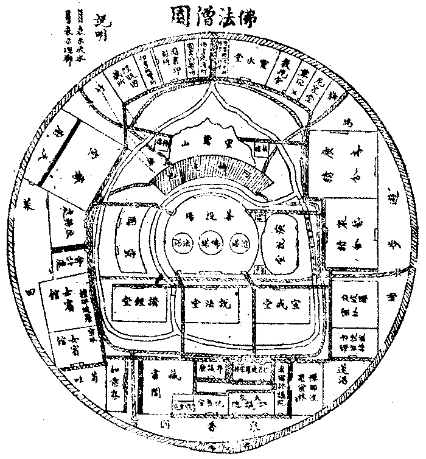

# 整理僧伽制度論
（1915 年冬，在普陀山作）

## 目錄

- 僧依品第一
    - 一　建立僧數
    - 二　抉擇問答
        - 甲　數目決定
        - 乙　信眾多寡
        - 丙　內外部別
- 宗依品第二
    - 一　宗名
        - 甲八　宗正名
        - 乙　兩重差別
        - 丙七　門次第
    - 二　宗史
    - 三　宗學
    - 四　問答
- 整理制度品第三
    - 第一節　教所
        - 一　教所統計數
        - 二　教所建置式
            - 佛法僧園
    - 第二節　教團
        - 一　佛教團體大綱圖表
            - 甲　佛教團體名類表
            - 乙　佛教團體事義表
        - 二　中國本部住持僧談
            - 甲　僧伽支配數
                - （一）族類支配數表
                - （二）處所支配數表
                - （三）問答阿蘭若類
            - 乙　僧伽組織法
                - 第一項徒眾
                    - 第一目僧外攝化徒眾
                        - １仁嬰類
                            - （一）說明
                            - （二）書證格式
                                - 一、領書式
                                - 二、領證式
                        - ２慈兒類
                        - ３求入僧伽類
                            - （一）說明
                            - （二）書證格式
                            - （三）沙彌品籍釋難
                    - 第二目僧內安住徒眾
                        - １出類別
                            - （一）求沙彌戒類
                            - （二）求沙彌尼等戒類
                            - （三）求苾芻戒類
                            - （四）求苾芻尼戒類
                                - 子正說求尼戒類
                                - 丑問答戒受差別
                            - （五）苾芻尼類
                            - （六）苾芻正學類
                            - （七）苾芻參學類
                            - （八）苾芻具學類
                            - （九）犯戒補過類
                            - （十）反出僧伽類
                                - 子自願退出者
                                - 丑犯過棄出者
                                - 寅退出僧伽與佛教之關係
                                - 卯退出僧伽後再求入僧伽者
                        - ２譬行位
                - 第二項職員
                    - １職員產生方法
                        - （一）選舉任者
                        - （二）委請任者
                    - ２處所分配人數
                        - （一）每宣教院者
                        - （二）每蓮社者
                        - （三）每行教院者
                        - （四）每梵剎者
                        - （五）每支提者
                        - （六）每仁嬰苑者
                        - （七）每施醫苑者
                        - （八）每慈兒苑者
                        - （九）每宗寺者
                        - （十）每南山宗寺所增出者
                        - （十一）每宗本寺所增出者
                        - （十二）每持教院者
                        - （十三）佛法僧園者
                            - 子統教諸部
                            - 丑廣文精舍
                            - 寅眾藝精舍
                            - 卯其他林室
            - 丙　釋建立所以
    - 第三節　教籍
        - 一　總籍
        - 二　別籍
            - 甲　戒籍
            - 乙　學籍
            - 丙　座籍
            - 丁　職籍
    - 第四節　教產
        - 一　公有分配法
        - 二　私有之限制
    - 第五節　教規
        - 二　示方隅
            - 甲　衣制
            - 乙　齋制
            - 丙　日誦制
            - 丁　布薩制
            - 戊　曆制
            - 己　名制
- 籌備進行品第四
    - 一　次第三期籌備
    - 二　問答政教分離


## 僧依品第一

### 　　一　建立僧數

如是我聞：今中國本部之佛教僧伽，有八十萬人俱。故茲立論，取為依止。由是當定兩所依界：一者、祇限中國本部十八省為地區：所以然者，僧伽制度，亦依方俗土風而異。十八省地，雖亦遼闊，千年一化，大較相同。而滿、蒙、藏，雖同國家，雖同佛教；言語文字、風俗宗派，莫不絕殊。且彼所殊，非吾所知，便立言故，勢應捨置。又彼僧伽制度，尚無整頓必要，藉欲整頓，必與政治同整頓之，彼以佛教為政治故，故當別論。二者、假定中國本部四百兆為民數：吾國人口無確調查，通語則皆稱四萬萬。考之近史，道光二十八年，稱有四萬二千六百七十三萬。然是概括滿、蒙、藏而言者。但滿、蒙、藏等處，面積雖倍大於本部，而人口則不過本部十分之一二。故辜校吾國本部之民數，假定為四百兆，相差當不甚懸遠也。安此較推，則中國本部有八十萬僧伽，每千人中得有二人。假定此八十萬僧伽，人人平均於二十歲捨俗——此云捨俗、即是出家。就世間諦言之，出家略有二義：一曰、家者家眷，解除夫婦，脫辭親戚，絕此繫屬，謂之出家。二曰、家者庫舍，乞食活命，曠野安身，無所居蓄，謂之出家。唯杜多行者足當之，而於僧伽之義猶隱。依毗㮈耶處而住之僧伽，非必行杜多行，其第二義蓋不相應。故僧伽可包括杜多、苾芻、沙門、釋子諸義；而杜多等，則不必盡能具僧伽之義。今用僧俗為對待名：舊云出家，從負詞可代以捨俗；從正詞可代以入僧。正負兼舉，則曰捨俗入僧。律云捨戒，亦云滅擯，然七種戒非必全捨。世稱反俗，可即正詞；而其負詞當云退僧。正負兼舉，則曰退僧反俗。在名稱上似較妥帖，此亦正名之一端已——。壽六十歲，則在僧之期當有四十年。從是㭊八十萬僧伽為四十分，則每年捨俗入僧者為二萬人。合之四百兆之民數，則每年捨俗入僧者，二萬人中得有一人。恆保持此八十萬僧伽之定數，毋令增減，力求淳善，則既可以住持佛法，化導國民，而又免於過濫過削，得其適中之道。

### 　　二　抉擇問答

#### 　　　　甲　數目決定

問曰：僧數多寡，無關僧制良窳；整頓僧制，第求其良，奚用拘拘於民數、僧數乎？答曰：此亦揆乎時勢，察乎國情，審乎利弊，不得不然者也。

一、離國妨：現在時勢，凡百事務，均須隨國家為輕重。盱衡大地，環觀各國，近所謂之國家主義，殆非一二百年間能打消。中國乃各國中之一，自不得不隨此世風，務強富而求立；蓋非此不足立國也。欲求富強而振國權，則必興實業、擴軍備。而僧伽尚慈忍清淨，擬令與此宗旨不畔，必絕對脫離於兵吏、貨殖等等營務。故在僧者溢此常額，將有妨富強立國之時勢。使在僧而仍服工、商、軍、警之務，則又失清淨慈忍之宗旨，此僧數所以不可加多也。然今世之國家主義，有與周、秦、戰國異者，韓非六反、五蠹之訴，蓋未是通論也！政之所行，教之所修，道固相反；政以治國，教以濬俗，事還相成。若娖娖以霸政為齊，黜慈敬真淨之教而弗顧：然而無慈惠廉愛，則民為虎狼；無文學禮儀，則士為牛馬；軍雖強，財雖足，其民不人，其國成獸，亦奚足為貴乎！觀嬴秦之不旋踵亡，可以悟矣！故今建國於員輿者，雖尚富尚武哉，而尤重教化文明也。論者謂：捨耶教則無西方文化可言，捨佛教則無東方文化可言。此在中國本部，誠不必然。第佛教行中國本部者，近二千載矣，而中國之儒彥，有謂晉宋以來，即為佛學時代。（見國學振起社講義）。有謂隋唐以來。所維綱世道人心者，皆以佛教義為本柢。（持此論者，蓋多大家）。要之、佛教於中國之本部，千百年中所濡涵者，已於社會風習、民群心德，有甚深之關繫；必非餘教能及，可斷言也。其教義之淳正高妙，更無論已！況中國人口甚繁庶，就論軍制，雖千萬常備兵，二千萬後備兵，亦不須壯丁過半數當兵，何靳乎僧中四十萬壯丁乎。故依中國本部現有僧伽人數，雖不須增，決不可減，迺足導揚國光，蔚蒸民化，此僧數所以不可更寡也

二、避俗譏：昔佛世尊，制僧律儀，強半緣俗譏彈而起。中國本部，舊有九流百家，而漢武時，又先尊一儒教。佛教晚興者百餘年，故俗儒每有非理譏彈者。唐韓愈作原道曰：『古之為民者四、今之為民者六；古之教者處其一、今之教者處其三；農之家一而食粟之家六，工之家一而用器之家六，賈之家一而資焉之家六，奈之何民不窮且盜也』？釋太虛曰：愈之說謬甚矣！使民用無以相易也，則農家、工家、賈家既唯一，雖食粟、用器、資焉之家有四，亦烏乎可？使其功足以相抵而其利足以相準，則雖農家、工家、賈家各唯一，而食粟、用器、資焉之家有十百，可也。四既可矣，六亦何害？此墨、孟所以距斥並耕之說也。且其分儒、釋、老之教為三則可，而以其教之三，乃與農、工、賈並列為六民，則紕繆之極矣！蓋釋、老與儒教雖三，律之四民，則均為士民耳。儒者曰學術士，釋老通稱道士，其為士也，又何別乎？設以士民所宗所修有不同者，即與農、工、賈對列為若干民類，則古嘗有九流。（去農家）以九流對列農、工、賈，不亦成十二民類乎？而兵家、醫家等猶在乎九流外，即農、工、賈亦有多種業類不同；依此分裂四民，雖列為百民千民亦有餘，庸僅六民也哉？其言奈之何民不窮且盜，揆之事實，尤不相符。唐代貞觀、天寶之間，釋教、道教，均甚蔚庶；然而刑措風清，民豐物阜，亦在其時，奚窮盜之有哉？甚矣！愈之虛構為誣詞也。然韓愈之說雖虛謬，而庸俗之肆譏，固不必悉合乎正誼。此種陋談，今豈絕哉？抑勢不能一一與之明辨，故智者當善避俗譏。務使皆瞭然於中國本部之僧，每千人中僅有二人。而此千人中之二人，其為益國民者至大；而其享受之衣食住，則又至廉至儉至約。——建塔廟等，即起國民莊敬之用，非關僧住——：雖僧中有百十人之所奉，猶不逮文繡膏粱子弟一人之所費。然後曉焉於窮與盜之故：雖至愚者，亦決不舉每千人中之二僧人，與每千人中各居四分之一之農、工、賈對列為五民六民也。此又所以令僧伽有常數，不使多不使寡者也。

中國本部，唐宋來之儒生，信佛固多，而嫉之甚、欲傾滅佛教者，亦往往有。黃宗羲之作明夷待訪錄，亦列改寺院為學校之說，此皆心習褊狹所致。然佛教之含容博大，茍非相迫相害之甚，其宗佛者決不興諍。蓋佛教之正旨，在乎上契道真，下益民生。對觀他教，則雖上失乎真，茍能下不妨害民生，雖有力亦決不過為排斥。故佛教處處經論中，對於五天竺諸異道，獨排斥裸形、投河、墜巖、臥灰、及持牛狗戒等，為無慚、為愚癡而已。今若景教，論道真固瑣不足稱，然亦有律儀、尚慈濟，設彼不來迫害佛教，宗佛者必與相提攜而不為妨嬈也。況儒宗專重乎人倫之事，於超出世間之道真，隱而不談，本無偏執。其所行者，務求有益民生，即是佛教人天乘法，與佛教戒，水乳相融，何有間隙觝排之端？方今之世，國之士民，其寖能恢其心量而兼容並聽，以擇善相引乎！嘗論儒宗，審其名實，當捨儒名而尊孔聖。蓋儒名之涵義，或則過寬，或則過狹。語其過寬，則儒為學術士之稱，九能百藝，眾學群教，凡百學者，皆得稱儒。雖僧中之學者，亦可謂儒，則無宗義可守。語其過狹，則周官保氏以六藝教民者之謂儒，揆之時制，僅師範生充教員者得稱儒耳。而一以孔聖為師法，則有宗義可守，而又該羅三科。曷謂三科？教育、文史、政治是也。孔子門弟三千，為教育家易知。取為教育師之學者，則有論語、孝經、及裁取乎孟子、荀子、禮記諸篇。大學、中庸，即禮記也。孔子作春秋而刪訂五經，即歷史之文也。文源國史，史集國文，文之所宗，不離於史。即小說等亦史枝流，詩書之為史無論已，故史為文學天樞也。孔子自況周公，作魯司寇猶非本志，孟、荀師孔，皆擬天子三公，以宰相總揆國政者自期。在民主國則即總統及國務卿，在君主國則即宰相及國務員。而漢唐來大儒，亦莫不以宰相執國政為行道，斯即政治家之魁也。以此三科，師法孔聖，建立為孔聖會，則全國中堅之人物，必盡屬乎孔聖之徒。僧伽本以宗教自居方外，但宣揚其教義，坊進民德，輔益國治；與學孔者相成而不相妨，奚用奮心為嫉忌乎！更推論之，使中國不即滅亡而能巋然於大地，將來國體無論為君主為民主，其政體必採立憲可無疑。立憲則必教育普及，試擬四萬萬人平均之壽六十四歲，其受教育平均之學齡為八年，則四百兆八分之一，即有五千萬是學生。以四十學生需一教師論，已有二百五十萬人。但使國民道德教育，必採孔聖學為宗旨，教師必出於師範校，師範生必深明孔學，為教員必入孔聖會，則孔聖會已有此純粹士君子教二百五十萬人矣。然趙普半部論語治天下，在今世誠為欺人語：其農學、工學、商學、軍學、法學、醫學等專科大學校，固應出乎孔學之外，此猶周官保氏，以六藝教，而九流學則在王官，出乎六藝外也。故孔學為國民道德之普通基本，而非國民才術之特殊技能也。此則各專科大學之教師，勢必出之各專門家；然其總教師猶必出之高等師範校生，為孔聖會員深明聖學者。蓋才術技能之知識，仍須範於孔學之道德也。而專科大學校之別教師，其可不究孔學不入孔聖會者，全國至多數萬人耳。此執教育權為昌明孔學之第一步。其次則在執文史權：若國史館、國學苑，及專務著書譯文、營辦印書館、新聞館、雜誌社等文業，掌朝野之清議。其次則政體既立憲，無論總統制、責任內閣制，其選舉勢必有政黨，其執政首領之負責任者，勢必出於政黨。孔學既以執國政為行道，則應以孔學而組織政黨。法吏、軍人不預政黨，農、工、商、醫雖在政黨，勢必以孔學之教育家、文史家，政治家、為中堅人物及魁渠首領，亦可無疑。然則必執政治權在孔聖之門也。其農、工、商、醫、軍、法等事業，誠與孔聖宗旨稍遠，真學孔者必不事也。然但須有五百萬人真學孔者，行此三事，以師法孔，全國重心勢力、已盡在孔門，而無能動搖之矣。五百萬人較之四萬萬人，雖僅八十分之一哉，而有此五百萬真孔學徒，既較八十萬僧伽六倍有餘矣。設若違己所長，不此之務，嫥嫥以宗教之義爭佛教，吾未見為得也。抑此五百萬人，亦論其純粹為孔學者耳。若就國民普通道德教育論之，固四萬萬人皆出於孔學者也。雖此八十萬之僧伽，亦以孔學為基本者，特其增上戒定慧學，則必高出孔學上耳。抑孔學昌明，則佛教必興，徵之前史，非無成例。其理譬泥多佛大，水漲船高也。故奉佛教者必希望孔學之昌，然修孔學者亦當相資於佛教也。布佛教之戒善，足以化人民輔刑政，其理固燦如者。抑就大儒居士論之，功業既立，名譽既修，退養林泉，游神禪悅，足以懸解憂慮，洒落塵累，娛老怡情，安心樂性，其為益亦非淺鮮也。古君子若王摩詰、柳子厚、白居易、文彥博、蘇子瞻、黃魯直、裴休、宋濂輩，其歸心佛法者深矣。輒韓退之作送文暢師序，亦能有慕吾佛之道；特退之性躁而情僻，故終生局脊於憂愁悲傷，而無由自寧放於佛法耳。餘若王安石、歐陽修，晚年亦皆歸佛。至程、朱、陸、王諸先生，其所修多出入佛法，益不容掩諱已。此外以禪定般若為見危授命之資者，亦不乏人。故孔學與佛教、宜相嘉尚，不宜相排毀也。此則吾竊有望當世之大居士、大君子者也。因便涉筆，不覺語繁。

三、符產額：按中國本部，今既有八十萬僧，則現有之僧產，必能活之者也。減其僧數，則難承守，增其僧數，則需追求；需追求則長己煩擾，難承守則授人覬覦，兩皆有害無利，有損無益，此又不宜多不宜寡者也。

#### 　　　　乙　信眾多寡

問曰：據佛學叢報第一期，濮一乘君所作中華民國之佛教觀，謂：漢族男子，則除篤守程朱者，素無宗教知識者，道士及天主、耶穌教徒外，其餘全數信仰佛教；女子亦同，而較男子信仰尤多。謂中國之佛教信徒，多或全國民數十分之八九焉，少亦全國民數十分之六七焉。今八十萬僧伽，則但四萬萬人五百分之一。多寡之數，何大相逕庭乎？答曰：佛門閎博，部類非一。濮君所指信徒有殊，非信教之數有若是之懸絕焉。吾嘗略分佛教徒為信仰部、住持部：濮君兼此二部言者，此論則專就住持部而言。蓋世尊雖說五乘法，而建設化儀則在聲聞乘——大智度論、亦有斯言；今西藏、蒙古間，頗似依菩薩乘化儀而建教者，然猥雜失倫，非清淨律儀。漢土所流傳尊崇者，其學理雖全屬大乘系統，而律儀則從聲聞乘。內祕菩薩行，外現聲聞相，漢土佛教化儀之特色乎！良由緣覺乘攝在聲聞乘——緣覺亦稱獨覺，獨處閒靜，不入部眾、不拘形儀、不聞經法、無師自悟，故號獨覺。此入無佛法世許有，有佛法世則必攝入聲聞部眾。雖處聲聞部眾，觀十二因緣而悟道，故號緣覺。人乘、天乘，暫以化俗，隨世常儀，無別開建——若老、莊等可是天乘，孔教、耶教、是人、天乘。人、天乘即五戒、十善，天乘則是十善、四禪、四定。各加三皈，即是佛教所攝人乘、天乘。欲令佛教所攝人天乘眾，亦有系統，略可標記，故立信仰部類。別見余所著佛教正信會說明書。菩薩乘則浩蕩無涯：在聖而聖，在凡而凡，在天而天，在人而人，在僧而僧，在俗而俗，在君而君，在民而民，在神而神，在畜而畜；種種色類。同修大乘，普度眾生，皆菩薩眾。前之四乘，全非全是；遍於人神緇素之中，而無人神緇素可別。菩薩之捨俗入僧者，他方佛土純一大乘，則依菩薩律儀而住。地上菩薩，持十虛空藏微塵戒；又曰：三賢十聖皆有犯，唯佛一人具足戒。則何善不該乎！又何儀不修乎！若此土既以聲聞為化儀，則捨俗之菩薩，亦必依聲聞律儀住。曹溪乃肉身大士也，將欲說法度人，則捨俗受三壇淨戒。清涼乃華嚴菩薩也，既經領徒範眾，則對僧發十重大誓，皆斯意已。在俗菩薩。既攝在人、天乘，則形儀隨俗而不能住持像教。入僧菩薩則攝在聲聞。聲聞乘眾，以波羅提木叉為師。依毘㮈耶處住。（涅槃、遺教二經，言之最為諄切）。律儀清淨，人天欽敬，獨能住持佛法，故得住持僧名。古德嘗依義立三種三寶：一曰、同體，此乃即心自性功德。二曰、別相，此指果聖、因賢教證。三曰、住持，佛、即金銅土木塔像，法、即三藏九部經典，僧、即捨俗而受持苾芻、苾芻尼戒律部眾。住持僧寶端肅嚴整，則住持佛寶有威靈，住持僧寶禪講精進，則住持法寶得宏通。如是則信仰佛教者興盛，反是則信仰佛教者衰滅。故住持三寶，全係乎住持僧寶而已。此持苾芻、苾芻尼律儀眾，一方面對同體、別相三寶，及住持之佛寶、法寶，以為信徒。一方面則對信仰部而為被信仰之僧寶，故與信仰部大殊也。——何以得為僧寶？謂具僧相、僧德。捨俗依僧，緇衣圓頂，具受沙彌、苾芻、菩薩三壇大戒；守波羅提木叉，依毗㮈耶處住，三聚無犯，六和無諍；此僧相也。修證定慧，學通經論，行解相應，宏揚佛法，人天欽悅，堪受供養，此僧德也。欲令住持僧寶清淨，勢不能不擇善根具足者而度；其數故難多得，且亦無需乎多。果有八十萬真淨僧，每人平均繫五百人信仰，已足化導四萬萬人全數皆信仰矣。若論信仰徒乎，篤守程朱者亦多能信佛，道士亦多信佛，耶穌天主教徒亦多信佛；濮君所謂十有八九，可為定數。

#### 　　　　丙　內外部別

問曰：昔歐洲景教徒，嘗分內侶外侶，內侶深喻浹知，得聞天道；外侶信內侶喻且知，受道而篤守之。彼之分內外侶，不與今分佛教徒為住持部、信仰部，適相類乎？然穆勒約翰嘗譏曰：景教內外侶之鴻溝，僅名存耳。蓋近世人民，德慧術智皆進化，已無從區別矣。然則住持部、信仰部之分，亦可省已？答曰：此有多義，請略陳之：

一者、彼歐洲雖有舊教、新教、公教、修教等，此第景教宗派之別，猶佛教有禪宗、律宗，孔門有漢儒、宋儒耳。其創教之主，固同一耶穌也，所皈依之神，固同一天帝也，而奉誦之經，亦同一約書也。民無異信，教無異道。且彼歐自中古以還，傳承於希臘、羅馬之文化，亦莫不掌之於景教。政治出乎是，學術藏乎是，不唯全洲除景教絕對無宗教，抑亦全洲除景教絕對無文化。蓋一道同風之極矣，縱有德慧術智之士，自然須出景教，無論貴賤、貧富、男女、長幼之民，自然必信景教。豈景教能出德慧術智之士哉，勢不得不出乎是也。豈景教能信一切人民哉，勢不得不信乎是也。士民對景教既有此不得不然之勢，此勢即足住持其教儀而堅固其信仰，初無需乎內侶；故彼不必分內外侶也。譬若今中國人信景教者，亦信彼歐國強勢耳，對其教義固未嘗厝心也。由此觀之，則蒙、藏、緬甸、暹羅等處佛教徒，方可無住持部、信仰部之分耳。然有餘義，故猶未可。若中國本部乎，佛教未至千年前，既有文化矣——印度亦然，佛教未興千年前，已有婆羅門教、掌五天文化矣——；較佛教東來早百餘年，既有儒教道教矣——儒教成於漢武帝，道教成於張道陵——；其本有之文化，既鈐轄於儒教中矣；非有堅苦卓絕優秀閎敏之少數人，服佛服、行佛行、心佛心、言佛言，又奚能宏教信人，忘身衛道乎？此不必諱者也。昔周武帝忌緇衣作天子之讖——後隋文帝代興，卒出於尼寺沙彌也，忌之曾何益哉——，雖初信佛，常閱佛經，欲滅教儀。出詔廢儒、釋、道三教，曰：虛空真佛，無假經像——詔下有慧遠法師當廷抗辯曰：『耳目生靈，賴經聞佛，依像知真，若不藉經教咸能自知者，三皇以前，未有文字，人應自知五常等法，當時何為但識其母，不識其父，同於禽獸？漢明以前，佛教僧徒經像未至，此土含生，何故不知虛空真佛』？帝皆不能答也——；儒史政術，存佐王治。僧徒道士，皆返俗儀，有德能者，共輔朝政。建通道館以選拔僧道中碩學時彥以處之，只許尋討講習其義理，不得建塔、造像、傳戒。於是盡改作一切僧寺為衙署。彼時一二年中，佛教幾全同消滅也；然儒學則略無損動。以彼時除儒術，則治國化民之政學，無所憑也。今中國本部之佛教，積化久遠，流風廣被，較彼時固逈不相侔。然純粹之學佛法者，高蹈方外，不干國政，始未昔異；欲存教儀，其烏可無住持僧乎！

二者、耶教內侶、外侶之分，在內侶得學習異說，以建立自宗而解破客難；外侶則但許讀教義純一之經，斯即彼內外侶之鴻溝也。今書報之用如水火，學術既無國界，人民又皆識字，則何能禁其不讀異說乎？宜穆勒譏彼內外侶僅名存也。佛教徒分住持部、信仰部，本不同彼，且適相反：住持部在初學時期，頗宜禁讀俗書，使其專心一慮，研幾經律，修習禪定。若信仰部則泛及一切異宗、異教等學者，凡有信心，普遍該攝。既皆得治異學，亦莫不可遍讀三藏。設修十善。則於語業，誡之勿妄語、勿綺語而已。故景教內外侶之鴻溝破；與佛教徒住持、信仰之殊部無涉也。

三者、景教係人天教，教徒之行，本非離俗，自不必與俗有殊部。而佛教徒則不獨為住持化儀，當守遠離俗染之別解脫戒律；即修禪定，亦必訶五欲、棄五蓋，外息諸緣、內心無喘，泯絕意志，方能相應。非捨俗為僧者，不足證法身、延慧命，非信僧居俗者，不能資道業、利民生，僧俗烏得不別居乎？

四者、景教係一神教，其有裨於世之功行，雖近佛教人乘戒善，亦殊未備。此外則除專皈依一天帝求生天外，了無別義。稍涉微奧，輒曰是全能上帝之所知。夫然，則雖極愚亦所易解，即解此者，亦有何德足令人信仰乎？故彼決無內侶存立地也。而佛教何如哉？三藏浩浩，義類無邊，極高明，盡精微，深固幽遠，無能測量！然莫不顯露透徹著為說；集世間所有諸宗教哲學，曾不足為比對。非專志凝念研究之，不能庶幾通悟，固矣！且佛性皆本具，而法身非心外，但須定慧功深，必得菩提親證，一生即可成佛，肉身便是應真。為善知識，皆能覺悟有情；凡供養者，罔不福利無量、此咸非捨俗在僧不成辦者也。

後之二義，章氏叢書之建立宗教論，言之頗詳。今請引之。其文曰：

或舉赫爾圖門之說，以為宗教不可專任僧徒，當普及白衣而後可。若是則有宗教者，亦等於無宗教。自我觀之，居士、沙門，二者不可廢一。宗教雖超舉物外，而必期於利益眾生！若夫宰官、吏人之屬，為民興利，使無失職，此沙門所不能為者。乃至醫匠、陶冶，雜技、百肆，利用厚生，皆非沙門所能從事。縱令勤學五明，豈若專門之善？於此則不能無賴於居士。又況宗教盛衰，亦成因緣國事。彼印度以無政治故而為回族所侵，其宗教亦不自保，則護法之必賴居士明矣。雖然，居士者果足以為典型師表耶？既有室家，亦甘肉食，未有卓厲清遐之行，足以示人；至高不過陳仲、管寧，至仁不過大禹、墨翟，猥鄙污辱之事，猶不盡無，其於行節固未備也。以彼其人，而說無生之達摩，持二空之法印；言不顧行，誰其信之？夫以洛閩儒言，至為淺薄，而營生厚養之士，昌言理學，猶且為人鄙笑，況復高於此者！宗教之用：上契無生，下教十善。其所以馴化生民者，特其緒餘，所謂塵垢糠粃陶鑄堯舜而已。然非有至高者在，則餘緒亦無由流出。今之世非周、秦、漢、魏之世也。彼時純樸未分，則雖以孔、老常言，亦足化民成俗。今則不然，六道輪迴地獄變相之說（安此猶天教之共義，未是佛教之不共義），猶不足以取濟。非說無生，則不能去畏死心；非破我所，則不能去拜金心；非談平等，則不能去奴隸心；非示眾生皆佛，則不能去退屈心；非舉三輪清淨，則不能去德色心。而此數者，非隨俗雅化之居士所能實踐，則䀨䀨者亦無所益。此沙門、居士所以不得不分職業也。借觀科學諸家，凡理想最高者，多不應用，而應用者率在其次之人，何獨於宗教而不然耶？嘗試論之：世間道德，率自宗教引生。彼宗教之卑者，其初雖有僧侶祭司，久則延及平民，而僧侶祭司亦自廢絕。（若左傳所載祀神事，皆有專業司祝祭者，今則祀天祀城隍等，官民自為）。則道德普及之世，即宗教銷鎔之世也。於此有學者出，存其德音，去其神話，而以高尚之理想，經緯之以成學說。若中國之孔、老，希臘之梭格拉底、伯拉圖輩，皆以哲學而為宗教之代起者。梭氏、伯氏之學，緣生基督；孔子、老子之學，遷為漢儒，則哲學復成宗教。至於今，斯二教者亦駸駸普及於國民矣。一自培庚、笛加爾輩，一自程、朱、陸、王諸儒，又復變易舊章，自成哲學。程、朱、陸、王，固以禪宗為其根本；而輓近獨逸諸師，亦於內典有所摭拾；則世界繼興之宗教，必釋教無疑也。他時釋迦正教，普及平民，非今世所能臆測。然其無上希有之義，必非常人所喻；離欲超世之行，必非恆俗能踐；則沙門與居士，猶不得不各自分途。赫氏所言，但及人天小教；此固可以家說戶知者，然非所論於大乘。後之作者，無納滄海於牛蹄可也。

釋太虛曰：觀章居士斯論，可知佛教徒於住持部、信仰部不得不分。亦可知住持部僧伽，不宜甚多甚寡。務求內充高行，外足導俗，以適其中道矣。故吾今擬議整頓中國本部之僧伽制度，還取現有八十萬僧伽數，為根本依止也。

## 宗依品第二

有僧伽矣，僧何所宗？概言之、則宗佛法而已矣。然而汰矣！世有流變，方有殊尚，豈徒教儀，亦該學理。今上不徵五天，下不徵各地，亦還取中國本部二千年來所流通闡揚者為依止耳。然南閻浮提洲之大乘佛法，莫備於震旦矣，而小乘則附焉而已。顧震旦之佛法，又隋、唐為全盛，六朝以往，發端而微；五代以降，殘廢而偏。欲復震旦佛法大全而擴充之，則又當取隋、唐諸宗師學為依止也。今大別為八宗而分條覶述之，在此，則可附益而不可移植；在餘，則可含攝而不可別樹。故務使八十萬僧伽，皆不出於八宗之外，常不毗於八宗之一。始從八最初方便學，門門入道，終成一圓融無礙行，頭頭是佛。如八楞寶，唯一金剛，則震旦佛教之特色，亦震旦僧學之異彩已。

### 　　一　宗名

#### 　　　　甲八　宗正名

一、清涼宗，古稱華嚴宗、賢首宗。然此宗當以華嚴疏鈔為根本部，而此部實成於清涼大師，故不稱賢首宗；猶天台傳自北齊、南岳、以三大部成於天台，不稱北齊、南岳宗也。又以法由人宏，當尊祖庭。且解華嚴者有旁家，而此宗所屬經論又不僅華嚴，故不稱華嚴宗，而以清涼為定名焉。

二、天台宗，或稱法華宗。此宗固以法華為根本經，然所屬之經論甚多，解法華者亦有旁家。且兼尊崇祖庭，故不稱法華宗，而以天台為定名焉。

三、嘉祥宗，古稱三論宗、或法性宗、或破相宗、或空宗。揆之名實，皆未允當，蓋祇少分相似義耳。何則？此宗根本部中，決不可去大智度論，則已成四論宗。且實該羅般若諸經，寧可獨以論名？且靈峰大師嘗言曰：唯識以遍破我法二執為宗趣，故借立法為遣情之門，般若以會一切法無非妙理為宗趣，故借破執為立理之門。然則唯識宜名破相，般若宜名立法，而相傳反稱唯識為相宗，般若為空宗者，謬也。故今云皆未允當也。然此宗逮嘉祥大師而學盛義完，用之名宗，且以尊祖。若推尊羅什法師為開祖，則什師終身譯講於逍遙園，即今秦中白塔寺也，則宜名白塔宗。

四、慈恩宗，或稱唯識宗、法相宗。定於今名，理由大致同上。

五、廬山宗，古稱淨土宗、或蓮宗。淨土或蓮二義，一則過寬：出世皆淨土，十方多淨土；華藏娑婆，無不在一大蓮花中。一則過狹：阿彌陀佛極樂世界，所清淨者非祇依土，所殊勝者非祇蓮臺。今以此宗古今公認之初祖為定名，祖庭斯尊，行義亦備，卓然無以易也。

六、開元宗，古稱真言宗、或密宗。法義雖當，未能尊祖。然善無畏居內道場，金剛智與不空居慈恩寺。內道場為名不雅馴，慈恩寺則濫慈恩宗。且此三祖宜並尊之，而世稱開元三大士，則皆共知，故定今名。

七、少室宗，古稱禪宗。義亦少濫。今以初祖祖庭名之，庶幾循名思實，皆知法祖之行，而尊祖之道乎！若依清涼、天台之例，則可定名為曹溪宗。

八、南山宗，或稱律宗，法義亦當。然六朝初唐間，以律學成宗者，本非一家；而盛唐來，則莫不宗南山。宋靈芝照律師固亦宗南山者，雖稍有別，猶天台之有山外派，少室之有五派，固不出天台、少室也。故以南山為定名焉。

#### 　　　　乙　兩重差別

此八宗中，須知有兩重別。一者、祖有華、梵之二別：開元、少室二宗，其祖梵師；餘皆華師，二宗所以必梵祖者，以此二宗師承最嚴故也。真言儀軌，須受灌頂，故不得不嚴於師承。此宗今雖當轉承之日本，彼亦尊開元三大士為祖。向上宗乘，教外別傳，以心印心，不立文字，故亦不得不嚴師承。夫少室宗以光顯其道於世者論之，雖亦可名為曹溪宗；而卒不得名為曹溪宗者，以非達磨真傳嫡嗣，曹溪固不能所憑而起。若憑經論，則成教家，曹溪門人謂永嘉曰：公雖自悟，若不得師，威音王前則可，威音王後則天然外道也。故此宗源流，必由梵祖上溯於釋尊，猶之非無佛世、不容有獨覺也。況曹溪時已有南宗北宗之諍，其後則更有五派七支之紛擾；不返之乎鼻祖，將何以杜其弄門庭建設之光影，而坦然顯直指別傳之真風乎？若開元宗興盛一時，震旦除開元三大士，更無鼻祖，不待論已。餘六宗則皆可取經律論以為憑證，故不必親承。而得遙接孤起也。

二者、名有山、寺、年之三別，今表示如下：


```
　　　　　　　　　　　┌清涼……┐
　　　　　　┌以山名者┤天台……├…四宗
　　　　八宗│　　　　│廬山……│
　　　　　　│　　　　└南山……┘
　　　　　　│　　　　┌嘉祥……┐
　　　　　　│以寺名者┤慈恩……├…三宗
　　　　　　│　　　　└少室……┘
　　　　　　└以年名者…開元…………一宗
```


今此八宗立名，皆以尊祖庭為唯一宗旨，以山、以寺名者皆宜。獨開元是唐玄宗之年號，揆之尊祖庭之宗旨，殊未諦當，而又苦無他名可代。然今各地往往有開元寺，西京慮亦有之，則以西京開元寺為開元宗之祖庭可耳。

#### 　　　　丙七　門次第

問曰：詳八宗次第之排列，固絕不依創始年代先後立者，而為此次第之排列，其無義乎？抑有義乎？答曰：亦有義亦無義。云何無義？既分八宗而陳其名於書，無論列誰前列誰後，其次序皆必不可避。由必不可避而成序，則雖有次第與未嘗有次第同，夫何意義可言？然亦嘗於必不可避之次第中，求其為稍有意義之排列，其義門分有七對焉。今請先表示而後附釋之：


```
　　　　　　　　　　　　　　　　　　　　　　　　　┌始…清涼宗
　　　　　　　　　　　　　　　　　　　　　　┌智…└終…天台宗
　　　　　　　　　　　　　　　　　　　┌性…└慧…嘉祥宗
　　　　　　　　　　　　　　　　┌法…└相…慈恩宗
　　　　　　　　　　　　　┌顯…└信…廬山宗
　　　　　　　　　　┌教…└密…開元宗
　　　　　　　┌道…└證…少室宗
　　　　八宗…┤
　　　　　　　└基…南山宗
```


由豎觀之：可見順序之、則前南山而後清涼，逆序之、則前清涼而後南山。由橫觀之：可見順序之、則清涼而後南山，逆序之、則前南山而後清涼。蓋逆順皆次第，橫豎無不通也。初分道基一對：戒、為佛道之基，就三學論，亦為定慧之基。且今所論八宗，皆以僧為能宗之人，而僧俗所由別之基，亦在戒律。不受出家眾戒，是俗非僧。今論專言僧伽制度，非僧則非今論所及；南山宗則專以出家眾戒為本者也。況七眾戒及菩薩戒，其學概歸此宗。一切修佛道者，其基礎不出七眾戒及菩薩戒；若五戒不守一，且不得具人格，遑能修佛道乎！故以基義獨配南山。所基之道，則即餘之七宗。由道、次分教證一對：華嚴疏鈔依親光菩薩十地論釋十地品，列十對門，明可說不可說分齊；教證即第四對，謂阿含——（譯音淨教）——可說，證智不可說。四卷楞伽明宗通、說通，宗通離言，說通施教，此即後世宗門、教家之分所本。然十卷、七卷楞伽，皆譯宗通為自證聖智，故宗通即證智別名，皆有離言不可說義；以不可說為說，所謂無門為法門也。少室宗以世尊拈花，初祖傳法之時，寥寥數語以為根本宗旨。一曰教外別傳，一曰不立文字——須知一念纔興，早落顯境名言，即屬阿含、即屬文字——，蓋全超阿含，直顯證智也。畔此根本宗旨，雖曰無宗門可。寂音作智證傳，亦明斯意。或者以其名禪宗，而屬之六度中禪那度，非是。故以證義獨配少林，餘六宗則皆言教攝。由言教門、次分顯密一對：獨配開元宗為密教易知，餘五宗則皆顯教攝。由顯教門、次分法信一對：大小乘論皆說有二種行：一、隨法行，二、隨信行。隨法行者，謂由了解法義而起行也。隨信行者，謂由諦信師教而起行也。此二行人，非關利鈍、以各有利鈍故。隨法行者，以利根故，善能分別一切法義；以鈍根故，心多疑惑，必須究窮一切法義，乃能斷疑生信起行。隨信行者，以利根故，一聞即信，把得便行；以鈍根故，無由自知一切法義，但能仰信師教，依之精懇修行。念佛法門，普攝諸根，尤以持名念佛為最要妙。但堅信心，發願專念，七日一心不亂，臨終決生極樂，既見彌陀，何愁不悟。能宗通說通者固佳，即不悟解者亦無害，然非信之極堅，則雖往生亦墮疑城。夫信為道元功德母，固諸宗之所同，而此宗為尤要，故以信行獨配廬山。餘四宗則必大開圓解，而後能相應起圓觀行，故屬隨法行攝。由法行教、次分性相一對：性相通則互易——如曰實相，曰異生性，則相為性，而性為相——，局則性教融攝圓通，渾然無所間隔；相教分別深細，秩然不容假借。慈恩宗以楷定明了故為無諍，不同餘宗以變動不居為無諍。雖遣情之門哉，而遣情之門貴在此！故以相教獨配慈恩，餘三宗則皆性教攝。由性教門、次分智慧一對：智慧通則一義；局則智約十波羅蜜善分別後得智，慧約六波羅蜜無分別根本慧。大智度論曰：別則般若為因，至佛心則變名一切種智。通而為論，俱通因果。般若多就即善分別之無分別慧說，故以慧門獨配嘉祥。華嚴顯毗盧遮那智——即一切種種種光明遍照義——，法華入佛知見，皆重在即無分別之善分別智，故智門攝。由智度門、次分始終一對：華嚴根本法輪為始，猶娑竭羅龍王於大海中，一念遍興四天下雲雨；法華會歸佛乘為終，猶四天下江河溝瀆，皆朝宗乎大海。二經固一佛化儀之始終也，而清涼、天台實宗之，故以配也。況天台又兼攝涅槃者哉？然此七對義門分別，亦據八宗少分偏顯之相以為言耳。剋體論之，全基是道，全道即基；乃至全始貫終，全終徹始，無不一具一切，一切攝一者也。然有一言不得不正告者：此之八宗，皆實非權，皆圓非偏，皆妙非麤；皆究竟菩提故，皆同一佛乘故。清涼配法華為終教而非圓教，天台配華嚴為兼別而非純圓，此乃獨標自宗殊勝，非此無以死學者偷心耳，亦猶大哉乾元，至哉坤元之談。然師家須善於應用，無一物是藥，無一物不是藥者，此可深長思焉！

### 　　二　宗史

一、南山宗，震旦律學，始曇摩迦三藏之傳戒。繼是翻譯而疏述者，唐代之前，垂數十家，而惠光、法礪、智首三師之疏為最著。唐終南山道南宣律師，始唱心宗戒體，作五大部發明其義。集成之功，遠邁西土，遂為此宗祖焉。同時有懷素律師及宗法礪律師學者，崇峙一時。稍後有義淨三藏，復譯出根本說一切有部律甚多。然或湮沒大藏，或淪散殊邦，後代鮮宏通者。獨南山所宏四分律，迄今不替。蓋由南山歷傳至宋，得允堪律師會正記，及靈芝律師資持記，用法華、涅槃開顯之圓意，光大斯宗，故得綿延不衰。今雖法門猥雜，大義泯棼，其故轍猶未盡隳也。

二、少室宗：昔世尊在靈山會上，拈花示眾，獨大迦葉破顏微笑。乃曰：吾有正法眼藏，付囑於汝。十二傳為馬鳴，十四傳為龍猛。二十八傳則為菩提達磨，始將傳法衣缽，東來震旦，面壁少室，是為震旦初祖。五傳至曹溪，其道始顯於世。蓋梵土諸祖僅密付單傳而已。馬鳴、龍猛，廣造大乘經論，未嘗專揚靈山拈花之旨，故此宗梵土不光顯。至曹溪、悟者始如過江名士矣。由曹溪出青原南嶽二支，青原下出曹洞一派，由南嶽下復出溈仰、臨濟、雲門、法眼四派，是為五家宗派。後由臨濟，復出楊岐、黃龍二派。今雲門、法眼、溈仰，久成墜緒；曹洞亦不絕如線。憧憧遍震旦者，錄臨濟源流曰幾十幾世而已。然猶幸有此臨濟源流也，不然，宋明迄今，不知裂成幾百幾千派矣！故晚明諸師，殷殷辨源流綱宗已。雖然、末矣！與初祖東來之旨益荒矣。今既不足復分五派，則宜溯源少室，曰傳少室正宗幾十幾世為當。

三、開元宗：唐朝開元四年，善無畏三藏、始將梵筴至長安，譯出密部經論。一行大師盡得其傳。同時、金剛智三藏率弟子不空三藏，亦來東土。案密部由龍猛菩薩開南天竺鐵塔，禮金剛薩埵，受灌頂儀軌，其法遂行於世。龍猛即以之傳龍智，而金剛智則親承於龍智者也。善無畏亦傳自龍智，而與金剛智、不空、同稱開元三大士。當時君相禮敬如佛，此宗遂如日月經天，江河行地。顧未幾即湮沒。故志磐法師作佛祖統記，已謂唐未亂離，經疏銷毀。今其法盛行於日本。而吾國所謂瑜伽者，但存法事，蓋宋時已成市井歌唄矣。元、明、清朝，其法行於宮掖，然亦承於蒙藏喇嘛，非復開元之舊。唯日本猶存其全法，受而歸之，則此宗可復也。

四、廬山宗：東晉廬山慧遠大師，與居士劉遺民等百餘人，宗依經論，修專念彌陀、求生極樂之法門，首創蓮社。遠公既負天下重望——遠公不徒邃精佛法、為梵僧歎為震旦大菩薩，且尤善莊、善易、善詩、善禮，各有儒生傳其專學——，其證驗又昭然人目，尊為此宗初祖，千古翕然。歷代宏揚，曾不稍替。唐初善導大師，以專持阿彌陀佛名號倡，迄今婦孺莫不知稱阿彌陀佛。禪、教、律師及諸居士，尤多提撕，蓋無不崇奉也。故此宗無法派流傳，然莫不尊廬山至雲棲為八祖云。

五、慈恩宗：玄奘三藏西訪五天，學於戒賢大師。囊括梵土大小乘法，東還譯講。悉舉彌勒、無著、天親之學，以傳弟子窺基，是為慈恩法師，作疏百本，大暢其義。因成唯識一論，作述記及樞要二部，以匯其流。慈恩弟子惠沼，又依述記著了義燈。惠沼弟子智周，亦依之作演祕。三師親承，其教義燦若日月矣。然更武宗之難，五代之亂，至宋已式微矣。元時又盡失其疏記，六百年來，講筵僅略識其梗概。今幸由日本次第取還其典籍，可期恢復。雖然，明、清來稱教下三家，固未嘗全絕其學也。

六、嘉祥宗：鳩摩羅什大士，為龍猛菩薩四傳之弟子，提婆菩薩之曾孫也。傳法東來，專宏龍猛、提婆之般若宗，是為此宗遠祖。門下生、肇、融、叡、影、觀、恆、濟八哲，咸受大義。濟傳道朗，朗傳道詮，詮傳法朗，朗傳吉藏，即是嘉祥大師。大師盛弘之於隋朝，製作繁多，難以具舉。蓋此宗至嘉祥門學始嚴，卓然不可逾也。入唐講學愈盛，惠遠、智拔、惠喻、法敏諸德，相繼輩出。破顯妙宗，光被四海。惜乎五季之後，教典蕩然，宋、元來至無人能舉其名！今幸得日本為反哺，學者乃皆知此宗為震旦佛法碩果，而研鑽者日多。

七、天台宗：北齊惠文大師讀中論偈，悟三觀理，以授慧思大師。師居南岳，大弘禪法。智顗大師往謁，喜曰：『昔日靈山同聽法華，夙緣所追，今復來矣』！乃授三觀禪法。後誦法華至藥王品，證入法華三昧，徹見靈山一會，儼然未散。思印之曰：『非爾莫證，非吾莫識，此法華三昧之前方便也』。自是智解泉湧，學徒影從。棲天台山，終身弘法。始立五時、八教，網羅全藏，宗極法華，道觀雙流，戒定兼闡，其義指莫高也！故為此宗高祖。弟子章安筆記其說，成為一宗典籍，比之阿難結集。再傳法華、天宮、左溪三師，其道稍隱。溪傳荊谿湛然大師，起而振之，號為烈祖。五代喪亂，教典亦失。宋代漸由高麗、日本求歸。荊溪八傳弟子四明知禮大師，又重興之。與四明同時有孤山法師，立義稍異，遂裂為山外派，不久消息。獨四明之山內一派，廣智、南屏，相繼流衍；明代亦多哲人。今南北講筵盛弘者，胥在此宗。然第歠其流而不探其源，禪觀固不相應，教義亦多汗漫！

八、清涼宗：晉佛陀跋陀羅三藏，始譯出華嚴六十卷。雖經敷講，未極玄致。杜順和尚、謚號帝心尊者，始括奧旨作法界觀，是為此宗遠祖。順授智儼大師，明六相義，作搜玄記。儼授賢首國師，造探玄記及六十華嚴疏，發揮盡致。蓋此宗之三祖也。惜其說為弟子惠苑所亂，嗣又紛失莫傳。時有實叉難陀，又譯華嚴成八十卷，號曰新經。清涼澄觀國師，遙承前三祖之遺意，籠罩諸宗，匯歸真界，撰成新經大疏，足為千古極唱，故宗祖宜在乎此也。且歷代流通者，皆八十卷之華嚴經。縱賢首之舊疏復出，不足以易之矣。惜後代少能承其法流之全者！觀傳圭峰宗密大師，著述亦富。會昌之厄，遺風掃地，至宋長水子濬大師，始稍稍搜輯以起其墜緒，然亦不復能光大矣。明代別峰、麓亭諸公，亦講其學。今雖流傳，精者良少。然楊仁山居士從日本、高勾麗，收回此宗佚書頗多，教典則宏備矣，興起之、則嘗有需乎豪傑士！

### 　　三　宗學

一、清涼宗：當以華嚴懸譚、華嚴疏鈔為根本部，合經共二百六十卷；其次則法界觀、五教止觀、十玄章、六相章、一乘法界分齊章、起信論義記、圓覺廣疏，略疏等；而以唐朝前講地論諸家著述、及華嚴合論附之。

二、天台宗：當以法華玄意、法華文句、摩訶止觀為根本部；其次則大乘止觀、禪波羅蜜門、（禪波羅蜜一書，備論世出世間諸禪，小止觀、六妙門，亦攝在此，學者不必另習。但傳授諸居士，則當別行。）維摩經玄義及略疏、金光明經玄義及疏、章安涅槃經疏、荊溪釋籤、輔行，以至四明諸部著作，靈峰之教觀綱宗等；而以大智度論、中論等附之。

三、嘉祥宗：當以大智度論、及嘉祥之中、百、十二門三論疏為根本部，大智度論即釋大品般若者；其次則諸部般若、及廣百論釋、掌珍論、肇論等，而以講成實論諸家著述、附之。

四、慈恩宗：當以解深密經、佛地經、成唯識論述記、及樞要、了義鐙、演祕為根本部；其次則五大論、十支論、及攝大乘論、因明入正理論等；而以講俱舍論諸家著述、附之。

五、廬山宗：當以無量壽經、觀無量壽佛經、彌陀經、及往生論、妙宗鈔、彌陀疏鈔為根本部；其次則採集鼓音王經、寶積經、華嚴經、法華經等稱讚西方文品；而擇古今屬於此宗諸家要著、附之。

六、開元宗：當以大毗盧遮那成佛神變加持經疏、及大日經、金剛頂經、蘇悉地經為根本部；其次則諸儀軌；而一切祕密陀羅尼部、皆附之。

七、少室宗：此宗不立文字，而顯密教一切文字，歷祖語錄及世間之文書，皆其文字，超諸名相，唯悟為則！

八、南山宗：當以道宣律師四分律戒疏、業疏、靈芝律師資持記、靈峰律師梵網疏為根本部；其次則古三要疏、及會正記等，而大小乘、人天乘諸部律學、皆附之。

今此論於宗學，僅陳梗概。除少室宗，各專宗當編成學程次第，要以從總入別、從淺入深、從局入通則。而少室宗當集成少室宗大全一書，略如五燈會元而擴充之，總收諸祖語錄兼其行事敘之；一宗之歷史及著述，無使或遺，以建綱宗而成典範，此出禪堂後之事也。餘之七宗，當各編自宗歷史一，自宗集要一，自宗法數一，自宗翻譯名義一，自宗三藏目錄一，又自宗辭典一，以備學者參考。即根本部中所引用為注疏之經論俗典，亦當備之講堂，俾學者語語皆知其出處。與自宗無關係者，一切屏絕，令學者專志也。

### 　　四　問答

## 整理制度品第三

### 　　第一節　教所

#### 　　　　一　教所統計數

先定教所之統計數，按今中國舊部——指十八省——政制，分為四級：一、縣，二、道，三、省，四、國。試假定四鄉為一縣，十六縣為一道，四道為一省，而中國本部有十八省，則已有定數也。今即依之支配教所：

一者、縣區列表如下：


```
　　　　┌───┬──┬──┬────────────────────────┐
　　　　│名　稱│地點│數目│　說　　　　　　　　　　　　　　　　　　　明　　│
　　　　├───┼──┼──┼────────────────────────┤
　　　　│行教院│城中│一　│云行教院，示別持教院也。譬在上海則曰上海行教院，│
　　　　│　　　│　　│　　│此為佛教團體一縣機關。　　　　　　　　　　　　　│
　　　　├───┼──┼──┼────────────────────────┤
　　　　│法　苑│城廂│一　│法苑專修經懺法事，每縣置一在人民聚居處。或因舊寺│
　　　　│　　　│　　│　　│之便，每縣置二。再多則法儀難周，更有多種不便。　│
　　　　├───┼──┼──┼────────────────────────┤
　　　　│尼　寺│城廂│一　│尼寺專住苾芻尼眾，尼眾不宜分散居住，及宜在城廂住│
　　　　│　　　│　　│　　│，毘奈耶雜事處亦嘗言之，蓋以免暴客之擾也。　　　│
　　　　├───┼──┼──┼────────────────────────┤
　　　　│蓮　社│城廂│一　│蓮社乃通攝一縣善士信女，共修念佛三昧之所，故亦宜│
　　　　│　　　│　　│　　│設在人民聚集之一處。　　　　　　　　　　　　　　│
　　　　├───┼──┼──┼────────────────────────┤
　　　　│宣教院│四鄉│四　│此乃宣講於鄉鎮者，宜在每縣四鄉大市鎮上。各置一所│
　　　　│　　　│　　│　　│，統屬於行教院。　　　　　　　　　　　　　　　　│
　　　　├───┴──┴──┴────────────────────────┤
　　　　│　　計每縣共八所。若上稽於道區，則每二縣有一宗寺。　　　　　　　　　│
　　　　└──────────────────────────────────┘
```


二者、道區列表如下：


```
　　　　┌──────┬──┬──┬─────────────────────┐
　　　　│名　　　　稱│地點│數目│　說　　　　　　　　　　　　　　　　明　　│
　　　　├──────┼──┼──┼─────────────────────┤
　　　　│清涼宗某某寺│　　│　　│此之宗寺，即八宗之專修學處，僧中人才，胥出│
　　　　├──────┤宜在│各　│於此。昔之書院，今之大學校等，亦宜在山林空│
　　　　│天台宗某某寺│　　│　　│曠地，學世俗學且然，況佛學之專修處乎？然此│
　　　　├──────┤山林│　　│當仍寺名，不得名為學校。蓋所修學不離叢林規│
　　　　│嘉祥宗某某寺│　　│　　│制，本與世俗學校逈別，一名學校，不免為政治│
　　　　├──────┤勝地│　　│教育所範，甚非政教兩便之道。故佛教總會章程│
　　　　│慈恩宗某某寺│　　│　　│上，改稱各宗大學校者，當刊正也。又舊有禪寺│
　　　　├──────┤遠離│一　│、講寺、律寺等分別，今亦當去除之。少室宗亦│
　　　　│廬山宗某某寺│　　│　　│未嘗不上堂講說，天台等宗亦未嘗不晏坐禪觀，│
　　　　├──────┤城市│　　│各宗既無不守戒律，而南山宗亦未嘗不講律、坐│
　　　　│開元宗某某寺│　　│　　│禪也。故此所定稱者，各宗祖庭，則但曰某某宗│
　　　　├──────┤囂憒│　　│寺，假曰天台宗寺。各宗餘處之寺，則或加以舊│
　　　　│少室宗某某寺│　　│所　│稱，或加以山名，假曰少室宗天童寺。此之區別│
　　　　├──────┤　　│　　│，猶日本各宗有本寺、支寺也。　　　　　　　│
　　　　│南山宗某某寺│　　│　　│　　　　　　　　　　　　　　　　　　　　　│
　　　　├──────┼──┼──┼─────────────────────┤
　　　　│　　　　　　│　　│　　│菩薩學五明處，有醫藥明。佛號醫王，大士亦有│
　　　　│佛教醫病院　│城廂│一　│藥王、藥上，救治病苦，眾善所尚，故每道區各│
　　　　│　　　　　　│　　│　　│設一所。　　　　　　　　　　　　　　　　　│
　　　　├──────┼──┼──┼─────────────────────┤
　　　　│　　　　　　│　　│　　│始生曰嬰兒，亦曰赤子，赤子之心曰仁。菩薩有│
　　　　│佛教仁嬰院　│城廂│一　│嬰兒行，示同嬰兒，以為主道。嬰孩不幸為父母│
　　　　│　　　　　　│　　│　　│棄，收而養之，仁莫大也，故每道區各設一所。│
　　　　├──────┴──┴──┴─────────────────────┤
　　　　│　計每道區共有十所。　　　　　　　　　　　　　┐　　　　　　　　　　│
　　　　│　統計縣區則有行教院、法苑、尼寺、蓮社各一六　├合計一三八所。　　　│
　　　　│　所，宣教院共六四所。　　　　　　　　　　　　┘　　　　　　　　　　│
　　　　└──────────────────────────────────┘
```


三者省區列表如下：


```
　　　　┌──────┬──┬──┬─────────────────────┐
　　　　│名　　　　稱│地點│數目│　說　　　　　　　　　　　　　　　　明　　│
　　　　├──────┼──┼──┼─────────────────────┤
　　　　│　　　　　　│　　│　　│此為一省佛教團體機關，譬在浙江則曰浙江持教│
　　　　│持　教　院　│省城│一　│院，名教院者，依教秉持於僧，宣道於俗者也。│
　　　　│　　　　　　│　　│　　│行教院、宣教院，視此。　　　　　　　　　　│
　　　　├──────┼──┼──┼─────────────────────┤
　　　　│　　　　　　│　　│　　│貧兒孤兒，衣食無靠，教育何處能受，當慈憫故│
　　　　│佛教慈兒院　│省城│一　│，收養教之，扶植成人。仁嬰及七歲者，亦收於│
　　　　│　　　　　　│　　│　　│此。欲令博大，每省僅設一所。　　　　　　　│
　　　　├──────┴──┴──┴─────────────────────┤
　　　　│　計每省區二所。　　　　　　　　　　　　　　　　　　　　　　　　　　│
　　　　│　統計道縣有行教院六四所，法苑六四所，尼寺六四所，蓮社六四所，宣教院│
　　　　│　二五六所，宗寺三二所，醫病院四所，仁嬰院四所。　　合計五五四所。　│
　　　　└──────────────────────────────────┘
```


四者、國舊部區列表如下：


```
　　　　┌────┬──┬──┬───────────────────────┐
　　　　│名　　稱│地點│數目│　說　　　　　　　　　　　　　　　　明　　　　│
　　　　├────┼──┼──┼───────────────────────┤
　　　　│　　　　│　　│　　│此為中國本部佛法僧全體機關，包羅宏富，該攝僧俗│
　　　　│　　　　│　　│　　│。以園名者，昔佛住處曾曰祇園，而僧伽藍亦譯眾園│
　　　　│佛法僧園│國都│一　│。園宜茂植名花佳卉，則又取譬相成。曰佛法僧園者│
　　　　│　　　　│　　│　　│，中國舊部住持三寶全體之大根柢，皆栽於是故也。│
　　　　│　　　　│　　│　　│只宜有一，其理易明，與政相倚，故在國都；若隨教│
　　　　│　　　　│　　│　　│勢，亦可在武漢、或金陵、或上海耳。　　　　　　│
　　　　├────┴──┴──┴───────────────────────┤
　　　　│　計國區一所。　　　　　　　　　　　　　　　　　　　　　　　　　　　│
　　　　│　統計省道縣有持教院一八所，宗寺五七六所，行教院一　合計九九七三所。│
　　　　│　一五二所，法苑一一五二所，尼寺一一五二所，蓮社一　佛法僧園，另附設│
　　　　│　一五二所，宣教院四六零八所，慈兒院一八所，施醫院　銀行、工廠各一所│
　　　　│　七二所，仁嬰院七二所。　　　　　　　　　　　　　　。　　　　　　　│
　　　　└──────────────────────────────────┘
```


#### 　　　　二　教所建置式

次言教所之建置式：夫藉相表真，所以圖造塔像，為人天之良福田也。唯因典制儀，故有觀瞻化工，悟佛祖之深法門者。然則其建設顧可以苟乎？試粗述崖略焉：

一者、佛法僧園：既以園名，亦成園式。須得一萬方丈地基，界園、環以短垣，夾道、蔭以行樹，竹木花果、亭臺舟車、淨沼清流、珍禽靈獸，佳蔬之畦，柔草之場，點綴略備，似祇園焉。試擬一圖，略見大意。

##### 　　　　　　佛法僧園




詳此圖中，各有理致。略擇其要者說明之：園心則建佛塔，地基可二十五方丈。初層、豎高丈八，二層丈六，三層丈五，四層丈四，五層丈三，六層丈二，七層丈一，七層共高九十九尺。自下而上，每層橫減三尺，設梯可以盤旋而上。第七層合尖處，餘三方尺。塔外彩彫天龍八部、執金剛神、護法神、護塔神、護戒神、護伽藍神等。塔內初層供三大佛，如今叢林大殿。二層則供過去七佛，三層供三世三千佛，四層供盡大藏經所稱諸佛，五層供華嚴經所稱諸佛，六層供密部中所稱諸佛，七層供毘盧遮那佛。法塔地基長闊可各二丈五尺，每層橫減，准上佛塔。塔外彩彫十法界眾生之圖像。塔內初層供華文大藏經，二層供高麗、日本、歐美、各國同異文藏經，三層供蒙古、西藏、緬甸、暹羅等異文佛經；四層供古今僧尼士女善巧書畫者、虔誠手書裝置精美之佛經，及所繪佛菩薩之精美圖像等；五層供梵文貝葉之佛經。僧塔，廣長層級與法塔同。塔外彩彫人王、長者、居士、梵志，師儒、道士、優婆塞、優婆夷，及各外教師徒，乃至童男童女等。塔內初層供八宗梵華諸祖師——若少室宗始迦葉、至曹溪，天台宗始龍猛、至智者等——；二層供經律有名三世十方諸聖果僧；三層供佛十大弟子；四層盡供經中所稱一切菩薩，五層供與此方緣深眾所共知諸大菩薩——若文殊、普賢、觀音、勢至、地藏、彌勒等——。建此三塔立三寶焉。餘處、除宣戒堂及力波羅密林，不復設像。所以然者，人所居處、未免穢濁而不嚴淨，故律中亦制僧坊內勿設佛像，蓋不始於百丈立清規，叢林不建佛殿也。塔之四圍曰菩提場，為大眾日誦禮塔繞佛處。其前阿耨達池，由四口分流大地，通入香水海。又前為靈鷲山，山上可建立亭臺、布植果樹等。說法堂、如叢林法堂。宣戒堂、當建如戒壇，臺上設釋迦和尚、文殊、彌勒阿闍黎像，唯傳顯密教菩薩戒。講經堂、可起層樓略如今之舞臺式，令可一几一椅、容坐二千餘人。其演說堂，當全同舞臺式，不獨為演說用，亦可演諸戲劇，有椅無几、令可容坐三千餘人。廣文、眾藝，當建如二大學校式。力波羅蜜林、當設密部及懺摩諸儀軌。方便波羅蜜林、如蓮社。禪那波羅蜜林、如禪堂。但均不設像。般若波羅蜜林、是設研究佛學社處。藏書閣、當廣收藏一切圖書；昔祇園中有大書院，藏大千界不同文書。上海有某國天主堂，藏歐文、華文書亦極繁富，所有佛書亦皆收藏。故異文、異教、異學，異道諸圖書，凡可資研究者，皆當收藏，以備博覽參觀。士女賓館、總號檀那波羅蜜林。其佛教正信總會、及擁護佛教社，當即設士賓館。會計處、庶務處、擬同今叢林之庫房。折而至於園門之左，專為文字般若宣發機關，全國經板皆藏於此。皆由此印，皆由此刻，正其誤謬，免滋訛譌。餘可意會，不煩覶縷。

二者、持教院：就省中交通適宜處舊寺，改建之。不必甚大，不立佛殿，中間建一講堂，約能容坐五百人者。講台前、供銅玉之釋迦佛像一尊。其餘置持教長室一，論議廳一——內附設研究佛學社、及擁護佛教社——，教務廳一，及諸僧房便可。

三者、慈兒院：當建如能容千餘人之學校式。應置若干教室，若干膳堂，事務廳一——內附設佛教正信總分會，及佛教救世慈濟團——。中間造一佛殿——但須於人住處遠離三丈——，內供釋迦佛像，左右供迦葉、阿難立侍像，文殊、普賢騎像，須能容千餘人禮拜。其餘院長室、教員室、事務員室、兒童臥室、及廚房浴房等。

四者、南山宗寺：其本寺當設開祖之道場。所與支寺異者，祖堂當曰祖庭。中建本宗梵華諸祖一五層塔，四圍環以禮祖繞塔道場，曰南山宗祖庭。及建一本宗祖師室，以備本宗餘宗各地徒侶，前來參禮瞻敬。下七宗寺本寺，準此。其餘與支寺同。支寺每道一所，當在山林，就舊叢林建之。前殿——準今叢林之天王殿——當曰大歡喜地。表入初地，亦表慈式應跡歡喜之像。亦表諸天神等聞法歡喜，增長心力，擁護佛法。亦表大地一切有情，來三寶地，身心踴躍。朝門供彌勒菩薩應化像。此今叢林舊制，彌勒菩薩示歡喜相，攝受眾生，結當來緣，是方便引導之義。且亦合瓔珞經，等覺菩薩百萬阿僧祇劫行凡夫事，成熟眾生之義。華嚴、菩薩位愈高者，應跡彌下，亦同斯義，故今仍之。後面向內供韋陀像，兩旁供四天王及護法伽藍神像，或廣塑梵王、帝釋、諸天八部等護法神像。除南山宗寺、開元宗寺、法苑之外，不應廣設諸天大像。欲設神像，皆設此殿，佛律曾制不得供事諸天鬼神，當道前者。欲從像設斷其是否僧寺，故不應立神殿。其各宗寺及法苑、尼寺之前殿，悉皆準此。下不重敘。中間但曰佛殿，準今叢林大雄寶殿，當能容千人禮拜旋繞者。內供釋迦佛像，兩旁塑千二百五十常隨眾比丘像，皆持佛律儀、宏範三界者。南山宗宏律，故當具設之。佛殿之後，造比丘戒壇一，四壁繪諸護戒神像。又菩薩戒壇一，壇上供釋迦和尚、文殊、彌勒——此法身菩薩像，非門前應化像——阿闍黎像。懺摩堂、亦如法設像。餘處概不設像。又講堂一，布薩堂一，安居堂一，準今叢林禪堂，為學眾禪觀晏息處。安居堂對面小講堂五，按五年學級分建之。受比丘戒教授堂一，受比丘尼戒教授堂一，受沙彌戒教授堂一，受式叉摩那尼戒、沙彌尼戒教授堂一。其餘準今叢林。然有當減當增當改其名之處：若念佛堂、此可減除。若藏經閣與如意寮，鐘樓、鼓樓，此必應有，無者須增。若延壽堂當改曰具壽寮——延壽是俗所希，僧無其稱。昔佛噴嚏，大愛道言願佛長壽，佛教誡曰：當念無常，勿祝長壽。故不宜名延壽。具壽即長老之異名，經律多有，但震旦通稱寺主曰長老，而向來無稱具壽者。用代延壽堂名，最為適宜。客堂當改曰教規堂。方丈當改曰那伽室——案方丈室一名，本指維摩室者。昔唐朝使王玄策至天竺，玄策橫豎量維摩示疾室，四方各得一丈。傳告中國，百丈清規因之，後世沿用，漸昧其義。原百丈所以取立此名者：以維摩室空諸所有，唯置一床，一也。住此室中，唯聞佛乘，不聞餘乘，二也。小僅方丈，大容廣座，不可思議，三也。與諸菩薩離言默然，入不二門，四也。然建立上不宜用者：僧應法佛，不法居士，一也。儒禮稱師，亦曰函丈，謂其食前可容方丈，故方丈名宜稱居士，二也。梵語那伽，此云龍象。龍為物中之靈，寂靜自在，譬佛聖中之聖，寂靜自在，行住坐臥，常在大定。故曹溪亦曰：繁興永遠那伽定。則有空空法界，常住涅槃之義，名那伽室，其宜一也。龍象蹴踏，非驢所堪，則有不聞餘乘，不可思議之義，名那伽室，其宜二也。故今易方丈曰那伽。又若塔院，此必應有。無者須增。院中當設五塔，中三層塔，諸大德苾芻僧入之。左二層塔，諸苾芻僧入之。又左一層塔，諸沙彌僧入之。右二層塔，苾芻尼僧入之，又右一層塔，諸式叉摩那尼、沙彌尼入之。其入塔時，登記簿冊。塔上亦不設像。凡在僧者，非坐脫一年後肉身不散壞者，最久浮厝過一年後，皆應如法闍維。按其戒德，送骨入塔。若獲舍利，分贈供養。不得棺槨盛屍，營造墳墓。其肉身不壞者，迎名山道場供養之。祖堂繪供本宗歷代諸祖道影，不另設像造祖師殿。此上八款，餘七宗寺皆同。法苑，無具壽寮、塔院、祖堂，那伽室改曰瑜伽室，餘五全同。尼寺，有念佛堂，無塔院、祖堂、鐘鼓樓，那伽室改曰淨行室。餘四亦同，下不重敘。

五者、少室宗寺：大如今之叢林。本、支寺之異同，前殿及增減改名者，準上。法堂必有，無者須增。百丈清規，不立佛殿但建法堂。故少室宗佛殿可無，法堂必有。但朝暮課誦不可少，則佛殿亦必須有之。佛殿當去其餘諸像，中三佛像，兩旁十八羅漢，皆可仍舊。三佛背後，向內當供古七佛像，除大歡喜地佛殿外，概不設像。

六者、開元宗寺：佛殿當曰法界心殿，前供大日如來，佛後供觀音、文殊、金剛持菩薩像。一概不設餘像。另建諸儀軌堂，如法設諸儀軌道場，作諸咒法，行灌頂法、及授受菩提心戒、三昧耶戒等。祖堂當繪龍猛菩薩為梵初祖，餘如叢林。而法堂改曰講堂，禪堂改曰觀堂。觀堂對面建小講堂五、下五宗寺皆同，不復重敘，此外一切准上。

七者、廬山宗寺：佛殿當供四方三聖之像，依觀經塑造之。兩旁供彌陀經六方佛像，後面供釋迦佛、普賢、彌勒菩薩，及舍利弗、韋提希像，不供餘像。殿前造蓮池一，中造九品蓮台及蓮中化生菩薩羅漢凡夫像——唯不得有女像——依無量壽經九品人造之，以助觀想而增信願。法堂改曰講堂，禪堂改曰觀堂。此宗梵祖應供馬鳴、龍猛、天親。餘如叢林，一切准上。

八者、慈恩宗寺：佛殿前供釋迦佛像，兩旁供深密經諸菩薩像。後有雕造宮殿，額曰兜率內院，中供彌勒佛像——係法身菩薩像——可助修兜率觀，不供餘像。此宗梵祖當始無著菩薩。餘如叢林，一切准上。

九者、嘉祥宗寺，佛殿前供釋迦文佛，後供文殊，兩旁供須菩提等諸尊者。此宗梵祖亦始龍樹。餘如叢林，一切准上。

十者、天台宗寺：佛殿前供釋迦文佛，左右供文殊、彌勒像，兩旁供舍利弗等當機眾。後面供西方三聖像。此宗梵祖亦始龍樹。餘如叢林，一切準上。

十一者、清涼宗寺：佛殿當曰普光明殿，前供毘盧遮那大人相像，左右供普賢、文殊法身像。後面當曰逝多林，供釋迦牟尼佛像，兩壁塑善財五十三參儀。此宗梵祖亦始龍猛。餘如叢林，一切准上。

十二者、醫病院：仿醫院造，中置一室曰方丈室，橫豎均闊一丈。設一床座，供維摩詰居士示疾像。院長日為病人說法。

十三者、仁嬰院：造如幼稚園式，中亦置一佛室，行三皈禮。

十四者、行教院：就縣中交通適宜處舊寺建之。置講堂一，如持教院。教務廳一，附設研究佛學社，擁護佛教社，佛教通俗宣講團。閱經樓一，供一切人博覽。其餘行教長室，及諸寮房。

十五者、法苑：大如叢林，佛殿供三佛像，兩旁十八羅漢，佛後供馬鳴、寶誌諸大士。另建諸儀軌堂，如法設瑜伽水陸、懺摩諸儀軌。又建一諸佛菩薩殿，各處舊有之佛菩薩像等，凡不供者，皆供於此。諸士女等，亦可請供家中。若不供時，還令歸供此殿。有僧寮無禪堂，有法堂無講堂。大歡喜地進內左廂，設佛教經像圖書流通所，內附設佛教正信分會，佛教救世慈濟團。餘者見上宗寺。

十六者、尼寺：亦如叢林。佛殿前供釋迦佛像，左角供阿難像，右角供摩訶波闍波提像，不供餘像。念佛堂、供西方三聖。除前殿外，餘處概不供像。有僧寮、布薩堂，無佛堂、講堂、法堂。餘者、見上宗寺。

十七者、蓮社：但有佛殿，都無講堂、法堂、禪堂、祖堂、那伽室、教規堂及前殿等。有藏經閣、法師寮、社務堂。佛殿設像同廬山宗，亦有蓮池九品台等，餘處概不供像。

十八者、宣教院：但一佛殿、一宣講堂——附佛教正信分會入會所——及寮房等便可。佛殿但供釋迦佛像，迦葉、阿難左右侍像，後面供西方三聖像，一概不供餘像。

問曰：此中除佛法僧園、完全須創建外，餘者皆可就舊寺庵建之。但各地人民之稠稀有異，或者過多，或者過寡，每縣若干、每道若干、每省若干，如何能分配平均乎？答曰：此不過取其概略以便統計耳。若持教院、行教院、及尼寺、慈兒院、醫病院、仁嬰院，此當有一定之數者。若蓮社、宣教院，可因便宜於鄉鎮增設之。但至少每縣須有所定之數耳。法苑及八宗寺，或亦可因舊寺大小之便，分一為二、為三，但不宜更過於三數，亦不可更減於所定之數，而以符合所定之數為最宜耳。下教團僧數之支配，宗寺不動產之支配，可思准之。

### 　　第二節　教團

#### 　　　　一　佛教團體大綱圖表

佈教彌綸空虛，一切處、一切時、一切類、一切法，本無涯涘，寧限量心所可測度？正以隨宜設教，不礙方俗，故就世間現所知量約言之，復就中國本部現所處勢約言之。試為佛教團體大綱圖表如下：

##### 　　　　　　甲　佛教團體名類表


```
　　　　┌─┬─┬─────┬─┬────┬────┬────┐
　　　　│佛│建│　　總團體│　│中國本部│持教院　│行教院　│
　　　　│　│　│　　　　　│佛│　銀行　│　仁嬰院│　宣教院│
　　　　│　│　│佛　　　　│法│　工廠　│　醫病院│　　　　│
　　　　│　│　│　　　　　│僧│　　　　│　慈兒院│　　　　│
　　　　│　│　│教　　　　│團├────┼────┼────┤
　　　　│　│　│　　　　　│　│各國各地│持教院　│行教院　│
　　　　│　│立│住　───┼─┴────┴────┴────┤
　　　　│教│　│　　別團體│　　本寺─┐　　　　　　　　　　│
　　　　│　│　│持　　　　│八宗　　　├┬授學處　　　　　　│
　　　　│　│　│　　　　　│　　支寺─┘│　　　　　　　　　│
　　　　│　│　│僧　　　　│尼　　寺─┬┘　　　　　　　　　│
　　　　│　│　│　　　　　│法　　苑─┼─修行處　　　　　　│
　　　　│　│團│　　　　　│蓮　　社─┘　　　　　　　　　　│
　　　　│團│　├─┬───┼────┬────┬──────┤
　　　　│　│　│佛│總團體│總　　會│總分會　│分　會　　　│
　　　　│　│　│教├───┼────┴────┴──────┤
　　　　│　│　│正│別團體│佛教通俗宣講團　　　　　　　　　│
　　　　│　│　│信│　　　│佛教救世慈濟團　　　　　　　　　│
　　　　│　│體│會│　　　│研究佛學社　　　　　　　　　　　│
　　　　│體│　│　│　　　│擁護佛教社　　　　　　　　　　　│
　　　　│　├─┴─┴───┴────────────────┤
　　　　│　│非建立團體　　　　　　　　　　　　　　　　　　　│
　　　　└─┴────────────────────────┘
```


表中佈教團體、建立、非建立團體、總團體、別團體、中國本部、各國各地、授學處、修行處之八名，但約義名，非有實物。

##### 　　　　　　乙　佛教團體事義表


```
　　　　┌─┬───────┬──────┬──────────┬─────┬─────┐
　　　　│　│　佛教住持僧　│　中國本部　│　此正今論所詳言者　│各地各國　│今所不詳　│
　　　　│　├─┬─┬───┴──────┴─────┬────┴─────┴─────┤
　　　　│　│　│　│　　入　　會　　條　　件　　　　│　　出　　會　　條　　件　　　　│
　　　　│佛│　│總├────────────────┼────────────────┤
　　　　│　│　│　│　　　　世界人類無論何種民族國籍│　　　　凡會員遇有下列各條件除棄│
　　　　│　│　│　│　　黨籍職業性別皆得入會但須限於│　　出會　　　　　　　　　　　　│
　　　　│　│佛│會│　　左列條件　　　　　　　　　　│一、死亡喪失會籍然非出會　　　　│
　　　　│　│　│　│一、非未滿十五齡　　　　　　　　│二、自請除籍出會　　　　　　　　│
　　　　│　│　│　│二、非本國刑事犯　　　　　　　　│三、犯本國刑事上重大罪者　　　　│
　　　　│　│　│分│三、皈依一苾芻或苾芻尼為師或皈依│四、失心病狂三年以上者　　　　　│
　　　　│　│　│　│　　一師以上者　　　　　　　　　│五、改信他教毀破三寶由師友勸誡三│
　　　　│　│　│　│四、從皈依師受持一戒或至十戒者　│　　次以上不悛者　　　　　　　　│
　　　　│　│　│會│五、得本會會員一人介紹　　　　　│六、犯戒不改乃至不能持守一戒得會│
　　　　│教│　│　│六、本人自具入會志願書　　　　　│　　友五人檢舉三次以上者　　　　│
　　　　│　│　│會│七、本人自認任本會別團體及蓮社一│七、偷盜僧物及本會財物值一圓以上│
　　　　│　│　│　│　　款事業以上者　　　　　　　　│　　者　　　　　　　　　　　　　│
　　　　│　│教│員│八、得本會總分會長或分會長認可　│八、邪淫殺傷苾芻苾芻尼及會友一次│
　　　　│　│　│　│　　　　　　　　　　　　　　　　│　　或一次以上者　　　　　　　　│
　　　　│　│　├─┴─┬──────────────┴────────────────┤
　　　　│　│　│擁社　│一、對待政府而為擁護　　　　　　　　　　　　　　　　　　　　　│
　　　　│　│　│護條　│二、對待社會而為擁護　　　　　　　　　　　　　　　　　　　　　│
　　　　│　│　│佛目　│三、對待法律而為擁護　　　　　　　　　　　　　　　　　　　　　│
　　　　│建│　│教　　│四、對待言論而為擁護　　　　　　　　　　　　　　　　　　　　　│
　　　　│　│　├─┬─┴──────────────┬────────────────┤
　　　　│　│　│　│歷別研究條目　　　　　　　　　　│融通研究條目　　　　　　　　　　│
　　　　│　│　│佛├────────────────┼────────────────┤
　　　　│　│　│　│一、研究一乘二乘三乘五乘之佛學　│佛學與人倫道德之研究　　　　　　│
　　　　│　│　│學│二、研究二藏三藏四藏五藏之佛學　│佛學與世界將來之研究　　　　　　│
　　　　│　│正│　│三、研究中國本部八宗之佛學　　　│佛學與國家政治之研究　　　　　　│
　　　　│　│　│研│四、研究各國各地諸乘諸藏諸宗之佛│佛學與國民禮俗之研究　　　　　　│
　　　　│　│　│　│　　學　　　　　　　　　　　　　│佛學與中國古今各學派學術之研究　│
　　　　│　│　│究│五、研究各國各地佛書之文字　　　│佛學與外國古今各學派學術之研究　│
　　　　│立│　│　│六、研究各國各地佛教之歷史　　　│佛學與近世各種科學之研究　　　　│
　　　　│　│　│社│　　　　　　　　　　　　　　　　│佛學與古今各種宗教之研究　　　　│
　　　　│　│　├─┴┬───────┬───────┴┬────────┬──────┤
　　　　│　│　│救　│救　　　　　災│濟　　　　　　貧│扶　　　　　　困│利　　　　便│
　　　　│　│　│世綱├───────┼────────┼────────┼──────┤
　　　　│　│　│慈　│　援拯焚溺　　│　傳習工藝　　　│　安養老耄　　　│　施捨燈明　│
　　　　│　│信│濟目│　賑濟饑荒　　│　開墾荒地　　　│　保恤貞節　　　│　修造橋路　│
　　　　│　│　│團　│　消防水火　　│　　　　　　　　│　矜全殘廢　　　│　義置舟渡　│
　　　　│　│　│　　│　救治兵傷　　│　　　　　　　　│　　　　　　　　│　　　　　　│
　　　　│　│　├─┬┴───────┴───────┬┴───────┬┴──────┤
　　　　│　│　│　│　　　宗　　　　　　旨　　　　　│　　　　　　　　│　　　　　　　│
　　　　│團│　│通├───────┬────────┤　方　　　　法　│　場　　　所　│
　　　　│　│　│　│勸　導　行　善│勸　化　止　惡　│　　　　　　　　│　　　　　　　│
　　　　│　│　│俗├───────┼────────┼────────┼───────┤
　　　　│　│　│　│　愛　國　　　│弭　兵　止　殺　│　印　送　文　告│　城　廂　　　│
　　　　│　│　│宣│　守　法　　　│息　鬥　和　戰　│　編　演　戲　劇│　鄉　鎮　　　│
　　　　│　│　│　│　勤　業　　　│勸　戒　偷　盜　│　集　眾　講　說│　道　路　　　│
　　　　│　│　│講│　互　助　　　│勸　戒　邪　淫　│　隨　機　誘　導│　舟　車　　　│
　　　　│　│　│　│　調　身　　　│勸　戒　奢　華　│　　　　　　　　│　軍　營　　　│
　　　　│　│會│團│　惜　物　　　│勸　戒　煙　賭　│　　　　　　　　│　監　獄　　　│
　　　　│　│　│　│　和　平　　　│改　良　婚　禮　│　　　　　　　　│　工　廠　　　│
　　　　│體│　│綱│　誠　信　　　│改　良　喪　制　│　　　　　　　　│　病　院　　　│
　　　　│　│　│　│　放　生　　　│改　良　家　族　│　　　　　　　　│　　　　　　　│
　　　　│　│　│目│　念　佛　　　│改　良　交　際　│　　　　　　　　│　　　　　　　│
　　　　├─┼─┴─┴───────┴────────┴────────┴───────┤
　　　　│　│一者　一切有生無生有情無情有色無色法法性一切眾生本源心地　　　　　　　　　│
　　　　│非│二者　十方十世十法界佛十方十世十法界佛法十方十世十法界佛子　　　　　　　　│
　　　　│建│三者　一切無記中曾偶見聞偶稱誦偶夢想佛法僧三寶名相之五趣眾生　　　　　　　│
　　　　│立│四者　一切曾見聞三寶而興謗乃至念念厭惡聲聲詬詈事事毀壞之五趣眾生　　　　　│
　　　　│團│五者　一切曾見聞三寶而隨喜乃至一念恭敬一稱南無一小低頭之五趣眾生　　　　　│
　　　　│體│六者　一切曾聞佛法乃至了解一句義之五趣眾生　　　　　　　　　　　　　　　　│
　　　　│　│七者　一切曾受菩薩戒菩提心戒三昧耶戒之五趣眾生　　　　　　　　　　　　　　│
　　　　│　│八者　一切現受菩薩戒菩提心戒三昧耶戒之人類　　　　　　　　　　　　　　　　│
　　　　└─┴─────────────────────────────────────┘
```


#### 　　　　二　中國本部住持僧談

##### 　　　　　　甲　僧伽支配數

###### 　　　　　　　　（一）族類支配數表


```
　　　　┌────────────────────────────────────────┐
　　　　│求入僧伽類（每年每縣以二〇人計）約有二三〇四〇人　　　　　　　　　　　　　　　　│
　　　　├─┬─┬──────────────────────┬─────────────┤
　　　　│　│男│　　　　　　　　　　　　　　　　　　　　　　│求沙彌戒類　一七五〇〇　　│
　　　　│已│僧│求戒類（一）（以男僧二十分之一計）三五〇〇〇├─────────────┤
　　　　│　│類│　　　　　　　　　　　　　　　　　　　　　　│求苾芻戒類　一七五〇〇　　│
　　　　│　│︵├─┬────────────────────┴─────────────┤
　　　　│　│以│得│預戒類（二）（每道約有一三〇人）計　九三〇〇　　　　　　　　　　　　│
　　　　│住│僧│戒├─┬──────────────────────┬─────────┤
　　　　│　│八│類│具│　　　　　　　　　　　　　　　　　　　　　　│正學類八七五〇〇　│
　　　　│　│分│︵│戒│受學類（三）（以男僧四分一計）共一七五〇〇〇├─────────┤
　　　　│　│之│以│類│　　　　　　　　　　　　　　　　　　　　　　│參學類八七五〇〇　│
　　　　│僧│七│男│︵├─┬─┬─┬─┬──┬───────────┴─────────┤
　　　　│　│計│僧│約│具│備│毗│修│修計│（一）定以兩年為求戒期　　　　　　　　　　│
　　　　│　│︶│除│得│學│戒│奈│行│道二│（二）未過十八歲之受持沙彌戒者　　　　　　│
　　　　│　│共│求│戒│類│類│耶│類│類九│（三）具戒之後定以十年為受學期　　　　　　│
　　　　│伽│七│戒│類│︵│︵│類│共│︵九│（四）指犯四棄在各宗寺修苦行懺悔之具學苾芻│
　　　　│　│十│類│除│過│約│共│計│七八│（五）或寓蓮社或居靜室或住茅庵或入深山或混│
　　　　│　│萬│︶│預│十│具│計│三│︶〇│　　　市廛或遊外國　　　　　　　　　　　　│
　　　　│　│人│計│戒│夏│學│三│四│　〇│（六）指生年滿六十歲戒壽過二十夏之苾芻言　│
　　　　│類│　│共│類│之│除│九│二├──┤（七）指在法苑蓮社宗寺佛法僧園之修道眾　　│
　　　　│　│　│六│︶│苾　補│九│七│行計│（八）指在佛法僧園持教院行教院宣教院慈兒院│
　　　　│　│　│六│計│芻│戒│七│〇│教四│　　　醫病院之修行眾而言　　　　　　　　　│
　　　　│　│　│五│共│︶│類│〇│〇│類二│　　　　　　　　　　　　　　　　　　　　　│
　　　　│常│　│〇│六│計│︶│〇│　│︵九│　　　　　　　　　　　　　　　　　　　　　│
　　　　│　│　│〇│五│四│計│　│　│八〇│　　　　　　　　　　　　　　　　　　　　　│
　　　　│　│　│〇│五│八│四│　│　│︶〇│　　　　　　　　　　　　　　　　　　　　　│
　　　　│　│　│　│七│〇│七│　├─┴──┴─────────────────────┤
　　　　│時│　│　│〇│七│五│　│具壽類（六）（每宗寺約百人計）共五七〇〇〇　　　　　│
　　　　│　│　│　│〇│〇│七│　├──────────────────────────┤
　　　　│　│　│　│　│〇│〇│　│　　　　　　　　┌─修行類─┐　　　　　　　　　　　│
　　　　│　│　│　│　│　│〇│　│阿蘭若類（五）─┤　　　　　├─共約七六〇〇〇　　　│
　　　　│定│　│　│　│　│　│　│　　　　　　　　└─具壽類─┘　　　　　　　　　　　│
　　　　│　│　│　│　│　│　├─┴──────────────────────────┤
　　　　│　│　│　│　│　│　│補戒類（四）（約男僧百四十分之一計）共五〇〇〇　　　　　│
　　　　│　├─┴─┼─┴─┴─┴───┬────────────────────────┤
　　　　│有│　尼　│　　　　　　　　　│求沙彌尼式叉末那戒類　二五〇〇　　　　　　　　　│
　　　　│　│　僧　│求戒類　計五〇〇〇├────────────────────────┤
　　　　│　│　類　│　　　　　　　　　│求苾芻尼戒類　二五〇〇　　　　　　　　　　　　　│
　　　　│　│　共　├───┬─────┴────┬───────────────────┤
　　　　│八│　十　│　得　│　　　　　　　　　　│沙彌尼戒類（九）一〇〇〇人零　　　　　│
　　　　│　│　萬　│　戒　│學戒類　二六〇〇〇零├───────────────────┤
　　　　│　│　人　│　類　│　　　　　　　　　　│式叉末那類（十）二五〇〇〇　　　　　　│
　　　　│　│　　　│　共　├───┬──────┴─────┬─────────────┤
　　　　│十│　　　│　九　│具六　│修行類（十一）五七〇〇〇│（九）以每道十四人計　　　│
　　　　│　│　　　│　五　│戒九　├────────────┤（十）以尼僧四分之一計　　│
　　　　│　│　　　│　〇　│類〇　│具壽類　一一五〇〇不到　│（十一）以具戒類六分之五計│
　　　　│　│　　　│　〇　│　〇　├────────────┤（十二）以尼僧二百分之一計│
　　　　│萬│　　　│　〇　│　〇　│補戒類（十二）五〇〇　　│　　　　　　　　　　　　　│
　　　　│　│　　　│　　　│　不　│　　　　　　　　　　　　│　　　　　　　　　　　　　│
　　　　│　│　　　│　　　│　到　│　　　　　　　　　　　　│　　　　　　　　　　　　　│
　　　　│人├───┴───┴───┴────────────┴─────────────┤
　　　　│　│反出僧伽類（以求入僧伽十分之一以上計）約三〇〇〇人　　　　　　　　　　　　　│
　　　　└─┴──────────────────────────────────────┘
```


###### 　　　　　　　　（二）處所支配數表


```
　　　　┌─────┬─────────┬──────┬───────────┐
　　　　│　所　名　│所　眾　類　數　　│每所人數　　│全國總數　　　　　　　│
　　　　├─────┼─────────┼──────┼───────────┤
　　　　│　　　　　│沙彌尼一人不到　　│　　　　　　│　　　　　　　　　　　│
　　　　│　　　　　│式叉摩那尼二一人零│　　　　　　│　　　　　　　　　　　│
　　　　│尼　　　寺│具戒尼五〇人　　　│八三人零　　│九萬五六一六人　　　　│
　　　　│　　　　　│具壽尼一〇人　　　│　　　　　　│　　　　　　　　　　　│
　　　　│　　　　　│補戒尼兩寺一人不到│　　　　　　│　　　　　　　　　　　│
　　　　├─────┼─────────┼──────┼───────────┤
　　　　│蓮　　　社│純一修道類　　　　│一〇人　　　│一、一五二〇人　　　　│
　　　　├─────┼─────────┼──────┼───────────┤
　　　　│法　　　苑│同上　　　　　　　│二二〇人零　│二五、三四四〇人　　　│
　　　　├─────┼─────────┼──────┼───────────┤
　　　　│　　　附宣│　　　　　　　　　│　　　　　　│　　　　　　　　　　　│
　　　　│行教院　　│純一行教類　　　　│三八人　　　│四、一四七二人　　　　│
　　　　│　　　教院│　　　　　　　　　│　　　　　　│　　　　　　　　　　　│
　　　　├─────┼─────────┼──────┼───────────┤
　　　　│　　　　　│受戒類五五六人零　│　　　　　　│　　　　　　　　　　　│
　　　　│　　　　　│正學類一五二人不到│　　　　　　│　　　　　　　　　　　│
　　　　│　　　　　│參學類一四九人　　│　　　　　　│　　　　　　　　　　　│
　　　　│南山宗寺　│修道類六〇人　　　│一〇六〇人零│七、六三二〇人零　　　│
　　　　│　　　　　│具壽類一〇〇人　　│　　　　　　│　　　　　　　　　　　│
　　　　│　　　　　│預戒類一八人　　　│　　　　　　│　　　　　　　　　　　│
　　　　│　　　　　│補戒類二四人零　　│　　　　　　│　　　　　　　　　　　│
　　　　├─────┼─────────┼──────┼───────────┤
　　　　│　　　　　│正學類一五二人不到│　　　　　　│　　　　　　　　　　　│
　　　　│　　　　　│參學類一四九人　　│　　　　　　│　　　　　　　　　　　│
　　　　│餘七宗寺　│修道類六〇人　　　│四八〇人　　│二四、一九二〇人零　　│
　　　　│　　　　　│具壽類一〇〇人　　│　　　　　　│　　　　　　　　　　　│
　　　　│　　　　　│預戒類十六人　　　│　　　　　　│　　　　　　　　　　　│
　　　　│　　　　　│補戒類三人　　　　│　　　　　　│　　　　　　　　　　　│
　　　　├─────┼─────────┼──────┼───────────┤
　　　　│仁嬰院　　│純一具戒尼　　　　│五人　　　　│三六〇人　　　　　　　│
　　　　├─────┼─────────┼──────┼───────────┤
　　　　│醫病院　　│參學類五人　　　　│一〇人　　　│七二〇人　　　　　　　│
　　　　│　　　　　│行教類五人　　　　│　　　　　　│　　　　　　　　　　　│
　　　　├─────┼─────────┼──────┼───────────┤
　　　　│慈兒院　　│純一行教類　　　　│二〇人　　　│三六〇人　　　　　　　│
　　　　├─────┼─────────┼──────┼───────────┤
　　　　│持教院　　│同上　　　　　　　│一八人　　　│三二四人　　　　　　　│
　　　　├─────┼─────────┼──────┼───────────┤
　　　　│　　　　　│參學類約一二〇〇人│　　　　　　│　　　　　　　　　　　│
　　　　│　　　　　│修道類約四〇〇人　│　　　　　　│　　　　　　　　　　　│
　　　　│佛法僧園　│行教類約四二〇人　│二二〇〇人零│上總共七二、三二五二人│
　　　　│　　　　　│具壽類約九〇人　　│　　　　　　│　　　　　　　　　　　│
　　　　│　　　　　│具戒尼約九〇人　　│　　　　　　│　　　　　　　　　　　│
　　　　├─────┼─────────┴──────┼───────────┤
　　　　│無方所　　│阿蘭若類　　　　　　　　　　　　│約七萬六千人零　　　　│
　　　　├─────┴────────────────┼───────────┤
　　　　│合計　　　　　　　　　　　　　　　　　　　　│八十萬人　　　　　　　│
　　　　└──────────────────────┴───────────┘
```


###### 　　　　　　　　（三）問答阿蘭若類

##### 　　　　　　乙　僧伽組織法

###### 　　　　　　　　第一項徒眾

###### 　　　　　　　　　　第一目僧外攝化徒眾

###### 　　　　　　　　　　　　１仁嬰類

###### 　　　　　　　　　　　　　　（一）說明

仁嬰類：每院常時平均約收有從一歲至六歲之男女嬰孩共四十人，照幼稚園章程、撫養而教育之。滿六歲，應已能寫識一二千字。年及七歲，猶無人領養者，則入於慈兒院中。由慈兒院中出來十一歲至十八歲之女童，每院約常收有二十五人。曉暮在佛室中行三皈禮，星期日則絃歌祈禱，與在慈兒院同。在院教以各種女工，并教讀講經書，及兼撫育嬰孩。及十五歲、則聽令認院長或撫教師為皈依師，為受優蒲夷戒或一至五，入佛教正信會。其已及十五歲或已滿十八歲、猶無人領娶者，若彼自有志願求入僧伽，資格符合，則或為代覓或聽自擇一得度和尚，領往尼寺。若不願捨俗者，則為擇嫁。凡領養嬰孩或領養女童——領娶女童，更須得女童自承許——，概不徵收財物。若自願捐施院中經費者，聽任多寡，由院長出收據給之。須填具領書存院。

###### 　　　　　　　　　　　　　　（二）書證格式

###### 　　　　　　　　　　　　　　　　一、領書式


```
　　　　┌─┬─────────────────────────────────┐
　　　　│　│　　養　　　　　國籍　　　　　　　年歲　　　　　　　　　　　男　　│
　　　　│領│　領　人　　　　　　　　　　　　　　　　　　　　　　　　　　　　　│
　　　　│　│　　娶　　　　　職業　　　　　　　住址　　　　　　　　　　　女　　│
　　　　│　│茲因本心自願謹依　　　　　　　　　　養　　　　　　　　　　　　　　│
　　　　│　│佛教仁嬰院領孩童規約由介紹及保證人領　得　　　　　　　　　　　　　│
　　　　│　│　　　　　　　　　　　　　　　　　　娶　　　　　　　　　　　　　　│
　　　　│　│　　　　　　　　　　　男　　　兒　　　　　　　　　　　　　　　　　│
　　　　│　│　　　　　　　　　　　　孩　　女　　　　　　　　　　　　　　　　　│
　　　　│　│　　　佛教仁嬰院　　　女　名為　若背所定規約聽憑責罰　　　　　　　│
　　　　│　│　　　　　　　　　　　女童　　媳　　　　　　　　　　　　　　　　　│
　　　　│　│　　　　　　　　　　　　　　　妻　　　　　　　　　　　　　　　　　│
　　　　│　│釋迦文佛應世　　　　年　　　月　　　日　　　　　　　　　　　　　　│
　　　　│　│　　　　　國　　　　年　　　月　　　日　　　　　　　　　　　　　　│
　　　　│書│　　　　　　　　　　　　　　　　　　　　　　養　　　　　　　　　　│
　　　　│　│　　介紹及保證人佛教正信會員　　　　　　押領　人　　　　押　　　　│
　　　　│　│　　　　　　　　　　　　　　　　　　　　　　娶　　　　　　　　　　│
　　　　└─┴─────────────────────────────────┘
```


右領書係用兩連式，一存院中，一按年呈繳持教院。領者既具領書，院長亦即給與領證。

###### 　　　　　　　　　　　　　　　　二、領證式


```
　　　　┌──┬────────────────────────────────┐
　　　　│　　│□□佛教仁嬰院為發給領孩童人證事茲據　　　　　　　　　　　　　　│
　　　　│　字│介紹人　　　　　介紹到　　　保證委係能遵守本院所定至本院領孩童　│
　　　　│領　│　　　　　　　　　　養　　男　　　　　　　　　　　養　　　　　　│
　　　　│　第│規約者并具領書前來領　　　女孩　　名合給領證證已領　須至證者　　│
　　　　│　　│　　　　　　　　　　娶　　女童　　　　　　　　　　娶　　　　　　│
　　　　│　　│　　　　　　　　　　　　　　　　　兒　　　　　　　　　　　　　　│
　　　　│　　│　　　　　　　　　　　　　　　養　女　　　　　　　　　　　　　　│
　　　　│　　│　　　　　　　　　　　右發給領　為　人佛教正信會員　　　　　收執│
　　　　│　　│　　　　　　　　　　　　　　　娶　媳　　　　　　　　　　　　　　│
　　　　│　　│　　　　　　　　　　　　　　　　　妻　　　　　　　　　　　　　　│
　　　　│證　│釋迦文佛應世　　　　年　　　月　　　日　　　　　　　　　　　　　│
　　　　│　號│　　　　　國　　　　年　　　月　　　日　　　　　　　　　　　　　│
　　　　│　　│　　　　　□□佛教仁嬰院長苾芻尼　　　　　　　　押　　　　　　　│
　　　　├──┼────────────────────────────────┤
　　　　│　　│　　　養　　　　　　　　　　　　　　　　　　　　　　　　　　　　│
　　　　│佛　│　　領　人必具之資格　　　　　　　　　　　　　　　　　　　　　　│
　　　　│　領│　　　娶　　　　　　　　　　　　　　　　　　　　　　　　　　　　│
　　　　│　　│　　　　　　　　　　　　　塞　　　　　　　　　　　　　　　　　　│
　　　　│教　│曾入佛教正信會盡形壽持優蒲　戒　　　　　　　　　　　　　　　　　│
　　　　│　孩│　　　　　　　　　　　　　夷　　　　　　　　　　　　　　　　　　│
　　　　│　　│　　領養人對於所領孩童必負之責任　　　　　　　　　　　　　　　　│
　　　　│仁童│逮所領孩童年及十五歲必勸令入佛教正信會　　　　　　　　　　　　　│
　　　　│　　│　　　養　　　　　　　　　　　　　　　　　　　　　　　　　　　　│
　　　　│　規│　　領　人對於所領孩童之限制　　　　　　　　　　　　　　　　　　│
　　　　│嬰　│　　　娶　　　　　　　　　　　　　　　　　　　　　　　　　　　　│
　　　　│　　│不得以所領孩童充僕妾　　　　　　　　　　　　　　　　　　　　　　│
　　　　│　約│不得以所領女童充娼妓　　　　　　　　　　　　　　　　　　　　　　│
　　　　│院　│不得凍餓撻傷所領孩童　　　　　　　　　　　　　　　　　　　　　　│
　　　　└──┴────────────────────────────────┘
```


此項領證，係用雙合摺式，上等紙張彩色套印，布面精裱，觀世音菩薩像嵌入。

###### 　　　　　　　　　　　　２慈兒類

慈兒類：未及七歲者與已滿十一歲者不收。其承收之條件、及管理法，別以規約定之。有欲領養為兒女者，其規約略同仁嬰類。此類共分兩級：從七歲至十歲為初等小學級，以初等小學之法程，分各學期教之。注重文字、算數，以誘開其知識。男女兼收，每院約六百人。從十一歲至十四歲為二等小學級，亦分各學期教育之。注重道德、實利，以造成其人格。祇收男童，每院約四百人。其教科書或即用國家審定者，或由佛法僧園另編，或由院中教員自編。臨時審其可否，尚難定準。凡來院時，由院長或教員先教誦三皈文、行三皈禮。每日曉暮由院長及教員率入佛殿，行三皈禮。并製稱揚三寶之歌，每逢星期、放假，教令履絃歌詠、及行祈禱。按祈禱詞，各禮三拜。其詞如下：

十四歲滿畢業、及十五歲由院長或教員為受優蒲塞戒，入佛教正信會。若自願求入僧伽者，資格符合，由所擇得度和尚，領入行教院。其餘則為紹介、習為各種農工商業。若有資質聰穎、志趣高尚，更願入各種中等高等學校者，當令具志願書，亦可紹介令得入學，并供給以學費六年，令成國家適用人才。

###### 　　　　　　　　　　　　３求入僧伽類

###### 　　　　　　　　　　　　　　（一）說明

求入僧伽類，所限資格如下：

一者、非未及十五歲、已過四十歲者；二者、非五種不男、五種不女者；三者、非六根不圓滿者；四者、非得傳染病及殘疾者；五者、非本國刑事犯；六者、非父母夫主未聽許之子女妻妾臣僕；七者、非惡心毀佛塔像，及曾邪淫殺傷苾芻、苾芻尼者；八者、是兩等小學畢業以上者；九者、是仁嬰之童女；十者、是慈兒院之童男。

所經程序如下：

一者、男得一苾芻、女得一苾芻尼承認為得度和尚。二者、若未入佛教正信會，或未受優婆塞夷具足五戒者、即由得度和尚為說三皈及受五戒。三者、男、由得度和尚領入住行教院，女、由得度和尚領入自住尼寺，教以佛史、佛法要略——此當雜取佛及古德言行，編成一書，專為教授求入僧伽者用，若遺教、四十二章亦可——增其信心。學習沙門禮儀要略，輕其俗染。四者、約經一月，察其不退初心，彌堅道念——此或畏難生退心者，雖加勸導，勿稍強勉；始由得度和尚為請一剃度阿闍黎（律中曰出家阿闍黎，男宜即行教院請之，女宜即所住尼寺請，然非限定），來行教院（女亦領同至行教院），由和尚阿闍黎及行教長訓示教誡，告以沙門種種難忍須忍、難行須行之事。一一答曰能者，讚歎、慶慰、禮拜，和尚為受八關齋戒及十善戒、教即嚴持，亦為說十重四十八輕菩薩戒、增長善根；乃脫白衣，易壞色服，授姓釋迦，名曰某某，令具求入僧伽志願書。然後由和尚阿闍黎同往法苑，請五苾芻為行懺摩——即誦八十八佛及普賢懺悔文——及供佛畢，使跪佛前發深重誓，誓曰：今我某某，仰白三寶，誓奉身命敬皈三尊，縱遭命難不謗不悔，若背斯誓，求墮無間！惟願慈悲證明攝受！誓畢，乃為如法剃度。具如經律。五者、當歲猶及入受沙彌戒堂，即行送往。若不及者，男則住行教院，聽講經典、讀誦禮拜；女則依和尚住尼寺，讀誦禮拜，亦日往行教院聽講。以待次年入受沙彌戒堂。六者、入受沙彌戒堂一二三四月後，已受得沙彌戒品者，由戒堂分別通告本剃度處行教院，注入僧籍，發給僧證。爾時始由求入僧伽類，度進安住僧伽類，入僧事畢。

###### 　　　　　　　　　　　　　　（二）書證格式

一、求入僧伽志願書（此書用三連式，一存行教院，一繳持教院，一繳佛法僧園）


```
　　　　┌─┬─────────────────────────────────┐
　　　　│　│　　　　　　　　　　　　國籍　　　　　　年歲　　　　　父　　　　　│
　　　　│善│求入僧伽人俗姓　　名　　　　　　　　　　　　　　　　　　　　　　　│
　　　　│　│　　　　　　　　　　　　家址　　　　　　學業　　　　　母　　　　　│
　　　　│　│茲因自信本心信　　　　　　　　　　　　　　　　　　　　　　　　　　│
　　　　│男│佛法僧求入僧伽為釋迦子敬禮　　　　　　　　　　　　　　　　　　　　│
　　　　│　│　　大沙門為得度和尚　　　　　　　　　　　　　　　　　　　　　　　│
　　　　│子│　　大沙門為剃度阿闍黎已荷　　　　　　　　　　　　　　　　　　　　│
　　　　│　│慈允為捨俗法授姓釋迦名曰　　　仰　　　　　　　　　　　　　　　　　│
　　　　│求│行教長慈悲證明所有志願具陳如下　　　　　　　　　　　　　　　　　　│
　　　　│　│　　普通志願　　　　　　　　　　　　　　　　　　　　　　　　　　　│
　　　　│入│　求入僧伽永捨俗法為釋迦子學沙門道　　　　　　　　　　　　　　　　│
　　　　│　│　求沙彌戒預入僧數　　　　　　　　　　　　　　　　　　　　　　　　│
　　　　│僧│　求苾芻戒圓滿僧相　　　　　　　　　　　　　　　　　　　　　　　　│
　　　　│　│　求菩薩法具足僧德　　　　　　　　　　　　　　　　　　　　　　　　│
　　　　│伽│　修菩薩行究竟成佛　　　　　　　　　　　　　　　　　　　　　　　　│
　　　　│　│　　　特別志願　　　　　　　　　　　　　　　　　　　　　　　　　　│
　　　　│志│釋迦文佛應世　　　　年　　　月　　　日　　　　　　　　　　　　　　│
　　　　│　│　　　　　國　　　　年　　　月　　　日　　　　　　　　　　　　　　│
　　　　│願│　　　　　　　　　　　　　　　　　　　　　　　　　　　俗姓名　　　│
　　　　│　│　　　和尚苾芻　　　押阿闍黎苾芻　　　押求入僧伽人　　　　　　　押│
　　　　│書│　　　　　　　　　　　　　　　　　　　　　　　　　　　僧姓名釋　　│
　　　　└─┴─────────────────────────────────┘
□□行教院收存求入僧伽善男子志願　　書　　字　　第　　號
```


二、女子求入僧伽志願書


```
　　　　┌─┬─────────────────────────────────┐
　　　　│　│　　　　　　　　　　　　國籍　　　　　　年歲　　　　　父　　　　　│
　　　　│善│求入僧伽人俗姓　　名　　　　　　　　　　　　　　　　　　　　　　　│
　　　　│　│　　　　　　　　　　　　家址　　　　　　學業　　　　　母　　　　　│
　　　　│　│茲因自信本心信　　　　　　　　　　　　　　　　　　　　　　　　　　│
　　　　│女│佛法僧求入僧伽為釋迦子敬禮　　　　　　　　　　　　　　　　　　　　│
　　　　│　│　　大沙門為得度和尚　　　　　　　　　　　　　　　　　　　　　　　│
　　　　│人│　　大沙門為剃度阿闍黎已荷　　　　　　　　　　　　　　　　　　　　│
　　　　│　│慈允為捨俗法授姓釋迦名曰　　仰　　　　　　　　　　　　　　　　　　│
　　　　│求│行教長慈悲證明所有志願具陳如下　　　　　　　　　　　　　　　　　　│
　　　　│　│　　普通志願　　　　　　　　　　　　　　　　　　　　　　　　　　　│
　　　　│入│　求入僧伽永捨俗法為釋迦子學沙門道　　　　　　　　　　　　　　　　│
　　　　│　│　求沙彌尼戒預入僧數　　　　　　　　　　　　　　　　　　　　　　　│
　　　　│　│　求室叉摩那尼戒苾芻學尼戒　　　　　　　　　　　　　　　　　　　　│
　　　　│僧│　求苾芻尼戒圓滿僧相　　　　　　　　　　　　　　　　　　　　　　　│
　　　　│　│　受八敬法常令三寶興盛　　　　　　　　　　　　　　　　　　　　　　│
　　　　│伽│　修菩薩行究竟成佛　　　　　　　　　　　　　　　　　　　　　　　　│
　　　　│　│　　　特別志願　　　　　　　　　　　　　　　　　　　　　　　　　　│
　　　　│志│釋迦文佛應世　　　　年　　　月　　　日　　　　　　　　　　　　　　│
　　　　│　│　　　　　國　　　　年　　　月　　　日　　　　　　　　　　　　　　│
　　　　│願│　　　　　　　　　　　　　　　　　　　　　　　　　　　俗姓名　　　│
　　　　│　│　　　和尚苾芻尼　　押阿闍黎苾芻尼　　押求入僧伽人　　　　　　　押│
　　　　│書│　　　　　　　　　　　　　　　　　　　　　　　　　　　僧姓名釋　　│
　　　　└─┴─────────────────────────────────┘
□□行教院收存求入僧伽善女人志願　　書　　字　　第　　號
```


三、已入僧伽證式


```
　　　　┌─┬─────────────────────────────────┐
　　　　│佛│　　　行教院為發給求入僧伽人已入僧伽證事前據　　　　　　　　　　　│
　　　　│教│苾芻　　　度得善男子　　　前來本院求入僧伽審得資格符合委係發心學佛│
　　　　│住│即由　　　　　　　　　　　　　　　　　　　　　　　　　　　　　　　│
　　　　│持│苾芻　　為得度和尚授姓釋迦名曰　　曾自填求入僧伽志願書存院並由　　│
　　　　│僧│苾芻　　為剃度阿闍黎同赴　　法苑如法剃度今已從　　南山宗寺求得沙彌│
　　　　│證│戒品通告前來理合注入僧籍發給僧證證已入僧須至證者　　　　　　　　　│
　　　　│　│　　　　　　　　　　　　　　　右證給佛教住持僧釋　　　　　　　收執│
　　　　│字│　　　　　　　　　　　　　　　　　　　　　　　　　　　　　　　　　│
　　　　│第│釋迦文佛應世　　　　年　　　月　　　日　　　　　　　　　　　　　　│
　　　　│　│　　　　　國　　　　年　　　月　　　日　　　　　　　　　　　　　　│
　　　　│號│　　　　　□□行教院行教長　　　　　押登記員　　　　　　　　　押　│
　　　　├─┼─────────────────────────────────┤
　　　　│佛│　　甲、當為者：　　　　　　　　　　　　　　　　　　　　　　　　　│
　　　　│　│當依求入僧伽時所發志願，次第修學。　　　　　　　　　　　　　　　　│
　　　　│教│當依四念處住！　　　　　　　　　　　　　　　　　　　　　　　　　　│
　　　　│　│當奉波羅提木叉為師！　　　　　　　　　　　　　　　　　　　　　　　│
　　　　│住│當孝順父母師僧！　　　　　　　　　　　　　　　　　　　　　　　　　│
　　　　│持│當慈悲方便一切有情！　　　　　　　　　　　　　　　　　　　　　　　│
　　　　│僧│　　乙、不當為者：　　　　　　　　　　　　　　　　　　　　　　　　│
　　　　│　│不當故犯、誤犯受持各種戒律，覆藏、不即懺悔。　　　　　　　　　　　│
　　　　│規│不當故犯本國所制定重大刑法，犯者除出僧籍。　　　　　　　　　　　　│
　　　　│　│不當故犯苾芻律中四波羅夷戒，犯者除出僧籍。　　　　　　　　　　　　│
　　　　│約│不當於佛法僧故生毀謗，毀謗者除出僧籍。　　　　　　　　　　　　　　│
　　　　└─┴─────────────────────────────────┘
```


此項證書用雙合摺式、上等紙張彩色套印、布面精裱、金色釋迦佛像嵌入。

四、苾芻尼僧證式


```
　　　　┌─┬──────────────────────────────────┐
　　　　│佛│　　　行教院為發給求入僧伽人已入僧伽證事前據　　　　　　　　　　　　│
　　　　│教│苾芻尼　　度得善女人　　　前來本院求入僧伽審得資格符合委係發心學佛即│
　　　　│住│由苾芻尼　為得度和尚授姓釋迦名曰　　曾自填求入僧伽志願書存院並由　　│
　　　　│持│苾芻尼　為剃度阿闍黎同赴　　法苑如法剃度今已從　　南山宗寺求得沙　　│
　　　　│僧│彌戒品通告前來理合注入僧籍發給僧證證已入僧須至證者　　　　　　　　　│
　　　　│尼│　　　　　　　　　　　　　　　　　　　　　　　　　　　　　　　　　　│
　　　　│證│　　　　　　　　　　　　　　　　　　　　　　　　　　　　　　　　　　│
　　　　│字│　　　　　　　　　　　　　　　右證給佛教住持尼僧釋　　　　　　　收執│
　　　　│第│釋迦文佛應世　　　　年　　　月　　　日　　　　　　　　　　　　　　　│
　　　　│　│　　　　　國　　　　年　　　月　　　日　　　　　　　　　　　　　　　│
　　　　│號│　　　　　□□行教院行教長　　　　　押登記員　　　　　　　　　　押　│
　　　　├─┼──────────────────────────────────┤
　　　　│佛│　　甲、當為者：　　　　　　　　　　　　　　　　　　　　　　　　　　│
　　　　│　│當依求入僧伽時所發志願，次第修學。　　　　　　　　　　　　　　　　　│
　　　　│教│當依四念處住！　　　　　　　　　　　　　　　　　　　　　　　　　　　│
　　　　│　│當奉波羅提木叉為師！　　　　　　　　　　　　　　　　　　　　　　　　│
　　　　│住│當孝順父母師僧！　　　　　　　　　　　　　　　　　　　　　　　　　　│
　　　　│持│當慈悲方便一切有情！　　　　　　　　　　　　　　　　　　　　　　　　│
　　　　│僧│　　乙、不當為者：　　　　　　　　　　　　　　　　　　　　　　　　　│
　　　　│尼│不當故犯、誤犯受持各種戒律，覆藏、不即懺悔。　　　　　　　　　　　　│
　　　　│規│不當故犯本國所制定重大刑法，犯者除出僧籍。　　　　　　　　　　　　　│
　　　　│　│不當故犯苾芻尼律中八波羅夷戒，犯者除出僧籍。　　　　　　　　　　　　│
　　　　│約│不當於佛法僧故生毀謗，毀謗者除出僧籍。　　　　　　　　　　　　　　　│
　　　　└─┴──────────────────────────────────┘
```


###### 　　　　　　　　　　　　　　（三）沙彌品籍釋難

###### 　　　　　　　　　　第二目僧內安住徒眾

###### 　　　　　　　　　　　　１出類別

###### 　　　　　　　　　　　　　　（一）求沙彌戒類

求沙彌戒類，各道南山宗寺，每年一二三月，招受沙彌戒者，至三月滿即行截止。其入受沙彌戒教授堂法，要須得度和尚親自送往，依法掛號，方得入堂。先教誦沙彌律儀文，每日半時。亦為解說，亦令誦熟南山宗所用曉暮課誦，及齋供經咒。並習沙彌行住坐臥、禮拜、迎送、訊問、應對、洒掃、綴濯各種禮儀。晨昏隨眾上殿課誦。在堂修禮佛等懺摩。至四月滿，乃為如法授受沙彌戒品。告行教院，為領僧證，仍住堂中，一一令依沙彌律儀學持，半月半月在堂作沙彌戒布薩，犯即如法懺悔，並按其在俗時所犯四根本罪輕重，或拜佛、念佛，或誦經、持咒，種種懺摩；並教遺教經、四十二章經。餘七宗寺課誦齋供所用經咒，令皆誦熟。同時、次第習學各宗寺及法苑、佛法僧園，每日課誦齋供各種唄頌歌唱，亦復習用鐘、鼓、魚、磬等諸法器，咸使純熟，勿稍差忒。至臘八日，為重受梵網四十八輕戒，亦為受菩提心戒及三昧耶戒，增長善根，此日授菩薩戒，應與受沙彌尼戒、室叉摩那尼戒者，受苾芻、苾芻尼戒者，及一切優婆塞、優蒲夷、善男子、善女人等，凡發心來求菩薩戒、能解法師言者，一切許與同在菩薩戒壇，授之（下皆准此不復重敘）。至此受持沙彌戒畢，已滿十九歲者，在堂，待次年昇入受苾芻戒教授堂。未滿十九歲者，或彼得度和尚所囑，或彼自願，或由傳戒和尚之意，或出堂中教授阿闍黎意，分派介紹往各宗寺，就各宗寺禮一依止阿闍黎住。

###### 　　　　　　　　　　　　　　（二）求沙彌尼等戒類

求沙彌尼、室叉摩那尼戒類：於四月滿受沙彌戒一切同上。四月之後，持沙彌戒及行懺摩，亦皆同上。唯不須學各宗寺及法苑、佛法僧園，課誦齋供經咒歌唄；令誦熟尼寺所用課誦齋供文，藥師經、金剛經、十六觀經、無量壽經、四十二章經、遺教經，及習熟尼寺所用歌唄法器。至十二月，已滿二十歲者，為加受室叉摩那戒。未滿者，待二十歲於十二月初，方再來受之。此年不得即為受式叉摩那戒。至臘八日受菩薩戒，同上。至此，受沙彌尼戒畢，或受沙彌尼、室叉摩那尼戒畢，應即由彼得度和尚，領往同住自所住之尼寺，或亦可由得度和尚於別尼寺，為擇一依止阿闍黎前往依住。每日至行教院聽經。

###### 　　　　　　　　　　　　　　（三）求苾芻戒類

求苾芻戒類：已受持沙彌戒年及二十歲者，得昇入受苾芻戒教授堂。至初月滿，應即截止。令誦熟四分苾芻戒律文，即依之每日二時、為講解會諸部律，略明異同，令識制戒因緣，開遮、持犯、及布薩、羯磨法大意。隨講隨令學持，半月半月在堂布薩，犯即令悔，作諸懺摩。亦復教習瑜伽水陸諸施食儀，及諸懺摩儀軌所用應法樂器，梵唄歌唱。至十月無量壽誕日，乃導之次第入苾芻戒壇——最多五人一班——依律羯磨、證成，令得苾芻無作戒體。過此則已受持苾芻品，半月半月，應隨大眾至布薩堂布薩。在堂仍復學習諸梵唄及唱華嚴字母等。亦復教習禪坐，及苾芻三千威儀、八萬細行中所當有事。至臘八日，重入菩薩戒壇，為受諸菩薩戒。其燃身燈、指燈、頂香、臂香、供佛與否，但加勸導，勿為規定，此非戒律所制，須隨自發心故。至此受苾芻戒已畢，應即發給戒證——即戒牒，然式樣語句，有須更改，茲不具之——注入戒籍。戒籍分為五種，依得五種戒者，按年分別注之。各作三本，一繳本省之持教院，一繳佛法僧園，一存本寺。既具戒已，為講八宗綱要——此當取八宗之名義、宗旨、源流、學程，另編一書，專為此時教授之用——，勿稍偏讚，令自發心。次年元初，即為平均分派紹介入八宗寺，學菩薩法。

###### 　　　　　　　　　　　　　　（四）求苾芻尼戒類

###### 　　　　　　　　　　　　　　　　子正說求尼戒類

求苾芻尼戒類：已受式叉摩那尼戒及十年者，得入受苾芻尼戒教授堂。先令誦熟苾芻尼戒律文，亦為依文講解，令知開遮、持犯、及布薩、羯磨法，隨講隨令學持，半月半月在堂布薩，犯即令悔，作諸懺摩。亦為講解四十二章經、遺教經、無量壽經、阿彌陀、十六觀經。不必深廣，但須簡明。直至臘八日方講畢。於十月初，在堂起念佛七二七日，後亦於彌陀誕夜，分五人一班，入苾芻戒壇，依法羯磨、證成，令得無作戒體。至臘八日授菩薩戒。爾時、受苾芻尼戒畢，發給戒證，即應出堂。隨喜依諸尼寺而住。

###### 　　　　　　　　　　　　　　　　丑問答戒受差別

大雄御極，法僧二寶，咸由正覺揚輝。善逝藏機，佛法二尊，同藉僧伽建立。儻惟十重眾輕，即與在家奚別？自非五篇——即在僧五眾戒——七聚，安知離俗高標？是知梵網戒經，五道齊收，但除地獄，則以通而成其大；毗尼法藏，止許人倫，猶遮諸難，正以局而成其尊！必使仰慕大乘，不甘小節，自可反俗捨僧，作火中優缽；如或情悲末法，有志住持，豈得恣情蕩檢，為師子身蟲！

釋太虛曰：斯可謂深知律意矣！由是觀之，受菩薩戒約義當有三種：一者、冥資受菩薩戒：若水陸儀軌中，為鬼、畜、神、天等受菩薩戒，大悲冥益，資發善根。二者、名字受菩薩戒：凡發信心，佛經像前向法師求受菩薩戒，能解法師語言，識菩薩戒中名字者，皆得受之。在俗二眾、在僧五眾，及諸發心受菩薩戒善男子善女人等，皆屬此攝。三者、實義受菩薩戒：一切眾生，無論僧俗，凡開圓解、悟證法身，了知甚深菩薩戒義，或佛經前依法自求受之；或從曾受菩薩戒、善知菩薩戒、淨持菩薩戒諸菩薩法師——不拘僧俗——依法求授受之。然捨俗之菩薩，必曾依僧伽律儀住，而向善解淨持菩薩戒之菩薩苾芻受之。凡參學畢，欲攝俗利生者，皆應受實義菩薩戒。然菩薩戒非建立相，自心自持，智悲為首；隨宜變化，大用現前，不存軌則。自心自懺，觀罪性空，則是理懺。修普賢行，則是事懺。既唯自心自持，故制度上不限定須受之。既唯自心自懺，故制度上不限定須行之。蓋制度依群眾而設，乃世間之建立相耳。婆沙論曰：「夫能維持佛法有七眾在」。又曰：「世間三乘道果相續不斷，盡以波羅提木叉為根本」。故為群眾之繩檢者，在俗、仍是優婆塞夷一戒，乃至十戒；在僧、仍是沙彌戒、乃至苾芻戒。受沙彌戒乃至受苾芻戒，僧寶之所以為僧寶也。欲建立僧伽而住持佛法，故須入堂而教習也。受名字菩薩戒，則令增長善根而已；受實義菩薩戒，則應自發大心而已，故不須在堂教習也。具菩薩德，守苾芻戒，斯即菩薩苾芻；所謂情悲末法，有志住持者也。

###### 　　　　　　　　　　　　　　（五）苾芻尼類

苾芻尼類：於此約分為二：在十夏內曰下座類，過十夏外曰上座類。此苾芻尼類，自分上下座。若對苾芻依八敬法，雖百夏苾芻尼、猶禮一夏苾芻，況多夏苾芻乎？但苾芻尼不應禮沙彌耳。下座苾芻尼類，所有普通規制如下：一、自由來居住各尼寺。二、得被委任各尼寺，及仁嬰院職務。三、得收在俗皈依弟子，及度善女人捨俗入僧。四、當守尼寺規約，半月半月依苾芻尼戒律，集眾布薩。至行教院請一苾芻，證明羯磨懺悔。於布薩時，不得舉上座過。五、當由寺中職事分派代人誦經念佛。六、當照管所剃度所依止之沙彌尼、式叉摩那尼。七、非有正當要事，五人同往，不得離尼寺宿。委任仁嬰院職務者，則不得離仁嬰院宿。八、不得住具壽寮，不得舉為尼寺和尚、及仁嬰院院長。

上座苾芻尼類：苾芻尼戒滿十夏已，應由所住尼寺，領給苾芻尼上座證。所有普通規制如下：所不載者，準下座苾芻尼類。一、得參學而居住佛法僧園。二、得舉任尼寺和尚，及由持教院委任為仁嬰院院長。三、生年滿六十者，得入尼寺具壽寮住。不須隨眾齋課、布薩，亦不任諸事務。四、於布薩時，得舉一切尼過。仁嬰院長亦應率院中任職務之苾芻尼，前往當地尼寺和合布薩。

###### 　　　　　　　　　　　　　　（六）苾芻正學類

苾芻正學類：正住學地故；亦曰專學類。專學一宗故。受得苾芻戒已，隨自志願，由得度和尚或得戒和尚或諸阿闍黎等紹介，入八宗寺禪觀堂，學習菩薩法。欲入堂時，應由紹介人具紹介書一，學者自具志願書一，限於五年卒業。舉其要件如下：一、當隨堂中學級，次第學習。二、當依所住宗寺中、共守之規約而行。三、除充本堂悅眾等外，不得任堂外各種職務。四、在五年中不得離宗寺住及往來各宗寺。五、不得受人皈依度人入僧，及為沙彌作依止師。沙彌准此。六、無各種選舉、被選舉權。

###### 　　　　　　　　　　　　　　（七）苾芻參學類

苾芻參學類：參者參錯遍學於各宗寺及應世利人等法故；然不捨本宗，故參而不雜。參者參預，亦於各宗寺，及佛法僧任職務故；然不離求學，故參而不居。謂苾芻住八宗寺禪觀堂，專學一宗已滿五年——若雖滿五年學實未成者，可令仍居堂中補學一年——由本所學宗寺，發給卒業宗證——此項宗證，略如今禪宗付法法卷，然當悉造於八宗本寺各別製一定式——即可離本宗寺，憑所得之戒證、宗證、前禮祖庭，遍行參學舉其要件如下：一、可隨心喜願，雲行水遊於各宗寺，及佛法僧園。二、可隨心喜願，由各宗寺及佛法僧園委任中下級各職務。三、可隨心喜願，要本所學宗寺和尚或阿闍黎紹介，往考入施醫院、眾藝精舍、廣文精舍。具志願書學習五年，或學四年乃至一年。但不得更減於一年。五年給與卒業學證。餘者給四年或三年或二年或一年附學證。四、可隨心喜願，重入餘宗寺禪觀堂。具志願書，按級五年學習，或學四年乃至一年。五年則更給與宗證，四年乃至一年給附學證。五、可隨心喜願，於各宗寺要求住藏經閣、研究全藏教典。六、可隨宜隨喜，為各宗寺沙彌作依止師。七、當依隨所住處共守之規約而行。八、不得離宗寺、或施醫院、或佛法僧園而住。九、無受人皈依度人入僧，及各種選舉、被選舉權。十、不得任上級首領各職事。

###### 　　　　　　　　　　　　　　（八）苾芻具學類

苾芻具學類：謂受得苾芻戒滿十夏已經過正學參學十年學期，具諸所學，更不限制須學，隨自所願，廣學諸菩薩行，亦無定限，故曰具學。十夏滿時，其所住處應尚未離各宗寺，及佛法僧園及施醫院。當由此三處主持人，按其履歷，如數通告當地之行教院，由行教院填給與苾芻中座證，此項證書，應悉造於佛法僧園，製一定式。得此證後，凡不離苾芻範圍者，皆可隨意為之。然尚有當依戒夏分別者，所有限制列舉如下，所不舉者，應知可為。一、非過十五夏者，不得舉為行教長、蓮社長、及任請為施醫院長、慈兒院長。二、非過二十夏者，不得舉為持教長、及法苑和尚、八宗寺和尚，及舉為佛法僧園之副統教、三統教法師及任請為廣文、眾藝精舍總長，并受請為尼眾證明布薩。三、已滿二十夏者、當以苾芻中座證，向隨所便處行教院，換領苾芻上座證。四、非戒夏滿二十、生年過六十者，不得要住各宗寺具壽寮。五、非過二十五夏者，不得舉為統教大師，及舉為佛法僧園耆宿評議。六、非過三十夏者，不得舉為八宗本寺祖師。

###### 　　　　　　　　　　　　　　（九）犯戒補過類

犯戒補過類：謂有具學苾芻或苾芻尼，偶因失照有犯苾芻四波羅夷罪、或苾芻尼八波羅夷罪，生殷重心，自舉所犯，對眾發露，求不出僧伽，願退居學地，住八宗寺中——尼住尼寺——修苦行懺悔。若犯苾芻四波羅夷之一罪者，補戒五年。犯二罪者，補戒十年。犯三罪者，則十五年。四罪具犯，則應終身補戒。若兼犯故起惡心毀謗三寶者，逐加五年。若具犯四戒，兼毀謗三寶，定遣反俗，不得仍住僧伽悔過。此可反俗，自修大乘理乘懺悔。犯苾芻尼八波羅夷四罪內者，准上苾芻，四罪之外，不得仍住僧伽懺悔。按其所犯補戒年限，應令請五苾芻以為保證，具保證書於行教院。並令本人自具一志願書於行教院，由行教院收存舊得各項證書。然後尼則派往尼寺，苾芻宜多派往南山宗寺，亦少派往餘七宗寺。必須任司火、司水、司浴、司廁等苦行職務。隨苾芻或苾芻尼眾布薩，一切不得說他人過。女則一夏苾芻尼，皆得說其過，男則一夏苾芻亦皆得說其過。被所說過，皆應如法懺悔。又復不得離行教院所派往之住處而住。在於補戒期內所限制者，略與苾芻正學類同。依是而行補戒，期滿則由寺主、為向本具補戒志願書處之行教院，領懺罪清淨證。此項證書亦應造於佛法僧園，製一定式。領此證已，并給還前收存各項證書，即得恢復本有資格。若在補戒期內，再犯各波羅夷罪者，應由寺中和尚，定遣反俗。并通告彼本具補戒志願書處之行教院，宣布棄出僧籍。

###### 　　　　　　　　　　　　　　（十）反出僧伽類

反出僧伽類：此類以僧壽四十臘計，常約有十萬人。何須有此？以捨俗入僧，退僧反俗，皆任個人絕對自由志願。若已入僧不許反俗，則與個人自由相戾，故須有此。二、以僧伽中，絕對應遵僧伽重大規制，若毀犯者不遣反俗，則令僧伽不能清淨，故須有此。是故佛住世時，及今緬甸、暹羅、蒙、藏等處，莫不皆准捨僧反俗，反俗亦非定是不善，固有所謂高慕大乘，不甘小節，為火中優缽者在也。因緣非一，試舉其類：

###### 　　　　　　　　　　　　　　　　子自願退出者

一、為受五種僧戒，志劣畏難而求退者。二、為學八宗佛法，志劣畏難而求退者。三、為各種犯波羅夷罪之煩惱因緣所迫害，不能自勝而求退者。四、為欲護佛法，欲救國家，欲利民生，欲成勝業，然須現帝王、官吏、居士、外道身，及須行殺——若佛本行中殺一商人救五百商人之類——結婚——若佛本行中愍耶輸陀羅之類——等事方可成辦，故不能守波羅夷戒、及持僧律儀相，決志先退出僧伽者。

凡入受沙彌戒教授堂後——沙彌尼准此——而自願退出僧伽者，應隨心具求退出僧伽志願書至行教院（然和尚、阿闍黎、及同學、同住等，隨應勸導令勿反俗、若彼志決，則不勉強）經行教長認可，注入退僧籍中，收還在僧各種證書，及僧衣、僧缽等。即得捨僧儀相反俗。若私自改變僧相反俗者，冀僧不知，重可入僧，察知應由行教長宣布其事，亦遣棄出僧，以示恥辱。愛名譽者，當不為此。

###### 　　　　　　　　　　　　　　　　丑犯過棄出者

一、在沙彌、沙彌尼、室叉摩那時，犯四根本重戒，或由自發露或由人察舉審實，遣棄出僧伽者。二、苾芻尼眾犯苾芻尼波羅夷罪，或由自發露或由人察舉審實，遣棄出僧伽者。此若由自發露，願修苦行懺悔以補過者，可不棄出僧伽。三、苾芻眾犯苾芻戒波羅夷罪，或由自發露或由人察舉審實，遣棄出僧伽者。此若過十夏苾芻自發露者，願修苦行懺悔，可不棄出僧伽。四、若患傳染殘廢神經等病，醫治一年以上不能愈者，亦棄出僧。不能自活，則由佛教正信會收養矜全殘廢所。後若愈者，隨其自願，重得入僧。五、非犯僧棄重戒，然犯所居本國刑法判定一年徒罪以上者，亦棄出僧。若國法還其自由時，重得入僧。若所犯國法，亦即犯僧棄戒——即波羅夷——者，視犯波羅夷罪者同。六、雖在僧中不信佛法，多時多處或以言語、或以文字毀謗三寶，或以惡心破壞經像，由和尚、阿闍黎、同學、同住等人教誡勸導，至三次仍不悛，應五人白大眾集大眾審實擯棄者。此亦若苾芻尼或過十夏苾芻，三次以內自發露改過者，願修苦行懺悔，滅其罪愆，亦可不棄出僧。

凡入受沙彌戒教授堂後，擯棄出僧伽者，應由犯過人所住毘奈耶處主持，通告就近之行教院，由行教長或派一代表，或自至其處，證其擯棄出僧。注入退僧籍中，收還在僧各種證書，及僧衣、僧缽等，令反俗服。若在阿蘭若處住者，察實應即令來行教院中，由行教長集五人以上擯棄之。

###### 　　　　　　　　　　　　　　　　寅退出僧伽與佛教之關係

凡退出僧伽者，非斷絕佛教關係也。唯至死破壞佛法、毀謗三寶者，始斷絕佛教之關係。然猶收在非建立佛教團中也。今就退出僧伽後，顯然與佛教有關係者言之：一、自願退出僧伽而入佛教正信會者，此可即認在僧時，或和尚阿闍黎一人為皈依師，自認受持優婆塞夷一戒或至十戒，即得入會。二、擯棄退出僧伽而入佛教正信會者，此有二別：其非全犯四根本戒，及毀謗三寶者，同上。若因全犯四根本戒，及毀謗三寶棄出僧伽者，若更回心入佛教正信會，應重於僧中禮一皈依師懺悔，求受優婆塞夷若干數戒，方得入會。三、退出僧伽之後，雖不入佛教正信會，而入佛教正信會所屬之救世慈濟團，研究佛學社、擁護佛教社者。四、退出僧伽後，雖不入佛教正信會，及彼所屬之團社，而更求受各種菩薩戒、深信佛法，自修佛道者。

###### 　　　　　　　　　　　　　　　　卯退出僧伽後再求入僧伽者

凡退出僧伽者，有可再入僧伽、有不可再入僧伽者，此應分別述之。然反俗再入僧伽者，至少須過一年。

一、各種在僧未犯重戒，由自願退出僧伽者——前所舉自願退出者，即屬此類——若求再入僧伽，應仍如法禮得度和尚，剃度阿闍黎——此和尚、阿闍黎，不必是舊時者，一切苾芻尼，及過十夏之苾芻，雖或舊時所剃度所傳戒，所付法之弟子，有度人入僧資格者，但相允許，無不可者——，即日便可經行教院、法苑、如法剃度。其資格，則仍如前求入僧伽類之限制。下皆同之。二、各種舊因破戒——即犯四重四波羅夷，或苾芻尼八波羅夷——破見——即不信及毀謗三寶——由自發露擯棄出僧伽者。再來求入僧伽，應先禮一得度和尚紹介，以白衣身自備資食，持八齋戒，應修諸懺摩。舊犯一戒、一月，乃至四戒、四月；若兼破見，隨加二月。懺悔期畢，方與如法剃度。三、非苾芻尼、非過十夏苾芻，舊因破戒、破見，為眾察實擯棄出僧伽者，再來求入僧伽，亦應如上，至法苑修齋懺。舊犯一戒、二月，乃至四戒、八月，若兼破見，隨加四月。懺悔期畢，方得如法剃度。四、已過十夏苾芻，非全犯四波羅夷罪而兼破見；或苾芻尼非犯八波羅夷四罪以上，而兼破見；然因破戒破見為眾察實擯棄出僧伽者。若求再入僧伽，亦應如上，至法苑修齋懺。舊犯一戒、四月，乃至四戒、一十六月；若舊犯苾芻戒三戒以內，苾芻尼戒四戒以內，兼破見者，隨加一年。懺悔期畢，方與如法剃度。五、凡反俗再入僧伽者，一概不得恢復舊有資格，但昔在僧時，曾受畢沙彌戒，或沙彌尼戒者，可不須重受之。而苾芻戒、或式叉摩那尼戒、苾芻尼戒，則必須依次重受之。無論舊是十夏以上苾芻，仍以此時受戒完畢，入正學類。從一夏起，計其戒夏。此反俗再入類，與苦行補過類之所異也。六、過十夏之苾芻，舊因全犯四波羅夷而兼破見，及苾芻尼舊因犯波羅夷四罪以上而兼破見，為眾察實擯出僧者。無論如何求悔，現身不得再入僧伽。七、因破戒因破見為眾擯出僧伽，反俗已二次者，現身不得再入僧伽。八、自願退出僧伽，罹殘疾、罹國刑、棄出僧伽，反俗已三次者，現身不得再入僧伽。

###### 　　　　　　　　　　　　２譬行位

釋太虛曰：以此十類攝佛教住持僧直接繫屬——間接繫屬若佛教正信會徒眾等——之徒眾已盡矣。就前八類之勝進相——後之二類皆退轉者——試以大乘行位譬之：

其仁嬰類，可謂理具佛性眾生。不識不知，生長於三寶恩德中。最初入慈兒院，創聞三寶名字，即行敬禮，皈依三尊。並教發願求等。所願求者，即頓舉世出世間法，因該果海，果徹因源，可用喻十信位。然雖依教皈依信求，心實未解其義，在慈兒院初四年中側重書數，誘開知解，亦能漸通三寶名義，可用喻十住位。以十住開解，亦曰十解故。次四年中側重實利之學，道德之行，造成人格令得自立，可用喻十行位。以要在依解起行故。在慈兒院修業期滿——女童不依序為譬喻，下沙彌尼室叉摩那尼苾芻尼亦同之，可附屬比知耳——，或成家立業，或捨俗入僧，雙不必定，雙皆可能處此中間亦無准期；可即捨俗，亦可成家，久之還來求入僧伽。然必入佛教正信會——故初皈依三寶，亦即是信不退——，不離信佛教受佛戒，此可用喻十迴向位。回生死向涅槃，迴涅槃向生死，迴煩惱向菩提，迴菩提向煩惱；雙不居故，雙等觀故。而十迴向，但調令前之信解行平等無礙，亦近初阿僧祇滿，時通前後無定行次故。然終不離一切佛法，處三界中自莊嚴故。

次求入僧伽類，可喻初歡喜地。此有多種相似，分別述之：一者、地前有四加行——此四加行，其實初住以來至妙覺前，皆容有之，金剛喻定亦似世第一地，以初地前加行相顯，故諸經論多偏明之，若首楞嚴，成唯識等——，從初求入僧伽至未得僧證、未入僧籍前，亦有四節，皆須無間勇猛精進。初從一具學苾芻，審察資格符合，承認為得度和尚，率之入行教院，是第一節，可喻煖位。次於行教院中學佛法要，習沙門儀，乃至由和尚、阿闍黎來行教院，為具願說菩薩戒，是第二節，可喻頂位。從是赴法苑，如法剃度畢，是第三節，可喻忍位。從是入受沙彌戒教授堂，至未受得沙彌戒前，鄰近得僧證，入僧籍，是第四節，可喻世第一位。不徒節位數符，而且行相多似。二者、華嚴經曰：初地緣一切佛法願求故，滿足菩提分法。彼具願書，普通志願，亦即原本自心，乃至究竟成佛，其願求亦莫不滿足。三者、初地多修施波羅蜜，彼亦盡捨在俗所有，乃至誓捨身命，皈依三寶，亦即大捨成就。四者、初地成證不退，彼亦佛前發殷重誓，雖遭命難，心不退轉。五者、初地生如來家，彼從捨俗即入僧家，乃至得沙彌戒、如實生在僧伽家中。六者、初地親證真如，彼既領得僧證，即得同僧利養，水乳和融，非一非異，真如義也。了了見僧內容眾德，非昔外表觀測之比，親證義也。

次求戒類，從初受沙彌戒、至出受苾芻戒教授堂時，可用喻離垢地。此尤顯明，不煩解說。

次正學類，可喻三地、四地。發光地是定學增上，燄慧地是慧學增上。諸禪三昧及諸道品，又皆專一次第修習。此亦相似：各專一宗故，漸進諸級故，皆常習禪觀故，皆常聞教法故。

次參學類，可喻五地、六地、七地。此之三地，皆修相違法令平等：謂難勝地修四明世法、內明出世法而令平等；現前地修緣起有為法、還滅無為法而令平等；遠行地修逆順法、染淨法、有相法無相法而令平等。此亦相似，或習眾藝，或習廣文，或習印書，或習醫學。不同前專學出世法，今亦廣學世法，平等不偏廢故。或於各宗寺，或佛法僧園，不避勞苦，任諸職務，非前專。住禪堂、學習禪定教觀。今亦親勤四體，佐調百事，止守本分，作興眾利，平等不偏廢故（每見俗中僧中學者，一經為學，竟廢事為；夫初學固不可不專，學將垂成，乃當導之作諸瑣務。若皆存一不屑之念，則教育普及，人人皆學者，世間瑣務將令誰為？吾於是不得不深歎百丈清規之制，叢林百八職務，皆令參學老煉者經之也）。或重入學餘宗，或遍往來諸宗寺及佛法僧園，參訪善知識，廣學菩薩法，非前專精一宗。今亦了知本曾學宗，餘未學宗稱實平等，皆如來乘，亦同亦異，非同非異，俱不可說。若有因緣，無不可說，得中道觀，不偏執故。又或窮究大藏，具明諸法，德充三學，意瑩萬法，則亦七地，念念具足一切佛法之義。瑜伽論曰：一切佛法，七地皆得，八地成就。則七地可偏喻學期滿相。次從受學期滿入具學類，可喻八地：一者、前之七地寄位欲天，雖離人染，未超人界。至不動地，寄位梵天，始越欲界，報具梵德。此亦相似從入僧來，雖離世俗，未能具德為世師範；至此學滿進具學類，始超學地，實稱僧寶。二者、從七地至八地，第二阿僧祇劫滿入第三阿僧祇。此亦相似下座苾芻期滿，進為中座苾芻。三者、前七地皆有功用行，功用既極，至八地成無功用行，等現諸德。此亦相似學習期滿，謂之具學，於僧伽中所有教道不假學習，能行能修。四者、八地深入第一義空，若非佛加多般涅槃。此亦相似：向來未能離於毘奈耶處，今得別居寂場，味寂靜樂——此亦可即捨三藏義——。非似僧伽須具大悲，住持佛法，福利人天，必多孤峰獨善其身。五者、不動地得十大自在。此亦相似：前所遮者，今皆無遮。叢林孤峰，隨意出處，修道行教，遇緣即宗。略舉五似，故妄譬之。

次於二十夏內具學苾芻，可喻九地、十地。九地菩薩為大法師，此亦相似多為持教、行教、宣教、及各宗寺教授法師。十地菩薩現大神通，此亦相似多於法苑修諸懺摩、施食儀，以不可思議神通，乘無量莊嚴、無量功德，普度眾生。過二十夏具學苾芻可喻等覺、妙覺。法苑及各宗寺和尚、佛法僧園統教大師，皆為導師，調御大眾，現法王身，行法王事。雖不人人皆在斯位，多處其下，承事攝化，約德則等，故譬等覺。又從八地至妙覺地，約相別邊，則如上述。未至妙覺，有少餘障，離已，方是淨菩提故。約相通邊，皆菩薩究竟地，皆等覺地，皆妙覺地，一切佛法，八地成就，九地具足，十地圓滿。成、具、圓三，義非逈別。佛法圓滿，即是妙覺。居此中間，即是等覺。故皆隨現佛菩薩身，此亦相似具學苾芻，皆已學滿一切佛法。三十夏前有少餘障，但限戒夏，或缺機感德相不現，然皆可代和尚大師為說法，為傳戒，為首為導。故具學類，約德可泛通也。

此舉菩薩因果行位之功德相，優波尼煞曇分中不及一之貌似者，用譬住持凡夫僧伽，聊助歡喜。須知菩提、涅槃，非近非遠，如幻夢，如實際，如空中鳥跡，如佛界地獄；皆大方便，咸最究竟，不生上慢，便是善學！又何非華藏寶剎中之華嚴妙行哉！

###### 　　　　　　　　第二項職員

###### 　　　　　　　　　　１職員產生方法

###### 　　　　　　　　　　　　（一）選舉任者

凡由眾公選舉任者，謂之選舉任職員。非犯須棄出僧伽罪臨其上者，雖可褒貶懲勸，環其旁者雖可責問譏評，然不得於任期內，褫奪變動其職位。若犯須棄出僧伽罪，由教規堂或統理其上者，檢舉、審實，集眾擯之。無論何人，且不得住僧中，況得任僧中職員乎？用此保護選任職員，亦所以令選舉人慎重也。然非萬不獲已之故，本人亦不得於任期內有辭退其職；及至任期滿時，又不可不自辭其職。而各種選舉之時間，當分別詳定於規制，勿令衝突，務取簡便。若評議、論議等職員，分數期選任方滿定額者，初二次選舉時，可變通辦理之。

###### 　　　　　　　　　　　　（二）委請任者

若支提、梵剎，各宗寺所有尊者一類——此仿現在叢林之班首而設者，有首座、西堂、後堂、堂主、書記之五等，班首之名不雅，故改尊者。此須由法主於有名德之具學苾芻中推請之，亦不必用西堂、後堂等名，但以首座尊者，以至五座尊者別為五等。每一等中人數無定，各宗寺中約每寺須有四十人。若座主及綱領職事，皆須由法主委曾請五等之尊者任之，其不兼任座主及綱領職事者，則若今叢林住閑寮房之班首而已。介於是職員非職員之間，不兼任他職者，則無一定所司之事。且一請，非犯須棄出僧伽罪，但有升進而無降退。餘者、則皆有一定所司之事及任期者也。但若是委任曾請尊者之職員，在任期內，非犯須棄出僧伽罪，亦不得褫奪變動其職位。其餘職員，當可由有委請權者，擇宜而與奪變動之。既發其凡，乃分處編述之。

###### 　　　　　　　　　　２處所分配人數

###### 　　　　　　　　　　　　（一）每宣教院者

宣教院主一人，由行教院主委任之。主持宣務院務，任期一年，連續委任無限。宣講法師四人，由宣教院主請任，承辦宣教院務，任期、連任，同上。

宣教院常務大略：所不舉者，詳定規制。一、每星期日在院中宣講一次。二、每一星期輪往該院所在地，各方面村落，宣講兩次。三、每朔望日及諸聖節，率該地信教之士女，在院行禮拜、祈禱、歌頌、懺摩、施食、放生等法事。四、若因特別事緣，當會同佛教通俗宣講團，前往各種方所宣講。五、當依支提日誦，每日曉暮共同作之。六、對於來受皈依優蒲塞夷——凡士女欲皈依受優蒲塞夷戒者，具德苾芻於經像前，皆得為如法說皈戒。收皈依弟子者，概皆准此，下不重敘。當介紹令入佛教正信會。七、若遇該地人民須修法事，不及至支提時，前來商請，若僅單日亦得為之，然不可廢院中常務。

###### 　　　　　　　　　　　　（二）每蓮社者

蓮社長一人為主持，由所在地佛教正信分會員，公選定一過十五夏之苾芻，通告行教院主，給蓮社長證書敦任之。任期三年，連舉連任無限。念佛法師七人，由蓮社長請任。任期一年，連任無限。每月結三念佛七期，專修念佛三昧。無論何人，皆得進社念佛——入社法則，當詳定蓮社規制中——念佛法師，當率領如法念佛，並常講開示。蓮社司事二人，由蓮社長委任，承蓮社長辦理社中事務。任期、連任，同上。

###### 　　　　　　　　　　　　（三）每行教院者

行教院主一人，主持一縣教務。督率行教院職員，各行其常務。其選任法，於過十五夏苾芻中，由該省持教院之持教院主推舉二人，論議法師共推舉二人，交至該縣，以支提代表三十票，宗寺十票，梵剎五票，佛教正信分會五票，共五十票，於四人中公選一人，由得過半數為當選。選定呈報持教院主，給行教院院主證書敦任之。任期三年，限可連舉連任一次。

宣講法師十人，由行教院主請任。任期一年，連任無限。每日在院內講堂中，輪講經典——此處所講經典當擇取宏明集、法苑珠林、經律異相中者，及梁皇懺、水懺、水陸儀軌、施食科儀等一切合理之懺文——。無論何人，皆得入內聽講。并至閱經樓閱藏經。沙彌尼、室叉摩那尼，尤須日日來聽。亦復每星期日在教務廳，開佛學辯論會，偕同研究佛學社員，恣諸異教問難。亦復在閱經樓，專教求入僧伽之善男子——其求入僧伽者，當住於閱經樓——。亦復偕同佛教通俗宣講團員，遍至各種方所宣講。會計、書記、登記——各項登記冊，應按月以一分呈報佛法僧園，宣布、餘處同之——招待、庶務各一人，由行教院主委任，任期、連任，同上。稟承於行教院主，各司其事。

###### 　　　　　　　　　　　　（四）每梵剎者

法主一人——此仿今叢林之方丈和尚而設。然和尚乃弟子對師之稱，其名不當。按阿含經稱為佛說法主，古亦以僧中之知法說法者為法主。昔僧叡謂僧導曰：若當為萬人法主。宋孝武敕道猷為新安寺鎮寺法主；今日本各寺院住持亦稱法主，故今改名法主——以為主持。其選任法，由當時退任之法主，於曾住該梵剎五年、已過十夏之苾芻尼，擇舉四人，交令現住該梵剎一年以上之苾芻尼，於四人中公選一人，以得過半數為當選。選定呈報行教院主，給梵剎法主證書。由當時、退任法主，率該梵剎苾芻尼眾，具請書，迎新法主敦任之。任期三年，限可連舉連任二次。

尊者若干人，由法主量名德，依序次，或升進或新請之。領眾齋課，寺中為人請修法事——梵剎但受人請誦經念佛，不為人禮懺及放燄口等。亦臨時受法主委請，為主壇等。都監、監院、知眾、糾察、維那之綱領職員各一人，由法主於該梵剎尊者中請任。任期半年，連請連任無限。如今叢林，各司其事。

其餘若副寺、知客、書記、衣缽、悅眾等若干人，未請尊者者亦可委任之。侍者、照客，及服事具壽寮苾芻尼之護老行者，偏宜沙彌尼或室叉摩那尼為之。悉如今叢林委請職事法，變通辦理，定為規制，各司其事。

###### 　　　　　　　　　　　　（五）每支提者

法主一人以為主持。其選任法及任期、連任等，除易苾芻尼為苾芻，餘者、概同梵剎法主。尊者若干人，領眾齋課。凡支提中純住具德苾芻，專修一切瑜伽懺摩法事。此中尊者，則臨時由法主委請，主修各種法事。若為水陸主法、金剛上師等類。綱領職員若干人，其餘職員若干人，皆應仿今叢林擇宜委請。然支提可多用俗人為執勞者。若齋堂、廚房中，除典座、行堂外，餘可概用俗人。

###### 　　　　　　　　　　　　（六）每仁嬰苑者

仁嬰苑主一人，主持仁嬰苑務。由持教院主，於過十夏苾芻尼中委任之。任期十年，連請連任無限。司事四人，乳育嬰孩，教導女童，稟承苑主辦理苑務。由仁嬰苑主，於苾芻尼中擇宜委任。任期一年，連請連任無限。

###### 　　　　　　　　　　　　（七）每施醫苑者

施醫苑主一人，主持施醫院務，并為病者隨機說法。由持教院主，於過十五夏苾芻中擇曾卒業醫學者請任之。任期十年，連任無限。醫師四人，分任醫務，由施醫院主，於具學苾芻中擇曾卒業醫學者，委任之。任期一年，連任無限。

醫學生兼看護五人，此係參學苾芻，由各宗寺介紹，來施醫苑學習醫學者。五年卒業，由施醫苑主，給與醫學證。修業一年至四年者，亦給與修業證。至具學苾芻時，得為各寺如意寮主。若在俗時曾卒業醫學者，至具學苾芻時，亦得請醫師，并為各寺如意寮主。

###### 　　　　　　　　　　　　（八）每慈兒苑者

慈兒苑主一人，主持慈兒苑務，由持教院主，於過十五夏苾芻中，擇在俗時曾卒業師範校者，請任之。任期八年，連任無限。教員十六人，分任教授兒童學課，及管理兒童等。由慈兒院主，於具德苾芻中，擇在俗曾卒業自中校以上學校者，請任之。任期一年，連任無限。司事三人，稟承苑主，辦理苑內事務。由慈兒苑主，於具德苾芻中委任。任期一年，連任無限。

###### 　　　　　　　　　　　　（九）每宗寺者

法主一人為主持，并每朔望升講堂，講自宗本經。若天台宜講法華，南山宜講梵網戒，慈恩宜講解深密、佛地。當隨各宗，分別規定，以挈一宗法義之綱。所規定經，須每月講二座，約五年百二十四座講完。其少室宗，法主不講經典，則隨時應節，常集眾上堂說法可也。凡在寺者皆應集聽，非若堂中專為正學類講。亦常入正學類堂中——若禪觀堂、安居堂是——監督教授，示誨學徒。正學類苾芻卒業時，即為彼得法和尚（昔亞髡評仁山革除傳法曰：門庭自門庭，傳法自傳法，不得混為一談。又曰：後世以佛法作人情，蓋患無法之可傳，而非傳法之可革。此言誠然！依今制度，則人情之流弊固已徹底肅清，而學者實從之受業解惑，出生定慧法身，以為得法和尚，誰曰不宜）。發給宗證，注入該宗寺學者籍，分報自宗本寺，及該省持教院。其選任法，由該寺當時退任法主，自宗本寺宗主，該省持教院論議法師，各於過二十夏苾芻中，擇曾得該寺所宗宗證，及曾住該寺五年者，推舉一人。交由現住該寺具德苾芻於三人中公選一人，以得過半數當選。選定報告該省持教院，及自宗本寺，由自宗本寺宗主及該省持教院主，各發給一宗寺證書（凡發證書皆入登記，該寺按月呈報佛法僧園）。當時退任法主，乃率眾具請書，迎新法主敦任。任期五年，限連舉連任一次。

尊者若干人，率眾齋課。亦受法主臨時委請，代行說法、宣戒、講經等事。

座主——按古呼僧中講者為座主，今所云之座主，餘七宗寺固以講學為事，及少室宗寺之堂中班首，亦以輪講開示為事，故定名曰座主——十人，按五年級每級正副各一（少室宗寺不分學級，然亦應依年編成前後之位次，如今禪堂，常年坐禪。除五、六、七月外，每月起二禪七，除正學類常住禪堂，雖不住堂餘諸若僧若俗人等發心求參悟者，於七期中亦准如法入堂坐禪。餘七宗寺，其正學類住安居堂或禪觀堂，按五年級分五講堂，每日後夜在禪觀堂修習禪觀，明相出時上殿過堂，日間上午則在講堂覆講，下午則在講堂聽座主講。此當依各宗經論疏注，編為五年學課分授之。初夜在講堂，每日輪流或自修，或問答，或作論，或講習自宗歷史掌故，或研究自宗與他宗與異教與異學各種難題。務令五年學畢，問及關涉自宗法義，莫不應答如流，皆能根據自宗或文或言，自圓其說，為人釋疑解惑。每年臘八日前，亦復停講，起二觀七，依儀專修自宗止觀。觀七期內，諸色人等發心來寺修禪觀者，亦准如法入堂修習。教觀停均，故是定慧雙行），與正學類鄰住，每日講授法義。（其少室宗，此十教授亦應若維那，鄰住於禪堂，常時開示學徒，令諸學徒便以請益，方定能慧雙行。然少室宗學徒於禪堂中，概不准閱經論語錄，五年學畢，出堂參學，方可遍閱全藏。此其宗法如是，不可背之），由法主於自宗具德苾芻中之曾請尊者者，請任之。任期一年，連請連任無限。

綱領職員若干人，其餘職員若干人，仿今叢林，隨事委任。此中每寺有沙彌十六人或十八人，可委任為照客、侍者，及具壽寮之護老行者，如意寮之看病行者。其知客、衣缽、具壽苾芻、如意寮主，當即為此沙彌等之依止師。又此宗寺，遠離俗塵，凡百事務僧中可自為者，勿用俗人。百八職事，應如百丈清規安置。然其名稱，若司爨、司飯之以頭稱者，當一一改之，令稍近雅馴，免俗譏笑。關於公眾諸麤重事，當依出普為之。既不妨道，亦可習勞。必不得已，若買賣市廛，服事俗客等，乃用俗人。又此宗寺，其徒眾中有具壽苾芻類（梵剎中之具壽苾芻尼仿此），凡有自請於教規堂願入具壽寮者，知眾審其符合具壽苾芻資格，應即送入，彼不自請，則不使入。凡入具壽寮者，黃馘耆耇，繫眾瞻仰，尊敬優待，頤養靜修，一切眾務，皆不須作。若上殿、過堂及出普、布薩等。然亦不復干預眾事，及更出為職員，亦不復有各種選舉、被選舉權，以諸務皆息故。然得被選為各宗本寺之宗主，及佛法僧園之耆宿評議，以唯取老成故。若雖年高而願在行化者，則可不入於具壽寮，此則權在自審度也。

###### 　　　　　　　　　　　　（十）每南山宗寺所增出者

南山宗寺法主，即為求戒者之得戒和尚。設法主願請餘人為之者，固無不可。戒壇上之為羯磨、尊證阿闍黎者，則由法主臨時擇宜，請該寺之尊者或具壽者任之。苾芻戒堂，教授阿闍黎十人——此中教授阿闍黎，兼今時受戒教授師及引禮師，十人中之首領，當教授師可也——；沙彌戒堂，教授阿闍黎十人；苾芻尼戒堂，教授阿闍黎五人；沙彌尼、室叉摩那尼戒堂，教授阿闍黎五人；由法主於該寺尊者中請任之，任期一年。

###### 　　　　　　　　　　　　（十一）每宗本寺所增出者

宗主——僧史略云：今朝取秉律員位最高者，號曰宗主，部斷曲直，令人息諍，今取用之名義適符，於一宗大義有諍者，亦應歸判斷也——一人，以繼祖位，端居尊隆，受人禮敬，主持一宗重大法務。其被選舉資格：一、須自宗第一，齒德俱高尊宿。二、須三十夏以上苾芻，凡曾為統教大師、或宗寺法主、或副統教法師、或持教院主、或耆宿評議者，皆可被選舉之。依此資格，由自宗各寺之法主，共集本寺，各投一票——計每省但有四票，共七十二票——公選舉之，以得過半數為當選。選定通告統教大師，領宗主證，由自宗各寺法主，呈請迎任之。任期終身，圓寂則入祖塔，即為某某代之祖師。

祖師室，祖侍若干人，隨宜委任。

###### 　　　　　　　　　　　　（十二）每持教院者

持教院主一人，主持一省教務，督率持教院職員，各行其常務。其選任法，於過二十夏苾芻中，擇生年未過六十五歲，而曾為論議及各首要職員者，由統教大師推舉一人，耆宿評議共舉一人，大眾評議共舉一人，該省論議共舉一人。交由該省支提宗寺各投一票，佛教正信總分會二十四票，共百二十票，於四人中公選一人，以得過半數為當選。選定，呈報統教大師，給持教院主證敦任。任期三年，限可連舉連任一次。

論議法師八人，建議決議一省教務。亦受持教院主臨時委任該省各地辦理特別教務。亦復在持教院講堂，每日輪講經典。此處所講經典，應泛取大小乘各種簡要經論，部類甚多，當詳定規制中。亦復定期於研究佛學社，提出種種關於佛學疑難問題，互相討論、研詰，及答異教異學之問。任法，於具德苾芻中，由各該省四道區中每道各宗寺、各梵剎、各佛教正信分會各一票，各支提各二票，共五十六票，以多數當選。每二年各選出一人，至持教院由持教院主給論議法師證而受任。合計四道區、四年所舉出者，則有八人。任期四年，連舉連任無限。

調查四人，常年周遊全省，分途調查各種任務，每月報告於持教院。由持教院主委任之，任期一年，連任無限。書記一人，會計一人，庶務一人，各司其事。委任，任期、連任同上。

###### 　　　　　　　　　　　　（十三）佛法僧園者

###### 　　　　　　　　　　　　　　子統教諸部

統教大師——仁王經云：唯佛一人稱大師。瑜伽論云：出現世間，能摧滅邪穢外道，化導無量有情，令苦寂滅，故號大師。又經律論中，處處以大師稱佛。是知大師其號最尊，凡夫苾芻皆不敢稱，稱之始於唐懿宗之賜號。今作僧中通常稱呼，其濫甚矣。故今定制，唯統教一人得稱為大師，蓋全教教徒所依歸宗仰，猶佛住世，紹居佛位故也——一人，主持全教教務，統率佛法僧園職員徒眾，行其常務。其被選舉資格：一、須中國國籍人民，二、過二十五夏苾芻，三、曾閱大藏一遍，四、生年未過六十五藏，五、卒業廣文精舍或眾藝精舍，或曾得兩宗宗證，或曾修業八宗寺、兩精舍四處以上，六、曾為二十夏苾芻方可被任之職員。其選任法，依上資格，由當時退任之統教大師，推舉一人，大眾評議共舉一人，耆宿評議共舉一人，交各省持教院論議，每省公投一票，更加震旦以外之持教院——震旦以外之持教院，暫擬關外、蒙古、西藏、南洋四所。佛教總會已有成績故也。而南洋則又概括南洋群島及緬甸、暹羅、安南等國而言，以彼諸處皆已有震旦僧人所立之寺院故也。至震旦以外持教院之建立，法當隨該地所宜為之，亦復以持教院繫行教院、宣教院等。其院主或由當地徒眾選任，或由統教大師於世界布教團中委任，應臨時酌定。推其極詣，凡人跡所到處，皆應由世界布教團，量區建之，繫於佛法僧園之持教院、行教院等。此則數十年數百年後事，今所未遑計也——各投一票，佛教正信總會八票，共三十票，於三人中決選一人，以得三分之二數為當選。選定，由耆宿評議，呈統教大師證，請任。任期五年，限可連舉連任一次。若有特別要故離佛法僧園時，得委僧錄代理。若任期內圓寂，亦由僧錄代理。然限於二個月內，必另選出之。

副統教法師四人，輔佐統教大師，辦理全教教務。而依選任年級，受統教大師委任為僧錄都僧主，大僧正僧主。其被選舉資格，須過二十夏苾芻之未過六十歲者。其選任法，分作四年選之，每年選舉一人。選出後，由統教大師給副統法師證，請任。其餘與選任統教大師同。任期四年，不限，連舉連任。


```
　　　　┌──────┬──────┬──────┬───────┬───┐
　　　　│耆宿評議法師│與大眾評議，│過二十夏苾芻│由每一持教院論│六年，│
　　　　│，暫定二十二│或分別或共同│，不限生年。│議法師，各各共│連舉連│
　　　　│人，內中互選│建議，決議全│退任之統教大│舉一人來園，向│任，一│
　　　　│議長一人，及│教法務。　　│師等，皆宜舉│統教大師領耆宿│次為限│
　　　　│由議長指派各│　　　　　　│任之。　　　│評議法師證，由│。　　│
　　　　│議職等。　　│　　　　　　│　　　　　　│耆宿評議法師歡│　　　│
　　　　│　　　　　　│　　　　　　│　　　　　　│迎入耆宿評議寮│　　　│
　　　　│　　　　　　│　　　　　　│　　　　　　│。編號登任，每│　　　│
　　　　│　　　　　　│　　　　　　│　　　　　　│三年一次，按省│　　　│
　　　　│　　　　　　│　　　　　　│　　　　　　│地分派，改選其│　　　│
　　　　│　　　　　　│　　　　　　│　　　　　　│半。　　　　　│　　　│
　　　　├──────┴──────┴──────┴───────┴───┤
　　　　│　　一、其建議決議事，若議德號、議禮式等，專歸耆宿評議。若議財計│
　　　　│、議工程等，專歸大眾評議。若議改規制等，則應共同評議，當在規制中│
　　　　│詳定之。　　　　　　　　　　　　　　　　　　　　　　　　　　　　│
　　　　│　　二、其職務內，亦復受統教大師臨時委任於宣戒堂宣戒──佛法僧園│
　　　　│宣戒堂中，半月半月集眾說梵網戒，亦復隨時為人授菩薩戒，亦復每年從│
　　　　│教曆十一月初一起至臘八日，開菩薩戒大會一次。由統教大師自任委任或│
　　　　│耆宿評議法師，或特請當代大德苾芻主持菩薩戒會，專講各種菩薩乘戒，│
　　　　│發心學菩薩戒一切人等，皆可入會受實義菩薩戒。其入會章程另規定之。│
　　　　│於說法堂說法──佛法僧園說法堂中，或應時節，或受施主齋主所請，一│
　　　　│依少室宗之儀式，上堂說法。於講經堂講經──佛法僧園講經堂中，每日│
　　　　│講經，此中所講經典，當取大集、寶積、涅槃等經，起信、大宗地、瑜伽│
　　　　│師地、大智度等論。於演說堂主席──佛法僧園演說堂中，每星期日開演│
　　　　│說會一次，准諸異教異學皆來辯說。亦復依諸聖誕節日，國俗慶喜節日，│
　　　　│合佛教通俗宣講團，開演各種關於佛教之戲劇、音樂、奇技、美術等大會│
　　　　│，誘起大眾信仰。其入會法，臨時定之。及代理統教大師位，赴齋課等。│
　　　　│亦復於般若波羅蜜林，與大眾評議及研究佛學社員，種種辯難、問答、討│
　　　　│論、決擇，以研究佛學。　　　　　　　　　　　　　　　　　　　　　│
　　　　├──────┬──────┬──────┬───────┬───┤
　　　　│大眾評議法師│視上耆宿評議│具學苾芻。　│由每持教院之論│三年，│
　　　　│，暫定六十六│，但不得主持│　　　　　　│議法師，每年各│連舉，│
　　　　│人。互選議長│菩薩戒會耳。│　　　　　　│各公選一人來園│連任無│
　　　　│等，同上。　│　　　　　　│　　　　　　│，領證進寮，編│限。　│
　　　　│　　　　　　│　　　　　　│　　　　　　│號登任，視上。│　　　│
　　　　└──────┴──────┴──────┴───────┴───┘
```


樞要處僧錄——錄者領錄，領錄一切僧事，謂之僧錄，其名始於唐文宗命端甫法師。今以擬同各會社之總務科長——一人，主持樞要處事務。由大師委第四年副統教兼任，任期一年。稽考四人，一切僧徒功過，而掌褒貶黜陟。文書六人，掌管辦理關於佛教一切公牘。交涉四人，專辦對教外一切交涉事。咸由大師，商同僧錄，於具學苾芻中委任。任期與僧錄同。

教計處，庶務處，都僧主——僧主之名，始於南齊武帝命法獻始，猶云主四方僧物也。今加都字，擬同叢林之都監耳——一人，由大師委第三年副統教兼任。僧主一人，與都僧主共同主持教計處、庶務處事務，由大師委第一年副統教兼任。調查十人，出遊各地，專調查關於佛教之財產生計，按月報告。副寺若干，會計若干，登記若干，庶務若干，約三十人，各司其事。皆由大師商同都僧主。僧主於具學苾芻委任。庶務，或可於參學苾芻中委任。任期同樞要處。

教規堂大僧正——僧正之名，始於姚秦僧䂮法師。僧史略云：蓋以苾芻無法，若馬無轡，漸染俗風，將乖雅則，擇有德望者，以教規繩之，自正正人，令歸乎正，故云僧正。今以擬同叢林知眾，梁普通六年敕法雲為大僧正，今加大字以擬知眾之領袖也——一人，主持教規堂事務。由大師委第二年副統教兼任。僧正四人，糾紀四人，糾紀同乎叢林糾察，調查十人，專調查各地僧徒關於教規上行為，皆由大師商同大僧正，於具學苾芻中委任，任期同上。

###### 　　　　　　　　　　　　　　丑廣文精舍

廣文精舍長一人，主持廣文精舍法務。由大師於過二十夏苾芻中，擇德望學術俱優者，請任。任期五年，連任無限。華文科教授八人，梵文科教授六人，歐文科教授六人，繙譯科長一人，纂述科長一人。由大師商同廣文精舍長，擇學術相稱者，請任。繙譯科員三十人，纂述科員三十人，由廣文精舍長商同繙譯科長、纂述科長，擇學術相稱者，請任。前三科教授，亦可兼任之。任期一年，連任無限。學者約四百人，由各宗寺紹介參學苾芻來舍，分科考取。

廣文精舍學科編制表


```
　　　　┌──────┬──────┬──────┬──────┬──────┐
　　　　│華　文　科　│梵　文　科　│歐　文　科　│翻　譯　科　│纂　述　科　│
　　　　├──────┼──────┼──────┼──────┼──────┤
　　　　│小學　　　　│古梵文　　　│英文　　　　│翻華為梵　　│佛教史志　　│
　　　　│文學　　　　│波黎文　　　│德文　　　　│譯梵為華　　│佛教年鑑　　│
　　　　│子學　　　　│蒙藏緬甸暹羅│法文　　　　│翻華為歐　　│佛教月誌　　│
　　　　│日本朝鮮二國│等文屬之　　│希臘文　　　│譯歐為華　　│佛教日報　　│
　　　　│國文屬之　　│　　　　　　│愛世語　　　│　　　　　　│佛教各種需要│
　　　　│　　　　　　│　　　　　　│其餘諸國文屬│　　　　　　│圖書　　　　│
　　　　│　　　　　　│　　　　　　│之　　　　　│　　　　　　│　　　　　　│
　　　　└──────┴──────┴──────┴──────┴──────┘
```


漢文、梵文、歐文三科，是學者所學之學也。翻譯、纂述二科，是弘教明道所行之事也。所以同隸於廣文精舍者，以其事相通，而其人可相助以為理也。不獨教授可兼任翻譯、纂述，即學者亦可於課外參佐之故。

華文科：華文分類，蓋依章氏國故論衡：小學，乃講求中國文字語言、音韻形訓者。文學，章氏分為經解故論詩齎送五種，其細當依章氏文學論略，中韻文無所分別。然彼文學論略中之學說，則又此所謂子學也。要之，明其音訓則為小學，考其章法則為文學，究其義理則為子學，皆假立之名，以為別而已。子學詳其流別，略見章氏之諸子系統說。然頗難得定論，觀其國故論衡，似分儒、道、名、理四類。竊謂中國學術，其堪供吾儕研索者，不出周秦諸子，則可斷言者也。日本、朝鮮，語音雖殊，其文字皆和合華文為之，固可附屬華文以求通耳。

梵文科：印度梵文，在今已殆，猶中國篆籀諸古文，亦猶歐西之希臘文，非湛深古學者，不復知矣。然佛教之法藏，及彼土諸古學，則皆以梵文者為正。彼土今通習者為波黎文，五印全土既甚寥闊，其建國又未嘗統一，故復隨方異俗，，形音不同。然彼土佛教雖零落，猶有我國未譯經論頗夥。中國大乘經典，則概多彼土已無者。欲以佛法相印證、相灌輸，此二種文皆當學之。昔楊仁山居士辦祇洹精舍，嘗有斯志矣。蒙、藏、緬甸、暹羅等處，其文化皆起於佛教之輸入後。故彼文語雖各不同，大概不出印度文之所流變也，故附屬之。

歐文科：歐洲諸國，文語雖各殊別，總由希臘、羅馬，輾轉流變，其實大同小異。假如通法國一種文，於彼歐其餘諸國文，學之即易通曉。美洲雖有墨西哥之古文，於學術交通殆無足輕重，而美利堅合眾國之文語，則又大都同英吉利者也。非澳二洲，殆無文化。故華文、梵文外，則但歐文。於歐文中習英、德、法之三國文，若俄、奧、意等文，可類推而知矣。希臘文為歐土之古文學，愛世語為歐土之新文字，於學說之交通，實多利行。

翻譯科：天磬居士嘗論翻譯佛經之難，又謂今後於佛書有繙譯，亦翻華為歐耳（見佛教月報第二期）。余謂難則固然，顧亦難於久廢之後，創興之始而已。積以歲月，浸習成風，則若隋唐諸師，多能兼通華梵，奚用愁執筆、度語、潤文之難其人乎？翻華為歐固所尤要，而譯事亦不僅翻華為歐。挈流反源，則當以印度所無諸華文經，及震旦古德諸撰述，翻為梵文，而傳遺之。且玄奘師嘗譯老氏道德經傳梵土，推此例，則中國之諸子學，吾徒亦當任譯傳之責也。印度雖墟，猶能自寶其國古學，而鄙夷歐西之學術。而世稱述彼土所謂之六大派哲學，餘之五派雖非佛學，譯之亦可供吾考覈，猶真諦三藏之譯金七十論也，則有當譯梵為華者。歐人於佛學誠幼稚，然有近中國漢、魏所傳者，轉從譯之，亦是開陳布新，起人觀感。又復譯彼古代諸派哲學，尤足取之較論佛法，而益有其精采，譬諸真金藉砂石磨瑩而增明淨也，則有當譯歐為華者。今之世，荷傳譯佛法之責，以遍覺大地人心者，非我中國佛教徒而誰哉！吾人其勉旃！

纂述科：近世用書報如水火，欲張吾教，固非有此一編纂撰述之文字宣發機關不可。而各宗之宗學、宗史、備講授者、猶當各別纂輯。由各人之心得，著書出版，亦在例外。然經評議稽考，及此纂述科審定，或編入於法藏，亦由佛法僧園任為印刊流通。此中纂述所規定者：一、為佛教史志者，藏往信來，關繫重大，網羅宏富。顧印度歷史甚茫昧，佛教垂三千載，尚無完備詳明之史，特有散見者耳。余頗擬摹略史記、漢書、及佛祖統紀，著為史例：一、統教紀——仿本紀作用編年體，往者唯釋迦佛傳、及付法藏傳二十四祖可以相承。編年以繫一教大事，今後佛法僧園成立，當依統教大師作統教紀，中間之二千年則唯當空出耳。二、傳宗紀——仿史記世家意，以各宗歷代傳承之正祖，以紀一宗創絕隆替大故，往者可若佛祖統紀之傳天台宗諸祖者，今後則當就八宗之宗主以立傳耳。三、教士志——仿天文志、地理志、及佛祖統紀三世出興志、三界名體志作。鉅至華藏，微至一寺，若南朝佛寺志之類，亦可收入。四、教產志——仿食貨志、溝洫志作。五、教規志——仿禮樂志、刑法志作，亦仿佛祖統紀之法門光顯志。六、教典志——仿藝文志，佛祖統紀有山家教典志，然彼祇載天台一家，此當盡列法藏目錄，余尚有佛書流別論，條其種類。七、會要志——仿佛祖統紀之歷代會要志作。八、感通志——若神洲三寶感通紀之類，簡擇大要作之。此二紀六志中，有須作圖表者，隨類附之。九、大德僧伽傳——即高僧傳之異名，高字不足以盡僧德，故改今名。若律中白眾稱大德僧伽，名義最當。僧雖遍該出家五眾，自以苾芻為正，故苾芻傳可獨名大德僧伽傳，而歷朝高僧傳，皆可取而實之。十、苾芻尼傳——藏中有苾芻尼傳。十一、室叉摩那傳。十二、沙彌傳。十三、沙彌尼傳。十四、正信士傳——同居士傳。十五、正信女傳——其增出者可以類推。十六、藝術傳——僧徒於佛教行都無可傳，然能發明藝術益世人者，則入此傳。十七、神異傳——藏中有神僧傳，吾意無論僧俗男女、羽毛鱗甲之族，因修佛法著靈驗者，皆可收入此傳。然已入七眾傳者，此不應重入。十八、護法傳——凡不足入七眾之傳，而於護法有稱者，則入此傳。共計二紀六志十傳，自初至今之三十稘（假定以百年曰一稘），可總成為一史。茲後則每一稘，續修一史，其因仍者，則載其存湮興衰；沿革隆殺之跡可也。二、為佛教年鑑：年出一編，以編年體以紀一年大事，亦載關繫重要論，及諸統計表等。三、為佛教月誌：作雜誌體，以為研究佛學之書，流布佛學社研究佛學之論者。四、佛教日報：作小冊式，按日出之，載關於佛教時事，為佛教辯護，及淺顯佛理之論著，供宣講團宣講資料，亦贈亦售。月誌、日報，能常銷百萬冊者，則法雲漸可彌綸全球。其餘則隨法門所需、時勢所須，纂述可也。

###### 　　　　　　　　　　　　　　寅眾藝精舍

眾藝精舍長一人每科教授四人，共二十人。學者約四百人，同上廣文精舍。

眾藝精舍科目表


```
　　　　┌──┬──┬──┬──┬──┐
　　　　│美科│業科│著科│微科│玄科│
　　　　├──┼──┼──┼──┼──┤
　　　　│藝學│群學│生學│質學│數學│
　　　　│文學│工學│物學│心學│名學│
　　　　└──┴──┴──┴──┴──┘
```


大乘經論，說菩薩當善學五明。孰為五明？內明——或去內明用咒術明或符印明，然當以內明為正說——，聲明、因明、醫藥明、工巧明是也。內明，即內教之聞思修增上慧學也。餘之四明，則皆世間法也。五明冠以內明，故雖該習世間文藝，悉當引佛法疏證條貫之。華嚴經曰：

菩薩為利益眾生故，世間技藝，靡不該習。所謂文字、算數、圖書、印璽，地水火風種種諸論，咸善通達。又善方藥，療治諸病：顛狂、乾消、鬼魅、蠱毒，悉能斷除。文筆讚詠，歌舞伎樂，戲笑談說，悉善其事。國城、村邑、宮室、園苑、泉流、陂池、草樹、花藥，凡所布列，咸得其宜。金、銀、摩尼、真珠、琉璃、螺貝、璧玉、珊瑚等藏，悉知其處，出以示人。日、月、星、宿，鳥鳴、地震，夜夢吉凶，身相休咎，咸善觀察，一無錯謬。

華嚴疏逐段分解，謂即聲明、因明、醫藥明、工巧明也。今試析取引證該習文字，故有廣文精舍各科。該習算數種種諸論，咸善通達，故有眾藝精舍玄科。該習地水火風諸論，故有微科。日月星宿咸善觀察，故有著科。國城村邑乃至草樹花藥，凡所布列咸得其宜，金銀摩尼乃至珊瑚等藏，悉知其處出以示人，故有業科。文筆讚詠乃至戲笑談說，悉善其事，國城材邑乃至凡所布列，咸得其宜，故有美科。眾藝精舍五科，若以實德業三分部：玄、微，德也。著科，實也。業科、美科，業也。該習圖書印璽，故佛法僧園有印刊、校讎、流通三所。又善醫藥療治諸病，故有各地之佛教施醫苑。此世間法之四明也。各宗寺、各支提、各梵剎、及佛法僧園之說法堂、講經堂、宣戒堂、力神通林、願方便林、禪那林、般若林所修學者，內則明也。菩薩一人，所有功德不可思議，今以僧伽眾威德力集起之，亦不可思議，直謂之僧伽菩薩亦可也。是名眾生共業不思議力。

或謂：廣文五科，實利賴以宏通流布教法，故足尚也。若夫眾藝五科，既無益乎傳教明道，此諸科學又極博深，析其科目殆將數百，世之學者究其一，即可以終身，區區數年，豈能研幾入微，有所發明，開濟世間；亦徒以雜學亂其心而已！釋太虛曰：學術，蓋亦由淡泊寧靜而精妙者也。以不求聞達之僧人，而能實心專力從事學術，自較汩沒性靈於塵網者為易精進；況至此求學者，皆曾培佛學之根本於八宗寺者乎？且此中學科雖繁密，學者亦隨舊日所習，才性所近，專其一而深造之耳。學期雖祇五年，一學門徑，必已具通，欲臻邃奧，大地間曠，盡可自究。幾見東西大學問家，乃終身為學生者乎！儻能發明一學，工妙一術，布施世間，膏沐群生，寧非利益有情之大願哉？即於佛化，亦多裨益：「先以欲鉤牽，復令入佛智」，則雖清歌妙舞，亦佛法之方便；況名學即因明，能閑邪而顯正；生學通緣起，可殊塗而同歸乎？孰云胥無益而徒亂心哉！

玄科：玄、謂懸擬虛設之理。準之百法明門，即是不相應行假法。雖附見乎心物而無自體，然能利用語言文學，楷定學理，其術莫尚於名數矣。名學即是因明，歐語謂之邏輯，亦譯論理學、或辯學。震旦古之名家，亦略近似。此學歐洲久成一大科學。然五明中亦專列曰因明，足見佛世已卓然於天竺。高僧傳羅什法師精於算學，善能測量。若今世，則此學尤為最普通深奧一大科學。

微科：名之曰微，不過對下之著而言。蓋著科乃天地動植，屬世間和合相；而微科乃識心根塵，屬體用顯現諦。準之百法明門，則是心法、色法。亦猶楞嚴七大：地、水、火、風、空大，即質學也，見大、識大，即心學也。心學固以佛法為極精深。近世有心理學處，亦一專門科學，可供參考。今云質學，該歐學之質、力二學——彼之質學亦稱化學——。佛法以地、水、火、風四大種同稱為四微，則亦得以聲、光、動、電，別出為力學耳。

著科：著，謂顯著，即宇宙間自然生化之一切有象物。物學所該滋眾，若天文學、地質學、植物學、動物學等。生學，即講求萬物之生活、構造、變易、進化等者。不獨應通其學，且可以佛法正其謬。

業科：業、謂人生造作行為事業，指人倫可應用者言。工學若礦學、農學、商學、器械學、航路學等。群學即社會學，該括教育、宗教、政治、經濟等學。

美科：佛法多說相好莊嚴，光明淨妙，即此所謂美字之義。文美學若詩歌、小說、劇本等。藝美學若音樂、舞擊、圖畫、雕刻等。要之，不切人生實用，而能感興人驚奇壯快之情者，皆是。

###### 　　　　　　　　　　　　　　卯其他林室

力神通功德波羅蜜林長一人，都維那一人。願方便波羅蜜林長一人，禪那波羅蜜林長一人——般若波羅蜜林為設研究佛學社處，當與佛教正信會合舉一林長主持之——，流通所長一人，印刊所長一人，校讎所長一人。皆由大師於具學苾芻中擇才德相稱者，委任之。

力神通林，大同支提，專修瑜伽、懺摩法事，常年為國家為人民祈求福利，而不別受一姓之請。若眾人欲修功德者，亦可附入之耳——案各寺剎早課，亦兼為國家人民祈禱者，而此處則晝夜六時，作諸佛事，專為祈禱。若遇天災、人禍，無論此界彼彊，臨時特別，依法禳之。隨災禍所及之區域，通告或一省或數省或全國或大地各寺院剎廟，同時特別祈禱。若祈雨、祈晴等，經中皆有特別儀式——。當有徒眾百餘，純一具學苾芻。願方便林，則同蓮社，當有徒眾百餘，可兼參學苾芻。禪那林同少林宗寺禪堂，當有徒眾二百，可兼參學苾芻。赴菩提場課誦，齋堂應供，其法樂則由力神通林都維那主持之。三林內若悅眾、香燈等，皆應由林長隨宜委任之。其徒眾，則概由教規堂，隨其來願而安入之。

流通所員約二十人，印刊所員約八十人，校讎所員約六十人。由各所長商同大僧正、僧正，於具學或參學苾芻中擇其才德相稱者，委任之。

招待堂分客招待五人，僧招待五人，由大僧正於具學苾芻中，擇宜委任。藏書閣知藏長一人，由大僧正擇宜委任。知藏約數十人，隨其來願，欲於藏書閣閱書者，由教規堂送入，輒分任管理整飭閣中之圖書。

統教室記室（擬同衣缽）四人，由大師商同大僧正，擇具學苾芻委任之。侍者約二十人——雖屬於統教室，須兼照料評議廳、樞要處、及評議院與般若林。由教規堂商同記室，擇參學苾芻委任之。

其餘若如意寮主一人，尊宿堂、雲水堂、尼眾堂各管堂一人，司事若干人，齋堂、天廚、各職員若干人，知菩提場兼照管說法堂、講經堂、宣戒堂、演說堂若干人，鐘樓、鼓樓各處僧職，悉由教規堂隨宜委任之。各在俗傭工，則悉由都僧主，僧主委用之。庶務處僧職管理之。

世界布教團三百人，此派往各地宣布及建立佛教，不住於佛法僧園者。隨宜分若干組，每組一布教長，及若干布教員，悉由大師於廣文精舍之梵文、歐文科卒業苾芻中，委任之。

##### 　　　　　　丙　釋建立所以

問曰：建立教團，何以不建立佛教會？且既劃為佛教住持僧，佛教正信會，何以於佛教住持僧不稱佛教住持會耶？

答曰：吾嘗病往時之建立佛教會者，於政教分離之勢有未便。何則？既合五乘、七眾佛弟子而立佛教會，則在俗正信眾亦攝入矣。在俗正信之眾，固期於普遍攝受而無遺漏者。若皆入佛教會而與政離，不幾有教而無政乎？若別有與教離而從政者，則佛教非不能於人類普遍攝受而無遺漏乎？此已進退皆不可也。蓋政教分離之利益，不徒其團體之名義並峙不相箝制，得以暢其進行；尤在專修其教法者，割絕世務，遠離塵網。苟非以政權妨害其教法，絕不以國政縈其懷；而間接直接秉國政權者，亦公認其依教法自在施設於所領國土。苟非以教法妨害及國政，亦不以政權涉其事。於是乃能德修道隆，敷澤國民，交獲其益。此唯佛教之僧弟子為可，而佛教之在俗弟子、則絕對不能也。

昔遠法師答桓玄、沙門不拜王者書，謂佛教徒有二科：其一處俗弘教，事君之禮，尊親之敬，忠孝之行，理不容異，則為國政計之佛教之俗弟子，不容與政離者，一也。教勢盛衰，亦多因緣國事，正仗宰官士夫，奠安國家，真實皈信，擁護教法，則為佛教計之，佛教之俗弟子不應與政離者，二也。遠法師曰：「以尋沙門之道，理則不然。蓋是方外之賓，絕跡於世，達患累緣於有身，不存身以息患；知生生由於稟化，不順化以求宗。求宗不由於順化，故不重運通之資；息患不由於存身，故不貴厚生之益。此理之與世乖，道之與俗反者也」。是故凡在出家，皆隱居以求其志，變俗以達其道。變俗、則服竟不得與世典同禮，隱居、則宜高尚其跡。夫然、故能拯溺俗於沉流，拔幽根於重劫，澤流天下，大庇生民。此則佛教之僧弟子，不得不與政離者也。吾徵立佛教會，則不得不兼攝佛教五乘七眾弟子；非然則攝教徒不盡。又徵在俗佛子、絕不能與政離，在僧佛子、又絕不能不與政離。故不單立佛教會，而並立佛教正信會、佛教住持僧。非然、則將令佛教一部分在僧佛子亦不能與政離；致不病致則病教，不病教則病政也。

至佛教住持僧所以不名佛教住持會者：竊按僧義，即是社會——社會亦或稱為團體——義故，亦即是從佛法捨離世俗之人，所立特殊社會之名義故。梵語僧伽，簡稱曰僧，華言翻譯為和合眾。嘗聞世之界說社會名義者曰：社會者，有法之群也，會聚多人而有所部勒——亦曰組織——祈嚮者，曰社會。今此眾之一字，即是多人之義。今此和合二字，即含會聚、部勒、祈嚮之義。以有七種和合義故。何謂七種和合？一、戒和同遵，二、見和同解，三、身和同住，四、利和同均，五、口和無諍，六、意和同悅，七、理和同證。第三是會聚義，第一是部勒義，第二、第七，是祈嚮義。此所以僧伽即社會義也。尚有第四、五、六，純屬捨俗從佛之眾所共有之清淨善法，為世之社會義所無，此所以又為特殊社會之名也。

且僧史略嘗明之：一人不應稱僧——案梵土及震旦，古代皆無向人自稱僧者。或稱沙門，則是出家人通名也。或稱釋子，則猶云釋迦弟子也。梵土則必兼稱沙門釋子，以單稱沙門則彼土離俗外道，亦同稱沙門而相混故。單稱釋子，則彼土在俗姓釋迦者，亦稱釋子而相混故。若在震旦，則單稱沙門或釋子，既無混濫，斯亦給矣。簡稱曰釋，則同自舉其姓，以從佛捨俗者，同以釋為姓故。此外或自名其所修戒行，自稱沙彌乃至苾芻，亦或稱曰貧道、衲子，此皆相應之稱呼也。震旦唐代來，俗人乃於從佛法捨俗者，男稱為僧，女稱為尼，不知梵語之尼即是華言之女，言僧則即兼舉佛教之離俗之五眾弟子矣。沙彌尼、室叉摩那尼、苾芻尼，亦在僧數中，豈應以僧與尼並稱？苾芻不學，流妄之甚，乃多向人自稱曰僧。或遇俗人問以何姓，亦舉僧對。甚至清代有刻於名刺曰，臣僧某某，僧某某者。今須知稱僧，猶之稱教團，以僧中一人冒稱為教團，指僧中一人概稱為教團，稍有學識者，固不應如是之不辭也。然而名義冒濫，相沿已久，習俗難近，殆亦正不勝正，竊為之長喟耳。凡四人以上名僧——此宣教院所以至少亦有五人，減是則非毘奈耶處，而是阿蘭若矣。受苾芻戒，五人同壇則不得戒，亦以成和合眾，不得別別發戒體故。今流俗一人亦稱僧者，殆從眾稱之耳。亦如萬二千五百人為軍，於一軍人亦稱軍也。此宜名佛教住持僧，而不必名佛教住持會者，一也。且僧之名沿於故有，而佛教會之名由於新立。故有則捨俗入僧者，已屬僧伽中人，新立則必更經入會，方成佛教會員。將盡強迫已入僧者更入會耶？則凡入會應出自由志願，斷無可以強迫入會之理，此佛教總會之所以失敗也。若不盡強迫入會者，則又不能成為統一教團，且經種種儀法，捨俗入僧，取得僧籍，即是已入佛教團中，更須入佛教會則同頭上安頭。今以佛教住持僧名，依佛戒律而部勒之，若由捨俗入僧或復出僧反俗，悉憑各人自由志願，則不同於強迫入會。若既入僧，則必應遵僧中共守之法，則同會員有遵守會規之義務。不遵僧中共守之法，則共棄之，亦同各黨社會得宣布除會員名籍，無不名正義順。此宜名佛教住持僧，而不可名佛教住持會者，二也。然往昔之僧伽，但有家門的形式制度，而區域的——印度安居結界布薩，有屬區域的形式制度者，而在震旦則從來絕無也——，國土的、世界的、則由一二哲人之精誠感結之，而乏於形式上制度。今以近世會社形式上部勒制度變通之，於區域——若持教院、行教院等——國土而暨乎世界——若佛法僧園是也——，無不綱維之以形式上之制度。且殺其家門的部勒，而移其重心為國土的、世界的——若八宗寺則有本寺，而各宗寺、各梵剎、各支提亦悉直接間接而綱維於佛法僧園，而息息相通者是也——，形式既變，精神亦隨而附麗之。大雄不興，應真不降，則欲以凡夫而宏揚佛法，舍擴其形式上制度以補精神上團結力，必無由矣。此有心昌明佛教於世界之士，不可不共捨其舊習，忍一時之小苦，發六和之勝心者也！

### 　　第三節　教籍

統論佛教教籍，應大別為佛教正信會、佛教住持僧二籍。今專就佛教住持僧分類述之。

#### 　　　　一　總籍

總籍：謂總計出入僧中者，而劃僧與非僧界線者也。此又分三：一、入僧籍，二、出僧籍，三、往僧籍。初受沙彌戒品，發給僧證，應即按照注入於入僧籍。凡已入僧籍者，或自求退出，或為眾擯出，應即按照注入於出僧籍。凡已入僧籍，不出僧籍而至死亡者，應即按照注入於往僧籍。入僧者謂之僧，出僧者謂之非僧，非僧則與始未入僧者同。往僧則從現在僧數中，而度入過去僧數中者。以此三籍而經界之，則僧與非僧無所濫，而當時僧中之人數，可瞭然矣。此之三籍，皆由行教院登記之。每年一次報持教院，由持教院彙各縣籍，集成省冊報呈佛法僧園，造成總表，編入年鑑，宣布咸知。

#### 　　　　二　別籍

##### 　　　　　　甲　戒籍

戒籍又分受戒籍，補戒籍。從受戒籍則分為沙彌籍、沙彌尼籍、室叉摩那尼籍、苾芻籍、苾芻尼籍五種。由南山宗寺授戒堂掌之，按此五類受戒畢業，分別登記入籍。每年一次報持教院，由持教院彙成省冊，繳呈佛法僧園，宣布同上。其補戒籍由行教院掌之，按照補戒人之事，由登記每年轉輾繳呈佛法僧園，宣布同上。此戒籍者，是僧中尊卑之禮制，唯其尊卑不同，故百歲苾芻尼必禮一歲苾芻足也。

##### 　　　　　　乙　學籍

學籍又分內學籍、外學籍。於內學籍則從八宗分為八籍，即由八宗各寺分別掌之。正學畢業，分別按照登記入籍。每年報由持教院，轉輾呈佛法僧園，宣布同上。於外學籍則分文學、藝學、醫學三籍。其醫學籍，凡在施醫院修業畢業者入之。由施醫院報由持教院，轉輾呈佛法僧園。廣文精舍修業畢業者，入文學籍。眾藝精舍修業畢業者，入藝學籍。編入年鑑，宣布同上。此學籍者，是之僧中宗法之系統，亦令共知僧中別別人才，有所稽考而用不違才也。

##### 　　　　　　丙　座籍

座籍分苾芻籍、苾芻尼籍。佛言苾芻，從無夏至十夏為下座，從十一夏至二十夏為中座，二十一夏起為上座。今即依之，於苾芻籍分為下中上座三籍。所謂夏者，即是戒夏。此所云戒，指受具足戒。言沙彌戒、室叉摩那戒，不以計夏，以受戒未成故。初受具足戒，即謂之初夏，如是若經百年，即為得百戒夏。按計僧壽凡有三種：一者、生年，則同世俗，從父母初生歲計起。二者、僧臘，從初得僧證歲計起。三者、即是戒夏。此三種中戒夏為重，所以必二十夏苾芻，方可稱之為具壽也。今雖分三座籍，然下座籍不必登記，同於苾芻籍故。至十一夏入中座籍，過二十夏入上座籍。於苾芻尼籍雖分二座籍，然下座籍不必登記，同苾芻尼籍故，至十一夏入上座籍。三籍悉由行教院執掌之，每年轉呈佛法僧園，宣布同上。此座籍者，是僧中長幼之序次。毘婆娑云：苾芻受大戒，名生在佛家，是故應禮先受戒者。十誦律云：先受大戒乃至先須臾時，是人應先坐、先受食。梵網經云：凡佛子應如法，次第先受戒者在前，不依老少貴賤，莫如兵奴、外道之法。經律論明文皆如是，則佛法中長幼之序，固當一依受具足戒先後斷之。凡同門剃度兄弟叔姪等輩行，此皆沿習世俗之稱，皆應一切斷之，亦不依為尊卑長幼之序。然欲從受具足戒須臾時之先後為別，出入諸僧伽藍眾中，何能一一稽考，故唯應依上中下座別之。佛言先受戒十年者，應敬如阿闍黎。先受戒二十年者，應敬如和尚。則下座當禮讓乎中上座，中座當禮讓乎上座，不可越也。若夫同座之輩，知則讓之，不知則亦毋庸分別，庶禮存而事不繁耳。至職員有職員之位，則不在此論。又此座籍者，亦可便於稽查各項選舉、被選舉之資格者也。

##### 　　　　　　丁　職籍

職籍則但登記選任之職，分為三籍：一、掌教籍：統教大師、副統教法師，及本寺宗主，持教院主，行教院主五項職員，當選任時，其選任者及退任者，登記入之。二、法主籍：梵剎、支提及八宗寺法主，當選任時，其選任者及退任者，登記入之。三、議員籍：持教院論議師，佛法僧園耆宿評議師，大眾評議師，當選任時，其選任者并退任者，登記入之。造成總表，宣布年鑑，同上。此職籍者，是僧中盛衰關鍵也，應使人人咸知，及俾後人得稽考焉。


```
　　　　　　　　　　　　　　　　┌在僧籍　　　　　┌沙彌籍
　　　　　　　　　　　　　┌總籍┤往僧籍　　　　　│沙彌尼籍
　　　　　　　　　　　　　│　　└出僧籍　　　　　│苾芻籍
　　　　　　　　　　　　　│　　　　　┌受戒籍──┤式叉末那尼籍
　　　　　　　　　　　　　│　　┌戒籍┤　　　　　└苾芻尼籍
　　　　　　┌佛教住持僧籍┤　　│　　└補戒籍
　　　　　　│　　　　　　│　　│　　　　　　　　┌南山宗籍
　　　　　　│　　　　　　│　　│　　　　　　　　│少室宗籍
　　　　　　│　　　　　　│　　│　　　　　　　　│開元宗籍
　　　　教籍┤　　　　　　└別籍┤　　┌內學籍──┤廬山宗籍
　　　　　　│　　　　　　　　　│學籍┤　　　　　│慈恩宗籍
　　　　　　│　　　　　　　　　│　　└外學籍─┐│嘉祥宗籍
　　　　　　└佛教正信會籍（略）│　　┌上座籍　││天台宗籍
　　　　　　　　　　　　　　　　│座籍┤中座籍　│└清涼宗籍
　　　　　　　　　　　　　　　　│　　└下座籍　│┌文學籍
　　　　　　　　　　　　　　　　│　　┌掌教籍　└┤藝學籍
　　　　　　　　　　　　　　　　└職籍┤法主籍　　└醫學籍
　　　　　　　　　　　　　　　　　　　└議員籍
```


### 　　第四節　教產

佛法所傳，祇傳衣缽，承佛家業功德法財。衣食住義，通十法界，今且專就近事言之。即以僧中攝受財物，能資生者，謂之教計。生計具足，乃身安道隆耳。然教團組織既經變更，教產攝受亦隨之而異。田地山場諸不動產，當悉屬之十方僧物。以僧伽為權利主體，此若公團法團所有。其餘動產，當分為僧伽公有，及個人私有二項，此大較也。試依經濟公例，量出為入，析別言之。

#### 　　　　一　公有分配法

依前教所分配，每二縣區有一宗寺，依前教團分配，每一宗寺兼僧俗人約有五百，南山宗寺約有千一百人。平均每人每年費用為六十元——宗寺徒眾，但取衣食器用及諸零費，每人約五十元已足。南山宗寺未得沙彌戒者，其衣食費更由該求戒者得度和尚津貼，省於此者，即以補之職員。職員各給薪金不等，統一寺而計之，其平均數當不致浮於每人六十元之限——；於五百人則須三萬。千一百人則須六萬六千。統計每道八寺，須有二十七萬六千。今以計算便宜，更加一萬二千為貯備費，此貯備費即作修造，與備荒歉，及充特別事項之用，不敷則臨時與佛教正信會同募化之。則每道須二十八萬八千。平均之十六縣，則每縣須一萬八千。即計現在屬於佛教所有之不動產，每縣平均當可有禾田三千畝，每畝淨除國稅等費，所入租價計以四元，則可得一萬二千元。更以所管山場種植竹木果疏，約得五六千元。則按今屬於佛教所有之田地山場，盡併歸於宗寺，當可敷各宗寺之經費也。田地山場諸不動產，所以併歸各宗寺者，以各宗寺專為僧徒修學之處。若師若資，皆以造就佛教專門人才為事。務斷一切世俗攀緣，令皆具足安心樂道，猶之國家造就人才，須有一定教育費也。

田地山場既悉併歸宗寺，除宗寺外別無不動產矣。蓮社經費，當由佛教正信會籌集之。其餘若宣教院、若行教院、仁嬰苑、若施醫苑、若慈兒苑、若持教苑，其經費當悉取之於支提、梵剎。

支提專為人民福田，代修植福資冥各種法事，隨順時勢，改良化儀，力求完美，擴充淨信。彼時每縣祇一支提代修法事，無別岐路。一支提中每年法事費，總收入約可有五萬元。由行教院捐其十分之一，每縣則有五千。餘四萬五千元則為支提公費，及支提中各人私入。梵剎亦以代人誦經念佛之收入為經費，每梵剎亦由行教院每年捐四百元。如是合計，每一行教院每年所捐入者為五千四百元。

就行教院每年所入五千四百元分配之，每一行教院統四宣教院，每一宣教院六百元，則共須二千四百元。行教院自用二千五百元。餘五百元則轉繳持教院。每一持教院統六十四行教院，合計每行教院所繳則有三萬二千。以八千元為四仁嬰苑當年費，不足則合佛教正信會募化之。以六千元為四施醫苑常年費，不足則薄收藥費、膳宿費，及隨時募化補充之。以一萬三千元為慈兒苑之常年費，更以從慈兒所出費補之——若從慈兒苑畢業出之人，其後從事社會職業，既經成立，或令每年量捐慈兒苑費若干，或按職薪所入捐二十分之一，或在苑製出手工等貨物售之以充公費，當定於慈兒苑章程——。不足則合佛教正信會募化之。持教院自用五千元，統合即三萬二千元也。然佛法僧園之經費，復奚出乎？此當取之僧中各人私有之貯蓄金。假定僧伽八十萬人，人人平均若得三十元私有貯蓄金，可不提用，則得二千四百萬元。以四百萬為佛法僧園建築費，不足則募化之。以一千六百萬元立一銀行，假定年得利潤八十萬元，以二十萬為銀行職員費、公費，以十萬為銀行公積及特別費，尚有五十萬元，則歸佛法僧園。以四百萬辦一工廠，此之工廠亦兼慈善性質，購諸有成驗之新式機器，作諸人民日用所需容易製造之物。給可容三千人工作，令諸失業人民，易得入廠作工。每年收入貨利，除廠中職工薪金及公費、公積外，其餘作為十股。二股留為廠中公積，六股公與諸職工等，俾諸工人皆得同沾利益；餘之二股則歸佛法僧園，約以每年有十萬元。則佛法僧園統計每年所入有六十萬元矣。

銀行工廠任職員法：此銀行工廠之職員，皆不由僧伽中人直接為之。一以全屬俗務，二以須是專門人才故也。當即以佛法僧園中統教大師、副統教法師、耆宿評議長、大眾評議長共七人，組織為董事會。銀行及工廠正副總辦各一人，由董事會於佛教正信會中人，擇其學問才具道德相宜者，舉任之。任期一年，連任無限。每年定期由董事會改選任之。所有銀行工廠事宜，概由所舉任總辦負完全責任。董事會對於總辦，有監督稽查之權。其餘職員則由總辦委任，悉照銀行工廠辦法。其詳細章程當製定於佛法僧園規制中。

佛法僧園每年所收入之六十萬元，當以十萬元劃充佛教正信會之慈濟團作慈善費。十萬元劃充世界布教團作布教費。十萬元作流通經典書報之津貼費。十萬元貯備之，以作各院各宗寺各苑各支提各梵剎周濟費。此在各院各宗寺等，亦當隨時以有餘補不足，互相周濟，以本是公財故。其餘二十萬元則為園中食用費、薪費、及各項公費、修造費。更以園中信施所入補之。若遇大修造等，則合佛教正信會募化之。

#### 　　　　二　私有之限制

一、個人私入之限制：凡僧中人得為個人所私入者：一者、任僧中各項職員之薪金，二者、僧中所散給之齋䞋，三者、由代人作禮懺誦經等法事所入者，四者、由正當繼續法得之俗中親屬，僧中師友者，五者、由皈依剃度等各種弟子及諸信仰人等所布施，專以供養本人者，六者、仗自己道術學藝利益人，而受人專謝者。要之，凡不以僧伽大眾名義所入者，皆歸各個本人私有。然既入僧清淨自活，不復作諸世間營務，與俗爭利，食邪命食，則私入者當不出前之六項矣。抑入僧者，食住湯藥剃沐等項，已全可受用之。僧中一身所需，亦已無幾，但交通費及衣履、經書、道具等費耳。在正學類不出遊行，其衣履等亦僧中給，則完全取之僧中耳。

二、個人私有之限制：既捨俗家，若仍營一家業，孜孜以計得失，與俗何異？然受之為十方僧物，既屬公有，無係私計，故律中亦許白眾說清淨，受置田園牛馬等物。其任為主管僧物職員者，律中謂之知僧物人。代眾任勞，責有攸歸，則有不得苟且推諉。蓋是外護善知識，依止阿闍黎之類，與營私有財產者異。凡捨俗入僧者，雖不必皆行杜多法，而杜多行固佛所讚。依杜多行，止蓄三衣一缽。梵網戒加行住坐臥飲食化導日用必須諸物，亦祇二十四事而已；要以隨身攜之能遊行者為限。其次則以隨方隨俗所須於百一物，許隨宜蓄，若寒地蓄毛衣，熱地蓄棕扇等。旅泊三界，但支身命，苾芻之道如是，不令多蓄財物生顧戀也。不執金銀之戒，震旦所不能守，今世猶甚，當亦隨開。要之、經書、道具、衣物等項，非甚違律，可隨喜置，諸錢財等不應貪求，隨宜所得不應浪費，可貯蓄於佛教銀行，以備老病急要之需，或作慈善公益之用。除為住持十方僧物，不置田園屋廬產業，不以己身作千年想，不作世俗傳子孫想。以僧伽為個人直接團體，以個人為僧伽單純分子，庶不愧出世俗家矣。

三、私有財物傳承之限制：按之舊習，十方叢林或法門叢林之寺院，常住財產之與個人財物，本有公私之別。有所謂子孫相傳之寺庵，無個人與常住之別，概遺之假得之子孫。然十方法門之寺院，雖有公私之別，至其私有財物亦唯遺傳徒子法孫。師之與資，視若固然，習俗深遠，牢不可破。依今制度，諸僧伽藍所有財產，固已悉同十方叢林性質，不容私相授受。即諸阿蘭若所有者，亦應作為十方僧物，若捨離時應歸伽藍，若茅蓬之係叢林者；或歸檀越，若住家菴專受供者；憑彼處置，不得隨意遺傳徒屬。其徒屬更不得當然視為應承受者而為爭執。因此皆足長貪爭、興諍訟之故，至於個人私有財物，固可傳之徒屬，以師資本有財法相攝之義故。南山鈔云：『佛法增益廣大、實由師資相攝，財法兩濟。日益業深，行久德固，皆賴乎此。比者真教陵遲，惠風掩扇，俗懷侮慢，道出非法。並由師無率誘之心，資闕奉行之志，二彼相捨，妄流鄙境，欲令道光，焉可得乎』？又曰：『師以財法定慧攝資，資以供養諫諍相師』。所謂法濟者：即為師者授弟子以戒定慧學，而弟子當敬事其師，亦得勸諫師過也。所謂財濟者：即師當成就弟子衣缽道具，而弟子亦當隨力所堪，供養於師也。此為師資間正當之關係。故得度和尚對於所剃度弟子，若彼無財能自辦者，當為備置僧中服具衣缽，及出膳費數月不等。自初入行教院，至進南山宗寺受沙彌戒得僧證畢。以未入僧數，一切不得同僧利養故——今受戒者須出戒費，亦即因此。衣缽既由南山宗寺製定一例式樣，其得度和尚但為弟子出資購之耳。統計度一弟子至少須數十元，或剃度阿闍黎共成就之，不可過為草率。故度人入僧者須具學苾芻乃可也。——既得僧證，則可同僧利養，剃度和尚可不問矣。從得僧証至正學期畢業，資生命資慧命各種費用，皆出宗寺常住僧物。而主持宗寺常住者，則得戒和尚、得法和尚也。故三和尚，皆有資色身、生法身之恩，所以弟子當孝敬如在俗父母。然為和尚者，亦不可令廢學敗行以從己意也。諸阿闍黎則當敬如在俗師長，師資關係蓋在乎此。則弟子固可承受其和尚個人私有之財物者，然可承受非必得承受也。尋之律文，苾芻亡故，其私有物或與弟子，或與看病之人，或與生平知識善友，或捨作常住眾僧物，或隨意施作各種利益眾生之事業。震旦習慣，或有留作身後資冥之法事者。推而廣之，或變之充喪葬之用，或作建修塔廟流通經典之用，其事非一。此當用近世民法上遺囑之制，唯憑有所有權之人，隨意身立遺囑，或遺傳於何人，或變充作何用，他人皆不得干涉變更之。猝然病亡不及立遺囑者，隨其所居伽藍白眾，說清淨處分之，則可免一切紛諍矣。

### 　　第五節　教規

#### 　　　　二　示方隅

##### 　　　　　　甲　衣制

左傳曰：衣，身之章也。僧祇律云：衣者，聖賢沙門之標幟。今按法衣總有四種：（一），縵條衣，梵語缽吒。式與五七衣同，但無田相。沙彌眾必具此衣，正信士亦服之，尼眾室叉摩那但服五條衣，然與苾芻服五條衣者異，苾芻亦可服九條衣也。但沙彌必取壞色及全如式者，故與正信士女所服有別。（二）、五條衣，梵語安陀會。（三）、七條衣，梵語鬱多羅僧。（四）、九條衣，梵語僧伽黎。此衣亦名大衣，而以九條為正。有作十一條至二十五條者，佛因當時苾芻或無布帛，但檢取糞掃物集成之而開也。今時不知斯意，以條數多為貴，唯取二十五條者為大衣，此妄見耳。故今以九條為定制。此三種衣，皆有田相故，謂之福田衣。昔世尊見稻田畦畔分明，因定衣式。凡苾芻眾，必須人人各具此三種衣，於受得苾芻、苾芻尼戒時備之。其物體當遮用絲毛織成之類，其色務近灰壞，以符袈裟之義。梵語袈裟，此云壞色，僧眾之衣以壞色為共名，不能更作別種鮮明之色彩者，謂之壞色。若灰墨青黑緇紫之類是。沙門或名緇流，或名黑衣，語因於此。律許三種壞色，即是銅青、緇塵、木蘭（案木蘭、即樹皮色也）。或五條銅青色，七條作緇塵色，九條作木蘭色，益令衣三識別顯彰。沙彌之縵衣，及苾芻三衣，應依一定式樣，由南山宗寺監製之。

佛制苾芻三衣，著時有別，作雜務則著五條衣，隨眾受食作佛事，則著七條衣，蒞大眾說法等，則著大衣。梵土天熱，但須單衣，三衣之外無別衣服，故作雜務亦著法衣。今此天寒，既有袍衫，故於法衣唯是齋課等時著之。則此苾芻三衣，可用以別等級，下座常著五條，中座常著七條，上座常著九條，則苾芻之受戒先後，便可一望而知。若修特別法事，則下座、中座皆得服七九條者，故苾芻咸不可不具三衣。上之四種法衣，作為定制，為僧眾不可不有，不可殊異者。苾芻不用縵衣，則可捨與諸求沙彌戒者。

今於縵衣、大衣，更開別制。今按日本佛教法衣商店，有種種色彩花紋紬絹之衣式。又有數寸闊之單條法衣，此亦從龍王披袈裟一縷之意推出，後當仿製。凡無田相之衣，或屬全衣，或屬巾褂，乃至但懸一方之可為佛教標幟者，無論作何色彩，是何物質，皆可認為縵衣之類；為在俗正信士女之法服。或亦依彼受持一戒，乃至受持七戒，依戒多寡，分別衣量大小，衣色深淺而製定之。然僧眾則不適用之，而九條田相衣，亦可用絲質——用絲類、毛類之織物製衣，律中遮之，經中則多開之——彩色花紋之物，製成多種衣式，為昇高座說法、講經、宣戒、赴齋等時，及為社會修行法事，與主修法事時之服。前遮彩色紬質為衣，是守聲聞苾芻常儀；此專行利益眾生事，現菩薩苾芻相，故不妨莊嚴華飾也。然於衣上繡佛，則殊褻慢，不可取之。而傳法時之付祖衣，亦當革除。

又按天竺五部僧眾，衣分五色。舍利弗問經中，亦隨德相表衣五色。後定衣制，或於八宗法主及與宗主，或隨大師以下一切首領職員，分別製定特殊九條衣式，以為公服表章。然此等九條衣應為常住僧物——昔佛住世有捨華貴衣者，諸苾芻遵佛制，不俟佛知之令受為僧物，此其例也——，任其事，當其位，然後服之，苾芻不必人人自有。自有亦必任其事，當其位，然後服之。而苾芻尼則應唯服壞色之衣。然按震旦先朝沙門，又由帝王賜紫衣者，若仿此例，可由佛法僧園分別製成特別貴重之九條衣，用以贈奉高德苾芻，或苾芻尼，而為榮章。行杜多法又有著納衣者——此沙門又名衲子之由來也。納衣即糞掃衣，乃拾綴世人廢棄之布帛，聚成者也。袍衫等物，可似現狀，但通常亦應不背壞色之僧相。唯諸首領職員，當亦可用特別質色。若今為叢林方丈者袍皆黃色，而衣皆赤色者是也。其餘類具冠履等項，茲不詳論。

##### 　　　　　　乙　齋制

設齋可如今之叢林所行。但今禪寺，為飯僧者上堂說法：一、以激揚宗風，二、即佛世苾芻為施食者祝福之意。吾意此當專歸少室宗寺行之，餘七宗寺應有區別。若天台宗寺，則集講堂誦普門品，清涼宗寺誦普賢行願品，嘉祥宗寺則誦心經或金剛經，慈恩宗寺誦佛地經，南山宗寺誦梵網經，開元宗寺則持六字明王陀羅尼，廬山宗寺及梵剎則誦彌陀經；唯支提及佛法僧園，則可隨設齋者之願，八種法門皆得行之。以此二處，本是集八宗人冶為一爐者故。至於食器，餘處皆可依國俗習慣者用之。唯南山宗寺，則應依律文用缽。凡求戒者受食亦皆用缽——簡稱曰缽，梵語具足云缽多羅，華言翻應量器。謂隨人上中下食量，製為三種缽也。其缽亦應由南山宗寺依一定式監製之——；以存佛儀。要之、南山宗寺凡一切事，可照律文行者，當悉照律文行。三千律儀、八萬細行，使之恍見祇園遺風。若乞食事，每年於城市村落間或亦可行一次。若今南方，有結隊巡迴托缽者，可仿行也；蓋此亦是布教之一事故。唯踞地而食等，不應固執。

##### 　　　　　　丙　日誦制

每日設為常課、早暮禮誦：一、存法門行儀，引起正信。二、集善根資糧，助發道念。三、為國民祝釐，答謝檀施。四、令鬼神歡喜，護持伽藍。震旦大小寺庵，自來皆依禪門日誦行之，此最善之制也。但八宗寺，不可以此助修而妨正行，當略簡省，且使符契宗義。吾意少林宗寺，早課可但誦楞嚴咒，接下稱釋迦牟尼佛至讚韋天。晚誦可但誦阿彌陀經，接稱阿彌陀佛。餘宗可以類推。稱何佛號、唱何種迴向文，皆應詳細分別規定。要使禮誦不草率，而半點鐘可畢事為善。唯朔望，則八宗寺或皆作全堂功課。又八宗寺貴在專修，除設齋及隨課普佛，其餘法事概不應酬。而佛法僧園或早暮二次，但稱佛繞塔及拜願便可。唯支提、梵剎、蓮社，及宣教院，或常作全堂功課。以此四處，皆在城市，專注重化俗故。

##### 　　　　　　丁　布薩制

布薩即裒洒阤，華言共住清淨。毘奈耶云：謂除破戒垢，令眾清淨故。常令半月半月，憶所犯事，對無犯僧，說悔前愆。一則遮現在之更為，二來懲未來之慢法。南山宗寺及梵剎，應全照律文而行，以持苾芻、苾芻尼二種之戒法。餘七宗寺及支提，與佛法僧園，或改百丈清規告香之制。每年開布薩會二日，一日集共住僧眾，各憶所犯事，向眾發露。一日共修大乘懺法，悔罪令淨。支提當更用結界法，各各支提，各以一縣區為界域。凡非住宗寺、梵剎、佛法僧園者，在此縣區之內諸苾芻眾，值開布薩會日，無論毘㮈耶類，阿蘭若類，應皆集支提，相和合說罪懺悔。其阿蘭若類，有與宗寺鄰居者，或亦可就宗寺布薩，但須函告支提，令眾共知。若慮一年所犯事不能全憶者，當依戒律檢察三業，每夕自省其過，記之冊簿。務求說悔清淨，僧德斯隆。

##### 　　　　　　戊　曆制

檢毘㮈耶雜事，嘗載有一外道，謗佛於瓶沙王，謂喬答摩徒眾，別制時曆，不依王制。西域記亦載印度曆，一年分為六時，佛但分為三時，即熱時、雨時、寒時是。則佛曆與國曆分行，有前時可徵也。華梵兩土，前此月日參差——若印度以震旦十六日為初一，十五日為三十、及以十一月為正月等是——，雖不可考；然震旦前者用月曆——今時或者名曰陰曆——，佛教所行亞洲各國，亦莫不用月曆。故習慣上，佛菩薩瑞誕日，皆以月曆為準。不寧惟是，僧伽布薩，亦取半月半月，而佛說法尤多取譬乎月。若月光三昧表佛性，及黑半月以喻煩惱法無斷而漸斷，白半月以喻菩提法本圓而漸圓等。且保存舊風俗，亦宗教所有事故，當即取震旦前此所行月曆，定為佛曆。以釋迦如來降世為紀元，以百年為一稘，與國曆並列之，文曰「佛曆若干稘若干年某某某國某某某年」。曆書中二十四氣，及鳩始鳴、蟲始蟄等，當可不載。而詳載諸佛菩薩祖師瑞誕日，及修齋善日等。當由佛法僧園編印，分送各僧伽藍，及各在俗信佛教者。此亦起人信佛為善一方便也。又八宗寺𰩛遠塵俗，可全依佛曆行。若月假、每月但十四、三十放二日，不必四日，尤不必依星期放假。年假、暑假，則不須有。又八宗寺概用五年為期，以月輪六十二度虧圓為五年，絲毫不爽者也。仍依冬夏期之結制、解制便可。餘處既共世俗，則應隨順。唯時節瑞慶之純粹因緣於佛事者，仍當依照佛曆，若浴佛節、臘八節等是也。

##### 　　　　　　己　名制

得法南山宗者，可稱律師。得法少林宗者，可稱禪師。得法開元宗者，稱瑜伽師。得法餘五宗者，概稱法師。用為別稱，斯亦給矣。若隨德行或褒或謚，可分五種等級：最上大師，次瑜伽師，又次法師，又次禪師，又次律師。冠以德號，則曰某某大師，乃至某某律師。但瑜伽師以下，可就生時得法宗別，褒德稱之。若大師則必於具大智德，實曾化導無量眾者圓寂後，乃得追尊之。若佛法僧園之大師，乃是職號，若德未稱，身後仍不得謚為大師也。又於佛教正信會員，亦應隨德為五等：最上大士，其次上士，又次開士，又次勝士，又次淨士。或褒或謚而尊異之。通常稱謂，對俗應自稱沙門或釋子，餘若貧道及衲子等，亦可。僧中對師、對資、對同座等稱謂，亦應一一釐定。要之、三界皆以名言假立，施設化儀，名不可不正也。

## 籌備進行品第四

### 　　一　次第三期籌備

今論整理僧伽制度乃根本之整理，非一蹴可幾者。第一先決問題，則在僧徒及正信佛教者，皆一致向此整理之鵠的進行。而後得用種種之前方便，為之籌備。今當定十五年為籌備時，五年一期分為三期。而按三期分別言之：

初期，略更寺廟管理條例，暫先遵守依彼所許設之教務會議，建立為僧機關，各可提前整理及籌備者，即由教務會議，聯合全國寺庵主僧，議決籌辦。對於僧伽方面，可提前及須提前籌辦者：一、整頓一道場幽寂、財產豐足之叢林，以為少林宗寺模範。遴國中禪行最高之禪師，自縛已解而有願力解人縛者為法主，及尊者而主持之。結集三十歲內苾芻，五年為期，盡息諸緣專修禪那，唯貴證悟。二、選國中三十歲內戒德清淨苾芻五十人，集資遣往日本受密宗法——聞日本密宗諸部頗律儀清淨——五年為期，務求得不可思議神通乘實驗，為設開元宗寺籌備。三、整頓一道場廣袤、財產豐足之叢林，由國中諸有名三藏法師為法主，及尊者而主持之。考選三十歲內文理通順苾芻，依餘六宗經律教典，分為六種課程講習。各各專門研究，各各解行並進，五年為期，務通餘六宗義，及將來建設之宗制，以為餘六宗寺基礎。四、就一相宜叢林，設一通學精舍，大略同中學校程度，研習近世各種普通科學及異國文字，與佛法大意。考取青年僧徒入之，五年卒業，以造僧中涉俗宣教人才。五、責成各寺庵之師長，遵國家強迫教育令，凡十五歲內之驅烏沙彌，皆受初高小學教育。

對於國群方面：一、聯合皈信佛教人士，創設一佛學研究社，於佛學作學理上之研究。及多出佛學書報等，以解說一般人對於佛教上之疑謗，而緣起高尚正真之信仰。二、吸集皈信佛教士女，設立一佛教通俗宣講團，向各場所，隨宜宣布佛教人乘正法，助進民德，輔隆國治。及辦捄世慈濟等業。

二期，則已稍有根據，當由全國有學僧徒，聯合佛學研究社，佛教通俗宣講團，擬定佛教建設暫行大綱，要求政府承認。並取銷今寺廟管理條例。其大綱，於僧伽須以要政府承認政教分離為原則。政府與佛教住持僧交涉，則以佛教正信會為過度關鍵。此事妥定，僧伽內部之制度，乃可著手整理矣。對於僧伽方面：一、改組教務會議成行教院，為佛教住持僧機關。一縣以上之僧會議，則由行教院臨時集合之。二、停止遣往日本留學，并初期之模範基礎，就國中原有相當之山寺，由初期所造就人才，成立八宗之宗寺各五所。擬定八宗暫行規制而綱維之。三、創設一佛教基金團，用三十年期償還之債票，由行教院及佛教正信會，向僧徒及正信佛教者募集之。限制提充，別用專貯蓄生利息，以為建築佛法僧園經費，及開辦佛教銀行、工廠之資本。務期十年中，能積二千四百萬圓數。四、初期通學精舍，繼續開辦，驅烏沙彌亦照前受教育。另設立一專科精舍，分醫學、歐文、梵文為三專科。考三十歲內苾芻國文通利及有普遍學識者學之，五年卒業。五、議定支提暫行規制，每縣漸次各成立一支提，專為社會代修經懺法事。務令十年內，能如數成立。六、延長求戒期，自沙彌至苾芻為三月，限制必須南山宗寺乃得開戒，每年各開春冬二期。七、蓮社尼寺及宣教院，皆擬暫行規制，亦隨宜漸次成立之。務令十年內，能如數成立。

對於國群方面，則成立佛教正信會，以總持佛學研究社，及佛教通俗宣講團。使皈信佛教之士女，皆成為有統系之佛教徒。并組成佛教捄世慈濟團，推廣慈善事業。及立佛教擁護社等，凡佛教正信會應有之事，逐漸於十年內令臻圓滿。

三期，則依二期籌備之事，更增進之：一、就省區成立持教院，為僧伽省機關。一省以上之僧會議，則由持教院臨時集合之。二、由持教院即成立慈兒苑，凡未及受戒年齡之驅烏沙彌，皆收入之。由行教院即實行前所定剃度之限制法。三、八宗寺兼前之每宗五寺，今每宗各擴充為二十寺，并成立八宗之本寺。四、延長求戒期，自沙彌至苾芻為一年。未滿二十不得苾芻戒，亦即實行。五、用前醫學專科人才，省設施醫苑一，依前所述施醫苑之辦法，亦兼造就醫術人才。六、仁嬰苑亦應於此期內，漸次成立之。七、由持教院調查一切屬於僧伽田地山場等產，酌量分派入八宗寺。八、用前期所造就專科人才，組織成世界布教團，開始翻譯、流通關於佛教書報。及向各洲布教，并考查各地佛教之情狀。

經上三期，籌備漸已圓滿。即可完全實行：一、當即聯合各持教院，選任佛法僧園統教大師、及副統教法師，與大眾耆宿兩類之評議法師，以先組成統教機關。二、即提出前所貯基金，依法開辦銀行、工廠，并即建築佛法僧園。三、當即由統教機關，漸次議定前所訂暫行大綱及各規制，成為完全佛教規制。聯合僧俗之佛教徒，要求政府完全承認佛教住持僧。與政府經此交涉解決之後，除犯民法刑法及財產納稅外，凡有交涉二者之間，須永遠以佛教正信會為間接關鍵，以住持僧為佛教之正幹，實行政教分離。四、當即擴八宗寺，令每省每宗各四寺，完全成立。五、佛法僧園完全成立，即取銷通學專科兩精舍，歸入廣文、眾藝精舍。至此，則已完全依新制度實行矣。故籌備即實行，籌備至圓滿，即實行之完成也。

### 　　二　問答政教分離

（武昌單行本）

（附註）覺書初題為「整頓僧伽制度論」，海刊始改為整理。


