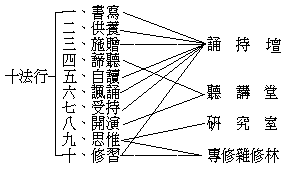

# 佛教教育系統各級課程表
（（法舫編次）（見海刊第十三卷十期））

## 目錄

- 甲　普通教理
- 乙　高等教理
    - （一）法性般若學專修三年課程
    - （二）法相唯識學專修三年課程
    - （三）法相華嚴學專修三年課程
    - （四）法性天台學專修三年課程
- 丙　專修雜修林
- 丁　附錄
    - （一）國民教育基礎上之僧教育系統表
    - （二）南海佛學苑課程表
    - （三）慈恩宗寺課程表
        - （甲）普通科
        - （乙）專修科
    - （四）佛學女眾院課程表
        - （甲）預科二年
        - （乙）普通科四年


## 甲　普通教理


```
　　　　┌─┬────────────────────────────────┐
　　　　│第│一、佛教研究法　（附）因明大綱　聲明略　　　　　　　　　　　　　│
　　　　│一│二、印度中華及各國佛教史　（附）佛教地理志　　　　　　　　　　　│
　　　　│年│三、佛教各宗派源流　佛學概論　（附）各家佛學概論大綱　　　　　　│
　　　　│概│四、解深密經　（附）理趣般若經　佛說決定義經　　　　　　　　　　│
　　　　│論│　　　　　　　　　　　　　　　　　　　　　　　　　　　　　　　　│
　　　　└─┴────────────────────────────────┘
　　　　┌─┬────────────────────────────────┐
　　　　│第│一、雜阿含經緣起誦　（附）奘譯本事經　隋譯起世因本經　　　　　　│
　　　　│二│二、十誦戒本羯磨　（附）菩薩戒本羯磨　善見律毘婆沙　　　　　　　│
　　　　│年│三、俱舍論　（附）毘曇雜心論　成實論　品類足論千問品　異部宗輪論│
　　　　│共│四、禪密要法經　（附）宋譯妙法聖念處經　　　　　　　　　　　　　│
　　　　│教│　　　　　　　　　　　　　　　　　　　　　　　　　　　　　　　　│
　　　　└─┴────────────────────────────────┘
　　　　┌─┬─┬─┬────────────────────────────┐
　　　　│　│上│大│　　　　　　　　　　　　　　　　　　　　　　　　　　　　│
　　　　│第│半│乘│一、大般若經第五分　（附）第二分　　　　　　　　　　　　│
　　　　│　│年│慧│二、大智度論初品　（附）中論　六祖壇經　　　　　　　　　│
　　　　│　│　│觀│　　　　　　　　　　　　　　　　　　　　　　　　　　　　│
　　　　│三├─┼─┼────────────────────────────┤
　　　　│　│下│大│　　　　　　　　　　　　　　　　　　　　　　　　　　　　│
　　　　│　│半│乘│一、楞伽經　（附）勝鬘經　密嚴經　　　　　　　　　　　　│
　　　　│年│年│境│二、集論　攝大乘論　（附）辨中邊論　瑜伽菩薩地　　　　　│
　　　　│　│　│相│　　　　　　　　　　　　　　　　　　　　　　　　　　　　│
　　　　└─┴─┴─┴────────────────────────────┘
　　　　┌─┬─┬─┬────────────────────────────┐
　　　　│　│上│大│一、華嚴經十地品　（附）十住毘婆沙論　十地經論　佛地經論│
　　　　│第│半│乘│二、妙法蓮華經　　　　　　　　　　　　　　　　　　　　　│
　　　　│　│年│行│三、大涅槃經迦葉品　　　　　　　　　　　　　　　　　　　│
　　　　│　│　│果│　　　　　　　　　　　　　　　　　　　　　　　　　　　　│
　　　　│四├─┼─┼────────────────────────────┤
　　　　│　│下│大│一、寶積經無量壽會　（附）淨土三經及論　　　　　　　　　│
　　　　│　│半│乘│二、彌勒上生經　（附）下生經　藥師經　十方淨土經　　　　│
　　　　│年│年│方│三、大日經住心品　金剛頂經　蘇悉地經　（附）十住心論　顯│
　　　　│　│　│便│　　密二教論　　　　　　　　　　　　　　　　　　　　　　│
　　　　└─┴─┴─┴────────────────────────────┘
```


## 乙　高等教理


```
　　　　　　┌法性般若學　　│　　　　┌教乘次第系
　　　　四學┤法相唯識學　　│　　二系┤
　　　　　　│法相華嚴學　　│　　　　└教宗歷史系
　　　　　　└法性天台學　　│
```


### 　　（一）法性般若學專修三年課程


```
　　　　┌───┬─────┬──┬───┬──┬───┬──┬───┬──┐
　　　　│半月半│誦　持　壇│每日│聽講堂│每日│研究室│每日│博覽部│每日│
　　　　│月誦戒│　　　　　│三時│　　　│二時│　　　│三時│　　　│二時│
　　　　├───┼─────┴──┼───┴──┼───┴──┼───┴──┤
　　　　│誦　經│般若經全（一年）│︵︵掌珍論　│掌珍論及疏　│大乘四論玄義│
　　　　├───┴────────┤握聽十二門論│十二門論及疏│　大乘義章　│
　　　　│正行─趺坐恭誦─每日二時│其︶掌珍論疏│十二門論宗致│二諦章　五十│
　　　　│　　┌一　禮拜┐　　　　│宗︵三論玄義│義記　　　　│問答　三論遊│
　　　　│　　│二　稱讚│　　　　│要參十二門論│肇論及諸疏　│意　法華論疏│
　　　　│加行┤三　供養├每日半時│︶閱疏聽講錄│法性宗明綱論│　法華經遊意│
　　　　│　　│四　發願│　　　　│　︶（半年）│（半年）　　│　三論略章　│
　　　　│　　│五　懺悔┘　　　　│　　　　　　│　　　　　　│大乘玄論　維│
　　　　│　　└六　書寫─每日半時│　　　　　　│　　　　　　│摩經注　起信│
　　　　│　　　　　　　　　　　　│　　　　　　│　　　　　　│論慧遠疏　　│
　　　　│　　　　　　　　　　　　│　　　　　　│　　　　　　│華嚴、維摩、│
　　　　│　　　　　　　　　　　　│　　　　　　│　　　　　　│勝鬘、金光明│
　　　　│　　　　　　　　　　　　│　　　　　　│　　　　　　│、無量壽、彌│
　　　　│　　　　　　　　　　　　│　　　　　　│　　　　　　│勒、大般若、│
　　　　│　　　　　　　　　　　　│　　　　　　│　　　　　　│金剛、仁王、│
　　　　│　　　　　　　　　　　　│　　　　　　│　　　　　　│法華、涅槃諸│
　　　　│　　　　　　　　　　　　│　　　　　　│　　　　　　│經，關於吉藏│
　　　　│　　　　　　　　　　　　│　　　　　　│　　　　　　│、慧遠之玄疏│
　　　　│　　　　　　　　　　　　│　　　　　　│　　　　　　│。　　　　　│
　　　　│　　　　　　　　　　　　│　　　　　　│　　　　　　│（半年）　　│
　　　　├──┬─────────┼──────┼──────┼──────┤
　　　　│誦法│大寶積經　　　　　│︵︵　　　　│中論青目釋　│天台宗、禪宗│
　　　　│加行│大集經　　　　　　│究聽中論青目│大乘中觀論釋│、華嚴宗、律│
　　　　│如前│勝鬘　楞伽　密嚴　│其︶釋　　　│中論嘉祥疏　│宗、淨土宗、│
　　　　│　　│淨土　金光明　維摩│精︵般若燈論│十八空論　　│東密、藏密宗│
　　　　│　　│詰等諸方等經　　　│微參釋　　　│大乘破有論　│各主要著述。│
　　　　│　　│（一年）　　　　　│︶閱大乘中觀│（一年）　　│無著、天親關│
　　　　│　　│　　　　　　　　　│　︶論釋　　│　　　　　　│於金剛及般若│
　　　　│　　│　　　　　　　　　│　　中論嘉祥│　　　　　　│諸論。　　　│
　　　　│　　│　　　　　　　　　│　　疏　　　│　　　　　　│文殊師利問菩│
　　　　│　　│　　　　　　　　　│　　（一年）│　　　　　　│提經　聖佛母│
　　　　│　　│　　　　　　　　　│　　　　　　│　　　　　　│般若波羅密多│
　　　　│　　│　　　　　　　　　│　　　　　　│　　　　　　│九頌精義論　│
　　　　│　　│　　　　　　　　　│　　　　　　│　　　　　　│佛母般若波羅│
　　　　│　　│　　　　　　　　　│　　　　　　│　　　　　　│密多圓集要義│
　　　　│　　│　　　　　　　　　│　　　　　　│　　　　　　│論　破取著不│
　　　　│　　│　　　　　　　　　│　　　　　　│　　　　　　│壞假名論　　│
　　　　│　　│　　　　　　　　　│　　　　　　│　　　　　　│（一年）　　│
　　　　├──┼─────────┼──────┼──────┼──────┤
　　　　│同　│法華經　　　　　　│︵︵　　　　│大智度論　　│阿毘達磨集論│
　　　　│　　│華嚴經　　　　　　│極聽大智度論│菩提資糧論　│瑜伽師地論及│
　　　　│前　│涅槃經　　　　　　│其︶　　　　│十住毘婆沙論│記　　　　　│
　　　　│　　│大日經等　　　　　│廣︵十住毘婆│壹輸盧迦論　│辨中邊論　攝│
　　　　│　　│（半年）　　　　　│大參沙論　　│菩提行經　　│論無著世親釋│
　　　　│　　│　　　　　　　　　│︶閱菩提資糧│六十頌如理論│成唯識論及記│
　　　　│　　│　　　　　　　　　│　︶論釋　　│大乘二十論　│佛性論　　　│
　　　　│　　│　　　　　　　　　│　　（一年）│（一年）　　│佛地經論　　│
　　　　│　　│　　　　　　　　　│　　　　　　│　　　　　　│十地經論及義│
　　　　│　　│　　　　　　　　　│　　　　　　│　　　　　　│記　　　　　│
　　　　│　　│　　　　　　　　　│　　　　　　│　　　　　　│（一年）　　│
　　　　├──┼─────────┼──────┼──────┼──────┤
　　　　│同　│四阿含律藏　　　　│︵︵　　　　│百論及疏　廣│因明論及疏　│
　　　　│　　│（半年）　　　　　│巧聽百論婆藪│百論　百字論│佛教歷史　　│
　　　　│前　│　　　　　　　　　│其︶釋　　　│大丈夫論　破│印度外道　　│
　　　　│　　│　　　　　　　　　│應︵廣百論及│外道小乘四宗│中國哲學　　│
　　　　│　　│　　　　　　　　　│用參釋　　　│論　楞伽破小│西洋哲學　　│
　　　　│　　│　　　　　　　　　│︶閱百論疏　│乘外道涅槃論│科學大綱　　│
　　　　│　　│　　　　　　　　　│　︶（半年）│方便心論　迴│各教大綱　　│
　　　　│　　│　　　　　　　　　│　　　　　　│諍論　成實論│世界史綱　　│
　　　　│　　│　　　　　　　　　│　　　　　　│俱舍論　宗輪│法性宗文學　│
　　　　│　　│　　　　　　　　　│　　　　　　│論及記　龍樹│（半年）　　│
　　　　│　　│　　　　　　　　　│　　　　　　│菩薩傳　提婆│　　　　　　│
　　　　│　　│　　　　　　　　　│　　　　　　│菩薩傳　　　│　　　　　　│
　　　　│　　│　　　　　　　　　│　　　　　　│（半年）　　│　　　　　　│
　　　　└──┴─────────┴──────┴──────┴──────┘
```


### 　　（二）法相唯識學專修三年課程


```
　　　　┌────┬─────┬──┬────┬──┬────┬──┬────┐
　　　　│半月半　│　　　　　│　　│　　　　│　　│　　　　│　　│　　　　│
　　　　│月誦戒　│誦　持　壇│每日│聽講堂　│每日│研究室　│每日│博覽部　│
　　　　├────┤　　　　　│二時│　　　　│三時│　　　　│二時│　　　　│
　　　　│每日三時│　　　　　│　　│　　　　│　　│　　　　│　　│　　　　│
　　　　├────┼─────┼──┴────┼──┴────┼──┴────┤
　　　　│每日誦二│（半年）　│（半年）　　　│（半年）　　　│（半年）　　　│
　　　　│時每經誦│深密經五譯│因明入正理論　│同上各部　　　│大乘法苑義林章│
　　　　│二遍書寫│楞伽經三譯│集論　　　　　│因明正理門論　│及補闕、抉擇記│
　　　　│半小時禮│勝鬘經　　│百法論　　　　│如實論反質難品│、栖翫記。　　│
　　　　│拜稱讚供│密嚴經　　│因明大疏　　　│因明義斷、纂要│判比量論　三支│
　　　　│養發願懺│華嚴經八十│︵雜集論　　　│、續疏文軌疏、│比量義抄　八囀│
　　　　│悔共半小│一卷　　　│參五蘊論　　　│前記、後記、略│聲義　六離合釋│
　　　　│時　　　│佛地經　　│閱廣五蘊論　　│抄、雜集論述記│　聲明略　近人│
　　　　│　　　　│彌勒上生經│︶百法論基註　│百法論疏與顯幽│關於因明、集論│
　　　　│　　　　│彌勒下生經│　　　　　　　│抄　　　　　　│、五蘊、百法之│
　　　　│　　　　│四譯　　　│　　　　　　　│　　　　　　　│著述。　　　　│
　　　　│　　　　│彌勒所問經│　　　　　　　│　　　　　　　│　　　　　　　│
　　　　│　　　　│二譯　　　│　　　　　　　│　　　　　　　│　　　　　　　│
　　　　├──┬─┴─────┼───────┼───────┼───────┤
　　　　│同前│（一年）　　　│（一年）　　　│（一年）　　　│（一年）　　　│
　　　　│每經│大寶積經　　　│顯揚聖教論　　│三無性論　　　│彌勒菩薩所問經│
　　　　│誦一│大集經　　　　│︵　　　　　　│顯識論　　　　│論　　　　　　│
　　　　│遍　│淨土諸經　　　│參瑜伽師地論及│轉識論　　　　│大寶積經論　　│
　　　　│　　│其他諸方等經　│閱釋　　　　　│瑜伽略纂及倫記│六門教授習定論│
　　　　│　　│　　　　　　　│︶　　　　　　│與劫章頌　　　│發菩提心經論　│
　　　　│　　│　　　　　　　│　　　　　　　│十地經論　　　│菩薩地持經　　│
　　　　│　　│　　　　　　　│　　　　　　　│佛地經論　　　│決定藏論　　　│
　　　　│　　│　　　　　　　│　　　　　　　│　　　　　　　│王法正理論　　│
　　　　│　　│　　　　　　　│　　　　　　　│　　　　　　　│寶髻經論　　　│
　　　　│　　│　　　　　　　│　　　　　　　│　　　　　　　│轉法輪經論　　│
　　　　│　　│　　　　　　　│　　　　　　　│　　　　　　　│三具足經論　　│
　　　　│　　│　　　　　　　│　　　　　　　│　　　　　　　│勝思惟梵天所問│
　　　　│　　│　　　　　　　│　　　　　　　│　　　　　　　│經論　　　　　│
　　　　│　　│　　　　　　　│　　　　　　　│　　　　　　　│遺教經論　　　│
　　　　│　　│　　　　　　　│　　　　　　　│　　　　　　　│取因假設論　　│
　　　　│　　│　　　　　　　│　　　　　　　│　　　　　　　│觀總相論頌　　│
　　　　│　　│　　　　　　　│　　　　　　　│　　　　　　　│掌中論　　　　│
　　　　│　　│　　　　　　　│　　　　　　　│　　　　　　　│解捲論　　　　│
　　　　├──┼───────┼───────┼───────┼───────┤
　　　　│同　│（一年）　　　│（半年）　　　│（半年）　　　│（半年）　　　│
　　　　│　　│般若諸經　　　│辨中邊論　　　│同上各部　　　│彌勒、無著、天│
　　　　│前　│法華諸經　　　│攝大乘論本　　│大乘經莊嚴論　│親關於金剛及般│
　　　　│　　│涅槃諸經　　　│︵攝論本梁譯魏│佛性論　　　　│若諸論。　　　│
　　　　│　　│密部諸經　　　│參譯　　　　　│中邊分別論疏　│天親法華、涅槃│
　　　　│　　│　　　　　　　│　攝論世親無性│能顯中邊慧日論│、淨土等諸論。│
　　　　│　　│　　　　　　　│　釋　　　　　│究竟一乘寶性論│天台、華嚴、禪│
　　　　│　　│　　　　　　　│　攝論梁譯世親│勸發菩提心集　│宗、律宗、東密│
　　　　│　　│　　　　　　　│閱釋　　　　　│大乘入道次第章│、藏密、淨土諸│
　　　　│　　│　　　　　　　│︶辨中邊論述記│近人關於中邊論│宗各主要著述。│
　　　　│　　│　　　　　　　│　中邊分別論　│攝論之著述　　│窺基關於法華、│
　　　　│　　│　　　　　　　│　　　　　　　│　　　　　　　│金剛、心經等各│
　　　　│　　│　　　　　　　│　　　　　　　│　　　　　　　│贊述。　　　　│
　　　　├──┼───────┼───────┼───────┼───────┤
　　　　│同　│（半年）　　　│（一年）　　　│（一年）　　　│（半年）　　　│
　　　　│　　│四阿含經　　　│成唯識論　　　│同上各部　　　│中論釋　　　　│
　　　　│前　│律　　藏　　　│︵成唯識論述記│了義燈及記　　│大乘中觀論釋　│
　　　　│　　│　　　　　　　│參成唯識料簡及│唯識演祕及釋　│大智度論　　　│
　　　　│　　│　　　　　　　│　別抄　　　　│唯識義蘊及義演│俱舍論及光記寶│
　　　　│　　│　　　　　　　│　唯識掌中樞要│成唯識註及學記│疏等　　　　　│
　　　　│　　│　　　　　　　│　二十唯識論及│疏抄　　　　　│宗輪論及記　　│
　　　　│　　│　　　　　　　│　記成唯識寶生│魏譯大乘唯識論│寶上名數論　　│
　　　　│　　│　　　　　　　│閱論觀所緣緣論│大乘成業論　　│集大乘相論　　│
　　　　│　　│　　　　　　　│︶及釋　　　　│業成就論　　　├───────┤
　　　　│　　│　　　　　　　│　　　　　　　│無相思塵論　　│（半年）　　　│
　　　　│　　│　　　　　　　│　　　　　　　│近人關於三、十│大唐西域記　　│
　　　　│　　│　　　　　　　│　　　　　　　│二十唯識論、及│大慈恩三藏傳　│
　　　　│　　│　　　　　　　│　　　　　　　│所緣緣論、八識│三藏師資傳叢書│
　　　　│　　│　　　　　　　│　　　　　　　│規矩頌各註　　│佛教歷史　　　│
　　　　│　　│　　　　　　　│　　　　　　　│　　　　　　　│印度外道　　　│
　　　　│　　│　　　　　　　│　　　　　　　│　　　　　　　│中國哲學　　　│
　　　　│　　│　　　　　　　│　　　　　　　│　　　　　　　│西洋哲學　　　│
　　　　│　　│　　　　　　　│　　　　　　　│　　　　　　　│科學大綱　　　│
　　　　│　　│　　　　　　　│　　　　　　　│　　　　　　　│各教大綱　　　│
　　　　│　　│　　　　　　　│　　　　　　　│　　　　　　　│世界史綱　　　│
　　　　│　　│　　　　　　　│　　　　　　　│　　　　　　　│慈恩師資文學　│
　　　　└──┴───────┴───────┴───────┴───────┘
```


### 　　（三）法相華嚴學專修三年課程


```
　　　　┌───┬──┬─────┬──┬───┬──┬───┬──┬───┐
　　　　│半月半│每日│誦　持　壇│每日│聽講堂│每日│研究室│每日│博覽部│
　　　　│月誦戒│三時│　　　　　│二時│　　　│三時│　　　│二時│　　　│
　　　　├───┼──┴─────┼──┴───┼──┴───┼──┴───┤
　　　　│每日誦│（一年）　　　　│（一年）　　│（一年）　　│（一年）　　│
　　　　│二時每│四阿含經　　　　│因明入正理論│同上各部　　│近人關於因明│
　　　　│經一遍│小大乘律　　　　│大乘百法論　│十二門論疏　│著述　　　　│
　　　　│書寫半│般若諸經　　　　│十二門論　　│成唯識論述記│三論玄義　　│
　　　　│小時　│深密五譯　　　　│二十唯識論　│攝大乘論梁魏│中論及疏　　│
　　　　│禮拜稱│楞伽三譯　　　　│三十唯識論　│譯本及釋　　│百論及疏　　│
　　　　│讚供養│勝鬘　　　　　　│攝大乘論　　│隋唐宋人關於│唯識料簡　　│
　　　　│發願懺│密嚴　　　　　　│起信論　　　│起信論之著述│唯識別抄　　│
　　　　│悔共半│佛地　　　　　　│︵因明基疏　│　　　　　　│唯識樞要　　│
　　　　│小時　│　　　　　　　　│參百法基註　│　　　　　　│八識規矩頌註│
　　　　│　　　│　　　　　　　　│　十二門論宗│　　　　　　│攝大乘論近人│
　　　　│　　　│　　　　　　　　│　致義記　　│　　　　　　│著述　　　　│
　　　　│　　　│　　　　　　　　│　二十唯識論│　　　　　　│俱舍論　　　│
　　　　│　　　│　　　　　　　　│　釋大乘論世│　　　　　　│元明清以至近│
　　　　│　　　│　　　　　　　　│　親無性釋　│　　　　　　│人關於起信論│
　　　　│　　　│　　　　　　　　│閱起信論義記│　　　　　　│之著述　　　│
　　　　│　　　│　　　　　　　　│︶別記　　　│　　　　　　│　　　　　　│
　　　　├───┼────────┼──────┼──────┼──────┤
　　　　│　同　│（一年）　　　　│（半年）　　│（半年）　　│（半年）　　│
　　　　│　　　│大寶積　　大集　│十地經論　　│同上各部　　│辨中邊論　　│
　　　　│　前　│淨土諸經　　　　│︵十住毘婆沙│瑜伽師地論及│佛性論　　　│
　　　　│　　　│方等諸經　　　　│參論　　　　│纂要　　　　│寶性論　　　│
　　　　│　　　│法華諸經　　　　│閱瑜伽菩薩地│大乘法界無差│大智度論　　│
　　　　│　　　│涅槃諸經　　　　│︶佛地經論　│別論　　　　│瑜伽倫記　　│
　　　　│　　　│密部諸經　　　　│　　　　　　│　　　　　　│法界無差別論│
　　　　│　　　│　　　　　　　　│　　　　　　│　　　　　　│疏鈔　　　　│
　　　　├───┼────────┼──────┼──────┼──────┤
　　　　│　　　│　　　　　　　　│（半年）　　│（半年）　　│（半年）　　│
　　　　│　　　│　　　　　　　　│一乘教義章　│同上各部　　│宋元明清以至│
　　　　│　　　│　　　　　　　　│圓覺經　　　│宋人關於教義│近人關於此宗│
　　　　│　　　│　　　　　　　　│︵華嚴玄談疏│章之著述　　│一切之著述，│
　　　　│　　　│　　　　　　　　│參鈔　　　　│除華嚴經疏外│例五教儀等。│
　　　　│　　　│　　　　　　　　│閱圓覺經疏鈔│，若杜順十玄│宋人關於圓覺│
　　　　│　　　│　　　　　　　　│︶　　　　　│門，智儼孔目│之著述。　　│
　　　　│　　　│　　　　　　　　│　　　　　　│章等，華嚴五│華嚴、圓覺等│
　　　　│　　　│　　　　　　　　│　　　　　　│祖各著述。　│各修證儀，　│
　　　　│　　　│　　　　　　　　│　　　　　　│心經略疏及記│盂蘭盆疏儀。│
　　　　│　　　│　　　　　　　　│　　　　　　│與金剛論疏纂│　　　　　　│
　　　　│　　　│　　　　　　　　│　　　　　　│要。　　　　│　　　　　　│
　　　　├───┼────────┼──────┼──────┼──────┤
　　　　│同前　│（一年）　　　　│（一年）　　│（一年）　　│（半年）　　│
　　　　│每經　│六十華嚴　　　　│華嚴經　　　│同上　　　　│異部宗輪論　│
　　　　│各誦　│八十華嚴　　　　│︵　　　　　│華嚴搜玄記　│八宗綱要。　│
　　　　│四遍　│四十華嚴　　　　│參清涼疏鈔　│華嚴探玄記　│天台宗、禪宗│
　　　　│　　　│兜沙至圓覺各經　│閱　　　　　│魏靈辨、隋吉│、律宗、淨土│
　　　　│　　　│　　　　　　　　│︶　　　　　│藏、唐李通玄│宗、東密、藏│
　　　　│　　　│　　　　　　　　│　　　　　　│等，以至宋元│密各主要著述│
　　　　│　　　│　　　　　　　　│　　　　　　│明清人關於華│。唐宋來天台│
　　　　│　　　│　　　　　　　　│　　　　　　│嚴經文之著述│宗對於華嚴宗│
　　　　│　　　│　　　　　　　　│　　　　　　│。　　　　　│相辨諸著述。│
　　　　│　　　│　　　　　　　　│　　　　　　│　　　　　　├──────┤
　　　　│　　　│　　　　　　　　│　　　　　　│　　　　　　│（半年）　　│
　　　　│　　　│　　　　　　　　│　　　　　　│　　　　　　│華嚴宗各傳記│
　　　　│　　　│　　　　　　　　│　　　　　　│　　　　　　│佛教歷史　　│
　　　　│　　　│　　　　　　　　│　　　　　　│　　　　　　│印度外道　　│
　　　　│　　　│　　　　　　　　│　　　　　　│　　　　　　│中國哲學　　│
　　　　│　　　│　　　　　　　　│　　　　　　│　　　　　　│西洋哲學　　│
　　　　│　　　│　　　　　　　　│　　　　　　│　　　　　　│科學大綱　　│
　　　　│　　　│　　　　　　　　│　　　　　　│　　　　　　│各教大綱　　│
　　　　│　　　│　　　　　　　　│　　　　　　│　　　　　　│世界史綱　　│
　　　　│　　　│　　　　　　　　│　　　　　　│　　　　　　│華嚴宗文學　│
　　　　└───┴────────┴──────┴──────┴──────┘
```


### 　　（四）法性天台學專修三年課程


```
　　　　┌────┬─────┬──┬────┬──┬────┬──┬────┐
　　　　│半月半　│　　　　　│　　│　　　　│　　│　　　　│　　│　　　　│
　　　　│月誦戒　│誦　持　壇│每日│聽講堂　│每日│研究室　│每日│博覽部　│
　　　　├────┤　　　　　│二時│　　　　│三時│　　　　│二時│　　　　│
　　　　│每日三時│　　　　　│　　│　　　　│　　│　　　　│　　│　　　　│
　　　　├────┼─────┼──┴────┼──┴────┼──┴────┤
　　　　│每日誦二│（半年）　│（半年）　　　│（半年）　　　│（半年）　　　│
　　　　│時每經誦│華嚴部諸經│中論青目釋　　│同上各部　　　│十二門論疏及宗│
　　　　│一遍書寫│　　　　　│三十唯識論　　│三論玄義　　　│致記　　　　　│
　　　　│半小時禮│　　　　　│︵中論吉疏　　│唯識料簡　　　│百論及疏　　　│
　　　　│拜稱讚供│　　　　　│參唯識心要　　│二十唯識論　　│俱舍論　　　　│
　　　　│養發願懺│　　　　　│閱相宗八要直解│　　　　　　　│　　　　　　　│
　　　　│悔共半小│　　　　　│︶　　　　　　│　　　　　　　│　　　　　　　│
　　　　│時　　　│　　　　　│　　　　　　　│　　　　　　　│　　　　　　　│
　　　　├──┬─┴─────┼───────┼───────┼───────┤
　　　　│同　│（半年）　　　│（一年）　　　│（半年）　　　│（一年）　　　│
　　　　│　　│大小乘律　　　│大智度論　　　│同上二部　　　│攝論世親釋　　│
　　　　│前　│四阿含經　　　│︵　　　　　　│十住毘婆沙論　│佛性論　　　　│
　　　　│　　│　　　　　　　│參成實論　　　│十地經論　　　│瑜伽論及倫記　│
　　　　│　　│　　　　　　　│閱　　　　　　│起信論裂網疏　│　　　　　　　│
　　　　│　　│　　　　　　　│︶　　　　　　│仁王智者疏　　│　　　　　　　│
　　　　│　　│　　　　　　　│　　　　　　　│金剛智者蕅益疏│　　　　　　　│
　　　　├──┼───────┼───────┼───────┼───────┤
　　　　│同　│（一年）　　　│（半年）　　　│（一年）　　　│（半年）　　　│
　　　　│　　│大寶積經　　　│四教義　　　　│同上各部　　　│關於金剛錍五百│
　　　　│前　│大集經　　　　│︵天台八教大意│十不二門各書　│問釋疑等天台宗│
　　　　│　　│方等諸經　　　│參天台四教儀及│法界次第初門　│與他宗辨論書　│
　　　　│　　│密部諸經　　　│　集註　　　　│四念處　　　　│關於宋山家山外│
　　　　│　　│　　　　　　　│　四教儀輔宏記│三觀義　　　　│辨論書　　　　│
　　　　│　　│　　　　　　　│　教觀綱宗釋義│六即義　　　　│關於南岳天台修│
　　　　│　　│　　　　　　　│　記　　　　　│性善惡論　　　│止觀禪行觀心發│
　　　　│　　│　　　　　　　│　天台宗大意　│大乘止觀法門　│願諸書及注　　│
　　　　│　　│　　　　　　　│　始終心要及註│摩訶止觀　　　│智者至蕅益戒義│
　　　　│　　│　　　　　　　│閱三千有門頌及│　　　　　　　│諸書　法華等天│
　　　　│　　│　　　　　　　│︶解　　　　　│　　　　　　　│台宗懺儀　　　│
　　　　│　　│　　　　　　　│　　　　　　　│　　　　　　　│其他宋明清人有│
　　　　│　　│　　　　　　　│　　　　　　　│　　　　　　　│關天台宗義之著│
　　　　│　　│　　　　　　　│　　　　　　　│　　　　　　　│述　　　　　　│
　　　　├──┼───────┼───────┼───────┼───────┤
　　　　│同　│（半年）　　　│（一年）　　　│（一年）　　　│（半年）　　　│
　　　　│　　│般若諸經（除第│法華經　　　　│同上各部　　　│華嚴、東密、藏│
　　　　│前　│一分）　　　　│大涅槃經　　　│唐宋元明清天台│密、禪宗、律宗│
　　　　│　　│　　　　　　　│︵法華玄義文句│宗人關於涅槃法│、淨土宗各主要│
　　　　│　　│　　　　　　　│參涅槃音義及疏│華疏注　　　　│著述。　　　　│
　　　　│　　│　　　　　　　│　涅槃釋義文句│智者以來天台宗│華嚴、慈恩、禪│
　　　　│　　│　　　　　　　│　記　　　　　│人關於金光明、│宗對天台宗辨論│
　　　　│　　│　　　　　　　│閱觀音玄義及記│維摩、觀無量壽│各書。　　　　│
　　　　│　　│　　　　　　　│︶法華安樂行義│、彌陀、圓覺、│宗輪論及記　　│
　　　　│　　│　　　　　　　│　　　　　　　│楞嚴、楞伽等諸│　　　　　　　│
　　　　│　　│　　　　　　　│　　　　　　　│經註解。　　　│　　　　　　　│
　　　　│　　│　　　　　　　│　　　　　　　│　　　　　　　│　　　　　　　│
　　　　├──┼───────┼───────┼───────┼───────┤
　　　　│同前│（半年）　　　│　　　　　　　│　　　　　　　│（半年）　　　│
　　　　│每經│法華部五十八卷│　　　　　　　│　　　　　　　│天台各傳記　　│
　　　　│二遍│涅槃部一二一卷│　　　　　　　│　　　　　　　│佛祖統記　　　│
　　　　│　　│　　　　　　　│　　　　　　　│　　　　　　　│天台各規制　　│
　　　　│　　│　　　　　　　│　　　　　　　│　　　　　　　│天台宗文學　　│
　　　　│　　│　　　　　　　│　　　　　　　│　　　　　　　│佛教歷史　　　│
　　　　│　　│　　　　　　　│　　　　　　　│　　　　　　　│印度哲學　　　│
　　　　│　　│　　　　　　　│　　　　　　　│　　　　　　　│中國哲學　　　│
　　　　│　　│　　　　　　　│　　　　　　　│　　　　　　　│西洋哲學　　　│
　　　　│　　│　　　　　　　│　　　　　　　│　　　　　　　│科學大綱　　　│
　　　　│　　│　　　　　　　│　　　　　　　│　　　　　　　│各教大綱　　　│
　　　　│　　│　　　　　　　│　　　　　　　│　　　　　　　│世界史綱　　　│
　　　　└──┴───────┴───────┴───────┴───────┘
```


## 丙　專修雜修林


```
　　　　　　┌戒善行………近住戒至佛戒
　　　　四行┤禪觀行………調息禪至禪宗
　　　　　　│真言行………諸尊無量真言
　　　　　　└淨土行………十方無量淨土
```


四學二系四行依十法行之組織，如下：




二系四行之課章表，容後程訂。

## 丁　附錄

### 　　（一）國民教育基礎上之僧教育系統表

從全國有六千小學生，辦到全國有二百參學僧，即達到僧教育之目的矣。歷程共計二十四年


```
　　　　┌─┬────┐二
　　　　│　│修律︵參│〇
　　　　│僧│習禪三學│〇
　　　　│　│一淨年處│
　　　　│　│年密︶　│一
　　　　│　├────┴┐六
　　　　│　│教各分　高│〇
　　　　│　│理種別︵等│〇
　　　　│　│觀專研三教│
　　　　│　│行門習年理│
　　　　│　│　　　︶院│三
　　　　│教├─────┴┐一
　　　　│　│四三二初　普│二
　　　　│　│年年年年︵通│〇
　　　　│　│大大三五四教│〇
　　　　│　│乘乘乘乘年理│
　　　　│　│行相共共︶院│
　　　　│　│果性教教　　│六
　　　　│　├──────┴┐一
　　　　│　│　　　比沙　律│八
　　　　│　│　　　丘彌︵　│〇
　　　　│育│　　　律律三儀│〇
　　　　│　│　　　年年年　│
　　　　│　│　　　半半︶院│九
　　　　├─┼───────┴┐三
　　　　│　│　　　　學每　高│〇
　　　　│國│　　　　　週︵級│〇
　　　　│　│　　　　　加十三│〇
　　　　│　│師　職中　四八年│
　　　　│　│　　　　　點歲　│一
　　　　│　│範　業　　佛︶　│五
　　　　│　│　　　　────┴┐三
　　　　│　│　學　學　　學每初│六
　　　　│　│　　　　　　　週級│〇
　　　　│　│　　　　　　　加三│〇
　　　　│民│　校　校　　　三年│
　　　　│　│　　　　　　　點　│一
　　　　│　│　　　　　　　佛　│八
　　　　│　├─────────┴┐四
　　　　│　│　　　　　　　學每高│八
　　　　│　│　　　　　　　　週級│〇
　　　　│教│　小　　　　　　加三│〇
　　　　│　│　　　　　　　　二年│
　　　　│　│　　　　　　　　點　│二
　　　　│　│　　　　　　　　佛　│四
　　　　│　│　學　　──────┴┐六
　　　　│　│　　　　　　佛佛每︵初│〇
　　　　│　│　　　　　　學學週七級│〇
　　　　│　│　　　　　　教用加齡三│〇
　　　　│育│　校　　　　科善一入年│
　　　　│　│　　　　　　書因點學　│
　　　　│　│　　　　　　　本鐘︶　│
　　　　└─┴───────────┘
```


### 　　（二）南海佛學苑課程表 [1]


```
　　　　┌─┬────────────────────────────────┐
　　　　│第│（經）佛本生經　大乘本生心地觀經　　　　　　　　　　　　　　　　│
　　　　│一│　　　　　　　　　　　　　　　　　　　　　　　　　　　　　　　　│
　　　　│年│（律）優婆塞戒經　淨心誡觀法　沙彌律儀　　　　　　　　　　　　　│
　　　　│五│　　　　　　　　　　　　　　　　　　　　　　　　　　　　　　　　│
　　　　│乘│（論）馬鳴莊嚴經論　本生鬘論　佛學概論　五蘊論　百法論　六離合釋│
　　　　│共│　　　　　　　　　　　　　　　　　　　　　　　　　　　　　　　　│
　　　　│教│（史文）宗派源流　選讀國文　　　　　　　　　　　　　　　　　　　│
　　　　├─┼────────────────────────────────┤
　　　　│第│（經）雜阿含經緣起誦　四十二章經　遺教經　　　　　　　　　　　　│
　　　　│二│　　　　　　　　　　　　　　　　　　　　　　　　　　　　　　　　│
　　　　│年│（律）四分律　　　　　　　　　　　　　　　　　　　　　　　　　　│
　　　　│三│　　　　　　　　　　　　　　　　　　　　　　　　　　　　　　　　│
　　　　│乘│（論）俱舍論頌註　異部宗輪論　因明入正理論　攝大乘論　　　　　　│
　　　　│共│　　　　　　　　　　　　　　　　　　　　　　　　　　　　　　　　│
　　　　│教│（史文）印度佛教史　選讀國文　　　　　　　　　　　　　　　　　　│
　　　　├─┼────────────────────────────────┤
　　　　│第│（經）楞伽經　如來藏經　解深密經　大般若經第五分　　　　　　　　│
　　　　│三│　　　　　　　　　　　　　　　　　　　　　　　　　　　　　　　　│
　　　　│年│（律）瑜伽菩薩戒本　及研究律論　　　　　　　　　　　　　　　　　│
　　　　│大│　　　　　　　　　　　　　　　　　　　　　　　　　　　　　　　　│
　　　　│乘│（論）集論　二十唯識論　觀所緣緣論　辯中邊論　十二門論　中論　三│
　　　　│相│　　　十唯識論　　　　　　　　　　　　　　　　　　　　　　　　　│
　　　　│性│（史文）中國佛教史　選學國民常識　　　　　　　　　　　　　　　　│
　　　　├─┼────────────────────────────────┤
　　　　│第│（經）華嚴離世間品　法華經　涅槃迦葉品　無量壽會　彌勒上下生經　│
　　　　│四│　　　大日住心品　　　　　　　　　　　　　　　　　　　　　　　　│
　　　　│年│（律）梵網經　整理僧制論　研究律藏　　　　　　　　　　　　　　　│
　　　　│大│　　　　　　　　　　　　　　　　　　　　　　　　　　　　　　　　│
　　　　│乘│（論）大乘莊嚴論　涅槃論　十地論　法華論　淨土論　　　　　　　　│
　　　　│行│　　　　　　　　　　　　　　　　　　　　　　　　　　　　　　　　│
　　　　│果│（史文）各地佛教史　選學世界常識　　　　　　　　　　　　　　　　│
　　　　└─┴────────────────────────────────┘
```


### 　　（三）慈恩宗寺課程表

#### 　　　　（甲）普通科


```
　　　　┌─┬───────────────────┬────────────┐
　　　　│　│　　　聽　講　（在聞慧堂）　　　　　　│　研究（在思慧堂）　　　│
　　　　│第│（經）佛本生經　地藏經　　　　　　　　│提謂經　孛經　賢愚因緣經│
　　　　│一│　　　　　　　　　　　　　　　　　　　│　玉耶女經　百喻經　王所│
　　　　│年│　　　　　　　　　　　　　　　　　　　│問經等　　　　　　　　　│
　　　　│五│（律）十誦律　沙彌律儀　　　　　　　　│優婆塞戒經　瓔珞本業經等│
　　　　│乘│　　　　　　　　　　　　　　　　　　　│　　　　　　　　　　　　│
　　　　│共│（論）馬鳴莊嚴經論　五蘊論　百法論　六│五蘊、百法諸疏及聲明略等│
　　　　│教│　　　離合釋　　　　　　　　　　　　　│　　　　　　　　　　　　│
　　　　│　│（史文）印度佛教史　選讀隋唐文　　　　│關於佛傳及印度之佛教史傳│
　　　　│　│　　　　　　　　　　　　　　　　　　　│等　　　　　　　　　　　│
　　　　└─┴───────────────────┴────────────┘
　　　　┌─┬───────────────────┬────────────┐
　　　　│第│（經）雜阿含經緣起誦　四十二章經　遺教│阿含經　正法念處經等　　│
　　　　│二│　　　經　　　　　　　　　　　　　　　│　　　　　　　　　　　　│
　　　　│年│（律）四分律　　　　　　　　　　　　　│毘奈耶雜事等　　　　　　│
　　　　│三│　　　　　　　　　　　　　　　　　　　│　　　　　　　　　　　　│
　　　　│乘│（論）俱舍論頌　異部宗輪論　因明入正理│俱舍論　成實論　因明諸疏│
　　　　│共│　　　論　　　　　　　　　　　　　　　│等　　　　　　　　　　　│
　　　　│教│（史文）支那佛教史　選讀六朝文　　　　│關於支那之佛教史傳等　　│
　　　　└─┴───────────────────┴────────────┘
　　　　┌─┬───────────────────┬────────────┐
　　　　│第│（經）楞伽經　如來藏經　勝鬘經　大般若│大集　寶積　般若等經　　│
　　　　│三│　　　經第五分　　　　　　　　　　　　│　　　　　　　　　　　　│
　　　　│年│（律）五分律　　　　　　　　　　　　　│明了論等　　　　　　　　│
　　　　│大│　　　　　　　　　　　　　　　　　　　│　　　　　　　　　　　　│
　　　　│乘│（論）集論　二十唯識論　觀所緣緣論　八│雜集論疏　中論　大智度論│
　　　　│相│　　　識規矩頌　十二門論　　　　　　　│金剛經論等　　　　　　　│
　　　　│性│（史文）西藏、日本等各地佛教史　選讀魏│關於世界佛教地理及各地佛│
　　　　│　│　　　　晉文　　　　　　　　　　　　　│教史傳等　　　　　　　　│
　　　　└─┴───────────────────┴────────────┘
　　　　┌─┬───────────────────┬────────────┐
　　　　│第│（經）華嚴離世間品　法華經　彌勒上下生│華嚴　涅槃　淨密諸經　　│
　　　　│四│　　　涅槃迦葉品　無量壽　大日住心品　│　　　　　　　　　　　　│
　　　　│年│（律）僧祇律　　　　　　　　　　　　　│菩薩藏經　梵網經等　　　│
　　　　│大│　　　　　　　　　　　　　　　　　　　│　　　　　　　　　　　　│
　　　　│乘│（論）大乘經莊嚴論　涅槃論　法華論　淨│十住毘婆沙論　佛性論　菩│
　　　　│行│　　　土論　　　　　　　　　　　　　　│提論等　　　　　　　　　│
　　　　│果│（史文）慈恩傳　西域記　本宗略史　　　│關於本宗一切史傳　　　　│
　　　　└─┴───────────────────┴────────────┘
```


#### 　　　　（乙）專修科


```
　　　　┌─┬─────────────┬───────────────┐
　　　　│　│　　　聽　講　（在聞慧堂）│　　　　研　究（在思慧堂）　　│
　　　　│第│解深密經　厚嚴經　　　　　│法苑義林章等　　　　　　　　　│
　　　　│一│　　　　　　　　　　　　　│　　　　　　　　　　　　　　　│
　　　　│年│十地經論　佛地經論　　　　│　　　　　　　　　　　　　　　│
　　　　│究│　　　　　　　　　　　　　│　　　　　　　　　　　　　　　│
　　　　│其│辨中邊論　顯揚聖教論　　　│　　　　修　習（在修慧堂）　　│
　　　　│本│　　　　　　　　　　　　　│　　　　　　　　　　　　　　　│
　　　　│依│攝大乘論　世親無性釋　　　│百法無我觀（從第一年到第三年）│
　　　　└─┴─────────────┴───────────────┘
　　　　┌─┬─────────────┬───────────────┐
　　　　│第│　　　聽　講　　　　　　　│　　　　研　究　　　　　　　　│
　　　　│二│　　　　　　　　　　　　　│　　　　　　　　　　　　　　　│
　　　　│年│瑜伽師地論　　　　　　　　│基纂倫記等　　　　　　　　　　│
　　　　│窮│　　　　　　　　　　　　　│　　　　　　　　　　　　　　　│
　　　　│其│　　　　　　　　　　　　　│　　　　修　習　　　　　　　　│
　　　　│深│　　　　　　　　　　　　　│　　　　　　　　　　　　　　　│
　　　　│廣│　　　　　　　　　　　　　│四尋思引四如實智觀　　　　　　│
　　　　├─┼─────────────┼───────────────┤
　　　　│第│　　　聽　講　　　　　　　│　　　　研　究　　　　　　　　│
　　　　│三│　　　　　　　　　　　　　│　　　　　　　　　　　　　　　│
　　　　│年│成唯識論述記　　　　　　　│料簡　樞要　別抄　了義燈　演祕│
　　　　│握│　　　　　　　　　　　　　│義演　義蘊　唯識義章　觀心覺夢│
　　　　│其│　　　　　　　　　　　　　│鈔等　　　　　　　　　　　　　│
　　　　│宗│　　　　　　　　　　　　　│　　　　修　習　　　　　　　　│
　　　　│要│　　　　　　　　　　　　　│五重唯識觀　　　　　　　　　　│
　　　　└─┴─────────────┴───────────────┘
```


### 　　（四）佛學女眾院課程表

#### 　　　　（甲）預科二年


```
　　　　┌─┬─────────────────────────────┐
　　　　│第│（經）賢愚因緣經百喻經　　　　　　　　　　　　　　　　　　│
　　　　│一│（律）在家律要　　　　　　　　　　　　　　　　　　　　　　│
　　　　│年│（論）善因編佛教中學課本一二編上下　　　　　　　　　　　　│
　　　　│　│（文史）選讀佛教國文及善女人傳　　　　　　　　　　　　　　│
　　　　└─┴─────────────────────────────┘
　　　　┌─┬─────────────────────────────┐
　　　　│第│（經）佛本生經　　　　　　　　　　　　　　　　　　　　　　│
　　　　│二│（律）在家律要　　　　　　　　　　　　　　　　　　　　　　│
　　　　│年│（論）馬鳴莊嚴經論　　　　　　　　　　　　　　　　　　　　│
　　　　│　│（文史）選讀佛教國文及比丘尼傳　　　　　　　　　　　　　　│
　　　　└─┴─────────────────────────────┘
```


#### 　　　　（乙）普通科四年


```
　　　　┌─┬─────────────────────────────┐
　　　　│第│（經）大乘本生心地觀經　　　　　　　　　　　　　　　　　　│
　　　　│一│（律）沙彌律儀　淨心誡觀法　　　　　　　　　　　　　　　　│
　　　　│年│（論）佛學概論　五蘊論　百法論　因明略　　　　　　　　　　│
　　　　│　│（文史）選讀佛教國文及宗派源流　　　　　　　　　　　　　　│
　　　　└─┴─────────────────────────────┘
　　　　┌─┬─────────────────────────────┐
　　　　│第│（經）四十二章經　遺教經　雜阿含緣起誦　　　　　　　　　　│
　　　　│二│（律）四分律　　　　　　　　　　　　　　　　　　　　　　　│
　　　　│年│（論）俱舍頌　異部宗輪論　因明入正理　攝大乘論　　　　　　│
　　　　│　│（文史）印度佛教史　選讀佛教國文　　　　　　　　　　　　　│
　　　　└─┴─────────────────────────────┘
　　　　┌─┬─────────────────────────────┐
　　　　│第│（經）楞伽經　如來藏經　解深密經　大般若第五分　　　　　　│
　　　　│三│（律）瑜伽戒本及研究各律論　　　　　　　　　　　　　　　　│
　　　　│年│（論）集論　辨中邊論　二十唯識　三十唯識論　十二門論　中論│
　　　　│　│（史）中國佛教史及選學國民常識　　　　　　　　　　　　　　│
　　　　└─┴─────────────────────────────┘
　　　　┌─┬─────────────────────────────┐
　　　　│第│（經）華嚴離世間品　法華經　涅槃迦葉品　無量壽會　彌勒上生│
　　　　│　│　　　大日住心　　　　　　　　　　　　　　　　　　　　　　│
　　　　│四│（律）梵網　整理僧制論　及研究律藏　　　　　　　　　　　　│
　　　　│　│（論）大乘莊嚴論　十地論　法華論　涅槃論　淨土論　　　　　│
　　　　│年│（史）各地佛教史及選學世界常識　　　　　　　　　　　　　　│
　　　　└─┴─────────────────────────────┘
```


## 註釋

- [1]：原見海刊十三卷四期，第十期改稱「佛教中學修學課程表」
