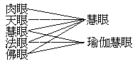

# 研究佛學之目的及方法
（──十八年冬月在世界佛學院研究部講──）

──十八年冬月在世界佛學院研究部講──

研究佛學以何為目的？又以何種方法能達到此目的？目的，就是自利利他，在自利利他中所得到的三德。


```
　　　　　　　　　　　　　　　　　　　　　　　┌─真實愚
　　　　自利─┐　┌─斷德…………所斷之本在─┤
　　　　　　　├─┼─智德　　　　　　　　　　└─異熟愚
　　　　利他─┘　└─恩德
```


斷德、即是平常所謂了生脫死，單屬自利。以平常人皆畏死，死了不能斷滅又要生，死死生生，總斷不了死苦。以死了不能斷滅又要生，生了又要受種種生苦。以生而有死，又不得不死，因為苟延此死，遂造貪、瞋、癡、殺、盜、淫，起種種的煩惱，致成更加增盛的生死苦，於是六時中所感覺的無一不是苦了。此苦皆基於死苦，由死而逼迫身心，流轉不已。以有此死苦，我們想作一種永久的功德，就不能即身成功；一死之後，生前所作的點點功德，全盤拋棄。世人要想得到自利上的要求，因為有死苦的逼迫，都不能夠。要解除種種逼迫的苦，實為人之大目的。如世人所求所作，無一不是由苦而動：如腹覺飢苦，就要去作食，身感寒苦，就要去謀衣，為避風雨虎狼等苦，就要去構舍造屋，感覺自己欲望不滿足的苦，就要起革命。大家若無死苦的逼迫，慢慢的總可想一種好的方法來解除他；可是、不久又要死了！在世人之種種的救濟方法，所謂頭痛醫頭，足痛醫足，日日調護免死，可是終久要死！

上來是謂世人不得解除此死苦的方法。依佛法上言，現在要解脫此苦，得永久的安樂，就要由了生而得脫死。如何了生？進一步觀，此死苦果何而來耶？倘若是上帝造的，或自然生的，那就無法去解脫他了！依佛法講，也不是上帝造，也不是自然生，乃由因緣和合而生；以是觀十二緣起支，就可為解脫此死苦的方法了。以無明、業、愛、取、有、而有生死，此「有」直接取「生」的力量有限，故不久即死。有者，能有後來生了又死之苦果者，如地中穀種經愛取水土的滋養，已發出芽頭，而尚未出生地面。不久、就生長出來了。識、名色、六入、觸、受種，由業攝植滋助，成感生死種。此業由無明所發，即吾人現前第六識心上之二種無明：一、真實愚，二、異熟愚。真實愚、謂對于諸法的真實相不能明了，即是不了生空法空。不明眾生緣生性空而起人我執，不明諸法亦由眾緣生故空無自性而起法執。有此愚故，對于諸法真實之理不明、曰愚。平常所謂了生脫死，就是要了知「生」之真實相。所謂緣生性空，是說從眾緣所生之人生宇宙，本來空無自性，若爾、更何死之可得？我們既見到無死，亦即不想種種之下劣方法來苟延生命了。異熟愚、謂不明業報之身心世界，是由前之無明業等而成的異熟，而妄於此中執我執法，曰異熟愚。有此二種無明，即發有漏業，招生死等苦。以由此二種無明斷故，不發有限業、招有限生，若有限之生無、則限盡之死亦無，而生死之不斷，即是於有限生上起有限心，造有限業之所致。能將此二種無明變為二明，即是了生；以了生故，則死自脫。真能了知眾緣所生，若人若法之性空實相，即可解脫死苦，名曰斷德。此德在小乘阿羅漢等，但脫分段死，曰擇滅涅槃，單屬自利。若究竟得脫分段、變易二死者，唯佛果，所謂無住涅槃；即是將無明、有漏等苦，滅除乾乾淨淨，得到永遠真正圓滿的安樂，曰涅槃。

智德可通二利，與斷、恩德有密切之關係。智為能斷之智，能夠了知生相，解脫死苦，得永久的安樂，皆由智德。而在自利上，亦通本後二智，以在能斷執障上說，皆名自利智，然能斷所知障之智，即能利他。能斷所知障者，謂對于世出世應當了知的諸法相性而能了知。法華經云：佛之知見，而開示有情皆令悟入，即是利他智。若于眾生無大悲心，則唯自利，而不能得成此利他智。然大乘菩薩、在初發心時，即非為自己而求安樂，是為大乘之不共智。

恩德之立場、在大悲大願，以己能成利他智故，能盡未來際利樂眾生，永遠為眾生作一切恩德。謂自己能解脫一切苦，復能盡知諸法實相、開示眾生，令解脫一切苦，所謂恩被群品。若未得佛智，即非恩德。雖菩薩度生，猶以利他成自利。

研究佛學所要達到的目的，就是自利利他的三德。要成就此三德，就要發大悲大願之大乘菩提心，所謂因果相應。若根本上無大悲心，無論如何亦不能達到此目的。縱得小乘涅槃，不過斷、智二德的少分。從佛所說的一切學說，曰佛學。斷障證果，是很長的一條路，不是一天能走得到的。現在研究佛學所要達到的最近目的是什麼？此目的有三種：一、正見如眼，二、正信如手，三、正戒如足。人有手足，就可以活動作事，取物行路；若無眼，取物行路必遭危險，以致傷身失命。由正見而生正信、正戒，信無正見、則成見取；戒無正見、則成戒取；見不正，即成身見、邊見、邪見。我們現在身心所現行的皆是迷執，不可依他來求正見，必須依佛菩薩得正見以後所說的聖教──三藏教典，由研究此聖教來成就我們的正見。正見成就後，正信、正戒自然成就。正見即是眼，眼有五種：一、肉眼，二、天眼，三、慧眼，四、法眼，五、佛眼，瑜伽攝為二眼：




世間平常人作事，依肉眼去見。天眼是定中所成功的，對于除異熟愚亦可有益，然對于究竟解脫生死苦上，則無助。肉眼助平常作一切事，雖有益，然不但求不到究竟安樂，往往反而造煩惱業，增生死苦。天眼在天以下之異熟報上，雖稍能明白，而在天之本報上，仍不能夠明白。那末、此二眼當然不能依他來除生死苦了。證得二空無相真如，曰慧眼。能見諸法之無量差別，曰法眼。對于宇宙萬有，一時普及，一切即一，一即一切，差別無量，無量差別，同時而見，曰佛眼。此三眼，以無漏清淨慧為體。我們現在所有者，唯肉眼，若依此眼去作事，反增染業；天眼又未得到，即或得到亦不能達到了脫生死苦的目的。慧眼、在小乘初果，大乘初地始得。佛眼、八地菩薩方得。法眼分二種：一、至教法眼，二、自證法眼。至教法眼，由聞思慧研究三藏聖教，成就自己之理解，所謂虛心受教，即聞成就。由聞而思，再加以定等修習，即成就正見。有此正見，即可自利利他。十信、十住、十行、十向、四加行諸位，皆依此至教法眼；不爾、就如盲人騎瞎馬，其害無窮矣！自證法眼，亦初地方得。我們現在急要成就者，即法眼中至教法眼之一分，是曰「正法眼藏」；此「正法眼」、具一切佛學之正法無漏功德，曰「藏」。我們要達到此至教法眼的正見，依正見為自利利他之基本。依佛法論，正見未得，雖然自利利他，其實是自害害他。

研究佛學的方法，依涅槃經略出四種為標準：一、依法不依人，二、依義不依語，三、依了義不依不了義，四、依智不依識。


```
　　　　　　　　　　　　　　　　　　　┌─語
　　　　　　　┌────至教────法┤　　┌─了義　┐
　　　　佛法─┤　　　　　　　　　　　└─義┤　　　　├識
　　　　　　　│　　　　　　　　　　　　　　└─不了義┘
　　　　　　　└───────自證──────────────智
```


依法不依人者：法、謂一切法之本來真實相。當依持正法，苟于正法不合，就是佛說的亦在所不從；因為、魔王亦可現佛身而說法。現在研究佛法，亦當要依翻譯來的經論為標準；因為經是佛言，西域各大師造論，皆根據佛說之經而造的。中國諸師，往往多臆說，故不可依為正量。依義不依語者：能詮所詮皆是法。又、能詮是語，所詮是義；實有其事曰義，但有言說曰語。同是一語，不應當固執其語就決定是對的，當進觀其所詮的義，以義實語，勿執語取義。依了義不依不了義者：究竟顯了，謂之了義。同是一義，更須觀其究竟不究竟，顯了不顯了。佛陀說法，如對人治病，應症與藥，不必凡是佛說的、皆可執為究竟了義，亦有不了義的，是故盲從者非是。依智不依識者：謂四加行以前所修，皆是依諸佛至人共同所證所說之教義，所謂似文、似義、似言，乃至觀空、仍是識變；要依能證真如二空智者所說之法為依，勿隨情識之說。又當求入真見道，依自真智，勿依於思識分別。

佛法傳到中國幾千年，大德代出，分鏕揚化，各樹門庭；然所造論，不似印度諸師根據堅確，條例精嚴，每本自意取喻一時。故我們不要在宗派上著手，而直接從印度所譯來之經律與論去著手研究，先明依法不依人；所依之法、是諸佛聖人共證共說之法，欲依此法、必須從佛及菩薩等所說經律論為根本，如是研究圓滿，方有正見，而後以抉擇中國古德各宗派之所說；對于古德之宗派明白了解，復對於外學加以研究，即成為濟度一切眾生之無量方便法門矣。

（紹奘記）（見海刊十卷十二期）

