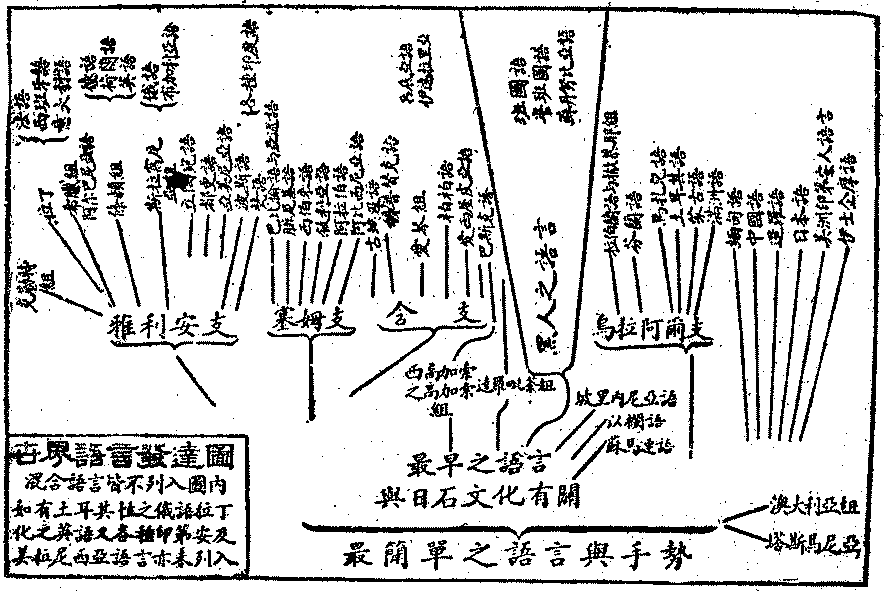

# 第三節　聲明略說

## 目錄

- 一　聲明概說
- 二　梵文與聲明
- 三　何謂名句文身
- 四　文及文身
- 五　名及名身
- 六　字界字緣
- 七　蘇漫多聲
- 八　底彥多聲
- 九　名句間之六合釋
- 十　聲明之用與體


## 一　聲明概說

聲明即語言文字學，文字根於語言，語言本乎聲韻，故以明語言文字之學曰聲明。語言文字為有情類情意想念互相交通之具，猶身器交通之道路及舟車也。未成語言之前，固嘗先有聲勢、容勢──手勢面容等──等以互表情想。一群之同類者，習熟聲音曲屈之趣，世代相傳而語言起。未成文字之前，固嘗先有結繩、圖象等以相持意念，一群之同類者，習熟形聲契合之趣──單文及字母，即為形之符號或聲之符號──，世代相傳而文字起。演而益進，語文蔚興。亦猶椎輪大輅，踵為汽車。語言如點，功在暫親表示；文字如線，功在遞久傳持。語言如身運足行路，文字如身乘舟致遠。非語言文字，則自心眾心無以相涉歷而通恕。恕者推眾心如自心，比自心如眾心，即為推比之所由起。欲由推比而求決知，語言文字之為必要工具，亦不亞於數學，故曰有名為物之母也。然語言文字，不限於人類，佛本行經說六十四種書──書即語文之學──：梵天所傳書，佉盧瑟吒書，富沙迦羅書，阿迦羅書，瞢伽羅書（上五皆印度古語文學），邪寐尼書（希臘拉丁系語文學），盎瞿梨書，邪那尼伽書，娑伽羅書，波羅尼書，波流沙書，父與書，毗多荼書，陀毗荼國書（達羅毗荼系語文學），脂羅低書（楔形文字），度其差那婆多書，優波伽書，僧佉書，阿婆勿陀書，阿󰂐盧摩書，毗寐奢羅書，阿陀羅多書（烏拉阿爾系語文學），珂沙書（失勒或勒特系文語），脂那國書（中國文語），摩那書，末荼叉羅書，毗多悉底書，富數波書，提婆書（天語），那伽書（龍語），夜叉書（鬼神語），乾闥婆書（鬼神語），阿修羅書（神語），迦樓羅書（妙翅鳥語），緊那羅書（疑人語），摩睺羅伽書（神蛇語），彌伽遮迦書（諸獸語），迦迦婁多書（諸鳥語），浮摩地婆書（地居天語），安多梨叉提婆書（空居天語），鬱多羅拘盧書（他星球人語），逋婁婆毘提訶書（他星球人語），西瞿耶尼書（他星球人語），烏差婆書，膩差波書，娑伽羅書，跋闍羅書，梨伽波羅低黎伽書，毗棄多書，阿󰂐浮多書，奢婆多羅跋多書，伽那那跋多書，優差波跋多書，尼差婆跋多書，波陀梨佉書，毗拘多羅波陀那地書，邪婆陀書，多羅書，末荼婆哂尼書，梨沙耶婆多波慘比多書（仙語），陀羅尼卑叉梨書（地質史），伽伽那卑麗叉尼書（天體史），薩蒲沙地尼山陀書（生物史），沙羅僧伽阿尼書（諸書總覽），薩婆婁多書（一切種音）。其在提婆書以下之三十六種，大抵非此地球人類之語言文字也。在此地球人類各種文字，據傳略分三式：一、右行式，梵文及西洋文屬之；二、左行式，印度之佉盧書，或他州族有之；三、下行式，中國文字屬之。是中所傳此人間之語文，雖莫詳其分系，對觀今世通行之語文學，亦可髣彿見之。茲錄韋爾斯所著人類語言表以為參考。其所列者，皆屬各民族之單純語系。混合語言，未列屬焉。




此中各族之語言文字學，今不專論，而語言文字之統一，實為今而后人類之需要。察地球之大勢，華文系、梵文系、及英文系三，為最廣流行語系。取此為經，參以各族文語為緯，織成一地球之語錦，為今世語言文字學者之鴻業。英文由希臘拉丁文孳乳而生；華文之起頗早，始於象形，繼以指事、諧聲、會意、版圖擴大，多族同化，集各方語文，互相轉注而殺其有餘，藉遞代語文，因應假借而補其不足，所謂六書，即六種依語言而製文字之方法所製成之文字也。凡各文字，皆有聲韻、形體、意義之三方面。說文解字、爾雅韻府等，為研究之專門書，近世戴、段、錢、王、俞、章之考證學，集其大成，茲難具述，惟略言佛陀學根柢之梵文耳。

## 二　梵文與聲明

印度古代文字，通名「梵書」──巴利文等通俗梵文，亦梵文之支流──，俗傳是劫初梵王造，謂有百萬頌釋。今可考之聲明古籍，當推六吠陀分中論字源──梵云尼祿多──等書，作者為耶斯迦。其書中雖傳有古作家迦多婆之名──即舊傳之迦單設羅仙，略古聲明為萬二千頌者──，今亦無考。後、梵語於吠陀語外，別成一種「雅語」。二千四百年前大語學者波尼儞出，整理雅語，遂為聲明別闢一新時期。如定字母為四十七，別為字母各聲，虛實諸詞，囀聲各異，十羅三世，秩序井然。凡此大端，皆為後來語學者之所本，今略舉其著作如次。

後之三種，為前一種補充遺義之作。波氏以後作者，大多從事注釋，其略如次：二千二百年前，迦多耶也那作本經之釋文，略為千二百四十五則。二千一百年前，缽填闍梨作大婆沙，約為千一百十三則；此書現存，義淨傳為朱彌有二十四千頌者是也。自後作者中絕，凡數百年。一千六百年前，旃陀羅作二二四章記論，別成一派。一千四百年前，闍耶佚底與縛摩那共作迦尸迦頌，義淨傳為蘇呾囉中最妙有十八千頌者是也。稍後、伐緻訶黎作伐緻訶黎論，二十五千頌，釋大婆沙薄迦論七百頌，敘聖教量及比量蓽拏頌三千頌。時護法論師作蓽拏頌釋十四千頌，又作雜寶聲明論二萬五千頌，為梵文雅語最究竟之作。自後印度別行俗語法，則精嚴稍遜前矣，亦印度文化衰落之徵也。此為梵文學之略史。佛陀學將古代學術，總分五科，謂之五明──梵語播遮吠陀──，猶云五種之科學也。學者習之，自記論始──記論，梵云毗阿羯刺拏，即舊傳毗伽羅論──。記論乃分別聲韻，訓釋文例者，近於今所謂文典等，為研習他種學術之基礎。佛學中始明此學曰聲明。次因明，則論理學也。次醫明，則醫藥學也。次工巧明，則算學及人間實際應用諸學皆是──若農、工、政、法等，觀華嚴經善財所聞自在主說可知──。西域記謂印度開蒙誘進，先遵循十二章；七歲之後，漸授五明大論，一曰聲明云云。則聲明者，猶近代考證學者所云之小學是也。佛陀學傳華後，翻譯至於唐代，精嚴遂臻其極。章句之間，往往存梵文之形式。不習聲明，即時苦其詰屈難讀。兼以辨別主賓，應知囀聲之例；審定名義，必從離合之方；毫釐之差，不厭研覈。惜聲明之學，唐賢傳譯未詳備，後之學者無所依據。今則轉藉歐譯，稍便尋究，然猶不易言也。

## 三　何謂名句文身

詮表單事、單義之單名曰名，若中國字典、辭典所列之各字、各辭；二個名字以上，聚寫一處，則曰名身──梵云那摩迦耶──，或多名身。綴二名以上，詮表彼事義與此事義關係者之一辭曰句，例云「人死」或「人皆有死」等；二個名辭以上，聚寫一處，則曰句身──梵云缽陀迦耶──，或多句身。不詮事義而但為附麗聲音曲屈之符號者曰文，亦曰字母，例ａｂｃｄ等；佛陀學中或賦與玄密之意義，非其本也。二個字母以上，聚寫一處，則曰文身，或多文身──梵云便繕那迦耶。便繕那，原義為鹽等，故舊譯味──。中國文字，有名而無字母，此與西洋文及梵文異者。而梵文之有字母，則與西洋文同也。身者、聚也，意顯聚集多名說多名物，聚集多句說多句意，聚集多文表多聲韻，故謂之身。然文身仍為文而非名、句，名身亦仍為名而非文、句，句身亦仍為句而非名、文，其界不相混也。推名、句之所依，乃及文身，故置後說。若循學習之序，應曰文、名、句身。先學字母，乃及字母拼成之名，名綴成之句故。亦有以「文」為成篇之文章者，非其本義。瑜伽說聲明處有六種施設建立相：一曰法，謂名身、句身、文身，及不鄙陋、輕易、雄朗、相應、義善之五德相應聲，以聲為體，文、名、句是聲上音韻屈曲之用，體用兼彰，則為名、句、文、聲四法。二曰義，謂十種義：根、大種、業、尋求、非法、法、興盛、衰損、受用、守護。又六種義：自性、因、果、作用、差別、轉。三曰補特伽羅──數取趣，有情或人也──，謂建立男、女、非男非女聲相差別，或復初、中、上士聲相差別。四曰時，謂三時聲相差別：過去過去殊勝，未來未來殊勝，現在現在殊勝。五曰數，謂三數聲相：一數、二數、多數。六曰處所根栽，處所謂相續、名號、總略、彼益、宣說，五皆諸聲明本籍中品名，故謂為處所。根栽謂界頌等，及論字之為餘義所根者。是六相者，概括一切能詮所詮差盡，聲明所明，要不外是。然第二義相，屬一切所詮，遍餘明處；聲明正屬能詮，故當就第一法相、第二補特伽羅相等五相以論之。此言名句文身，正是第一法相，亦是聲明之總相也。下之所論，不出於此。

## 四　文及文身

辨文身音韻及拼法者，及悉曇章。西域記謂童蒙所習，在五明論之外；寄歸傳則視為聲明五論之一。真言宗傳中國之後，以須意觀梵字，口誦梵音之故，辨字音之悉曇，成為專學。古今著述，頗有能詳盡者。悉曇、譯云成就，乃寫字母時用為篇首之標章，表學之有所成就之吉祥意者。後人因寫字母先韻後聲，韻母前即標悉曇，遂誤悉曇為字母，寖假而用為字母之總稱。故諸學者，常舉悉曇字母──梵云悉曇摩呾理迦──為言，而於論字母連綴聲音轉變之書，亦名為悉曇章也。舊傳字母之數，多寡不一，瑜伽則定字身為四十九。倫記引奘師云：『傳有三說：一說𧙃、阿、壹、伊、鄔、烏、紇、呂、紇、閭、呂、𦟐、污、隩，為十四韻別，加闇惡為助句辭，超聲有八，毗聲有二十五，加標首之悉曇，為四十九。一說悉曇但是總標，不入字數，別加濫時鮔意，餘同。一說韻有十六，闇惡亦入韻數，餘同』。涅槃經文字品，說三十五字為聲母，十四字為韻母，故共四十九字。然按華譯涅槃有五十字，中一「羅」字，係疊聲之濫入，故唯四十九字為定。字母分為韻──梵云摩多──、聲──梵云毗衍闍南──之二。其間部別煩複，波尼儞之所分別者，其目如次：


```
　　　　　　　　　　┌單韻𧙃等
　　　　　　　　┌韻┤複韻㖶等
　　　　　　　　│　└半韻也等
　　　　一切字母┤　┌喉聲迦等────┐
　　　　　　　　│　│顎聲者等　　　　│
　　　　　　　　└聲┤舌聲吒等　　　　├捨沙婆呵
　　　　　　　　　　│齒聲䫂等　　　　│
　　　　　　　　　　└唇聲跛等────┘
```


或別聲為七類：一迦等五，二者等五，三吒等五，四䫂等五，五跛等五，六也等四，七捨等四，依此分類，表列古今所譯字音如左：


```
　　　　┌────┬────┬─────┬──────┐
　　　　│聲韻分類│奘師傳者│涅槃經者　│近人譯者　　│
　　　　├─┬──┼────┼─────┼──────┤
　　　　│　│　　│𧙃　　　│短阿　　　│阿　　　　　│
　　　　│　│單　│　　　　│　　　　　│　　阿　　　│
　　　　│韻│　　│阿　　　│長阿　　　│阿　　　　　│
　　　　│　│　　│　　　　│　　　　　│　　　　　　│
　　　　│　│　　│壹　　　│短伊　　　│伊　　　　　│
　　　　│　│韻　│　　　　│　　　　　│　　伊　　　│
　　　　│　│　　│伊　　　│長伊　　　│伊　　　　　│
　　　　│　│　　│　　　　│　　　　　│　　　　　　│
　　　　│　│　　│鄔　　　│短憂　　　│烏　　　　　│
　　　　│　│六　│　　　　│　　　　　│　　烏　　　│
　　　　│　│　　│烏　　　│長憂　　　│烏　　　　　│
　　　　│　├──┼────┼─────┼──────┤
　　　　│　│　　│㖶　　　│㖶　　　　│厄　　　　　│
　　　　│　│複　│　　　　│　　　　　│　　厄　　　│
　　　　│　│　　│藹　　　│黳　　　　│厄　　　　　│
　　　　│　│韻　│　　　　│　　　　　│　　　　　　│
　　　　│　│　　│污　　　│烏　　　　│鄂　　　　　│
　　　　│　│四　│　　　　│　　　　　│　　鄂　　　│
　　　　│　│　　│隩　　　│炮　　　　│鄂　　　　　│
　　　　│　├──┼────┼─────┼──────┤
　　　　│　│　　│紇　　　│魯　　　　│唎　　　　　│
　　　　│　│別　│　　呂　│　　　　　│　　伊　　　│
　　　　│　│　　│紇　　　│流　　　　│唎　　　　　│
　　　　│　│韻　│　　　　│　　　　　│　　　　　　│
　　　　│　│　　│呂　　　│盧　　　　│利　　　　　│
　　　　│　│四　│　　閭　│　　　　　│　　伊　　　│
　　　　│　│　　│𦟐　　　│樓　　　　│利　　　　　│
　　　　│　├──┼────┼─────┼──────┤
　　　　│聲│隨韻│闇　　　│菴　　　　│昂　　　　　│
　　　　│　│止聲│惡　　　│疴　　　　│阿斯　　　　│
　　　　├─┼──┼────┼─────┼──────┤
　　　　│　│喉　│迦　　　│迦　　　　│嘎　　　　　│
　　　　│毗│　　│佉　　　│呿　　　　│喀　　　　　│
　　　　│　│聲　│伽　　　│伽　　　　│噶　　　　　│
　　　　│　│　　│　　　　│　　　　　│　　哈　　　│
　　　　│　│五　│鍵　　　│伽（重音）│噶　　　　　│
　　　　│　│　　│（缺）　│俄　　　　│迎阿（二合）│
　　　　│　├──┼────┼─────┼──────┤
　　　　│　│鄂　│者　　　│遮　　　　│匝　　　　　│
　　　　│　│　　│綽　　　│車　　　　│擦　　　　　│
　　　　│　│聲　│闍　　　│闍　　　　│雜　　　　　│
　　　　│　│　　│　　　　│　　　　　│　　哈　　　│
　　　　│　│五　│（缺）　│闍（重音）│雜　　　　　│
　　　　│　│　　│（缺）　│若　　　　│尼鴉（二合）│
　　　　│　├──┼────┼─────┼──────┤
　　　　│　│舌　│吒　　　│吒　　　　│查　　　　　│
　　　　│　│　　│搋　　　│佗　　　　│叉　　　　　│
　　　　│　│聲　│茶　　　│茶　　　　│楂　　　　　│
　　　　│　│　　│擇　　　│茶（重音）│楂　　　　　│
　　　　│　│五　│拏　　　│拏　　　　│那（哈）　　│
　　　　│　├──┼────┼─────┼──────┤
　　　　│　│齒　│多頁　　│多　　　　│答　　　　　│
　　　　│　│　　│他　　　│他　　　　│塔　　　　　│
　　　　│　│聲　│柁　　　│陀　　　　│達　　　　　│
　　　　│　│　　│　　　　│　　　　　│　　哈　　　│
　　　　│　│五　│達　　　│陀（重音）│達　　　　　│
　　　　│　│　　│娜　　　│那　　　　│納　　　　　│
　　　　│　├──┼────┼─────┼──────┤
　　　　│　│唇　│跛　　　│波　　　　│巴　　　　　│
　　　　│　│　　│頗　　　│頗　　　　│葩　　　　　│
　　　　│　│聲　│婆　　　│婆　　　　│拔　　　　　│
　　　　│　│　　│　　　　│　　　　　│　　哈　　　│
　　　　│聲│五　│薄　　　│婆（重音）│拔　　　　　│
　　　　│　│　　│磨　　　│摩　　　　│嘛　　　　　│
　　　　├─┼──┼────┼─────┼──────┤
　　　　│　│　　│也　　　│耶　　　　│鴉　　　　　│
　　　　│超│前　│洛　　　│囉　　　　│喇　　　　　│
　　　　│　│四　│砢　　　│羅　　　　│拉　　　　　│
　　　　│　│亦　│縛　　　│和　　　　│斡　　　　　│
　　　　│　│曰　│捨　　　│賒　　　　│沙　　　　　│
　　　　│　│半　│沙　　　│沙　　　　│卡　　　　　│
　　　　│聲│韻　│娑　　　│娑　　　　│薩　　　　　│
　　　　│　│　　│呵　　　│呵　　　　│哈　　　　　│
　　　　└─┴──┴────┴─────┴──────┘
```


若字形屈曲之寫法，古今變遷不一，近人多用提婆那伽利書，與今所傳，不無殊異。此外綴音生字之法則等，詳在悉曇字記。

## 五　名及名身

瑜伽及顯揚等，均以聲明六相為名身六依處。蓋聲明雖包括名、句、文身，而名實為主要。謂之名明，亦無不可。廓充之，若中國且合因明稱曰名學，可知「名」之關係大也。然在華文，於此乃無專著，比跡尋之，略有可述。一者、名之構造，所謂字界字緣。二者、靜詞囀變，所謂蘇漫多聲。三者、動詞轉變，所謂底彥多聲。

## 六　字界字緣

梵文名身，多有語根，及最簡單之「名」，而為「餘名」所從演繹，謂之字界，字之因也。於語根之首尾，附加單名，謂之字緣。字緣附字因後，字因原義，或變或否，乃成語幹，謂之字體。成唯識論有云：『毗助末底，是疑義故；末底、般若，義無異故』。此說主張「疑」是「慧」之一種。末底、般若，均譯為慧，以「毗字緣」，加助「末底字界」，成「毗末底」，則為「疑」義。主張字界原義不變，則疑仍為慧之一種。若主張字界原義已隨字緣而轉變，則疑非慧。辨此糾紛，在明字界、字緣，毗是字緣，末底是字界也。取譬明之，字界、字緣，皆若華文單字，例人與言；字界字緣合成字體，則若華文二字合成一辭，亦同會意之字，例「人言」之為「信」。人言固為言之一種，可仍是言，然合為信，則別指信德而非指言矣。此為二名構成一名之式。

## 七　蘇漫多聲

於字體上，更於其末聲韻變化，以表此名與他名之中介等關係，及「名」在「句」中之位次者，有八囀聲：一、體聲，梵云你利提勢，表能作者；或一事一物之當體，居句中之主位，例云「農人」。二、業聲，梵云鄔波提舍泥，表所作即動作所止，居句中之賓位，例云務農。前二汛說之詞。三、具聲，梵云羯咥唎迦囉泥，此表動作之所由藉，居句中之附加主位，例云由耕種力。此明自因。四、為聲，梵云三缽囉陀你雞，此表動作之何所為，居句中之第二賓位，例云為資生故。此明目的。五、從聲，梵云裒波陀泥，此表動作之所從來，例云從師學來。此明他緣。六、屬聲，梵云沙弭婆者你，表動作者繫屬所在，例云務農中國。此明統屬。七、依聲，梵云珊你陀那囉梯，此表動作之所依對，例云依農具等；或於田中。此明助緣。八、呼聲，梵云阿曼怛羅泥，此表所呼召者；獨舉其名，與餘無涉，故在句中為獨立格，例呼某人。今更問答明之。例如觀一農作，問曰作者誰？答曰農人。工作何事？答曰務農。用何務農？答曰由耕種力。為何務農？答曰為資生活。何能務農？答曰從師學來。務農何屬？答曰務農中國。將何務農？答曰依農具等，及於田地。爾何姓名？答曰某某。集成一文，即「農人務農，由耕種力，為資生活，依犁、田等，從師傳習，務農中國，名為某某」也。於此文中，各名關係及其位次，在梵文皆以各名之尾聲變化示其區別。察其尾聲區別，知示何種關係，居何位次，謂之囀聲──參閱瑜伽論及雜集論等──。唐譯經論，應用其八囀聲者甚多，茲不繁引。

梵語中具囀聲變化之名，皆有數目，其別凡三：一數為一言，梵云翳迦囀遮拏；二數為二言，梵云陀毗囀遮拏；三數上為多言，梵云波呼囀遮拏。此三亦以字尾囀聲為別。但歷來譯文，殊少明白標出者。但亦有時以數目差別，不能不辨者。例成唯識論解「二各二」云：『上一二字，顯兩種二：第一種悔眠二，第二種尋伺二』。蓋特嚩炎是一言之二，特嚩曳是二言之二，特嚩是多言之二。「二各二」句，上一「二」字，是一言二，則但二法。是多言二，則可多法。今此上一「二」字，是二言「二」，表有四法，故統兩種二法。前八囀聲，各以此一言、二言、多言之三囀乘之，則成二十四種囀聲。聲尾示單數、多數之區別，英文亦有，但華文則無耳。

名、代、形容等囀聲名，又有男聲──梵云蓬棱伽──，女聲──梵云尸吒唎棱伽──，中聲──梵云紇梨波棱伽，譯不分男女聲，或作非男非女聲──之別。歐文亦有此種區別，中國近亦仿之。如以他字呼男，她字呼女，牠字汛呼者是。此等雖以物之性質為別，然梵語於尾聲變化，不厭其繁。男女聲韻，長短差異，故其字體亦變為他種聲而供應用。大抵男聲尾為短韻，女聲之尾則為長韻。每四句頌，短韻長韻，相間而用，猶中國之律詩別平仄然，以聲韻為區別。故諸囀聲，皆可有此三別。唯識樞要釋成唯識謂：梵音毗若底（識），摩呾刺多（唯），悉提（成），於女聲內呼之。若用男聲，則為毗若那（識），摩呾刺（唯），悉達（成），即其例也。以茲三囀乘前二十四囀，則有七十二囀。此前三共七十二種囀聲，皆明名、代、形容諸靜詞尾聲變化者，總曰蘇漫多聲，多以蘇聲居後而成其囀聲故。且此在汎常文語中亦多用之，故基師云：『見於汎文』。

## 八　底彥多聲

梵文除介詞、助動詞、連詞等名，無聲韻變化之應用外，其餘靜詞、動詞等名字體──原名、或字界字緣合成名──，雖不變動，然每視所應表白而變其尾聲。前已明諸靜詞之囀聲矣，今更進明動詞囀聲。梵語動詞中時之區別甚繁複，波尼儞嘗舉語尾羅聲之種種，表時變化，曰十羅聲。名義如次：


```
　　　　　　　　　　┌汎說…………羅吒………汎說現作
　　　　（一）現在時┤願望…………稜…………說現願作
　　　　　　　　　　└命令…………路吒………命他現作
　　　　　　　　　　┌正過去………藍…………汎說已作
　　　　（二）過去時┤已過去………梨吒………說久已作
　　　　　　　　　　│　　　　　┌汎說………魯頞…………汎說非現時作
　　　　　　　　　　└不定過去…┤
　　　　　　　　　　　　　　　　└希求………悉囉稜………表已願作
　　　　　　　　　　　　　　　　┌汎說………魯吒…………汎說當作
　　　　　　　　　　┌單純未來…┤
　　　　（三）未來時┤　　　　　└假設過去…羅林…………假說已作實是當來
　　　　　　　　　　└複述未來…………………羅唎吒………藉餘語以顯其當作
```


此種分別，亦近希臘語系諸國文語。華譯於過去用「已」、「訖」等，未來用「當」等，命令用「應」等，願望用「願欲」等。雖甚瞭然，攝略未盡。此表時別異之動詞，亦用聲尾囀音為表，即二九韻，或十八囀聲也。先分為自而言、為他而言二種，每種有汎說、說自、說他之三種，則成六囀；每種又有一言、二言、三言之別，乃成十八囀聲。其式如次：


```
　　　　　　　┌汎說………一言………二言………多言
　　　　為自言┤說自………一言………二言………多言
　　　　　　　└說他………一言………二言………多言
　　　　　　　┌汎說………一言………二言………多言
　　　　為他言┤說自………一言………二言………多言
　　　　　　　└說他………一言………二言………多言
```


此十八囀，多以底聲居後而成其囀聲者，故曰底彥多聲。汎常文語，不甚嚴別，惟學者間取為準繩。故基師曰「則以莊嚴文句」，非謂汎文無動詞變化也。底彥多聲中為他言九韻，梵云般羅颯迷，即動詞所表動作及於他身他物者。其為自言九韻，梵云阿答末泥，即動詞所表之動作仍返於自身而止者。為他之言，汎用較多，為自之言，多用令文巧妙。文語俗雅、樸華，雖不離絕，然亦往往因之而判。又瑜伽論初、中、上士，初士梵云烏他摩補魯殺，此即汎說；中士梵云摩馱摩補魯殺，即此說他；上士梵云缽羅檀補魯殺，即此說自。初以汎說，中以說他，後乃說自。不同歐西以自名第一人，以他名第二人，以汎名第三人。先汎後自，為順序之知識；先私後公，乃顛倒之思想，此亦梵歐之一殊也。初言未辨他、自，類如小兒；次言辨他忘自，則類庸人；後言察餘明自，乃類達者，故基師以之為喻也。

## 九　名句間之六合釋

構名成句，有時還用構成之句用之若名。此名句綴合之成語，汎文之應用者殊廣，遠為歐羅巴系等文語所不及。而各有其構成之法則，因此含義周詳，可省無數繁文複韻。然譯為華文者，未能著其條例；有之、則其一部分之六合釋──梵云殺三摩娑──耳（參考法苑義林章等）。此六合釋，亦曰六離合釋，蓋欲尋一合成語句之義，當先離析以為二名或三四名，然後察其以何方式合成，定其訓釋之義。茲先列其六種方式，乃援例證成之。

前四皆為句中以前分限定後分之義者。

五、有財釋，亦云多榖。全句如一形容詞者。此多由前類合成句轉成，亦為第二次合成句。

六、相違釋，亦云對偶。句中兩名，立於平等並立之位，前分後分無關屬者。

（一）依士釋多屬第六轉聲，然亦不拘限之。例成唯識論述記云：『由抉擇所得滅，名為擇滅，由第三囀上依士釋』。梵云缽囉底僧佉耶，此云決擇；梵云尼路馱，此云滅。由決擇而得滅，合成「擇滅」之語。末用第三囀聲，故以依士釋之。（二）持業釋，句中前後分名，雖各詮其一義，然同目於一事，故亦謂之同依。前分或為名詞，或為形容詞、助動詞，例成唯識論云：『七持業釋，如藏識名，識即意故。六依主釋，如眼識等，識異意故』。意者，梵云末那，思量為義；識者，梵云毗若那諵，分別為義。曰意曰識，同目第七之用，故曰七持業識。若第六、雖同名意識，依第七意而名意識，故曰六依主釋。（三）帶數釋，等於持業，但前分為數詞而已。例云六識，七識。（四）不變釋，不變者，謂其句語無尾聲囀變，全語用如助動詞也。例云「念住」，實住定慧。若云於定慧住，屬依主釋；然不云定慧住曰念住者，念易知故，近定慧故。具足應云近於「念」之「定慧」中住；猶云近於「長安」之「終南」住。欲人易知，但曰「近長安住」，或「近念住」。「念」顯定慧所近之處，用顯住於定慧，故為助動詞而尾聲不囀，同不變釋，或引伸之曰鄰近釋。（五）有財釋，多用他語轉以形容別一名者，例云「覺者」。覺是菩提，者指佛陀，用「有菩提」形容「佛陀」，故曰覺者。或但以「覺」釋「佛」，則並所形容之一名省去，所謂以他為自，全受他稱者也。故前分末之男女、一多等囀聲，必與所形容者全相一致。義林章云：『論以唯識為所成，名成唯識論，亦有財釋』。用「成唯識」三字，為「論」字之形容，指之曰「成唯識論」；或「能有成立唯識理之用」者，故有財釋。分析其式如下：


```
　　　　︵　　　　　︵　　　　　　︵　　　　　　︵︵　　　　　　︵
　　　　名　　　　　名　　　　　　形　　　　　　一名　　　　　　一
　　　　　　毗若底　　　摩呾刺多　容　悉　　地　言　　奢薩呾羅　言
　　　　　　　　　　　　　　　　　　　　　　　　體　　　　　　　體
　　　　詞　　　　　詞　　　　　　詞　　　　　　聲詞　　　　　　聲
　　　　︶─────︶──────︶──────︶︶──────︶
　　　　　　識　　　　　唯（或量）　　　　　成　　　　　論
　　　　　　└──┬──┘　　　　　　　　　│　　　　　│
　　　　　　　　　持　　　　　　　　　　　　│　　　　　│
　　　　　　　　　業　　　　　　　　　　　　│　　　　　│
　　　　　　　　　└──────┬─────┘　　　　　│
　　　　　　　　　　　　　　　　依　　　　　　　　　　　│
　　　　　　　　　　　　　　　　主　　　　　　　　　　　│
　　　　　　　　　　　　　　　　└─────┬─────┘
　　　　　　　　　　　　　　　　　　　　　　有
　　　　　　　　　　　　　　　　　　　　　　財
```


以識即量，故持業識──或識之唯，亦依主釋──。唯識之成，故依主釋。以能「成唯識」為「論」形容詞，故有財釋。若云「成立唯識之論」，亦依主釋。蓋一語句，析之可為多釋，有財釋於「成唯識論」之句內，特為多釋中之一釋，故曰亦有財釋。（六）相違釋，並列二名以至多名，不相關屬成一語者。例云立破真似。謂能立與能破，及真能立、真能破，與似能立、似能破也。雖或不用「與」「及」等連介詞嵌入解釋之時，則同有「與」「及」等連介詞者。以六合釋本，通用於「名」「與」「句」間者也。「立破真似」亦謂之句，猶「能立與能破」之成為一句也。句及句身等構成例，近刊有阿彌陀經、楞伽經等梵文原典，當以梵文文典考其成例，茲不詳述。

## 十　聲明之用與體

聲明包舉語言文字，文字以語為根，語言之用在名、句、味──味即字母，亦即文身，乃聲音之符號──。名、句、味乃聲上屈曲音韻，聲為事體，名、句、味乃聲之「分位差別」，聲實、名句文假，故諸文語以聲為體。或曰：語言雖用耳聞，文字乃由眼見。點畫等為色之曲屈形狀，色為事體，點畫等乃色之分位差別，色實、點畫等假，故未有文字前，所聞語言以聲為體，既有文字，則聞語言音樂，或見文字圖畫，皆能解其所詮表義，故以聲、色為體。或曰：就「能詮表於義」之事以明其體，則云聲、色為體，亦但循此人間之常俗耳。聾啞者之解義，則唯以「色」為體，盲者多以聲觸為體，在旁生等，多以聲、香、味、觸為體。他有情界，或光色等，或香味等，或夢法等，皆得為體。故以「色、聲、香、味、觸、法」為體。或曰：文言有二：一者、顯義文言，色、聲、法等為體；二者、顯境文言，諸識心等為體。且色聲等即為識心之所顯境，境含現量、比量一切所知事義，將所顯為能顯，故唯以「識」為體。或曰：窮究其本，諸識分別及所分別，皆以無分別之「現量實相」為依，故皆應以現實──真如──為體。或曰：體用重重，可別論之：真如為體，識等為用；諸識為體，色等為用；色、聲等事為體，名等假位為用。不至真如，顯體不盡；不至假名，明用不周。以用顯體，依體明用，體用重重，乃能周盡，圓滿融徹，如前相對絕對之算學觀，乃為現實主義之聲明也。語言文字如此，借觀餘法亦無不然。要之，皆為現變實事，皆為現事實性，皆為現性實覺，皆為現覺實變。能知現實所用工具，還即現實而已。

